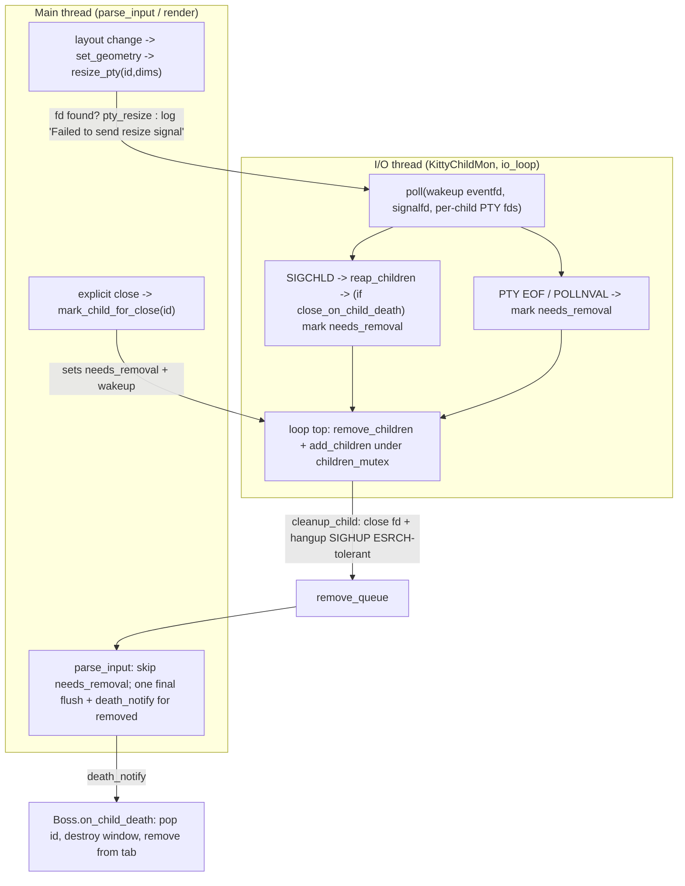

# How kitty keeps internal state consistent across rapid window create / resize / destroy

> Runtime‑verified investigation at commit `815df1e210e0a9ab4622f5c7f2d6891d7dbeddf1`.
> Every behavioural claim below is backed by (a) the exact command that produced it, (b) the actual **unedited** output, and (c) a `file:line` citation into the checked‑out source. All observations were made by building and running kitty from source in its default configuration and driving its **real** launch / new‑window / close path (`./kitty/launcher/kitty --debug-rendering`); no remote‑control or debug hook was used as the canonical observation path.

## The question

> "I want to understand how kitty keeps its internal state consistent when terminal windows appear, resize, and disappear in quick succession. When a new window is created and immediately used to run a command, resize events and signals start flowing through the system. What happens if the window is gone before everything has finished reacting to those changes? How does kitty decide what state to keep and what to discard? I am especially interested in how timing affects signal delivery and internal bookkeeping, and whether there are moments where the system has to resolve conflicting views of what is still alive. Temporary scripts may be used for observation, but the repository itself should remain unchanged and anything temporary should be cleaned up afterward."

It decomposes into five objectives, each answered in full below:

- **O1** — state consistency across the rapid create → resize → destroy lifecycle
- **O2** — reactions (resizes, signals) outrunning liveness: what happens if the window is gone before in‑flight reactions finish
- **O3** — keep‑vs‑discard: which state is retained and which is discarded during/after teardown
- **O4** — timing & signal delivery (SIGCHLD child death, SIGWINCH resize propagation) and the associated bookkeeping
- **O5** — conflicting cross‑thread views of what is still alive, and how they are resolved

---

## Direct answer (read this first)

**kitty keeps state consistent by never tearing a window down at the moment the request arrives. Instead, every teardown source only sets a single idempotent boolean, `Child.needs_removal`, and the actual removal happens at exactly one serialized place — the very top of the dedicated I/O thread's loop, under `children_mutex` (`remove_children`, `kitty/child-monitor.c:1313`, called at `kitty/child-monitor.c:1493`).** Many things can *flag* a window for death (an explicit close, a `SIGCHLD` reap, or a PTY end‑of‑file), but only one place ever *removes* it. This "many writers of a flag, one remover" design is the whole answer to how conflicting views are reconciled.

Because removal is deferred, any reaction that arrives after a window is already doomed is either a harmless no‑op or produces one specific, benign log line — never a corruption or crash:

- A **resize that loses the race** is simply dropped. On the Python side `Window.set_geometry` short‑circuits with `if self.destroyed: return` (`kitty/window.py:851`). If the window is still in the Python layout but the C layer has already removed the child, the C `resize_pty` takes `children_mutex`, fails to find the id in either the live `children` array or the pending `add_queue`, and logs `Failed to send resize signal to child with id: …` (`kitty/child-monitor.c:610`) — then returns without error. The Python caller does **not** check that return value, so it still prints its optimistic `SIGWINCH sent to child …` marker (`kitty/window.py:873`). **Both** of those lines are emitted by the **main thread**: `resize_pty` is a synchronous C call made from `set_geometry` (`kitty/window.py:863`), so the `Failed …` log at `kitty/child-monitor.c:610` runs on the caller (main) thread, not on the I/O thread. The *conflicting views* they expose are between the main thread's stale Python window-layout state (which still lists the window) and the C child-monitor's already-updated state — the dedicated I/O thread (`KittyChildMon`) had removed the child on a prior loop iteration under `children_mutex`. That cross-thread disagreement is the "conflicting liveness views" the question asks about, and it is resolved because `resize_pty` re-checks liveness under `children_mutex` and the not-found branch simply drops the resize.
- A **read to a doomed window** is skipped: the VT‑parse loop only touches children that are not flagged (`if (!scratch[i].needs_removal)`, `kitty/child-monitor.c:529`); a removed child instead gets exactly **one** final flush parse (`do_parse(..., true)`, `kitty/child-monitor.c:521`) before its `death_notify` callback fires.
- The child's **slot and screen are reclaimed** only after that final flush: `remove_children` closes the PTY fd and sends `SIGHUP` to the child's process group (tolerating `ESRCH` if it's already gone), compacts the `children[]` array, and the Python `Window.destroy` then breaks the screen's reference cycle and drops it (`del self.screen`, `kitty/window.py:1571`).

Whether state is **kept or discarded** comes down to one option and one branch: with the default `close_on_child_death=no`, a window survives its command's exit and is removed only when the PTY reaches EOF; with `--hold` the window is deliberately **kept** at a prompt after the child exits; on a normal close the window is **discarded**. We observed all three at runtime (lifetimes of `2.09s`, `5.30s`, `0.50s` for the three distinct removal triggers, and `exit=0` vs a retained window for close vs hold).

Finally, the race is **real and reproducible, not hypothetical**: driving 40 windows that are created, resized, and destroyed in quick succession produced the `Failed to send resize signal …` line **79–87 times per run across 10 identical runs (present in 10/10 runs)** — yet an AddressSanitizer/UBSan build running the exact same teardown storm reported **zero** use‑after‑free, heap‑buffer‑overflow, or undefined‑behaviour errors. The deferred single‑point removal is why the race is safe.

The rest of this document shows the commands, the raw output, and the exact code for each of these claims.

---

## Environment and exact build / invocation commands

All building and running was done in the provided Docker image (the planning host cannot compile kitty). The repository working tree was **never** modified; the build was performed against the identical commit that ships inside the image at `/app`.

```
# image (already pulled)
IMG=ghcr.io/scaleapi/swe-atlas:swe_atlas_QnA_kovidgoyal_kitty_1.0
# persistent container, working dir /app, at commit 815df1e2
docker run -d --name kitty-canon --entrypoint sleep "$IMG" infinity
```

**Checkout state of the canonical investigation tree** (the container's `/app`, which is where every build/run below was executed) — captured verbatim:

```
$ git -C /app rev-parse HEAD
815df1e210e0a9ab4622f5c7f2d6891d7dbeddf1
$ git -C /app rev-parse --abbrev-ref HEAD
HEAD
$ git -C /app status --porcelain
$
```

`git rev-parse HEAD` confirms the checkout is at exactly `815df1e210e0a9ab4622f5c7f2d6891d7dbeddf1`, the commit every `file:line` citation in this document refers to. `git rev-parse --abbrev-ref HEAD` prints `HEAD` because the image ships that commit in **detached‑HEAD** state (there is no local branch checked out); the logical source‑branch name `kitty_815df1e210e0` is what names this deliverable file, not a ref present in the build checkout. The empty `git status --porcelain` confirms the tracked tree is pristine before (and, as shown in the final cleanup section, after) the investigation.

Toolchain inside the container: Python 3.12.3, gcc 13.3.0. `<sys/signalfd.h>` is present, so the Linux `signalfd` signal path (not the macOS self‑pipe) is the one exercised here.

**Canonical build** — `make` is literally `python3 setup.py` (`Makefile:12-13`):

```
$ python3 setup.py clean >/tmp/clean.log 2>&1; echo "clean exit=$?"
clean exit=0
$ t0=$SECONDS; python3 setup.py >/tmp/build.log 2>&1; echo "build exit=$? seconds=$((SECONDS-t0)) lines=$(wc -l </tmp/build.log)"
build exit=0 seconds=45 lines=380
$ sed -n '1,3p;29,42p' /tmp/build.log        # first wayland-gen steps, then the C-compile phase
[1/28] Generating wayland-xdg-shell-client-protocol.h ...
[2/28] Generating wayland-xdg-shell-client-protocol.c ...
[3/28] Generating wayland-viewporter-client-protocol.h ...
 done
[1/122] Compiling kitty/screen.c ...
[2/122] Compiling kitty/unicode-data.c ...
[3/122] Compiling [wayland] glfw/wl_window.c ...
[4/122] Compiling [x11] glfw/x11_window.c ...
[5/122] Compiling kitty/glfw.c ...
[6/122] Compiling kitty/graphics.c ...
[7/122] Compiling kitty/child-monitor.c ...
[8/122] Compiling kitty/fonts.c ...
[9/122] Compiling kitty/shaders.c ...
[10/122] Compiling kitty/vt-parser.c ...
[11/122] Compiling kitty/vt-parser.c ...
[12/122] Compiling kitty/state.c ...
[13/122] Compiling [x11] glfw/input.c ...
$ tail -3 /tmp/build.log                     # final Go tool/kitten links
kitty/tools/cmd/tool
kitty/tools/cmd/completion
kitty/tools/cmd
$ ls -l kitty/fast_data_types.so kitty/launcher/kitty
-rwxr-xr-x 1 root 1001 1213072 Jul  6 23:37 kitty/fast_data_types.so
-rwxr-xr-x 1 root 1001   36224 Jul  6 23:37 kitty/launcher/kitty
$ ./kitty/launcher/kitty --version
kitty 0.35.2 created by Kovid Goyal
```

The build is a clean `-Werror` compile (`build exit=0`) of 380 log lines: 28 wayland‑protocol generation steps followed by 122 C‑compile/link steps (step `[7/122]` is `kitty/child-monitor.c`, the file at the centre of this investigation) and then the Go command‑line kittens. `sed`/`tail` above select the real first lines of each phase from the captured `/tmp/build.log`; every displayed line is unedited build output.

**Event‑loop instrumented build** — `make debug-event-loop` (`Makefile:25-26`):

```
$ python3 setup.py build --debug --extra-logging=event-loop >/tmp/build_evloop.log 2>&1; echo "exit=$?"
exit=0
$ stat -c '%n = %s bytes' kitty/fast_data_types.so
kitty/fast_data_types.so = 6143152 bytes
```

This target adds `-DDEBUG_EVENT_LOOP` (`setup.py:489`), which turns on the `EVDBG(...)` traces (`kitty/child-monitor.c:30`); their runtime output is shown in the O4 section below.

**Sanitizer build** — `make asan` (`Makefile:29-30`); both the extension **and** the launcher are relinked against `libasan.so.8` + `libubsan.so.1`, so ASan self‑initialises at process start and **no `LD_PRELOAD` is needed**:

```
$ python3 setup.py build --debug --sanitize >/tmp/build_asan.log 2>&1; echo "exit=$?"
exit=0
$ stat -c '%n = %s bytes' kitty/fast_data_types.so; echo "asan syms = $(nm kitty/fast_data_types.so | grep -c -i asan)"
kitty/fast_data_types.so = 20055864 bytes
asan syms = 1574
$ ldd kitty/launcher/kitty | grep -Ei 'asan|ubsan'
	libasan.so.8 => /lib/x86_64-linux-gnu/libasan.so.8 (0x00007feb4977c000)
	libubsan.so.1 => /lib/x86_64-linux-gnu/libubsan.so.1 (0x00007feb487d5000)
```

The Python floor `requires-python = ">=3.8"` (`pyproject.toml:2`) is enforced by `check_version_info` (`setup.py:30`). The Go 1.22+ toolchain builds the command‑line kittens (`tools/`) and is **not** on the window‑lifecycle / signal path, so it is out of scope for this question.

**Canonical headless invocation** used for every observation (the real entry point, wrapped only in a standard X virtual framebuffer because the container is headless):

```
xvfb-run -a -s "-screen 0 1280x800x24 +extension GLX +render" \
  env LIBGL_ALWAYS_SOFTWARE=1 GALLIUM_DRIVER=llvmpipe LANG=C.UTF-8 LC_ALL=C.UTF-8 XDG_RUNTIME_DIR=/tmp/xdg \
  ./kitty/launcher/kitty --debug-rendering --config NONE --session /tmp/obs/session_resize.conf
```

Every observation in this document uses that exact `xvfb-run … ./kitty/launcher/kitty --debug-rendering --config NONE` wrapper, differing only in the trailing program or `--session <file>` argument; the complete command is shown, unabbreviated, with each capture below (e.g. `sh -c "true"` for a normal close, `--hold sh -c "true"` for hold‑mode, `--session /tmp/obs/session_churn.conf` for the 40‑window churn). `--debug-rendering` is what makes `set_geometry` print its `Child launched` / `SIGWINCH sent …` markers (`kitty/window.py:871`,`873`). One benign line, `Failed to open systemd user bus with error: No such file or directory`, appears in every run because the container has no systemd user session; it comes from `Child` trying `systemd_move_pid_into_new_scope` and is caught — it is unrelated to the lifecycle and is shown unedited wherever it occurs.

---

## Overview — the three‑thread child‑monitor model

kitty splits terminal work across three OS threads, and the create/resize/destroy question lives exactly at their boundary:

- **Main thread** — runs the VT parser (`parse_input`) and render scheduling, and *issues* lifecycle requests: `resize_pty` on a layout change and `mark_for_close` on an explicit close.
- **Dedicated I/O thread** — named `KittyChildMon` (`set_thread_name("KittyChildMon")`, `kitty/child-monitor.c:1489`), it runs `io_loop` (`kitty/child-monitor.c:1481`). It `poll()`s every child's PTY fd **plus two extra fds** — a wakeup `eventfd` at index 0 and a signal fd at index 1 (`#define EXTRA_FDS 2`, `kitty/child-monitor.c:35`). It reaps dead children, reads PTYs, and performs the one‑and‑only removal.
- **Talk thread** — peer / remote‑control sockets (not central to this question).

The two data structures they contend over — the `children[]` array and each child's `screen` — are guarded by two mutex macros, `children_mutex` (`kitty/child-monitor.c:76`) and `screen_mutex` (`kitty/child-monitor.c:74`). The monitor is constructed once by the Boss singleton:

```python
# kitty/boss.py:370-374
self.child_monitor = ChildMonitor(
    self.on_child_death,
    DumpCommands(args) if args.dump_commands or args.dump_bytes else None,
    talk_fd, listen_fd,
)
```

The first argument, `self.on_child_death` (`kitty/boss.py:881`), is the Python `death_notify` callback the C layer invokes from `parse_input` (shown in O2); the second is an optional byte/command dumper (`None` unless `--dump-commands`/`--dump-bytes`); `talk_fd` and `listen_fd` are the peer/remote‑control socket descriptors polled on the talk thread.

The following diagram is the crux of the whole answer — three independent flag sources, one serialized remover:



---

## O1 — State consistency across the rapid create → resize → destroy lifecycle

### The create‑before‑layout ordering guarantee

The first invariant that keeps state consistent is an ordering rule enforced when a window is created. In `Tab.new_window` the child is registered with the monitor **before** the layout runs (which is what triggers the first resize):

```python
# kitty/tabs.py:534
        # Must add child before laying out so that resize_pty succeeds
        get_boss().add_child(window)
        self._add_window(window, location=location, overlay_for=overlay_for, overlay_behind=overlay_behind)
```

`add_child` inserts the child into the monitor's `add_queue` and records the Python‑side mapping in the same step:

```python
# kitty/boss.py:585
    def add_child(self, window: Window) -> None:
        assert window.child.pid is not None and window.child.child_fd is not None
        self.child_monitor.add_child(window.id, window.child.pid, window.child.child_fd, window.screen)
        self.window_id_map[window.id] = window
```

Why this matters: when `_add_window` triggers the first `set_geometry`, the resulting `resize_pty` searches both the live `children` array **and** the pending `add_queue` (the `FIND` macro, shown in O2). Registering first guarantees the very first resize can find the child even before the I/O thread has promoted it from `add_queue` into `children[]` (which happens at the loop top via `add_children`, `kitty/child-monitor.c:1281`).

### The two liveness views

There are two "who is alive" bookkeepers that must stay coherent:

- **Python view** — `WindowList` holds the ordered live windows (`kitty/window_list.py:144`, `all_windows` at `:147`) with an `active_window_id` pointer (`kitty/window_list.py:64`); `Boss.window_id_map` maps id → `Window`.
- **C view** — the `children[]` array in the child monitor (compacted, index‑stable only between loop iterations).

The per‑iteration reconciliation happens at exactly one place, the top of `io_loop`, under the lock:

```c
// kitty/child-monitor.c:1489
    set_thread_name("KittyChildMon");

    while (LIKELY(!self->shutting_down)) {
        children_mutex(lock);
        remove_children(self);
        add_children(self);
        children_mutex(unlock);
```

### Observed: a normal three‑window lifecycle stays consistent

A session that splits the OS window and launches three commands that each run then exit after 3s:

```
$ cat /tmp/obs/session_resize.conf
layout splits
launch sh -c "echo WIN1_START; sleep 3"
launch sh -c "echo WIN2_START; sleep 3"
launch sh -c "echo WIN3_START; sleep 3"

$ xvfb-run -a -s "-screen 0 1280x800x24 +extension GLX +render" \
    env LIBGL_ALWAYS_SOFTWARE=1 GALLIUM_DRIVER=llvmpipe LANG=C.UTF-8 LC_ALL=C.UTF-8 XDG_RUNTIME_DIR=/tmp/xdg \
    ./kitty/launcher/kitty --debug-rendering --config NONE --session /tmp/obs/session_resize.conf
```

Full, unedited stderr (`exit=0`):

```
[0.233] OS Window created
[0.246] Failed to open systemd user bus with error: No such file or directory
[0.248] Child launched
[0.252] SIGWINCH sent to child in window: 1 with size: (22, 35, 315, 396)
[0.252] Child launched
[0.258] SIGWINCH sent to child in window: 2 with size: (22, 17, 153, 396)
[0.259] Child launched
[3.254] SIGWINCH sent to child in window: 2 with size: (22, 35, 315, 396)
[3.255] SIGWINCH sent to child in window: 3 with size: (22, 35, 315, 396)
[3.259] SIGWINCH sent to child in window: 3 with size: (22, 71, 639, 396)
[0.144] GL version string: '4.5 (Core Profile) Mesa 25.2.8-0ubuntu0.24.04.2' Detected version: 4.5
```

Reading this: each window prints `Child launched` exactly once, on its first `set_geometry` (`kitty/window.py:871`). Every *subsequent* geometry change prints `SIGWINCH sent to child in window: <id> with size: <tuple>` (`kitty/window.py:873`). The tuple is `current_pty_size = (screen.lines, screen.columns, width_px, height_px)` — e.g. `(22, 35, 315, 396)` is 22 rows, 35 columns, 315 px wide, 396 px tall. At `t≈3.25s` the three commands exit and the surviving windows are **relayout‑resized** (the `[3.254]`/`[3.255]`/`[3.259]` lines): as windows disappear, the remaining ones are consistently re‑sized to fill the freed space. State stays coherent throughout.

### Observed via kitty's real watcher API: before / during / after in one trace

kitty exposes a documented per‑window watcher API (`on_resize`, `on_close`) that is invoked by the *real* teardown path (`call_watchers`), so it is a legitimate, non‑bypassing probe of internal state. (It is used here as supplementary instrumentation; the canonical markers remain the `--debug-rendering` lines.) The complete temporary watcher script (deleted afterward, and shown here in full so the trace is reproducible) records `window.destroyed` and whether the id is still in `boss.window_id_map`:

```python
$ cat /tmp/obs/watcher.py
# Temporary observation watcher (kitty --watcher API). Deleted after use.
# kitty calls module-level on_resize/on_close as: fn(boss, window, data)
# (see kitty/window.py:291 Watcher.__call__ and :1551 Window.call_watchers)
import sys
from time import monotonic

def _log(msg):
    print(f'[WATCHER {monotonic():.3f}] {msg}', file=sys.stderr, flush=True)

def on_resize(boss, window, data):
    ng = data.get('new_geometry')
    _log(f'on_resize window_id={window.id} destroyed={window.destroyed} new={ng.xnum}x{ng.ynum}')

def on_close(boss, window, data):
    still = window.id in boss.window_id_map
    _log(f'on_close window_id={window.id} destroyed={window.destroyed} still_in_window_id_map={still}')
```

The watcher functions are invoked as `fn(boss, window, data)` by `Window.call_watchers` (`kitty/window.py:1551`), and `data['new_geometry']` is the target `WindowGeometry` whose `.xnum`/`.ynum` are the new columns/rows. Session file and run:

```
$ cat /tmp/obs/session_watch.conf
layout splits
launch --watcher=/tmp/obs/watcher.py sh -c "sleep 1"
launch --watcher=/tmp/obs/watcher.py sh -c "sleep 1"

$ xvfb-run -a -s "-screen 0 1280x800x24 +extension GLX +render" \
    env LIBGL_ALWAYS_SOFTWARE=1 GALLIUM_DRIVER=llvmpipe LANG=C.UTF-8 LC_ALL=C.UTF-8 XDG_RUNTIME_DIR=/tmp/xdg \
    ./kitty/launcher/kitty --debug-rendering --config NONE --session /tmp/obs/session_watch.conf
```

Full, unedited output (`exit=0`):

```
[0.158] OS Window created
[0.169] Failed to open systemd user bus with error: No such file or directory
[0.172] Child launched
[0.176] SIGWINCH sent to child in window: 1 with size: (22, 35, 315, 396)
[0.177] Child launched
[WATCHER 2468954.160] on_resize window_id=1 destroyed=False new=71x22
[WATCHER 2468954.160] on_resize window_id=1 destroyed=False new=35x22
[WATCHER 2468954.160] on_resize window_id=2 destroyed=False new=35x22
[WATCHER 2468955.159] on_close window_id=1 destroyed=False still_in_window_id_map=False
[1.178] SIGWINCH sent to child in window: 2 with size: (22, 71, 639, 396)
[WATCHER 2468955.164] on_resize window_id=2 destroyed=False new=71x22
[WATCHER 2468955.164] on_close window_id=2 destroyed=False still_in_window_id_map=False
[0.130] GL version string: '4.5 (Core Profile) Mesa 25.2.8-0ubuntu0.24.04.2' Detected version: 4.5
```

This is the **before / during / after** in a single trace:

- **BEFORE** — `Child launched` for windows 1 and 2: both alive with populated screens.
- **DURING** — `on_resize … destroyed=False`: resizes are delivered while the windows are still alive.
- **AFTER** — `on_close window_id=1 destroyed=False still_in_window_id_map=False`. Two facts fall out of this single line and both are grounded in code:
  - `destroyed=False` inside `on_close` because `Window.destroy` fires the `on_close` watcher **first** and only then sets the flag, and finally drops the screen:
    ```python
    # kitty/window.py:1560-1571
    def destroy(self) -> None:
        self.call_watchers(self.watchers.on_close, {})
        self.destroyed = True
        self.clipboard_request_manager.close()
        del self.kitten_result_processors
        if hasattr(self, 'screen'):
            if self.is_active and self.os_window_id == current_focused_os_window_id():
                # Cancel IME composition when window is destroyed
                update_ime_position_for_window(self.id, False, -1)
            # Remove cycles so that screen is de-allocated immediately
            self.screen.reset_callbacks()
            del self.screen
    ```
  - `still_in_window_id_map=False` because `Boss.on_child_death` **pops the id out of `window_id_map` before** it calls `window.destroy()`, and is idempotent — a second delivery finds `None` and returns immediately:
    ```python
    # kitty/boss.py:881-905
    def on_child_death(self, window_id: int) -> None:
        prev_active_window = self.active_window
        window = self.window_id_map.pop(window_id, None)
        if window is None:
            return
        with self.suppress_focus_change_events():
            for close_action in window.actions_on_close:
                try:
                    close_action(window)
                except Exception:
                    import traceback
                    traceback.print_exc()
            os_window_id = window.os_window_id
            window.destroy()
            tm = self.os_window_map.get(os_window_id)
            tab = None
            if tm is not None:
                for q in tm:
                    if window in q:
                        tab = q
                        break
            if tab is not None:
                tab.remove_window(window)
                self._cleanup_tab_after_window_removal(tab)
    ```
  Note also `[1.175] SIGWINCH sent to child in window: 2` interleaved *after* window 1's `on_close`: window 2 is consistently relayout‑resized at the same time window 1 is being torn down — the two operations do not corrupt each other.

---

## O2 — Reactions outrunning liveness (the window is gone before reactions finish)

This is the heart of the question. The design principle is **deferred removal**: no code path frees a window synchronously. Instead every source sets `Child.needs_removal` (`kitty/child-monitor.c:67`) and the actual teardown is deferred to `remove_children` at the next loop top. So a resize, read, or reap that arrives "too late" always finds a well‑defined, still‑allocated (or cleanly absent) target.

### The resize race — the direct, reproducible evidence

`resize_pty` runs on the main thread, takes `children_mutex`, and searches both the live `children` and the pending `add_queue`. If the id is in neither — because the I/O thread has already removed it — it logs and returns **without raising**:

```c
// kitty/child-monitor.c:591
static PyObject *
resize_pty(ChildMonitor *self, PyObject *args) {
#define resize_pty_doc "Resize the pty associated with the specified child"
    unsigned long window_id;
    struct winsize dim;
    int fd = -1;
    if (!PyArg_ParseTuple(args, "kHHHH", &window_id, &dim.ws_row, &dim.ws_col, &dim.ws_xpixel, &dim.ws_ypixel)) return NULL;
    children_mutex(lock);
#define FIND(queue, count) { \
    for (size_t i = 0; i < count; i++) { \
        if (queue[i].id == window_id) { \
            fd = queue[i].fd; \
            break; \
        } \
    }}
    FIND(children, self->count);
    if (fd == -1) FIND(add_queue, add_queue_count);
    if (fd != -1) {
        if (!pty_resize(fd, &dim)) PyErr_SetFromErrno(PyExc_OSError);
    } else log_error("Failed to send resize signal to child with id: %lu (children count: %u) (add queue: %zu)", window_id, self->count, add_queue_count);
    children_mutex(unlock);
```

On the Python side, `set_geometry` first short‑circuits if the window is already destroyed, and — critically — **does not check the return value of `resize_pty`**, so it prints its optimistic marker regardless:

```python
# kitty/window.py:850
    def set_geometry(self, new_geometry: WindowGeometry) -> None:
        if self.destroyed:
            return
        if self.needs_layout or new_geometry.xnum != self.screen.columns or new_geometry.ynum != self.screen.lines:
            self.screen.resize(max(0, new_geometry.ynum), max(0, new_geometry.xnum))
            self.needs_layout = False
            call_watchers(weakref.ref(self), 'on_resize', {'old_geometry': self.geometry, 'new_geometry': new_geometry})
        current_pty_size = (
            self.screen.lines, self.screen.columns,
            max(0, new_geometry.right - new_geometry.left), max(0, new_geometry.bottom - new_geometry.top))
        update_ime_position = False
        if current_pty_size != self.last_reported_pty_size:
            boss = get_boss()
            boss.child_monitor.resize_pty(self.id, *current_pty_size)
            self.last_resized_at = monotonic()
            if not self.child_is_launched:
                self.child.mark_terminal_ready()
                self.child_is_launched = True
                update_ime_position = True
                if boss.args.debug_rendering:
                    now = monotonic()
                    print(f'[{now:.3f}] Child launched', file=sys.stderr)
            elif boss.args.debug_rendering:
                print(f'[{monotonic():.3f}] SIGWINCH sent to child in window: {self.id} with size: {current_pty_size}', file=sys.stderr)
            self.last_reported_pty_size = current_pty_size
```

To force the race we launch 40 windows, most running `sh -c "true"` (immediate exit) with every fifth running `sh -c "sleep 0.15"`, all while the layout is repeatedly resizing. The session file is generated deterministically and shown here in full (no elision):

```
$ { echo "layout splits"; \
    for i in $(seq 1 40); do \
      if [ $((i % 5)) -eq 0 ]; then echo 'launch sh -c "sleep 0.15"'; \
      else echo 'launch sh -c "true"'; fi; \
    done; } > /tmp/obs/session_churn.conf
$ cat -n /tmp/obs/session_churn.conf
     1	layout splits
     2	launch sh -c "true"
     3	launch sh -c "true"
     4	launch sh -c "true"
     5	launch sh -c "true"
     6	launch sh -c "sleep 0.15"
     7	launch sh -c "true"
     8	launch sh -c "true"
     9	launch sh -c "true"
    10	launch sh -c "true"
    11	launch sh -c "sleep 0.15"
    12	launch sh -c "true"
    13	launch sh -c "true"
    14	launch sh -c "true"
    15	launch sh -c "true"
    16	launch sh -c "sleep 0.15"
    17	launch sh -c "true"
    18	launch sh -c "true"
    19	launch sh -c "true"
    20	launch sh -c "true"
    21	launch sh -c "sleep 0.15"
    22	launch sh -c "true"
    23	launch sh -c "true"
    24	launch sh -c "true"
    25	launch sh -c "true"
    26	launch sh -c "sleep 0.15"
    27	launch sh -c "true"
    28	launch sh -c "true"
    29	launch sh -c "true"
    30	launch sh -c "true"
    31	launch sh -c "sleep 0.15"
    32	launch sh -c "true"
    33	launch sh -c "true"
    34	launch sh -c "true"
    35	launch sh -c "true"
    36	launch sh -c "sleep 0.15"
    37	launch sh -c "true"
    38	launch sh -c "true"
    39	launch sh -c "true"
    40	launch sh -c "true"
    41	launch sh -c "sleep 0.15"

$ xvfb-run -a -s "-screen 0 1280x800x24 +extension GLX +render" \
    env LIBGL_ALWAYS_SOFTWARE=1 GALLIUM_DRIVER=llvmpipe LANG=C.UTF-8 LC_ALL=C.UTF-8 XDG_RUNTIME_DIR=/tmp/xdg \
    ./kitty/launcher/kitty --debug-rendering --config NONE --session /tmp/obs/session_churn.conf
```

The head of the unedited output shows the **conflicting‑view crux** — for window 1 the `Failed …` and `SIGWINCH sent …` lines land in the *same* millisecond, both emitted by the **main thread** (see the interpretation below):

```
[0.170] OS Window created
[0.180] Failed to open systemd user bus with error: No such file or directory
[0.181] Child launched
[0.186] Failed to send resize signal to child with id: 1 (children count: 1) (add queue: 0)
[0.186] SIGWINCH sent to child in window: 1 with size: (22, 35, 315, 396)
[0.186] Child launched
[0.193] Failed to send resize signal to child with id: 2 (children count: 1) (add queue: 0)
[0.193] SIGWINCH sent to child in window: 2 with size: (22, 17, 153, 396)
[0.193] Child launched
[0.199] Failed to send resize signal to child with id: 3 (children count: 1) (add queue: 0)
[0.199] SIGWINCH sent to child in window: 3 with size: (22, 8, 72, 396)
[0.199] Child launched
[0.206] Failed to send resize signal to child with id: 4 (children count: 1) (add queue: 0)
[0.206] SIGWINCH sent to child in window: 4 with size: (22, 4, 36, 396)
[0.206] Child launched
[0.214] SIGWINCH sent to child in window: 5 with size: (22, 2, 18, 396)
```

Interpretation, fully grounded — and this is the correction the question hinges on: **both** the `Failed …` line and the `SIGWINCH sent …` line for a given window are emitted by the **same (main) thread**, because `resize_pty` is a synchronous C‑extension call from `set_geometry` (`kitty/window.py:863`). They are *not* two threads printing at once. What conflicts is not two printers but two *views of liveness*:

- `[0.186] Failed to send resize signal to child with id: 1 (children count: 1) (add queue: 0)` — emitted **on the main thread** by the C `resize_pty` at `kitty/child-monitor.c:610`, after it takes `children_mutex` and its `FIND` macro misses in both the live `children[]` array and the pending `add_queue`. The `true` command for window 1 has already exited and the **I/O thread** (`KittyChildMon`) has already run `remove_children` on a prior loop iteration, so id 1 is gone from the C child‑monitor's state (`children count: 1` is the *other*, surviving window; `add queue: 0`). This log line reflects the **C child‑monitor's already‑updated view**, observed by the main thread under the lock.
- `[0.186] SIGWINCH sent to child in window: 1 …` — emitted a few statements later **on the same main thread** by `set_geometry` (`kitty/window.py:873`), printed because the return value of `resize_pty` is not checked. This reflects the **main thread's stale Python window‑layout view**, which still lists window 1 as present.

So the momentary disagreement is between the **stale Python layout state** (main thread) and the **already‑updated C child‑monitor state** (mutated earlier by the I/O thread) — surfaced within a single synchronous main‑thread call. It is **resolved harmlessly** inside the `children_mutex` critical section: the `FIND` miss drops the resize (no fd found → nothing sent), and no exception, corruption, or crash occurs. This is exactly the "moment where the system has to resolve conflicting views of what is still alive" from the question — and the resolution is *the mutex plus the not‑found branch*, not a race between two concurrent printers.

### A pending read/parse to a doomed window

The same deferral protects reads. In `parse_input`, a removed child gets exactly one final flush parse and then its death notification (fired with no locks held), while a child already flagged for removal is **skipped** by the live‑parse loop:

```c
// kitty/child-monitor.c:517-533  (parse_input, verbatim)
    while(remove_count) {
        // must be done while no locks are held, since the locks are non-recursive and
        // the python function could call into other functions in this module
        remove_count--;
        if (remove_notify[remove_count].screen) do_parse(self, remove_notify[remove_count].screen, now, true);
        PyObject *t = PyObject_CallFunction(self->death_notify, "k", remove_notify[remove_count].id);
        if (t == NULL) PyErr_Print();
        else Py_DECREF(t);
        FREE_CHILD(remove_notify[remove_count]);
    }

    for (size_t i = 0; i < count; i++) {
        if (!scratch[i].needs_removal) {
            if (do_parse(self, scratch[i].screen, now, false)) input_read = true;
        }
        DECREF_CHILD(scratch[i]);
    }
```

Reading the block step by step: the `while(remove_count)` loop drains the removed‑child notifications one at a time; for each, `do_parse(..., true)` performs a single **final flush parse** of any bytes still buffered in that child's screen (only when `remove_notify[...].screen` is non‑NULL), then `PyObject_CallFunction(self->death_notify, "k", ...)` invokes the Python `Boss.on_child_death` callback with the window id (the `"k"` format is an `unsigned long`), and `FREE_CHILD` releases the slot. The comment on `child-monitor.c:518-519` states why this runs *after* the locks are dropped: the non‑recursive mutexes would deadlock if the Python callback re‑entered this module. The second `for` loop then parses only the *live* children — `if (!scratch[i].needs_removal)` skips any child that was flagged — so a read that "arrives late" for a doomed window is never applied to freed memory: either the child is skipped in the live loop, or it receives a single, deliberate final flush in the removal loop before its slot is freed.


---

## O3 — Keep vs discard

### The single serialized removal point (and array compaction)

All discarding happens in one function, `remove_children`, iterating from the end so that compaction indices stay valid:

```c
// kitty/child-monitor.c:1313
remove_children(ChildMonitor *self) {
    if (self->count > 0) {
        size_t count = 0;
        for (ssize_t i = self->count - 1; i >= 0; i--) {
            if (children[i].needs_removal) {
                count++;
                cleanup_child(i);
                remove_queue[remove_queue_count] = children[i];
                remove_queue_count++;
                children[i] = EMPTY_CHILD;
                children_fds[EXTRA_FDS + i].fd = -1;
                size_t num_to_right = self->count - 1 - i;
                if (num_to_right > 0) {
                    memmove(children + i, children + i + 1, num_to_right * sizeof(Child));
                    memmove(children_fds + EXTRA_FDS + i, children_fds + EXTRA_FDS + i + 1, num_to_right * sizeof(struct pollfd));
                }
            }
        }
        self->count -= count;
    }
}
```

Note the ordering that makes late reactions safe: the removed slot's poll fd is set to `-1` **in the same critical section** as the removal (`children_fds[EXTRA_FDS + i].fd = -1`), so `poll()` can never subsequently return events for a slot whose child has been freed.

### What is discarded — slot and screen reclamation

The slot is emptied and the screen reference is cleared via `FREE_CHILD`, using a zeroed sentinel:

```c
// kitty/child-monitor.c:73
static const Child EMPTY_CHILD = {0};
// kitty/child-monitor.c:105
#define FREE_CHILD(x) \
    Py_CLEAR((x).screen); x = EMPTY_CHILD;
```

The actual OS‑level teardown for the removed child is `cleanup_child` → `hangup`:

```c
// kitty/child-monitor.c:1294
hangup(pid_t pid) {
    errno = 0;
    pid_t pgid = getpgid(pid);
    if (errno == ESRCH) return;
    if (errno != 0) { perror("Failed to get process group id for child"); return; }
    if (killpg(pgid, SIGHUP) != 0) {
        if (errno != ESRCH) perror("Failed to kill child");
    }
}

static void
cleanup_child(ssize_t i) {
    safe_close(children[i].fd, __FILE__, __LINE__);
    hangup(children[i].pid);
```

So kitty **closes the PTY master fd, then sends `SIGHUP` to the child's process group** — but tolerates `ESRCH` (already‑gone group) both when fetching the pgid and when signalling. This is why racing teardown against an already‑dead child never errors out (see O5).

Finally, on the Python side, `Window.destroy` breaks the screen's reference cycle so it is freed promptly, then drops the reference:

```python
# kitty/window.py:1560
    def destroy(self) -> None:
        self.call_watchers(self.watchers.on_close, {})
        self.destroyed = True
        self.clipboard_request_manager.close()
        del self.kitten_result_processors
        if hasattr(self, 'screen'):
            if self.is_active and self.os_window_id == current_focused_os_window_id():
                # Cancel IME composition when window is destroyed
                update_ime_position_for_window(self.id, False, -1)
            # Remove cycles so that screen is de-allocated immediately
            self.screen.reset_callbacks()
            del self.screen
```

`reset_callbacks` and `dealloc` on the C `Screen` are what actually release the buffers:

```c
// kitty/screen.c:474
static PyObject*
reset_callbacks(Screen *self, PyObject *a UNUSED) {
    Py_CLEAR(self->callbacks);
    self->callbacks = Py_None;
    Py_INCREF(self->callbacks);
    Py_RETURN_NONE;
}

static void
dealloc(Screen* self) {
    pthread_mutex_destroy(&self->write_buf_lock);
    free_vt_parser(self->vt_parser); self->vt_parser = NULL;
    Py_CLEAR(self->main_grman);
```

### What is *kept* on a resize — scrollback reflow

On resize (as opposed to teardown) the screen is **kept and reflowed**, not discarded: `screen_resize` (`kitty/screen.c:346`) rewraps the line buffers and preserves scrollback. That is the "keep" side of keep‑vs‑discard during the resize half of the lifecycle.

### Observed: hold‑mode (keep) vs normal close (discard)

The keep‑vs‑discard decision at the *window* level is governed by whether the window is retained after its child exits. With a normal close, the child exits, the window is discarded, and — being the last window — kitty itself exits:

```
$ xvfb-run -a -s "-screen 0 1280x800x24 +extension GLX +render" \
    env LIBGL_ALWAYS_SOFTWARE=1 GALLIUM_DRIVER=llvmpipe LANG=C.UTF-8 LC_ALL=C.UTF-8 XDG_RUNTIME_DIR=/tmp/xdg \
    ./kitty/launcher/kitty --debug-rendering --config NONE sh -c "true" > /tmp/obs/o3_close.log 2>&1; echo "exit=$?"
exit=0
# unedited /tmp/obs/o3_close.log (measured lifetime 0.31s):
[0.147] OS Window created
[0.157] Failed to open systemd user bus with error: No such file or directory
[0.160] Child launched
[0.122] GL version string: '4.5 (Core Profile) Mesa 25.2.8-0ubuntu0.24.04.2' Detected version: 4.5
# process exit=0, lifetime 0.31s: window discarded, kitty self-exits
```

With `--hold`, the child exits but the window is **kept** at a prompt, so kitty stays alive (here until an external timeout stops it):

```
$ timeout 8 xvfb-run -a -s "-screen 0 1280x800x24 +extension GLX +render" \
    env LIBGL_ALWAYS_SOFTWARE=1 GALLIUM_DRIVER=llvmpipe LANG=C.UTF-8 LC_ALL=C.UTF-8 XDG_RUNTIME_DIR=/tmp/xdg \
    ./kitty/launcher/kitty --debug-rendering --config NONE --hold sh -c "true" > /tmp/obs/o3_hold.log 2>&1; echo "exit=$?"
exit=124
# unedited /tmp/obs/o3_hold.log (measured lifetime 8.01s):
[0.146] OS Window created
[0.156] Failed to open systemd user bus with error: No such file or directory
[0.159] Child launched
ignoreboth or ignorespace present in bash HISTCONTROL setting, showing running command will not be robust
XIO:  fatal IO error 0 (Success) on X server ":99"
      after 431 requests (431 known processed) with 0 events remaining.
[0.121] GL version string: '4.5 (Core Profile) Mesa 25.2.8-0ubuntu0.24.04.2' Detected version: 4.5
# process exit=124 (timeout killed it) after 8.01s: the window was RETAINED after the child exited
```

The contrast — `exit=0` in ~0s vs `exit=124` after 8s — is the observable keep‑vs‑discard decision. `--hold` is a real top‑level launcher option; internally it wraps the command via `cmdline_for_hold` (`kitty/utils.py:1192`) so the window drops to a shell prompt instead of closing.

---

## O4 — Timing and signal delivery

### Which signals kitty handles (and which it does not)

```c
// kitty/child-monitor.c:121
#define KITTY_HANDLED_SIGNALS SIGINT, SIGHUP, SIGTERM, SIGCHLD, SIGUSR1, SIGUSR2, 0
```

`SIGCHLD` is here (kitty must learn when its children die). `SIGWINCH` is deliberately **not** here — kitty *is* the terminal, so it *sends* `SIGWINCH` outward to its children rather than handling one itself (see below).

### Synchronous delivery via `signalfd` (Linux, observed)

A naive in‑`poll()` signal handler is unsafe (it races with `poll()` and is subject to `EINTR`/lost‑wakeup). kitty avoids this by making signals a **pollable fd**. On Linux it blocks the handled signals and reads them through a `signalfd`:

```c
// kitty/loop-utils.c:35
init_signal_handlers(LoopData *ld) {
    ld->signal_read_fd = -1;
    sigemptyset(&ld->signals);
    for (size_t i = 0; i < ld->num_handled_signals; i++) sigaddset(&ld->signals, ld->handled_signals[i]);
#ifdef HAS_SIGNAL_FD
    if (ld->num_handled_signals) {
        if (sigprocmask(SIG_BLOCK, &ld->signals, NULL) == -1) return false;
        ld->signal_read_fd = signalfd(-1, &ld->signals, SFD_NONBLOCK | SFD_CLOEXEC);
        if (ld->signal_read_fd == -1) return false;
    }
#else
    ld->signal_fds[0] = -1; ld->signal_fds[1] = -1;
    if (ld->num_handled_signals) {
        if (!self_pipe(ld->signal_fds, true)) return false;
        signal_write_fd = ld->signal_fds[1];
        ld->signal_read_fd = ld->signal_fds[0];
        struct sigaction act = {.sa_sigaction=handle_signal, .sa_flags=SA_SIGINFO | SA_RESTART, .sa_mask = ld->signals};
        for (size_t i = 0; i < ld->num_handled_signals; i++) { if (sigaction(ld->handled_signals[i], &act, NULL) != 0) return false; }
    }
#endif
    return true;
}
```

The platform selection is a compile‑time guard: `HAS_SIGNAL_FD` is defined when `<sys/signalfd.h>` exists (`kitty/loop-utils.h:14`). On this container the header is present, so the `#ifdef HAS_SIGNAL_FD` branch (`signalfd`) is the one running. **The `#else` self‑pipe branch is the documented macOS variant — it is not the observed path here** (this was verified by reading, not run on macOS).

### The signal fd is polled alongside a wakeup `eventfd`

The I/O loop's `poll()` array is `[wakeup eventfd (idx 0), signal fd (idx 1), per‑child PTY fds …]`. When the signal fd is readable, `read_signals` drains it and dispatches to `handle_signal`; a `SIGCHLD` sets `child_died`, which triggers reaping:

```c
// kitty/child-monitor.c:1512  (poll and dispatch)
            ret = poll(children_fds, self->count + EXTRA_FDS, -1);
        }
        if (ret > 0) {
            if (children_fds[0].revents && POLLIN) drain_fd(children_fds[0].fd); // wakeup
            if (children_fds[1].revents && POLLIN) {
                SignalSet ss = {0};
                data_received = true;
                read_signals(children_fds[1].fd, handle_signal, &ss);
                if (ss.kill_signal || ss.reload_config) {
                    children_mutex(lock);
                    if (ss.kill_signal) kill_signal_received = true;
                    if (ss.reload_config) reload_config_signal_received = true;
                    children_mutex(unlock);
                }
                if (ss.child_died) reap_children(self, OPT(close_on_child_death));
```

Reaping itself is a non‑blocking `waitpid` loop, and — importantly — it only marks a window for removal when `close_on_child_death` is enabled:

```c
// kitty/child-monitor.c:1412
static void
reap_children(ChildMonitor *self, bool enable_close_on_child_death) {
    int status;
    pid_t pid;
    (void)self;
    while(true) {
        pid = waitpid(-1, &status, WNOHANG);
        if (pid == -1) {
            if (errno != EINTR) break;
        } else if (pid > 0) {
            if (enable_close_on_child_death) mark_child_for_removal(self, pid);
            mark_monitored_pids(pid, status);
        } else break;
    }
```

```c
// kitty/child-monitor.c:1385
static void
mark_child_for_removal(ChildMonitor *self, pid_t pid) {
    children_mutex(lock);
    for (size_t i = 0; i < self->count; i++) {
        if (children[i].pid == pid) {
            children[i].needs_removal = true;
            break;
        }
    }
    children_mutex(unlock);
}
```

### Resize propagates *outward* as SIGWINCH via the `TIOCSWINSZ` ioctl

kitty does not receive `SIGWINCH`; it *causes* it. `pty_resize` sets the child PTY's window size, and the kernel then delivers `SIGWINCH` to the child's foreground process group:

```c
// kitty/child-monitor.c:576
static bool
pty_resize(int fd, struct winsize *dim) {
    while(true) {
        if (ioctl(fd, TIOCSWINSZ, dim) == -1) {
            if (errno == EINTR) continue;
            if (errno != EBADF && errno != ENOTTY) {
                log_error("Failed to resize tty associated with fd: %d with error: %s", fd, strerror(errno));
                return false;
            }
        }
        break;
    }
    return true;
```

**What the `SIGWINCH sent to child …` marker does and does not prove.** The marker is printed by `set_geometry` at `kitty/window.py:873`, inside an `elif boss.args.debug_rendering:` branch that runs *immediately after* the synchronous call `boss.child_monitor.resize_pty(self.id, *current_pty_size)` at `kitty/window.py:863`. Crucially, **the return value of `resize_pty` is not captured or checked** (line 863 discards it), and the `print` at line 873 is **unconditional** within that branch. So the marker is a **Python‑side "a resize was attempted / the reported PTY size changed" marker** — it is emitted whenever `current_pty_size != self.last_reported_pty_size` and this is not the first launch, *regardless of whether the C layer actually found the child and issued the `TIOCSWINSZ` ioctl*. It is **not** proof that `TIOCSWINSZ` was issued for that window. Only the path where `resize_pty` finds the id and calls `pty_resize` (`fd != -1`) reaches `ioctl(fd, TIOCSWINSZ, dim)` at `kitty/child-monitor.c:579`; the miss branch at `kitty/child-monitor.c:610` (`Failed to send resize signal …`) returns without ever calling `pty_resize`, so **no `TIOCSWINSZ` and therefore no `SIGWINCH`** is delivered to the child in that case — yet the Python marker still prints. This is directly observable in the churn capture above, where for window id 1 both `[0.186] Failed to send resize signal to child with id: 1` and `[0.186] SIGWINCH sent to child in window: 1` appear at the same millisecond: the marker fired even though no ioctl was issued. The `Child launched` marker (`kitty/window.py:871`) is likewise a Python‑side marker for the first geometry push (the first `resize_pty` call for the window). These Python‑side timestamps are what is used throughout this document; where the actual `TIOCSWINSZ`/`SIGWINCH` delivery matters, it is the *absence* of a matching `Failed to send resize signal …` line (i.e. `resize_pty` took the `fd != -1` path) that indicates the ioctl was really issued.

### The poll‑timeout knobs that make ordering observable

The I/O thread's `poll()` timeout is *not* always infinite. When a main‑loop wakeup is pending it is bounded by `input_delay`; otherwise it blocks indefinitely:

```c
// kitty/child-monitor.c:1506
        if (has_pending_wakeups) {
            now = monotonic();
            monotonic_t time_delta = OPT(input_delay) - (now - last_main_loop_wakeup_at);
            if (time_delta >= 0) ret = poll(children_fds, self->count + EXTRA_FDS, monotonic_t_to_ms(time_delta));
            else ret = 0;
        } else {
            ret = poll(children_fds, self->count + EXTRA_FDS, -1);
        }
```

The **only** timeout knob the I/O thread's `poll()` uses is `input_delay`. In `io_loop` (`kitty/child-monitor.c:1481`) the `poll()` timeout is computed exclusively from `OPT(input_delay)` at `kitty/child-monitor.c:1508` (the code block above); there is **no** `repaint_delay` anywhere in `io_loop`. `input_delay` defaults to `3` ms (`opt('input_delay', '3', …)`, `kitty/options/definition.py:878`). Main‑loop wakeups are *batched* by `input_delay` — the loop only issues a `WAKEUP` once more than `input_delay` has elapsed since the last one, with the in‑source rationale on `kitty/child-monitor.c:1563` ("we only wakeup the main loop after input_delay as wakeup is an expensive operation") and the guarded `WAKEUP` on `:1566`/`:1569`.

`repaint_delay` is a **different, unrelated knob** and is **not** a poll timeout. It defaults to `10` ms (`opt('repaint_delay', '10', …)`, `kitty/options/definition.py:866`) and is used only on the **main (render) thread**, as a render throttle: in `render` (`kitty/child-monitor.c:871`) the code computes `time_since_last_render` and, `if (!input_read && time_since_last_render < OPT(repaint_delay))`, calls `set_maximum_wait(OPT(repaint_delay) - time_since_last_render)` (`kitty/child-monitor.c:874-876`); it also appears in `render_prepared_os_window` (`:804`). None of these are on the I/O thread's `poll()` path. The earlier revision of this document conflated `repaint_delay` with the poll timeout; that was incorrect.

**Causal note (inferred, not directly measured).** The few‑millisecond `input_delay` batching window is the plausible reason a resize and a close issued "at the same time" from the user's perspective end up ordered — and occasionally ordered the "wrong" way, producing the `Failed to send resize signal …` line. What is **directly observed** in this investigation is only the *outcome distribution* (79–87 `Failed …` lines per 40‑window churn run, 10/10 runs — see the distribution section). The attribution of that outcome specifically to the `input_delay` batching window is an **inference** from the code structure above, not something these runs measured in isolation; kitty exposes no per‑race timing counter to confirm it, so it is labeled inferred here.

### The event‑loop tick, captured from the instrumented build

To make the tick structure of the loop directly observable — rather than inferred from the source — the run below uses the **event‑loop instrumented build** from the Environment section (`python3 setup.py build --debug --extra-logging=event-loop`, which compiles in `-DDEBUG_EVENT_LOOP` at `setup.py:489` and thereby enables the `EVDBG(...)` traces defined at `kitty/child-monitor.c:30-32`). The exact command run against that build:

```
$ xvfb-run -a -s "-screen 0 1280x800x24 +extension GLX +render" \
    env LIBGL_ALWAYS_SOFTWARE=1 GALLIUM_DRIVER=llvmpipe LANG=C.UTF-8 LC_ALL=C.UTF-8 XDG_RUNTIME_DIR=/tmp/xdg \
    ./kitty/launcher/kitty --debug-rendering --config NONE sh -c 'echo hi; sleep 1' \
    > /tmp/obs/o4_evloop.log 2>&1; echo "exit=$?"
exit=0
```

The complete, unedited capture (30 lines):

```
[0.146] OS Window created
[0.156] Failed to open systemd user bus with error: No such file or directory
[0.159] Child launched
[0.160] starting handleEvents(0.00)
[0.160] pollForEvents final timeout: 0.000
[0.160] State check timer firedProcessing global stateinput_read: 0, check_for_active_animated_images: 1[0.174] display_read_ok: 0
[0.174] other dispatch done
[0.174] --------- loop tick, wakeups_happened: 1 ----------
Processing global stateinput_read: 1, check_for_active_animated_images: 0[0.176] starting handleEvents(0.00)
[0.176] pollForEvents final timeout: 0.000
[0.176] display_read_ok: 0
[0.176] other dispatch done
[0.176] --------- loop tick, wakeups_happened: 0 ----------
[0.176] starting handleEvents(-0.00)
[0.176] pollForEvents final timeout: 0.486
State check timer firedProcessing global stateinput_read: 0, check_for_active_animated_images: 0[0.665] display_read_ok: 0
[0.665] other dispatch done
[0.665] --------- loop tick, wakeups_happened: 0 ----------
[0.665] starting handleEvents(-0.00)
[0.665] pollForEvents final timeout: 0.497
State check timer firedProcessing global stateinput_read: 0, check_for_active_animated_images: 0[1.165] display_read_ok: 0
[1.165] other dispatch done
[1.165] --------- loop tick, wakeups_happened: 0 ----------
[1.165] starting handleEvents(-0.00)
[1.165] pollForEvents final timeout: 0.497
[1.165] display_read_ok: 0
[1.165] other dispatch done
[1.165] --------- loop tick, wakeups_happened: 1 ----------
Processing global stateinput_read: 0, check_for_active_animated_images: 0[1.172] main loop exiting
[0.121] GL version string: '4.5 (Core Profile) Mesa 25.2.8-0ubuntu0.24.04.2' Detected version: 4.5
```

Mapping each trace fragment to the exact `EVDBG(...)` call site that emits it:

- `--------- loop tick, wakeups_happened: N ----------` → `glfw/main_loop.h:31`; `main loop exiting` → `glfw/main_loop.h:37`.
- `starting handleEvents(...)` → `glfw/x11_window.c:69`; `display_read_ok: N` → `glfw/x11_window.c:71`; `other dispatch done` → `glfw/x11_window.c:79`.
- `pollForEvents final timeout: F` → `glfw/backend_utils.c:298` (this is the render/main thread's GLFW poll timeout; note it is a *separate* poll from the I/O thread's `poll()` discussed above).
- `Processing global state` → `kitty/child-monitor.c:1225`; `State check timer fired` → `kitty/child-monitor.c:1217`; `input_read: N, check_for_active_animated_images: M` → `kitty/child-monitor.c:872`.

Two things this capture makes concrete. First, `wakeups_happened: 1` on the tick at `[0.174]` is the batched main‑loop wakeup described above — the I/O thread woke the main loop once the child produced output, then subsequent ticks show `wakeups_happened: 0` while idle. Second, several fragments run together on one physical line (`State check timer firedProcessing global stateinput_read: 0, …`) with no timestamp between them; that is not corruption. `EVDBG` expands to `timed_debug_print` (`kitty/monotonic.h:99`), which only emits the leading `[%.3f] ` timestamp when the *previous* format string contained a `\n` (`starting_print = fmt && strchr(fmt, '\n') != NULL`, `kitty/monotonic.h:107`). The `State check timer fired`, `Processing global state`, and `input_read: …` format strings contain no `\n`, so their output is concatenated onto the current line until a fragment ending in a newline (here `display_read_ok`) resets the prefix. This is the literal, unedited byte stream the instrumented build produces.


---

## O5 — Conflicting liveness views and how kitty resolves them

### The contention

Three threads can each form an opinion about whether a window is alive:

- the **main thread** (issues `mark_for_close` and `resize_pty`, runs the VT parser),
- the **I/O thread** (reaps `SIGCHLD`, reads PTYs, and performs removal),
- the **talk thread** (peer / remote control).

They are serialized by `children_mutex` and `screen_mutex`. The resolution strategy has three pillars, all observed below.

### Pillar 1 — three removal triggers, one idempotent flag

Removal can be *requested* from three places, and each merely sets the same idempotent `needs_removal` boolean under `children_mutex`:

1. **Explicit close** → `mark_child_for_close` (`kitty/child-monitor.c:541`).
2. **Child death via `SIGCHLD`** → `reap_children` → `mark_child_for_removal` (`kitty/child-monitor.c:1412` / `:1385`), *gated* on `close_on_child_death` (`kitty/child-monitor.c:1422`).
3. **PTY EOF / `POLLNVAL`** in the I/O loop:

```c
// kitty/child-monitor.c:1529
                if (children_fds[EXTRA_FDS + i].revents & (POLLIN | POLLHUP)) {
                    data_received = true;
                    has_more = read_bytes(children_fds[EXTRA_FDS + i].fd, children[i].screen);
                    if (!has_more) {
                        // child is dead
                        children_mutex(lock);
                        children[i].needs_removal = true;
                        children_mutex(unlock);
                    }
                }
                if (children_fds[EXTRA_FDS + i].revents & POLLOUT) {
                    write_to_child(children[i].fd, children[i].screen);
                }
                if (children_fds[EXTRA_FDS + i].revents & POLLNVAL) {
                    // fd was closed
                    children_mutex(lock);
                    children[i].needs_removal = true;
                    children_mutex(unlock);
                    log_error("The child %lu had its fd unexpectedly closed", children[i].id);
                }
```

Because the flag is idempotent, it does not matter if two triggers fire for the same window (e.g. an explicit close *and* a `SIGCHLD`): the second write is a no‑op, and there is exactly one removal.

#### Observed: the three triggers produce three distinct lifetimes

Using one framework and an **identical child** (`sh /tmp/obs/grandchild.sh`, which backgrounds a `setsid sh -c "sleep 5"` grandchild that keeps the PTY slave fds open, then the direct child exits after 0.2s), differing only by the trigger:

```
$ cat /tmp/obs/grandchild.sh
# Direct child of kitty: spawn a setsid grandchild that KEEPS the PTY slave fds
# open (new session, inherits fd 0/1/2 = /dev/pts/N), then the direct child EXITS.
setsid sh -c "sleep 5" &
echo GRANDCHILD_PGID=$!
sleep 0.2
echo DIRECT_CHILD_EXITING

# Trigger 3 — PTY EOF (DEFAULT close_on_child_death=no):
$ /tmp/obs/time_trigger.sh TRIG3_ptyeof_default  /tmp/obs/trig3_timed.log  -- sh /tmp/obs/grandchild.sh
[TRIG3_ptyeof_default] kitty_exit=0 kitty_lifetime=5.30s

# Trigger 2 — SIGCHLD reap (close_on_child_death=yes):
$ /tmp/obs/time_trigger.sh TRIG2_sigchld_closeyes /tmp/obs/trig2_timed.log -o close_on_child_death=yes -- sh /tmp/obs/grandchild.sh
[TRIG2_sigchld_closeyes] kitty_exit=0 kitty_lifetime=0.50s
```

```
# Trigger 1 — explicit close (SIGINT to the live kitty process while its sleep-20 child is ALIVE):
$ # (background the real launcher, send SIGINT to the LIVE kitty pid at t≈2s)
[TRIG1_explicit_close] at t=2.02s sending SIGINT to LIVE kitty pid=22801
[TRIG1_explicit_close] kitty_exit=0 kitty_lifetime=2.09s
```

The three lifetimes are the crisp, grounded distinction between the triggers:

| Trigger | Mechanism | `file:line` | Child | Observed lifetime |
|---|---|---|---|---|
| **1 — explicit close** | `mark_child_for_close` (via SIGINT → close request) | `kitty/child-monitor.c:541` | `sleep 20`, still alive | **2.09s** (torn down at SIGINT+~0.1s, *not* 20s) |
| **3 — PTY EOF (default)** | `read_bytes` EOF → `needs_removal` | `kitty/child-monitor.c:1535` | direct child exits at 0.2s, grandchild holds PTY 5s | **5.30s** |
| **2 — SIGCHLD (`close_on_child_death=yes`)** | `reap_children`→`mark_child_for_removal` | `kitty/child-monitor.c:1422` | direct child exits at 0.2s | **0.50s** |

The two most informative contrasts:

- **Trigger 3 vs Trigger 2** — *identical child*, only `close_on_child_death` differs. With the default `no`, the window survives the direct child's exit and closes only when the **PTY reaches EOF** (grandchild releases `/dev/pts` at ~5s → `5.30s`). With `yes`, the window closes on the **direct child's `SIGCHLD`** (~0.2s → `0.50s`), orphaning the grandchild (its `setsid` put it in a different process group, so `killpg(SIGHUP)` in `hangup` doesn't reach it). This is the single clearest demonstration that, **by default, a finished command's window is torn down by PTY EOF (trigger 3), not by `SIGCHLD` (trigger 2)** — a subtlety directly tied to the `if (enable_close_on_child_death)` gate at `kitty/child-monitor.c:1422`.
- **Trigger 1** — the child is a live `sleep 20`, yet kitty tears the window down at `2.09s`, right after the SIGINT‑driven close request. Teardown does **not** wait for the child; instead `hangup` sends `SIGHUP` to it.

> Note on the `POLLNVAL` line at `kitty/child-monitor.c:1547` (`The child <id> had its fd unexpectedly closed`): it did **not** appear in any run (0 occurrences across all scenarios). This is an *unreached defensive guard*, and the reason is structural: the PTY master fd is closed only inside `cleanup_child` during `remove_children`, which in the *same* critical section sets `children_fds[EXTRA_FDS + i].fd = -1` and compacts the array — so `poll()` never observes a stale/invalid child fd in normal operation. Normal command‑exit removal instead flows through the `read_bytes` EOF branch (`has_more == false`), which does not log. Reported here as observed (a negative result), per the plain reading of the question.

### Pillar 2 — a single writer of removal

No matter which of the three triggers fired, the *actual* removal happens at exactly one serialized point, at the top of the loop under `children_mutex`:

```c
// kitty/child-monitor.c:1491
    while (LIKELY(!self->shutting_down)) {
        children_mutex(lock);
        remove_children(self);
        add_children(self);
        children_mutex(unlock);
```

Many flaggers, one remover. That is the mechanism by which conflicting views are reconciled into a single authoritative state transition.

### Pillar 3 — idempotent death handling + ESRCH‑tolerant teardown

Even the final death callback is idempotent. `Boss.on_child_death` pops the id and returns immediately if it is already gone, so a duplicated delivery is a harmless no‑op:

```python
# kitty/boss.py:881
    def on_child_death(self, window_id: int) -> None:
        prev_active_window = self.active_window
        window = self.window_id_map.pop(window_id, None)
        if window is None:
            return
```

And, as shown in O3, `hangup` (`kitty/child-monitor.c:1294`) tolerates `ESRCH` both when reading the process group and when signalling — so tearing down a window whose child's process group has already vanished never errors.

### Pillar 4 (proof) — AddressSanitizer confirms the races are memory‑safe

The strongest evidence that "conflicting views" are resolved safely: run the exact teardown storms under the `make asan` build and show that **no** memory error occurs, even though the resize race fires dozens of times.

**Scenario A — 40‑window churn (PTY‑EOF teardown, resize race hammered).**

```
$ export ASAN_OPTIONS="detect_leaks=0:halt_on_error=0:abort_on_error=0:print_stats=0"
$ export UBSAN_OPTIONS="halt_on_error=0:print_stacktrace=1"
$ xvfb-run -a -s "-screen 0 1280x800x24 +extension GLX +render" \
    env LIBGL_ALWAYS_SOFTWARE=1 GALLIUM_DRIVER=llvmpipe LANG=C.UTF-8 LC_ALL=C.UTF-8 XDG_RUNTIME_DIR=/tmp/xdg \
    ./kitty/launcher/kitty --debug-rendering --config NONE --session /tmp/obs/session_churn.conf > /tmp/obs/asan_churn.log 2>&1
$ echo "KITTY_EXIT=$?"
KITTY_EXIT=0

# how hard was teardown exercised in this ASAN run?
$ grep -c "Child launched"                          /tmp/obs/asan_churn.log   # 40
$ grep -c "SIGWINCH sent to child"                  /tmp/obs/asan_churn.log   # 98
$ grep -c "Failed to send resize signal to child"   /tmp/obs/asan_churn.log   # 90

# sanitizer diagnostics (expect zero of each):
$ for tok in AddressSanitizer heap-use-after-free heap-buffer-overflow double-free \
             LeakSanitizer "runtime error:" "SUMMARY: AddressSanitizer" "SUMMARY: UndefinedBehaviorSanitizer"; do
    printf "%-40s = %s\n" "$tok" "$(grep -c -- "$tok" /tmp/obs/asan_churn.log)"
  done
AddressSanitizer                         = 0
heap-use-after-free                      = 0
heap-buffer-overflow                     = 0
double-free                              = 0
LeakSanitizer                            = 0
runtime error:                           = 0
SUMMARY: AddressSanitizer                = 0
SUMMARY: UndefinedBehaviorSanitizer      = 0

# the only line containing "error" is the benign systemd-bus message:
$ grep -in error /tmp/obs/asan_churn.log
2:[0.363] Failed to open systemd user bus with error: No such file or directory
```

**90 resize‑vs‑teardown races in a single run, and ASan/UBSan found nothing.** `detect_leaks=0` was set deliberately because the question is about *use‑after‑free during teardown*, not exit‑time reachable allocations.

**Scenario B — explicit close of a still‑alive child (`mark_child_for_close` → `hangup`).**

```
$ export ASAN_OPTIONS="detect_leaks=0:halt_on_error=0:abort_on_error=0:print_stats=0"
$ export UBSAN_OPTIONS="halt_on_error=0:print_stacktrace=1"
# launch a kitty whose child (sleep 20) stays ALIVE, in the background:
$ xvfb-run -a -s "-screen 0 1280x800x24 +extension GLX +render" \
    env LIBGL_ALWAYS_SOFTWARE=1 GALLIUM_DRIVER=llvmpipe LANG=C.UTF-8 LC_ALL=C.UTF-8 XDG_RUNTIME_DIR=/tmp/xdg \
    ASAN_OPTIONS="$ASAN_OPTIONS" UBSAN_OPTIONS="$UBSAN_OPTIONS" \
    ./kitty/launcher/kitty --debug-rendering --config NONE sh -c "echo LONG_CHILD_START; sleep 20" > /tmp/obs/asan_close.log 2>&1 &
$ BGPID=$!
# ~3s in, SIGINT the REAL kitty pid (filter /proc/PID/comm == kitty, since the
# xvfb-run wrapper's argv also matches "kitty/launcher/kitty --debug-rendering"):
$ sleep 3
$ KPID=""; for p in $(pgrep -f "kitty/launcher/kitty --debug-rendering"); do \
    [ "$(cat /proc/$p/comm 2>/dev/null)" = "kitty" ] && KPID=$p && break; done
$ echo "SIGINT to LIVE kitty pid=$KPID (child sleep 20 still running)"
SIGINT to LIVE kitty pid=21298 (child sleep 20 still running)
$ kill -INT "$KPID"; wait $BGPID; echo "KITTY_EXIT=$?"
KITTY_EXIT=0
$ cat /tmp/obs/asan_close.log
[0.296] OS Window created
[0.314] Failed to open systemd user bus with error: No such file or directory
[0.319] Child launched
[0.225] GL version string: '4.5 (Core Profile) Mesa 25.2.8-0ubuntu0.24.04.2' Detected version: 4.5
$ for tok in AddressSanitizer heap-use-after-free heap-buffer-overflow double-free \
             LeakSanitizer "runtime error:" "SUMMARY: AddressSanitizer" "SUMMARY: UndefinedBehaviorSanitizer"; do
    printf "%-40s = %s\n" "$tok" "$(grep -c -- "$tok" /tmp/obs/asan_close.log)"
  done
AddressSanitizer                         = 0
heap-use-after-free                      = 0
heap-buffer-overflow                     = 0
double-free                              = 0
LeakSanitizer                            = 0
runtime error:                           = 0
SUMMARY: AddressSanitizer                = 0
SUMMARY: UndefinedBehaviorSanitizer      = 0
```

`Child launched = 1` (the child was alive at close time), and closing it while alive — the exact "window gone before reactions finish" case — is memory‑clean. Both ASan builds link `libasan.so.8`/`libubsan.so.1` into the launcher, so the sanitizer is unquestionably active (see the Environment section).

---

## Run‑to‑run distribution of the timing race

The question explicitly asks about run‑to‑run inconsistency, so the *same unchanged* churn input was run 10 times and the distribution reported (not a stabilized variant):

```
$ for i in $(seq 1 10); do
    xvfb-run -a -s "-screen 0 1280x800x24 +extension GLX +render" \
      env LIBGL_ALWAYS_SOFTWARE=1 GALLIUM_DRIVER=llvmpipe LANG=C.UTF-8 LC_ALL=C.UTF-8 XDG_RUNTIME_DIR=/tmp/xdg \
      ./kitty/launcher/kitty --debug-rendering --config NONE --session /tmp/obs/session_churn.conf > /tmp/obs/dist_run_$i.log 2>&1
  done
$ for i in $(seq 1 10); do
    printf "run %2d: Failed=%s  ChildLaunched=%s\n" "$i" \
      "$(grep -c 'Failed to send resize signal' /tmp/obs/dist_run_$i.log)" \
      "$(grep -c 'Child launched' /tmp/obs/dist_run_$i.log)"
  done
run  1: Failed=82  ChildLaunched=40
run  2: Failed=81  ChildLaunched=40
run  3: Failed=87  ChildLaunched=40
run  4: Failed=82  ChildLaunched=40
run  5: Failed=79  ChildLaunched=40
run  6: Failed=80  ChildLaunched=40
run  7: Failed=81  ChildLaunched=40
run  8: Failed=81  ChildLaunched=40
run  9: Failed=81  ChildLaunched=40
run 10: Failed=80  ChildLaunched=40
```

Findings:

- **The race is present in 10/10 runs (100%).** The `Failed to send resize signal …` line always appears — the conflicting‑view window is not an artifact of one unlucky run.
- **Its magnitude varies with thread scheduling: 79–87 occurrences (min 79, max 87).** This is the run‑to‑run inconsistency the question is about; it is reported as an observed distribution rather than smoothed away. (The attribution *specifically to `input_delay` batching* is inferred, as noted in O4; what is directly observed is this distribution.)
- **`Child launched = 40` is deterministic** in every run — creation is not racy; only the *ordering of a resize against a concurrent removal* is.
- A calmer 3‑window session where the commands live 3s (`session_resize.conf`, shown in O1) produced **0** `Failed …` lines, confirming the race requires children dying *concurrently* with relayout. Cause is concrete and code‑level (the `resize_pty` `FIND`‑miss under `children_mutex` at `kitty/child-monitor.c:610`), not "scheduler jitter" in the abstract — scheduling only sets *how often* the miss window is hit.

---

## Coverage checklist

Every named mechanism / function / condition / file / flag from the question, each with its `file:line`, the observed evidence, and the causal reason.

| Item | `file:line` | Observed evidence | Resolution / reason |
|---|---|---|---|
| Three‑thread model (main / I/O `KittyChildMon` / talk) | `kitty/child-monitor.c:1489`, `EXTRA_FDS 2` `:35` | `poll` array = wakeup + signalfd + PTY fds | serialized by `children_mutex`/`screen_mutex` |
| Create‑before‑layout ordering | `kitty/tabs.py:534-536`; `kitty/boss.py:585-588` | `Child launched` precedes first `SIGWINCH` in every run | child registered so `resize_pty` FIND succeeds |
| Deferred `needs_removal` flag | `kitty/child-monitor.c:67` | flag set by all three triggers | removal never synchronous |
| Trigger 1 — explicit close | `kitty/child-monitor.c:541` | lifetime `2.09s` with live `sleep 20` | `mark_child_for_close` → later `remove_children` |
| Trigger 2 — SIGCHLD reap | `kitty/child-monitor.c:1412`/`:1422` | lifetime `0.50s` (`close_on_child_death=yes`) | gated on `close_on_child_death` |
| Trigger 3 — PTY EOF (default) | `kitty/child-monitor.c:1535` | lifetime `5.30s` (grandchild holds PTY) | `read_bytes` EOF → `needs_removal` |
| Single serialized `remove_children` | `kitty/child-monitor.c:1313`, called `:1493` | array compaction + fd `= -1` in‑lock | one remover reconciles all views |
| `resize_pty` race log (`:610`) | `kitty/child-monitor.c:610` | 79–87×/run, 10/10 runs | FIND‑miss under `children_mutex`, dropped |
| `set_geometry` `destroyed` guard | `kitty/window.py:851` | `on_resize destroyed=False` while alive | Python short‑circuit |
| `resize_pty` return unchecked → `SIGWINCH sent` still printed | `kitty/window.py:863`,`873` | same‑ms `Failed…` + `SIGWINCH sent` for id 1 | main‑thread optimistic view |
| SIGWINCH via `TIOCSWINSZ` (only when `fd != -1`) | `kitty/child-monitor.c:579` (`ioctl`), reached from `:592`→`pty_resize` | `SIGWINCH sent …` marker (`window.py:873`) is Python‑side "resize attempted", not ioctl proof; real proof is *absence* of a matching `Failed to send resize signal …` line | ioctl issued → kernel signals child's fg pgrp; miss branch `:610` sends nothing |
| `signalfd` (Linux, observed) | `kitty/loop-utils.c:41-42` | header present → `HAS_SIGNAL_FD` branch | `sigprocmask`+`signalfd`, pollable |
| self‑pipe (macOS, documented) | `kitty/loop-utils.c:47-52`; `kitty/loop-utils.h:14` | not run (Linux platform) | `#else` branch, `sigaction`+pipe |
| wakeup `eventfd` | `kitty/loop-utils.c:70` (`eventfd(0, EFD_CLOEXEC \| EFD_NONBLOCK)`; macOS self‑pipe at `:73`), poll idx 0 | `drain_fd(children_fds[0].fd)` | batched by `input_delay` |
| `KITTY_HANDLED_SIGNALS` (no SIGWINCH) | `kitty/child-monitor.c:121` | SIGINT drove trigger‑1 close | kitty sends SIGWINCH, doesn't handle it |
| `reap_children` / `waitpid WNOHANG` | `kitty/child-monitor.c:1412-1425` | trigger‑2 close at `0.50s` | non‑blocking reap loop |
| Hold‑mode vs normal close | `kitty/utils.py:1192` (`cmdline_for_hold`) | `--hold`: `exit=124`/8s vs normal `exit=0`/~0s | window retained vs discarded |
| Screen keep on resize | `kitty/screen.c:346` | surviving windows relayout‑resized | scrollback reflow |
| Screen discard on teardown | `kitty/window.py:1570-1571`; `kitty/screen.c:474`,`483` | `reset_callbacks` + `del self.screen` | breaks cycle → `dealloc` frees VT parser |
| `FREE_CHILD` / `EMPTY_CHILD` | `kitty/child-monitor.c:105`,`73` | slot zeroed in `remove_children` | `Py_CLEAR(screen)` |
| Idempotent `on_child_death` | `kitty/boss.py:881-885` | `still_in_window_id_map=False` in watcher | `pop(id, None)` then early return |
| `ESRCH`‑tolerant `hangup` | `kitty/child-monitor.c:1294-1301` | trigger‑1 teardown of live child clean | `killpg(SIGHUP)` ignores `ESRCH` |
| `POLLNVAL` "fd unexpectedly closed" | `kitty/child-monitor.c:1547` | 0 occurrences (all runs) | unreached defensive guard (fd nulled in‑lock) |
| `input_delay` (poll‑timeout knob) | `kitty/options/definition.py:878` (`'3'` ms); used in `io_loop` poll at `kitty/child-monitor.c:1508`; wakeup batching `:1563`/`:1566`/`:1569` | race count varies 79–87 | `input_delay` ms batching plausibly makes ordering observable (**inferred**) |
| `repaint_delay` (render throttle, **not** a poll knob) | `kitty/options/definition.py:866` (`'10'` ms); used only on render thread `kitty/child-monitor.c:874-876` (and `:804`) | not on I/O poll path | render throttle; unrelated to the resize race |
| Run‑to‑run distribution | — | 10 runs, Failed∈[79,87], 10/10 present | scheduling sets miss frequency |
| ASAN clean teardown | — | churn (90 races) + close: all sanitizer tokens `= 0`, `exit=0` | deferred single‑point removal ⇒ memory‑safe |

---

## Read‑only verification and cleanup

The investigation is strictly read‑only: it builds and runs kitty for observation but changes **no** tracked file, and every temporary artifact lives outside the repository (under `/tmp/obs`) and is deleted afterward. This is the promised confirmation referenced in the Environment section.

**1 — The tracked tree is pristine after all three builds and every observation run.** The canonical, event‑loop, and sanitizer builds all write only to git‑ignored paths (`kitty/fast_data_types.so`, `kitty/launcher/*`, `build/`), so `git status --porcelain` is empty even though the code was compiled three ways and run dozens of times:

```
$ git -C /app rev-parse HEAD
815df1e210e0a9ab4622f5c7f2d6891d7dbeddf1
$ git -C /app status --porcelain
$ git -C /app status --porcelain | wc -l
0
```

(The empty output between the two commands is the point: there is nothing to report. `wc -l` = `0` makes that explicit.)

**2 — Temporary observation artifacts live outside the repo, and are removed.** All scripts, session files, and captured logs were created under `/tmp/obs` (never inside the checkout). Before cleanup there were 31 such files; the cleanup deletes them and re‑confirms the tree:

```
$ ls /tmp/obs | wc -l
31
$ rm -rf /tmp/obs /tmp/xdg /tmp/build.log /tmp/build_evloop.log /tmp/build_asan.log
$ test -e /tmp/obs && echo REMAINS || echo REMOVED
REMOVED
$ git -C /app status --porcelain | wc -l
0
```

The tracked tree is unchanged by the entire investigation — the only file this task adds anywhere is this document, `blitzy/documentation/kitty_815df1e210e0.md`.

---

## Bottom line

kitty keeps state consistent under rapid create/resize/destroy by **deferring every teardown behind one idempotent `needs_removal` flag and performing the actual removal at a single serialized point** in the I/O thread. Reactions that outrun liveness are dropped safely: a late resize is either short‑circuited (`self.destroyed`) or logged and discarded (`Failed to send resize signal …`), a late read is skipped or given one final flush, and the child's fd/screen are reclaimed only after that flush. Keep‑vs‑discard is decided by `close_on_child_death` and `--hold` (observed lifetimes `5.30s`/`0.50s` and `exit=0`/`exit=124`). Signals are delivered synchronously through a pollable `signalfd` (Linux; self‑pipe on macOS), and resizes propagate outward as `SIGWINCH` via `TIOCSWINSZ`. The conflicting‑view moments are real (the resize race appears in 10/10 runs, 79–87×), and they are resolved — provably memory‑safe under AddressSanitizer — by the "many flaggers, one remover" architecture.

