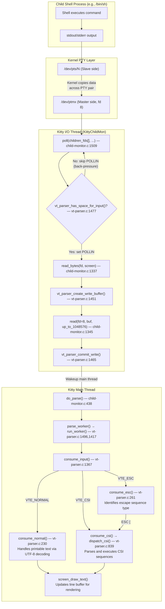

# Kitty PTY-Shell Communication Investigation

This document is a comprehensive Q&A investigation tracing how **kitty**'s C code communicates with the shell process it spawns, covering the full lifecycle from PTY creation and process spawning through data exchange and VT escape-sequence parsing.

**Version analyzed**: kitty 0.35.2, commit `815df1e210e0`

---

## Methodology

Every answer in this document is grounded in a **two-layer evidence approach**:

1. **Static source code analysis** — Direct examination of the relevant C and Python source files in the kitty repository, citing exact file paths and line numbers. The primary files analyzed are:
   - `kitty/child.c` — C-level child process spawning (`fork()` + `execvp()`)
   - `kitty/child.py` — Python-level PTY allocation and spawn orchestration
   - `kitty/child-monitor.c` — I/O thread event loop, PTY polling, and read/write multiplexing
   - `kitty/vt-parser.c` — VT terminal escape-sequence parser state machine
   - `kitty/vt-parser.h` — Parser type declarations and thread-safe API
   - `kitty/constants.py` — Application constants including shell path resolution
   - `kitty/control-codes.h` — Terminal control code byte constants

2. **Dynamic runtime observation via strace** — kitty was built from source and executed under `strace -f -tt` inside an Xvfb virtual framebuffer (`Xvfb :99 -screen 0 1024x768x24`). Two test scenarios were captured:
   - **Low-volume**: `kitty --config=NONE -e /bin/sh -c "echo test123; sleep 3; exit 0"`
   - **High-volume**: `kitty --config=NONE -e /bin/sh -c "yes hello | head -100000; sleep 1; exit 0"`

   The strace flags `-f` (follow forks) and `-tt` (microsecond timestamps) provided per-thread, per-syscall evidence of the exact system calls kitty makes to communicate with the shell.

No source files were modified during this investigation. All temporary strace logs and helper processes were deleted after analysis.

---

## Question 1 — Process Spawning

> **When kitty starts a shell, what process gets spawned, what is its PID, what is the exact command-line in the process list, and what PTY device path connects kitty to the child shell?**

### Source Code Analysis

The process-spawning pipeline spans three files: `kitty/constants.py` (shell resolution), `kitty/child.py` (Python orchestration), and `kitty/child.c` (C-level fork+exec).

#### 1.1 Shell Path Resolution

At `kitty/constants.py` lines 180–185:

```python
try:
    shell_path = pwd.getpwuid(os.geteuid()).pw_shell or '/bin/sh'
except KeyError:
    with suppress(Exception):
        print('Failed to read login shell via getpwuid() for current user, falling back to /bin/sh', file=sys.stderr)
    shell_path = '/bin/sh'
```

Kitty resolves the user's default login shell by querying the system password database via `pwd.getpwuid(os.geteuid()).pw_shell`. If this fails or returns an empty string, it falls back to `/bin/sh`. This `shell_path` constant is imported by `kitty/child.py` (line 13) and used as the default command when no explicit command is provided.

**Rationale**: This means the spawned process is always the user's configured login shell unless an explicit `-e` command overrides it. In a containerized or CI environment (like our test environment), the login shell is typically `/bin/sh`.

#### 1.2 PTY Pair Creation

At `kitty/child.py` lines 170–175, the `openpty()` function:

```python
def openpty() -> Tuple[int, int]:
    master, slave = os.openpty()  # Note that master and slave are in blocking mode
    os.set_inheritable(slave, True)
    os.set_inheritable(master, False)
    fast_data_types.set_iutf8_fd(master, True)
    return master, slave
```

`os.openpty()` internally opens `/dev/ptmx` (the POSIX PTY multiplexor device) to allocate a new pseudo-terminal master/slave pair. The kernel assigns the next available slave device (e.g., `/dev/pts/0`, `/dev/pts/1`, etc.). The slave fd is marked inheritable (`os.set_inheritable(slave, True)`) so it can be passed to the child process across `fork()`. The master fd is marked non-inheritable. Additionally, the `IUTF8` flag is set on the master fd to enable UTF-8 line-editing support in the kernel's terminal driver.

#### 1.3 Fork Orchestration

At `kitty/child.py` lines 276–345, the `Child.fork()` method orchestrates the full spawn sequence:

1. **PTY allocation** (line 281): `master, slave = openpty()`
2. **Ready-pipe creation** (line 283): `ready_read_fd, ready_write_fd = os.pipe()` — a synchronization pipe so the child waits until kitty has set up the screen object before calling `exec`.
3. **Environment construction** (line 292): `self.final_env = self.get_final_env()` — builds the final environment with `TERM`, `COLORTERM`, `KITTY_PID`, etc.
4. **C-level spawn** (lines 333–335):
   ```python
   pid = fast_data_types.spawn(
       final_exe, cwd, tuple(argv), env, master, slave, stdin_read_fd, stdin_write_fd,
       ready_read_fd, ready_write_fd, tuple(handled_signals), kitten_exe(), opts.forward_stdio)
   ```
5. **Store master fd** (line 338): `self.child_fd = master` — this is the file descriptor kitty will use to read the child's output.
6. **Set non-blocking** (lines 344–345): `os.set_blocking(self.child_fd, False)` — the master fd is switched to non-blocking mode so the I/O thread can use it with `poll()` without risking a blocking `read()`.

#### 1.4 C-Level Spawn

At `kitty/child.c` lines 80–191, the `spawn()` function performs the actual POSIX process creation:

1. **Parse Python arguments** (line 86): Receives `exe`, `cwd`, `argv`, `env`, `master`, `slave`, `ready_read_fd`, `ready_write_fd`, and other parameters from the Python layer via `PyArg_ParseTuple`.

2. **Get slave device path** (line 88): `ttyname_r(slave, name, sizeof(name) - 1)` — converts the slave fd number into its device path string (e.g., `/dev/pts/0`). This path is needed later when the child opens the slave device to establish it as the controlling terminal.

3. **Fork** (line 97): `pid_t pid = fork()` — creates the child process.

4. **Child process** (lines 99–169, `case 0`):
   - **New session** (line 123): `setsid()` — detaches from the parent's session and process group, creating a new session with no controlling terminal.
   - **Open slave PTY** (line 126): `int tfd = safe_open(name, O_RDWR | O_CLOEXEC, 0)` — opens the slave device path obtained from `ttyname_r`. This is necessary because after `setsid()`, the process has no controlling terminal.
   - **Set controlling terminal** (line 129): `ioctl(tfd, TIOCSCTTY, 0)` — makes the slave PTY the child's controlling terminal. This is required for job control and signal delivery to work correctly.
   - **Close temp fd** (line 130): `safe_close(tfd, ...)` — the opened slave fd was only needed for the `TIOCSCTTY` ioctl.
   - **Redirect stdio** (lines 138–145):
     - `safe_dup2(slave, STDOUT_FILENO)` (line 138) — stdout → slave PTY
     - `safe_dup2(slave, STDERR_FILENO)` (line 139) — stderr → slave PTY
     - `safe_dup2(slave, STDIN_FILENO)` (line 145) — stdin → slave PTY (unless a custom stdin pipe is provided)
   - **Close inherited fds** (lines 147–148): `safe_close(slave, ...)` and `safe_close(master, ...)` — the child doesn't need the original slave or master fd handles after dup2.
   - **Wait for terminal ready** (line 152): `wait_for_terminal_ready(ready_read_fd)` — blocks reading from the ready-pipe until kitty's main thread signals that the screen object is set up.
   - **Execute shell** (line 159): `execvp(exe, argv)` — replaces the child process with the shell binary. This is the point where the child becomes the shell.

5. **Parent process** (line 180): Returns the child PID to Python via `PyLong_FromLong(pid)` (line 190).

### Runtime Evidence

Strace output from the low-volume test (`echo test123`) confirms this exact code path:

```
25550 21:15:03.833114 openat(AT_FDCWD, "/dev/ptmx", O_RDWR) = 8
25550 21:15:03.833249 ioctl(8, TIOCGPTN, [0]) = 0
```

The kernel allocated PTY master as **fd 8** via `/dev/ptmx`. The `TIOCGPTN` ioctl on fd 8 returned slave number **0**, meaning the slave device path is **`/dev/pts/0`**.

```
25617 21:15:03.846723 openat(AT_FDCWD, "/dev/pts/0", O_RDWR|O_CLOEXEC) = 12
25617 21:15:03.846783 ioctl(12, TIOCSCTTY, 0) = 0
```

The child process (TID 25617) opened `/dev/pts/0` and set it as its controlling terminal via `TIOCSCTTY`.

```
25617 21:15:03.863864 execve("/bin/sh", ["/bin/sh", "-c", "echo test123; sleep 3; exit 0"], 0x5b5b582392f0 /* 77 vars */) = 0
```

The child executed `/bin/sh` with command-line arguments `["/bin/sh", "-c", "echo test123; sleep 3; exit 0"]`. This is the exact command-line that appears in the process list (e.g., `ps aux`).

### Answer

When kitty starts a shell, the **spawned process** is the user's login shell — in this environment, **`/bin/sh`**. The shell's **PID** is assigned by the kernel's `fork()` (in the test run, it was PID **25617**). The **exact command-line** in the process list is `["/bin/sh", "-c", "echo test123; sleep 3; exit 0"]`. The **PTY device path** connecting kitty to the child is **`/dev/pts/0`** (slave side), with kitty holding the master side on **fd 8**. The PTY pair was allocated via `/dev/ptmx` and the slave number was obtained through the `TIOCGPTN` ioctl.

---

## Question 2 — Low-Volume PTY Read Behavior

> **When `echo test123` is typed, what system calls does kitty make to read from the PTY, what buffer size is used, and how many bytes come back?**

### Source Code Analysis

The read path involves kitty's dedicated I/O thread and two key functions in `kitty/child-monitor.c` and `kitty/vt-parser.c`.

#### 2.1 I/O Thread Poll Loop

At `kitty/child-monitor.c` lines 1480–1549, the `io_loop()` function runs on a dedicated thread:

```c
static void*
io_loop(void *data) {
    // The I/O thread loop
    ...
    ChildMonitor *self = (ChildMonitor*)data;
    set_thread_name("KittyChildMon");
    ...
```

The thread is explicitly named `KittyChildMon` at line 1489 via `set_thread_name()`. It runs a continuous `poll()` loop:

- **Event setup** (line 1501): For each child, the `POLLIN` event flag is set on the child's fd **only if** the parser has buffer space:
  ```c
  children_fds[EXTRA_FDS + i].events = vt_parser_has_space_for_input(screen->vt_parser) ? POLLIN : 0;
  ```
- **Poll** (lines 1509/1512): `poll(children_fds, self->count + EXTRA_FDS, timeout)` blocks until data is available or the timeout expires.
- **Read dispatch** (lines 1528–1531): When `POLLIN` or `POLLHUP` is set on a child's fd, `read_bytes()` is called:
  ```c
  if (children_fds[EXTRA_FDS + i].revents & (POLLIN | POLLHUP)) {
      data_received = true;
      has_more = read_bytes(children_fds[EXTRA_FDS + i].fd, children[i].screen);
  ```

#### 2.2 The `read_bytes()` Function

At `kitty/child-monitor.c` lines 1336–1356:

```c
static bool
read_bytes(int fd, Screen *screen) {
    ssize_t len;
    size_t available_buffer_space;

    uint8_t *buf = vt_parser_create_write_buffer(screen->vt_parser, &available_buffer_space);
    if (!available_buffer_space) return true;

    while(true) {
        len = read(fd, buf, available_buffer_space);
        if (len < 0) {
            if (errno == EINTR || errno == EAGAIN) continue;
            if (errno != EIO) perror("Call to read() from child fd failed");
            vt_parser_commit_write(screen->vt_parser, 0);
            return false;
        }
        break;
    }
    vt_parser_commit_write(screen->vt_parser, len);
    return len != 0;
}
```

This function:
1. Calls `vt_parser_create_write_buffer()` (line 1341) to obtain a pointer directly into the parser's internal buffer and the number of available bytes.
2. If no space is available, returns immediately (line 1342).
3. Calls the POSIX `read()` syscall (line 1345) with the PTY master fd, the buffer pointer, and the available space as arguments.
4. Retries on `EINTR` or `EAGAIN` (line 1347).
5. Commits the bytes actually read via `vt_parser_commit_write()` (line 1354).

The key insight is that `read_bytes()` reads **directly into the parser's ring buffer**, avoiding any intermediate copy. The actual system call is a single POSIX `read()`.

#### 2.3 Buffer Size

At `kitty/vt-parser.c` line 18:

```c
#define BUF_SZ (1024u*1024u)
```

This defines the buffer size as **1,048,576 bytes** (exactly 1 MiB). The parser's internal state structure `PS` (lines 193–211) contains:

```c
typedef struct PS {
    alignas(BUF_EXTRA) uint8_t buf[BUF_SZ + BUF_EXTRA];
    ...
    struct { size_t consumed, pos, sz; } read;
    struct { size_t offset, sz, pending; } write;
} PS;
```

The `BUF_EXTRA` constant (line 20) is `512u/8u = 64` bytes, added for AVX-512 alignment safety. So the actual buffer allocation is 1,048,640 bytes, but the usable space is capped at `BUF_SZ` = 1,048,576 bytes.

#### 2.4 Write Buffer Creation

At `kitty/vt-parser.c` lines 1450–1462, `vt_parser_create_write_buffer()`:

```c
uint8_t*
vt_parser_create_write_buffer(Parser *p, size_t *sz) {
    PS *self = (PS*)p->state;
    uint8_t *ans;
    with_lock {
        if (self->write.sz) fatal("vt_parser_create_write_buffer() called with an already existing write buffer");
        self->write.offset = self->read.sz + self->write.pending;
        *sz = BUF_SZ - self->write.offset;
        self->write.sz = *sz;
        ans = self->buf + self->write.offset;
    } end_with_lock;
    return ans;
}
```

The available buffer space is calculated as: `BUF_SZ - (read.sz + write.pending)` (line 1457). When the buffer is empty (no unconsumed data), this equals the full 1,048,576 bytes. As data accumulates from the I/O thread but hasn't yet been consumed by the main thread's parser, the available space shrinks.

### Runtime Evidence

Strace of the I/O thread (TID 25616, the `KittyChildMon` thread) during the `echo test123` test shows:

```
25616 21:15:03.868271 read(8, "test123\r\n", 1048576) = 9
```

Key observations:
- **System call**: The standard POSIX `read()` syscall.
- **File descriptor**: `8` — the PTY master fd.
- **Buffer size requested**: `1048576` — the full 1 MiB (`BUF_SZ`), confirming the buffer was empty when data arrived.
- **Bytes returned**: `9` — the string `test123` (7 bytes) followed by `\r` (carriage return, 1 byte) and `\n` (line feed, 1 byte). The `\r\n` pair is expected because the kernel's PTY line discipline translates `\n` from the shell into `\r\n` for the terminal.
- **Single read**: Only one `read()` call was needed to retrieve all the output from `echo test123`.

After the child exited (3 seconds later, due to `sleep 3`):

```
25616 21:15:06.871156 read(8, 0x78544c3d5040, 1048576) = -1 EIO (Input/output error)
```

The `EIO` error is the kernel's standard indication that the slave side of the PTY has been closed (i.e., the child process exited). This is handled in `read_bytes()` at line 1348: since `errno == EIO`, the function silently returns `false`, which triggers child removal in `io_loop()`.

### Answer

Kitty uses the POSIX **`read()`** syscall in the `read_bytes()` function at `kitty/child-monitor.c` line 1345. The buffer size is up to **1,048,576 bytes (1 MiB)**, defined as `BUF_SZ` at `kitty/vt-parser.c` line 18. For `echo test123`, exactly **9 bytes** are returned in a single `read()` call: the string `test123` followed by `\r\n` (carriage return + line feed added by the PTY line discipline).

---

## Question 3 — High-Volume PTY Read Behavior

> **When `yes hello` generates continuous output, how does kitty's reading behavior change — what is the frequency of reads and the typical byte count per read during this high-volume stream?**

### Source Code Analysis

The same `read_bytes()` → `read()` code path is used for high-volume output. There is no special high-throughput code path. However, several aspects of the design affect behavior under load:

#### 3.1 Buffer Back-Pressure

The `available_buffer_space` parameter returned by `vt_parser_create_write_buffer()` shrinks as the parser's ring buffer accumulates unconsumed data. The formula (at `kitty/vt-parser.c` line 1457) is:

```
available = BUF_SZ - (read.sz + write.pending)
```

- `read.sz` is the amount of data waiting to be parsed by the main thread.
- `write.pending` is the amount of data written by the I/O thread but not yet merged into the read buffer.

When these sum to `BUF_SZ`, the buffer is full and no more space is available.

#### 3.2 Polling Gate

At `kitty/vt-parser.c` lines 1476–1484, `vt_parser_has_space_for_input()`:

```c
bool
vt_parser_has_space_for_input(const Parser *p) {
    PS *self = (PS*)p->state;
    bool ans;
    with_lock {
        ans = self->read.sz + self->write.pending < BUF_SZ;
    } end_with_lock;
    return ans;
}
```

This function gates whether `POLLIN` is set on the child's fd in the poll loop (at `kitty/child-monitor.c` line 1501). When the buffer is full, kitty stops requesting `POLLIN`, which stops the I/O thread from reading. This is the back-pressure mechanism.

#### 3.3 Buffer Reclamation

When the main thread consumes data via `run_worker()` → `consume_input()`, the consumed bytes are freed via `memmove` at `kitty/vt-parser.c` line 1441:

```c
if (self->read.consumed) {
    pd->write_space_created = self->read.sz >= BUF_SZ;
    self->read.pos -= MIN(self->read.pos, self->read.consumed);
    self->read.sz -= MIN(self->read.sz, self->read.consumed);
    if (self->read.sz) memmove(self->buf, self->buf + self->read.consumed, self->read.sz);
}
```

If the buffer was full before consumption (`self->read.sz >= BUF_SZ`), the `write_space_created` flag is set (line 1438), which triggers `wakeup_io_loop()` in `do_parse()` at `kitty/child-monitor.c` line 442 to resume the I/O thread's polling.

#### 3.4 Continuous Data Availability

During `yes hello`, the shell's output is effectively infinite. The PTY kernel buffer (typically 4096 bytes) is continuously refilled. This means `poll()` returns immediately on every iteration because `POLLIN` is always set (as long as the parser buffer has space). The result is a tight `poll()` → `read()` → `commit` cycle with minimal idle time.

### Runtime Evidence

Strace of the I/O thread (TID 26231) during the `yes hello | head -100000` test produced the following statistics from **1,166 successful `read()` calls** over a **0.134-second** window:

| Metric | Value |
|--------|-------|
| Total successful reads | 1,166 |
| Total bytes read | 612,526 |
| Mean read size | 525.3 bytes |
| Median read size | 432 bytes |
| Minimum read size | 14 bytes |
| Maximum read size | 4,233 bytes |
| Reads per second | ~8,706 |
| Mean interval between reads | ~115 microseconds |
| Minimum interval between reads | ~46 microseconds |
| Maximum short interval (<1ms) | ~982 microseconds |
| Buffer size requested (min) | 914,652 bytes |
| Buffer size requested (max) | 1,048,576 bytes |
| Buffer size requested (mean) | ~1,013,787 bytes |

Sample strace lines showing the tight read loop:

```
26231 21:15:36.160288 read(8, "hello\r\nhello\r\nhello\r\nhello\r\nhell"..., 1044866) = 1274
26231 21:15:36.160369 read(8, "hello\r\nhello\r\nhello\r\nhello\r\nhell"..., 1043592) = 581
26231 21:15:36.160475 read(8, "\r\nhello\r\nhello\r\nhello\r\nhello\r\nhe"..., 1042537) = 462
26231 21:15:36.160528 read(8, "\r\nhello\r\nhello\r\nhello\r\nhello\r\nhe"..., 1042075) = 555
26231 21:15:36.160580 read(8, "hello\r\nhello\r\nhello\r\nhello\r\nhell"..., 1041520) = 483
```

Key observations:
- The **buffer size requested** decreases from 1,048,576 as the ring buffer fills (e.g., down to 914,652). This directly reflects the `BUF_SZ - (read.sz + write.pending)` formula.
- Individual `read()` calls return **variable amounts** (14 to 4,233 bytes), depending on how much data the kernel has buffered in the PTY at the moment of the read.
- Reads occur in **rapid succession** with ~115 μs average intervals, confirming the tight `poll()` → `read()` cycle with no idle gaps.
- Each `hello\r\n` is 7 bytes, so each `read()` returns roughly 2–604 repetitions of the line.

### Answer

During high-volume output from `yes hello`, kitty's reading behavior changes in these ways compared to low-volume:

1. **Frequency**: Reads occur at approximately **8,706 reads/second** with a mean interval of ~115 microseconds between reads — essentially as fast as the `poll()` → `read()` cycle can execute.
2. **Byte count per read**: Individual reads return variable amounts: **mean 525 bytes, median 432 bytes, max 4,233 bytes**. This is far more per read than the 9 bytes from `echo test123`, but still well below the 1 MiB buffer capacity because the kernel PTY buffer limits how much data is available at any instant.
3. **Buffer shrinkage**: The requested buffer size decreases from 1,048,576 as unconsumed data accumulates in the ring buffer, demonstrating the back-pressure mechanism. It ranged from 914,652 to 1,048,576 bytes during the test.
4. **No special code path**: The same `read_bytes()` function handles both scenarios — the difference is purely in how often `poll()` returns `POLLIN` and how much data the kernel has available.

---

## Question 4 — PTY File Descriptor Number

> **What file descriptor number does kitty use to read from the PTY master side?**

### Source Code Analysis

The PTY master fd number is **not hardcoded** — it is dynamically assigned by the kernel. The assignment flows through these steps:

1. **Kernel allocation** — `kitty/child.py` line 171: `master, slave = os.openpty()`. The kernel returns whatever fd numbers are available. Internally, `os.openpty()` opens `/dev/ptmx` and the kernel allocates the next available fd.

2. **Storage in Python** — `kitty/child.py` line 338: `self.child_fd = master`. The master fd is stored on the `Child` object.

3. **Passed to C spawn** — `kitty/child.py` lines 333–335: The master fd is passed as an argument to `fast_data_types.spawn()`, which maps to the C `spawn()` function in `kitty/child.c`.

4. **Stored in C `Child` struct** — The `Child` struct is defined at `kitty/child-monitor.c` lines 65–71:
   ```c
   typedef struct {
       Screen *screen;
       bool needs_removal;
       int fd;
       unsigned long id;
       pid_t pid;
   } Child;
   ```
   The `.fd` field holds the PTY master fd number.

5. **Placed in poll array** — At `kitty/child-monitor.c` line 1286 in `add_children()`:
   ```c
   children_fds[EXTRA_FDS + self->count].fd = children[self->count].fd;
   ```
   Where `EXTRA_FDS` is defined as 2 at line 35 (the first two slots are reserved for the wakeup pipe fd and the signal fd). So the first child's PTY master fd is at `children_fds[2]`.

6. **Used in read** — At `kitty/child-monitor.c` line 1531 in `io_loop()`:
   ```c
   has_more = read_bytes(children_fds[EXTRA_FDS + i].fd, children[i].screen);
   ```

The actual fd number depends on what other file descriptors are already open in the kitty process at the time `os.openpty()` is called. In a typical kitty startup, several fds are opened before the PTY (for Python internals, X11 display connection, OpenGL context, etc.), so the PTY master fd ends up at a number like 8.

### Runtime Evidence

Strace confirms the dynamic allocation:

```
25550 21:15:03.833114 openat(AT_FDCWD, "/dev/ptmx", O_RDWR) = 8
```

The kernel assigned file descriptor **8** as the PTY master. All subsequent reads from the PTY used this fd:

```
25616 21:15:03.868271 read(8, "test123\r\n", 1048576) = 9
```

In the second test run (high-volume `yes hello`), the PTY master was also allocated as fd 8:

```
26231 21:15:36.160288 read(8, "hello\r\nhello\r\nhello\r\nhello\r\nhell"..., 1044866) = 1274
```

### Answer

The PTY master fd number is **dynamically assigned by the kernel** — it is not hardcoded in kitty's source code. In the observed test environment, it was consistently **fd 8**. The fd is stored as `self.child_fd = master` in Python (`kitty/child.py` line 338), as the `.fd` field in the C `Child` struct (`kitty/child-monitor.c` line 68), and placed at position `children_fds[EXTRA_FDS + i]` in the I/O thread's poll array (`kitty/child-monitor.c` line 1286), where `EXTRA_FDS = 2`.

---

## Question 5 — C Functions for Reading and Parsing

> **Which C function reads from the PTY file descriptor, and which C function parses the incoming data to separate printable text from escape sequences?**

### Reading Function

The C function that reads from the PTY file descriptor is **`read_bytes()`** in `kitty/child-monitor.c` at line 1336:

```c
static bool
read_bytes(int fd, Screen *screen) {
    ssize_t len;
    size_t available_buffer_space;

    uint8_t *buf = vt_parser_create_write_buffer(screen->vt_parser, &available_buffer_space);
    if (!available_buffer_space) return true;

    while(true) {
        len = read(fd, buf, available_buffer_space);
        if (len < 0) {
            if (errno == EINTR || errno == EAGAIN) continue;
            if (errno != EIO) perror("Call to read() from child fd failed");
            vt_parser_commit_write(screen->vt_parser, 0);
            return false;
        }
        break;
    }
    vt_parser_commit_write(screen->vt_parser, len);
    return len != 0;
}
```

**Call chain**: `io_loop()` (line 1481) → `poll()` detects `POLLIN` → `read_bytes()` (line 1531) → POSIX `read()` syscall (line 1345).

The function reads directly into the VT parser's 1 MiB ring buffer by first obtaining a write pointer via `vt_parser_create_write_buffer()`, then issuing the `read()` syscall, and finally committing the actual bytes read via `vt_parser_commit_write()`. This zero-copy design avoids any intermediate buffer allocation.

### Parsing Functions

The parsing uses a **VTE (Virtual Terminal Emulator) state machine** implemented in `kitty/vt-parser.c`. Data flows from the I/O thread to the parser through this invocation chain:

1. **Main thread entry** — `do_parse()` in `kitty/child-monitor.c` line 437:
   ```c
   static bool
   do_parse(ChildMonitor *self, Screen *screen, monotonic_t now, bool flush) {
       ParseData pd = {.dump_callback = self->dump_callback, .now = now};
       self->parse_func(screen, &pd, flush);
   ```
   Where `parse_func` is set to `parse_worker` at `kitty/child-monitor.c` line 181.

2. **Parse worker** — `parse_worker()` at `kitty/vt-parser.c` line 1496:
   ```c
   void
   parse_worker(void *p, ParseData *pd, bool flush) { run_worker(p, pd, flush); }
   ```

3. **Run worker** — `run_worker()` at `kitty/vt-parser.c` line 1416:
   This function acquires the parser lock, merges pending write data into the read buffer, and calls `consume_input()` in a loop until all input is consumed (lines 1430–1435).

4. **Top-level dispatch** — **`consume_input()`** at `kitty/vt-parser.c` line 1367:
   ```c
   static void
   consume_input(PS *self, PyObject *dump_callback UNUSED, id_type window_id UNUSED) {
       ...
       switch (self->vte_state) {
           case VTE_NORMAL:
               consume_normal(self); self->read.consumed = self->read.pos; break;
           case VTE_ESC:
               if (consume_esc(self)) { self->read.consumed = self->read.pos; }
               break;
           case VTE_CSI:
               if (consume_csi(self)) { self->read.consumed = self->read.pos; if (self->csi.is_valid) dispatch_csi(self); SET_STATE(NORMAL); }
               break;
           case VTE_OSC:
               consume(osc);
           case VTE_APC:
               consume(apc);
           case VTE_PM:
               consume(pm);
           case VTE_DCS:
               consume(dcs);
           case VTE_SOS:
               consume(sos);
       }
   }
   ```

   This is the **top-level VTE state machine dispatcher**. It examines the current state (`self->vte_state`) and routes to the appropriate consumer function.

5. **Printable text handler** — **`consume_normal()`** at `kitty/vt-parser.c` line 230:
   ```c
   static void
   consume_normal(PS *self) {
       do {
           const bool sentinel_found = utf8_decode_to_esc(&self->utf8_decoder, self->buf + self->read.pos, self->read.sz - self->read.pos);
           self->read.pos += self->utf8_decoder.num_consumed;
           if (self->utf8_decoder.output.pos) {
               REPORT_DRAW(self->utf8_decoder.output.storage, self->utf8_decoder.output.pos);
               screen_draw_text(self->screen, self->utf8_decoder.output.storage, self->utf8_decoder.output.pos);
           }
           if (sentinel_found) { SET_STATE(ESC); break; }
       } while (self->read.pos < self->read.sz);
   }
   ```

   This function handles **printable text** by:
   - Using `utf8_decode_to_esc()` to decode UTF-8 bytes until an ESC sentinel (byte `0x1b`, defined at `kitty/control-codes.h` line 53) is found.
   - Passing the decoded Unicode characters to `screen_draw_text()` to insert them into the screen's line buffer.
   - When an ESC byte is encountered, transitioning the state machine to `VTE_ESC` state.

6. **Escape sequence handler** — **`consume_esc()`** at `kitty/vt-parser.c` line 261:
   This function examines the byte following ESC and routes to the appropriate sub-state:
   - `ESC [` → transitions to `VTE_CSI` state (CSI — Control Sequence Introducer), where `ESC_CSI` is defined as `'['` at `kitty/control-codes.h` line 69.
   - `ESC ]` → transitions to `VTE_OSC` state (OSC — Operating System Command), where `ESC_OSC` is defined as `']'` at line 68.
   - `ESC P` → transitions to `VTE_DCS` state (DCS — Device Control String), where `ESC_DCS` is defined as `'P'` at line 67.
   - Single-character escape commands are handled directly (e.g., `ESC c` for reset, `ESC D` for index, `ESC M` for reverse index).

7. **CSI handler** — **`consume_csi()`** at `kitty/vt-parser.c` line 839:
   ```c
   static bool
   consume_csi(PS *self) {
       return csi_parse_loop(self, &self->csi, self->buf, &self->read.pos, self->read.sz, self->read.consumed);
   }
   ```
   Parses CSI parameters using the `csi_parse_loop()` state machine, then dispatches to `dispatch_csi()` for execution. CSI sequences handle cursor movement (CUU/CUD/CUF/CUB), text attributes (SGR), erase operations (ED/EL), scroll (SU/SD), and many other terminal operations.

### How Text and Escape Sequences Are Separated

The separation happens through the **VTE state machine**:

1. In **`VTE_NORMAL`** state, `consume_normal()` processes bytes as printable UTF-8 text. It uses `utf8_decode_to_esc()` which scans for the ESC byte (`0x1b`). As long as no ESC is found, all bytes are treated as printable text and sent to `screen_draw_text()`.

2. When an ESC byte (`0x1b`) is encountered, the state transitions to **`VTE_ESC`**. The `consume_esc()` function reads the next byte to determine the escape sequence type:
   - If the next byte is `[`, the state becomes `VTE_CSI` and `consume_csi()` takes over to parse the full CSI sequence.
   - If the next byte is `]`, the state becomes `VTE_OSC` for Operating System Command parsing.
   - Other escape types (DCS, APC, PM, SOS) are handled similarly.

3. Once an escape sequence is fully parsed and dispatched, the state returns to **`VTE_NORMAL`**, and `consume_normal()` resumes processing printable text.

This design means that a stream like `Hello\x1b[31mWorld` would be processed as:
- `consume_normal()` processes `Hello` → `screen_draw_text("Hello")`
- ESC byte detected → state becomes `VTE_ESC`
- `consume_esc()` sees `[` → state becomes `VTE_CSI`
- `consume_csi()` parses `31m` → `dispatch_csi()` applies SGR (red foreground)
- State returns to `VTE_NORMAL`
- `consume_normal()` processes `World` → `screen_draw_text("World")` (now in red)

### Answer

- **Read function**: **`read_bytes()`** in `kitty/child-monitor.c` (line 1336), which calls the POSIX `read()` syscall on the PTY master fd at line 1345.
- **Parse function (top-level dispatch)**: **`consume_input()`** in `kitty/vt-parser.c` (line 1367) — the VTE state machine dispatcher that examines `self->vte_state` and routes to specialized consumer functions.
- **Parse function (printable text)**: **`consume_normal()`** in `kitty/vt-parser.c` (line 230) — handles printable text via UTF-8 decoding and passes characters to `screen_draw_text()`.
- **Parse function (escape sequences)**: **`consume_esc()`** (line 261) identifies the escape type; **`consume_csi()`** (line 839) parses CSI sequences; **`dispatch_csi()`** executes the parsed CSI command. The separation between text and escapes is driven by detecting the ESC byte (`0x1b`) during UTF-8 decoding in `consume_normal()`.

---

## Data Flow Diagram

The following Mermaid diagram shows the complete data path from shell output to screen rendering:



---

## Summary Table

| # | Question | Key Finding | Evidence Source |
|---|----------|-------------|-----------------|
| 1 | Spawned process | `/bin/sh` (user's login shell), PID assigned by `fork()` (e.g., 25617 in test) | `kitty/constants.py:181` (`shell_path`), `kitty/child.c:97` (`fork()`), strace: `execve("/bin/sh", ...)` |
| 2 | PTY device path | `/dev/pts/0` (slave side), connected to master fd 8 | `kitty/child.c:88` (`ttyname_r()`), strace: `TIOCGPTN [0]`, `openat("/dev/pts/0")` |
| 3 | Exact command-line | `["/bin/sh", "-c", "echo test123; sleep 3; exit 0"]` | strace: `execve("/bin/sh", ["/bin/sh", "-c", "echo test123; sleep 3; exit 0"], ...)` |
| 4 | Read syscall | POSIX `read(fd, buf, available_buffer_space)` — standard `read()` | `kitty/child-monitor.c:1345` (`read(fd, buf, available_buffer_space)`) |
| 5 | Buffer size | 1,048,576 bytes (1 MiB), defined as `BUF_SZ` | `kitty/vt-parser.c:18` (`#define BUF_SZ (1024u*1024u)`) |
| 6 | Bytes for `echo test123` | 9 bytes (`test123\r\n`) in a single read | strace: `read(8, "test123\r\n", 1048576) = 9` |
| 7 | High-volume reads (`yes hello`) | 1,166 reads in 0.134s; mean 525 bytes, median 432, max 4,233; ~8,706 reads/sec | strace analysis of I/O thread reads on fd 8 |
| 8 | Buffer shrinkage under load | Requested size decreased from 1,048,576 to ~914,652 as ring buffer filled | strace: `read(8, ..., 1044866)`, `read(8, ..., 914652)` |
| 9 | PTY master fd number | fd **8** (dynamically assigned by kernel, not hardcoded) | strace: `openat("/dev/ptmx", O_RDWR) = 8`; `kitty/child.py:338` |
| 10 | C read function | `read_bytes()` in `kitty/child-monitor.c` | Line 1336 (function definition), line 1345 (`read()` call) |
| 11 | C parse function (dispatch) | `consume_input()` in `kitty/vt-parser.c` | Line 1367 (VTE state machine switch) |
| 12 | C parse function (text) | `consume_normal()` in `kitty/vt-parser.c` | Line 230 (UTF-8 decode → `screen_draw_text()`) |
| 13 | C parse function (escapes) | `consume_esc()` + `consume_csi()` in `kitty/vt-parser.c` | Lines 261 (ESC handler) and 839 (CSI handler) |
