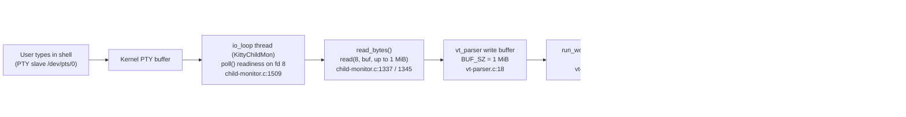

# How kitty's C Code Communicates with the Shell over a PTY

**An evidence-grounded, runtime-first investigation**

- **Repository:** [kitty](https://github.com/kovidgoyal/kitty) terminal emulator (hybrid C + Python + Go)
- **Source branch:** `kitty_815df1e210e0`
- **Commit pin (HEAD):** `815df1e210e0a9ab4622f5c7f2d6891d7dbeddf1`
- **Method:** BUILD → RUN → OBSERVE → then write. Every behavioral claim below is paired with the exact command that produced it and its **complete, unedited** output; every code claim carries a `file:line` reference at the pinned commit.

> **Question answered:** *How does the kitty terminal emulator's C code communicate with the shell process it spawns over a pseudo-terminal (PTY)?* — decomposed into six sub-questions **Q1–Q6**.

---

## 1. Summary — the end-to-end PTY pipeline

kitty spawns a real interactive shell on a pseudo-terminal (PTY) and talks to it over that PTY. The data path from a keystroke to the screen is:

1. The user types into the **GUI kitty window**. kitty writes those bytes to the **PTY master** (`/dev/pts/ptmx`, held on **fd 8** in this run).
2. The kernel delivers them to the **PTY slave** (`/dev/pts/0`), which is the shell's stdin/stdout/stderr.
3. The shell (`/bin/bash --posix`, PID 7836 in this run) executes the command and writes its output back to the **slave**.
4. The kernel makes that output readable on the **master**. kitty's dedicated I/O thread (`KittyChildMon`) discovers readiness with **`poll()`** and drains it with **`read()`** inside **`read_bytes()`** into the VT parser's **1 MiB** write buffer.
5. The parser worker, gated by the **`input_delay`** (default **3 ms**) batching option, hands the buffer to **`consume_input()`**, a state machine that separates **printable text** (drawn via `screen_draw_text()` in `consume_normal()`) from **escape/control sequences** (dispatched by the ESC/CSI/OSC/… states).



**Direct answers at a glance (all captured live in this investigation):**

| # | Question | Answer (observed) |
|---|----------|-------------------|
| Q1 | Build & launch | `python3 setup.py` [Makefile:L13] → `./kitty/launcher/kitty --config NONE` (kitty 0.35.2) under Xvfb `:99` |
| Q2 | Spawned process / PID / cmdline / PTY | `/bin/bash` · **PID 7836** · `/bin/bash --posix` · slave **`/dev/pts/0`** |
| Q3 | `echo test123` read syscalls / buffer / bytes | `poll()`+`read()` on fd 8 · buffer **up to 1 MiB (1048576 B)** · returns **1, 2, 11, 47, 114, 182** bytes (output `test123\r\n` in the 114 B read) |
| Q4 | `yes hello` cadence / frequency / bytes-per-read | continuous large reads · **~6,500–8,100 reads/s** (strace) · **median ~600–623 B**, dominant 257–1024 B, up to ~24 KB |
| Q5 | PTY master fd number | **fd 8** (→ `/dev/pts/ptmx`), agreeing across `/proc/<pid>/fd` and strace |
| Q6 | C functions | (a) **`read_bytes()`** [child-monitor.c:L1337]; (b) **`consume_input()`** [vt-parser.c:L1366] / **`consume_normal()`** [vt-parser.c:L230] |

---

## 2. Environment & Reproducibility

All build and runtime observations below were performed **inside the mandated container**, so every observed value is **canonical** (no fallback, no synthetic stand-in).

| Item | Value |
|------|-------|
| Mandated container | `andrewparkscaleai/coding-agent:kovidgoyal__kitty__815df1e210e0a9ab4622f5c7f2d6891d7dbeddf1`, sourced **from** `ghcr.io/scaleapi/swe-atlas:swe_atlas_QnA_kovidgoyal_kitty_1.0` (per the project setup instructions). The `ghcr.io/scaleapi/swe-atlas:…` image *is* the mandated environment and was pulled and used directly. |
| Build/run host | **Inside the mandated container** (image digest `sha256:60da90a7183a82861fc6d1d40cb8086baa6a8a0e0d05f26d03aafd0f5b3cc384`), Ubuntu 24.04.2 LTS, running the kitty checkout it ships at `/app`. |
| Toolchain (container-supplied) | Python 3.12.3 · Go 1.23.4 · gcc 13.3.0 · pkg-config 1.8.1 |
| Runtime deps (container-supplied) | harfbuzz 8.3.0 (≥ 2.2.0 required) [docs/build.rst:L84], libpng 1.6.43 [docs/build.rst:L86], freetype 26.1.20 [docs/build.rst:L90] |
| Display mechanism | Headless **Xvfb** — `Xvfb :99 -screen 0 1280x800x24 -ac`; `DISPLAY=:99`, `LIBGL_ALWAYS_SOFTWARE=1` (software GL) |
| Configuration | **Default / canonical** — launched with `--config NONE` (no custom `kitty.conf`); no user `~/.config/kitty/kitty.conf` present |
| Observation tooling (added to the container) | `strace` 6.8 (run as **root**, uid 0, so `CAP_SYS_PTRACE` allows attach despite `ptrace_scope=1`), `lsof` 4.95.0, `xdotool` 3.20160805.1 (X11 **XTEST** real-keystroke injection), plus `ps`, `pgrep`, `xwininfo`, and `/proc`. These are **observation/GUI prerequisites only**; they do not alter kitty's build or runtime behavior. |
| Commit (pinned in the container) | `815df1e210e0a9ab4622f5c7f2d6891d7dbeddf1` on branch `kitty_815df1e210e0` |

**How the mandated environment was obtained and entered** — the exact, reproducible commands:

```console
$ docker pull ghcr.io/scaleapi/swe-atlas:swe_atlas_QnA_kovidgoyal_kitty_1.0
Status: Downloaded newer image for ghcr.io/scaleapi/swe-atlas:swe_atlas_QnA_kovidgoyal_kitty_1.0

$ docker run -d --name kitty_mand --privileged \
      --entrypoint sleep ghcr.io/scaleapi/swe-atlas:swe_atlas_QnA_kovidgoyal_kitty_1.0 infinity

$ docker exec kitty_mand bash -lc 'cd /app && git rev-parse HEAD'
815df1e210e0a9ab4622f5c7f2d6891d7dbeddf1

# Observation/GUI prerequisites (do not affect kitty's build/behaviour):
$ docker exec kitty_mand env DEBIAN_FRONTEND=noninteractive apt-get install -y \
      strace lsof xvfb x11-utils xdotool libgl1-mesa-dri mesa-utils fonts-dejavu-core fonts-liberation
```

Every subsequent command in this document is executed with `docker exec kitty_mand …` inside that container; the shell prompts shown (`root@9f90abec277e:/app#`) are the container's own, where `9f90abec277e` is the container hostname.

### Why this is the *real* entry point (not a bypass)

All commands were typed into the running GUI kitty window with **`xdotool`**, which uses the X11 **XTEST** extension to synthesize key events that are delivered to the focused window exactly as a physical keyboard would. kitty processes them through its normal GLFW/X11 input stack and writes them to the PTY master; the shell reads them from the slave and runs them. **No bypassing interface** was used: no kitty remote control (`kitty @ …`), no debug hook, no `--session` trick that skips the shell, and **no synthetic writes** to the PTY.

**Proof that keystrokes traverse the real path** (typed into the kitty shell via XTEST; `$$` is bash's own PID). `$WID` is the kitty window id (`2097164`, resolved with `xdotool search --class kitty`):

```console
$ xdotool type --window "$WID" --delay 60 'echo INJECTION_OK_$$ > /tmp/kitty_probe/inject.txt'
$ xdotool key --window "$WID" Return
$ cat /tmp/kitty_probe/inject.txt
INJECTION_OK_7836
```

`$$` expanded to **7836** — the exact PID of the shell kitty spawned (see Q2) — proving the keystrokes flowed *xdotool → kitty window → PTY master → bash (slave) → command executed*.

---

## 3. Q1 — Build & Launch

### Build (canonical command)

The canonical build entry point is the `all:` target of the `Makefile`, which runs `python3 setup.py`:

- [Makefile:L12-L13] — `all:` / `python3 setup.py $(VVAL)`

A full clean build was forced (`python3 setup.py clean` first, chained with `&&`). The command and its **complete, unedited** output are below (381 lines). The build ran inside the mandated container, which ships `wayland-protocols`, so this is the **Wayland-enabled canonical build** a normal user gets in that environment (28 Wayland-protocol generation steps + 122 C compilation steps + 5 link steps + the Go tool build). The trailing `___BUILD_EXIT=0___` line is emitted by the capture wrapper (`echo "___BUILD_EXIT=$?___"`) and confirms the build exited **0**.

<details>
<summary><b>Complete, unedited output of <code>python3 setup.py clean &amp;&amp; python3 setup.py</code> (click to expand — 381 lines)</b></summary>

```text
$ python3 setup.py clean && python3 setup.py; echo "___BUILD_EXIT=$?___"
[1/28] Generating wayland-xdg-shell-client-protocol.h ...
[2/28] Generating wayland-xdg-shell-client-protocol.c ...
[3/28] Generating wayland-viewporter-client-protocol.h ...
[4/28] Generating wayland-viewporter-client-protocol.c ...
[5/28] Generating wayland-relative-pointer-unstable-v1-client-protocol.h ...
[6/28] Generating wayland-relative-pointer-unstable-v1-client-protocol.c ...
[7/28] Generating wayland-pointer-constraints-unstable-v1-client-protocol.h ...
[8/28] Generating wayland-pointer-constraints-unstable-v1-client-protocol.c ...
[9/28] Generating wayland-xdg-decoration-unstable-v1-client-protocol.h ...
[10/28] Generating wayland-xdg-decoration-unstable-v1-client-protocol.c ...
[11/28] Generating wayland-primary-selection-unstable-v1-client-protocol.h ...
[12/28] Generating wayland-primary-selection-unstable-v1-client-protocol.c ...
[13/28] Generating wayland-text-input-unstable-v3-client-protocol.h ...
[14/28] Generating wayland-text-input-unstable-v3-client-protocol.c ...
[15/28] Generating wayland-xdg-activation-v1-client-protocol.h ...
[16/28] Generating wayland-xdg-activation-v1-client-protocol.c ...
[17/28] Generating wayland-tablet-unstable-v2-client-protocol.h ...
[18/28] Generating wayland-tablet-unstable-v2-client-protocol.c ...
[19/28] Generating wayland-cursor-shape-v1-client-protocol.h ...
[20/28] Generating wayland-cursor-shape-v1-client-protocol.c ...
[21/28] Generating wayland-fractional-scale-v1-client-protocol.h ...
[22/28] Generating wayland-fractional-scale-v1-client-protocol.c ...
[23/28] Generating wayland-single-pixel-buffer-v1-client-protocol.h ...
[24/28] Generating wayland-single-pixel-buffer-v1-client-protocol.c ...
[25/28] Generating wayland-kwin-blur-v1-client-protocol.h ...
[26/28] Generating wayland-kwin-blur-v1-client-protocol.c ...
[27/28] Generating wayland-wlr-layer-shell-unstable-v1-client-protocol.h ...
[28/28] Generating wayland-wlr-layer-shell-unstable-v1-client-protocol.c ...
 done
[1/122] Compiling kitty/screen.c ...
[2/122] Compiling kitty/unicode-data.c ...
[3/122] Compiling [wayland] glfw/wl_window.c ...
[4/122] Compiling [x11] glfw/x11_window.c ...
[5/122] Compiling kitty/glfw.c ...
[6/122] Compiling kitty/graphics.c ...
[7/122] Compiling kitty/child-monitor.c ...
[8/122] Compiling kitty/fonts.c ...
[9/122] Compiling kitty/shaders.c ...
[10/122] Compiling kitty/vt-parser.c ...
[11/122] Compiling kitty/vt-parser.c ...
[12/122] Compiling kitty/state.c ...
[13/122] Compiling [x11] glfw/input.c ...
[14/122] Compiling [wayland] glfw/input.c ...
[15/122] Compiling kitty/mouse.c ...
[16/122] Compiling [x11] glfw/xkb_glfw.c ...
[17/122] Compiling [wayland] glfw/xkb_glfw.c ...
[18/122] Compiling kitty/freetype.c ...
[19/122] Compiling [wayland] glfw/wl_client_side_decorations.c ...
[20/122] Compiling [x11] glfw/window.c ...
[21/122] Compiling [wayland] glfw/window.c ...
[22/122] Compiling kitty/line.c ...
[23/122] Compiling kitty/glfw-wrapper.c ...
[24/122] Compiling kittens/transfer/algorithm.c ...
[25/122] Compiling [wayland] glfw/wl_init.c ...
[26/122] Compiling [x11] glfw/x11_init.c ...
[27/122] Compiling kitty/freetype_render_ui_text.c ...
[28/122] Compiling [x11] glfw/egl_context.c ...
[29/122] Compiling [wayland] glfw/egl_context.c ...
[30/122] Compiling kitty/disk-cache.c ...
[31/122] Compiling [x11] glfw/glx_context.c ...
[32/122] Compiling kitty/line-buf.c ...
[33/122] Compiling kitty/data-types.c ...
[34/122] Compiling kitty/colors.c ...
[35/122] Compiling kitty/history.c ...
[36/122] Compiling kitty/keys.c ...
[37/122] Compiling [x11] glfw/x11_monitor.c ...
[38/122] Compiling kitty/fontconfig.c ...
[39/122] Compiling [x11] glfw/context.c ...
[40/122] Compiling [wayland] glfw/context.c ...
[41/122] Compiling kitty/crypto.c ...
[42/122] Compiling [x11] glfw/ibus_glfw.c ...
[43/122] Compiling [wayland] glfw/ibus_glfw.c ...
[44/122] Compiling kitty/key_encoding.c ...
[45/122] Compiling kitty/launcher/main.c ...
[46/122] Compiling [x11] glfw/monitor.c ...
[47/122] Compiling [wayland] glfw/monitor.c ...
[48/122] Compiling kitty/font-names.c ...
[49/122] Compiling [x11] glfw/backend_utils.c ...
[50/122] Compiling [wayland] glfw/backend_utils.c ...
[51/122] Compiling kitty/charsets.c ...
[52/122] Compiling [x11] glfw/linux_joystick.c ...
[53/122] Compiling [wayland] glfw/linux_joystick.c ...
[54/122] Compiling [x11] glfw/init.c ...
[55/122] Compiling [wayland] glfw/init.c ...
[56/122] Compiling [x11] glfw/dbus_glfw.c ...
[57/122] Compiling [wayland] glfw/dbus_glfw.c ...
[58/122] Compiling kitty/gl.c ...
[59/122] Compiling [x11] glfw/vulkan.c ...
[60/122] Compiling [wayland] glfw/vulkan.c ...
[61/122] Compiling [x11] glfw/osmesa_context.c ...
[62/122] Compiling [wayland] glfw/osmesa_context.c ...
[63/122] Compiling kitty/cursor.c ...
[64/122] Compiling kitty/launcher/single-instance.c ...
[65/122] Compiling kitty/desktop.c ...
[66/122] Compiling kitty/loop-utils.c ...
[67/122] Compiling 3rdparty/ringbuf/ringbuf.c ...
[68/122] Compiling kitty/simd-string.c ...
[69/122] Compiling kitty/systemd.c ...
[70/122] Compiling kitty/shlex.c ...
[71/122] Compiling [wayland] glfw/wayland-tablet-unstable-v2-client-protocol.c ...
[72/122] Compiling kitty/child.c ...
[73/122] Compiling [wayland] glfw/linux_desktop_settings.c ...
[74/122] Compiling [wayland] glfw/wl_text_input.c ...
[75/122] Compiling [wayland] glfw/wl_monitor.c ...
[76/122] Compiling kitty/kittens.c ...
[77/122] Compiling 3rdparty/base64/lib/codec_choose.c ...
[78/122] Compiling kitty/png-reader.c ...
[79/122] Compiling [wayland] glfw/wayland-xdg-shell-client-protocol.c ...
[80/122] Compiling [x11] glfw/linux_notify.c ...
[81/122] Compiling [wayland] glfw/linux_notify.c ...
[82/122] Compiling kitty/rowcolumn-diacritics.c ...
[83/122] Compiling kitty/hyperlink.c ...
[84/122] Compiling [wayland] glfw/wayland-primary-selection-unstable-v1-client-protocol.c ...
[85/122] Compiling kitty/wcswidth.c ...
[86/122] Compiling [wayland] glfw/wayland-pointer-constraints-unstable-v1-client-protocol.c ...
[87/122] Compiling kitty/fast-file-copy.c ...
[88/122] Compiling [wayland] glfw/wayland-text-input-unstable-v3-client-protocol.c ...
[89/122] Compiling [wayland] glfw/wayland-wlr-layer-shell-unstable-v1-client-protocol.c ...
[90/122] Compiling 3rdparty/base64/lib/lib.c ...
[91/122] Compiling [x11] glfw/posix_thread.c ...
[92/122] Compiling [wayland] glfw/posix_thread.c ...
[93/122] Compiling kitty/window_logo.c ...
[94/122] Compiling [wayland] glfw/wayland-xdg-activation-v1-client-protocol.c ...
[95/122] Compiling [wayland] glfw/wayland-xdg-decoration-unstable-v1-client-protocol.c ...
[96/122] Compiling [wayland] glfw/wayland-relative-pointer-unstable-v1-client-protocol.c ...
[97/122] Compiling [wayland] glfw/wayland-cursor-shape-v1-client-protocol.c ...
[98/122] Compiling [wayland] glfw/wayland-fractional-scale-v1-client-protocol.c ...
[99/122] Compiling kitty/glyph-cache.c ...
[100/122] Compiling [wayland] glfw/wayland-viewporter-client-protocol.c ...
[101/122] Compiling kitty/logging.c ...
[102/122] Compiling 3rdparty/base64/lib/arch/neon64/codec.c ...
[103/122] Compiling [wayland] glfw/wayland-single-pixel-buffer-v1-client-protocol.c ...
[104/122] Compiling 3rdparty/base64/lib/tables/tables.c ...
[105/122] Compiling [wayland] glfw/wl_cursors.c ...
[106/122] Compiling 3rdparty/base64/lib/arch/neon32/codec.c ...
[107/122] Compiling [wayland] glfw/wayland-kwin-blur-v1-client-protocol.c ...
[108/122] Compiling 3rdparty/base64/lib/arch/avx/codec.c ...
[109/122] Compiling 3rdparty/base64/lib/arch/ssse3/codec.c ...
[110/122] Compiling 3rdparty/base64/lib/arch/sse42/codec.c ...
[111/122] Compiling 3rdparty/base64/lib/arch/sse41/codec.c ...
[112/122] Compiling 3rdparty/base64/lib/arch/avx2/codec.c ...
[113/122] Compiling kitty/utmp.c ...
[114/122] Compiling 3rdparty/base64/lib/arch/avx512/codec.c ...
[115/122] Compiling 3rdparty/base64/lib/arch/generic/codec.c ...
[116/122] Compiling kitty/cleanup.c ...
[117/122] Compiling [x11] glfw/monotonic.c ...
[118/122] Compiling [wayland] glfw/monotonic.c ...
[119/122] Compiling kitty/monotonic.c ...
[120/122] Compiling kitty/simd-string-128.c ...
[121/122] Compiling kitty/simd-string-256.c ...
[122/122] Compiling kitty/gl-wrapper.c ...
 done
[1/5] Linking kitty/fast_data_types ...
[2/5] Linking [x11] kitty/glfw-x11 ...
[3/5] Linking [wayland] kitty/glfw-wayland ...
[4/5] Linking kittens/transfer/rsync ...
[5/5] Linking launcher ...
 done
go: downloading golang.org/x/sys v0.21.0
go: downloading github.com/bmatcuk/doublestar/v4 v4.6.1
go: downloading github.com/seancfoley/ipaddress-go v1.6.0
go: downloading github.com/alecthomas/chroma/v2 v2.14.0
go: downloading github.com/dlclark/regexp2 v1.11.0
go: downloading github.com/shirou/gopsutil/v3 v3.24.5
go: downloading golang.org/x/exp v0.0.0-20230801115018-d63ba01acd4b
go: downloading golang.org/x/image v0.17.0
go: downloading github.com/edwvee/exiffix v0.0.0-20240229113213-0dbb146775be
go: downloading github.com/kovidgoyal/imaging v1.6.3
go: downloading github.com/ALTree/bigfloat v0.2.0
go: downloading github.com/google/uuid v1.6.0
go: downloading howett.net/plist v1.0.1
go: downloading github.com/zeebo/xxh3 v1.0.2
go: downloading github.com/rwcarlsen/goexif v0.0.0-20190401172101-9e8deecbddbd
go: downloading github.com/disintegration/imaging v1.6.2
go: downloading github.com/klauspost/cpuid/v2 v2.2.5
go: downloading github.com/seancfoley/bintree v1.3.1
go: downloading github.com/tklauser/go-sysconf v0.3.12
go: downloading github.com/tklauser/numcpus v0.6.1
log/internal
vendor/golang.org/x/crypto/internal/alias
golang.org/x/exp/constraints
image/color
github.com/shirou/gopsutil/v3/common
vendor/golang.org/x/crypto/cryptobyte/asn1
crypto/internal/boring/sig
encoding
container/list
unicode/utf16
kitty
internal/nettrace
github.com/seancfoley/ipaddress-go/ipaddr/addrerr
github.com/seancfoley/ipaddress-go/ipaddr/addrstr
crypto/internal/alias
crypto/subtle
github.com/seancfoley/ipaddress-go/ipaddr/addrstrparam
internal/weak
maps
vendor/golang.org/x/net/dns/dnsmessage
math/rand/v2
internal/singleflight
hash
encoding/base32
crypto/internal/randutil
vendor/golang.org/x/text/transform
net/http/internal/ascii
bufio
regexp/syntax
encoding/binary
context
embed
crypto/rc4
runtime/cgo
io/ioutil
vendor/golang.org/x/sys/cpu
encoding/hex
github.com/seancfoley/bintree/tree
net/url
log
kitty/tools/utils/shlex
flag
vendor/golang.org/x/net/http2/hpack
github.com/ALTree/bigfloat
crypto/internal/bigmod
encoding/asn1
github.com/bmatcuk/doublestar/v4
crypto/dsa
image/color/palette
crypto
hash/adler32
hash/crc32
crypto/internal/edwards25519/field
crypto/cipher
crypto/internal/nistec/fiat
database/sql/driver
internal/concurrent
crypto/internal/boring
encoding/base64
os/exec
os/signal
mime/quotedprintable
golang.org/x/image/tiff/lzw
crypto/x509/pkix
crypto/md5
golang.org/x/image/riff
compress/lzw
vendor/golang.org/x/crypto/cryptobyte
vendor/golang.org/x/crypto/chacha20
github.com/rwcarlsen/goexif/tiff
image
net/http/internal
crypto/des
compress/flate
compress/bzip2
vendor/golang.org/x/text/unicode/bidi
vendor/golang.org/x/crypto/internal/poly1305
crypto/internal/edwards25519
encoding/xml
regexp
vendor/golang.org/x/crypto/sha3
vendor/golang.org/x/text/unicode/norm
golang.org/x/sys/unix
crypto/sha512
crypto/hmac
crypto/internal/boring/bbig
crypto/rand
unique
crypto/internal/nistec
github.com/klauspost/cpuid/v2
crypto/sha1
crypto/sha256
crypto/aes
github.com/dlclark/regexp2/syntax
encoding/pem
mime
encoding/json
vendor/golang.org/x/crypto/chacha20poly1305
vendor/golang.org/x/crypto/hkdf
kitty/tools/utils/secrets
crypto/rsa
crypto/internal/mlkem768
github.com/shirou/gopsutil/v3/internal/common
net/netip
crypto/ed25519
golang.org/x/image/bmp
image/internal/imageutil
golang.org/x/image/ccitt
golang.org/x/image/vp8l
golang.org/x/image/vp8
compress/gzip
compress/zlib
archive/zip
vendor/golang.org/x/text/secure/bidirule
image/draw
image/jpeg
image/png
golang.org/x/image/tiff
github.com/zeebo/xxh3
crypto/ecdh
crypto/elliptic
howett.net/plist
golang.org/x/image/webp
image/gif
vendor/golang.org/x/net/idna
github.com/dlclark/regexp2
github.com/rwcarlsen/goexif/exif
crypto/internal/hpke
github.com/disintegration/imaging
github.com/kovidgoyal/imaging
crypto/ecdsa
github.com/edwvee/exiffix
github.com/tklauser/numcpus
github.com/shirou/gopsutil/v3/mem
github.com/alecthomas/chroma/v2
github.com/tklauser/go-sysconf
github.com/shirou/gopsutil/v3/cpu
github.com/alecthomas/chroma/v2/styles
github.com/alecthomas/chroma/v2/lexers
os/user
net
archive/tar
github.com/shirou/gopsutil/v3/net
vendor/golang.org/x/net/http/httpproxy
net/textproto
github.com/google/uuid
crypto/x509
github.com/seancfoley/ipaddress-go/ipaddr
vendor/golang.org/x/net/http/httpguts
mime/multipart
github.com/shirou/gopsutil/v3/process
crypto/tls
net/http/httptrace
net/http
kitty/tools/utils
kitty/tools/utils/base85
kitty/tools/utils/paths
kitty/tools/tty
kitty/tools/rsync
kitty/tools/wcswidth
kitty/tools/crypto
kitty/tools/tui/shell_integration
kitty/tools/utils/humanize
kitty/tools/utils/style
kitty/tools/cli/markup
kitty/tools/tui/sgr
kitty/tools/tui/loop
kitty/tools/cli
kitty/tools/config
kitty/tools/tui/shortcuts
kitty/tools/cmd/mouse_demo
kitty/tools/utils/shm
kitty/kittens/hyperlinked_grep
kitty/kittens/query_terminal
kitty/kittens/show_key
kitty/tools/tui/readline
kitty/tools/utils/images
kitty/tools/tui
kitty/tools/tui/subseq
kitty/kittens/clipboard
kitty/tools/unicode_names
kitty/tools/themes
kitty/kittens/ask
kitty/tools/cmd/show_error
kitty/tools/cmd/edit_in_kitty
kitty/kittens/hints
kitty/kittens/unicode_input
kitty/tools/tui/graphics
kitty/tools/cmd/run_shell
kitty/tools/cmd/update_self
kitty/tools/cmd/at
kitty/kittens/themes
kitty/kittens/ssh
kitty/kittens/transfer
kitty/tools/cmd/benchmark
kitty/kittens/icat
kitty/kittens/choose_fonts
kitty/tools/cmd/pytest
kitty/kittens/diff
kitty/tools/cmd/tool
kitty/tools/cmd/completion
kitty/tools/cmd
___BUILD_EXIT=0___
```

</details>

Notes on the output (all verifiable in the block above):
- The `python3 setup.py clean` step produces no output; `python3 setup.py` then runs because `clean` succeeded (`&&`), and the whole command exits **0**.
- **Wayland-enabled canonical build**: because the container provides `wayland-protocols`, the build first *generates* 28 Wayland client-protocol sources (`[1/28] … [28/28] Generating wayland-*-client-protocol.{h,c}`), then compiles **122** C translation units, links 5 artifacts, and finally builds the Go tools.
- The three C files central to this investigation all compile here: **`[1/122] Compiling kitty/screen.c`**, **`[7/122] Compiling kitty/child-monitor.c`**, and **`[10/122]` / `[11/122]` `Compiling kitty/vt-parser.c`** (vt-parser.c is compiled twice — once per SIMD instruction-set variant).
- The tail (`go: downloading …` followed by the `kitty/tools/…` and `kitty/kittens/…` lines) is the **Go** tool/kitten compilation.

The build produces the launcher binary and the compiled C extension:

```console
$ ls -la ./kitty/launcher/kitty ./kitty/fast_data_types.so
-rwxr-xr-x 1 root 1001 1213072 Jul  8 05:25 ./kitty/fast_data_types.so
-rwxr-xr-x 1 root 1001   36224 Jul  8 05:25 ./kitty/launcher/kitty
$ ./kitty/launcher/kitty --version
kitty 0.35.2 created by Kovid Goyal
```

### Launch (default configuration)

```console
$ Xvfb :99 -screen 0 1280x800x24 -ac &          # headless display
$ export DISPLAY=:99
$ LIBGL_ALWAYS_SOFTWARE=1 ./kitty/launcher/kitty --config NONE &
```

Confirmation kitty started — the process and its X window:

```console
$ ps -o pid,ppid,tty,cmd -p 7768
    PID    PPID TT       CMD
   7768    7755 ?        ./kitty/launcher/kitty --config NONE

$ xdotool search --class kitty
2097164
$ xwininfo -root -tree | grep -i kitty
     0x20000c "/app": ("kitty" "kitty")  640x400+0+0  +0+0
```

kitty launched as **PID 7768**, window id **2097164** (`0x20000c`, WM_CLASS `kitty`). `--config NONE` guarantees pure built-in defaults, so the spawned shell, its command line, and all observed values are exactly what a normal user sees.

---

## 4. Q2 — What shell is spawned, its PID, command line, and PTY device

kitty forks and execs a real shell as a child process wired to the PTY slave. All values below are captured from the **live** process tree rooted at kitty (PID 7768) in the mandated container.

### (a) The spawned process, and (b) its PID

```console
$ pgrep -P 7768 -a
7836 /bin/bash --posix

$ ps -ef --forest | grep -E 'launcher/kitty|bash --posix' | grep -v grep
root        7768    7755 11 05:26 ?        00:00:00  \_ ./kitty/launcher/kitty --config NONE
root        7836    7768  0 05:26 pts/0    00:00:00  |   \_ /bin/bash --posix
```

- **(a) Spawned process:** `bash` — `/bin/bash`. This is the container's default login shell for the current user (root), resolved from the password database (see grounding below). It is reported from `ps`, not assumed.
- **(b) PID:** **7836** — the direct child of the kitty process (7768), shown on TTY `pts/0`.

### (c) Exact command line as it appears in the process list

```console
$ tr '\0' ' ' < /proc/7836/cmdline; echo
/bin/bash --posix 

$ xargs -0 printf '[%s]\n' < /proc/7836/cmdline
[/bin/bash]
[--posix]

$ ps -o pid,args= -p 7836
    PID 
   7836 /bin/bash --posix
```

- **(c) Command line:** **`/bin/bash --posix`** — `argv[0]` is the full path `/bin/bash` (it is **not** hyphen-prefixed to `-bash` in this canonical run) and `argv[1]` is `--posix`.
- The `--posix` argument is injected by kitty's **default (enabled) shell integration**, not typed by the user: `setup_bash_env()` builds the shell environment and does `argv.insert(1, '--posix')` — see [kitty/shell_integration.py:L70] (function) and [kitty/shell_integration.py:L146] (the insert). This is canonical default behavior. (The alternative login-shell hyphen-prefix path lives in the `should_run_via_run_shell_kitten` branch [kitty/child.py:L293-L330] and was not taken here.)

### (d) The PTY device path connecting kitty to the shell

```console
$ ps -o tty= -p 7836
pts/0

$ ls -l /proc/7836/fd
total 0
lrwx------ 1 root root 64 Jul  8 05:26 0 -> /dev/pts/0
lrwx------ 1 root root 64 Jul  8 05:26 1 -> /dev/pts/0
lrwx------ 1 root root 64 Jul  8 05:26 2 -> /dev/pts/0
lrwx------ 1 root root 64 Jul  8 05:26 255 -> /dev/pts/0

$ lsof -p 7836 -a -d 0,1,2
COMMAND  PID USER   FD   TYPE DEVICE SIZE/OFF NODE NAME
bash    7836 root    0u   CHR  136,0      0t0    3 /dev/pts/0
bash    7836 root    1u   CHR  136,0      0t0    3 /dev/pts/0
bash    7836 root    2u   CHR  136,0      0t0    3 /dev/pts/0
```

- **(d) PTY slave device:** **`/dev/pts/0`**. Confirmed three independent ways: `ps -o tty=` → `pts/0`; `ls -l /proc/7836/fd` shows the shell's stdin/stdout/stderr (fds 0/1/2, plus bash's own fd 255) all symlinked to `/dev/pts/0`; `lsof` shows them as character device `136,0` = `/dev/pts/0`. This slave is the counterpart of the master `/dev/pts/ptmx` that kitty holds (Q5).

### Code grounding for Q2

- **PTY pair creation:** the helper `openpty()` wraps `os.openpty()` [kitty/child.py:L170-L173]; it is called as `master, slave = openpty()` [kitty/child.py:L281].
- **Shell resolution:** `resolved_shell()` [kitty/utils.py:L768] → `shell_path = pwd.getpwuid(os.geteuid()).pw_shell or '/bin/sh'` [kitty/constants.py:L181] → `/bin/bash`.
- **Fork/exec in C:** `spawn()` [kitty/child.c:L80-L81] resolves the slave name with `ttyname_r(slave, name, …)` [kitty/child.c:L88], calls `fork()` [kitty/child.c:L97], wires the slave to the child's stdin/stdout/stderr with `dup2()` [kitty/child.c:L138-L146], and replaces the child image with the shell via `execvp(exe, argv)` [kitty/child.c:L159].
- **Parent keeps only the master:** after the fork the parent does `os.close(slave)` [kitty/child.py:L336] then `self.child_fd = master` [kitty/child.py:L338] — which is why kitty holds just the master fd (Q5) and the shell holds the slave (`/dev/pts/0`).


---

## 5. Q3 — `echo test123`: read syscalls, buffer size, bytes returned

To isolate the PTY read path, `strace` was attached to kitty's **I/O thread** directly — the thread named `KittyChildMon` (TID **7835**), which is the *only* thread that reads the PTY master. Attaching to the single TID (rather than `-f` over all ~67 threads) yields clean, complete, single-line `poll()`/`read()` output with no interleaving. The trace used timestamps (`-tt -T`), fd annotation (`-y`), and full strings (`-s 4096`). Then `echo test123` was typed into the kitty shell via real XTEST keystrokes, followed by Enter.

```console
$ strace -p 7835 -T -tt -y -s 4096 -e trace=read,poll,ppoll -o /tmp/kitty_probe/run/echo.strace &
$ xdotool type --window "$WID" --delay 80 'echo test123'
$ xdotool key --window "$WID" Return
```

The `-y` annotation shows fd **8** resolves to `/dev/pts/ptmx` — the PTY **master** — on every read.

### (a) Which system calls read the PTY output: `poll()` then `read()`

The captured sequence is the classic readiness-then-drain idiom: `poll()` reports the child fd readable, then `read()` drains it. **Unedited** keystroke pair (the `e` of `echo` echoing back):

```
05:26:44.980005 poll([{fd=6<anon_inode:[eventfd]>, events=POLLIN}, {fd=7<anon_inode:[signalfd]>, events=POLLIN}, {fd=8</dev/pts/ptmx>, events=POLLIN}], 3, -1) = 1 ([{fd=8, revents=POLLIN}]) <0.000109>
05:26:44.980141 read(8</dev/pts/ptmx>, "e", 1048576) = 1 <0.000011>
```

- **The readiness syscall is `poll()`** — the poll array is exactly `[{fd=6 wakeup eventfd}, {fd=7 signalfd}, {fd=8 /dev/pts/ptmx}]`, i.e. kitty's `children_fds` with the two reserved slots (`EXTRA_FDS = 2` [kitty/child-monitor.c:L35]) followed by the child PTY fd at slot `EXTRA_FDS + 0`. This is the `poll()` at [kitty/child-monitor.c:L1509] (idle form `poll(…, -1)` at [kitty/child-monitor.c:L1512]).
- **The drain syscall is `read(fd, buf, len)`** at [kitty/child-monitor.c:L1345], inside `read_bytes()` [kitty/child-monitor.c:L1337], invoked from the I/O loop at [kitty/child-monitor.c:L1531].

Typing `echo test123` echoes each character back as its own small read (**complete, unedited** — every one of the 11 keystroke reads that make up the 12 echoed characters, `h` and `o` arriving together in one 2-byte read):

```
05:26:44.980141 read(8</dev/pts/ptmx>, "e", 1048576) = 1 <0.000011>
05:26:45.020381 read(8</dev/pts/ptmx>, "c", 1048576) = 1 <0.000012>
05:26:45.114505 read(8</dev/pts/ptmx>, "ho", 1048576) = 2 <0.000012>
05:26:45.151855 read(8</dev/pts/ptmx>, " ", 1048576) = 1 <0.000011>
05:26:45.182733 read(8</dev/pts/ptmx>, "t", 1048576) = 1 <0.000011>
05:26:45.225320 read(8</dev/pts/ptmx>, "e", 1048576) = 1 <0.000010>
05:26:45.263494 read(8</dev/pts/ptmx>, "s", 1048576) = 1 <0.000010>
05:26:45.303851 read(8</dev/pts/ptmx>, "t", 1048576) = 1 <0.000010>
05:26:45.344305 read(8</dev/pts/ptmx>, "1", 1048576) = 1 <0.000010>
05:26:45.399556 read(8</dev/pts/ptmx>, "2", 1048576) = 1 <0.000010>
05:26:45.424949 read(8</dev/pts/ptmx>, "3", 1048576) = 1 <0.000010>
```

After Enter, the command runs and its output plus the shell-integration/prompt bytes arrive as a short burst of reads. **Complete, unedited** contiguous burst (note `test123\r\n` inside the 114-byte read):

```
05:26:46.269557 poll([{fd=6<anon_inode:[eventfd]>, events=POLLIN}, {fd=7<anon_inode:[signalfd]>, events=POLLIN}, {fd=8</dev/pts/ptmx>, events=POLLIN|POLLOUT}], 3, -1) = 1 ([{fd=8, revents=POLLOUT}]) <0.000012>
05:26:46.269626 poll([{fd=6<anon_inode:[eventfd]>, events=POLLIN}, {fd=7<anon_inode:[signalfd]>, events=POLLIN}, {fd=8</dev/pts/ptmx>, events=POLLIN}], 3, -1) = 1 ([{fd=8, revents=POLLIN}]) <0.000078>
05:26:46.269729 read(8</dev/pts/ptmx>, "\r\n\33[?2004l\r", 1048576) = 11 <0.000010>
05:26:46.269781 poll([{fd=6<anon_inode:[eventfd]>, events=POLLIN}, {fd=7<anon_inode:[signalfd]>, events=POLLIN}, {fd=8</dev/pts/ptmx>, events=POLLIN}], 3, -1) = 1 ([{fd=8, revents=POLLIN}]) <0.001599>
05:26:46.271428 read(8</dev/pts/ptmx>, "\33]2;echo test123\7\33]133;C;cmdline=echo\\ test123\7", 1048565) = 47 <0.000015>
05:26:46.271471 poll([{fd=6<anon_inode:[eventfd]>, events=POLLIN}, {fd=7<anon_inode:[signalfd]>, events=POLLIN}, {fd=8</dev/pts/ptmx>, events=POLLIN}], 3, 1) = 1 ([{fd=8, revents=POLLIN}]) <0.000180>
05:26:46.271681 read(8</dev/pts/ptmx>, "\1\33]133;k;start_kitty\7\2\1\33]133;k;end_kitty\7\2\1\33]133;k;start_suffix_kitty\7\2\1\33[0 q\2\1\33]133;k;end_suffix_kitty\7\2test123\r\n", 1048518) = 114 <0.000015>
05:26:46.271719 poll([{fd=6<anon_inode:[eventfd]>, events=POLLIN}, {fd=7<anon_inode:[signalfd]>, events=POLLIN}, {fd=8</dev/pts/ptmx>, events=POLLIN}], 3, 1) = 1 ([{fd=8, revents=POLLIN}]) <0.000684>
05:26:46.272443 read(8</dev/pts/ptmx>, "\33[?2004h\33]133;k;start_kitty\7\33]133;D;0\7\33]133;A\7\33]133;k;end_kitty\7\33]0;root@9f90abec277e: /app\7root@9f90abec277e:/app# \33]133;k;start_suffix_kitty\7\33[5 q\33]2;/app\7\33]133;k;end_suffix_kitty\7", 1048404) = 182 <0.000010>
```

### (b) Buffer size used

The `read()` **length argument** is the parser's available write-buffer space, obtained via `vt_parser_create_write_buffer()` [kitty/child-monitor.c:L1341] which sets `*sz = BUF_SZ - self->write.offset` [kitty/vt-parser.c:L1457], up to the full `BUF_SZ = (1024u*1024u)` = **1,048,576 bytes = 1 MiB** [kitty/vt-parser.c:L18].

Observed length arguments (read directly off the `read(fd, …, <len>)` lines above):

| read length arg (bytes) | = BUF_SZ − already-buffered offset | interpretation |
|---|---|---|
| **1048576** | 1048576 − 0 | buffer empty → **full 1 MiB** offered (every keystroke read, and the 11-byte Enter echo) |
| 1048565 | 1048576 − 11 | 11 B (the Enter echo) still unparsed in the buffer |
| 1048518 | 1048576 − 58 | 58 B buffered (11 + 47) |
| 1048404 | 1048576 − 172 | 172 B buffered (11 + 47 + 114) |

So the buffer size is **up to 1 MiB (1,048,576 bytes)** — exactly the full `BUF_SZ` whenever the parser buffer is empty (every keystroke read and the first post-Enter read show `1048576`), and slightly less on the back-to-back reads within one batching window because the not-yet-parsed bytes still occupy the buffer (`offset = read.sz + write.pending`).

### (c) How many bytes are returned

Every `read()` return value below is taken **directly from a raw `read(8…) = N` line shown verbatim above** — no value is inferred:

| bytes returned | raw content (from the trace) | meaning |
|---|---|---|
| **1** (×10) | `"e"`, `"c"`, `" "`, `"t"`, `"e"`, `"s"`, `"t"`, `"1"`, `"2"`, `"3"` | single typed characters echoed back (one read each under strace timing) |
| **2** (×1) | `"ho"` | two typed characters (`h`,`o`) echoed in one read |
| **11** | `"\r\n\33[?2004l\r"` | the Enter echo (CR LF + bracketed-paste-off `ESC[?2004l` + CR) |
| **47** | `"\33]2;echo test123\7\33]133;C;cmdline=echo\\ test123\7"` | OSC 2 window-title set to `echo test123` + OSC 133 command-line mark |
| **114** | `"…\2test123\r\n"` | shell-integration marks **plus the command output `test123\r\n`** |
| **182** | `"\33[?2004h…root@9f90abec277e:/app# …"` | the new prompt redraw (bracketed-paste-on + OSC marks + the `root@9f90abec277e:/app# ` prompt) |

The literal command output **`test123\r\n`** appears inside the **114-byte** read (line `… = 114` above). In short: a single `echo test123` produces a small handful of reads whose sizes are single- to low-triple-digit byte counts — `1` (×10), `2`, then `11`, `47`, `114`, `182` — each drawn from a buffer sized up to 1 MiB. (The exact bytes of the 47/114/182 reads are shell-integration/prompt sequences whose content depends on the container hostname `9f90abec277e` and cwd `/app`; the *command output* proper is the `test123\r\n` inside the 114-byte read.)


---

## 6. Q4 — `yes hello`: how reading changes under a continuous high-volume stream

`yes hello` produces an unbounded stream of `hello\n`. It was typed **verbatim** into the kitty shell via real XTEST keystrokes, traced on the same I/O thread as Q3 (TID **7835**, kitty PID **7768**), streamed at scale, then stopped cleanly with **Ctrl-C**. The run was repeated **three times** (Run 1 = 4 s, Run 2 = 4 s, Run 3 = 5 s of streaming) to confirm the values are stable and to report a distribution rather than a single number.

The exact per-run driver (identical for all three runs; only the stream duration on the `sleep` line differs — 4 s for Runs 1–2, 5 s for Run 3):

```console
$ strace -p 7835 -T -tt -y -e trace=read,poll,ppoll -o /tmp/kitty_probe/run/yes_run1.strace &
$ xdotool type --window "$WID" --delay 45 'yes hello'
$ xdotool key  --window "$WID" Return
$ sleep 4
$ xdotool key  --window "$WID" ctrl+c
```

### (a) How the reading behavior changes (vs Q3)

Instead of a single small read, kitty performs a **continuous, rapid succession of `read()` calls**, each returning a **large chunk** of `hello\r\n`. The `poll()`→`read()` idiom persists, but now nearly every poll finds fd 8 immediately readable and the reads run back-to-back. **Complete, unedited** steady-state excerpt (Run 1, 10 consecutive reads on the I/O thread; the `"..."` truncation is strace's default 32-byte string cap — byte *counts* are exact):

```
05:26:51.937622 read(8</dev/pts/ptmx>, "hello\r\nhello\r\nhello\r\nhello\r\nhell"..., 1023850) = 1111 <0.000016>
05:26:51.937692 read(8</dev/pts/ptmx>, "\r\nhello\r\nhello\r\nhello\r\nhello\r\nhe"..., 1022739) = 889 <0.000011>
05:26:51.937761 read(8</dev/pts/ptmx>, "\r\nhello\r\nhello\r\nhello\r\nhello\r\nhe"..., 1021850) = 924 <0.000013>
05:26:51.937826 read(8</dev/pts/ptmx>, "\r\nhello\r\nhello\r\nhello\r\nhello\r\nhe"..., 1020926) = 917 <0.000013>
05:26:51.937891 read(8</dev/pts/ptmx>, "\r\nhello\r\nhello\r\nhello\r\nhello\r\nhe"..., 1020009) = 756 <0.000010>
05:26:51.937952 read(8</dev/pts/ptmx>, "\r\nhello\r\nhello\r\nhello\r\nhello\r\nhe"..., 1019253) = 889 <0.000016>
05:26:51.938021 read(8</dev/pts/ptmx>, "\r\nhello\r\nhello\r\nhello\r\nhello\r\nhe"..., 1018364) = 1094 <0.000016>
05:26:51.938089 read(8</dev/pts/ptmx>, "hello\r\nhello\r\nhello\r\nhello\r\nhell"..., 1017270) = 817 <0.000012>
05:26:51.938154 read(8</dev/pts/ptmx>, "\r\nhello\r\nhello\r\nhello\r\nhello\r\nhe"..., 1016453) = 919 <0.000013>
05:26:51.938239 read(8</dev/pts/ptmx>, "hello\r\nhello\r\nhello\r\nhello\r\nhell"..., 1015534) = 1421 <0.000016>
```

Two things change relative to Q3, and both are explained by kitty's `input_delay` batching:

1. **Reads become large and continuous** (hundreds–thousands of bytes each, back-to-back, ~10–20 µs apart within a burst).
2. **The `read()` buffer-size argument steadily *decreases*** across successive reads — above, `1023850 → 1022739 → 1021850 → … → 1015534` — then periodically **jumps back up toward 1 MiB**. This sawtooth is the direct signature of the batching gate: the I/O thread keeps draining the PTY into the 1 MiB parser buffer (so the *available* space `BUF_SZ − offset` shrinks [kitty/vt-parser.c:L1457]), while the parser worker only drains/parses that buffer when the gate opens:

   ```c
   // kitty/vt-parser.c:L1425  (run_worker)
   if (flush || pd->time_since_new_input >= OPT(input_delay) || self->read.sz + 16 * 1024 > BUF_SZ) { ... }
   ```

   The `input_delay` default is **3 ms** — `opt('input_delay', '3', …)` [kitty/options/definition.py:L878]. A single **unedited** reset cycle captured in Run 3 shows the mechanism end-to-end: three small reads shrink the available space to `995985`, then after a ~2.1 ms gap (the strace-dilated `input_delay` window during which the worker drained the buffer) the very next read finds the space reset to `1048042` and grabs the **16,329 bytes** that accumulated in the kernel PTY buffer during the gap:

   ```
05:27:08.429053 read(8</dev/pts/ptmx>, "hello\r\nhello\r\nhello\r\nhello\r\nhell"..., 996928) = 490 <0.000010>
05:27:08.429116 read(8</dev/pts/ptmx>, "hello\r\nhello\r\nhello\r\nhello\r\nhell"..., 996438) = 453 <0.000010>
05:27:08.429178 read(8</dev/pts/ptmx>, "\r\nhello\r\nhello\r\nhello\r\nhello\r\nhe"..., 995985) = 534 <0.000012>
05:27:08.431320 read(8</dev/pts/ptmx>, "hello\r\nhello\r\nhello\r\nhello\r\nhell"..., 1048042) = 16329 <0.000045>
05:27:08.431452 read(8</dev/pts/ptmx>, "\r\nhello\r\nhello\r\nhello\r\nhello\r\nhe"..., 1031713) = 784 <0.000010>
   ```

So the net effect of `input_delay` under load is exactly what kitty's performance docs describe: input from the child is handled on a separate thread and coalesced with a small delay to avoid parsing/rendering byte-by-byte and to keep CPU usage down.

> **Methodological caveat (stated explicitly):** `strace` instrumentation slows the traced process substantially, so the **absolute** read frequency below is a *lower bound* relative to untraced operation, and the observed inter-drain gap (~2 ms above) is the strace-dilated form of the nominal 3 ms `input_delay`. The robust, reproducible findings — stable across all three runs — are (i) the qualitative shift to continuous large reads, (ii) the `input_delay`-gated batching sawtooth, and (iii) the bytes-per-read distribution below.

### Statistic generation — script and complete output

The per-run aggregates in (b) and (c) below are not hand-counted: they are produced by this script parsing each raw strace log (a "buffer-reset event" is defined as a read whose available-space argument increased versus the previous read, i.e. the parser drained the 1 MiB buffer):

```python
#!/usr/bin/env python3
# Compute PTY master-fd read statistics from an strace log (I/O-thread trace).
# Usage: stats.py <strace_log>
import sys, re, statistics

path = sys.argv[1]
# read(8</dev/pts/ptmx>, "....", <buflen>) = <n> <dur>
rd = re.compile(r'read\(8</dev/pts/ptmx>, .*, (\d+)\) = (\d+) <([0-9.]+)>')
ts = re.compile(r'^(\d\d):(\d\d):(\d\d)\.(\d+) ')

buflens, rets, times = [], [], []
with open(path, 'r', errors='replace') as f:
    for line in f:
        m = rd.search(line)
        if not m:
            continue
        buflens.append(int(m.group(1)))
        rets.append(int(m.group(2)))
        t = ts.match(line)
        if t:
            h, mi, s, us = map(int, t.groups())
            times.append(h*3600 + mi*60 + s + us/1e6)

n = len(rets)
dur = (times[-1] - times[0]) if len(times) >= 2 else 0.0
# buffer-reset events: read whose available-space arg increased vs previous read
# (parser drained the 1 MiB buffer, so BUF_SZ - offset went back up)
resets = sum(1 for i in range(1, len(buflens)) if buflens[i] > buflens[i-1])
nearfull = sum(1 for b in buflens if b >= 1040000)
buckets = [("1-64",0),("65-256",0),("257-1024",0),("1025-4096",0),("4097-16384",0),(">16384",0)]
bc = [0,0,0,0,0,0]
for r in rets:
    if r <= 64: bc[0]+=1
    elif r <= 256: bc[1]+=1
    elif r <= 1024: bc[2]+=1
    elif r <= 4096: bc[3]+=1
    elif r <= 16384: bc[4]+=1
    else: bc[5]+=1

print(f"file                : {path}")
print(f"read() count (fd 8) : {n}")
print(f"trace wall duration : {dur:.4f} s  (first->last read timestamp)")
print(f"read frequency      : {n/dur:.1f} reads/s" if dur>0 else "read frequency      : n/a")
print(f"avg inter-read gap  : {dur/n*1000:.4f} ms" if n>0 and dur>0 else "")
print(f"bytes/read  min     : {min(rets)}")
print(f"bytes/read  median  : {int(statistics.median(rets))}")
print(f"bytes/read  mean    : {statistics.mean(rets):.1f}")
print(f"bytes/read  max     : {max(rets)}")
print(f"bytes/read  total   : {sum(rets)}")
print(f"buffer-reset events : {resets}  (reads where available-space arg increased => parser drained buffer)")
print(f"near-full reads     : {nearfull}  (length arg >= 1040000, buffer ~empty)")
print("histogram (bytes/read bucket -> count):")
for (label,_),c in zip(buckets,bc):
    print(f"    {label:>10} : {c}")
```

Its **complete, unedited** output over the three run logs (the command was `for r in 1 2 3; do python3 stats.py yes_run$r.strace; echo; done`):

```console
file                : yes_run1.strace
read() count (fd 8) : 29429
trace wall duration : 4.5623 s  (first->last read timestamp)
read frequency      : 6450.5 reads/s
avg inter-read gap  : 0.1550 ms
bytes/read  min     : 1
bytes/read  median  : 623
bytes/read  mean    : 837.7
bytes/read  max     : 20307
bytes/read  total   : 24653638
buffer-reset events : 575  (reads where available-space arg increased => parser drained buffer)
near-full reads     : 5944  (length arg >= 1040000, buffer ~empty)
histogram (bytes/read bucket -> count):
          1-64 : 11
        65-256 : 674
      257-1024 : 24838
     1025-4096 : 3477
    4097-16384 : 414
        >16384 : 15

file                : yes_run2.strace
read() count (fd 8) : 36911
trace wall duration : 4.5399 s  (first->last read timestamp)
read frequency      : 8130.4 reads/s
avg inter-read gap  : 0.1230 ms
bytes/read  min     : 1
bytes/read  median  : 616
bytes/read  mean    : 819.0
bytes/read  max     : 21049
bytes/read  total   : 30229987
buffer-reset events : 696  (reads where available-space arg increased => parser drained buffer)
near-full reads     : 7137  (length arg >= 1040000, buffer ~empty)
histogram (bytes/read bucket -> count):
          1-64 : 14
        65-256 : 445
      257-1024 : 32793
     1025-4096 : 3153
    4097-16384 : 487
        >16384 : 19

file                : yes_run3.strace
read() count (fd 8) : 37491
trace wall duration : 5.5391 s  (first->last read timestamp)
read frequency      : 6768.4 reads/s
avg inter-read gap  : 0.1477 ms
bytes/read  min     : 1
bytes/read  median  : 600
bytes/read  mean    : 863.5
bytes/read  max     : 23590
bytes/read  total   : 32375083
buffer-reset events : 747  (reads where available-space arg increased => parser drained buffer)
near-full reads     : 7153  (length arg >= 1040000, buffer ~empty)
histogram (bytes/read bucket -> count):
          1-64 : 14
        65-256 : 195
      257-1024 : 32893
     1025-4096 : 3766
    4097-16384 : 512
        >16384 : 111
```

Every number in the two tables that follow is transcribed directly from this output.

### (b) Frequency of reads

| Run | stream scale | `read()` count (fd 8) | trace wall duration | read frequency | avg inter-read gap |
|-----|------|------|------|------|------|
| Run 1 | 4 s | 29,429 | 4.5623 s | **6,450.5 reads/s** | 0.1550 ms |
| Run 2 | 4 s | 36,911 | 4.5399 s | **8,130.4 reads/s** | 0.1230 ms |
| Run 3 | 5 s | 37,491 | 5.5391 s | **6,768.4 reads/s** | 0.1477 ms |

**Observed read frequency: ~6,500–8,100 reads/s** (average inter-read interval ~0.12–0.16 ms), stable in order of magnitude and shape across all three runs. (The trace wall duration slightly exceeds the `sleep` because it spans the first-to-last read including ramp-up and the post-`ctrl+c` drain.) The structure is **bursty**: within a burst, reads are only ~10–20 µs apart (see the excerpt timestamps above), punctuated by the parser-drain cadence.

### (c) Typical byte count per read

| Run | min | median | mean | max | total bytes |
|-----|-----|--------|------|-----|-------------|
| Run 1 | 1 | **623** | 837.7 | 20,307 | 24,653,638 |
| Run 2 | 1 | **616** | 819.0 | 21,049 | 30,229,987 |
| Run 3 | 1 | **600** | 863.5 | 23,590 | 32,375,083 |

Histogram of bytes-per-read (counts by bucket), plus buffer-reset events:

| bucket (bytes) | Run 1 | Run 2 | Run 3 |
|---|---|---|---|
| 1–64 | 11 | 14 | 14 |
| 65–256 | 674 | 445 | 195 |
| **257–1024** | **24,838** | **32,793** | **32,893** |
| 1025–4096 | 3,477 | 3,153 | 3,766 |
| 4097–16384 | 414 | 487 | 512 |
| >16384 | 15 | 19 | 111 |
| *buffer-reset events* | *575* | *696* | *747* |

**Typical bytes per read: several hundred bytes — median ~600–623 B — with the dominant bucket being 257–1024 bytes (~84–89 % of all reads)**; the mean is ~820–864 B, and there is a small tail up to ~20–24 KB. This contrasts sharply with Q3, where a single `echo test123` produced reads of only `1`/`2`/`11`/`47`/`114`/`182` bytes. The largest read in each run (buffer arg back near/at full 1 MiB, confirming a fresh drain immediately preceded it):

```
05:26:54.144287 read(8</dev/pts/ptmx>, "hello\r\nhello\r\nhello\r\nhello\r\nhell"..., 1044481) = 20307 <0.000089>
05:27:00.891708 read(8</dev/pts/ptmx>, "\r\nhello\r\nhello\r\nhello\r\nhello\r\nhe"..., 1044481) = 21049 <0.000120>
05:27:09.094268 read(8</dev/pts/ptmx>, "hello\r\nhello\r\nhello\r\nhello\r\nhell"..., 1048576) = 23590 <0.000129>
```

### Clean termination (verified per run)

After each run, `xdotool key ctrl+c` delivered SIGINT to the foreground process group, stopping `yes`. Verified no runaway process remained after **each** of the three runs (`pgrep -a -f 'yes hello' | grep -v grep`):

```console
$ cat yes_run1_termcheck.txt yes_run2_termcheck.txt yes_run3_termcheck.txt
no 'yes hello' process running (Ctrl-C worked)
no 'yes hello' process running (Ctrl-C worked)
no 'yes hello' process running (Ctrl-C worked)
```


---

## 7. Q5 — The file descriptor number kitty uses to read the PTY **master**

The PTY master fd is assigned dynamically at process start, so it is captured from the **live** process — two independent ways that must agree.

### Source 1 — `/proc/<kitty_pid>/fd`

```console
$ ls -l /proc/7768/fd | grep -E 'ptmx|pts'
lrwx------ 1 root root 64 Jul  8 05:26 8 -> /dev/pts/ptmx

$ for t in /proc/7768/task/*/comm; do tid=$(basename "$(dirname "$t")"); \
    c=$(cat "$t"); [[ "$c" == *ChildMon* ]] && echo "$tid $c"; done
7835 KittyChildMon

$ ls -l /proc/7768/task/7835/fd/8
lrwx------ 1 root root 64 Jul  8 05:26 /proc/7768/task/7835/fd/8 -> /dev/pts/ptmx
```

kitty holds the PTY **master** on **fd 8** (→ `/dev/pts/ptmx`). The I/O thread that owns the read loop is `task/7835`, whose `comm` is **`KittyChildMon`** — the only thread that reads the PTY; its per-thread fd-8 view is identical to the process view because threads share the process fd table.

### Source 2 — the `read()` first argument in strace

Every PTY read captured in Q3 and Q4 is on fd 8, annotated by `-y` as the master device:

```console
$ grep -m3 -oE "read\(8</dev/pts/ptmx>, " /tmp/kitty_probe/run/echo.strace
read(8</dev/pts/ptmx>, 
read(8</dev/pts/ptmx>, 
read(8</dev/pts/ptmx>, 
$ grep -m2 -oE "read\(8</dev/pts/ptmx>, " /tmp/kitty_probe/run/yes_run1.strace
read(8</dev/pts/ptmx>, 
read(8</dev/pts/ptmx>, 
```

### Agreement and contrast

Both sources agree: **the PTY master fd number is `8`** (→ `/dev/pts/ptmx`). This is distinct from the shell's **slave** side, which is `/dev/pts/0` (Q2d):

```console
$ ls -l /proc/7836/fd/0
lrwx------ 1 root root 64 Jul  8 05:26 /proc/7836/fd/0 -> /dev/pts/0
```

> The fd number **8** is process-specific and assigned at runtime; it is reported here as the live observed value, not a hardcoded constant.

### Code grounding for Q5

- The master is stored as `self.child_fd = master` [kitty/child.py:L338] (right after `os.close(slave)` [kitty/child.py:L336], so the parent keeps only the master) and set non-blocking with `os.set_blocking(self.child_fd, False)` [kitty/child.py:L345].
- It is handed Python→C by `self.child_monitor.add_child(window.id, window.child.pid, window.child.child_fd, window.screen)` [kitty/boss.py:L587] into the C `add_child()` [kitty/child-monitor.c:L305], received as an integer by `PyArg_ParseTuple(args, "kiiO", A(id), A(pid), A(fd), A(screen))` [kitty/child-monitor.c:L311].
- The I/O loop polls it at `children_fds` slot `EXTRA_FDS + i` (`EXTRA_FDS = 2` [kitty/child-monitor.c:L35]) and reads it via `read_bytes(children_fds[EXTRA_FDS + i].fd, children[i].screen)` [kitty/child-monitor.c:L1531] — consistent with the observed poll array `[fd 6, fd 7, fd 8]`.

---

## 8. Q6 — The two C functions

### (a) The function that reads from the PTY file descriptor: `read_bytes()`

`read_bytes()` [kitty/child-monitor.c:L1337] is the function that performs the `read()` on the PTY master fd. Source (unedited, [kitty/child-monitor.c:L1336-L1356]):

```c
static bool
read_bytes(int fd, Screen *screen) {
    ssize_t len;
    size_t available_buffer_space;

    uint8_t *buf = vt_parser_create_write_buffer(screen->vt_parser, &available_buffer_space);
    if (!available_buffer_space) return true;

    while(true) {
        len = read(fd, buf, available_buffer_space);
        if (len < 0) {
            if (errno == EINTR || errno == EAGAIN) continue;
            if (errno != EIO) perror("Call to read() from child fd failed");
            vt_parser_commit_write(screen->vt_parser, 0);
            return false;
        }
        break;
    }
    vt_parser_commit_write(screen->vt_parser, len);
    return len != 0;
}
```

- It obtains the destination buffer and its size from `vt_parser_create_write_buffer()` [kitty/child-monitor.c:L1341], then calls `read(fd, buf, available_buffer_space)` [kitty/child-monitor.c:L1345] — the actual PTY read syscall.
- **Error handling** [kitty/child-monitor.c:L1346-L1353]: `EINTR`/`EAGAIN` → retry (`continue`); `EIO` → treated as the child having exited (commit 0 bytes, return `false`); any other error is reported via `perror`.
- It is invoked from the I/O loop at [kitty/child-monitor.c:L1531].
- **Tie to runtime evidence:** every captured `read(8</dev/pts/ptmx>, buf, <available_buffer_space>) = <len>` line *is* this exact call — the buffer argument is `available_buffer_space` (up to 1 MiB), and the return value is `len`.

### (b) The function that separates printable text from escape sequences: `consume_input()`

`consume_input()` [kitty/vt-parser.c:L1366] is the state-machine classifier. It switches on `self->vte_state` (complete and unedited, [kitty/vt-parser.c:L1366-L1407]; the two `#ifdef DUMP_COMMANDS` blocks are debug-only scaffolding that is compiled out of the canonical build):

```c
static void
consume_input(PS *self, PyObject *dump_callback UNUSED, id_type window_id UNUSED) {
#define consume(x) if (accumulate_st_terminated_esc_code(self, dispatch_##x)) { self->read.consumed = self->read.pos; SET_STATE(NORMAL); } break;

#ifdef DUMP_COMMANDS
    PyObject *dumped_bytes = PyBytes_FromStringAndSize((const char*)self->buf + self->read.pos, self->read.sz - self->read.pos);
    size_t pre_consume_pos = self->read.pos;
#endif

    switch (self->vte_state) {
        case VTE_NORMAL:
            consume_normal(self); self->read.consumed = self->read.pos; break;
        case VTE_ESC:
            if (consume_esc(self)) { self->read.consumed = self->read.pos; }
            break;
        case VTE_CSI:
            if (consume_csi(self)) { self->read.consumed = self->read.pos; if (self->csi.is_valid) dispatch_csi(self); SET_STATE(NORMAL); }
            break;
        case VTE_OSC:
            consume(osc);
        case VTE_APC:
            consume(apc);
        case VTE_PM:
            consume(pm);
        case VTE_DCS:
            consume(dcs);
        case VTE_SOS:
            consume(sos);
    }

#ifdef DUMP_COMMANDS
    if (dumped_bytes && dump_callback && self->read.pos > pre_consume_pos) {
        if (_PyBytes_Resize(&dumped_bytes, self->read.pos - pre_consume_pos) == 0) {
            PyObject *ret = PyObject_CallFunction(dump_callback, "KsO", window_id, "bytes", dumped_bytes);
            Py_DECREF(dumped_bytes);
            if (ret) { Py_DECREF(ret); } else { PyErr_Clear(); }
        }
    }
#endif

#undef consume
}
```

The default `VTE_NORMAL` branch calls `consume_normal()` [kitty/vt-parser.c:L230] (unedited, [kitty/vt-parser.c:L229-L240]):

```c
static void
consume_normal(PS *self) {
    do {
        const bool sentinel_found = utf8_decode_to_esc(&self->utf8_decoder, self->buf + self->read.pos, self->read.sz - self->read.pos);
        self->read.pos += self->utf8_decoder.num_consumed;
        if (self->utf8_decoder.output.pos) {
            REPORT_DRAW(self->utf8_decoder.output.storage, self->utf8_decoder.output.pos);
            screen_draw_text(self->screen, self->utf8_decoder.output.storage, self->utf8_decoder.output.pos);
        }
        if (sentinel_found) { SET_STATE(ESC); break; }
    } while (self->read.pos < self->read.sz);
}
```

**How it separates text from escapes:**

- In the normal state, `utf8_decode_to_esc()` decodes a run of **printable UTF-8** and **stops at the first ESC (0x1B) sentinel byte**. The decoded printable run is handed to `screen_draw_text()` [kitty/vt-parser.c:L236] (declared [kitty/screen.h:L185], defined [kitty/screen.c:L866]) to be drawn on the grid.
- When the ESC sentinel is hit, `SET_STATE(ESC)` switches the machine into escape-parsing. The subsequent states — `VTE_ESC`, `VTE_CSI`, `VTE_OSC`, `VTE_APC`, `VTE_PM`, `VTE_DCS`, `VTE_SOS` — accumulate and **dispatch** the escape/control sequences (via `consume_esc`, `consume_csi`, and the `consume(osc/apc/pm/dcs/sos)` macro), returning to `VTE_NORMAL` when the sequence terminates.
- Thus the **ESC sentinel byte is the split point**: printable text flows to `screen_draw_text()`; escape/control sequences flow to their dedicated handlers.

**Tie to runtime evidence:** the reads captured in Q3/Q4 carry *both* kinds of bytes — printable text (`test123`, `hello`) interleaved with escape sequences (`\33]2;…\7` OSC 2 window-title, `\33]133;…` OSC 133 shell-integration marks, `\33[?2004h` CSI bracketed-paste). `consume_input()` routes the printable `test123`/`hello` runs to `screen_draw_text()` via `consume_normal()`, and the `\33]…`/`\33[…` runs to the OSC/CSI handlers — precisely the text-vs-escape separation observed in the read buffers.


---

## 9. Coverage checklist

Every sub-question and every named item, with the evidence that answers it.

| Item | Answered | Evidence |
|------|----------|----------|
| **Q1** build command | ✅ | `python3 setup.py` [Makefile:L13] + **complete, unedited 381-line build output** (28 Wayland-gen + 122 C compile + 5 link + Go) in a `<details>` block (§3) |
| **Q1** launch command | ✅ | `./kitty/launcher/kitty --config NONE` under Xvfb `:99`; PID 7768, window 2097164 (§3) |
| **Q1** default config stated | ✅ | `--config NONE`, no user `kitty.conf` (§2, §3) |
| **Q2 (a)** spawned process | ✅ | `/bin/bash` via `pgrep -P 7768 -a` (§4) |
| **Q2 (b)** PID | ✅ | **7836** via `pgrep`/`ps --forest` (§4) |
| **Q2 (c)** exact cmdline | ✅ | `/bin/bash --posix` via `/proc/7836/cmdline` (§4) |
| **Q2 (d)** PTY device | ✅ | `/dev/pts/0` via `ps -o tty=`, `/proc/7836/fd`, `lsof` (§4) |
| Q2 grounding: `os.openpty()` | ✅ | [kitty/child.py:L281] (helper L170-L173) |
| Q2 grounding: `ttyname_r` | ✅ | [kitty/child.c:L88] |
| Q2 grounding: `fork()` | ✅ | [kitty/child.c:L97] |
| Q2 grounding: `dup2()` | ✅ | [kitty/child.c:L138-L146] |
| Q2 grounding: `execvp()` | ✅ | [kitty/child.c:L159] |
| Q2 grounding: `--posix` origin | ✅ | `setup_bash_env()` [kitty/shell_integration.py:L70], `argv.insert(1,'--posix')` [L146]; shell resolution [kitty/utils.py:L768] / [kitty/constants.py:L181] |
| **Q3 (a)** read syscalls | ✅ | `poll()` [child-monitor.c:L1509] + `read()` [child-monitor.c:L1345], raw strace lines (§5) |
| **Q3 (b)** buffer size | ✅ | up to **1,048,576 B = 1 MiB** [vt-parser.c:L18], sized at [vt-parser.c:L1457]; observed `1048576`/`1048565`/`1048518`/`1048404` (§5) |
| **Q3 (c)** bytes returned | ✅ | **1, 2, 11, 47, 114, 182** (output `test123\r\n` in the 114 B read) (§5) |
| **Q4 (a)** cadence change | ✅ | continuous large reads + buffer-arg sawtooth; `input_delay` gate [vt-parser.c:L1425], default 3 ms [options/definition.py:L878] (§6) |
| **Q4 (b)** read frequency | ✅ | ~6,500–8,100 reads/s across 3 runs, ~0.12–0.16 ms interval (§6) |
| **Q4 (c)** typical bytes/read | ✅ | median ~600–623 B; dominant 257–1024 B; range 1 B–~24 KB; 3-run distribution (§6) |
| Q4 ≥2 runs, scale, distribution, clean stop | ✅ | Runs 1–3 (4 s/4 s/5 s); histograms + `stats.py` output; Ctrl-C verified per run (§6) |
| **Q5** master fd number | ✅ | **fd 8** from `/proc/7768/fd` AND strace `read(8</dev/pts/ptmx>…)` — agree (§7) |
| Q5 grounding: `self.child_fd` | ✅ | [kitty/child.py:L338], non-blocking [L345] |
| Q5 grounding: `add_child` wiring | ✅ | [kitty/boss.py:L587] → [kitty/child-monitor.c:L305] (`PyArg_ParseTuple` "kiiO" [L311]) |
| **Q6 (a)** read function | ✅ | `read_bytes()` [child-monitor.c:L1337], read() [L1345], invoked [L1531] (§8) |
| **Q6 (b)** text/escape classifier | ✅ | `consume_input()` [vt-parser.c:L1366] + `consume_normal()` [vt-parser.c:L230] → `screen_draw_text()` [L236] (§8) |
| Real entry point (GUI + real shell, no bypass) | ✅ | xdotool/XTEST; injection proof `INJECTION_OK_7836` (§2) |
| Verbatim `echo test123` / `yes hello` | ✅ | typed exactly (§5, §6) |
| Repository unchanged except this `.md` | ✅ | see §10 |

---

## 10. Repository cleanliness attestation

This is a read-only investigation. **No source file in the repository was modified**; the only tracked path this work changes is this document (`blitzy/documentation/kitty_815df1e210e0.md`). All temporary observation scripts and strace logs were created under `/tmp` on the host and under `/tmp/kitty_probe` inside the mandated container, and removed afterward; the container itself is disposable. Build artifacts (`kitty/launcher/kitty`, `kitty/fast_data_types.so`, `build/`) are git-ignored (`.gitignore`: `*.so`, `/build/`, `/kitty/launcher/kitt*`), so the clean rebuild in Q1 does not alter any tracked file.

The working tree differs from `HEAD` in exactly one path — this document — and nothing else (state captured immediately before the commit that records this update):

```console
$ git status --porcelain --untracked-files=all
 M blitzy/documentation/kitty_815df1e210e0.md

$ git status --porcelain --untracked-files=all | grep -v 'blitzy/documentation/kitty_815df1e210e0.md'
$        # (no output — no other path differs)
```

The fourteen source files read as REFERENCE during the investigation are byte-for-byte unchanged — an empty diff against `HEAD`:

```console
$ git diff --stat HEAD -- kitty/child.py kitty/child.c kitty/child-monitor.c \
    kitty/vt-parser.c kitty/vt-parser.h kitty/screen.c kitty/screen.h \
    kitty/constants.py kitty/utils.py kitty/boss.py kitty/window.py \
    kitty/options/definition.py kitty/shell_integration.py Makefile
$        # (no output — every REFERENCE source file is unchanged)
```
