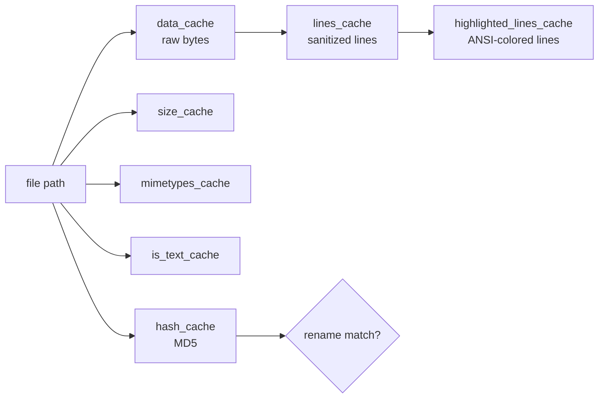
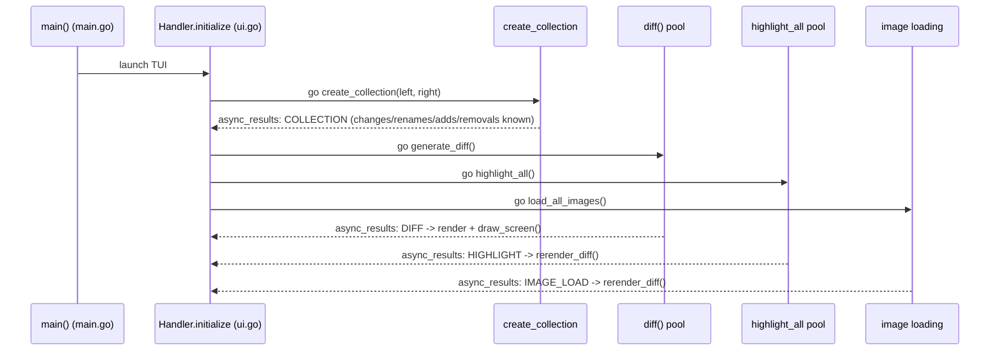

# How the kitty `diff` kitten works at runtime

*An observation-grounded onboarding explainer.*

- **Repository commit (pinned):** HEAD `815df1e210e0a9ab4622f5c7f2d6891d7dbeddf1`
- **Branch:** `kitty_815df1e210e0`
- **Subject:** the `diff` kitten under `kittens/diff/` and its two shared helpers `tools/utils/cache.go` and `tools/utils/images/utils.go`

> **Read-only guarantee.** This investigation modified **nothing** in the repository. `git status --porcelain` was empty after the work and HEAD was unchanged. Temporary observation harnesses were created **outside** the working tree under `/tmp/diffobs` and `/tmp/cacheobs`, built and run with the Go toolchain, and deleted afterward. The in-repository source files were only *read* (and, for two self-contained files, *copied* out of the tree read-only); they were never edited.

---

## Methodology

Per the governing rule (`SWE-AtlasQnA-Repo`), the findings below come from **two complementary activities**:

1. **Reading the source** at the pinned commit and quoting every literal (identifier, config key, default value, color code, size, count, error string) exactly, each with its `file:line` location.
2. **Running the code first.** Two self-contained components were compiled and executed in isolation, and their **verbatim** output is embedded in [Appendix — Observed output](#appendix--observed-output):
   - the anchored diff algorithm `kittens/diff/diff.go` (it imports only `bytes`, `fmt`, `sort`, `strings`), and
   - the `LRUCache` in `tools/utils/cache.go` (it imports only `container/list`, `fmt`, `sync`).

   These harnesses were built and run with **Go 1.22.12** (`go version` on the observation host reported `go1.22.12`; the `go.mod` requirement is `go 1.22`, `go.mod:L3`). Each harness was a copy of the repository file with only its `package` line renamed (via `sed`) plus a small driver `main.go`; the in-repo originals stayed on `package diff` / `package utils`.

**Full end-to-end TUI observation** (running the assembled `kitten` binary against real left/right directories) is the recommended downstream method, but it additionally requires generated Go sources plus C/Python development headers (`freetype`, `harfbuzz`, `fontconfig`, `lcms2`, `libpng`, `xkbcommon`, and the Python headers). Those were not needed for the two self-contained observations above, which is why the algorithm and the cache were exercised directly.

---

## The question, decomposed (Q1–Q8)

The onboarding question breaks into eight distinct sub-questions; each has its own section below, and a [coverage-pass checklist](#coverage-pass-checklist) at the end maps every one to its evidence.

- **Q1 — Directory pairing:** when pointed at two directories, how does the kitten decide *what belongs together*?
- **Q2 — Rename detection:** how does it recognize a *rename* rather than a deletion plus a new file?
- **Q3 — Caching efficiency:** how does the cache — from raw file contents through to highlighted output — stay efficient?
- **Q4 — Multi-file processing:** what actually happens when multiple files are processed at once (the concurrency model)?
- **Q5 — Parallel highlighting:** how does syntax highlighting run in parallel *without stepping on itself*?
- **Q6 — Binary/image handling:** what changes when binary files or images appear alongside plain text?
- **Q7 — Runtime trace:** what happens from the moment two directories are compared through to changes, renames, additions, and removals being *fully understood*?
- **Q8 — Diff matching + cache interplay:** how does the diff algorithm find matching regions while the cache keeps everything fast?

---

## Intuition: why it "feels fast" — and the one fact that reframes everything

**The headline correction for a new reader: the diff kitten is implemented in Go, not Python.** The Python `main.py` you might open first is only the `diff.conf`/CLI option schema. The runtime engine is a set of Go files that compile into the statically linked `kitten` binary.

At the pinned commit, `kittens/diff/` contains **ten Git-tracked `.go` files** plus **two small Python files**:

| File | Lines | Language | Role |
|------|------:|----------|------|
| `kittens/diff/render.go` | 770 | Go | Side-by-side rendering; text vs. binary vs. image dispatch |
| `kittens/diff/ui.go` | 686 | Go | TUI `Handler`; the asynchronous `async_results` pipeline |
| `kittens/diff/collect.go` | 405 | Go | Directory walk, file pairing, rename detection, the caches, text/binary/image detection |
| `kittens/diff/patch.go` | 377 | Go | Diff drivers (builtin/git/external); the parallel `diff()` orchestrator |
| `kittens/diff/diff.go` | 264 | Go | The anchored diff algorithm |
| `kittens/diff/highlight.go` | 228 | Go | Chroma syntax highlighting + parallel `highlight_all` |
| `kittens/diff/mouse.go` | 218 | Go | Mouse interaction |
| `kittens/diff/main.go` | 179 | Go | Entry point and startup orchestration |
| `kittens/diff/search.go` | 148 | Go | In-diff search (parallel, mutex-guarded) |
| `kittens/diff/collect_test.go` | 54 | Go | Unit test for `walk()` ignore-pattern behavior |
| `kittens/diff/main.py` | 310 | Python | `diff.conf` option schema + CLI argument definitions |
| `kittens/diff/__init__.py` | 9 | Python | `syntax_aliases` helper |

That is **3,648 lines total** across the twelve tracked files (verified with `wc -l` on `git ls-files kittens/diff/`). Note: after a build you will also see `cli_generated.go` and `conf_generated.go` in that directory, but those are **gitignored generated artifacts**, not source — which is why the authoritative count is ten hand-written `.go` files, not eleven.

Version grounding from `go.mod`: `module kitty` (`go.mod:L1`), `go 1.22` (`go.mod:L3`), and the syntax-highlighting backend `github.com/alecthomas/chroma/v2 v2.14.0` (`go.mod:L7`).

The official docs corroborate the design. The kitten is described as **"A fast side-by-side diff tool with syntax highlighting and images"** (`docs/kittens/diff.rst:L4`); among its features it **"Does recursive directory diffing"** (`docs/kittens/diff.rst:L20`) and, crucially, **"Does syntax highlighting of the displayed diffs, asynchronously, for maximum speed"** (`docs/kittens/diff.rst:L15-L16`).

**Why it feels fast** comes down to three cooperating design choices, each explored in detail below:

1. **CPU fan-out.** Both diffing and highlighting spread their per-file work across a worker pool sized to the machine's CPU count (`tools/utils/images/utils.go:L27-L56`). → *Q4, Q5*
2. **An asynchronous, streaming UI.** The collection result arrives first and the screen paints immediately; diffs, highlights, and images then stream in on a channel (`kittens/diff/ui.go:L132`, `L245-L273`), each completion triggering an incremental rerender. → *Q7*
3. **A layered, path-keyed cache.** Each file is read once, split into lines once, and highlighted once; every later rerender (scroll, resize, changing the number of context lines) re-serves from cache (`kittens/diff/collect.go:L20-L37`). → *Q3, Q8*

The rest of this document traces each of these precisely, quoting the code that implements them.

---

## Q1 — Directory pairing: deciding "what belongs together"

**Direct answer.** Two files "belong together" when they have the **identical path relative to their respective roots**. The kitten walks both directory trees, builds a set of relative names for each side, and intersects them; each name in the intersection is a candidate for comparison.

**How it works, step by step.**

`create_collection` (`kittens/diff/collect.go:L371`) inspects the left argument. If it `IsDir()` (`collect.go:L385`) it delegates to `collect_files` (`collect.go:L296`); otherwise the two arguments are treated as a single file-vs-file comparison and recorded directly with `add_change` (`collect.go:L401`).

`collect_files` walks *both* trees using the helper `walk()` (`kittens/diff/collect.go:L260-L294`), which is built on `filepath.WalkDir` (`collect.go:L265`). For each side it produces a `Set` of relative names and a map from each relative name to its absolute path.

The pairing itself is a single set intersection — this is the literal line that decides "what belongs together":

```go
common_names := left_names.Intersect(right_names)   // collect.go:L306
```

For every name in `common_names`, the raw contents are fetched (through the cache) and compared:

- If the bytes differ — `if ld != rd` (`collect.go:L317`) — it is recorded as a content change via `add_change` (`collect.go:L319`).
- If the bytes are identical but `os.Stat().Mode()` differs (`collect.go:L323`), it is recorded as a **mode-only** change (`collect.go:L320-L330`).

The walk also respects ignore globs: `allowed()` matches each name against the `ignore_name` patterns with `filepath.Match` (`kittens/diff/collect.go:L230-L238`), and a disallowed directory is pruned by returning `fs.SkipDir` (`collect.go:L272`).

**Validation against a real test.** This behavior is pinned by the repository's own unit test. `TestDiffCollectWalk` (`kittens/diff/collect_test.go:L19`) invokes `walk(tdir, []string{"*~", "#*#", "b"}, ...)` (`collect_test.go:L42`) and asserts the resulting relative-name set is exactly `"d", "e", "f/g", "h space"` (`collect_test.go:L33`). That proves the `*~` and `#*#` backup/scratch patterns are excluded, and that the pattern `b` removes both the file `b` *and* the directory `a/b`. The test file is 54 lines long (it ends at `collect_test.go:L54`).

**Reasoning (why this design).** Pairing by *relative path* is the cheapest correct notion of "the same file in both trees" — no heuristics are needed for the common case. Comparing raw content then distinguishes a genuine edit from a metadata-only (mode) change, so a chmod does not masquerade as a content diff. Finally, the ignore globs keep editor backup files (`*~`), Emacs autosave files (`#*#`), and any explicitly excluded names out of the comparison, so the diff reflects only files a human cares about.

---

## Q2 — Rename detection: a rename, not a delete + an add

**Direct answer.** After the common (same-path) files are handled, anything left over on only one side is a candidate. The kitten computes an **MD5 hash of every added and every removed file**, and when a removed file's hash equals an added file's hash **and** the two files are **byte-for-byte identical**, it reclassifies the pair as a **rename** instead of emitting a separate deletion and addition.

**How it works, step by step.**

The leftovers are computed by subtracting the common names from each side — quoted exactly:

```go
removed := left_names.Subtract(common_names)   // collect.go:L332
added := right_names.Subtract(common_names)     // collect.go:L333
```

An MD5 hash is computed for each candidate through `hash_for_path` (`kittens/diff/collect.go:L106-L116`), which calls `md5.Sum` (`collect.go:L112`) over the file's bytes and memoizes the result in the `hash_cache` (via `GetOrCreate`). The two loops that populate the per-side hash maps `ahash`/`rhash` live at `collect.go:L334-L346`.

The match loop (`kittens/diff/collect.go:L347-L364`) performs the reclassification. For each removed file it looks for an added file with an equal hash — `if ah == rh` (`collect.go:L350`) — and, on a hash hit, re-reads both files and confirms exact byte equality — `if ld == rd` (`collect.go:L353`). Only then does it call `add_rename` (`collect.go:L354`, defined at `collect.go:L175`) and remove that target from the additions with `added.Discard(n)` (`collect.go:L355`). A removed file with no match becomes `add_removal` (`collect.go:L362`); any additions still left over become `add_add` (`collect.go:L365-L367`).

**Reasoning (why this design).** The crux is the **double check: an MD5 hash pre-filter followed by an exact byte-equality comparison.** The hash makes the search cheap — instead of comparing every removed file against every added file byte-by-byte (which would be quadratic in file size), the kitten compares fixed-size hashes and only reads the full bytes when a hash collides. The subsequent `ld == rd` equality check is what makes the result *correct*: even in the astronomically unlikely event of an MD5 collision, two genuinely different files can never be reported as a rename, because the authoritative test is exact content equality, not the hash. This is precisely why a file that was moved (or renamed) but not otherwise edited shows up as a single rename entry rather than a confusing delete-plus-add pair. Note the natural limitation this implies: a rename combined with an edit changes the content, so the hashes differ and the pair is reported as a separate removal and addition — matching the kitten's definition of a rename as an *unchanged* file at a new path.

---

## Q3 — Caching efficiency: from raw contents to highlighted output

**Direct answer.** The kitten declares **seven `LRUCache` instances**, all keyed by file path and all sized `const sz = 4096` (`kittens/diff/collect.go:L29`). They form a layered pipeline — raw bytes feed line-splitting, which feeds highlighting — so each file is read once, split once, and highlighted once, and every subsequent rerender re-serves from cache. The caches differ in their *write* semantics, which determines which of them are bounded by eviction.

**The seven caches** are declared at `kittens/diff/collect.go:L20-L24` and initialized in `init_caches()` (`collect.go:L26-L37`):

| Cache | Type | What it holds |
|-------|------|---------------|
| `mimetypes_cache` | `*utils.LRUCache[string, string]` (`collect.go:L20`) | MIME type per path |
| `data_cache` | `*utils.LRUCache[string, string]` (`collect.go:L20`) | raw file bytes |
| `hash_cache` | `*utils.LRUCache[string, string]` (`collect.go:L20`) | MD5 hash per path (feeds Q2) |
| `size_cache` | `*utils.LRUCache[string, int64]` (`collect.go:L21`) | file size |
| `lines_cache` | `*utils.LRUCache[string, []string]` (`collect.go:L22`) | sanitized split lines |
| `highlighted_lines_cache` | `*utils.LRUCache[string, []string]` (`collect.go:L23`) | ANSI-colored lines |
| `is_text_cache` | `*utils.LRUCache[string, bool]` (`collect.go:L24`) | text vs. non-text verdict (feeds Q6) |

**The pipeline.** The main chain is `data_cache` → `lines_cache` → `highlighted_lines_cache`: raw bytes are produced by `data_for_path` (`kittens/diff/collect.go:L65-L70`), split into sanitized lines (cached in `lines_cache`), and finally highlighted (cached in `highlighted_lines_cache`). Alongside the chain are four branches keyed by the same path — `size_cache`, `mimetypes_cache`, `is_text_cache`, and `hash_cache` (the last of which feeds rename detection):



**Cache method semantics differ** (`tools/utils/cache.go`), and this is the subtle part:

- `GetOrCreate` (`tools/utils/cache.go:L39-L58`) takes an **exclusive** `Lock` (`cache.go:L48`), records the key in a `container/list` with `lru.PushFront` (`cache.go:L50`), and evicts the least-recently-used entry once the size limit is exceeded: `if self.max_size > 0 && self.lru.Len() > self.max_size` (`cache.go:L51`) then `self.lru.Remove(self.lru.Back())` and `delete(...)` (`cache.go:L52-L53`).
- `MustGetOrCreate` (`tools/utils/cache.go:L60-L72`) writes under an exclusive `Lock` (`cache.go:L68`) but does **not** track the LRU list — so it never evicts.
- `Set` (`tools/utils/cache.go:L32-L37`) writes under only a **shared** `RLock` (`cache.go:L33`) and does no LRU tracking (this is central to Q5).

**Consequence:** eviction bounds only the caches populated through `GetOrCreate`. Caches written only via `Set` or `MustGetOrCreate` grow unbounded within a single run — which is acceptable here because the limit is `sz = 4096`, file counts in a diff are modest, and every key is a distinct path (so there is no churn to evict anyway).

**Reasoning (why this design).** The whole point of the layered, path-keyed cache is to do each expensive operation — reading a file, splitting it into lines, syntax-highlighting it — **at most once**, then re-serve the result instantly on every rerender. A diff TUI rerenders constantly: when you scroll, when the terminal is resized, when you change the number of context lines. Without the cache each of those would re-read and re-highlight every visible file; with it, the second and all later renders are pure cache hits. This is a large part of why the kitten "feels fast" once the initial pass completes.

---

## Q4 — Multi-file processing: the concurrency model

**Direct answer.** Both diffing and highlighting fan out through one shared worker pool, `images.Context.Parallel` (`tools/utils/images/utils.go:L27-L56`). It enumerates the work items into a **buffered channel**, closes the channel, and starts up to `NumCPU` goroutines that drain it under a `sync.WaitGroup`. Because the channel is filled once and closed, **each work index is received by exactly one goroutine**, so no two workers ever touch the same file.

**The worker pool**, quoted structurally (`tools/utils/images/utils.go:L27-L56`):

- `count := stop - start` — the number of work items (`utils.go:L28`).
- The number of goroutines `procs` comes from `NumberOfThreads()` or, when unset, `runtime.NumCPU()` (`utils.go:L33-L36`), capped so it never exceeds `count` (`utils.go:L37-L38`).
- A **buffered** channel is created and filled with every index, then closed: `c := make(chan int, count)` (`utils.go:L41`), a fill loop (`utils.go:L42-L44`), and `close(c)` (`utils.go:L45`).
- `procs` goroutines each range over `c` and run the callback, synchronized by a `sync.WaitGroup` whose `wg.Wait()` (`utils.go:L55`) blocks until all work is done (`utils.go:L47-L55`).

**"Without stepping on itself" for work distribution.** Filling the channel once and closing it means every index is consumed exactly once. Two workers can never be handed the same file, so the *distribution* of work is race-free by construction — independent of what each worker then does.

**The parallel diff orchestrator** is `diff()` (`kittens/diff/patch.go:L352`). It:

1. creates a **buffered** results channel sized to the job count — `results := make(chan result, len(jobs))` (`patch.go:L360`);
2. runs `do_diff` for each job inside the pool — `ctx.Parallel(0, len(jobs), ...)` (`patch.go:L361-L368`);
3. after `close(results)` (`patch.go:L369`), assembles the output map **serially on the caller goroutine**: `ans[r.file1] = r.patch` (`patch.go:L374`).

This is a **safe** result-collection strategy: the workers only *send* on a channel; the single shared map is written by one goroutine after the pool has drained. No concurrent map access occurs.

The list of diff jobs is built by `generate_diff` in `ui.go` (`kittens/diff/ui.go:L142-L159`), which only pairs text files: `if is_path_text(path) && is_path_text(changed_path)` (`ui.go:L147`). It then calls `diff(...)` (`ui.go:L155`) on a goroutine.

**Reasoning (why this design).** Bounding parallelism to the CPU count avoids oversubscription while still using every core; handing each file to exactly one worker eliminates duplicated effort. The diff path goes one step further and deliberately **decouples parallel production from serial assembly** — workers produce results concurrently, but the shared map is populated by a single goroutine — which keeps the whole path free of data races without needing a lock in the hot loop.

---

## Q5 — Parallel highlighting "without stepping on itself" — and a tale of three strategies

**Direct answer.** Highlighting uses the same worker pool as diffing, so the *work distribution* is safe (each file goes to one worker). What differs is how each worker publishes its result. Highlighting writes each result **straight into the shared `highlighted_lines_cache` via `Set`**, and `Set` holds only a read lock while mutating a Go map. That is a genuine data race — one this investigation reproduced empirically under Go's race detector — even though it rarely crashes the real kitten. Reporting it (not fixing it) is in scope for this read-only study.

**The highlighting path.** `ui.go`'s `highlight_all` method (`kittens/diff/ui.go:L179-L188`) filters to text files — `text_files := utils.Filter(self.collection.paths_to_highlight.AsSlice(), is_path_text)` (`ui.go:L180`) — and calls the package-level `highlight_all` (`kittens/diff/highlight.go:L217-L228`) on a goroutine. That function fans out with `ctx.Parallel(0, len(paths), ...)` (`highlight.go:L219`); each worker highlights one file with `highlight_file` (`highlight.go:L161`). The Chroma pipeline inside `highlight_file` is: pick a lexer with `lexers.Match` (`highlight.go:L175`), fall back to `lexers.Analyse` (`highlight.go:L178`), consult `conf.Syntax_aliases[ext]` (`highlight.go:L166`), coalesce tokens with `chroma.Coalesce` (`highlight.go:L184`), select a style from `conf.Pygments_style` (`highlight.go:L185`) or `DefaultStyle()` (`highlight.go:L188`, defined at `highlight.go:L26-L29`), and tokenize with `lexer.Tokenise(nil, text)` (`highlight.go:L205`).

**The subtle part.** Each worker writes its result straight into the shared cache:

```go
highlighted_lines_cache.Set(path, text_to_lines(raw))   // highlight.go:L224
```

and `Set` (`tools/utils/cache.go:L32-L37`) holds only an `RLock` (`cache.go:L33`) while mutating the underlying Go map at `self.data[key] = val` (`cache.go:L34`). Distinct keys prevent *logical* clobbering (no two workers overwrite each other's value), but concurrent **writes to a Go map are never safe**, regardless of key — the Go runtime actively detects and aborts on them.

**Three contrasting concurrency strategies in this one kitten.** The codebase actually demonstrates three different ways to collect results from the same worker pool — two safe, one racy — which is instructive:

| Strategy | Where | Mechanism | Safe? |
|----------|-------|-----------|-------|
| (a) Buffered channel + serial map assembly | `diff()` (`patch.go:L360`, `L369-L374`) | workers send on a channel; caller builds the map after `close` | **Safe** |
| (b) Mutex-guarded shared map | `search()` (`search.go:L103`) | shared `map[ScrollPos][]Span` (`search.go:L106`) guarded by `mutex := sync.Mutex{}` (`search.go:L108`), with `mutex.Lock()` / `defer mutex.Unlock()` (`search.go:L117-L118`) around the write (`search.go:L120`) | **Safe** |
| (c) Direct `Set` under `RLock` | `highlight_all` (`highlight.go:L224` → `cache.go:L34`) | each worker writes the shared map with only a read lock held | **Racy** |

The empirical demonstration of strategy (c)'s hazard is captured in [Appendix Observation 2](#observation-2--lrucache-concurrent-write-tmpcacheobs): an isolated copy of `LRUCache` driven by many goroutines calling `Set` with **distinct** keys reproduces `fatal error: concurrent map writes` at `cache.go:34`, and under `-race` a confirmed `WARNING: DATA RACE` at the same line, with the generic type shape `go.shape.string,go.shape.[]string` — exactly matching `highlighted_lines_cache`'s `[string, []string]` type.

**Reasoning (why it usually doesn't crash, yet is still a real race).** Work *distribution* is safe by construction (each index once). The hazard lives only in the *result-collection* step, and only `highlight_all` uses the unguarded `Set`. In the real kitten it rarely manifests because each worker spends milliseconds tokenising a file before its single `Set`, so the individual map writes are spread far apart in time and almost never coincide. But "almost never" is not "never": under `-race`, or on a machine with many cores and many small files, two `Set` calls can land simultaneously and the Go runtime aborts the process. The safe alternatives (a) and (b) show the fix would be straightforward — serialize the writes or take an exclusive lock — but per the read-only rule this document *reports* the finding rather than changing the code.

---

## Q6 — Binary and image files alongside plain text

**Direct answer.** Each path gets a single cached verdict — text, binary, or image — computed once by a UTF-8 validity check (with images and `/dev/null` special-cased). At render time the kitten dispatches on that verdict: text is diffed and highlighted normally, non-image binaries show a "Binary file" line with a human-readable size, and images are drawn through the kitty graphics protocol with a "Loading image..." placeholder until they are ready. Only text files are ever diffed or highlighted, because the job lists are pre-filtered.

**Classification.** `is_path_text` (`kittens/diff/collect.go:L86-L104`) caches its per-path answer in `is_text_cache` via `MustGetOrCreate`. It returns:

- `false` for images — `is_image` derives from `mimetype_for_path` having the prefix `"image/"` (`collect.go:L82-L84`, checked at `collect.go:L88-L90`);
- `false` for the `/dev/null` device, detected with `os.SameFile` (`collect.go:L91-L97`);
- otherwise the result of `utf8.ValidString(d)` (`kittens/diff/collect.go:L102`) — that is, a file is "text" exactly when its bytes are valid UTF-8.

**Render-time dispatch.** `render()` (`kittens/diff/render.go:L696`) computes `is_binary := !is_path_text(path)` (`render.go:L706`) and `is_img` (`render.go:L710`), then a `switch item_type` (`kittens/diff/render.go:L712-L759`) routes each item:

- **images** → `image_lines` (defined at `render.go:L333`), which shows the placeholder string `"Loading image..."` (`render.go:L364`) until the graphics load completes, and draws through the kitty graphics protocol via the `image_collection` (the `kitty/tools/tui/graphics` import at `render.go:L13`);
- **non-image binaries** → `binary_lines` (defined at `render.go:L446`), which renders `fmt.Sprintf("Binary file: %s", human_readable(sz))` — i.e. the literal format `"Binary file: %s"` (`render.go:L452`);
- **text** → the normal diff renderer `lines_for_diff` (`render.go:L721`) or `all_lines` (`render.go:L734`);
- **rename** → `rename_lines` (`render.go:L752-L753`);
- an unrecognized type is a hard error: `return fmt.Errorf("Unknown change type: %#v", item_type)` (`kittens/diff/render.go:L758`).

**Only text is diffed and highlighted.** Both job lists are filtered by `is_path_text`: the diff jobs at `ui.go:L147` and the highlight list at `ui.go:L180`. Binaries and images never enter the diff or highlight worker pools at all.

**Reasoning (why this design).** A single cached UTF-8 check classifies each path once and cheaply — there is no need to re-sniff a file on every render. The dispatch then respects what each kind of file *can* meaningfully show: a binary cannot be line-diffed usefully, so the kitten shows its size instead; an image is best shown as an image, so it is drawn with the terminal's graphics protocol rather than as text; and filtering the job lists up front means worker time is never wasted trying to diff or highlight something that is not text.

---

## Q7 — End-to-end runtime trace: two directories → everything understood

**Direct answer.** `main()` validates arguments and initializes the caches, then hands off to a TUI `Handler`. The handler spawns the collection on a goroutine; the moment collection finishes, the *entire* classification (changes, renames, additions, removals) is known. That single result then triggers diffing, highlighting, and image loading **concurrently**, and each of those completions streams back on a channel to drive an incremental rerender.

**Startup — `main()` (`kittens/diff/main.go:L102-L175`):**

1. Load configuration: `load_config(opts)` (`main.go:L104`).
2. Require exactly two arguments, else error with the exact string `"You must specify exactly two files/directories to compare"` (`main.go:L108-L110`).
3. Select the diff driver: `set_diff_command(conf.Diff_cmd)` (`main.go:L111`).
4. Initialize the caches and formatters: `init_caches()` (`main.go:L114`) and `create_formatters()` (`main.go:L115`).
5. Reject a directory-vs-file mismatch — `if isdir(left) != isdir(right)` (`main.go:L129`) — with the error string reproduced **exactly**, including its trailing stray apostrophe: `"The items to be diffed should both be either directories or files. Comparing a directory to a file is not valid.'"` (`kittens/diff/main.go:L130`).
6. Launch the TUI.

**The asynchronous pipeline — `Handler` in `ui.go`.** `Handler.initialize` (`kittens/diff/ui.go:L114`) creates the results channel `self.async_results = make(chan AsyncResult, 32)` (`ui.go:L132`) and spawns `create_collection(self.left, self.right)` on a goroutine (`ui.go:L133-L138`); when collection completes it pushes a `COLLECTION` result.

`handle_async_result` (`kittens/diff/ui.go:L245`) switches on the `ResultType` (the constants `COLLECTION`, `DIFF`, `HIGHLIGHT`, `IMAGE_LOAD`, `IMAGE_RESIZE` are declared at `ui.go:L25-L29`):

- on `COLLECTION` (`ui.go:L247`) it concurrently kicks off `generate_diff()` (`ui.go:L249`), `highlight_all()` (`ui.go:L250`), and `load_all_images()` (`ui.go:L251`);
- on `DIFF` (`ui.go:L252`) it renders and calls `draw_screen()` (`ui.go:L256`, `L268`);
- on `IMAGE_LOAD, HIGHLIGHT` (`ui.go:L272`) it performs an incremental `rerender_diff()` (`ui.go:L273`).



**Key insight.** Changes, renames, additions, and removals are "fully understood" the instant the `COLLECTION` result is delivered — that is, when `collect_files` returns, having run Q1's pairing and Q2's rename detection to completion. Everything after that (diffs, syntax highlighting, images) is *progressive enhancement* that streams in asynchronously, each completion nudging the screen to rerender. (`mouse.go` — also Go, `package diff` at `mouse.go:L3`, importing `"kitty"` at `mouse.go:L12` — drives interaction in the same loop; it is context here, not part of the classification path.)

**Reasoning (why this design).** The collection pass is the single authoritative classification step, and it is fast (a directory walk plus set operations plus, for candidates, MD5 hashing). By delivering that result first and only *then* fanning out the heavier per-file work, the UI can paint the complete file list immediately and fill in diff bodies, colors, and images as they become ready. That is exactly the behavior the docs advertise as asynchronous highlighting "for maximum speed" (`docs/kittens/diff.rst:L15-L16`), and it is why the tool feels responsive even on large trees.

---

## Q8 — Finding matching regions while the cache keeps it fast

**Direct answer.** For the builtin driver, the kitten uses an **anchored diff**: it finds lines that appear **exactly once on both sides** ("unique" lines), computes the longest common subsequence of *those* lines to anchor the matching regions, and fills in the gaps between anchors. This runs in `O(n log n)` rather than the classic `O(n²)`. The caches (`data_cache`, `lines_cache`) ensure the algorithm's inputs — file bytes and split lines — are always ready without any redundant I/O.

**The builtin path.** `run_diff` (`kittens/diff/patch.go:L282`) resolves symlinks with `filepath.EvalSymlinks` (`patch.go:L286`, `L290`); when no external command is configured — `len(diff_cmd) == 0` (`patch.go:L294`) — it reads the cached file bytes and calls `Diff()` (`patch.go:L303`), the Go anchored-diff function. The per-job worker is `do_diff` (`patch.go:L330`), invoked in parallel by `diff()` as described in Q4.

**The anchored algorithm — `Diff` (`kittens/diff/diff.go:L49-L167`):**

- If the inputs are identical it returns immediately with no output: `if old == new { return nil }` (`diff.go:L50-L52`) — the empty-input behavior confirmed empirically in [Appendix Observation 1](#observation-1--anchored-diff-tmpdiffobs) as `len(out)=0 isNil=true`.
- It splits each side into lines with `lines()` (`diff.go:L172-L182`), using `strings.SplitAfter(x, "\n")` (`diff.go:L173`) so newlines are retained.
- It prints the unified-diff headers `"diff %s %s\n"` (`diff.go:L58`), `"--- %s\n"` (`diff.go:L59`), and `"+++ %s\n"` (`diff.go:L60`).
- It walks the matching regions returned by `tgs(x, y)` (`diff.go:L74`).

**The anchor selection — `tgs()` (`kittens/diff/diff.go:L192-L264`)** returns the pairs of indexes of the longest common subsequence of unique lines. A "unique" line is identified by the sentinel test `if m[s] == -1+-4` (`kittens/diff/diff.go:L217`) — i.e. a line seen exactly once on each side. The longest-common-subsequence computation uses Szymanski's TGS algorithm, referenced in-source at `diff.go:L188-L191` (with the URL `https://research.swtch.com/tgs170.pdf`), and the sequence is framed by the sentinels `{0, 0}` (`diff.go:L262`) and `{len(x), len(y)}` (`diff.go:L254`).

**Alternative drivers.** `set_diff_command` (`kittens/diff/patch.go:L44-L60`) chooses the driver from `conf.Diff_cmd`: `auto` (`patch.go:L46`) runs `find_differ`; `builtin` or `""` (`patch.go:L48`) leaves the command empty so the Go `Diff` is used; `diff` (`patch.go:L50`) and `git` (`patch.go:L52`) shell out to external tools; any other value is treated as a custom command (`patch.go:L54`). The two external command templates are quoted exactly:

```
GIT_DIFF  = `git diff --no-color --no-ext-diff --exit-code -U_CONTEXT_ --no-index --`   // patch.go:L21
DIFF_DIFF = `diff -p -U _CONTEXT_ --`                                                    // patch.go:L22
```

**Cache interplay.** Because `data_cache` guarantees each file is read only once and `lines_cache` guarantees each file is split into lines only once, `Diff`/`do_diff` never re-read or re-split their inputs no matter how many times the view rerenders. The number of context lines shown around each change defaults to `3` — `num_context_lines` default `3` (`kittens/diff/main.py:L37`) — and is what the `_CONTEXT_` placeholder above is substituted with for the external drivers.

**Lineage (web-research corroboration, synthesized).** `kittens/diff/diff.go` is a copy of Go's standard-library `internal/diff` package (the in-source comment block at `diff.go:L21-L48` says so, and the `diff_cmd` help text in `main.py` describes the builtin as the "anchored diff algorithm from the Go standard library"). The upstream Go documentation confirms the naming and rationale: the approach is closely related to what some tools call "patience diff" (after the patience-sorting card game), but the Go authors deliberately avoid that name — they consider it imprecise and note it is often misread as implying a *slower* algorithm, whereas the anchored diff is in fact **faster** than the standard one. As the upstream package doc puts it, it is called an anchored diff because <cite index="1-2">the unique lines anchor the chosen matching regions</cite> (`pkg.go.dev/internal/diff`).

**Reasoning (why this design).** Anchoring on *unique* lines is the key idea: ordinary diffs can waste matches on ubiquitous lines like blank lines or a lone closing brace `}`, producing noisy, hard-to-read hunks. By matching only lines that occur exactly once on each side, the anchored diff lines up the parts a human would recognize as "the same code," yielding cleaner hunks — and, because the longest-common-subsequence step operates over the (few) unique lines rather than all lines, it achieves the `O(n log n)` bound instead of `O(n²)`. The caches complete the picture: they remove all redundant reading and splitting so the algorithm's inputs are always instantly available, which is why re-diffing on rerender costs essentially nothing.

---

## Configuration and version literals (quoted exactly)

Diff behavior is configured through `diff.conf`, whose options and defaults are declared in `kittens/diff/main.py`. The `__init__.py` helper `syntax_aliases(x)` (`kittens/diff/__init__.py:L4`) parses the `key:value` alias string. All values below are quoted verbatim from the source at the pinned commit.

| Setting / literal | Value (exact) | Location |
|-------------------|---------------|----------|
| `syntax_aliases` (default) | `pyj:py pyi:py recipe:py` | `kittens/diff/main.py:L29` |
| `num_context_lines` (default) | `3` | `kittens/diff/main.py:L37` |
| `diff_cmd` (default) | `auto` | `kittens/diff/main.py:L41` |
| `replace_tab_by` (default) | `\x20\x20\x20\x20` | `kittens/diff/main.py:L52` |
| `pygments_style` (default) | `default` | `kittens/diff/main.py:L74` |
| `removed_bg` | `#ffeef0` | `kittens/diff/main.py:L110` |
| `highlight_removed_bg` | `#fdb8c0` | `kittens/diff/main.py:L115` |
| `added_bg` | `#e6ffed` | `kittens/diff/main.py:L123` |
| `highlight_added_bg` | `#acf2bd` | `kittens/diff/main.py:L128` |
| Cache size | `const sz = 4096` | `kittens/diff/collect.go:L29` |
| External git template `GIT_DIFF` | `` `git diff --no-color --no-ext-diff --exit-code -U_CONTEXT_ --no-index --` `` | `kittens/diff/patch.go:L21` |
| External diff template `DIFF_DIFF` | `` `diff -p -U _CONTEXT_ --` `` | `kittens/diff/patch.go:L22` |
| Image placeholder | `"Loading image..."` | `kittens/diff/render.go:L364` |
| Binary label format | `"Binary file: %s"` | `kittens/diff/render.go:L452` |
| Unknown-type error format | `"Unknown change type: %#v"` | `kittens/diff/render.go:L758` |
| Two-args error | `"You must specify exactly two files/directories to compare"` | `kittens/diff/main.go:L109` |
| Dir-vs-file error (note trailing `.'`) | `"The items to be diffed should both be either directories or files. Comparing a directory to a file is not valid.'"` | `kittens/diff/main.go:L130` |
| Go module | `module kitty` | `go.mod:L1` |
| Go version | `go 1.22` | `go.mod:L3` |
| Chroma | `github.com/alecthomas/chroma/v2 v2.14.0` | `go.mod:L7` |

---

## Appendix — Observed output

Both harnesses were created **outside** the repository under `/tmp`, run, and then deleted; the in-repo source files were copied read-only (only the `package` line changed via `sed`) and never modified. Captured with **Go 1.22.12** on a host reporting `NumCPU=128`. The goroutine IDs and hex addresses below are nondeterministic and will differ from run to run, but the **strings and `file:line` locations are stable**.

### Observation 1 — anchored diff (`/tmp/diffobs`)

Producing commands:

```sh
REPO=/tmp/blitzy/kitty/blitzy-5f51bebf-d531-40ac-a4c3-be015e2031ae_83f176
mkdir -p /tmp/diffobs
# Copy diff.go out of the repo, renaming only the package line (repo copy untouched):
sed 's/^package diff/package main/' "$REPO/kittens/diff/diff.go" > /tmp/diffobs/diff.go
# Add a driver main.go that calls:
#   Diff("a/hello.go", old, "b/hello.go", new, 3)   with a small edited Go snippet
#   Diff("a", "same\n", "b", "same\n", 3)            the identical-input case
cd /tmp/diffobs && go mod init diffobs && go build -o diffobs . && ./diffobs
```

Verbatim output (exit status 0), reproduced byte-for-byte:

```text
diff a/hello.go b/hello.go
--- a/hello.go
+++ b/hello.go
@@ -2,8 +2,10 @@
 
 import "fmt"
 
-func greet(name string) {
-	fmt.Println("Hello", name)
+// greet prints a friendly salutation
+func greet(who string) {
+	fmt.Println("Hello", who)
+	fmt.Println("Welcome!")
 }
 
 func main() {
len(out)=0 isNil=true
```

**What this shows.** The hunk header is `@@ -2,8 +2,10 @@`. The unchanged blank line, the `import "fmt"` line, the closing `}`, and `func main()` each appear exactly once on both sides, so they act as **unique-line anchors**; only the `greet()` region between anchors is emitted as `-`/`+`. The trailing `len(out)=0 isNil=true` is the identical-input case, empirically confirming the early-return `if old == new { return nil }` at `kittens/diff/diff.go:L50-L52`.

### Observation 2 — `LRUCache` concurrent write (`/tmp/cacheobs`)

Producing commands:

```sh
REPO=/tmp/blitzy/kitty/blitzy-5f51bebf-d531-40ac-a4c3-be015e2031ae_83f176
mkdir -p /tmp/cacheobs
# Copy cache.go out of the repo, renaming only the package line (repo copy untouched):
sed 's/^package utils/package main/' "$REPO/tools/utils/cache.go" > /tmp/cacheobs/cache.go
# Driver main.go: spawn NumCPU goroutines behind a start barrier (in a repeat loop),
# each calling c.Set(key, []string{key}) with a DISTINCT key.
cd /tmp/cacheobs && go mod init cacheobs
go build -o cacheobs . && ./cacheobs                     # plain build
go build -race -o cacheobs_race . && ./cacheobs_race     # race detector
```

Plain build, verbatim (exit status 2):

```text
NumCPU=128
fatal error: concurrent map writes

goroutine 113 [running]:
main.(*LRUCache[...]).Set(0x7, {0xc000482010?, 0x2?}, {0xc000484010?, 0x1, 0x1})
	/tmp/cacheobs/cache.go:34 +0x85
main.main.func1(0x6b)
	/tmp/cacheobs/main.go:23 +0x153
created by main.main in goroutine 1
	/tmp/cacheobs/main.go:19 +0x24a
```

Race build, verbatim (exit status 2):

```text
NumCPU=128
==================
WARNING: DATA RACE
Write at 0x00c0001b80f0 by goroutine 70:
  runtime.mapassign_faststr()
      /usr/local/go/src/runtime/map_faststr.go:203 +0x0
  main.(*LRUCache[go.shape.string,go.shape.[]string]).Set()
      /tmp/cacheobs/cache.go:34 +0xa4
  main.main.func1()
      /tmp/cacheobs/main.go:23 +0x206
  main.main.gowrap1()
      /tmp/cacheobs/main.go:24 +0x41

Previous write at 0x00c0001b80f0 by goroutine 9:
  runtime.mapassign_faststr()
      /usr/local/go/src/runtime/map_faststr.go:203 +0x0
  main.(*LRUCache[go.shape.string,go.shape.[]string]).Set()
      /tmp/cacheobs/cache.go:34 +0xa4
  main.main.func1()
      /tmp/cacheobs/main.go:23 +0x206
  main.main.gowrap1()
      /tmp/cacheobs/main.go:24 +0x41

Goroutine 70 (running) created at:
  main.main()
      /tmp/cacheobs/main.go:19 +0x390

Goroutine 9 (finished) created at:
  main.main()
      /tmp/cacheobs/main.go:19 +0x390
==================
fatal error: concurrent map writes
fatal error: concurrent map writes
fatal error: concurrent map writes
```

**What this shows.** Both builds crash inside `Set` at **`/tmp/cacheobs/cache.go:34`** — the map write `self.data[key] = val` that `Set` performs while holding only `RLock()` (`tools/utils/cache.go:L32-L37`, with `RLock` at `cache.go:L33`). This is exactly the location the source analysis predicts for `highlight_all`'s `highlighted_lines_cache.Set(...)` (`kittens/diff/highlight.go:L224`), and the generic type shape `go.shape.string,go.shape.[]string` in the race report matches `highlighted_lines_cache`'s declared type `*utils.LRUCache[string, []string]` (`collect.go:L23`) precisely. The distinct keys prove the crash is *not* logical clobbering but Go's fundamental prohibition on concurrent map writes.

**Caveat.** In the real kitten this race rarely manifests, because each worker spends milliseconds tokenising a file before its single `Set`, spacing the map writes far apart. The harness reproduces it reliably only by launching all writers simultaneously behind a start barrier inside a repeat loop. The harness's own `main.go` line numbers (19/23/24) are incidental; the stable, meaningful facts are the crash string and the `cache.go:34` location. Per the read-only rule, this is **reported, not fixed**.

---

## Coverage-pass checklist

Every sub-question of the original onboarding question is answered above:

| # | Sub-question | Section | Primary evidence |
|---|--------------|---------|------------------|
| Q1 | Directory pairing ("what belongs together") | [§Q1](#q1--directory-pairing-deciding-what-belongs-together) | `collect.go:L296`, `L306` (`Intersect`); test `collect_test.go:L19-L54` |
| Q2 | Rename detection (not delete + add) | [§Q2](#q2--rename-detection-a-rename-not-a-delete--add) | `collect.go:L332-L364`; `md5.Sum` `collect.go:L112` |
| Q3 | Caching efficiency (raw → highlighted) | [§Q3](#q3--caching-efficiency-from-raw-contents-to-highlighted-output) | `collect.go:L20-L37`; `cache.go:L32-L72` |
| Q4 | Multi-file processing (concurrency model) | [§Q4](#q4--multi-file-processing-the-concurrency-model) | `images/utils.go:L27-L56`; `patch.go:L352-L374` |
| Q5 | Parallel highlighting "without stepping on itself" | [§Q5](#q5--parallel-highlighting-without-stepping-on-itself--and-a-tale-of-three-strategies) | `highlight.go:L217-L228`; Appendix Obs 2; contrast `search.go:L108-L120` |
| Q6 | Binary/image handling | [§Q6](#q6--binary-and-image-files-alongside-plain-text) | `collect.go:L86-L104`; `render.go:L706-L758`, `L364`, `L452` |
| Q7 | End-to-end runtime trace | [§Q7](#q7--end-to-end-runtime-trace-two-directories--everything-understood) | `main.go:L102-L130`; `ui.go:L114-L138`, `L245-L273` |
| Q8 | Diff matching + cache interplay | [§Q8](#q8--finding-matching-regions-while-the-cache-keeps-it-fast) | `diff.go:L49-L264`; `patch.go:L282-L303`; the caches |

**Read-only guarantee, restated.** This investigation modified nothing in the repository; the only artifact produced is this document. All findings are pinned to HEAD `815df1e210e0a9ab4622f5c7f2d6891d7dbeddf1`, and the temporary observation harnesses under `/tmp/diffobs` and `/tmp/cacheobs` were removed after their output was captured.
