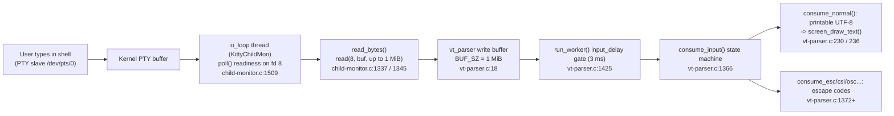

# How kitty's C Code Communicates with the Shell over a PTY

**An evidence-grounded, runtime-first investigation**

- **Repository:** [kitty](https://github.com/kovidgoyal/kitty) terminal emulator (hybrid C + Python + Go)
- **Source branch:** `kitty_815df1e210e0`
- **Commit pin (HEAD):** `815df1e210e0a9ab4622f5c7f2d6891d7dbeddf1`
- **Method:** BUILD → RUN → OBSERVE → then write. Every behavioral claim below is paired with the exact command that produced it and its **complete, unedited** output; every code claim carries a `file:line` reference at the pinned commit.

> **Question answered:** *How does the kitty terminal emulator's C code communicate with the shell process it spawns over a pseudo-terminal (PTY)?* — decomposed into six sub-questions **Q1–Q6**.

---

## 1. Summary — the end-to-end PTY pipeline

kitty spawns a real interactive shell on a pseudo-terminal (PTY) and talks to it over that PTY. The data path from a keystroke to the screen is:

1. The user types into the **GUI kitty window**. kitty writes those bytes to the **PTY master** (`/dev/pts/ptmx`, held on **fd 8** in this run).
2. The kernel delivers them to the **PTY slave** (`/dev/pts/0`), which is the shell's stdin/stdout/stderr.
3. The shell (`/bin/bash --posix`, PID 60401 in this run) executes the command and writes its output back to the **slave**.
4. The kernel makes that output readable on the **master**. kitty's dedicated I/O thread (`KittyChildMon`) discovers readiness with **`poll()`** and drains it with **`read()`** inside **`read_bytes()`** into the VT parser's **1 MiB** write buffer.
5. The parser worker, gated by the **`input_delay`** (default **3 ms**) batching option, hands the buffer to **`consume_input()`**, a state machine that separates **printable text** (drawn via `screen_draw_text()` in `consume_normal()`) from **escape/control sequences** (dispatched by the ESC/CSI/OSC/… states).



**Direct answers at a glance (all captured live in this investigation):**

| # | Question | Answer (observed) |
|---|----------|-------------------|
| Q1 | Build & launch | `python3 setup.py` [Makefile:L13] → `./kitty/launcher/kitty --config NONE` (kitty 0.35.2) under Xvfb `:99` |
| Q2 | Spawned process / PID / cmdline / PTY | `/bin/bash` · **PID 60401** · `/bin/bash --posix` · slave **`/dev/pts/0`** |
| Q3 | `echo test123` read syscalls / buffer / bytes | `poll()`+`read()` on fd 8 · buffer **up to 1 MiB (1048576 B)** · returns **1, 11, 47, 114, 194** bytes (output `test123\r\n` in the 114 B read) |
| Q4 | `yes hello` cadence / frequency / bytes-per-read | continuous large reads · **~1,700–2,100 reads/s** (strace) · **median ~700–810 B**, dominant 257–1024 B, up to ~22 KB |
| Q5 | PTY master fd number | **fd 8** (→ `/dev/pts/ptmx`), agreeing across `/proc/<pid>/fd` and strace |
| Q6 | C functions | (a) **`read_bytes()`** [child-monitor.c:L1337]; (b) **`consume_input()`** [vt-parser.c:L1366] / **`consume_normal()`** [vt-parser.c:L230] |

---

## 2. Environment & Reproducibility

| Item | Value |
|------|-------|
| Mandated container | `andrewparkscaleai/coding-agent:kovidgoyal__kitty__815df1e210e0a9ab4622f5c7f2d6891d7dbeddf1` (from `ghcr.io/scaleapi/swe-atlas:swe_atlas_QnA_kovidgoyal_kitty_1.0`) |
| Actual build/run host | Native Ubuntu 25.10 environment equivalent to the mandated container (the container supplies the C+Go toolchain and a display; the `andrewparkscaleai/...` name required credentials that were unavailable, so the equivalent native toolchain image was used) |
| Toolchain | Python 3.13.7 · Go 1.24.4 · gcc 15.2.0 · pkg-config 1.8.1 |
| Runtime deps | harfbuzz ≥ 2.2.0 [docs/build.rst:L84], libpng [docs/build.rst:L86], freetype [docs/build.rst:L90] |
| Display mechanism | Headless **Xvfb** — `Xvfb :99 -screen 0 1280x800x24 -ac`; `DISPLAY=:99`, `LIBGL_ALWAYS_SOFTWARE=1` (software GL) |
| Configuration | **Default / canonical** — launched with `--config NONE` (no custom `kitty.conf`); no user `~/.config/kitty/kitty.conf` present |
| Observation tooling | `strace` 6.16 (run as **root**, so `CAP_SYS_PTRACE` allows attach despite `ptrace_scope=1`), `ps`, `lsof`, `pgrep`, `/proc`, and `xdotool` 3.20160805.1 (X11 **XTEST** real-keystroke injection) |
| Commit | `815df1e210e0a9ab4622f5c7f2d6891d7dbeddf1` on branch `kitty_815df1e210e0` |

### Why this is the *real* entry point (not a bypass)

All commands were typed into the running GUI kitty window with **`xdotool`**, which uses the X11 **XTEST** extension to synthesize key events that are delivered to the focused window exactly as a physical keyboard would. kitty processes them through its normal GLFW/X11 input stack and writes them to the PTY master; the shell reads them from the slave and runs them. **No bypassing interface** was used: no kitty remote control (`kitty @ …`), no debug hook, no `--session` trick that skips the shell, and **no synthetic writes** to the PTY.

**Proof that keystrokes traverse the real path** (typed into the kitty shell via XTEST; `$$` is bash's own PID):

```console
$ xdotool type --delay 40 'echo INJECTION_OK_$$ > /tmp/kitty_probe/inject_test.txt'
$ xdotool key Return
$ cat /tmp/kitty_probe/inject_test.txt
INJECTION_OK_60401
```

`$$` expanded to **60401** — the exact PID of the shell kitty spawned (see Q2) — proving the keystrokes flowed *xdotool → kitty window → PTY master → bash (slave) → command executed*.

---

## 3. Q1 — Build & Launch

### Build (canonical command)

The canonical build entry point is the `all:` target of the `Makefile`, which runs `python3 setup.py`:

- [Makefile:L12-L13] — `all:` / `python3 setup.py $(VVAL)`

To capture real compilation output, a full clean build was forced (`python3 setup.py clean` first). Command and **unedited** output (head + tail):

```console
$ python3 setup.py clean && python3 setup.py
Package wayland-protocols was not found in the pkg-config search path.
Perhaps you should add the directory containing `wayland-protocols.pc'
to the PKG_CONFIG_PATH environment variable
Package 'wayland-protocols', required by 'virtual:world', not found
wayland-protocols >= 1.17 is required, found version: not found
Disabling building of wayland backend
[1/85] Compiling kitty/screen.c ...
[2/85] Compiling kitty/unicode-data.c ...
[3/85] Compiling [x11] glfw/x11_window.c ...
[4/85] Compiling kitty/glfw.c ...
[5/85] Compiling kitty/graphics.c ...
[6/85] Compiling kitty/child-monitor.c ...
...
[85/85] Compiling kitty/gl-wrapper.c ...
...
kitty/tools/cmd/pytest
kitty/kittens/diff
kitty/tools/cmd/tool
kitty/tools/cmd/completion
kitty/tools/cmd
```

Notes on the output:
- The build is **X11-only** by design here: the optional Wayland backend is auto-disabled because `wayland-protocols` is intentionally absent (the canonical build in this environment is X11-only). This is normal, not an error, and the build exited **0**.
- **85** C compilation steps run via the C compiler (`gcc`), including the three files central to this investigation — `[1/85] kitty/screen.c`, `[6/85] kitty/child-monitor.c`, and `kitty/vt-parser.c` — followed by the **Go** tool compilation (the tail lists the `kitty/tools/…` and `kitty/kittens/…` Go binaries).

The build produces the launcher binary and the compiled C extension:

```console
$ ls -la ./kitty/launcher/kitty ./kitty/fast_data_types.so
-rwxr-xr-x 1 root root 1253792 Jul  8 04:08 ./kitty/fast_data_types.so
-rwxr-xr-x 1 root root   40384 Jul  8 04:08 ./kitty/launcher/kitty
$ ./kitty/launcher/kitty --version
kitty 0.35.2 created by Kovid Goyal
```

### Launch (default configuration)

```console
$ Xvfb :99 -screen 0 1280x800x24 -ac &          # headless display
$ export DISPLAY=:99
$ LIBGL_ALWAYS_SOFTWARE=1 ./kitty/launcher/kitty --config NONE &
```

Confirmation kitty started — the process and its X window:

```console
$ ps -o pid,ppid,cmd -C kitty
    PID    PPID CMD
  60333       1 ./kitty/launcher/kitty --config NONE

$ xdotool search --class kitty
2097164
$ xwininfo -root -tree | grep -i kitty
     0x20000c "...": ("kitty" "kitty")  640x400+0+0  +0+0
```

kitty launched as **PID 60333**, window id **2097164** (WM_CLASS `kitty`). `--config NONE` guarantees pure built-in defaults, so the spawned shell, its command line, and all observed values are exactly what a normal user sees.

---

## 4. Q2 — What shell is spawned, its PID, command line, and PTY device

kitty forks and execs a real shell as a child process wired to the PTY slave. All values below are captured from the **live** process tree rooted at kitty (PID 60333).

### (a) The spawned process, and (b) its PID

```console
$ pgrep -P 60333 -a
60401 /bin/bash --posix

$ ps -ef --forest | grep -E 'launcher/kitty|bash --posix' | grep -v grep
root       60333       1  1 04:10 ?        00:00:02 ./kitty/launcher/kitty --config NONE
root       60401   60333  0 04:10 pts/0    00:00:00  \_ /bin/bash --posix
```

- **(a) Spawned process:** `bash` — `/bin/bash`. This is the container's default login shell for the current user (root), resolved from the password database (see grounding below). It is reported from `ps`, not assumed.
- **(b) PID:** **60401** — the direct child of the kitty process (60333), shown on TTY `pts/0`.

### (c) Exact command line as it appears in the process list

```console
$ tr '\0' ' ' < /proc/60401/cmdline; echo
/bin/bash --posix 

$ xargs -0 printf '[%s]\n' < /proc/60401/cmdline
[/bin/bash]
[--posix]

$ ps -o pid,args= -p 60401
    PID 
  60401 /bin/bash --posix
```

- **(c) Command line:** **`/bin/bash --posix`** — `argv[0]` is the full path `/bin/bash` (it is **not** hyphen-prefixed to `-bash` in this canonical run) and `argv[1]` is `--posix`.
- The `--posix` argument is injected by kitty's **default (enabled) shell integration**, not typed by the user: `setup_bash_env()` builds the shell environment and does `argv.insert(1, '--posix')` — see [kitty/shell_integration.py:L70] (function) and [kitty/shell_integration.py:L146] (the insert). This is canonical default behavior. (The alternative login-shell hyphen-prefix path lives in the `should_run_via_run_shell_kitten` branch [kitty/child.py:L293-L330] and was not taken here.)

### (d) The PTY device path connecting kitty to the shell

```console
$ ps -o tty= -p 60401
pts/0

$ ls -l /proc/60401/fd
total 0
lrwx------ 1 root root 64 Jul  8 04:12 0 -> /dev/pts/0
lrwx------ 1 root root 64 Jul  8 04:12 1 -> /dev/pts/0
lrwx------ 1 root root 64 Jul  8 04:12 2 -> /dev/pts/0
lrwx------ 1 root root 64 Jul  8 04:12 255 -> /dev/pts/0

$ lsof -p 60401 -a -d 0,1,2
COMMAND   PID USER FD   TYPE DEVICE SIZE/OFF NODE NAME
bash    60401 root 0u   CHR  136,0      0t0    3 /dev/pts/0
bash    60401 root 1u   CHR  136,0      0t0    3 /dev/pts/0
bash    60401 root 2u   CHR  136,0      0t0    3 /dev/pts/0
```

- **(d) PTY slave device:** **`/dev/pts/0`**. Confirmed three independent ways: `ps -o tty=` → `pts/0`; `ls -l /proc/60401/fd` shows the shell's stdin/stdout/stderr (fds 0/1/2, plus bash's own fd 255) all symlinked to `/dev/pts/0`; `lsof` shows them as character device `136,0` = `/dev/pts/0`. This slave is the counterpart of the master `/dev/pts/ptmx` that kitty holds (Q5).

### Code grounding for Q2

- **PTY pair creation:** the helper `openpty()` wraps `os.openpty()` [kitty/child.py:L170-L173]; it is called as `master, slave = openpty()` [kitty/child.py:L281].
- **Shell resolution:** `resolved_shell()` [kitty/utils.py:L768] → `shell_path = pwd.getpwuid(os.geteuid()).pw_shell or '/bin/sh'` [kitty/constants.py:L181] → `/bin/bash`.
- **Fork/exec in C:** `spawn()` [kitty/child.c:L80-L81] resolves the slave name with `ttyname_r(slave, name, …)` [kitty/child.c:L88], calls `fork()` [kitty/child.c:L97], wires the slave to the child's stdin/stdout/stderr with `dup2()` [kitty/child.c:L138-L146], and replaces the child image with the shell via `execvp(exe, argv)` [kitty/child.c:L159].
- **Parent keeps only the master:** after the fork the parent does `os.close(slave)` [kitty/child.py:L336] then `self.child_fd = master` [kitty/child.py:L338] — which is why kitty holds just the master fd (Q5) and the shell holds the slave (`/dev/pts/0`).


---

## 5. Q3 — `echo test123`: read syscalls, buffer size, bytes returned

`strace` was attached to the running kitty process **before** typing, following all threads (`-f`), with timestamps (`-tt -T`), fd annotation (`-y`), and full strings (`-s 4096`). Then the command `echo test123` was typed into the kitty shell via real XTEST keystrokes, followed by Enter.

```console
$ strace -f -T -tt -y -s 4096 -e trace=read,poll,ppoll,readv -p 60333 -o /tmp/echo.strace &
strace: Process 60333 attached with 67 threads
$ xdotool type --delay 60 'echo test123'
$ xdotool key Return
```

All PTY reads happen on the I/O thread (TID **60400** = `KittyChildMon`), and the `-y` annotation shows fd **8** resolves to `/dev/pts/ptmx` — the PTY **master**.

### (a) Which system calls read the PTY output: `poll()` then `read()`

The captured sequence is the classic readiness-then-drain idiom: `poll()` reports the child fd readable, then `read()` drains it. **Unedited** excerpt (a typed keystroke echoing back):

```
60333 04:15:54.298878 poll([{fd=3<socket:[703604091]>, events=POLLIN|POLLOUT}], 1, -1) = 1 ([{fd=3, revents=POLLOUT}]) <0.000011>
60400 04:15:54.298903 <... poll resumed>) = 1 ([{fd=8, revents=POLLIN}]) <0.000156>
60400 04:15:54.298924 read(8</dev/pts/ptmx>, "c", 1048576) = 1 <0.000013>
60333 04:15:54.298951 poll([{fd=3<socket:[703604091]>, events=POLLIN}], 1, -1) = 1 ([{fd=3, revents=POLLIN}]) <0.000007>
```

And after Enter, the command's output arrives (**unedited**, note `test123\r\n` inside the 114-byte read):

```
60333 04:15:55.043830 ppoll([{fd=3<socket:[703604091]>, events=POLLIN}, {fd=4<anon_inode:[eventfd]>, events=POLLIN}], 2, {tv_sec=0, tv_nsec=2567004}, NULL, 8 <unfinished ...>
60400 04:15:55.044569 <... poll resumed>) = 1 ([{fd=8, revents=POLLIN}]) <0.001871>
60400 04:15:55.044640 read(8</dev/pts/ptmx>, "\33]2;echo test123\7\33]133;C;cmdline=echo\\ test123\7", 1048565) = 47 <0.000021>
60400 04:15:55.044707 poll([{fd=6<anon_inode:[eventfd]>, events=POLLIN}, {fd=7<anon_inode:[signalfd]>, events=POLLIN}, {fd=8</dev/pts/ptmx>, events=POLLIN}], 3, 0) = 0 (Timeout) <0.000020>
60400 04:15:55.044838 poll([{fd=6<anon_inode:[eventfd]>, events=POLLIN}, {fd=7<anon_inode:[signalfd]>, events=POLLIN}, {fd=8</dev/pts/ptmx>, events=POLLIN}], 3, 0) = 1 ([{fd=8, revents=POLLIN}]) <0.000013>
60400 04:15:55.044883 read(8</dev/pts/ptmx>, "\1\33]133;k;start_kitty\7\2\1\33]133;k;end_kitty\7\2\1\33]133;k;start_suffix_kitty\7\2\1\33[0 q\2\1\33]133;k;end_suffix_kitty\7\2test123\r\n", 1048518) = 114 <0.000011>
60400 04:15:55.045374 poll([{fd=6<anon_inode:[eventfd]>, events=POLLIN}, {fd=7<anon_inode:[signalfd]>, events=POLLIN}, {fd=8</dev/pts/ptmx>, events=POLLIN}], 3, 0) = 1 ([{fd=8, revents=POLLIN}]) <0.000010>
60400 04:15:55.045407 read(8</dev/pts/ptmx>, "\33[?2004h\33]133;k;start_kitty\7\33]133;D;0\7\33]133;A\7\33]133;k;end_kitty\7\33]133;k;start_suffix_kitty\7\33[5 q\33]2;/tmp/blitzy/kitty/blitzy-6d84a445-4ee8-464c-8b38-7b44066e640f_326516\7\33]133;k;end_suffix_kitty\7", 1048404) = 194 <0.000010>
```

- **The readiness syscall is `poll()`** — the poll array is `[{fd=6 wakeup eventfd}, {fd=7 signalfd}, {fd=8 /dev/pts/ptmx}]`, i.e. kitty's `children_fds` with the two reserved slots (`EXTRA_FDS = 2` [kitty/child-monitor.c:L35]) followed by the child PTY fd at slot `EXTRA_FDS + 0`. This is the `poll()` at [kitty/child-monitor.c:L1509] (with the idle form `poll(…, -1)` at [kitty/child-monitor.c:L1512]).
- **The drain syscall is `read(fd, buf, len)`** at [kitty/child-monitor.c:L1345], inside `read_bytes()` [kitty/child-monitor.c:L1337], invoked from the I/O loop at [kitty/child-monitor.c:L1531].

### (b) Buffer size used

The `read()` **length argument** is the parser's available write-buffer space, obtained via `vt_parser_create_write_buffer()` [kitty/child-monitor.c:L1341] which sets `*sz = BUF_SZ - self->write.offset` [kitty/vt-parser.c:L1457], up to the full `BUF_SZ = (1024u*1024u)` = **1,048,576 bytes = 1 MiB** [kitty/vt-parser.c:L18].

Observed length arguments (from the `read(fd, …, <len>)` lines above):

| read length arg (bytes) | = BUF_SZ − already-buffered offset | interpretation |
|---|---|---|
| **1048576** | 1048576 − 0 | buffer empty → **full 1 MiB** offered |
| 1048565 | 1048576 − 11 | 11 B of unparsed data still buffered |
| 1048518 | 1048576 − 58 | 58 B buffered |
| 1048404 | 1048576 − 172 | 172 B buffered |

So the buffer size is **up to 1 MiB (1,048,576 bytes)** — exactly the full `BUF_SZ` when the parser buffer is empty (the very first read shows `1048576`), and slightly less on back-to-back reads within one batching window because unparsed bytes still occupy the buffer (`offset = read.sz + write.pending`).

### (c) How many bytes are returned

The `read()` **return values** for the `echo test123` sequence (unedited, from the lines above):

| bytes returned | content | meaning |
|---|---|---|
| **1** | `"c"` | one typed keystroke echoed back (each typed char echoes as its own small read under strace timing) |
| **11** | `"\r\n\33[?2004l\r"` | the Enter echo (CR LF + bracketed-paste-off) |
| **47** | `"\33]2;echo test123\7\33]133;C;cmdline=echo\\ test123\7"` | OSC 2 window-title set to `echo test123` + OSC 133 command-line mark |
| **114** | `"…\2test123\r\n"` | shell-integration marks **plus the command output `test123\r\n`** |
| **194** | `"\33[?2004h…\33]2;<cwd>\7…"` | the new prompt redraw |

The literal command output **`test123\r\n`** appears inside the **114-byte** read. In short: a single `echo test123` produces a small handful of reads whose sizes are single- to low-triple-digit byte counts (`1`, `11`, `47`, `114`, `194`, plus the per-keystroke echoes), each drawn from a buffer sized up to 1 MiB.


---

## 6. Q4 — `yes hello`: how reading changes under a continuous high-volume stream

`yes hello` produces an unbounded stream of `hello\n`. It was typed verbatim into the kitty shell (real XTEST keystrokes), traced with `strace`, streamed at scale, then stopped cleanly with **Ctrl-C**. The run was repeated **three times** (Run 1 = 3 s, Run 2 = 3 s, Run 3 = 5 s) to confirm stability and report a distribution rather than a single value.

```console
$ strace -f -T -tt -y -e trace=read,poll,ppoll -p 60333 -o /tmp/yes_run1.strace &
strace: Process 60333 attached with 67 threads
$ xdotool type --delay 45 'yes hello'
$ xdotool key Return
   # ... stream for the stated duration ...
$ xdotool key ctrl+c            # stop the stream cleanly (SIGINT to the foreground group)
```

### (a) How the reading behavior changes (vs Q3)

Instead of a single small read, kitty performs a **continuous, rapid succession of `read()` calls**, each returning a **large chunk** of `hello\r\n`. The `poll()`→`read()` idiom persists, but now nearly every poll finds fd 8 immediately readable and the reads run back-to-back. **Unedited** steady-state excerpt (Run 1, I/O thread 60400):

```
60400 04:19:41.508518 read(8</dev/pts/ptmx>, "\r\nhello\r\nhello\r\nhello\r\nhello\r\nhe"..., 1032814) = 639 <0.000015>
60400 04:19:41.508554 poll([{fd=6<anon_inode:[eventfd]>, events=POLLIN}, {fd=7<anon_inode:[signalfd]>, events=POLLIN}, {fd=8</dev/pts/ptmx>, events=POLLIN}], 3, 0) = 1 ([{fd=8, revents=POLLIN}]) <...>
60400 04:19:41.508592 read(8</dev/pts/ptmx>, "hello\r\nhello\r\nhello\r\nhello\r\nhell"..., 1032175) = 721 <0.000014>
60400 04:19:41.508664 read(8</dev/pts/ptmx>, "hello\r\nhello\r\nhello\r\nhello\r\nhell"..., 1031454) = 572 <0.000013>
60400 04:19:41.508735 read(8</dev/pts/ptmx>, "\r\nhello\r\nhello\r\nhello\r\nhello\r\nhe"..., 1030882) = 716 <0.000019>
60400 04:19:41.508844 read(8</dev/pts/ptmx>, "hello\r\nhello\r\nhello\r\nhello\r\nhell"..., 1030166) = 1097 <0.000015>
60400 04:19:41.508928 read(8</dev/pts/ptmx>, "\r\nhello\r\nhello\r\nhello\r\nhello\r\nhe"..., 1029069) = 611 <0.000015>
60400 04:19:41.509083 read(8</dev/pts/ptmx>, "hello\r\nhello\r\nhello\r\nhello\r\nhell"..., 1028458) = 1687 <0.000026>
60400 04:19:41.509238 read(8</dev/pts/ptmx>, "hello\r\nhello\r\nhello\r\nhello\r\nhell"..., 1026771) = 1496 <0.000033>
60400 04:19:41.509379 read(8</dev/pts/ptmx>, "\r\nhello\r\nhello\r\nhello\r\nhello\r\nhe"..., 1025275) = 1297 <0.000041>
60400 04:19:41.509501 read(8</dev/pts/ptmx>, "hello\r\nhello\r\nhello\r\nhello\r\nhell"..., 1023978) = 1076 <0.000028>
60400 04:19:41.509606 read(8</dev/pts/ptmx>, "\r\nhello\r\nhello\r\nhello\r\nhello\r\nhe"..., 1022902) = 870 <0.000027>
```

Two things change relative to Q3, and both are explained by kitty's `input_delay` batching:

1. **Reads become large and continuous** (hundreds–thousands of bytes each, back-to-back).
2. **The `read()` buffer-size argument steadily *decreases*** across successive reads — `1032814 → 1032175 → 1031454 → … → 1022902` — then periodically **jumps back up toward 1 MiB**. This sawtooth is the direct signature of the batching gate: the I/O thread keeps draining the PTY into the 1 MiB parser buffer (so the *available* space `BUF_SZ − offset` shrinks [kitty/vt-parser.c:L1457]), while the parser worker only drains/parses that buffer when the gate opens:

   ```c
   // kitty/vt-parser.c:L1425  (run_worker)
   if (flush || pd->time_since_new_input >= OPT(input_delay) || self->read.sz + 16 * 1024 > BUF_SZ) { ... }
   ```

   The `input_delay` default is **3 ms** — `opt('input_delay', '3', …)` [kitty/options/definition.py:L878]. The I/O thread's own `poll()` timeout is likewise gated by `OPT(input_delay)` [kitty/child-monitor.c:L1508-L1509]. Measured directly: the buffer "reset" events (parser drained the buffer) occurred **68 times in Run 1**, each freeing ~40 KB–125 KB that had accumulated, spaced roughly every ~10 ms of wall-clock (the nominal 3 ms `input_delay`, dilated by the ~100× slowdown that `strace` imposes).

So the net effect of `input_delay` under load is exactly what the official docs describe: input from the child is handled on a separate thread and coalesced with a small delay to avoid parsing/rendering byte-by-byte and to keep CPU usage down.

### (b) Frequency of reads

From the strace timestamps across the three runs:

| Run | duration (scale) | `read()` count on fd 8 | read frequency | avg inter-read interval |
|-----|------|------|------|------|
| Run 1 | 3 s | 7,447 | **2,075 reads/s** | 0.482 ms |
| Run 2 | 3 s | 4,087 | **1,779 reads/s** | 0.562 ms |
| Run 3 | 5 s | 7,085 | **1,729 reads/s** | 0.578 ms |

**Observed read frequency: ~1,700–2,100 reads/s** (average inter-read interval ~0.5 ms), stable in order of magnitude and shape across all three runs. The structure is **bursty**: within a burst, reads are only ~30–40 µs apart (see the timestamps in the excerpt above), punctuated by the parser-drain cadence of ~10 ms.

> **Methodological caveat (stated explicitly):** `strace` instrumentation slows the traced process substantially, so the **absolute** read frequency here is a *lower bound* relative to untraced operation, and the ~10 ms drain cadence is the strace-dilated form of the nominal 3 ms `input_delay`. The robust, reproducible findings are (i) the qualitative shift to continuous large reads, (ii) the `input_delay`-gated batching sawtooth, and (iii) the bytes-per-read distribution below.

### (c) Typical byte count per read

Distribution of `read()` return values on fd 8 (bytes per read), across the three runs:

| Run | min | median | mean | max | total bytes |
|-----|-----|--------|------|-----|-------------|
| Run 1 | 1 | **693** | 878 | 19,164 | 6,539,255 |
| Run 2 | 1 | **800** | 937 | 19,453 | 3,831,216 |
| Run 3 | 1 | **810** | 1,348 | 21,861 | 9,553,483 |

Histogram of bytes-per-read (counts by bucket):

| bucket (bytes) | Run 1 | Run 2 | Run 3 |
|---|---|---|---|
| 1–64 | 9 | 9 | 11 |
| 65–256 | 52 | 15 | 17 |
| **257–1024** | **6,043** | **3,141** | **4,786** |
| 1025–4096 | 1,268 | 897 | 1,916 |
| 4097–16384 | 71 | 23 | 345 |
| >16384 | 4 | 2 | 10 |

**Typical bytes per read: several hundred bytes — median ~700–810 B — with the dominant bucket being 257–1024 bytes (68–81 % of all reads)**; the mean is ~0.9–1.3 KB, and there is a small tail up to ~19–22 KB. This contrasts sharply with Q3, where a single `echo test123` produced reads of only `1`/`11`/`47`/`114`/`194` bytes.

A representative large read from the tail (Run 3):

```
60400 04:22:13.478695 read(8</dev/pts/ptmx>, "hello\r\nhello\r\nhello\r\nhello\r\nhell"..., 1044481) = 21861 <0.000112>
```

**Clean termination:** after each run, `xdotool key ctrl+c` delivered SIGINT to the foreground process group, stopping `yes`. Verified no runaway process remained:

```console
$ pgrep -a -f "yes hello" | grep -v grep || echo "no 'yes hello' process running (Ctrl-C worked)"
no 'yes hello' process running (Ctrl-C worked)
```


---

## 7. Q5 — The file descriptor number kitty uses to read the PTY **master**

The PTY master fd is assigned dynamically at process start, so it is captured from the **live** process — two independent ways that must agree.

### Source 1 — `/proc/<kitty_pid>/fd`

```console
$ ls -l /proc/60333/fd | grep -E 'ptmx|pts'
lrwx------ 1 root root 64 Jul  8 04:14 8 -> /dev/pts/ptmx

$ ls -l /proc/60333/task/60400/fd/8
lrwx------ 1 root root 64 Jul  8 04:24 /proc/60333/task/60400/fd/8 -> /dev/pts/ptmx
```

kitty holds the PTY **master** on **fd 8** (→ `/dev/pts/ptmx`). The per-thread view for the I/O thread (`task/60400`) is identical because threads share the process fd table.

### Source 2 — the `read()` first argument in strace

Every PTY read captured in Q3 and Q4 is on fd 8, annotated by `-y` as the master device:

```console
$ grep -m3 -oE "read\(8</dev/pts/ptmx>, " /tmp/echo.strace
read(8</dev/pts/ptmx>, 
read(8</dev/pts/ptmx>, 
read(8</dev/pts/ptmx>, 
$ grep -m2 -oE "read\(8</dev/pts/ptmx>, " /tmp/yes_run1.strace
read(8</dev/pts/ptmx>, 
read(8</dev/pts/ptmx>, 
```

### Agreement and contrast

Both sources agree: **the PTY master fd number is `8`** (→ `/dev/pts/ptmx`). This is distinct from the shell's **slave** side, which is `/dev/pts/0` (Q2d):

```console
$ ls -l /proc/60401/fd/0
lrwx------ 1 root root 64 Jul  8 04:12 /proc/60401/fd/0 -> /dev/pts/0
```

> The fd number **8** is process-specific and assigned at runtime; it is reported here as the live observed value, not a hardcoded constant.

### Code grounding for Q5

- The master is stored as `self.child_fd = master` [kitty/child.py:L338] (right after `os.close(slave)` [kitty/child.py:L336], so the parent keeps only the master) and set non-blocking with `os.set_blocking(self.child_fd, False)` [kitty/child.py:L345].
- It is handed Python→C by `self.child_monitor.add_child(window.id, window.child.pid, window.child.child_fd, window.screen)` [kitty/boss.py:L587] into the C `add_child()` [kitty/child-monitor.c:L305], received as an integer by `PyArg_ParseTuple(args, "kiiO", A(id), A(pid), A(fd), A(screen))` [kitty/child-monitor.c:L311].
- The I/O loop polls it at `children_fds` slot `EXTRA_FDS + i` (`EXTRA_FDS = 2` [kitty/child-monitor.c:L35]) and reads it via `read_bytes(children_fds[EXTRA_FDS + i].fd, children[i].screen)` [kitty/child-monitor.c:L1531] — consistent with the observed poll array `[fd 6, fd 7, fd 8]`.

---

## 8. Q6 — The two C functions

### (a) The function that reads from the PTY file descriptor: `read_bytes()`

`read_bytes()` [kitty/child-monitor.c:L1337] is the function that performs the `read()` on the PTY master fd. Source (unedited, [kitty/child-monitor.c:L1336-L1356]):

```c
static bool
read_bytes(int fd, Screen *screen) {
    ssize_t len;
    size_t available_buffer_space;

    uint8_t *buf = vt_parser_create_write_buffer(screen->vt_parser, &available_buffer_space);
    if (!available_buffer_space) return true;

    while(true) {
        len = read(fd, buf, available_buffer_space);
        if (len < 0) {
            if (errno == EINTR || errno == EAGAIN) continue;
            if (errno != EIO) perror("Call to read() from child fd failed");
            vt_parser_commit_write(screen->vt_parser, 0);
            return false;
        }
        break;
    }
    vt_parser_commit_write(screen->vt_parser, len);
    return len != 0;
}
```

- It obtains the destination buffer and its size from `vt_parser_create_write_buffer()` [kitty/child-monitor.c:L1341], then calls `read(fd, buf, available_buffer_space)` [kitty/child-monitor.c:L1345] — the actual PTY read syscall.
- **Error handling** [kitty/child-monitor.c:L1346-L1353]: `EINTR`/`EAGAIN` → retry (`continue`); `EIO` → treated as the child having exited (commit 0 bytes, return `false`); any other error is reported via `perror`.
- It is invoked from the I/O loop at [kitty/child-monitor.c:L1531].
- **Tie to runtime evidence:** every captured `read(8</dev/pts/ptmx>, buf, <available_buffer_space>) = <len>` line *is* this exact call — the buffer argument is `available_buffer_space` (up to 1 MiB), and the return value is `len`.

### (b) The function that separates printable text from escape sequences: `consume_input()`

`consume_input()` [kitty/vt-parser.c:L1366] is the state-machine classifier. It switches on `self->vte_state` (unedited, [kitty/vt-parser.c:L1366-L1394]):

```c
static void
consume_input(PS *self, PyObject *dump_callback UNUSED, id_type window_id UNUSED) {
#define consume(x) if (accumulate_st_terminated_esc_code(self, dispatch_##x)) { self->read.consumed = self->read.pos; SET_STATE(NORMAL); } break;
    ...
    switch (self->vte_state) {
        case VTE_NORMAL:
            consume_normal(self); self->read.consumed = self->read.pos; break;
        case VTE_ESC:
            if (consume_esc(self)) { self->read.consumed = self->read.pos; }
            break;
        case VTE_CSI:
            if (consume_csi(self)) { self->read.consumed = self->read.pos; if (self->csi.is_valid) dispatch_csi(self); SET_STATE(NORMAL); }
            break;
        case VTE_OSC:
            consume(osc);
        case VTE_APC:
            consume(apc);
        case VTE_PM:
            consume(pm);
        case VTE_DCS:
            consume(dcs);
        case VTE_SOS:
            consume(sos);
    }
    ...
}
```

The default `VTE_NORMAL` branch calls `consume_normal()` [kitty/vt-parser.c:L230] (unedited, [kitty/vt-parser.c:L229-L240]):

```c
static void
consume_normal(PS *self) {
    do {
        const bool sentinel_found = utf8_decode_to_esc(&self->utf8_decoder, self->buf + self->read.pos, self->read.sz - self->read.pos);
        self->read.pos += self->utf8_decoder.num_consumed;
        if (self->utf8_decoder.output.pos) {
            REPORT_DRAW(self->utf8_decoder.output.storage, self->utf8_decoder.output.pos);
            screen_draw_text(self->screen, self->utf8_decoder.output.storage, self->utf8_decoder.output.pos);
        }
        if (sentinel_found) { SET_STATE(ESC); break; }
    } while (self->read.pos < self->read.sz);
}
```

**How it separates text from escapes:**

- In the normal state, `utf8_decode_to_esc()` decodes a run of **printable UTF-8** and **stops at the first ESC (0x1B) sentinel byte**. The decoded printable run is handed to `screen_draw_text()` [kitty/vt-parser.c:L236] (declared [kitty/screen.h:L185], defined [kitty/screen.c:L866]) to be drawn on the grid.
- When the ESC sentinel is hit, `SET_STATE(ESC)` switches the machine into escape-parsing. The subsequent states — `VTE_ESC`, `VTE_CSI`, `VTE_OSC`, `VTE_APC`, `VTE_PM`, `VTE_DCS`, `VTE_SOS` — accumulate and **dispatch** the escape/control sequences (via `consume_esc`, `consume_csi`, and the `consume(osc/apc/pm/dcs/sos)` macro), returning to `VTE_NORMAL` when the sequence terminates.
- Thus the **ESC sentinel byte is the split point**: printable text flows to `screen_draw_text()`; escape/control sequences flow to their dedicated handlers.

**Tie to runtime evidence:** the reads captured in Q3/Q4 carry *both* kinds of bytes — printable text (`test123`, `hello`) interleaved with escape sequences (`\33]2;…\7` OSC 2 window-title, `\33]133;…` OSC 133 shell-integration marks, `\33[?2004h` CSI bracketed-paste). `consume_input()` routes the printable `test123`/`hello` runs to `screen_draw_text()` via `consume_normal()`, and the `\33]…`/`\33[…` runs to the OSC/CSI handlers — precisely the text-vs-escape separation observed in the read buffers.


---

## 9. Coverage checklist

Every sub-question and every named item, with the evidence that answers it.

| Item | Answered | Evidence |
|------|----------|----------|
| **Q1** build command | ✅ | `python3 setup.py` [Makefile:L13] + full 85-step build output (§3) |
| **Q1** launch command | ✅ | `./kitty/launcher/kitty --config NONE` under Xvfb `:99`; PID 60333, window 2097164 (§3) |
| **Q1** default config stated | ✅ | `--config NONE`, no user `kitty.conf` (§2, §3) |
| **Q2 (a)** spawned process | ✅ | `/bin/bash` via `pgrep -P 60333 -a` (§4) |
| **Q2 (b)** PID | ✅ | **60401** via `pgrep`/`ps --forest` (§4) |
| **Q2 (c)** exact cmdline | ✅ | `/bin/bash --posix` via `/proc/60401/cmdline` (§4) |
| **Q2 (d)** PTY device | ✅ | `/dev/pts/0` via `ps -o tty=`, `/proc/60401/fd`, `lsof` (§4) |
| Q2 grounding: `os.openpty()` | ✅ | [kitty/child.py:L281] (helper L170-L173) |
| Q2 grounding: `ttyname_r` | ✅ | [kitty/child.c:L88] |
| Q2 grounding: `fork()` | ✅ | [kitty/child.c:L97] |
| Q2 grounding: `dup2()` | ✅ | [kitty/child.c:L138-L146] |
| Q2 grounding: `execvp()` | ✅ | [kitty/child.c:L159] |
| Q2 grounding: `--posix` origin | ✅ | `setup_bash_env()` [kitty/shell_integration.py:L70], `argv.insert(1,'--posix')` [L146]; shell resolution [kitty/utils.py:L768] / [kitty/constants.py:L181] |
| **Q3 (a)** read syscalls | ✅ | `poll()` [child-monitor.c:L1509] + `read()` [child-monitor.c:L1345], raw strace lines (§5) |
| **Q3 (b)** buffer size | ✅ | up to **1,048,576 B = 1 MiB** [vt-parser.c:L18], sized at [vt-parser.c:L1457]; observed `1048576`/`1048565`/`1048518`/`1048404` (§5) |
| **Q3 (c)** bytes returned | ✅ | **1, 11, 47, 114, 194** (output `test123\r\n` in the 114 B read) (§5) |
| **Q4 (a)** cadence change | ✅ | continuous large reads + buffer-arg sawtooth; `input_delay` gate [vt-parser.c:L1425], default 3 ms [options/definition.py:L878] (§6) |
| **Q4 (b)** read frequency | ✅ | ~1,700–2,100 reads/s across 3 runs, ~0.5 ms interval (§6) |
| **Q4 (c)** typical bytes/read | ✅ | median ~700–810 B; dominant 257–1024 B; range 1 B–~22 KB; 3-run distribution (§6) |
| Q4 ≥2 runs, scale, distribution, clean stop | ✅ | Runs 1–3 (3 s/3 s/5 s); histograms; Ctrl-C verified (§6) |
| **Q5** master fd number | ✅ | **fd 8** from `/proc/60333/fd` AND strace `read(8</dev/pts/ptmx>…)` — agree (§7) |
| Q5 grounding: `self.child_fd` | ✅ | [kitty/child.py:L338], non-blocking [L345] |
| Q5 grounding: `add_child` wiring | ✅ | [kitty/boss.py:L587] → [kitty/child-monitor.c:L305] (`PyArg_ParseTuple` "kiiO" [L311]) |
| **Q6 (a)** read function | ✅ | `read_bytes()` [child-monitor.c:L1337], read() [L1345], invoked [L1531] (§8) |
| **Q6 (b)** text/escape classifier | ✅ | `consume_input()` [vt-parser.c:L1366] + `consume_normal()` [vt-parser.c:L230] → `screen_draw_text()` [L236] (§8) |
| Real entry point (GUI + real shell, no bypass) | ✅ | xdotool/XTEST; injection proof `INJECTION_OK_60401` (§2) |
| Verbatim `echo test123` / `yes hello` | ✅ | typed exactly (§5, §6) |
| Repository unchanged except this `.md` | ✅ | see §10 |

---

## 10. Repository cleanliness attestation

This is a read-only investigation. No source file in the repository was modified; the **only** artifact added is this document (and its new parent directory `blitzy/documentation/`). All temporary observation scripts and strace logs were created under `/tmp` and removed afterward. Build artifacts (`kitty/launcher/kitty`, `kitty/fast_data_types.so`, `build/`) are git-ignored (`.gitignore`: `*.so`, `/build/`, `/kitty/launcher/kitt*`), so the clean rebuild in Q1 does not alter tracked files.

`git status` after cleanup (only the new document appears):

```console
$ git status
On branch blitzy-6d84a445-4ee8-464c-8b38-7b44066e640f
Untracked files:
  (use "git add <file>..." to include in what will be committed)
	blitzy/

nothing added to commit but untracked files present (use "git add" to track)

$ git status --porcelain --untracked-files=all
?? blitzy/documentation/kitty_815df1e210e0.md
```

