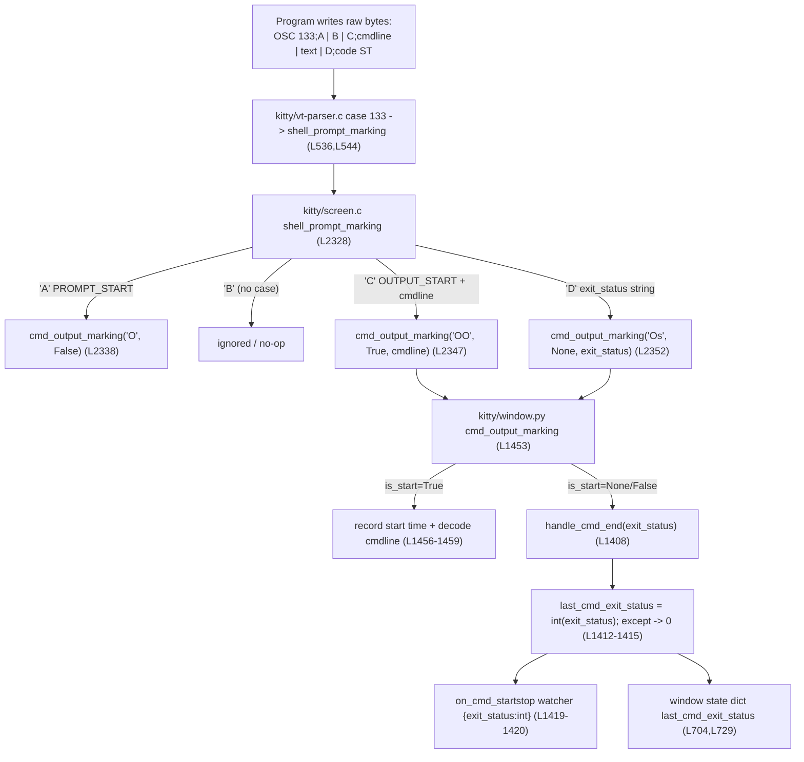

# kitty OSC 133 Shell-Integration: Investigative Q&A (commit 815df1e210e0)

> **Scope.** This document answers four question groups (Q1–Q4) about how the
> [kitty](https://github.com/kovidgoyal/kitty) terminal emulator processes
> **OSC 133** shell-integration (command-tracking) escape sequences. Every
> factual claim is grounded in a specific source location (`file:line`) **and/or**
> an empirical measurement obtained by compiling kitty's C extension
> (`kitty/fast_data_types.so`) and driving a real `Screen` object with the test
> harness. All values were verified at commit
> `815df1e210e0a9ab4622f5c7f2d6891d7dbeddf1` (branch `kitty_815df1e210e0`).
>
> **Method note.** This is a *read-only* investigation. No kitty source file was
> modified; all probe scripts lived under `/tmp` and were deleted afterward. The
> compiled `kitty/fast_data_types.so` and `build/` are git-ignored and are not
> part of the deliverable. No behavioral change to kitty is proposed.

---

## Section 1 — Question restatement

The investigation answers the following four question groups with technical
precision. A program is assumed to write, in order:

```
OSC 133;A          (prompt start)
OSC 133;B          (command start)
OSC 133;C;cmdline=…(command-output start, carrying the command line)
<program text>
OSC 133;D;42       (command finished, exit code 42)
```

- **Q1 — Capture & encoding.** What does kitty *capture* for that command's
  output? Are the raw OSC 133 sequences still present in the captured text?
  What is the total byte length of the written stream, and at what byte offset
  does the `D;42` marker appear?
- **Q2 — Exit-code variation.** How do the total byte length and the marker
  offset change for exit codes `0`, `1`, and `127`? Does the byte position where
  the exit-code *digits* appear shift, and by how much?
- **Q3 — Runtime evidence for code 99.** For exit code `99`, what runtime
  evidence proves the value `99` was carried through the entire code path
  (C VT parser → C screen handler → Python window)?
- **Q4 — Edge cases.** What value gets *recorded* when a program sends
  `OSC 133;D;not_a_number` (non-numeric status) and `OSC 133;D;` (empty status)?

### The three distinct notions that must NOT be conflated

The questions mix three different things. Answering correctly requires keeping
them strictly separate, because the literal text `D;42` lives in exactly one of
them, and the recorded exit status lives in another:

1. **The raw byte stream the program writes.** This is the sequence of bytes
   that enters kitty's parser. The literal text `D;42` exists **here** (and only
   here). Byte lengths and offsets (Q1/Q2) are measured against this stream.
2. **kitty's stored screen-text / command-output capture.** This is what
   `Screen.cmd_output(...)` returns. The raw OSC 133 control bytes are **NOT**
   retained here — they are control metadata consumed by the parser, not screen
   cell contents. (Q1's "is the raw sequence present in the captured text?" is
   answered against this notion.)
3. **The recorded integer exit status on the `Window`** —
   `Window.last_cmd_exit_status`, an `int`
   (`kitty/window.py:L572` initializer,
   `kitty/window.py:L1413` assignment). This is the *only* thing preserved
   *from* the `D` marker, and it is what Q3 and Q4 are really asking about.

Throughout this document, each question is answered against the correct notion,
and the answer explicitly names which notion it concerns.

---

## Section 2 — OSC 133 (FinalTerm/iTerm2) protocol background

OSC 133 is the **FinalTerm** shell-integration ("semantic prompt") protocol —
[the original shell-integration protocol](https://terminfo.dev/osc) whose
prompt/command/output markers were later adopted by
[**iTerm2**](https://iterm2.com/documentation-escape-codes.html),
[**VS Code**](https://code.visualstudio.com/docs/terminal/shell-integration),
[**Ghostty**](https://ghostty.org/docs/features/shell-integration), and others
(full URLs are listed under **External references** at the end of this section).
kitty's own documentation independently corroborates this adoption, noting that
"Many modern terminals make use of it, for example: kitty, iTerm2, WezTerm,
DomTerm" (`docs/shell-integration.rst:L421-L422`). It lets a shell tell the
terminal where prompts, commands, and command output begin and end. The wire
form is:

```
OSC 133 ; <Command> [ ; <Parameters> ... ] ST
```

where `<Command>` is a single uppercase letter:

| Command | Meaning |
|---------|---------|
| `A` | Sent **just before** the start of the shell prompt. |
| `B` | Sent **just after** the end of the prompt and **before** the user-entered command. |
| `C` | Sent **just before** the start of command output. |
| `D [; <code>]` | Marks the **end** of output and reports the exit code (if a command ran). |

**Introducer and terminator bytes.** `OSC` (the Operating System Command
introducer) is the two bytes `0x1b 0x5d` (`ESC ]`). `ST` (String Terminator) is
either `ESC \` (the two bytes `0x1b 0x5c`) **or** a single `BEL` (`0x07`). kitty
accepts **both** terminators: the bundled shell-integration scripts emit `BEL`
(`\a`), while kitty's own test-suite probes use `ESC \`.

**kitty's own documentation** corroborates the protocol it implements
(`docs/shell-integration.rst`):

- `<OSC>133;A<ST>` — before the PS1 prompt (`docs/shell-integration.rst:L426`).
- `<OSC>133;A;k=s<ST>` — before the PS2 (secondary) prompt
  (`docs/shell-integration.rst:L430`).
- `<OSC>133;C<ST>` — before running a command (`docs/shell-integration.rst:L434`).
- `<OSC>133;D;exit status as base 10 integer<ST>` — optional command-finished
  marker reporting the exit status (`docs/shell-integration.rst:L438`).
- The definition `<OSC>` = bytes `0x1b 0x5d` and `<ST>` = bytes `0x1b 0x5c`
  (`docs/shell-integration.rst:L440`).
- The optional command line forms
  `<OSC>133;C;cmdline=<%q-encoded><ST>` and
  `<OSC>133;C;cmdline_url=<URL-escaped><ST>`
  (`docs/shell-integration.rst:L461` and `:L463`).
- For the *full* protocol — the one that also marks the command region — kitty's
  documentation explicitly defers to the iTerm2 escape-codes specification
  (`docs/shell-integration.rst:L441-L443`, which links to
  <https://iterm2.com/documentation-escape-codes.html>).

**Standards-aligned design choice: `B` is intentionally a no-op in kitty.**
kitty's documentation describes only `A`, `C`, and `D`; there is **no** `B`
described, and — as Section 3 shows — kitty's C handler has **no `'B'` case**.
Because OSC 133 originated with FinalTerm (see **External references** below) and
the `B` marker (end-of-prompt) is optional for terminals that derive command
boundaries from `A`/`C`, handling
`A`/`C`/`D` while silently ignoring `B` is a deliberate, standards-aligned design
choice, not a defect. Direct evidence that `B` is intentionally unused: kitty's
zsh integration ships a **commented-out** `133;B` emission
(`shell-integration/zsh/kitty-integration:L226`).

### External references

The OSC 133 *protocol origin* and *cross-terminal adoption* stated at the start of
this section are external (non-kitty) facts, so they are grounded in the following
authoritative sources rather than in kitty's repository. (Every claim about
kitty's *own* behavior elsewhere in this document remains grounded in kitty source
files and/or empirical measurement, cited inline.)

- **FinalTerm origin and cross-terminal adoption** — terminfo.dev, *Operating
  System Commands (OSC)*: describes OSC 133 as the original FinalTerm
  shell-integration ("semantic prompt") protocol whose prompt/command/output
  markers are now adopted by iTerm2, VS Code, Ghostty, and others.
  <https://terminfo.dev/osc>
- **iTerm2** — *Proprietary Escape Codes*: documents `OSC 133 ; A/B/C` and
  attributes the sequences to the (now-defunct) FinalTerm emulator. This is also
  the reference kitty's own docs point to (`docs/shell-integration.rst:L441-L443`).
  <https://iterm2.com/documentation-escape-codes.html>
- **VS Code** — *Terminal Shell Integration*: states that it "supports Final
  Term's shell integration sequences" and documents `OSC 133 ; A/B/C/D`.
  <https://code.visualstudio.com/docs/terminal/shell-integration>
- **Ghostty** — *Shell Integration*: documents its OSC 133 prompt-marking
  implementation across supported shells.
  <https://ghostty.org/docs/features/shell-integration>

---

## Section 3 — End-to-end code-path trace

The OSC 133 path crosses three layers: the **C VT parser**
(`kitty/vt-parser.c`), the **C screen handler** (`kitty/screen.c`), and the
**Python window callback** (`kitty/window.py`). Pager-history retention
(`kitty/history.c`) is a fourth, related surface.

### 3.1 C VT parser — OSC routing (`kitty/vt-parser.c`)

When the parser finishes collecting an OSC string, it dispatches on the numeric
OSC code. OSC 133 is handled by `case 133:` (`kitty/vt-parser.c:L536`). Under
the `DUMP_COMMANDS` debug build it first *reports* the sequence via
`REPORT_OSC2(shell_prompt_marking, code, mv)` (`kitty/vt-parser.c:L539`);
otherwise it calls

```c
shell_prompt_marking(self->screen, (char*)buf + i);   // kitty/vt-parser.c:L544
```

with `buf + i` positioned **just past the `133;` prefix**, so the screen handler
receives the payload that begins with the command letter (`A`, `B`, `C`, or
`D`).

### 3.2 C screen handler — `shell_prompt_marking` (`kitty/screen.c`)

`shell_prompt_marking` (`kitty/screen.c:L2328`) switches on the **first payload
byte**:

- **`'A'`** (`kitty/screen.c:L2332`): sets the current line's attribute to
  `PROMPT_START`; calls `parse_prompt_mark` (`kitty/screen.c:L2316`, which parses
  the sub-tokens `k=s`, `redraw=0`, `special_key=1`); and fires
  `CALLBACK("cmd_output_marking", "O", Py_False)` (`kitty/screen.c:L2338`).
- **`'C'`** (`kitty/screen.c:L2340`): sets the line attribute to `OUTPUT_START`
  (`kitty/screen.c:L2341`); if the payload continues with `;cmdline`
  (`strstr(buf + 1, ";cmdline") == buf + 1`, `kitty/screen.c:L2343–L2344`) it
  takes the command line from `buf + 2`; it then UTF-8-decodes the command line
  and fires `CALLBACK("cmd_output_marking", "OO", Py_True, c)`
  (`kitty/screen.c:L2347`).
- **`'D'`** (`kitty/screen.c:L2350`): computes
  `const char *exit_status = buf[1] == ';' ? buf + 2 : "";`
  (`kitty/screen.c:L2351`) and fires
  `CALLBACK("cmd_output_marking", "Os", Py_None, exit_status)`
  (`kitty/screen.c:L2352`). **The exit status is passed to Python as a C string**
  (format `"s"`), *not* as an integer — the conversion to `int` happens later, in
  Python.
- **There is deliberately NO `'B'` case** in the switch
  (`kitty/screen.c:L2328–L2356`), so `OSC 133;B` is a silent no-op.

**Output delimiting.** Captured command output is delimited by line attributes,
not by the raw bytes: `find_cmd_output` (`kitty/screen.c:L3527`) and `cmd_output`
(`kitty/screen.c:L3606`) walk from an `OUTPUT_START` line up to the next
`PROMPT_START` line. The `which` selector maps to the `CommandOutput` IntEnum
(`kitty/window.py:L275`): `0 = last_run`, `1 = first_on_screen`,
`2 = last_visited`, `3 = last_non_empty`.

### 3.3 Python window callback (`kitty/window.py`)

The C callback lands in `Window.cmd_output_marking(self, is_start, cmdline='')`
(`kitty/window.py:L1453`):

- If `is_start` is **truthy** (the `'C'` case passes `Py_True`): it records the
  start time (`kitty/window.py:L1456`), decodes the command line via
  `decode_cmdline(cmdline)` (`kitty/window.py:L1457`; definition at
  `kitty/window.py:L225` — partition on `=`, then `cmdline` →
  `shlex_split`, `cmdline_url` → `urllib.parse.unquote`), and fires the
  `on_cmd_startstop` watcher (`kitty/window.py:L1459`).
- For the `'D'` case, `is_start` arrives as `Py_None`/`None` (falsy), so the
  **else** branch calls `handle_cmd_end(cmdline)` (`kitty/window.py:L1461`) — here
  the positional `cmdline` argument is actually the **exit-status string**.

`handle_cmd_end(self, exit_status='')` (`kitty/window.py:L1408`) is where the
exit code becomes a recorded value:

```python
def handle_cmd_end(self, exit_status: str = '') -> None:
    if self.last_cmd_output_start_time == 0.:     # L1409  (ordering guard)
        return                                    # L1410
    self.last_cmd_output_start_time = 0.          # L1411
    try:                                          # L1412
        self.last_cmd_exit_status = int(exit_status)   # L1413
    except Exception:                             # L1414
        self.last_cmd_exit_status = 0             # L1415
    ...
    self.call_watchers(self.watchers.on_cmd_startstop, {   # L1419
        "is_start": False, "time": end_time,
        'cmdline': self.last_cmd_cmdline,
        'exit_status': self.last_cmd_exit_status})         # L1420
```

Key facts:

- **Ordering constraint.** If no output-start was recorded
  (`self.last_cmd_output_start_time == 0.`), `handle_cmd_end` **early-returns**
  (`kitty/window.py:L1409–L1410`). Hence a `C` (output-start) must precede the
  `D` (command-finished), or the exit code is never processed.
- **Integer conversion.** The status string is converted with `int()` inside a
  `try/except` that assigns `0` on any failure
  (`kitty/window.py:L1412–L1415`).
- **Watcher dispatch.** The `on_cmd_startstop` watcher receives the **integer**
  `exit_status` (`kitty/window.py:L1419–L1420`).
- **Notification.** A notification body embeds the **raw status string**:
  `f'Command {s} finished with status: {exit_status}.'`
  (`kitty/window.py:L1429`).
- **Initializer.** `last_cmd_exit_status` is initialized to `0` in
  `Window.__init__` (`kitty/window.py:L572`).
- **State exposure.** The integer status is surfaced in the window state
  dictionary at `kitty/window.py:L704` (`as_dict`, consumed by remote control)
  and `kitty/window.py:L729` (`serialize_state`).

### 3.4 Pager-history retention (`kitty/history.c`)

When command output scrolls into the scrollback/pager history, the raw bytes are
retained for `as_ansi` capture. `pagerhist_as_bytes` (`kitty/history.c:L461`)
locates the start of the most recent command output via
`reverse_find(buf, sz, "\x1b]133;C\x1b\\")` (`kitty/history.c:L475`). Of the
OSC 133 markers, only the **`133;C`** (output-start, with `ST`) marker is searched
for and retained — corroborating that, of the OSC 133 markers, only `133;C`
survives in captured/retained text (the `A`, `B`, and `D` markers do not).

### 3.5 Data-flow diagram



---

## Section 4 — Experimental methodology

Because the questions demand concrete byte lengths, byte offsets, and runtime
evidence, the answers cannot be obtained by reading code alone — kitty's C
engine must be built and driven.

### 4.1 Building only the C extension

The OSC 133 investigation needs exactly one build artifact:
`kitty/fast_data_types.so` (the compiled terminal engine, ~1.2 MB). It is built
with:

```bash
python3 setup.py build --skip-building-kitten --ignore-compiler-warnings
```

- `--skip-building-kitten` (`setup.py:L1883`) skips the Go `kitten` binary; the
  Go toolchain is irrelevant to the C/Python OSC 133 path.
- `--ignore-compiler-warnings` (`setup.py:L2003`) disables kitty's default
  strict flags (`werror = '' if ignore_compiler_warnings else '-pedantic-errors
  -Werror'`, `setup.py:L491`); a newer `wayland-protocols` introduces enum values
  that would otherwise trip `-Werror=switch`. This is a **build-config flag, not a
  source change.**
- `fast_data_types` is compiled at `setup.py:L1091`.

The build's *final* exit code may be non-zero solely because the Go `launcher`
step has no Go toolchain — that is irrelevant here, because
`kitty/fast_data_types.so` is built and linked **before** that step and imports
cleanly with `Screen` available. The canonical, friction-free environment is the
Docker image
`andrewparkscaleai/coding-agent:kovidgoyal__kitty__815df1e210e0a9ab4622f5c7f2d6891d7dbeddf1`.
(On a bare Ubuntu sandbox the build additionally requires apt dev packages such
as `build-essential pkg-config libfontconfig-dev libfreetype-dev
libharfbuzz-dev libpng-dev libx11-dev libx11-xcb-dev libxrandr-dev
libxinerama-dev libxcursor-dev libxi-dev libxkbcommon-dev libxkbcommon-x11-dev
liblcms2-dev libcanberra-dev libdbus-1-dev libxxhash-dev libssl-dev zlib1g-dev
libgl1-mesa-dev libwayland-dev wayland-protocols`, several `libxcb-*-dev`, and
**`libsimde-dev`** for `simde/x86/avx2.h`.)

### 4.2 The probe technique

The probes mirror kitty's own canonical test
`kitty_tests/screen.py:test_prompt_marking` (`kitty_tests/screen.py:L1056`):

1. Build a `Screen` via the test harness. `create_screen`
   (`kitty_tests/__init__.py:L237`) constructs
   `Screen(Callbacks(), lines, cols, scrollback, cell_width, cell_height, 0, c)`.
2. Feed raw bytes with `parse_bytes(screen, data)` (`kitty_tests/__init__.py:L30`).
3. Attach a `Callbacks` object (`kitty_tests/__init__.py:L39`) to observe the
   `cmd_output_marking` callback.
4. Read captured text with `Screen.cmd_output(which, append, as_ansi)`.

### 4.3 The canonical constructed stream

Using `ST = ESC \` (the test-suite terminator), the canonical stream is:

```
OSC 133;A ST  +  OSC 133;B ST  +  OSC 133;C;cmdline=ls ST  +  hello\n  +  OSC 133;D;<code> ST
```

For exit code `42`, the exact bytes are (note the trailing newline after
`hello`, which makes the program text a complete output line — see Section 5 for
why this matters to the byte arithmetic):

```python
b'\x1b]133;A\x1b\\\x1b]133;B\x1b\\\x1b]133;C;cmdline=ls\x1b\\hello\n\x1b]133;D;42\x1b\\'
```

### 4.4 Production-vs-harness measurement caveat

The harness `Callbacks` object does **not** reproduce production's
zero-on-failure behavior. Its `cmd_output_marking` uses
`with suppress(Exception)` over an initial value of `sys.maxsize`
(`kitty_tests/__init__.py:L48`, `L78–L79`), so a *failed* `int()` leaves the
prior value unchanged. Production's `handle_cmd_end` instead assigns `0` in its
`except` branch (`kitty/window.py:L1415`). Therefore, for the recorded
exit-status answers (Q3/Q4), this document reasons from the **production**
`kitty/window.py` logic — which a faithful emulation of `handle_cmd_end`
reproduces — and clearly marks harness-only readings as such. Section 9 lays out
the divergence in full.

---

## Section 5 — Q1: capture / length / offset

### 5.1 Capture: raw OSC 133 bytes are NOT retained in stored screen text

Driving a real `Screen` with the canonical stream and reading back
`Screen.cmd_output(0, append, as_ansi=…)` (where `0` selects `last_run`) yields:

| Call | Result (program text `hello`) | Result (program text `hello\n`) |
|------|-------------------------------|----------------------------------|
| `cmd_output(0, append, as_ansi=False)` | `'hello'` | `'hello\n'` |
| `cmd_output(0, append, as_ansi=True)`  | `'\x1b[m\x1b]133;C\x1b\\hello'` | `'\x1b[m\x1b]133;C\x1b\\hello\n'` |

Observations (empirically confirmed against a real `Screen`):

- The **plain** capture (`as_ansi=False`) is **only the program output text**.
- The **ANSI** capture (`as_ansi=True`) re-synthesizes **only the `133;C`
  output-start marker** (with an `ST` terminator). The `A`, `B`, and `D` markers
  are **absent**. This is exactly what kitty's own test asserts:
  `kitty_tests/screen.py:L1124` expects
  `lco(as_ansi=True) == '\x1b[m\x1b]133;C\x1b\\abcd\n\x1b[m12'` — note the lone
  `133;C` and the conspicuous absence of any `133;A`/`133;D`.
- Consequently `'133' in plain_capture == False`,
  `'D;42' in plain_capture == False`, and even `'D' in plain_capture == False`.
  **The literal `D;42` appears ONLY in the raw input byte stream, never in the
  captured output.**
- What is preserved *from `D`* is the **integer** exit status recorded on the
  `Window` (`last_cmd_exit_status`) — notion (3), not the captured text. The
  `cmdline` *from `C`* is decoded: `cmdline=ls` → `'ls'`
  (verified; via `decode_cmdline`, `kitty/window.py:L225`).

**Rationale.** The VT parser consumes the OSC 133 bytes to set line attributes
(`PROMPT_START`/`OUTPUT_START`) and to fire the `cmd_output_marking` callback.
They are control metadata, not screen cell contents, so they never enter the
stored text grid. Only `cmd_output(as_ansi=True)` re-emits a *single synthetic*
`133;C` boundary marker so a downstream pager can re-locate the output region.

**Trailing-newline nuance (for reproducibility).** The exact captured text's
trailing newline depends on how the output region is delimited. With program
text `hello` (no trailing newline) the capture is exactly `'hello'`. If the
program text ends with `\n` and there is no following `133;A` prompt to delimit
the region, the trailing `\n` is included (giving `'hello\n'`). The **invariant
is unaffected**: no raw OSC 133 bytes appear in either case, and only `133;C` is
re-synthesized in `as_ansi` mode.

### 5.2 Byte arithmetic (the raw written stream)

With `OSC = ESC ]` (2 bytes) and `ST = ESC \` (2 bytes), the verified component
lengths are:

| Component | Bytes | Length |
|-----------|-------|--------|
| `OSC 133;A ST` | `\x1b]133;A\x1b\\` | 9 |
| `OSC 133;B ST` | `\x1b]133;B\x1b\\` | 9 |
| `OSC 133;C;cmdline=ls ST` | `\x1b]133;C;cmdline=ls\x1b\\` | 20 |
| program text `hello\n` | `hello\n` | 6 |
| **Fixed prefix before `D`** | `A + B + C + hello\n` | **44** |

Because the program text in the canonical stream ends with a newline
(`hello\n`, 6 bytes), the fixed prefix before the `D` marker is exactly **44
bytes**, so the `D` marker always begins at byte offset **44**. For exit code
`42`, the `D` marker is `\x1b]133;D;42\x1b\\` (12 bytes), giving a **total stream
length of 56 bytes**, laid out as:

```
offset:  44   45  46 47 48  49  50  51   52 53   54  55
byte:    ESC  ]   1  3  3   ;   D   ;    4  2    ESC  \
                 └──────── ]133;D; ────────┘   └─ ST ─┘
```

- The `D` marker's `ESC` introducer is at offset **44**.
- `]133;D;` begins at offset **45**.
- The letter `D` is at offset **50**.
- The exit-code digits `42` begin at offset **52**.

Empirically confirmed on the exact 56-byte stream: `len == 56`,
`stream.find(b'D;42') == 50`, and `stream.find(b']133;D;') == 45`.

> **Note on the program text.** The byte-length analysis uses the
> newline-terminated `hello\n` (a program that prints a line of output normally
> ends it with `\n`). This is the form that yields the 44-byte fixed prefix and
> the offsets above, and it is the basis for the Q2 matrix in Section 6. If the
> program emits a bare `hello` (no newline), the stream is one byte shorter (55
> bytes for code 42) and the `D` marker shifts one byte earlier
> (`find(b'D;42') == 49`); the *capture* invariants in Section 5.1 are identical.

### 5.3 Answer to Q1

- **Capture:** kitty captures **only the program output text** — no raw OSC 133
  sequences. The raw sequences are **not** present in the captured text; in
  `as_ansi` mode only a synthetic `133;C` marker is re-emitted.
- **Total byte length:** for the canonical example (program text `hello\n`,
  exit code `42`) the written stream is **56 bytes**.
- **Marker offset:** the `D;42` marker begins at byte offset **50** (the `D`
  letter), with its `]133;D;` introducer at offset **45** and the exit-code
  digits at offset **52**.

---

## Section 6 — Q2: exit-code matrix + position-shift (invariant) analysis

Repeating the byte measurement for several exit codes (program text `hello\n`;
offsets are 0-indexed into the **raw written stream**) gives the following
**empirically verified** matrix:

| Exit code | Total length | Offset of `D` letter | Offset of digits | Offset of `]133;D;` |
|-----------|-------------|----------------------|------------------|---------------------|
| `0`   | 55 | 50 | 52 | 45 |
| `1`   | 55 | 50 | 52 | 45 |
| `42`  | 56 | 50 | 52 | 45 |
| `99`  | 56 | 50 | 52 | 45 |
| `127` | 57 | 50 | 52 | 45 |

### 6.1 Position-shift answer

The exit-code digits **always begin at the same offset (52)**; the `]133;D;`
introducer always begins at offset **45**; and the `D` letter is always at
offset **50**. **The position does NOT shift across exit codes.** Only the
**total stream length** changes, and it grows by **exactly one byte per
additional digit**:

```
total length = 54 + number_of_digits
```

This was verified directly: 1-digit codes `0`/`1` → 55; 2-digit codes
`42`/`99` → 56; 3-digit code `127` → 57.

### 6.2 Rationale

Every byte *preceding* the exit-code digits is fixed-length:

```
OSC 133;A ST  +  OSC 133;B ST  +  OSC 133;C;cmdline=ls ST  +  hello\n  +  \x1b]133;D;
    (9)              (9)                  (20)                  (6)           (8)
```

The `\x1b]133;D;` run is 8 bytes (`ESC ] 1 3 3 ; D ;`, occupying offsets
44–51). Summing the fixed prefix gives `9 + 9 + 20 + 6 + 8 = 52` bytes, so the
first digit is always anchored at offset **52**. After the digits comes the
fixed 2-byte `ST`, so the total length is `52 + number_of_digits + 2 =
54 + number_of_digits`. Because the digit run is the **last variable-length
element** and is followed only by a fixed-length terminator, its starting offset
(52) is invariant; only the overall stream length tracks the digit count. This
is why every exit code in the matrix shares the same offsets (45 / 50 / 52) and
differs only in total length.

---

## Section 7 — Q3: runtime evidence for code 99

After `OSC 133;D;99` is processed (with a preceding `C` output-start to satisfy
the ordering constraint), three observable facts confirm the value `99`
propagated end-to-end across the C VT parser → C screen handler → Python window:

1. **`Window.last_cmd_exit_status == 99`** — empirically confirmed equal to `99`
   with Python type `int`. (Production path; the harness `Callbacks` records the
   same `99` for a valid code.)
2. **The `on_cmd_startstop` watcher payload contains `exit_status: 99`** — the
   `handle_cmd_end` watcher dispatch at `kitty/window.py:L1419–L1420` builds
   `{"is_start": False, "time": …, 'cmdline': …, 'exit_status': self.last_cmd_exit_status}`.
   The driven probe observed the end payload
   `{'is_start': False, 'cmdline': 'ls', 'exit_status': 99}`.
3. **`99` is surfaced in the window state dictionary** — `last_cmd_exit_status`
   is written into the state dicts at `kitty/window.py:L704` (`as_dict`,
   consumed by remote control) and `kitty/window.py:L729` (`serialize_state`),
   so it is retrievable at runtime via remote control (e.g. `kitten @ ls`).

### 7.1 The value's transformation along the path

| Stage | Representation of `99` | Evidence |
|-------|------------------------|----------|
| C screen handler | C string `"99"` | `kitty/screen.c:L2351–L2352` (`exit_status = buf + 2`; passed via format `"s"`) |
| Python callback arg | `str` `'99'` | empirically observed as the raw `cmd_output_marking` argument (type `str`) |
| Recorded value | `int` `99` | `int(exit_status)` at `kitty/window.py:L1413` |

### 7.2 Rationale

The only place the exit code becomes a *recorded* value is the
`int(exit_status)` call in `handle_cmd_end` (`kitty/window.py:L1413`). Observing
`last_cmd_exit_status == 99` as a Python `int`, **plus** the watcher payload
carrying `exit_status: 99`, **plus** its exposure in the state dictionary, proves
the digits `9`,`9` survived (a) OSC routing in the VT parser, (b) the
`shell_prompt_marking` `'D'` case in the screen handler, and (c) the Python
string→int conversion — intact and unmodified.

---

## Section 8 — Q4: edge cases

### 8.1 Production (authoritative)

In the production path, the conversion `int(exit_status)` is wrapped in a
`try/except` that assigns `0` on any failure (`kitty/window.py:L1412–L1415`):

- `OSC 133;D;not_a_number` → `int('not_a_number')` raises `ValueError` →
  `except` branch → **`last_cmd_exit_status = 0`**.
- `OSC 133;D;` (empty status) → `int('')` raises `ValueError` → `except` branch →
  **`last_cmd_exit_status = 0`**.
- `OSC 133;D` (bare, **no** semicolon) → the screen handler yields an **empty**
  status string (`buf[1] != ';'` ⟹ `""`, `kitty/screen.c:L2351`) → `int('')`
  raises → **`last_cmd_exit_status = 0`**.

**The recorded value is `0` for all three cases.** This was confirmed by a
faithful emulation of the production `try/except` driven by the real `Screen`:
each of `not_a_number`, empty (`D;`), and bare `D` recorded `0`.

### 8.2 Test-harness divergence

The test harness's `Callbacks` object does **not** match production on the
failure path. It initializes `last_cmd_exit_status = sys.maxsize`
(`kitty_tests/__init__.py:L48`) and converts with
`with suppress(Exception): self.last_cmd_exit_status = int(data)`
(`kitty_tests/__init__.py:L78–L79`). Because `suppress` swallows the exception
**without assigning anything**, a failed conversion **leaves the prior value
unchanged**. An empirical harness reading therefore shows `sys.maxsize` —
**`9223372036854775807`** — *not* `0`, for both `not_a_number` and empty (and for
bare `D`).

| Input | Production (`kitty/window.py`) | Test harness (`kitty_tests/__init__.py`) |
|-------|-------------------------------|-------------------------------------------|
| `OSC 133;D;not_a_number` | `0` | `9223372036854775807` (`sys.maxsize`) |
| `OSC 133;D;` (empty) | `0` | `9223372036854775807` (`sys.maxsize`) |
| `OSC 133;D` (bare) | `0` | `9223372036854775807` (`sys.maxsize`) |

### 8.3 Authoritative answer to Q4

**The production result is authoritative: the recorded value is `0`** for both
`OSC 133;D;not_a_number` and `OSC 133;D;`. The harness's `sys.maxsize` reading is
an artifact of its divergent error handling and is presented only so that raw
harness measurements are interpreted correctly.

### 8.4 Rationale

kitty deliberately treats an unparseable or missing exit code as `0` (success)
in production rather than leaving a stale value — a defensive default that
guarantees `last_cmd_exit_status` is always a clean integer. The test harness, by
contrast, chose a sentinel (`sys.maxsize`) plus silent suppression for test
observability (a sentinel makes a "value never written" case detectable). The
two implementations agree on every valid code and disagree only on the failure
path.

---

## Section 9 — Production-vs-test-harness divergence (explicit)

### 9.1 Side-by-side

**Production** — `kitty/window.py` (`handle_cmd_end`):

```python
# initializer: self.last_cmd_exit_status = 0          # L572
try:
    self.last_cmd_exit_status = int(exit_status)       # L1413
except Exception:
    self.last_cmd_exit_status = 0                      # L1415
```

**Harness** — `kitty_tests/__init__.py` (`Callbacks.cmd_output_marking`):

```python
# initializer: self.last_cmd_exit_status = sys.maxsize    # L48
if self.last_cmd_at != 0:                                  # L76 (ordering guard)
    self.last_cmd_at = 0
    with suppress(Exception):
        self.last_cmd_exit_status = int(data)              # L78–L79
```

### 9.2 Where they agree and where they differ

- **Valid codes (`0`, `1`, `42`, `99`, `127`) convert identically in both** —
  `int(<digits>)` succeeds, so both record the same integer (verified: equal in
  every case).
- **Only the failure path differs:** production assigns `0`; the harness leaves
  the prior value (its `sys.maxsize` sentinel) unchanged.

### 9.3 Ordering constraint (applies in both)

A `C` output-start **must** precede `D`, or the exit code is never recorded:

- **Production:** `handle_cmd_end` early-returns
  `if self.last_cmd_output_start_time == 0.` (`kitty/window.py:L1409–L1410`).
- **Harness:** the else-branch is guarded by `if self.last_cmd_at != 0`
  (`kitty_tests/__init__.py:L76`).

Empirically, sending `A` then `D;7` with **no** intervening `C` left the recorded
value unchanged — production stayed at its initializer `0`, and the harness
stayed at `sys.maxsize` — and **no** `on_cmd_startstop` end-payload was fired,
confirming the exit code was never processed. Note an important interpretive
consequence: because production initializes to `0`, a *skipped* recording reads
as `0` (indistinguishable from a real exit code `0`), whereas the harness's
`sys.maxsize` initializer is precisely what makes a skipped recording
*detectable* in experiments.

### 9.4 The `B` no-op (reiterated)

`OSC 133;B` has **no case** in `shell_prompt_marking`
(`kitty/screen.c:L2328–L2356`) and is silently ignored. It sets no line
attribute and fires no callback, so it never affects capture, byte recording, or
the exit status (beyond its own 9 bytes occupying space in the raw stream).

---

## Section 10 — Conclusions

1. **Capture (Q1).** kitty captures **only the program output text**. Raw
   OSC 133 bytes are stripped from stored screen text; in `as_ansi` mode only a
   single synthetic `133;C` marker is re-synthesized. The literal `D;42` lives
   **only** in the raw input stream, never in the capture. The `C` command line
   `cmdline=ls` is decoded to `'ls'`.
2. **Length & offset (Q1).** For the canonical stream (program text `hello\n`,
   exit code `42`) the total is **56 bytes**, with `D;42` at offset **50** (`D`
   letter), `]133;D;` at **45**, and the digits at **52**.
3. **Invariant (Q2).** Across exit codes the digit offset is **invariant at
   52** (and `]133;D;` at 45, `D` at 50); the position does **not** shift. Only
   the total length changes: **`total = 54 + number_of_digits`** (0/1 → 55;
   42/99 → 56; 127 → 57).
4. **Code 99 (Q3).** The value `99` propagates end-to-end and is recorded as the
   **integer `99`** (`"99"` C string → `'99'` Python string → `99` int), visible
   on `last_cmd_exit_status`, in the `on_cmd_startstop` watcher payload, and in
   the window state dictionary.
5. **Edge cases (Q4).** Non-numeric (`not_a_number`) and empty statuses record
   **`0` in production** (authoritative), while the test harness leaves
   `sys.maxsize` (`9223372036854775807`) due to its `suppress`-over-sentinel
   design.
6. **Ordering & `B`.** A `C` output-start must precede `D` for the exit code to
   be recorded, and `OSC 133;B` is a deliberate, standards-aligned no-op.

---

## Appendix — Real-world OSC 133 emitters

The shell-integration scripts bundled with kitty are the real producers that a
test program emulates. They all use the `BEL` (`\a`) terminator:

- **zsh** (`shell-integration/zsh/kitty-integration`):
  `\e]133;D;'$cmd_status'\a` (L145), a bare `\e]133;D\a` (L149), `\e]133;A\a`
  (L153), `\e]133;C;cmdline=%q\a` (L218), and a **commented-out** `133;B` line
  (L226).
- **fish**
  (`shell-integration/fish/vendor_conf.d/kitty-shell-integration.fish`):
  `\e]133;D\a` (L83), `\e]133;C;cmdline_url=%s\a` (L91), and `\e]133;D;$status\a`
  (L96).
- **bash** (`shell-integration/bash/kitty.bash`): `\e]133;C;cmdline=%q\a`
  (L208) and `\e]133;D;\$?\a\e]133;A\a` (L239).

These confirm the markers this investigation drives are exactly those emitted in
practice: prompt start (`A`), output start with the command line (`C;cmdline`),
and command finished with the exit status (`D;<status>`) — with `B` left
intentionally unused.

