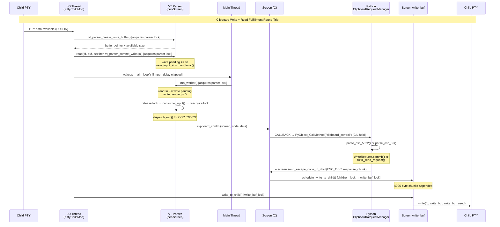
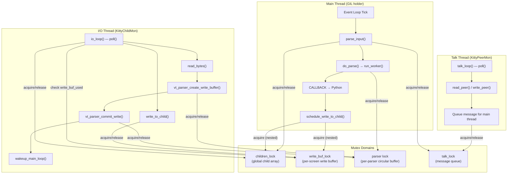
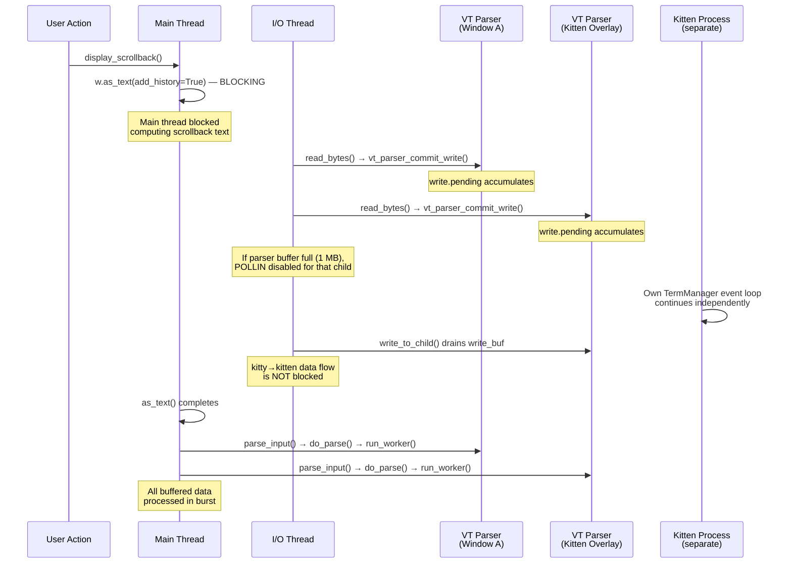
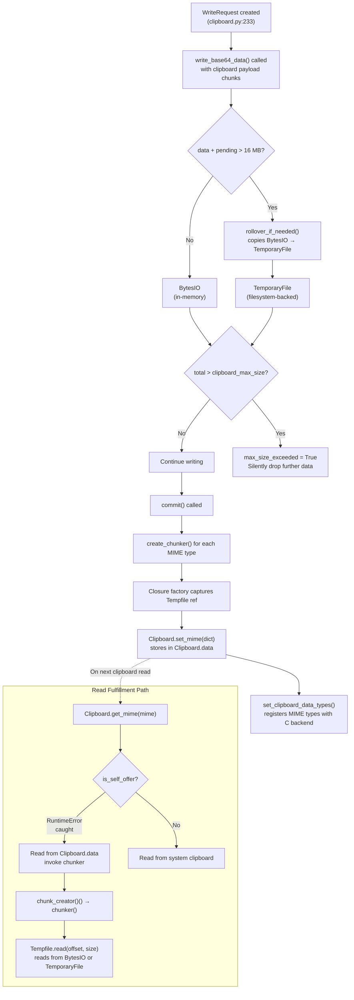
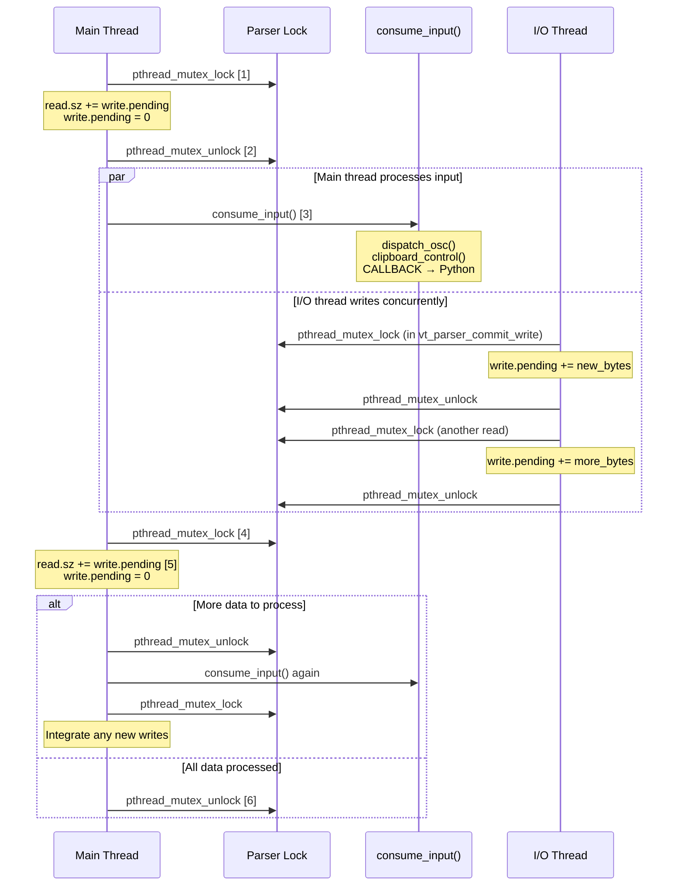

# Kitty Terminal Emulator: Core-to-Kitten Data Transfer Architecture

| Field | Value |
|-------|-------|
| **Document type** | Architecture Investigation / Technical Q&A |
| **Scope** | Runtime data-transfer mechanics between the kitty C core and Python kittens |
| **Methodology** | Static source-code analysis of the kitty repository at commit `815df1e210e0` |
| **Source of truth** | All conclusions are grounded in specific source files and line numbers |
| **Repository** | [kovidgoyal/kitty](https://github.com/kovidgoyal/kitty) |

---

## Introduction

This document investigates five interconnected questions about how the kitty terminal emulator moves data between its native C core and Python kittens under concurrent, high-load runtime conditions. Every claim is traced to exact source file paths and line numbers; speculation is explicitly labeled as such.

### Question Domains

1. **Data transfer pathways** — How clipboard data of arbitrary size crosses from internal C `Screen` structures through the VT parser and Python clipboard manager into Python objects accessible by kittens.
2. **Three-thread concurrency model** — How the Main thread, I/O thread (`KittyChildMon`), and Talk thread (`KittyPeerMon`) interact through three distinct mutex domains.
3. **Event delivery under load** — Whether expensive main-thread operations (such as scrollback scanning via `as_text`) affect the delivery cadence of events to kittens running as overlays.
4. **Object ownership and memory management** — Where Python reference counting (`Py_INCREF`/`Py_DECREF`), the `Tempfile` rollover strategy, and chunker closures create ownership boundaries that become hazardous under real-world timing.
5. **Subtle race conditions** — Where the VT parser's deliberate lock-unlock-relock pattern, `input_delay`-gated wakeup coalescing, and GIL-mediated callback dispatch create windows for races or dropped events.

### Key Terms

| Term | Definition |
|------|-----------|
| **GIL** | Global Interpreter Lock — Python's mutex that ensures only one thread executes Python bytecode at a time. C extension code can release it to allow concurrent C operations. |
| **OSC 52** | Operating System Command 52 — a legacy terminal escape sequence for clipboard read/write operations. |
| **OSC 5522** | Kitty's extended clipboard protocol — a structured, metadata-rich replacement for OSC 52 that supports arbitrary MIME types, chunked transfer, and status feedback. |
| **DCS** | Device Control String — a terminal escape sequence category. Kitty uses `\x1bP@kitty-cmd` and `\x1bP@kitty-kitten-result` DCS sequences for command responses and kitten result serialization. |
| **PTY** | Pseudoterminal — a pair of file descriptors (master/slave) that provides a virtual terminal interface between kitty and child processes (shells, kittens). |
| **VT parser** | The state machine in `kitty/vt-parser.c` that interprets incoming byte streams from child PTYs and dispatches recognized escape sequences to handler functions. |

---

## Q1: How Does Clipboard Data Transfer from the C Core to Python Kittens?

### The Full Data Pathway

The clipboard data transfer involves a twelve-step round-trip that crosses the C/Python boundary twice and the thread boundary twice. Each step is documented below with exact source citations.

**Step 1 — I/O Thread reads from child PTY:**

The I/O thread's `io_loop()` polls child PTY file descriptors. When data arrives, `read_bytes()` is called:

```c
// Source: kitty/child-monitor.c:1337-1356
static bool
read_bytes(int fd, Screen *screen) {
    ssize_t len;
    size_t available_buffer_space;
    uint8_t *buf = vt_parser_create_write_buffer(screen->vt_parser, &available_buffer_space);
    if (!available_buffer_space) return true;
    while(true) {
        len = read(fd, buf, available_buffer_space);
        if (len < 0) {
            if (errno == EINTR || errno == EAGAIN) continue;
            if (errno != EIO) perror("Call to read() from child fd failed");
            vt_parser_commit_write(screen->vt_parser, 0);
            return false;
        }
        break;
    }
    vt_parser_commit_write(screen->vt_parser, len);
    return len != 0;
}
```

> **Rationale:** The I/O thread reads raw bytes from the child's PTY file descriptor directly into the VT parser's internal buffer. This avoids an intermediate copy — the parser's write buffer pointer is obtained first, then `read()` writes directly into it.

**Step 2 — VT parser acquires lock and provides write buffer:**

`vt_parser_create_write_buffer()` acquires the per-parser `pthread_mutex_t lock`, calculates available space in the 1 MB circular buffer (`BUF_SZ = 1024*1024`), and returns a pointer into the buffer:

```c
// Source: kitty/vt-parser.c:1450-1462
uint8_t*
vt_parser_create_write_buffer(Parser *p, size_t *sz) {
    PS *self = (PS*)p->state;
    uint8_t *ans;
    with_lock {
        if (self->write.sz) fatal("vt_parser_create_write_buffer() called with an already existing write buffer");
        self->write.offset = self->read.sz + self->write.pending;
        *sz = BUF_SZ - self->write.offset;
        self->write.sz = *sz;
        ans = self->buf + self->write.offset;
    } end_with_lock;
    return ans;
}
```

The `with_lock` and `end_with_lock` macros are defined at `vt-parser.c:1413-1414`:
```c
#define with_lock pthread_mutex_lock(&self->lock);
#define end_with_lock pthread_mutex_unlock(&self->lock);
```

The buffer size constant is defined at `vt-parser.c:18`:
```c
#define BUF_SZ (1024u*1024u)
```

> **Rationale:** The lock is held only for the duration of calculating the write offset and available size, then released. This minimizes lock contention — the actual `read()` system call in Step 1 executes *after* the lock is released, writing directly into the buffer region that was reserved.

**Step 3 — I/O thread commits written bytes:**

After `read()` completes, `vt_parser_commit_write()` records the number of bytes written:

```c
// Source: kitty/vt-parser.c:1464-1474
void
vt_parser_commit_write(Parser *p, size_t sz) {
    PS *self = (PS*)p->state;
    with_lock {
        size_t off = self->read.sz + self->write.pending;
        if (self->new_input_at == 0) self->new_input_at = monotonic();
        if (self->write.offset > off) memmove(self->buf + off, self->buf + self->write.offset, sz);
        self->write.pending += sz;
        self->write.sz = 0;
    } end_with_lock;
}
```

> **Rationale:** The `write.pending` field accumulates bytes written by the I/O thread that have not yet been consumed by the main thread. The `new_input_at` timestamp is set on the first write, which the main thread uses to determine whether `input_delay` has elapsed (see Q2). The lock ensures `write.pending` is atomically updated even if the main thread is simultaneously reading it.

**Step 4 — Main thread processes pending input via `run_worker()`:**

After the I/O thread wakes the main loop, the main thread calls `run_worker()`:

```c
// Source: kitty/vt-parser.c:1416-1446
static void
run_worker(void *p, ParseData *pd, bool flush) {
    Screen *screen = (Screen*)p;
    PS *self = (PS*)screen->vt_parser->state;
    with_lock {
        self->read.sz += self->write.pending; self->write.pending = 0;
        pd->has_pending_input = self->read.pos < self->read.sz;
        if (pd->has_pending_input) {
            pd->time_since_new_input = pd->now - self->new_input_at;
            if (flush || pd->time_since_new_input >= OPT(input_delay) || self->read.sz + 16 * 1024 > BUF_SZ) {
                pd->input_read = true;
                /* ... setup ... */
                do {
                    end_with_lock; {
                        consume_input(self, pd->dump_callback, screen->window_id);
                    } with_lock;
                    self->read.sz += self->write.pending; self->write.pending = 0;
                } while (self->read.pos < self->read.sz);
                /* ... post-processing ... */
            }
        }
    } end_with_lock;
}
```

> **Rationale:** The lock is released *before* calling `consume_input()` (line 1431) and re-acquired *after* it returns (line 1433). This is a deliberate design: it allows the I/O thread to continue writing new data into the parser buffer concurrently while the main thread processes already-buffered input. After re-acquiring the lock, newly written bytes (`write.pending`) are integrated into `read.sz` for the next iteration. See Q5 for the race analysis of this pattern.

**Step 5 — `consume_input()` dispatches OSC escape sequences:**

Inside `consume_input()`, the VT parser state machine recognizes OSC escape sequences and calls `dispatch_osc()`:

```c
// Source: kitty/vt-parser.c:456-457, 531-535
static void
dispatch_osc(PS *self, uint8_t *buf, size_t limit, bool is_extended_osc) {
    /* ... code parsing ... */
    switch(code) {
        /* ... other cases ... */
        case 52: case 5522:
            START_DISPATCH
            if (is_extended_osc && code == 52) code = -52;
            DISPATCH_OSC_WITH_CODE(clipboard_control);
            END_DISPATCH
        /* ... */
    }
}
```

The `DISPATCH_OSC_WITH_CODE` macro (line 458) expands to call `clipboard_control(self->screen, code, mv)`.

> **Rationale:** The VT parser treats OSC 52 and OSC 5522 identically at the dispatch level — both route to the same `clipboard_control()` C function. The `is_extended_osc` flag and negative code value (`-52`) allow the downstream handler to distinguish partial (streaming) OSC 52 data from complete messages.

**Step 6 — C `clipboard_control()` calls Python via `CALLBACK` macro:**

```c
// Source: kitty/screen.c:2304-2308
void
clipboard_control(Screen *self, int code, PyObject *data) {
    if (code == 52 || code == -52) { CALLBACK("clipboard_control", "OO", data, code == -52 ? Py_True: Py_False); }
    else { CALLBACK("clipboard_control", "OO", data, Py_None);}
}
```

The `CALLBACK` macro is defined at `screen.c:87-91`:
```c
#define CALLBACK(...) \
    if (self->callbacks != Py_None) { \
        PyObject *callback_ret = PyObject_CallMethod(self->callbacks, __VA_ARGS__); \
        if (callback_ret == NULL) PyErr_Print(); else Py_DECREF(callback_ret); \
    }
```

The `self->callbacks` field points to the Python `Window` object (`screen.h:104`).

> **Rationale:** This is the C→Python boundary crossing. `PyObject_CallMethod()` requires the GIL, which the main thread holds. The `CALLBACK` macro is the standard pattern throughout `screen.c` for dispatching events from the C VT parser to the Python window layer.

**Step 7 — Python `Window.clipboard_control()` routes to `ClipboardRequestManager`:**

```python
# Source: kitty/window.py:1391-1395
def clipboard_control(self, data: memoryview, is_partial: Optional[bool] = False) -> None:
    if is_partial is None:
        self.clipboard_request_manager.parse_osc_5522(data)
    else:
        self.clipboard_request_manager.parse_osc_52(data, is_partial)
```

The `clipboard_request_manager` is instantiated per window at `window.py:588`:
```python
self.clipboard_request_manager = ClipboardRequestManager(self.id)
```

> **Rationale:** The `is_partial` parameter is `None` for OSC 5522 (extended protocol), `True` for streaming OSC 52 fragments, and `False` for a complete OSC 52 message. This three-state dispatch determines the parsing path.

**Step 8 — `ClipboardRequestManager` parses and dispatches:**

For OSC 5522, `parse_osc_5522()` (`clipboard.py:339-404`) parses key-value metadata, creates `WriteRequest` or `ReadRequest` objects, and dispatches them. For a write-then-commit cycle:

- `type=write` creates a `WriteRequest` (line 368-372)
- `type=wdata` adds base64-encoded data chunks (line 380-393)
- `type=wdata` with empty mime triggers `wr.flush_base64_data()` then `wr.commit()` (line 399-404)

**Step 9 — `WriteRequest.commit()` creates chunker closures:**

```python
# Source: kitty/clipboard.py:258-269
def commit(self) -> None:
    if self.committed:
        return
    self.committed = True
    cp = get_boss().primary_selection if self.is_primary_selection else get_boss().clipboard
    if cp.enabled:
        for alias, src in self.aliases.items():
            pos = self.mime_map.get(src)
            if pos is not None:
                self.mime_map[alias] = pos
        x = {mime: self.tempfile.create_chunker(pos.start, pos.size) for mime, pos in self.mime_map.items()}
        cp.set_mime(x)
```

> **Rationale:** Rather than copying the full clipboard data, `commit()` creates *closure factories* via `Tempfile.create_chunker()`. Each closure captures a reference to the `Tempfile` instance and reads data on demand. This deferred-read pattern means the `Tempfile` (and its potential filesystem-backed `TemporaryFile`) must remain alive as long as any chunker exists in `Clipboard.data`. See Q4 for the ownership implications.

**Step 10 — Read fulfillment sends data back in 4096-byte chunks:**

When a clipboard read request arrives, `fulfill_read_request()` retrieves data and sends it back:

```python
# Source: kitty/clipboard.py:463-499 (key lines 480-485)
def write_chunks(data: bytes) -> None:
    assert w is not None
    mv = memoryview(data)
    while mv:
        w.screen.send_escape_code_to_child(ESC_OSC, rr.encode_response(payload=mv[:4096], mime=current_mime))
        mv = mv[4096:]
```

> **Rationale:** The 4096-byte chunk size limits the amount of data written into `Screen.write_buf` per escape code. Since each `send_escape_code_to_child()` call wraps the payload in OSC framing (prefix + data + suffix), smaller chunks prevent `write_buf` from growing excessively during a single Python callback invocation.

**Step 11 — `write_escape_code_to_child()` writes to `Screen.write_buf`:**

```c
// Source: kitty/screen.c:978-996
bool
write_escape_code_to_child(Screen *self, unsigned char which, const char *data) {
    bool written = false;
    const char *prefix, *suffix;
    get_prefix_and_suffix_for_escape_code(which, &prefix, &suffix);
    if (self->window_id) {
        if (suffix[0]) {
            written = schedule_write_to_child(self->window_id, 3, prefix, strlen(prefix), data, strlen(data), suffix, strlen(suffix));
        } else {
            written = schedule_write_to_child(self->window_id, 2, prefix, strlen(prefix), data, strlen(data));
        }
    }
    /* ... test_child handling ... */
    return written;
}
```

`schedule_write_to_child()` (`child-monitor.c:323-369`) acquires `children_lock`, then `write_buf_lock`, copies data into `Screen.write_buf`, and wakes the I/O loop:

```c
// Source: kitty/child-monitor.c:334-338 (key lock acquisition)
children_mutex(lock);
for (size_t i = 0; i < self->count; i++) {
    if (children[i].id == id) {
        Screen *screen = children[i].screen;
        screen_mutex(lock, write);
```

> **Rationale:** Two locks are acquired in strict order: `children_lock` first (to find the screen by window ID), then `write_buf_lock` (to modify the write buffer). This fixed ordering prevents deadlocks.

**Step 12 — I/O thread drains `write_buf` to child PTY:**

```c
// Source: kitty/child-monitor.c:1442-1478
static void
write_to_child(int fd, Screen *screen) {
    size_t written = 0;
    ssize_t ret = 0;
    screen_mutex(lock, write);
    while (written < screen->write_buf_used) {
        ret = write(fd, screen->write_buf + written, screen->write_buf_used - written);
        /* ... error handling ... */
    }
    if (written) {
        screen->write_buf_used -= written;
        if (screen->write_buf_used) {
            memmove(screen->write_buf, screen->write_buf + written, screen->write_buf_used);
        }
    }
    screen_mutex(unlock, write);
}
```

The I/O thread calls `write_to_child()` when `POLLOUT` is ready (`child-monitor.c:1539-1541`).

> **Rationale:** The I/O thread holds `write_buf_lock` for the duration of the write loop. This ensures the main thread cannot add new data to `write_buf` while the I/O thread is draining it. After writing, consumed bytes are removed via `memmove` and `write_buf_used` is decremented.

### Mermaid Diagram 1: Clipboard Data Transfer Round-Trip



### Clipboard Data Size Handling

The `Tempfile` class (`clipboard.py:26-66`) manages clipboard data in memory until it exceeds a configurable threshold, then transparently rolls over to a filesystem-backed temporary file.

**In-memory phase:**
- Initialized as `io.BytesIO` (`clipboard.py:29`)
- All writes go to the in-memory buffer

**Rollover trigger:**
```python
# Source: kitty/clipboard.py:32-36
def rollover_if_needed(self, sz: int) -> None:
    if isinstance(self.file, io.BytesIO) and self.file.tell() + sz > self.max_size:
        before = self.file.getvalue()
        self.file = TemporaryFile()
        self.file.write(before)
```

The rollover threshold defaults to `rollover_size = 16 * 1024 * 1024` (16 MB), set at `clipboard.py:237`.

> **Rationale:** Small clipboard contents (< 16 MB) stay entirely in memory for fast access. For large payloads (e.g., large images), the rollover to `TemporaryFile` prevents unbounded memory consumption. The rollover is **irreversible** — once the data moves to disk, it stays on disk for the lifetime of that `Tempfile` instance.

**Maximum size enforcement:**

```python
# Source: kitty/clipboard.py:316-323
def write_base64_data(self, b: bytes) -> None:
    from base64 import standard_b64decode
    if not self.max_size_exceeded:
        d = standard_b64decode(b)
        self.tempfile.write(d)
        if self.max_size > 0 and self.tempfile.tell() > (self.max_size * 1024 * 1024):
            log_error(f'Clipboard write request has more data than allowed by clipboard_max_size ({self.max_size}), truncating')
            self.max_size_exceeded = True
```

The `max_size` is derived from `get_options().clipboard_max_size` (in MB) at `clipboard.py:247`.

> **Rationale:** The `max_size` check is intended to prevent a malicious or buggy child process from consuming arbitrary disk space via clipboard writes. Once exceeded, the `max_size_exceeded` flag causes all subsequent `write_base64_data()` calls to be silently dropped, effectively truncating the clipboard content.
>
> **Note on effective limit:** At `clipboard.py:247`, `self.max_size` is set to `get_options().clipboard_max_size * 1024 * 1024`, converting the configuration value (in MB) to bytes (e.g., 512 MB → 536,870,912 bytes). However, the comparison at `clipboard.py:321` applies `self.max_size * 1024 * 1024` again, multiplying the already-in-bytes value by 1,048,576. The effective limit therefore becomes `clipboard_max_size × 1024⁴` bytes — approximately 512 TB with the default 512 MB configuration. The intent is to prevent unbounded growth, but the double-multiplication renders the effective threshold very large, making this check practically ineffective as a guard against excessive disk usage.

### Chunked Response Delivery

When fulfilling a clipboard read request, `fulfill_read_request()` (`clipboard.py:463-499`) sends data back to the requesting child in 4096-byte chunks:

```python
# Source: kitty/clipboard.py:480-485
def write_chunks(data: bytes) -> None:
    assert w is not None
    mv = memoryview(data)
    while mv:
        w.screen.send_escape_code_to_child(ESC_OSC, rr.encode_response(payload=mv[:4096], mime=current_mime))
        mv = mv[4096:]
```

Each call to `send_escape_code_to_child()` invokes `schedule_write_to_child()` in C, which appends data to `Screen.write_buf` under `write_buf_lock`. The I/O thread then drains `write_buf` to the child's PTY.

> **Rationale:** The 4096-byte chunk size is a compromise between minimizing the number of escape-sequence framings (which add overhead) and limiting the growth of `write_buf` per callback. Since the entire `fulfill_read_request()` runs synchronously on the main thread, a very large clipboard payload would block the main loop for the duration of all chunk writes. The chunking limits the per-write buffer growth while the I/O thread asynchronously drains data between main-loop iterations.

### Kitten Data Channel Distinction

It is critical to distinguish the clipboard data pathway from the kitten result data pathway. They are architecturally separate channels.

**Kittens are separate child processes:**

Kittens launched via `boss.py:run_kitten_with_metadata()` (lines 1889-1976) run as overlay windows — separate child processes with their own PTYs:

```python
# Source: kitty/boss.py:1955-1965
overlay_window = tab.new_special_window(
    SpecialWindow(
        cmd + final_args,
        stdin=data,
        env=env,
        cwd=w.cwd_of_child,
        overlay_for=w.id,
        overlay_behind=end_kitten.has_ready_notification,
    ),
    copy_colors_from=w
)
```

**Kitten result serialization uses DCS, not clipboard:**

```python
# Source: kittens/runner.py:87-107 (key lines 99-106)
if result is not None:
    import base64
    import json
    data = base64.b85encode(json.dumps(result).encode('utf-8'))
    sys.stdout.buffer.write(b'\x1bP@kitty-kitten-result|')
    sys.stdout.buffer.write(data)
    sys.stdout.buffer.write(b'\x1b\\')
```

The parent kitty process reads the DCS response via `read_command_response()` in `kitty/kittens.c:94-101`, which is a Python-exposed wrapper around the internal `read_response()` function (`kittens.c:37-91`) that implements a character-by-character state machine to parse the `@kitty-cmd` DCS envelope.

**SharedMemory is NOT on the clipboard path:**

`kitty/shm.py` wraps POSIX `shm_open`/`shm_unlink`/`mmap` for cross-process shared memory. Despite being architecturally adjacent (it enables zero-copy data sharing between processes), it is **not** used in the clipboard data pathway. The clipboard pathway uses VT escape sequences through PTY file descriptors, not shared memory segments.

> **Rationale:** The kitten result channel (JSON → Base85 → DCS) is a one-shot serialization at kitten exit. The clipboard channel (OSC 52/5522) is a bidirectional, streaming protocol that can be invoked at any time during a child process's lifetime. Confusing the two would lead to incorrect assumptions about data flow timing and buffering.

---

## Q2: How Does the Three-Thread Concurrency Model Work?

### Thread Roles

Kitty uses three long-lived threads with distinct responsibilities:

| Thread | Name | Entry Point | Primary Role |
|--------|------|-------------|-------------|
| **Main Thread** | (unnamed, process main thread) | Event loop in the GLFW/Cocoa run loop | Processes parsed VT input via `parse_input()`, invokes all Python callbacks under GIL, handles UI rendering |
| **I/O Thread** | `KittyChildMon` | `io_loop()` at `child-monitor.c:1480` | Polls child PTY fds with `poll()`, reads data via `read_bytes()`, writes data via `write_to_child()`, signals main thread via `wakeup_main_loop()` |
| **Talk Thread** | `KittyPeerMon` | `talk_loop()` at `child-monitor.c:1805` | Manages remote control peer connections over unix domain sockets, reads/writes peer messages, queues messages for main thread processing |

Thread names are set via `set_thread_name()` (`threading.h:25-37`):
- I/O thread: `set_thread_name("KittyChildMon")` at `child-monitor.c:1489`
- Talk thread: `set_thread_name("KittyPeerMon")` at `child-monitor.c:1808`

> **Rationale:** The three-thread design separates concerns: the I/O thread handles high-frequency, low-latency PTY I/O without being blocked by Python's GIL or rendering operations. The main thread holds the GIL and processes parsed input, invokes Python callbacks, and drives the rendering pipeline. The talk thread handles remote control connections independently, only interacting with the main thread via a message queue.

### Mutex Hierarchy

Four distinct mutex domains protect shared state between threads (three on the data path, one for the talk message queue):

**1. `children_lock` — Global child array protection**

```c
// Source: kitty/child-monitor.c:87
static pthread_mutex_t children_lock, talk_lock;
```

Macro: `children_mutex(op)` = `pthread_mutex_##op(&children_lock)` (`child-monitor.c:76-77`)

Protects: `children[]` array, `add_queue[]`, `remove_queue[]`, `kill_signal_received`, `reload_config_signal_received` (all at `child-monitor.c:82-88`)

Acquired by: Main thread (in `parse_input()` at line 456), I/O thread (in `io_loop()` at lines 1492, 1534, 1544)

**2. `Screen.write_buf_lock` — Per-screen write buffer protection**

```c
// Source: kitty/screen.h:114-116
uint8_t *write_buf;
size_t write_buf_sz, write_buf_used;
pthread_mutex_t write_buf_lock;
```

Macro: `screen_mutex(op, which)` = `pthread_mutex_##op(&screen->which##_buf_lock)` (`child-monitor.c:74-75`)

Protects: `write_buf`, `write_buf_sz`, `write_buf_used` (the buffer of data to be written to the child's PTY)

Acquired by: Main thread (inside `schedule_write_to_child()` at line 338), I/O thread (in `write_to_child()` at line 1446, and in `io_loop()` at lines 1502-1504 to check `write_buf_used`)

**3. VT parser internal `pthread_mutex_t lock` — Per-parser buffer protection**

```c
// Source: kitty/vt-parser.c:1413-1414
#define with_lock pthread_mutex_lock(&self->lock);
#define end_with_lock pthread_mutex_unlock(&self->lock);
```

Protects: The parser's internal read/write circular buffer, `read.sz`, `read.pos`, `write.pending`, `write.offset`, `write.sz`, `new_input_at`

Acquired by: Main thread (in `run_worker()` at line 1420), I/O thread (in `vt_parser_create_write_buffer()` at line 1454, `vt_parser_commit_write()` at line 1467, `vt_parser_has_space_for_input()` at line 1480)

**Lock ordering:**

The only case where locks are nested is in `schedule_write_to_child()` (`child-monitor.c:334-368`):

```
children_lock → write_buf_lock
```

This is always acquired in this order (children first, then screen write buffer). The VT parser lock is **never** held simultaneously with `children_lock` — the main thread acquires the parser lock in `run_worker()` which is called from `do_parse()` which is called from `parse_input()` *after* `children_lock` has already been released (line 483).

> **Rationale:** The strict lock ordering (`children_lock` before `write_buf_lock`) prevents deadlocks. The VT parser lock's independence from `children_lock` is a consequence of the snapshot-and-release pattern (see next section) — by the time `run_worker()` is called, `children_lock` has been released.

### Mermaid Diagram 2: Three-Thread Architecture with Mutex Domains



### Wakeup Coalescing and `input_delay` Gating

The I/O thread does not wake the main loop on every `read()`. Instead, it uses an `input_delay`-gated wakeup coalescing mechanism:

```c
// Source: kitty/child-monitor.c:1562-1570
#define WAKEUP { wakeup_main_loop(); last_main_loop_wakeup_at = now; has_pending_wakeups = false; }
    // we only wakeup the main loop after input_delay as wakeup is an expensive operation
    // on some platforms, such as cocoa
    if (data_received) {
        if ((now = monotonic()) - last_main_loop_wakeup_at > OPT(input_delay)) WAKEUP
        else has_pending_wakeups = true;
    } else {
        if (has_pending_wakeups && (now = monotonic()) - last_main_loop_wakeup_at > OPT(input_delay)) WAKEUP
    }
```

When `has_pending_wakeups` is true, the next `poll()` call uses an `input_delay`-based timeout (`child-monitor.c:1506-1510`):

```c
if (has_pending_wakeups) {
    now = monotonic();
    monotonic_t time_delta = OPT(input_delay) - (now - last_main_loop_wakeup_at);
    if (time_delta >= 0) ret = poll(children_fds, self->count + EXTRA_FDS, monotonic_t_to_ms(time_delta));
    else ret = 0;
}
```

The main thread reciprocally uses `set_maximum_wait()` (`child-monitor.c:116-119`) to limit how long the event loop waits before ticking, based on `OPT(input_delay) - time_since_new_input` (`child-monitor.c:445-446`).

> **Rationale:** Wakeup coalescing is critical on macOS/Cocoa (per the comment at `child-monitor.c:1563-1564`) where waking the main event loop is expensive. By deferring wakeups until `input_delay` has elapsed, multiple rapid PTY reads are coalesced into a single main-loop wakeup. The cost is increased latency (up to `input_delay` milliseconds), but this is typically configured to be very small (e.g., 3 ms).

### Snapshot-and-Release Locking Pattern

`parse_input()` (`child-monitor.c:451-538`) uses a snapshot-and-release pattern to minimize the time `children_lock` is held:

```c
// Source: kitty/child-monitor.c:456-483 (simplified)
children_mutex(lock);
    // Step 1: Process remove queue
    // Step 2: Copy children to scratch[] with INCREF
    count = self->count;
    for (size_t i = 0; i < count; i++) {
        scratch[i] = children[i];          // line 479
        INCREF_CHILD(scratch[i]);          // line 480
    }
children_mutex(unlock);                    // line 483

// Step 3: Process messages from talk thread (under talk_lock, lines 487-514)

// Step 4: Process each child WITHOUT holding children_lock
for (size_t i = 0; i < count; i++) {
    if (!scratch[i].needs_removal) {
        if (do_parse(self, scratch[i].screen, now, false)) input_read = true;  // line 530
    }
    DECREF_CHILD(scratch[i]);              // line 532
}
```

> **Rationale:** By copying the children array and incrementing Python reference counts under `children_lock`, then releasing the lock before processing, the main thread allows the I/O thread to continue modifying the children array (adding/removing children) concurrently. The `Py_INCREF` on each `Screen` object prevents the screen from being deallocated while the main thread is still processing it. After processing, `Py_DECREF` restores the reference count.

---

## Q3: Does Expensive Scrollback Scanning Affect Event Delivery to Kittens?

**Short answer: Yes.** Expensive main-thread operations block `parse_input()` scheduling, delaying VT parsing for ALL children including kitten overlays. However, the kitten's own internal event loop (inside the kitten process) is unaffected.

### Main-Thread Blocking During `as_text` / History Operations

`display_scrollback()` in `boss.py:1848-1881` is triggered when the user invokes the scrollback pager. It calls:

```python
# Source: kitty/boss.py:1920-1921
data = w.as_text(as_ansi='ansi' in q, add_history='history' in q,
                 add_wrap_markers='screen' in q).encode('utf-8')
```

The `w.as_text()` call with `add_history=True` invokes C-level functions including `as_text_for_history_buf()` and `screen_history_scroll()` in `screen.c`. These iterate over the screen's line buffers (`screen.h:105: LineBuf *linebuf`) and history buffer (`screen.h:107: HistoryBuf *historybuf`), serializing each line to text.

For a window with a large scrollback buffer (e.g., `scrollback_pager_history_size` can be set to thousands of lines in `state.h:45`), this serialization is CPU-intensive and runs entirely on the main thread, blocking the event loop.

> **Rationale:** The `as_text` family of functions in `screen.c` traverses `LineBuf` and `HistoryBuf` structures line-by-line, converting `CPUCell`/`GPUCell` data to text with ANSI escape codes. The time complexity is O(lines × columns), and for a full history dump, this can take significant wall-clock time. Since these functions are called from Python callbacks on the main thread (which holds the GIL), no other Python code or VT parsing can proceed during this operation.

### Impact on `parse_input()` Scheduling

The impact chain is:

1. `display_scrollback()` (or any expensive Python callback) blocks the main thread
2. While blocked, the main event loop cannot call `parse_input()` again
3. The I/O thread continues reading from child PTYs and writing into VT parser buffers
4. Each parser can buffer up to `BUF_SZ = 1 MB` of unprocessed data (`vt-parser.c:18`)
5. If a parser buffer fills completely, `vt_parser_has_space_for_input()` (`vt-parser.c:1476-1484`) returns false:

```c
// Source: kitty/vt-parser.c:1476-1484
bool
vt_parser_has_space_for_input(const Parser *p) {
    PS *self = (PS*)p->state;
    bool ans;
    with_lock {
        ans = self->read.sz + self->write.pending < BUF_SZ;
    } end_with_lock;
    return ans;
}
```

6. The I/O thread stops setting the `POLLIN` flag for that child's fd (`child-monitor.c:1501`):

```c
children_fds[EXTRA_FDS + i].events = vt_parser_has_space_for_input(screen->vt_parser) ? POLLIN : 0;
```

7. This applies **per-parser** — a full parser stops accepting input from the PTY while other parsers may still have space
8. Since `parse_input()` iterates ALL children sequentially (`child-monitor.c:528-533`), any expensive operation delays processing for ALL windows

### Kitten Overlay Isolation

Despite the main-thread impact, kittens have partial isolation due to their process-boundary design:

**Kittens run as separate child processes:**

Each kitten overlay has its own `Screen`, own VT parser, and own `write_buf`:
```python
# Source: kitty/boss.py:1955-1965
overlay_window = tab.new_special_window(
    SpecialWindow(cmd + final_args, stdin=data, env=env, overlay_for=w.id, ...),
    copy_colors_from=w
)
```

**The kitten's internal event loop is independent:**

The kitten process uses `TermManager` (`kittens/tui/loop.py:64`) to manage its own TTY in raw mode with a `selectors`-based I/O loop. This loop runs entirely inside the kitten process and is NOT affected by kitty's main-thread blocking.

**What IS affected:** The kitten's child process is one of the children in `parse_input()`'s iteration loop. When the main thread is blocked, `parse_input()` is delayed for ALL children, including the overlay window. This means:

1. Data the kitten sends (via its stdout/PTY) accumulates in the kitten's VT parser buffer
2. Data kitty sends TO the kitten (via `write_buf`) continues to be drained by the I/O thread asynchronously
3. Events that require main-thread processing (keyboard input routing, screen updates) are delayed

> **Rationale:** The key insight is the asymmetry: kitten→kitty data flow (VT parsing) is blocked because it requires main-thread `parse_input()`. But kitty→kitten data flow (write_buf draining) is handled by the I/O thread and is NOT blocked. The kitten's own event loop runs in a separate process and continues processing its own PTY input independently. The delay only manifests as a gap in screen updates visible in kitty's rendering.

### Mermaid Diagram 3: Main-Thread Blocking Impact on Event Delivery



---

## Q4: Where Do Timing, Concurrency, and Object Ownership Create Boundaries?

### Python Reference Counting Across Threads

The `INCREF_CHILD` / `DECREF_CHILD` macros in `child-monitor.c:108-110` manage Python reference counts on `Screen` objects:

```c
// Source: kitty/child-monitor.c:108-110
#define XREF_CHILD(x, OP) OP(x.screen);
#define INCREF_CHILD(x) XREF_CHILD(x, Py_INCREF)
#define DECREF_CHILD(x) XREF_CHILD(x, Py_DECREF)
```

And the `FREE_CHILD` macro at `child-monitor.c:105-106`:
```c
#define FREE_CHILD(x) \
    Py_CLEAR((x).screen); x = EMPTY_CHILD;
```

These are used in `parse_input()`:

| Operation | Location | Purpose |
|-----------|----------|---------|
| `INCREF_CHILD(remove_notify[remove_count])` | Line 460 | Preserve screen ref for death notification |
| `INCREF_CHILD(scratch[i])` | Line 480 | Snapshot children array for lock-free processing |
| `FREE_CHILD(remove_notify[remove_count])` | Line 525 | Release screen after death notification sent |
| `DECREF_CHILD(scratch[i])` | Line 532 | Release snapshot ref after parse complete |

> **Rationale:** All `Py_INCREF`/`Py_DECREF`/`Py_CLEAR` operations occur on the main thread, which holds the GIL. This is required because Python reference counting is not thread-safe — concurrent `Py_DECREF` calls from multiple threads could produce a negative refcount and crash. The I/O thread never directly manipulates Python objects; it only interacts with C-level buffers protected by their respective mutexes.

**The ownership boundary is:** The main thread owns all Python object lifecycle management. The I/O thread operates on raw C buffers (`write_buf`, parser circular buffer) protected by C mutexes. The two domains never overlap — no Python refcount operations happen outside the main thread.

### Tempfile Rollover Strategy

The `Tempfile` class (`clipboard.py:26-66`) has a two-phase lifecycle:

**Phase 1 — BytesIO (in-memory):**
```python
# Source: kitty/clipboard.py:28-29
def __init__(self, max_size: int) -> None:
    self.file: Union[io.BytesIO, IO[bytes]] = io.BytesIO()
    self.max_size = max_size
```

**Phase 2 — TemporaryFile (filesystem-backed):**

Triggered when `rollover_if_needed(sz)` detects that `self.file.tell() + sz > self.max_size`:
```python
# Source: kitty/clipboard.py:32-36
def rollover_if_needed(self, sz: int) -> None:
    if isinstance(self.file, io.BytesIO) and self.file.tell() + sz > self.max_size:
        before = self.file.getvalue()
        self.file = TemporaryFile()
        self.file.write(before)
```

The rollover threshold is set in `WriteRequest.__init__()` at `clipboard.py:237`:
```python
rollover_size: int = 16 * 1024 * 1024
```

| Property | Value |
|----------|-------|
| Rollover threshold | 16 MB (`16 * 1024 * 1024`) |
| Rollover direction | BytesIO → TemporaryFile (irreversible) |
| Content migration | Full copy from BytesIO to TemporaryFile on rollover |
| File location | System temp directory (via `tempfile.TemporaryFile()`) |

> **Rationale:** The 16 MB threshold balances memory efficiency against I/O overhead. Most clipboard operations involve small text payloads that fit easily in memory. Large binary payloads (images, documents) trigger the rollover to prevent Python's heap from growing unboundedly. The irreversible nature simplifies the implementation — no need to track whether data might fit back in memory.

### WriteRequest Chunker Closure Lifecycle

The `create_chunker()` method (`clipboard.py:52-65`) produces closure factories that create stateful chunker functions:

```python
# Source: kitty/clipboard.py:52-65
def create_chunker(self, offset: int, size: int) -> Callable[[], Callable[[], bytes]]:
    def chunk_creator() -> Callable[[], bytes]:
        pos = offset
        limit = offset + size

        def chunker() -> bytes:
            nonlocal pos, limit
            if pos >= limit:
                return b''
            ans = self.read(pos, min(io.DEFAULT_BUFFER_SIZE, limit - pos))
            pos = self.file.tell()
            return ans
        return chunker
    return chunk_creator
```

When `WriteRequest.commit()` is called (`clipboard.py:258-269`), it creates a dictionary of these chunker factories and passes them to `Clipboard.set_mime()`:

```python
x = {mime: self.tempfile.create_chunker(pos.start, pos.size) for mime, pos in self.mime_map.items()}
cp.set_mime(x)
```

`Clipboard.set_mime()` (`clipboard.py:94-97`) stores the dictionary and registers MIME types with the C clipboard backend:

```python
def set_mime(self, data: Mapping[str, DataType]) -> None:
    if self.enabled and isinstance(data, dict):
        self.data = data
        set_clipboard_data_types(self.clipboard_type, tuple(self.data))
```

**Ownership chain:**

```
Clipboard.data (dict)
  └─ mime → chunk_creator (closure factory)
       └─ captures self (Tempfile reference)
            └─ Tempfile.file (BytesIO or TemporaryFile)
                 └─ possibly holds open file descriptor to disk
```

> **Rationale:** The deferred-read pattern means the `Tempfile` object must remain alive for as long as any chunker closure exists in `Clipboard.data`. If `set_mime()` is called again with new data, the old dictionary is replaced (`self.data = data`), and the old chunker closures (and their captured `Tempfile` reference) become eligible for garbage collection. **The hazard:** If a chunker is being invoked (during `Clipboard.get_mime()`) at the exact moment `set_mime()` replaces `Clipboard.data`, the chunker's captured `Tempfile` reference keeps the old `Tempfile` alive until the chunker function returns. Since all clipboard operations run on the main thread under the GIL, this is not a data race in practice, but it does mean the old `Tempfile` (and its disk file) lives longer than might be expected.

### Mermaid Diagram 4: Clipboard Memory Management Decision Tree



### `write_buf` Growth and Cap

The `schedule_write_to_child()` macro (`child-monitor.c:323-369`) enforces a 100 MB cap on `write_buf`:

```c
// Source: kitty/child-monitor.c:341-344
if (screen->write_buf_used + sz > 100 * 1024 * 1024) {
    log_error("Too much data being sent to child with id: %lu, ignoring it", id);
    screen_mutex(unlock, write);
    break;
}
```

After each write, if the allocated buffer is larger than `BUFSIZ` but usage has dropped below `BUFSIZ`, the buffer is shrunk:

```c
// Source: kitty/child-monitor.c:358-362
if (screen->write_buf_sz > BUFSIZ && screen->write_buf_used < BUFSIZ) {
    screen->write_buf_sz = BUFSIZ;
    screen->write_buf = PyMem_RawRealloc(screen->write_buf, screen->write_buf_sz);
    if (screen->write_buf == NULL) { fatal("Out of memory."); }
}
```

> **Rationale:** The 100 MB cap prevents a runaway clipboard fulfillment (or any other write source) from consuming all system memory through `write_buf` growth. The shrink-to-BUFSIZ behavior reclaims memory after a large burst of writes completes, keeping steady-state memory usage low. The cap error is logged but the data is silently discarded — no error is propagated back to the requester.

---

## Q5: How Might Subtle Races Emerge Under Real Runtime Conditions?

### VT Parser Lock-Release-Relock Pattern in `run_worker()`

The most architecturally significant concurrency pattern is the deliberate lock-release-relock in `run_worker()`:

```c
// Source: kitty/vt-parser.c:1420-1445 (annotated)
with_lock {                                        // [1] Acquire parser lock
    self->read.sz += self->write.pending;          // Integrate pending writes
    self->write.pending = 0;
    pd->has_pending_input = self->read.pos < self->read.sz;
    if (pd->has_pending_input) {
        /* ... timing check ... */
        if (flush || pd->time_since_new_input >= OPT(input_delay) || ...) {
            pd->input_read = true;
            /* ... setup ... */
            do {
                end_with_lock; {                   // [2] RELEASE parser lock
                    consume_input(self, ...);      // [3] Process input (lock NOT held)
                } with_lock;                       // [4] RE-ACQUIRE parser lock
                self->read.sz += self->write.pending;  // [5] Integrate new writes
                self->write.pending = 0;
            } while (self->read.pos < self->read.sz);
            /* ... post-processing ... */
        }
    }
} end_with_lock;                                   // [6] Final release
```

**The interleaving window (between [2] and [4]):**

During `consume_input()` execution (step [3]), the parser lock is NOT held. During this window:

- The I/O thread CAN call `vt_parser_commit_write()` (`vt-parser.c:1464-1474`) concurrently
- `vt_parser_commit_write()` acquires the parser lock, increments `write.pending`, and releases the lock
- When the main thread re-acquires the lock at step [4], it integrates the newly written bytes at step [5]

> **Rationale:** This is an **intentional design**, not a bug. The purpose is to maximize throughput: while the main thread is processing already-buffered input (which may trigger expensive Python callbacks via `CALLBACK`), the I/O thread can continue reading from the PTY without being blocked. The `write.pending` field serves as the synchronization mechanism — it accumulates writes during the unlock window, and the main thread integrates them after re-acquiring the lock. The correctness invariant is: `write.pending` is only modified under the parser lock, and the main thread always integrates it before checking the loop condition.

### Mermaid Diagram 5: VT Parser `run_worker()` Lock Protocol



### Clipboard Self-Offer Race

When kitty itself is the clipboard owner (i.e., a child process wrote to the clipboard via OSC 52/5522), a read request triggers the `is_self_offer` path in `Clipboard.get_mime()`:

```python
# Source: kitty/clipboard.py:104-119
def get_mime(self, mime: str, output: Callable[[bytes], None]) -> None:
    if self.enabled:
        try:
            get_clipboard_mime(self.clipboard_type, mime, output)
        except RuntimeError as err:
            if str(err) != 'is_self_offer':
                raise
            data = self.data.get(mime, b'')
            if isinstance(data, bytes):
                output(data)
            else:
                chunker = data()
                q = b' '
                while q:
                    q = chunker()
                    output(q)
```

The `get_clipboard_mime()` C function attempts to read from the system clipboard. When kitty IS the clipboard owner, it raises `RuntimeError('is_self_offer')`, and the fallback reads directly from `self.data` (the chunker closures stored by `set_mime()`).

**Potential race scenario:**

If `set_mime()` (`clipboard.py:94-97`) replaces `self.data` while `get_mime()` is iterating through a chunker from the old `self.data`:

```python
def set_mime(self, data: Mapping[str, DataType]) -> None:
    if self.enabled and isinstance(data, dict):
        self.data = data                     # Replaces the dict reference
        set_clipboard_data_types(self.clipboard_type, tuple(self.data))
```

**Mitigation:** All clipboard operations (both `set_mime()` and `get_mime()`) run on the **main thread** under the GIL. Python's GIL ensures that dictionary assignment (`self.data = data`) is atomic at the bytecode level. Since `get_mime()` captures a reference to the chunker via `data = self.data.get(mime, b'')` before iterating, even if `self.data` is replaced between the `.get()` call and the iteration, the local `data` variable still references the old chunker.

> **Rationale:** The GIL serializes all Python operations on the main thread, so there is no true data race here. However, the `set_clipboard_data_types()` call at line 97 crosses into C code, which does NOT hold the GIL for its entire execution. If the C function triggers a callback that re-enters Python and calls `get_mime()`, the `self.data` dict could be in an intermediate state. In practice, `set_clipboard_data_types()` is a simple GLFW call that doesn't re-enter Python, so this is a theoretical rather than practical concern.

### `input_delay` Wakeup Coalescing and Event Batching

The `input_delay` gating mechanism (detailed in Q2) has timing implications for event delivery:

| Aspect | Behavior |
|--------|----------|
| **I/O thread wakeup deferral** | If `monotonic() - last_main_loop_wakeup_at <= OPT(input_delay)`, sets `has_pending_wakeups = true` instead of waking main loop (`child-monitor.c:1566-1567`) |
| **Polling with timeout** | When `has_pending_wakeups` is true, next `poll()` uses `input_delay`-based timeout (`child-monitor.c:1506-1510`) |
| **Effect on events** | Multiple PTY reads coalesce into a single main-loop wakeup, delivering events in bursts |

**Timing implication for kittens:**

Under high load (many children producing output simultaneously), a kitten overlay may see its events delayed by up to `input_delay` after the I/O thread reads data from the kitten's PTY. This is NOT a race condition — it is a deliberate latency trade-off.

> **Rationale:** The `input_delay` setting (configurable via `kitty.conf`) controls the latency/throughput trade-off. A higher `input_delay` reduces wakeup frequency (better for battery life and CPU usage) but increases event delivery latency. The comment at `child-monitor.c:1563-1564` explicitly notes that this optimization is critical for macOS/Cocoa where waking the main event loop is expensive.

### GIL Interaction with C Mutex Acquisition

The interaction between Python's GIL and kitty's C mutexes creates a subtle blocking pattern:

1. The `CALLBACK` macro (`screen.c:87-91`) calls `PyObject_CallMethod()` which **requires the GIL**
2. `consume_input()` runs on the main thread which **holds the GIL**
3. If a Python callback (triggered by `CALLBACK`) calls back into C code that acquires `children_lock` or `write_buf_lock` (e.g., via `send_escape_code_to_child()` → `schedule_write_to_child()`), and the I/O thread currently holds one of those locks, the main thread blocks **while holding the GIL**
4. While the GIL is held, no other Python threads can execute

**Key architectural insight:** The I/O thread NEVER needs the GIL — it performs only C-level I/O operations (`read()`, `write()`, `poll()`) and C-level buffer management. The talk thread needs GIL access only indirectly — it queues messages that are processed by the main thread in `parse_input()` at `child-monitor.c:499-514`:

```c
// Source: kitty/child-monitor.c:499-504
if (msgs_count) {
    for (size_t i = 0; i < msgs_count; i++) {
        Message *msg = msgs + i;
        PyObject *resp = NULL;
        if (msg->data) {
            resp = PyObject_CallMethod(global_state.boss, "peer_message_received", ...);
```

> **Rationale:** The GIL + C mutex interaction means that if the I/O thread holds `write_buf_lock` (during `write_to_child()`) and the main thread's Python callback tries to acquire `write_buf_lock` (during `schedule_write_to_child()`), the main thread blocks on the C mutex while holding the GIL. The I/O thread is unaffected (it doesn't need the GIL), so the deadlock is impossible — the I/O thread will eventually release `write_buf_lock`, allowing the main thread to proceed. But the blocking duration depends on the I/O thread's `write()` system call speed, which depends on the child process's read rate.

### Paused Rendering vs. Clipboard Fulfillment Timing

When rendering is paused (`screen->paused_rendering.expires_at` is set, `screen.h:159-168`), `do_parse()` adjusts the main loop's maximum wait time:

```c
// Source: kitty/child-monitor.c:443-444
if (screen->paused_rendering.expires_at) {
    set_maximum_wait(MAX(0, screen->paused_rendering.expires_at - now));
}
```

During paused rendering, screen updates are deferred — but clipboard data still flows through `write_buf`. If a clipboard fulfillment sends large amounts of data during paused rendering:

1. `write_buf` accumulates chunks from `fulfill_read_request()` (4096 bytes each)
2. The I/O thread drains `write_buf` asynchronously
3. If the I/O thread cannot drain fast enough (child not reading), `write_buf` grows
4. Combined with other write_buf sources, this could approach the 100 MB cap (`child-monitor.c:341`)

> **Rationale:** There is no explicit synchronization between paused rendering and clipboard fulfillment. The `write_buf` 100 MB cap is the only backstop. In practice, clipboard payloads rarely approach this limit, but the theoretical interaction exists. A pathological case would be: paused rendering (many deferred screen updates in `write_buf`) + large clipboard fulfillment + slow child process = potential `write_buf` overflow with data loss.

---

## Conclusion and Key Takeaways

### Summary of Answers

| Question | Concise Answer |
|----------|---------------|
| **Q1: Data transfer pathway** | Clipboard data traverses a 12-step round-trip: child PTY → I/O thread `read_bytes()` → VT parser buffer → main thread `run_worker()` → `consume_input()` → `dispatch_osc()` → C `clipboard_control()` → Python `Window.clipboard_control()` → `ClipboardRequestManager` → (for reads) `fulfill_read_request()` → `send_escape_code_to_child()` → `schedule_write_to_child()` → I/O thread `write_to_child()` → child PTY. |
| **Q2: Concurrency model** | Three threads (Main, I/O `KittyChildMon`, Talk `KittyPeerMon`) coordinate through four mutex domains (`children_lock`, per-screen `write_buf_lock`, per-parser `lock`, `talk_lock`) with strict ordering (`children_lock` → `write_buf_lock`). Wakeup coalescing via `input_delay` reduces expensive main-loop wakeups. |
| **Q3: Scrollback impact** | Yes, expensive `as_text()` operations block the main thread, delaying `parse_input()` for ALL children including kitten overlays. The I/O thread continues operating, and the kitten's internal process event loop is unaffected. VT parser buffers can fill to 1 MB per parser during blocking. |
| **Q4: Ownership boundaries** | Python refcounts are managed exclusively on the main thread (under GIL). `Tempfile` uses a 16 MB rollover threshold from BytesIO to TemporaryFile. Chunker closures capture `Tempfile` references, creating deferred-read ownership that persists beyond `WriteRequest` lifetime. `write_buf` has a 100 MB cap. |
| **Q5: Race conditions** | The VT parser's lock-release-relock in `run_worker()` is intentional, using `write.pending` as the synchronization mechanism. The GIL prevents Python-level data races on clipboard operations. `input_delay` coalescing creates deliberate latency, not races. The main concern is GIL + C mutex interaction causing main-thread blocking proportional to I/O thread write speed. |

### Mutex Summary

| Mutex | Type | Location | Protects | Acquired By |
|-------|------|----------|----------|-------------|
| `children_lock` | Global `pthread_mutex_t` | `child-monitor.c:87` | `children[]`, `add_queue[]`, `remove_queue[]`, signals | Main thread, I/O thread |
| `Screen.write_buf_lock` | Per-screen `pthread_mutex_t` | `screen.h:116` | `write_buf`, `write_buf_sz`, `write_buf_used` | Main thread, I/O thread |
| VT parser `lock` | Per-parser `pthread_mutex_t` | `vt-parser.c:1413` | Parser circular buffer, `read.*`, `write.*`, `new_input_at` | Main thread, I/O thread |
| `talk_lock` | Global `pthread_mutex_t` | `child-monitor.c:87` | `messages[]`, `messages_count`, `messages_capacity` | Main thread, Talk thread |

### Key Buffer Sizes and Limits

| Buffer | Size | Location | Purpose |
|--------|------|----------|---------|
| VT parser buffer | `BUF_SZ = 1,048,576` (1 MB) | `vt-parser.c:18` | Circular buffer for incoming PTY data per parser |
| `Tempfile` rollover | `16,777,216` (16 MB) | `clipboard.py:237` | Threshold for BytesIO → TemporaryFile rollover |
| `write_buf` cap | `104,857,600` (100 MB) | `child-monitor.c:341` | Maximum data queued for writing to child PTY |
| Clipboard chunk size | `4,096` bytes | `clipboard.py:484` | Per-chunk size for clipboard read fulfillment responses |
| `MAX_CHILDREN` | `512` | `data-types.h:114` | Maximum number of child processes managed |

### Key Architectural Boundaries

1. **C/Python boundary** — Crossed via the `CALLBACK` macro (`screen.c:87-91`) which calls `PyObject_CallMethod()` under the GIL. This is the primary interface between the VT parser dispatch and the Python window/clipboard layer.

2. **Thread boundaries** — Synchronized via three mutex domains. The strict ordering (`children_lock` → `write_buf_lock`) and the independence of the parser lock prevent deadlocks. The I/O thread never acquires the GIL.

3. **Process boundaries** — Kitten overlays are separate child processes with their own PTYs, Screens, VT parsers, and write buffers. Data crosses process boundaries through PTY read/write, not shared memory. Kitten results use DCS escape sequences (JSON → Base85 encoding).

4. **Memory boundaries** — The `Tempfile` BytesIO → TemporaryFile rollover at 16 MB prevents unbounded heap growth. The `write_buf` 100 MB cap prevents unbounded buffer growth. The VT parser 1 MB buffer limits per-child input buffering.

5. **SharedMemory (`kitty/shm.py`) is NOT on the clipboard data path** — It provides POSIX shared memory for cross-process data sharing (wrapping `shm_open`/`shm_unlink`/`mmap`) but is used for other purposes (e.g., image transfer). The clipboard pathway uses VT escape sequences through PTY file descriptors exclusively.

