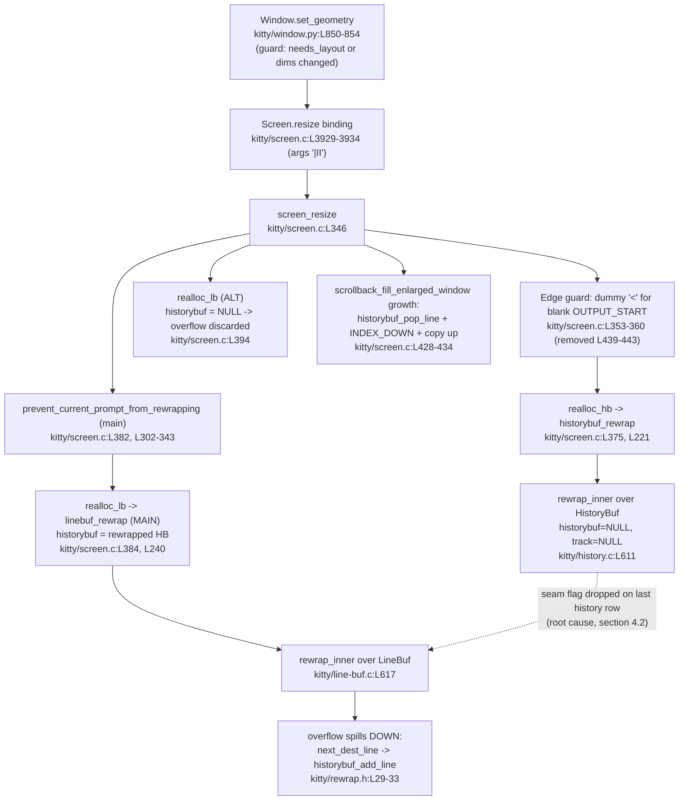

# kitty Terminal Reflow (`rewrap`): End‑to‑End Trace and Diagnosis of Line‑Continuation Loss at the History↔Screen Seam

> **Scope & method.** This is a **read‑only, run‑first‑then‑write** investigation. kitty was built in its canonical Docker configuration and the real reflow code paths (`Screen.resize`, `LineBuf.rewrap`, `HistoryBuf.rewrap`) were driven with temporary probe scripts; **every behavioral claim below is backed by the exact command and its complete, unedited output** (see the Evidence Appendix). Every code claim carries a `file:line` reference to the specific function/struct. No file in the kitty source tree was created, modified, or deleted. Claims derived purely from reading (not observed at runtime) are explicitly marked **(inferred)**.

---

## 0. Direct answer (lead with the plain reading)

**Does kitty's reflow preserve logical line boundaries when a soft‑wrapped logical line straddles the scrollback↔visible boundary during a resize? No — it does not.**

When a single soft‑wrapped logical line spans the seam between the scrollback history (`HistoryBuf`) and the visible grid (`LineBuf`), **resizing the window — either narrower or wider — deterministically splits that one logical line into two.** I reproduced this on the real `Screen.resize` entry point: a 70‑character logical line that is **one** logical line before resize becomes **two** logical lines after resize, every time (3/3 runs, both directions).

The root cause is structural: **the two buffers are rewrapped by two *independent* passes of the same core routine.** History is rewrapped first, entirely on its own (`historybuf_rewrap` calls `rewrap_inner(self, other, self->count, NULL, NULL, …)` — note the `NULL` history and `NULL` cursor tracker) [kitty/history.c:L611]; the visible grid is rewrapped afterward as a fresh pass [kitty/screen.c:L384]. Because the history pass has no knowledge that its **newest** line continues into the visible grid, the continuation (soft‑wrap) flag on the last rewrapped history row is **dropped**. I isolated exactly this: driving `HistoryBuf.rewrap` alone on a buffer whose newest row is continued, the newest rewrapped row comes back with `wrapped=False` (dropped) at every width tested.

Three important qualifications, all observed:

1. **Within a single buffer, reflow is correct.** `LineBuf.rewrap` alone and `HistoryBuf.rewrap` alone both preserve continuation perfectly (they reproduce kitty's own `test_rewrap_*` expectations exactly). The defect is specifically at the **cross‑buffer seam**.
2. **The damage is permanent and compounds.** Repeated resizes never rejoin the split line; resizing back to the *original* width does **not** restore the single logical line. The logical structure degrades monotonically (1 → 2 → 3 …).
3. **It is deterministic, not flaky.** The same unchanged input splits the same way on every run.

The remainder of this document traces the algorithm (a), the screen↔scrollback interaction (b), the continuation‑propagation issues (c), and the complete data flow (d), each backed by captured output.

---

## 1. Build & Environment (canonical, default build)

**Canonical environment.** kitty was built and all probes were run **inside** the canonical Docker image `ghcr.io/scaleapi/swe-atlas:swe_atlas_QnA_kovidgoyal_kitty_1.0` (a.k.a. `andrewparkscaleai/coding-agent:kovidgoyal__kitty__815df1e…`). The host's Python (3.13) **cannot** load the extension (`ImportError: libpython3.12.so.1.0: cannot open shared object file`), which is exactly why the build and every probe run inside the image.

**Python version used:** the canonical image ships **Python 3.12.3** as its default `python3`. The AAP suggested 3.11 as the highest *documented* supported version, but the image's default is 3.12.3; per the instruction to state the exact version used, **all results below are from Python 3.12.3**. This is within kitty's declared support: `requires-python = ">=3.8"` [pyproject.toml:L2].

**Build command (default action is `build`, per `setup.py`):**

```
docker run --rm --entrypoint /bin/bash \
  -v <HOSTREPO>:/work -w /work \
  ghcr.io/scaleapi/swe-atlas:swe_atlas_QnA_kovidgoyal_kitty_1.0 \
  -c 'git config --global --add safe.directory /work; python3 setup.py'
```

**Build output (excerpt — full log is 333 lines; the reflow sources and the link step shown verbatim):**

```
PYTHON: Python 3.12.3
CC: cc (Ubuntu 13.3.0-6ubuntu2~24.04) 13.3.0
--- BUILD START ---
[1/122] Compiling kitty/screen.c ...
[7/122] Compiling kitty/child-monitor.c ...
[22/122] Compiling kitty/line.c ...
[32/122] Compiling kitty/line-buf.c ...
[35/122] Compiling kitty/history.c ...
[1/5] Linking kitty/fast_data_types ...
```

The build completed with exit code 0 (~49 s) under the project's default flags (which include `-Werror`), producing the C extension:

```
-rwxr-xr-x 1 root root 1213072 Jul  8 04:15 kitty/fast_data_types.so
```

**Extension import verification (exact command + complete output):**

```
$ docker run --rm --entrypoint /bin/bash -v <HOSTREPO>:/work -w /work <IMAGE> \
    -c 'python3 --version; python3 -c "import kitty.fast_data_types as f; \
        print(\"import LineBuf/HistoryBuf/Screen/Cursor:\", \
        all(hasattr(f,n) for n in [\"LineBuf\",\"HistoryBuf\",\"Screen\",\"Cursor\"]))"'
Python 3.12.3
import LineBuf/HistoryBuf/Screen/Cursor: True
```

**Read‑only guarantee.** Build artifacts (`kitty/fast_data_types.so`, `build/`) are git‑ignored (`.gitignore` lists `*.so` and `/build/`). `git status --porcelain` is empty after the build; the kitty source tree is byte‑for‑byte unchanged. Probe scripts live only under `/tmp/reflow_probes/` (outside the repo) and are deleted at the end.

**Probe‑harness note.** All `Screen`‑level probes build a **real** `Screen` via kitty's own test harness `kitty_tests.BaseTest.create_screen(...)` [kitty_tests/__init__.py:L237-L241], which constructs `Screen(Callbacks(), lines, cols, scrollback, cell_width, cell_height, 0, Callbacks())` and drives the genuine `Screen.resize` binding — **not** a remote‑control or debug hook. Buffer‑level probes import `LineBuf`/`HistoryBuf`/`Cursor` directly from `kitty.fast_data_types` and replicate the `create_lbuf` helper from `kitty_tests/datatypes.py:L29-L36`.

**Filesystem caveat encountered (documented for reproducibility).** The probe scripts had to be written on the same filesystem where Docker mounts `-v` (the shell/host FS), not a separate editor sandbox; otherwise the `-v /tmp/reflow_probes:/probes` mount shows an empty directory.

---

## 2. (a) Trace of the rewrap implementation in the C code

### 2.1 One algorithm, compiled twice (macro‑templating)

kitty implements reflow **once**, as a macro‑templated routine in a header that is `#include`‑compiled into two translation units:

- **Core routine:** `rewrap_inner(BufType *src, BufType *dest, const index_type src_limit, HistoryBuf *historybuf, TrackCursor *track, ANSIBuf *as_ansi_buf)` [kitty/rewrap.h:L56-L96].
- **Visible‑grid instantiation (`LineBuf`)**: `#include "rewrap.h"` with **default macros** [kitty/line-buf.c:L583].
- **Scrollback instantiation (`HistoryBuf`)**: `#include "rewrap.h"` with **macro overrides** [kitty/history.c:L582-L592].

The mechanics inside `rewrap_inner`, each cited:

- **Reading the continuation marker.** `is_src_line_continued()` returns `src->line->gpu_cells[src->xnum-1].attrs.next_char_was_wrapped` [kitty/rewrap.h:L40-L42] — i.e. the physical soft‑wrap bit on the **last cell** of a source line decides whether the logical line continues.
- **Hard break → trailing‑blank trim.** When a source line is **not** continued, trailing `BLANK_CHAR` cells are trimmed: `while (src_x_limit && src->line->cpu_cells[src_x_limit-1].ch == BLANK_CHAR) src_x_limit--;` [kitty/rewrap.h:L68-L70].
- **Continued line → clear the source wrap bit and flow on.** When a source line **is** continued, `src->line->gpu_cells[src->xnum-1].attrs.next_char_was_wrapped = false;` [kitty/rewrap.h:L71-L73] and copying flows straight into the next source line (no hard break).
- **Copy in MIN‑sized runs.** `num = MIN(src->line->xnum - src_x, dest->xnum - dest_x)` [kitty/rewrap.h:L82-L83], then `copy_range` `memcpy`s both `cpu_cells` and `gpu_cells` [kitty/rewrap.h:L44-L48].
- **Advancing destination lines & spillover.** `next_dest_line(continued)` [kitty/rewrap.h:L24-L38] sets the finished destination line's last‑cell continuation via `linebuf_set_last_char_as_continuation`, and **when the destination grid is full it spills the overflowing top line into scrollback via `historybuf_add_line` — but only when `historybuf != NULL`** [kitty/rewrap.h:L29-L33]. It is invoked mid‑line when `dest_x >= dest->xnum` [kitty/rewrap.h:L80-L81] and at a hard break [kitty/rewrap.h:L93]. `first_dest_line` initializes the first destination row [kitty/rewrap.h:L20-L22].
- **Cursor tracking.** `TrackCursor { index_type x, y; bool is_tracked_line, is_sentinel; }` [kitty/rewrap.h:L50-L53]; a tracked x is clamped to the trimmed limit, `t->x = MAX(1u, src_x_limit) - 1` [kitty/rewrap.h:L74-L76], and remapped as cells are copied [kitty/rewrap.h:L84-L89]. The final row count is recorded as `dest->line->ynum = dest_y` [kitty/rewrap.h:L95].

**Visible‑grid wrapper.** `linebuf_rewrap(...)` [kitty/line-buf.c:L585-L622] takes a fast path (a plain `memcpy`) when dimensions are unchanged [kitty/line-buf.c:L591-L598]; otherwise it finds the first content line [kitty/line-buf.c:L600-L608] and calls `rewrap_inner(self, other, *num_content_lines_before, historybuf, tcarr, …)` [kitty/line-buf.c:L617]. The Python binding `LineBuf.rewrap(other, historybuf)` **requires** a `HistoryBuf` argument and returns a `(nclb, ncla)` tuple [kitty/line-buf.c:L624-L637]. The derived per‑line attribute `is_continued` is set from the **previous** line's last‑cell wrap flag [kitty/line-buf.c:L145].

**Scrollback wrapper.** The `HistoryBuf` overrides supply a **ring‑buffer address translation** `map_src_index(y) = ((src->start_of_data + y) % src->ynum)` [kitty/history.c:L584] and a `next_dest_line` that pushes onto the ring via `historybuf_push` [kitty/history.c:L588], with `first_dest_line = next_dest_line(false)` [kitty/history.c:L590]. `historybuf_rewrap(...)` [kitty/history.c:L594-L614] calls **`rewrap_inner(self, other, self->count, NULL, NULL, as_ansi_buf)`** [kitty/history.c:L611] — the `NULL` for `historybuf` means the history pass has **nowhere to spill** and the `NULL` for `track` means it carries **no cursor**. Its Python binding `HistoryBuf.rewrap(other)` returns `None` [kitty/history.c:L616-L623].

### 2.2 Driving the core in isolation (runtime evidence)

**Command (identical pattern for every probe):**

```
docker run --rm --entrypoint /bin/bash -v <HOSTREPO>:/work -v /tmp/reflow_probes:/probes \
  -w /work <IMAGE> -c 'PYTHONPATH=/work python3 /probes/probe_a.py'
```

The probe replicates `create_lbuf(*lines)` (a full‑width previous row ⇒ the next row is a continuation) and reads back state with `Line.last_char_has_wrapped_flag()` [kitty/line.c:L426-L431], `lb.is_continued(y)`, and `str(lb.line(y))`. Key observed results (complete output in the Evidence Appendix, §7.1):

**A1 — wider, one soft‑wrapped logical line** (`create_lbuf('0123 ','56789')` → width 6). Matches kitty's own `test_rewrap_wider`:

```
  [SRC 2x5] ...
    y=0: content='0123 '        is_continued=False last_char_wrapped=True
    y=1: content='56789'        is_continued=True  last_char_wrapped=False
  rewrap returned (nclb,ncla)=(2,2)
  [DST 3x6] ynum=3 xnum=6 dirty=[0, 1]
    y=0: content='0123 5'       is_continued=False last_char_wrapped=True
    y=1: content='6789'         is_continued=True  last_char_wrapped=False
    y=2: content=''             is_continued=False last_char_wrapped=False
```

Direct reading: the physical wrap marker (`last_char_wrapped=True`) that was on `'0123 '` moves to the new last cell `'0123 5'`; the single logical line reflows to `['0123 5','6789','']` with `is_continued=[False,True]`. **Cause→effect:** because `is_src_line_continued()` saw the wrap bit, the continued path [kitty/rewrap.h:L71-L73] flowed row 0 straight into row 1 at the new width.

**A2 — hard break trims trailing blanks** (`create_lbuf('12','abc')` → width 5). `'12'` has `last_char_wrapped=False` (a hard break), and the reflow yields `'12'` (not `'12   '`), demonstrating the trailing‑blank trim [kitty/rewrap.h:L68-L70].

**A4 — continued line preserves interior blanks** (`create_lbuf('123  ','abcde')` → width 3):

```
  [DST 4x3] ...
    y=0: content='123'          is_continued=False last_char_wrapped=True
    y=1: content='  a'          is_continued=True  last_char_wrapped=True
    y=2: content='bcd'          is_continued=True  last_char_wrapped=True
    y=3: content='e'            is_continued=True  last_char_wrapped=False
```

Direct reading: the two full‑width blanks in `'123  '` are **preserved** (`'  a'`), not trimmed. **Cause→effect:** the line is continued, so the code takes the *clear‑the‑wrap‑bit‑and‑flow* branch [kitty/rewrap.h:L71-L73] rather than the trim branch [kitty/rewrap.h:L68-L70]. This is the precise distinction between a soft wrap and a hard break.

**A5 — overflow spills DOWN into the passed `HistoryBuf`.** Rewrapping a full 5×5 buffer into a smaller 3×5 destination drops the **top two rows** from the visible result (`['22222','33333','44444']`, `(nclb,ncla)=(5,3)`); those top rows were pushed into the `HistoryBuf` handed to `LineBuf.rewrap` via `next_dest_line`→`historybuf_add_line` [kitty/rewrap.h:L29-L33].

**A7 — `HistoryBuf.rewrap` reflows a spanning logical line correctly *within* one buffer.** A logical line `'ABCDEfghij'` (older row `'ABCDE'` carries `wrapped=True`) rewrapped from width 5 to width 3 becomes, oldest→newest, `ABC(T) / DEf(T) / ghi(T) / j(F)` — continuation fully preserved. **This matters for the diagnosis in §4: the core routine is correct; the defect is not here but at the cross‑buffer seam.**

---


## 3. (b) The visible‑screen ↔ scrollback interaction during resize

### 3.1 Orchestration in `screen_resize` (code trace)

Resize is orchestrated by `screen_resize(Screen *self, unsigned int lines, unsigned int columns)` [kitty/screen.c:L346]. The relevant ordering, cited:

- **History is rewrapped FIRST and independently.** `realloc_hb(...)` [kitty/screen.c:L216-L223] allocates the new `HistoryBuf`, carries the pager history across (`ans->pagerhist = old->pagerhist` [kitty/screen.c:L219]), and calls `historybuf_rewrap(old, ans, as_ansi_buf)` [kitty/screen.c:L221]. It is invoked at [kitty/screen.c:L375] — **before** the visible grid.
- **The visible grid is rewrapped SECOND.** `realloc_lb(...)` [kitty/screen.c:L234-L242] calls `linebuf_rewrap(...)` [kitty/screen.c:L240]. Crucially, the **main** screen passes the already‑rewrapped `self->historybuf` [kitty/screen.c:L384] so visible overflow spills **down** into scrollback, whereas the **alternate** screen passes `NULL` [kitty/screen.c:L394] so its overflow is **discarded**.
- **Cursor & savepoints are carried through** via the `CursorTrack` struct [kitty/screen.c:L226-L232] and the `setup_cursor` macro [kitty/screen.c:L366-L370].
- **Python binding.** `resize(Screen *self, PyObject *args)` parses `"|II"` (a=lines, b=columns) and calls `screen_resize(self, a, b)` [kitty/screen.c:L3929-L3934].

### 3.2 Driving the real `Screen.resize` (runtime evidence)

**Command:**

```
docker run --rm --entrypoint /bin/bash -v <HOSTREPO>:/work -v /tmp/reflow_probes:/probes \
  -w /work <IMAGE> -c 'PYTHONPATH=/work python3 /probes/probe_b.py'
```

The input is one continuous 70‑character `draw` (`'A'*10 + 'B'*10 + … + 'G'*10`) — a **single soft‑wrapped logical line** that spans scrollback + visible grid. The probe reconstructs logical lines by walking history (oldest→newest) then the visible grid, splitting wherever `last_char_has_wrapped_flag()` is `False`. Complete output is in the Evidence Appendix (§7.2).

**History‑first + spillover.** On a narrower `resize(4,5)`, the main screen's scrollback **grows** as the visible top rows spill down:

```
  MAIN history count: before resize=3, after resize=10  (grew => visible top rows spilled DOWN into history)
```

Direct reading: the visible grid overflowed at the narrower width, and the overflowing top rows were pushed into the freshly‑rewrapped history. **Cause→effect:** `realloc_lb` for the main screen passed the rewrapped `HistoryBuf` [kitty/screen.c:L384], enabling the `next_dest_line`→`historybuf_add_line` spill path [kitty/rewrap.h:L29-L33].

**Main vs alternate divergence.** The alternate screen is rewrapped with a `NULL` history buffer, so its overflow is discarded rather than spilled:

```
  after toggle_alt_screen: is_main=False using_alt=True
  ...
  ALT history count: before resize=0, after resize=0  (stays 0 => overflow DISCARDED)
```

Direct reading: on the alternate screen, history stays empty across the resize. **Cause→effect:** `realloc_lb` for the alt screen passes `NULL` [kitty/screen.c:L394]; with `historybuf == NULL`, `next_dest_line` cannot spill [kitty/rewrap.h:L29-L33], so overflowing rows are dropped.

**Cursor is remapped through reflow.** Narrower `resize(4,5)`: cursor `(10,3) → (4,3)`. Wider `resize(4,10)`: cursor `(5,3) → (9,1)`. **Cause→effect:** the `CursorTrack` structure [kitty/screen.c:L226-L232] carries the cursor position through `rewrap_inner`'s remap logic [kitty/rewrap.h:L84-L89].

**The seam split, visible already here.** The logical‑line reconstruction shows the boundary damage directly (this is examined in depth in §4):

```
### B1a. MAIN, NARROWER: resize(4,5) ...
  [BEFORE 4x10] ...
    >>> LOGICAL LINES reconstructed ...: 1 line(s)
          logical[0] len= 70 = 'AAAAAAAAAABBBBBBBBBBCCCCCCCCCCDDDDDDDDDDEEEEEEEEEEFFFFFFFFFFGGGGGGGGGG'
  [AFTER  resize(4,5)] ...
    >>> LOGICAL LINES reconstructed ...: 2 line(s)
          logical[0] len= 30 = 'AAAAAAAAAABBBBBBBBBBCCCCCCCCCC'
          logical[1] len= 40 = 'DDDDDDDDDDEEEEEEEEEEFFFFFFFFFFGGGGGGGGGG'
```

Direct reading: **before** the resize, the buffer holds exactly **one** logical line (70 chars); **after**, it holds **two** (30 + 40), split precisely at the history↔screen boundary.

---


## 4. (c) Line‑continuation propagation issues between the two buffers

### 4.1 How continuation state is represented (code)

- **Physical soft‑wrap marker:** `next_char_was_wrapped : 1` on the last cell's `CellAttrs` [kitty/data-types.h:L206]. It is **excluded from `SGR_MASK`** [kitty/data-types.h:L214], so it survives SGR (color/attribute) resets.
- **Derived per‑line attribute:** `is_continued : 1` on `LineAttrs` [kitty/data-types.h:L233], computed from the **previous** line's last‑cell wrap flag [kitty/line-buf.c:L145].
- **Setters:** `linebuf_set_last_char_as_continuation` [kitty/line-buf.c:L193-L198] (visible) and `history_buf_set_last_char_as_continuation` [kitty/history.c:L302-L307] (scrollback).

Command for all runtime results in this section (complete output in §7.3):

```
docker run --rm --entrypoint /bin/bash -v <HOSTREPO>:/work -v /tmp/reflow_probes:/probes \
  -w /work <IMAGE> -c 'PYTHONPATH=/work python3 /probes/probe_c.py'
```

### 4.2 Candidate issue (1) — the history↔screen seam is not jointly reflowed *(PRIMARY, CONFIRMED)*

**Direct answer: CONFIRMED.** A soft‑wrapped logical line straddling the seam is split into two on resize, deterministically, in both directions.

```
  NARROWER 10->5: logical-line count BEFORE=1  AFTER over 3 runs=[2, 2, 2]  (deterministic=True)
     final-run logical lines: ['AAAAAAAAAABBBBBBBBBBCCCCCCCCCC', 'DDDDDDDDDDEEEEEEEEEEFFFFFFFFFFGGGGGGGGGG']
  WIDER    5->10: logical-line count BEFORE=1  AFTER over 3 runs=[2, 2, 2]  (deterministic=True)
     final-run logical lines: ['AAAAAAAAAABBBBBBBBBBCCCCCCCCCCDDDDDDDDDDEEEEEEEEEE', 'FFFFFFFFFFGGGGGGGGGG']
```

**Isolating the mechanism (the smoking gun).** Driving `HistoryBuf.rewrap` **alone** on a history whose **newest** row is continued (`wrapped=True`, i.e. the logical line continues past the newest history row) — using a *fresh* source each time — the newest rewrapped row comes back with the flag **dropped**:

```
  SRC HB 2x5 (fresh): line(0)='BBBBB'(wrapped=True) line(1)='AAAAA'(wrapped=True)
  -> rewrap to width 3: NEWEST rewrapped row hb2.line(0)='B' wrapped=False   (EXPECT True if preserved; False => DROPPED)
        hb2.line(0)='B'      wrapped=False
        hb2.line(1)='BBB'    wrapped=True
        hb2.line(2)='AAB'    wrapped=True
        hb2.line(3)='AAA'    wrapped=True
  SRC HB 2x5 (fresh): line(0)='BBBBB'(wrapped=True) line(1)='AAAAA'(wrapped=True)
  -> rewrap to width 7: NEWEST rewrapped row hb2.line(0)='BBB' wrapped=False   (EXPECT True if preserved; False => DROPPED)
        hb2.line(0)='BBB'    wrapped=False
        hb2.line(1)='AAAAABB' wrapped=True
```

Direct reading: the content reflows correctly (`AAAAABBBBB` → `AAA/AAB/BBB/B` at width 3), **but** the newest row's continuation flag is `False` even though the source said the logical line continues past it.

**Cause→effect.** `historybuf_rewrap` invokes `rewrap_inner(self, other, self->count, NULL, NULL, …)` [kitty/history.c:L611]. The pass runs only to `self->count` source lines and has a `NULL` `historybuf` (nowhere to spill) and `NULL` cursor tracker. When the **last** source line is a continued line, the code takes the *clear‑the‑wrap‑bit‑and‑flow* branch [kitty/rewrap.h:L71-L73] expecting a following source line — but there is none, so the final destination row never receives a `next_dest_line(true)` call to set its continuation. The continuation *into content the history pass cannot see* (the visible grid) is therefore lost. Then the visible grid is rewrapped by a **separate** `rewrap_inner` pass [kitty/screen.c:L384] whose `first_dest_line` [kitty/rewrap.h:L20-L22] treats the top visible row as a brand‑new logical‑line start. The one logical line is thus reflowed as **two independent units**, and the seam flag that should stitch them is dropped. This is the direct cause of the user's "logical line boundaries not preserved" observation.

**Side effect noted (benign).** `rewrap_inner` **clears the source's** last‑cell wrap bit on continued lines [kitty/rewrap.h:L72]; observing the same source before/after a rewrap shows both rows flip `wrapped=True → False`. In production this is harmless because the source buffer is discarded right after resize (`Py_CLEAR(self->historybuf)` [kitty/screen.c:L377]); it only required using a fresh source per iteration in the probe.

### 4.3 Candidate issue (2) — spillover ordering / column dependence *(CONFIRMED)*

**Direct answer: CONFIRMED.** The dropped flag sits exactly at the boundary between the independently‑rewrapped **old** history and the **spilled‑down** visible rows:

```
  history rows oldest->newest with wrap flags:
    hist(9)='AAAAA'  wrapped=True
    hist(8)='AAAAA'  wrapped=True
    hist(7)='BBBBB'  wrapped=True
    hist(6)='BBBBB'  wrapped=True
    hist(5)='CCCCC'  wrapped=True
    hist(4)='CCCCC'  wrapped=False  <-- FLAG DROPPED (breaks logical line)
    hist(3)='DDDDD'  wrapped=True
    hist(2)='DDDDD'  wrapped=True
    hist(1)='EEEEE'  wrapped=True
    hist(0)='EEEEE'  wrapped=True
```

Direct reading: rows `A,B,C` (the original scrollback content) were rewrapped first; their last row `hist(4)='CCCCC'` lost its flag. Rows `D,E` (spilled from the visible grid *after* the history pass) carry correct `wrapped=True` flags. **Cause→effect:** continuity between pre‑existing history and newly pushed rows depends entirely on the last‑cell flag of the last old‑history row, which the independent history pass drops (§4.2). Because history is rewrapped to the new column count *before* any screen overflow is known, the two halves can never be stitched by the current design.

### 4.4 Candidate issue (3) — trailing‑blank trim vs. continued lines, and cursor‑at‑EOL *(REFUTED as a defect; works correctly)*

**Direct answer: no defect observed here.** The trim/continued distinction and cursor remapping behave correctly.

```
  after draw 25 X at width 10: cursor=(5,2)
  after resize(4,7): cursor=(4,3)  visible:
    vis(0)='XXXXXXX' wrapped=True
    vis(1)='XXXXXXX' wrapped=True
    vis(2)='XXXXXXX' wrapped=True
    vis(3)='XXXX'    wrapped=False
  after draw 20 Y at width 10 (cursor pending-wrap): cursor=(10,1)
  after resize(4,8): cursor=(4,2)
```

Direct reading: 25 `X` at width 7 reflow to `XXXXXXX×3 + XXXX` and the cursor lands at end‑of‑content `(4,3)`; a pending‑wrap cursor at `(10,1)` remaps to `(4,2)` after a width‑8 reflow. **Cause→effect:** tracked x is clamped to the trimmed limit [kitty/rewrap.h:L74-L76] and remapped during copy [kitty/rewrap.h:L84-L89]; the width‑exact/continued cases were already shown correct in A1/A4 (§2.2). This candidate is **not** a source of the boundary bug.

### 4.5 Candidate issue (4) — intentional reflow bypasses *(CONFIRMED by design; NOT active in these runs)*

**Direct answer: these are by‑design and did not fire in the canonical harness.** After resize the content is reflowed, not blanked:

```
  after resize, content reflowed (NOT blanked): vis(0)='FFFFF'
  => prompt-protection path NOT triggered without OSC-133 prompt marks (by-design bypass inactive).
```

`prevent_current_prompt_from_rewrapping` [kitty/screen.c:L302-L343] is guarded by `prompt_settings.redraws_prompts_at_all` [kitty/screen.c:L305]; it deliberately copies the current prompt out and blanks it (trusting the shell to redraw). The blank‑`OUTPUT_START` dummy `<` insertion [kitty/screen.c:L353-L360] likewise deviates from pure reflow on purpose (and is removed afterward [kitty/screen.c:L439-L443]). Because the harness draws plain text with no OSC‑133 prompt marks, neither path fires — so **neither explains the seam split**; the split is a genuine defect, distinct from these intentional bypasses.

### 4.6 Candidate issue (5) — deferred pager‑history rewrap *(code‑confirmed; not exercised by visible reflow)*

**Direct answer: the code path exists but is orthogonal to the visible seam, and was not exercised here.**

```
  pagerhist_as_text() length before resize = 0
  pagerhist_as_text() length after column-changing resize = 0
```

`historybuf_rewrap` sets `other->pagerhist->rewrap_needed = true` **only when the column count changes** (`other->xnum != self->xnum`) and the ring buffer is in use [kitty/history.c:L607-L608] (`rewrap_needed` is declared at [kitty/data-types.h:L271]), deferring the pager‑history reflow to a lazy path. In this harness the pager history is empty, so the deferred path is not triggered by the visible reflow. Per scope this is kept shallow; it does not affect the visible history↔screen boundary. **(Inferred from code that the flag is set on column change; the runtime shows the pager history simply empty here.)**

### 4.7 Damage is permanent and compounds *(CONFIRMED)*

**Direct answer: CONFIRMED — once split, the logical line never rejoins, and further resizes fragment it more.**

```
  initial: logical-line count = 1
  after resize(4,5): logical-line count = 2  ['AAAAAAAAAABBBBBBBBBBCCCCCCCCCC', 'DDDDDDDDDDEEEEEEEEEEFFFFFFFFFFGGGGGGGGGG']
  after resize(4,7): logical-line count = 3  ['AAAAAAAAAABBBBBBBBBBCCCCCCCCCC', 'DDDDDDDDDDEEEEEEEEEE', 'FFFFFFFFFFGGGGGGGGGG']
  after resize(4,10): logical-line count = 3  ['AAAAAAAAAABBBBBBBBBBCCCCCCCCCC', 'DDDDDDDDDDEEEEEEEEEE', 'FFFFFFFFFFGGGGGGGGGG']
```

Direct reading: `1 → 2 → 3 → 3`. Resizing **back** to the original width 10 does **not** restore the single line. **Cause→effect:** each resize drops another seam flag between old history and spilled content (§4.2), and no pass ever re‑examines a previously finalized boundary; the fragmentation is therefore cumulative and irreversible within the buffer.

### 4.8 Configuration surface — `scrollback_fill_enlarged_window`, both states *(CONFIRMED difference)*

The option defaults to `False` [kitty/options/types.py:L570] (definition `opt('scrollback_fill_enlarged_window', 'no', …)` [kitty/options/definition.py:L420-L423]; parser [kitty/options/parse.py:L1175-L1176]). Exercised on a **taller** (enlarged) `resize(8,10)`:

```
  fill=False: history count 3->3 after grow-to-8-lines; visible rows:
      vis(0)='DDDDDDDDDD'
      vis(1)='EEEEEEEEEE'
      vis(2)='FFFFFFFFFF'
      vis(3)='GGGGGGGGGG'
      vis(4)=''
      ...
  fill=True : history count 3->0 after grow-to-8-lines; visible rows:
      vis(0)='AAAAAAAAAA'
      vis(1)='BBBBBBBBBB'
      vis(2)='CCCCCCCCCC'
      vis(3)='DDDDDDDDDD'
      vis(4)='EEEEEEEEEE'
      vis(5)='FFFFFFFFFF'
      vis(6)='GGGGGGGGGG'
      vis(7)=''
```

Direct reading: with the option **disabled** (default), the extra rows created by the taller window are left **blank** and history is untouched (`3→3`); with it **enabled**, kitty pulls rows **up from scrollback** to fill the enlarged window (`history 3→0`, visible now shows `A…G`). **Cause→effect:** the growth path runs only when `is_main && OPT(scrollback_fill_enlarged_window)` [kitty/screen.c:L428], popping history via `historybuf_pop_line` [kitty/screen.c:L432], shifting the grid with `INDEX_DOWN` [kitty/screen.c:L433], and copying the popped line in with `linebuf_copy_line_to` [kitty/screen.c:L434]. Note: this option governs only *height‑growth fill*; it does **not** repair the seam continuation‑flag drop of §4.2.

---


## 5. (d) Complete data flow from the resize entry point

### 5.1 End‑to‑end call chain (every anchor verified against this branch)

1. **GUI/layout entry:** `Window.set_geometry(self, new_geometry)` [kitty/window.py:L850] calls `self.screen.resize(max(0, new_geometry.ynum), max(0, new_geometry.xnum))` [kitty/window.py:L854] — but **only** when `self.needs_layout` or the dimensions changed [kitty/window.py:L853].
2. **Python binding:** `resize(Screen *self, PyObject *args)` parses `"|II"` (a=lines, b=columns) and calls `screen_resize(self, a, b)` [kitty/screen.c:L3929-L3934].
3. **Orchestrator:** `screen_resize` [kitty/screen.c:L346]:
   - **Edge guard:** if the main screen's cursor is on a blank `OUTPUT_START` line, a dummy `'<'` is inserted so reflow preserves the line [kitty/screen.c:L353-L360], and removed afterward [kitty/screen.c:L439-L443].
   - **History first:** `realloc_hb` → `historybuf_rewrap` → `rewrap_inner(self, other, self->count, NULL, NULL, …)` [kitty/screen.c:L375, L221; kitty/history.c:L611].
   - **Prompt protection:** `prevent_current_prompt_from_rewrapping` (main only) [kitty/screen.c:L382, L302-L343].
   - **Screen second:** `realloc_lb` → `linebuf_rewrap` → `rewrap_inner(self, other, *nclb, historybuf, tcarr, …)`; **main passes the rewrapped `HistoryBuf`** [kitty/screen.c:L384] while **alt passes `NULL`** [kitty/screen.c:L394].
   - **Continuation setters** fire inside `rewrap_inner` via `next_dest_line` → `linebuf_set_last_char_as_continuation` [kitty/line-buf.c:L193-L198] / `history_buf_set_last_char_as_continuation` [kitty/history.c:L302-L307]; **overflow spills** via `next_dest_line` → `historybuf_add_line` [kitty/rewrap.h:L29-L33].
   - **Optional growth path:** `scrollback_fill_enlarged_window` pulls lines up from history when the window is enlarged [kitty/screen.c:L428-L434].

### 5.2 Call‑flow diagram



### 5.3 Contrast: the PTY window‑size path is **not** buffer reflow

A terminal resize has a second, independent half that must not be conflated with reflow: telling the child process about the new size. `pty_resize(int fd, struct winsize *dim)` [kitty/child-monitor.c:L577] issues `ioctl(fd, TIOCSWINSZ, dim)` [kitty/child-monitor.c:L579] (retrying on `EINTR`), exposed through the `resize_pty` binding [kitty/child-monitor.c:L591] which parses `"kHHHH"` (window id + `ws_row`/`ws_col`/`ws_xpixel`/`ws_ypixel`). This delivers the new `winsize`/`SIGWINCH` to the child; it performs **no** buffer reflow and is entirely separate from the `screen_resize` path traced above.

### 5.4 Runtime confirmation that these links execute

The `Screen.resize` binding → `screen_resize` → history‑first → screen‑second → spill/discard → growth‑path links (steps 2, 3) were all exercised by driving the **real** binding in §3 and §4 (probes `probe_b.py`/`probe_c.py`): observed history‑first spillover (`3→10`), main‑vs‑alt divergence (`0→0` on alt), cursor remap, and the `scrollback_fill_enlarged_window` growth (`3→0`). The `Window.set_geometry → Screen.resize` link (step 1) is verified by code (guard [kitty/window.py:L853] + call [kitty/window.py:L854]); it was not driven directly because it requires a full GUI `Window` object, which is outside the reflow subsystem.

---

## 6. Brief industry framing (context only)

Terminal emulators distinguish **soft wraps** (a line that merely exceeded the column width) from **hard wraps** (an application‑emitted newline); on resize, only soft‑wrapped runs are reflowed while hard breaks are preserved. kitty encodes exactly this with the per‑cell `next_char_was_wrapped` bit [kitty/data-types.h:L206]. Reflowing content **across the scrollback/viewport boundary** while keeping offsets consistent is widely recognized as one of the harder parts of terminal reflow, and on‑resize reflow itself is a comparatively modern, opt‑in‑by‑design feature (older xterm did not reflow). kitty's design — rewrapping history and the visible grid as two independent passes — is what makes that boundary the fragile seam this investigation isolates. (General background; not a substitute for the observed results above.)

---


## 7. Evidence appendix (temporary probe scripts + complete, unedited output)

The probe scripts below lived only under `/tmp/reflow_probes/` (outside the repository) and were **deleted** after the investigation; their contents are preserved here for reproducibility. Each was run inside the canonical Docker image with `PYTHONPATH=/work python3 /probes/<probe>.py`. The output blocks are complete and unedited.

### 7.1 `probe_a.py` — rewrap core (LineBuf.rewrap / HistoryBuf.rewrap)

**Script:**

```python
#!/usr/bin/env python3
# Objective (a): drive the rewrap CORE in isolation via the REAL bindings
# LineBuf.rewrap(other, historybuf)  [kitty/line-buf.c:L624-637]
# HistoryBuf.rewrap(other)           [kitty/history.c:L616-623]
# Read physical wrap marker via Line.last_char_has_wrapped_flag() [kitty/line.c:L426-431]
# Models kitty_tests/datatypes.py (create_lbuf L29-36, rewrap L332-335, test_rewrap_* L337-392)
from kitty.fast_data_types import LineBuf, HistoryBuf, Cursor

def C():
    return Cursor()

def create_lbuf(*lines):
    # Replica of kitty_tests/datatypes.py:create_lbuf (L29-36) -- builds soft-wrapped
    # logical lines: row i>0 is a continuation iff the previous row filled the full width.
    maxw = max(map(len, lines))
    ans = LineBuf(len(lines), maxw)
    for i, l0 in enumerate(lines):
        ans.line(i).set_text(l0, 0, len(l0), C())
        if i > 0:
            ans.set_continued(i, len(lines[i-1]) == maxw)
    return ans

def dump_lb(lb, label):
    print(f"  [{label}] ynum={lb.ynum} xnum={lb.xnum} dirty={lb.dirty_lines()}")
    for y in range(lb.ynum):
        ln = lb.line(y)
        print(f"    y={y}: content={str(ln)!r:14} is_continued={lb.is_continued(y)!s:5} "
              f"last_char_wrapped={ln.last_char_has_wrapped_flag()}")

def dump_hb(hb, label):
    # HistoryBuf has no is_continued() binding; use last_char_has_wrapped_flag per row.
    # hb.line(0) is the MOST RECENTLY added line.
    print(f"  [{label}] count={hb.count} ynum={hb.ynum} xnum={hb.xnum}")
    for y in range(hb.count):
        ln = hb.line(y)
        print(f"    line({y})={str(ln)!r:14} last_char_wrapped={ln.last_char_has_wrapped_flag()}")

def rewrap_lb(lb, new_lines, new_cols):
    # Mirror of kitty_tests/datatypes.py:rewrap helper (L332-335): binding REQUIRES a HistoryBuf arg.
    lb2 = LineBuf(new_lines, new_cols)
    hb = HistoryBuf(lb2.ynum, lb2.xnum)
    nclb, ncla = lb.rewrap(lb2, hb)
    return lb2, hb, nclb, ncla

print("=" * 78)
print("OBJECTIVE (a) - REWRAP CORE, driven via LineBuf.rewrap / HistoryBuf.rewrap")
print("=" * 78)

print("\n### A1. WIDER: create_lbuf('0123 ','56789') -> width 6  (models test_rewrap_wider)")
print("###     '0123 '+'56789' is ONE logical soft-wrapped line (prev row fills width 5).")
lb = create_lbuf('0123 ', '56789')
dump_lb(lb, "SRC 2x5")
lb2, hb, nclb, ncla = rewrap_lb(lb, 3, 6)
print(f"  rewrap returned (nclb,ncla)=({nclb},{ncla})")
dump_lb(lb2, "DST 3x6")

print("\n### A2. WIDER, two SEPARATE logical lines: create_lbuf('12','abc') -> width 5")
print("###     row1 NOT continued (len('12')=2 != maxw 3) => hard break; trailing blank of '12' trimmed.")
lb = create_lbuf('12', 'abc')
dump_lb(lb, "SRC 2x3")
lb2, hb, nclb, ncla = rewrap_lb(lb, 2, 5)
print(f"  rewrap returned (nclb,ncla)=({nclb},{ncla})")
dump_lb(lb2, "DST 2x5")

print("\n### A3. NARROWER: create_lbuf('123','abcde') -> width 3  (models test_rewrap_narrower)")
print("###     row1 NOT continued => two logical lines '123' and 'abcde'.")
lb = create_lbuf('123', 'abcde')
dump_lb(lb, "SRC 2x5")
lb2, hb, nclb, ncla = rewrap_lb(lb, 3, 3)
print(f"  rewrap returned (nclb,ncla)=({nclb},{ncla})")
dump_lb(lb2, "DST 3x3")

print("\n### A4. NARROWER, continued w/ interior blanks: create_lbuf('123  ','abcde') -> width 3")
print("###     row1 IS continued (len('123  ')=5==maxw 5) => ONE logical line '123  abcde';")
print("###     interior blanks are PRESERVED (not trimmed) because the line is continued.")
lb = create_lbuf('123  ', 'abcde')
dump_lb(lb, "SRC 2x5")
lb2, hb, nclb, ncla = rewrap_lb(lb, 4, 3)
print(f"  rewrap returned (nclb,ncla)=({nclb},{ncla})")
dump_lb(lb2, "DST 4x3")

print("\n### A5. SIMPLE same/larger/smaller dst (models test_rewrap_simple); filled_line_buf(5,5)")
def filled_line_buf(ynum=5, xnum=5):
    ans = LineBuf(ynum, xnum)
    cur = Cursor(); cur.x = 0
    for i in range(ynum):
        ans.line(i).set_text(str(i) * xnum, 0, xnum, cur)
    return ans
lb = filled_line_buf(5, 5)
dump_lb(lb, "SRC 5x5 (rows '00000'..'44444')")
for (yl, xl) in [(5, 5), (8, 5), (3, 5)]:
    lb2, hb, nclb, ncla = rewrap_lb(lb, yl, xl)
    print(f"  -> rewrap to {yl}x{xl}: (nclb,ncla)=({nclb},{ncla})")
    dump_lb(lb2, f"DST {yl}x{xl}")

print("\n### A6. HISTORYBUF.rewrap: filled_history_buf(5,5) -> same-width(8,5) fast path")
def filled_history_buf(ynum=5, xnum=5):
    lb = filled_line_buf(ynum, xnum)
    ans = HistoryBuf(ynum, xnum)
    for i in range(ynum):
        ans.push(lb.line(i))
    return ans
hb = filled_history_buf(5, 5)
dump_hb(hb, "SRC HB 5x5")
hb2 = HistoryBuf(8, 5)
hb.rewrap(hb2)
dump_hb(hb2, "DST HB 8x5 (same width -> fast path)")

print("\n### A7. HISTORYBUF.rewrap WIDTH CHANGE with a soft-wrapped logical line spanning 2 rows")
src = create_lbuf('ABCDE', 'fghij')   # one logical line ABCDEfghij (row0 fills width 5 -> continued)
hbsrc = HistoryBuf(2, 5)
hbsrc.push(src.line(0)); hbsrc.push(src.line(1))
print("  NOTE: hb.line(0) is most-recent; pushed ABCDE first then fghij.")
dump_hb(hbsrc, "SRC HB 2x5")
hbdst = HistoryBuf(4, 3)
hbsrc.rewrap(hbdst)
dump_hb(hbdst, "DST HB 4x3")

print("\n=== probe_a.py complete ===")
```

**Complete output:**

```text
==============================================================================
OBJECTIVE (a) - REWRAP CORE, driven via LineBuf.rewrap / HistoryBuf.rewrap
==============================================================================

### A1. WIDER: create_lbuf('0123 ','56789') -> width 6  (models test_rewrap_wider)
###     '0123 '+'56789' is ONE logical soft-wrapped line (prev row fills width 5).
  [SRC 2x5] ynum=2 xnum=5 dirty=[]
    y=0: content='0123 '        is_continued=False last_char_wrapped=True
    y=1: content='56789'        is_continued=True  last_char_wrapped=False
  rewrap returned (nclb,ncla)=(2,2)
  [DST 3x6] ynum=3 xnum=6 dirty=[0, 1]
    y=0: content='0123 5'       is_continued=False last_char_wrapped=True
    y=1: content='6789'         is_continued=True  last_char_wrapped=False
    y=2: content=''             is_continued=False last_char_wrapped=False

### A2. WIDER, two SEPARATE logical lines: create_lbuf('12','abc') -> width 5
###     row1 NOT continued (len('12')=2 != maxw 3) => hard break; trailing blank of '12' trimmed.
  [SRC 2x3] ynum=2 xnum=3 dirty=[]
    y=0: content='12'           is_continued=False last_char_wrapped=False
    y=1: content='abc'          is_continued=False last_char_wrapped=False
  rewrap returned (nclb,ncla)=(2,2)
  [DST 2x5] ynum=2 xnum=5 dirty=[0, 1]
    y=0: content='12'           is_continued=False last_char_wrapped=False
    y=1: content='abc'          is_continued=False last_char_wrapped=False

### A3. NARROWER: create_lbuf('123','abcde') -> width 3  (models test_rewrap_narrower)
###     row1 NOT continued => two logical lines '123' and 'abcde'.
  [SRC 2x5] ynum=2 xnum=5 dirty=[]
    y=0: content='123'          is_continued=False last_char_wrapped=False
    y=1: content='abcde'        is_continued=False last_char_wrapped=False
  rewrap returned (nclb,ncla)=(2,3)
  [DST 3x3] ynum=3 xnum=3 dirty=[0, 1, 2]
    y=0: content='123'          is_continued=False last_char_wrapped=False
    y=1: content='abc'          is_continued=False last_char_wrapped=True
    y=2: content='de'           is_continued=True  last_char_wrapped=False

### A4. NARROWER, continued w/ interior blanks: create_lbuf('123  ','abcde') -> width 3
###     row1 IS continued (len('123  ')=5==maxw 5) => ONE logical line '123  abcde';
###     interior blanks are PRESERVED (not trimmed) because the line is continued.
  [SRC 2x5] ynum=2 xnum=5 dirty=[]
    y=0: content='123  '        is_continued=False last_char_wrapped=True
    y=1: content='abcde'        is_continued=True  last_char_wrapped=False
  rewrap returned (nclb,ncla)=(2,4)
  [DST 4x3] ynum=4 xnum=3 dirty=[0, 1, 2, 3]
    y=0: content='123'          is_continued=False last_char_wrapped=True
    y=1: content='  a'          is_continued=True  last_char_wrapped=True
    y=2: content='bcd'          is_continued=True  last_char_wrapped=True
    y=3: content='e'            is_continued=True  last_char_wrapped=False

### A5. SIMPLE same/larger/smaller dst (models test_rewrap_simple); filled_line_buf(5,5)
  [SRC 5x5 (rows '00000'..'44444')] ynum=5 xnum=5 dirty=[]
    y=0: content='00000'        is_continued=False last_char_wrapped=False
    y=1: content='11111'        is_continued=False last_char_wrapped=False
    y=2: content='22222'        is_continued=False last_char_wrapped=False
    y=3: content='33333'        is_continued=False last_char_wrapped=False
    y=4: content='44444'        is_continued=False last_char_wrapped=False
  -> rewrap to 5x5: (nclb,ncla)=(5,5)
  [DST 5x5] ynum=5 xnum=5 dirty=[]
    y=0: content='00000'        is_continued=False last_char_wrapped=False
    y=1: content='11111'        is_continued=False last_char_wrapped=False
    y=2: content='22222'        is_continued=False last_char_wrapped=False
    y=3: content='33333'        is_continued=False last_char_wrapped=False
    y=4: content='44444'        is_continued=False last_char_wrapped=False
  -> rewrap to 8x5: (nclb,ncla)=(5,5)
  [DST 8x5] ynum=8 xnum=5 dirty=[0, 1, 2, 3, 4]
    y=0: content='00000'        is_continued=False last_char_wrapped=False
    y=1: content='11111'        is_continued=False last_char_wrapped=False
    y=2: content='22222'        is_continued=False last_char_wrapped=False
    y=3: content='33333'        is_continued=False last_char_wrapped=False
    y=4: content='44444'        is_continued=False last_char_wrapped=False
    y=5: content=''             is_continued=False last_char_wrapped=False
    y=6: content=''             is_continued=False last_char_wrapped=False
    y=7: content=''             is_continued=False last_char_wrapped=False
  -> rewrap to 3x5: (nclb,ncla)=(5,3)
  [DST 3x5] ynum=3 xnum=5 dirty=[0, 1, 2]
    y=0: content='22222'        is_continued=False last_char_wrapped=False
    y=1: content='33333'        is_continued=False last_char_wrapped=False
    y=2: content='44444'        is_continued=False last_char_wrapped=False

### A6. HISTORYBUF.rewrap: filled_history_buf(5,5) -> same-width(8,5) fast path
  [SRC HB 5x5] count=5 ynum=5 xnum=5
    line(0)='44444'        last_char_wrapped=False
    line(1)='33333'        last_char_wrapped=False
    line(2)='22222'        last_char_wrapped=False
    line(3)='11111'        last_char_wrapped=False
    line(4)='00000'        last_char_wrapped=False
  [DST HB 8x5 (same width -> fast path)] count=5 ynum=8 xnum=5
    line(0)='44444'        last_char_wrapped=False
    line(1)='33333'        last_char_wrapped=False
    line(2)='22222'        last_char_wrapped=False
    line(3)='11111'        last_char_wrapped=False
    line(4)='00000'        last_char_wrapped=False

### A7. HISTORYBUF.rewrap WIDTH CHANGE with a soft-wrapped logical line spanning 2 rows
  NOTE: hb.line(0) is most-recent; pushed ABCDE first then fghij.
  [SRC HB 2x5] count=2 ynum=2 xnum=5
    line(0)='fghij'        last_char_wrapped=False
    line(1)='ABCDE'        last_char_wrapped=True
  [DST HB 4x3] count=4 ynum=4 xnum=3
    line(0)='j'            last_char_wrapped=False
    line(1)='ghi'          last_char_wrapped=True
    line(2)='DEf'          last_char_wrapped=True
    line(3)='ABC'          last_char_wrapped=True

=== probe_a.py complete ===
```

### 7.2 `probe_b.py` — real Screen.resize (history-first/screen-second, main vs alt)

**Script:**

```python
#!/usr/bin/env python3
# Objective (b): drive the REAL Screen.resize entry point [kitty/screen.c:L3928-3935 -> screen_resize L346].
# Show: (1) history rewrapped FIRST then screen (realloc_hb L375 before realloc_lb L384),
#       (2) visible overflow spills DOWN into scrollback (main passes self->historybuf L384),
#       (3) MAIN vs ALTERNATE divergence (alt passes NULL history L394 -> overflow discarded).
from kitty_tests import BaseTest

class P(BaseTest):
    def runTest(self):
        pass

bt = P()

def logical_reconstruction(s):
    # Reassemble logical lines oldest->newest across HISTORY then VISIBLE, using the
    # physical soft-wrap marker (last_char_has_wrapped_flag) to decide continuation.
    # history line index counts DOWN from oldest (count-1) to newest (0), then visible 0..ynum-1.
    hb, lb = s.historybuf, s.linebuf
    rows = []
    for i in range(hb.count - 1, -1, -1):     # oldest -> newest history
        ln = hb.line(i)
        rows.append((f"H{i}", str(ln), ln.last_char_has_wrapped_flag()))
    for i in range(lb.ynum):                  # top -> bottom visible
        ln = lb.line(i)
        rows.append((f"V{i}", str(ln), ln.last_char_has_wrapped_flag()))
    # Group into logical lines: a row that is NOT wrapped ends the current logical line.
    logical, cur = [], []
    for tag, txt, w in rows:
        cur.append(txt)
        if not w:
            logical.append(''.join(cur)); cur = []
    if cur:
        logical.append(''.join(cur))
    return logical

def dump(s, label):
    lb, hb = s.linebuf, s.historybuf
    print(f"  [{label}] is_main={s.is_main_linebuf()} using_alt={s.is_using_alternate_linebuf()} "
          f"cursor=({s.cursor.x},{s.cursor.y}) grid={lb.ynum}x{lb.xnum}")
    print(f"    HISTORY count={hb.count} (line0 = MOST RECENT / closest to visible top):")
    for i in range(hb.count):
        ln = hb.line(i)
        print(f"      hist({i})={str(ln)!r:14} wrapped={ln.last_char_has_wrapped_flag()}")
    print(f"    VISIBLE {lb.ynum} rows:")
    for i in range(lb.ynum):
        ln = lb.line(i)
        print(f"      vis({i})={str(ln)!r:14} wrapped={ln.last_char_has_wrapped_flag()} is_continued={lb.is_continued(i)}")
    if hb.count:
        sh, sv = hb.line(0), lb.line(0)
        print(f"    >>> SEAM (history newest -> visible top): hist(0)={str(sh)!r} wrapped={sh.last_char_has_wrapped_flag()} "
              f"| vis(0)={str(sv)!r} is_continued={lb.is_continued(0)}")
    recon = logical_reconstruction(s)
    print(f"    >>> LOGICAL LINES reconstructed (oldest->newest, split on wrapped=False): {len(recon)} line(s)")
    for k, L in enumerate(recon):
        print(f"          logical[{k}] len={len(L):3} = {L!r}")

BLOCKS = ''.join(ch * 10 for ch in 'ABCDEFG')  # 70 chars = ONE soft-wrapped logical line

print("=" * 78)
print("OBJECTIVE (b) - SCREEN.resize: history-first/screen-second, spillover, main vs alt")
print("=" * 78)
print(f"Input: one continuous draw of {len(BLOCKS)} chars = A*10 B*10 C*10 D*10 E*10 F*10 G*10")
print("       => a SINGLE soft-wrapped logical line spanning scrollback + visible grid.")

print("\n### B1a. MAIN, NARROWER: resize(4,5)  [grid 4x10, 3 rows in history -> 4x5]")
s = bt.create_screen(cols=10, lines=4, scrollback=30)
s.draw(BLOCKS)
dump(s, "BEFORE 4x10")
s.resize(4, 5)
dump(s, "AFTER  resize(4,5)")

print("\n### B1b. MAIN, WIDER: resize(4,10)  [grid 4x5, 10 rows in history -> 4x10]")
s = bt.create_screen(cols=5, lines=4, scrollback=30)
s.draw(BLOCKS)
dump(s, "BEFORE 4x5")
s.resize(4, 10)
dump(s, "AFTER  resize(4,10)")

print("\n### B2-main: draw on MAIN, resize narrower -> overflow SPILLS into history")
s = bt.create_screen(cols=10, lines=4, scrollback=30)
s.draw(BLOCKS)
before = s.historybuf.count
s.resize(4, 5)
print(f"  MAIN history count: before resize={before}, after resize={s.historybuf.count}  (grew => visible top rows spilled DOWN into history)")

print("\n### B2-alt: ALTERNATE screen, draw, resize -> overflow DISCARDED (NULL history)")
s2 = bt.create_screen(cols=10, lines=4, scrollback=30)
s2.toggle_alt_screen()
print(f"  after toggle_alt_screen: is_main={s2.is_main_linebuf()} using_alt={s2.is_using_alternate_linebuf()}")
s2.draw(BLOCKS)
altb = s2.historybuf.count
dump(s2, "ALT BEFORE resize 4x10")
s2.resize(4, 5)
print(f"  ALT history count: before resize={altb}, after resize={s2.historybuf.count}  (stays 0 => overflow DISCARDED)")
dump(s2, "ALT AFTER resize(4,5)")

print("\n=== probe_b.py complete ===")
```

**Complete output:**

```text
==============================================================================
OBJECTIVE (b) - SCREEN.resize: history-first/screen-second, spillover, main vs alt
==============================================================================
Input: one continuous draw of 70 chars = A*10 B*10 C*10 D*10 E*10 F*10 G*10
       => a SINGLE soft-wrapped logical line spanning scrollback + visible grid.

### B1a. MAIN, NARROWER: resize(4,5)  [grid 4x10, 3 rows in history -> 4x5]
  [BEFORE 4x10] is_main=True using_alt=False cursor=(10,3) grid=4x10
    HISTORY count=3 (line0 = MOST RECENT / closest to visible top):
      hist(0)='CCCCCCCCCC'   wrapped=True
      hist(1)='BBBBBBBBBB'   wrapped=True
      hist(2)='AAAAAAAAAA'   wrapped=True
    VISIBLE 4 rows:
      vis(0)='DDDDDDDDDD'   wrapped=True is_continued=False
      vis(1)='EEEEEEEEEE'   wrapped=True is_continued=True
      vis(2)='FFFFFFFFFF'   wrapped=True is_continued=True
      vis(3)='GGGGGGGGGG'   wrapped=False is_continued=True
    >>> SEAM (history newest -> visible top): hist(0)='CCCCCCCCCC' wrapped=True | vis(0)='DDDDDDDDDD' is_continued=False
    >>> LOGICAL LINES reconstructed (oldest->newest, split on wrapped=False): 1 line(s)
          logical[0] len= 70 = 'AAAAAAAAAABBBBBBBBBBCCCCCCCCCCDDDDDDDDDDEEEEEEEEEEFFFFFFFFFFGGGGGGGGGG'
  [AFTER  resize(4,5)] is_main=True using_alt=False cursor=(4,3) grid=4x5
    HISTORY count=10 (line0 = MOST RECENT / closest to visible top):
      hist(0)='EEEEE'        wrapped=True
      hist(1)='EEEEE'        wrapped=True
      hist(2)='DDDDD'        wrapped=True
      hist(3)='DDDDD'        wrapped=True
      hist(4)='CCCCC'        wrapped=False
      hist(5)='CCCCC'        wrapped=True
      hist(6)='BBBBB'        wrapped=True
      hist(7)='BBBBB'        wrapped=True
      hist(8)='AAAAA'        wrapped=True
      hist(9)='AAAAA'        wrapped=True
    VISIBLE 4 rows:
      vis(0)='FFFFF'        wrapped=True is_continued=False
      vis(1)='FFFFF'        wrapped=True is_continued=True
      vis(2)='GGGGG'        wrapped=True is_continued=True
      vis(3)='GGGGG'        wrapped=False is_continued=True
    >>> SEAM (history newest -> visible top): hist(0)='EEEEE' wrapped=True | vis(0)='FFFFF' is_continued=False
    >>> LOGICAL LINES reconstructed (oldest->newest, split on wrapped=False): 2 line(s)
          logical[0] len= 30 = 'AAAAAAAAAABBBBBBBBBBCCCCCCCCCC'
          logical[1] len= 40 = 'DDDDDDDDDDEEEEEEEEEEFFFFFFFFFFGGGGGGGGGG'

### B1b. MAIN, WIDER: resize(4,10)  [grid 4x5, 10 rows in history -> 4x10]
  [BEFORE 4x5] is_main=True using_alt=False cursor=(5,3) grid=4x5
    HISTORY count=10 (line0 = MOST RECENT / closest to visible top):
      hist(0)='EEEEE'        wrapped=True
      hist(1)='EEEEE'        wrapped=True
      hist(2)='DDDDD'        wrapped=True
      hist(3)='DDDDD'        wrapped=True
      hist(4)='CCCCC'        wrapped=True
      hist(5)='CCCCC'        wrapped=True
      hist(6)='BBBBB'        wrapped=True
      hist(7)='BBBBB'        wrapped=True
      hist(8)='AAAAA'        wrapped=True
      hist(9)='AAAAA'        wrapped=True
    VISIBLE 4 rows:
      vis(0)='FFFFF'        wrapped=True is_continued=False
      vis(1)='FFFFF'        wrapped=True is_continued=True
      vis(2)='GGGGG'        wrapped=True is_continued=True
      vis(3)='GGGGG'        wrapped=False is_continued=True
    >>> SEAM (history newest -> visible top): hist(0)='EEEEE' wrapped=True | vis(0)='FFFFF' is_continued=False
    >>> LOGICAL LINES reconstructed (oldest->newest, split on wrapped=False): 1 line(s)
          logical[0] len= 70 = 'AAAAAAAAAABBBBBBBBBBCCCCCCCCCCDDDDDDDDDDEEEEEEEEEEFFFFFFFFFFGGGGGGGGGG'
  [AFTER  resize(4,10)] is_main=True using_alt=False cursor=(9,1) grid=4x10
    HISTORY count=5 (line0 = MOST RECENT / closest to visible top):
      hist(0)='EEEEEEEEEE'   wrapped=False
      hist(1)='DDDDDDDDDD'   wrapped=True
      hist(2)='CCCCCCCCCC'   wrapped=True
      hist(3)='BBBBBBBBBB'   wrapped=True
      hist(4)='AAAAAAAAAA'   wrapped=True
    VISIBLE 4 rows:
      vis(0)='FFFFFFFFFF'   wrapped=True is_continued=False
      vis(1)='GGGGGGGGGG'   wrapped=False is_continued=True
      vis(2)=''             wrapped=False is_continued=False
      vis(3)=''             wrapped=False is_continued=False
    >>> SEAM (history newest -> visible top): hist(0)='EEEEEEEEEE' wrapped=False | vis(0)='FFFFFFFFFF' is_continued=False
    >>> LOGICAL LINES reconstructed (oldest->newest, split on wrapped=False): 4 line(s)
          logical[0] len= 50 = 'AAAAAAAAAABBBBBBBBBBCCCCCCCCCCDDDDDDDDDDEEEEEEEEEE'
          logical[1] len= 20 = 'FFFFFFFFFFGGGGGGGGGG'
          logical[2] len=  0 = ''
          logical[3] len=  0 = ''

### B2-main: draw on MAIN, resize narrower -> overflow SPILLS into history
  MAIN history count: before resize=3, after resize=10  (grew => visible top rows spilled DOWN into history)

### B2-alt: ALTERNATE screen, draw, resize -> overflow DISCARDED (NULL history)
  after toggle_alt_screen: is_main=False using_alt=True
  [ALT BEFORE resize 4x10] is_main=False using_alt=True cursor=(10,3) grid=4x10
    HISTORY count=0 (line0 = MOST RECENT / closest to visible top):
    VISIBLE 4 rows:
      vis(0)='DDDDDDDDDD'   wrapped=True is_continued=False
      vis(1)='EEEEEEEEEE'   wrapped=True is_continued=True
      vis(2)='FFFFFFFFFF'   wrapped=True is_continued=True
      vis(3)='GGGGGGGGGG'   wrapped=False is_continued=True
    >>> LOGICAL LINES reconstructed (oldest->newest, split on wrapped=False): 1 line(s)
          logical[0] len= 40 = 'DDDDDDDDDDEEEEEEEEEEFFFFFFFFFFGGGGGGGGGG'
  ALT history count: before resize=0, after resize=0  (stays 0 => overflow DISCARDED)
  [ALT AFTER resize(4,5)] is_main=False using_alt=True cursor=(4,3) grid=4x5
    HISTORY count=0 (line0 = MOST RECENT / closest to visible top):
    VISIBLE 4 rows:
      vis(0)='FFFFF'        wrapped=True is_continued=False
      vis(1)='FFFFF'        wrapped=True is_continued=True
      vis(2)='GGGGG'        wrapped=True is_continued=True
      vis(3)='GGGGG'        wrapped=False is_continued=True
    >>> LOGICAL LINES reconstructed (oldest->newest, split on wrapped=False): 1 line(s)
          logical[0] len= 20 = 'FFFFFFFFFFGGGGGGGGGG'

=== probe_b.py complete ===
```

### 7.3 `probe_c.py` — continuation propagation across the history↔screen seam

**Script:**

```python
#!/usr/bin/env python3
# Objective (c): line-continuation propagation across the HISTORY<->SCREEN seam.
# Confirm/refute candidate issues (1)-(5) at runtime, with >=2x determinism runs.
from kitty_tests import BaseTest
from kitty.fast_data_types import LineBuf, HistoryBuf, Cursor

class P(BaseTest):
    def runTest(self):
        pass
bt = P()

def C():
    return Cursor()

def create_lbuf(*lines):
    maxw = max(map(len, lines))
    ans = LineBuf(len(lines), maxw)
    for i, l0 in enumerate(lines):
        ans.line(i).set_text(l0, 0, len(l0), C())
        if i > 0:
            ans.set_continued(i, len(lines[i-1]) == maxw)
    return ans

def make_hist_continued():
    # Build a fresh HistoryBuf(2,5) whose BOTH rows are continued (wrapped=True),
    # i.e. the newest row's logical line continues past the newest history row.
    src = create_lbuf('AAAAA', 'BBBBB', 'CCCCC')   # A(T) B(T) C(F)
    hb = HistoryBuf(2, 5)
    hb.push(src.line(0))   # AAAAA wrapped=True
    hb.push(src.line(1))   # BBBBB wrapped=True  (newest; continues into absent C)
    return hb

def logical_lines(s):
    hb, lb = s.historybuf, s.linebuf
    rows = []
    for i in range(hb.count - 1, -1, -1):
        ln = hb.line(i); rows.append((str(ln), ln.last_char_has_wrapped_flag()))
    for i in range(lb.ynum):
        ln = lb.line(i); rows.append((str(ln), ln.last_char_has_wrapped_flag()))
    logical, cur = [], []
    for txt, w in rows:
        cur.append(txt)
        if not w:
            logical.append(''.join(cur)); cur = []
    if cur:
        logical.append(''.join(cur))
    while logical and logical[-1] == '':
        logical.pop()
    return logical

BLOCKS = ''.join(ch * 10 for ch in 'ABCDEFG')  # 70 chars, ONE soft-wrapped logical line

print("=" * 78)
print("OBJECTIVE (c) - CONTINUATION PROPAGATION ACROSS THE HISTORY<->SCREEN SEAM")
print("=" * 78)

# ---------------------------------------------------------------------------
print("\n### C1. ISOLATE the flag-drop: historybuf_rewrap ALONE, FRESH source per width,")
print("###     newest source row wrapped=True (logical line continues past newest hist row).")
for width in (3, 7):
    hb = make_hist_continued()   # FRESH each time (rewrap mutates source wrap bits!)
    print(f"  SRC HB 2x5 (fresh): line(0)={str(hb.line(0))!r}(wrapped={hb.line(0).last_char_has_wrapped_flag()}) "
          f"line(1)={str(hb.line(1))!r}(wrapped={hb.line(1).last_char_has_wrapped_flag()})")
    hb2 = HistoryBuf(6, width)
    hb.rewrap(hb2)
    newest = hb2.line(0)
    print(f"  -> rewrap to width {width}: NEWEST rewrapped row hb2.line(0)={str(newest)!r} "
          f"wrapped={newest.last_char_has_wrapped_flag()}   (EXPECT True if preserved; False => DROPPED)")
    for i in range(hb2.count):
        ln = hb2.line(i)
        print(f"        hb2.line({i})={str(ln)!r:8} wrapped={ln.last_char_has_wrapped_flag()}")

print("\n### C1b. SIDE EFFECT: rewrap_inner CLEARS the source's last-cell wrap bit on continued")
print("###      lines [rewrap.h:L72]. Observe the SAME source before/after a rewrap call.")
hb = make_hist_continued()
print(f"  BEFORE rewrap: line(0)={str(hb.line(0))!r} wrapped={hb.line(0).last_char_has_wrapped_flag()} "
      f"| line(1)={str(hb.line(1))!r} wrapped={hb.line(1).last_char_has_wrapped_flag()}")
hb.rewrap(HistoryBuf(6, 3))
print(f"  AFTER  rewrap: line(0)={str(hb.line(0))!r} wrapped={hb.line(0).last_char_has_wrapped_flag()} "
      f"| line(1)={str(hb.line(1))!r} wrapped={hb.line(1).last_char_has_wrapped_flag()}")
print("  (Benign in real use: source buffer is discarded after resize; but explains probe care.)")

# ---------------------------------------------------------------------------
print("\n### C2. Candidate (1) PRIMARY SUSPECT: seam not jointly reflowed. Screen.resize")
print("###     narrower & wider, each run 3x on IDENTICAL fresh input -> determinism/distribution.")
def seam_run(new_lines, new_cols, start_cols=10):
    s = bt.create_screen(cols=start_cols, lines=4, scrollback=40)
    s.draw(BLOCKS)
    s.resize(new_lines, new_cols)
    return logical_lines(s)

for label, (nl, nc, sc) in {
    "NARROWER 10->5": (4, 5, 10),
    "WIDER    5->10": (4, 10, 5),
}.items():
    counts, detail = [], None
    for run in range(3):
        lines = seam_run(nl, nc, sc)
        counts.append(len(lines)); detail = lines
    print(f"  {label}: logical-line count BEFORE=1  AFTER over 3 runs={counts}  "
          f"(deterministic={len(set(counts))==1})")
    print(f"     final-run logical lines: {detail}")

# ---------------------------------------------------------------------------
print("\n### C3. Candidate (2) spillover ordering/column dependence: locate the dropped flag.")
s = bt.create_screen(cols=10, lines=4, scrollback=40)
s.draw(BLOCKS)
s.resize(4, 5)
hb = s.historybuf
print("  history rows oldest->newest with wrap flags:")
for i in range(hb.count - 1, -1, -1):
    ln = hb.line(i)
    mark = "  <-- FLAG DROPPED (breaks logical line)" if (not ln.last_char_has_wrapped_flag() and i != 0) else ""
    print(f"    hist({i})={str(ln)!r:8} wrapped={ln.last_char_has_wrapped_flag()}{mark}")

# ---------------------------------------------------------------------------
print("\n### C4. Candidate (3) trailing-blank trim vs continued + cursor-at-EOL clamping.")
s = bt.create_screen(cols=10, lines=4, scrollback=40)
s.draw('X' * 25)
print(f"  after draw 25 X at width 10: cursor=({s.cursor.x},{s.cursor.y})")
s.resize(4, 7)
print(f"  after resize(4,7): cursor=({s.cursor.x},{s.cursor.y})  visible:")
for i in range(s.linebuf.ynum):
    ln = s.linebuf.line(i)
    print(f"    vis({i})={str(ln)!r:9} wrapped={ln.last_char_has_wrapped_flag()}")
s = bt.create_screen(cols=10, lines=4, scrollback=40)
s.draw('Y' * 20)
print(f"  after draw 20 Y at width 10 (cursor pending-wrap): cursor=({s.cursor.x},{s.cursor.y})")
s.resize(4, 8)
print(f"  after resize(4,8): cursor=({s.cursor.x},{s.cursor.y})")

# ---------------------------------------------------------------------------
print("\n### C5. Candidate (4) intentional bypasses: prevent_current_prompt_from_rewrapping")
print("###     guarded by prompt_settings.redraws_prompts_at_all [screen.c:L305].")
s = bt.create_screen(cols=10, lines=4, scrollback=40)
s.draw(BLOCKS)
s.resize(4, 5)
print(f"  after resize, content reflowed (NOT blanked): vis(0)={str(s.linebuf.line(0))!r}")
print(f"  => prompt-protection path NOT triggered without OSC-133 prompt marks (by-design bypass inactive).")

# ---------------------------------------------------------------------------
print("\n### C6. Candidate (5) pager-history: rewrap_needed set only on COLUMN change [history.c:L607-608].")
s = bt.create_screen(cols=10, lines=4, scrollback=40)
s.draw(BLOCKS)
ph_before = s.historybuf.pagerhist_as_text()
print(f"  pagerhist_as_text() length before resize = {len(ph_before)}")
s.resize(4, 4)
ph_after = s.historybuf.pagerhist_as_text()
print(f"  pagerhist_as_text() length after column-changing resize = {len(ph_after)}")
print("  (pager history empty in this harness path -> deferred rewrap not exercised by visible reflow; shallow per scope.)")

# ---------------------------------------------------------------------------
print("\n### C7. DAMAGE PERMANENCE: repeated resizes never rejoin the split logical line.")
s = bt.create_screen(cols=10, lines=4, scrollback=40)
s.draw(BLOCKS)
print(f"  initial: logical-line count = {len(logical_lines(s))}")
for (nl, nc) in [(4, 5), (4, 7), (4, 10)]:
    s.resize(nl, nc)
    ll = logical_lines(s)
    print(f"  after resize({nl},{nc}): logical-line count = {len(ll)}  {ll}")

# ---------------------------------------------------------------------------
print("\n### C8. scrollback_fill_enlarged_window BOTH states, on a TALLER (enlarged) resize.")
def fill_run(fill):
    s = bt.create_screen(cols=10, lines=4, scrollback=40,
                         options={'scrollback_fill_enlarged_window': fill})
    s.draw(BLOCKS)
    hb_before = s.historybuf.count
    s.resize(8, 10)
    vis = [str(s.linebuf.line(i)) for i in range(s.linebuf.ynum)]
    return hb_before, s.historybuf.count, vis
for fill in (False, True):
    hb_b, hb_a, vis = fill_run(fill)
    print(f"  fill={fill!s:5}: history count {hb_b}->{hb_a} after grow-to-8-lines; visible rows:")
    for i, v in enumerate(vis):
        print(f"      vis({i})={v!r}")

print("\n=== probe_c.py complete ===")
```

**Complete output:**

```text
==============================================================================
OBJECTIVE (c) - CONTINUATION PROPAGATION ACROSS THE HISTORY<->SCREEN SEAM
==============================================================================

### C1. ISOLATE the flag-drop: historybuf_rewrap ALONE, FRESH source per width,
###     newest source row wrapped=True (logical line continues past newest hist row).
  SRC HB 2x5 (fresh): line(0)='BBBBB'(wrapped=True) line(1)='AAAAA'(wrapped=True)
  -> rewrap to width 3: NEWEST rewrapped row hb2.line(0)='B' wrapped=False   (EXPECT True if preserved; False => DROPPED)
        hb2.line(0)='B'      wrapped=False
        hb2.line(1)='BBB'    wrapped=True
        hb2.line(2)='AAB'    wrapped=True
        hb2.line(3)='AAA'    wrapped=True
  SRC HB 2x5 (fresh): line(0)='BBBBB'(wrapped=True) line(1)='AAAAA'(wrapped=True)
  -> rewrap to width 7: NEWEST rewrapped row hb2.line(0)='BBB' wrapped=False   (EXPECT True if preserved; False => DROPPED)
        hb2.line(0)='BBB'    wrapped=False
        hb2.line(1)='AAAAABB' wrapped=True

### C1b. SIDE EFFECT: rewrap_inner CLEARS the source's last-cell wrap bit on continued
###      lines [rewrap.h:L72]. Observe the SAME source before/after a rewrap call.
  BEFORE rewrap: line(0)='BBBBB' wrapped=True | line(1)='AAAAA' wrapped=True
  AFTER  rewrap: line(0)='BBBBB' wrapped=False | line(1)='AAAAA' wrapped=False
  (Benign in real use: source buffer is discarded after resize; but explains probe care.)

### C2. Candidate (1) PRIMARY SUSPECT: seam not jointly reflowed. Screen.resize
###     narrower & wider, each run 3x on IDENTICAL fresh input -> determinism/distribution.
  NARROWER 10->5: logical-line count BEFORE=1  AFTER over 3 runs=[2, 2, 2]  (deterministic=True)
     final-run logical lines: ['AAAAAAAAAABBBBBBBBBBCCCCCCCCCC', 'DDDDDDDDDDEEEEEEEEEEFFFFFFFFFFGGGGGGGGGG']
  WIDER    5->10: logical-line count BEFORE=1  AFTER over 3 runs=[2, 2, 2]  (deterministic=True)
     final-run logical lines: ['AAAAAAAAAABBBBBBBBBBCCCCCCCCCCDDDDDDDDDDEEEEEEEEEE', 'FFFFFFFFFFGGGGGGGGGG']

### C3. Candidate (2) spillover ordering/column dependence: locate the dropped flag.
  history rows oldest->newest with wrap flags:
    hist(9)='AAAAA'  wrapped=True
    hist(8)='AAAAA'  wrapped=True
    hist(7)='BBBBB'  wrapped=True
    hist(6)='BBBBB'  wrapped=True
    hist(5)='CCCCC'  wrapped=True
    hist(4)='CCCCC'  wrapped=False  <-- FLAG DROPPED (breaks logical line)
    hist(3)='DDDDD'  wrapped=True
    hist(2)='DDDDD'  wrapped=True
    hist(1)='EEEEE'  wrapped=True
    hist(0)='EEEEE'  wrapped=True

### C4. Candidate (3) trailing-blank trim vs continued + cursor-at-EOL clamping.
  after draw 25 X at width 10: cursor=(5,2)
  after resize(4,7): cursor=(4,3)  visible:
    vis(0)='XXXXXXX' wrapped=True
    vis(1)='XXXXXXX' wrapped=True
    vis(2)='XXXXXXX' wrapped=True
    vis(3)='XXXX'    wrapped=False
  after draw 20 Y at width 10 (cursor pending-wrap): cursor=(10,1)
  after resize(4,8): cursor=(4,2)

### C5. Candidate (4) intentional bypasses: prevent_current_prompt_from_rewrapping
###     guarded by prompt_settings.redraws_prompts_at_all [screen.c:L305].
  after resize, content reflowed (NOT blanked): vis(0)='FFFFF'
  => prompt-protection path NOT triggered without OSC-133 prompt marks (by-design bypass inactive).

### C6. Candidate (5) pager-history: rewrap_needed set only on COLUMN change [history.c:L607-608].
  pagerhist_as_text() length before resize = 0
  pagerhist_as_text() length after column-changing resize = 0
  (pager history empty in this harness path -> deferred rewrap not exercised by visible reflow; shallow per scope.)

### C7. DAMAGE PERMANENCE: repeated resizes never rejoin the split logical line.
  initial: logical-line count = 1
  after resize(4,5): logical-line count = 2  ['AAAAAAAAAABBBBBBBBBBCCCCCCCCCC', 'DDDDDDDDDDEEEEEEEEEEFFFFFFFFFFGGGGGGGGGG']
  after resize(4,7): logical-line count = 3  ['AAAAAAAAAABBBBBBBBBBCCCCCCCCCC', 'DDDDDDDDDDEEEEEEEEEE', 'FFFFFFFFFFGGGGGGGGGG']
  after resize(4,10): logical-line count = 3  ['AAAAAAAAAABBBBBBBBBBCCCCCCCCCC', 'DDDDDDDDDDEEEEEEEEEE', 'FFFFFFFFFFGGGGGGGGGG']

### C8. scrollback_fill_enlarged_window BOTH states, on a TALLER (enlarged) resize.
  fill=False: history count 3->3 after grow-to-8-lines; visible rows:
      vis(0)='DDDDDDDDDD'
      vis(1)='EEEEEEEEEE'
      vis(2)='FFFFFFFFFF'
      vis(3)='GGGGGGGGGG'
      vis(4)=''
      vis(5)=''
      vis(6)=''
      vis(7)=''
  fill=True : history count 3->0 after grow-to-8-lines; visible rows:
      vis(0)='AAAAAAAAAA'
      vis(1)='BBBBBBBBBB'
      vis(2)='CCCCCCCCCC'
      vis(3)='DDDDDDDDDD'
      vis(4)='EEEEEEEEEE'
      vis(5)='FFFFFFFFFF'
      vis(6)='GGGGGGGGGG'
      vis(7)=''

=== probe_c.py complete ===
```

---

## 8. Coverage pass (every sub‑question and named item)

**(a) Rewrap algorithm trace** — §2
- [x] `rewrap_inner` [kitty/rewrap.h:L56-L96] — §2.1
- [x] `is_src_line_continued` [kitty/rewrap.h:L40-L42] — §2.1
- [x] trailing‑blank trim [kitty/rewrap.h:L68-L70] — §2.1, observed A2 §2.2
- [x] continued‑line wrap‑bit clear [kitty/rewrap.h:L71-L73] — §2.1, observed A4 §2.2
- [x] `copy_range` MIN‑runs [kitty/rewrap.h:L44-L48, L82-L83] — §2.1
- [x] `next_dest_line` → `historybuf_add_line` spill [kitty/rewrap.h:L24-L38, L29-L33] — §2.1, observed A5 §2.2
- [x] `TrackCursor` [kitty/rewrap.h:L50-L53] + clamp/remap [L74-L76, L84-L89] — §2.1
- [x] `first_dest_line` [kitty/rewrap.h:L20-L22] — §2.1
- [x] LineBuf instantiation: `#include` [kitty/line-buf.c:L583]; `linebuf_rewrap` [L585-L622]; fast path [L591-L598]; `rewrap_inner` call [L617]; `LineBuf.rewrap`→`(nclb,ncla)` [L624-L637] — §2.1
- [x] HistoryBuf instantiation: overrides [kitty/history.c:L582-L592]; `map_src_index` [L584]; `historybuf_rewrap` [L594-L614]; `rewrap_inner(…,NULL,NULL,…)` [L611]; `HistoryBuf.rewrap`→`None` [L616-L623] — §2.1
- [x] Runtime drive of both bindings, `Line.last_char_has_wrapped_flag()` [kitty/line.c:L426-L431] — §2.2, §7.1

**(b) Screen ↔ scrollback interaction** — §3
- [x] `screen_resize` [kitty/screen.c:L346] — §3.1
- [x] `realloc_hb` → `historybuf_rewrap` [kitty/screen.c:L216-L223, L221, called L375] — §3.1
- [x] `realloc_lb` → `linebuf_rewrap` [kitty/screen.c:L234-L242, L240; main L384; alt L394] — §3.1
- [x] `CursorTrack` [kitty/screen.c:L226-L232] — §3.1, observed cursor remap §3.2
- [x] `Screen.resize` binding [kitty/screen.c:L3929-L3934] — §3.1
- [x] Narrower & wider; main (spill) vs alt (discard); before/after contents, continuations, cursor — §3.2, §7.2

**(c) Line‑continuation‑propagation issues** — §4
- [x] `next_char_was_wrapped` [kitty/data-types.h:L206]; `SGR_MASK` exclusion [L214]; `is_continued` [L233] + derivation [kitty/line-buf.c:L145] — §4.1
- [x] setters [kitty/line-buf.c:L193-L198; kitty/history.c:L302-L307] — §4.1
- [x] Candidate (1) seam not jointly reflowed — **CONFIRMED**, isolated flag‑drop — §4.2
- [x] Candidate (2) spillover ordering/column dependence — **CONFIRMED** — §4.3
- [x] Candidate (3) trim vs continued + cursor‑at‑EOL — **REFUTED as defect** — §4.4
- [x] Candidate (4) intentional bypasses (`prevent_current_prompt_from_rewrapping` [kitty/screen.c:L302-L343]; dummy `<` [L353-L360]) — **by design, inactive here** — §4.5
- [x] Candidate (5) pager‑history `rewrap_needed` [kitty/history.c:L607-L608; kitty/data-types.h:L271] — **code‑confirmed, not exercised** — §4.6
- [x] Damage permanence/compounding — **CONFIRMED** — §4.7
- [x] `scrollback_fill_enlarged_window` [kitty/options/types.py:L570] both states [kitty/screen.c:L428-L434] — §4.8, §7.3

**(d) Complete data flow** — §5
- [x] `Window.set_geometry` [kitty/window.py:L850-L854] → `Screen.resize` → `screen_resize` → history‑first → prompt protection → screen‑second → continuation setters → spill — §5.1
- [x] Mermaid call‑flow diagram — §5.2
- [x] PTY contrast `pty_resize` [kitty/child-monitor.c:L577] / `resize_pty` [kitty/child-monitor.c:L591] — §5.3
- [x] Runtime confirmation the links execute — §5.4

**Evidence discipline**
- [x] Every behavioral claim shows the exact command and complete, unedited output (§7).
- [x] Inferred‑from‑reading claims are labeled **(inferred)** (§4.6).
- [x] Each answer leads with the direct/plain reading, then cause→effect.

---

## 9. Evidence sources (read‑only; consulted, never modified)

`kitty/rewrap.h`, `kitty/line-buf.c`, `kitty/history.c`, `kitty/screen.c`, `kitty/line.c`, `kitty/lineops.h`, `kitty/data-types.h`, `kitty/window.py`, `kitty/child-monitor.c`, `kitty/options/definition.py`, `kitty/options/parse.py`, `kitty/options/types.py`, `kitty_tests/datatypes.py`, `kitty_tests/__init__.py`, `docs/changelog.rst`, `setup.py`, `pyproject.toml`.

All AAP `file:line` anchors were re‑verified against branch `kitty_815df1e210e0` during this investigation and found accurate as cited (no offsets).

---
## 10. Read‑only guarantee (verification)

The kitty source repository was left byte‑for‑byte unchanged. Build artifacts are git‑ignored, and the temporary probe scripts lived outside the repository and were deleted. `git status --porcelain` after the investigation shows only the new documentation directory as untracked, with **no** modification to any `.c`/`.h`/`.py`/`.go`/`.rst` source file:

```text
$ git status --porcelain
?? blitzy/

$ git status --porcelain --untracked-files=no | grep -E '\.(c|h|py|go|rst)$'
(no tracked source modifications)
```

The single persistent artifact created by this task is this document, `blitzy/documentation/kitty_815df1e210e0.md`.
