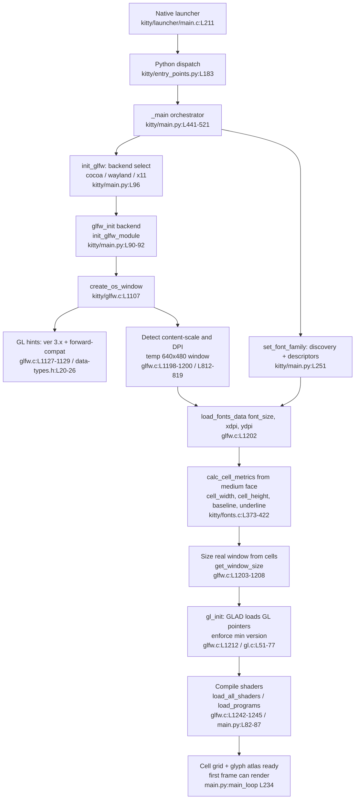

# kitty Terminal Emulator — Startup Initialization (Pre-First-Frame) — Code-Grounded Analysis

> **Subject under analysis:** the [kitty](https://github.com/kovidgoyal/kitty) terminal emulator.
> **Branch:** `kitty_815df1e210e0`  **HEAD commit:** `815df1e210e0a9ab4622f5c7f2d6891d7dbeddf1` (`kitty 0.35.2`).
> **Question answered:** *How does kitty initialize itself at startup — specifically the interplay between window-system bring-up, GPU/OpenGL context creation, and font / text-cell-metric computation that happens **before** any terminal content is rendered?*

This document is a **code-comprehension / question-answering** artifact. It does not change any code. Every factual claim is anchored to a source location using inline citations of the form `[file:Lnnn]` (a file path plus a line, line-range, function, or constant), because **the code is the source of truth** for this analysis.

---

## Analytical focus window (the "pre-first-frame" boundary)

The analysis covers the path **from process entry up to *just before* the first rendered frame**.

The precise boundary is the call to the event loop. In the per-window app runner, the first frame is produced during / after `boss.child_monitor.main_loop()` `[kitty/main.py:_run_app() L234]`; everything executed *before* that call is what this document means by "pre-first-frame":

- All window-system, GPU-context, DPI-detection, font-loading, cell-metric, and shader-compilation work has completed by the time control reaches `[kitty/main.py:L234]`.
- The `boss.destroy()` teardown in the `finally` block `[kitty/main.py:L236]` and the process-wide `glfw_terminate()` `[kitty/main.py:L520]` mark the symmetric shutdown side, which is referenced only where the startup ordering constrains it (font data must be freed first — see R8).

## Methodology

Two complementary tracks were used, with the **static source reading taking precedence**:

1. **Static source tracing (authoritative).** Each subsystem was read directly at commit `815df1e210e0…` and every claim carries a citation. Where line numbers were ambiguous they were re-verified with `sed`/`grep` before citing.
2. **Sanctioned build-and-run (illustrative).** kitty was compiled and launched from this exact source tree inside the provided toolchain to capture *runtime-observed* values (the GL version/renderer string, and the computed cell geometry). Runtime numbers were observed **headless under Xvfb with Mesa's software rasterizer**, so they are **environment-dependent** and are always presented next to the source location that computes them — never as intrinsic properties of kitty. No tracked source file was modified to gather them (`git status` remained clean).

> **On runtime numbers:** a value such as a GL renderer string or a DPI is a property of the *host's GPU/driver/display*, not of kitty. The code that *computes / requests* such a value is the invariant; the observed number merely illustrates one environment.

## Central causal chain (the thesis this document proves)

> **cell metrics ← font metrics ← DPI/content-scale ← monitor/window geometry ← windowing backend ← GLFW initialization** — all completed before the first frame.

Read right-to-left this is the *initialization order*; read left-to-right it is the *dependency order*. The decisive observation is that **cell geometry is computed, not constant**: it is derived from the chosen monospace face at the detected DPI, which in turn requires a monitor/window, which requires an initialized windowing backend. R7 walks each arrow with citations.

## Why kitty is structured this way (three-language design)

kitty is a **three-language** project, and the split matters for understanding startup:

- **C (C11)** carries the performance-critical hot paths: the GLFW bridge `[kitty/glfw.c]`, the OpenGL loader `[kitty/gl.c]`, the font / cell-metric engine `[kitty/fonts.c]`, the VT parser, and the screen model.
- **Python (≥ 3.8)** carries startup *orchestration*, configuration parsing, and extensibility `[pyproject.toml:L2 requires-python = ">=3.8"]`. The startup sequence is driven from `kitty/main.py`.
- **Go (1.22)** carries the static CLI tooling under `tools/` `[go.mod:L3 go 1.22]`; it is not on the pre-first-frame render path.

The consequence, visible throughout this document, is that **orchestration decisions live in Python** (`kitty/main.py:_main()`), while the **window/GL/font/cell work is delegated to C** (`kitty/glfw.c`, `kitty/gl.c`, `kitty/fonts.c`). The Python `main()` `[kitty/main.py:L524]` is only a thin error-handling wrapper around `_main()` `[kitty/main.py:L441-521]`.

---

## Table of contents

1. [R1 — Build & launch from source](#r1--build--launch-from-source)
2. [R2 — Early-startup trace: launcher → entry points → orchestrator](#r2--early-startup-trace-launcher--entry-points--orchestrator)
3. [R3 — Rendering backend actually selected (GLFW platform + OpenGL contract + GLAD)](#r3--rendering-backend-actually-selected-glfw-platform--opengl-contract--glad)
4. [R4 — Font system setup (discovery → rasterization → shaping → glyph cache)](#r4--font-system-setup-discovery--rasterization--shaping--glyph-cache)
5. [R5 — Display configuration detected (content-scale, DPI, fractional scaling)](#r5--display-configuration-detected-content-scale-dpi-fractional-scaling)
6. [R6 — Text-rendering capabilities / cell metrics](#r6--text-rendering-capabilities--cell-metrics)
7. [R7 — The dependency chain before the first frame](#r7--the-dependency-chain-before-the-first-frame)
8. [R8 — Subsystem initialization order & key computed values](#r8--subsystem-initialization-order--key-computed-values)
9. [Cross-cutting rationale, edge cases & dependency diagram](#cross-cutting-rationale-edge-cases--dependency-diagram)
10. [Methodology & limitations](#methodology--limitations)

---

## R1 — Build & launch from source

### What the build does

The canonical build is a single command, `python3 setup.py`, wired through the top-level `Makefile`:

- **Default build:** `all:` → `python3 setup.py $(VVAL)` `[Makefile:L12-13]`.
- **Debug build:** `debug:` → `python3 setup.py build $(VVAL) --debug` `[Makefile:L22-23]`.
- **Tests:** `test:` → `python3 setup.py $(VVAL) test` `[Makefile:L15-16]`.

> **Build note for this host:** the canonical build was run as `python3 setup.py build --ignore-compiler-warnings`. The default build uses `-Werror`; on this toolchain (gcc 15 + recent `wayland-protocols`) a `-Wswitch` warning in vendored `glfw/wl_window.c` is promoted to an error, so the project-provided `--ignore-compiler-warnings` flag is required. This is a build *option*, not a source edit.

The build emits the native launcher at **`kitty/launcher/kitty`**. `build_launcher()` `[setup.py:build_launcher() L1230]` compiles the two launcher translation units — iterating over `('kitty/launcher/main.c', 'kitty/launcher/single-instance.c')` `[setup.py:L1289]` — and links them into `dest = os.path.join(launcher_dir, 'kitty')` `[setup.py:L1295]`. The application name itself is the constant `appname: str = 'kitty'` `[kitty/constants.py:L23]`.

### Toolchain & native-library prerequisites resolved during the build

The build resolves native dependencies through `pkg-config`:

- The pkg-config executable is `PKGCONFIG = os.environ.get('PKGCONFIG_EXE', 'pkg-config')` `[setup.py:L72]`, consumed by the `pkg_config(...)` helper `[setup.py:pkg_config() L220]`.
- **HarfBuzz ≥ 1.5** is enforced via `at_least_version('harfbuzz', 1, 5)` `[setup.py:L609]` (text shaping).
- **libpng** `[setup.py:L610]` (PNG decoding) and **lcms2** `[setup.py:L611]` (color management) are added to the C flags.
- Language floors: **Python ≥ 3.8** `[pyproject.toml:L2]` and **Go 1.22** `[go.mod:L3]`.

### How the launcher actually starts Python (source build)

The compiled `kitty` binary **embeds CPython**. In a *source* build the `FROM_SOURCE` variant is compiled `[kitty/launcher/main.c:L179]`, and `run_embedded()` `[kitty/launcher/main.c:run_embedded() L177-220]` initializes the interpreter explicitly rather than going through the normal `python` startup:

1. `Py_PreInitialize(&preconfig)` with UTF-8 mode `[kitty/launcher/main.c:L190]`.
2. `config.parse_argv = 0` `[kitty/launcher/main.c:L194]` (the launcher controls argv itself).
3. `config.optimization_level = 2` `[kitty/launcher/main.c:L195]`.
4. `config.run_filename` is set to the lib/source directory `[kitty/launcher/main.c:L200]`.
5. `Py_InitializeFromConfig(&config)` `[kitty/launcher/main.c:L211]` brings the interpreter up, after which kitty's Python entry runs.

The process entry point is `int main(int argc, char *argv[], char* envp[])` `[kitty/launcher/main.c:L439]`. Before it ever starts Python, it short-circuits a few **fast, C-only command paths**:

- `delegate_to_kitten_if_possible(...)` `[kitty/launcher/main.c:delegate_to_kitten_if_possible() L354]` (invoked at `[kitty/launcher/main.c:L452]`).
- `handle_fast_commandline(...)` `[kitty/launcher/main.c:handle_fast_commandline() L369]` (invoked at `[kitty/launcher/main.c:L453]`) — handles things like `+open` and `--version` without paying the interpreter-startup cost.
- `single_instance_main(...)` `[kitty/launcher/main.c:L436]`, declared in `[kitty/launcher/launcher.h:L20]`, using the `CLIOptions` contract `[kitty/launcher/launcher.h:L12-16]` (single-instance IPC over a UNIX socket).

### Rationale — *why* a compiled launcher **and** a Python entry?

The launcher exists so kitty ships as a **relocatable native executable that embeds its own interpreter and bundles its C extensions**, while still running the *same* Python orchestrator that `python -m kitty` would run. The C-only fast paths (`--version`, `+open`, single-instance hand-off) let common invocations avoid interpreter startup entirely. Crucially for this analysis, **building from source is what lets us observe the *true* runtime backend / DPI / cell-metric values** rather than guessing them — the launcher links the real GL, FreeType, FontConfig and HarfBuzz libraries present on the host.

### Runtime observation

Building this tree and running the launcher reports `kitty 0.35.2 created by Kovid Goyal` (`./kitty/launcher/kitty --version`), and produces the launcher at `kitty/launcher/kitty` exactly as `[setup.py:L1295]` specifies. (Version string emitted by the `--version` fast path `[kitty/launcher/main.c:handle_fast_commandline() L369]`.)

---

## R2 — Early-startup trace: launcher → entry points → orchestrator

### The pure-Python entry (also used by `python -m kitty`)

`__main__.py` is the module entry: under the `if __name__ == '__main__':` guard `[__main__.py:L5]` it does `from kitty.entry_points import main` `[__main__.py:L6]` and calls `main()` `[__main__.py:L7]`.

`kitty/entry_points.py:main()` `[kitty/entry_points.py:main() L183]` performs the dispatch:

- It reads `first_arg = '' if len(sys.argv) < 2 else sys.argv[1]` `[kitty/entry_points.py:L188]` and looks it up: `func = entry_points.get(first_arg)` `[kitty/entry_points.py:L189]`.
- For the **normal GUI launch** (no recognized namespaced argument and not `+`-prefixed), `func` is `None` and it falls through to `from kitty.main import main as kitty_main` / `kitty_main()` `[kitty/entry_points.py:L194-195]`.
- A `+`-prefixed argument is routed to `namespaced(...)` `[kitty/entry_points.py:L192]`; the dispatch table itself is `entry_points = {…}` `[kitty/entry_points.py:L151]` with the namespaced subset built at `[kitty/entry_points.py:L158]` (`+kitten`, `+open`, `+runpy`, `launch`, `open`, …).

### `kitty.main`: a thin wrapper around `_main()`

The public `main()` `[kitty/main.py:main() L524]` is only a `try/except` wrapper that logs the traceback and raises `SystemExit(1)` on failure; **the real orchestration is `_main()`** `[kitty/main.py:_main() L441-521]`.

The **ordered orchestration inside `_main()`** (this is the backbone of R8):

| # | Step | Citation |
|---|------|----------|
| 1 | `parse_args(...)` → `CLIOptions` | `[kitty/main.py:L464]` |
| 2 | optional `detach()` | `[kitty/main.py:L470-474]` |
| 3 | single-instance setup | `[kitty/main.py:L480-492]` |
| 4 | `opts = create_opts(...)` — parse `kitty.conf` | `[kitty/main.py:L494]` |
| 5 | `setup_environment(...)` | `[kitty/main.py:L495]` |
| 6 | `set_locale()` | `[kitty/main.py:L500]` |
| 7 | `mask_kitty_signals_process_wide()` | `[kitty/main.py:L513]` |
| 8 | **`init_glfw(opts, …)`** — GLFW init + backend select | `[kitty/main.py:L514]` |
| 9 | **`run_app(opts, cli_opts, bad_lines, talk_fd)`** = `AppRunner.__call__` | `[kitty/main.py:L518]` |
| 10 | `finally:` `glfw_terminate()` + `cleanup_ssh_control_masters()` | `[kitty/main.py:L520-521]` |

### `AppRunner` — where fonts get registered, then the app runs

`run_app` is an instance of `AppRunner` `[kitty/main.py:AppRunner L239]`. Its `__call__` `[kitty/main.py:__call__ L247]` does, in order:

1. `set_scale(opts.box_drawing_scale)` `[kitty/main.py:L248]` (box-drawing scale).
2. `set_options(opts, is_wayland(), …)` `[kitty/main.py:L249]`.
3. **`set_font_family(opts)`** `[kitty/main.py:L251]` — font discovery + descriptor registration (R4).
4. `_run_app(...)` `[kitty/main.py:L252]`.
5. `finally:` `set_options(None)` `[kitty/main.py:L254]` then **`free_font_data()`** `[kitty/main.py:L255]`. The inline comment makes the ordering constraint explicit: *"must free font data before glfw/freetype/fontconfig/opengl etc are finalized"* `[kitty/main.py:L255]`.

### `_run_app()` — window, GL context, shaders, Boss, then the loop

`_run_app()` `[kitty/main.py:_run_app() L202-236]`:

1. `create_os_window(... load_all_shaders ...)` `[kitty/main.py:L221-225]` — creates the OS window, the GL context, and passes `load_all_shaders` `[kitty/main.py:load_all_shaders() L82-87]` as the shader-compilation callback (R3/R7).
2. `boss = Boss(...)` `[kitty/main.py:L226]` — the global controller, created **after** GLFW and fonts are up.
3. `boss.start(window_id, startup_sessions)` `[kitty/main.py:L227]`.
4. **`boss.child_monitor.main_loop()`** `[kitty/main.py:L234]` — the event loop; the **first frame is rendered here / after**.
5. `finally:` `boss.destroy()` `[kitty/main.py:L236]`.

**Pre-first-frame boundary:** everything described above, up to *just before* `[kitty/main.py:L234]`.

### Rationale — *why* this order

- **GLFW is initialized (step 8) before any window/font/cell work (step 9).** The windowing system must be up before a GL context can be created or a monitor/DPI can be queried — there is no monitor list and no content-scale to read until the platform backend is initialized. R7 shows the data actually flowing along this dependency.
- **Signals are masked (step 7) before the backend starts.** The inline comment is explicit: *"mask the signals now as on some platforms the display backend starts threads. These threads must not handle the masked signals, to ensure kitty can handle them."* `[kitty/main.py:L510-512]`. Masking *before* `init_glfw()` `[kitty/main.py:L514]` guarantees any threads GLFW spawns inherit the mask.
- **Fonts are freed first at shutdown** `[kitty/main.py:L255]` because the font objects hold FreeType/FontConfig/OpenGL resources that become invalid once `glfw_terminate()` `[kitty/main.py:L520]` finalizes those libraries — the mirror image of the startup ordering.

---


## R3 — Rendering backend actually selected (GLFW platform + OpenGL contract + GLAD)

This section answers *which* rendering backend kitty actually selects at runtime, *what* OpenGL contract it requests, and *how* GL entry points are bound. It contains the analysis's most important correctness nuances, so each is stated precisely.

### 1. Platform/windowing backend — a **runtime** decision

`init_glfw()` chooses the GLFW platform module from the OS and environment:

```python
glfw_module = 'cocoa' if is_macos else ('wayland' if is_wayland(opts) else 'x11')   # kitty/main.py:L96
```

`[kitty/main.py:init_glfw() L95]` computes `glfw_module` `[kitty/main.py:L96]`, then calls `init_glfw_module(...)` `[kitty/main.py:L97]`. `init_glfw_module()` `[kitty/main.py:init_glfw_module() L90-92]` raises `SystemExit('GLFW initialization failed')` `[kitty/main.py:L92]` if `glfw_init(...)` returns false.

So the selected backend is decided **at runtime**: **macOS → Cocoa; Linux/BSD → Wayland when a Wayland session is detected (`is_wayland(opts)`), otherwise X11.** There is no Windows backend in this codebase.

### 2. OpenGL version contract — **per-platform** (not a uniform "3.3 core")

The requested version is defined with a platform `#if` guard `[kitty/data-types.h:L19-26]`:

```c
#define OPENGL_REQUIRED_VERSION_MAJOR 3        // L20  (always 3)
#ifdef __APPLE__                               // L21
#define OPENGL_REQUIRED_VERSION_MINOR 3        // L22  → GL 3.3 on macOS
#else                                          // L23
#define OPENGL_REQUIRED_VERSION_MINOR 1        // L24  → GL 3.1 on Linux/BSD
#endif                                         // L25
#define GLSL_VERSION 140                       // L26  (shaders use #version 140)
```

> **State it exactly:** kitty requests **OpenGL major version 3 on all platforms**, with **minor version 3 on macOS** and **minor version 1 on Linux/BSD** — i.e. **GL 3.3 on macOS and GL 3.1 on Linux/BSD** `[kitty/data-types.h:L20-24]`. The shading language is `#version 140` `[kitty/data-types.h:L26]`. (It is **not** "OpenGL 3.3 core on all platforms".)

### 3. Context-creation hints

In `create_os_window()` `[kitty/glfw.c:create_os_window() L1107]`, the GL hints are set once, guarded by `if (is_first_window)` `[kitty/glfw.c:L1126]`:

```c
glfwWindowHint(GLFW_CONTEXT_VERSION_MAJOR, OPENGL_REQUIRED_VERSION_MAJOR);  // L1127
glfwWindowHint(GLFW_CONTEXT_VERSION_MINOR, OPENGL_REQUIRED_VERSION_MINOR);  // L1128
glfwWindowHint(GLFW_OPENGL_FORWARD_COMPAT, true);                          // L1129
glfwWindowHint(GLFW_DEPTH_BITS, 0);                                        // L1131
glfwWindowHint(GLFW_STENCIL_BITS, 0);                                      // L1132
```

It also requests an sRGB-capable default framebuffer **except on Wayland**: `if (!global_state.is_wayland) glfwWindowHint(GLFW_SRGB_CAPABLE, true);` `[kitty/glfw.c:L1144]` (the comment there records that the Wayland exception works around NVIDIA/Mesa sRGB-surface bugs).

> **Accuracy nuance (verified):** kitty sets `GLFW_OPENGL_FORWARD_COMPAT` `[kitty/glfw.c:L1129]` but does **not** set an explicit `GLFW_OPENGL_PROFILE` / core-profile hint **at window creation**. The constant `GLFW_OPENGL_CORE_PROFILE` appears only in the Python-constant *export* block `[kitty/glfw.c:L2505]` (alongside `GLFW_OPENGL_PROFILE` `[kitty/glfw.c:L2492]`), not as a creation hint. The context is therefore **forward-compatible**; on macOS a forward-compatible GL ≥ 3.2 context is core-profile *by platform rule*, and the GL function loader is generated for the **core** profile (next item). We do not over-claim an explicit core hint.

### 4. Binding GL entry points — the GLAD loader

The loader is generated by `glad/generate.py` for the **core 3.1** API plus a fixed extension set:

```text
glad --out-path {dest} --api gl:core=3.1                                                   # glad/generate.py:L12
  --extensions GL_ARB_texture_storage,GL_ARB_copy_image,GL_ARB_multisample,
               GL_ARB_robustness,GL_ARB_instanced_arrays,GL_KHR_debug                       # glad/generate.py:L13
c --header-only --debug                                                                     # glad/generate.py:L14
```

At runtime the entry points are bound in `gl_init()` `[kitty/gl.c:gl_init() L51-77]`:

- `global_state.gl_version = gladLoadGL(glfwGetProcAddress)` `[kitty/gl.c:L55]` — GLAD resolves GL function pointers **through GLFW's loader** (so it works for GLX, EGL, or NSGL transparently).
- On failure → `fatal("Loading the OpenGL library failed")` `[kitty/gl.c:L57]`.
- It **requires** `GLAD_GL_ARB_texture_storage` `[kitty/gl.c:L67]` (the `ARB_TEST` macro `fatal`s if the extension is missing `[kitty/gl.c:L64-65]`).
- It **enforces the minimum version** `[kitty/gl.c:L73-74]`: if `gl_major < OPENGL_REQUIRED_VERSION_MAJOR || (gl_major == … && gl_minor < OPENGL_REQUIRED_VERSION_MINOR)` it calls `fatal("OpenGL version is %d.%d, version >= %d.%d required for kitty", …)`.

`gl_init()` is called during startup right after the real window is made current: `glfwMakeContextCurrent(glfw_window)` `[kitty/glfw.c:L1211]`, then `if (is_first_window) gl_init()` `[kitty/glfw.c:L1212]`, then `glEnable(GL_FRAMEBUFFER_SRGB)` `[kitty/glfw.c:L1214]`.

### 5. Per-platform GL context creators (vendored GLFW 3.4 fork)

The window/context machinery is a **vendored GLFW 3.4 fork** under `glfw/` (`GLFW_VERSION_MAJOR 3` / `GLFW_VERSION_MINOR 4` `[glfw/glfw3.h:L286-293]`). The actual GL context is created by a platform-specific module:

| Module | Role |
|--------|------|
| `glfw/glx_context.c` | GLX context creation on X11 |
| `glfw/egl_context.c` | EGL context creation (used by Wayland) |
| `glfw/nsgl_context.m` | NSGL context creation on macOS |
| `glfw/osmesa_context.c` | Off-screen / software (OSMesa) context |

Platform init backends correspondingly: `glfw/x11_init.c`, `glfw/wl_init.c`, `glfw/cocoa_init.m`, and the headless `glfw/null_init.c`.

### 6. Runtime observation

The actual GL version/renderer string is formatted by `gl_version_string()` `[kitty/gl.c:gl_version_string() L41-49]` from `glGetString(GL_VERSION)` `[kitty/gl.c:L46]` plus the GLAD-detected major/minor, and printed when `--debug-rendering` is set `[kitty/gl.c:L72]`.

Running this build **headless under Xvfb** with `--debug-rendering` produced:

```text
[0.128] GL version string: '4.5 (Core Profile) Mesa 25.2.8-0ubuntu0.25.10.2' Detected version: 4.5
```

Interpretation, tied to the code:

- This is **Mesa's software rasterizer (llvmpipe) under Xvfb** — the renderer string is a property of the *host/driver/display*, **not** of kitty, and would read differently on real GPU hardware. Source of the string: `[kitty/gl.c:L46-47]`.
- The `(Core Profile)` substring confirms that the forward-compatible request `[kitty/glfw.c:L1129]` yields a **core profile** here.
- kitty requested GL major 3 / minor 1 on Linux `[kitty/data-types.h:L20-24]`; the driver provided **4.5**, which satisfies the minimum-version check `[kitty/gl.c:L73-74]` (4 ≥ 3).

### Rationale — *why* these choices

- **GPU-only, abort instead of CPU fallback.** kitty's renderer composites each cell as a textured quad sampled from a glyph atlas, driven by GLSL shaders; there is **no software/CPU glyph-compositing path**. Hence missing/too-old GL is a `fatal` `[kitty/gl.c:L57, L73-74]` (and a failed temp window is a `fatal` "requires working OpenGL … drivers" — see R7 `[kitty/glfw.c:L1199]`). Mandating a modern minimum (3.1/3.3) guarantees the features the shaders and the texture-storage atlas need.
- **Forward-compatible context.** Requesting forward-compat `[kitty/glfw.c:L1129]` drops deprecated fixed-function GL, matching a loader generated for the **core** profile `[glad/generate.py:L12]` — kitty only ever uses modern, programmable-pipeline GL.
- **No depth/stencil buffers** `[kitty/glfw.c:L1131-1132]` because the terminal is a flat 2D grid of cells; depth testing and stenciling would only waste memory/bandwidth.

---


## R4 — Font system setup (discovery → rasterization → shaping → glyph cache)

### Entry from the orchestrator

The font system is entered from `AppRunner.__call__` via `set_font_family(opts)` `[kitty/main.py:L251]`, which calls into the Python font manager `kitty/fonts/render.py:set_font_family()` `[kitty/fonts/render.py:set_font_family() L173]`.

### Stage 1 — Discovery (platform-specific)

`set_font_family()` resolves the configured families to concrete font files via `font_map = get_font_files(opts)` `[kitty/fonts/render.py:L177]` (defined in `kitty/fonts/common.py`). The discovery backend is selected **at import time** by platform `[kitty/fonts/render.py:L34-37]`: on macOS `from .core_text import font_for_family` `[kitty/fonts/render.py:L35]`, otherwise `from .fontconfig import font_for_family` `[kitty/fonts/render.py:L37]`.

- **Linux/BSD — FontConfig.** `kitty/fontconfig.c` loads FontConfig symbols dynamically (`#define FcPatternCreate …` `[kitty/fontconfig.c:L41]`, bound via `dlsym` `[kitty/fontconfig.c:L70]`), builds a pattern with `FcPatternCreate()` `[kitty/fontconfig.c:L244]`, and matches with `FcFontMatch(...)` `[kitty/fontconfig.c:L276]` (and again at `[kitty/fontconfig.c:L312]`).
- **macOS — CoreText.** `kitty/core_text.m` uses CoreText APIs; its cell-metric implementation is `cell_metrics()` `[kitty/core_text.m:cell_metrics() L523]`.

### Stage 2 — Hand-off to C (descriptors only, *before* the window exists)

`set_font_family()` pushes the resolved faces into the C extension via `set_font_data(...)` `[kitty/fonts/render.py:L189]`; the C side stores them in `set_font_data()` `[kitty/fonts.c:set_font_data() L1434]` (face descriptors, bold/italic/bold-italic indices, symbol maps, size).

> **Ordering nuance:** `set_font_family` / `set_font_data` run **before any window exists** (step 5 in `AppRunner`, *before* `_run_app()` creates the window). They therefore only **register descriptors**; actual face instantiation and metric computation are deferred until a DPI is known (R6/R7).

### Stage 3 — Font-group creation (lazy, DPI-keyed)

`font_group_for(font_sz_in_pts, logical_dpi_x, logical_dpi_y)` `[kitty/fonts.c:font_group_for() L204]` returns an existing group matching `(font_sz, dpi_x, dpi_y)` or **creates one** and calls `initialize_font_group(fg)` `[kitty/fonts.c:initialize_font_group() L1495]`, which:

1. instantiates the **medium** face `[kitty/fonts.c:L1501]`,
2. then **bold / italic / bold-italic** `[kitty/fonts.c:L1502]`,
3. then the **symbol** fonts `[kitty/fonts.c:L1506-1509]`,
4. and finally calls `calc_cell_metrics(fg)` `[kitty/fonts.c:L1511]` (R6).

Keying the group on `(size, dpi_x, dpi_y)` is why the same configured font can produce different cell sizes on different monitors — the DPI is part of the cache key.

### Stage 4 — Rasterization

- **FreeType (Linux/BSD)** in `kitty/freetype.c`: faces are opened with `FT_New_Face(...)` `[kitty/freetype.c:L282]`, sized with `set_size_for_face(...)` `[kitty/freetype.c:set_size_for_face() L190]`, glyphs loaded with `FT_Load_Glyph(...)` `[kitty/freetype.c:L116]`, rasterized in `render_bitmap(...)` `[kitty/freetype.c:render_bitmap() L507]`, and laid into cells by `render_glyphs_in_cells(...)` `[kitty/freetype.c:render_glyphs_in_cells() L675]`.
- **CoreText (macOS)** rasterizes via `kitty/core_text.m`.

### Stage 5 — Shaping (HarfBuzz)

Shaping uses a process-wide HarfBuzz buffer `harfbuzz_buffer` `[kitty/fonts.c:L41]` (created at `[kitty/fonts.c:L1747]`). Text is loaded with `hb_buffer_add_utf32(...)` `[kitty/fonts.c:L685]`, properties guessed via `hb_buffer_guess_segment_properties(...)` `[kitty/fonts.c:L687]`, shaped with `hb_shape(font, harfbuzz_buffer, fobj->ffs_hb_features, num_features)` `[kitty/fonts.c:L813]`, and the result read back via `hb_buffer_get_glyph_infos(...)` `[kitty/fonts.c:L816]`. HarfBuzz ≥ 1.5 is a build dependency `[setup.py:L609]`.

### Stage 6 — Glyph cache / GPU texture atlas

Shaped, rasterized glyphs are cached as sprites in a hash table: `find_or_create_sprite_position(...)` `[kitty/glyph-cache.c:find_or_create_sprite_position() L34]` (entry type `SpritePosition` via `SpritePositionHead` `[kitty/glyph-cache.c:L13]`) and `find_or_create_glyph_properties(...)` `[kitty/glyph-cache.c:L73]`. The GPU sprite map (texture atlas) is allocated **per cell size**: `send_prerendered_sprites_for_window()` `[kitty/fonts.c:send_prerendered_sprites_for_window() L1521]` calls `alloc_sprite_map(fg->cell_width, fg->cell_height)` `[kitty/fonts.c:L1524]`. sRGB-correct compositing of glyph coverage uses the gamma tables in `kitty/srgb_gamma.h`.

### Rationale — *why* this pipeline

- **discovery → rasterize → shape → cache** exists because a GPU-rendered terminal turns every cell into a **textured quad** sampled from a glyph atlas. Glyphs must be discovered (which file?), rasterized (to pixels), shaped (which glyph + position for the text run), and then **cached as sprites** so the hot render path is a texture lookup, not a re-rasterization. Caching in a GPU texture atlas is what makes per-frame rendering cheap.
- **Discovery is platform-specific** (FontConfig on Linux/BSD vs CoreText on macOS) because font enumeration/matching is an OS service; kitty defers to the native one `[kitty/fonts/render.py:L34-37]`.
- **Metrics cannot be computed at `set_font_family` time** because cell geometry depends on DPI, and **no DPI exists until a window/monitor exists**. That is precisely why `initialize_font_group` (and the `calc_cell_metrics` inside it) is deferred to `load_fonts_data(font_sz, dpi_x, dpi_y)` during window creation (R7).

---

## R5 — Display configuration detected (content-scale, DPI, fractional scaling)

### content-scale → DPI conversion

kitty does not read a DPI directly; it reads a **monitor/window content-scale** and multiplies by a platform factor. `dpi_from_scale()` `[kitty/glfw.c:dpi_from_scale() L812]`:

```c
#ifdef __APPLE__
    const double factor = 72.0;   // L814  (macOS)
#else
    const double factor = 96.0;   // L816  (Linux/BSD)
#endif
    *xdpi = xscale * factor;       // L818
    *ydpi = yscale * factor;       // L819
```

So **on macOS the factor is 72.0** and **on Linux/BSD it is 96.0** `[kitty/glfw.c:L814-816]`.

### scale acquisition + sanitation

`get_window_content_scale(w, *xscale, *yscale, *xdpi, *ydpi)` `[kitty/glfw.c:get_window_content_scale() L823]`:

1. defaults scale to 1 `[kitty/glfw.c:L825]`,
2. queries `glfwGetWindowContentScale(w, …)` for a real window `[kitty/glfw.c:L826]`, or `glfwGetMonitorContentScale(primary_monitor, …)` when there is no window yet `[kitty/glfw.c:L828-829]`,
3. **sanitizes** the result — any scale that is `≤ 0.0001`, `NaN` (`*xscale != *xscale`), or `≥ 24` is reset to `1.0` `[kitty/glfw.c:L832-833]`,
4. then calls `dpi_from_scale(...)` `[kitty/glfw.c:L834]`.

`get_window_dpi(...)` `[kitty/glfw.c:get_window_dpi() L838]` and `get_os_window_content_scale(...)` `[kitty/glfw.c:get_os_window_content_scale() L844]` are thin wrappers.

### Fractional scaling (Wayland)

On Wayland the compositor only delivers the scale **after** the surface is shown, so kitty cannot use a temporary window there. Instead it reads the **primary-monitor / focused-window** scale up-front `[kitty/glfw.c:L1187-1196]`, then re-reads after the window is shown and **reloads fonts if the DPI changed** `[kitty/glfw.c:L1232-1239]`. (Wayland fractional scaling is delivered via the `fractional-scale-v1` protocol; the code here is authoritative for kitty's handling of it.)

### points → pixels conversion

The font pixel size is the standard typographic conversion **points × DPI ÷ 72**. It appears as `… fonts_data->font_sz_in_pts * ydpi / 72.` in `draw_text_callback` `[kitty/glfw.c:L671]`. This is the link that makes pixel sizing — and therefore cell geometry — a **function of detected DPI** rather than a constant.

### Runtime observation

The detected scale/DPI is computed at the temp-window scale query `[kitty/glfw.c:L1200]` and converted at `[kitty/glfw.c:L818-819]`. Running **headless under Xvfb** there is no HiDPI: `glfwGetMonitorContentScale` reports `1.0`, so after sanitation `[kitty/glfw.c:L825,L832-833]` the content-scale is `1.0`, giving `logical_dpi_x = logical_dpi_y = 1.0 × 96.0 = 96.0` on Linux `[kitty/glfw.c:L816,L819]`. This `96` DPI is **environment-dependent** (it would be larger on a HiDPI display reporting scale 2.0 → 192 DPI) and is consistent with the observed cell size in R6.

### Rationale — *why* DPI is resolved before cell metrics, and *why* it is sanitized

- **DPI must precede cell metrics** because cell geometry is font metrics **scaled by DPI** (R6); an incorrect DPI yields wrong cell sizes and a blurry or oversized grid. The whole startup ordering (R7) exists to ensure a valid DPI is known before `calc_cell_metrics` runs.
- **The sanitation guard** (`≤ 0.0001`, `NaN`, `≥ 24` → `1.0`) `[kitty/glfw.c:L832-833]` is a defense against broken compositors/drivers reporting absurd or non-finite content-scales; clamping to a safe `1.0` keeps the terminal usable rather than producing a degenerate or gigantic grid.

---

## R6 — Text-rendering capabilities / cell metrics

### What is computed, and from where

`calc_cell_metrics(FontGroup *fg)` `[kitty/fonts.c:calc_cell_metrics() L373-422]` derives all cell geometry from the **medium font face**:

- It calls `cell_metrics(fg->fonts[fg->medium_font_idx].face, &cell_width, &cell_height, &baseline, &underline_position, &underline_thickness, &strikethrough_position, &strikethrough_thickness)` `[kitty/fonts.c:L375]` — i.e. **all geometry comes from the medium face**. (The `cell_metrics()` API is declared at `[kitty/fonts.h:L27]` and implemented per backend at `[kitty/freetype.c:cell_metrics() L387]` and `[kitty/core_text.m:cell_metrics() L523]`.)
- **Zero cell width is fatal:** `if (!cell_width) fatal("Failed to calculate cell width for the specified font")` `[kitty/fonts.c:L376]`.
- It applies user overrides scaled by **logical DPI**: `adjust_metric(&cw, OPT(cell_width)…, fg->logical_dpi_x)` `[kitty/fonts.c:L379]` and `adjust_metric(&ch, OPT(cell_height)…, fg->logical_dpi_y)` `[kitty/fonts.c:L380]`.
- It **clamps with fatal bounds** `[kitty/fonts.c:L381-392]`: `#define MAX_DIM 1000` `[kitty/fonts.c:L381]`, `#define MIN_WIDTH 2` `[kitty/fonts.c:L382]`, `#define MIN_HEIGHT 4` `[kitty/fonts.c:L383]`; out-of-range height/width → `fatal(...)` `[kitty/fonts.c:L389-392]`.
- It adjusts `baseline`, `underline_position/thickness`, and `strikethrough_position/thickness` by DPI `[kitty/fonts.c:L397-399]`, with underline-position sanity clamping `[kitty/fonts.c:L409-417]`.
- It **stores** the results: `sprite_tracker_set_layout(&fg->sprite_tracker, cell_width, cell_height)` `[kitty/fonts.c:L418]`; `fg->cell_width = cell_width; fg->cell_height = cell_height;` `[kitty/fonts.c:L419]`; the per-group `fg->baseline / underline_position / underline_thickness / strikethrough_position / strikethrough_thickness` `[kitty/fonts.c:L420]`; and `ensure_canvas_can_fit(fg, 8)` `[kitty/fonts.c:L421]`.

### The data model (cited precisely)

The values live in two places:

- **`FONTS_DATA_HEAD`** is a macro defined in `[kitty/data-types.h:L347]`:
  `SPRITE_MAP_HANDLE sprite_map; double logical_dpi_x, logical_dpi_y, font_sz_in_pts; unsigned int cell_width, cell_height;`
  with the handle typedef `typedef struct {FONTS_DATA_HEAD} *FONTS_DATA_HANDLE;` `[kitty/data-types.h:L348]`. So it carries `cell_width`, `cell_height`, `logical_dpi_x/y`, `font_sz_in_pts`, and `sprite_map`.
- The **`FontGroup`** struct embeds it `[kitty/fonts.c:L80-90]`: `FONTS_DATA_HEAD` is used at `[kitty/fonts.c:L81]`, and the additional **per-group metric fields** `baseline, underline_position, underline_thickness, strikethrough_position, strikethrough_thickness` are declared at `[kitty/fonts.c:L83]`.

> Note: these metric fields are **not** in `kitty/fonts.h` (that header is only 64 lines and declares the `cell_metrics()` API at `[kitty/fonts.h:L27]`); the fields are in `kitty/fonts.c` `[kitty/fonts.c:L83]` and `kitty/data-types.h` `[kitty/data-types.h:L347]`.

### Canvas sized from the cell

The per-cell pixel canvas is sized from the cell: the allocation multiplies `… * 3u * … * fg->cell_width * fg->cell_height` `[kitty/fonts.c:L103]` (3 bytes/pixel RGB), so the working buffer is exactly a function of the computed cell dimensions.

### The values the terminal computes/exposes

cell **width**, cell **height**, **baseline**, **underline position**, **underline thickness**, **strikethrough position**, **strikethrough thickness** `[kitty/fonts.c:L419-420]`, plus `logical_dpi_x/y` and `font_sz_in_pts` `[kitty/data-types.h:L347]`.

### Runtime observation

The resolved `cell_width`/`cell_height` are handed to Python during window sizing: `PyObject_CallFunction(get_window_size, "IIddff", fonts_data->cell_width, fonts_data->cell_height, fonts_data->logical_dpi_x, fonts_data->logical_dpi_y, xscale, yscale)` `[kitty/glfw.c:L1203]`. Running this build **headless under Xvfb at `font_size=11` (≈ 96 DPI)**, kitty's own terminal capability reports yielded:

```text
CSI 16 t  (report cell size in px)  → ESC[6;18;9t     → cell_height = 18 px, cell_width = 9 px
CSI 14 t  (report text-area in px)  → ESC[4;396;639t  → text area 396 × 639 px
TIOCGWINSZ: rows=22 cols=71 xpixel=639 ypixel=396      → 71×9 = 639, 22×18 = 396 (consistent)
```

So the **observed cell geometry is `cell_width = 9 px`, `cell_height = 18 px`** at this font size and DPI — exactly the values computed at `[kitty/fonts.c:L419]` and passed out at `[kitty/glfw.c:L1203]`. These are **font + DPI dependent** (a different face, font size, or DPI yields different numbers); the invariant is the computation, not the specific pixels.

### Rationale — *why* cell geometry is derived (not constant), and *why* the guards exist

- **Derived, not constant.** The cell box must match the actual rendered glyph box of the chosen **monospace** face at the **detected DPI**, so the grid aligns pixel-perfectly with rasterized glyphs `[kitty/fonts.c:L375,L419]`. A hard-coded cell size would mis-align with most fonts and break at non-default DPIs.
- **Zero-width is fatal** `[kitty/fonts.c:L376]` because a degenerate face (no advance width) would make a character grid meaningless — kitty refuses to start rather than render garbage.
- **Min/Max clamps** `[kitty/fonts.c:L381-392]` guard against broken faces or absurd configured `cell_width`/`cell_height` overrides; a 0-row-tall or 10000-px cell is treated as a fatal misconfiguration rather than silently corrupting the grid.

---


## R7 — The dependency chain before the first frame

This is where the thesis is proven. Walking the actual startup path inside `create_os_window()` `[kitty/glfw.c:create_os_window() L1107]` shows the data flowing **windowing → DPI → fonts → cell metrics → (window pixel size, GL, shaders) → ready for first frame**:

1. **Window starts hidden.** `glfwWindowHint(GLFW_VISIBLE, false)` `[kitty/glfw.c:L1176]`; the shared context is resolved `[kitty/glfw.c:L1177]`; `temp_window = NULL` `[kitty/glfw.c:L1178]`.
2. **Detect content-scale / DPI.** On X11 / non-Wayland a **temporary 640×480 window** is created `[kitty/glfw.c:L1198]` and its content scale is queried `[kitty/glfw.c:L1200]`; a temp-window failure is `fatal("Failed to create GLFW temp window! … kitty requires working OpenGL %d.%d drivers.")` `[kitty/glfw.c:L1199]`. On Wayland the scale comes from the primary monitor / focused window instead `[kitty/glfw.c:L1187-1196]`.
3. **Bridge windowing → fonts (the decisive call).**
   `FONTS_DATA_HANDLE fonts_data = load_fonts_data(OPT(font_size), xdpi, ydpi)` `[kitty/glfw.c:L1202]` — **this is the primary startup call** that turns the **detected DPI + configured font size** into a font group with **computed cell metrics**.
   > **Citation correction:** an upstream plan referenced `load_fonts_data` at `[kitty/glfw.c:L1077]`, but that instance is inside the **layer-shell** helper `calculate_layer_shell_window_size()` (≈ `[kitty/glfw.c:L1063-1090]`), *not* the startup path. The **startup** bridge is `[kitty/glfw.c:L1202]`, with a re-load at `[kitty/glfw.c:L1239]` if the DPI changes after the window is shown (Wayland/macOS).
4. **Inside `load_fonts_data`.** `load_fonts_data(double font_sz_in_pts, double dpi_x, double dpi_y)` `[kitty/fonts.c:load_fonts_data() L1530]` → `font_group_for(...)` `[kitty/fonts.c:L1531]` → (on a new group) `initialize_font_group(...)` `[kitty/fonts.c:L1495]` → `calc_cell_metrics(...)` `[kitty/fonts.c:L1511]` → fills `cell_width / cell_height / baseline / underline_* / strikethrough_*` `[kitty/fonts.c:L419-420]`.
5. **Size the real window from the cells, then create GL.** The window pixel size is computed from the cell metrics via `get_window_size(...)` `[kitty/glfw.c:L1203]`; the **real window** is created `[kitty/glfw.c:L1208]`, the temp window destroyed `[kitty/glfw.c:L1209]`, the context made current `[kitty/glfw.c:L1211]`, **`gl_init()` (GLAD)** run `[kitty/glfw.c:L1212]`, and `glEnable(GL_FRAMEBUFFER_SRGB)` set `[kitty/glfw.c:L1214]`.
6. **Compile shaders (first window).** The `load_programs` callback — which is `load_all_shaders` `[kitty/main.py:load_all_shaders() L82-87]` — is invoked `[kitty/glfw.c:L1242-1245]`.

After this, the cell grid and the (about-to-be-filled) glyph atlas exist, the GL pipeline is live, and control can return up to `_run_app` to start the event loop `[kitty/main.py:L234]` that draws the first frame.

### The points→pixels coupling (why DPI propagates into cell metrics)

The font pixel size is `font_sz_in_pts * ydpi / 72` `[kitty/glfw.c:L671]`. Because `load_fonts_data` is called with the **detected** `xdpi/ydpi` `[kitty/glfw.c:L1202]`, the font's pixel size — and therefore every value `calc_cell_metrics` derives — is a **function of the detected DPI**, not a constant.

### The causal chain, each arrow tied to a citation

> **cell metrics ← font metrics ← DPI/content-scale ← monitor/window geometry ← windowing backend ← GLFW initialization**

| Arrow | Meaning | Citation |
|-------|---------|----------|
| **cell metrics** ← font metrics | cells derived from the medium face | `[kitty/fonts.c:calc_cell_metrics() L373-422]`, source face `[kitty/fonts.c:L375]` |
| font metrics ← **DPI/content-scale** | pixel size = pts × DPI ÷ 72; metrics DPI-adjusted | `[kitty/glfw.c:L671]`, `[kitty/fonts.c:L379-380,L397-399]` |
| DPI/content-scale ← **monitor/window geometry** | DPI = scale × factor, scale from a window/monitor (temp window) | `[kitty/glfw.c:dpi_from_scale() L812-819]`, `[kitty/glfw.c:L1198-1200]` |
| monitor/window geometry ← **windowing backend** | a window can only be created after backend select | `[kitty/main.py:L95-98]` |
| windowing backend ← **GLFW initialization** | backend module must be init'd first | `[kitty/main.py:L514]`, `[kitty/main.py:init_glfw_module() L90-92]` |

### Rationale — *why* this ordering is mandatory

You **cannot size cells without a DPI**; you **cannot get a DPI without a monitor/window**; you **cannot create a window without an initialized backend**. Each stage literally consumes the output of the previous one — the temp window exists *only* to learn the DPI before the real window is sized `[kitty/glfw.c:L1198-1202]`. And because kitty's renderer needs the cell grid and glyph atlas in place to draw anything, **all of this must complete before the first frame** `[kitty/main.py:L234]`.

---

## R8 — Subsystem initialization order & key computed values

### Ordered initialization sequence

Anchored on `_main()` `[kitty/main.py:_main() L441-521]` and `create_os_window()` `[kitty/glfw.c:create_os_window() L1107]`:

1. **Process entry / CPython embed** — `Py_InitializeFromConfig(&config)` `[kitty/launcher/main.c:L211]` for the native launcher (or `__main__.py:L5-7` for `python -m kitty`).
2. **Arg parse + config** — `parse_args(...)` `[kitty/main.py:L464]`, then `create_opts(...)` `[kitty/main.py:L494]`.
3. **Signal masking** — `mask_kitty_signals_process_wide()` `[kitty/main.py:L513]` (before backend threads start).
4. **GLFW init + backend selection** — `init_glfw(...)` `[kitty/main.py:L514]`, backend chosen at `[kitty/main.py:L96]`.
5. **Box-drawing scale + font registration** — `set_scale(...)` `[kitty/main.py:L248]`, `set_font_family(...)` `[kitty/main.py:L251]` (font discovery + descriptor registration; no metrics yet).
6. **`create_os_window`** — GL hints `[kitty/glfw.c:L1127-1129]` → DPI detect via temp window `[kitty/glfw.c:L1198-1200]` → `load_fonts_data` → `calc_cell_metrics` `[kitty/glfw.c:L1202]`, `[kitty/fonts.c:L373-422]` → real window `[kitty/glfw.c:L1208]` → `gl_init` (GLAD) `[kitty/glfw.c:L1212]`, `[kitty/gl.c:L51-77]` → shader compile `[kitty/glfw.c:L1242-1245]`.
7. **Boss created** — `boss = Boss(...)` `[kitty/main.py:L226]`, then `boss.start(...)` `[kitty/main.py:L227]`.
8. **Event loop** — `boss.child_monitor.main_loop()` `[kitty/main.py:L234]` → **first frame**.
9. **Shutdown ordering** — `boss.destroy()` `[kitty/main.py:L236]`, then `free_font_data()` `[kitty/main.py:L255]` (must precede GL/FreeType/FontConfig finalize), then `glfw_terminate()` `[kitty/main.py:L520]`.

### Key computed / detected values

Runtime values were captured **headless under Xvfb with Mesa software GL at `font_size=11`** and are **environment-dependent**; the source citation is the invariant.

| Value | Where computed | Citation | Runtime observation (Xvfb/Mesa) |
|-------|----------------|----------|----------------------------------|
| Requested GL major / minor | `OPENGL_REQUIRED_VERSION_MAJOR/MINOR` | `[kitty/data-types.h:L20-24]` | requested 3 / 1 (Linux) |
| GLSL version | `GLSL_VERSION 140` | `[kitty/data-types.h:L26]` | `#version 140` |
| Selected windowing backend | backend ternary | `[kitty/main.py:L96]` | `x11` (Xvfb) |
| Content-scale (x,y) | `glfwGetWindowContentScale` / `…MonitorContentScale` | `[kitty/glfw.c:L826,L829]` | `1.0, 1.0` |
| DPI platform factor | `72.0` macOS / `96.0` Linux/BSD | `[kitty/glfw.c:L814,L816]` | `96.0` (Linux) |
| `logical_dpi_x/y` | `xscale·factor`, `yscale·factor` | `[kitty/glfw.c:L818-819]` | `96.0, 96.0` |
| Configured font size | `OPT(font_size)` passed to `load_fonts_data` | `[kitty/glfw.c:L1202]` | `11.0 pt` |
| Font pixel size | `font_sz_in_pts · ydpi / 72` | `[kitty/glfw.c:L671]` | ≈ `14.67 px` |
| `cell_width` / `cell_height` | `calc_cell_metrics` stores | `[kitty/fonts.c:L419]` | `9 px` / `18 px` |
| `baseline` / underline / strikethrough | `calc_cell_metrics` stores | `[kitty/fonts.c:L420]` | font+DPI-dependent |
| Runtime GL version / renderer string | `gl_version_string()` (`glGetString(GL_VERSION)`) | `[kitty/gl.c:L46-47]` | `'4.5 (Core Profile) Mesa 25.2.8-…'` |

### Rationale — *why* this is the order

The order is forced by **data dependencies**: each subsystem's inputs are produced by the previous one. Config must be parsed before it can drive backend selection; the backend must be up before a window/monitor (and thus DPI) exist; the DPI must exist before cell metrics; the cell metrics must exist before the real window can be sized and the GL/shader pipeline brought up; and all of that must exist before the event loop can draw. Reordering any step would feed a subsystem an input that does not yet exist — e.g. computing cell metrics before DPI detection would bake in a wrong (default) DPI and produce a mis-sized grid. The shutdown order is the **mirror image**: font data (holding FreeType/FontConfig/GL resources) is freed `[kitty/main.py:L255]` before `glfw_terminate()` `[kitty/main.py:L520]` tears those libraries down.

---


## Cross-cutting rationale, edge cases & dependency diagram

### Dependency diagram (pre-first-frame)



### Edge cases / failure modes

kitty fails **loudly and early** rather than degrading; each guard has a single clear cause:

- **GLFW init failure** → `raise SystemExit('GLFW initialization failed')` `[kitty/main.py:init_glfw_module() L90-92]` (the platform backend could not be brought up).
- **Temp-window / driver failure** → `fatal("Failed to create GLFW temp window! … kitty requires working OpenGL %d.%d drivers.")` `[kitty/glfw.c:L1199]` (no usable GL context — common with old/broken drivers).
- **GL load failure** → `fatal("Loading the OpenGL library failed")` `[kitty/gl.c:L57]`; **missing required extension** → `fatal(... missing the required extension: ARB_texture_storage)` `[kitty/gl.c:L64-67]`; **GL version too low** → `fatal("OpenGL version is %d.%d, version >= %d.%d required for kitty", …)` `[kitty/gl.c:L73-74]`.
- **Degenerate / oversized cell** → zero cell width is `fatal("Failed to calculate cell width …")` `[kitty/fonts.c:L376]`; out-of-range cell width/height is `fatal(...)` `[kitty/fonts.c:L389-392]`.
- **Absurd content-scale** is *not* fatal but is **clamped to 1.0** (`≤ 0.0001`, `NaN`, `≥ 24`) `[kitty/glfw.c:L832-833]`, so a misbehaving compositor cannot wedge startup.
- **Shutdown ordering constraint** → font data must be freed before the windowing/font/GL libraries are finalized: `free_font_data()` `[kitty/main.py:L255]` precedes `glfw_terminate()` `[kitty/main.py:L520]`.

### Supporting components (named for completeness)

- **Vendored GLFW 3.4 fork** under `glfw/` (`GLFW_VERSION_MAJOR 3` / `GLFW_VERSION_MINOR 4` `[glfw/glfw3.h:L286-293]`), with the per-platform GL context creators `glfw/glx_context.c`, `glfw/egl_context.c`, `glfw/nsgl_context.m`, `glfw/osmesa_context.c` and platform-init modules `glfw/x11_init.c`, `glfw/wl_init.c`, `glfw/cocoa_init.m`, `glfw/null_init.c`.
- **GLAD generator** under `glad/` (`glad/generate.py` `[glad/generate.py:L12-14]`).
- **GLSL shader sources.** Listing `kitty/*.glsl` at this commit yields **13 files**: `alpha_blend.glsl`, `bgimage_fragment.glsl`, `bgimage_vertex.glsl`, `border_fragment.glsl`, `border_vertex.glsl`, `cell_defines.glsl`, `cell_fragment.glsl`, `cell_vertex.glsl`, `graphics_fragment.glsl`, `graphics_vertex.glsl`, `linear2srgb.glsl`, `tint_fragment.glsl`, `tint_vertex.glsl`. Note that **`cell_defines.glsl` is a shared `#include`-style fragment**, not a standalone program stage — so there are 13 `.glsl` files but 12 are program stages/utilities and one is the shared definitions include. They are compiled at startup by the `load_programs`/`load_all_shaders` callback `[kitty/glfw.c:L1242-1245]`, `[kitty/main.py:L82-87]`, declared as version `#version 140` `[kitty/data-types.h:L26]`.

## Methodology & limitations

- **Static-source-grounded facts (authoritative):** every backend-selection rule, OpenGL contract, DPI formula, font-pipeline stage, and cell-metric computation cited above was read directly from the source at commit `815df1e210e0…`. These are invariant properties of this codebase.
- **Runtime-observed facts (illustrative):** the GL version/renderer string (`'4.5 (Core Profile) Mesa 25.2.8-…'`) and the cell geometry (`9 × 18 px` at `font_size=11`, content-scale `1.0`, `96` DPI) were captured by building this tree and running the launcher **headless under Xvfb with Mesa's software rasterizer**. These numbers depend on the **host's GPU/driver/display** and would differ on other hardware (e.g. a real GPU would report a vendor renderer string; a HiDPI display would report a higher content-scale and DPI, and a correspondingly larger cell). Each runtime number is presented next to the source location that computes it.
- **Platform coverage:** the analysis covers **macOS (Cocoa / NSGL)** and **Linux/BSD (X11 / GLX and Wayland / EGL)**. kitty has **no Windows windowing backend**, so none is described.
- **No source modification:** producing this document did **not** modify any tracked source file. The build/run used to gather runtime evidence is non-mutating (all build artifacts are git-ignored), and `git status` showed only this new document under `blitzy/documentation/`.

---

*End of analysis — `kitty_815df1e210e0.md`.*

