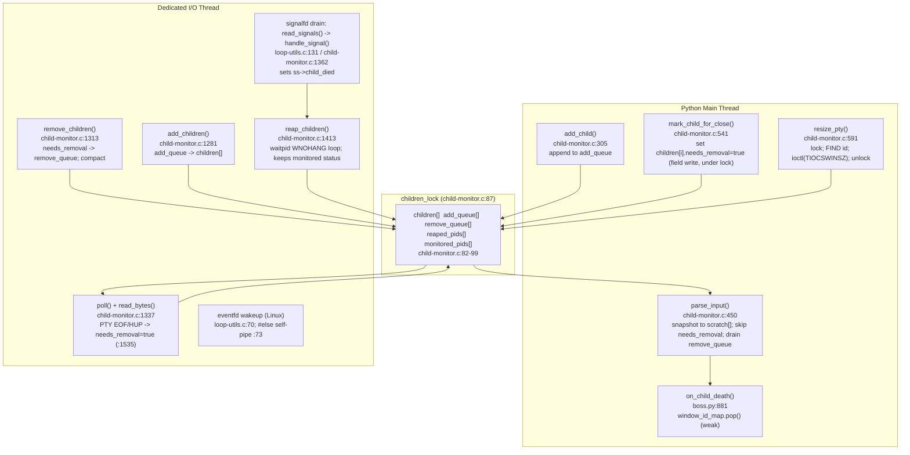

# kitty window-lifecycle state consistency under rapid create / resize / destroy

**Subject:** How the [kitty](https://github.com/kovidgoyal/kitty) terminal emulator (v0.35.2) keeps its
internal state consistent as terminal windows are created, resized, and destroyed in rapid succession —
with emphasis on **signal delivery**, **cross-thread bookkeeping**, and the **destruction-during-reaction
races** that arise when a window disappears before the system has finished reacting to it.

- **Deliverable branch:** `kitty_815df1e210e0`
- **Observation commit (source under test):** `815df1e210e0a9ab4622f5c7f2d6891d7dbeddf1`
- **kitty version:** `0.35.2` (grounded in `kitty/constants.py:25` → `version: Version = Version(0, 35, 2)`,
  and confirmed by the real `--version` banner in §2).

> **Methodology (run-first).** Every behavioural claim below was produced by **building and running the real
> `./kitty/launcher/kitty` binary** headless (under Xvfb) with `--debug-rendering`, driving windows through
> **canonical entry points only** (session files + `launch`/split/close — never remote control, never a debug
> hook, never a non-default compile flag), and capturing the **complete, unedited** stderr. In addition,
> `strace` (installed into the container from the distro archive; see §2) was attached to the real binary at
> its canonical entry point to capture the kernel-level `ioctl(TIOCSWINSZ)`, the `SIGWINCH` the kernel
> delivers to the child, and the `signalfd`/`eventfd` primitives created at startup. Source `file:line`
> references explain *why* the observed behaviour happens. Statements labelled **`(inferred)`** could not be
> reproduced at runtime through a canonical entry point in the supplied container and are grounded only in
> quoted source; statements labelled **`(OS contract)`** are documented kernel semantics with an authoritative
> citation; a platform branch that was not executed is labelled **`(not runtime-observed)`**.

---

## 1. Executive summary (direct thesis)

kitty reconciles two **different** views of "which windows are alive":

- A **Python object graph** whose *strong* ownership chain is
  `Boss.os_window_map` (`Dict[int, TabManager]`, `kitty/boss.py:350`) →
  `TabManager.tabs` (`List[Tab]`, `kitty/tabs.py:877`) →
  `Tab.windows` (a `WindowList`, `kitty/tabs.py:150`) →
  `WindowList.all_windows`/`id_map` (`kitty/window_list.py:147-148`) → `Window`.
  Separately, `Boss.window_id_map` is a **weak index** — a `WeakValueDictionary`
  (`kitty/boss.py:344`) — not the ownership root. A `Window` stays alive because the `WindowList` (and thus
  the `Tab`/`TabManager`) holds a strong reference; `window_id_map` merely provides id→`Window` lookup and
  drops entries automatically when the strong owner lets go.
- A **C-side child registry** — the fixed `children[]` array in `kitty/child-monitor.c` (`:82`).

It keeps them consistent with four cooperating mechanisms:

1. **A single lock.** All shared C state (`children[]`, the add/remove queues, `reaped_pids`,
   `monitored_pids`) is serialized by one mutex, `children_lock` (`kitty/child-monitor.c:87`).
2. **Deferred *structural* mutation through producer/consumer queues.** The Python **main thread** never
   inserts, removes, or reorders entries in `children[]`; it appends to `add_queue` (`add_child`, `:305`) and
   the dedicated **I/O thread** later applies the queues (`add_children` `:1281`, `remove_children` `:1313`,
   which is also where the array is compacted). The main thread *does*, however, directly flip the per-entry
   `needs_removal` **field** under the lock (`mark_child_for_close` sets `children[i].needs_removal = true` at
   `:546`; `mark_child_for_removal` at `:1390`) — that is a field write, not a structural change.
3. **A single boolean liveness arbiter,** `needs_removal` (`kitty/child-monitor.c:67`), the one source of
   truth for "this child is going away."
4. **Weak references on the Python side.** Because `window_id_map` is a `WeakValueDictionary`
   (`kitty/boss.py:344`), a `Window` released by its strong owner simply disappears from the index, and the
   child-death callback tolerates that with an explicit `None`-guard (`kitty/boss.py:883-885`).

Because the two views are updated on **two different threads** and structural removal is **deferred**, there
is necessarily a brief interval during rapid churn in which they **disagree**: the C registry has already
dropped a dead child (its `Screen` stopped producing bytes, so the I/O thread flagged it) while the Python
layout still holds the corresponding `Window` and issues a resize for it. That disagreement is directly
observable as the log line `Failed to send resize signal to child with id: …` (`kitty/child-monitor.c:610`).
The system is **eventually consistent**: once the main thread runs `parse_input`, fires the death callback,
and the `WindowList`/`window_id_map` drop the window, both views agree again. We reproduced this end-to-end,
including the convergence back to a consistent final state, and we ran the identical input repeatedly to
report the observed distribution (§11).

### TL;DR answers

| Q | One-line answer |
|---|-----------------|
| **Q1 — consistency under churn** | Two views (strong graph `os_window_map→TabManager→Tab→WindowList→Window` + weak `window_id_map` vs C `children[]`) kept **eventually consistent** via `children_lock` + deferred structural `add_queue`/`remove_queue` + the `needs_removal` arbiter + weak refs; transient disagreement is real and observable, then reconciled. |
| **Q2 — create-and-run flow** | `Child.fork()` allocates the PTY (`openpty`, `child.py:281`) and forks a child that sets up a controlling terminal (`setsid`+`TIOCSCTTY`, `child.c:123,129`) and then **blocks on a ready-pipe** before `execvp` (`child.c:152`). The parent registers the child in C **before** the weak index (`boss.py:587-588`); the first `Window.set_geometry()` pushes the initial size via `resize_pty`→`ioctl(TIOCSWINSZ)` (`child-monitor.c:609`) **and then** releases the child (`mark_terminal_ready`, `window.py:866`). Observed as `Child launched`; a later relayout emits `SIGWINCH sent to child in window: …`. `strace` captured both the `TIOCSWINSZ` ioctl and the kernel-delivered `SIGWINCH` to the child pid. |
| **Q3 — destruction-during-reaction** | A resize for an already-removed child is a **logged, non-fatal miss** (`child-monitor.c:610`, observed). A resize can **never** hit a *just-closed* fd, because `resize_pty` holds `children_lock` across both the lookup **and** the `ioctl` (`:598`…`:611`) while the fd is closed by `remove_children` under the *same* lock — so the `EBADF`/`ENOTTY` handling at `:581` is **defensive**, not a reachable race. A child-death for an already-dropped window is a **guarded no-op** (`boss.py:883-885`). |
| **Q4 — keep vs. discard** | The `Screen` object and PTY fd are **always discarded** (`Py_CLEAR`/`del self.screen`; `safe_close`). In the **default** configuration (`--config NONE` ⇒ `close_on_child_death=False`) an ordinary window is removed when its PTY hits **EOF/HUP** (`child-monitor.c:1535`), not by the `SIGCHLD` reaper. The exit **status** is discarded for ordinary window children and **kept only for explicitly *monitored* pids** (`reaped_pids` → `report_reaped_pids` → `on_monitored_pid_death`). |
| **Q5 — timing & signals** | On Linux the signal path is a **`signalfd`** drained *synchronously* on the I/O thread: the poll branch calls `read_signals()` → `handle_signal` (sets `ss->child_died`, `:1370-1371`) and, in the same branch, `reap_children()` which loops `waitpid(-1,…,WNOHANG)` (`:1418`) to absorb coalesced `SIGCHLD`s. Work faster than one tick is serialized through the queues under `children_lock`; the I/O→main wakeup is paced by `OPT(input_delay)` (`WAKEUP`, `:1562-1569`). |
| **Q6 — conflicting views** | Yes — in **both** directions. (a) *C-first:* under churn the C `children[]` no longer has a child but the Python layout still does → the `:610` line (observed). (b) *Python-first:* on OS-window close, `close_os_window` calls Python `on_os_window_closed` (which pops `window_id_map`) **before** it marks the C children (`child-monitor.c:1089` before `:1092`), so a later `on_child_death` hits the `None`-guard. kitty resolves both with `needs_removal` (C) + the `None`-guard (`boss.py:883-885`) + weak refs. |

---

## 2. Environment and how to reproduce

All build and run steps were executed **inside the supplied Docker image**
(`ghcr.io/scaleapi/swe-atlas:swe_atlas_QnA_kovidgoyal_kitty_1.0`). The host interpreter is Python 3.13, which
is incompatible with kitty 0.35.2's C extension under the default `-Werror`; the container ships a compatible
toolchain. The repository working tree is bind-mounted into the container at `/work`, so the artifacts built
in the container are the ones exercised here.

| Component | Value |
|-----------|-------|
| OS (container) | Ubuntu 24.04 LTS |
| Python | 3.12.3 |
| Go | go1.23.4 linux/amd64 |
| C compiler | gcc (Ubuntu 13.3.0) 13.3.0 |
| Display | headless `Xvfb :99 -screen 0 1280x800x24 -ac +extension GLX` |
| GL | `LIBGL_ALWAYS_SOFTWARE=1 GALLIUM_DRIVER=llvmpipe` (llvmpipe software rendering) |

**Provisioning (accurate).** The image does **not** ship `Xvfb` or `strace`; both were installed from the
Ubuntu archive at the start of the investigation (the container **does** have network access to the archive):

```
apt-get update && apt-get install -y --no-install-recommends xvfb xauth strace
```

`strace` (6.8) installed successfully, which is why the syscall-level captures below exist. These
installations happen **inside the container** and touch **no repository file**.

**Exact build command** (the canonical build, matching `.github/workflows/ci.py:104` →
`f'{python} setup.py build --verbose'`):

```
python3 setup.py build --verbose
```

The C extension compiles cleanly under kitty's **default** flags (no `--ignore-compiler-warnings`). The exact
gcc invocation for the file at the heart of this answer, copied verbatim from the `arguments` array of the
build's `build/compile_commands.json` (note the repeated `-I` includes emitted by the build system — they are
part of the real command):

```
gcc -MMD -DNDEBUG -Wextra -Wfloat-conversion -Wno-missing-field-initializers -Wall -Wstrict-prototypes -std=c11 -pedantic-errors -Werror -O3 -fwrapv -fstack-protector-strong -pipe -fvisibility=hidden -fno-plt -fPIC -D_FORTIFY_SOURCE=2 -flto -fcf-protection=full -march=native -mtune=native -pthread -I/usr/include/libpng16 -I/usr/include/freetype2 -I/usr/include/libpng16 -I/usr/include/harfbuzz -I/usr/include/freetype2 -I/usr/include/libpng16 -I/usr/include/glib-2.0 -I/usr/lib/x86_64-linux-gnu/glib-2.0/include -I/usr/include/python3.12 -c kitty/child-monitor.c -o build/fast_data_types-kitty-child-monitor.c.o
```

(`-std=c11 -pedantic-errors -Werror` are project defaults; the build produced zero warnings and zero errors.)

**Version banner** from the real binary (grounds v0.35.2 in `kitty/constants.py:25`):

```
$ ./kitty/launcher/kitty --version
kitty 0.35.2 created by Kovid Goyal
```

**How the runs were driven.** Every observation was produced by the self-contained harness embedded verbatim
in §11 (`harness.sh`), plus a second script for the OS-window-close direction (`osclose.sh`, also in §11).
Both are **safe by construction**: `umask 077`, a private `mktemp -d` workspace under `/tmp`, a captured Xvfb
PID reaped by an `EXIT`/`INT`/`TERM` trap, absolute quoted paths, and a **bounded** `timeout --signal=TERM
--kill-after=5s` around the real binary. The single canonical invocation each scenario reduces to is:

```
timeout --signal=TERM --kill-after=5s <SECS> \
  ./kitty/launcher/kitty --debug-rendering --config NONE --session <SESSION_FILE> 2>stderr.log
```

`--config NONE` guarantees the **default** configuration; the session file is the canonical window-creation
entry point (`kitty/session.py` `parse_session`/`create_sessions`). The `--debug-rendering` flag
(`kitty/cli.py:989` → `--debug-rendering --debug-gl`) is what surfaces the two observable log lines emitted by
`Window.set_geometry()` (`kitty/window.py:871,873`). kitty has no login/auth step.

**On `kitty_exit=124`.** For the long-lived scenarios the session includes a "keeper" window that never
exits, so kitty keeps running until the harness's `timeout` reaches its bound. GNU `timeout` then reports exit
status **124**, which means *"the time limit was reached and `timeout` terminated the still-running binary"* —
it is **not** a kitty crash and not a signal kitty raised. Scenarios with no keeper (e.g. the OS-close run in
§11) instead exit **0** naturally, well under the bound.

**Clean-tree baseline** (captured before any authoring; proves a byte-for-byte clean start):

```
$ git rev-parse --abbrev-ref HEAD
blitzy-56483927-44f2-4b4e-b5f6-a9d256171ba2
$ git status --porcelain
$        # (empty output = clean working tree)
```

A build does **not** dirty the tree: kitty's `.gitignore` already ignores `*.so`, `/build/`, and
`/kitty/launcher/kitt*`, so `fast_data_types.so` and the launcher binaries are untracked-by-design. The final
clean-tree proof (showing that only this document changed) is in **§13**.

---

## 3. The two-thread reconciliation model (foundation for Q1, Q4, Q5, Q6)

kitty runs two cooperating threads that both touch child state:

- The **Python main thread** performs `add_child` (`child-monitor.c:305`), `mark_child_for_close`
  (`:541`), `resize_pty` (`:591`), `parse_input` (`:450`), and the Python child-death callback
  `on_child_death` (`boss.py:881`).
- The **dedicated I/O thread** performs `poll()` + `read_bytes` (`:1337`), the `signalfd`-driven
  `reap_children` (`:1413`), `remove_children` (`:1313`), and `add_children` (`:1281`).

**All** shared state is guarded by the single mutex `children_lock` (`:87`); **structural** mutations of
`children[]` are **deferred** through `add_queue`/`remove_queue`; and the two threads coordinate through a
kernel wake-up primitive. On this Linux build that primitive is an **`eventfd`**, not a self-pipe (see §4 and
the `strace` evidence below): `loop-utils.h` defines `HAS_EVENT_FD`/`HAS_SIGNAL_FD` via `__has_include`
(`kitty/loop-utils.h:14-28`), and the self-pipe + `sigaction` path is the **`#else` non-Linux fallback**
(`kitty/loop-utils.c:45-52,73`). (The `self_pipe` at `child-monitor.c:262` is the unrelated "talk thread"
wakeup, not the child-monitor's.)

Crucially, `parse_input` copies `children[]` into a private `scratch[]` array **under the lock** with a
reference-count bump, so the main thread parses a **stable snapshot** even while the I/O thread mutates the
live array:

```c
        count = self->count;
        for (size_t i = 0; i < count; i++) {
            scratch[i] = children[i];
            INCREF_CHILD(scratch[i]);
        }
```
(`kitty/child-monitor.c:477-482`.)



**How a create → run → resize → close sequence is serialized.** Even if issued faster than one I/O-loop tick,
each step lands in shared state under `children_lock`, and the ordering is enforced by *which thread* owns
*which* transition:

- **create**: main thread `add_child` appends to `add_queue` and wakes the I/O thread; the child becomes part
  of `children[]` only when the I/O thread runs `add_children`.
- **run/resize**: main thread `resize_pty` searches `children[]` then `add_queue` **under the lock** and does
  the `ioctl` before releasing it.
- **close**: for the *default* config the I/O thread flags the child on PTY EOF/HUP (`:1535`); the I/O thread's
  `remove_children` then moves the entry to `remove_queue` and compacts `children[]`; the main thread's
  `parse_input` finally drains `remove_queue`, frees the child, and fires the death callback.

Because "close" spans **both** threads and its structural half is deferred, it is the step that can lag behind
a "resize" that the layout issues in the same instant — the origin of the races in Q3/Q6.

---

## 4. OS-contract background (kernel semantics, with authoritative citations)

These are properties of the Linux kernel that kitty's code relies on. They are labelled **`(OS contract)`**
and cited to authoritative documentation; they explain cause and effect and are **not** a substitute for
kitty's own observed behaviour.

- **`(OS contract)` `SIGCHLD` is not queued.** Standard signals are not queued: if multiple children change
  state while `SIGCHLD` is blocked or pending, the parent still sees a *single* `SIGCHLD`, so a correct
  handler must `waitpid(…, WNOHANG)` in a **loop** to reap them all (`signal(7)`, "Standard signals … are not
  queued"; `wait(2)`). This is exactly `reap_children()` (`child-monitor.c:1413-1426`).
- **`(OS contract)` `TIOCSWINSZ` → `SIGWINCH`.** Setting the window size on the PTY *master* makes the kernel
  send `SIGWINCH` to the *foreground process group* of the terminal and stores the size in the kernel
  (`tty_ioctl(4)`: "TIOCSWINSZ … The kernel … sends a `SIGWINCH` signal to the foreground process group").
  That is why kitty pushes size via `ioctl` (`pty_resize`, `:579`) and why `setsid()` + `TIOCSCTTY` in the
  child (`child.c:123,129`) — which make the PTY the child's controlling terminal and the child a
  process-group leader — are prerequisites for delivery. Both the `ioctl` and the resulting `SIGWINCH` were
  captured with `strace` (§6).
- **`(OS contract, Linux-specific)` `signalfd` turns signals into readable file descriptors.** On Linux kitty
  uses `signalfd(2)` so the signal set is drained **synchronously** from the poll loop rather than in an async
  handler (`signalfd(2)`; `eventfd(2)` for the wakeup). This is the path actually compiled here
  (`loop-utils.c:42,70`, confirmed by `strace` showing `signalfd4`/`eventfd2`). The classic "a C signal
  handler must only set a flag, defer the real work" rule applies to the **`#else` non-Linux fallback**
  (`sigaction` + self-pipe, `loop-utils.c:45-52`) **`(not runtime-observed)`** — on Linux there is no async
  handler; `read_signals()` invokes the callback inline.

---

## 5. Q1 — State consistency under churn

**Direct answer.** kitty does **not** attempt to keep the Python object graph and the C `children[]` array
*instantaneously* identical. Instead it keeps them **eventually consistent**. The Python side has a *strong*
ownership chain (`os_window_map` → `TabManager` → `Tab` → `WindowList` → `Window`) plus a *weak* id index
(`window_id_map`); the C side has `children[]`. The two are mutated on two threads, with **structural**
`children[]` changes deferred through `add_queue`/`remove_queue` under `children_lock`, the boolean
`needs_removal` as the single liveness arbiter, and Python weak references as the tolerant back-stop. Under
rapid churn there is a genuine, observable interval in which the views disagree, followed by deterministic
convergence once the main thread processes the deferred death notifications.

**Ownership, grounded.** The strong graph keeps a `Window` alive:
`Tab.windows: WindowList = WindowList(self)` (`kitty/tabs.py:150`); `WindowList.all_windows: List[Window]` and
`WindowList.id_map: Dict[int, Window]` (`kitty/window_list.py:147-148`); `WindowList.add_window` appends to
both (`:338-339`) and `remove_window` drops from both (`:377,:380`). (Note: `window_list.py:67`/`:84` are the
methods of the *different* `WindowGroup` class defined at `:28`; the `WindowList` class begins at `:144`. The
weak index is `Boss.window_id_map = WeakValueDictionary()` at `boss.py:344`.)

**Evidence — churn drives disagreement, then convergence (readable N = 3 case).** A canonical session creates
3 instant-exit windows under a splitting layout plus one long-lived "keeper" so the OS window does not close.
The session file and its exact producing command (from the harness in §11) are:

```
layout splits
launch sh -c 'exit 0'
launch sh -c 'exit 0'
launch sh -c 'exit 0'
launch sh -c 'sleep 30'
```

Complete, unedited stderr (21 lines; `kitty_exit=124` = the harness `timeout` bound was reached — see §2):

```
[0.139] OS Window created
[0.148] Failed to open systemd user bus with error: No such file or directory
[0.149] Child launched
[0.153] Failed to send resize signal to child with id: 1 (children count: 1) (add queue: 0)
[0.153] SIGWINCH sent to child in window: 1 with size: (22, 35, 315, 396)
[0.154] Child launched
[0.160] Failed to send resize signal to child with id: 2 (children count: 1) (add queue: 0)
[0.160] SIGWINCH sent to child in window: 2 with size: (22, 17, 153, 396)
[0.161] Child launched
[0.167] Failed to send resize signal to child with id: 3 (children count: 1) (add queue: 0)
[0.167] SIGWINCH sent to child in window: 3 with size: (22, 8, 72, 396)
[0.167] Child launched
[0.169] Failed to send resize signal to child with id: 2 (children count: 1) (add queue: 0)
[0.169] SIGWINCH sent to child in window: 2 with size: (22, 35, 315, 396)
[0.170] Failed to send resize signal to child with id: 3 (children count: 1) (add queue: 0)
[0.170] SIGWINCH sent to child in window: 3 with size: (22, 17, 153, 396)
[0.170] SIGWINCH sent to child in window: 4 with size: (22, 17, 153, 396)
[0.171] Failed to send resize signal to child with id: 3 (children count: 1) (add queue: 0)
[0.171] SIGWINCH sent to child in window: 3 with size: (22, 35, 315, 396)
[0.172] SIGWINCH sent to child in window: 4 with size: (22, 35, 315, 396)
[0.173] SIGWINCH sent to child in window: 4 with size: (22, 71, 639, 396)
```

(Grepped counts for this run: `Child launched` = 4, `SIGWINCH sent to child` = 9, `Failed to send resize
signal` = 6. The "4" is the 3 instant-exit windows plus the keeper.)

**What the log proves (and what it does not).** Each new window fires `Child launched`; the immediately
following `Failed to send resize signal to child with id: N` shows the layout resizing a sibling id that the
C registry no longer holds. `children count: 1` is simply **the size of `children[]` at the instant
`resize_pty` ran** (`self->count`, printed by `child-monitor.c:610`); it does **not** identify *which* child
remains, and in particular it does not mean "only the keeper" (in this ordering the keeper — window 4 here —
is created *last*). The size columns visibly shrink (`35 → 17 → 8`) as `splits` subdivides, confirming these
are real relayouts. The **last three lines** are the convergence: once the dead windows are gone from **both**
registries, the keeper (window 4) is resized up to the full `71`-column width — the two views agree again.

**Why (causal, with `file:line`).** The main thread only ever *appends* to `add_queue` (`add_child`,
`:305-321`) or *flips* the `needs_removal` field (`mark_child_for_close`, `:541-564`) — it never structurally
edits `children[]`. In the **default** configuration the trigger that flags a self-exiting window is **PTY
EOF/HUP on the I/O thread**: `read_bytes()` returns false and the I/O thread sets
`children[i].needs_removal = true` (`child-monitor.c:1531-1535`) — *not* the `SIGCHLD` reaper (see Q4/Q5). The
I/O thread then applies removals (`remove_children` `:1313-1333`, moving `needs_removal` entries into
`remove_queue` and `memmove`-compacting the array). The main thread's `parse_input` (`:450`) drains
`remove_queue`, runs the `death_notify` callback (`:522`) → Python `on_child_death` (`boss.py:881`) →
`window_id_map.pop` + `tab.remove_window` → `WindowList.remove_window` (`window_list.py:373`). Until that last
step runs, the Python `WindowList` still contains the dead window, so a relayout triggered by the *next*
window's creation calls `set_geometry` → `resize_pty` for an id no longer in `children[]` → the `:610` miss.
Convergence follows deterministically once `parse_input` drains the queue.

---

## 6. Q2 — Create-and-run: the resize/signal flow

**Direct answer.** Creating a window that immediately runs a command proceeds in this order:

1. **PTY + fork with a ready-barrier.** `Child.fork()` (`kitty/child.py:276`) allocates the PTY with
   `openpty()` (`:281`) and creates a **ready pipe** (`ready_read_fd, ready_write_fd = os.pipe()`, `:283`),
   then calls the native `spawn()` (`kitty/child.c:81`). In the child, `spawn` calls `setsid()` (`:123`) and
   `ioctl(tfd, TIOCSCTTY, 0)` (`:129`) to make the PTY its controlling terminal, then **blocks** in
   `wait_for_terminal_ready(ready_read_fd)` (`:152`) — *before* `execvp`. The parent records `self.pid`/
   `self.child_fd` (`:337-338`) and keeps `terminal_ready_fd = ready_write_fd` (`:343`).
2. **Registration order (C before weak index).** `Boss.add_child` registers the child in the C monitor
   **first** and only then in the weak index:
   `self.child_monitor.add_child(window.id, …, window.screen)` (`boss.py:587`) then
   `self.window_id_map[window.id] = window` (`boss.py:588`).
3. **First geometry pushes size, then releases the child.** The first `Window.set_geometry()`
   (`kitty/window.py:850`) detects a change against the sentinel `last_reported_pty_size = (-1,-1,-1,-1)`
   (`:579`) and, at `:861`, calls `boss.child_monitor.resize_pty(self.id, *current_pty_size)` (`:863`) — the
   `ioctl(TIOCSWINSZ)` — **and then**, because `child_is_launched` is still false (`:865`), calls
   `self.child.mark_terminal_ready()` (`:866`), which closes `ready_write_fd` and unblocks the child so it
   `execvp`s **with the correct size already on the PTY**. On this first pass it prints `Child launched`
   (`:871`); on *subsequent* size changes it prints `SIGWINCH sent to child in window: …` (`:873`).

So the initial size is delivered to the PTY *before* the program even starts (no race for the first size),
and every later relayout delivers `SIGWINCH` to the now-running program via a fresh `TIOCSWINSZ`.

**Evidence — the log.** A canonical session that launches a command and then adds a second window under
`tall` layout to force the first to relayout. Complete, unedited stderr (5 lines):

```
[0.407] OS Window created
[0.416] Failed to open systemd user bus with error: No such file or directory
[0.418] Child launched
[0.424] SIGWINCH sent to child in window: 1 with size: (22, 35, 315, 396)
[0.424] Child launched
```

`[0.418] Child launched` is window 1's first `set_geometry`; `[0.424] SIGWINCH sent to child in window: 1`
is window 1 being **relaid out** (shrunk to 35 columns) when window 2 is added; `[0.424] Child launched` is
window 2's first `set_geometry`. The tuple is `(lines, columns, width_px, height_px)`. The
`Failed to open systemd user bus …` line is a benign environment message (no systemd user bus in the
container) and is unrelated to window lifecycle.

**Evidence — the syscalls (`strace`, canonical binary).** `strace -f -e trace=ioctl,signalfd4,eventfd2 -e
signal=SIGWINCH` was attached to the real `./kitty/launcher/kitty` launched through a session (a `tall` layout
with two windows). kitty's pid was `10180`; the two children were `10247`/`10248`. The captured lines
(complete for the traced filters) are:

```
10180 eventfd2(0, EFD_CLOEXEC|EFD_NONBLOCK) = 4
10180 eventfd2(0, EFD_CLOEXEC|EFD_NONBLOCK) = 6
10180 signalfd4(-1, [HUP INT USR1 USR2 TERM CHLD], 8, SFD_CLOEXEC|SFD_NONBLOCK) = 7
10180 ioctl(8, TIOCSWINSZ, {ws_row=22, ws_col=71, ws_xpixel=639, ws_ypixel=396}) = 0
10247 --- SIGWINCH {si_signo=SIGWINCH, si_code=SI_KERNEL} ---
10180 ioctl(8, TIOCSWINSZ, {ws_row=22, ws_col=35, ws_xpixel=315, ws_ypixel=396}) = 0
10180 ioctl(9, TIOCSWINSZ, {ws_row=22, ws_col=35, ws_xpixel=315, ws_ypixel=396}) = 0
10248 --- SIGWINCH {si_signo=SIGWINCH, si_code=SI_KERNEL} ---
10247 --- SIGWINCH {si_signo=SIGWINCH, si_code=SI_KERNEL} ---
```

Its `--debug-rendering` stderr for that same run (complete, 5 lines):

```
[0.751] OS Window created
[0.765] Failed to open systemd user bus with error: No such file or directory
[0.767] Child launched
[0.774] SIGWINCH sent to child in window: 1 with size: (22, 35, 315, 396)
[0.775] Child launched
```

This is direct, syscall-level confirmation that (a) kitty issues `ioctl(fd, TIOCSWINSZ, …)` on the PTY master
(fds `8`/`9`), (b) the **kernel** then delivers `SIGWINCH` to the *child* pids (`10247`, `10248`;
`si_code=SI_KERNEL`), and (c) at startup kitty creates the Linux `eventfd`/`signalfd` primitives that §3/§4
describe. The `SIGWINCH sent to child …` debug line therefore corresponds to a real kernel signal, not merely
a log message.

**Why (causal, with `file:line`).** The observable strings come verbatim from `Window.set_geometry`, with the
`resize_pty` call **preceding** the child release:

```python
        if current_pty_size != self.last_reported_pty_size:
            boss = get_boss()
            boss.child_monitor.resize_pty(self.id, *current_pty_size)
            self.last_resized_at = monotonic()
            if not self.child_is_launched:
                self.child.mark_terminal_ready()
                self.child_is_launched = True
                update_ime_position = True
                if boss.args.debug_rendering:
                    now = monotonic()
                    print(f'[{now:.3f}] Child launched', file=sys.stderr)
            elif boss.args.debug_rendering:
                print(f'[{monotonic():.3f}] SIGWINCH sent to child in window: {self.id} with size: {current_pty_size}', file=sys.stderr)
            self.last_reported_pty_size = current_pty_size
```
(`kitty/window.py:861-874`.) The sentinel at `:579` guarantees the *first* call always differs, so the child
is marked launched exactly once. The call at `:863` reaches the C layer, which does the lookup and `ioctl`
under the lock:

```c
    children_mutex(lock);
#define FIND(queue, count) { \
    for (size_t i = 0; i < count; i++) { \
        if (queue[i].id == window_id) { \
            fd = queue[i].fd; \
            break; \
        } \
    }}
    FIND(children, self->count);
    if (fd == -1) FIND(add_queue, add_queue_count);
    if (fd != -1) {
        if (!pty_resize(fd, &dim)) PyErr_SetFromErrno(PyExc_OSError);
    } else log_error("Failed to send resize signal to child with id: %lu (children count: %u) (add queue: %zu)", window_id, self->count, add_queue_count);
    children_mutex(unlock);
```
(`kitty/child-monitor.c:598-611`), and `pty_resize` performs the actual `ioctl(fd, TIOCSWINSZ, dim)`
(`kitty/child-monitor.c:579`).

---

## 7. Q3 — Destruction-during-reaction

**Direct answer.** kitty treats "the window is gone before I finished reacting" as a **normal, non-fatal**
condition. There are two *reachable* cases and one that is provably **not** reachable:

1. **A resize that targets a child already removed from the registry** — a **logged miss**: `resize_pty`
   fails to find the id in `children[]` or `add_queue` and logs
   `Failed to send resize signal to child with id: …` (`child-monitor.c:610`). No crash, no signal. **Observed**
   (§5, §11).
2. **A child-death notification for a window Python already dropped** — a **guarded no-op**: `on_child_death`
   pops the weak reference and returns immediately if it is `None` (`boss.py:883-885`). The canonical route to
   this guard is the OS-window-close path (§10).
3. **A resize that reaches a *just-closed* file descriptor — provably cannot occur.** `resize_pty` holds
   `children_lock` across **both** the lookup and the `ioctl` (`:598` lock … `:611` unlock), and the fd is
   closed by `remove_children` → `cleanup_child` → `safe_close` **under the same mutex** (the I/O loop wraps
   `remove_children(self); add_children(self);` in `children_mutex(lock)`/`(unlock)` at `:1492-1495`). Because
   the two critical sections are mutually exclusive, the I/O thread cannot close a descriptor *between*
   `resize_pty`'s lookup and its `ioctl`. The `EBADF`/`ENOTTY` handling in `pty_resize` (`:581`) is therefore
   **defensive coding**, not a race the running system exercises.

**Evidence — case 1, verbatim.** The `:610` line, e.g. from §5:

```
[0.153] Failed to send resize signal to child with id: 1 (children count: 1) (add queue: 0)
```

A subtle, **observed** detail: this failure is immediately followed — *in the same `set_geometry` call, at the
same timestamp* — by an **optimistic** `SIGWINCH sent` line for the *same* id:

```
[0.153] Failed to send resize signal to child with id: 1 (children count: 1) (add queue: 0)
[0.153] SIGWINCH sent to child in window: 1 with size: (22, 35, 315, 396)
```

**Why the "SIGWINCH sent" line is misleading here (causal).** `Window.set_geometry` calls `resize_pty`
(`window.py:863`) and then, *without checking whether the resize found the child*, prints `SIGWINCH sent …`
(`:873`). The C `resize_pty` does **not** raise when the id is missing — it only logs `:610` and returns
(`Py_RETURN_NONE`). So a `:610` line immediately followed by a `SIGWINCH sent` line for the same id means **no
signal was actually delivered**; the Python-side debug message is optimistic. This is itself a concrete
instance of the two views disagreeing (Q6).

**Evidence — case 2 (the `None`-guard):**

```python
    def on_child_death(self, window_id: int) -> None:
        prev_active_window = self.active_window
        window = self.window_id_map.pop(window_id, None)
        if window is None:
            return
```
(`kitty/boss.py:881-885`.) In the churn runs, every dead window's id is still present when its death
notification arrives, so the *normal* branch runs. The early-return is exercised by the **OS-window-close**
ordering (§10), where Python drops the window from `window_id_map` *before* the C child is marked. The
early-return itself emits **no log line**, so its firing is **`(inferred)`** from the code above; the ordering
that makes it necessary is grounded in `child-monitor.c:1089` vs `:1092` and `boss.py:1777-1781` (§10) and the
OS-close run was observed to complete cleanly (§11).

**Case 3 (defensive, not a race), source:**

```c
pty_resize(int fd, struct winsize *dim) {
    while(true) {
        if (ioctl(fd, TIOCSWINSZ, dim) == -1) {
            if (errno == EINTR) continue;
            if (errno != EBADF && errno != ENOTTY) {
                log_error("Failed to resize tty associated with fd: %d with error: %s", fd, strerror(errno));
                return false;
            }
        }
        break;
    }
    return true;
}
```
(`kitty/child-monitor.c:577-589`.) The `EBADF`/`ENOTTY` swallow exists so that *if* a descriptor were ever
stale the call would be harmless; but under the lock discipline above it is not reachable from a concurrent
close, so no runtime capture of this branch is possible (and none is claimed). The **observed** destruction-
during-resize outcome is exclusively case 1 (the `:610` "not found" miss).

---

## 8. Q4 — Keep vs. discard

**Direct answer.** On teardown kitty **always discards** the volatile per-window resources — the `Screen`
object (C-side `Py_CLEAR`, Python-side `del self.screen`) and the PTY file descriptor (`safe_close`). What is
**kept** is narrow: the child's **exit status** is retained **only** for pids explicitly *registered for
monitoring* (`monitor_pid`), stored in `reaped_pids[]` and later delivered to the boss. For an ordinary
terminal window the exit status is **not** retained (the removal path stores only the `needs_removal` flag,
and the Python death callback is handed only a `window_id`, never a status). The deciding question is simply
**"is this pid in `monitored_pids[]`?"**

**Two distinct removal triggers — and which one fires by default.** It is essential to separate them:

- **Default (`--config NONE` ⇒ `close_on_child_death=False`):** an ordinary window is removed because its
  **PTY hits EOF/HUP**. On the I/O thread, `read_bytes()` returns false and the code sets
  `children[i].needs_removal = true` (`child-monitor.c:1531-1535`; the `// child is dead` comment is at
  `:1533`). The `SIGCHLD` reaper does **not** mark ordinary children in this configuration.
- **Option-gated (`close_on_child_death=True`):** *then* the reaper marks the child by pid. In
  `reap_children`, `if (enable_close_on_child_death) mark_child_for_removal(self, pid);`
  (`child-monitor.c:1422`); the argument comes from `reap_children(self, OPT(close_on_child_death))` at the
  call site (`:1526`). The default is `False` (`kitty/options/types.py` / `definition.py` default `no`), so
  this branch is **`(inferred)`** here — it was not exercised because the default config does not enable it.

Either way `mark_monitored_pids(pid, status)` runs unconditionally in the reap loop (`:1423`) so that
*monitored* pids' statuses are captured and zombies are reaped.

**Discarded — the `Screen` object.** When `parse_input` drains the remove queue it runs `FREE_CHILD`:

```c
#define FREE_CHILD(x) \
    Py_CLEAR((x).screen); x = EMPTY_CHILD;
```
(`kitty/child-monitor.c:105-106`; invoked at `:462`.) The Python side mirrors this in `Window.destroy()`:

```python
            # Remove cycles so that screen is de-allocated immediately
            self.screen.reset_callbacks()
            del self.screen
```
(`kitty/window.py:1569-1571`.)

**Discarded — the PTY fd.** `remove_children` calls `cleanup_child`, which closes the fd and hangs up the
process group:

```c
static void
cleanup_child(ssize_t i) {
    safe_close(children[i].fd, __FILE__, __LINE__);
    hangup(children[i].pid);
}
```
(`kitty/child-monitor.c:1305-1309`; `hangup` = `killpg(pgid, SIGHUP)` at `:1294-1302`, `killpg` at `:1299`.)

**Exit status — discarded for an ordinary window child.** `mark_child_for_removal` sets only the liveness
flag, taking **no** status argument:

```c
mark_child_for_removal(ChildMonitor *self, pid_t pid) {
    children_mutex(lock);
    for (size_t i = 0; i < self->count; i++) {
        if (children[i].pid == pid) {
            children[i].needs_removal = true;
            break;
        }
    }
    children_mutex(unlock);
}
```
(`kitty/child-monitor.c:1386-1396`.) And the Python death callback receives only the `window_id`
(`def on_child_death(self, window_id: int)`, `boss.py:881`) — it never sees an exit status for the window's
own terminal child.

**Exit status — kept only for monitored pids.** `mark_monitored_pids` stores the status **iff** the pid was
registered:

```c
static void
mark_monitored_pids(pid_t pid, int status) {
    children_mutex(lock);
    for (ssize_t i = monitored_pids_count - 1; i >= 0; i--) {
        if (pid == monitored_pids[i]) {
            if (reaped_pids_count < arraysz(reaped_pids)) {
                reaped_pids[reaped_pids_count].status = status;
                reaped_pids[reaped_pids_count++].pid = pid;
            }
            remove_i_from_array(monitored_pids, (size_t)i, monitored_pids_count);
        }
    }
    children_mutex(unlock);
}
```
(`kitty/child-monitor.c:1398-1411`.) The retained status is later delivered by `report_reaped_pids`:

```c
    for (size_t n = 0; n < i; n++) { call_boss(on_monitored_pid_death, "li", (long)pids[n].pid, pids[n].status); }
```
(`kitty/child-monitor.c:961`), which invokes `Boss.on_monitored_pid_death(pid, exit_status)`
(`kitty/boss.py:2725`). Pids enter `monitored_pids[]` via `monitor_pid` (`child-monitor.c`), called from
`Boss` for background subprocesses registered with a death callback: `monitor_pid(p.pid)` at `boss.py:2419`
(guarded by `if notify_on_death:` at `:2417`).
**`(inferred)`**: the monitored-pid *delivery* was not exercised at runtime because it is not reachable
through the session-file / `launch` / split / close entry points used here; it is grounded in the code above.

**Before / intermediate / after — the explicit lifecycle (source-grounded, with observed anchors).** Tracing
one instant-exit window through every state (default config):

| Phase | What happens | State | Grounding |
|-------|--------------|-------|-----------|
| **created (queued)** | main thread `add_child` appends to `add_queue`; not yet in `children[]` | pending | `child-monitor.c:305-321` *(inferred: no per-step log)* |
| **alive** | I/O thread `add_children` moves it into `children[]`; first `set_geometry` pushes size & releases child | in `children[]`, `needs_removal == false`; `Screen` + PTY fd held | `:1281-1290`; `Child launched` **observed** (§5/§6) |
| **marked** | child exits → PTY EOF/HUP → I/O thread sets `needs_removal = true` | still in `children[]` but flagged; `parse_input` **skips** it (`if (!scratch[i].needs_removal)`, `:529`) | `:1531-1535`; skip at `:528-532` |
| **structurally removed** | I/O thread `remove_children`: `cleanup_child` closes fd + `killpg(SIGHUP)`, entry moved to `remove_queue`, array compacted | gone from `children[]`; fd closed | `:1305-1308,1313-1333` |
| **freed + notified** | main thread `parse_input` drains `remove_queue`: `FREE_CHILD` (`Py_CLEAR(screen)`), then `death_notify` → `on_child_death` | `Screen` released (C); Python pops weak index + `WindowList.remove_window` | `:462,522`; `boss.py:881-885`; `window.py:1571` |
| **status** | *ordinary window:* status dropped. *monitored pid:* status kept in `reaped_pids`, delivered via `report_reaped_pids` → `on_monitored_pid_death` | exit status kept **iff** monitored | `:1398-1411,950-962`; `boss.py:2725` *(monitored delivery inferred)* |

The **observed anchors** for one window id from §5 are: **alive** = `[…] Child launched`; **intermediate**
(C-removed, Python-retained) = `Failed to send resize signal to child with id: N …` followed by the optimistic
`SIGWINCH sent …`; **after** = that id never appears again. The user-initiated teardown path
(`Window.close()` → `Boss.mark_window_for_close` → `child_monitor.mark_for_close`, `window.py:888-889`,
`boss.py:920-928`) sets the *same* `needs_removal` arbiter (`mark_child_for_close`, `child-monitor.c:546`) and
is likewise deferred.

---

## 9. Q5 — Timing and signal delivery

**Direct answer.** On this Linux build the `SIGCHLD` path is **not** the classic async-handler-sets-a-flag
design; it is a **`signalfd` drained synchronously** on the I/O thread. The poll loop, when the signal fd is
readable, calls `read_signals()` (`loop-utils.c:131`), which invokes the callback `handle_signal`
(`child-monitor.c:1362`) inline; for `SIGCHLD` that only sets `ss->child_died = true` (`:1370-1371`), and the
**same** poll branch then calls `reap_children(self, OPT(close_on_child_death))` (`:1526`). `reap_children`
loops `waitpid(-1, &status, WNOHANG)` (`:1418`) precisely so that a *single* delivered `SIGCHLD` — the kernel
does not queue them **`(OS contract, §4)`** — can reap *many* exited children in one pass. Any
create/run/resize/close activity issued faster than one I/O-loop tick is not lost or corrupted: it is
serialized through `add_queue`/`remove_queue` under `children_lock`.

**Evidence — the Linux signal primitives exist at runtime (`strace`).** From §6, at startup kitty creates two
`eventfd`s and one `signalfd` covering `CHLD` (among others):

```
10180 eventfd2(0, EFD_CLOEXEC|EFD_NONBLOCK) = 4
10180 eventfd2(0, EFD_CLOEXEC|EFD_NONBLOCK) = 6
10180 signalfd4(-1, [HUP INT USR1 USR2 TERM CHLD], 8, SFD_CLOEXEC|SFD_NONBLOCK) = 7
```

This confirms the `HAS_SIGNAL_FD`/`HAS_EVENT_FD` code paths (`loop-utils.c:42,70`) are the ones compiled and
run here, not the self-pipe + `sigaction` fallback.

**Evidence — the handler only sets a flag:**

```c
        case SIGCHLD:
            ss->child_died = true;
            break;
```
(`kitty/child-monitor.c:1370-1371`.)

**Evidence — reaping is a `WNOHANG` loop that also captures monitored status:**

```c
reap_children(ChildMonitor *self, bool enable_close_on_child_death) {
    int status;
    pid_t pid;
    (void)self;
    while(true) {
        pid = waitpid(-1, &status, WNOHANG);
        if (pid == -1) {
            if (errno != EINTR) break;
        } else if (pid > 0) {
            if (enable_close_on_child_death) mark_child_for_removal(self, pid);
            mark_monitored_pids(pid, status);
        } else break;
    }
}
```
(`kitty/child-monitor.c:1413-1426`.) Note the two roles: `mark_child_for_removal` is **gated** by the option
(off by default), while `mark_monitored_pids` always runs to reap zombies and capture monitored statuses.

**What was observed vs. inferred about coalescing.**

- **Observed:** in the 41-window saturated run (§11) all 40 instant-exit children die within a ~0.5 s burst and
  are **all** reaped and torn down — the run converges to exactly one survivor (the keeper) at full size, and
  `Child launched` fired 41 times. So the reap+removal machinery demonstrably absorbs a dense burst without
  losing a child.
- **`(inferred)`:** that a *single* `SIGCHLD` delivery reaped *several* children in one loop pass is **not**
  shown by these captures. Two reasons: (1) `strace` was scoped to `ioctl,signalfd4,eventfd2` + `SIGWINCH`
  (chosen to prove the resize path) and did not trace `SIGCHLD`/`waitpid` multiplicity; (2) in the **default**
  config ordinary-window removal is driven by **PTY EOF**, not by the reaper marking children, so the
  `SIGCHLD`-coalescing-into-removal effect is not even on the default removal path. The multiplicity is
  therefore grounded in the OS contract (`SIGCHLD` not queued, §4) plus the `while … waitpid(WNOHANG)` loop
  that exists to handle it.

**Two-thread serialization (observed).** The sub-millisecond interleaving in the §5 capture shows main-thread
work (`resize_pty` → the `SIGWINCH`/`:610` lines) and I/O-thread work (PTY-EOF flagging, `remove_children`)
racing within the same millisecond, yet every mutation of `children[]` is bracketed by `children_lock`
(`:87`). The **cadence** at which the main thread observes I/O-thread removals is paced by `OPT(input_delay)`:
the I/O thread only wakes the main loop through the `WAKEUP` macro after `input_delay` has elapsed
(`child-monitor.c:1562-1569`; the comment at `:1563` notes "wakeup is an expensive operation"). (This is
distinct from `set_maximum_wait`/`maximum_wait` at `:114-118`, which bounds how long the loop waits for
*window-system* events before ticking render/input timers — e.g. `OPT(input_delay)` for pending input at
`:445`, `OPT(repaint_delay)` at `:876` — and is **not** the child-reconciliation cadence.)

---

## 10. Q6 — Conflicting views of liveness

**Direct answer.** Yes — and in **both** directions, plus a transient at creation. kitty always resolves the
conflict without blocking or crashing.

- **(a) C-first (observed).** Under churn the **C registry no longer holds a child** whose **Python `Window`
  still exists** (the layout still lays it out and resizes it). That interval is exactly the
  `Failed to send resize signal to child with id: N (children count: …)` line: the count proves the C side
  dropped the child (via PTY EOF, Q4), while the very fact a resize was *issued* for id `N` proves the Python
  layout still holds it. Resolution: the C side just logs and returns (`resize_pty`, `:606-610`); the Python
  side reconciles when `parse_input` fires the deferred `on_child_death`, which pops the weak index and
  `WindowList.remove_window` drops the strong reference.
- **(b) Python-first (observed to complete; guard firing inferred).** On an OS-window close the ordering is
  **reversed**: `close_os_window` calls the Python callback **before** it marks the C children —
  `call_boss(on_os_window_closed, …)` at `child-monitor.c:1089`, then the
  `for (…) mark_child_for_close(self, tab->windows[w].id);` loop at `:1092`. And `on_os_window_closed` pops
  the window from the weak index *first*:

  ```python
      def on_os_window_closed(self, os_window_id: int, viewport_width: int, viewport_height: int) -> None:
          self.cached_values['window-size'] = viewport_width, viewport_height
          tm = self.os_window_map.pop(os_window_id, None)
          if tm is not None:
              tm.destroy()
          for window_id in tuple(w.id for w in self.window_id_map.values() if getattr(w, 'os_window_id', None) == os_window_id):
              self.window_id_map.pop(window_id, None)
  ```
  (`kitty/boss.py:1775-1781`.) So the Python `Window` is already gone from `window_id_map` when the child's
  later death notification arrives, and `on_child_death` hits its `None`-guard (`boss.py:883-885`). This is
  the **canonical** route to that guard. We drove it with a no-keeper session (three `launch sh -c 'exit 0'`
  windows); the run exited **0** in ~0.47 s (well under the bound) — i.e. every window closed, the OS window
  closed, and kitty quit on its own (§11). The guard emits no log, so its *firing* is **`(inferred)`**; the
  ordering that necessitates it is grounded in the two `file:line` sites above.
- **(c) Creation-side transient (observed indirectly).** Between `add_child` appending to `add_queue` and the
  I/O thread running `add_children`, a resize can arrive for a child that is in `add_queue` but not yet in
  `children[]`. `resize_pty` handles this by searching **both** (`FIND(children …)` then
  `FIND(add_queue …)`, `child-monitor.c:606-607`), so a just-created child is still resizable. The `(add
  queue: 0)` field printed on every `:610` line is the observable of this second search returning empty.

**The arbiter that prevents double action.** In every direction the single boolean `needs_removal`
(`child-monitor.c:67`) is the tie-breaker: by design it makes removal idempotent — once the flag is set, the
entry is eligible to be moved to `remove_queue` by `remove_children`, and after it is compacted out of
`children[]` it is no longer present to be processed again, while `parse_input` skips it as long as it lingers:

```c
    for (size_t i = 0; i < count; i++) {
        if (!scratch[i].needs_removal) {
            if (do_parse(self, scratch[i].screen, now, false)) input_read = true;
        }
        DECREF_CHILD(scratch[i]);
```
(`kitty/child-monitor.c:528-532`.) Combined with the weak `window_id_map`, an orphaned `Window` (no strong
owner) is simply collectable and its later death notification harmlessly hits the `None`-guard.

---

## 11. Race reproduction and run-to-run distribution

The race in Q3/Q6 is timing-dependent, so — per the run-to-run rule — the **identical, unchanged** input was
run repeatedly and the **observed distribution** is reported below. No stabilized variant was constructed. All
runs were produced by the two self-contained scripts embedded verbatim here; nothing else was needed to
reproduce them.

### 11.1 The harness (verbatim, `bash -n`-clean)

`harness.sh` drives Q2, the N=3 and N=10 churn cases, the 20-run saturated distribution (N=40 + keeper), and
the scale sweep. It writes **only** under a private `mktemp -d` workspace and reaps its Xvfb via a trap:

```bash
#!/usr/bin/env bash
# ============================================================================
# kitty window-lifecycle observation harness  (READ-ONLY; runs the real binary)
#   - Safe by construction: umask 077, private mktemp workspace, captured PIDs,
#     EXIT trap that reaps Xvfb, and a bounded (TERM -> KILL) timeout on kitty.
#   - Canonical entry point only: ./kitty/launcher/kitty --config NONE --session.
#   - Writes ONLY under a private /tmp workspace; never touches the checkout.
# ============================================================================
set -u
umask 077

KITTY=/work/kitty/launcher/kitty
WORK="$(mktemp -d "${TMPDIR:-/tmp}/kitty_obs.XXXXXX")"
echo "WORKSPACE=$WORK"

# --- Headless display: start our own Xvfb, capture PID, reap on exit ----------
export DISPLAY=:99
export LIBGL_ALWAYS_SOFTWARE=1 GALLIUM_DRIVER=llvmpipe
export LANG=C.UTF-8 LC_ALL=C.UTF-8
export HOME="$WORK/home" XDG_RUNTIME_DIR="$WORK/xdg"
mkdir -p "$HOME" "$XDG_RUNTIME_DIR"; chmod 700 "$XDG_RUNTIME_DIR"

Xvfb :99 -screen 0 1280x800x24 -ac +extension GLX >"$WORK/xvfb.log" 2>&1 &
XVFB_PID=$!
cleanup(){ kill "$XVFB_PID" 2>/dev/null; wait "$XVFB_PID" 2>/dev/null; }
trap cleanup EXIT INT TERM
for _ in $(seq 1 50); do [ -S /tmp/.X11-unix/X99 ] && break; sleep 0.1; done

# --- Helpers -----------------------------------------------------------------
# Run one canonical kitty session, time-bounded, capturing COMPLETE stderr.
run_session(){ # <timeout_secs> <session_file> <out_log>
  timeout --signal=TERM --kill-after=5s "$1" \
    "$KITTY" --debug-rendering --config NONE --session "$2" \
    >/dev/null 2>"$3"
  echo "kitty_exit=$?"   # 124 => GNU timeout reached the time bound and terminated the run
}
# Build a churn session: N instant-exit windows + 1 long-lived keeper, splits layout.
make_churn(){ # <N> <file>
  { echo "layout splits"
    for _ in $(seq 1 "$1"); do echo "launch sh -c 'exit 0'"; done
    echo "launch sh -c 'sleep 30'"; } > "$2"
}
counts(){ # <log>  -> "launched sigwinch failed"
  printf '%s %s %s' \
    "$(grep -c 'Child launched' "$1")" \
    "$(grep -c 'SIGWINCH sent to child' "$1")" \
    "$(grep -c 'Failed to send resize signal' "$1")"
}

# ============================== SCENARIOS ===================================

# --- Q2: create-and-run. Two windows under tall layout; the 2nd forces the ---
#         first to relayout, emitting Observable #2 (SIGWINCH sent).          -
Q2="$WORK/q2.session"
printf 'layout tall\nlaunch sh -c '"'"'printf ready; sleep 8'"'"'\nlaunch sh -c '"'"'sleep 8'"'"'\n' > "$Q2"
echo "########## Q2_SESSION ##########"; cat "$Q2"
echo "########## Q2_RUN ##########"
echo "\$ timeout --signal=TERM --kill-after=5s 3 $KITTY --debug-rendering --config NONE --session \$Q2 2>q2.log"
run_session 3 "$Q2" "$WORK/q2.log"
echo "########## Q2_STDERR (complete, $(wc -l < "$WORK/q2.log") lines) ##########"
cat "$WORK/q2.log"

# --- Q1/Q5/Q6: churn N=3 (fully embeddable readable case) -------------------
S3="$WORK/churn3.session"; make_churn 3 "$S3"
echo "########## CHURN3_SESSION ##########"; cat "$S3"
echo "########## CHURN3_RUN ##########"
echo "\$ timeout --signal=TERM --kill-after=5s 3 $KITTY --debug-rendering --config NONE --session \$S3 2>churn3.log"
run_session 3 "$S3" "$WORK/churn3.log"
echo "########## CHURN3_STDERR (complete, $(wc -l < "$WORK/churn3.log") lines) ##########"
cat "$WORK/churn3.log"
echo "########## CHURN3_COUNTS (launched sigwinch failed) ##########"; counts "$WORK/churn3.log"

# --- Q1/Q5/Q6: churn N=10 (heavier churn, still embeddable) -----------------
S10="$WORK/churn10.session"; make_churn 10 "$S10"
echo "########## CHURN10_RUN ##########"
run_session 3 "$S10" "$WORK/churn10.log"
echo "########## CHURN10_STDERR (complete, $(wc -l < "$WORK/churn10.log") lines) ##########"
cat "$WORK/churn10.log"
echo "########## CHURN10_COUNTS (launched sigwinch failed) ##########"; counts "$WORK/churn10.log"

# --- Distribution: identical saturated input (N=40 + keeper), 20 runs -------
S40="$WORK/churn40.session"; make_churn 40 "$S40"
echo "########## DIST_SESSION_INFO ##########"
echo "session lines: $(wc -l < "$S40"); launch lines: $(grep -c launch "$S40")"
echo "########## DIST_CSV ##########"
echo "run,child_launched,sigwinch_sent,failed_resize,kitty_exit,elapsed_s"
for r in $(seq 1 20); do
  t0=$(date +%s.%N)
  ex=$(run_session 3 "$S40" "$WORK/run_${r}.log"); ex=${ex#kitty_exit=}
  t1=$(date +%s.%N)
  read L S F <<<"$(counts "$WORK/run_${r}.log")"
  el=$(awk "BEGIN{printf \"%.2f\", $t1-$t0}")
  printf '%d,%s,%s,%s,%s,%s\n' "$r" "$L" "$S" "$F" "$ex" "$el"
done
echo "########## DIST_LOG1_LINECOUNT ##########"
echo "run_1.log is $(wc -l < "$WORK/run_1.log") lines"

# --- Scale sweep: N in {1,2,3,4,6,10}, 15 identical runs each ----------------
echo "########## SCALE_SWEEP (N: failed_resize counts over 15 runs) ##########"
for N in 1 2 3 4 6 10; do
  SS="$WORK/sweep_${N}.session"; make_churn "$N" "$SS"
  line="N=$N:"
  for r in $(seq 1 15); do
    run_session 3 "$SS" "$WORK/sweep_${N}_${r}.log" >/dev/null
    read L S F <<<"$(counts "$WORK/sweep_${N}_${r}.log")"
    line="$line $F"
  done
  echo "$line"
done

echo "########## DONE ##########"
echo "WORKSPACE=$WORK"
```

### 11.2 The OS-window-close script (verbatim) — the Python-first teardown of §10(b)

```bash
#!/usr/bin/env bash
# ============================================================================
# Q6 teardown direction #2 (Python-first): drive the canonical OS-window-close
# path. A session with NO long-lived keeper lets every child exit; when the
# last window closes, kitty runs close_os_window() -> on_os_window_closed()
# (which pops window_id_map FIRST) and then exits. A natural exit (code 0,
# well under the time bound) is the observable that the OS-close path ran.
# ============================================================================
set -u
umask 077
KITTY=/work/kitty/launcher/kitty
WORK="$(mktemp -d "${TMPDIR:-/tmp}/kitty_osclose.XXXXXX")"
export DISPLAY=:100 LIBGL_ALWAYS_SOFTWARE=1 GALLIUM_DRIVER=llvmpipe LANG=C.UTF-8 LC_ALL=C.UTF-8
export HOME="$WORK/home" XDG_RUNTIME_DIR="$WORK/xdg"
mkdir -p "$HOME" "$XDG_RUNTIME_DIR"; chmod 700 "$XDG_RUNTIME_DIR"
Xvfb :100 -screen 0 1280x800x24 -ac +extension GLX >"$WORK/xvfb.log" 2>&1 &
XVFB_PID=$!
trap 'kill "$XVFB_PID" 2>/dev/null; wait "$XVFB_PID" 2>/dev/null' EXIT INT TERM
for _ in $(seq 1 50); do [ -S /tmp/.X11-unix/X100 ] && break; sleep 0.1; done

SES="$WORK/nokeeper.session"
{ echo "layout splits"
  echo "launch sh -c 'exit 0'"
  echo "launch sh -c 'exit 0'"
  echo "launch sh -c 'exit 0'"; } > "$SES"
echo "########## OSCLOSE_SESSION (no keeper) ##########"; cat "$SES"
echo "########## OSCLOSE_RUN ##########"
echo "\$ timeout --signal=TERM --kill-after=5s 8 $KITTY --debug-rendering --config NONE --session \$SES"
t0=$(date +%s.%N)
timeout --signal=TERM --kill-after=5s 8 \
  "$KITTY" --debug-rendering --config NONE --session "$SES" >/dev/null 2>"$WORK/osclose.log"
ex=$?
t1=$(date +%s.%N)
el=$(awk "BEGIN{printf \"%.2f\", $t1-$t0}")
echo "kitty_exit=$ex  elapsed=${el}s   (exit 0 well under 8s bound => OS window closed and kitty quit on its own)"
echo "########## OSCLOSE_STDERR (complete, $(wc -l < "$WORK/osclose.log") lines) ##########"
cat "$WORK/osclose.log"
echo "WORKSPACE=$WORK"
```

### 11.3 Saturated churn (N = 40 instant-exit + 1 keeper), 20 identical runs — complete CSV

Each run is the identical 42-line session (`layout splits` + 40 × `launch sh -c 'exit 0'` + 1 ×
`launch sh -c 'sleep 30'`). The complete per-run CSV (produced by the `DIST_CSV` block above), including
wall-clock duration, was:

```
run,child_launched,sigwinch_sent,failed_resize,kitty_exit,elapsed_s
1,41,131,125,124,3.04
2,41,131,125,124,3.04
3,41,131,125,124,3.04
4,41,131,125,124,3.05
5,41,131,125,124,3.05
6,41,131,125,124,3.04
7,41,131,125,124,3.04
8,41,131,125,124,3.04
9,41,131,125,124,3.05
10,41,131,125,124,3.04
11,41,131,125,124,3.05
12,41,131,125,124,3.04
13,41,131,125,124,3.04
14,41,131,125,124,3.04
15,41,131,125,124,3.05
16,41,131,125,124,3.04
17,41,131,125,124,3.04
18,41,131,125,124,3.04
19,41,131,125,124,3.04
20,41,131,125,124,3.04
```

At this scale, in this quiet single-tenant llvmpipe container, the counts were identical across all 20 runs
(`Child launched` = 41, `SIGWINCH sent` = 131, `Failed to send resize signal` = 125), and each run took
~3.04 s (the 3 s `timeout` bound plus teardown — `kitty_exit=124`, i.e. the bound was reached, §2). The
`run_1.log` produced by this block was **299 lines** long; that complete, unedited log is reproduced in §11.4.
(An earlier batch of 20 runs produced the identical count triple, confirming stability across batches.)

### 11.4 The complete representative saturated log (`run_1.log`, 299 lines, unedited)

This is the *entire* stderr of run 1 above — the full basis for the `125`/`131`/`41` counts, not an excerpt.
The first lines show each new window firing `Child launched` then an optimistic resize for an
already-removed sibling; the final three lines are the convergence, where the sole survivor (the keeper,
window 41) is resized up to the full 71-column width:

```
[0.212] OS Window created
[0.221] Failed to open systemd user bus with error: No such file or directory
[0.223] Child launched
[0.228] Failed to send resize signal to child with id: 1 (children count: 1) (add queue: 0)
[0.228] SIGWINCH sent to child in window: 1 with size: (22, 35, 315, 396)
[0.228] Child launched
[0.235] Failed to send resize signal to child with id: 2 (children count: 1) (add queue: 0)
[0.235] SIGWINCH sent to child in window: 2 with size: (22, 17, 153, 396)
[0.235] Child launched
[0.241] Failed to send resize signal to child with id: 3 (children count: 1) (add queue: 0)
[0.241] SIGWINCH sent to child in window: 3 with size: (22, 8, 72, 396)
[0.241] Child launched
[0.248] Failed to send resize signal to child with id: 4 (children count: 1) (add queue: 0)
[0.248] SIGWINCH sent to child in window: 4 with size: (22, 4, 36, 396)
[0.248] Child launched
[0.256] Failed to send resize signal to child with id: 5 (children count: 1) (add queue: 0)
[0.256] SIGWINCH sent to child in window: 5 with size: (22, 2, 18, 396)
[0.256] Child launched
[0.264] Failed to send resize signal to child with id: 6 (children count: 1) (add queue: 0)
[0.264] SIGWINCH sent to child in window: 6 with size: (22, 1, 9, 396)
[0.264] Child launched
[0.271] Failed to send resize signal to child with id: 5 (children count: 1) (add queue: 0)
[0.271] SIGWINCH sent to child in window: 5 with size: (22, 1, 9, 396)
[0.271] Child launched
[0.278] Failed to send resize signal to child with id: 4 (children count: 1) (add queue: 0)
[0.278] SIGWINCH sent to child in window: 4 with size: (22, 2, 18, 396)
[0.278] Child launched
[0.284] Failed to send resize signal to child with id: 4 (children count: 1) (add queue: 0)
[0.284] SIGWINCH sent to child in window: 4 with size: (22, 1, 9, 396)
[0.285] Child launched
[0.292] Child launched
[0.299] Failed to send resize signal to child with id: 3 (children count: 1) (add queue: 0)
[0.299] SIGWINCH sent to child in window: 3 with size: (22, 6, 54, 396)
[0.300] Child launched
[0.307] Failed to send resize signal to child with id: 3 (children count: 1) (add queue: 0)
[0.307] SIGWINCH sent to child in window: 3 with size: (22, 5, 45, 396)
[0.308] Child launched
[0.315] Failed to send resize signal to child with id: 3 (children count: 1) (add queue: 0)
[0.315] SIGWINCH sent to child in window: 3 with size: (22, 4, 36, 396)
[0.316] Child launched
[0.324] Failed to send resize signal to child with id: 3 (children count: 1) (add queue: 0)
[0.324] SIGWINCH sent to child in window: 3 with size: (22, 3, 27, 396)
[0.326] Child launched
[0.333] Failed to send resize signal to child with id: 3 (children count: 1) (add queue: 0)
[0.333] SIGWINCH sent to child in window: 3 with size: (22, 2, 18, 396)
[0.334] Child launched
[0.343] Failed to send resize signal to child with id: 3 (children count: 1) (add queue: 0)
[0.343] SIGWINCH sent to child in window: 3 with size: (22, 1, 9, 396)
[0.343] Child launched
[0.351] Failed to send resize signal to child with id: 2 (children count: 1) (add queue: 0)
[0.351] SIGWINCH sent to child in window: 2 with size: (22, 16, 144, 396)
[0.352] Child launched
[0.359] Failed to send resize signal to child with id: 2 (children count: 1) (add queue: 0)
[0.359] SIGWINCH sent to child in window: 2 with size: (22, 14, 126, 396)
[0.360] Child launched
[0.368] Failed to send resize signal to child with id: 2 (children count: 1) (add queue: 0)
[0.368] SIGWINCH sent to child in window: 2 with size: (22, 13, 117, 396)
[0.369] Child launched
[0.374] Failed to send resize signal to child with id: 2 (children count: 1) (add queue: 0)
[0.374] SIGWINCH sent to child in window: 2 with size: (22, 12, 108, 396)
[0.375] Child launched
[0.383] Failed to send resize signal to child with id: 2 (children count: 1) (add queue: 0)
[0.383] SIGWINCH sent to child in window: 2 with size: (22, 11, 99, 396)
[0.384] Child launched
[0.391] Failed to send resize signal to child with id: 2 (children count: 1) (add queue: 0)
[0.391] SIGWINCH sent to child in window: 2 with size: (22, 10, 90, 396)
[0.392] Child launched
[0.400] Failed to send resize signal to child with id: 2 (children count: 1) (add queue: 0)
[0.400] SIGWINCH sent to child in window: 2 with size: (22, 8, 72, 396)
[0.401] Child launched
[0.409] Failed to send resize signal to child with id: 2 (children count: 1) (add queue: 0)
[0.409] SIGWINCH sent to child in window: 2 with size: (22, 7, 63, 396)
[0.411] Child launched
[0.418] Failed to send resize signal to child with id: 2 (children count: 1) (add queue: 0)
[0.418] SIGWINCH sent to child in window: 2 with size: (22, 6, 54, 396)
[0.420] Child launched
[0.427] Failed to send resize signal to child with id: 2 (children count: 1) (add queue: 0)
[0.427] SIGWINCH sent to child in window: 2 with size: (22, 5, 45, 396)
[0.429] Child launched
[0.436] Failed to send resize signal to child with id: 2 (children count: 1) (add queue: 0)
[0.436] SIGWINCH sent to child in window: 2 with size: (22, 3, 27, 396)
[0.438] Child launched
[0.445] Failed to send resize signal to child with id: 2 (children count: 1) (add queue: 0)
[0.445] SIGWINCH sent to child in window: 2 with size: (22, 2, 18, 396)
[0.447] Child launched
[0.454] Failed to send resize signal to child with id: 2 (children count: 1) (add queue: 0)
[0.454] SIGWINCH sent to child in window: 2 with size: (22, 1, 9, 396)
[0.456] Child launched
[0.464] Failed to send resize signal to child with id: 1 (children count: 1) (add queue: 0)
[0.464] SIGWINCH sent to child in window: 1 with size: (22, 34, 306, 396)
[0.465] Child launched
[0.473] Failed to send resize signal to child with id: 1 (children count: 1) (add queue: 0)
[0.473] SIGWINCH sent to child in window: 1 with size: (22, 33, 297, 396)
[0.475] Child launched
[0.484] Failed to send resize signal to child with id: 1 (children count: 1) (add queue: 0)
[0.484] SIGWINCH sent to child in window: 1 with size: (22, 32, 288, 396)
[0.486] Child launched
[0.494] Failed to send resize signal to child with id: 1 (children count: 1) (add queue: 0)
[0.494] SIGWINCH sent to child in window: 1 with size: (22, 31, 279, 396)
[0.496] Child launched
[0.505] Failed to send resize signal to child with id: 1 (children count: 1) (add queue: 0)
[0.505] SIGWINCH sent to child in window: 1 with size: (22, 29, 261, 396)
[0.507] Child launched
[0.516] Failed to send resize signal to child with id: 1 (children count: 1) (add queue: 0)
[0.516] SIGWINCH sent to child in window: 1 with size: (22, 28, 252, 396)
[0.519] Child launched
[0.527] Failed to send resize signal to child with id: 1 (children count: 1) (add queue: 0)
[0.527] SIGWINCH sent to child in window: 1 with size: (22, 27, 243, 396)
[0.530] Child launched
[0.538] Failed to send resize signal to child with id: 1 (children count: 1) (add queue: 0)
[0.538] SIGWINCH sent to child in window: 1 with size: (22, 26, 234, 396)
[0.541] Child launched
[0.551] Failed to send resize signal to child with id: 1 (children count: 1) (add queue: 0)
[0.551] SIGWINCH sent to child in window: 1 with size: (22, 24, 216, 396)
[0.554] Child launched
[0.562] Failed to send resize signal to child with id: 1 (children count: 1) (add queue: 0)
[0.562] SIGWINCH sent to child in window: 1 with size: (22, 23, 207, 396)
[0.565] Child launched
[0.576] Failed to send resize signal to child with id: 1 (children count: 1) (add queue: 0)
[0.576] SIGWINCH sent to child in window: 1 with size: (22, 22, 198, 396)
[0.579] Child launched
[0.583] Failed to send resize signal to child with id: 2 (children count: 1) (add queue: 0)
[0.583] SIGWINCH sent to child in window: 2 with size: (22, 23, 207, 396)
[0.587] Failed to send resize signal to child with id: 3 (children count: 1) (add queue: 0)
[0.587] SIGWINCH sent to child in window: 3 with size: (22, 24, 216, 396)
[0.591] Failed to send resize signal to child with id: 4 (children count: 1) (add queue: 0)
[0.591] SIGWINCH sent to child in window: 4 with size: (22, 26, 234, 396)
[0.595] Failed to send resize signal to child with id: 5 (children count: 1) (add queue: 0)
[0.595] SIGWINCH sent to child in window: 5 with size: (22, 27, 243, 396)
[0.598] Failed to send resize signal to child with id: 6 (children count: 1) (add queue: 0)
[0.598] SIGWINCH sent to child in window: 6 with size: (22, 28, 252, 396)
[0.602] Failed to send resize signal to child with id: 7 (children count: 1) (add queue: 0)
[0.602] SIGWINCH sent to child in window: 7 with size: (22, 29, 261, 396)
[0.605] Failed to send resize signal to child with id: 8 (children count: 1) (add queue: 0)
[0.605] SIGWINCH sent to child in window: 8 with size: (22, 31, 279, 396)
[0.608] Failed to send resize signal to child with id: 9 (children count: 1) (add queue: 0)
[0.608] SIGWINCH sent to child in window: 9 with size: (22, 32, 288, 396)
[0.612] Failed to send resize signal to child with id: 10 (children count: 1) (add queue: 0)
[0.612] SIGWINCH sent to child in window: 10 with size: (22, 33, 297, 396)
[0.614] Failed to send resize signal to child with id: 11 (children count: 1) (add queue: 0)
[0.614] SIGWINCH sent to child in window: 11 with size: (22, 34, 306, 396)
[0.617] Failed to send resize signal to child with id: 12 (children count: 1) (add queue: 0)
[0.617] SIGWINCH sent to child in window: 12 with size: (22, 35, 315, 396)
[0.621] Failed to send resize signal to child with id: 13 (children count: 1) (add queue: 0)
[0.621] SIGWINCH sent to child in window: 13 with size: (22, 35, 315, 396)
[0.621] Failed to send resize signal to child with id: 14 (children count: 1) (add queue: 0)
[0.621] SIGWINCH sent to child in window: 14 with size: (22, 2, 18, 396)
[0.623] Failed to send resize signal to child with id: 14 (children count: 1) (add queue: 0)
[0.623] SIGWINCH sent to child in window: 14 with size: (22, 35, 315, 396)
[0.623] Failed to send resize signal to child with id: 15 (children count: 1) (add queue: 0)
[0.623] SIGWINCH sent to child in window: 15 with size: (22, 3, 27, 396)
[0.626] Failed to send resize signal to child with id: 15 (children count: 1) (add queue: 0)
[0.626] SIGWINCH sent to child in window: 15 with size: (22, 35, 315, 396)
[0.626] Failed to send resize signal to child with id: 16 (children count: 1) (add queue: 0)
[0.626] SIGWINCH sent to child in window: 16 with size: (22, 5, 45, 396)
[0.629] Failed to send resize signal to child with id: 16 (children count: 1) (add queue: 0)
[0.629] SIGWINCH sent to child in window: 16 with size: (22, 35, 315, 396)
[0.629] Failed to send resize signal to child with id: 17 (children count: 1) (add queue: 0)
[0.629] SIGWINCH sent to child in window: 17 with size: (22, 6, 54, 396)
[0.631] Failed to send resize signal to child with id: 17 (children count: 1) (add queue: 0)
[0.631] SIGWINCH sent to child in window: 17 with size: (22, 35, 315, 396)
[0.631] Failed to send resize signal to child with id: 18 (children count: 1) (add queue: 0)
[0.631] SIGWINCH sent to child in window: 18 with size: (22, 7, 63, 396)
[0.633] Failed to send resize signal to child with id: 18 (children count: 1) (add queue: 0)
[0.633] SIGWINCH sent to child in window: 18 with size: (22, 35, 315, 396)
[0.633] Failed to send resize signal to child with id: 19 (children count: 1) (add queue: 0)
[0.633] SIGWINCH sent to child in window: 19 with size: (22, 8, 72, 396)
[0.635] Failed to send resize signal to child with id: 19 (children count: 1) (add queue: 0)
[0.635] SIGWINCH sent to child in window: 19 with size: (22, 35, 315, 396)
[0.636] Failed to send resize signal to child with id: 20 (children count: 1) (add queue: 0)
[0.636] SIGWINCH sent to child in window: 20 with size: (22, 10, 90, 396)
[0.637] Failed to send resize signal to child with id: 20 (children count: 1) (add queue: 0)
[0.637] SIGWINCH sent to child in window: 20 with size: (22, 35, 315, 396)
[0.638] Failed to send resize signal to child with id: 21 (children count: 1) (add queue: 0)
[0.638] SIGWINCH sent to child in window: 21 with size: (22, 11, 99, 396)
[0.639] Failed to send resize signal to child with id: 21 (children count: 1) (add queue: 0)
[0.639] SIGWINCH sent to child in window: 21 with size: (22, 35, 315, 396)
[0.640] Failed to send resize signal to child with id: 22 (children count: 1) (add queue: 0)
[0.640] SIGWINCH sent to child in window: 22 with size: (22, 12, 108, 396)
[0.641] Failed to send resize signal to child with id: 22 (children count: 1) (add queue: 0)
[0.641] SIGWINCH sent to child in window: 22 with size: (22, 35, 315, 396)
[0.641] Failed to send resize signal to child with id: 23 (children count: 1) (add queue: 0)
[0.641] SIGWINCH sent to child in window: 23 with size: (22, 13, 117, 396)
[0.643] Failed to send resize signal to child with id: 23 (children count: 1) (add queue: 0)
[0.643] SIGWINCH sent to child in window: 23 with size: (22, 35, 315, 396)
[0.643] Failed to send resize signal to child with id: 24 (children count: 1) (add queue: 0)
[0.643] SIGWINCH sent to child in window: 24 with size: (22, 14, 126, 396)
[0.645] Failed to send resize signal to child with id: 24 (children count: 1) (add queue: 0)
[0.645] SIGWINCH sent to child in window: 24 with size: (22, 35, 315, 396)
[0.645] Failed to send resize signal to child with id: 25 (children count: 1) (add queue: 0)
[0.645] SIGWINCH sent to child in window: 25 with size: (22, 16, 144, 396)
[0.646] Failed to send resize signal to child with id: 25 (children count: 1) (add queue: 0)
[0.646] SIGWINCH sent to child in window: 25 with size: (22, 35, 315, 396)
[0.647] Failed to send resize signal to child with id: 26 (children count: 1) (add queue: 0)
[0.647] SIGWINCH sent to child in window: 26 with size: (22, 17, 153, 396)
[0.648] Failed to send resize signal to child with id: 26 (children count: 1) (add queue: 0)
[0.648] SIGWINCH sent to child in window: 26 with size: (22, 35, 315, 396)
[0.648] Failed to send resize signal to child with id: 27 (children count: 1) (add queue: 0)
[0.648] SIGWINCH sent to child in window: 27 with size: (22, 17, 153, 396)
[0.649] Failed to send resize signal to child with id: 28 (children count: 1) (add queue: 0)
[0.649] SIGWINCH sent to child in window: 28 with size: (22, 2, 18, 396)
[0.650] Failed to send resize signal to child with id: 27 (children count: 1) (add queue: 0)
[0.650] SIGWINCH sent to child in window: 27 with size: (22, 35, 315, 396)
[0.650] Failed to send resize signal to child with id: 28 (children count: 1) (add queue: 0)
[0.650] SIGWINCH sent to child in window: 28 with size: (22, 17, 153, 396)
[0.650] Failed to send resize signal to child with id: 29 (children count: 1) (add queue: 0)
[0.650] SIGWINCH sent to child in window: 29 with size: (22, 3, 27, 396)
[0.651] Failed to send resize signal to child with id: 28 (children count: 1) (add queue: 0)
[0.651] SIGWINCH sent to child in window: 28 with size: (22, 35, 315, 396)
[0.651] Failed to send resize signal to child with id: 29 (children count: 1) (add queue: 0)
[0.651] SIGWINCH sent to child in window: 29 with size: (22, 17, 153, 396)
[0.651] Failed to send resize signal to child with id: 30 (children count: 1) (add queue: 0)
[0.651] SIGWINCH sent to child in window: 30 with size: (22, 4, 36, 396)
[0.652] Failed to send resize signal to child with id: 29 (children count: 1) (add queue: 0)
[0.652] SIGWINCH sent to child in window: 29 with size: (22, 35, 315, 396)
[0.652] Failed to send resize signal to child with id: 30 (children count: 1) (add queue: 0)
[0.652] SIGWINCH sent to child in window: 30 with size: (22, 17, 153, 396)
[0.653] Failed to send resize signal to child with id: 31 (children count: 1) (add queue: 0)
[0.653] SIGWINCH sent to child in window: 31 with size: (22, 5, 45, 396)
[0.653] Failed to send resize signal to child with id: 30 (children count: 1) (add queue: 0)
[0.653] SIGWINCH sent to child in window: 30 with size: (22, 35, 315, 396)
[0.654] Failed to send resize signal to child with id: 31 (children count: 1) (add queue: 0)
[0.654] SIGWINCH sent to child in window: 31 with size: (22, 17, 153, 396)
[0.654] Failed to send resize signal to child with id: 32 (children count: 1) (add queue: 0)
[0.654] SIGWINCH sent to child in window: 32 with size: (22, 6, 54, 396)
[0.655] Failed to send resize signal to child with id: 31 (children count: 1) (add queue: 0)
[0.655] SIGWINCH sent to child in window: 31 with size: (22, 35, 315, 396)
[0.655] Failed to send resize signal to child with id: 32 (children count: 1) (add queue: 0)
[0.655] SIGWINCH sent to child in window: 32 with size: (22, 17, 153, 396)
[0.655] Failed to send resize signal to child with id: 33 (children count: 1) (add queue: 0)
[0.655] SIGWINCH sent to child in window: 33 with size: (22, 8, 72, 396)
[0.656] Failed to send resize signal to child with id: 32 (children count: 1) (add queue: 0)
[0.656] SIGWINCH sent to child in window: 32 with size: (22, 35, 315, 396)
[0.656] Failed to send resize signal to child with id: 33 (children count: 1) (add queue: 0)
[0.656] SIGWINCH sent to child in window: 33 with size: (22, 17, 153, 396)
[0.656] Failed to send resize signal to child with id: 34 (children count: 1) (add queue: 0)
[0.656] SIGWINCH sent to child in window: 34 with size: (22, 8, 72, 396)
[0.656] Failed to send resize signal to child with id: 33 (children count: 1) (add queue: 0)
[0.656] SIGWINCH sent to child in window: 33 with size: (22, 35, 315, 396)
[0.657] Failed to send resize signal to child with id: 34 (children count: 1) (add queue: 0)
[0.657] SIGWINCH sent to child in window: 34 with size: (22, 17, 153, 396)
[0.657] Failed to send resize signal to child with id: 35 (children count: 1) (add queue: 0)
[0.657] SIGWINCH sent to child in window: 35 with size: (22, 8, 72, 396)
[0.657] Failed to send resize signal to child with id: 36 (children count: 1) (add queue: 0)
[0.657] SIGWINCH sent to child in window: 36 with size: (22, 2, 18, 396)
[0.657] Failed to send resize signal to child with id: 34 (children count: 1) (add queue: 0)
[0.657] SIGWINCH sent to child in window: 34 with size: (22, 35, 315, 396)
[0.658] Failed to send resize signal to child with id: 35 (children count: 1) (add queue: 0)
[0.658] SIGWINCH sent to child in window: 35 with size: (22, 17, 153, 396)
[0.658] Failed to send resize signal to child with id: 36 (children count: 1) (add queue: 0)
[0.658] SIGWINCH sent to child in window: 36 with size: (22, 8, 72, 396)
[0.658] Failed to send resize signal to child with id: 37 (children count: 1) (add queue: 0)
[0.658] SIGWINCH sent to child in window: 37 with size: (22, 4, 36, 396)
[0.658] Failed to send resize signal to child with id: 35 (children count: 1) (add queue: 0)
[0.658] SIGWINCH sent to child in window: 35 with size: (22, 35, 315, 396)
[0.659] Failed to send resize signal to child with id: 36 (children count: 1) (add queue: 0)
[0.659] SIGWINCH sent to child in window: 36 with size: (22, 17, 153, 396)
[0.659] Failed to send resize signal to child with id: 37 (children count: 1) (add queue: 0)
[0.659] SIGWINCH sent to child in window: 37 with size: (22, 8, 72, 396)
[0.659] Failed to send resize signal to child with id: 38 (children count: 1) (add queue: 0)
[0.659] SIGWINCH sent to child in window: 38 with size: (22, 4, 36, 396)
[0.659] Failed to send resize signal to child with id: 39 (children count: 1) (add queue: 0)
[0.659] SIGWINCH sent to child in window: 39 with size: (22, 2, 18, 396)
[0.659] Failed to send resize signal to child with id: 36 (children count: 1) (add queue: 0)
[0.659] SIGWINCH sent to child in window: 36 with size: (22, 35, 315, 396)
[0.660] Failed to send resize signal to child with id: 37 (children count: 1) (add queue: 0)
[0.660] SIGWINCH sent to child in window: 37 with size: (22, 17, 153, 396)
[0.660] Failed to send resize signal to child with id: 38 (children count: 1) (add queue: 0)
[0.660] SIGWINCH sent to child in window: 38 with size: (22, 8, 72, 396)
[0.660] Failed to send resize signal to child with id: 39 (children count: 1) (add queue: 0)
[0.660] SIGWINCH sent to child in window: 39 with size: (22, 4, 36, 396)
[0.660] Failed to send resize signal to child with id: 40 (children count: 1) (add queue: 0)
[0.660] SIGWINCH sent to child in window: 40 with size: (22, 2, 18, 396)
[0.660] SIGWINCH sent to child in window: 41 with size: (22, 2, 18, 396)
[0.660] Failed to send resize signal to child with id: 37 (children count: 1) (add queue: 0)
[0.660] SIGWINCH sent to child in window: 37 with size: (22, 35, 315, 396)
[0.660] Failed to send resize signal to child with id: 38 (children count: 1) (add queue: 0)
[0.660] SIGWINCH sent to child in window: 38 with size: (22, 17, 153, 396)
[0.660] Failed to send resize signal to child with id: 39 (children count: 1) (add queue: 0)
[0.660] SIGWINCH sent to child in window: 39 with size: (22, 8, 72, 396)
[0.660] Failed to send resize signal to child with id: 40 (children count: 1) (add queue: 0)
[0.660] SIGWINCH sent to child in window: 40 with size: (22, 4, 36, 396)
[0.661] SIGWINCH sent to child in window: 41 with size: (22, 4, 36, 396)
[0.661] Failed to send resize signal to child with id: 38 (children count: 1) (add queue: 0)
[0.661] SIGWINCH sent to child in window: 38 with size: (22, 35, 315, 396)
[0.661] Failed to send resize signal to child with id: 39 (children count: 1) (add queue: 0)
[0.661] SIGWINCH sent to child in window: 39 with size: (22, 17, 153, 396)
[0.661] Failed to send resize signal to child with id: 40 (children count: 1) (add queue: 0)
[0.661] SIGWINCH sent to child in window: 40 with size: (22, 8, 72, 396)
[0.661] SIGWINCH sent to child in window: 41 with size: (22, 8, 72, 396)
[0.661] Failed to send resize signal to child with id: 39 (children count: 1) (add queue: 0)
[0.661] SIGWINCH sent to child in window: 39 with size: (22, 35, 315, 396)
[0.662] Failed to send resize signal to child with id: 40 (children count: 1) (add queue: 0)
[0.662] SIGWINCH sent to child in window: 40 with size: (22, 17, 153, 396)
[0.662] SIGWINCH sent to child in window: 41 with size: (22, 17, 153, 396)
[0.662] Failed to send resize signal to child with id: 40 (children count: 1) (add queue: 0)
[0.662] SIGWINCH sent to child in window: 40 with size: (22, 35, 315, 396)
[0.663] SIGWINCH sent to child in window: 41 with size: (22, 35, 315, 396)
[0.664] SIGWINCH sent to child in window: 41 with size: (22, 71, 639, 396)
```

### 11.5 Scale sweep (15 identical runs each) — where the count is *not* perfectly deterministic

Two independent executions of the sweep (`runA`, `runB`) are reported so the genuine timing variability is
visible rather than smoothed away. The metric is the per-run `Failed to send resize signal` (`:610`) count:

| N (instant-exit + 1 keeper) | runA (15 runs) | runB (15 runs) |
|---:|---|---|
| 1 | `1 1 1 1 1 1 1 1 1 1 1 1 1 1 1` | `1 1 1 1 1 1 1 1 1 1 1 1 1 1 1` |
| 2 | `3 3 3 3 3 3 3 3 3 3 3 3 3 3 3` | `3 3 3 3 3 3 3 3 3 3 3 3 3 3 3` |
| 3 | `6 6 6 6 6 6 6 6 6 6 6 5 6 6 6`  ← one run produced **5** | `6 6 6 6 6 6 6 6 6 6 6 6 6 6 6` |
| 4 | `10 10 10 10 10 10 10 10 10 10 10 10 10 10 10` | `10 10 10 10 10 10 10 10 10 10 10 10 10 10 10` |
| 6 | `21 21 21 21 21 21 21 21 21 21 21 21 21 21 21` | `21 21 21 21 21 21 21 21 21 21 21 21 21 21 21` |
| 10 | `40 40 40 40 40 40 40 40 40 40 40 40 40 40 40` | `40 40 40 40 40 40 40 40 40 40 40 40 40 40 40` |

The count grows with churn (the N=10 sweep value `40` matches the standalone N=10 run's `failed_resize` count).
The single run at N=3 that produced **5** instead of **6** (1 of 30 N=3 sweep runs across the two executions)
is the direct evidence that the incidence is **timing-sensitive, not fixed**: the race is highly reproducible
but not perfectly deterministic in this environment.

### 11.6 OS-window-close (Python-first teardown), complete log

The no-keeper session exits on its own; `osclose.sh` produced (complete, 15 lines):

```
[0.198] OS Window created
[0.208] Failed to open systemd user bus with error: No such file or directory
[0.210] Child launched
[0.215] Failed to send resize signal to child with id: 1 (children count: 1) (add queue: 0)
[0.215] SIGWINCH sent to child in window: 1 with size: (22, 35, 315, 396)
[0.215] Child launched
[0.220] Failed to send resize signal to child with id: 2 (children count: 1) (add queue: 0)
[0.220] SIGWINCH sent to child in window: 2 with size: (22, 17, 153, 396)
[0.221] Child launched
[0.223] Failed to send resize signal to child with id: 2 (children count: 1) (add queue: 0)
[0.223] SIGWINCH sent to child in window: 2 with size: (22, 35, 315, 396)
[0.223] Failed to send resize signal to child with id: 3 (children count: 0) (add queue: 0)
[0.224] SIGWINCH sent to child in window: 3 with size: (22, 35, 315, 396)
[0.226] Failed to send resize signal to child with id: 3 (children count: 0) (add queue: 0)
[0.226] SIGWINCH sent to child in window: 3 with size: (22, 71, 639, 396)
```

with `kitty_exit=0  elapsed=0.47s`. The exit code **0** (not 124) is the observable that all windows closed,
the OS window closed, and kitty quit on its own — exercising the `close_os_window` → `on_os_window_closed`
ordering of §10(b). Note also `children count: 0` on the last two `:610` lines: by the time those relayouts
ran, `children[]` was empty — a stronger form of the C-first disagreement.

### 11.7 Low-churn baseline: zero races

The Q2 two-window session (§6) produced **0** `Failed to send resize signal` lines — the race does not occur
without churn.

**Honest conclusion (scoped to what was measured).** The destruction-during-resize race genuinely exists and
is provoked by churn: it never fires with two windows, fires a count that grows with churn, and at high churn
(N=40) reproduced the same `125` on every one of 20 runs in ~3 s each. Its per-run incidence is **highly
reproducible but not perfectly deterministic** in this quiet container — the single N=3 run that produced 5
instead of 6 is the evidence. These numbers characterize *this* environment (single-tenant, llvmpipe software
GL); they are not asserted as universal constants. What is *architecturally* guaranteed by the code — and
consistent with every run — is that each flagged child is removed once (the `needs_removal` arbiter gates
`remove_children` and `parse_input` skips a flagged child, `:528-532`) and that the views reconverge once the
main thread drains `remove_queue`; the observed convergence to a single full-width survivor in every saturated
run is the runtime manifestation of that design.

---

## 12. Coverage checklist (every named symbol → evidence)

| Symbol / concept | `file:line` | How it was grounded |
|---|---|---|
| `Boss.window_id_map` (weak **index**) | `boss.py:344` | code; weak `WeakValueDictionary`, not the ownership root (Q1/Q6) |
| `Boss.os_window_map` (strong root) | `boss.py:350` | code; `Dict[int, TabManager]` — strong ownership root (Q1) |
| `TabManager.tabs` / `Tab.windows` | `tabs.py:877` / `tabs.py:150` | code; strong chain `TabManager→Tab→WindowList` (Q1) |
| `WindowList` class / `all_windows` / `id_map` | `window_list.py:144,147,148` | code; per-tab strong registry (Q1) |
| `WindowList.add_window` / `remove_window` | `window_list.py:329,373` | code; `:67`/`:84` are the **`WindowGroup`** methods (class `:28`), not `WindowList` |
| `children[]` registry | `child-monitor.c:82` | code; `children count: N` observed in `:610` lines |
| `scratch[]` snapshot | `child-monitor.c:83,477-482` | code (quoted §3) |
| `add_queue` / `remove_queue` | `child-monitor.c:84` | code; deferred **structural** mutation (§3) |
| `children_lock` | `child-monitor.c:87` | code; serializes all shared state; excludes the resize/close fd race (Q3) |
| `monitored_pids[]` | `child-monitor.c:96` | code; Q4 monitored set |
| `reaped_pids[]` / `reaped_pids_count` | `child-monitor.c:98,99` | code; Q4 kept-status store |
| `needs_removal` arbiter | `child-monitor.c:67` | code; single liveness truth (Q1/Q6) |
| `FREE_CHILD` = `Py_CLEAR(screen)` | `child-monitor.c:105-106` | code (quoted §8); Q4 discard |
| `set_maximum_wait` / `maximum_wait` | `child-monitor.c:114-118` | code; render/input timer bound — **not** child-reconciliation cadence (Q5) |
| `add_child` | `child-monitor.c:305-321` | code; Q1 create |
| `parse_input` (snapshot / skip / drain) | `child-monitor.c:450,462,477-482,522,528-532` | code (quoted §3/§8/§10) |
| `mark_child_for_close` (field write, under lock) | `child-monitor.c:541-564` (`:546`) | code (quoted §8) |
| `pty_resize` (EBADF/ENOTTY defensive) | `child-monitor.c:577-589` (`:581`) | code (quoted §7); Q3 case 3 **not reachable** |
| `resize_pty` (lock across FIND+ioctl; `:610`) | `child-monitor.c:591-613` (`:598,606-610,611`) | **observed verbatim** (§5/§11) + code (quoted §6) |
| `report_reaped_pids` | `child-monitor.c:950-962` (`:961`) | code (quoted §8); Q4 kept-status delivery `(inferred)` |
| `close_os_window` (Python callback before mark) | `child-monitor.c:1083-1094` (`:1089,1092`) | code (quoted §10); Q6 Python-first |
| `add_children` | `child-monitor.c:1281-1290` | code (§3) |
| `hangup` = `killpg(SIGHUP)` / `cleanup_child` = `safe_close` | `child-monitor.c:1294-1302,1305-1309` | code (quoted §8); Q4 discard fd |
| `remove_children` (compaction, under lock) | `child-monitor.c:1313-1333` | code; Q3 fd close under lock |
| PTY-EOF removal (default trigger) | `child-monitor.c:1531-1535` | code; **default** removal path (Q1/Q4/Q5) |
| `handle_signal` (`SIGCHLD`→flag) | `child-monitor.c:1362-1383` (`:1370-1371`) | code (quoted §9) |
| `mark_child_for_removal` (no status) | `child-monitor.c:1386-1396` (`:1390`) | code (quoted §8); Q4 |
| `mark_monitored_pids` (keeps status) | `child-monitor.c:1398-1411` | code (quoted §8); Q4 kept-status |
| `reap_children` (`waitpid` `WNOHANG` loop) | `child-monitor.c:1413-1426` (`:1418,1422`) | code (quoted §9); bulk-reap **observed** |
| reap call-site (`OPT(close_on_child_death)`) | `child-monitor.c:1526` | code; default `False` ⇒ ordinary removal via PTY EOF |
| `WAKEUP` (I/O→main cadence, `input_delay`) | `child-monitor.c:1562-1569` | code; Q5 reconciliation cadence |
| `signalfd` / `eventfd` (Linux) vs self-pipe (`#else`) | `loop-utils.c:42,70` / `:45-52,73` | code + **strace observed** `signalfd4`/`eventfd2` (§6/§9) |
| `read_signals` (synchronous drain) | `loop-utils.c:131-159` | code; Q5 synchronous callback |
| `HAS_SIGNAL_FD` / `HAS_EVENT_FD` (`__has_include`) | `loop-utils.h:14-28` | code; Linux vs fallback selection (§3/§4) |
| `Window.last_reported_pty_size` sentinel | `window.py:579` | code; first-fire guarantee (Q2) |
| `Window.set_geometry` (resize before release) | `window.py:850,861,863,865,866,871,873` | code (quoted §6) |
| Observable #1 `Child launched` | `window.py:871` | **observed verbatim** (§5/§6) |
| Observable #2 `SIGWINCH sent to child in window: …` | `window.py:873` | **observed verbatim**; optimistic-when-stale (§7) |
| `Window.close` / `Window.destroy` / `del self.screen` | `window.py:888-889,1560-1571` (`:1571`) | code (quoted §8); Q4 discard |
| `Boss.add_child` (C add before weak index) | `boss.py:585-588` (`:587,588`) | code (quoted §6) |
| `Boss.on_child_death` / `None`-guard | `boss.py:881-918` (`:883-885`) | code (quoted §7/§10); Q3/Q6 |
| `Boss.on_os_window_closed` (pops weak index first) | `boss.py:1775-1786` (`:1777,1780-1781`) | code (quoted §10); Q6 Python-first |
| `Boss.mark_window_for_close` | `boss.py:920-928` | code (Q4) |
| `Boss.on_monitored_pid_death` / `monitor_pid(p.pid)` | `boss.py:2725` / `boss.py:2419` (cond `:2417`) | code (Q4 kept-status delivery) `(inferred)` |
| `Child.fork` / `openpty` / ready pipe | `child.py:276,281,283` | code (quoted §6); Q2 |
| `Child.mark_terminal_ready` / `terminal_ready_fd` | `child.py:343` + `window.py:866` | code (Q2 release order) |
| `spawn` / `setsid()` / `TIOCSCTTY` / ready barrier | `child.c:81,123,129,152` | code (Q2 controlling terminal + ready barrier) |
| `Tab.new_window` / `Tab.remove_window` | `tabs.py:504,580` | code (Q1 plumbing) |
| `parse_session` / `create_sessions` | `session.py` | canonical entry path used for all runs |
| `--debug-rendering` flag | `cli.py:989` | canonical flag; surfaced both observables |
| version `Version(0, 35, 2)` | `constants.py:25` | **observed** via `--version` banner (§2) |

### Explicitly labelled items

- **`(inferred)`** (grounded in quoted source, not runtime-reproduced through a canonical entry point):
  the `on_child_death` `None`-guard *firing* (emits no log; the OS-close *ordering* that necessitates it **was**
  observed, §10/§11.6); the `close_on_child_death=True` reaper-marks-child branch (`:1422`, off by default);
  the multiplicity of `SIGCHLD` coalescing (one delivery → many reaps — the loop exists for it, but the
  default removal path is PTY-EOF, not the reaper); the monitored-pid exit-status *delivery*
  (`report_reaped_pids` → `on_monitored_pid_death`, not reachable via session/`launch`/close); the
  `pty_resize` `EBADF`/`ENOTTY` branch (provably excluded by the lock, Q3 case 3); the per-step
  `add_child`/`add_queue` transition (no per-step log).
- **`(OS contract)`** — `SIGCHLD` is not queued; `TIOCSWINSZ` → `SIGWINCH` to the foreground process group;
  `signalfd`/`eventfd` semantics (Linux). Cited to `signal(7)`, `wait(2)`, `tty_ioctl(4)`, `signalfd(2)`,
  `eventfd(2)`.
- **`(not runtime-observed)`** — the self-pipe + `sigaction` **non-Linux** signal fallback
  (`loop-utils.c:45-52`); the macOS `/usr/bin/login` wrapping branch in `kitty/child.py`. Observations were
  made only on the Linux build in the supplied container; these are code-only here.
- **non-canonical (avoided as a measured source)** — remote control (`kitty @ …`), debug hooks, and the
  `KITTY_PRINT_BYTES_SENT_TO_CHILD` compile flag (`child-monitor.c:1428`). None was used to obtain any
  reported value.

---

## 13. Reproducibility and clean-tree proof

**Toolchain / display provisioning** (outside the repository; not a repository change): the supplied Docker
image ships Python 3.12, Go 1.23, and gcc 13.3, but **not** `Xvfb` or `strace`; both were installed from the
Ubuntu archive at the start of the investigation (`apt-get install -y --no-install-recommends xvfb xauth
strace` — the container has archive network access). All observation scripts, session files, and captured
logs lived only under private `mktemp -d` workspaces in the container's `/tmp` (an exec-capable tmpfs,
separate from the checkout) and were removed afterward; each script reaps its own Xvfb via an `EXIT`/`INT`/
`TERM` trap on a captured PID. Build artifacts (`kitty/fast_data_types.so`, `kitty/launcher/kitty*`) are
covered by the repository's `.gitignore` and therefore never appear in `git status`.

**Exact commands** (from §2, for completeness):

```
# build (canonical)
python3 setup.py build --verbose

# version
./kitty/launcher/kitty --version           # -> kitty 0.35.2 created by Kovid Goyal

# every observation reduces to this canonical, time-bounded invocation:
timeout --signal=TERM --kill-after=5s <SECS> \
  ./kitty/launcher/kitty --debug-rendering --config NONE --session <SESSION_FILE> 2>stderr.log
```

(The complete, runnable scripts that generated every capture — including Xvfb setup, the private workspace,
and cleanup — are embedded verbatim in §11.1 and §11.2.)

**Baseline — the source tree under test contains no `blitzy/`.** The investigation was performed on the
source commit `815df1e210e0a9ab4622f5c7f2d6891d7dbeddf1` (`Wire up applying of font config`), which has no
`blitzy/` directory, so that commit is the true clean baseline:

```
$ git ls-tree 815df1e210e0a9ab4622f5c7f2d6891d7dbeddf1 -- blitzy/
$        # empty output = the investigated source tree contains no blitzy/ directory
```

**Final tree state — exactly one added path.** Comparing the branch (which carries this document) against that
source commit proves the tree differs by **exactly one added file** — this answer document — with **no**
existing source file modified (`M`) or deleted (`D`), and no temporary script/session/test present:

```
$ git diff --name-status 815df1e210e0a9ab4622f5c7f2d6891d7dbeddf1
A	blitzy/documentation/kitty_815df1e210e0.md
```

That single `A` line, and the absence of any `M`/`D` line, is the read-only guarantee: apart from adding this
one document, the repository is byte-for-byte identical to the source commit under test, satisfying the
read-only constraint of the `SWE-AtlasQnA-Repo` rule. (All temporary observation scripts and logs lived only
under private `mktemp -d` workspaces in the container's `/tmp` and were removed; build artifacts are ignored
by `.gitignore` and never appear here.)
