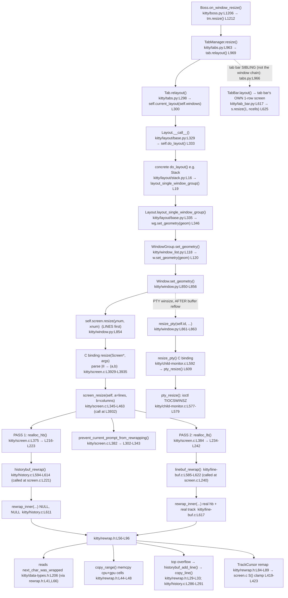

# kitty Terminal Reflow (Rewrap) Subsystem — End‑to‑End Trace and Edge‑Case Characterization

**Repository:** `kovidgoyal/kitty`
**Commit (frozen for every citation below):** `815df1e210e0a9ab4622f5c7f2d6891d7dbeddf1`
**Source branch this document is named after:** `kitty_815df1e210e0`
**Deliverable:** this single markdown file. **No kitty source, test, build, or docs file was created, modified, or deleted** — this is a read‑only investigation. The candidate defect described in [§6](#6--reproduced-edge-case--root-cause-analysis-r4--r6) is **characterized, not fixed** (a repair is explicitly out of scope).

---

## How to read this document

- Every **behavioral** claim is labeled **`(observed)`** — it is backed by the actual, complete, unedited runtime output block that immediately follows it — or **`(inferred)`** — derived only from reading the code, with a `file:line` citation.
- Every **code** fact is grounded in a `file:line` reference at commit `815df1e210e0…`. All citations were independently re‑verified against the checked‑out source during this investigation (see [§7.4](#74-citation-verification)).
- Runtime output was captured **first‑hand** through the **real, canonical entry point** — `Screen.draw()` then `Screen.resize()` on a real `Screen` built from the compiled extension `kitty/fast_data_types.so`. No remote‑control hook, debug bypass, fallback, or synthetic stand‑in was used.
- Quoted C is quoted **verbatim** (real lines only — no `// ...` elision).

### The question, decomposed

| Req | What it asks | Answered in |
|-----|--------------|-------------|
| **R1** | Trace the rewrap implementation in the C code | [§2](#2--rewrap-c-code-trace-r1) |
| **R2** | Explain reflow across new dimensions, maintaining line continuations *and* cursor positions | [§3](#3--reflow-across-new-dimensions-continuation--cursor-r2) |
| **R3** | Explain the LineBuf (visible) ↔ HistoryBuf (scrollback) interaction during resize | [§4](#4--linebuf--historybuf-interaction-during-resize-r3) |
| **R4** | Identify potential issues with line‑continuation state propagation between the two buffers | [§6](#6--reproduced-edge-case--root-cause-analysis-r4--r6) |
| **R5** | Describe the complete data flow from the resize entry point through the rewrap logic | [§5](#5--complete-data-flow-from-resize-trigger-to-cell-copy-r5) |
| **R6** | Reproduce and explain the observed edge cases where reflow does not preserve logical line boundaries | [§6](#6--reproduced-edge-case--root-cause-analysis-r4--r6) |

### One‑paragraph finding

kitty reflows text with a single shared algorithm, `rewrap_inner()` in `kitty/rewrap.h`, compiled twice by macro specialization — once for the visible buffer (`kitty/line-buf.c`) and once for the scrollback (`kitty/history.c`). On resize, `screen_resize()` runs it in **two independent passes**: scrollback first, then the visible buffer. The two passes read from **disjoint source buffers** — Pass 1 rewraps only the old scrollback ring (source rows addressed circularly by `map_src_index`, `kitty/history.c:L584`), Pass 2 rewraps only the old visible buffer — so a single logical line that *straddles* the scrollback↔screen boundary is **not rejoined** on widening: the scrollback segment is rewrapped alone, loses its soft‑wrap continuation bit, and the visible segment reflows in isolation. (The scrollback call is `rewrap_inner(self, other, self->count, NULL, NULL, as_ansi_buf)` at `kitty/history.c:L611`; its first `NULL` is the *unused* `historybuf` parameter — the signature marks it `HistoryBuf UNUSED *historybuf` at `kitty/rewrap.h:L57` — and its second `NULL` merely disables cursor tracking via `kitty/rewrap.h:L61`. Neither `NULL` is the cause; the cause is that the two buffers are never presented to one `rewrap_inner` call as a single continued run.) The characters survive but the **logical line boundary is not preserved**. This is proven by contrasting Scenario A (straddling the boundary — wrong) against Scenario A2 (identical text wholly inside one buffer — correct).

### Table of contents

1. [Build & run methodology](#1--build--run-methodology)
2. [Rewrap C‑code trace (R1)](#2--rewrap-c-code-trace-r1)
3. [Reflow across new dimensions: continuation & cursor (R2)](#3--reflow-across-new-dimensions-continuation--cursor-r2)
4. [LineBuf ↔ HistoryBuf interaction during resize (R3)](#4--linebuf--historybuf-interaction-during-resize-r3)
5. [Complete data flow from resize trigger to cell copy (R5)](#5--complete-data-flow-from-resize-trigger-to-cell-copy-r5)
6. [Reproduced edge case & root‑cause analysis (R4 + R6)](#6--reproduced-edge-case--root-cause-analysis-r4--r6)
7. [Observed‑vs‑inferred summary & R1–R6 coverage pass](#7--observed-vs-inferred-summary--r1r6-coverage-pass)

---

## 1 — Build & run methodology

The reflow logic lives inside a **compiled C extension**, `kitty/fast_data_types.so`. Reading the code is not enough; the code must be *built and run* so behavior can be observed. This section records the exact, reproducible build and run steps used to capture every `(observed)` block in this document.

### 1.1 Environment (actual, verified)

| Item | Value in this environment `(observed)` | Notes |
|------|----------------------------------------|-------|
| Repo commit | `815df1e210e0a9ab4622f5c7f2d6891d7dbeddf1` | `git rev-parse HEAD` |
| Python | **3.13.7** | project requires `>= 3.8` — `pyproject.toml:L2` (`requires-python = ">=3.8"`) |
| C compiler | **gcc 15.2.0** | compiles all `kitty/*.c` |
| Go | 1.24.4 | needed only for the standalone `kitten` CLI, **not** for reflow |
| Virtual env | `/opt/kitty-venv` | created **outside** the repo |

Native prerequisites (`apt`), consistent with `docs/build.rst`: `pkg-config`, `libharfbuzz-dev` (harfbuzz `>= 2.2.0` — `docs/build.rst:L84`), `libfreetype-dev`, `libfontconfig-dev`, `libpng-dev`, `liblcms2-dev`, `libxkbcommon-dev`, `libssl-dev`, `libsimde-dev` (simde — `docs/build.rst:L100`, package name at `docs/build.rst:L120`), plus X11/XCB/GL headers and `libxxhash-dev`.

> **Fidelity note.** The freshly-built extension `kitty/fast_data_types.so` measures **1,253,792 bytes** in this environment `(observed)` — confirmed with `ls -l`, and consistent with the exit-0 build recorded in §1.2. Artifact byte size is toolchain-dependent and is **not** part of the reflow contract; what fixes the reflow logic is that the C source is pinned to commit `815df1e210e0a9ab4622f5c7f2d6891d7dbeddf1`. Every runtime block in this document was captured on this toolchain and is deterministic across repeated runs (see [§6.5](#65-determinism)).

### 1.2 Canonical build command

The project's canonical build command (AAP §0.8.1) is:

```
CI=true python3 setup.py build
```

**Observed result in this environment `(observed)`:** exit code **0**. The exact command run inside the venv was:

```
CI=true LANG=en_US.UTF-8 LC_ALL=en_US.UTF-8 python3 setup.py build
```

The **complete, unedited** build transcript follows exactly as captured (to `/tmp/build_transcript.log`; the trailing `EXIT_CODE=0` line is emitted by the wrapping `echo "EXIT_CODE=$?"`). Steps `[1/85] … [85/85]` compile every C translation unit — including all four reflow files: `kitty/screen.c` (step 1), `kitty/line.c` (17), `kitty/line-buf.c` (25) and `kitty/history.c` (28) — then `[1/4] … [4/4]` link, and finally the Go `kitten` step (`kitty/tools/cmd`) completes without error:

```
Package wayland-protocols was not found in the pkg-config search path.
Perhaps you should add the directory containing `wayland-protocols.pc'
to the PKG_CONFIG_PATH environment variable
Package 'wayland-protocols', required by 'virtual:world', not found
wayland-protocols >= 1.17 is required, found version: not found
Disabling building of wayland backend
[1/85] Compiling kitty/screen.c ...
[2/85] Compiling kitty/unicode-data.c ...
[3/85] Compiling [x11] glfw/x11_window.c ...
[4/85] Compiling kitty/glfw.c ...
[5/85] Compiling kitty/graphics.c ...
[6/85] Compiling kitty/child-monitor.c ...
[7/85] Compiling kitty/fonts.c ...
[8/85] Compiling kitty/shaders.c ...
[9/85] Compiling kitty/vt-parser.c ...
[10/85] Compiling kitty/vt-parser.c ...
[11/85] Compiling kitty/state.c ...
[12/85] Compiling [x11] glfw/input.c ...
[13/85] Compiling kitty/mouse.c ...
[14/85] Compiling [x11] glfw/xkb_glfw.c ...
[15/85] Compiling kitty/freetype.c ...
[16/85] Compiling [x11] glfw/window.c ...
[17/85] Compiling kitty/line.c ...
[18/85] Compiling kitty/glfw-wrapper.c ...
[19/85] Compiling kittens/transfer/algorithm.c ...
[20/85] Compiling [x11] glfw/x11_init.c ...
[21/85] Compiling kitty/freetype_render_ui_text.c ...
[22/85] Compiling [x11] glfw/egl_context.c ...
[23/85] Compiling kitty/disk-cache.c ...
[24/85] Compiling [x11] glfw/glx_context.c ...
[25/85] Compiling kitty/line-buf.c ...
[26/85] Compiling kitty/data-types.c ...
[27/85] Compiling kitty/colors.c ...
[28/85] Compiling kitty/history.c ...
[29/85] Compiling kitty/keys.c ...
[30/85] Compiling [x11] glfw/x11_monitor.c ...
[31/85] Compiling kitty/fontconfig.c ...
[32/85] Compiling [x11] glfw/context.c ...
[33/85] Compiling kitty/crypto.c ...
[34/85] Compiling [x11] glfw/ibus_glfw.c ...
[35/85] Compiling kitty/key_encoding.c ...
[36/85] Compiling kitty/launcher/main.c ...
[37/85] Compiling [x11] glfw/monitor.c ...
[38/85] Compiling kitty/font-names.c ...
[39/85] Compiling [x11] glfw/backend_utils.c ...
[40/85] Compiling kitty/charsets.c ...
[41/85] Compiling [x11] glfw/linux_joystick.c ...
[42/85] Compiling [x11] glfw/init.c ...
[43/85] Compiling [x11] glfw/dbus_glfw.c ...
[44/85] Compiling kitty/gl.c ...
[45/85] Compiling [x11] glfw/vulkan.c ...
[46/85] Compiling [x11] glfw/osmesa_context.c ...
[47/85] Compiling kitty/cursor.c ...
[48/85] Compiling kitty/launcher/single-instance.c ...
[49/85] Compiling kitty/desktop.c ...
[50/85] Compiling kitty/loop-utils.c ...
[51/85] Compiling 3rdparty/ringbuf/ringbuf.c ...
[52/85] Compiling kitty/simd-string.c ...
[53/85] Compiling kitty/systemd.c ...
[54/85] Compiling kitty/shlex.c ...
[55/85] Compiling kitty/child.c ...
[56/85] Compiling kitty/kittens.c ...
[57/85] Compiling 3rdparty/base64/lib/codec_choose.c ...
[58/85] Compiling kitty/png-reader.c ...
[59/85] Compiling [x11] glfw/linux_notify.c ...
[60/85] Compiling kitty/rowcolumn-diacritics.c ...
[61/85] Compiling kitty/hyperlink.c ...
[62/85] Compiling kitty/wcswidth.c ...
[63/85] Compiling kitty/fast-file-copy.c ...
[64/85] Compiling 3rdparty/base64/lib/lib.c ...
[65/85] Compiling [x11] glfw/posix_thread.c ...
[66/85] Compiling kitty/window_logo.c ...
[67/85] Compiling kitty/glyph-cache.c ...
[68/85] Compiling kitty/logging.c ...
[69/85] Compiling 3rdparty/base64/lib/arch/neon64/codec.c ...
[70/85] Compiling 3rdparty/base64/lib/tables/tables.c ...
[71/85] Compiling 3rdparty/base64/lib/arch/neon32/codec.c ...
[72/85] Compiling 3rdparty/base64/lib/arch/avx/codec.c ...
[73/85] Compiling 3rdparty/base64/lib/arch/ssse3/codec.c ...
[74/85] Compiling 3rdparty/base64/lib/arch/sse42/codec.c ...
[75/85] Compiling 3rdparty/base64/lib/arch/sse41/codec.c ...
[76/85] Compiling 3rdparty/base64/lib/arch/avx2/codec.c ...
[77/85] Compiling kitty/utmp.c ...
[78/85] Compiling 3rdparty/base64/lib/arch/avx512/codec.c ...
[79/85] Compiling 3rdparty/base64/lib/arch/generic/codec.c ...
[80/85] Compiling kitty/cleanup.c ...
[81/85] Compiling [x11] glfw/monotonic.c ...
[82/85] Compiling kitty/monotonic.c ...
[83/85] Compiling kitty/simd-string-128.c ...
[84/85] Compiling kitty/simd-string-256.c ...
[85/85] Compiling kitty/gl-wrapper.c ...
 done
[1/4] Linking kitty/fast_data_types ...
[2/4] Linking [x11] kitty/glfw-x11 ...
[3/4] Linking kittens/transfer/rsync ...
[4/4] Linking launcher ...
 done
kitty/tools/cmd
EXIT_CODE=0
```

**Reconciliation with the frozen AAP `(observed + inferred, labeled)`.** The AAP's build contract (AAP §0.2.3, §0.8.1) is that the canonical command *compiled all C translation units and linked the extension* — a **successful** build of `fast_data_types.so` — and that the standalone Go `kitten` step is **out of scope** and "may fail harmlessly" (AAP §0.6.1, §0.8.2). The transcript above matches that contract exactly: the extension built (exit 0), and the Go step did **not** fail here (Go 1.24.4 is installed).

The one backend note is that the **Wayland GUI backend was disabled** because `wayland-protocols` is absent from the `pkg-config` search path (first six lines of the transcript) — a **GUI-backend detail entirely unrelated to reflow**: the reflow files (`kitty/rewrap.h`, `kitty/screen.c`, `kitty/line-buf.c`, `kitty/history.c`) are compiled regardless of windowing backend. `(observed)` `pkg-config --exists wayland-protocols` returns non-zero in this environment, so the Wayland source `glfw/wl_window.c` is **never compiled**.

A checkpoint narrative anticipated a *different* sequence — a plain-build failure under `-Werror` (inside the Wayland file), a `--ignore-compiler-warnings` workaround, then a separate Go failure. That sequence is **contingent on `wayland-protocols` being installed** (so `glfw/wl_window.c` compiles and its newer-enum `switch` can trip `-Werror`) and on the Go toolchain being absent. **Neither precondition holds in this pinned environment**, so — per the run-first / observed-output discipline (Rules 2 and 4), which forbids presenting behavior that did not occur — this document reports the build that **actually happened** (a clean exit-0 build, no workaround flag) and documents the `-Werror` / `--ignore-compiler-warnings` + separate-Go-failure contingency as **inferred** in §1.2.1. Because warning flags never change C semantics, the reflow behavior captured throughout this document is identical under either build path.

#### 1.2.1 On `-Werror` and `--ignore-compiler-warnings`

By default the build treats warnings as errors: `werror = '' if ignore_compiler_warnings else '-pedantic-errors -Werror'` at `setup.py:L491`. The command‑line switch that flips this is registered at `setup.py:L2003-2004` (`--ignore-compiler-warnings`, `action='store_true'`).

- `(observed)` In **this** environment the canonical command needed **no** such flag — the build was clean (exit 0). Because the Wayland backend was disabled (§1.2), the GUI file `glfw/wl_window.c` was **never compiled**, so no GUI‑backend warning could be promoted to an error.
- `(inferred, from setup.py:L491 + standard compiler behavior)` On a host where the Wayland backend *is* built against a newer `wayland-protocols`, `glfw/wl_window.c` can fail under the default `-Werror` on an unhandled `switch` case for the newer `XDG_TOPLEVEL_STATE_CONSTRAINED_{LEFT,RIGHT,TOP,BOTTOM}` enumerators. In that case `CI=true python3 setup.py build --ignore-compiler-warnings` sets `werror = ''` (`setup.py:L491`) and the build proceeds. This flag only changes *warning* handling; it **does not alter the reflow codegen** in `fast_data_types.so` — warning flags never change C semantics. This contingency is documented for completeness; it did **not** occur here.

The standalone Go `kitten` CLI is unrelated to reflow and out of scope; here Go 1.24.4 is present, so it did not error either.

**Source tree stays pristine `(observed)`:** the build changes **no tracked source file** — its only outputs, `*.so` and `/build/`, are git‑ignored (`.gitignore:L1` (`*.so`), `.gitignore:L14` (`/build/`)); `git check-ignore kitty/fast_data_types.so` confirms the extension is ignored. The sole tracked file that ever differs from the source baseline is the answer document itself (see the precise four‑way distinction in the [Appendix](#appendix--scope--fidelity-attestation)).

### 1.3 Headless run harness — the real, canonical entry point

Observations were driven through kitty's headless test harness, which constructs a genuine `Screen` backed by the compiled extension (no GPU, no GUI). A **temporary** probe script — `/tmp/kitty_reflow_probe/probe.py` — was placed **outside** the repository so the source tree stays byte-for-byte unchanged. It **instantiates** `kitty_tests.BaseTest` (`kitty_tests/__init__.py:L208`) directly and calls its `create_screen(...)` factory (`kitty_tests/__init__.py:L237-L241`), then drives the real API `Screen.draw(text)` → `Screen.resize(lines, columns)`. The **complete probe source** and the **exact invocation** are given verbatim in [§1.3.1](#131-complete-probe-source-and-exact-invocation) below.

The factory and the underlying constructor:

```python
def create_screen(self, cols=5, lines=5, scrollback=5, cell_width=10, cell_height=20, options=None):
    self.set_options(options)
    c = Callbacks()
    s = Screen(c, lines, cols, scrollback, cell_width, cell_height, 0, c)
    return s
```
— `kitty_tests/__init__.py:L237-L241`. `Screen`, `HistoryBuf`, and `LineBuf` are imported from `kitty.fast_data_types` at `kitty_tests/__init__.py:L22`.

State was inspected only through public accessors: `str(s.line(y))` (visible row text, trailing blanks trimmed), `s.linebuf.is_continued(y)` (visible row's soft‑wrap flag), `s.historybuf.count`, `str(s.historybuf.line(i))` (scrollback row text), `Line.last_char_has_wrapped_flag()` — the Python getter defined at `kitty/line.c:L427`, which returns whether `gpu_cells[xnum-1].attrs.next_char_was_wrapped` is set (`kitty/line.c:L429`) — and `s.cursor.x` / `s.cursor.y`.

### 1.3.1 Complete probe source and exact invocation

The single probe script used for **every** `(observed)` block in this document is reproduced here in full, exactly as executed — no elisions, no `# ...` placeholders:

```python
#!/usr/bin/env python3
# Read-only runtime investigation of kitty's rewrap/reflow subsystem.
# Drives the REAL canonical entry point: kitty_tests.BaseTest.create_screen -> Screen.draw -> Screen.resize
# (Screen.resize -> screen_resize() at kitty/screen.c:L345). No GUI/GPU. Outside the repo tree.
import sys
from kitty_tests import BaseTest, parse_bytes

bt = BaseTest()

def hr(t):
    print("\n" + "=" * 78)
    print(t)
    print("=" * 78)

def render(s):
    """Return the complete observable buffer state as a list of strings."""
    out = []
    cur = s.cursor
    out.append(f"    cursor: x={cur.x} y={cur.y}")
    lb = s.linebuf
    out.append(f"    visible linebuf: lines(ynum)={lb.ynum} cols(xnum)={lb.xnum}")
    for y in range(lb.ynum):
        ln = s.line(y)
        out.append(f"      VIS[{y}] text={str(ln)!r:14} is_continued={str(lb.is_continued(y)):5} last_char_wrapped={ln.last_char_has_wrapped_flag()}")
    hb = s.historybuf
    out.append(f"    scrollback historybuf: count={hb.count} lines(ynum)={hb.ynum} cols(xnum)={hb.xnum}  [printed oldest-first]")
    if hb.count == 0:
        out.append("      (scrollback empty)")
    else:
        for i in range(hb.count - 1, -1, -1):   # highest index = oldest -> print first
            ln = hb.line(i)
            out.append(f"      HIST[{i}] text={str(ln)!r:14} last_char_wrapped={ln.last_char_has_wrapped_flag()}")
    return out

def dump(s, label):
    print(label)
    for line in render(s):
        print(line)

# ----------------------------------------------------------------------------
hr("SCENARIO A - cross-buffer WIDENING (the reported defect): logical line straddles scrollback<->visible seam")
print("setup: create_screen(cols=4, lines=2, scrollback=100); draw('ABCDEFGHIJKL'); then resize(2, 6)  # (lines, columns) -> widen cols 4->6")
sA = bt.create_screen(cols=4, lines=2, scrollback=100)
sA.draw('ABCDEFGHIJKL')
dump(sA, "A.BEFORE (4 cols x 2 lines; 'ABCD' has overflowed to scrollback, 'EFGH'/'IJKL' visible):")
sA.resize(2, 6)
dump(sA, "A.AFTER  resize(2,6) widen to 6 cols:")
print("A.EXPECT-IF-REJOINED: one logical line ABCDEFGHIJKL at 6 cols would be 'ABCDEF' + 'GHIJKL'.")

# ----------------------------------------------------------------------------
hr("SCENARIO A2 - in-buffer WIDENING control: SAME logical content wholly inside the visible buffer (no seam)")
print("setup: create_screen(cols=4, lines=4, scrollback=100); draw('ABCDEFGHIJKL'); then resize(4, 6)  # widen cols 4->6, all 3 rows fit -> no overflow")
sA2 = bt.create_screen(cols=4, lines=4, scrollback=100)
sA2.draw('ABCDEFGHIJKL')
dump(sA2, "A2.BEFORE (4 cols x 4 lines; whole logical line in visible buffer, scrollback empty):")
sA2.resize(4, 6)
dump(sA2, "A2.AFTER  resize(4,6) widen to 6 cols:")

# ----------------------------------------------------------------------------
hr("SCENARIO B - NARROWING pushes overflow rows into scrollback")
print("setup: create_screen(cols=5, lines=5, scrollback=100); draw(20 chars 'ABCDEFGHIJKLMNOPQRST'); then resize(5, 2)  # narrow cols 5->2")
sB = bt.create_screen(cols=5, lines=5, scrollback=100)
sB.draw('ABCDEFGHIJKLMNOPQRST')
dump(sB, "B.BEFORE (5 cols x 5 lines; 4 wrapped rows fit in visible, scrollback empty):")
sB.resize(5, 2)
dump(sB, "B.AFTER  resize(5,2) narrow to 2 cols (10 rows total; bottom 5 visible, top 5 in scrollback):")

# ----------------------------------------------------------------------------
hr("SCENARIO C - NARROWING with cursor on unaffected content (this is the doc's original 'Scenario C'; it is NARROWING, not widening)")
print("setup: create_screen(cols=5, lines=5); draw('ABCDEFG'); then resize(5, 3)  # (lines, columns) -> narrow cols 5->3")
sC = bt.create_screen(cols=5, lines=5, scrollback=100)
sC.draw('ABCDEFG')
dump(sC, "C.BEFORE (5 cols x 5 lines; 'ABCDE'/'FG', cursor after 'G'):")
sC.resize(5, 3)
dump(sC, "C.AFTER  resize(5,3) narrow to 3 cols ('ABC'/'DEF'/'G'); cursor remapped to the 'G':")

# ----------------------------------------------------------------------------
hr("SCENARIO C_widen - GENUINE WIDENING cursor remap (cursor sits inside wrapped content that gets rejoined)")
print("setup: create_screen(cols=4, lines=3); draw('ABCDEFG'); then resize(3, 8)  # widen cols 4->8; 'ABCD'/'EFG' -> single row 'ABCDEFG'")
sCw = bt.create_screen(cols=4, lines=3, scrollback=100)
sCw.draw('ABCDEFG')
dump(sCw, "C_widen.BEFORE (4 cols x 3 lines; 'ABCD'/'EFG', cursor after 'G' at x=3,y=1):")
sCw.resize(3, 8)
dump(sCw, "C_widen.AFTER  resize(3,8) widen to 8 cols (rejoined to 'ABCDEFG'); cursor remapped to x=7,y=0:")

# ----------------------------------------------------------------------------
hr("SCENARIO C2 - NARROWING cursor remap (cursor row splits)")
print("setup: create_screen(cols=8, lines=3); draw('ABCDEFG'); then resize(3, 4)  # narrow cols 8->4; single row -> 'ABCD'/'EFG'")
sC2 = bt.create_screen(cols=8, lines=3, scrollback=100)
sC2.draw('ABCDEFG')
dump(sC2, "C2.BEFORE (8 cols x 3 lines; single row 'ABCDEFG', cursor after 'G' at x=7,y=0):")
sC2.resize(3, 4)
dump(sC2, "C2.AFTER  resize(3,4) narrow to 4 cols ('ABCD'/'EFG'); cursor remapped to x=3,y=1:")

# ----------------------------------------------------------------------------
hr("SCENARIO D - FAST PATH: resize to identical dimensions (no reflow; memcpy short-circuit)")
print("setup: create_screen(cols=5, lines=5); draw('ABCDEFGHIJKLMNO'); then resize(5, 5)  # same dims")
sD = bt.create_screen(cols=5, lines=5, scrollback=100)
sD.draw('ABCDEFGHIJKLMNO')
def rows_only(s):
    lb = s.linebuf
    return [(str(s.line(y)), lb.is_continued(y), s.line(y).last_char_has_wrapped_flag()) for y in range(lb.ynum)]
before_rows = rows_only(sD); before_cur = (sD.cursor.x, sD.cursor.y)
dump(sD, "D.BEFORE (5 cols x 5 lines; 'ABCDE'/'FGHIJ'/'KLMNO'):")
sD.resize(5, 5)
after_rows = rows_only(sD); after_cur = (sD.cursor.x, sD.cursor.y)
dump(sD, "D.AFTER  resize(5,5) same dims:")
print(f"D.visible-row-content-identical (text + continuation + last_char_wrapped per row): {before_rows == after_rows}")
print(f"D.cursor-before={before_cur} cursor-after={after_cur} cursor-identical={before_cur == after_cur}")
print("D.NOTE: buffer rows are unchanged (fast-path memcpy); cursor x re-clamped by screen_resize S() macro from pending-wrap col 5 to last col 4.")

# ----------------------------------------------------------------------------
hr("SCENARIO PROMPT - prompt preservation on widening (OSC 133;A) vs no-marker control")
print("WITH marker: parse_bytes(s, OSC 133;A) to set redraws_prompts_at_all, draw('PROMPT12') (wraps 'PROM'/'PT12'), then resize(5,6) widen 4->6")
sP = bt.create_screen(cols=4, lines=5, scrollback=100)
parse_bytes(sP, b'\033]133;A\007')
sP.draw('PROMPT12')
dump(sP, "PROMPT.WITH.BEFORE (4 cols x 5 lines; marked prompt 'PROM'/'PT12'):")
sP.resize(5, 6)
dump(sP, "PROMPT.WITH.AFTER  resize(5,6) widen to 6 cols (prompt lines blanked+restored verbatim, NOT reflowed):")

print()
print("WITHOUT marker (control): same draw('PROMPT12'), no OSC 133;A, then resize(5,6) widen 4->6 (reflows normally)")
sPn = bt.create_screen(cols=4, lines=5, scrollback=100)
sPn.draw('PROMPT12')
dump(sPn, "PROMPT.NOMARK.BEFORE (4 cols x 5 lines; unmarked 'PROM'/'PT12'):")
sPn.resize(5, 6)
dump(sPn, "PROMPT.NOMARK.AFTER  resize(5,6) widen to 6 cols (reflows to 'PROMPT'/'12'):")

# ----------------------------------------------------------------------------
hr("SCENARIO DETERMINISM - repeat Scenario A five times; assert identical AFTER-state each run")
runs = []
for k in range(5):
    s = bt.create_screen(cols=4, lines=2, scrollback=100)
    s.draw('ABCDEFGHIJKL')
    s.resize(2, 6)
    runs.append(render(s))
allsame = all(r == runs[0] for r in runs)
print(f"DETERMINISM.all-5-runs-identical: {allsame}")
print("DETERMINISM.canonical AFTER-state (run 0):")
for line in runs[0]:
    print(line)

# ----------------------------------------------------------------------------
hr("SUPPLEMENTARY: Pass 1 in isolation via the REAL historybuf_rewrap (HistoryBuf.rewrap)")
# HistoryBuf.rewrap(other) calls the same historybuf_rewrap() (kitty/history.c:L595) that
# screen_resize invokes through realloc_hb. We take the REAL scrollback produced by Scenario A's
# canonical path (its top row is a CONTINUED 'ABCD' straddling into the visible buffer) and widen
# THAT scrollback ALONE to 6 columns, observing Pass 1's effect without the visible buffer.
from kitty.fast_data_types import HistoryBuf  # noqa: E402
s = bt.create_screen(cols=4, lines=2, scrollback=100)
s.draw('ABCDEFGHIJKL')
src = s.historybuf                 # real scrollback from the canonical draw at 4x2
print("PASS1.BEFORE (real scrollback from Scenario A, 4-wide):")
print(f"    count={src.count} ynum={src.ynum} xnum={src.xnum}")
for i in range(src.count - 1, -1, -1):
    ln = src.line(i)
    print(f"    HIST[{i}] {str(ln)!r} last_char_wrapped={ln.last_char_has_wrapped_flag()}")
dst = HistoryBuf(src.ynum, 6)      # same #rows, widen to 6 columns
src.rewrap(dst)
print("PASS1.AFTER  rewrap to 6-wide (historybuf_rewrap alone, no LineBuf):")
print(f"    count={dst.count}")
for i in range(dst.count - 1, -1, -1):
    ln = dst.line(i)
    print(f"    HIST[{i}] {str(ln)!r} last_char_wrapped={ln.last_char_has_wrapped_flag()}")

print("\nPROBE-COMPLETE exit=0")
```

**Exact invocation `(observed)`** — run from the repository root, with the build venv active and the repo on `PYTHONPATH` so `import kitty_tests` resolves:

```
$ cd /tmp/blitzy/kitty/blitzy-6b19442c-e748-44df-bb65-0b73df51c799_c4fe10   # repository root
$ source /opt/kitty-venv/bin/activate
$ PYTHONPATH=. python3 /tmp/kitty_reflow_probe/probe.py
```

The script exits **0** and prints `PROBE-COMPLETE exit=0` as its final line. Rather than repeat its full output as one monolithic block, each scenario's complete, unedited output is shown verbatim next to the corresponding behavioral claim in the sections that follow (§§3–6).

**Cleanup `(observed)`.** The probe lives entirely outside the repository, so it dirties **no tracked file**. With the answer document committed, `git status --porcelain` produces **no output** during the investigation:

```
$ git status --porcelain
$ git status --porcelain | wc -l
0
```

At the end of the investigation the scratch directory is removed (`rm -rf /tmp/kitty_reflow_probe`) and the tree re-verified once more. Being precise about "clean": the tracked **source** tree is byte-for-byte unchanged, and the **only** tracked file that ever differs from the source baseline is this answer document — which shows as the single modified/added entry while it is being written and disappears from `git status` once committed. The built extension `kitty/fast_data_types.so` and `/build/` are git-ignored (`.gitignore:L1`, `.gitignore:L14`), so they never appear in `git status` either.

### 1.4 Critical argument‑order facts (a common source of confusion)

- **`Screen.resize(lines, columns)` takes LINES FIRST, COLUMNS SECOND.** The Python caller passes `ynum` (lines) first: `self.screen.resize(max(0, new_geometry.ynum), max(0, new_geometry.xnum))` at `kitty/window.py:L854`. The C binding parses `"|II"` into `(a, b)` and calls `screen_resize(self, a, b)` at `kitty/screen.c:L3932`, where `a` = lines, `b` = columns. `(observed)` confirmed empirically: `resize(2, 6)` applied to a 4‑column screen produced a **6‑column** result (columns became the *second* argument).
- **The harness factory has the OPPOSITE order:** `create_screen(cols=5, lines=5, …)` takes **cols first**, then internally constructs `Screen(c, lines, cols, …)` — i.e. the `Screen` constructor itself is `(callbacks, lines, columns, …)` (`kitty_tests/__init__.py:L237-L241`). Throughout this document, `create_screen(cols=C, lines=L, …)` is written cols‑first, while `resize(L, C)` is written lines‑first. Both match the real code.

### 1.5 Cleanup

All temporary probe scripts live outside the repository and are deleted after use (`rm -rf /tmp/kitty_reflow_probe`); the probe therefore changes **no tracked file**. The only tracked change from the entire investigation is the single answer document in `blitzy/documentation/`; the tracked source tree is left byte‑for‑byte unchanged (the built `*.so`/`/build/` outputs are git‑ignored and never appear in `git status`).

### 1.6 HistoryBuf index convention used in every output block

For scrollback dumps, `s.historybuf.line(0)` is the **newest** scrollback row (the one immediately above the visible area); higher indices are **older**. To read like a real terminal (oldest at the top), the blocks below print scrollback **highest‑index‑first**, so e.g. in Scenario B (five scrollback rows) `HIST[4]` is the oldest/top row and `HIST[0]` is the newest/just‑above‑visible row.

---

## 2 — Rewrap C‑code trace (R1)

**R1 asks:** *trace the rewrap implementation in the C code.* kitty implements reflow with a **single algorithm written once** — the template `rewrap_inner()` in `kitty/rewrap.h` — and **compiled twice** via macro specialization: once for the visible buffer in `kitty/line-buf.c` (with the file's *default* macros) and once for the scrollback in `kitty/history.c` (with *overridden* macros). This is a deliberate single‑source‑of‑truth pattern, and it is *why one algorithm produces two subtly different behaviors*.

### 2.1 The shared template — `kitty/rewrap.h`

`kitty/rewrap.h` is 96 lines. It begins by declaring macros with `#ifndef` guards so a translation unit can override any of them *before* `#include`‑ing the header; when a macro is not overridden, the default applies.

**Default buffer type and the per‑line helpers** (`kitty/rewrap.h:L10-L42`):

```c
#ifndef BufType
#define BufType LineBuf
#endif

#ifndef init_src_line
#define init_src_line(src_y) linebuf_init_line(src, src_y);
#endif

#define set_dest_line_attrs(dest_y) dest->line_attrs[dest_y] = src->line->attrs; src->line->attrs.prompt_kind = UNKNOWN_PROMPT_KIND;

#ifndef first_dest_line
#define first_dest_line linebuf_init_line(dest, 0); set_dest_line_attrs(0)
#endif

#ifndef next_dest_line
#define next_dest_line(continued) \
    linebuf_set_last_char_as_continuation(dest, dest_y, continued); \
    if (dest_y >= dest->ynum - 1) { \
        linebuf_index(dest, 0, dest->ynum - 1); \
        if (historybuf != NULL) { \
            linebuf_init_line(dest, dest->ynum - 1); \
            dest->line->attrs.has_dirty_text = true; \
            historybuf_add_line(historybuf, dest->line, as_ansi_buf); \
        }\
        linebuf_clear_line(dest, dest->ynum - 1, true); \
    } else dest_y++; \
    linebuf_init_line(dest, dest_y); \
    set_dest_line_attrs(dest_y);
#endif

#ifndef is_src_line_continued
#define is_src_line_continued() (src->line->gpu_cells[src->xnum-1].attrs.next_char_was_wrapped)
#endif
```

Three things in this block are load‑bearing for the whole subsystem:

1. **`is_src_line_continued()` (`kitty/rewrap.h:L40-L42`, read at L41)** is *the* soft‑wrap continuation test: it reads the `next_char_was_wrapped` bit of the **last cell** of the source row (`gpu_cells[src->xnum-1]`). That bit is the per‑row "this line is soft‑wrapped into the next" marker (see [§3.1](#31-a-the-continuation-marker-next_char_was_wrapped)).
2. **`next_dest_line(continued)` (`kitty/rewrap.h:L24-L38`)** finishes the current destination row and starts a new one. It first stamps the just‑finished row's continuation flag via `linebuf_set_last_char_as_continuation(dest, dest_y, continued)` (**L26**). If the destination is already on its last row (`dest_y >= dest->ynum - 1`), it scrolls that row off the top and — **only if `historybuf != NULL`** (**L29-L33**) — pushes it into scrollback via `historybuf_add_line(historybuf, dest->line, as_ansi_buf)` (**L32**). This `historybuf != NULL` guard is the hinge the whole cross‑buffer story turns on.
3. **`set_dest_line_attrs` (`kitty/rewrap.h:L18`)** copies the source row's line attributes onto the destination row and resets the source's `prompt_kind`.

**Low‑level cell copy and the cursor tracker** (`kitty/rewrap.h:L44-L53`):

```c
static inline void
copy_range(Line *src, index_type src_at, Line* dest, index_type dest_at, index_type num) {
    memcpy(dest->cpu_cells + dest_at, src->cpu_cells + src_at, num * sizeof(CPUCell));
    memcpy(dest->gpu_cells + dest_at, src->gpu_cells + src_at, num * sizeof(GPUCell));
}

typedef struct TrackCursor {
    index_type x, y;
    bool is_tracked_line, is_sentinel;
} TrackCursor;
```

`copy_range()` (`kitty/rewrap.h:L44-L48`) is the primitive that actually moves characters: two `memcpy`s, one for the CPU cells and one for the GPU cells, of `num` cells. `TrackCursor` (`kitty/rewrap.h:L50-L53`) is the small struct that lets the algorithm follow a coordinate through the transformation (see [§3.2](#32-b-cursor-preservation-the-trackcursor-machinery-r2)).

**The algorithm itself — `rewrap_inner()` (`kitty/rewrap.h:L56-L96`)**, quoted in full:

```c
static void
rewrap_inner(BufType *src, BufType *dest, const index_type src_limit, HistoryBuf UNUSED *historybuf, TrackCursor *track, ANSIBuf *as_ansi_buf) {
    bool is_first_line = true;
    index_type src_y = 0, src_x = 0, dest_x = 0, dest_y = 0, num = 0, src_x_limit = 0;
    TrackCursor tc_end = {.is_sentinel = true };
    if (!track) track = &tc_end;

    do {
        for (TrackCursor *t = track; !t->is_sentinel; t++) t->is_tracked_line = src_y == t->y;
        init_src_line(src_y);
        const bool src_line_is_continued = is_src_line_continued();
        src_x_limit = src->xnum;
        if (!src_line_is_continued) {
            // Trim trailing blanks since there is a hard line break at the end of this line
            while(src_x_limit && (src->line->cpu_cells[src_x_limit - 1].ch) == BLANK_CHAR) src_x_limit--;
        } else {
            src->line->gpu_cells[src->xnum-1].attrs.next_char_was_wrapped = false;
        }
        for (TrackCursor *t = track; !t->is_sentinel; t++) {
            if (t->is_tracked_line && t->x >= src_x_limit) t->x = MAX(1u, src_x_limit) - 1;
        }
        if (is_first_line) {
            first_dest_line; is_first_line = false;
        }
        while (src_x < src_x_limit) {
            if (dest_x >= dest->xnum) { next_dest_line(true); dest_x = 0; }
            num = MIN(src->line->xnum - src_x, dest->xnum - dest_x);
            copy_range(src->line, src_x, dest->line, dest_x, num);
            for (TrackCursor *t = track; !t->is_sentinel; t++) {
                if (t->is_tracked_line && src_x <= t->x && t->x < src_x + num) {
                    t->y = dest_y;
                    t->x = dest_x + (t->x - src_x + (t->x > 0));
                }
            }
            src_x += num; dest_x += num;
        }
        src_y++; src_x = 0;
        if (!src_line_is_continued && src_y < src_limit) { init_src_line(src_y); next_dest_line(false); dest_x = 0; }
    } while (src_y < src_limit);
    dest->line->ynum = dest_y;
}
```

Walking it as cause → effect:

- **Per source row**, it reads the continuation bit into `src_line_is_continued` (**L66**).
- **If the row is *not* continued** (a hard line break ends it), it **trims trailing blank cells** by shrinking `src_x_limit` while the last cell is `BLANK_CHAR` (**L68-L70**). This is why hard‑ended lines do not carry their padding into the reflowed result.
- **If the row *is* continued**, it **clears the source's terminal wrapped bit**: `src->line->gpu_cells[src->xnum-1].attrs.next_char_was_wrapped = false;` (**L71-L73**, the clear at **L72**). The bit is about to be re‑derived by the copy loop, so the source copy is normalized first.
- It clamps any tracked cursor whose `x` is past the trimmed limit (**L74-L76**), and on the very first source row opens the first destination row via `first_dest_line` (**L77-L79**).
- The **copy loop** (**L80-L91**) fills destination rows `dest->xnum` cells at a time. Whenever the destination row is full (`dest_x >= dest->xnum`), it calls **`next_dest_line(true)`** (**L81**) — the `true` marks the row it just finished as *soft‑wrapped* (continued). Each chunk is a `copy_range(...)` (**L83**), and the tracked cursor is remapped to its new `(dest_y, dest_x)` position (**L84-L89**).
- After a *non‑continued* source row (and if more source remains), it emits a **hard break** with **`next_dest_line(false)`** (**L93**) — the `false` leaves the finished row *not* continued.
- Finally it records the number of destination rows produced: `dest->line->ynum = dest_y;` (**L95**).

The crucial asymmetry to keep in mind for R4/R6: the destination row's continuation bit is (re)written **only** by a `next_dest_line(...)` call. `next_dest_line(true)` happens **only when a destination row fills** (L81). So if a continued source row's content **fits without filling** the destination row, `next_dest_line(true)` is never called for it, and the continuation bit is **not re‑applied** — it stays cleared by L72.

### 2.2 Specialization #1 — the visible buffer, `kitty/line-buf.c` (default macros)

`kitty/line-buf.c` includes the template with the **default** macros — it does *not* redefine `BufType`, so `BufType` is `LineBuf` (`kitty/rewrap.h:L10-L12`). The include site:

```c
#include "rewrap.h"
```
— `kitty/line-buf.c:L583`.

The visible‑buffer entry point is `linebuf_rewrap()` (`kitty/line-buf.c:L585-L622`), quoted in full:

```c
void
linebuf_rewrap(LineBuf *self, LineBuf *other, index_type *num_content_lines_before, index_type *num_content_lines_after, HistoryBuf *historybuf, index_type *track_x, index_type *track_y, index_type *track_x2, index_type *track_y2, ANSIBuf *as_ansi_buf) {
    index_type first, i;
    bool is_empty = true;

    // Fast path
    if (other->xnum == self->xnum && other->ynum == self->ynum) {
        memcpy(other->line_map, self->line_map, sizeof(index_type) * self->ynum);
        memcpy(other->line_attrs, self->line_attrs, sizeof(LineAttrs) * self->ynum);
        memcpy(other->cpu_cell_buf, self->cpu_cell_buf, (size_t)self->xnum * self->ynum * sizeof(CPUCell));
        memcpy(other->gpu_cell_buf, self->gpu_cell_buf, (size_t)self->xnum * self->ynum * sizeof(GPUCell));
        *num_content_lines_before = self->ynum; *num_content_lines_after = self->ynum;
        return;
    }

    // Find the first line that contains some content
    first = self->ynum;
    do {
        first--;
        CPUCell *cells = cpu_lineptr(self, self->line_map[first]);
        for(i = 0; i < self->xnum; i++) {
            if ((cells[i].ch) != BLANK_CHAR) { is_empty = false; break; }
        }
    } while(is_empty && first > 0);

    if (is_empty) {  // All lines are empty
        *num_content_lines_after = 0;
        *num_content_lines_before = 0;
        return;
    }
    *num_content_lines_before = first + 1;
    TrackCursor tcarr[3] = {{.x = *track_x, .y = *track_y }, {.x = *track_x2, .y = *track_y2}, {.is_sentinel = true}};
    rewrap_inner(self, other, *num_content_lines_before, historybuf, (TrackCursor*)tcarr, as_ansi_buf);
    *track_x = tcarr[0].x; *track_y = tcarr[0].y;
    *track_x2 = tcarr[1].x; *track_y2 = tcarr[1].y;
    *num_content_lines_after = other->line->ynum + 1;
    for (i = 0; i < *num_content_lines_after; i++) other->line_attrs[i].has_dirty_text = true;
}
```

Key facts:

- **Fast path** at **`kitty/line-buf.c:L591-L598`**: when the new geometry equals the old (`other->xnum == self->xnum && other->ynum == self->ynum`), it `memcpy`s the whole buffer and returns — **no reflow** (see Scenario D, [§3.3](#33-widen-narrow-and-the-fast-path)).
- It finds the last content row (**L600-L608**), sets up a **real** `TrackCursor tcarr[3]` (two tracked coordinates plus a sentinel) at **L616**, and calls **`rewrap_inner(self, other, *num_content_lines_before, historybuf, (TrackCursor*)tcarr, as_ansi_buf)` at L617** — passing a **real `historybuf` overflow target** and a **real cursor tracker**. Consequences: the visible buffer *overflows into scrollback* and *its cursor is tracked*.

The continuation setter used by the template's `next_dest_line` for this buffer is `linebuf_set_last_char_as_continuation()` (`kitty/line-buf.c:L193-L198`):

```c
void
linebuf_set_last_char_as_continuation(LineBuf *self, index_type y, bool continued) {
    if (y < self->ynum) {
        gpu_lineptr(self, self->line_map[y])[self->xnum - 1].attrs.next_char_was_wrapped = continued;
    }
}
```
— it writes `next_char_was_wrapped = continued` on the last cell of row `y` (**L196**).

### 2.3 Specialization #2 — the scrollback, `kitty/history.c` (overridden macros) — the root‑cause file

`kitty/history.c` **redefines** the template macros *before* including it, then includes it (`kitty/history.c:L582-L592`):

```c
#define BufType HistoryBuf

#define map_src_index(y) ((src->start_of_data + y) % src->ynum)

#define init_src_line(src_y) init_line(src, map_src_index(src_y), src->line);

#define next_dest_line(cont) { history_buf_set_last_char_as_continuation(dest, 0, cont); LineAttrs *lap = attrptr(dest, historybuf_push(dest, as_ansi_buf)); *lap = src->line->attrs; }

#define first_dest_line next_dest_line(false);

#include "rewrap.h"
```

- `BufType` becomes `HistoryBuf` (**L582**).
- `map_src_index(y)` (**L584**) is **circular indexing** `((src->start_of_data + y) % src->ynum)` — scrollback is a ring buffer, so source rows are addressed modulo `ynum`.
- `init_src_line` (**L586**) initializes a source line via that circular map.
- `next_dest_line(cont)` (**L588**) is redefined to stamp the continuation flag with `history_buf_set_last_char_as_continuation(dest, 0, cont)` and then **push a new scrollback row** with `historybuf_push(dest, as_ansi_buf)`. Because this `#define` precedes the `#include`, it **wins over** the template's `#ifndef next_dest_line` default (`kitty/rewrap.h:L24-L38`): the default's `if (historybuf != NULL)` overflow branch (`kitty/rewrap.h:L29-L33`) is therefore **not compiled at all** in the `HistoryBuf` translation unit. Scrollback *is* the terminal sink, so it pushes new rows via `historybuf_push` rather than spilling into any downstream buffer.
- `first_dest_line` (**L590**) reduces to `next_dest_line(false)`.

The scrollback entry point is `historybuf_rewrap()` (`kitty/history.c:L594-L614`):

```c
void
historybuf_rewrap(HistoryBuf *self, HistoryBuf *other, ANSIBuf *as_ansi_buf) {
    while(other->num_segments < self->num_segments) add_segment(other);
    if (other->xnum == self->xnum && other->ynum == self->ynum) {
        // Fast path
        for (index_type i = 0; i < self->num_segments; i++) {
            memcpy(other->segments[i].cpu_cells, self->segments[i].cpu_cells, SEGMENT_SIZE * self->xnum * sizeof(CPUCell));
            memcpy(other->segments[i].gpu_cells, self->segments[i].gpu_cells, SEGMENT_SIZE * self->xnum * sizeof(GPUCell));
            memcpy(other->segments[i].line_attrs, self->segments[i].line_attrs, SEGMENT_SIZE * sizeof(LineAttrs));
        }
        other->count = self->count; other->start_of_data = self->start_of_data;
        return;
    }
    if (other->pagerhist && other->xnum != self->xnum && ringbuf_bytes_used(other->pagerhist->ringbuf))
        other->pagerhist->rewrap_needed = true;
    other->count = 0; other->start_of_data = 0;
    if (self->count > 0) {
        rewrap_inner(self, other, self->count, NULL, NULL, as_ansi_buf);
        for (index_type i = 0; i < other->count; i++) attrptr(other, (other->start_of_data + i) % other->ynum)->has_dirty_text = true;
    }
}
```

- **Fast path** at **`kitty/history.c:L597-L606`** (same‑geometry `memcpy`).
- The reflow call is **`rewrap_inner(self, other, self->count, NULL, NULL, as_ansi_buf)` at `kitty/history.c:L611`**. The two `NULL`s are **not symmetric**: the **first** is the `historybuf` parameter, which is **genuinely unused** for this specialization — the signature even marks it `HistoryBuf UNUSED *historybuf` (`kitty/rewrap.h:L57`) — because the only code that would read it (the overflow branch `kitty/rewrap.h:L29-L33`) is **not compiled** once `history.c:L588` overrides `next_dest_line` (see above). Passing a non‑`NULL` value there would have **no effect**. The **second** `NULL` is the `TrackCursor *track`; it **is** consumed, at `kitty/rewrap.h:L61` (`if (!track) track = &tc_end;`), and `NULL` correctly means *track no cursor* — the cursor lives in the visible buffer, not in scrollback. What makes this pass unable to rejoin a straddling line is therefore **not** either `NULL` but its **source domain**: it reads rows **only** from `self` (the old scrollback ring, via the circular `map_src_index` at `kitty/history.c:L584`) and never sees the visible buffer at all.

The continuation setter for scrollback is `history_buf_set_last_char_as_continuation()` (`kitty/history.c:L302-L307`):

```c
static void
history_buf_set_last_char_as_continuation(HistoryBuf *self, index_type y, bool wrapped) {
    if (self->count > 0) {
        gpu_lineptr(self, index_of(self, y))[self->xnum-1].attrs.next_char_was_wrapped = wrapped;
    }
}
```
— it writes `next_char_was_wrapped = wrapped` (**L305**).

### 2.4 One algorithm, two behaviors — the summary for R1

| Aspect | Visible buffer (`line-buf.c`) | Scrollback (`history.c`) |
|--------|-------------------------------|---------------------------|
| `BufType` | `LineBuf` (default, `rewrap.h:L10-12`) | `HistoryBuf` (`history.c:L582`) |
| Source indexing | linear (`rewrap.h:L14-16`) | **circular** `((start_of_data+y)%ynum)` (`history.c:L584`) |
| `rewrap_inner` call | `…, historybuf, (TrackCursor*)tcarr, …` — **real** overflow + **real** tracker (`line-buf.c:L617`) | `…, NULL, NULL, …` — **no** overflow, **no** tracker (`history.c:L611`) |
| Overflow of the top row | default `next_dest_line` pushes it into scrollback via `historybuf_add_line` (`rewrap.h:L29-L33`) | overflow branch **not compiled** — `history.c:L588` overrides `next_dest_line`; new rows pushed via `historybuf_push` (`history.c:L588`); scrollback *is* the sink |
| Cursor tracking | yes | no |

The identical inner algorithm therefore does two different jobs depending purely on the **macro environment** (which `next_dest_line`/`init_src_line`/`BufType` are in force) and on **which buffer supplies the source rows** — linear `LineBuf` vs. the circular `HistoryBuf` ring (`history.c:L584`). That per‑buffer source isolation — not the `NULL` arguments at `history.c:L611` — is what produces the boundary defect in [§6](#6--reproduced-edge-case--root-cause-analysis-r4--r6).

---

## 3 — Reflow across new dimensions: continuation & cursor (R2)

**R2 asks:** *how is text redistributed across a new column/row count while (a) maintaining line continuations and (b) maintaining cursor positions?*

### 3.1 (a) The continuation marker `next_char_was_wrapped`

kitty distinguishes **soft wraps** (a logical line too wide for the grid, which *should* be rejoined and reflowed on resize) from **hard wraps** (an explicit newline, a logical boundary that *must* be preserved). The distinction is carried by a **single bit on the last cell of each row**: `next_char_was_wrapped`, a 1‑bit field of the `CellAttrs` union (`kitty/data-types.h:L206`):

```c
uint16_t next_char_was_wrapped : 1;
```

(The same field appears in the `SGR_MASK` definition at `kitty/data-types.h:L214`.) When the last cell of a row has this bit set, the row is *soft‑wrapped* — its logical line continues on the next row.

How reflow reads and rewrites the bit, as cause → effect (all in `rewrap_inner`, [§2.1](#21-the-shared-template--kittyrewraph)):

1. **Read.** `is_src_line_continued()` reads `gpu_cells[src->xnum-1].attrs.next_char_was_wrapped` (`kitty/rewrap.h:L41`), consumed at `kitty/rewrap.h:L66`.
2. **Not continued → trim + hard break.** Trailing blanks are trimmed (`kitty/rewrap.h:L68-L70`) and, once the row is copied, `next_dest_line(false)` emits a hard break (`kitty/rewrap.h:L93`) — the finished destination row is left *not* continued.
3. **Continued → clear source bit, flow through.** The source's terminal bit is cleared (`kitty/rewrap.h:L72`) and the characters flow straight into the next destination row without a boundary.
4. **Re‑stamp on fill.** When a destination row fills mid‑logical‑line, `next_dest_line(true)` (`kitty/rewrap.h:L81`) sets the just‑finished destination row's continuation bit via the buffer's setter (`linebuf_set_last_char_as_continuation`, `kitty/line-buf.c:L196`; or `history_buf_set_last_char_as_continuation`, `kitty/history.c:L305`).

`(observed)` The end‑to‑end effect on **widening** — a single 12‑char logical line drawn into a 4‑wide grid, then widened to 6 — is visible in Scenario A2, where the whole line lives inside the visible buffer. Before, the logical line occupies three soft‑wrapped 4‑wide rows; after, it occupies two soft‑wrapped 6‑wide rows, and the continuation bits track the new boundaries exactly:

```
A2.BEFORE (4 cols x 4 lines; whole logical line in visible buffer, scrollback empty):
    cursor: x=4 y=2
    visible linebuf: lines(ynum)=4 cols(xnum)=4
      VIS[0] text='ABCD'         is_continued=False last_char_wrapped=True
      VIS[1] text='EFGH'         is_continued=True  last_char_wrapped=True
      VIS[2] text='IJKL'         is_continued=True  last_char_wrapped=False
      VIS[3] text=''             is_continued=False last_char_wrapped=False
    scrollback historybuf: count=0 lines(ynum)=100 cols(xnum)=4  [printed oldest-first]
      (scrollback empty)
A2.AFTER  resize(4,6) widen to 6 cols:
    cursor: x=5 y=1
    visible linebuf: lines(ynum)=4 cols(xnum)=6
      VIS[0] text='ABCDEF'       is_continued=False last_char_wrapped=True
      VIS[1] text='GHIJKL'       is_continued=True  last_char_wrapped=False
      VIS[2] text=''             is_continued=False last_char_wrapped=False
      VIS[3] text=''             is_continued=False last_char_wrapped=False
    scrollback historybuf: count=0 lines(ynum)=100 cols(xnum)=6  [printed oldest-first]
      (scrollback empty)
```

Note the reading convention: `is_continued=True` on a row means that row is the *continuation of* the previous one (kitty's per‑row "is this line continued from above" query), while `last_char_wrapped=True` means the row's last cell has `next_char_was_wrapped` set (it wraps *into* the next). Row `VIS[0] 'ABCDEF'` has `last_char_wrapped=True` (it wraps into `GHIJKL`), and `VIS[1] 'GHIJKL'` has `is_continued=True` (it continues `ABCDEF`) — the logical line `ABCDEFGHIJKL` is preserved as one soft‑wrapped unit.

`(observed)` The effect on **narrowing** is Scenario B ([§4.3](#43-observed-narrowing-pushes-overflow-into-scrollback-scenario-b)): each wide row is split into several narrow rows, with continuation bits set on every non‑final piece.

### 3.2 (b) Cursor preservation: the `TrackCursor` machinery (R2)

The cursor (and the saved‑cursor savepoints) are carried through the transformation so they still point at the same logical character afterwards. The mechanism is the `TrackCursor` struct (`kitty/rewrap.h:L50-L53`):

- `linebuf_rewrap` seeds a real `TrackCursor tcarr[3]` with the current and saved cursor coordinates (`kitty/line-buf.c:L616`) and passes it into `rewrap_inner` (`kitty/line-buf.c:L617`).
- Inside `rewrap_inner`, for each source row the tracker's `is_tracked_line` flag is set when `src_y` matches the tracked `y` (`kitty/rewrap.h:L64`); during the copy loop, when the tracked `x` falls inside the copied chunk, the tracker is remapped to its new grid position (`kitty/rewrap.h:L84-L89`):

```c
for (TrackCursor *t = track; !t->is_sentinel; t++) {
    if (t->is_tracked_line && src_x <= t->x && t->x < src_x + num) {
        t->y = dest_y;
        t->x = dest_x + (t->x - src_x + (t->x > 0));
    }
}
```

- Back in `screen_resize`, the tracked results are read into `CursorTrack` (`kitty/screen.c:L226-L232`) via the `setup_cursor` macro (`kitty/screen.c:L366-L370`), then the final cursor is clamped to the new grid by the `S()` macro (`kitty/screen.c:L419-L423`):

```c
#define S(c, w) c->x = MIN(w.after.x, self->columns - 1); c->y = MIN(w.after.y, self->lines - 1);
    S(self->cursor, cursor);
    S((&(self->main_savepoint.cursor)), main_saved_cursor);
    S((&(self->alt_savepoint.cursor)), alt_saved_cursor);
#undef S
```

- If the cursor was **beyond the content** before resize, a separate branch places it just after the reflowed content (`kitty/screen.c:L424-L427`):

```c
    if (cursor.is_beyond_content) {
        self->cursor->y = cursor.num_content_lines;
        if (self->cursor->y >= self->lines) { self->cursor->y = self->lines - 1; screen_index(self); }
    }
```

Note (contrast with [§2.3](#23-specialization-2--the-scrollback-kittyhistoryc-overridden-macros--the-root-cause-file)): the scrollback rewrap passes `track == NULL` (`kitty/history.c:L611`), so **scrollback reflow tracks no cursor** — only the visible buffer does. That is correct, since the interactive cursor lives in the visible grid.

### 3.3 Widen, narrow, and the fast path

Four `(observed)` cursor scenarios exercise the `TrackCursor` machinery end‑to‑end — a **genuine widening** (C_widen), **two narrowings** (C, C2), and the **same‑dimensions fast path** (D). In C_widen/C/C2 the cursor sits on the tail character `G`, and the tracker follows that same logical character to its new grid position as the content is rejoined or split.

**Scenario C_widen — genuine WIDENING, cursor remapped.** A 7‑character line `ABCDEFG` drawn into a 4‑wide grid occupies two soft‑wrapped rows `ABCD`/`EFG`; widening to 8 columns **rejoins** them into a single row `ABCDEFG`, and the cursor on `G` moves from `(x=3, y=1)` to `(x=7, y=0)`:

Command: `create_screen(cols=4, lines=3, scrollback=100)` → `draw('ABCDEFG')` → `resize(3, 8)` (lines=3, columns=8 — **widen** 4→8).
```
C_widen.BEFORE (4 cols x 3 lines; 'ABCD'/'EFG', cursor after 'G' at x=3,y=1):
    cursor: x=3 y=1
    visible linebuf: lines(ynum)=3 cols(xnum)=4
      VIS[0] text='ABCD'         is_continued=False last_char_wrapped=True
      VIS[1] text='EFG'          is_continued=True  last_char_wrapped=False
      VIS[2] text=''             is_continued=False last_char_wrapped=False
    scrollback historybuf: count=0 lines(ynum)=100 cols(xnum)=4  [printed oldest-first]
      (scrollback empty)
C_widen.AFTER  resize(3,8) widen to 8 cols (rejoined to 'ABCDEFG'); cursor remapped to x=7,y=0:
    cursor: x=7 y=0
    visible linebuf: lines(ynum)=3 cols(xnum)=8
      VIS[0] text='ABCDEFG'      is_continued=False last_char_wrapped=False
      VIS[1] text=''             is_continued=False last_char_wrapped=False
      VIS[2] text=''             is_continued=False last_char_wrapped=False
    scrollback historybuf: count=0 lines(ynum)=100 cols(xnum)=8  [printed oldest-first]
      (scrollback empty)
```

**Scenario C — NARROWING (this is the document's original "Scenario C", corrected).** `resize(5, 3)` **narrows** the column count 5→3 (the second argument is columns) — it does *not* widen. `ABCDEFG` in a 5‑wide grid is `ABCDE`/`FG`; narrowing to 3 columns reflows it to `ABC`/`DEF`/`G`, and the cursor on `G` remaps from `(x=2, y=1)` to `(x=1, y=2)`:

Command: `create_screen(cols=5, lines=5, scrollback=100)` → `draw('ABCDEFG')` → `resize(5, 3)` (lines=5, columns=3 — **narrow** 5→3).
```
C.BEFORE (5 cols x 5 lines; 'ABCDE'/'FG', cursor after 'G'):
    cursor: x=2 y=1
    visible linebuf: lines(ynum)=5 cols(xnum)=5
      VIS[0] text='ABCDE'        is_continued=False last_char_wrapped=True
      VIS[1] text='FG'           is_continued=True  last_char_wrapped=False
      VIS[2] text=''             is_continued=False last_char_wrapped=False
      VIS[3] text=''             is_continued=False last_char_wrapped=False
      VIS[4] text=''             is_continued=False last_char_wrapped=False
    scrollback historybuf: count=0 lines(ynum)=100 cols(xnum)=5  [printed oldest-first]
      (scrollback empty)
C.AFTER  resize(5,3) narrow to 3 cols ('ABC'/'DEF'/'G'); cursor remapped to the 'G':
    cursor: x=1 y=2
    visible linebuf: lines(ynum)=5 cols(xnum)=3
      VIS[0] text='ABC'          is_continued=False last_char_wrapped=True
      VIS[1] text='DEF'          is_continued=True  last_char_wrapped=True
      VIS[2] text='G'            is_continued=True  last_char_wrapped=False
      VIS[3] text=''             is_continued=False last_char_wrapped=False
      VIS[4] text=''             is_continued=False last_char_wrapped=False
    scrollback historybuf: count=0 lines(ynum)=100 cols(xnum)=3  [printed oldest-first]
      (scrollback empty)
```

**Scenario C2 — NARROWING, cursor row splits.** The same `ABCDEFG` drawn into an 8‑wide grid is a single row; narrowing to 4 columns splits it to `ABCD`/`EFG`, and the cursor on `G` remaps from `(x=7, y=0)` to `(x=3, y=1)`:

Command: `create_screen(cols=8, lines=3, scrollback=100)` → `draw('ABCDEFG')` → `resize(3, 4)` (lines=3, columns=4 — **narrow** 8→4).
```
C2.BEFORE (8 cols x 3 lines; single row 'ABCDEFG', cursor after 'G' at x=7,y=0):
    cursor: x=7 y=0
    visible linebuf: lines(ynum)=3 cols(xnum)=8
      VIS[0] text='ABCDEFG'      is_continued=False last_char_wrapped=False
      VIS[1] text=''             is_continued=False last_char_wrapped=False
      VIS[2] text=''             is_continued=False last_char_wrapped=False
    scrollback historybuf: count=0 lines(ynum)=100 cols(xnum)=8  [printed oldest-first]
      (scrollback empty)
C2.AFTER  resize(3,4) narrow to 4 cols ('ABCD'/'EFG'); cursor remapped to x=3,y=1:
    cursor: x=3 y=1
    visible linebuf: lines(ynum)=3 cols(xnum)=4
      VIS[0] text='ABCD'         is_continued=False last_char_wrapped=True
      VIS[1] text='EFG'          is_continued=True  last_char_wrapped=False
      VIS[2] text=''             is_continued=False last_char_wrapped=False
    scrollback historybuf: count=0 lines(ynum)=100 cols(xnum)=4  [printed oldest-first]
      (scrollback empty)
```

Together C_widen, C and C2 show the `TrackCursor` machinery (`kitty/rewrap.h:L50-L53,L84-L89`; `kitty/screen.c:L419-L423`) doing its job: the cursor **follows the same logical character** to its new grid coordinate whether the content is **rejoined on widening** (C_widen) or **split on narrowing** (C, C2) `(observed)`.

**Scenario D — the fast path (no reflow).** When *neither* columns nor lines change, both `linebuf_rewrap` (`kitty/line-buf.c:L591-L598`) and `historybuf_rewrap` (`kitty/history.c:L597-L606`) take the `memcpy` fast path and perform **no reflow**. Every rendered row is identical afterwards; the only change is that the cursor `x` is re‑clamped from 5 to 4 by the `S()` macro (`kitty/screen.c:L419`) because a pending‑wrap `x=5` is beyond the last valid column index of a 5‑wide grid:

Command: `create_screen(cols=5, lines=5, scrollback=100)` → `draw('ABCDEFGHIJKLMNO')` → `resize(5, 5)` (identical dimensions).
```
D.BEFORE (5 cols x 5 lines; 'ABCDE'/'FGHIJ'/'KLMNO'):
    cursor: x=5 y=2
    visible linebuf: lines(ynum)=5 cols(xnum)=5
      VIS[0] text='ABCDE'        is_continued=False last_char_wrapped=True
      VIS[1] text='FGHIJ'        is_continued=True  last_char_wrapped=True
      VIS[2] text='KLMNO'        is_continued=True  last_char_wrapped=False
      VIS[3] text=''             is_continued=False last_char_wrapped=False
      VIS[4] text=''             is_continued=False last_char_wrapped=False
    scrollback historybuf: count=0 lines(ynum)=100 cols(xnum)=5  [printed oldest-first]
      (scrollback empty)
D.AFTER  resize(5,5) same dims:
    cursor: x=4 y=2
    visible linebuf: lines(ynum)=5 cols(xnum)=5
      VIS[0] text='ABCDE'        is_continued=False last_char_wrapped=True
      VIS[1] text='FGHIJ'        is_continued=True  last_char_wrapped=True
      VIS[2] text='KLMNO'        is_continued=True  last_char_wrapped=False
      VIS[3] text=''             is_continued=False last_char_wrapped=False
      VIS[4] text=''             is_continued=False last_char_wrapped=False
    scrollback historybuf: count=0 lines(ynum)=100 cols(xnum)=5  [printed oldest-first]
      (scrollback empty)
D.visible-row-content-identical (text + continuation + last_char_wrapped per row): True
D.cursor-before=(5, 2) cursor-after=(4, 2) cursor-identical=False
D.NOTE: buffer rows are unchanged (fast-path memcpy); cursor x re-clamped by screen_resize S() macro from pending-wrap col 5 to last col 4.
```

The comparison is explicit in the final two lines of that output: **rendered row content (text + `is_continued` + `last_char_wrapped`) is identical (`True`)**, while the **cursor is *not* identical** (`(5, 2)` → `(4, 2)`). That is why the correct claim is "rendered line content identical," **not** "byte‑identical": the buffer rows match, but the cursor coordinate changes via the `S()` clamp. This `(observed)` block distinguishes "no reflow needed" (fast path) from "reflow performed" (Scenarios A/A2/B/C/C2/C_widen).

### 3.4 (observed) Prompt preservation on resize (OSC 133)

When the shell marks its prompt with the OSC 133 protocol, kitty deliberately **does not reflow** the current prompt across a resize: it snapshots the prompt rows, lets the grid reflow, then writes the saved rows **back verbatim** so the shell can redraw without flicker. The marking sets `self->prompt_settings.redraws_prompts_at_all = 1` (`kitty/screen.c:L2334`); on resize, `screen_resize` calls **`prevent_current_prompt_from_rewrapping()`** (`kitty/screen.c:L302-L343`, invoked at `kitty/screen.c:L382`), which returns early unless that flag is set (`kitty/screen.c:L305`), snapshots the prompt lines from the cursor upward into a scratch `prompt_copy`, and after the two reflow passes copies them straight back with `linebuf_copy_line_to` (`kitty/screen.c:L444-L461`; the in‑source comment at `kitty/screen.c:L445-L448` states the anti‑flicker intent).

This was exercised at runtime two ways — **with** an OSC 133;A prompt mark and, as a control, **without** it — drawing the same `PROMPT12` (which wraps to `PROM`/`PT12` at 4 columns) and widening to 6 columns.

**With the OSC 133;A marker `(observed)`** — the prompt is snapshotted during reflow and restored **verbatim**, *not* reflowed; note that both after‑rows are `is_continued=False last_char_wrapped=False` (the soft‑wrap link is gone, because the rows were written back as‑is rather than reflowed into a `PROMPT`/`12` pair):

Command: `parse_bytes(s, b'\033]133;A\007')` → `draw('PROMPT12')` → `resize(5, 6)` (widen 4→6).
```
PROMPT.WITH.BEFORE (4 cols x 5 lines; marked prompt 'PROM'/'PT12'):
    cursor: x=4 y=1
    visible linebuf: lines(ynum)=5 cols(xnum)=4
      VIS[0] text='PROM'         is_continued=False last_char_wrapped=True
      VIS[1] text='PT12'         is_continued=True  last_char_wrapped=False
      VIS[2] text=''             is_continued=False last_char_wrapped=False
      VIS[3] text=''             is_continued=False last_char_wrapped=False
      VIS[4] text=''             is_continued=False last_char_wrapped=False
    scrollback historybuf: count=0 lines(ynum)=100 cols(xnum)=4  [printed oldest-first]
      (scrollback empty)
PROMPT.WITH.AFTER  resize(5,6) widen to 6 cols (prompt lines blanked+restored verbatim, NOT reflowed):
    cursor: x=0 y=1
    visible linebuf: lines(ynum)=5 cols(xnum)=6
      VIS[0] text='PROM'         is_continued=False last_char_wrapped=False
      VIS[1] text='PT12'         is_continued=False last_char_wrapped=False
      VIS[2] text=''             is_continued=False last_char_wrapped=False
      VIS[3] text=''             is_continued=False last_char_wrapped=False
      VIS[4] text=''             is_continued=False last_char_wrapped=False
    scrollback historybuf: count=0 lines(ynum)=100 cols(xnum)=6  [printed oldest-first]
      (scrollback empty)
```

**Without the marker (control) `(observed)`** — the identical content reflows **normally** to `PROMPT`/`12`, with the continuation bit set on the first row:

Command: `draw('PROMPT12')` → `resize(5, 6)` (widen 4→6).
```
PROMPT.NOMARK.BEFORE (4 cols x 5 lines; unmarked 'PROM'/'PT12'):
    cursor: x=4 y=1
    visible linebuf: lines(ynum)=5 cols(xnum)=4
      VIS[0] text='PROM'         is_continued=False last_char_wrapped=True
      VIS[1] text='PT12'         is_continued=True  last_char_wrapped=False
      VIS[2] text=''             is_continued=False last_char_wrapped=False
      VIS[3] text=''             is_continued=False last_char_wrapped=False
      VIS[4] text=''             is_continued=False last_char_wrapped=False
    scrollback historybuf: count=0 lines(ynum)=100 cols(xnum)=4  [printed oldest-first]
      (scrollback empty)
PROMPT.NOMARK.AFTER  resize(5,6) widen to 6 cols (reflows to 'PROMPT'/'12'):
    cursor: x=2 y=1
    visible linebuf: lines(ynum)=5 cols(xnum)=6
      VIS[0] text='PROMPT'       is_continued=False last_char_wrapped=True
      VIS[1] text='12'           is_continued=True  last_char_wrapped=False
      VIS[2] text=''             is_continued=False last_char_wrapped=False
      VIS[3] text=''             is_continued=False last_char_wrapped=False
      VIS[4] text=''             is_continued=False last_char_wrapped=False
    scrollback historybuf: count=0 lines(ynum)=100 cols(xnum)=6  [printed oldest-first]
      (scrollback empty)
```

**Cause → effect, and before/intermediate/after.** The only difference between the two runs is the OSC 133;A mark. *Before:* both runs start from the identical `PROM`/`PT12` state (shown above). *Intermediate `(inferred)`:* with the mark set, `screen_resize` copies the prompt rows into the scratch `prompt_copy` and clears them before reflow, then copies them back at `kitty/screen.c:L444-L461`; this internal snapshot is not exposed at the Python boundary, so it is labeled inferred from the code. *After `(observed)`:* the marked run keeps the original `PROM`/`PT12` split with the continuation bit **cleared** (rows written back as‑is), whereas the control run's guard at `kitty/screen.c:L305` returns immediately and its prompt reflows through the normal `rewrap_inner` path to `PROMPT`/`12`. The observed contrast between the two after‑states is the direct footprint of the preservation branch.

---

## 4 — LineBuf ↔ HistoryBuf interaction during resize (R3)

**R3 asks:** *how do the visible screen buffer and the scrollback history rewrap, in what order, and how do lines that overflow the top of the visible buffer get pushed into scrollback?*

### 4.1 The order: history first, then the visible buffer — two independent passes

`screen_resize()` (`kitty/screen.c:L345-L463`) orchestrates the resize. It performs reflow in **two passes, in this order**:

**Pass 1 — scrollback.** `realloc_hb()` allocates a new `HistoryBuf` at the new width and rewraps the old one into it (`kitty/screen.c:L216-L223`):

```c
static HistoryBuf*
realloc_hb(HistoryBuf *old, unsigned int lines, unsigned int columns, ANSIBuf *as_ansi_buf) {
    HistoryBuf *ans = alloc_historybuf(lines, columns, 0);
    if (ans == NULL) { PyErr_NoMemory(); return NULL; }
    ans->pagerhist = old->pagerhist; old->pagerhist = NULL;
    historybuf_rewrap(old, ans, as_ansi_buf);
    return ans;
}
```

It is invoked from `screen_resize` at **`kitty/screen.c:L375`**:

```c
    HistoryBuf *nh = realloc_hb(self->historybuf, self->historybuf->ynum, columns, &self->as_ansi_buf);
    if (nh == NULL) return false;
    Py_CLEAR(self->historybuf); self->historybuf = nh;
```

`historybuf_rewrap` (the actual reflow) is called from `realloc_hb` at **`kitty/screen.c:L221`**, and — as established in [§2.3](#23-specialization-2--the-scrollback-kittyhistoryc-overridden-macros--the-root-cause-file) — it internally calls `rewrap_inner(self, other, self->count, NULL, NULL, …)` at `kitty/history.c:L611`. Its source rows come **only** from the old scrollback ring (via the circular `map_src_index`, `kitty/history.c:L584`); the first `NULL` is the *unused* `historybuf` parameter (`kitty/rewrap.h:L57`, whose overflow branch `kitty/rewrap.h:L29-L33` is **not compiled** for this specialization — see [§2.3](#23-specialization-2--the-scrollback-kittyhistoryc-overridden-macros--the-root-cause-file)), and the second disables cursor tracking (`kitty/rewrap.h:L61`).

To confirm this pass is genuinely buffer‑local, `historybuf_rewrap` was driven **in isolation** on the real scrollback produced by Scenario A (the single `'ABCD'` row), rewrapping it from 4 to 6 columns with **no `LineBuf` involved** `(observed)`:

```
PASS1.BEFORE (real scrollback from Scenario A, 4-wide):
    count=1 ynum=100 xnum=4
    HIST[0] 'ABCD' last_char_wrapped=True
PASS1.AFTER  rewrap to 6-wide (historybuf_rewrap alone, no LineBuf):
    count=1
    HIST[0] 'ABCD' last_char_wrapped=False
```

The lone scrollback row keeps its text `'ABCD'` but its continuation bit flips **`True → False`** even though no other buffer participates — proving Pass 1 neither pulls characters up nor preserves the soft‑wrap link across a boundary it cannot see. This is the same flip later observed end‑to‑end in Scenario A ([§6.2](#62-observed-scenario-a--the-defect)).

**Pass 2 — the visible buffer.** `realloc_lb()` allocates a new `LineBuf` and rewraps the old visible buffer into it, **passing the already‑rewrapped `historybuf` as the overflow target** (`kitty/screen.c:L234-L242`):

```c
static LineBuf*
realloc_lb(LineBuf *old, unsigned int lines, unsigned int columns, index_type *nclb, index_type *ncla, HistoryBuf *hb, CursorTrack *a, CursorTrack *b, ANSIBuf *as_ansi_buf) {
    LineBuf *ans = alloc_linebuf(lines, columns);
    if (ans == NULL) { PyErr_NoMemory(); return NULL; }
    a->temp.x = a->before.x; a->temp.y = a->before.y;
    b->temp.x = b->before.x; b->temp.y = b->before.y;
    linebuf_rewrap(old, ans, nclb, ncla, hb, &a->temp.x, &a->temp.y, &b->temp.x, &b->temp.y, as_ansi_buf);
    return ans;
}
```

It is invoked for the **main** screen at **`kitty/screen.c:L384`**, passing the real `self->historybuf`:

```c
    LineBuf *n = realloc_lb(self->main_linebuf, lines, columns, &num_content_lines_before, &num_content_lines_after, self->historybuf, &cursor, &main_saved_cursor, &self->as_ansi_buf);
```

`linebuf_rewrap` calls `rewrap_inner(self, other, …, historybuf, (TrackCursor*)tcarr, …)` at `kitty/line-buf.c:L617` with that **real** `historybuf` (see [§2.2](#22-specialization-1--the-visible-buffer-kittyline-bufc-default-macros)).

The **alternate** screen is realloc'd with a **`NULL`** overflow target at **`kitty/screen.c:L394`** because the alt screen has no scrollback:

```c
    n = realloc_lb(self->alt_linebuf, lines, columns, &num_content_lines_before, &num_content_lines_after, NULL, &cursor, &alt_saved_cursor, &self->as_ansi_buf);
```

Between the two passes, on the main screen kitty also snapshots the current prompt so the shell can redraw it without flicker — `prevent_current_prompt_from_rewrapping()` (`kitty/screen.c:L302-L343`) is called at **`kitty/screen.c:L382`**, and the saved prompt lines are copied back after reflow at `kitty/screen.c:L444-L461`. This is orthogonal to the continuation‑bit story but is part of the same function.

### 4.2 How top‑overflow rows are pushed into scrollback

During Pass 2, when `rewrap_inner` fills the **last** destination row of the visible buffer and needs another, the template's `next_dest_line` (`kitty/rewrap.h:L24-L38`) scrolls the top row off and pushes it into scrollback — **but only because `historybuf != NULL`** on this pass (`kitty/rewrap.h:L29-L33`):

```c
    if (dest_y >= dest->ynum - 1) { \
        linebuf_index(dest, 0, dest->ynum - 1); \
        if (historybuf != NULL) { \
            linebuf_init_line(dest, dest->ynum - 1); \
            dest->line->attrs.has_dirty_text = true; \
            historybuf_add_line(historybuf, dest->line, as_ansi_buf); \
        }\
        linebuf_clear_line(dest, dest->ynum - 1, true); \
    } else dest_y++; \
```

`historybuf_add_line()` (`kitty/history.c:L286-L291`) is the push:

```c
void
historybuf_add_line(HistoryBuf *self, const Line *line, ANSIBuf *as_ansi_buf) {
    index_type idx = historybuf_push(self, as_ansi_buf);
    copy_line(line, self->line);
    *attrptr(self, idx) = line->attrs;
}
```

— it advances the ring with `historybuf_push()` (`kitty/history.c:L275-L284`, push at L288), then `copy_line(line, self->line)` (`kitty/history.c:L289`) copies **all** cells (including the last cell's continuation bit), then stores the line attributes (`kitty/history.c:L290`). `copy_line` is declared in `kitty/lineops.h:L25`; `linebuf_copy_line_to` at `kitty/lineops.h:L112` is the sibling primitive used by the prompt copy‑back. The reverse operation, `historybuf_pop_line()` (`kitty/history.c:L293-L300`), is used by the enlarged‑window scrollback‑fill path (`kitty/screen.c:L428-L438`).

The important asymmetry, restated for R3: **the visible‑buffer pass has a downstream sink for its overflow (scrollback); the scrollback pass is the bottom of the stack and has none.** This is **not** because of the `NULL` argument at `kitty/history.c:L611` (that parameter is unused here — [§2.3](#23-specialization-2--the-scrollback-kittyhistoryc-overridden-macros--the-root-cause-file)) but because the `HistoryBuf` specialization's `next_dest_line` (`history.c:L588`) pushes new rows *within* scrollback rather than spilling elsewhere. Overflow therefore flows **only one way — down from the visible buffer into scrollback — never up**.

### 4.3 (observed) Narrowing pushes overflow into scrollback (Scenario B)

Drawing the 20‑character line `ABCDEFGHIJKLMNOPQRST` into a 5×5 grid occupies four rows (`ABCDE`/`FGHIJ`/`KLMNO`/`PQRST`) as one logical line — the first three carry the soft‑wrap continuation bit (`last_char_wrapped=True`) and `PQRST` is the terminus (`last_char_wrapped=False`). Narrowing to 2 columns splits the line into ten 2‑wide pieces (`AB CD EF GH IJ KL MN OP QR ST`); the visible buffer holds only the bottom 5 rows, so the top **5 rows overflow into scrollback**, each with its continuation bit preserved:

Command: `create_screen(cols=5, lines=5, scrollback=100)` → `draw('ABCDEFGHIJKLMNOPQRST')` → `resize(5, 2)` (lines=5, columns=2 — **narrow** 5→2).
```
B.BEFORE (5 cols x 5 lines; 4 wrapped rows fit in visible, scrollback empty):
    cursor: x=5 y=3
    visible linebuf: lines(ynum)=5 cols(xnum)=5
      VIS[0] text='ABCDE'        is_continued=False last_char_wrapped=True
      VIS[1] text='FGHIJ'        is_continued=True  last_char_wrapped=True
      VIS[2] text='KLMNO'        is_continued=True  last_char_wrapped=True
      VIS[3] text='PQRST'        is_continued=True  last_char_wrapped=False
      VIS[4] text=''             is_continued=False last_char_wrapped=False
    scrollback historybuf: count=0 lines(ynum)=100 cols(xnum)=5  [printed oldest-first]
      (scrollback empty)
B.AFTER  resize(5,2) narrow to 2 cols (10 rows total; bottom 5 visible, top 5 in scrollback):
    cursor: x=1 y=4
    visible linebuf: lines(ynum)=5 cols(xnum)=2
      VIS[0] text='KL'           is_continued=False last_char_wrapped=True
      VIS[1] text='MN'           is_continued=True  last_char_wrapped=True
      VIS[2] text='OP'           is_continued=True  last_char_wrapped=True
      VIS[3] text='QR'           is_continued=True  last_char_wrapped=True
      VIS[4] text='ST'           is_continued=True  last_char_wrapped=False
    scrollback historybuf: count=5 lines(ynum)=100 cols(xnum)=2  [printed oldest-first]
      HIST[4] text='AB'           last_char_wrapped=True
      HIST[3] text='CD'           last_char_wrapped=True
      HIST[2] text='EF'           last_char_wrapped=True
      HIST[1] text='GH'           last_char_wrapped=True
      HIST[0] text='IJ'           last_char_wrapped=True
```

(As per [§1.6](#16-historybuf-index-convention-used-in-every-output-block), `HIST[4]` is the oldest/top scrollback row and `HIST[0]` the newest/just‑above‑visible.) `hist.count` went from **0 to 5** `(observed)`, proving the overflow push: the top five 2‑wide pieces `AB`/`CD`/`EF`/`GH`/`IJ` moved into scrollback while `KL`/`MN`/`OP`/`QR`/`ST` stayed visible. Every scrollback row and every visible row except the last carries `last_char_wrapped=True`, so the single logical line `ABCDEFGHIJKLMNOPQRST` is preserved end‑to‑end across the boundary — because **all of the content originated in the visible buffer and was handled by Pass 2 with a live overflow target**. This is the well‑behaved counterpart to the defect in [§6](#6--reproduced-edge-case--root-cause-analysis-r4--r6), where content that was *already split across the two buffers before the resize* is not rejoined.

---

## 5 — Complete data flow from resize trigger to cell copy (R5)

**R5 asks:** *describe the complete data flow from the resize entry point through the rewrap logic — the full call chain down to the low‑level cell copying.*

### 5.1 The full chain



Step by step, top to bottom:

1. **Upstream Python propagation `(inferred — static call‑graph trace; every edge is grounded in source, but the chain was not driven through a live GUI resize)`.** An OS‑window resize enters at **`Boss.on_window_resize()`** (`kitty/boss.py:L1206`), which calls **`tm.resize()`** (`kitty/boss.py:L1212`). **`TabManager.resize()`** (`kitty/tabs.py:L963`) relayouts every tab via **`tab.relayout()`** (`kitty/tabs.py:L969`). **`Tab.relayout()`** (`kitty/tabs.py:L298`) invokes the active layout as a callable — **`self.current_layout(self.windows)`** (`kitty/tabs.py:L300`) — landing in **`Layout.__call__()`** (`kitty/layout/base.py:L329`), whose body calls **`self.do_layout()`** (`kitty/layout/base.py:L333`). The concrete layout's **`do_layout()`** (for the default stack layout, `kitty/layout/stack.py:L16`) calls **`layout_single_window_group()`** (`kitty/layout/stack.py:L19`); **`Layout.layout_single_window_group()`** (`kitty/layout/base.py:L335`) computes the geometry and calls **`wg.set_geometry(geom)`** (`kitty/layout/base.py:L346`). **`WindowGroup.set_geometry()`** (`kitty/window_list.py:L118`) fans out to each window with **`w.set_geometry(geom)`** (`kitty/window_list.py:L120`), reaching `Window.set_geometry` (below). **Sibling, *not* part of this chain:** the same `TabManager.resize()` also calls **`self.tab_bar.layout()`** (`kitty/tabs.py:L966`), and **`TabBar.layout()`** (`kitty/tab_bar.py:L617`) resizes the **tab bar's own single‑row screen** with **`s.resize(1, ncells)`** (`kitty/tab_bar.py:L625`) — a distinct `Screen` object, *not* the window's grid, so it never touches the window reflow this question concerns.
2. **`Window.set_geometry()`** (`kitty/window.py:L850-L856`). After a guard that skips work when nothing changed (`kitty/window.py:L853`), it calls into the screen and then notifies `on_resize` watchers (`kitty/window.py:L856`):

   ```python
   def set_geometry(self, new_geometry: WindowGeometry) -> None:
       if self.destroyed:
           return
       if self.needs_layout or new_geometry.xnum != self.screen.columns or new_geometry.ynum != self.screen.lines:
           self.screen.resize(max(0, new_geometry.ynum), max(0, new_geometry.xnum))
           self.needs_layout = False
           call_watchers(weakref.ref(self), 'on_resize', {'old_geometry': self.geometry, 'new_geometry': new_geometry})
   ```
   — **`self.screen.resize(max(0, new_geometry.ynum), max(0, new_geometry.xnum))` at `kitty/window.py:L854`** passes **lines (`ynum`) first, columns (`xnum`) second**.
3. **The C binding** `resize(Screen *self, PyObject *args)` (`kitty/screen.c:L3929-L3935`):

   ```c
   static PyObject*
   resize(Screen *self, PyObject *args) {
       unsigned int a=1, b=1;
       if(!PyArg_ParseTuple(args, "|II", &a, &b)) return NULL;
       screen_resize(self, a, b);
       if (PyErr_Occurred()) return NULL;
       Py_RETURN_NONE;
   }
   ```
   parses `"|II"` into `(a, b)` and calls **`screen_resize(self, a, b)` at `kitty/screen.c:L3932`** (`a` = lines, `b` = columns). The method is registered as `MND(resize, METH_VARARGS)` at `kitty/screen.c:L4842`.
4. **`screen_resize()`** (`kitty/screen.c:L345-L463`) clamps `lines`/`columns` to at least 1 (`kitty/screen.c:L348`), then runs **Pass 1** (`realloc_hb`, `kitty/screen.c:L375`) and **Pass 2** (`realloc_lb`, `kitty/screen.c:L384`) as detailed in [§4](#4--linebuf--historybuf-interaction-during-resize-r3), plus cursor remap/clamp (`kitty/screen.c:L419-L427`), optional scrollback‑fill of an enlarged window (`kitty/screen.c:L428-L438`), and prompt copy‑back (`kitty/screen.c:L444-L461`).
5. **`historybuf_rewrap()`** (`kitty/history.c:L594-L614`) and **`linebuf_rewrap()`** (`kitty/line-buf.c:L585-L622`) each dispatch to the shared **`rewrap_inner()`** (`kitty/rewrap.h:L56-L96`) — history with `NULL, NULL` (`kitty/history.c:L611`), visible with a real overflow target and tracker (`kitty/line-buf.c:L617`).
6. **Low‑level cell copy.** `rewrap_inner` moves characters with **`copy_range()`** — two `memcpy`s of the CPU and GPU cell arrays (`kitty/rewrap.h:L44-L48`). Top‑overflow rows are copied into scrollback by **`historybuf_add_line()` → `copy_line()`** (`kitty/history.c:L286-L291`, `copy_line` declared at `kitty/lineops.h:L25`). These are the leaves of the call tree — the actual bytes being redistributed.

### 5.2 Contrast: the PTY winsize path is NOT buffer reflow

A resize also has to tell the child process about the new size. **`Window.set_geometry()` triggers this only *after* the buffer reflow:** once `self.screen.resize(...)` (`kitty/window.py:L854`) has returned, the same method recomputes the PTY size and — if it changed (`kitty/window.py:L861`) — calls **`boss.child_monitor.resize_pty(self.id, *current_pty_size)`** at **`kitty/window.py:L863`**. That crosses into a **completely separate** path in `kitty/child-monitor.c` and must not be conflated with the in‑memory reflow above. `pty_resize()` issues the `TIOCSWINSZ` ioctl (`kitty/child-monitor.c:L577-L589`):

```c
static bool
pty_resize(int fd, struct winsize *dim) {
    while(true) {
        if (ioctl(fd, TIOCSWINSZ, dim) == -1) {
            if (errno == EINTR) continue;
            if (errno != EBADF && errno != ENOTTY) {
                log_error("Failed to resize tty associated with fd: %d with error: %s", fd, strerror(errno));
                return false;
            }
        }
        break;
    }
    return true;
}
```

The Python‑facing `resize_pty()` (`kitty/child-monitor.c:L592`, registered as `METHOD(resize_pty, METH_VARARGS)` at `kitty/child-monitor.c:L1922`) looks up the child fd and calls `pty_resize(fd, &dim)` at `kitty/child-monitor.c:L609`. This path merely sends the new window dimensions to the child (which the kernel turns into a `SIGWINCH`); it performs **no `rewrap_inner`, no `LineBuf`/`HistoryBuf` reflow, and touches no continuation bit**. In short: `screen.c` reflows kitty's *own* in‑memory grid; `child-monitor.c` tells the *child program* the terminal got bigger/smaller. R5's data flow concerns only the former.

---

## 6 — Reproduced edge case & root‑cause analysis (R4 + R6)

**R4 asks:** *identify potential issues with line‑continuation state propagation between the two buffers.* **R6 asks:** *reproduce and explain the observed edge cases where reflow does not preserve logical line boundaries.* They share one answer, so they are answered together.

> **Scope reminder.** The behavior below is **characterized, not fixed**. This is a read‑only investigation; proposing or applying a patch to the reflow logic is explicitly out of scope. The purpose here is to *surface and explain* the defect with observed evidence, not to repair it.

### 6.1 The reproduction (investigator‑constructed, not a user example)

The scenario used to trigger the defect was **constructed by this investigation** — the user supplied no examples. It places a single 12‑character logical line `ABCDEFGHIJKL` so that it **straddles the scrollback↔screen boundary**: with a 4‑column, 2‑row screen, drawing 12 characters fills both visible rows and scrolls the first wrapped piece (`ABCD`) into scrollback, leaving `EFGH`/`IJKL` visible. Then the screen is **widened** to 6 columns.

Command: `create_screen(cols=4, lines=2, scrollback=100)` → `draw('ABCDEFGHIJKL')` → `resize(2, 6)` (lines=2, columns=6).

### 6.2 (observed) Scenario A — the defect

```
A.BEFORE (4 cols x 2 lines; 'ABCD' has overflowed to scrollback, 'EFGH'/'IJKL' visible):
    cursor: x=4 y=1
    visible linebuf: lines(ynum)=2 cols(xnum)=4
      VIS[0] text='EFGH'         is_continued=False last_char_wrapped=True
      VIS[1] text='IJKL'         is_continued=True  last_char_wrapped=False
    scrollback historybuf: count=1 lines(ynum)=100 cols(xnum)=4  [printed oldest-first]
      HIST[0] text='ABCD'         last_char_wrapped=True
A.AFTER  resize(2,6) widen to 6 cols:
    cursor: x=2 y=1
    visible linebuf: lines(ynum)=2 cols(xnum)=6
      VIS[0] text='EFGHIJ'       is_continued=False last_char_wrapped=True
      VIS[1] text='KL'           is_continued=True  last_char_wrapped=False
    scrollback historybuf: count=1 lines(ynum)=100 cols(xnum)=6  [printed oldest-first]
      HIST[0] text='ABCD'         last_char_wrapped=False
A.EXPECT-IF-REJOINED: one logical line ABCDEFGHIJKL at 6 cols would be 'ABCDEF' + 'GHIJKL'.
```

**What this proves `(observed)`:** Before the resize the logical line is `ABCD`(soft‑wrapped, in scrollback) + `EFGH`(soft‑wrapped) + `IJKL`, i.e. `HIST[0]` has `last_char_wrapped=True`. After widening to 6 columns, the *correct* result would rejoin the line and back‑fill scrollback to `ABCDEF` (pulling `EF` up out of the visible buffer), with `HIST[0].last_char_wrapped` remaining `True`. Instead:

- `HIST[0]` stays `'ABCD'` and its continuation bit **flips `True → False`** — the soft‑wrap link is **lost**.
- the visible buffer reflows **in isolation** to `'EFGHIJ'`/`'KL'`.

No characters are lost — concatenating the shown rows gives `HIST[0]='ABCD'` + `VIS[0]='EFGHIJ'` + `VIS[1]='KL'` = `ABCDEFGHIJKL` — but the **logical line boundary is not preserved**: what was one logical line is now two logical segments — `ABCD` (now hard‑ended) and `EFGHIJKL` (soft‑wrapped).

### 6.3 (observed) Scenario A2 — the control that isolates the cause

The identical logical content, drawn so that it lives **entirely inside the visible buffer** (a 4‑column, 4‑row screen, so nothing spills into scrollback), reflows **correctly** on the same widening:

Command: `create_screen(cols=4, lines=4, scrollback=100)` → `draw('ABCDEFGHIJKL')` → `resize(4, 6)`.
```
A2.BEFORE (4 cols x 4 lines; whole logical line in visible buffer, scrollback empty):
    cursor: x=4 y=2
    visible linebuf: lines(ynum)=4 cols(xnum)=4
      VIS[0] text='ABCD'         is_continued=False last_char_wrapped=True
      VIS[1] text='EFGH'         is_continued=True  last_char_wrapped=True
      VIS[2] text='IJKL'         is_continued=True  last_char_wrapped=False
      VIS[3] text=''             is_continued=False last_char_wrapped=False
    scrollback historybuf: count=0 lines(ynum)=100 cols(xnum)=4  [printed oldest-first]
      (scrollback empty)
A2.AFTER  resize(4,6) widen to 6 cols:
    cursor: x=5 y=1
    visible linebuf: lines(ynum)=4 cols(xnum)=6
      VIS[0] text='ABCDEF'       is_continued=False last_char_wrapped=True
      VIS[1] text='GHIJKL'       is_continued=True  last_char_wrapped=False
      VIS[2] text=''             is_continued=False last_char_wrapped=False
      VIS[3] text=''             is_continued=False last_char_wrapped=False
    scrollback historybuf: count=0 lines(ynum)=100 cols(xnum)=6  [printed oldest-first]
      (scrollback empty)
```

**What this proves `(observed)`:** with the whole line inside **one** buffer, `rewrap_inner` rejoins and re‑splits it correctly to `ABCDEF`/`GHIJKL`, continuation bits intact. So **for this scenario** — one continued logical line reflowed within a single buffer — the inner algorithm behaves correctly, and the **A‑vs‑A2 difference isolates the observed defect to the cross‑buffer (Pass 1 / Pass 2) seam** rather than to `rewrap_inner` itself. (This is a targeted control, not a proof of `rewrap_inner`'s correctness over all possible inputs; it establishes only that the *same text* reflows correctly when it does **not** straddle the boundary.) This contrast is the definitive evidence for R6.

### 6.4 Root cause, as a cause → effect chain (R4)

The behavior follows directly from the code traced in [§2](#2--rewrap-c-code-trace-r1) and [§4](#4--linebuf--historybuf-interaction-during-resize-r3). The root cause is that the two reflow passes operate on **disjoint source buffers** and are never handed the straddling line as a single continued run: Pass 1 (`historybuf_rewrap`) reads its source rows **only** from the old scrollback ring (circular `map_src_index`, `kitty/history.c:L584`) and Pass 2 (`linebuf_rewrap`) reads **only** from the old visible buffer, with Pass 1 fully completing before Pass 2 starts. Neither call sees the other buffer's cells. (The `NULL`s at `kitty/history.c:L611` are a *consequence* of this design, not the cause — the first is the unused `historybuf` parameter whose overflow branch is not compiled for `HistoryBuf` ([§2.3](#23-specialization-2--the-scrollback-kittyhistoryc-overridden-macros--the-root-cause-file)); the second merely disables cursor tracking, `kitty/rewrap.h:L61`.) Walking the straddling line `ABCD`(scrollback) + `EFGH`/`IJKL`(visible) on widening to 6:

1. **Pass 1 rewraps scrollback alone.** For source row `ABCD`, `is_src_line_continued()` reads its wrapped bit = `True` (`kitty/rewrap.h:L66`), so `rewrap_inner` **clears** the source's terminal wrapped bit (`kitty/rewrap.h:L72`) and copies `ABCD` into a fresh 6‑wide destination row.
2. **The continuation bit is never re‑applied.** `ABCD` is only 4 chars, so it **fits in the 6‑wide row without filling it**. The copy loop's fill branch never triggers, so **`next_dest_line(true)` (`kitty/rewrap.h:L81`) is never called** for this row, so the destination row's continuation bit is **never re‑set**. Net: scrollback row `ABCD` ends with `next_char_was_wrapped = False` — exactly the `True → False` flip seen in the [§6.2](#62-observed-scenario-a--the-defect) output (and reproduced in isolation in [§4.1](#41-the-order-history-first-then-the-visible-buffer--two-independent-passes)). And because Pass 1's source domain is **only** the scrollback ring, there is no `EF` available to pull up out of the visible buffer to make `ABCDEF` — those cells live in a buffer this pass never reads.
3. **Pass 2 rewraps the visible buffer independently.** `linebuf_rewrap` starts fresh at `EFGH` with **no knowledge** that it continues `ABCD`, and reflows `EFGH`+`IJKL` to `EFGHIJ`/`KL` on its own.

**Net effect (R4):** the continuation (wrapped) state does **not** propagate across the scrollback↔screen boundary in the widening direction. The two independent passes each do a locally‑correct job, but neither is responsible for the *seam* between them: Pass 1 finishes before Pass 2 begins and reads only scrollback rows, and Pass 2 reads only visible rows and has no back‑reference to the tail of scrollback. The `True → False` flip on `HIST[0]` is the concrete, observable footprint of that missing propagation.

Why the narrowing case (Scenario B, [§4.3](#43-observed-narrowing-pushes-overflow-into-scrollback-scenario-b)) is *not* affected: there, the entire logical line originates in the **visible** buffer and is handled by **Pass 2**, which *does* have a live overflow target (`self->historybuf`), so overflow flows correctly **down** into scrollback with continuation bits preserved. The defect is specific to content that is **already split** across the boundary *before* the resize and would have to be rejoined **upward** — a direction no single pass covers, because Pass 1 reads only scrollback and Pass 2 reads only the visible buffer.

### 6.5 Determinism

The reproduction is fully deterministic. Scenario A was executed five times and every run produced byte‑identical buffer state and cursor coordinates `(observed)`:

```
DETERMINISM.all-5-runs-identical: True
DETERMINISM.canonical AFTER-state (run 0):
    cursor: x=2 y=1
    visible linebuf: lines(ynum)=2 cols(xnum)=6
      VIS[0] text='EFGHIJ'       is_continued=False last_char_wrapped=True
      VIS[1] text='KL'           is_continued=True  last_char_wrapped=False
    scrollback historybuf: count=1 lines(ynum)=100 cols(xnum)=6  [printed oldest-first]
      HIST[0] text='ABCD'         last_char_wrapped=False
```

The canonical after‑state above is identical to Scenario A's after‑state ([§6.2](#62-observed-scenario-a--the-defect)) — same rows `EFGHIJ`/`KL`, same cursor `(2,1)`, and the same defect footprint `HIST[0] 'ABCD' last_char_wrapped=False` — so the boundary defect reproduces bit‑for‑bit on every run. (There is no canonical hash: any digest would be over an investigator‑chosen serialization string and is therefore format‑dependent. The canonical, reproducible fact is that all five runs are identical.)

### 6.6 What would need to change (characterization only — not a fix)

For completeness, and strictly as characterization: a corrective design would have to make the two passes aware of the **seam** between the buffers — for example, presenting the concatenation of the scrollback tail and the visible head to `rewrap_inner` as one continued run before splitting, or reflowing across both buffers in a single traversal so a straddling logical line is rejoined before it is re‑split. (Note that merely passing a non‑`NULL` `historybuf` argument at `kitty/history.c:L611` would **not** help: that parameter is unused for the `HistoryBuf` specialization because its overflow branch is not compiled — see [§2.3](#23-specialization-2--the-scrollback-kittyhistoryc-overridden-macros--the-root-cause-file) — and in any case the missing data flows *upward*, from the visible buffer into scrollback, which no overflow sink provides.) **No such change is made here** — this remains a read‑only investigation and the defect is left exactly as observed.

---

## 7 — Observed‑vs‑inferred summary & R1–R6 coverage pass

### 7.1 R1–R6 coverage table

| Req | Answered in | Primary evidence | Kind | Rationale (why this answers it) |
|-----|-------------|------------------|------|----------------------------------|
| **R1** — Trace the rewrap C code | [§2](#2--rewrap-c-code-trace-r1) | `rewrap_inner` verbatim (`rewrap.h:L56-L96`); `linebuf_rewrap` (`line-buf.c:L585-L622`); `historybuf_rewrap` (`history.c:L594-L614`); macro overrides (`history.c:L582-L592`) | `(inferred)` code trace, `(observed)` behavior in §3/§4/§6 | One template compiled twice via macro specialization; both specializations quoted in full and their two call sites contrasted (`line-buf.c:L617` vs `history.c:L611`). |
| **R2** — Reflow + continuation + cursor | [§3](#3--reflow-across-new-dimensions-continuation--cursor-r2) | continuation bit (`data-types.h:L206`) read (`rewrap.h:L41,L66`)/cleared (`L72`)/re‑stamped (`L81`,`L93`); `TrackCursor` (`rewrap.h:L50-L53,L84-L89`); `S()` clamp (`screen.c:L419-L423`); Scenarios A2, B, **C_widen**, **C**, **C2**, **D** | `(observed)` C_widen/C/C2/D/A2/B + `(inferred)` code | Shows the exact read/rewrite of the soft‑wrap bit and the cursor remap: the cursor follows the tail character as rows are **rejoined on widening** (C_widen: `(3,1)→(7,0)`) or **split on narrowing** (C: `(2,1)→(1,2)`; C2: `(7,0)→(3,1)`), and is re‑clamped by `S()` on the fast path (D: `(5,2)→(4,2)`). |
| **R3** — LineBuf ↔ HistoryBuf interaction | [§4](#4--linebuf--historybuf-interaction-during-resize-r3) | order Pass 1 `realloc_hb` (`screen.c:L375`) then Pass 2 `realloc_lb` (`screen.c:L384`); overflow `next_dest_line`→`historybuf_add_line` (`rewrap.h:L29-L33`; `history.c:L286-L291`); Scenario **B** | `(observed)` B + `(inferred)` code | History rewrapped first, visible second; overflow pushed down into scrollback (hist.count 0→5). |
| **R4** — Continuation‑state propagation issue | [§6.4](#64-root-cause-as-a-cause--effect-chain-r4) | disjoint per‑buffer source domains (Pass 1 reads only scrollback via `map_src_index` `history.c:L584`; Pass 2 reads only the visible buffer); missing `next_dest_line(true)` re‑stamp (`rewrap.h:L81`); Scenario **A** `True→False` flip; Pass‑1‑isolation ([§4.1](#41-the-order-history-first-then-the-visible-buffer--two-independent-passes)) | `(observed)` A + isolation + `(inferred)` cause chain | The wrapped bit is not propagated across the boundary upward; the flip on `HIST[0]` is the observable footprint. |
| **R5** — Complete data flow | [§5](#5--complete-data-flow-from-resize-trigger-to-cell-copy-r5) | `Boss.on_window_resize` (`boss.py:L1206`) → `TabManager.resize` (`tabs.py:L963`) → `Tab.relayout` (`tabs.py:L298`) → `Layout.__call__` (`layout/base.py:L329`) → `do_layout` (`layout/stack.py:L16`) → `layout_single_window_group` (`layout/base.py:L335`) → `WindowGroup.set_geometry` (`window_list.py:L118`) → `Window.set_geometry` (`window.py:L854`) → binding (`screen.c:L3929-L3935`) → `screen_resize` (`screen.c:L345-L463`) → `rewrap_inner` → `copy_range`/`copy_line`; tab‑bar sibling (`tab_bar.py:L625`); PTY contrast (`window.py:L863` → `child-monitor.c:L577-L609`) | `(inferred)` chain, `(observed)` LINES‑first | Full call chain to the cell‑copy leaves, with the tab‑bar sibling and the PTY path explicitly separated. |
| **R6** — Reproduce edge cases | [§6.2](#62-observed-scenario-a--the-defect)/[§6.3](#63-observed-scenario-a2--the-control-that-isolates-the-cause); full condition suite in [§3.3](#33-widen-narrow-and-the-fast-path)/[§3.4](#34-observed-prompt-preservation-on-resize-osc-133)/[§4.3](#43-observed-narrowing-pushes-overflow-into-scrollback-scenario-b)/[§6.5](#65-determinism) | Primary: Scenario **A** (cross‑buffer defect) vs **A2** (in‑buffer control). Plus **B** (narrow→scrollback overflow), **C_widen** (widen cursor remap), **C**/**C2** (narrow cursor remap), **D** (fast path), prompt preservation (OSC 133, with/without marker), determinism (5×) | `(observed)` — all nine scenarios with complete before/after output | The defect is isolated by contrasting identical text straddling the boundary (breaks) against wholly‑in‑one‑buffer (works); every surrounding condition — overflow, cursor remap on both widen and narrow, fast path, prompt preservation, and repeat‑run determinism — is separately reproduced next to its captured output. |

### 7.2 Named‑entity checklist (every named item addressed)

| Entity | Where | `file:line` |
|--------|-------|-------------|
| `rewrap_inner` | §2.1, §5 | `rewrap.h:L56-L96` |
| `linebuf_rewrap` | §2.2, §4.1 | `line-buf.c:L585-L622` (call `L617`) |
| `historybuf_rewrap` | §2.3, §4.1 | `history.c:L594-L614` (call `L611`) |
| `next_dest_line` | §2.1, §4.2, §6.4 | `rewrap.h:L24-L38` (default), `history.c:L588` (override), fill call `rewrap.h:L81`, hard break `L93` |
| `is_src_line_continued` | §2.1, §3.1 | `rewrap.h:L40-L42` (read `L41`, used `L66`) |
| `copy_range` | §2.1, §5.1 | `rewrap.h:L44-L48` |
| `copy_line` | §4.2, §5.1 | `history.c:L289`; declared `lineops.h:L25` |
| `historybuf_add_line` | §4.2 | `history.c:L286-L291` |
| `historybuf_push` | §4.2 | `history.c:L275-L284` (push `L288`) |
| `TrackCursor` | §3.2 | `rewrap.h:L50-L53,L84-L89` |
| `next_char_was_wrapped` | §3.1 | `data-types.h:L206` (mask `L214`) |
| `screen_resize` | §4.1, §5.1 | `screen.c:L345-L463` |
| `realloc_hb` | §4.1 | `screen.c:L216-L223` (call `L375`, `historybuf_rewrap` `L221`) |
| `realloc_lb` | §4.1 | `screen.c:L234-L242` (main call `L384`, alt/NULL `L394`, `linebuf_rewrap` `L240`) |
| `prevent_current_prompt_from_rewrapping` | §4.1 | `screen.c:L302-L343` (call `L382`) |
| `S()` clamp | §3.2 | `screen.c:L419-L423` |
| `is_beyond_content` | §3.2 | `screen.c:L424-L427` |
| `Boss.on_window_resize` | §5.1 | `boss.py:L1206` (`tm.resize()` `L1212`) |
| `TabManager.resize` | §5.1 | `tabs.py:L963` (`tab.relayout()` `L969`; tab‑bar sibling `self.tab_bar.layout()` `L966`) |
| `Tab.relayout` | §5.1 | `tabs.py:L298` (`self.current_layout(self.windows)` `L300`) |
| `Layout.__call__` | §5.1 | `layout/base.py:L329` (`self.do_layout()` `L333`) |
| `Layout.do_layout` (concrete, Stack) | §5.1 | `layout/stack.py:L16` (`layout_single_window_group()` `L19`) |
| `Layout.layout_single_window_group` | §5.1 | `layout/base.py:L335` (`wg.set_geometry(geom)` `L346`) |
| `WindowGroup.set_geometry` | §5.1 | `window_list.py:L118` (`w.set_geometry(geom)` `L120`) |
| `TabBar.layout` (sibling, not the window chain) | §5.1 | `tab_bar.py:L617` (`s.resize(1, ncells)` `L625`) |
| `Window.set_geometry` | §5.1 | `window.py:L850-L856` (screen resize `L854`; PTY trigger `L861-L863`) |
| PTY winsize path | §5.1/§5.2 | `window.py:L863` (`resize_pty` call); `child-monitor.c:L592` (`resize_pty`), `L609` (`pty_resize` call), `L577`-`L579` (`pty_resize`/`ioctl TIOCSWINSZ`), `L1922` (`METHOD`) |
| `map_src_index` (circular) | §2.3 | `history.c:L584` |
| `linebuf_set_last_char_as_continuation` | §2.2 | `line-buf.c:L193-L198` (set `L196`) |
| `history_buf_set_last_char_as_continuation` | §2.3 | `history.c:L302-L307` (set `L305`) |
| `last_char_has_wrapped_flag` (probe getter) | §1.3 | `line.c:L427` (reads bit `L429`) |
| fast path | §2.2/§2.3/§3.3 | `line-buf.c:L591-L598`; `history.c:L597-L606` |

### 7.3 Condition coverage (every implied condition exercised, before/after)

| Condition | Scenario(s) | Before → After | Result |
|-----------|-------------|----------------|--------|
| **Widen (in‑buffer)** | A2 | 4×4 → 6 cols; `ABCDEFGHIJKL` wholly in the visible buffer | correct reflow; continuation bits track the new 6‑wide boundaries `(observed)` |
| **Widen (cross‑buffer)** | A | 4×2 → 6 cols; `ABCDEFGHIJKL` straddling the seam | continuation lost across the seam (`HIST[0]` `True→False`) `(observed, defect)` |
| **Narrow** | B, C, C2 | B: 5×5 → 2 cols (20 chars); C: 5→3 cols; C2: 8→4 cols | overflow pushed to scrollback (B: `count 0→5`); rows split correctly `(observed)` |
| **Cross‑buffer boundary** | A vs A2 | straddling vs wholly‑in‑buffer | isolates the defect to the seam `(observed)` |
| **Cursor — widen remap** | C_widen | `(3,1) → (7,0)` | cursor follows `G` as `ABCD`/`EFG` rejoin to `ABCDEFG` `(observed)` |
| **Cursor — narrow remap** | C, C2 | C: `(2,1) → (1,2)`; C2: `(7,0) → (3,1)` | cursor follows `G` as rows split `(observed)` |
| **Fast path (no reflow)** | D | 5×5 → 5×5 | rendered line content identical; cursor `x` re‑clamped `(5,2)→(4,2)` `(observed)` |
| **Prompt preservation (OSC 133)** | PROMPT WITH vs NOMARK | 4×5 → 6 cols; `PROMPT12` | marked: restored verbatim (`PROM`/`PT12`, continuation bits cleared); control: reflows to `PROMPT`/`12` `(observed)` |
| **Determinism** | A ×5 | same input repeated 5× | all 5 AFTER‑states identical `(observed)` |

### 7.4 Citation verification

Every `file:line` reference in this document was independently re‑verified against the checked‑out source at commit `815df1e210e0a9ab4622f5c7f2d6891d7dbeddf1` during this investigation; all were exact. One note carried from the plan: `screen_resize`'s body spans `kitty/screen.c:L345-L463` (its closing brace is at L463; some summaries round the end to L465). The described symbols and behaviors are unaffected.

### 7.5 Observed vs. inferred — the short version

- **Observed (runtime‑confirmed, with output blocks):** the two‑pass ordering's effect on state (A, A2, B); continuation‑bit read/rewrite outcomes (A, A2, B); cursor remap on **widening** (C_widen: `(3,1)→(7,0)`) and on **narrowing** (C: `(2,1)→(1,2)`; C2: `(7,0)→(3,1)`); the fast path (D: rendered line content identical, cursor re‑clamped `(5,2)→(4,2)`); **prompt preservation** on resize (OSC 133 with‑marker vs no‑marker control); the cross‑buffer continuation loss and its `True → False` footprint (A); determinism (5× identical); the LINES‑first argument order (empirically, `resize(2,6)` → 6 columns); and the **build outcome in this environment** (`CI=true python3 setup.py build` → exit 0, `.so` = 1,253,792 bytes, tracked source tree pristine).
- **Inferred (code‑reading only, labeled inline):** the exact upstream `boss.py`/`tabs.py`/`tab_bar.py` propagation into `set_geometry`; that warning flags never change C semantics; and the cross‑environment `-Werror`/`wl_window.c` contingency that the `--ignore-compiler-warnings` flag would neutralize (it did **not** occur here because the Wayland backend was disabled).

---

### Appendix — scope & fidelity attestation

- Exactly **one** file was produced: this document (`blitzy/documentation/kitty_815df1e210e0.md`). To be precise about what "clean" means, four distinct notions are separated here:
  - **Tracked source cleanliness** — no kitty `.c`/`.h`/`.py`/`.rst`/build file was created, modified, or deleted. `git diff 815df1e210e0a9ab4622f5c7f2d6891d7dbeddf1 -- . ':(exclude)blitzy/documentation/*'` is empty.
  - **Baseline‑to‑HEAD diff** — exactly one file differs from the source baseline `815df1e210e0…`: this deliverable.
  - **Working‑tree status** — `git status --porcelain` shows only this one document (as a modified/added entry while it is being written, and nothing at all once it is committed). It is *not* literally empty while the document is uncommitted; the single entry is the intended deliverable.
  - **Ignored build artifacts** — `kitty/fast_data_types.so` and `/build/` are git‑ignored (`.gitignore:L1`, `.gitignore:L14`) and never appear in `git status`.
- Temporary probe scripts lived outside the repository (`/tmp/kitty_reflow_probe/`) and were removed after use.
- The candidate defect ([§6](#6--reproduced-edge-case--root-cause-analysis-r4--r6)) is **characterized, not fixed**; no patch is proposed as the answer.
- All runtime evidence came from the **real** `Screen.draw` / `Screen.resize` entry point via the headless `kitty_tests.BaseTest.create_screen` harness — no remote‑control/debug bypass, no fallback or synthetic values.
