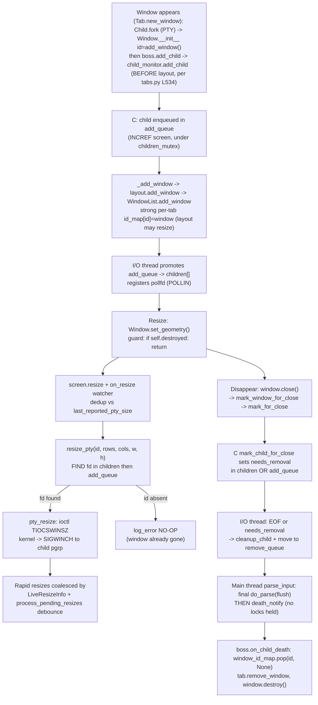

# How kitty Keeps Internal State Consistent Across Rapid Window Appear → Resize → Disappear Cycles

> **Research deliverable** — a code-archaeology analysis of the [`kovidgoyal/kitty`](https://github.com/kovidgoyal/kitty) terminal emulator.
>
> **Commit under analysis:** `815df1e210e0a9ab4622f5c7f2d6891d7dbeddf1` (branch `kitty_815df1e210e0`).
> Every line/symbol citation in this document resolves against this commit. Citations are written inline in the form `path:Lnnn` (a source file path and an `L`-prefixed line number); each line number was verified against the source at this exact commit. Should a different checkout shift line numbers, resolve the citation by its named function/symbol against this commit.
>
> **Nature of this document:** This is an analysis-only deliverable. It changes no product behavior, adds no code, and is grounded entirely in kitty's own source — *the code is the source of truth*. The single external reference used (the Linux `TIOCSWINSZ(2const)` man page) is cited only to validate the kernel-level PTY-resize → `SIGWINCH` mechanism that kitty builds upon.

---

## The question this document answers

> *"When a new window is created and immediately used to run a command, resize events and signals start flowing through the system. ... What happens if the window is gone before everything has finished reacting to those changes? How does kitty decide what state to keep and what to discard?"*

Restated with precision: **by what mechanism, ordering guarantees, and bookkeeping data structures does kitty preserve a coherent internal model of windows and their child PTY processes across rapid lifecycle transitions (creation → resize/`SIGWINCH` propagation → termination), and how does it resolve transient disagreements about whether a window/child is still alive?**

The analysis walks the concrete **create → run → resize → close** sequence end-to-end and answers six sub-questions:

| Tag | Sub-question |
|-----|--------------|
| **R1** | When a new window is created and immediately used to run a command, how is it registered across kitty's layered registries (Python `Window` ↔ Boss ↔ C child monitor)? |
| **R2** | How does a geometry change propagate into a PTY resize and a `SIGWINCH` to the child, and how are rapid, repeated resize events handled? |
| **R3** | How does kitty behave when a resize or other reaction targets a window/child that has already been (or is being) torn down? |
| **R4** | What output/state is preserved versus released when a child dies? |
| **R5** | How does the multi-threaded design and deferred-tick processing affect ordering of signal delivery, reaping, and notification? |
| **R6** | Where do the C-thread view, the Python window map, and the per-tab window list disagree, and how is the disagreement reconciled? |

### Table of contents

1. [Architecture & registries overview](#1-architecture--registries-overview)
2. [R1 — Windows appear (registration)](#2-r1--windows-appear-registration)
3. [R2 — Resize & `SIGWINCH` propagation + rapid-succession coalescing](#3-r2--resize--sigwinch-propagation--rapid-succession-coalescing)
4. [R3 — Gone before everything finished reacting (stale-target tolerance)](#4-r3--gone-before-everything-finished-reacting-stale-target-tolerance)
5. [R4 — Keep vs discard at child death](#5-r4--keep-vs-discard-at-child-death)
6. [R5 — Timing, threading, and lock discipline](#6-r5--timing-threading-and-lock-discipline)
7. [R6 — Resolving conflicting alive-vs-gone views](#7-r6--resolving-conflicting-alive-vs-gone-views)
8. [Rationale synthesis & optional dynamic-verification notes](#8-rationale-synthesis--optional-dynamic-verification-notes)
9. [Consolidated citations list](#9-consolidated-citations-list)

---

## 1. Architecture & registries overview

### 1.1 A three-language, three-thread system

kitty is built from three languages that divide labor by performance and ergonomics:

- **Python** (`requires-python = ">=3.8"` `[pyproject.toml:L2]`) — orchestration, configuration, and high-level lifecycle policy (the `Boss` singleton, `Window`, `Tab`, `WindowList`, the `Child` wrapper).
- **C11** (compiled with `-std=c11` `[setup.py:L492]`) — the performance hot paths: the terminal `Screen` model (`kitty/screen.c`), GLFW/windowing glue (`kitty/glfw.c`), and the **child monitor** (`kitty/child-monitor.c`) that owns PTY I/O, child-process bookkeeping, and rendering ticks.
- **Go** (`go 1.22` `[go.mod:L3]`) — CLI tooling (`kitten`s and remote control), which is not on the window resize/lifecycle hot path and is therefore out of scope for this analysis.

The lifecycle logic relevant to this document lives almost entirely in the Python orchestration layer and the C child monitor. The child monitor runs a **three-thread architecture**:

- **Main thread** — GLFW event handling and rendering. It runs `Window.set_geometry` `[kitty/window.py:L850]`, the C `process_pending_resizes` `[kitty/child-monitor.c:L1042]`, the C `parse_input` `[kitty/child-monitor.c:L450-L451]` (which performs final parses and fires `death_notify` `[kitty/child-monitor.c:L522]`), and `report_reaped_pids` `[kitty/child-monitor.c:L949-L958]`. This is the only thread that calls back into Python (the death-notify, reaped-pid, and resize entry points above are the Python-facing calls).
- **I/O thread** — the function `io_loop` `[kitty/child-monitor.c:L1481]`, created via `pthread_create(..., io_loop, ...)` `[kitty/child-monitor.c:L291]` and named `"KittyChildMon"` `[kitty/child-monitor.c:L1489]`. It polls PTY/signal/wakeup file descriptors, reads child output, reaps `SIGCHLD`, and promotes/removes children.
- **Talk thread** — peer/remote-control message handling, created via `pthread_create(..., talk_loop, ...)` `[kitty/child-monitor.c:L256,L286]`. Not on the resize path.

All shared C child-bookkeeping arrays are guarded by a **single, non-recursive** `pthread` mutex, accessed through a macro `children_mutex(op)` that expands to `pthread_mutex_##op(&children_lock)` `[kitty/child-monitor.c:L76-L77]`. The non-recursive property is load-bearing — it directly shapes the lock-free death-notification design analyzed in [R5](#6-r5--timing-threading-and-lock-discipline).

### 1.2 The four layered registries — where "which windows exist" lives

kitty models "which windows and children exist" across **four** registries that span the Python and C layers. They are intentionally allowed to disagree *temporarily*; the reconciliation discipline is the subject of [R3](#4-r3--gone-before-everything-finished-reacting-stale-target-tolerance) and [R6](#7-r6--resolving-conflicting-alive-vs-gone-views).

**(a) Python `Window` — per-window state.** Constructed once per window; its liveness/bookkeeping fields are initialized in `Window.__init__`:

```python
self.last_resized_at = 0.                          # [kitty/window.py:L562]
self.created_at = time_ns()                        # [kitty/window.py:L564]
self.child_is_launched = False                     # [kitty/window.py:L578]
self.last_reported_pty_size = (-1, -1, -1, -1)     # [kitty/window.py:L579]
self.id: int = add_window(tab.os_window_id, tab.id, self.title)  # [kitty/window.py:L587]
self.destroyed = False                             # [kitty/window.py:L597]
```

The integer `self.id` obtained from `add_window(...)` `[kitty/window.py:L587]` is the **lingua franca** that decouples every other layer — all subsequent cross-layer references key off this id rather than off object pointers. `self.destroyed` `[kitty/window.py:L597]` is the teardown guard; `self.last_reported_pty_size` `[kitty/window.py:L579]` is the resize-dedup cache; `self.child_is_launched` `[kitty/window.py:L578]` gates the one-time "terminal ready" handshake.

**(b) Boss `window_id_map` — the process-wide weak map.** The `Boss` is the central singleton lifecycle coordinator. It owns:

```python
from weakref import WeakValueDictionary               # [kitty/boss.py:L33]
...
self.window_id_map: WeakValueDictionary[int, Window] = WeakValueDictionary()  # [kitty/boss.py:L344]
```

Because it is a `WeakValueDictionary` `[kitty/boss.py:L344]`, a `Window` that is garbage-collected silently disappears from the map without an explicit delete — a property exploited for conflict resolution in [R6](#7-r6--resolving-conflicting-alive-vs-gone-views).

**(c) Per-tab `WindowList.id_map` — the strong map.** Each tab owns a strong dictionary:

```python
self.id_map: Dict[int, WindowType] = {}              # [kitty/window_list.py:L148]
```

The assignment `self.id_map[window.id] = window` `[kitty/window_list.py:L339]` is a strong-valued dictionary entry, so it is what actually keeps `Window` objects alive while they belong to a tab; the weak Boss map `[kitty/boss.py:L344]` and this strong per-tab map together form a two-tier ownership model. (The execution order — this per-tab insertion happens *after* the Boss/C registration, during layout — is detailed in [R1](#2-r1--windows-appear-registration).)

**(d) C `children[]` + `add_queue[]` — the three-thread engine arrays.** The child monitor stores child-process bookkeeping in fixed-size arrays:

```c
static Child children[MAX_CHILDREN] = {{0}};   // live, polled children                       [kitty/child-monitor.c:L82]
static Child scratch[MAX_CHILDREN] = {{0}};    // snapshot of children[] for lock-free parsing  [kitty/child-monitor.c:L83]
static Child add_queue[MAX_CHILDREN] = {{0}}, remove_queue[MAX_CHILDREN] = {{0}}, remove_notify[MAX_CHILDREN] = {{0}};  // [kitty/child-monitor.c:L84]
```

Each `Child` struct carries exactly the fields needed to key off the window id and to manage the PTY and screen:

```c
typedef struct {
    Screen *screen;
    bool needs_removal;        // [kitty/child-monitor.c:L67]
    int fd;
    unsigned long id;
    pid_t pid;
} Child;                       // struct fields [kitty/child-monitor.c:L65-L71]
```

The `needs_removal` flag `[kitty/child-monitor.c:L67]` is the deferred-removal mechanism: whichever thread first notices a child has died sets this flag under the mutex, and the actual teardown happens later at a controlled point on the owning thread (see [R5](#6-r5--timing-threading-and-lock-discipline)).

### 1.3 The five recurring design idioms

Five patterns recur throughout the lifecycle code and are the reason independent threads and layers can disagree *temporarily* without corrupting state. The remainder of this document repeatedly returns to them:

1. **Id indirection** — everything keys off the integer window `id` `[kitty/window.py:L587]`, never off raw object pointers, so a stale id simply "finds nothing" rather than dereferencing freed memory.
2. **Dual-list scanning** — C lookups search `children[]` *then* `add_queue[]` `[kitty/child-monitor.c:L606-L607]`, so a child that is registered but not yet promoted by the I/O thread is still found (see [R1](#2-r1--windows-appear-registration), [R3](#4-r3--gone-before-everything-finished-reacting-stale-target-tolerance)).
3. **Deferred mutation** — removals are flagged (`needs_removal` `[kitty/child-monitor.c:L67]`) and applied later at safe points; resizes are debounced; closes are deferred to the main-thread tick.
4. **Weak references** — the Boss `window_id_map` `[kitty/boss.py:L344]` auto-discards garbage-collected windows.
5. **Reference counting** — the cross-thread `Screen` lifetime is managed with `Py_INCREF`/`Py_DECREF` via the `INCREF_CHILD`/`DECREF_CHILD`/`FREE_CHILD` macros `[kitty/child-monitor.c:L105-L110]`, so a `Screen` cannot be freed while another thread still references it.

### 1.4 End-to-end mechanism map

The diagram below summarizes the create → run → resize → close path that the rest of the document dissects. Each node is grounded in the cited code path.



The key structural observation — which the next six sections elaborate — is that registration runs **fork → register-in-C → layout** (with the Boss/C registration deliberately *before* layout), and the C boundary itself uses a **two-step enqueue → promote**; removal is **deferred and flagged**; and every cross-layer lookup is **tolerant of absence**. Together these let the Main thread, the I/O thread, and the Python object graph hold momentarily inconsistent views of "what is alive" and reconcile them lazily, without any lock spanning the Python↔C boundary.

---

## 2. R1 — Windows appear (registration)

> *Scenario step: "When a new window is created and immediately used to run a command..."*

### 2.1 Mechanism: `Tab.new_window`'s registration order (fork → register → layout → promote)

The orchestration lives in `Tab.new_window` `[kitty/tabs.py:L504]`, and its **order is load-bearing**. Reading the method body top to bottom `[kitty/tabs.py:L524-L536]`, registration ripples through the four registries as follows.

**Step 1 — the child PTY is forked first.** `new_window` opens by calling `self.launch_child(...)` `[kitty/tabs.py:L524-L528]`. `launch_child` `[kitty/tabs.py:L437]` constructs the `Child` wrapper and immediately forks it — `ans = Child(...)` then `ans.fork()` `[kitty/tabs.py:L495-L496]`. Inside `fork`, `fast_data_types.spawn(...)` returns the child pid `[kitty/child.py:L333]` and the wrapper records the pid and the PTY master fd:

```python
self.pid = pid                  # [kitty/child.py:L337]
self.child_fd = master          # [kitty/child.py:L338]
```

`fork` also establishes a **readiness pipe** via `os.pipe()` `[kitty/child.py:L283]`: the read end is made inheritable to the child `[kitty/child.py:L285]` while kitty keeps the write end as `self.terminal_ready_fd = ready_write_fd` `[kitty/child.py:L343]`. The forked child blocks on this pipe before running its command — in the child branch of `spawn` it calls `wait_for_terminal_ready(ready_read_fd)` `[kitty/child.c:L152]`, which loops on `read(fd, &data, 1)` `[kitty/child.c:L71-L77]`; the in-code comment states it is waiting "for READY_SIGNAL which indicates kitty has setup the screen object" `[kitty/child.c:L150]`. kitty releases the child later, in R2's first-resize handshake, by closing the write end (see [R2](#3-r2--resize--sigwinch-propagation--rapid-succession-coalescing)). This is precisely why *"a window created and immediately used to run a command"* is coupled to the first resize.

**Step 2 — the Python `Window` is constructed and gets its id.** With an already-forked child in hand, `new_window` constructs `window = Window(self, child, ...)` `[kitty/tabs.py:L529-L533]`. `Window.__init__` obtains the integer id that every other layer keys off via `self.id = add_window(...)` `[kitty/window.py:L587]`.

**Step 3 — the Boss registers the child, deliberately *before* layout.** `new_window` next calls `get_boss().add_child(window)` `[kitty/tabs.py:L535]`. This call is placed *before* per-tab/layout insertion on purpose; the source says so in the immediately preceding comment — `# Must add child before laying out so that resize_pty succeeds` `[kitty/tabs.py:L534]`. `Boss.add_child` `[kitty/boss.py:L585]` asserts the child actually forked (`window.child.pid is not None and window.child.child_fd is not None` `[kitty/boss.py:L586]`), hands the id/pid/fd/screen to the C child monitor, and registers the window in the weak process-wide map:

```python
self.child_monitor.add_child(window.id, window.child.pid, window.child.child_fd, window.screen)  # [kitty/boss.py:L587]
self.window_id_map[window.id] = window                                                            # [kitty/boss.py:L588]
```

**Step 4 — the C side *enqueues* (it does not touch the live array).** `child_monitor.add_child` `[kitty/child-monitor.c:L305]` takes the mutex, performs a capacity check, zeroes the target queue slot to `EMPTY_CHILD`, parses the arguments straight into that slot through the `A(attr)` address macro, *increments the screen refcount*, advances the queue count, unlocks, and wakes the I/O thread. The exact body is `[kitty/child-monitor.c:L307-L320]`:

```c
children_mutex(lock);                                                       // [kitty/child-monitor.c:L307]
if (self->count + add_queue_count >= MAX_CHILDREN) { PyErr_SetString(PyExc_ValueError, "Too many children"); children_mutex(unlock); return NULL; }  // [kitty/child-monitor.c:L308]
add_queue[add_queue_count] = EMPTY_CHILD;                                   // [kitty/child-monitor.c:L309]
#define A(attr) &add_queue[add_queue_count].attr                            // [kitty/child-monitor.c:L310]
if (!PyArg_ParseTuple(args, "kiiO", A(id), A(pid), A(fd), A(screen))) {     // [kitty/child-monitor.c:L311]
    children_mutex(unlock);
    return NULL;
}
#undef A                                                                    // [kitty/child-monitor.c:L315]
INCREF_CHILD(add_queue[add_queue_count]);                                   // [kitty/child-monitor.c:L316]
add_queue_count++;                                                          // [kitty/child-monitor.c:L317]
children_mutex(unlock);                                                     // [kitty/child-monitor.c:L318]
wakeup_io_loop(self, false);                                                // [kitty/child-monitor.c:L319]
```

Note there is no `else` branch and no aggregate `(Child){...}` initializer: the capacity check returns early on failure `[kitty/child-monitor.c:L308]`, and the fields are filled in place by `PyArg_ParseTuple` writing through `A(attr) → &add_queue[add_queue_count].attr` `[kitty/child-monitor.c:L310-L311]`.

**Step 5 — the per-tab strong registry records it (during layout).** Only *after* the Boss/C registration does `new_window` call `self._add_window(window, ...)` `[kitty/tabs.py:L536]`. `_add_window` `[kitty/tabs.py:L499]` invokes `self.current_layout.add_window(self.windows, window, ...)` `[kitty/tabs.py:L500]`; the layout in turn calls `all_windows.add_window(...)` `[kitty/layout/base.py:L318]` (for splits, `[kitty/layout/splits.py:L507,L510]`), which reaches `WindowList.add_window` `[kitty/window_list.py:L329]`. That method appends to the ordered list and inserts into the strong id map:

```python
self.all_windows.append(window)        # [kitty/window_list.py:L338]
self.id_map[window.id] = window        # [kitty/window_list.py:L339]
```

This strong reference `[kitty/window_list.py:L339]` is what keeps the `Window` alive while it belongs to a tab. Because layout — which can trigger a resize — runs *here*, after the child is already registered in C, that resize's `resize_pty` lookup can find the child; this is exactly the invariant the `[kitty/tabs.py:L534]` comment protects.

**Step 6 — the I/O thread *promotes* the queued child into the live array.** Later, on its own schedule, the I/O thread runs `add_children` `[kitty/child-monitor.c:L1281]`, moving entries from `add_queue[]` into the live `children[]` array, registering a pollable file descriptor, and incrementing the live count:

```c
children[self->count] = add_queue[add_queue_count];                   // promote   [kitty/child-monitor.c:L1284]
children_fds[EXTRA_FDS + self->count].fd = children[self->count].fd;  // register pollfd [kitty/child-monitor.c:L1286]
children_fds[EXTRA_FDS + self->count].events = POLLIN;                // [kitty/child-monitor.c:L1287]
self->count++;                                                        // [kitty/child-monitor.c:L1288]
```

### 2.2 Rationale: why enqueue → promote, and why it matters downstream

The registration is split into **enqueue (any thread, under the mutex)** and **promote (I/O thread only)** for two reasons:

- **The Python/Main thread never blocks on the I/O thread.** `add_child` only needs to append to a queue and signal a wakeup `[kitty/child-monitor.c:L319]`; it does not wait for the I/O thread to wire up polling. This keeps window creation snappy even while the I/O thread is busy reading other children's output.
- **The screen survives the cross-thread handoff.** The `INCREF_CHILD` on enqueue `[kitty/child-monitor.c:L316]` raises the `Screen`'s Python refcount *before* the object is visible to the I/O thread, so even if Python were to drop its own reference immediately, the screen cannot be deallocated out from under the C engine. This is the front half of the reference-counting idiom whose back half (release at death) appears in [R4](#5-r4--keep-vs-discard-at-child-death).

The most consequential side effect of this design — and the reason later lookups must scan two lists — is the **intermediate state it creates**: between the C enqueue (Step 4) and the I/O-thread promotion (Step 6), the child is present in the C `add_queue[]` but **absent from the live `children[]` array**, while in Python it is already in the Boss weak `window_id_map` (registered in Step 3) and, once layout runs (Step 5), in the per-tab `id_map` as well. Any code executing in this interval — most importantly the resize that layout *itself* triggers in Step 5, which is the very reason `add_child` must precede `_add_window` per the `[kitty/tabs.py:L534]` comment — must therefore tolerate the child being "known but not yet live." That tolerance is exactly the dual-list scan (`children[]` then `add_queue[]`) documented in [R3](#4-r3--gone-before-everything-finished-reacting-stale-target-tolerance) and [R6](#7-r6--resolving-conflicting-alive-vs-gone-views).

---

## 3. R2 — Resize & `SIGWINCH` propagation + rapid-succession coalescing

> *Scenario step: "...resize events and signals start flowing through the system."*

### 3.1 Mechanism: from geometry to `ioctl` to `SIGWINCH`

The resize entry point is `Window.set_geometry(new_geometry)` `[kitty/window.py:L850]`. Its body, in order:

**(1) Teardown guard.** The very first statement short-circuits if the window has been destroyed:

```python
if self.destroyed:
    return                       # [kitty/window.py:L851-L852]
```

This guard is the front line of stale-target tolerance, examined further in [R3](#4-r3--gone-before-everything-finished-reacting-stale-target-tolerance).

**(2) Resize the in-process screen model + fire the watcher.** It resizes the terminal `Screen` and notifies any `on_resize` watcher `[kitty/window.py:L854,L856]`. The C target of `self.screen.resize(...)` is `screen_resize(Screen *self, unsigned int lines, unsigned int columns)` `[kitty/screen.c:L346]`, exposed to Python through the `resize` method wrapper `[kitty/screen.c:L3929]` (which calls `screen_resize(self, a, b)` `[kitty/screen.c:L3932]`) and registered via `MND(resize, METH_VARARGS)` `[kitty/screen.c:L4842]`.

**(3) Compute the candidate PTY size.** It builds a 4-tuple of `(lines, columns, width_px, height_px)`:

```python
current_pty_size = (
    self.screen.lines, self.screen.columns,
    max(0, new_geometry.right - new_geometry.left), max(0, new_geometry.bottom - new_geometry.top))  # [kitty/window.py:L857-L859]
```

**(4) Deduplicate, then propagate.** The PTY is resized **only when the size actually changed** versus the cached last-reported size:

```python
if current_pty_size != self.last_reported_pty_size:                  # [kitty/window.py:L861]
    boss.child_monitor.resize_pty(self.id, *current_pty_size)        # [kitty/window.py:L863]
    self.last_resized_at = monotonic()                               # [kitty/window.py:L864]
    if not self.child_is_launched:
        self.child.mark_terminal_ready()                             # [kitty/window.py:L865-L866]
        self.child_is_launched = True                                # [kitty/window.py:L867]
        ...
    elif boss.args.debug_rendering:
        print(f'[{monotonic():.3f}] SIGWINCH sent to child in window: {self.id} with size: {current_pty_size}', file=sys.stderr)  # [kitty/window.py:L873]
    self.last_reported_pty_size = current_pty_size                   # [kitty/window.py:L874]
else:
    mark_os_window_dirty(self.os_window_id)                          # [kitty/window.py:L876]
```

The cache write at `[kitty/window.py:L874]` records the new size; the dedup test at `[kitty/window.py:L861]` is what prevents redundant `SIGWINCH` traffic.

**(5) First-resize handshake.** On the *first* reported size, `child_is_launched` is still `False`, so kitty calls `self.child.mark_terminal_ready()` and flips the flag `[kitty/window.py:L865-L867]`. `mark_terminal_ready` closes the readiness pipe established at fork time:

```python
def mark_terminal_ready(self) -> None:        # [kitty/child.py:L362]
    os.close(self.terminal_ready_fd)          # [kitty/child.py:L363]
    self.terminal_ready_fd = -1               # [kitty/child.py:L364]
```

Closing this fd `[kitty/child.py:L363]` is what releases the child, which has been blocked in `wait_for_terminal_ready` `[kitty/child.c:L152]`, to run with a known geometry — which is precisely why "a window created and *immediately* used to run a command" is coupled to the first resize.

**(6) C-side resize + the `TIOCSWINSZ` ioctl.** `resize_pty` `[kitty/child-monitor.c:L591]` parses the tuple as `"kHHHH"` → `(window_id, ws_row, ws_col, ws_xpixel, ws_ypixel)` `[kitty/child-monitor.c:L597]`, takes the mutex, finds the fd by the dual-list `FIND` macro (children first, add_queue second — see R3), and calls `pty_resize(fd, &dim)`. `pty_resize` issues the kernel ioctl in a retry loop:

```c
static bool
pty_resize(int fd, struct winsize *dim) {     // [kitty/child-monitor.c:L577]
    while (true) {
        if (ioctl(fd, TIOCSWINSZ, dim) == -1) {                 // [kitty/child-monitor.c:L579]
            if (errno == EINTR) continue;                       // [kitty/child-monitor.c:L580]
            if (errno != EBADF && errno != ENOTTY) {            // tolerate stale fd [kitty/child-monitor.c:L581]
                log_error("Failed to resize tty associated with fd: %d with error: %s", fd, strerror(errno));  // [kitty/child-monitor.c:L582]
                return false;
            }
        }
        break;
    }
    return true;
}
```

### 3.2 POSIX validation (the only external citation)

kitty's `"kHHHH"` argument tuple and the `TIOCSWINSZ` ioctl follow the canonical kernel interface. The Linux `TIOCSWINSZ(2const)` man page documents that `struct winsize` carries `ws_row`, `ws_col`, `ws_xpixel`, and `ws_ypixel`, that **"When the window size changes, a `SIGWINCH` signal is sent to the foreground process group,"** and that on error `-1` is returned with `errno` set (Linux man-pages, `TIOCSWINSZ(2const)`). This maps one-to-one onto kitty's four trailing unsigned-short fields `[kitty/child-monitor.c:L597]` and the `EBADF`/`ENOTTY`/`EINTR` handling in `pty_resize` `[kitty/child-monitor.c:L579-L582]`. In other words, kitty does *not* deliver `SIGWINCH` itself — it asks the kernel to update the tty's window size, and the kernel delivers `SIGWINCH` to the child's foreground process group as a side effect of `TIOCSWINSZ`.

Because the kernel — not kitty — emits `SIGWINCH` as a side effect of `TIOCSWINSZ` (per the man page above), signal-delivery *timing* is governed by the kernel and is outside kitty's direct control. This is precisely why kitty layers its *own* ordering and debounce discipline on top of the kernel behavior: the per-window `last_reported_pty_size` value-diff `[kitty/window.py:L861]`, the live-resize debounce `[kitty/child-monitor.c:L1042-L1075]` (below), and the lock-free notification ordering analyzed in [R5](#6-r5--timing-threading-and-lock-discipline). The user's interest in how timing affects signal delivery is therefore well-founded — and every timing guarantee this document makes is kitty's own, grounded in the cited code rather than in any external kernel-version behavior.

### 3.3 Mechanism: rapid-succession coalescing / debounce

Interactive window dragging generates a *flurry* of resize events. kitty collapses them through two independent dedup layers:

**Layer 1 — the per-window `last_reported_pty_size` diff (Python).** As shown above `[kitty/window.py:L861]`, a `set_geometry` call that does not change the cell-grid + pixel size never reaches `resize_pty`, so no `SIGWINCH`-causing ioctl is issued.

**Layer 2 — the OS-window live-resize debounce (C).** GLFW callbacks do **not** resize synchronously; they accumulate event state. The state struct is:

```c
typedef struct {
    monotonic_t last_resize_event_at;                          // [kitty/state.h:L197]
    bool in_progress;                                          // [kitty/state.h:L198]
    bool from_os_notification;                                 // [kitty/state.h:L199]
    bool os_says_resize_complete;                              // [kitty/state.h:L200]
    unsigned int width, height, num_of_resize_events;          // [kitty/state.h:L201]
} LiveResizeInfo;                                              // struct [kitty/state.h:L196-L202]
```

embedded as `OSWindow.live_resize` `[kitty/state.h:L244]`. The GLFW callbacks feed it:

- `framebuffer_size_callback` stamps `last_resize_event_at = monotonic()` `[kitty/glfw.c:L338]` and increments `num_of_resize_events++` `[kitty/glfw.c:L340]`.
- `change_live_resize_state` toggles `in_progress` `[kitty/glfw.c:L302]` and resets `num_of_resize_events = 0` `[kitty/glfw.c:L303]`.
- `live_resize_callback` records `from_os_notification` `[kitty/glfw.c:L319]` and `os_says_resize_complete` `[kitty/glfw.c:L323]`.

The Main thread's `process_pending_resizes(monotonic_t now)` `[kitty/child-monitor.c:L1042]` then defers actually applying the new viewport until either the OS reports completion (`os_says_resize_complete`) or a configurable `resize_debounce_time` window elapses — it compares `now` against `last_resize_event_at` using `OPT(resize_debounce_time).on_pause` `[kitty/child-monitor.c:L1055]` and `OPT(resize_debounce_time).on_end` `[kitty/child-monitor.c:L1062]`. When it finally applies, it commits the viewport and zeroes the live-resize state:

```c
update_os_window_viewport(w, true);     // [kitty/child-monitor.c:L1073]
change_live_resize_state(w, false);     // [kitty/child-monitor.c:L1074]
zero_at_ptr(&w->live_resize);           // [kitty/child-monitor.c:L1075]
```

### 3.4 Rationale: two dedup layers, one authoritative final size

The two layers are complementary: the **time-based debounce** (Layer 2) throttles how often the expensive re-layout + ioctl path runs during a drag, while the **value diff** (Layer 1, `last_reported_pty_size`) guarantees that even if the debounce lets several applies through, only genuine size changes ever turn into `SIGWINCH` traffic. The net effect is that a continuous drag collapses into at most a few `TIOCSWINSZ` ioctls, yet the design still guarantees a **final, authoritative** size is reported: when the OS signals completion (or the pause/end window elapses), `process_pending_resizes` applies the last geometry `[kitty/child-monitor.c:L1073-L1075]`, which flows back through `set_geometry` and — because the final size differs from the last reported one — issues the closing `resize_pty` `[kitty/window.py:L861-L863]`. Throttling never costs correctness of the end state.

---

## 4. R3 — Gone before everything finished reacting (stale-target tolerance)

> *Scenario step: "What happens if the window is gone before everything has finished reacting to those changes?"*

This is the crux of the user's question. Because windows can be created, resized, and destroyed faster than every layer can synchronously agree, kitty is built so that **a reaction aimed at an already-gone (or not-yet-live) target is a benign no-op, never a crash or hard error.** There are three independent guard points along the resize path.

### 4.1 Mechanism: the Python `destroyed` guard

`set_geometry` returns immediately if the window has been torn down:

```python
if self.destroyed:
    return                       # [kitty/window.py:L851-L852]
```

The `destroyed` flag is set to `True` inside `Window.destroy` `[kitty/window.py:L1562]` (method begins at `[kitty/window.py:L1560]`). So a geometry update that is computed and dispatched against a window that has since been destroyed never even reaches the C layer — it is dropped at the Python boundary.

### 4.2 Mechanism: the C dual-list lookup + no-op-with-log

If the call *does* reach C, `resize_pty` must find the child's fd. It searches the live array **and then** the not-yet-promoted queue, via a `FIND` macro:

```c
FIND(children, self->count);                           // search live array first   [kitty/child-monitor.c:L606]
if (fd == -1) FIND(add_queue, add_queue_count);        // then the add queue         [kitty/child-monitor.c:L607]
if (fd != -1) {
    if (!pty_resize(fd, &dim)) PyErr_SetFromErrno(PyExc_OSError);
} else log_error("Failed to send resize signal to child with id: %lu (children count: %u) (add queue: %zu)", window_id, self->count, add_queue_count);  // [kitty/child-monitor.c:L610]
```

If neither list contains the id (`fd == -1`), `resize_pty` does **not** raise — it logs and no-ops `[kitty/child-monitor.c:L610]`. A resize aimed at an id that has already been removed (or never promoted) is therefore harmless. The same dual-list discipline is used by `mark_child_for_close`, which scans `children[]` then `add_queue[]` `[kitty/child-monitor.c:L544-L558]` so that a close request for a not-yet-promoted child is still honored.

### 4.3 Mechanism: stale-fd `ioctl` tolerance

Even when an fd *is* found, the descriptor may no longer be a usable tty by the time the `ioctl` actually runs — so `pty_resize` tolerates `EBADF` and `ENOTTY` defensively rather than treating them as errors:

```c
if (ioctl(fd, TIOCSWINSZ, dim) == -1) {
    if (errno == EINTR) continue;                       // retry            [kitty/child-monitor.c:L580]
    if (errno != EBADF && errno != ENOTTY) {            // EBADF/ENOTTY are benign [kitty/child-monitor.c:L581]
        log_error("Failed to resize tty associated with fd: %d ...", ...);  // [kitty/child-monitor.c:L582]
        return false;
    }
}
break;
```

`EINTR` is retried `[kitty/child-monitor.c:L580]`; `EBADF` (closed fd) and `ENOTTY` (no longer a tty) are *swallowed* — the loop breaks and returns success without logging an error `[kitty/child-monitor.c:L581]`. Only an unexpected errno logs a real failure `[kitty/child-monitor.c:L582]`.

### 4.4 Rationale: races are expected, not exceptional

The unifying rationale is that kitty treats "target absent / fd stale" as an **ordinary, expected outcome of concurrency**, not as an error condition. Because the window can be destroyed on the Main thread while the I/O thread still holds an fd (or vice versa), there is no instant at which all four registries are guaranteed mutually consistent. Rather than attempt to enforce such an instant with a heavyweight cross-layer lock — which would serialize the very operations that need to be fast — kitty makes every reaction *idempotent under absence*:

- The **id indirection** — every cross-layer reference keys off the integer `self.id` `[kitty/window.py:L587]`, and the C resize path looks the child up *by that id* `[kitty/child-monitor.c:L606-L607]` rather than following a raw pointer — means a stale id can only "find nothing"; it can never dereference freed memory.
- The **dual-list scan** `[kitty/child-monitor.c:L606-L607]` closes the specific window of inconsistency created by R1's enqueue → promote split: a child known to Python but not yet in `children[]` is still found in `add_queue[]`.
- The **errno tolerance** `[kitty/child-monitor.c:L581]` absorbs fd-level staleness *defensively*: `resize_pty` actually holds `children_mutex` across both the lookup and the `ioctl` `[kitty/child-monitor.c:L598-L611]`, and the only fd-closing path (`cleanup_child`'s `safe_close`, reached through `remove_children`) runs under that *same* mutex `[kitty/child-monitor.c:L1306-L1309,L1492-L1495]` — so kitty's own teardown cannot close this fd between lookup and ioctl. The `EBADF`/`ENOTTY` tolerance therefore guards the case where the located descriptor is simply no longer a valid tty when `ioctl(TIOCSWINSZ)` executes, not an intra-kitty lookup-vs-close race.

The three guards are layered defensively from cheapest to most specific: the Python `destroyed` check `[kitty/window.py:L851-L852]` drops most stale work before it crosses into C; the dual-list no-op `[kitty/child-monitor.c:L610]` absorbs id-level absence; and the ioctl errno tolerance `[kitty/child-monitor.c:L581]` absorbs fd-level staleness that slips past the first two.

---

## 5. R4 — Keep vs discard at child death

> *Scenario step: "How does kitty decide what state to keep and what to discard?"*

### 5.1 Mechanism: flush the last output *before* notifying Python

When a child dies, the Main thread's `parse_input` `[kitty/child-monitor.c:L450-L451]` drains the remove queue and, for each dying child, performs a **final flush parse of the child's screen before** calling back into Python:

```c
while(remove_count) {
    // must be done while no locks are held, since the locks are non-recursive and
    // the python function could call into other functions in this module       [kitty/child-monitor.c:L518-L519]
    remove_count--;
    if (remove_notify[remove_count].screen) do_parse(self, remove_notify[remove_count].screen, now, true);  // FLUSH parse  [kitty/child-monitor.c:L521]
    PyObject *t = PyObject_CallFunction(self->death_notify, "k", remove_notify[remove_count].id);            // notify       [kitty/child-monitor.c:L522]
    if (t == NULL) PyErr_Print();
    else Py_DECREF(t);
    FREE_CHILD(remove_notify[remove_count]);                                                                  // release     [kitty/child-monitor.c:L525]
}
```

The third argument to `do_parse(...)` is `true` — the `flush` flag — at `[kitty/child-monitor.c:L521]`. This guarantees that any buffered trailing output the child emitted just before exiting is parsed and rendered into the screen model *before* `death_notify` fires at `[kitty/child-monitor.c:L522]` and the window is subsequently destroyed. This ordering is the crisp, literal answer to *"what state to keep"*: the child's final output is kept.

### 5.2 Mechanism: the reference-counted `Screen` lifecycle

The `Screen` object is shared across the Main and I/O threads, so its lifetime is governed by explicit refcount macros:

```c
#define FREE_CHILD(x) \
    Py_CLEAR((x).screen); x = EMPTY_CHILD;              // [kitty/child-monitor.c:L105-L106]
#define XREF_CHILD(x, OP) OP(x.screen);                 // [kitty/child-monitor.c:L108]
#define INCREF_CHILD(x) XREF_CHILD(x, Py_INCREF)        // [kitty/child-monitor.c:L109]
#define DECREF_CHILD(x) XREF_CHILD(x, Py_DECREF)        // [kitty/child-monitor.c:L110]
```

(the macro block spans `[kitty/child-monitor.c:L105-L110]`). The lifecycle is deterministic:

- **`INCREF` on enqueue** — the screen's refcount is raised when the child is added to `add_queue[]` `[kitty/child-monitor.c:L316]` (R1), so it survives the cross-thread handoff.
- **`DECREF` per surviving parse pass** — surviving children's screens are decref'd after their non-flush parse on each pass (`do_parse(..., flush=false)` then `DECREF_CHILD(scratch[i])` `[kitty/child-monitor.c:L528-L532]`), balancing the per-pass incref.
- **`FREE_CHILD` after death notification** — once the dead child has been flushed and Python notified, `FREE_CHILD` clears the screen reference and resets the slot to `EMPTY_CHILD` `[kitty/child-monitor.c:L525]`, deterministically releasing the C side's hold.

On the Python side, `Window.destroy` breaks the reference cycle so the screen can deallocate promptly:

```python
self.screen.reset_callbacks()    # [kitty/window.py:L1570]
del self.screen                  # [kitty/window.py:L1571]
```

### 5.3 Rationale: "keep the rendered past, discard the live plumbing"

The keep/discard split is principled:

- **Kept:** the already-parsed screen content — scrollback and the last frame — because the flush parse `[kitty/child-monitor.c:L521]` runs *before* teardown. A user who runs a command that prints output and then exits still sees that output; it is not lost to a race between "child exited" and "window torn down."
- **Discarded:** the live PTY file descriptor and the per-child C bookkeeping slot, released by `cleanup_child` (closing the fd) and `FREE_CHILD` `[kitty/child-monitor.c:L525]`, plus the Python-side cycle broken in `Window.destroy` `[kitty/window.py:L1570-L1571]`.

The reason refcounting is used rather than a simpler "free on death" is the multi-threading: the `Screen` is shared between the **I/O thread**, which reads PTY bytes into the parser's write buffer via `read_bytes` `[kitty/child-monitor.c:L1337,L1531]` (it reads, it does not parse), and the **Main thread**, which performs the actual parsing via `do_parse` inside `parse_input` `[kitty/child-monitor.c:L450-L451,L521,L530]`. Because `parse_input` snapshots the child entries under the mutex and then parses (or finalizes) them *after releasing the mutex* `[kitty/child-monitor.c:L478-L483]`, the I/O thread can be concurrently reading into — or, on EOF/`SIGCHLD`, marking for removal `[kitty/child-monitor.c:L1532-L1536]` — the very screen the Main thread is about to tear down. The `INCREF_CHILD` at enqueue `[kitty/child-monitor.c:L316]` and the matching `FREE_CHILD` — which is a `Py_CLEAR` `[kitty/child-monitor.c:L105-L106]` — at death `[kitty/child-monitor.c:L525]` bracket the screen's cross-thread visibility; combined with the per-pass `INCREF_CHILD` `[kitty/child-monitor.c:L480]` / `DECREF_CHILD` `[kitty/child-monitor.c:L528-L532]` around each parse, every `Py_INCREF` is matched by a `Py_DECREF`. From these balanced refcount operations it follows that the `Screen`'s Python refcount only reaches zero — the point at which CPython deallocates the object — once no thread still holds a reference; we therefore infer the screen is released exactly once, and never while a parse is in flight.

---

## 6. R5 — Timing, threading, and lock discipline

> *Scenario step: how timing affects signal delivery and internal bookkeeping.*

### 6.1 Mechanism: three threads, one non-recursive mutex

To recap the concurrency model from [Section 1](#1-architecture--registries-overview) with citations:

- **I/O thread** — `io_loop` `[kitty/child-monitor.c:L1481]`, created at `[kitty/child-monitor.c:L291]`, named `"KittyChildMon"` `[kitty/child-monitor.c:L1489]`.
- **Talk thread** — `talk_loop`, created at `[kitty/child-monitor.c:L256,L286]`.
- **Main thread** — GLFW/render; the only thread that calls into Python (the `death_notify` callback `[kitty/child-monitor.c:L522]` and `report_reaped_pids` `[kitty/child-monitor.c:L949-L958]` are issued from here).

A single non-recursive mutex, the `children_mutex` macro `[kitty/child-monitor.c:L76-L77]`, guards every shared child array. The **non-recursive** property is not incidental — it is the design constraint that forces the lock-free death-notification pattern below.

### 6.2 Mechanism (the key timing detail): lock-free `death_notify`

The death-notify call is made *deliberately with no locks held*. The in-code comment states the requirement explicitly:

```c
// must be done while no locks are held, since the locks are non-recursive and
// the python function could call into other functions in this module          [kitty/child-monitor.c:L518-L519]
...
PyObject *t = PyObject_CallFunction(self->death_notify, "k", remove_notify[remove_count].id);  // [kitty/child-monitor.c:L522]
```

The reason: `death_notify` calls into Python (`Boss.on_child_death`), and that Python callback re-enters this very C module — for example calling `mark_for_close` or `resize_pty`, both of which re-acquire `children_mutex`. With a **non-recursive** mutex, re-acquiring a lock the current thread already holds is a deadlock. Therefore the remove-queue is drained into a private `remove_notify[]` buffer under the lock, the lock is released, and only then are the flush parse `[kitty/child-monitor.c:L521]` and `death_notify` `[kitty/child-monitor.c:L522]` performed lock-free. This is the literal answer to *"how timing affects signal delivery"*: notification is ordered to occur at a point where the lock is provably not held.

### 6.3 Mechanism: two independent death-detection paths

A child's death is noticed by whichever of two paths fires first; both converge on the same `needs_removal` flag set under the mutex.

**Path A — EOF on read (I/O thread).** When a read on a child's PTY returns no more data, the I/O thread marks the child for removal:

```c
has_more = read_bytes(...);                          // [kitty/child-monitor.c:L1531]
if (!has_more) {                                     // EOF [kitty/child-monitor.c:L1532]
    children_mutex(lock);
    children[i].needs_removal = true;                // [kitty/child-monitor.c:L1535]
    children_mutex(unlock);
}
```

(`POLLNVAL` on a child fd similarly sets `needs_removal` `[kitty/child-monitor.c:L1542-L1545]`.)

**Path B — `SIGCHLD` reaping (I/O thread).** Signals are delivered to a self-pipe and read inside `io_loop` via `read_signals(children_fds[1].fd, handle_signal, &ss)` `[kitty/child-monitor.c:L1519]`. `handle_signal` records the death:

```c
case SIGCHLD: ss->child_died = true;   // [kitty/child-monitor.c:L1370-L1371]
```

(`SIGCHLD` is in `KITTY_HANDLED_SIGNALS` `[kitty/child-monitor.c:L121]`.) Back in the loop, `if (ss.child_died) reap_children(self, OPT(close_on_child_death))` `[kitty/child-monitor.c:L1526]`. `reap_children` `[kitty/child-monitor.c:L1412-L1413]` loops `waitpid(-1, &status, WNOHANG)` `[kitty/child-monitor.c:L1418]`, and for each reaped pid calls `mark_child_for_removal` (which scans `children[]` by pid and sets `needs_removal` `[kitty/child-monitor.c:L1386-L1395]`) and `mark_monitored_pids` (which records the pid/status into `reaped_pids[]` `[kitty/child-monitor.c:L1398-L1409]`).

### 6.4 Mechanism: deferred queue draining and reaped-pid surfacing

The I/O loop applies removals and promotions at **well-defined points**, not arbitrarily. Each iteration begins by draining both queues under the lock:

```c
children_mutex(lock);
remove_children(self);     // apply needs_removal -> remove_queue
add_children(self);        // promote add_queue -> children[]
children_mutex(unlock);    // [kitty/child-monitor.c:L1492-L1495]
```

then polls fds `[kitty/child-monitor.c:L1512]`. `remove_children` `[kitty/child-monitor.c:L1312]` checks `needs_removal` `[kitty/child-monitor.c:L1317]`, runs `cleanup_child` (`safe_close(fd)` + `hangup(pid)` `[kitty/child-monitor.c:L1306-L1309]`), moves the slot to `remove_queue` `[kitty/child-monitor.c:L1320]`, resets it to `EMPTY_CHILD` `[kitty/child-monitor.c:L1322]`, and compacts the array. `hangup` sends `killpg(pgid, SIGHUP)` and tolerates `ESRCH` (process group already gone) `[kitty/child-monitor.c:L1293-L1302]`.

Reaped pids are surfaced to Python on the **Main-thread tick**, decoupled from the I/O thread that reaped them: `report_reaped_pids()` `[kitty/child-monitor.c:L949-L950]` copies `reaped_pids[]` under the mutex into a local buffer and resets the count `[kitty/child-monitor.c:L949-L958]`, and it is invoked from the main loop tick `[kitty/child-monitor.c:L1244]`.

### 6.5 Rationale: split work so the render thread never blocks on PTY I/O

The threading split exists so the **render/Main thread never blocks on PTY reads or `waitpid`**: the blocking PTY reads (`read_bytes` on EOF detection `[kitty/child-monitor.c:L1531]`) and the reaping (`waitpid(-1, &status, WNOHANG)` `[kitty/child-monitor.c:L1418]`) both run inside `io_loop` on the I/O thread `[kitty/child-monitor.c:L1481]`, while the Main thread only does fast, bounded work (apply a debounced resize `[kitty/child-monitor.c:L1042]`, drain a remove queue / fire notifications in `parse_input` `[kitty/child-monitor.c:L450-L451]`). The `needs_removal` flag is the hinge: it is a *deferred* signal set under the lock by whichever thread first detects death (EOF or `SIGCHLD`), and the heavyweight teardown + Python notification are deferred to controlled, lock-free points on the owning thread. Timing thus affects *when* a death becomes visible to Python (at the next tick, after the next loop drain) but never *whether* state stays coherent — because the order is fixed: detect → flag (locked) → drain (locked) → flush + notify (lock-free) → reap surfaced on tick.

---

## 7. R6 — Resolving conflicting alive-vs-gone views

> *Scenario step: "Are there moments where the system has to resolve conflicting views of what is still alive?"*

Yes — and the entire design anticipates them. There are three loci where views can legitimately disagree:

1. **C `children[]` vs `add_queue[]`** `[kitty/child-monitor.c:L82,L84]` — a not-yet-promoted child is in the add queue but not yet the live array (the R1 enqueue → promote window), which is why the `FIND` lookup scans `children[]` then `add_queue[]` `[kitty/child-monitor.c:L606-L607]`.
2. **C arrays vs Python `window_id_map`** `[kitty/boss.py:L344]` — Python may still hold a window id the C engine has already removed (death detected and drained on the I/O thread `[kitty/child-monitor.c:L1531-L1535]` before `on_child_death` runs), or, in the R1 window, hold a window the C side has only enqueued.
3. **Boss `window_id_map` vs per-tab `WindowList.id_map`** `[kitty/boss.py:L344]``[kitty/window_list.py:L148]` — the weak process map and the strong per-tab map can momentarily differ (e.g., the weak map entry is created in `Boss.add_child` at Step 3 while the per-tab entry is created later, during layout at Step 5 — see [R1](#2-r1--windows-appear-registration)).

kitty reconciles all three with **tolerant lookups** rather than synchronized state.

### 7.1 Mechanism: weak map auto-discard + `None`-safe `pop`

The Boss map is a `WeakValueDictionary` `[kitty/boss.py:L344]`, so a garbage-collected `Window` vanishes from it automatically. When a child death arrives, `on_child_death` `[kitty/boss.py:L881]` resolves the possibly-stale id defensively:

```python
def on_child_death(self, window_id: int) -> None:    # [kitty/boss.py:L881]
    window = self.window_id_map.pop(window_id, None)  # [kitty/boss.py:L883]
    if window is None:
        return                                        # [kitty/boss.py:L884-L885]
    ...
    window.destroy()                                  # [kitty/boss.py:L894]
    ...
    tab.remove_window(window)                         # [kitty/boss.py:L903]
```

The `pop(window_id, None)` `[kitty/boss.py:L883]` returns `None` if Python has already forgotten the window, and the immediate `if window is None: return` `[kitty/boss.py:L884-L885]` makes the death notification a clean no-op in that case. If the window *is* still known, it is destroyed `[kitty/boss.py:L894]` and removed from its owning tab `[kitty/boss.py:L903]`.

### 7.2 Mechanism: per-tab `None`-safe removal

The per-tab strong map mirrors the same tolerance. `WindowList.remove_window` `[kitty/window_list.py:L373]` removes from the ordered list inside a `try/except ValueError` and pops from the id map `None`-safely:

```python
def remove_window(self, x: WindowOrId) -> None:        # [kitty/window_list.py:L373]
    q = self.id_map[x] if isinstance(x, int) else x    # [kitty/window_list.py:L375]
    try:
        self.all_windows.remove(q)                     # [kitty/window_list.py:L377]
    except ValueError:
        pass                                           # [kitty/window_list.py:L378-L379]
    self.id_map.pop(q.id, None)                        # [kitty/window_list.py:L380]
```

`Tab.remove_window` `[kitty/tabs.py:L580]` drives this — calling `self.windows.remove_window(window)` `[kitty/tabs.py:L581]` and the C-side `remove_window(self.os_window_id, self.id, window.id)` `[kitty/tabs.py:L583]`. Both the `except ValueError` `[kitty/window_list.py:L378-L379]` and the `pop(..., None)` `[kitty/window_list.py:L380]` mean a double-remove (e.g., a close racing with a death) is harmless.

### 7.3 Mechanism: deferred removal via `needs_removal`, set across both C lists

On the C side, the `needs_removal` flag `[kitty/child-monitor.c:L67]` is the single point of truth for "this child should go away," and it can be set from any of the death paths. The explicit-close path is `mark_child_for_close` `[kitty/child-monitor.c:L541]`, which — like `resize_pty` — scans `children[]` then `add_queue[]` so a not-yet-promoted child is still found `[kitty/child-monitor.c:L544-L558]`, setting `needs_removal = true` `[kitty/child-monitor.c:L546,L554]`. The Python close path reaches it through:

```python
# Window.close -> Boss.mark_window_for_close -> child_monitor.mark_for_close
get_boss().mark_window_for_close(self)               # [kitty/window.py:L888-L889]
...
def mark_window_for_close(self, ...):                # [kitty/boss.py:L920]
    self.child_monitor.mark_for_close(window.id)     # [kitty/boss.py:L928]
```

The I/O thread's `remove_children` then performs the actual teardown (`cleanup_child` → `safe_close` + `hangup`/`killpg(... SIGHUP)` with `ESRCH` tolerance) and moves the entry to `remove_queue` with array compaction `[kitty/child-monitor.c:L1306-L1333]`.

### 7.4 Rationale: every cross-layer lookup is tolerant of absence

The unifying principle is that **no layer assumes another layer's view is synchronously consistent.** Instead, each layer reconciles lazily at its next safe point, using a lookup that cannot fail catastrophically on absence:

- `WeakValueDictionary` `[kitty/boss.py:L344]` — a dead window simply isn't there.
- `pop(id, None)` in both the Boss `[kitty/boss.py:L883]` and the tab `[kitty/window_list.py:L380]` — absence returns `None`/no-ops, never raises.
- `try/except ValueError` around list removal `[kitty/window_list.py:L378-L379]` — a double-remove is swallowed.
- Dual-list `FIND`/scan in `resize_pty` `[kitty/child-monitor.c:L606-L607]` and `mark_child_for_close` `[kitty/child-monitor.c:L544-L558]` — a child in either C list is found.
- Deferred `needs_removal` `[kitty/child-monitor.c:L67]` — the actual removal happens once, at a controlled point, regardless of how many paths requested it.

This is precisely *how kitty resolves "conflicting views of what is still alive"*: not by forcing global synchronization across the Python↔C boundary (which would require a lock spanning both runtimes and would serialize the hot path), but by making every reconciliation point **idempotent and absence-tolerant**. A window can be alive in Python and gone in C, or queued in C and not yet in Python's tab list — and the next lookup at each layer quietly converges them.

---

## 8. Rationale synthesis & optional dynamic-verification notes

### 8.1 The one idea behind all six answers

Every answer above is a facet of a single design idiom: **id indirection + tolerant lookups + deferred mutation.**

- **Id indirection** — integer window ids `[kitty/window.py:L587]` decouple the four registries so that no layer follows a raw pointer into another layer's possibly-freed object. A stale reference degrades to "find nothing," never to a use-after-free.
- **Tolerant lookups** — `pop(..., None)` `[kitty/boss.py:L883]``[kitty/window_list.py:L380]`, the dual-list `FIND` `[kitty/child-monitor.c:L606-L607]`, `WeakValueDictionary` `[kitty/boss.py:L344]`, and errno tolerance `[kitty/child-monitor.c:L581]` all treat absence as expected.
- **Deferred mutation** — `needs_removal` `[kitty/child-monitor.c:L67]`, the enqueue → promote split `[kitty/child-monitor.c:L316,L1281-L1289]`, the resize debounce `[kitty/child-monitor.c:L1042-L1075]`, and the tick-surfaced reaping `[kitty/child-monitor.c:L1244]` all push state changes to controlled, safe points.

These three combine into four crisp, quotable answers to the scenario:

| Scenario question | Crisp answer | Anchor citation |
|-------------------|--------------|-----------------|
| How is a window registered? (R1) | Ordered **fork → `Window`/id → `Boss.add_child` (C enqueue + weak map) → layout/per-tab insertion → I/O-thread promote**. The Boss/C registration deliberately precedes layout so a layout-triggered resize can still find the child; the C boundary itself is a two-step enqueue → promote, which is *why* dual-list scans exist. | `[kitty/tabs.py:L524-L536]``[kitty/child-monitor.c:L305-L319,L1281-L1289]` |
| What if the window is gone mid-reaction? (R3) | Every reaction is **idempotent under absence** — `destroyed` guard, dual-list no-op + log, `EBADF`/`ENOTTY` tolerance. | `[kitty/window.py:L851-L852]``[kitty/child-monitor.c:L610,L581]` |
| What state is kept? (R4) | **Flush-before-notify**: `do_parse(..., flush=true)` runs *before* `death_notify`, so the child's last output is preserved; the live fd and bookkeeping are discarded. | `[kitty/child-monitor.c:L521-L522]` |
| How does timing affect signal delivery? (R5) | **Lock-free `death_notify`**: the non-recursive mutex must be released before notifying Python, because the Python callback re-enters this C module. | `[kitty/child-monitor.c:L518-L522]` |

The deepest rationale is that kitty refuses to put a lock across the Python↔C boundary. Such a lock would have to be held across `PyObject_CallFunction` `[kitty/child-monitor.c:L522]` — which re-enters the module and would deadlock a non-recursive mutex `[kitty/child-monitor.c:L518-L519,L76-L77]` — and would serialize exactly the create/resize/close operations that must stay responsive during rapid succession. Instead, consistency is achieved *eventually and locally*: each layer converges at its next safe point, and the worst-case transient (a window alive in one registry and gone in another) is rendered harmless by construction.

### 8.2 Optional dynamic-verification notes (corroboration only)

The conclusions above stand entirely on static evidence; the following is **optional corroboration only**. Per the binding rule, building and running kitty is a permitted *methodology*, not a source of truth; and per the user-specified setup instructions it is performed inside the user-specified Docker container image (not in the planning environment). The build/run specifics in this subsection are therefore drawn from the setup instructions and from kitty's own build files — not asserted as code behavior — while every *mechanism* claim remains grounded in the source citations of Sections 1–7. kitty ships in-source instrumentation that makes the resize path directly observable, so no new code is needed:

- **Build:** `python3 setup.py` — this is exactly the `Makefile` `all:` target `[Makefile:L12-L13]`. kitty's build/runtime dependencies (`python >= 3.8`, `harfbuzz >= 2.2.0`, `freetype`, `fontconfig`) are catalogued in `[docs/build.rst:L76,L83-L91]`, and the C extensions compile with `-std=c11` `[setup.py:L492]`. Per the setup instructions, the user-specified container image bundles a sufficient toolchain, so no installation against the repository is needed.
- **Run with `--debug-rendering`** and exercise rapid create → run a command → drag-resize → close cycles. On the **first** reported size you will see the `Child launched` line `[kitty/window.py:L871]`; on each subsequent genuine resize the exact line printed is:

  ```
  [{monotonic:.3f}] SIGWINCH sent to child in window: {id} with size: {current_pty_size}
  ```

  emitted by `print(f'[{monotonic():.3f}] SIGWINCH sent to child in window: {self.id} with size: {current_pty_size}', file=sys.stderr)` `[kitty/window.py:L873]`. Observing that repeated identical-geometry events do **not** print this line corroborates the `last_reported_pty_size` dedup `[kitty/window.py:L861]`; observing that a flurry of drag events produces only a few prints corroborates the debounce `[kitty/child-monitor.c:L1042-L1075]`.

- **Stale-target log:** if a resize is dispatched against an id the C engine no longer knows, the no-op path logs:

  ```
  Failed to send resize signal to child with id: <id> (children count: <n>) (add queue: <m>)
  ```

  from `log_error(...)` `[kitty/child-monitor.c:L610]`. Seeing this line (rather than a crash) during an aggressive close-while-resizing test corroborates R3's tolerance directly.

- **Cleanup discipline:** any temporary observation script must live **outside** the repository (e.g., under `/tmp`) or be deleted afterward, so that `git status` reports only the new untracked `blitzy/` artifact and no modification to any kitty source file. Building from source produces only artifacts that are already gitignored — e.g. `*.so`, `/build/`, and `/kitty/launcher/kitt*` `[.gitignore:L1,L14,L18]` — so it does not dirty the tree.

> **Methodological note.** Per the binding rule that *the code is the source of truth*, dynamic observation is treated strictly as confirmation of statically-derived conclusions. No claim in Sections 1–7 depends on runtime output; the `--debug-rendering` strings above are themselves quoted from the source `[kitty/window.py:L873]``[kitty/child-monitor.c:L610]`.

---

## 9. Consolidated citations list

All citations resolve against commit `815df1e210e0a9ab4622f5c7f2d6891d7dbeddf1` (branch `kitty_815df1e210e0`). Line numbers were verified against the source at this commit; if a checkout differs, resolve by the named symbol/function.

### 9.1 Python orchestration layer

| Claim / role | Symbol | Citation |
|--------------|--------|----------|
| Window liveness timestamps | `last_resized_at`, `created_at` | `[kitty/window.py:L562,L564]` |
| First-launch gate | `child_is_launched = False` | `[kitty/window.py:L578]` |
| Resize-dedup cache | `last_reported_pty_size = (-1,-1,-1,-1)` | `[kitty/window.py:L579]` |
| Window id (lingua franca) | `self.id: int = add_window(...)` | `[kitty/window.py:L587]` |
| Teardown guard field | `destroyed = False` | `[kitty/window.py:L597]` |
| Resize entry point | `Window.set_geometry` | `[kitty/window.py:L850]` |
| Stale-target Python guard (R3) | `if self.destroyed: return` | `[kitty/window.py:L851-L852]` |
| Screen resize + watcher | `self.screen.resize(...)`, `on_resize` | `[kitty/window.py:L854,L856]` |
| Candidate PTY size | `current_pty_size = (...)` | `[kitty/window.py:L857-L859]` |
| Resize dedup test (R2) | `if current_pty_size != self.last_reported_pty_size:` | `[kitty/window.py:L861]` |
| Propagate to C + timestamp | `resize_pty(...)`, `last_resized_at = monotonic()` | `[kitty/window.py:L863-L864]` |
| First-resize handshake | `mark_terminal_ready()`, `child_is_launched = True` | `[kitty/window.py:L865-L867]` |
| `Child launched` debug print | (debug-rendering) | `[kitty/window.py:L871]` |
| **SIGWINCH debug print (exact)** | `SIGWINCH sent to child in window: ... with size: ...` | `[kitty/window.py:L873]` |
| Store last reported size | `last_reported_pty_size = current_pty_size` | `[kitty/window.py:L874]` |
| No-size-change branch | `mark_os_window_dirty(...)` | `[kitty/window.py:L876]` |
| Close delegation | `Window.close` → `mark_window_for_close` | `[kitty/window.py:L888-L889]` |
| Window teardown | `Window.destroy`; `destroyed = True` | `[kitty/window.py:L1560,L1562]` |
| Break screen cycle | `reset_callbacks()`; `del self.screen` | `[kitty/window.py:L1570-L1571]` |
| Weak-map import | `from weakref import WeakValueDictionary` | `[kitty/boss.py:L33]` |
| Process-wide weak window map | `window_id_map: WeakValueDictionary` | `[kitty/boss.py:L344]` |
| Register child (Python↔C) | `Boss.add_child` | `[kitty/boss.py:L585]` |
| Assert child forked | `assert pid/child_fd` | `[kitty/boss.py:L586]` |
| Hand id/pid/fd/screen to C | `child_monitor.add_child(...)` | `[kitty/boss.py:L587]` |
| Register in weak map | `window_id_map[window.id] = window` | `[kitty/boss.py:L588]` |
| Death handler | `Boss.on_child_death` | `[kitty/boss.py:L881]` |
| `None`-safe id resolve (R6) | `window = window_id_map.pop(window_id, None)` | `[kitty/boss.py:L883]` |
| No-op if already gone (R6) | `if window is None: return` | `[kitty/boss.py:L884-L885]` |
| Destroy + tab removal | `window.destroy()`; `tab.remove_window(window)` | `[kitty/boss.py:L894,L903]` |
| Close request → C | `mark_window_for_close`; `mark_for_close(window.id)` | `[kitty/boss.py:L920,L928]` |
| Per-tab strong id map | `id_map: Dict[int, WindowType] = {}` | `[kitty/window_list.py:L148]` |
| Per-tab add | `WindowList.add_window`; append + `id_map[...] =` | `[kitty/window_list.py:L329,L338-L339]` |
| Per-tab remove (R6) | `WindowList.remove_window` | `[kitty/window_list.py:L373]` |
| Tolerant list remove | `all_windows.remove(q)` / `except ValueError` | `[kitty/window_list.py:L377-L379]` |
| `None`-safe id pop (R6) | `id_map.pop(q.id, None)` | `[kitty/window_list.py:L380]` |
| Tab-level new window (orchestration) | `Tab.new_window` | `[kitty/tabs.py:L504]` |
| R1 registration order (body) | fork → `Window` → `add_child` → `_add_window` | `[kitty/tabs.py:L524-L536]` |
| Fork-first child launch | `launch_child`; `ans = Child(...)`; `ans.fork()` | `[kitty/tabs.py:L437,L495-L496]` |
| Construct `Window` (already-forked child) | `window = Window(self, child, ...)` | `[kitty/tabs.py:L529-L533]` |
| **Register child before layout (R1 rationale)** | `# Must add child before laying out so that resize_pty succeeds`; `get_boss().add_child(window)` | `[kitty/tabs.py:L534,L535]` |
| Per-tab insertion via layout | `_add_window` → `current_layout.add_window(...)` | `[kitty/tabs.py:L499-L500,L536]` |
| Tab-level remove chain | `Tab.remove_window`; `windows.remove_window`; C `remove_window(...)` | `[kitty/tabs.py:L580,L581,L583]` |
| Layout → `WindowList.add_window` | `Layout.add_window`; `all_windows.add_window(...)` | `[kitty/layout/base.py:L290,L318]``[kitty/layout/splits.py:L507,L510]` |
| PTY fork: spawn returns pid | `pid = fast_data_types.spawn(...)` | `[kitty/child.py:L333]` |
| PTY fork: pid/fd | `self.pid = pid`; `self.child_fd = master` | `[kitty/child.py:L337-L338]` |
| Readiness pipe create + inheritability | `os.pipe()`; read end inheritable to child | `[kitty/child.py:L283,L285]` |
| Readiness pipe handle | `self.terminal_ready_fd = ready_write_fd` | `[kitty/child.py:L343]` |
| Release child to run | `mark_terminal_ready`; `os.close(...)`; `= -1` | `[kitty/child.py:L362-L364]` |

### 9.2 C core-engine layer (`kitty/child-monitor.c`)

| Claim / role | Symbol | Citation |
|--------------|--------|----------|
| `Child` struct fields | `screen`, `needs_removal`, `fd`, `id`, `pid` | `[kitty/child-monitor.c:L65-L71]` |
| Deferred-removal flag (R5/R6) | `needs_removal` | `[kitty/child-monitor.c:L67]` |
| Non-recursive mutex macro | `children_mutex(op)` | `[kitty/child-monitor.c:L76-L77]` |
| Live array | `static Child children[MAX_CHILDREN]` | `[kitty/child-monitor.c:L82]` |
| Scratch array | `static Child scratch[...]` | `[kitty/child-monitor.c:L83]` |
| Add/remove/notify queues | `add_queue`, `remove_queue`, `remove_notify` | `[kitty/child-monitor.c:L84]` |
| Screen refcount macros (R4) | `FREE_CHILD`/`INCREF_CHILD`/`DECREF_CHILD` | `[kitty/child-monitor.c:L105-L110]` |
| Handled signals incl `SIGCHLD` | `KITTY_HANDLED_SIGNALS` | `[kitty/child-monitor.c:L121]` |
| Talk thread creation | `pthread_create(... talk_loop ...)` | `[kitty/child-monitor.c:L256,L286]` |
| I/O thread creation | `pthread_create(... io_loop ...)` | `[kitty/child-monitor.c:L291]` |
| Enqueue child (R1) | `add_child`: lock, capacity, parse, `INCREF`, `++`, wakeup | `[kitty/child-monitor.c:L305-L319]` |
| `parse_input` (death loop) | main-thread parse / death-notify driver | `[kitty/child-monitor.c:L450-L451]` |
| Lock-free comment (R5) | "must be done while no locks are held..." | `[kitty/child-monitor.c:L518-L519]` |
| **Flush-before-notify (R4)** | `do_parse(..., now, true)` | `[kitty/child-monitor.c:L521]` |
| Death notification (R5) | `PyObject_CallFunction(self->death_notify, "k", ...)` | `[kitty/child-monitor.c:L522]` |
| Release child slot (R4) | `FREE_CHILD(remove_notify[...])` | `[kitty/child-monitor.c:L525]` |
| Surviving parse + decref (R4) | `do_parse(..., false)`; `DECREF_CHILD(scratch[i])` | `[kitty/child-monitor.c:L528-L532]` |
| Explicit close, dual-list (R6) | `mark_child_for_close`; scan + `needs_removal = true` | `[kitty/child-monitor.c:L541,L544-L558,L546,L554]` |
| PTY resize ioctl loop (R2/R3) | `pty_resize`; `ioctl(TIOCSWINSZ)`; `EINTR`; `EBADF`/`ENOTTY` tolerance | `[kitty/child-monitor.c:L577,L579,L580,L581,L582]` |
| Resize entry, tuple parse (R2) | `resize_pty`; `PyArg_ParseTuple(args, "kHHHH", ...)` | `[kitty/child-monitor.c:L591,L597]` |
| Dual-list `FIND` (R3) | `FIND(children,...)`; `if (fd==-1) FIND(add_queue,...)` | `[kitty/child-monitor.c:L606-L607]` |
| **Stale-target no-op + log (R3)** | `log_error("Failed to send resize signal to child with id: ...")` | `[kitty/child-monitor.c:L610]` |
| Surface reaped pids (R5) | `report_reaped_pids` (copy under mutex) | `[kitty/child-monitor.c:L949-L958]` |
| Resize debounce (R2) | `process_pending_resizes`; `on_pause`/`on_end`; apply + `zero_at_ptr` | `[kitty/child-monitor.c:L1042,L1055,L1062,L1073-L1075]` |
| Reaped pids surfaced on tick (R5) | `report_reaped_pids()` from main loop | `[kitty/child-monitor.c:L1244]` |
| Promote add_queue → children (R1) | `add_children`; pollfd `POLLIN`; `count++` | `[kitty/child-monitor.c:L1281-L1289]` |
| Hang up process group | `hangup`; `killpg(pgid, SIGHUP)` (`ESRCH`-tolerant) | `[kitty/child-monitor.c:L1293-L1302]` |
| Cleanup a child | `cleanup_child`; `safe_close(fd)` + `hangup(pid)` | `[kitty/child-monitor.c:L1306-L1309]` |
| Apply removals + compaction (R6) | `remove_children`; `needs_removal`; → `remove_queue`; `EMPTY_CHILD` | `[kitty/child-monitor.c:L1312-L1333,L1317,L1320,L1322]` |
| `SIGCHLD` → flag | `handle_signal`: `case SIGCHLD: ss->child_died = true` | `[kitty/child-monitor.c:L1370-L1371]` |
| Mark by pid | `mark_child_for_removal` (scan by pid, set flag) | `[kitty/child-monitor.c:L1386-L1395]` |
| Record reaped pid/status | `mark_monitored_pids` → `reaped_pids[]` | `[kitty/child-monitor.c:L1398-L1409]` |
| Reap loop (R5) | `reap_children`; `waitpid(-1, &status, WNOHANG)` | `[kitty/child-monitor.c:L1412-L1413,L1418]` |
| I/O thread loop | `io_loop`; name `"KittyChildMon"` | `[kitty/child-monitor.c:L1481,L1489]` |
| Per-iteration queue drain (R5) | lock; `remove_children`; `add_children`; unlock | `[kitty/child-monitor.c:L1492-L1495]` |
| Poll fds | `poll(children_fds, ...)` | `[kitty/child-monitor.c:L1512]` |
| Read signals via self-pipe (R5) | `read_signals(... handle_signal ...)` | `[kitty/child-monitor.c:L1519]` |
| Reap on `SIGCHLD` (R5) | `if (ss.child_died) reap_children(...)` | `[kitty/child-monitor.c:L1526]` |
| EOF → removal (R5) | `has_more = read_bytes(...)`; `if (!has_more) ... needs_removal = true` | `[kitty/child-monitor.c:L1531,L1532,L1535]` |
| `POLLNVAL` → removal | sets `needs_removal` | `[kitty/child-monitor.c:L1542-L1545]` |

### 9.3 Supporting C files

| Claim / role | Symbol | Citation |
|--------------|--------|----------|
| Live-resize state struct (R2) | `LiveResizeInfo { last_resize_event_at; in_progress; from_os_notification; os_says_resize_complete; width,height,num_of_resize_events }` | `[kitty/state.h:L196-L202]` |
| Per-field offsets (R2) | `last_resize_event_at` L197; `in_progress` L198; `from_os_notification` L199; `os_says_resize_complete` L200; `width,height,num_of_resize_events` L201 | `[kitty/state.h:L197-L201]` |
| Embedded in OS window (R2) | `OSWindow.live_resize` | `[kitty/state.h:L244]` |
| Toggle live-resize state (R2) | `change_live_resize_state`; `in_progress`; `num_of_resize_events = 0` | `[kitty/glfw.c:L300,L302,L303]` |
| OS resize-complete callback (R2) | `live_resize_callback`; `from_os_notification`; `os_says_resize_complete` | `[kitty/glfw.c:L315-L327,L319,L323]` |
| Accumulate resize events (R2) | `framebuffer_size_callback`; `last_resize_event_at = monotonic()`; `num_of_resize_events++` | `[kitty/glfw.c:L330,L338,L340]` |
| Screen resize target (R2) | `screen_resize(Screen*, lines, columns)` | `[kitty/screen.c:L346]` |
| Python `resize` wrapper (R2) | `resize(...)` → `screen_resize(self, a, b)`; `MND(resize, METH_VARARGS)` | `[kitty/screen.c:L3929,L3932,L4842]` |
| Child-side readiness wait (R1) | `wait_for_terminal_ready`; `read(fd, &data, 1)` loop; "Wait for READY_SIGNAL..." comment | `[kitty/child.c:L71-L77,L150,L152]` |

### 9.4 Build & configuration files (Section 1.1 language facts + Section 8.2 methodology)

| Claim / role | Locus | Citation |
|--------------|-------|----------|
| Python version floor | `requires-python = ">=3.8"` | `[pyproject.toml:L2]` |
| Go toolchain version | `go 1.22` | `[go.mod:L3]` |
| C standard for extensions | `-std=c11` | `[setup.py:L492]` |
| Build command (`all:` target) | `python3 setup.py` | `[Makefile:L12-L13]` |
| Build/runtime dependencies | `python >= 3.8`, `harfbuzz >= 2.2.0`, `freetype`, `fontconfig` | `[docs/build.rst:L76,L83-L91]` |
| Build artifacts are gitignored | `*.so`, `/build/`, `/kitty/launcher/kitt*` | `[.gitignore:L1,L14,L18]` |

### 9.5 External reference (kernel behavior only)

| Claim | Source |
|-------|--------|
| `TIOCSWINSZ` updates the tty window size; on a size change the kernel sends `SIGWINCH` to the foreground process group; `struct winsize` = `{ws_row, ws_col, ws_xpixel, ws_ypixel}`; `-1`/`errno` on failure | Linux man-pages, `TIOCSWINSZ(2const)` (`man7.org/linux/man-pages/man2/TIOCSWINSZ.2const.html`) |

---

*End of analysis. This document is the sole artifact produced for this task; no existing repository file was modified, and all factual claims are grounded in the cited kitty source at commit `815df1e210e0a9ab4622f5c7f2d6891d7dbeddf1`.*
