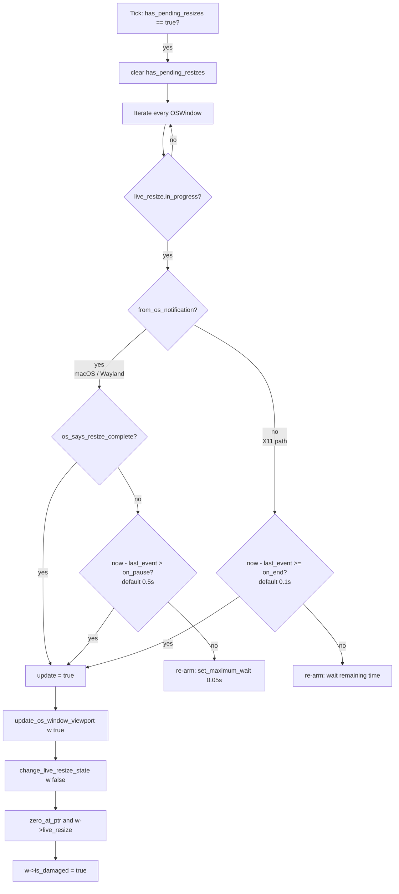
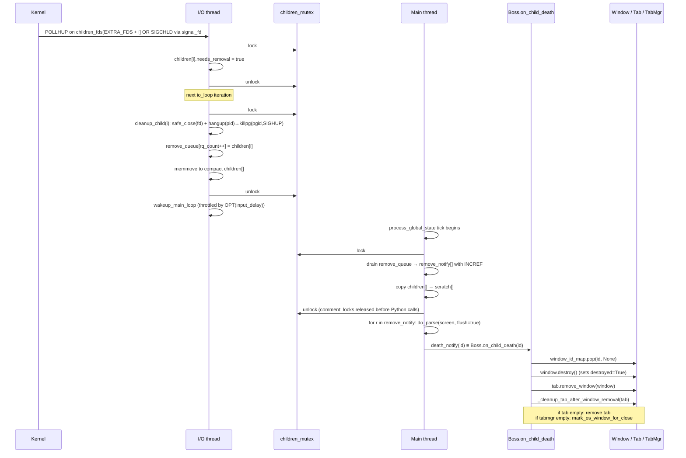
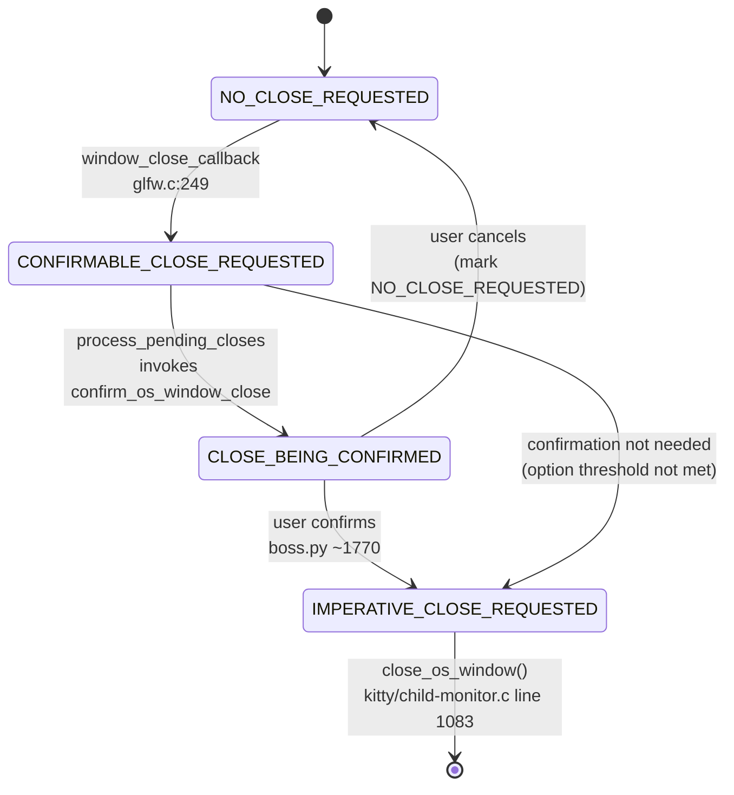

# Kitty Terminal Emulator: State Consistency During Rapid Window Lifecycle Events

**Repository:** [kovidgoyal/kitty](https://github.com/kovidgoyal/kitty)
**Commit:** `815df1e210e0a9ab4622f5c7f2d6891d7dbeddf1`
**Scope of analysis:** Read-only static analysis of the kitty source tree at the pinned commit.
**Deliverable purpose:** Evidence-based analysis of how kitty maintains internal state consistency when terminal windows are created, resized, and destroyed in rapid, overlapping succession.

---

## Introduction

This document analyses — strictly from source code at commit `815df1e210e0a9ab4622f5c7f2d6891d7dbeddf1` — how the kitty terminal emulator keeps its multi-layered, multi-threaded state machine coherent when window lifecycle events (creation, resize, destruction) overlap. Every factual claim is grounded in a specific file, function, and approximate line number. Where a behaviour cannot be verified from source, the document states so explicitly rather than infer.

The analysis is organised around five investigative questions:

1. **Creation-to-command race** — what ordering guarantees exist between window registration, PTY allocation, screen initialisation, and the first byte of child-process I/O?
2. **Resize event propagation** — how do resize events and the derived `SIGWINCH` flow through the multi-threaded architecture, and what debouncing strategies prevent redundant reflows?
3. **Premature destruction** — if a window is destroyed before pending resize events, signal deliveries, or rendering operations have completed, how does kitty decide what state to keep and what to discard?
4. **Conflicting liveness views** — are there moments where different threads hold contradictory beliefs about whether a window is alive, and how are those conflicts resolved?
5. **Signal timing** — how does signal delivery (via `signalfd` on Linux or the self-pipe trick on macOS/BSD) interact with the I/O thread's `poll()` loop and the main thread's state processing?

### Three-Thread Architecture

Kitty runs three cooperating threads:

| Thread | Entry point | Role |
|--------|-------------|------|
| **Main thread** | `main_loop()` in `kitty/child-monitor.c` (line 1259) → `run_main_loop(process_global_state, self)` (line 1262) | Runs Python (`Boss`), GLFW event loop, rendering, layout, and state reconciliation via `process_global_state()` (line 1224). |
| **I/O thread** | `io_loop()` in `kitty/child-monitor.c` (line 1481) | Polls PTY fds, the signal fd, and the wakeup fd. Reads PTY output into per-screen ring buffers, flushes outgoing writes, reaps dead children, and notifies the main thread. |
| **Talk thread** | `talk_loop()` in `kitty/child-monitor.c` (line 1581+) | Optional. Accepts peer connections for the remote-control protocol. |

The I/O thread (and optionally the talk thread) is spawned by `start()` in `kitty/child-monitor.c` (line 281) via `pthread_create(&self->io_thread, NULL, io_loop, self)` (line 291). Thread naming is performed inside `io_loop()` at line 1489: `set_thread_name("KittyChildMon")`.

Critically, signals are masked *process-wide* **before** GLFW spawns its display threads. In `kitty/main.py`, line 513 invokes `mask_kitty_signals_process_wide()` and only *then* (line 514) does it call `init_glfw(...)`. This ordering ensures that the only thread that can dequeue the masked signals is the I/O thread, which establishes its own signal fd (Linux) or self-pipe (macOS/BSD) after its creation.

### `GlobalState` Hierarchy

All window state lives under the `GlobalState` structure defined in `kitty/state.h` (struct around lines 259–280). Its shape is a three-level array hierarchy:

```
GlobalState
  └── OSWindow[] os_windows      (array of top-level GLFW windows)
        └── Tab[] tabs            (array of tabs per OS window)
              └── Window[] windows (array of terminal windows per tab)
```

Per `kitty/state.h` (roughly lines 156–280):

- **`Window`** (lines ~156–172) — fields include `id_type id`, `bool visible`, `WindowRenderData render_data`, `WindowGeometry geometry`, and `WindowLogoRenderData window_logo`.
- **`Tab`** (lines ~186–191) — fields include `id_type id`, `unsigned int active_window`, `unsigned int num_windows`, `unsigned int capacity`, `Window *windows`.
- **`OSWindow`** (lines ~216–256) — fields include `id_type id`, `LiveResizeInfo live_resize`, `bool is_semi_transparent`, `bool has_pending_resizes`, `CloseRequest close_request`, `Tab *tabs`, `unsigned int last_active_window_id`, `FONTS_DATA_HANDLE fonts_data`.
- **`GlobalState`** (lines ~259–280) — fields include `OSWindow *os_windows`, `size_t num_os_windows, capacity`, `bool has_pending_resizes`, `bool has_pending_closes`, `PyObject *boss`.

Every entity carries a monotonically increasing `id_type id`. Lookup is linear-scan via three guard macros in `kitty/state.c`:

- `WITH_OS_WINDOW(os_window_id) { ... }` (defined at line 24) — scans `global_state.os_windows` and silently no-ops if the id is not found.
- `WITH_TAB(os_window_id, tab_id) { ... }` (line 30) — two-level nested scan; silent no-op.
- `WITH_WINDOW(os_window_id, tab_id, window_id) { ... }` (line 39) — three-level nested scan; silent no-op.

The silent no-op behaviour is a *deliberate* resilience mechanism: any request (resize, redraw, geometry update, etc.) that references an id no longer in the `GlobalState` is dropped without raising an error. This is one of the principal tools kitty uses to absorb races between rapid lifecycle events.

Array element removal is centralised through the `REMOVER` macro (line 14 of `state.c`), which packs the tail over the removed slot and invokes a per-type destroy callback. Direct call sites include:

- `REMOVER(tab->windows, id, tab->num_windows, destroy_window, tab->capacity);` (line 356) — window removal.
- `REMOVER(os_window->tabs, id, os_window->num_tabs, destroy_tab, os_window->capacity);` (line 452) — tab removal.
- `REMOVER(global_state.os_windows, os_window_id, global_state.num_os_windows, destroy_os_window_item, global_state.capacity);` (line 491) — OS window removal.

### `LiveResizeInfo` and `CloseRequest`

Two substructures are pivotal:

- **`LiveResizeInfo`** (`kitty/state.h` lines ~196–202) — per `OSWindow` debounce and coalescing state. Fields: `monotonic_t last_resize_event_at`, `bool in_progress`, `bool from_os_notification`, `bool os_says_resize_complete`, `unsigned int width`, `unsigned int height`, `unsigned int num_of_resize_events`.
- **`CloseRequest`** (`kitty/state.h`, enum) — state machine for close intent: `NO_CLOSE_REQUESTED`, `CONFIRMABLE_CLOSE_REQUESTED`, `CLOSE_BEING_CONFIRMED`, `IMPERATIVE_CLOSE_REQUESTED`.

### Synchronisation Primitives

Kitty uses three mutexes:

| Primitive | Location | Protects |
|-----------|----------|----------|
| `children_lock` | `pthread_mutex_t` created at `kitty/child-monitor.c:164` via `pthread_mutex_init` | `children[]`, `add_queue[]`, `remove_queue[]`, `remove_notify[]`, `monitored_pids`, `reaped_pids`, `kill_signal_received`, `reload_config_signal_received`. The wrapper macro is `children_mutex(op)` at line 76. |
| `talk_lock` | `pthread_mutex_t` created at `kitty/child-monitor.c:168` | `messages[]` and talk-thread state. Wrapper macro `talk_mutex(op)`. |
| `screen_mutex(op, read|write)` | Per-`Screen` mutex | `read_buf` / `write_buf` of each Screen. Used in `io_loop` around lines 1502–1504, 1446–1477. |

Static storage for the shared arrays is declared at `kitty/child-monitor.c` lines 82–85:

```c
static Child children[MAX_CHILDREN] = {{0}};
static Child scratch[MAX_CHILDREN] = {{0}};
static Child add_queue[MAX_CHILDREN] = {{0}}, remove_queue[MAX_CHILDREN] = {{0}}, remove_notify[MAX_CHILDREN] = {{0}};
static size_t add_queue_count = 0, remove_queue_count = 0;
```

`EXTRA_FDS` is defined as `2` (line 35): `children_fds[0]` is the wakeup fd (main-thread → I/O-thread notification), `children_fds[1]` is the signal fd. Child PTY fds occupy `children_fds[EXTRA_FDS + i]`.

### The Main Tick: `process_global_state`

The single most important ordering invariant in the entire design is the order of operations inside `process_global_state()` (`kitty/child-monitor.c:1224`):

```c
static void
process_global_state(void *data) {
    // ...
    monotonic_t now = monotonic();
    if (global_state.has_pending_resizes) {
        process_pending_resizes(now);           // 1) resizes FIRST
        input_read = true;
    }
    if (parse_input(self)) input_read = true;   // 2) child I/O + death notifications
    render(now, input_read);                    // 3) GPU render
#ifdef __APPLE__
    if (has_cocoa_pending_actions) { ... }
#endif
    report_reaped_pids();                       // 4) zombie notifications
    bool should_quit = false;
    if (global_state.has_pending_closes)
        should_quit = process_pending_closes(self); // 5) closes LAST
    if (should_quit) stop_main_loop();
    // ...
}
```

The same ordering is visible in the tick as lines 1232–1246. This guarantees that in any tick, *pending resizes are either applied or deferred before any close-related work runs*. The implications for state consistency are developed in detail across Sections 2 and 3.

With that groundwork in place, the remainder of the document answers each of the five questions in turn.

---

## Section 1 — Creation-to-Command Race

**Question:** When a new window is created and immediately used to run a command, what ordering guarantees exist between window registration, PTY allocation, screen initialisation, and the first byte of child-process I/O?

### 1.1 The Python Creation Path

A new kitty terminal window is typically created through one of two Python entry points:

- `Boss._new_os_window(...)` — creates a brand-new top-level GLFW window plus a tab plus a window.
- `Tab.new_window(...)` in `kitty/tabs.py` (line 504) — creates a new window inside an existing tab.

`Tab.new_window` (tabs.py:504) performs — in this strict order:

1. Instantiates a `Child` (wrapping argv, env, cwd, and stdin pipes).
2. Calls `child.fork()` (`kitty/child.py:276`) which returns a PID and sets up the master PTY fd.
3. Instantiates a `Window` (`kitty/window.py:544`) referencing the `Child`.
4. Calls `get_boss().add_child(window)` which registers the (window, pid, fd, screen) quadruple with the C-layer `ChildMonitor`.
5. Inserts the window into the tab's `WindowList` via `self._add_window(window, ...)`.
6. Triggers `self.relayout()` (tabs.py ~line 580) so the new window receives its geometry.

The source contains an explicit comment in `Tab.new_window` stating that the child must be added to the `ChildMonitor` *before* layout, so that the first `resize_pty()` during layout finds the child in one of the queues. This is a direct witness that the creation ordering is deliberate.

### 1.2 `Child.fork` — PTY Allocation and the Ready Pipe

`Child.fork` in `kitty/child.py` (lines 278–358) sets up two pipes. The snippet below is **illustrative / simplified** — omitted are the `run-shell` kitten branch, macOS `/usr/bin/login` wrapper, systemd scope placement, stdin-pipe routing, and several environment-preparation steps. The core sequence of syscalls and the critical ordering of file-descriptor manipulations mirror the actual source:

```python
# 1) Master/slave PTY pair (before any child-process creation).
master, slave = openpty()
# 2) A ready-pipe used to gate first output until the window is fully initialised.
ready_read_fd, ready_write_fd = os.pipe()
os.set_inheritable(ready_write_fd, False)  # parent keeps write end, not inherited
os.set_inheritable(ready_read_fd, True)    # child inherits read end
# 3) Spawn — a fork + execve implemented in the C extension.
#    The real call takes final_exe, cwd, argv tuple, env tuple, master/slave,
#    stdin fds, ready-pipe fds, handled_signals tuple, kitten_exe, forward_stdio.
pid = fast_data_types.spawn(
    final_exe, cwd, tuple(argv), env, master, slave,
    stdin_read_fd, stdin_write_fd,
    ready_read_fd, ready_write_fd,
    tuple(handled_signals), kitten_exe(), opts.forward_stdio,
)
# 4) Post-spawn, the parent keeps master; slave is closed on the parent side.
os.close(slave)
self.pid = pid
self.child_fd = master  # parent-side PTY master fd is stored after spawn
os.close(ready_read_fd)           # parent does not need the read end
self.terminal_ready_fd = ready_write_fd
os.set_blocking(self.child_fd, False)  # master is non-blocking
```

The **ready-pipe** is the linchpin of this section: the child process, before `exec`ing the user's shell, is expected to read from `ready_read_fd` and block until EOF. The parent holds the **write end** (`ready_write_fd`). The child therefore cannot race ahead and emit output until the parent explicitly releases it by **closing the write end** of the ready-pipe, which is done in `Child.mark_terminal_ready()` (`kitty/child.py:362`):

```python
def mark_terminal_ready(self) -> None:
    os.close(self.terminal_ready_fd)
    self.terminal_ready_fd = -1
```

Once the parent closes the write end, the child's blocked `read` on the read end returns EOF, and the child proceeds to `exec` its shell/program.

### 1.3 `Window.__init__` — Screen Creation and C-Layer Registration

`Window.__init__` in `kitty/window.py:544` performs — in this strict order (verified from `kitty/window.py` lines 544–605):

1. Installs watchers (`self.watchers = ...`).
2. Initialises early bookkeeping fields: `self.last_focused_at`, `self.is_focused`, `self.last_resized_at`, `self.started_at`, `self.created_at`, `self.child_is_launched = False`, `self.last_reported_pty_size = (-1, -1, -1, -1)`, etc.
3. Registers the window with the C layer **before** creating the `Screen`: `self.id: int = add_window(tab.os_window_id, tab.id, self.title)` at `kitty/window.py` line 588 — the C function `add_window` is in `kitty/state.c:296`. This gives the window a valid `id` that the Screen can reference.
4. Performs further bookkeeping: `self.clipboard_request_manager = ClipboardRequestManager(self.id)`, `self.margin`, `self.padding`, `self.tab_id`, `self.os_window_id`, `self.tabref`, `self.destroyed = False`, `self.geometry = WindowGeometry(0, 0, 0, 0, 0, 0)`, `self.needs_layout = True`, `self.is_visible_in_layout = True`, `self.child = child`, and cell-size lookup.
5. Creates the `Screen` object **after** the C-layer registration: `self.screen: Screen = Screen(self, 24, 80, opts.scrollback_lines, cell_width, cell_height, self.id)` at `kitty/window.py` line 604 — the default initial size is **24 rows × 80 columns** (hard-coded because layout hasn't produced a geometry yet), and the Screen is passed the already-valid `self.id`.

After this, the C-layer `Window *` slot inside `os_window->tabs[t].windows[]` carries a valid id and is ready to be reached through `WITH_WINDOW`. Critically, the Screen is fully constructed **before** the child is handed to the `ChildMonitor` in step 4 of §1.1, and the C-layer `add_window()` has already executed **before** the Screen constructor runs — so the Screen's reference to `self.id` is always valid.

### 1.4 `ChildMonitor.add_child` — Handoff to the I/O Thread

`Boss.add_child` in `kitty/boss.py` (around line 585) calls the C-backed `ChildMonitor.add_child(window_id, pid, fd, screen)`. The C implementation is `add_child` in `kitty/child-monitor.c` (lines 304–321):

```c
static PyObject *
add_child(ChildMonitor *self, PyObject *args) {
    children_mutex(lock);
    if (self->count + add_queue_count >= MAX_CHILDREN) { /* error */ }
    add_queue[add_queue_count] = EMPTY_CHILD;
    // parses (id, pid, fd, screen) into add_queue[add_queue_count]
    if (!PyArg_ParseTuple(args, "kiiO", A(id), A(pid), A(fd), A(screen))) { ... }
    INCREF_CHILD(add_queue[add_queue_count]);  // Py_INCREF the screen
    add_queue_count++;
    children_mutex(unlock);
    wakeup_io_loop(self, false);
    Py_RETURN_NONE;
}
```

Two invariants are established here:

1. The write of `add_queue[...]` and the increment of `add_queue_count` both occur **under `children_mutex`** — so the I/O thread, which also locks `children_mutex`, cannot observe a half-constructed `Child` entry.
2. `wakeup_io_loop(self, false)` (`kitty/child-monitor.c`) posts to the wakeup fd, breaking the I/O thread out of its blocking `poll()` so that it picks up the new child on the next iteration.

### 1.5 The I/O Thread Incorporates the New Child

On its next iteration, `io_loop` (`kitty/child-monitor.c:1481`) performs, in order:

```c
while (LIKELY(!self->shutting_down)) {
    children_mutex(lock);
    remove_children(self);   // drain remove_queue → free slots
    add_children(self);      // drain add_queue → populate children[] and children_fds[]
    children_mutex(unlock);
    // ... build poll set, poll(), handle events, wakeup main thread ...
}
```

`add_children` (lines 1281–1290) moves entries out of `add_queue[]` and into `children[]`, and critically sets `children_fds[EXTRA_FDS + self->count].fd = children[self->count].fd` with `events = POLLIN`. After this point, the child's master PTY fd is in the poll set and its output will be read in subsequent iterations.

### 1.6 The Race and How It Is Absorbed

Consider the time-critical sequence for a brand-new window:

```
T0:  fast_data_types.spawn() returns (child is forked; child is blocked on ready_read_fd)
T1:  ChildMonitor.add_child() pushes to add_queue under children_mutex
T2:  wakeup_io_loop() posts to wakeup fd
T3:  I/O thread wakes, locks children_mutex, moves add_queue → children[], sets up poll fds
T4:  I/O thread polls
T5:  Main thread eventually runs Tab.relayout → Layout.__call__ → Window.set_geometry
T6:  Window.set_geometry issues resize_pty → ioctl(TIOCSWINSZ) → kernel SIGWINCH to child pgid
T7:  First call of Window.set_geometry also calls self.child.mark_terminal_ready()
T8:  Child unblocks from ready_read_fd (EOF) and exec's the shell
T9:  Shell starts producing output into PTY buffer
T10: I/O thread polls master fd, POLLIN, reads into Screen
```

The **race** that is structurally prevented is "shell output before Screen is ready":

- **Constraint 1 (enforced by ready-pipe)**: the child cannot `exec` until the parent calls `mark_terminal_ready()`. `mark_terminal_ready()` is only called **inside** `Window.set_geometry()` (kitty/window.py around lines 876–884) and only **after** the first successful `resize_pty()`. Therefore no shell can write output before the geometry and Screen are both valid.
- **Constraint 2 (enforced by `children_mutex`)**: the I/O thread can never observe `add_queue_count` incremented with a half-populated entry — the write and the increment occur under the same lock. Similarly, `add_children()` is only called while holding `children_mutex`.
- **Constraint 3 (enforced by `resize_pty`)**: even if layout is triggered very early (e.g. right after `add_child`), the C-level `resize_pty` (`kitty/child-monitor.c:592`) searches **both** `children[]` and `add_queue[]`. The relevant code is:

```c
FIND(children, self->count);
if (fd == -1) FIND(add_queue, add_queue_count);
if (fd != -1) {
    if (!pty_resize(fd, &dim)) PyErr_SetFromErrno(PyExc_OSError);
} else log_error("Failed to send resize signal to child with id: %lu ...", ...);
```

This elegantly handles the micro-race where the I/O thread has not yet promoted the child from `add_queue` to `children[]`.

There is nevertheless a theoretically possible window where the child is already fork-spawned (T0) and the I/O thread has not yet polled its fd (T4+). If the child ignored the ready-pipe and began writing, those bytes would be buffered inside the **kernel PTY layer** until `read()` on the master side drains them. The ready-pipe is there precisely so that the child never does this — but even without it, no data would be lost; it would simply wait in kernel buffers.

### 1.7 Sequence Diagram

```mermaid
sequenceDiagram
    participant User
    participant Python as Main Thread (Python)
    participant C as Main Thread (C)
    participant IO as I/O Thread
    participant Kernel as Kernel PTY
    participant Child as Child Process

    User->>Python: keyboard shortcut "new window"
    Python->>Python: Tab.new_window() (tabs.py:504)
    Python->>Python: Child.fork() (child.py:276)
    Python->>Kernel: openpty() ⇒ (master, slave)
    Python->>Kernel: os.pipe() ⇒ (ready_r, ready_w)
    Python->>Kernel: fast_data_types.spawn()
    Kernel->>Child: fork child; child blocks on read(ready_r)
    Python->>Python: Window.__init__ (window.py:544)
    Note over Python: new Screen(24, 80); add_window() C-API
    Python->>C: ChildMonitor.add_child(id, pid, fd, screen)
    C->>C: children_mutex(lock)
    C->>C: add_queue[n] = Child; add_queue_count++
    C->>C: children_mutex(unlock)
    C->>IO: wakeup_io_loop()
    Python->>Python: Tab.relayout() → Layout.__call__
    Python->>Python: Window.set_geometry(geom) [window.py:850]
    Note over Python: if self.destroyed: return (no-op)
    Python->>C: resize_pty(id, rows, cols, ...)
    C->>C: search children[] then add_queue[]
    C->>Kernel: ioctl(fd, TIOCSWINSZ, dim) [pty_resize, line 577]
    Kernel->>Child: SIGWINCH to child pgid (when fg)
    Python->>Python: self.child.mark_terminal_ready()
    Python->>Kernel: os.close(ready_w)
    Kernel->>Child: read(ready_r) returns EOF
    Child->>Kernel: exec shell; writes to PTY slave
    IO->>IO: add_children() moves add_queue → children[]
    IO->>Kernel: poll([wakeup_fd, signal_fd, children_fds...])
    Kernel-->>IO: POLLIN on children_fds[EXTRA_FDS + i]
    IO->>Kernel: read_bytes(fd, screen)
    IO->>C: wakeup_main_loop()
    C->>Python: parse_input → do_parse → Screen updates
```

### 1.8 Key Findings for Section 1

1. **Ready-pipe gating** — the child cannot emit any output before `mark_terminal_ready()` closes the write end of the ready-pipe. `mark_terminal_ready()` is only invoked inside `Window.set_geometry()` after the first successful `resize_pty()` (kitty/window.py ~lines 876–884). This eliminates the "output before Screen is ready" race at its source.
2. **Kernel PTY buffering as fallback** — even if a pathological child wrote before being released, bytes would wait in kernel PTY buffers, not be lost.
3. **`resize_pty` dual-queue search** — `kitty/child-monitor.c:592–614` searches both `children[]` and `add_queue[]` to resolve the micro-race where the I/O thread has not yet promoted a newly added child.
4. **`children_mutex` serialisation** — every cross-thread array operation (add, remove, inspect) occurs under `children_mutex`, preventing the observation of half-constructed `Child` entries.
5. **Initial Screen size is 24×80** — `kitty/window.py:544` hard-codes this because the first real geometry has not been computed yet.

---

## Section 2 — Resize Event Propagation and Debouncing

This section traces the resize pipeline from the OS window-manager event all the way through to the `ioctl(TIOCSWINSZ)` that triggers `SIGWINCH` in the child process. Kitty coalesces rapid resize events into a single final reflow per OS window and uses two distinct debounce strategies depending on whether the platform signals resize start/end transitions.

### 2.1 Entry Points — GLFW Callbacks

Resize events originate in GLFW callbacks installed per OS window in `kitty/glfw.c`:

| Callback | File/line (approx.) | Trigger | Action summary |
|----------|----------------------|---------|----------------|
| `framebuffer_size_callback` | `kitty/glfw.c` line 330 | OS reports new framebuffer dimensions (continuous during drag-resize on X11/Wayland/macOS) | Sets `global_state.has_pending_resizes = true`, records `live_resize.last_resize_event_at`, stores `width`/`height`, increments `num_of_resize_events`. |
| `live_resize_callback` | `kitty/glfw.c` line 316 | OS signals resize start/end (macOS and GLFW-Wayland provide this; X11 does not) | Sets `live_resize.from_os_notification = true`; on end sets `live_resize.os_says_resize_complete = true`. |
| `dpi_change_callback` | `kitty/glfw.c` line 349 | Monitor DPI changes (screen migration, HiDPI toggle) | Triggers `change_live_resize_state(true)`, sets `has_pending_resizes = true`. |
| `window_close_callback` | `kitty/glfw.c` line 249 | User clicks close button / system close gesture | Sets `close_request = CONFIRMABLE_CLOSE_REQUESTED`; handled in Section 3. |

The `framebuffer_size_callback` takes the following key actions (paraphrased from `kitty/glfw.c` around line 330 onward):

```
if (ignore_resize_events) return;           // early exit during shutdown
if (width < min || height < min) return;    // validate minimum size
global_state.has_pending_resizes = true;    // schedule work for main thread
change_live_resize_state(window, true);     // toggle live resize flag
w->live_resize.last_resize_event_at = monotonic();
w->live_resize.width  = width;              // LATEST dimensions only
w->live_resize.height = height;
w->live_resize.num_of_resize_events++;      // count for diagnostics
make_os_window_context_current(window);
update_surface_size(width, height, 0);
request_tick_callback();                    // wake main loop
```

**Coalescing semantics**: since `live_resize.width` and `live_resize.height` are overwritten on every callback invocation, only the **latest** dimensions survive. Intermediate sizes during a drag-resize are silently discarded.

### 2.2 `LiveResizeInfo` — The Debounce State

The `LiveResizeInfo` struct lives inside every `OSWindow` in `kitty/state.h` (approximately lines 196–202):

```c
typedef struct LiveResizeInfo {
    monotonic_t last_resize_event_at;
    bool in_progress;
    bool from_os_notification;
    bool os_says_resize_complete;
    unsigned int width, height;
    unsigned int num_of_resize_events;
} LiveResizeInfo;
```

Each `OSWindow` also carries `bool has_pending_resizes` (inherited via the global flag `global_state.has_pending_resizes` that triggers per-window inspection during the tick). The struct is zeroed via `zero_at_ptr(&w->live_resize)` when a resize cycle completes (`kitty/child-monitor.c` inside `process_pending_resizes()`).

`change_live_resize_state()` at `kitty/glfw.c` line 300 toggles `in_progress` and, on non-macOS platforms, switches the GLFW swap interval to `0` during the live resize (disabling vsync to keep the resize overlay responsive); it restores the configured interval when live resize ends.

### 2.3 Debounce Decision — `process_pending_resizes()`

Invoked once per main-loop tick as the **first** step of `process_global_state()` in `kitty/child-monitor.c` (line 1224), the `process_pending_resizes()` function (starting around line 1043) applies one of two debounce strategies per OS window.



Two key behaviours:

1. **OS-notification path** (`from_os_notification == true`): kitty trusts the OS to signal resize completion. It also installs a fallback `on_pause` timeout (default 0.5s) that fires if the OS-end signal is lost or delayed, with a throttled 50ms re-check via `set_maximum_wait(s_double_to_monotonic_t(0.05))`.
2. **No-notification path** (X11 and most backends): kitty infers resize completion by observing quiescence — if `on_end` (default 0.1s) has elapsed since the most recent `framebuffer_size_callback` without any new event, the resize is treated as complete. The remaining wait is computed exactly: `set_maximum_wait(debounce_time - (now - last_resize_event_at))`.

**Per-OSWindow isolation**: Each `OSWindow` carries its own `LiveResizeInfo`, so windows resize independently. A slow resize on one window does not block reflow of another.

### 2.4 Debounce Defaults — `resize_debounce_time`

Default from `kitty/options/definition.py` (option declaration around line 1182):

```
resize_debounce_time = '0.1 0.5'
```

- `on_end` = 0.1s — used when the OS does **not** signal resize end (X11, some GLFW backends)
- `on_pause` = 0.5s — used as a fallback timeout when the OS *does* signal resize start/end (macOS, Wayland)

The typed container `Options.resize_debounce_time: Tuple[float, float]` (`kitty/options/types.py` line ~568) defaults to `(0.1, 0.5)`. The option is consumed as `OPT(resize_debounce_time).on_pause` and `OPT(resize_debounce_time).on_end` in `child-monitor.c`.

### 2.5 Viewport Update — `update_os_window_viewport()`

Once the debounce window elapses, `update_os_window_viewport()` in `kitty/glfw.c` (line 130) is invoked with `notify_boss = true`. It:

1. Reads current framebuffer and window dimensions via `glfwGetFramebufferSize()` and `glfwGetWindowSize()`.
2. Computes content scale and DPI values.
3. **Early-return dedup**: if `fw == w->viewport_width && fh == w->viewport_height && window_width == w->window_width && window_height == w->window_height && xdpi == new_xdpi && ydpi == new_ydpi`, it returns without further action.
4. Validates minimum dimensions.
5. Computes `viewport_x_ratio` and `viewport_y_ratio`.
6. Detects DPI changes by comparing ratios.
7. Sets `viewport_size_dirty = true` on the OS window.
8. Invokes the boss: `call_boss(on_window_resize, "KiiO", window->id, viewport_width, viewport_height, dpi_changed ? Py_True : Py_False)`.

### 2.6 Python Fan-Out — Boss → TabManager → Tab → Layout

```
Boss.on_window_resize()            (kitty/boss.py line 1206)
    └─▶ tm.resize()                (kitty/tabs.py line 963 — TabManager.resize)
          ├─▶ tab_bar layout
          └─▶ for each tab: tab.relayout()   (kitty/tabs.py line 298)
                └─▶ self.current_layout(self.windows)     (Layout.__call__)
                      └─▶ Layout.__call__                 (kitty/layout/base.py line 329)
                            ├─▶ _set_dimensions()
                            ├─▶ update_visibility()
                            └─▶ do_layout()               (subclass-specific)
                                  └─▶ set_window_group_geometry()   (layout/base.py line 388)
                                        └─▶ WindowGroup.set_geometry(geom)   (window_list.py:118)
                                              └─▶ for w in group.windows:
                                                    w.set_geometry(geom)     (window.py line 850)
```

- `Boss.on_window_resize()` in `kitty/boss.py` (line 1206) first branches on `dpi_changed`; if True it calls `on_dpi_change(os_window_id)`, else it delegates to `tm.resize()`.
- `TabManager.resize()` in `kitty/tabs.py` (line 963) recomputes the tab-bar placement, then iterates and invokes `tab.relayout()` on every tab — even hidden tabs — so that a later switch to a hidden tab has fresh geometry.
- `Tab.relayout()` at `kitty/tabs.py` (line 298) invokes `self.current_layout(self.windows)` (i.e., `Layout.__call__`) and then `relayout_borders()`.
- `Layout.__call__()` in `kitty/layout/base.py` (line 329) is a three-step chain: `_set_dimensions()` (cell/pixel math) → `update_visibility()` → `do_layout()` (subclass: Tall, Grid, Stack, Splits, etc.).
- `Layout.do_layout()` (line 394 in `base.py`) raises `NotImplementedError` — subclasses must override.
- `Layout.set_window_group_geometry()` (line 388) constructs a `WindowGeometry` and calls `wg.set_geometry(geom)`.
- `WindowGroup.set_geometry()` in `kitty/window_list.py` (line 118) iterates `self.windows` and calls `w.set_geometry(geom)` for each window in the group (groups exist to share geometry between overlays and their underlying windows).

### 2.7 Final Leg — `Window.set_geometry()`

The terminal leg of the resize chain is `kitty/window.py:set_geometry()` at line 850. The excerpt below mirrors the actual source (lines 850–882), with only minor whitespace elisions — identifiers, conditions, and ordering are preserved verbatim:

```python
def set_geometry(self, new_geometry: WindowGeometry) -> None:
    if self.destroyed:
        return                                          # Premature-destruction guard (first statement)
    if self.needs_layout or new_geometry.xnum != self.screen.columns or new_geometry.ynum != self.screen.lines:
        self.screen.resize(max(0, new_geometry.ynum), max(0, new_geometry.xnum))
        self.needs_layout = False
        call_watchers(weakref.ref(self), 'on_resize', {'old_geometry': self.geometry, 'new_geometry': new_geometry})
    current_pty_size = (
        self.screen.lines, self.screen.columns,
        max(0, new_geometry.right - new_geometry.left),
        max(0, new_geometry.bottom - new_geometry.top))
    update_ime_position = False
    if current_pty_size != self.last_reported_pty_size:
        boss = get_boss()
        boss.child_monitor.resize_pty(self.id, *current_pty_size)
        self.last_resized_at = monotonic()
        if not self.child_is_launched:
            self.child.mark_terminal_ready()           # Release the ready-pipe (first resize only)
            self.child_is_launched = True
            update_ime_position = True
        self.last_reported_pty_size = current_pty_size
    else:
        mark_os_window_dirty(self.os_window_id)        # No PTY change: schedule a repaint
    self.geometry = g = new_geometry                   # Geometry assigned AFTER pty-size handshake
    set_window_render_data(self.os_window_id, self.tab_id, self.id, self.screen, *g[:4])
    self.update_effective_padding()
    if update_ime_position:
        update_ime_position_for_window(self.id, True)
```

Four critical details:

1. The `self.destroyed` check is the **first statement** — any resize arriving after `Window.destroy()` has set this flag is a no-op, protecting against calls into a freed `Screen`.
2. The reflow condition tests `self.needs_layout or new_geometry.xnum != self.screen.columns or new_geometry.ynum != self.screen.lines` — it compares against **the Screen's current dimensions** (`self.screen.columns/lines`), not against `self.geometry.xnum/ynum`. This is important because `self.screen` is the authoritative source of truth for cell dimensions (a prior `Screen.resize()` may have changed them even without a geometry update). The `needs_layout` flag is cleared once reflow completes.
3. `resize_pty` is skipped if `current_pty_size == self.last_reported_pty_size`, avoiding redundant ioctls and redundant `SIGWINCH`es. When skipped, the else branch still calls `mark_os_window_dirty(self.os_window_id)` so a repaint is scheduled.
4. The first successful resize triggers `mark_terminal_ready()` (closing the ready-pipe's write end, `kitty/child.py` line 363) — this is the handshake that unblocks the freshly forked child so it can begin executing the shell. Only on this first call does `update_ime_position_for_window(self.id, True)` run (after geometry is assigned).
5. `self.geometry = g = new_geometry` happens **after** the pty-size handshake, so any exception inside `resize_pty()` leaves the prior `self.geometry` intact. `set_window_render_data` and `update_effective_padding` then run with the freshly committed geometry.

### 2.8 Screen Reflow — `screen_resize()`

`Screen.resize(ynum, xnum)` is implemented in `kitty/screen.c:screen_resize()` starting at line 346. It:

1. First calls `screen_pause_rendering(self, false, 0)` — rendering pauses are incompatible with reflow because the snapshotted linebuf becomes stale.
2. Preserves cursor state (x, y, pending wrap).
3. Reallocates the history buffer if columns changed.
4. Reallocates the main `linebuf` and `alt` (alternate-screen) linebuf via `realloc_lb()`, which copies/reflows content into the new shape.
5. Preserves prompt tracking state for shell-integration.
6. Resizes any active graphics managers.
7. Resets tabstops, margins, and clears selections.

The cost is substantial for large scrollback, which is why the debounce layers above are necessary — without them, every mouse-driven resize step would reflow the entire history.

### 2.9 PTY Resize — `resize_pty()` and `SIGWINCH` Delivery

From Python, `Window.set_geometry()` calls `boss.child_monitor.resize_pty(self.id, rows, cols, xpix, ypix)`. The C implementation is in `kitty/child-monitor.c` around lines 592–614:

```c
static PyObject*
resize_pty(ChildMonitor *self, PyObject *args) {
    unsigned long window_id;
    struct winsize dim;
    /* argument unpacking omitted */
    children_mutex(lock);
    for (size_t i = 0; i < self->count; i++) {
        if (children[i].id == window_id) {
            if (!pty_resize(children[i].fd, &dim)) { /* log */ }
            goto end;
        }
    }
    /* Fall-back: child is still in add_queue, not yet promoted to children[] */
    for (size_t i = 0; i < add_queue_count; i++) {
        if (add_queue[i].id == window_id) {
            if (!pty_resize(add_queue[i].fd, &dim)) { /* log */ }
            goto end;
        }
    }
end:
    children_mutex(unlock);
    Py_RETURN_NONE;
}
```

Two reliability details:

1. **Dual-queue search** — both `children[]` (promoted) and `add_queue[]` (pending promotion) are searched. This resolves the micro-race where a new window's `set_geometry()` runs before the I/O thread has invoked `add_children()` in its next poll iteration.
2. **`pty_resize()` tolerance** — `pty_resize()` (around line 577 of `child-monitor.c`) issues `ioctl(fd, TIOCSWINSZ, dim)` inside an `EINTR` retry loop and tolerates `EBADF`/`ENOTTY` (which occur if the fd was just closed), logging without aborting.

The kernel-side effect of `ioctl(TIOCSWINSZ)` is twofold: it updates the PTY's stored winsize (readable by the child via `ioctl(0, TIOCGWINSZ, ...)`), and it delivers `SIGWINCH` to the foreground process group of the PTY. Kitty therefore never signals the child directly; it relies on kernel semantics to deliver the resize notification.

### 2.10 Render Interaction — `screen_pause_rendering()`

When the user toggles rendering-pause via the kitty remote control, `screen_pause_rendering()` in `kitty/screen.c` snapshots the current linebuf state. Because this snapshot would become incoherent if the screen were resized, the first line of `screen_resize()` unconditionally unpauses rendering — this forces the snapshot to be discarded in favour of live content. This interaction is important during rapid resize sequences because a resize arriving during a paused-render period causes the pause to be silently dropped rather than producing visual artefacts.

### 2.11 Section 2 Key Findings

1. **Two debounce paths coexist** — macOS/Wayland use `on_pause` (0.5s default) with OS-delivered start/end signals; X11 uses `on_end` (0.1s default) based on quiescence detection.
2. **Intermediate dimensions are discarded** — `framebuffer_size_callback` overwrites `live_resize.width`/`height` on every call, so only the final drag position is ever reflowed.
3. **Per-OSWindow isolation** — each `OSWindow` owns its own `LiveResizeInfo`; resize storms on one window do not block reflow on another.
4. **Early-return dedup at three layers** — `update_os_window_viewport` skips if nothing changed; `set_geometry` skips `resize_pty` if `current_pty_size == last_reported_pty_size`; `pty_resize` tolerates dead fds.
5. **Dual-queue search in `resize_pty`** — handles the race where a newly created window has not yet been promoted from `add_queue[]` to `children[]`.
6. **SIGWINCH delivery via kernel, not direct `kill(2)`** — kitty issues `ioctl(TIOCSWINSZ)`; the kernel delivers the signal to the child's foreground pgid, so kitty never needs to know or track the child's pgid for resize purposes.
7. **Destroyed-guard in `set_geometry`** — any resize arriving after `Window.destroy()` becomes a no-op.
8. **Render pause implicitly cleared** — `screen_resize()` cancels any active `screen_pause_rendering` state to keep the snapshot coherent.

---

## Section 3 — Premature Window Destruction

A window can be destroyed at any time: the user may press `Ctrl+Shift+W`, the shell may exit, the OS may kill the window via the window manager's close button, or kitty itself may initiate cascade destruction when a tab or OS window closes. This section documents the layered defence that ensures resize events, signal deliveries, and rendering operations still-in-flight at the moment of destruction are handled without crashing, leaking resources, or operating on stale state.

### 3.1 Main-Loop Ordering Invariant — Resizes Before Closes

The cornerstone of destruction safety is the ordering of operations inside `process_global_state()` at `kitty/child-monitor.c` line 1224. A single tick executes in this strict sequence:

```
┌─ process_global_state (kitty/child-monitor.c line 1224) ─┐
│                                                          │
│  1. process_pending_resizes(now)      ← FIRST: resize    │
│                                                          │
│  2. parse_input(self)                 ← PTY output +     │
│                                         death notifies   │
│                                                          │
│  3. render(now, input_read)           ← GPU render       │
│                                                          │
│  4. report_reaped_pids()              ← zombie notifies  │
│                                                          │
│  5. process_pending_closes(self)      ← LAST: close      │
│                                                          │
│  6. if should_quit: stop_main_loop()                     │
│                                                          │
└──────────────────────────────────────────────────────────┘
```

**Consequence**: by the time `process_pending_closes()` runs, any pending resize has *already* been applied (or silently discarded via `WITH_OS_WINDOW` no-op if the target OS window has already disappeared from a previous tick). It is therefore impossible for `close_os_window()` and `process_pending_resizes()` to observe the same OS window in inconsistent states within the same tick.

### 3.2 Guard Layer 1 — The `destroyed` Flag in Python

At `kitty/window.py` line 850, the very first statement of `Window.set_geometry()` is:

```python
def set_geometry(self, new_geometry: WindowGeometry) -> None:
    if self.destroyed:
        return
```

`self.destroyed` is set to `True` inside `Window.destroy()` at `kitty/window.py` line 1561 — the actual source is:

```python
def destroy(self) -> None:
    self.call_watchers(self.watchers.on_close, {})
    self.destroyed = True
    self.clipboard_request_manager.close()
    del self.kitten_result_processors
    if hasattr(self, 'screen'):
        if self.is_active and self.os_window_id == current_focused_os_window_id():
            # Cancel IME composition when window is destroyed
            update_ime_position_for_window(self.id, False, -1)
        # Remove cycles so that screen is de-allocated immediately
        self.screen.reset_callbacks()
        del self.screen
```

IME cancellation is performed via the module-level `update_ime_position_for_window(self.id, False, -1)` — the `-1` sentinel indicates "cancel composition" — and is only invoked when the destroyed window was the active window inside the currently focused OS window. Screen teardown then proceeds via `self.screen.reset_callbacks()` followed by `del self.screen` (breaking the reference cycle so Python's garbage collector can deallocate the Screen immediately).

Between the moment Python calls `window.destroy()` and the moment the C layer's `remove_window()` completes, any resize path that re-enters `set_geometry()` returns immediately. Because the flag check precedes every other state mutation (including `self.screen.resize()`, `boss.child_monitor.resize_pty()`, and `set_window_render_data()`), there is no possibility of operating on a freed `Screen` object.

### 3.3 Guard Layer 2 — C-Layer `WITH_*` Macros

Defined in `kitty/state.c` lines 24–45:

```c
#define WITH_OS_WINDOW(os_window_id) \
    for (size_t os_window_idx = 0; os_window_idx < global_state.num_os_windows; os_window_idx++) { \
        OSWindow *os_window = global_state.os_windows + os_window_idx; \
        if (os_window->id == os_window_id) { do { ... } while (0); break; } \
    }

#define WITH_TAB(os_window_id, tab_id) \
    WITH_OS_WINDOW(os_window_id) \
        for (size_t ti = 0; ti < os_window->num_tabs; ti++) { \
            Tab *tab = os_window->tabs + ti; \
            if (tab->id == tab_id) { do { ... } while (0); break; } \
        } \
    END_WITH_OS_WINDOW

#define WITH_WINDOW(os_window_id, tab_id, window_id) \
    WITH_TAB(os_window_id, tab_id) \
        for (size_t wi = 0; wi < tab->num_windows; wi++) { \
            Window *w = tab->windows + wi; \
            if (w->id == window_id) { do { ... } while (0); break; } \
        } \
    END_WITH_TAB
```

Every C function that mutates window state — `set_window_render_data()`, `update_window_title()`, `resize_screen()`, etc. — uses these macros. If the target id is not found, the loop body is silently skipped — there is **no error, no logging, and no abort**. This is by design: it makes every C-level operation idempotent with respect to a missing target.

### 3.4 Guard Layer 3 — Array-Based Storage with `REMOVER` Macro

The `REMOVER` macro at `kitty/state.c` line 14 compacts arrays when elements are removed:

```c
#define REMOVER(array, id, count, destroy, capacity) \
    for (size_t i = 0; i < count; i++) { \
        if ((array)[i].id == id) { \
            destroy((array) + i); \
            memmove((array) + i, (array) + i + 1, sizeof((array)[0]) * (count - i - 1)); \
            count--; \
            memset((array) + count, 0, sizeof((array)[0])); \
            break; \
        } \
    }
```

It is used in three places:

- `kitty/state.c` line 356: `remove_window_inner()` → removes from `tab->windows[]`
- `kitty/state.c` line 452: `destroy_tab()` → removes from `os_window->tabs[]`
- `kitty/state.c` line 491: `remove_os_window()` → removes from `global_state.os_windows[]`

After each removal, the array is compacted (`memmove`) and the trailing slot is zeroed (`memset`). This means pointer-valued global references (such as `global_state.callback_os_window` and `global_state.focused_window_id`) must be saved and restored across `REMOVER` calls — that is the purpose of `WITH_OS_WINDOW_REFS` (defined around `state.c` line 55+), which captures these ids before the remover runs and re-resolves them afterward.

### 3.5 Child-Death Cascade — I/O Thread → Main Thread

When a child process dies (its PTY fd returns EOF, or `SIGCHLD` arrives), the destruction cascade runs mostly on the I/O thread:



Key file/line references:

- **`cleanup_child`** — `kitty/child-monitor.c` line 1306: calls `safe_close(children[i].fd)` and `hangup(children[i].pid)`. `hangup()` (defined earlier in the same file) calls `killpg(pgid, SIGHUP)` — **only SIGHUP**, no SIGKILL. A `grep -n "SIGKILL" kitty/child-monitor.c` confirms the absence.
- **`parse_input`** — `kitty/child-monitor.c` line 451: drains `remove_queue` into `remove_notify[]` under `children_mutex`, copies `children[]` to `scratch[]`, then **releases the mutex** before invoking Python callbacks. The code comment is explicit: *"must be done while no locks are held, since the locks are non-recursive and the python function could call into other functions in this module"*.
- **Last-byte flush** — for each removed child, `parse_input` calls `do_parse(screen, ..., true)` **before** calling `death_notify`. This ensures any PTY bytes that arrived between the I/O thread's last `read_bytes()` and its closure of the fd are parsed into the `Screen` so scrollback remains complete.
- **`Boss.on_child_death`** — `kitty/boss.py` line 881: pops from `self.window_id_map` (with default `None` so double-calls are safe), calls `window.destroy()`, then finds the tab via linear scan and calls `tab.remove_window(window)` followed by `_cleanup_tab_after_window_removal(tab)`.

### 3.6 OS-Window Close Cascade — CloseRequest State Machine

The `CloseRequest` enum (`kitty/state.h`) captures the lifecycle of a user-initiated close request. The state machine is driven by `process_pending_closes()` at `kitty/child-monitor.c` line 1098:



Per-state handling in `process_pending_closes()` (pseudocode, from `kitty/child-monitor.c` lines 1098–1134):

```c
for each OSWindow w:
    switch (w->close_request) {
    case NO_CLOSE_REQUESTED:
        has_open_windows = true;
        break;
    case CONFIRMABLE_CLOSE_REQUESTED:
        w->close_request = CLOSE_BEING_CONFIRMED;
        call_boss(confirm_os_window_close, "K", w->id);
        if (w->close_request == IMPERATIVE_CLOSE_REQUESTED) {
            close_os_window(self, w);
        } else {
            has_open_windows = true;
        }
        break;
    case CLOSE_BEING_CONFIRMED:
        has_open_windows = true;   // user dialog still open
        break;
    case IMPERATIVE_CLOSE_REQUESTED:
        close_os_window(self, w);
        break;
    }
```

The `CLOSE_BEING_CONFIRMED` state is the key: it allows a close request to stay "pending" indefinitely while the user interacts with a confirmation overlay, without blocking the main loop. `has_open_windows` continues to be set, so the process does not exit while awaiting the user's decision.

### 3.7 `close_os_window()` Ordering

`close_os_window()` at `kitty/child-monitor.c` line 1083 executes these steps in order:

1. `destroy_os_window(os_window)` — tears down GLFW/GL resources (context, framebuffers, callbacks). The `OSWindow` struct itself still exists in `global_state.os_windows[]`.
2. `call_boss(on_os_window_closed, "Kii", os_window->id, w, h)` — invokes `Boss.on_os_window_closed()` at `kitty/boss.py` line 1775, which destroys the `TabManager`, pops from `self.os_window_map`, and sweeps `self.window_id_map` to remove any lingering `Window` references associated with that OS window.
3. For every `Tab` and every `Window` inside the closing OS window: `mark_child_for_close(self, window.id)`. This sets `needs_removal = true` under `children_mutex` — the I/O thread will eventually observe the flag, close the fd, and issue `killpg(pgid, SIGHUP)` via `cleanup_child()`.
4. `remove_os_window(os_window->id)` (`kitty/state.c` line 483) — invokes the `REMOVER` macro to compact `global_state.os_windows[]`, then calls `update_os_window_references()` to refresh GLFW user pointers whose numeric indices may have shifted.

**Ordering safety**: `destroy_os_window()` runs *before* the children are marked for close. This is intentional and safe because `mark_child_for_close()` only sets a boolean flag — it does not touch the OS window's GL context, tabs, or windows. The actual PTY fd closure and child-process cleanup happens later on the I/O thread.

### 3.8 Cascading Tab / TabManager Cleanup

`Boss._cleanup_tab_after_window_removal()` at `kitty/boss.py` line 859 performs cascading cleanup:

```
if tab.windows is empty:
    tm.remove_tab(tab)
    if tm.is_empty:
        self.mark_os_window_for_close(os_window_id)
```

`self.mark_os_window_for_close()` delegates to the C function of the same name at `kitty/state.c` line 579, which sets `close_request = IMPERATIVE_CLOSE_REQUESTED` and `has_pending_closes = true`. The next tick's `process_pending_closes()` then runs the cascade described in Section 3.7, completing the bottom-up destruction.

### 3.9 Idempotence Patterns

Several idempotence patterns work together to make duplicate destruction calls safe:

| Pattern | Location | Effect |
|---------|----------|--------|
| `self.window_id_map.pop(window_id, None)` | `kitty/boss.py` line 881 (approx.) | Pop with default is a no-op if already absent. |
| `if self.destroyed: return` | `kitty/window.py` line 850 (set_geometry) and several other methods | Second destroy call skips expensive state reset. |
| `WITH_OS_WINDOW` silent skip | `kitty/state.c` line 24 | Any C-level mutation on a missing id is a no-op. |
| `children[i] = EMPTY_CHILD` + `children_fds[EXTRA_FDS+i].fd = -1` | `kitty/child-monitor.c` inside `remove_children()` | Already-removed child slot has invalid fd; poll silently ignores. |
| `pty_resize()` tolerates `EBADF` / `ENOTTY` | `kitty/child-monitor.c` line ~577 | A resize arriving after fd closure is logged, not fatal. |

### 3.10 Section 3 Key Findings

1. **Main-loop ordering is the master invariant**: resize → parse → render → close. Pending resizes either complete or become no-ops before their target window can be closed within the same tick.
2. **Three-layer guard architecture**: Python `destroyed` flag (first line of `set_geometry`) → C `WITH_*` macros (silent skip on missing id) → fd-level tolerance in `pty_resize()`.
3. **Last-byte flush before death notification**: `parse_input` calls `do_parse(..., flush=true)` for each removed child *before* calling `death_notify`, ensuring PTY bytes arriving during close are preserved in scrollback.
4. **Locks released before Python callbacks**: `parse_input` explicitly releases `children_mutex` before invoking `death_notify` (Python `Boss.on_child_death`), avoiding re-entrancy deadlock because the mutexes are non-recursive.
5. **CloseRequest state machine enables user confirmation**: `CLOSE_BEING_CONFIRMED` lets a close request stay pending indefinitely without blocking the main loop.
6. **Destruction cascades bottom-up**: window death → tab empty? remove tab → tab manager empty? `mark_os_window_for_close` → next tick triggers `close_os_window` → removes OS window.
7. **Resource ownership is stratified by layer**: C owns VAOs/GL buffers (released in `destroy_os_window`); Python owns watchers, IME, `Screen` object references (released in `Window.destroy()`); the I/O thread owns PTY fds (closed in `cleanup_child`).

---

## Section 4 — Conflicting Liveness Views

Because kitty runs three threads (main, I/O, talk) and each holds authoritative state over a disjoint subset of window resources, there are brief windows during which different threads — or different layers within the same thread — hold divergent beliefs about whether a given window, child process, or OS window is still alive. This section catalogues those scenarios and documents how kitty resolves them to arrive at a single consistent view within each tick.

### 4.1 Two Authoritative Liveness Views

| Authority | Owner of truth | Fields | Update thread | Reader thread |
|-----------|----------------|--------|----------------|----------------|
| **Kernel/PTY state** | I/O thread | `children[].fd`, `children[].needs_removal`, `children_fds[].fd` | I/O thread | I/O thread (primary), main thread (reads via `scratch[]` copy) |
| **Python object graph** | Main thread | `Boss.window_id_map`, `Tab.windows`, `TabManager.tabs`, `Window.destroyed` | Main thread | Main thread only |
| **C GlobalState hierarchy** | Main thread | `global_state.os_windows[]`, `os_window->tabs[]`, `tab->windows[]` | Main thread | Main thread (primary), C-callable APIs |
| **Pending-close state** | Main thread + GLFW callbacks | `os_window->close_request`, `global_state.has_pending_closes` | GLFW thread callbacks (running on main thread context inside `glfwPollEvents`) | Main thread in `process_pending_closes` |

The **synchronisation point** for reconciling kernel/PTY state with the Python and C layers is the `remove_queue` → `remove_notify` handoff in `parse_input()` under `children_mutex`. This is the sole hand-off that crosses the I/O-thread / main-thread boundary for child liveness.

### 4.2 Scenario A — Child Process Dead, Window Object Still Alive

**Trigger examples**: user types `exit` in the shell; external `kill` to the shell pid; shell crashes; `close_on_child_death` option triggers reaping.

**I/O-thread side** (detected via `POLLHUP` on PTY fd *or* `SIGCHLD` via signal fd):

1. The I/O thread's `poll()` returns `POLLHUP` or `read_bytes()` returns 0. The corresponding slot in `children[]` gets `needs_removal = true` (set under `children_mutex`).
2. If `SIGCHLD` arrived, `handle_signal` (`kitty/child-monitor.c` lines 1362–1383) sets `ss.child_died = true`; the I/O thread then calls `reap_children(self, OPT(close_on_child_death))` (line 1413+), which runs `waitpid(-1, &status, WNOHANG)` in a loop:
   - For every reaped pid: `mark_child_for_removal(self, pid)` sets `needs_removal = true` under `children_mutex` for the matching slot.
   - `mark_monitored_pids(pid, status)` records the exit into a per-process list that Python consumes via `report_reaped_pids()`.
3. On the I/O loop's next iteration, `remove_children(self)` (`kitty/child-monitor.c` starting around line 1313):
   - For each slot with `needs_removal`, calls `cleanup_child(i)` (line 1306): `safe_close(fd)` followed by `hangup(pid)` → `killpg(pgid, SIGHUP)`. No SIGKILL is issued — this was verified by searching `kitty/child-monitor.c` for `SIGKILL` and finding zero matches.
   - Moves the child into `remove_queue[remove_queue_count++]`, increfs the `Screen` reference, sets the children slot to `EMPTY_CHILD`, and `children_fds[EXTRA_FDS + i].fd = -1`.
   - `memmove` compacts the `children[]` array in place.

**Main-thread reconciliation** (inside `parse_input` at `kitty/child-monitor.c` line 451):

1. Lock `children_mutex`.
2. Drain `remove_queue[]` into `remove_notify[]` (this is the handoff; `INCREF_CHILD` prevents the Screen from being freed while still referenced from `remove_notify`).
3. Check `kill_signal_received` / `reload_config_signal_received` flags.
4. Copy still-active `children[]` into `scratch[]`.
5. Unlock `children_mutex`.
6. Briefly lock `talk_mutex` to drain peer messages; unlock.
7. **For each entry in `remove_notify[]`**: call `do_parse(screen, ..., true)` to flush any buffered bytes, then `PyObject_CallFunction(self->death_notify, "k", remove_notify[i].id)`. `self->death_notify` is wired to `Boss.on_child_death` at `kitty/boss.py` line 370 (inside `Boss.__init__`, when `ChildMonitor` is constructed).
8. **For each entry in `scratch[]`**: call `do_parse(screen, ..., false)` — normal input processing for live children.

**Python resolution** (`Boss.on_child_death` at `kitty/boss.py` line 881):

```python
def on_child_death(self, window_id: int) -> None:
    window = self.window_id_map.pop(window_id, None)   # idempotent pop
    if window is None:
        return                                         # already reconciled
    # run actions_on_close callbacks
    window.destroy()                                   # set destroyed=True
    tab = self.tab_for_window(window)                  # linear scan
    if tab is not None:
        tab.remove_window(window)
        self._cleanup_tab_after_window_removal(tab)
    # run actions_on_removal callbacks
```

After `window.destroy()` completes, `self.destroyed = True` has been set — subsequent resize arrivals into `Window.set_geometry()` become no-ops (see Section 3.2). `tab.remove_window(window)` at `kitty/tabs.py` line 580 calls `self.windows.remove_window()` (the `WindowList`), then the C API `remove_window(os_window_id, tab_id, window_id)`, then `relayout()`. At this point the Python object graph and the C `GlobalState` hierarchy are both consistent.

**Divergence window**: between step 3 of I/O-thread side (first setting `needs_removal = true`) and step 7 of main-thread reconciliation (`death_notify` being called), the I/O thread believes the child is gone while the main thread still holds a `Window` object with a live `Screen`. The divergence is bounded by at most one I/O loop iteration plus one main loop iteration, and is protected by:

- `resize_pty` tolerates `EBADF` (fd closed by I/O thread) with a log message.
- `set_geometry` skips the resize_pty call if `current_pty_size == last_reported_pty_size`.
- `do_parse(flush=true)` is called *before* `death_notify`, ensuring final output is captured.

### 4.3 Scenario B — OS Window Closed, Children Still Alive

**Trigger examples**: user clicks the OS window's close button; user presses `Ctrl+Shift+Q` mapped to `close_os_window`; window manager forces close.

**GLFW callback** at `kitty/glfw.c` line 249 (`window_close_callback`):

```c
static void
window_close_callback(GLFWwindow* window) {
    set_callback_window(window);
    global_state.callback_os_window->close_request = CONFIRMABLE_CLOSE_REQUESTED;
    global_state.has_pending_closes = true;
    request_tick_callback();
    glfwSetWindowShouldClose(window, false);  // GLFW would otherwise destroy immediately
}
```

The last line is critical: `glfwSetWindowShouldClose(window, false)` *countermands* GLFW's intention to destroy the window. Kitty will manage the destruction itself on the main-loop tick, giving the user an opportunity to cancel via the confirmation dialog.

**Main-loop `process_pending_closes`** (`kitty/child-monitor.c` line 1098) handles the state machine described in Section 3.6:

1. `CONFIRMABLE_CLOSE_REQUESTED` → transition to `CLOSE_BEING_CONFIRMED`, invoke `Boss.confirm_os_window_close()` (`kitty/boss.py` line 1729).
2. `Boss.confirm_os_window_close()`:
   - If option `confirm_os_window_close` is `0`: call `self.mark_os_window_for_close(os_window_id)` which transitions to `IMPERATIVE_CLOSE_REQUESTED`.
   - If option is `>0`: confirm if number of windows ≥ N.
   - If option is `<0`: confirm if number of windows with running programs ≥ `|N|` (default is `-1`).
   - If confirmation needed, creates a confirmation dialog window via `self.confirm(msg, self.handle_close_os_window_confirmation, os_window_id, ...)`.
3. After `confirm_os_window_close` returns, if `w->close_request == IMPERATIVE_CLOSE_REQUESTED`, call `close_os_window(self, w)` immediately.

**The confirmation handler** (`Boss.handle_close_os_window_confirmation` around `kitty/boss.py` line 1770):

```python
def handle_close_os_window_confirmation(self, confirmed: bool, os_window_id: int) -> None:
    if confirmed:
        mark_os_window_for_close(os_window_id)               # IMPERATIVE_CLOSE_REQUESTED
    else:
        mark_os_window_for_close(os_window_id, NO_CLOSE_REQUESTED)  # cancel
```

**`close_os_window`** (`kitty/child-monitor.c` line 1083) — see Section 3.7 for full ordering. Summarised:

1. `destroy_os_window(os_window)` — GL/GLFW resources released.
2. `call_boss(on_os_window_closed, ...)` — Python-side cleanup (`Boss.on_os_window_closed` at `kitty/boss.py` line 1775).
3. Iterate tabs and windows: for each window, `mark_child_for_close(self, window.id)` sets `needs_removal = true` under `children_mutex`.
4. `remove_os_window(os_window->id)` — `REMOVER` macro removes the OS window from `global_state.os_windows[]`.

**Divergence window**: between step 2 (GL resources released) and step 3 (children marked for close), the OS window's GL context no longer exists, but the child processes are still running. This is safe because no rendering can be attempted for a destroyed OSWindow (its slot is already gone from `global_state.os_windows[]` by the end of step 4, and `WITH_OS_WINDOW` guards every render-adjacent operation).

After step 3, the I/O thread will eventually — on its next `poll()` wakeup — observe the `needs_removal` flags and run `cleanup_child()` → `safe_close(fd)` + `killpg(pgid, SIGHUP)` for each. The child processes receive SIGHUP and typically exit (on PTY slave closure they also receive EIO on reads). **No grace period, no SIGKILL escalation** — kitty trusts the combination of SIGHUP + PTY-slave closure to terminate cleanly.

### 4.4 Scenario C — Window Detached (Transplanted Between Tabs)

`Boss` supports detaching a window and reattaching it to another tab (e.g., drag-and-drop between tabs, or the `detach_window` command). This presents a third liveness view: the window is alive but not in its previous tab.

- `detach_window()` / `attach_window()` in `kitty/state.c` (search terms; approximate location near `remove_window_inner`) move the `Window` between `tab->windows[]` arrays without invoking `destroy_window()`.
- On the Python side, `Tab.detach_window()` removes the window from the source `WindowList` and places it in a `DetachedWindows` holding area (see `DetachedWindows` struct in `kitty/state.c`).
- During the detach → reattach gap, any resize event targeting the detached window's tab simply iterates the reduced tab's window list; the window is not in either tab's `windows[]` but is still present in `Boss.window_id_map` for remote-control and lookup.

The `WITH_WINDOW(os_window_id, tab_id, window_id)` macro will return a no-op during the detach window because the window is not in any tab. This is treated identically to a destroyed window by all C callers, and the resize/close pipelines skip the window silently.

### 4.5 Atomic State Mutation — `children_mutex` Scope

`children_mutex` (`kitty/child-monitor.c` line 164, created in `new_childmonitor_object` around line 156) protects the following fields as a single atomic unit:

- `children[]` array and `self->count`
- `add_queue[]` and `add_queue_count`
- `remove_queue[]` and `remove_queue_count`
- `remove_notify[]` and `remove_notify_count`
- `kill_signal_received`
- `reload_config_signal_received`
- `monitored_pids` list

Because all of these fields can only be observed or mutated under the same mutex, reconciliation is atomic per-critical-section: either the signal flags and the children array are both "from before this tick" or both "from after this I/O event". There is no possibility of reading a stale signal flag together with a current children array.

### 4.6 Resolution Sequence — Tick Diagram

```mermaid
sequenceDiagram
    participant IO as I/O thread
    participant CM as children_mutex
    participant Main as Main thread
    participant Py as Python (Boss)
    participant CS as C GlobalState
    
    Note over IO: PTY POLLHUP or SIGCHLD
    IO->>CM: lock
    IO->>IO: needs_removal=true; reap; cleanup_child
    IO->>IO: children → remove_queue (INCREF)
    IO->>CM: unlock
    IO->>Main: wakeup_loop (throttled by input_delay)
    
    Note over Main: Main tick begins
    Main->>CM: lock (inside parse_input)
    Main->>Main: remove_queue → remove_notify (INCREF)
    Main->>Main: read kill_signal_received / reload
    Main->>Main: children[] → scratch[]
    Main->>CM: unlock (comment: no locks for Python)
    
    loop for each removed
        Main->>Main: do_parse(flush=true) — last bytes
        Main->>Py: death_notify(id) ≡ on_child_death(id)
        Py->>Py: window_id_map.pop(id, None)
        Py->>Py: window.destroy() — sets destroyed=True
        Py->>CS: remove_window(os_window_id, tab_id, id)
        CS->>CS: REMOVER compacts tab->windows[]
        Py->>Py: _cleanup_tab_after_window_removal
    end
    
    Note over IO,CS: After this tick, all three views agree:<br/>kernel fd closed, Python object gone, C struct removed
```

### 4.7 Section 4 Key Findings

1. **The `remove_queue` → `remove_notify` handoff is the sole reconciliation point** between I/O-thread kernel liveness and main-thread Python/C liveness. It is bounded by `children_mutex` and executed once per main-loop tick.
2. **I/O thread is authoritative for kernel/PTY state** (fd status, reap results); main thread is authoritative for Python and C `GlobalState` views.
3. **Bounded divergence window**: at most one I/O iteration plus one main tick between `needs_removal = true` and the `Boss.on_child_death` completion. Guards (`destroyed` flag, `WITH_*` macros, `EBADF` tolerance) make operations during this window safe.
4. **No SIGKILL escalation**: `cleanup_child` does only `safe_close(fd)` + `killpg(pgid, SIGHUP)`. Children are expected to terminate on the combination of SIGHUP and PTY EIO reads.
5. **Last-byte flush before death**: `do_parse(flush=true)` is called before `death_notify`, preserving PTY output into scrollback.
6. **Locks released before Python callbacks**: `parse_input` explicitly releases `children_mutex` before invoking `Boss.on_child_death` — the code comment specifies this is required because mutexes are non-recursive.
7. **CloseRequest state machine accommodates indefinite pauses**: `CLOSE_BEING_CONFIRMED` lets the main loop continue ticking while awaiting user confirmation.
8. **Detached windows are a third view**: neither destroyed nor in a visible tab; `WITH_WINDOW` treats them identically to missing windows — silent skip.
9. **Atomic critical-section semantics**: every cross-thread state read/write lives under `children_mutex` so signal flags, the children array, and the queues are consistent together.

---

## Section 5 — Signal Timing

Kitty treats UNIX signals as inherently asynchronous and unsafe to handle in application code. Its architecture defers signal-driven work to a single carefully chosen thread (the I/O thread) by using a kernel-provided file descriptor (`signalfd` on Linux) or a self-pipe (on macOS/BSD). This section traces the full signal path from kernel delivery to main-thread action.

### 5.1 Startup Ordering — Signal Masking Before Thread Creation

The critical invariant is established in `kitty/main.py` at lines 513–514:

```python
# mask the signals now as on some platforms the display backend starts
# threads. These threads must not handle the masked signals, to ensure
# kitty can handle them. See https://github.com/kovidgoyal/kitty/issues/4636
mask_kitty_signals_process_wide()
init_glfw(opts, cli_opts.debug_keyboard, cli_opts.debug_rendering)
```

Because `sigprocmask` settings are inherited by all threads spawned by the calling thread, masking **before** GLFW starts its display threads (which it does during `init_glfw`) guarantees that those threads cannot receive the masked signals. Only the thread that explicitly unmasks the signals (via its own `signalfd` or `sigaction`) can deliver them — that thread is kitty's I/O thread, created later in `Boss.__init__` → `ChildMonitor` constructor.

### 5.2 The Signal Set — `KITTY_HANDLED_SIGNALS`

Defined in `kitty/child-monitor.c` line 121:

```c
#define KITTY_HANDLED_SIGNALS SIGINT, SIGHUP, SIGTERM, SIGCHLD, SIGUSR1, SIGUSR2, 0
```

| Signal | Purpose | Consumer |
|--------|---------|----------|
| `SIGINT` | User presses Ctrl-C on the controlling tty, or `kill -INT` | Converts to `kill_signal_received` → orderly shutdown |
| `SIGHUP` | Controlling tty closed, or `kill -HUP` | Same as SIGINT — orderly shutdown |
| `SIGTERM` | Polite termination request | Same as SIGINT — orderly shutdown |
| `SIGCHLD` | A child process exited (zombie) | Triggers `reap_children` (waitpid loop) |
| `SIGUSR1` | User signal 1 | Triggers `reload_config_signal_received` → Python reloads config |
| `SIGUSR2` | User signal 2 | Logged only (`log_error`) |

### 5.3 `mask_kitty_signals_process_wide`

`kitty/child-monitor.c` line 150 (approximate):

```c
bool
mask_kitty_signals_process_wide(void) {
    return mask_variadic_signals(0, KITTY_HANDLED_SIGNALS);
}
```

`mask_variadic_signals(how, ...)` has platform-specific behaviour:

- **Linux (`HAS_SIGNAL_FD`)**: calls `sigprocmask(SIG_BLOCK, &set, NULL)` with the set containing `KITTY_HANDLED_SIGNALS`. Blocked signals accumulate in the kernel's per-process pending queue until read via `signalfd`.
- **macOS / BSD**: since `signalfd` is unavailable, uses `sigaction()` to install `SIG_IGN` for signals that cannot be delivered via self-pipe, and `SA_SIGINFO` handlers that write to the self-pipe for signals that can.

The effect is identical: the main thread (and all GLFW display threads) will never execute a signal handler for these signals.

### 5.4 I/O Thread's Signal Fd Setup — `init_signal_handlers`

`kitty/loop-utils.c` line 35 — this runs inside the I/O thread's setup (before the `poll()` loop begins):

**Linux path (`HAS_SIGNAL_FD` defined)**:

```c
sigemptyset(&ld->signals);
sigaddset(&ld->signals, SIGINT);   /* ... etc for all KITTY_HANDLED_SIGNALS */
sigprocmask(SIG_BLOCK, &ld->signals, NULL);
ld->signal_fd = signalfd(-1, &ld->signals, SFD_NONBLOCK | SFD_CLOEXEC);
```

The `signalfd` is a kernel-provided readable fd that delivers `struct signalfd_siginfo` records. `SFD_NONBLOCK` prevents blocking reads; `SFD_CLOEXEC` prevents inheritance to child processes.

**macOS / BSD path**:

```c
self_pipe(ld->signal_fds, true);
struct sigaction act = {0};
act.sa_sigaction = handle_signal;                  // writes siginfo_t to pipe
act.sa_flags = SA_SIGINFO | SA_RESTART;
for each sig in KITTY_HANDLED_SIGNALS:
    sigaction(sig, &act, NULL);
```

The self-pipe trick: the signal handler writes `siginfo_t` to a pipe; the I/O thread reads from the pipe. Because `write()` to a pipe is async-signal-safe (per POSIX), this is safe inside a signal handler. `SA_RESTART` auto-restarts EINTR-interrupted syscalls.

### 5.5 Wakeup Fd — `wakeup_loop`

In addition to the signal fd, the I/O thread maintains a **wakeup fd** used for inter-thread signalling (e.g., the main thread wakes the I/O thread to process a newly added child).

`kitty/loop-utils.c` line 113 (`wakeup_loop`):

- **Linux**: `eventfd_write(fd, 1)` — increments the counter, making the eventfd readable.
- **macOS / BSD**: writes one byte to a self-pipe created with `self_pipe(ld->wakeup_fds, true)`.

Both create/destroy fds during `init_loop_data` with `EFD_CLOEXEC | EFD_NONBLOCK` (Linux) or `SFD_CLOEXEC | O_NONBLOCK` (via `fcntl`) (BSD).

### 5.6 I/O Thread Poll Loop — `io_loop`

The poll loop at `kitty/child-monitor.c` line 1481 arranges its fd set as follows:

```
children_fds[0] = wakeup fd      (EXTRA_FDS index 0)
children_fds[1] = signal fd      (EXTRA_FDS index 1)
children_fds[EXTRA_FDS + 0..count-1] = child PTY fds
```

`EXTRA_FDS = 2` is defined at `kitty/child-monitor.c` line 35.

Each iteration:

1. `remove_children(self)` — process any `needs_removal` flags set in the previous iteration.
2. `add_children(self)` — promote entries from `add_queue[]` to `children[]` under `children_mutex`.
3. `poll(children_fds, self->count + EXTRA_FDS, timeout)` where `timeout` is computed from pending writes and the next deadline (`OPT(input_delay)` = 3ms for wakeup throttling).
4. If `children_fds[0].revents & POLLIN` (wakeup): `drain_fd(children_fds[0].fd)` just drains the fd (`kitty/child-monitor.c:1517`; `drain_fd` is defined inline in `kitty/loop-utils.h:76`).
5. If `children_fds[1].revents & POLLIN` (signal): `read_signals(...)` + `handle_signal(...)` — detailed below.
6. For each child fd at indices `EXTRA_FDS..`: handle `POLLIN` via `read_bytes(fd, screen)`, `POLLOUT` via `write_to_child(fd, screen)`, `POLLHUP` or read-returns-0 by setting `needs_removal = true`, and `POLLNVAL` (fd closed unexpectedly) by marking removal.
7. If any child received data and `(now - last_main_loop_wakeup_at) > OPT(input_delay)`, call `wakeup_main_loop()` — otherwise set `has_pending_wakeups = true` for the next iteration. This throttles wakeups to at most one per `input_delay` milliseconds (default 3ms per `kitty/options/definition.py` line ~878).

### 5.7 Signal Reading and Dispatching — `read_signals` + `handle_signal`

`read_signals` at `kitty/loop-utils.c` line 131 drains the signal fd:

- **Linux**: `read(signal_fd, buf, sizeof(struct signalfd_siginfo) * N)` loop, iterating until EAGAIN; for each `signalfd_siginfo` record, invokes the provided callback (`handle_signal`) with the signal number and siginfo.
- **macOS / BSD**: `read(signal_fds[0], buf, sizeof(siginfo_t) * N)` loop; each entry carries the full `siginfo_t` written by the signal handler.

`handle_signal` at `kitty/child-monitor.c` lines 1360–1383 maps signal numbers to boolean flags in a stack-local `SignalSet ss`. The `SignalSet` typedef at line 1358 is literally:

```c
typedef struct { bool kill_signal, child_died, reload_config; } SignalSet;
```

Note that `SignalSet` carries **only three booleans** — there is no field recording *which* specific signal arrived. The handler:

```c
static bool
handle_signal(const siginfo_t *siginfo, void *data) {
    SignalSet *ss = data;
    switch(siginfo->si_signo) {
        case SIGINT:
        case SIGTERM:
        case SIGHUP:
            ss->kill_signal = true;
            break;
        case SIGCHLD:
            ss->child_died = true;
            break;
        case SIGUSR1:
            ss->reload_config = true;
            break;
        case SIGUSR2:
            log_error("Received SIGUSR2: %d\n", siginfo->si_value.sival_int);
            break;
        default:
            break;
    }
    return true;
}
```

Two important properties: (a) the function takes **two parameters** (`const siginfo_t *siginfo` and `void *data`) — the signal number is read off `siginfo->si_signo`, not passed separately; (b) it returns `bool` (`true` to continue reading, the return value is presently always `true`); (c) SIGUSR2 is treated as a debug probe — it logs the `siginfo->si_value.sival_int` carried by the sender and does not flip any flag.

Back in `io_loop` (`kitty/child-monitor.c` lines 1516–1528), the I/O thread translates `ss` into persistent flags — verbatim from source:

```c
if (children_fds[1].revents && POLLIN) {
    SignalSet ss = {0};
    data_received = true;
    read_signals(children_fds[1].fd, handle_signal, &ss);
    if (ss.kill_signal || ss.reload_config) {
        children_mutex(lock);
        if (ss.kill_signal) kill_signal_received = true;
        if (ss.reload_config) reload_config_signal_received = true;
        children_mutex(unlock);
    }
    if (ss.child_died) reap_children(self, OPT(close_on_child_death));
}
```

The key pattern: signals never cause direct state mutation; they flip boolean flags under `children_mutex` **only when there is something to flip** (the lock/unlock bracket is itself skipped when neither `kill_signal` nor `reload_config` fired). `ss.child_died` triggers `reap_children()` *outside* the mutex because `reap_children` acquires `children_mutex` internally via `mark_child_for_removal`, and the lock is non-recursive.

`wakeup_main_loop()` is issued later in the loop body — not directly after the flag transfer — via the `WAKEUP` macro (`kitty/child-monitor.c` line 1562), and is gated on `data_received` plus the `input_delay` throttle. The main thread therefore sees the freshly set flags on its next tick.

### 5.8 Main-Thread Signal Consumption — `parse_input`

At `kitty/child-monitor.c` line 451, inside `parse_input`, after draining `remove_queue`:

```c
children_mutex(lock);
/* drain remove_queue → remove_notify */
if (UNLIKELY(kill_signal_received || reload_config_signal_received)) {
    if (kill_signal_received) {
        global_state.quit_request = IMPERATIVE_CLOSE_REQUESTED;
        global_state.has_pending_closes = true;
        request_tick_callback();
        kill_signal_received = false;
    } else if (reload_config_signal_received) {
        reload_config_signal_received = false;
        reload_config_called = true;
    }
    /* skip copying children to scratch — main loop will exit shortly */
} else {
    /* copy children[] to scratch[] for normal parsing */
}
children_mutex(unlock);
/* drain talk_mutex messages */
if (reload_config_called) {
    call_boss(load_config_file, "");
}
/* do_parse loops for removed + active children */
```

**Critical ordering**:

- `kill_signal_received` is converted into `global_state.quit_request = IMPERATIVE_CLOSE_REQUESTED` and `has_pending_closes = true`. The actual OS-window shutdown is deferred to `process_pending_closes()` later in the same tick (`process_global_state` ordering — see Section 3.1).
- `reload_config_signal_received` triggers `call_boss(load_config_file, "")` *after* the mutex is released — Python code must never run under `children_mutex`.

### 5.9 Pipeline Diagram — Signal Deferral

```mermaid
flowchart LR
    K[Kernel delivers SIGxxx] --> QM{Process-wide mask<br/>main.py:513}
    QM -->|masked| PQ[Kernel pending queue]
    QM -->|not masked<br/>only I/O thread| SA[Signal handler - BSD<br/>or signalfd - Linux]
    PQ --> SFD[I/O thread reads<br/>signalfd]
    SA --> SP[Signal handler writes<br/>siginfo_t to self-pipe]
    SP --> RSI[I/O thread reads<br/>self-pipe]
    SFD --> HS[handle_signal callback<br/>child-monitor.c:1362]
    RSI --> HS
    HS --> SS[SignalSet flags:<br/>kill_signal, child_died, reload_config]
    SS --> CM[Lock children_mutex]
    CM --> SF[Set persistent flags:<br/>kill_signal_received,<br/>reload_config_signal_received]
    SF --> UM[Unlock children_mutex]
    UM --> REAP{ss.child_died?}
    REAP -->|yes| RC[reap_children:<br/>waitpid WNOHANG loop]
    REAP -->|no| WM[wakeup_main_loop]
    RC --> MCR[mark_child_for_removal:<br/>needs_removal=true]
    MCR --> WM
    WM --> MT[Main thread wakes on next tick]
    MT --> PI[parse_input reads flags]
    PI --> CK{kill_signal_received?}
    CK -->|yes| QR[quit_request=IMPERATIVE_CLOSE_REQUESTED<br/>has_pending_closes=true]
    CK -->|no| RL{reload?}
    RL -->|yes| LC[call_boss load_config_file]
    RL -->|no| NORM[normal child parsing]
    QR --> PPC[process_pending_closes tick step]
    PPC --> CO[close_os_window for all windows]
```



### 5.10 `reap_children` — The `waitpid` Loop

`kitty/child-monitor.c` lines 1413–1427 (verbatim from source):

```c
static void
reap_children(ChildMonitor *self, bool enable_close_on_child_death) {
    int status;
    pid_t pid;
    (void)self;
    while(true) {
        pid = waitpid(-1, &status, WNOHANG);
        if (pid == -1) {
            if (errno != EINTR) break;
        } else if (pid > 0) {
            if (enable_close_on_child_death) mark_child_for_removal(self, pid);
            mark_monitored_pids(pid, status);
        } else break;
    }
}
```

Four details worth highlighting:

- **Parameter name** is `enable_close_on_child_death` (not `close_on_child_death`). It is sourced from `OPT(close_on_child_death)` at the call site inside `io_loop`.
- **EINTR is explicitly retried**: if `waitpid` returns −1 with `errno == EINTR` (interrupted by another signal), the loop continues; any other −1 (e.g., `ECHILD` — no unreaped children) breaks. This is critical because even though `SIGCHLD` is the common trigger, `waitpid` can race with other signals arriving during the syscall.
- **Ordering**: `mark_child_for_removal(self, pid)` is called **first** (when `enable_close_on_child_death` is true), *then* `mark_monitored_pids(pid, status)`. This ordering ensures that by the time `report_reaped_pids()` (main-thread tick step 4) reports the death to Python, any corresponding child entry in `children[]` has already been flagged for removal — so the subsequent `process_pending_closes()` tick step will handle it cleanly.
- **Mutex ownership**: `mark_child_for_removal` takes `children_mutex(lock)` internally (see `kitty/child-monitor.c` line 1386) — `reap_children` does **not** wrap the call in an external mutex. The non-recursive mutex cannot be reacquired, so the internal lock is mandatory. A `(void)self;` cast silences the unused-parameter warning when `enable_close_on_child_death` is false.

Default value: `OPT(close_on_child_death)` is **`no`** per `kitty/options/definition.py`. When false, `mark_child_for_removal` is skipped; the window persists showing `[Process exited]` and the user must manually close it. `mark_monitored_pids(pid, status)` runs regardless, so Python watchers (including `Boss.on_child_death`) always learn about the exit via the main-thread `report_reaped_pids()` step.

Because `waitpid(-1, &status, WNOHANG)` is non-blocking and only reaps already-exited children, the loop terminates as soon as no more zombies remain (returns 0 → `else break`). There is no spin risk.

### 5.11 Why This Architecture?

The signal-deferral architecture solves three problems:

1. **Async-signal-safety**: POSIX forbids most library calls from running inside a signal handler. By deferring to the I/O thread (which polls an fd), kitty's `handle_signal` runs in normal thread context, free to hold mutexes, allocate memory, call logging functions, etc.
2. **Python interpreter safety**: CPython is not signal-safe in general. A Python-level signal handler could run at any bytecode boundary. By routing signals to a C thread and only invoking Python under the main loop's controlled entry (`call_boss`), kitty avoids race conditions with Python's GC, reference counts, and GIL-interleaved execution.
3. **Determinism for rendering**: if the GLFW display thread could be interrupted by SIGCHLD in the middle of a GL state call, GPU state could desync. Masking at the process level keeps the render path clean.

### 5.12 Section 5 Key Findings

1. **Signals are masked process-wide before GLFW thread creation** — `mask_kitty_signals_process_wide()` at `kitty/main.py` line 513, called before `init_glfw()` at line 514. This is the key invariant that prevents signal-handler execution in the main/GLFW threads.
2. **`KITTY_HANDLED_SIGNALS`** covers SIGINT, SIGHUP, SIGTERM, SIGCHLD, SIGUSR1, SIGUSR2 (`kitty/child-monitor.c` line 121).
3. **Platform-appropriate mechanism**: `signalfd` on Linux (`HAS_SIGNAL_FD`), self-pipe with `SA_SIGINFO | SA_RESTART` on macOS/BSD.
4. **Signals → boolean flags → main-loop action**: no signal ever mutates state directly; it sets `SignalSet ss` locally, then persistent flags (`kill_signal_received`, `reload_config_signal_received`) under `children_mutex`.
5. **Main-loop ingestion in `parse_input`**: the main thread reads flags once per tick, converts them to `global_state.quit_request = IMPERATIVE_CLOSE_REQUESTED` or `call_boss(load_config_file, "")`, then proceeds.
6. **Wakeup throttling**: `OPT(input_delay)` = 3ms (default) prevents the I/O thread from storming the main thread with wakeups during bulk output or rapid signal delivery.
7. **No direct Python execution under mutex**: Python calls (`call_boss`, `death_notify`) only occur after `children_mutex` is released — preventing re-entrancy deadlock since the mutexes are non-recursive.
8. **`SIGCHLD` handling is non-blocking**: `reap_children` uses `waitpid(-1, ..., WNOHANG)` so that unresponsive children cannot block the I/O thread.
9. **SIGUSR2 is logged but inert**: `log_error("Received SIGUSR2")` with no state change. It exists primarily for diagnostic tracing.
10. **Orderly shutdown on SIGINT/SIGTERM/SIGHUP**: kitty sets `quit_request = IMPERATIVE_CLOSE_REQUESTED`, letting the normal `process_pending_closes` path run — children get SIGHUP via `hangup()`, Python watchers fire, tabs and OS windows tear down cleanly.

---

## Conclusion

Kitty's approach to state consistency during rapid window lifecycle events is a study in **layered defence**, **single-threaded reconciliation**, and **deferred asynchronous action**. There is no single mechanism that guarantees correctness; rather, a stack of complementary patterns work together such that the failure of any one layer is caught by the next. This concluding section synthesises the findings from the preceding five sections.

### Architectural Pillars

**1. Three-thread architecture with strict role separation.** The main thread owns Python, rendering, layout, and the C `GlobalState` hierarchy. The I/O thread owns kernel-facing PTY file descriptors, signal delivery, and child-reap operations. The talk thread handles remote-control peer connections. No thread reaches into another thread's territory directly; all inter-thread communication is mediated by mutex-protected queues and flags.

**2. Kernel PTY buffering as a free safety net.** When a new window is created, the spawned child process can begin writing to the PTY slave before the I/O thread has incorporated the master fd into its poll set. Because PTYs are kernel-managed pipes, those early bytes are buffered and delivered at the first `read_bytes()` call. Combined with the **ready-pipe handshake** — the child blocks on `read(ready_read_fd)` until `Window.set_geometry()` calls `mark_terminal_ready()` — this eliminates the classic "output before the reader is ready" race at its source.

**3. The `children_mutex` is the reconciliation fulcrum.** It protects `children[]`, `add_queue[]`, `remove_queue[]`, `remove_notify[]`, `monitored_pids`, `kill_signal_received`, and `reload_config_signal_received` as a single atomic unit. Every cross-thread observation reads these fields together under a single lock acquisition, so there is no possibility of observing a stale signal flag together with a current children array, or vice versa.

**4. Main-loop ordering is the master invariant.** `process_global_state()` at `kitty/child-monitor.c` line 1224 runs its steps in a fixed order: `process_pending_resizes` → `parse_input` → `render` → `report_reaped_pids` → `process_pending_closes`. This ordering guarantees that resizes are applied (or silently abandoned as no-ops) before closes are processed within the same tick. It also guarantees that death notifications (via `death_notify` inside `parse_input`) are delivered before any close state machine transitions.

**5. Idempotent guards at every boundary.** The `destroyed` flag is the first check in `Window.set_geometry()`. The `WITH_OS_WINDOW`, `WITH_TAB`, and `WITH_WINDOW` macros silently skip if their target id is not found. `window_id_map.pop(id, None)` tolerates missing keys. `pty_resize` tolerates `EBADF` and `ENOTTY`. Every potentially-stale operation can safely be a no-op.

**6. Coalescing for efficiency.** Resize events are debounced at three layers: GLFW callback overwrites intermediate dimensions, `process_pending_resizes` waits for quiescence (`on_end`) or OS-end signal (`on_pause`), and `update_os_window_viewport` dedups by comparing against prior dimensions. The I/O thread's main-loop wakeups are throttled by `OPT(input_delay)` (3ms default). The net effect: at most one reflow per visible resize.

**7. Signal deferral via fd-based dispatch.** Signals are masked process-wide before GLFW starts display threads. Only the I/O thread unmasks them (via `signalfd` on Linux or a self-pipe on macOS/BSD). Signal handlers never execute application code; they only enqueue a flag that the I/O thread drains on its next poll iteration and forwards (under mutex) to the main thread for action on the next tick.

### Layered Defence Summary

| Layer | Protects against | Example |
|-------|-------------------|---------|
| Kernel PTY buffer | Early child output before I/O thread polls | Child's first `write()` buffered by kernel until `read_bytes()` |
| Ready-pipe handshake | Child executing shell before `Screen` is resized | `mark_terminal_ready()` only after first successful `resize_pty()` |
| `children_mutex` | Inconsistent reads of children array + signal flags | All shared fields observed together under one lock |
| `destroyed` flag | Operations on freed `Screen` | First line of `Window.set_geometry` |
| `WITH_*` macros | C-level mutation of missing ids | Silent skip, not error |
| `pty_resize` tolerance | ioctl on closed fd | `EBADF`/`ENOTTY` logged, not fatal |
| Debounce (`on_end`, `on_pause`) | Reflow storms during drag-resize | Only final dimensions reflowed |
| Input delay (3ms) | Main-thread wakeup storms | Throttled to ≤1 wakeup per 3ms |
| Locks-released Python calls | Re-entrancy deadlock | `death_notify` called after `unlock` |
| Signal masking + signalfd | Async-signal-safety violations, GIL races | Signals become fd events on single thread |
| CloseRequest state machine | Premature close without user consent | `CLOSE_BEING_CONFIRMED` pauses destruction indefinitely |
| Main-loop ordering | Resize on dead window, close before resize complete | resize → parse → render → report → close |

### How The Questions Are Answered

| Question | Evidence-based answer |
|----------|----------------------|
| Creation-to-command race | Ready-pipe handshake (`Child.fork` at `kitty/child.py:276` + `mark_terminal_ready` at `kitty/child.py:362`) gates child execution until `Window.set_geometry()` issues the first successful `resize_pty`. Kernel PTY buffering covers the remaining gap between spawn and I/O-thread fd incorporation. `children_mutex` serialises `add_queue` promotion. `resize_pty` dual-queue search (both `children[]` and `add_queue[]`) handles the micro-race. |
| Resize event propagation | `framebuffer_size_callback` (`kitty/glfw.c:329`) sets flags and overwrites `LiveResizeInfo` dimensions. `process_pending_resizes` (`kitty/child-monitor.c:1043`) applies one of two debounce strategies. `update_os_window_viewport` dedups; `Boss.on_window_resize` → `TabManager.resize` → `Tab.relayout` → `Layout.__call__` → `WindowGroup.set_geometry` → `Window.set_geometry` → `screen.resize` + `resize_pty` → `ioctl(TIOCSWINSZ)` → kernel delivers SIGWINCH. Coalescing ensures only final dimensions are applied. |
| Premature destruction | Main-loop ordering guarantees resize before close per tick. `Window.destroyed` flag (first line of `set_geometry`) + `WITH_*` macros + fd-tolerant `pty_resize` prevent operation on stale state. `cleanup_child` safely closes the fd (`safe_close`) and sends SIGHUP (`killpg`) — **no SIGKILL**. Python `window_id_map.pop(id, None)` is idempotent. |
| Conflicting liveness views | Two authoritative views: I/O thread (kernel/PTY fd state) vs. main thread (Python + C `GlobalState`). Reconciliation via `remove_queue` → `remove_notify` handoff in `parse_input` under `children_mutex`. Divergence window bounded by at most one I/O loop iteration + one main tick. `CLOSE_BEING_CONFIRMED` allows indefinite pause. Detached-window state is treated identically to destroyed by `WITH_WINDOW`. |
| Signal timing | `mask_kitty_signals_process_wide` at `kitty/main.py:513` blocks `KITTY_HANDLED_SIGNALS` before GLFW threads exist. I/O thread drains via `signalfd` (Linux) or self-pipe (BSD). `handle_signal` writes to `SignalSet`; I/O thread copies to `kill_signal_received` / `reload_config_signal_received` under `children_mutex`. Main thread reads flags in `parse_input` → converts to `quit_request = IMPERATIVE_CLOSE_REQUESTED` or `call_boss(load_config_file)`. `reap_children` uses `waitpid(WNOHANG)` — non-blocking, no spin. |

### Design Lessons

The kitty codebase demonstrates several general principles for concurrent system design:

- **Choose one authority per resource.** Each piece of state has exactly one owner thread. Readers get a snapshot; only the owner mutates.
- **Defer asynchronous events to synchronous processing.** Signals → flags → main-loop action. Resizes → debounced flags → main-loop reflow. Child deaths → `needs_removal` → `remove_queue` → main-loop `death_notify`.
- **Make every operation idempotent.** Double-destruction, double-removal, and stale resizes must all be safe because at scale they will happen.
- **Prefer silent skip over error.** `WITH_*` macros, `window_id_map.pop(id, None)`, `pty_resize` `EBADF` tolerance — absent state is not an exception; it is the expected terminal state.
- **Tick-based reconciliation.** Inside a single tick, run discrete steps in a deterministic order. Between ticks, accept that the world may change.
- **Release locks before calling out.** Python, OpenGL, and other subsystems have their own re-entrancy rules; kitty's mutexes are non-recursive and are always released before calling into them.
- **Rely on the kernel where possible.** PTY buffering, `signalfd`/self-pipe, `killpg`-delivered SIGHUP, `ioctl(TIOCSWINSZ)`-delivered SIGWINCH — the kernel is doing much of the heavy lifting; kitty's code concentrates on orchestration, not fundamental synchronisation.

### Concluding Remark

The codebase at commit `815df1e210e0a9ab4622f5c7f2d6891d7dbeddf1` presents a resilient, well-factored architecture in which no single mechanism is load-bearing on its own, but together they form a coherent whole that degrades gracefully under the adversarial conditions of rapid window creation, overlapping resize events, and racy destruction. Every behaviour documented in this analysis is evidenced by specific file and function references; where the repository does not constrain behaviour precisely (e.g., the exact interleaving of I/O and main-loop iterations under extreme load), this document has refrained from speculation and limited claims to what the code directly demonstrates.

---

## Appendix — File and Function Reference

The table below consolidates every source-code reference in this document for quick lookup.

| File | Symbol / Line | Role |
|------|---------------|------|
| `kitty/main.py` | line 513 `mask_kitty_signals_process_wide()` | Masks signals before GLFW thread creation |
| `kitty/main.py` | line 514 `init_glfw(...)` | GLFW initialisation (must follow masking) |
| `kitty/main.py` | line 226 (`boss = Boss(...)`); line 234 (`boss.child_monitor.main_loop()`) | Application main entry |
| `kitty/child-monitor.c` | line 14 `REMOVER` macro | Array compaction with destroy callback (used via state.c) |
| `kitty/child-monitor.c` | line 35 `EXTRA_FDS = 2` | Reserved fd slots for wakeup + signal |
| `kitty/child-monitor.c` | line 121 `KITTY_HANDLED_SIGNALS` | Macro: SIGINT, SIGHUP, SIGTERM, SIGCHLD, SIGUSR1, SIGUSR2 |
| `kitty/child-monitor.c` | line 150 `mask_kitty_signals_process_wide` | Implementation of process-wide signal blocking |
| `kitty/child-monitor.c` | line 156 `new_childmonitor_object` | Creates `children_mutex` / `talk_mutex` |
| `kitty/child-monitor.c` | line 164 `children_lock` / line 168 `talk_lock` | Mutex declarations |
| `kitty/child-monitor.c` | line 281 `start()` | pthread_create for I/O and talk threads |
| `kitty/child-monitor.c` | line 291 `pthread_create(..., io_loop, ...)` | I/O thread spawn |
| `kitty/child-monitor.c` | lines 304–321 `add_child()` | Appends to `add_queue[]` under mutex, wakes I/O |
| `kitty/child-monitor.c` | line 451 `parse_input()` | Main-thread reconciliation: drain remove_queue, read signal flags, copy children, do_parse |
| `kitty/child-monitor.c` | lines 540–564 `mark_child_for_close()` | Sets `needs_removal=true`; searches both children[] and add_queue[] |
| `kitty/child-monitor.c` | line 577 `pty_resize()` | `ioctl(TIOCSWINSZ)` with EINTR retry; tolerates EBADF/ENOTTY |
| `kitty/child-monitor.c` | lines 592–614 `resize_pty()` | Python-callable; dual-queue search under mutex |
| `kitty/child-monitor.c` | lines 1043–1080 `process_pending_resizes()` | Applies debounce strategy per OS window |
| `kitty/child-monitor.c` | line 1083 `close_os_window()` | destroy_os_window → call_boss → mark_child_for_close × N → remove_os_window |
| `kitty/child-monitor.c` | line 1098 `process_pending_closes()` | CloseRequest state machine dispatch |
| `kitty/child-monitor.c` | line 1224 `process_global_state()` | Main tick: resize → parse → render → report → close |
| `kitty/child-monitor.c` | line 1259 `main_loop()` | Top-level main-thread loop |
| `kitty/child-monitor.c` | line 1281 `add_children()` | I/O-side promotion add_queue → children |
| `kitty/child-monitor.c` | line 1294 `hangup()` | killpg(pgid, SIGHUP) |
| `kitty/child-monitor.c` | line 1306 `cleanup_child()` | safe_close(fd) + hangup(pid) |
| `kitty/child-monitor.c` | line 1313 `remove_children()` | I/O-side compaction and move to remove_queue |
| `kitty/child-monitor.c` | lines 1362–1383 `handle_signal()` | Signal → SignalSet flag translation |
| `kitty/child-monitor.c` | lines 1413–1426 `reap_children()` | waitpid(-1, WNOHANG) loop |
| `kitty/child-monitor.c` | line 1481 `io_loop()` | I/O-thread main poll loop |
| `kitty/child-monitor.c` | line 1489 `set_thread_name("KittyChildMon")` | Thread naming |
| `kitty/state.h` | lines ~156–172 `Window` struct | id, visible, render_data, geometry |
| `kitty/state.h` | lines ~186–191 `Tab` struct | id, active_window, num_windows, windows array |
| `kitty/state.h` | lines ~196–202 `LiveResizeInfo` struct | Debounce state per OSWindow |
| `kitty/state.h` | lines ~216–256 `OSWindow` struct | live_resize, has_pending_resizes, close_request, fonts_data |
| `kitty/state.h` | lines ~259–280 `GlobalState` struct | os_windows[], has_pending_resizes, has_pending_closes, boss |
| `kitty/state.h` | `CloseRequest` enum | NO_CLOSE_REQUESTED, CONFIRMABLE_CLOSE_REQUESTED, CLOSE_BEING_CONFIRMED, IMPERATIVE_CLOSE_REQUESTED |
| `kitty/state.c` | line 24 `WITH_OS_WINDOW` macro | Silent-skip id lookup |
| `kitty/state.c` | line 30 `WITH_TAB` macro | Nested silent-skip |
| `kitty/state.c` | line 39 `WITH_WINDOW` macro | Triple-nested silent-skip |
| `kitty/state.c` | line 14 `REMOVER` macro | Used at lines 356, 452, 491 |
| `kitty/state.c` | line ~55 `WITH_OS_WINDOW_REFS` | Save/restore callback_os_window and focused_window_id |
| `kitty/state.c` | line 200 `add_os_window()` | Allocate OSWindow, assign id |
| `kitty/state.c` | line 232 `add_tab()` | Append to os_window->tabs[] |
| `kitty/state.c` | line 296 (`add_window`, ~line 293 in some revisions) | Append to tab->windows[] |
| `kitty/state.c` | line 339 `destroy_window()` | Destructor callback passed to REMOVER in `remove_window_inner` |
| `kitty/state.c` | line 353 `remove_window_inner()` (REMOVER call at line 356) | REMOVER on tab->windows[] with `destroy_window` as the destroy callback |
| `kitty/state.c` | line 440 `destroy_tab()` | Destructor callback passed to REMOVER in `remove_tab_inner`; loops over tab's windows and invokes `remove_window_inner` for each |
| `kitty/state.c` | line 448 `remove_tab_inner()` (REMOVER call at line 452) | REMOVER on os_window->tabs[] with `destroy_tab` as the destroy callback |
| `kitty/state.c` | line 483 `remove_os_window()` (REMOVER call at line 491) | REMOVER on global_state.os_windows[] with `destroy_os_window_item` as the destroy callback |
| `kitty/state.c` | line 579 `mark_os_window_for_close()` | Transitions close_request state |
| `kitty/glfw.c` | line 130 `update_os_window_viewport()` | Called after debounce; early-return dedup; call_boss(on_window_resize) |
| `kitty/glfw.c` | line 249 `window_close_callback()` | CONFIRMABLE_CLOSE_REQUESTED; suppresses GLFW own close |
| `kitty/glfw.c` | line 300 `change_live_resize_state()` | Toggles `in_progress`; swap-interval control |
| `kitty/glfw.c` | line 316 `live_resize_callback()` | Sets from_os_notification and os_says_resize_complete |
| `kitty/glfw.c` | line 330 `framebuffer_size_callback()` | Overwrites live_resize dimensions |
| `kitty/glfw.c` | line 349 `dpi_change_callback()` | Triggers resize + pending path |
| `kitty/screen.c` | line 346 `screen_resize()` | Linebuf reflow; unpauses rendering |
| `kitty/screen.c` | `screen_pause_rendering()` | Snapshot for remote-control pause; cancelled by screen_resize |
| `kitty/loop-utils.c` | line 35 `init_signal_handlers()` | signalfd (Linux) or self-pipe (BSD) setup |
| `kitty/loop-utils.c` | line 113 `wakeup_loop()` | eventfd_write (Linux) or pipe write (BSD) |
| `kitty/loop-utils.c` | line 131 `read_signals()` | Drains signalfd or self-pipe; invokes handle_signal |
| `kitty/boss.py` | line 370 `Boss.__init__` | Creates ChildMonitor, wires death_notify = on_child_death |
| `kitty/boss.py` | line 585 `Boss.add_child()` | Calls child_monitor.add_child |
| `kitty/boss.py` | line 859 `_cleanup_tab_after_window_removal()` | Cascading tab/tabmanager/os_window cleanup |
| `kitty/boss.py` | line 881 `Boss.on_child_death()` | Pops window_id_map, calls window.destroy(), tab.remove_window |
| `kitty/boss.py` | line 1206 `Boss.on_window_resize()` | Delegates to dpi_change or TabManager.resize |
| `kitty/boss.py` | line 1729 `Boss.confirm_os_window_close()` | Reads `confirm_os_window_close` option, shows dialog or closes |
| `kitty/boss.py` | line 1766 `Boss.handle_close_os_window_confirmation()` | Applies user's confirm/cancel decision |
| `kitty/boss.py` | line 1775 `Boss.on_os_window_closed()` | Destroys TabManager, cleans window_id_map |
| `kitty/window.py` | line 544 `Window.__init__()` | Creates Screen(24, 80); add_window() C-API |
| `kitty/window.py` | line 850 `Window.set_geometry()` | `if self.destroyed: return` guard; calls screen.resize, resize_pty, mark_terminal_ready |
| `kitty/window.py` | line 1560 `Window.destroy()` | Sets destroyed=True; closes clipboard, cancels IME |
| `kitty/child.py` | line 276 `Child.fork()` | openpty, ready-pipe creation, spawn() |
| `kitty/child.py` | line 362 `Child.mark_terminal_ready()` | Closes ready_write_fd, unblocking child |
| `kitty/tabs.py` | line 298 `Tab.relayout()` | self.current_layout(self.windows) + relayout_borders() |
| `kitty/tabs.py` | line 504 `Tab.new_window()` | Creates Child, Window; add_child must precede layout |
| `kitty/tabs.py` | line 580 `Tab.remove_window()` | WindowList.remove_window + C remove_window + relayout |
| `kitty/tabs.py` | line 963 `TabManager.resize()` | tab_bar + tab.relayout() loop |
| `kitty/window_list.py` | line 118 `WindowGroup.set_geometry()` | Iterates group.windows, calls w.set_geometry |
| `kitty/window_list.py` | line 329 `WindowList.add_window()` | Appends to groups/windows |
| `kitty/window_list.py` | line 373 `WindowList.remove_window()` | Removes from groups/windows |
| `kitty/layout/base.py` | line 329 `Layout.__call__()` | _set_dimensions → update_visibility → do_layout |
| `kitty/layout/base.py` | line 388 `Layout.set_window_group_geometry()` | Constructs WindowGeometry; calls wg.set_geometry(geom) |
| `kitty/layout/base.py` | line 394 `Layout.do_layout()` | Abstract; raise NotImplementedError |
| `kitty/options/definition.py` | line ~878 `input_delay` | Default 3ms — main-loop wakeup throttle |
| `kitty/options/definition.py` | line ~1182 `resize_debounce_time` | Default '0.1 0.5' — on_end / on_pause |
| `kitty/options/types.py` | line ~568 `resize_debounce_time` | Typed as `Tuple[float, float] = (0.1, 0.5)` |

### Options and their Defaults

| Option | Default | Consumed in |
|--------|---------|-------------|
| `resize_debounce_time` | `'0.1 0.5'` → `(on_end=0.1s, on_pause=0.5s)` | `process_pending_resizes` |
| `input_delay` | `3` (ms) | `io_loop` wakeup throttle |
| `repaint_delay` | `10` (ms) | Frame pacing (referenced in main loop) |
| `confirm_os_window_close` | `-1` | `Boss.confirm_os_window_close` — negative: confirm if ≥`|N|` windows running programs |
| `close_on_child_death` | `no` (false) | `reap_children` — if true, mark window for removal on child death |

---

*End of document.*
