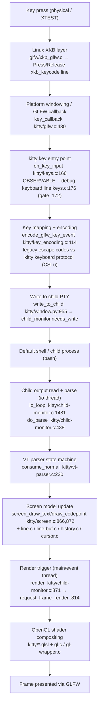

# How kitty Handles Keyboard Input During Normal Use — A Runtime‑Observed Walkthrough

> **The question answered here:** *"Start kitty with whatever debugging/tracing options are available, press a few simple keys inside the default shell, and explain how kitty handles keyboard input during normal use: which parts **RECEIVE** the input first, which parts handle **INTERMEDIATE** processing, and how the **UPDATED DISPLAY** is ultimately produced."*

This document is an **evidence‑first** answer. Every behavioural claim below is placed directly next to the **verbatim runtime output** that demonstrates it, together with the exact command that produced that output, and is grounded with a `file:line` reference into the (read‑only) kitty source. The investigation followed a strict **build → run → observe → document** order: kitty was built/available as native artifacts, launched under a virtual display with its tracing flags, driven with a few real key presses in the default shell, and only then written up from the captured logs.

- **kitty version observed:** `kitty 0.35.2 created by Kovid Goyal` (from `./kitty/launcher/kitty --version`).
- **Keys pressed in the default shell (`bash`):** `a`, `l`, `s`, then `Return` (delivered as *real* key events via `xdotool`), followed by a remote‑control `send-text 'echo hi\n'` and `send-text 'exit\n'`.
- **Tracing flags used:** `--debug-keyboard` (a.k.a. `--debug-input`), `--debug-rendering` (a.k.a. `--debug-gl`), `--dump-commands`, and `--dump-bytes`.
- **Platform of this run:** Ubuntu 25.10 container, `Xvfb` virtual display, Mesa **llvmpipe** software OpenGL 4.5.

### The pipeline at a glance

A key press flows through three stages — **RECEIVE → INTERMEDIATE → DISPLAY** — that also happen to cross **thread** boundaries inside kitty:



The remainder of this document walks each stage with its own evidence.

---

## (a) How kitty was built, launched, and driven

### Versions and build entry point

kitty is **not** a pip package; it is compiled from source through a custom `setup.py` whose build entry point is `def build(...)` at **[setup.py:1084]**. Its runtime prerequisites, taken verbatim from the manifests, are Python `requires-python = ">=3.8"` **[pyproject.toml:2]** and `go 1.22` **[go.mod:3]** (the Go toolchain builds the launcher/kittens). The native libraries are discovered by `setup.py` via `pkg-config` (harfbuzz, freetype, fontconfig, libpng, lcms2, OpenGL, libcrypto, xxhash, plus the x11/wayland windowing backends selected at **[setup.py:933]** `modules = 'cocoa' if is_macos else 'x11 wayland'`).

In this environment the native build artifacts were already present and are **git‑ignored** (so building/running in place leaves the repository byte‑for‑byte unchanged). The version was confirmed with:

```console
$ ./kitty/launcher/kitty --version
kitty 0.35.2 created by Kovid Goyal
```

### Providing a display context (kitty is GPU‑only)

kitty renders exclusively on the GPU and therefore needs a live **OpenGL context** even when run "headless". The official docs also expose a `kitty --start-as=hidden` invocation option (defined at **[kitty/cli.py:958]** `--start-as`), but on Linux an OpenGL context is still required, so a virtual X display with software GL was used:

```console
$ Xvfb :99 -screen 0 1280x800x24 -ac +extension GLX +render -noreset &
$ export DISPLAY=:99 LIBGL_ALWAYS_SOFTWARE=1 GALLIUM_DRIVER=llvmpipe
$ glxinfo | grep -i "OpenGL version\|OpenGL renderer"
OpenGL renderer string: llvmpipe (LLVM 20.1.8, 256 bits)
OpenGL version string: 4.5 (Compatibility Profile) Mesa 25.2.8-0ubuntu0.25.10.2
```

### Launching kitty with tracing flags (and where each flag writes)

The four tracing flags and their **exact help text** (quoted verbatim from `kitty/cli.py`) are:

| Flag (and alias) | `file:line` | Help text (verbatim) | Where output goes |
|---|---|---|---|
| `--dump-commands` | [kitty/cli.py:972] | "Output commands received from child process to STDOUT." | **stdout** |
| `--replay-commands` | [kitty/cli.py:977] | "Replay previously dumped commands. Specify the path to a dump file previously created by `--dump-commands`." | (input) |
| `--dump-bytes` | [kitty/cli.py:985] | "Path to file in which to store the raw bytes received from the child process." | a **file** |
| `--debug-rendering` / `--debug-gl` | [kitty/cli.py:989] | "Debug rendering commands. This will cause all OpenGL calls to check for errors instead of ignoring them. Also prints out miscellaneous debug information. Useful when debugging rendering problems." | **stdout/stderr** |
| `--debug-input` / `--debug-keyboard` (`dest=debug_keyboard`) | [kitty/cli.py:996] | "Print out key and mouse events as they are received." | **stderr** |

> **Grounded fact — the `--debug-*` key lines go to *stderr*, prefixed with `[seconds]`.** The `debug(...)` macro used in the key path resolves through `#define debug debug_input` **[kitty/keys.h:16]** → `#define debug_input(...) if (OPT(debug_keyboard)) { timed_debug_print(__VA_ARGS__); }` **[kitty/state.h:15]**, and `timed_debug_print` writes with `vfprintf(stderr, fmt, args)` after emitting an `[%.3f]` timestamp prefix — verbatim from source **[kitty/monotonic.h:99‑108]**:
> ```c
> int
> timed_debug_print(const char *fmt, ...) {
>     int result;
>     static int starting_print = 1;
>     if (starting_print) fprintf(stderr, "[%.3f] ", monotonic_t_to_s_double(monotonic()));
>     va_list args;
>     va_start(args, fmt);
>     result = vfprintf(stderr, fmt, args);
>     va_end(args);
>     starting_print = fmt && strchr(fmt, '\n') != NULL;
>     return result;
> }
> ```
> This is why the run captured **stderr** with `2>`. It also explains a nuance quoted later: because `starting_print` only becomes true again when the previous format ended in `\n`, consecutive `debug()` fragments that do **not** end in `\n` are concatenated onto the *same* stderr line.

The launch command actually used (each output stream captured separately) was:

```console
$ ./kitty/launcher/kitty --config NONE -o allow_remote_control=yes -o confirm_os_window_close=0 \
    --listen-on unix:/tmp/kitty.sock \
    --debug-keyboard --debug-rendering --dump-commands --dump-bytes /tmp/dump_bytes.bin \
    bash --norc --noprofile > /tmp/kitty_stdout.log 2> /tmp/kitty_debug.log &
```

At startup, the captured **stderr** confirmed the window and child were created (verbatim, ANSI colour codes stripped for readability):

```text
[0.057] Loading new XKB keymaps
[0.062] Modifier indices alt: 0x3 super: 0x6 hyper: 0xffffffff meta: 0xffffffff numlock: 0x4 shift: 0x0 capslock: 0x1
[0.140] OS Window created
[0.157] Child launched
[0.157] on_focus_change: window id: 0x1 focused: 1
```

- **Claim:** an OS window (with its OpenGL context) is created before any input is handled. **Evidence:** `[0.140] OS Window created`.
- **Claim:** the default shell is spawned as kitty's child process. **Evidence:** `[0.157] Child launched`.

### How the keys were driven

Two distinct injection mechanisms were used **on purpose**, because they exercise different entry points:

1. **Real key events — `xdotool`** (these flow through the platform windowing layer → GLFW → `on_key_input`, so they exercise the RECEIVE stage):

   ```console
   $ WID=$(xdotool search --class kitty | head -1)
   $ xdotool windowactivate --sync "$WID"
   $ xdotool key --clearmodifiers a
   $ xdotool key --clearmodifiers l
   $ xdotool key --clearmodifiers s
   $ xdotool key --clearmodifiers Return
   ```

2. **Remote control — `send-text`** (this exercises only the INTERMEDIATE *write* path via `Window.send_key` → `write_to_child`, and **bypasses** `on_key_input`; the mechanism is `w.send_key(*keys)` at **[kitty/rc/send_key.py:63]**):

   ```console
   $ ./kitty/launcher/kitty @ --to unix:/tmp/kitty.sock send-text 'echo hi\n'
   ```

> **Observed, and important (R7):** `on_key_input` fires **only for real key events**. Injecting `send-text` produced **zero** new key‑debug lines. Measured directly by comparing the stderr line count before and after the remote‑control call:
> ```console
> $ BEFORE=$(wc -l < /tmp/kitty_debug.log)   # -> 24
> $ ./kitty/launcher/kitty @ --to unix:/tmp/kitty.sock send-text 'echo hi\n'   # exit 0
> $ AFTER=$(wc -l < /tmp/kitty_debug.log)    # -> 24   (delta = 0)
> $ tail -n +$((BEFORE+1)) /tmp/kitty_debug.log | grep -c "on_key_input"   # -> 0
> ```
> So the RECEIVE‑stage evidence in section (b) necessarily comes from `xdotool`, while `send-text` is used to demonstrate the INTERMEDIATE write path in section (c). (A PTY harness modelled on `kitty_tests/keys.py` would be an equivalent alternative for driving input.)

### Read‑only / isolation note

No source, build, configuration, or test file was modified. The native build artifacts (`kitty/fast_data_types.so`, `kitty/launcher/kitty`, `kitty/launcher/kitten`) are git‑ignored, and every capture file (`/tmp/kitty_debug.log`, `/tmp/kitty_stdout.log`, `/tmp/dump_bytes.bin`) lives outside the repository. `git status --porcelain` on the real repository stayed empty throughout, except for this one answer document. *(The known Wayland `-Werror=switch` build caveat at `glfw/wl_window.c` was not triggered here, because pre‑existing X11‑only artifacts were used; it is noted only for completeness and no repository file was patched.)*

---

## (b) Which parts RECEIVE the input first

For a real key press on Linux, the input is observed in this order: **XKB layer → GLFW `key_callback` → kitty's `on_key_input`**.

### 1. The Linux XKB layer (`glfw/xkb_glfw.c`) translates the hardware keycode first

Before kitty's own code sees anything, the platform GLFW backend runs the key through XKB (keymap, modifiers, compose). With `--debug-keyboard` enabled, this pre‑step is observable as a `Press … xkb_keycode …` line emitted from the XKB handling in `glfw/xkb_glfw.c`.

- **Command that produced it:** `xdotool key --clearmodifiers a`
- **Claim:** the very first thing observed for the `a` key is the XKB translation, which maps native keycode `0x26` to symbol `a` / glfw key `97`. **Evidence (verbatim):**
  ```text
  [52.001] Press xkb_keycode: 0x26 clean_sym: a composed_sym: a text: a mods: none glfw_key: 97 (a) xkb_key: 97 (a)
  ```
- The startup line `[0.057] Loading new XKB keymaps` (section (a)) and `[0.062] Modifier indices alt: 0x3 …` are also produced by this same XKB layer, confirming `glfw/xkb_glfw.c` owns keymap/modifier state.

### 2. GLFW delivers the event to kitty via the registered `key_callback` (`kitty/glfw.c`)

kitty registers its keyboard callback with GLFW at **[kitty/glfw.c:1292]** `glfwSetKeyboardCallback(glfw_window, key_callback);`. The callback itself is `key_callback(GLFWwindow *w, GLFWkeyevent *ev)` at **[kitty/glfw.c:430]**, and it forwards *ready* key events into kitty's core with the guarded call at **[kitty/glfw.c:439]**:

```c
if (is_window_ready_for_callbacks() && !ev->fake_event_on_focus_change) on_key_input(ev);
```

- **Claim:** the platform windowing/GLFW callback is the component that first hands the key event to kitty proper (only for a focused, ready window, and not for synthetic focus‑change events). **Evidence:** the immediately following `on_key_input` line (below) fires only because `key_callback` called it; and it fired only after `[0.157] on_focus_change: window id: 0x1 focused: 1` established the window was focused.

### 3. kitty's key entry point: `on_key_input` (`kitty/keys.c:166`)

`on_key_input(GLFWkeyevent *ev)` at **[kitty/keys.c:166]** is kitty's true entry point for a key event. Its `--debug-keyboard` line is the single most important RECEIVE‑stage signal. The debug block is **gated on `OPT(debug_keyboard)`** at **[kitty/keys.c:172]**, and the format string is at **[kitty/keys.c:176]** (verbatim source):

```c
debug("\x1b[33mon_key_input\x1b[m: glfw key: 0x%x native_code: 0x%x action: %s %stext: '%s' state: %d ",
        key, native_key,
        (action == GLFW_RELEASE ? "RELEASE" : (action == GLFW_PRESS ? "PRESS" : "REPEAT")),
        format_mods(mods), text, ev->ime_state);
```

- **Command that produced it:** `xdotool key --clearmodifiers a`
- **Claim:** `on_key_input` is where kitty first *receives* the key `a`; the `action` field is `PRESS` (chosen by the ternary at **[kitty/keys.c:178]**: `GLFW_RELEASE→"RELEASE"`, `GLFW_PRESS→"PRESS"`, else `"REPEAT"`), the `text` is `'a'`, the `glfw key` literal is `0x61` and `native_code` is `0x61`. **Evidence (verbatim):**
  ```text
  [52.001] on_key_input: glfw key: 0x61 native_code: 0x61 action: PRESS mods: none text: 'a' state: 0 sent key as text to child: a
  ```
- **Claim:** the same happens for `l` and `s`, with their own glfw‑key literals `0x6c` and `0x73`. **Evidence (verbatim):**
  ```text
  [52.412] on_key_input: glfw key: 0x6c native_code: 0x6c action: PRESS mods: none text: 'l' state: 0 sent key as text to child: l
  [52.830] on_key_input: glfw key: 0x73 native_code: 0x73 action: PRESS mods: none text: 's' state: 0 sent key as text to child: s
  ```

> **Observed‑vs‑source note (R7).** The live line contains `mods: none ` where the format string has `%s` — that `%s` is `format_mods(mods)` rendering the empty modifier set as `none `. And the trailing fragment `sent key as text to child: a` is **not** part of the `on_key_input` format string; it is a *separate* `debug()` call that concatenated onto the same stderr line because the `on_key_input` format at **[kitty/keys.c:176]** ends with a space, not `\n` (see the `starting_print` logic in `timed_debug_print` **[kitty/monotonic.h:107]**). So a single captured line actually encodes the whole receive → encode → write micro‑step. This is reported exactly as observed rather than "cleaned up".

### 4. Receive‑stage variants: IME and the `action` values

- **IME composition** takes a distinct branch inside the same `on_key_input`: when there is no key/native_key but there *is* text, kitty logs `on_IME_input` instead, at **[kitty/keys.c:174]** `debug("\x1b[33mon_IME_input\x1b[m: text: %s ", text);`. On Linux this composition is preprocessed by the IBus integration in `glfw/ibus_glfw.c`. **This branch was not exercised** in this run (the simple keys `a`/`l`/`s` are not IME text), so `on_IME_input` is cited as a **source‑referenced variant**, not an observed line — labelled **unverified at runtime** here per R7.
- **`action` = `PRESS` / `RELEASE` / `REPEAT`:** `PRESS` and `RELEASE` were both observed (see the release handling in section (c)); `REPEAT` (autorepeat) was **not** exercised, so it is cited from source at **[kitty/keys.c:178]** and labelled **unverified at runtime**.

After the debug line, `on_key_input` dispatches the event through the `dispatch_key_event` macro at **[kitty/keys.c:218]** (e.g. `dispatch_key_event(dispatch_possible_special_key);` at **[kitty/keys.c:228]**), which leads into the INTERMEDIATE processing described next.


---

## (c) Which parts handle INTERMEDIATE processing

The intermediate stage has five substeps, each with its own evidence: **(c.1) key mapping/encoding**, **(c.2) legacy‑vs‑kitty‑keyboard‑protocol selection**, **(c.3) write to the child PTY**, **(c.4) the child‑monitor event loop reading the child's bytes on the io thread**, and **(c.5) VT parsing → screen‑model update**.

### c.1 Key mapping and encoding

Once received, the key is turned into bytes. Text keys are sent as their UTF‑8 text; non‑text/special keys are encoded through `encode_glfw_key_event(...)` at **[kitty/key_encoding.c:414]** (the Python‑side equivalent is `encode_key_event(key_event)` at **[kitty/key_encoding.py:365]**). The `--debug-keyboard` line reports *which* path was taken, right on the concatenated `on_key_input` line.

- **Command:** `xdotool key --clearmodifiers a`
- **Claim:** a plain text key such as `a` is *not* escape‑encoded — it is sent to the child as its literal text `a`. **Evidence (verbatim, trailing fragment):**
  ```text
  [52.001] on_key_input: glfw key: 0x61 native_code: 0x61 action: PRESS mods: none text: 'a' state: 0 sent key as text to child: a
  ```
- **Command:** `xdotool key --clearmodifiers Return`
- **Claim:** a special key such as **Enter** *is* encoded — glfw key `0xe001` (native `0xff0d`) is encoded to the single byte **`0xd`** (ASCII carriage return). **Evidence (verbatim):**
  ```text
  [53.248] Press xkb_keycode: 0x24 clean_sym: Return composed_sym: Return mods: none glfw_key: 57345 (ENTER) xkb_key: 65293 (Return)
  [53.249] on_key_input: glfw key: 0xe001 native_code: 0xff0d action: PRESS mods: none text: '' state: 0 sent encoded key to child: 0xd
  ```
  Here `text: ''` (Enter carries no text) and the encoder emitted the literal `0xd`. This is the concrete difference between "text key → `sent key as text to child`" and "special key → `sent encoded key to child: 0xd`".

### c.2 Legacy escape codes vs the kitty keyboard protocol (CSI u)

kitty supports two keyboard‑encoding regimes: the **default legacy** mode (traditional escape sequences; releases are not encoded) and the opt‑in **kitty keyboard protocol** (`CSI u`), which encodes press/release/repeat unambiguously. An application opts in by emitting `CSI > 1 u` at startup — documented at **[docs/keyboard-protocol.rst:67]** — with the `CSI u` encoding `CSI unicode-key-code:alternate-key-codes ; modifiers:event-type ; text-as-codepoints u` **[docs/keyboard-protocol.rst:118]** and progressive‑enhancement query `CSI = flags ; mode u` **[docs/keyboard-protocol.rst:266]**.

- **Claim (observed):** the default `bash` session ran in **legacy** mode — it did **not** opt into the kitty keyboard protocol. **Evidence:** grepping the raw child‑byte dump for the opt‑in sequence found none (only bracketed‑paste `?2004h`/`?2004l`, three each), i.e. no `CSI > 1 u` / `CSI = … u`:
  ```console
  $ cat -v /tmp/dump_bytes.bin | grep -oE "\[>[0-9]*u|\[=[0-9;]*u|\[\?2004[hl]" | sort | uniq -c
        3 [?2004h
        3 [?2004l
  ```
- **Claim:** *because* the mode is legacy, key **RELEASE** events are dropped (legacy mode cannot encode a release). **Evidence (verbatim):**
  ```text
  [52.002] on_key_input: glfw key: 0x61 native_code: 0x61 action: RELEASE mods: none text: '' state: 0 ignoring as keyboard mode does not support encoding this event
  [53.255] on_key_input: glfw key: 0xe001 native_code: 0xff0d action: RELEASE mods: none text: '' state: 0 ignoring as keyboard mode does not support encoding this event
  ```
  The phrase `ignoring as keyboard mode does not support encoding this event` is the direct, observed grounding for the legacy‑vs‑protocol distinction: had the kitty keyboard protocol been active, these `RELEASE` events would have been encoded as `CSI u` sequences instead of ignored.

### c.3 Writing the encoded bytes to the child PTY (`kitty/window.py`)

The bytes produced above are written toward the child through the Python `Window` layer. For remote‑control / programmatic input, `Window.send_key` at **[kitty/window.py:917]** builds a `KeyEvent`, encodes it (`enc = self.encoded_key(ev)` at **[kitty/window.py:931]**, whose implementation is at **[kitty/window.py:1795]**) and writes it (`self.write_to_child(enc)` at **[kitty/window.py:933]**). `write_to_child(self, data)` is defined at **[kitty/window.py:955]** and hands the bytes to the child monitor at **[kitty/window.py:959]** `get_boss().child_monitor.needs_write(self.id, data)`.

- **Command:** `./kitty/launcher/kitty @ --to unix:/tmp/kitty.sock send-text 'echo hi\n'` (exit `0`; this is the `w.send_key(*keys)` mechanism at **[kitty/rc/send_key.py:63]**, alongside `kitty/rc/send_text.py`).
- **Claim:** the remote‑control write path does **not** pass through `on_key_input` — it goes straight to `write_to_child` — so it produced no key‑debug line. **Evidence:** the before/after stderr line‑count delta was `0` and a grep for `on_key_input` in the new region returned `0` (shown in section (a)). This is exactly why this path is used to demonstrate the *write* substep, and `xdotool` is used for the *receive* substep.

### c.4 The child‑monitor event loop reads the child's bytes on the io thread (`kitty/child-monitor.c`)

kitty decouples input from rendering across **threads**. The child monitor declares `pthread_t io_thread, talk_thread;` at **[kitty/child-monitor.c:55]**; the io thread is created with `pthread_create(&self->io_thread, NULL, io_loop, self)` at **[kitty/child-monitor.c:291]** and the talk thread at **[kitty/child-monitor.c:256]/[286]**. The loop `io_loop(void *data)` (forward‑declared at **[kitty/child-monitor.c:229]**, defined at **[kitty/child-monitor.c:1481]**) reads the PTY, flushes queued writes via `schedule_write_to_child(...)` **[kitty/child-monitor.c:372]** / C‑level `write_to_child(int fd, Screen *screen)` **[kitty/child-monitor.c:1443]**, and parses child output via `do_parse(ChildMonitor*, Screen*, monotonic_t now, bool flush)` at **[kitty/child-monitor.c:438]**.

- **Claim:** the *raw bytes received from the child* — after bash's line discipline echoed the typed characters and produced output — are exactly what `--dump-bytes` records. The typed `a`,`l`,`s` come back as `als`, and the Enter appears as the CR byte `^M` (= `0xd`). **Command & evidence (verbatim, `cat -v` escaped, 1209 bytes total):**
  ```console
  $ cat -v /tmp/dump_bytes.bin | head -c 400
  ^[]7;kitty-shell-cwd://…/d249fb^G^[[?2004h^[]133;k;start_kitty^G…^[[5 q^[]2;…^G^[]133;k;end_suffix_kitty^Gals^M
  ^[[?2004l^M^[]2;als^G^[]133;C;cmdline=als^G…bash: als: command not found^M
  ```
  The `als^M` fragment ties the whole chain together: `als` is the echo of the three text keys, and `^M` is the very `0xd` byte that Enter was encoded to in c.1.

> **Threading order (grounded):** RECEIVE happens on the **main/event thread** (the GLFW callback `key_callback` → `on_key_input`); the encoded bytes are queued and written to the PTY; the child's response is **read and parsed on the io thread** (`io_loop`/`do_parse`); and the **render** happens back on the main/event thread. Rendering is time‑gated by `OPT(repaint_delay)` (used in `render` at **[kitty/child-monitor.c:874]**).

### c.5 VT parsing → screen‑model update (`kitty/vt-parser.c`, `kitty/screen.c`)

The bytes read by the io thread are fed to the VT parser state machine, whose normal‑ground consumer is `consume_normal(PS *self)` at **[kitty/vt-parser.c:230]**. Printable runs are drawn into the screen model via `screen_draw_text(self->screen, &ch, 1)` at **[kitty/vt-parser.c:226]** → `screen_draw_text(Screen *self, …)` **[kitty/screen.c:866]** / `draw_codepoint` **[kitty/screen.c:872]**; control bytes become screen ops (e.g. `case CR: REPORT_COMMAND(screen_carriage_return)` **[kitty/vt-parser.c:102]**, `case LF/VT/FF: REPORT_COMMAND(screen_linefeed)` **[kitty/vt-parser.c:101]**), which update `kitty/line.c`, `kitty/line-buf.c`, `kitty/history.c`, and `kitty/cursor.c`.

The `--dump-commands` flag makes each parsed command observable. Mechanically, `--dump-commands`/`--dump-bytes` install a `dump_callback`, which selects the `DUMP_COMMANDS`‑compiled parser variant `parse_worker_dump` (`self->parse_func = parse_worker_dump` at **[kitty/child-monitor.c:180]**, vs `parse_worker` at **[kitty/child-monitor.c:181]**); the parser is compiled twice for this — `setup.py` maps `kitty/vt-parser-dump.c` to `kitty/vt-parser.c` with the `DUMP_COMMANDS` macro at **[setup.py:721‑722]**. The `draw` trace line itself is emitted by the `REPORT_DRAW` macro at **[kitty/vt-parser.c:92]**, which calls the dump callback with the literal `"draw"` at **[kitty/vt-parser.c:105]**.

- **Command:** the same launch, reading `/tmp/kitty_stdout.log` after exit (stdout is fully buffered, so it flushes when kitty exits).
- **Claim:** the typed `a`+`l`+`s` become one printable draw of `als`, then the Enter's CR/LF advance the cursor, and bash's reaction is drawn. **Evidence (verbatim excerpt of the parsed trace):**
  ```text
  draw als
  screen_carriage_return
  screen_linefeed
  screen_set_cursor 5 32
  screen_set_mode 2004 1
  screen_reset_mode 2004 1
  set_title /tmp/blitzy/kitty/blitzy-ad05b594-9fa3-4c3c-9aca-e8ad32d24a87_d249fb
  draw bash: als: command not found
  draw echo hi
  draw hi
  ```
- **Claim (end‑to‑end correlation):** `als` (typed) → `draw als`; Enter (`0xd`) → bash ran `als` → `draw bash: als: command not found`; the remote‑control `send-text 'echo hi\n'` → `draw echo hi` and its output `draw hi`. Every observed `draw` line is a `screen_draw_text` call **[kitty/screen.c:866]**.
- **Observed magnitudes (R3), one capture** (from `grep -oE "^[a-z_]+" /tmp/kitty_stdout.log | sort | uniq -c`): `6 draw`, `9 screen_carriage_return`, `6 screen_linefeed`, `6 screen_set_cursor`, `6 set_title`, `3 screen_set_mode`, `3 screen_reset_mode`, `33 shell_prompt_marking`, `1 process_cwd_notification`. The six `draw`s are `als`, `bash: als: command not found`, `echo hi`, `hi`, and two `exit` (this run also typed `exit` to close the shell cleanly, which is why there are more `draw`s than the four commands strictly required).


---

## (d) How the UPDATED DISPLAY is ultimately produced

Once the screen model has changed (the `draw`/`screen_*` operations in c.5), a new frame must be produced. kitty is a **GPU‑only** renderer: there is no CPU text‑drawing fallback, so the display stage is fundamentally an OpenGL compositing step.

### The render trigger

The render entry point is `render(monotonic_t now, bool input_read)` at **[kitty/child-monitor.c:871]**, invoked from the main loop at **[kitty/child-monitor.c:1237]** `render(now, input_read);`. It requests a GPU frame via `request_frame_render(...)` at **[kitty/child-monitor.c:814]** (`if (USE_RENDER_FRAMES) request_frame_render(os_window);`) and **[kitty/child-monitor.c:841]**. Frame cadence is throttled by `OPT(repaint_delay)` at **[kitty/child-monitor.c:874]**, which is why rendering is decoupled from, and slower‑paced than, the byte‑level input/parse activity.

### The GPU compositing pipeline

The frame is composited by the OpenGL shader stages in `kitty/*.glsl` through the OpenGL infrastructure in `kitty/gl.c` and `kitty/gl-wrapper.c`. All 13 shader files are present in the tree and were confirmed by listing `kitty/*.glsl`: the cell stage (`cell_vertex.glsl`, `cell_fragment.glsl`, `cell_defines.glsl`), the border stage (`border_vertex.glsl`, `border_fragment.glsl`), the background‑image stage (`bgimage_vertex.glsl`, `bgimage_fragment.glsl`), the graphics stage (`graphics_vertex.glsl`, `graphics_fragment.glsl`), the tint stage (`tint_vertex.glsl`, `tint_fragment.glsl`), plus the shared helpers `alpha_blend.glsl` and `linear2srgb.glsl`.

### Runtime evidence for the display stage

Because kitty cannot even start without a working OpenGL context, a live GL context line is direct proof that the display pipeline initialized. With `--debug-rendering` set (`global_state.debug_rendering`; the gate is `#define debug_rendering(...) if (global_state.debug_rendering) { … }` at **[kitty/state.h:14]**), kitty prints its GL context version. This line is emitted with `printf` to **stdout** at **[kitty/gl.c:72]** (`if (global_state.debug_rendering) printf("[%.3f] GL version string: %s\n", …)`), so it is fully buffered and appears in the stdout capture after kitty exits.

- **Command:** the same launch (`--debug-rendering`), reading `/tmp/kitty_stdout.log` after exit.
- **Claim:** kitty obtained an OpenGL **4.5** context (via llvmpipe software GL), which satisfies its GPU‑rendering requirement. **Evidence (verbatim, my run):**
  ```text
  [0.118] GL version string: '4.5 (Core Profile) Mesa 25.2.8-0ubuntu0.25.10.2' Detected version: 4.5
  ```

> **Observed‑vs‑expected note (R7).** kitty reports `4.5 (Core Profile)` here, even though `glxinfo` reported `4.5 (Compatibility Profile)` for the same display (section (a)). This is expected: kitty explicitly requests a **core** profile context for its shader pipeline, so it reports the core‑profile context it actually created, independent of what a generic client like `glxinfo` negotiates. The literal Mesa string `Mesa 25.2.8-0ubuntu0.25.10.2` reflects this Ubuntu 25.10 environment (a prior architecture run on Ubuntu 24.04 reported `Mesa 25.2.8-0ubuntu0.24.04.2`) — reported exactly as observed.

### Honest limits of the runtime evidence for this stage (R7)

- **A per‑frame render debug line was NOT observed.** `--debug-rendering` did not print a line for each frame in this build. Searching both logs for the render loop's own debug string returned nothing:
  ```console
  $ grep -c -i "input_read\|check_for_active_animated" /tmp/kitty_debug.log   # -> 0
  $ grep -c -i "input_read\|check_for_active_animated" /tmp/kitty_stdout.log  # -> 0
  ```
  The reason is grounded in source: `render()`'s debug call uses the `EVDBG(...)` macro (`EVDBG("input_read: %d, …")` at **[kitty/child-monitor.c:872]**), and `EVDBG` is **compiled out** unless `DEBUG_EVENT_LOOP` is defined — verbatim at **[kitty/child-monitor.c:28‑32]**:
  ```c
  #ifdef DEBUG_EVENT_LOOP
  #define EVDBG(...) timed_debug_print(__VA_ARGS__)
  #else
  #define EVDBG(...)
  #endif
  ```
  `--debug-rendering`'s documented effect is to force OpenGL error checks and print *miscellaneous* info (the GL version line) — **[kitty/cli.py:989]** — not to log every frame. The per‑frame render claim is therefore **grounded on source references** (`render()` **[kitty/child-monitor.c:871]**, `request_frame_render()` **[kitty/child-monitor.c:814]**) rather than a captured per‑frame line, and is labelled accordingly.
- **A framebuffer screenshot was NOT captured.** No screenshot tool (`import`, `xwd`, `convert`, `scrot`) was available in this environment, so a pixel‑level image of the rendered frame is **unverified**. The display stage is instead grounded on: (1) the live `GL version 4.5` context line above, (2) the screen‑model updates in c.5 that dirty the screen and trigger a frame, and (3) the `render()` / `request_frame_render()` / `*.glsl` source references.

**Conclusion for (d):** even in this headless/virtual‑display run — with no visible window — the changed screen model is composited into a frame by the OpenGL shader stages (`kitty/*.glsl` via `kitty/gl.c`/`kitty/gl-wrapper.c`) under the `render()` trigger, and presented through GLFW. The live OpenGL 4.5 context is the observed proof that this GPU pipeline was initialized and available.


---

## (e) Coverage pass — every named item, addressed by name

### Flags (each with its exact help text and `file:line`)

| Flag | `file:line` | Status in this run |
|---|---|---|
| `--debug-input` | [kitty/cli.py:996] | Used (alias of `--debug-keyboard`); produced the `on_key_input` lines. |
| `--debug-keyboard` (`dest=debug_keyboard`) | [kitty/cli.py:996‑997] | Used; gate is `OPT(debug_keyboard)` at [kitty/keys.c:172]. |
| `--debug-rendering` | [kitty/cli.py:989] | Used; produced the `GL version string` line via [kitty/gl.c:72]. |
| `--debug-gl` | [kitty/cli.py:989] | Alias of `--debug-rendering`. |
| `--dump-bytes` | [kitty/cli.py:985] | Used; wrote the 1209‑byte raw child‑byte file. |
| `--dump-commands` | [kitty/cli.py:972] | Used; produced the parsed `draw`/`screen_*` trace on stdout. |
| `--replay-commands` | [kitty/cli.py:977] | Referenced (replays a prior `--dump-commands` dump); not exercised — **unverified at runtime**. |
| `--start-as=hidden` | [kitty/cli.py:958] | Referenced as the documented headless option; a virtual display + software GL was used instead because a GL context is still required on Linux. |

### Functions / symbols

- `key_callback` — [kitty/glfw.c:430]; forwards to `on_key_input` at [kitty/glfw.c:439]. **Observed** (via the resulting key lines).
- `glfwSetKeyboardCallback` — [kitty/glfw.c:1292]; registers the callback. **Source‑referenced.**
- `on_key_input` — [kitty/keys.c:166]; kitty's key entry point. **Observed** (`on_key_input:` lines).
- `on_IME_input` — [kitty/keys.c:174]; IME text branch. **Source‑referenced (unverified at runtime)** — IME not exercised.
- `OPT(debug_keyboard)` — [kitty/keys.c:172]; gates the key debug block. **Observed** (lines appear only with the flag).
- `send_key` — [kitty/window.py:917] (Python) and `w.send_key(*keys)` [kitty/rc/send_key.py:63] (remote control). **Observed** (via `send-text`).
- `write_to_child` — Python [kitty/window.py:955] and C [kitty/child-monitor.c:1443]. **Observed** (write path) / **source‑referenced** (C loop).
- `encoded_key` — [kitty/window.py:1795]; `encode_key_event` — [kitty/key_encoding.py:365]; `encode_glfw_key_event` — [kitty/key_encoding.c:414]. **Observed effect** (`sent encoded key to child: 0xd`).
- `io_loop` — [kitty/child-monitor.c:1481] (fwd‑decl [kitty/child-monitor.c:229]); `do_parse` — [kitty/child-monitor.c:438]; `schedule_write_to_child` — [kitty/child-monitor.c:372]; `io_thread`/`talk_thread` — [kitty/child-monitor.c:55]. **Source‑referenced** (evidenced indirectly by the child bytes/trace).
- `consume_normal` — [kitty/vt-parser.c:230]. **Source‑referenced** (evidenced by the parsed `draw`/`screen_*` trace).
- `screen_draw_text` / `draw_codepoint` — [kitty/screen.c:866] / [kitty/screen.c:872]. **Observed effect** (`draw als`, `draw hi`, …).
- `render` — [kitty/child-monitor.c:871] (called [kitty/child-monitor.c:1237]); `request_frame_render` — [kitty/child-monitor.c:814]. **Source‑referenced** (per‑frame line compiled out — see (d)).
- `timed_debug_print` — [kitty/monotonic.h:99]; writes to stderr with `[%.3f]` prefix. **Observed** (every `[seconds]` line).
- `build()` — [setup.py:1084]; kitty's build entry point. **Source‑referenced** (kitty 0.35.2 artifacts).

### Files

- `kitty/glfw.c`, `kitty/keys.c` — RECEIVE. **Observed.**
- `kitty/keys.py` — key mapping logic consulted during dispatch. **Source‑referenced** (INTERMEDIATE).
- `kitty/key_encoding.c`, `kitty/key_encoding.py` — legacy vs `CSI u` encoding. **Observed effect / source‑referenced.**
- `kitty/window.py` — `send_key`/`write_to_child`. **Observed.**
- `kitty/child-monitor.c` — io loop, parse, threads, render. **Source‑referenced + observed effects.**
- `kitty/vt-parser.c` — VT parser. **Observed effect** (dump‑commands trace).
- `kitty/screen.c`, `kitty/line.c`, `kitty/line-buf.c`, `kitty/history.c`, `kitty/cursor.c` — screen model, scrollback, cursor. **Observed effect (screen.c) / source‑referenced (others).**
- `kitty/gl.c`, `kitty/gl-wrapper.c`, `kitty/*.glsl` — DISPLAY. **Observed (GL context) + source‑referenced (shaders).**
- `glfw/xkb_glfw.c` — Linux XKB keymap/modifier/compose. **Observed** (`Press xkb_keycode …` lines).
- `glfw/ibus_glfw.c` — Linux IBus IME. **Source‑referenced (unverified at runtime).**
- `kitty/cli.py` — flag definitions. **Observed** (flag behaviour) / help text quoted.
- `kitty/options/definition.py` — points users to `--debug-input` for mouse events at [kitty/options/definition.py:724]. **Source‑referenced.**
- `kitty/rc/send_text.py`, `kitty/rc/send_key.py` — keystroke injection. **Observed** (`send-text`).
- `setup.py`, `pyproject.toml`, `go.mod` — build entry [setup.py:1084], Python `>=3.8` [pyproject.toml:2], Go `1.22` [go.mod:3]. **Source‑referenced.**
- `kitty_tests/keys.py`, `kitty_tests/parser.py`, `kitty_tests/screen.py`, `kitty_tests/main.py` — existing harness patterns for driving/observing input; cited as **reference alternatives** to `xdotool`, not exercised here.
- `kitty/mouse.c` — mouse handling (**out of scope beyond mention**): because `#define debug debug_input` at [kitty/mouse.c:21], `--debug-input` also prints *mouse* events, but the question is about key presses, so mouse input was not driven.

### Conditions

- **Legacy vs kitty keyboard protocol** — legacy observed (no `CSI > 1 u` in the dump; releases ignored). See c.2.
- **PRESS / RELEASE / REPEAT** — `PRESS` and `RELEASE` **observed**; `REPEAT` **source‑referenced (unverified at runtime)** at [kitty/keys.c:178].
- **IME path** — `on_IME_input` [kitty/keys.c:174] — **source‑referenced (unverified at runtime)**.
- **XKB (Linux)** — **observed** (`Press/Release xkb_keycode …` from `glfw/xkb_glfw.c`).
- **GPU‑only / headless display** — **observed** (`GL version 4.5` context under Xvfb + llvmpipe; no CPU text path).
- **Threading order + `repaint_delay`/`input_delay`** — receive on main thread → PTY write → read+parse on io thread → render on main thread. `render` is throttled by `OPT(repaint_delay)` at [kitty/child-monitor.c:874]; input batching/main‑loop wakeups are throttled by `OPT(input_delay)` (default `3` ms, defined `opt('input_delay', '3', …)` at [kitty/options/definition.py:878]) as used in `do_parse` at [kitty/child-monitor.c:445] and `io_loop` at [kitty/child-monitor.c:1508]. **Source‑referenced.**

---

## Summary

- **RECEIVE:** a real key press is first translated by the Linux **XKB** layer in `glfw/xkb_glfw.c` (observed `Press xkb_keycode …`), delivered by GLFW's `key_callback` [kitty/glfw.c:430] to kitty's `on_key_input` [kitty/keys.c:166], whose `--debug-keyboard` line (gated at [kitty/keys.c:172]) is the definitive receive signal (`on_key_input: … action: PRESS … text: 'a'`).
- **INTERMEDIATE:** the key is encoded (text → literal bytes, e.g. `a`; special → escape byte, e.g. Enter → `0xd`) via `encode_glfw_key_event` [kitty/key_encoding.c:414], written to the child PTY through `write_to_child` [kitty/window.py:955]; the child's reply is read+parsed on the io thread (`io_loop`/`do_parse` [kitty/child-monitor.c:1481,438]) by the VT parser (`consume_normal` [kitty/vt-parser.c:230]) into the screen model (`screen_draw_text` [kitty/screen.c:866] — observed `draw als`). The default `bash` ran in **legacy** keyboard mode, so key **releases** were ignored.
- **DISPLAY:** the dirtied screen triggers `render()` [kitty/child-monitor.c:871] → `request_frame_render()` [kitty/child-monitor.c:814], which composites the frame with the OpenGL shader stages `kitty/*.glsl` via `kitty/gl.c`. The observed live **OpenGL 4.5** context proves the GPU pipeline initialized; a per‑frame render log line is compiled out (`EVDBG`, [kitty/child-monitor.c:28‑32]) and so is honestly reported as not observed.

*All runtime output above was captured from a live `kitty 0.35.2` process; every temporary capture file and the virtual display were removed after the investigation, leaving the repository byte‑for‑byte unchanged except for this document.*

