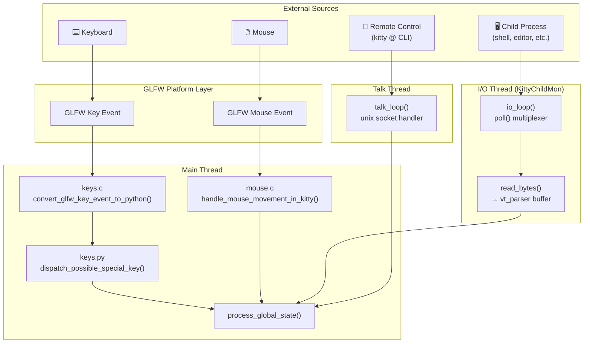
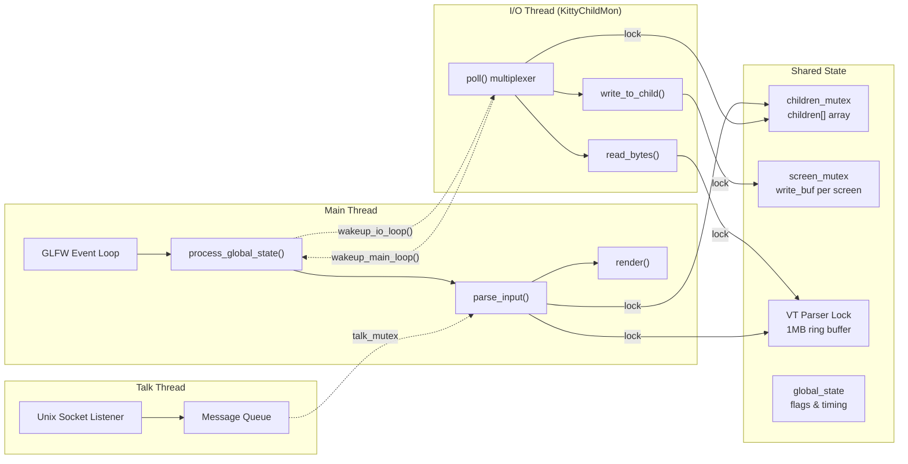
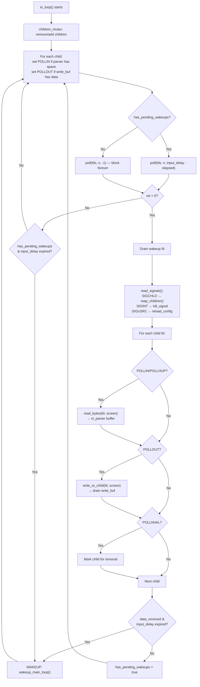
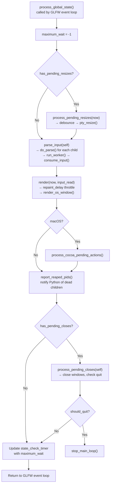
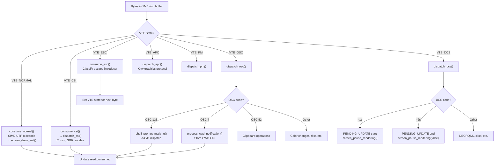
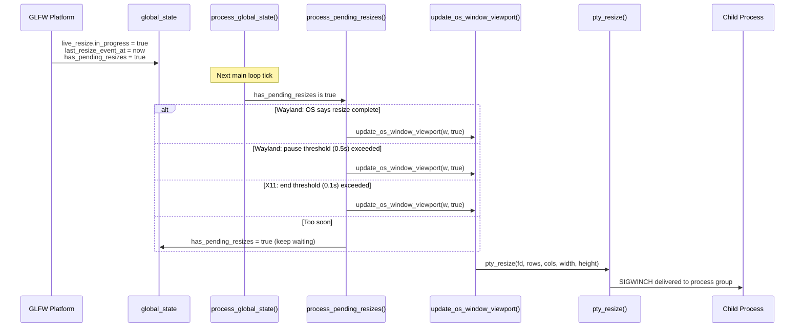
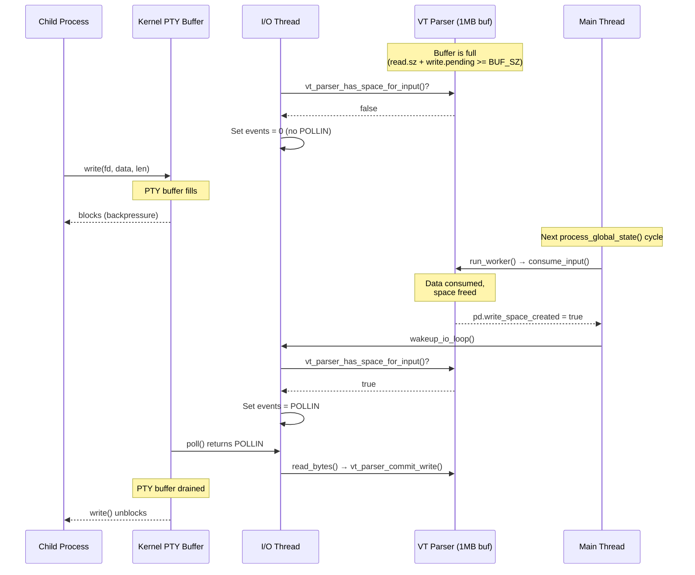
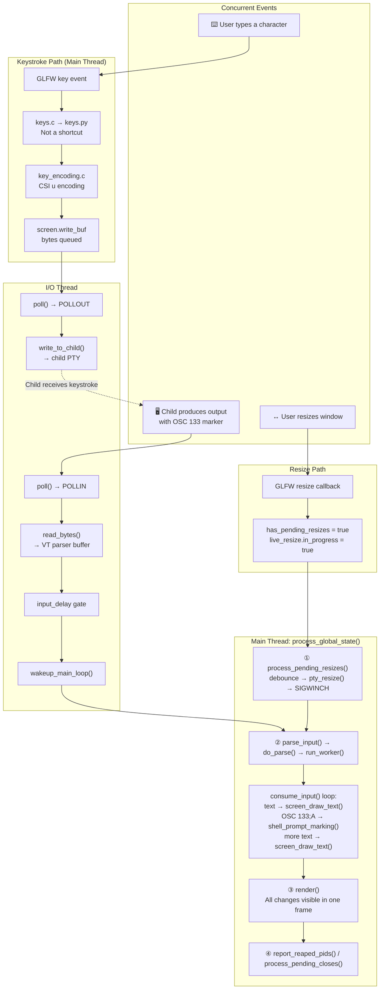

# Kitty Terminal Interaction Pipeline: A Deep-Dive Technical Explainer

> **Audience:** Engineers onboarding into the Kitty codebase.
> **Scope:** End-to-end lifecycle of live terminal input — from raw keystrokes and PTY bytes to a
> fully rendered, coherent screen.
> **Ground truth:** Every claim in this document is derived from the Kitty source code. Citations
> use the format `Source: path/to/file.c:function_name()` or `(see file, lines N-M)`.
> No assumptions are made; only what the code demonstrates is asserted.

---

## Table of Contents

1. [Introduction & Orientation](#1-introduction--orientation)
2. [Where Input First Enters the System](#2-where-input-first-enters-the-system)
3. [The Three-Thread Architecture](#3-the-three-thread-architecture)
4. [The I/O Thread's Poll Loop](#4-the-io-threads-poll-loop)
5. [The Main Thread's Processing Cycle](#5-the-main-threads-processing-cycle)
6. [The VT Parser: Classifying the Byte Stream](#6-the-vt-parser-classifying-the-byte-stream)
7. [Shell Integration In the Stream](#7-shell-integration-in-the-stream)
8. [Paste Bursts and Bracketed Paste](#8-paste-bursts-and-bracketed-paste)
9. [Resize Signals: From GLFW to PTY](#9-resize-signals-from-glfw-to-pty)
10. [Synchronized Updates and Paused Rendering](#10-synchronized-updates-and-paused-rendering)
11. [Timing Parameters and Their Interplay](#11-timing-parameters-and-their-interplay)
12. [Degraded Conditions and Recovery](#12-degraded-conditions-and-recovery)
13. [Summary: The Full Journey](#13-summary-the-full-journey)

---

## 1. Introduction & Orientation

A modern GPU-accelerated terminal emulator like Kitty must juggle several concurrent streams of
activity at every instant: a user may be typing a command (keyboard input), the shell may be
printing a prompt marker (shell integration escape sequence), a long-running process may be
flooding the screen with output (PTY child data), and the user may be resizing the window — all
at the same time.

This document answers five deeply interrelated questions about how Kitty's runtime pipeline
handles this concurrency:

1. **Where does raw input first enter the system?**
   How do keystrokes, mouse clicks, child process output, and remote control commands each find
   their way into Kitty's processing machinery?

2. **When multiple streams arrive simultaneously, what decides handling order?**
   What mechanism arbitrates between a resize event, a pending paste, and a burst of shell output
   that all land in the same millisecond?

3. **How does the system keep shell integration markers aligned with ordinary output?**
   When OSC 133 prompt markers and OSC 7 CWD notifications are interleaved with regular text and
   CSI sequences in the same byte stream, how does Kitty classify and process them without losing
   alignment?

4. **How does it behave under backpressure or unstable connections?**
   What happens when the VT parser buffer fills, when a remote SSH session is slow, or when an
   application pauses and resumes screen updates?

5. **How do all moving parts keep their rhythm and avoid drifting out of sync?**
   What "unseen conductor" coordinates the I/O thread, the main thread, and the rendering engine
   into a smooth, deterministic cadence?

**All answers are grounded exclusively in the Kitty source code.** This is not speculation — it
is a guided reading of the actual implementation, with rationale for *why* the architecture
works the way it does.

### Terminology

Throughout this document, the following consistent thread names are used:

| Term | Refers to | Created in |
|------|-----------|------------|
| **Main thread** | The thread running the GLFW event loop, `process_global_state()`, and rendering | Process main thread |
| **I/O thread** | The thread named `"KittyChildMon"` that multiplexes all child PTYs via `poll()` | `kitty/child-monitor.c:io_loop()` |
| **Talk thread** | The thread handling remote control protocol communication via unix sockets | `kitty/child-monitor.c:talk_loop()` |

---

## 2. Where Input First Enters the System

Input enters Kitty through four distinct pathways, each landing on a different thread before
converging on the main processing cycle.

### 2.1 Keyboard Input Path

The platform's windowing library (a vendored fork of GLFW in `glfw/`) delivers key events to
Kitty's C layer. The entry point is `convert_glfw_key_event_to_python()` in `kitty/keys.c`
(line 93), which converts a raw `GLFWkeyevent` struct into a Python `PyKeyEvent` object. This
object carries the key code, shifted/alternate variants, modifier bitmask, action
(press/release/repeat), native key code, IME state, and any associated text.

Before conversion, `is_modifier_key()` (line 37) filters out pure modifier keys
(Shift, Control, Alt, Super, CapsLock, etc.) that should not generate terminal output on their
own.

Source: `kitty/keys.c:convert_glfw_key_event_to_python()` (line 93), `is_modifier_key()` (line 37)

On the Python side, `dispatch_possible_special_key()` in `kitty/keys.py` (line 154) checks
whether the key matches any entry in the active keyboard mode stack. If the key is bound to
a shortcut action, it is dispatched as such. If not, it is encoded using the Kitty keyboard
protocol (see `kitty/key_encoding.c`) and written to the child PTY through the screen's write
buffer.

Source: `kitty/keys.py:dispatch_possible_special_key()` (line 154), `keyboard_mode_stack` (line 67)

> **Rationale:** Keyboard processing happens on the Main thread because it requires access to
> the GLFW event loop and the Python shortcut resolution engine. The separation between C-level
> event conversion and Python-level dispatch keeps the hot path fast while allowing flexible
> key binding configuration.

### 2.2 Mouse Input Path

Mouse events follow a similar GLFW → C → Python path. The key C function is
`handle_mouse_movement_in_kitty()` in `kitty/mouse.c` (line 337), which resolves mouse
events against selection state and the active `mouse_map` configuration.

Source: `kitty/mouse.c:handle_mouse_movement_in_kitty()` (line 337)

### 2.3 Child PTY Output Path

This is the highest-volume input channel. Child processes (shells, editors, compilers) write
bytes to their PTY master file descriptor. These bytes are read by the **I/O thread** in
`kitty/child-monitor.c:io_loop()` (line 1481).

The reading process uses a three-step protocol:

1. `vt_parser_create_write_buffer(screen->vt_parser, &available_buffer_space)` — obtains a
   pointer into the VT parser's 1 MB ring buffer and reports how much space is available.
   Source: `kitty/vt-parser.c:vt_parser_create_write_buffer()` (line 1451)
2. `read(fd, buf, available_buffer_space)` — the actual `read()` syscall fills the buffer.
3. `vt_parser_commit_write(screen->vt_parser, len)` — finalizes the write, advancing the
   pending write counter and recording the timestamp of new input.
   Source: `kitty/vt-parser.c:vt_parser_commit_write()` (line 1465)

This entire sequence is encapsulated in `read_bytes()` (line 1337 in `child-monitor.c`).

Source: `kitty/child-monitor.c:read_bytes()` (lines 1337-1356)

> **Rationale:** By reading directly into the VT parser's buffer, Kitty avoids an extra memory
> copy. The write-buffer protocol allows the I/O thread to write concurrently with the main
> thread's parse operations, coordinated by an internal mutex in the parser.

### 2.4 Remote Control Path

Remote control commands (from `kitty @` CLI or programmatic clients) arrive via unix domain
sockets, handled by the **Talk thread**. Messages are queued and delivered to the Main thread
during `parse_input()` via a mutex-protected message array.

Source: `kitty/child-monitor.c:parse_input()` (lines 486-514)

### Diagram 1: Input Entry Points



---

## 3. The Three-Thread Architecture

Kitty's runtime is organized around three threads, each with a distinct responsibility. This
design isolates blocking I/O from the render-critical main loop while keeping the architecture
simple enough to reason about.

### 3.1 Main Thread

The Main thread is the process's original thread. It runs the GLFW event loop and, on each
iteration, calls `process_global_state()` (line 1224 in `child-monitor.c`). This function is
the heart of Kitty's processing cycle — it handles pending resizes, parses buffered input,
triggers rendering, and processes pending window closes, all in a deterministic order.

Source: `kitty/child-monitor.c:process_global_state()` (lines 1224-1256),
`main_loop()` (lines 1259-1274)

### 3.2 I/O Thread (KittyChildMon)

The I/O thread is created at startup and given the name `"KittyChildMon"` via
`set_thread_name()` (line 1489 in `child-monitor.c`). It runs the `io_loop()` function, which
uses `poll()` to multiplex reads and writes across all child PTY file descriptors, plus two
extra file descriptors for wakeup signals and OS signals.

Source: `kitty/child-monitor.c:io_loop()` (lines 1481-1578),
`set_thread_name("KittyChildMon")` (line 1489)

### 3.3 Talk Thread

The Talk thread handles remote control protocol communication. It listens on a unix domain
socket and queues incoming messages for the Main thread to process.

### 3.4 Shared Data and Synchronization

The three threads coordinate through several synchronization primitives:

| Primitive | Protects | Used by |
|-----------|----------|---------|
| `children_mutex` | `children[]` array, add/remove queues, signal flags | I/O thread ↔ Main thread |
| `screen_mutex(lock/unlock, write)` | Per-screen `write_buf` (data sent to child) | I/O thread ↔ Main thread |
| VT parser `with_lock`/`end_with_lock` | Parser buffer (`read.sz`, `write.pending`, `buf[]`) | I/O thread ↔ Main thread |
| `talk_mutex` | Message queue from Talk thread | Talk thread ↔ Main thread |

Source: `kitty/child-monitor.c` — `children_mutex` (line 77), `screen_mutex` (line 74),
`talk_mutex` (line 78); `kitty/vt-parser.c` — `with_lock`/`end_with_lock` (lines 1413-1414)

### 3.5 Inter-Thread Wakeup Mechanism

When the I/O thread needs to wake the Main thread (because new data arrived), it calls
`wakeup_main_loop()`. When the Main thread needs to wake the I/O thread (because buffer
space was freed), it calls `wakeup_io_loop()`, which delegates to `wakeup_loop()` in
`kitty/loop-utils.c` (line 113).

The wakeup mechanism is platform-adaptive:
- **Linux:** Uses `eventfd()` — a single file descriptor that can be written to atomically.
  Source: `kitty/loop-utils.c:init_loop_data()` (line 70): `eventfd(0, EFD_CLOEXEC | EFD_NONBLOCK)`
- **macOS:** Uses a self-pipe — `pipe()` with `O_CLOEXEC` and `O_NONBLOCK` flags.
  Source: `kitty/loop-utils.h:self_pipe()` (lines 52-73)

Signal handling is similarly adaptive:
- **Linux:** Uses `signalfd()` to convert signals into readable file descriptor events.
  Source: `kitty/loop-utils.c:init_signal_handlers()` (line 42)
- **macOS:** Uses a self-pipe with a `sigaction` handler that writes `siginfo_t` into the pipe.
  Source: `kitty/loop-utils.c:init_signal_handlers()` (lines 46-53)

The `LoopData` struct in `kitty/loop-utils.h` (lines 31-43) encapsulates all of this:
`wakeup_read_fd`, `signal_read_fd`, `handled_signals[]`, and platform-specific fd arrays.

> **Rationale:** The `eventfd`/self-pipe pattern allows the I/O thread's `poll()` to be woken
> up without resorting to signals (which are racy and hard to handle correctly in multi-threaded
> programs). The platform-adaptive approach ensures optimal performance on both Linux and macOS.

### Diagram 2: Three-Thread Architecture



---

## 4. The I/O Thread's Poll Loop

The I/O thread is the workhorse of child process communication. Its entire lifetime is spent in
`io_loop()` (line 1481 in `child-monitor.c`), a tight loop built around the POSIX `poll()`
system call.

### 4.1 File Descriptor Setup

Before each `poll()` call, the I/O thread prepares its file descriptor array:

- **Index 0:** Wakeup fd (`io_loop_data.wakeup_read_fd`) — used by the Main thread to signal
  the I/O thread. Always has `POLLIN` set.
- **Index 1:** Signal fd (`io_loop_data.signal_read_fd`) — delivers SIGCHLD, SIGINT, SIGTERM,
  SIGUSR1, etc. Always has `POLLIN` set.
- **Indices 2+:** One fd per child process, with events set dynamically.

Source: `kitty/child-monitor.c` — `children_fds` array (line 86),
`EXTRA_FDS` = 2 (line 35)

### 4.2 POLLIN Gating by Parser Buffer Space (Backpressure)

For each child, the I/O thread queries whether the VT parser has room for more input:

```c
children_fds[EXTRA_FDS + i].events = vt_parser_has_space_for_input(screen->vt_parser) ? POLLIN : 0;
```

Source: `kitty/child-monitor.c:io_loop()` (line 1501)

When the parser's 1 MB buffer is full, `POLLIN` is **not** set, so the I/O thread simply
stops reading from that child's PTY. This is the **backpressure mechanism** — the kernel's
PTY buffer will fill, eventually causing the child process to block on `write()`.

Source: `kitty/vt-parser.c:vt_parser_has_space_for_input()` (lines 1476-1484) —
returns `self->read.sz + self->write.pending < BUF_SZ`

### 4.3 POLLOUT for Pending Writes

If the screen's write buffer has pending data (bytes to send to the child, e.g., from
keyboard input or paste), `POLLOUT` is added:

```c
screen_mutex(lock, write);
children_fds[EXTRA_FDS + i].events |= (screen->write_buf_used ? POLLOUT : 0);
screen_mutex(unlock, write);
```

Source: `kitty/child-monitor.c:io_loop()` (lines 1502-1504)

### 4.4 Poll Timeout and input_delay Gating

The poll timeout is dynamic:

- If `has_pending_wakeups` is true (meaning data was received recently but the main loop
  wakeup was deferred), the timeout is `input_delay - elapsed_since_last_wakeup`.
  Source: line 1509
- Otherwise, poll blocks indefinitely with timeout `-1`.
  Source: line 1512

### 4.5 Signal Handling

When the signal fd becomes readable, `read_signals()` from `kitty/loop-utils.c` (line 131)
dispatches each signal through `handle_signal()` (line 1362):

| Signal | Handler action |
|--------|---------------|
| `SIGINT`, `SIGTERM`, `SIGHUP` | Sets `kill_signal_received = true` |
| `SIGCHLD` | Calls `reap_children()` to `waitpid()` for exited children |
| `SIGUSR1` | Sets `reload_config_signal_received = true` |
| `SIGUSR2` | Logs the signal value |

Source: `kitty/child-monitor.c:handle_signal()` (lines 1362-1383),
`reap_children()` (lines 1413-1426)

### 4.6 read_bytes() Path

For each child fd with `POLLIN` or `POLLHUP` set:

1. `read_bytes(fd, screen)` is called (line 1531).
2. Inside `read_bytes()` (line 1337): acquires a write buffer from the VT parser, calls
   `read()`, then commits the write.
3. If `read_bytes()` returns `false` (child closed or error), the child is marked for removal
   under `children_mutex`.

### 4.7 write_to_child() Path

For each child fd with `POLLOUT`:

`write_to_child(fd, screen)` (line 1540) drains the screen's `write_buf` by calling `write()`
in a loop, handling `EINTR` and `EAGAIN` correctly.

Source: `kitty/child-monitor.c:write_to_child()` (lines 1443-1478)

### 4.8 input_delay-Gated Main Loop Wakeup

After processing all events, the I/O thread decides whether to wake the Main thread:

```c
if (data_received) {
    if ((now = monotonic()) - last_main_loop_wakeup_at > OPT(input_delay)) WAKEUP
    else has_pending_wakeups = true;
}
```

Source: `kitty/child-monitor.c:io_loop()` (lines 1565-1567)

The `WAKEUP` macro (line 1562) calls `wakeup_main_loop()`, records the wakeup time, and clears
the pending flag.

> **Rationale:** Waking the Main thread is expensive — especially on macOS where it involves
> posting an event to the Cocoa run loop. The `input_delay` gate batches rapid input bursts
> (which are common during `cat large_file.txt` or compiler output) into single main loop
> wakeups, dramatically reducing overhead. The default 3ms `input_delay` means at most ~333
> wakeups per second, regardless of how fast data arrives.

### Diagram 3: I/O Thread Poll Loop



---

## 5. The Main Thread's Processing Cycle

The Main thread's processing cycle is the orchestrator that brings order to the concurrent
input streams. It is implemented in `process_global_state()` (line 1224 in `child-monitor.c`)
and follows a **strict, deterministic ordering** that is critical for correctness.

### 5.1 process_global_state() Ordering

Each invocation of `process_global_state()` executes the following steps in exact order:

```
1. Process pending resizes         (if global_state.has_pending_resizes)
2. Parse input from all children   (parse_input → do_parse for each child)
3. Render                          (render all OS windows)
4. Process macOS Cocoa actions     (macOS only)
5. Report reaped PIDs              (notify Python of exited children)
6. Process pending closes          (if global_state.has_pending_closes)
```

Source: `kitty/child-monitor.c:process_global_state()` (lines 1224-1256)

Key lines:
- Line 1232: `if (global_state.has_pending_resizes) process_pending_resizes(now);`
- Line 1236: `if (parse_input(self)) input_read = true;`
- Line 1237: `render(now, input_read);`
- Line 1244: `report_reaped_pids();`
- Line 1246: `if (global_state.has_pending_closes) should_quit = process_pending_closes(self);`

### 5.2 parse_input()

`parse_input()` (line 451) is the bridge between the I/O thread's buffered data and the Main
thread's processing:

1. Acquires `children_mutex` to process the add/remove queues.
2. Copies child references into `scratch[]` with reference counting.
3. Processes Talk thread messages under `talk_mutex`.
4. For each child, calls `do_parse(self, screen, now, flush)`.

Source: `kitty/child-monitor.c:parse_input()` (lines 451-548)

### 5.3 do_parse()

`do_parse()` (line 438) is the per-child parsing entry point:

1. Creates a `ParseData` struct with the current timestamp and dump callback.
2. Calls `self->parse_func(screen, &pd, flush)` — which is either `parse_worker()` (normal
   mode) or `parse_worker_dump()` (debug/dump mode). Both ultimately call `run_worker()`.
3. After parsing, checks the `ParseData` feedback fields:
   - If `pd.input_read && pd.write_space_created` → calls `wakeup_io_loop()` to tell the
     I/O thread that buffer space is now available.
   - If `screen->paused_rendering.expires_at` is set → schedules a check at that time.
   - Otherwise → schedules next check based on `OPT(input_delay) - pd.time_since_new_input`.

Source: `kitty/child-monitor.c:do_parse()` (lines 438-448)

### 5.4 render()

`render()` (line 871) applies a throttle based on `repaint_delay`:

```c
if (!input_read && time_since_last_render < OPT(repaint_delay)) {
    set_maximum_wait(OPT(repaint_delay) - time_since_last_render);
    return;
}
```

If input was read in this cycle, the throttle is bypassed — ensuring that fresh data is
displayed immediately. Otherwise, Kitty waits until at least `repaint_delay` milliseconds
have elapsed since the last render.

Source: `kitty/child-monitor.c:render()` (lines 871-896)

> **Rationale — Why this ordering matters:**
>
> 1. **Resizes first:** The screen model must have correct dimensions *before* the parser runs.
>    If a resize arrived between cycles, parsing with stale dimensions would cause misplaced
>    cursor positions and incorrect line wrapping.
> 2. **Parse before render:** The framebuffer must reflect the latest state. Rendering before
>    parsing would display stale data for one frame.
> 3. **Closes last:** Pending data must be flushed and rendered before a window is closed. This
>    ensures the user sees the final output (e.g., a program's exit message) before the window
>    disappears.
>
> This deterministic ordering eliminates an entire class of race conditions that would exist
> if these operations could interleave arbitrarily.

### Diagram 4: Main Thread Processing Cycle



---

## 6. The VT Parser: Classifying the Byte Stream

The VT parser is the component that transforms raw bytes from child processes into structured
terminal operations. It lives in `kitty/vt-parser.c` and `kitty/vt-parser.h`.

### 6.1 Buffer Architecture

The parser uses a **1 MB buffer** defined as:

```c
#define BUF_SZ (1024u*1024u)
#define BUF_EXTRA (512u/8u)
#define MAX_ESCAPE_CODE_LENGTH (BUF_SZ / 4u)
```

Source: `kitty/vt-parser.c` (lines 18-21)

`BUF_EXTRA` (64 bytes) provides safe lookahead space for SIMD operations (up to AVX-512 width).
`MAX_ESCAPE_CODE_LENGTH` (256 KB) caps the maximum length of a single escape sequence — a
safety valve against malformed input.

The buffer is managed through two views:
- **Read view:** `self->read.consumed`, `self->read.pos`, `self->read.sz` — tracks how much
  data has been consumed, the current parse position, and total readable data.
- **Write view:** `self->write.offset`, `self->write.sz`, `self->write.pending` — tracks
  where the I/O thread is writing, how much space was allocated, and how many bytes are pending
  (written but not yet merged into the read view).

Source: `kitty/vt-parser.c` — `PS` struct (lines 193-211)

### 6.2 run_worker() — The Batch-and-Flush Decision

`run_worker()` (line 1417) is called from the Main thread (via `do_parse()`) and decides
whether to actually process the buffered data or defer:

1. **Acquires the parser lock** and merges pending writes:
   `self->read.sz += self->write.pending; self->write.pending = 0;`

2. **Checks if data exists:** `pd->has_pending_input = self->read.pos < self->read.sz;`

3. **Decides whether to process** based on three conditions (any one triggers processing):
   - `flush` is true (forced flush from caller)
   - `pd->time_since_new_input >= OPT(input_delay)` — data has waited long enough
   - `self->read.sz + 16*1024 > BUF_SZ` — buffer is nearly full (within 16 KB of limit)

4. **If processing:** Enters a consume loop that repeatedly calls `consume_input()`, re-merging
   any concurrent writes between iterations, until all data is consumed.

5. **If deferring:** Sets `pd->has_pending_input = true` and returns.

6. **After processing:** Compacts the buffer by `memmove()` and reports whether space was
   created (via `pd->write_space_created`).

Source: `kitty/vt-parser.c:run_worker()` (lines 1417-1446)

> **Rationale:** The batch-and-flush decision is the key to Kitty's input latency vs.
> throughput tradeoff. For interactive typing (small, slow input), data is processed on each
> main loop tick because `input_delay` (3ms) expires quickly. For bulk output (e.g., `cat
> large_file.txt`), data accumulates and is processed in large batches, amortizing the
> per-call overhead of `consume_input()`. The 16 KB safety margin ensures that even if the
> `input_delay` hasn't expired, processing starts before the buffer fills and backpressure
> engages.

### 6.3 consume_input() — The State Machine

`consume_input()` (line 1367) is the core dispatch function. It switches on the VT parser's
current state and calls the appropriate consumer:

| State | Consumer | Handles |
|-------|----------|---------|
| `VTE_NORMAL` | `consume_normal()` | Plain text (UTF-8 decoded) and single-byte controls |
| `VTE_ESC` | `consume_esc()` | Escape introductions |
| `VTE_CSI` | `consume_csi()` → `dispatch_csi()` | Control Sequence Introducer (cursor movement, SGR, mode changes) |
| `VTE_OSC` | `dispatch_osc()` | Operating System Commands (OSC 7 CWD, OSC 133 shell integration, OSC 52 clipboard) |
| `VTE_DCS` | `dispatch_dcs()` | Device Control Strings (synchronized updates `=1s`/`=2s`, DECRQSS, sixel) |
| `VTE_APC` | `dispatch_apc()` | Application Program Commands (Kitty graphics protocol) |
| `VTE_PM` | `dispatch_pm()` | Privacy Messages |
| `VTE_SOS` | `dispatch_sos()` | Start of String |

Source: `kitty/vt-parser.c:consume_input()` (lines 1367-1407)

Normal text is processed in bulk by `consume_normal()` (line 230), which uses a SIMD-optimized
UTF-8 decoder (`utf8_decode_to_esc()`) to rapidly scan for ESC bytes and decode multi-byte
characters, then calls `screen_draw_text()` for the entire batch.

### 6.4 ParseData Feedback Fields

The `ParseData` struct (defined in `kitty/vt-parser.h`, lines 19-25) carries feedback from
the parser back to the caller:

| Field | Type | Purpose |
|-------|------|---------|
| `input_read` | `bool` | True if data was actually consumed this call |
| `write_space_created` | `bool` | True if consumption freed buffer space that was previously full |
| `has_pending_input` | `bool` | True if unprocessed data remains in the buffer |
| `time_since_new_input` | `monotonic_t` | How long the oldest unprocessed byte has been waiting |

These fields form a **feedback loop** between the parser and the I/O thread:
- `write_space_created` triggers `wakeup_io_loop()` in `do_parse()` (line 442 in
  `child-monitor.c`), telling the I/O thread to resume reading.
- `has_pending_input` and `time_since_new_input` drive `set_maximum_wait()` to schedule the
  next parse cycle appropriately.

### Diagram 5: VT Parser Dispatch



---

## 7. Shell Integration In the Stream

Shell integration is how Kitty knows where prompts begin, where commands start, and what the
current working directory is. Understanding how these markers flow through the parser is
essential for understanding how Kitty maintains semantic awareness of the terminal's content.

### 7.1 How Shell Integration Scripts Inject Markers

Kitty's shell integration begins at child process launch. `modify_shell_environ()` in
`kitty/shell_integration.py` (line 218) sets up the shell environment by delegating to
shell-specific setup functions:

- **Bash:** `setup_bash_env()` (line 70) sets `KITTY_SHELL_INTEGRATION` and arranges for
  `shell-integration/bash/kitty.bash` to be sourced.
- **Zsh:** `setup_zsh_env()` (line 49)
- **Fish:** `setup_fish_env()` (line 16)

Source: `kitty/shell_integration.py` — `modify_shell_environ()` (line 218),
`setup_bash_env()` (line 70), `setup_zsh_env()` (line 49), `setup_fish_env()` (line 16)

The Bash integration script (`shell-integration/bash/kitty.bash`) modifies `PS0`, `PS1`, and
`PS2` to inject OSC escape sequences:

| Marker | Escape Sequence | Injected By | Meaning |
|--------|----------------|-------------|---------|
| Prompt start | `\e]133;A\a` | PS1 prefix | A new prompt is being drawn |
| Secondary prompt | `\e]133;A;k=s\a` | PS2 prefix | A continuation prompt |
| Command start | `\e]133;C;cmdline=...\a` | PS0 (via `_ksi_get_current_command()`) | User pressed Enter; command execution begins |
| Command end | `\e]133;D;$?\a` | PS1 prefix (before 'A') | Previous command finished with given exit code |
| CWD notification | `\e]7;kitty-shell-cwd://HOST/PATH\a` | `_ksi_prompt_command()` | Current directory changed |

Source: `shell-integration/bash/kitty.bash` — OSC 133 markers (lines 137, 208, 239-240),
OSC 7 CWD (line 189)

### 7.2 Inline Processing in the VT Parser

**The critical insight:** Shell integration markers are **not** processed in a separate pass.
They arrive as part of the same byte stream as ordinary text and are classified by the same
`consume_input()` state machine. When the parser is in `VTE_NORMAL` state and encounters an
ESC byte, it transitions to `VTE_ESC`, then to `VTE_OSC` when the OSC introducer (`]`) is
seen. The accumulated OSC payload is then dispatched by `dispatch_osc()`.

When `dispatch_osc()` identifies an OSC 133 sequence, it calls `shell_prompt_marking()` in
`kitty/screen.c` (line 2328). When it identifies OSC 7, it calls
`process_cwd_notification()` (line 2393).

Source: `kitty/vt-parser.c` — OSC 133 dispatch (line 544), OSC 7 dispatch (line 505)

### 7.3 shell_prompt_marking() Dispatch

`shell_prompt_marking()` (lines 2328-2356 in `screen.c`) examines the first character of the
OSC 133 payload to determine the marker type:

**'A' — Prompt Start:**
- Sets `linebuf->line_attrs[cursor->y].prompt_kind = PROMPT_START` (or `SECONDARY_PROMPT`
  if `k=s` flag is present).
- Calls `parse_prompt_mark()` to parse additional flags like `redraw=0` and
  `special_key=1`.
- Notifies Python: `CALLBACK("cmd_output_marking", "O", Py_False)`

**'C' — Command Start:**
- Sets `linebuf->line_attrs[cursor->y].prompt_kind = OUTPUT_START`.
- Extracts optional `cmdline` parameter.
- Notifies Python: `CALLBACK("cmd_output_marking", "OO", Py_True, cmdline)`

**'D' — Command End:**
- Extracts exit status.
- Notifies Python: `CALLBACK("cmd_output_marking", "Os", Py_None, exit_status)`

Source: `kitty/screen.c:shell_prompt_marking()` (lines 2328-2356),
`parse_prompt_mark()` (lines 2316-2325)

The Python-side callback is `cmd_output_marking()` in `kitty/window.py` (line 1453), which
tracks command start times, command lines, and triggers the `on_cmd_startstop` watcher.

### 7.4 OSC 7 CWD Notifications

`process_cwd_notification()` (line 2393 in `screen.c`) handles OSC 7 by storing the
reported CWD URI as a Python bytes object in `self->last_reported_cwd`. This is used by
features like the working directory display and the `cwd` property of the `Window` class.

Source: `kitty/screen.c:process_cwd_notification()` (lines 2393-2401)

> **Rationale — Why inline processing guarantees alignment:**
>
> Because shell integration markers flow through the exact same byte stream as ordinary output,
> and the VT parser processes bytes sequentially in order, markers are **inherently ordered**
> with respect to the surrounding text. An OSC 133;A marker is processed at the exact point
> in the text stream where the shell emitted it — after the previous command's output and
> before the prompt text. There is no separate channel that could drift out of sync.
>
> This design means that even under heavy load (where `input_delay` batching groups many
> bytes into a single `consume_input()` call), the relative ordering of markers and text
> is always preserved.

---

## 8. Paste Bursts and Bracketed Paste

Pasting text into a terminal is a surprisingly complex operation. Kitty must handle potentially
large text payloads, protect against injection attacks, and coordinate with the child process's
paste mode expectations.

### 8.1 Paste Entry Point

`Window.paste_text()` in `kitty/window.py` (line 1713) is the entry point for all paste
operations:

```python
def paste_text(self, text: Union[str, bytes]) -> None:
    if text and not self.destroyed:
        if isinstance(text, str):
            text = text.encode('utf-8')
        if self.screen.in_bracketed_paste_mode:
            text = sanitize_for_bracketed_paste(text)
        else:
            text = text.replace(b'\r\n', b'\n').replace(b'\n', b'\r')
        self.screen.paste(text)
```

Source: `kitty/window.py:paste_text()` (lines 1713-1726)

### 8.2 Bracketed Paste Mode

Bracketed paste mode (mode 2004) is defined in `kitty/modes.h`:

```c
#define BRACKETED_PASTE (2004 << 5)
#define BRACKETED_PASTE_START "200~"
#define BRACKETED_PASTE_END  "201~"
```

Source: `kitty/modes.h` (lines 81-83)

When bracketed paste mode is active (`self.screen.in_bracketed_paste_mode`), the paste text
is wrapped with `\e[200~` (start) and `\e[201~` (end) markers. This tells the receiving
application "this is pasted content, not typed input."

### 8.3 Sanitization

Before sending pasted text, `sanitize_for_bracketed_paste(text)` removes any embedded
`\e[201~` sequences from the paste payload. Without this sanitization, a carefully crafted
paste payload could include a fake "end bracket" marker, breaking out of the paste context
and injecting arbitrary terminal commands.

Source: `kitty/window.py` (line 1718)

### 8.4 Write Path

The paste data reaches the child process through:
1. `self.screen.paste(text)` — writes bytes into the screen's write buffer with the
   bracketed paste markers.
2. The I/O thread's `poll()` sees `POLLOUT` on the child's fd.
3. `write_to_child()` drains the buffer to the PTY.

For non-bracketed mode, newlines are converted: `\r\n` → `\n` → `\r`. This matches terminal
conventions where Enter sends `\r` (carriage return).

> **Rationale — Why bracketed paste matters:**
>
> Without bracketed paste mode, if a user pastes text containing newlines, the shell would
> interpret each newline as an Enter keypress — potentially executing arbitrary commands
> embedded in the pasted text. Bracketed paste mode lets the shell distinguish "pasted text"
> from "typed input," preventing this class of injection attacks. The sanitization of the end
> marker within the pasted text is the defense-in-depth layer that prevents breakout even if
> an attacker controls the clipboard contents.

---

## 9. Resize Signals: From GLFW to PTY

Window resize events must propagate through several layers: from the windowing system to
Kitty's layout engine, through a debounce filter, to the PTY (which delivers SIGWINCH to the
child process). Getting this right is essential for avoiding visual artifacts during live
resize.

### 9.1 Resize Event Arrival

When the user resizes a Kitty window, the GLFW platform backend fires a resize callback.
This sets `w->live_resize.in_progress = true`, records `last_resize_event_at`, and sets
`global_state.has_pending_resizes = true`.

### 9.2 process_pending_resizes()

`process_pending_resizes()` (lines 1042-1080 in `child-monitor.c`) runs at the **start** of
each `process_global_state()` cycle (when the flag is set). It iterates all OS windows and
applies platform-dependent debounce logic:

**Wayland/macOS (OS-notification-based resizes):**
When the OS provides explicit "resize started" / "resize complete" notifications:
- If `os_says_resize_complete` → update viewport immediately.
- If not complete → check if `now - last_resize_event_at > OPT(resize_debounce_time).on_pause`
  (default **0.5s**). If so, reflow the screen to give the user a live preview.
  Source: line 1055

**X11 (polling-based resizes):**
When there are no explicit start/end notifications:
- Wait for `OPT(resize_debounce_time).on_end` (default **0.1s**) after the last resize event.
  Source: line 1062

When ready to apply:
1. `update_os_window_viewport(w, true)` — recalculates the window's dimensions and cell grid.
2. `change_live_resize_state(w, false)` — marks the resize as complete.
3. `zero_at_ptr(&w->live_resize)` — clears the live resize state.
4. `w->is_damaged = true` — ensures re-rendering.

Source: `kitty/child-monitor.c:process_pending_resizes()` (lines 1042-1080)

### 9.3 PTY Resize and SIGWINCH

After the viewport update, the PTY dimensions are updated via `pty_resize()`, which uses
`ioctl(fd, TIOCSWINSZ, &ws)` to set the new window size. The kernel then sends `SIGWINCH` to
the child process's process group, informing applications (like `vim`, `less`, or the shell)
that the terminal dimensions have changed.

### 9.4 Boss Handler

On the Python side, `on_window_resize()` in `kitty/boss.py` (line 1206) coordinates the
layout response — recalculating tab layouts and triggering any resize watchers.

Source: `kitty/boss.py:on_window_resize()` (line 1206)

> **Rationale — Why dual thresholds?**
>
> The `on_end` threshold (0.1s) is short because after the user stops resizing, they want to
> see the result quickly. The `on_pause` threshold (0.5s) is longer because during an ongoing
> Wayland resize, the user is still dragging — reflow is done as a "live preview" to show
> what the final layout will look like, but doing it too frequently causes flickering and
> wastes CPU. The dual-threshold design balances responsiveness against visual stability.

### Diagram 6: Resize Flow



---

## 10. Synchronized Updates and Paused Rendering

When a full-screen application like `vim` or `tmux` redraws the entire screen, the user would
normally see a partially-drawn frame (tearing) as the parser processes the output. Kitty
solves this with synchronized updates — a mechanism that freezes the display while a bulk
update is in flight.

### 10.1 DCS =1s / =2s (Mode 2026)

The `PENDING_UPDATE` mode is defined in `kitty/modes.h`:

```c
#define PENDING_UPDATE (2026 << 5)
```

Source: `kitty/modes.h` (line 86)

When an application sends `DCS =1s` (begin synchronized update), the VT parser's DCS handler
triggers `screen_pause_rendering(self, true, for_in_ms)`. When it sends `DCS =2s` (end
synchronized update), the parser triggers `screen_pause_rendering(self, false, 0)`.

### 10.2 screen_pause_rendering() — The Snapshot Mechanism

When pausing (`pause=true`), `screen_pause_rendering()` (lines 2506-2543 in `screen.c`)
creates a complete snapshot of the visual state:

1. **Safety timeout:** Sets `expires_at = monotonic() + ms_to_monotonic_t(for_in_ms)` with a
   default of **2000ms**. Source: line 2521-2522
2. **Graphics manager:** Allocates a separate `GraphicsManager` via `grman_alloc(true)`.
   Source: line 2519
3. **Mode flags:** Records `inverted` (DECSCNM mode), `scrolled_by`, `cursor_visible`
   (DECTCEM mode). Source: lines 2523-2526
4. **Cursor snapshot:** `memcpy(&self->paused_rendering.cursor, self->cursor, ...)`.
   Source: line 2527
5. **Color profile snapshot:** `memcpy(&self->paused_rendering.color_profile, ...)`.
   Source: line 2528
6. **Line buffer snapshot:** Allocates a `LineBuf` and copies every visual line, including
   line attributes. Source: lines 2529-2539
7. **Selections snapshot:** Copies selection and URL range data. Source: lines 2540-2541
8. **Graphics pause:** `grman_pause_rendering(self->grman, self->paused_rendering.grman)`.
   Source: line 2542

When unpausing (`pause=false`), lines 2507-2516:
- Clears `expires_at` to zero.
- Marks the screen dirty (`self->is_dirty = true`).
- Forces selection re-render.
- Frees paused graphics data.

Source: `kitty/screen.c:screen_pause_rendering()` (lines 2506-2543),
`kitty/screen.h` — `paused_rendering` struct (lines 159-168)

### 10.3 Safety Timeout

`screen_check_pause_rendering()` (line 2489) is called during the `do_parse()` cycle. If
`now > expires_at`, it force-unpauses by calling `screen_pause_rendering(self, false, 0)`.

Source: `kitty/screen.c:screen_check_pause_rendering()` (lines 2489-2491)

This prevents an indefinite freeze if:
- The application crashes mid-update and never sends `DCS =2s`.
- A network issue prevents the end marker from arriving.

### 10.4 Visual Coherence During Bulk Updates

While paused, the **renderer shows the snapshot** — the frozen state at the moment pause
began. Meanwhile, the VT parser continues updating the **actual screen model** with incoming
data. When the application sends `DCS =2s` and the screen is unpaused, the latest (fully
updated) state becomes visible in a single frame — providing an **atomic visual transition**.

> **Rationale:**
>
> Without synchronized updates, a `vim` screen redraw would produce visible tearing: the top
> half shows the new buffer while the bottom half still shows the old one. The snapshot approach
> freezes the display at the last coherent state and reveals the new state only when the
> application signals "I'm done drawing." The 2-second safety timeout is generous enough for
> even slow network connections but strict enough to prevent permanent UI hangs.

---

## 11. Timing Parameters and Their Interplay

Four timing parameters govern Kitty's processing rhythm. Understanding how they interact is
key to understanding performance characteristics under different workloads.

### 11.1 input_delay (default: 3ms)

**Definition:** Delay before input from the child process is processed.
Source: `kitty/options/definition.py` (line 878)

**Where it is used:**
1. **I/O thread → Main thread wakeup gate:** The I/O thread only wakes the Main thread if
   at least `input_delay` has elapsed since the last wakeup.
   Source: `kitty/child-monitor.c:io_loop()` (line 1566)
2. **VT parser flush decision:** `run_worker()` processes data if
   `time_since_new_input >= input_delay`.
   Source: `kitty/vt-parser.c:run_worker()` (line 1425)
3. **Next parse scheduling:** `do_parse()` schedules the next check at
   `input_delay - time_since_new_input`.
   Source: `kitty/child-monitor.c:do_parse()` (line 445)

**Effect:** Batches rapid input bursts into single processing cycles, reducing wakeup overhead.
At 3ms default, at most ~333 Main thread wakeups per second from child output.

### 11.2 repaint_delay (default: 10ms)

**Definition:** Minimum time between screen repaints.
Source: `kitty/options/definition.py` (line 866)

**Where it is used:**
- `render()` defers rendering if `time_since_last_render < repaint_delay` **and** no input
  was read in this cycle.
  Source: `kitty/child-monitor.c:render()` (lines 874-877)

**Effect:** Caps rendering at ~100 FPS theoretical maximum. In practice, `sync_to_monitor`
further constrains this to the display's refresh rate.

**Important:** When `input_read` is true (fresh data arrived), the `repaint_delay` throttle is
**bypassed** — ensuring minimal latency for interactive use.

### 11.3 sync_to_monitor (default: yes)

**Definition:** Whether to synchronize rendering to the monitor's refresh rate (vsync).
Source: `kitty/options/definition.py` (line 889)

**Effect:** When enabled, frames are presented at the monitor's refresh rate (e.g., 60 FPS for
a 60 Hz display). This eliminates screen tearing and reduces GPU waste, but introduces up to
one frame of latency (~16.7ms at 60 Hz).

Source: `kitty/state.h` (line 77): `bool sync_to_monitor;`

### 11.4 resize_debounce_time (default: 0.1s on_end, 0.5s on_pause)

**Definition:** How long to wait after resize events before reflowing the screen.
Source: `kitty/options/definition.py` (line 1182)

**Dual thresholds:** `{ monotonic_t on_end, on_pause; }`
Source: `kitty/state.h` (line 82)

### 11.5 Interplay Under Load

These four timers form a layered gating system:

```
Child output → [input_delay: 3ms gate] → I/O thread wakes Main thread
                                          ↓
            Main thread parses input → [repaint_delay: 10ms gate] → render()
                                                                      ↓
                                          [sync_to_monitor: vsync gate] → GPU present
```

Under **light load** (interactive typing):
- `input_delay` expires quickly (3ms), so each keystroke response is processed promptly.
- `repaint_delay` is bypassed because `input_read` is true.
- Total latency: ~3ms + vsync alignment.

Under **heavy load** (bulk output like `cat /dev/urandom | xxd`):
- `input_delay` batches multiple reads into one wakeup. The 3ms window accumulates data.
- `run_worker()` processes large batches at once, amortizing overhead.
- `repaint_delay` drops intermediate frames that would never be visible anyway.
- Backpressure (Section 12) prevents buffer overflow.

Under **resize events:**
- `resize_debounce_time` prevents rapid reflows.
- Once debounce expires, the resize takes priority in `process_global_state()` (it runs first).

---

## 12. Degraded Conditions and Recovery

### 12.1 Buffer Full / Backpressure

When the VT parser's 1 MB buffer fills, the system engages a graceful, lossless backpressure
mechanism:

1. `vt_parser_has_space_for_input()` returns `false` when
   `self->read.sz + self->write.pending >= BUF_SZ`.
   Source: `kitty/vt-parser.c` (line 1481)

2. The I/O thread sets `children_fds[...].events = 0` (no `POLLIN`) for that child.
   Source: `kitty/child-monitor.c:io_loop()` (line 1501)

3. The kernel's PTY buffer fills, causing the child process to block on `write()`.

4. When the Main thread's `run_worker()` consumes data, it checks
   `pd->write_space_created = self->read.sz >= BUF_SZ` (line 1438 in `vt-parser.c`).

5. `do_parse()` calls `wakeup_io_loop()` (line 442 in `child-monitor.c`), waking the I/O
   thread.

6. The I/O thread re-polls with `POLLIN`, resuming reads.

> **Rationale:** This is a **lossless** flow control mechanism — no data is ever dropped. The
> child process is simply slowed down by the kernel's standard pipe/PTY backpressure. When the
> parser catches up, flow resumes automatically. This is far safer than dropping bytes, which
> would corrupt the VT parser's state machine.

### Diagram 7: Backpressure Feedback Loop



### 12.2 Unstable Remote Connection

A remote SSH connection in Kitty is just a child process — the `ssh` client binary running
in a PTY. There is no special "network layer" in Kitty's architecture for remote sessions.

- **Slow connection:** The `ssh` process writes output to its PTY slowly. The I/O thread
  reads bytes as they arrive. `input_delay` batching naturally accumulates more data per
  processing cycle, maintaining efficiency.

- **Connection drop:** The `ssh` process exits. `read_bytes()` returns `false` (EOF on the
  fd). The child is marked for removal under `children_mutex` (line 1535). On the next
  `process_global_state()` cycle, `process_pending_closes()` handles the cleanup and
  notifies Python via `death_notify`.

- **Intermittent connectivity:** Data arrives in bursts. The parser's batch-and-flush
  mechanism handles this naturally — data accumulates during silent periods and is processed
  efficiently when bursts arrive.

### 12.3 Session Pause and Resume

Several scenarios can "pause" a session:

**Synchronized updates (DCS =1s/=2s):**
As described in Section 10, `screen_pause_rendering()` freezes the display. The 2000ms safety
timeout (checked by `screen_check_pause_rendering()` at line 2489 in `screen.c`) prevents
indefinite freezes.

**Terminal STOP/CONT signals:**
When a child process is stopped (e.g., Ctrl+Z → SIGTSTP), the child stops writing to the PTY.
Kitty simply has no new data to read — the I/O thread's `poll()` returns no `POLLIN` events
for that child. The display continues showing the last rendered state. When the child is
resumed (SIGCONT), output resumes and flows through the normal pipeline.

### 12.4 Error Isolation

Individual child errors do not crash Kitty:

- **POLLNVAL** (fd was unexpectedly closed): The child is marked for removal and an error is
  logged. Source: lines 1542-1548 in `io_loop()`.
- **read() errors:** `read_bytes()` returns `false`, triggering child removal. EIO errors
  (common when the child's PTY slave side closes) are handled without perror.
  Source: lines 1346-1350 in `read_bytes()`.
- **write() errors:** `write_to_child()` handles `EINTR`, `EAGAIN`, and discards data on
  persistent errors — preventing write failures from blocking the I/O thread.
  Source: lines 1443-1478 in `write_to_child()`.

---

## 13. Summary: The Full Journey

Let us trace a concrete scenario through the entire pipeline. Imagine a user types a character
while a long-running command is producing output, a shell prompt marker arrives in that output,
and the user resizes the window — all within the same few milliseconds.

### The Journey of Each Event

**The keystroke:**
1. GLFW delivers a key event to the Main thread.
2. `keys.c:convert_glfw_key_event_to_python()` creates a `PyKeyEvent`.
3. `keys.py:dispatch_possible_special_key()` checks the keyboard mode stack — it is not a
   shortcut.
4. `key_encoding.c` encodes it as a CSI u sequence.
5. `window.py:write_to_child()` writes the encoded bytes into the screen's `write_buf`.
6. The I/O thread's `poll()` sees `POLLOUT` on the child's fd.
7. `write_to_child()` sends the bytes to the child's PTY.

**The child output (including OSC 133 marker):**
1. The child process writes text + `\e]133;A\a` + more text to its PTY.
2. The I/O thread's `poll()` returns `POLLIN`.
3. `read_bytes()` reads the data into the VT parser's ring buffer via
   `vt_parser_create_write_buffer()` → `read()` → `vt_parser_commit_write()`.
4. After `input_delay` elapses, the I/O thread wakes the Main thread.
5. `process_global_state()` calls `parse_input()` → `do_parse()` → `run_worker()`.
6. `run_worker()` calls `consume_input()` in a loop:
   - Regular text → `consume_normal()` → `screen_draw_text()`
   - ESC → `VTE_ESC` → OSC introducer → `VTE_OSC` → `dispatch_osc()` → `shell_prompt_marking()`
     annotates the current line with `PROMPT_START`
   - More text → `consume_normal()` continues
7. All data processed in order, markers aligned with surrounding text.

**The resize event:**
1. GLFW fires resize callback → `global_state.has_pending_resizes = true`.
2. `process_global_state()` runs `process_pending_resizes()` **before** `parse_input()`.
3. Debounce check: if enough time has passed, `update_os_window_viewport()` recalculates
   dimensions, `pty_resize()` sends SIGWINCH to the child.
4. The parser then runs with the correct, updated screen dimensions.

### The Convergence Point

All four events converge on `process_global_state()`, which processes them in deterministic
order:

```
1. Resize → correct dimensions established
2. Parse  → child output processed (with shell markers) using correct dimensions
3. Render → display updated with all new content in a single frame
4. Close  → (no close needed this cycle)
```

### Diagram 8: End-to-End Journey



### The Final Insight

The system's coherence comes not from complex distributed consensus or lock-free concurrent
data structures, but from a surprisingly simple principle: **a well-ordered main loop that
processes everything in a fixed sequence each cycle.**

The `process_global_state()` function is the "unseen conductor." It ensures that:
- Dimensions are correct before parsing (resizes first).
- Data is parsed before rendering (parse before render).
- Pending work is flushed before cleanup (render before closes).

The timing governors (`input_delay`, `repaint_delay`, `resize_debounce_time`, `sync_to_monitor`)
tune the cadence — how often the conductor beats, how many notes accumulate between beats, and
how often the audience (the display) is refreshed.

There is no magic. There is only a clear architecture, rigorous ordering, and carefully chosen
timing parameters. The result is a terminal that feels instantaneous for interactive use, handles
bulk output efficiently, and never tears, drops data, or loses track of where it is.

---

*Document generated from Kitty source code analysis. All citations refer to the repository at*
*the time of writing. Line numbers are approximate and may shift with future commits.*
