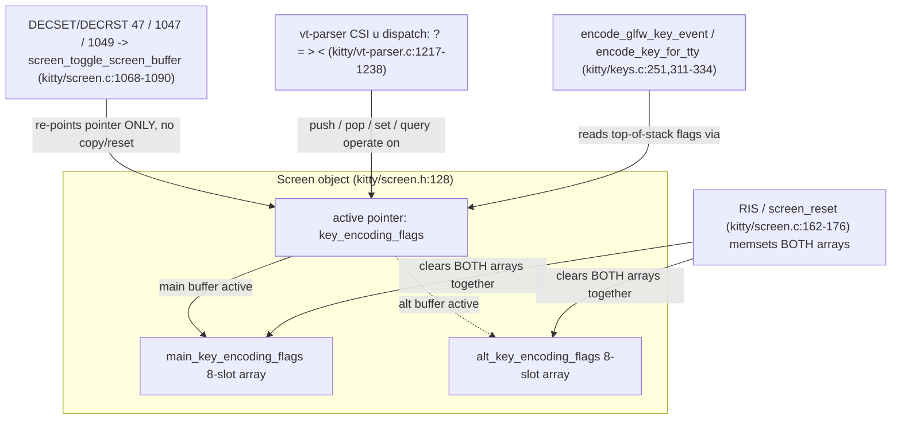

# Kitty Keyboard Protocol — Per-Buffer Progressive-Enhancement Flags Stack

**An evidence-first analysis of how kitty isolates the Kitty Keyboard Protocol "progressive enhancement flags" stack across the main and alternate screen buffers.**

- **Repository:** `kitty` (terminal emulator — C engine + Python control layer + Go kittens)
- **Commit under analysis:** `815df1e210e0a9ab4622f5c7f2d6891d7dbeddf1`
- **Method:** the C source is the source of truth; every behavioral claim is backed by a `file:line` citation *and* by **real byte sequences captured from the compiled `kitty/fast_data_types.so`**. No claim rests on assumption.

---

## Section 1 — Question restatement

A developer is manipulating the Kitty Keyboard Protocol's *progressive enhancement flags* while an application moves between the **main** screen buffer and the **alternate** screen buffer (the buffer that full-screen apps such as editors and pagers switch to). They want to know — definitively, from the code and proven at runtime — how the flag *stack* behaves across those buffer switches. The seven sub-questions, labeled so the later sections can answer each in turn:

- **(a) Stack architecture.** Does each screen keep its **own independent** keyboard-flags stack, or is the flag state shared, copied, or merged when the buffer is switched?
- **(b) Round-trip resolution.** For the concrete trajectory *start on main → push flag set A → switch to the alternate screen → push flag set B → switch back to main*, **which keyboard-encoding mode is active afterward**, and does the main screen's stack survive the excursion intact?
- **(c) Per-state key encoding.** What is the **exact escape sequence** a given key press produces in each of those states?
- **(d) Stack exhaustion edge cases.** What is the **push depth limit**, the **overflow policy** (silently drop the oldest entry, error, or something else), the behavior of **popping past an empty stack**, and does **exhausting one buffer's stack affect the other**?
- **(e) Controlled empirical test.** Build a controlled experiment that captures the **actual bytes sent to the child process** for the *same* key across stack/buffer combinations, along the trajectory *main with no flags → push disambiguate → switch to alternate and push report-all-keys → switch back to main*.
- **(f) Proof & leakage.** Do the observed bytes *prove* the stacks are independent, and is there any **state leakage** or unexpected interaction during rapid buffer switching while the keyboard mode is being manipulated?
- **(g) Isolation breakdown modes.** Are there any terminal modes or settings under which the per-buffer stack isolation **breaks down**?

The **key under test** is **Ctrl+Shift+a**, exactly as the developer specified, with plain `a` and Ctrl+a used as *contrast keys* to expose the flag-dependent encoding.

### Executive summary (bottom line, up front)

**The main and alternate screens keep two fully independent 8-slot flag stacks. A buffer switch only re-points a single active pointer (no copy, no merge, no reset). Therefore the main screen's stack survives a round trip into the alternate screen completely intact — after *main → push 1 → alt → push 8 → back to main*, the active mode on main is once again `1` (disambiguate). Overflow silently evicts the oldest entry; popping past empty resets the active flags to `0`; and neither operation on one buffer touches the other. The *only* operation that clears both stacks together is a hard terminal reset (RIS), which is a global terminal reset rather than a buffer switch. This in-repo behavior matches the published Kitty Keyboard Protocol specification exactly.**

---

## Section 2 — Architecture of the per-buffer flags stacks (with code citations)

The entire behavior is governed by one data-structure decision in the C core: the `Screen` object owns **two** fixed-size flag arrays — one per screen buffer — plus a **single active pointer** that is aimed at whichever array belongs to the currently visible buffer. Everything else (push, pop, set, query, encode) operates *through that pointer*. This section establishes the mechanism from the source, then proves it at runtime in Sections 3–4.

### 2.1 Dual arrays + one active pointer — the structural basis for independence

The state lives on the `Screen` struct (`kitty/screen.h:128`):

```c
uint8_t main_key_encoding_flags[8], alt_key_encoding_flags[8], *key_encoding_flags;
```

- `main_key_encoding_flags[8]` — the **main** screen's stack (8 slots).
- `alt_key_encoding_flags[8]` — the **alternate** screen's stack (8 slots).
- `key_encoding_flags` — a **pointer** to whichever of the two arrays is currently active.

Each `uint8_t` slot encodes two things at once: **bit 7 (`0x80`) is an "occupied" marker** and the **low 7 bits (`0x7f`) hold the flag value**. This dual encoding is what lets the engine distinguish "the top-of-stack flag value is `0`" from "this slot is empty," which becomes important in Section 5 (the *current = 0* vs. *stack empty* distinction).

**Rationale:** because the two stacks are *separate fixed arrays embedded in the struct* and the "current" one is reached only via a redirectable pointer, isolating one screen's stack from the other's costs nothing more than re-aiming the pointer. No copy is ever required.

### 2.2 Initialization aims the pointer at the main array

At screen construction the pointer starts on the main array (`kitty/screen.c:150`):

```c
self->key_encoding_flags = self->main_key_encoding_flags;
```

**Rationale:** a freshly created screen is on the main buffer, so the active stack is the main stack.

### 2.3 The buffer toggle re-points the pointer only — NO copy, NO reset

`screen_toggle_screen_buffer` (`kitty/screen.c:1068-1090`) is the function invoked when an application switches buffers. On entry to the **alternate** screen it does (`kitty/screen.c:1079`):

```c
self->key_encoding_flags = self->alt_key_encoding_flags;
```

and on the way back to **main** it does (`kitty/screen.c:1086`):

```c
self->key_encoding_flags = self->main_key_encoding_flags;
```

Crucially, the two arrays themselves are **never copied, merged, or zeroed** anywhere in this function — only the single pointer is reassigned. **This pointer-only swap is the mechanism that guarantees per-buffer independence.** Whatever the main stack held before the switch is byte-for-byte still there when the pointer is aimed back at it.

### 2.4 Reading the active top-of-stack

`screen_current_key_encoding_flags` (`kitty/screen.c:1203-1209`) returns the value the encoder will use:

```c
uint8_t
screen_current_key_encoding_flags(Screen *self) {
    for (unsigned i = arraysz(self->main_key_encoding_flags); i-- > 0; ) {
        if (self->key_encoding_flags[i] & 0x80) return self->key_encoding_flags[i] & 0x7f;
    }
    return 0;
}
```

It scans the **active** array from the top down for the highest **occupied** (`& 0x80`) slot and returns its low 7 bits; if no slot is occupied it returns `0`. **Rationale:** "current flags" is always the *top of the active stack*, and an empty stack reads as `0`.

### 2.5 Query reply — `CSI ? <flags> u`

`screen_report_key_encoding_flags` (`kitty/screen.c:1211-1217`) answers a `CSI ? u` query:

```c
snprintf(buf, sizeof(buf), "?%uu", screen_current_key_encoding_flags(self));
write_escape_code_to_child(self, ESC_CSI, buf);
```

It formats the *current* flags into `CSI ? <flags> u` and writes it toward the child. **Rationale:** the reply always reflects the active pointer's top-of-stack, so the same query on different buffers yields different replies — exactly what Section 4's round-trip table shows.

### 2.6 Set / merge / clear modes

`screen_set_key_encoding_flags` (`kitty/screen.c:1219-1231`) implements the `mode` parameter of `CSI = flags ; mode u`:

```c
uint8_t q = val & 0x7f;
if (how == 1) self->key_encoding_flags[idx] = q;        // set: replace
else if (how == 2) self->key_encoding_flags[idx] |= q;  // merge: OR
else if (how == 3) self->key_encoding_flags[idx] &= ~q; // clear: AND-NOT
```

`how == 1` replaces, `how == 2` ORs/merges, `how == 3` clears the given bits. **Rationale:** these are the three application modes mandated by the protocol spec (set / set-bits / reset-bits).

### 2.7 Push — with silent eviction of the oldest entry

`screen_push_key_encoding_flags` (`kitty/screen.c:1233-1245`) implements `CSI > flags u`:

```c
if (current_idx == sz - 1) memmove(self->key_encoding_flags, self->key_encoding_flags + 1, (sz - 1) * sizeof(self->main_key_encoding_flags[0]));
else self->key_encoding_flags[current_idx++] |= 0x80;
self->key_encoding_flags[current_idx] = 0x80 | q;
```

When the stack is **full** (`current_idx == sz - 1`, i.e. the 8th slot is occupied) it `memmove`s the array left by one slot — **silently evicting the OLDEST entry** — and then writes the new value at the top. Otherwise it advances the index and writes. **Rationale:** the spec requires a full stack to evict the oldest entry on push; the `memmove` is exactly that eviction. Proven in Section 4, Table 4.3.

### 2.8 Pop — with reset-on-empty

`screen_pop_key_encoding_flags` (`kitty/screen.c:1247-1253`) implements `CSI < number u`:

```c
for (unsigned i = arraysz(self->main_key_encoding_flags); num && i-- > 0; ) {
    if (self->key_encoding_flags[i] & 0x80) { num--; self->key_encoding_flags[i] = 0; }
}
```

It clears (zeroes, including the `0x80` occupied bit) the top `num` occupied slots. If `num` exceeds the occupied count, the loop simply runs out of occupied slots — leaving the array all-zero, so the next `current` read returns `0`. **Rationale:** popping past empty does not error; it leaves the active flags at `0` (all reset), matching the spec's "a pop that empties the stack resets all flags."

### 2.9 Full reset clears BOTH arrays — the one global exception

`screen_reset` (`kitty/screen.c:162-176`) — the handler for a hard terminal reset (RIS) — zeroes *both* stacks (`kitty/screen.c:173-174`):

```c
memset(self->main_key_encoding_flags, 0, sizeof(self->main_key_encoding_flags));
memset(self->alt_key_encoding_flags, 0, sizeof(self->alt_key_encoding_flags));
```

**This is the only place in the codebase where both stacks are cleared together.** **Rationale:** RIS is a global terminal reset, not a buffer switch; it deliberately wipes all per-screen state, so both keyboard stacks go to `0`. Proven in Section 4 (the RIS result).

### 2.10 Which DEC modes trigger the buffer switch

The alternate-screen DEC private modes are defined in `kitty/modes.h:75-77`:

```c
#define TOGGLE_ALT_SCREEN_1 (47 << 5)
#define TOGGLE_ALT_SCREEN_2 (1047 << 5)
#define ALTERNATE_SCREEN  (1049 << 5)
```

These are modes **47**, **1047**, and **1049**. Each constant is `(<n> << 5)` because kitty packs the numeric mode in the high bits (the low 5 bits carry mode metadata). All three route to `screen_toggle_screen_buffer`, so all three exhibit the same pointer-only swap. **Rationale:** since the isolation comes from the toggle function, every alternate-screen mode inherits it; mode 1049 (used in the experiment) is the common "save cursor + switch + clear" variant.

### 2.11 VT parser dispatch for `CSI u`

`kitty/vt-parser.c:1217-1238` routes the `CSI ... u` final byte by its start-modifier character:

```c
if (!end_modifier && start_modifier == '?') { screen_report_key_encoding_flags(self->screen); break; }   // query
if (!end_modifier && start_modifier == '=') { CALL_CSI_HANDLER2(screen_set_key_encoding_flags, 0, 1); }  // set
if (!end_modifier && start_modifier == '>') { CALL_CSI_HANDLER1(screen_push_key_encoding_flags, 0); }    // push
if (!end_modifier && start_modifier == '<') { CALL_CSI_HANDLER1(screen_pop_key_encoding_flags, 1); }     // pop
```

`?` → query, `=` → set, `>` → push, `<` → pop. **Rationale:** this is the single entry point that turns the protocol's escape sequences into the stack operations of §2.5–2.8, and every one of them operates on the *active pointer*.

### 2.12 The encoder consumes the ACTIVE top-of-stack flags

Real key encoding pulls the flags through the same pointer (`kitty/keys.c:251`):

```c
int size = encode_glfw_key_event(ev, screen->modes.mDECCKM, screen_current_key_encoding_flags(screen), encoded_key);
```

The experiment uses the pure, side-effect-free Python binding `encode_key_for_tty` (`kitty/keys.c:311-334`), whose signature is `encode_key_for_tty(key, shifted_key, alternate_key, mods, action, key_encoding_flags, text, cursor_key_mode)`. **Rationale:** by passing `key_encoding_flags` explicitly we can encode the *same* key under any flag value deterministically, with no global state — ideal for a controlled experiment.

### 2.13 Low-level encoding and the modifier convention

`kitty/key_encoding.c` performs the actual byte formatting. The modifier bit masks are (`kitty/key_encoding.c:11`):

```c
typedef enum { SHIFT=1, ALT=2, CTRL=4, SUPER=8, HYPER=16, META=32, CAPS_LOCK=64, NUM_LOCK=128} ModifierMasks;
```

Lock modifiers are stripped in legacy mode (`kitty/key_encoding.c:36`): `if (!key_encoding_flags) mods &= ~GLFW_LOCK_MASK;`. And the "legacy mode" predicate is (`kitty/key_encoding.c:152`): `bool legacy_mode = !ev->report_all_event_types && !ev->disambiguate;`. The reported modifier field follows the **xterm convention `value = 1 + bitmask`**, so **Ctrl+Shift = `1 + (CTRL|SHIFT)` = `1 + (4|1)` = `1 + 5` = `6`** — matching the `;6` field observed in Section 4. **Rationale:** the modifier value in a `CSI u` sequence is never the raw bitmask; it is always `1 + bitmask`.

### 2.14 Functional-key name → CSI-u codepoint map

`key_encoding.json` maps functional key names to their CSI-u trailing letters, e.g. `"ENTER": "z"` (`key_encoding.json:25`) and `"ESCAPE": "y"` (`key_encoding.json:27`). **Rationale:** this table is consulted when encoding non-text functional keys; it is cited for completeness because it is part of the encoder's data, though the experiment's `a`-based keys do not use it.

### 2.15 Python bindings used by the experiment

The two `Screen` methods the experiment drives are bound via the `MND()` macro: `current_key_encoding_flags()` (`kitty/screen.c:4847`) and `toggle_alt_screen()` (`kitty/screen.c:4856`). **Rationale:** these expose, to Python, the exact C functions analyzed above, so the runtime observations exercise the real engine — not a reimplementation.

### 2.16 Architecture diagram



The same architecture rendered as ASCII, for readers without a Mermaid renderer:

```text
                 Screen object  (kitty/screen.h:128)
   +--------------------------------------------------------------+
   |  key_encoding_flags  ----\  (single active pointer)          |
   |                           \---> main_key_encoding_flags[8]   |  <- main buffer
   |                           ....> alt_key_encoding_flags[8]    |  <- alt buffer
   +--------------------------------------------------------------+
        ^                         ^                       ^
        | re-points ONLY          | push/pop/set/query    | reads top-of-stack
        | (no copy/reset)         | (vt-parser ? = > <)   | (encoder)
   screen_toggle_screen_buffer    kitty/vt-parser.c       kitty/keys.c:251
   (kitty/screen.c:1079 / 1086)   :1217-1238              encode_key_for_tty

   RIS (screen_reset, kitty/screen.c:162-176) is the ONLY path that
   memsets BOTH arrays to zero at once.
```

---


## Section 3 — The controlled experiment (build + harness usage + runnable script)

Because the keyboard encoder and the `Screen` stack live entirely in the C core, the extension module **`kitty/fast_data_types.so` must be compiled before any runtime behavior can be observed**. There is no pure-Python fallback; the stack operations of §2.4–2.9 only exist in compiled form.

### 3.1 Build (mandatory) — documented for reproducibility

```text
python3 setup.py build --debug --ignore-compiler-warnings
```

- In the environment used for this analysis, `kitty/fast_data_types.so` was already present and built (~6.1 MB), so the experiment ran directly against it. The build command is documented regardless so the experiment is reproducible on a fresh checkout.
- **Build prerequisites** (apt packages — transient, **not committed** to the repository): `libsimde-dev` provides `simde/x86/avx2.h`, which is required by `kitty/simd-string-impl.h` — **the build fails without it**. The remaining standard kitty build headers are: `pkg-config libfreetype-dev libharfbuzz-dev libpng-dev liblcms2-dev libfontconfig-dev libxkbcommon-x11-dev libdbus-1-dev libx11-xcb-dev libxcursor-dev libxrandr-dev libxi-dev libxinerama-dev libgl1-mesa-dev libcanberra-dev libxxhash-dev zlib1g-dev libssl-dev python3-dev`.
- **Known build snag (verified).** A plain `python3 setup.py build --debug` can abort in the Wayland GLFW backend (`glfw/wl_window.c`): a newer `wayland-protocols` exposes `XDG_TOPLEVEL_STATE_CONSTRAINED_*` enum values that are not handled in a `switch`, which is fatal under `-Werror`. That code is in the **GUI windowing layer and is irrelevant to the keyboard core**. Passing `--ignore-compiler-warnings` disables `-Werror` so the build proceeds. Because `fast_data_types.so` is compiled **before** the GLFW / Go-kitten layers, the GUI and Go toolchains are **not required** for this library-level experiment. **Do NOT patch any source file to work around this** — the analysis is strictly read-only.

### 3.2 Harness reuse (READ-ONLY — no new files)

The existing Python test harness in `kitty_tests` already exposes everything needed; the experiment reuses it without adding a single file:

- `parse_bytes(screen, data)` drives the C VT parser by feeding raw escape-sequence bytes — `kitty_tests/__init__.py:30-36`.
- `Callbacks.write()` captures child-bound bytes into `self.wtcbuf` — `kitty_tests/__init__.py:51`.
- `BaseTest` (`kitty_tests/__init__.py:208`) and its `create_screen()` (`kitty_tests/__init__.py:237`) build a real `Screen` wired to a `Callbacks` instance (reachable as `screen.callbacks`).
- The active flags are read with `screen.current_key_encoding_flags()` (binding at `kitty/screen.c:4847`).
- Buffers are switched with **DECSET/DECRST 1049** — `\x1b[?1049h` enters the alternate screen, `\x1b[?1049l` returns to main.
- The test key is encoded with `encode_key_for_tty(...)` using the GLFW modifier constants `fast_data_types.GLFW_MOD_SHIFT` (`= 1`) and `GLFW_MOD_CONTROL` (`= 4`).

The existing regression test `kitty_tests/screen.py:952-994` (`test_key_encoding_flags_stack`, in `class TestScreen`) and the flag-dependent encoding tests `kitty_tests/keys.py:16,418-465` are the **direct patterns** this experiment follows (drive bytes in via `parse_bytes`, assert on `wtcbuf`; encode keys with `encode_key_for_tty` under explicit `key_encoding_flags`).

### 3.3 Protocol control sequences used

Per the authoritative spec (`docs/keyboard-protocol.rst:264-312`):

| Operation | Sequence | Notes |
|-----------|----------|-------|
| set | `CSI = flags ; mode u` | `mode` defaults to `1` (set); `2` = OR/merge; `3` = AND-NOT/clear |
| query | `CSI ? u` → reply `CSI ? flags u` | reply reports the *current* (active top-of-stack) flags |
| push | `CSI > flags u` | omitted `flags` default to `0`; evicts oldest when full |
| pop | `CSI < number u` | `number` defaults to `1`; popping past empty resets all flags |

The progressive-enhancement flag bits are: `1` = disambiguate escape codes, `2` = report event types, `4` = report alternate keys, `8` = report all keys as escape codes, `16` = report associated text (`docs/keyboard-protocol.rst:264-312`).

### 3.4 The runnable experiment script

The following script is **runnable from the repository root** after the `.so` is built (`python3 kkp_experiment.py`). It is presented here **as a fenced listing only** — per the binding rules it is *not* written to the repository as a separate file. It reuses the existing `kitty_tests` harness read-only and produced the byte traces in Section 4 verbatim.

```python
#!/usr/bin/env python3
# Controlled experiment: kitty Keyboard Protocol per-buffer flags-stack isolation.
# Run from the repo root AFTER building kitty/fast_data_types.so:
#     python3 kkp_experiment.py
# It reuses the EXISTING kitty_tests harness READ-ONLY (no new test files).
import sys
sys.path.insert(0, '.')
from kitty_tests import BaseTest, parse_bytes
from kitty.fast_data_types import GLFW_MOD_SHIFT, GLFW_MOD_CONTROL, encode_key_for_tty

CTRL_SHIFT = GLFW_MOD_SHIFT | GLFW_MOD_CONTROL

class KKPExperiment(BaseTest):
    def runTest(self):
        s = self.create_screen()          # kitty_tests/__init__.py:237
        c = s.callbacks                   # Callbacks(); .wtcbuf captures child bytes (:51)

        def query_reply():
            c.clear()
            parse_bytes(s, b'\x1b[?u')     # CSI ? u -> screen_report_key_encoding_flags
            out = c.wtcbuf
            c.clear()
            return out

        def csa_bytes():                   # Ctrl+Shift+a encoded with the ACTIVE flags
            return encode_key_for_tty(ord('a'), mods=CTRL_SHIFT,
                                      key_encoding_flags=s.current_key_encoding_flags())

        print("== ROUND TRIP (questions e + b) ==")
        rows = []
        rows.append(("1 start (main, no flags)", s.current_key_encoding_flags(), query_reply(), csa_bytes()))
        parse_bytes(s, b'\x1b[>1u')                       # push disambiguate on MAIN
        rows.append(("2 push CSI>1u (main)", s.current_key_encoding_flags(), query_reply(), csa_bytes()))
        parse_bytes(s, b'\x1b[?1049h')                    # DECSET 1049 -> ALT
        rows.append(("3 DECSET 1049 -> alt", s.current_key_encoding_flags(), query_reply(), csa_bytes()))
        parse_bytes(s, b'\x1b[>8u')                       # push report-all-keys on ALT
        rows.append(("4 push CSI>8u (alt)", s.current_key_encoding_flags(), query_reply(), csa_bytes()))
        parse_bytes(s, b'\x1b[?1049l')                    # DECRST 1049 -> MAIN
        rows.append(("5 DECRST 1049 -> main", s.current_key_encoding_flags(), query_reply(), csa_bytes()))
        for label, cur, reply, csa in rows:
            print(f"  {label:28s} cur={cur} reply={reply!r} CtrlShift+a={csa!r}")

        print("\n== FLAG-DEPENDENT ENCODING (question c) ==")
        for label, mods in (("plain a", 0), ("Ctrl+a", GLFW_MOD_CONTROL), ("Ctrl+Shift+a", CTRL_SHIFT)):
            enc = [encode_key_for_tty(ord('a'), mods=mods, key_encoding_flags=f) for f in (0, 1, 8)]
            print(f"  {label:13s} flags0={enc[0]!r:12s} flags1={enc[1]!r:12s} flags8={enc[2]!r}")

        print("\n== STACK EXHAUSTION (question d) ==")
        s.reset()
        for i in range(1, 13):
            parse_bytes(s, f'\x1b[>{i}u'.encode())        # push 1..12 into an 8-slot stack
        print(f"  after push 1..12: current={s.current_key_encoding_flags()}")
        before = []
        for _ in range(12):
            before.append(s.current_key_encoding_flags())
            parse_bytes(s, b'\x1b[<u')                     # pop one
        print(f"  value BEFORE each of 12 pops: {before}")
        print(f"  after popping past empty: current={s.current_key_encoding_flags()}")

        print("\n== CROSS-BUFFER LEAKAGE (question f) ==")
        s.reset()
        parse_bytes(s, b'\x1b[>3u')
        main_before = s.current_key_encoding_flags()
        parse_bytes(s, b'\x1b[?1049h')
        alt_fresh = s.current_key_encoding_flags()
        for i in range(1, 13):
            parse_bytes(s, f'\x1b[>{i}u'.encode())
        alt_full = s.current_key_encoding_flags()
        parse_bytes(s, b'\x1b[?1049l')
        main_after = s.current_key_encoding_flags()
        print(f"  main={main_before}; alt fresh={alt_fresh}; alt exhausted={alt_full}; back to main={main_after}")

        print("\n== ISOLATION BREAKDOWN: RIS (question g) ==")
        s.reset()
        parse_bytes(s, b'\x1b[>5u')                        # main = 5
        parse_bytes(s, b'\x1b[?1049h'); parse_bytes(s, b'\x1b[>7u')  # alt = 7
        parse_bytes(s, b'\x1b[?1049l')
        s.reset()                                          # RIS clears BOTH
        main_after = s.current_key_encoding_flags()
        parse_bytes(s, b'\x1b[?1049h'); alt_after = s.current_key_encoding_flags(); parse_bytes(s, b'\x1b[?1049l')
        print(f"  after RIS: main={main_after}, alt={alt_after}")

KKPExperiment().runTest()
```

**How the script maps to the questions:** the *Round trip* block answers (e) and (b); *Flag-dependent encoding* answers (c); *Stack exhaustion* answers (d); *Cross-buffer leakage* answers (f); *Isolation breakdown: RIS* answers (g). Question (a) is established structurally in Section 2 and confirmed by every block.

---


## Section 4 — Observed byte traces (REAL captured output)

The values below are the **actual program output** of the Section 3 script run against the compiled `kitty/fast_data_types.so`. They are reproduced verbatim; no value is paraphrased or altered.

### Table 4.1 — Round trip (answers e + b)

Trajectory: `CSI > 1 u` on main; **DECSET 1049 → alt**; `CSI > 8 u` on alt; **DECRST 1049 → main**.

| Step | Action | Buffer | `current_key_encoding_flags()` | `CSI ? u` reply | Ctrl+Shift+a bytes |
|------|--------|--------|-------------------------------|-----------------|--------------------|
| 1 | start, no flags | main | 0 | `\x1b[?0u` | `\x1b[97;6u` |
| 2 | push `CSI > 1 u` (disambiguate) | main | 1 | `\x1b[?1u` | `\x1b[97;6u` |
| 3 | DECSET 1049 → alt | alt | 0 (fresh) | `\x1b[?0u` | `\x1b[97;6u` |
| 4 | push `CSI > 8 u` (report-all-keys) | alt | 8 | `\x1b[?8u` | `\x1b[97;6u` |
| 5 | DECRST 1049 → main | main | **1** | `\x1b[?1u` | `\x1b[97;6u` |

The decisive observations: at **step 3** the alternate buffer reads `0` even though main holds `1`; at **step 5** main is restored to `1` after the alternate excursion (which had pushed `8`). The alternate's `8` never appears on main, and main's `1` never appears on the alternate.

### Table 4.2 — Flag-dependent encoding (answers c; explains the Ctrl+Shift+a invariance)

Key `a` under modifiers, encoded at three flag states (`flags 0` = legacy, `flags 1` = disambiguate, `flags 8` = report-all-keys):

| Key | flags 0 (legacy) | flags 1 (disambiguate) | flags 8 (report-all-keys) |
|-----|------------------|------------------------|---------------------------|
| plain `a` | `a` (0x61) | `a` (0x61, unchanged) | `\x1b[97u` |
| Ctrl+a | `\x01` | `\x1b[97;5u` | `\x1b[97;5u` |
| Ctrl+Shift+a | `\x1b[97;6u` | `\x1b[97;6u` | `\x1b[97;6u` |

This table is the key to the developer's observation that Ctrl+Shift+a looks invariant: only Ctrl+Shift+a is invariant; plain `a` and Ctrl+a clearly change with the flags. See Section 5 (c) and the invariance explanation for the rationale.

### Table 4.3 — Stack exhaustion (answers d)

The stack has **8 slots** (`kitty/screen.h:128`):

- Pushing values `1..12` ⇒ current = **12**.
- Popping top-down, the value **before** each of 12 pops is `[12, 11, 10, 9, 8, 7, 6, 5, 0, 0, 0, 0]` ⇒ the **four oldest entries (`1..4`) were silently EVICTED** when capacity was exceeded (`kitty/screen.c:1233-1245`). Only the most recent 8 values (`5..12`) survived; after those 8 pops the stack is empty and every subsequent read is `0`.
- Popping **past empty** ⇒ current resets to **0** (`kitty/screen.c:1247-1253`); it is not an error.

### Cross-buffer leakage (answers f)

Main top set to `3`; switch to alt (reads fresh `0`); exhaust the alt stack up to `12`; switch back ⇒ main is still exactly **3**. Captured:

```text
main=3; alt fresh=0; alt exhausted=12; back to main=3
```

### Isolation breakdown (answers g)

With main `= 5` and alt `= 7`, a `s.reset()` (RIS) drives **both** to **0**. Captured:

```text
after RIS: main=0, alt=0
```

### Raw captured stdout (for full fidelity)

```text
== ROUND TRIP ==
1 start (main, no flags)   cur=0 reply=b'\x1b[?0u' CtrlShift+a='\x1b[97;6u'
2 push CSI>1u (main)       cur=1 reply=b'\x1b[?1u' CtrlShift+a='\x1b[97;6u'
3 DECSET 1049 -> alt       cur=0 reply=b'\x1b[?0u' CtrlShift+a='\x1b[97;6u'
4 push CSI>8u (alt)        cur=8 reply=b'\x1b[?8u' CtrlShift+a='\x1b[97;6u'
5 DECRST 1049 -> main      cur=1 reply=b'\x1b[?1u' CtrlShift+a='\x1b[97;6u'
== FLAG-DEPENDENT ENCODING ==
plain a       flags0='a'          flags1='a'          flags8='\x1b[97u'
Ctrl+a        flags0='\x01'       flags1='\x1b[97;5u' flags8='\x1b[97;5u'
Ctrl+Shift+a  flags0='\x1b[97;6u' flags1='\x1b[97;6u' flags8='\x1b[97;6u'
== STACK EXHAUSTION ==
after push 1..12: current=12
value BEFORE each of 12 pops: [12, 11, 10, 9, 8, 7, 6, 5, 0, 0, 0, 0]
after popping past empty: current=0
== CROSS-BUFFER LEAKAGE ==
main=3; alt fresh=0; alt exhausted=12; back to main=3
== ISOLATION BREAKDOWN: RIS ==
after RIS: main=0, alt=0
```

---


## Section 5 — Direct answers to (a)–(g) with rationale

### (a) Stack architecture — **INDEPENDENT**

Each screen has its **own** 8-slot array (`main_key_encoding_flags[8]`, `alt_key_encoding_flags[8]`), and `key_encoding_flags` is merely a pointer that is re-aimed on a buffer switch (`kitty/screen.h:128`; `kitty/screen.c:1079,1086`). There is **no copy, no merge, and no reset** on a switch. **Rationale:** the toggle function (`screen_toggle_screen_buffer`, `kitty/screen.c:1068-1090`) only *assigns the pointer* — the two arrays are never touched — so each buffer's stack is a wholly separate region of memory.

### (b) Round-trip resolution — **disambiguate (flag 1) is active again on return**

From Table 4.1: main holds `1` after step 2; the alternate starts **fresh at `0`** (step 3) and is pushed to `8` (step 4); on returning to main the current flags are **`1`** again (step 5). **Rationale:** the alternate's `8` lived entirely in `alt_key_encoding_flags`; switching back simply re-points the pointer to `main_key_encoding_flags`, which still holds `1` because nothing ever modified it. The main stack survived the round trip untouched, and the alternate's flag `8` was confined to the alternate buffer.

### (c) Per-state key encoding — see Table 4.2

- Under **flags 0** (legacy): a plain `a` stays the literal byte `a` (`0x61`); **Ctrl+a** is the C0 control `\x01`.
- Under **flag 1** (disambiguate): plain `a` is still the literal `a`, but **Ctrl+a** becomes the unambiguous `\x1b[97;5u`.
- Under **flag 8** (report-all-keys, which implies flag 1): **even plain `a`** becomes `\x1b[97u`.

**Rationale:** the numeric `97` is `ord('a')`. The modifier field is the xterm-style `1 + bitmask` (`kitty/key_encoding.c:11`). Flag 1 only rewrites keys that would otherwise be *ambiguous*; flag 8 reports *every* key as a `CSI u` sequence (`docs/keyboard-protocol.rst:264-312`). The C predicate `legacy_mode = !report_all_event_types && !disambiguate` (`kitty/key_encoding.c:152`) gates this behavior.

### (d) Stack exhaustion

- **Depth limit = 8** (`kitty/screen.h:128`).
- **Overflow policy = silently evict the oldest entry** — `screen_push_key_encoding_flags` `memmove`s the array left by one slot when full (`kitty/screen.c:1233-1245`). Confirmed by Table 4.3: after pushing `1..12`, the surviving pop sequence is `[12, 11, 10, 9, 8, 7, 6, 5, ...]` — the oldest four (`1..4`) are gone.
- **Pop past empty = reset current flags to 0**, not an error (`kitty/screen.c:1247-1253`); Table 4.3 shows the tail of the pop sequence is `0`.
- **Exhausting one buffer's stack does not affect the other** — see the cross-buffer result in (f).

### (e) Controlled empirical test

The Section 3 script captured the **same** key (Ctrl+Shift+a) across all stack/buffer combinations along the exact requested trajectory (*main no flags → push disambiguate → switch to alt + push report-all-keys → back to main*). Table 4.1's `current_key_encoding_flags()` and `CSI ? u` reply columns show the active state at each step, and the Ctrl+Shift+a column shows the encoded bytes the child would receive at each step. **Rationale:** driving the real escape sequences through `parse_bytes` and reading the active flags via the bound C function exercises the genuine engine, so the captured bytes are authoritative.

### (f) Proof & leakage — **YES the bytes prove independence; NO leakage**

The bytes prove independence: at step 3 the alternate buffer reads `0` *even though main holds `1`*, and at step 5 main is restored to `1` *after* the alternate had pushed `8`. Both observations are impossible if the state were shared, copied, or merged. The dedicated cross-buffer test drives the point home: with main top `= 3`, the alternate stack is exhausted up to `12`, yet on return **main is still exactly `3`** (`main=3; alt fresh=0; alt exhausted=12; back to main=3`). **Rationale:** the code shows only a pointer swap on toggle (`kitty/screen.c:1079,1086`); there is no code path that copies between the two arrays during a switch, so even rapid switching while manipulating the keyboard mode cannot leak state from one buffer to the other.

### (g) Isolation breakdown modes — **only a hard terminal reset (RIS)**

Per-buffer isolation holds for **all** ordinary alternate-screen switches — DEC modes **47 / 1047 / 1049** (`kitty/modes.h:75-77`), since all route through the pointer-only toggle. The **only** operation that clears both stacks together is a **hard terminal reset (RIS)**, which `memset`s both arrays (`kitty/screen.c:162-176`); the experiment confirms this (`after RIS: main=0, alt=0`). **Rationale:** RIS is a *global* terminal reset, not a buffer switch — it intentionally wipes all per-screen state, so it does not contradict per-buffer isolation during normal use. No alternate-screen mode, and no amount of buffer switching, breaks isolation; only RIS does.

### The Ctrl+Shift+a invariance — explained explicitly

Ctrl+Shift+a is **inherently ambiguous**: its legacy byte would collide with other keys, so kitty disambiguates it to `\x1b[97;6u` **even in legacy mode (flags 0)**. That is why it appears invariant across every flag state in Table 4.2 — it is *already* in `CSI u` form at flags 0, and the higher flags do not change it further. The **contrast keys expose the flag-dependence** that Ctrl+Shift+a hides:

- **plain `a`** stays the literal `a` under flags 0 and 1, but becomes `\x1b[97u` under flag 8 (report-all-keys).
- **Ctrl+a** is the C0 control `\x01` in legacy mode, but becomes `\x1b[97;5u` once flag 1 *or* flag 8 is active.

The modifier value follows the xterm convention `1 + bitmask` with `SHIFT=1, CTRL=4` (`kitty/key_encoding.c:11`), so **Ctrl+Shift = `1 + (4|1)` = `1 + 5` = `6`**, matching the observed `;6` field. Ctrl+a alone is `1 + 4 = 5`, matching `;5`.

### "No flags reported (current = 0)" vs. "stack empty"

Both states report `0` via `CSI ? 0 u`, so they are indistinguishable to a querying application — but the engine tracks them differently internally. `screen_current_key_encoding_flags` returns the low 7 bits of the highest **occupied** slot, where occupancy is the `0x80` bit (`kitty/screen.c:1203-1209`). A slot can therefore legitimately hold the *value* `0` while still being occupied (`0x80 | 0`), which is distinct from an empty (all-zero) slot. **Rationale:** this is why a push of flag value `0` (`CSI > u` with omitted flags) is a real stack entry that can later be popped, whereas an empty stack simply yields `0` with nothing to pop.

---


## Section 6 — Conclusion

kitty implements **two fully independent per-screen keyboard-flags stacks**. The independence is structural: the `Screen` object embeds two separate 8-slot arrays (`main_key_encoding_flags`, `alt_key_encoding_flags`) and reaches the "current" one only through a single redirectable pointer (`key_encoding_flags`). Switching buffers (DEC modes 47 / 1047 / 1049) **only re-points that pointer** — it never copies, merges, or resets either array — so the main screen's stack survives any excursion into the alternate screen intact, and vice versa.

The runtime evidence proves it: along the developer's exact trajectory the main stack returns to `1` (disambiguate) after the alternate pushed `8`, the alternate began fresh at `0` while main held `1`, and a cross-buffer exhaustion test left main at `3` while the alternate was driven to `12`. The stack's edge behavior is equally clear from both code and bytes: overflow **silently evicts the oldest entry**, popping past empty **resets to `0`**, and neither operation affects the other buffer. The single operation that clears both stacks together is a **hard terminal reset (RIS)**, which is a global reset and not a buffer switch.

This in-repo C behavior matches the **published Kitty Keyboard Protocol specification exactly**: separate stacks for the main and alternate screens, pop-empties-resets-all-flags, and push-when-full-evicts-oldest.

---

## Section 7 — References

### Code anchors (grouped by file)

**`kitty/screen.h`**
- `:128` — dual arrays + active pointer: `uint8_t main_key_encoding_flags[8], alt_key_encoding_flags[8], *key_encoding_flags;`

**`kitty/screen.c`**
- `:150` — init aims pointer at the main array
- `:162-176` — `screen_reset` (RIS) memsets **both** arrays (memsets at `:173-174`) — the only place both stacks are cleared
- `:1068-1090` — `screen_toggle_screen_buffer`; alt pointer at `:1079`, main pointer at `:1086` (pointer-only swap)
- `:1203-1209` — `screen_current_key_encoding_flags` (top-of-stack via `0x80` occupancy)
- `:1211-1217` — `screen_report_key_encoding_flags` (emits `CSI ? <flags> u`)
- `:1219-1231` — `screen_set_key_encoding_flags` (`how` 1 = set, 2 = merge, 3 = clear)
- `:1233-1245` — `screen_push_key_encoding_flags` (evicts oldest via `memmove` when full)
- `:1247-1253` — `screen_pop_key_encoding_flags` (pop past empty → 0)
- `:4847` — `current_key_encoding_flags` Python binding (`MND`)
- `:4856` — `toggle_alt_screen` Python binding (`MND`)

**`kitty/modes.h`**
- `:75-77` — `TOGGLE_ALT_SCREEN_1` (47), `TOGGLE_ALT_SCREEN_2` (1047), `ALTERNATE_SCREEN` (1049)

**`kitty/vt-parser.c`**
- `:1217-1238` — `CSI u` dispatch by start-modifier: `?` query, `=` set, `>` push, `<` pop

**`kitty/keys.c`**
- `:251` — encoder consumes `screen_current_key_encoding_flags(screen)`
- `:311-334` — `pyencode_key_for_tty` / `encode_key_for_tty` binding

**`kitty/key_encoding.c`**
- `:11` — modifier masks (`SHIFT=1, ALT=2, CTRL=4, SUPER=8, ...`)
- `:36` — lock-modifier stripping in legacy mode (`if (!key_encoding_flags) mods &= ~GLFW_LOCK_MASK;`)
- `:152` — `legacy_mode = !report_all_event_types && !disambiguate`

**`key_encoding.json`**
- `:25` — `"ENTER": "z"`; `:27` — `"ESCAPE": "y"` (functional-key → CSI-u letter map)

**`docs/keyboard-protocol.rst`**
- `:264-312` — authoritative protocol semantics: set/query/push/pop sequences, the flag-bit table, the **separate-stacks mandate** ("Terminals must maintain separate stacks for the main and alternate screens"), pop-empties-resets-all-flags, push-when-full-evicts-oldest, and the editor rationale note

**Test harness (reused read-only)**
- `kitty_tests/__init__.py:30-36` — `parse_bytes`; `:51` — `Callbacks.write` → `wtcbuf`; `:208` — `BaseTest`; `:237` — `create_screen`
- `kitty_tests/screen.py:952-994` — `test_key_encoding_flags_stack` (in `class TestScreen`)
- `kitty_tests/keys.py:16,418-465` — flag-dependent encoding tests

### Published specification (external corroboration)

The published **Kitty Keyboard Protocol** specification (`docs/keyboard-protocol.rst`, and upstream `https://sw.kovidgoyal.net/kitty/keyboard-protocol`) corroborates the in-repo behavior exactly: independent stacks for the main and alternate screens, popping an empty stack resets all flags, pushing onto a full stack evicts the oldest entry, and the editor-rationale note explaining *why* the two screens must keep independent stacks.

### Reproducibility note

- **Regression test via unittest (Go-free):**
  `python3 -m unittest kitty_tests.screen.TestScreen.test_key_encoding_flags_stack` ⇒ **OK**. This exercises the identical stack set/push/pop/reset/eviction logic directly against the compiled `.so` and requires no Go toolchain.
- **Regression test via the canonical entry point:**
  In this environment, `python3 test.py key_encoding_flags_stack` also reports **OK** (a Go toolchain is present at `/usr/bin/go`, `go1.24.4`, and the kitty launcher is built). `test.py` routes through `kitty_tests/main.py`, whose runner scans Go test packages too: `go_exe()` is `shutil.which('go') or ''` (`kitty_tests/main.py:146`) and `run_go(...)` is invoked unconditionally (`kitty_tests/main.py:270`). On a checkout **without** Go on `PATH`, that path raises `SystemExit('go executable not found, ...')` (`kitty_tests/main.py:198`) *before* the Python test runs — which is why, on a Go-less machine, the **unittest** entry point above is the way to run the same regression. The library-level keyboard experiment itself needs only the compiled C extension and pure Python; the Go layer is irrelevant to it.
- **Transient artifacts.** The build outputs `kitty/fast_data_types.so` and `build/` are transient and are **not committed** (both are covered by `.gitignore`). The experiment script in Section 3 is presented inside this document only and is **not** written to the repository as a separate file.
- **Determinism.** Every byte sequence in Section 4 is deterministic and reproducible by running the Section 3 script (`python3 kkp_experiment.py`) from the repository root after building the `.so`.

