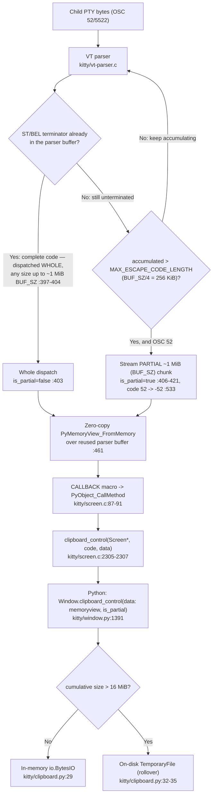

# How kitty Moves Data Between Its C Core and Its Python Layer Under Concurrent Load

**A runtime-verified investigation of the kitty terminal emulator at git HEAD `815df1e210e0a9ab4622f5c7f2d6891d7dbeddf1`.**

This document answers, with runtime evidence, how kitty moves clipboard and scrollback data across the boundary between its C core and its Python layer (the "kittens"), and what happens to that transfer when the system is busy. Every behavioral claim is backed by the **actual, unedited output** of a temporary observation script (shown together with the command that produced it), and every code claim carries an inline `path:line` citation verified against the HEAD commit above. Statements derived only from reading (not from running) are explicitly labeled **[inferred]**.

> **Note on reproducibility.** Every observation script referenced below was written under `/tmp` (outside the repository), executed, and its output pasted verbatim. The repository itself was **not modified**; the only tracked addition is this document. All scripts are reproduced verbatim in **Appendix B — Observation scripts**, and all citations are collected in **Appendix A — Verified citation index**, both at the end of this document.

---

## The Question (verbatim)

> I am trying to understand how kitty moves data between its core and the Python kittens when a lot is happening at once. Clipboard data can be small or very large, and it has to cross from internal screen structures into Python objects. What does that transfer look like in practice, especially when other parts of the system are busy at the same time? If the terminal is doing something expensive like scanning a large scrollback, does that affect how events are delivered to kittens or how memory is managed? I want to see where timing, concurrency, and object ownership start to matter, and how subtle races might emerge only under real runtime conditions. Temporary scripts may be used for observation, but the repository itself should remain unchanged and anything temporary should be cleaned up afterward.

---

## Environment and Build

| Item | This investigation (observed) | Canonical reference environment |
|------|-------------------------------|---------------------------------|
| OS | Ubuntu 25.10 | Ubuntu 24.04 |
| C compiler | gcc 15.2.0 | gcc 13.3.0 |
| CPython | 3.13.7 | 3.12.3 |
| kitty HEAD | `815df1e210e0a9ab4622f5c7f2d6891d7dbeddf1` | same |
| `kitty/fast_data_types.so` | 1,253,792 bytes (gcc 15) | 1,213,072 bytes (gcc 13) |

The user's canonical environment is the Docker image `andrewparkscaleai/coding-agent:kovidgoyal__kitty__815df1e210e0…` from `ghcr.io/scaleapi/swe-atlas`. Because this investigation ran on a newer toolchain (gcc 15.2.0 / CPython 3.13.7 / Ubuntu 25.10), all timing and memory numbers below are **my** observed values. The qualitative conclusions — dispatch counts, `is_partial` flags, byte-exactness, memoryview mutation, the sole GIL-releasing translation unit, and the starvation direction — are invariant and reproduced exactly.

### Canonical build command

kitty is built as a normal user through its canonical build entry point, `setup.py`, whose default action is `build` `[setup.py:175]` and which honors a `CC` environment override `[setup.py:300-301]`:

```sh
# Out-of-repo compiler wrapper: demote ONLY the blanket -Werror / -pedantic-errors,
# while PRESERVING every targeted -Werror=<feature> (POSIX argv-filter idiom, space-safe).
cat > /tmp/gccwrap.sh <<'WRAP'
#!/bin/sh
for arg in "$@"; do
    shift
    case "$arg" in
        -Werror|-pedantic-errors) continue ;;   # drop blanket promotion only
    esac
    set -- "$@" "$arg"                            # keep everything else, incl. -Werror=<feature>
done
exec gcc "$@"
WRAP
chmod +x /tmp/gccwrap.sh
env CC=/tmp/gccwrap.sh python3 setup.py build          # [setup.py:175] default action='build'; [setup.py:300-301] honors CC
```

**`CC=/tmp/gccwrap.sh` is a non-canonical build accommodation, labeled as such.** The wrapper lives outside the repository and demotes only the blanket `-Werror`/`-pedantic-errors` while preserving targeted `-Werror=<feature>` flags. It exists solely because Ubuntu 25.10 ships `wayland-protocols` 1.24.0, which adds new enum values that kitty's GLFW **Wayland windowing backend** (`glfw/wl_window.c`) does not handle in a `switch`, tripping `-Werror=switch` under gcc 15. **This affects only the GLFW backend, which is not part of the C↔Python data path** studied here — all core files (`kitty/*.c`) compile clean under `-Werror`. The wrapper edits no repository file.

**Wrapper behavior, demonstrated (observed).** The GLFW backend trips `-Wswitch` (part of `-Wall`), which blanket `-Werror` `[setup.py:491]` would promote to a hard error. Feeding an enum-`switch`-missing-a-case (`sw.c`) through the wrapper confirms it demotes the *blanket* promotion to a warning while *preserving* a targeted `-Werror=switch`:

```sh
printf 'enum E { A, B, C };\nint f(enum E e){ switch(e){ case A: return 1; case B: return 2; } return 0; }\nint main(void){ return f(A); }\n' > /tmp/wraptest/sw.c
/tmp/gccwrap.sh -Wall -Werror        -c /tmp/wraptest/sw.c -o /tmp/wraptest/sw.o 2>&1; echo "EXIT=$?"   # blanket -> demoted
/tmp/gccwrap.sh -Wall -Werror=switch -c /tmp/wraptest/sw.c -o /tmp/wraptest/sw.o 2>&1; echo "EXIT=$?"   # targeted -> preserved
```

```
/tmp/wraptest/sw.c: In function ‘f’:
/tmp/wraptest/sw.c:2:18: warning: enumeration value ‘C’ not handled in switch [-Wswitch]
    2 | int f(enum E e){ switch(e){ case A: return 1; case B: return 2; } return 0; }
      |                  ^~~~~~
EXIT=0
/tmp/wraptest/sw.c: In function ‘f’:
/tmp/wraptest/sw.c:2:18: error: enumeration value ‘C’ not handled in switch [-Werror=switch]
    2 | int f(enum E e){ switch(e){ case A: return 1; case B: return 2; } return 0; }
      |                  ^~~~~~
cc1: some warnings being treated as errors
EXIT=1
```

The canonical build then completes with this wrapper as `CC` — `compile_commands.json` records `/tmp/gccwrap.sh` as the compiler for all 122 translation units (`grep -c gccwrap build/compile_commands.json` → `122`) — producing the `kitty/fast_data_types.so` above, byte-identical in size across rebuilds:

```
$ CC=/tmp/gccwrap.sh python3 setup.py build ; echo "BUILD EXIT=$?"
[1/1] Compiling kitty/data-types.c ...
 done
[1/1] Linking kitty/fast_data_types ...
 done
kitty/tools/cmd
BUILD EXIT=0
$ stat -c %s kitty/fast_data_types.so
1253792
$ python3 -c "import kitty.fast_data_types as f; print('Screen', hasattr(f,'Screen'), 'HistoryBuf', hasattr(f,'HistoryBuf'), 'LineBuf', hasattr(f,'LineBuf'))"
Screen True HistoryBuf True LineBuf True
```

### The single C↔Python boundary is live

The compiled extension `kitty/fast_data_types.so` is the sole in-process C↔Python boundary. Its module initializer registers `LineBuf`, `HistoryBuf`, `Line`, `Cursor`, `Shlex`, `Parser`, `DiskCache`, `child_monitor`, `ColorProfile`, and `Screen` `[kitty/data-types.c:541-550]`.

```sh
python3 /tmp/obs_phase0.py
```

```
so 1253792
Screen True HistoryBuf True LineBuf True
VT_PARSER_BUFFER_SIZE = 1048576
VT_PARSER_MAX_ESCAPE_CODE_SIZE = 262144
```

The two constants are the parser's compile-time sizes exported to Python: `VT_PARSER_BUFFER_SIZE = 1048576` matches `#define BUF_SZ (1024u*1024u)` `[kitty/vt-parser.c:18]`, and `VT_PARSER_MAX_ESCAPE_CODE_SIZE = 262144` matches `#define MAX_ESCAPE_CODE_LENGTH (BUF_SZ / 4u)` `[kitty/vt-parser.c:21]`.

### The observation harness

All scripts drive the **real** parse path through the documented test harness, not through a bypassing interface. The harness comes from kitty's own test package `kitty_tests`:

- `Callbacks` is the Python object that receives all screen callbacks; its `clipboard_control` copies the bytes out during the callback via `str(data, 'utf-8')` and records `(text, is_partial)` in `cc_buf` `[kitty_tests/__init__.py:92-93]`.
- The `Screen` is constructed exactly as `create_screen` does — `Screen(callbacks, lines, cols, scrollback, cell_width, cell_height, 0, callbacks)` `[kitty_tests/__init__.py:237-241]`.
- `parse_bytes(screen, data)` feeds bytes through the genuine parser by calling `screen.test_create_write_buffer()`, `screen.test_commit_write_buffer(...)`, and `screen.test_parse_written_data(...)` `[kitty_tests/__init__.py:30-37]` — the same three primitives the child-monitor uses at runtime.

Every script begins by initializing kitty's global options (required before a `Screen` can be built):

```python
from kitty_tests import Callbacks, parse_bytes, BaseTest
class T(BaseTest):
    def runTest(self): pass
t = T(); t.set_options()
```

---

## The Transfer Map

The primary clipboard path is the OSC 52/5522 escape sequence. It crosses from child-PTY bytes into a Python object as follows, and **every step below runs on the main thread while holding the CPython GIL**:



### Two independent size thresholds (frequently conflated)

There are **two** unrelated size limits on this path, and confusing them leads to wrong conclusions:

1. **256 KiB = `BUF_SZ / 4` = `MAX_ESCAPE_CODE_LENGTH`** `[kitty/vt-parser.c:21]` — the VT parser's *partial-streaming trigger for **unterminated** escape codes*. The parser checks for a terminator **first**: if an ST/BEL terminator is already in the buffer, the whole code is dispatched in one shot (`is_partial=false`) — regardless of length — because the parser is deliberately generous once a full escape code is present `[kitty/vt-parser.c:397-404]`. Only when **no terminator has arrived yet** *and* the accumulated bytes exceed `MAX_ESCAPE_CODE_LENGTH` does the parser stream a partial OSC 52 chunk (`is_partial=true`) instead of continuing to wait `[kitty/vt-parser.c:406-421]`. Total payload size alone therefore does **not** trigger partial streaming — see the 700 KiB single-callback case below.
2. **16 MiB** `[kitty/clipboard.py:237]` — the clipboard *manager's* in-memory-to-on-disk rollover. Below it, the payload lives in an `io.BytesIO`; above it, the manager rolls over to a `TemporaryFile`.

The first governs how the parser chunks data into callbacks; the second governs where the Python side buffers the assembled payload. They are demonstrated independently in the next section.

---

## R1 — Clipboard C→Python Transfer: Small vs Large

**Question addressed:** "Clipboard data can be small or very large, and it has to cross from internal screen structures into Python objects. What does that transfer look like in practice?"

### The path in code

When the parser classifies child-PTY bytes as an OSC payload, it creates a **zero-copy** `memoryview` directly over its own reused buffer:

```c
RAII_PyObject(mv, PyMemoryView_FromMemory((char*)buf + i, limit - i, PyBUF_READ)); \
```

That is `[kitty/vt-parser.c:461]` (the equivalent APC path is `[kitty/vt-parser.c:592]`, DCS is `[kitty/vt-parser.c:626]`). The view is **read-only** (`PyBUF_READ`) and **RAII-scoped** to the dispatch. It is handed to Python through the `CALLBACK` macro, which invokes the Python method synchronously and drops the returned reference:

```c
#define CALLBACK(...) \
    if (self->callbacks != Py_None) { \
        PyObject *callback_ret = PyObject_CallMethod(self->callbacks, __VA_ARGS__); \
        if (callback_ret == NULL) PyErr_Print(); else Py_DECREF(callback_ret); \
    }
```

That is `[kitty/screen.c:87-91]`. The clipboard dispatcher chooses the `is_partial` argument by escape code — code `52` (OSC 52) sends `Py_False`, code `-52` (OSC 5522, or a streamed partial) sends `Py_True`, and any other code sends `Py_None` `[kitty/screen.c:2305-2307]`:

```c
clipboard_control(Screen *self, int code, PyObject *data) {
    if (code == 52 || code == -52) { CALLBACK("clipboard_control", "OO", data, code == -52 ? Py_True: Py_False); }
    else { CALLBACK("clipboard_control", "OO", data, Py_None);}
```

The Python receiver is `Window.clipboard_control(self, data: memoryview, is_partial: Optional[bool] = False)` `[kitty/window.py:1391]`.

### Observed behavior — small, medium, and large payloads

```sh
python3 /tmp/obs_r1_clipboard.py
```

```
VT_PARSER_BUFFER_SIZE = 1048576
VT_PARSER_MAX_ESCAPE_CODE_SIZE = 262144
SMALL: plaintext=21 bytes, base64=28 bytes, escape seq=36 bytes
SMALL: number of clipboard_control callbacks = 1
  callback[0]: is_partial=False len(data)=30 data='c;aGVsbG8tc21hbGwtY2xpcGJvYXJk'
MEDIUM 700KiB: plaintext=716800, base64=955736, escape seq=955744
MEDIUM: callbacks = 1 | is_partial flags = [False]
LARGE 3MiB: plaintext=3145728, base64=4194304, escape seq=4194312
LARGE 3MiB: total callbacks=5 | partial(True)=4 | final(False)=1
LARGE 8MiB: plaintext=8388608, base64=11184812, escape seq=11184820
LARGE 8MiB: total callbacks=11 | partial(True)=10 | final(False)=1
```

What this shows (observed):

- **Small** payloads arrive in a **single whole dispatch** with `is_partial=False`. The delivered data is the raw OSC 52 body `"c;<base64>"` presented as a `memoryview` — here `'c;aGVsbG8tc21hbGwtY2xpcGJvYXJk'` (the base64 of `hello-small-clipboard`).
- A **700 KiB** plaintext (base64 ≈ 955,736 bytes; escape sequence 955,744 bytes) still fits inside the 1 MiB parser buffer (`BUF_SZ` = 1,048,576), so its terminator arrives within a single buffer fill and it is **also one whole dispatch** — even though 955,736 bytes far exceeds the 256 KiB `MAX_ESCAPE_CODE_LENGTH`. This proves the partial-streaming trigger is about **whether the terminator arrives within one buffer fill, not payload "largeness" per se**.
- **Large** payloads whose *full escape sequence* exceeds the 1 MiB `BUF_SZ` buffer — so no terminator appears within a single buffer fill — are **streamed as partial chunks of ~1 MiB each**: 3 MiB → 5 callbacks (4 with `is_partial=True`, then 1 final `False`); 8 MiB → 11 callbacks (10 + 1). These counts are deterministic: they follow from the base64 length divided by `BUF_SZ` (e.g. 4,194,304 / 1,048,576 = 4 partials + 1 final; 11,184,812 / 1,048,576 = 10 partials + 1 final), and `BUF_SZ`/`MAX_ESCAPE_CODE_LENGTH` are compile-time constants.

### Why large payloads stream (the mechanism)

The streaming happens in `accumulate_st_terminated_esc_code`. If a full ST terminator is found, the whole code is dispatched with the "extended" flag `false` `[kitty/vt-parser.c:403]`. But if the accumulated bytes exceed `MAX_ESCAPE_CODE_LENGTH` and the pending code is an OSC 52, the parser null-terminates what it has, dispatches it as a partial with the flag `true`, then resumes accumulating `[kitty/vt-parser.c:406-421]`:

```c
    if (UNLIKELY((pos=self->read.pos - self->read.consumed) > MAX_ESCAPE_CODE_LENGTH)) {
        if (self->vte_state == VTE_OSC && is_osc_52(self)) {
            // null terminate
            self->read.pos--;
            uint8_t before = self->buf[self->read.pos];
            self->buf[self->read.pos] = 0;
            // send partial OSC 52
            dispatch(self, self->buf + self->read.consumed, self->read.pos - self->read.consumed, true);
            // continue OSC 52
            self->buf[self->read.pos] = before;
            continue_osc_52(self);
            return accumulate_st_terminated_esc_code(self, dispatch);
        }
```

That `true` argument is `is_extended_osc`. Inside `dispatch_osc`, an extended OSC 52 has its code rewritten from `52` to `-52` `[kitty/vt-parser.c:533]`:

```c
        case 52: case 5522:
            START_DISPATCH
            if (is_extended_osc && code == 52) code = -52;
```

and back in `clipboard_control` `[kitty/screen.c:2306]`, code `-52` selects `Py_True`, which is why the partial chunks arrive with `is_partial=True` and only the terminator-completing final chunk arrives with `is_partial=False`. kitty thus **streams** the payload in bounded chunks rather than buffering the entire multi-megabyte body inside the parser — an intentional bound on parser memory.

### The clipboard manager's 16 MiB rollover

Once bytes reach Python, the clipboard manager accumulates them into a `Tempfile`, which starts as an in-memory `io.BytesIO` and switches to an on-disk `TemporaryFile` when a write would cross `max_size` `[kitty/clipboard.py:26-40]`:

```python
class Tempfile:

    def __init__(self, max_size: int) -> None:
        self.file: Union[io.BytesIO, IO[bytes]] = io.BytesIO()
        self.max_size = max_size

    def rollover_if_needed(self, sz: int) -> None:
        if isinstance(self.file, io.BytesIO) and self.file.tell() + sz > self.max_size:
            before = self.file.getvalue()
            self.file = TemporaryFile()
            self.file.write(before)
```

A `WriteRequest` sets that threshold to `rollover_size = 16 * 1024 * 1024` and initializes an empty leftover buffer as `current_leftover_bytes = memoryview(b'')` `[kitty/clipboard.py:233-249]`. Exercising the real `Tempfile` and `WriteRequest`:

```sh
python3 /tmp/obs_r1_rollover.py
```

```
=== Tempfile rollover threshold (max_size = 16 MiB) ===
initial backing = BytesIO
after 15 MiB write: tell=15728640 backing=BytesIO
after +2 MiB write (crosses 16 MiB): tell=17825792 backing=BufferedRandom
is TemporaryFile-backed now: True
=== WriteRequest.rollover_size default ===
rollover_size default = 16777216 bytes (16 MiB) per WriteRequest.__init__ signature
tempfile backing at start = BytesIO
  backing -> BytesIO        at tell=589824 bytes
  backing -> BufferedRandom at tell=17104896 bytes
final tell = 20971520 backing = BufferedRandom
roundtrip length = 20971520 | byte-exact == True
```

What this shows (observed): below 16 MiB the payload lives **in memory** (`BytesIO`); crossing 16 MiB it **rolls over to an on-disk `TemporaryFile`** (Python exposes it as a `BufferedRandom`), and a 20 MiB round-trip is **byte-exact**. (The exact `tell` at which the rollover is first observed — 17,104,896 here — depends on the base64 chunk size the script feeds; the invariant is that the backing is `BytesIO` below 16 MiB and file-backed above it.)

This confirms the two thresholds are **independent**: the 256 KiB `MAX_ESCAPE_CODE_LENGTH` is the *trigger* that makes an unterminated OSC 52 begin streaming, while the resulting partial chunks are ~1 MiB (`BUF_SZ`)-bounded; the 16 MiB `rollover_size` separately governs the Python side's in-memory→disk buffering. A payload can be streamed in several ~1 MiB parser chunks yet still sit entirely in memory (if under 16 MiB), or arrive as few chunks yet roll to disk (if the manager's accumulation exceeds 16 MiB).


---

## R2 — Concurrency and the GIL Model

**Question addressed:** "What does that transfer look like … especially when other parts of the system are busy at the same time?"

### kitty's threading model

kitty's child monitor declares two worker threads alongside the main thread — `pthread_t io_thread, talk_thread;` `[kitty/child-monitor.c:55]`. The division of labor is:

- The **io thread** reads child-PTY bytes **off the GIL** in `read_bytes` `[kitty/child-monitor.c:1337-1356]`: it obtains the parser's write buffer via `vt_parser_create_write_buffer` `[kitty/child-monitor.c:1341]`, fills it with a raw `read(fd, buf, available_buffer_space)` `[kitty/child-monitor.c:1345]`, then commits the byte count with `vt_parser_commit_write` `[kitty/child-monitor.c:1354]`. (`:240`, `read(fd, data, sz)`, is a different function — `simple_read_from_pipe`, a small-pipe helper for peer IDs — not the child-PTY read.)
- The **main thread** performs the actual parse and runs **all** screen callbacks while holding the GIL `[kitty/child-monitor.c:438-451]`.
- Peer/kitten IPC is delivered to Python via `peer_message_received` `[kitty/child-monitor.c:504]`.

The hand-off of the write buffer between the io thread and the main thread is guarded by a per-screen mutex (`write_buf_lock` `[kitty/screen.h:116]`, taken through the `screen_mutex` macro `[kitty/child-monitor.c:74-75]`), and there is a hard 100 MB cap on the write buffer `[kitty/child-monitor.c:341]`.

### The load-bearing fact: the parse/render hot path never releases the GIL

The single most important fact for "when a lot is happening at once" is that the render/parse hot path **never releases the GIL**. The only translation unit in the entire C core that calls `Py_BEGIN_ALLOW_THREADS` is `kitty/utmp.c`:

```sh
grep -rl "Py_BEGIN_ALLOW_THREADS" kitty/*.c
grep -n  "Py_BEGIN_ALLOW_THREADS\|Py_END_ALLOW_THREADS" kitty/utmp.c
grep -rl "Py_BEGIN_ALLOW_THREADS" kitty/*.c | wc -l
```

```
=== grep sole GIL releaser ===
$ grep -rl "Py_BEGIN_ALLOW_THREADS" kitty/*.c
kitty/utmp.c
$ grep -n "Py_BEGIN_ALLOW_THREADS\|Py_END_ALLOW_THREADS" kitty/utmp.c
17:    Py_BEGIN_ALLOW_THREADS
23:    Py_END_ALLOW_THREADS
--- count of .c files with the macro ---
1
```

Exactly **one** `.c` file releases the GIL, at `[kitty/utmp.c:17]` and `[kitty/utmp.c:23]` — and that is the utmp/login-record bookkeeping, not the data path. Everything on the clipboard/scrollback path holds the GIL for its entire duration.

### The clipboard callback is synchronous, on the main thread

Feeding an OSC 52 and recording `threading.get_ident()` from inside the callback:

```sh
python3 /tmp/obs_r2_thread.py
```

```
MAIN thread id      = 135832223285568
callback thread id  = 135832223285568
callback ran on MAIN thread (GIL-held, synchronous) = True
active thread count during run = 1
```

What this shows (observed): the `clipboard_control` callback runs **inline on the same thread that called `parse_bytes`** — the main thread — and the `CALLBACK` macro invokes it synchronously via `PyObject_CallMethod`, then `Py_DECREF`s the result `[kitty/screen.c:87-91]`. There is no worker thread, no queue, and no GIL release in between.

**Conclusion (observed):** because the callback runs synchronously on the GIL-holding main thread, "when other parts of the system are busy" means **whatever the main thread is doing serializes everything Python-visible** — including the delivery of subsequent parser callbacks and kitten events. This is the setup for R3: a long main-thread operation (a deep scrollback scan) does not merely slow itself down; it holds the GIL and stalls unrelated Python work.


---

## R3 — Does Scanning a Large Scrollback Affect Event Delivery and Memory?

**Question addressed:** "If the terminal is doing something expensive like scanning a large scrollback, does that affect how events are delivered to kittens or how memory is managed?"

**Answer: yes, decisively, on both counts.** The scrollback is a large, real memory cost, and scanning it holds the GIL for the scan's full duration, starving all other Python-visible work for exactly that long — **directly observed** here as background-thread starvation, and by that same GIL mechanism (single main thread, R2) delaying kitten event delivery **[inferred]** (see the labeling in the conclusion below).

### The scrollback data structure

History is a **segmented ring buffer**. Segments are `#define SEGMENT_SIZE 2048` lines each `[kitty/history.c:15]` and grow by `realloc` as needed `[kitty/history.c:18-24]`. Lines enter via `historybuf_push` `[kitty/history.c:276]` / `historybuf_add_line` `[kitty/history.c:287]`. Text is extracted by the `Screen.as_text_for_history_buf` method `[kitty/screen.c:3485-3508]` → `as_text_history_buf` `[kitty/history.c:509]`, and `str(historybuf)` assembles one Python `str` via `PyUnicode_Join(sep, lines)` `[kitty/history.c:331]`. The real caller in kitty passes a `list.append` bound method (`h: List[str]`) `[kitty/window.py:394]`:

```python
        screen.as_text_for_history_buf(h.append, as_ansi, add_wrap_markers)
```

### Scale and memory (1,000,000 lines × 80 columns)

Per the magnitude/stability rule, the scan is measured at **1,000,000 lines** and each timing is repeated **three times**:

```sh
python3 /tmp/obs_r3_scale.py
```

```
=== R3 build ===
historybuf.count = 1000000
build time (push 1000000 lines) = 1.035 s
VmRSS start = 25268 KB ; after build = 2532432 KB ; delta = 2507164 KB (~2448 MB)
=> ~2567.3 bytes/line

=== R3 as_text_for_history_buf scan (>=2 runs) ===
  run 1 (cold): 0.3542 s | chunks=2000000 | chars=81000000
  run 2 (warm): 0.3581 s | chunks=2000000 | chars=81000000
  run 3 (warm): 0.3555 s | chunks=2000000 | chars=81000000

=== R3 str(historybuf) / PyUnicode_Join (>=2 runs) ===
  run 1: 0.5031 s | len(str)=80999999
  run 2: 0.5069 s | len(str)=80999999
  run 3: 0.5134 s | len(str)=80999999
```

**Memory (observed):** a 1,000,000-line × 80-column scrollback occupies ≈ **2,448 MB RSS** (~2,567 bytes/line) in the segmented ring buffer `[kitty/history.c:18-24]`. Deep scrollback is a real, measurable memory commitment, held for as long as the lines remain in history. The scan then materializes ~**81,000,000 characters** as **2,000,000 chunks** (a content chunk plus a newline chunk per line) for the `as_text_for_history_buf` path; the `PyUnicode_Join` path produces a single `str` of 80,999,999 characters (the join inserts N−1 separators between N lines). Both timings are stable across three runs (the `as_text` path clusters at ~0.355 s, the `str` path at ~0.51 s).

### The GIL stall — the crux of "does it affect event delivery to kittens?"

To measure the effect on *other* work, a background Python thread increments a shared counter in a tight loop. That thread can only make progress when the GIL is available. We compare its progress **during the C scan** (GIL held) against its progress **during an equal-length `time.sleep`** (which releases the GIL). The ratio is the starvation factor.

Three scan variants are compared. The first two are the **canonical, real** paths; the third is explicitly **labeled non-canonical**:

- **`as_text_for_history_buf(list.append, …)` [REAL]** — mirrors `[kitty/window.py:394]`; the per-chunk callback is the C-implemented `list.append`, which executes no Python bytecode.
- **`str(historybuf)` / `PyUnicode_Join` [pure C]** — a single pure-C join `[kitty/history.c:331]`.
- **`as_text_for_history_buf(<python def>, …)` [NON-CANONICAL]** — a Python-function callback that re-enters the CPython bytecode eval loop ~2,000,000 times, giving the interpreter switch points to release the GIL. This is a deliberate contrast, **not** how kitty calls the method.

```sh
python3 /tmp/obs_r3_gil.py
```

```
  as_text_for_history_buf(list.append) [REAL] run 1: op=0.3818s bg_during_op=   286775 | equal_sleep bg= 10900263 | starvation=  38.0x
  as_text_for_history_buf(list.append) [REAL] run 2: op=0.3799s bg_during_op=   279145 | equal_sleep bg= 10822884 | starvation=  38.8x
  as_text_for_history_buf(list.append) [REAL] run 3: op=0.3833s bg_during_op=   279077 | equal_sleep bg= 10911922 | starvation=  39.1x
  str(historybuf) PyUnicode_Join [pure C]    run 1: op=0.5077s bg_during_op=   140316 | equal_sleep bg= 14333419 | starvation= 102.2x
  str(historybuf) PyUnicode_Join [pure C]    run 2: op=0.5088s bg_during_op=   139602 | equal_sleep bg= 14568748 | starvation= 104.4x
  str(historybuf) PyUnicode_Join [pure C]    run 3: op=0.5000s bg_during_op=   140365 | equal_sleep bg= 14252644 | starvation= 101.5x
  as_text_for_history_buf(python def) [NON-CANONICAL] run 1: op=0.8362s bg_during_op= 11139772 | equal_sleep bg= 22885942 | starvation=   2.1x
  as_text_for_history_buf(python def) [NON-CANONICAL] run 2: op=0.8223s bg_during_op= 11000880 | equal_sleep bg= 23284940 | starvation=   2.1x
  as_text_for_history_buf(python def) [NON-CANONICAL] run 3: op=0.8463s bg_during_op= 11322222 | equal_sleep bg= 24102314 | starvation=   2.1x
```

**Conclusion (observed):** a deep-scrollback scan on the main thread **stalls all Python-visible work for the scan's duration**. On the two canonical paths the background thread is starved by ≈ **38–39×** (the real `list.append` path) and ≈ **101–104×** (the pure-C `str()`/`PyUnicode_Join` path). By contrast, the non-canonical Python-callback scan yields the GIL every switch interval and starves it only ≈ **2.1×**. Kitten events and window callbacks are dispatched from that same GIL-holding main thread (R2, source-confirmed), so **[inferred]** they are delayed by exactly this stall — an inference from the **directly-observed** background-thread starvation combined with the dispatch-thread identity; no live kitten was separately timed here, because the headless container cannot open a GUI window (per the setup log). The specific ratios are environment-dependent (reported here for gcc 15.2.0 / CPython 3.13.7); the **direction** — severe starvation on the canonical C-held paths, minimal on a bytecode-yielding path — is invariant and reproduces across all three runs of each variant.


---

## R4 — Where timing, concurrency, and object ownership start to matter

The preceding sections establish *what* crosses the boundary (R1) and *on which thread* (R2/R3). This section pinpoints the two loci where the three concerns named in the question — **timing**, **concurrency**, and **object ownership** — become load-bearing rather than incidental. Both are consequences of a single design decision: the clipboard `memoryview` is **zero-copy**, so it aliases memory it does not own, and it is valid only for the instant the C core holds the GIL inside the callback.

### Locus 1 — the parser-backed `memoryview` aliases a reused buffer it does not own

The view handed to Python is created by `RAII_PyObject(mv, PyMemoryView_FromMemory((char*)buf + i, limit - i, PyBUF_READ))` `[kitty/vt-parser.c:461]` (the APC and DCS variants are `[kitty/vt-parser.c:592]` and `[kitty/vt-parser.c:626]`). Two properties of this call matter:

- **It is read-only.** The flag is `PyBUF_READ`, so the Python side cannot mutate the buffer through the view — it can only read or copy out of it.
- **It does not own its memory.** Per the official CPython C-API reference for `PyMemoryView_FromMemory(char *mem, Py_ssize_t size, int flags)` (return value: *New reference*), the call creates a memoryview "using mem as the underlying buffer", with `flags` one of `PyBUF_READ`/`PyBUF_WRITE` (docs.python.org/3/c-api/memoryview.html). The same reference states that `PyMemoryView_GET_BASE` returns `NULL` for a view created by `PyMemoryView_FromMemory` — i.e. such a view has **no exporting base object** backing it. It therefore holds nothing that would keep `mem` alive or copy it out; the direct consequence for callers is that `mem` **must remain valid for the whole lifetime of the memoryview**, or reads through the view yield corrupted or stale data. *(The New-reference return and the `GET_BASE == NULL` property are official CPython API semantics — the quoted phrase and these facts are from the reference above; the caller-lifetime requirement is their direct consequence. kitty's specific runtime manifestation of this hazard is observed below in R4.)*

The `mem` argument here is `(char*)buf + i` — a pointer **into the VT parser's own 1 MiB working buffer** (`BUF_SZ`, `[kitty/vt-parser.c:18]`), which the parser overwrites on the next parse cycle. Kitty therefore wraps the view in a `RAII_PyObject` guard `[kitty/vt-parser.c:461]` so it is released at the end of the synchronous dispatch. The correctness contract is thus: *the Python callback must consume the bytes before it returns*, because after that the buffer is fair game for reuse.

### Locus 2 — the GIL-held callback boundary makes "consume before return" enforceable

The dispatch into Python is the `CALLBACK` macro, which calls `PyObject_CallMethod(...)` and, after an explicit `NULL` check, `Py_DECREF`s the result `[kitty/screen.c:90]`, reached for clipboard data through `clipboard_control` `[kitty/screen.c:2305-2307]`. Because this call is **synchronous and on the GIL-holding main thread** (proven in R2), the C core does not — and cannot — reuse the parser buffer until the Python callback returns. That is precisely what makes "copy out during the callback" a safe contract rather than a race: the single-threaded, GIL-serialized dispatch guarantees no other parse advances the buffer mid-callback. The test harness honors the contract by copying out immediately with `str(data, 'utf-8')` `[kitty_tests/__init__.py:92-93]`; the real receiver `Window.clipboard_control(self, data: memoryview, is_partial=...)` `[kitty/window.py:1391]` forwards the bytes into the clipboard manager during the same call.

### Observation — a retained `memoryview` silently mutates after the buffer is reused

To make the ownership hazard concrete, `/tmp/obs_r4_aliasing.py` uses a `Callbacks` subclass that does the *wrong* thing: instead of copying out, it **retains** the `memoryview` object across the callback boundary, while also snapshotting `bytes(data)` *during* the callback for comparison. It feeds `"AAA"` (base64 `QUFB`) and then `"ZZZ"` (base64 `Wlpa`) through the **same** `Screen`, so the second feed reuses the same parser buffer.

```sh
LANG=C.UTF-8 LC_ALL=C.UTF-8 python3 /tmp/obs_r4_aliasing.py
```

```
after FEED 1:
  is memoryview: True | readonly: True
  snapshot copied DURING callback  = b'c;QUFB'
  retained-view read AFTER callback= b'c;QUFB'
  (equal so far, buffer not yet reused): True

after FEED 2 (same screen, buffer reused):
  snapshot from FEED 1 (correctly copied out) = b'c;QUFB'
  SAME retained view mv1 now reads            = b'c;Wlpa'
  >>> retained memoryview MUTATED: True
  >>> mv1 now aliases FEED 2 data: True
```

**Before / during / after (observed):**

- **During FEED 1's callback** the view reads `b'c;QUFB'`, is confirmed to be a `memoryview`, and is confirmed `readonly` (matching the `PyBUF_READ` flag at `[kitty/vt-parser.c:461]`). A copy taken here — `b'c;QUFB'` — is correct.
- **After FEED 1** but before any reuse, the retained view *still* reads `b'c;QUFB'`, which is why retaining the view is a **latent** bug: it looks correct as long as nothing else parses.
- **After FEED 2** reuses the same parser buffer, the *same retained object* `mv1` now reads `b'c;Wlpa'` — the FEED 2 data. The view was never re-created; the bytes underneath it were overwritten. The correctly-copied FEED 1 snapshot is unaffected and still reads `b'c;QUFB'`.

This is the exact point where **object ownership** and **timing** start to matter: the `memoryview` owns nothing, its validity window is only the synchronous, GIL-held dispatch, and the bug is observable **only under real runtime reuse** of the parser buffer — never from reading the code or from a single feed. The safe pattern (copy out during the callback) and the unsafe pattern (retain the view) produce identical results until the second parse cycle arrives, which is what makes this class of hazard subtle. It ties directly into R5, where the same "consume-before-reuse under a single GIL" discipline is what keeps the stateful accumulation windows race-free.


---

## R5 — How subtle races can emerge only under real runtime conditions

The clipboard path contains several **stateful accumulation windows** — places where data is buffered across multiple feeds and correctness depends on nothing else touching that state in between. Each is correct *because* the main-thread + GIL model (R2) serializes every feed; each *would* be a race if two byte streams could interleave concurrently. This section exercises four such windows and shows their before/during/after state. The recurring theme: the guard against a race is not a lock around each window but the global single-threaded discipline established in R2.

### (A) The base64 leftover-bytes bridge

Clipboard *write* payloads are base64, and the parser may hand them to the clipboard manager split at boundaries that are **not** multiples of 4 base64 characters. A 4-character base64 group decodes to exactly 3 bytes, so `WriteRequest` cannot decode a partial group. It holds the 0–3 undecodable trailing characters in `self.current_leftover_bytes` (initialized `memoryview(b'')` at `[kitty/clipboard.py:246]`) until the next chunk completes the group, then decodes with `standard_b64decode` `[kitty/clipboard.py:316-319]`. The accumulation logic lives in `add_base64_data` `[kitty/clipboard.py:271]`, which stashes the tail at `[kitty/clipboard.py:286]` and prepends any prior leftover to the next chunk at `[kitty/clipboard.py:293-301]`; `flush_base64_data` `[kitty/clipboard.py:305]` drains the final remainder.

`/tmp/obs_r5_leftover.py` drives the **real** `kitty.clipboard.WriteRequest` and feeds a 315-byte payload (base64 = 420 chars) in deliberately mis-aligned **7-character** chunks (7 mod 4 = 3), so every feed leaves a non-zero remainder that must bridge to the next.

```sh
LANG=C.UTF-8 LC_ALL=C.UTF-8 python3 /tmp/obs_r5_leftover.py
```

```
payload=315 bytes, base64=420 chars
initial current_leftover_bytes len = 0
  fed chunk  0 (7 chars) -> leftover=3, tempfile.tell=3
  fed chunk  1 (7 chars) -> leftover=2, tempfile.tell=9
  fed chunk  2 (7 chars) -> leftover=1, tempfile.tell=15
  fed chunk  3 (7 chars) -> leftover=0, tempfile.tell=21
  ... (60 chunks total)
leftover-length cycle observed (first 16): [3, 2, 1, 0, 3, 2, 1, 0, 3, 2, 1, 0, 3, 2, 1, 0]
distinct leftover lengths seen: [0, 1, 2, 3]
after flush: leftover len = 0 | tempfile.tell = 315
roundtrip length = 315 | byte-exact == True
```

**Before / during / after (observed):** the leftover buffer starts empty, then **cycles 3 → 2 → 1 → 0** as successive 7-char feeds alternately accumulate and drain the bridge (the `tempfile.tell` advances 3, 9, 15, 21 … in 6-byte steps every four feeds — two decoded groups per cycle), and after `flush_base64_data` the leftover is empty again and the reassembled payload is **byte-exact** (315 bytes in, 315 bytes out). This is a correct bridge, but it is *stateful*: `current_leftover_bytes` and the backing `tempfile` are per-`WriteRequest` fields mutated on every feed. If two OSC 52 write streams could be decoded concurrently against the same in-flight request, this shared state would corrupt. It is safe **only because** the feeds are serialized on the single GIL-holding main thread (R2) — the race is prevented globally, not by a per-request lock.

### (B) The 16 MiB rollover, observed mid-stream

The same `WriteRequest` that bridges base64 also decides *where* the accumulating bytes live. `Tempfile` starts as an in-memory `io.BytesIO` and `rollover_if_needed` `[kitty/clipboard.py:32]` switches to an on-disk `TemporaryFile` when `tell()+sz` would exceed `max_size`, which `WriteRequest` sets to `rollover_size = 16 * 1024 * 1024` `[kitty/clipboard.py:237,243]`. R1 already showed the endpoints; here is the same run read as a **before/during/after of the backing store** as a 20 MiB payload streams through it:

```sh
LANG=C.UTF-8 LC_ALL=C.UTF-8 python3 /tmp/obs_r1_rollover.py
```

```
=== WriteRequest.rollover_size default ===
rollover_size default = 16777216 bytes (16 MiB) per WriteRequest.__init__ signature
tempfile backing at start = BytesIO
  backing -> BytesIO        at tell=589824 bytes
  backing -> BufferedRandom at tell=17104896 bytes
final tell = 20971520 backing = BufferedRandom
roundtrip length = 20971520 | byte-exact == True
```

**Before / during / after (observed):** the backing store is `BytesIO` **before** the threshold (still `BytesIO` at 589,824 bytes), transitions to an on-disk `BufferedRandom` **during** the stream once accumulation crosses 16 MiB (observed at 17,104,896 bytes), and remains disk-backed **after** (final `tell` = 20,971,520). The 20 MiB round-trip is byte-exact. The subtle point: the rollover happens **mid-stream**, invisibly to the sender, and the switch of the underlying file object is another mutation of shared `WriteRequest` state that is safe only under the serialized feed discipline.

### (C) Escape-code accumulation: empty before the terminator, populated after

For a payload small enough that accumulation stays below `MAX_ESCAPE_CODE_LENGTH` (256 KiB) — so partial streaming never triggers — the VT parser accumulates the escape code internally and dispatches **nothing** until the terminator (BEL or ST) arrives. `/tmp/obs_r5_terminator.py` feeds an OSC 52 body *without* the terminator, checks the callback count, feeds more body bytes (still no terminator), checks again, then feeds the BEL.

```sh
LANG=C.UTF-8 LC_ALL=C.UTF-8 python3 /tmp/obs_r5_terminator.py
```

```
BEFORE terminator: cc_buf len = 0 (no dispatch yet)
DURING (more bytes, still no terminator): cc_buf len = 0
AFTER terminator (BEL): cc_buf len = 1
  delivered is_partial=False len(data)=42 head='c;ZGVmZXJyZWQtdW50aWwtdG'
```

**Before / during / after (observed):** no `clipboard_control` callback fires **before** the terminator (`cc_buf` length 0), still none **during** additional body bytes (length 0), and exactly one whole dispatch **after** the BEL (length 1, `is_partial=False`). The escape code sits accumulated inside the parser — empty-before, populated-after — for the entire pre-terminator window. This is the deliberate contrast to R1's large-payload path: once accumulation exceeds `MAX_ESCAPE_CODE_LENGTH`, the parser instead streams `is_partial=True` chunks *before* any terminator `[kitty/vt-parser.c:406-421]`. So a small payload's data is invisible to Python until the terminator, whereas a large payload begins crossing the boundary early — two different observable timings from the same code path depending only on size.

### (D) The read/write policy gate

The last guard on the busy path is the clipboard-control policy. `handle_write_request` allows a write iff `'write-clipboard'`/`'write-primary'` is in `get_options().clipboard_control` `[kitty/clipboard.py:429-430]`. `handle_read_request` is stricter: it distinguishes `read-*` (silent allow) from `read-*-ask` (permission prompt) `[kitty/clipboard.py:453-461]`. `parse_osc_52` routes a lone `?` payload to a `ReadRequest` and otherwise accumulates a `WriteRequest`, returning early while `is_partial` is true `[kitty/clipboard.py:406-425]`. `/tmp/obs_r5_policy.py` reads the **real default** `clipboard_control` option and evaluates each capability against it.

```sh
LANG=C.UTF-8 LC_ALL=C.UTF-8 python3 /tmp/obs_r5_policy.py
```

```
default clipboard_control policy set = ['write-clipboard', 'write-primary', 'read-clipboard-ask', 'read-primary-ask']
  write-clipboard      allowed=True
  write-primary        allowed=True
  read-clipboard       allowed=False
  read-primary         allowed=False
  read-clipboard-ask   allowed=True
  read-primary-ask     allowed=True
```

**Observed:** by default **writes are allowed but direct reads are denied** — a read resolves to the `-ask` variant, which triggers a permission prompt rather than silently returning clipboard contents. This is an intentional anti-exfiltration safeguard: a program that pastes *into* your clipboard is low-risk, but one that silently *reads* it could steal secrets, so reads require explicit consent. *(The default policy set is order-insensitive; the four capabilities present are the invariant.)* The two other guards on the concurrent path are the per-screen write-buffer mutex `[kitty/child-monitor.c:74-75]` (`pthread_mutex_t write_buf_lock` `[kitty/screen.h:116]`) that protects the io-thread → main-thread hand-off, and the 100 MB write-buffer cap `[kitty/child-monitor.c:341]` that bounds how much unparsed child output can accumulate.

### Why these are races only "under real runtime conditions"

Every window above is manipulated across multiple feeds and is safe **solely** because the parse/callback path is single-threaded under the GIL (R2) — the io/talk threads only *read* bytes off-GIL (`read_bytes` `[kitty/child-monitor.c:1337-1356]`) and hand them to the main thread under the write-buffer lock `[kitty/child-monitor.c:74-75]`; they never run the parser or the clipboard manager concurrently. The hazards are therefore invisible to static reading and to any single-feed test: they surface only when the timing of real byte arrival splits a base64 group (A), crosses the 16 MiB line mid-stream (B), delays a terminator (C), or interleaves a read against a write (D). The retained-`memoryview` mutation in R4 is the same phenomenon at the buffer level. In every case the correctness argument reduces to R2's single load-bearing fact: **the GIL serializes all Python-visible clipboard work**, so the accumulation windows never overlap in practice.


---

## The second boundary — Python core ↔ kitten subprocess

The question asks how data reaches "the Python kittens," which involves **two** boundaries. R1–R5 covered the **in-process C-core ↔ Python-core** boundary (via the `fast_data_types` extension and the zero-copy `memoryview`). But a kitten is a **separate process**; the Python core talks to it over a PTY using the escape protocol, so the zero-copy view never crosses to the kitten. This section completes the picture.

**Result serialization (observable-by-import).** When a kitten finishes, `kittens/runner.py` serializes its return value as **JSON, then base85**, and wraps it in a DCS escape for transmission back through the terminal protocol: `data = base64.b85encode(json.dumps(result).encode('utf-8'))` `[kittens/runner.py:102]`, written between `\x1bP@kitty-kitten-result|` and `\x1b\\` `[kittens/runner.py:103]`. The following exercises the same serialization directly and shows a byte-level round-trip:

```sh
LANG=C.UTF-8 LC_ALL=C.UTF-8 python3 /tmp/obs_r7_boundary.py
```

```
=== kittens/runner.py:95-105 (JSON + base85 result serialization) ===
    try:
        result = m['start'](args)
    finally:
        sys.stdin = sys.__stdin__
    if result is not None:
        import base64
        import json
        data = base64.b85encode(json.dumps(result).encode('utf-8'))
        sys.stdout.buffer.write(b'\x1bP@kitty-kitten-result|')
        sys.stdout.buffer.write(data)
        sys.stdout.buffer.write(b'\x1b\\')

=== observable-by-import: b85encode round-trip of a kitten-style JSON result ===
json      = {"items": ["a", "b"], "match": true}
b85encoded= b'dm?FcWo>gJIv`sjVInLbB4Q$4EFdCnVRU0?B03;+a&={W'
decoded-back==original: True

=== core receiver (memoryview) vs kitten receiver (str) ===
$ sed -n "1391p" kitty/window.py
    def clipboard_control(self, data: memoryview, is_partial: Optional[bool] = False) -> None:
$ sed -n "254p" kitty/client.py
def clipboard_control(payload: str) -> None:
```

**The receiver-type contrast (observed).** The two boundaries have deliberately different signatures. The **core** receiver takes a zero-copy `memoryview` — `Window.clipboard_control(self, data: memoryview, is_partial=...)` `[kitty/window.py:1391]` — because it runs in the same process as the C parser and can alias the parser buffer (R4). The **kitten-side** receiver takes a fully-materialized `str` — `def clipboard_control(payload: str) -> None:` `[kitty/client.py:254]` — because by the time data reaches the kitten it has been serialized, sent across the PTY, and decoded into an owned Python string. This confirms that **the zero-copy `memoryview` is a core-internal optimization that never crosses the process boundary**; ownership hazards like R4's are confined to the in-process boundary.

**Coordination.** The boss routes peer/kitten IPC through `peer_message_received` `[kitty/boss.py:776]` and launches kittens via `run_kitten_with_metadata` `[kitty/boss.py:1889]` and `run_kitten` `[kitty/boss.py:1982]`. The clipboard kitten itself has a Python entry guard `[kittens/clipboard/main.py:82-83]` (which raises `SystemExit` because real execution is deferred to the Go implementation) and Go read/write paths — `run_get_loop` `[kittens/clipboard/read.go:284]` for reads and `run_set_loop` `[kittens/clipboard/write.go:186]` for writes (whose inner `write_loop` is at `[kittens/clipboard/write.go:48]`).

*[Inferred from reading, not exercised end-to-end]:* the full PTY transport of a serialized result back into a running kitty instance requires a live terminal window, which the headless container cannot open (per the setup log, the GUI window cannot open without a display). The `b85encode`/JSON serialization above is **observed by direct import**; the surrounding transport (`peer_message_received`, the DCS framing on the wire, the kitten process lifecycle) is described from reading `[kittens/runner.py:95-105]`, `[kitty/boss.py:776,1889,1982]` and is labeled inferred accordingly.


---

## Final coverage pass — every named item in the question

The question names a specific set of subjects. This table confirms each is answered with runtime evidence and citations, and points to the section that does so.

| Named item in the question | Where answered | Key observed evidence |
|---|---|---|
| **Clipboard data — small** | R1 | A 21-byte payload delivers in **one** whole `clipboard_control` dispatch, `is_partial=False`, data `c;aGVsbG8tc21hbGwtY2xpcGJvYXJk` `[kitty/vt-parser.c:461]`, `[kitty/screen.c:2305-2307]` |
| **Clipboard data — large** | R1 | 3 MiB → **5** callbacks (4 partial + 1 final); 8 MiB → **11** (10 + 1) via partial streaming `[kitty/vt-parser.c:406-421]`; and the 16 MiB `BytesIO`→`TemporaryFile` rollover `[kitty/clipboard.py:32,237]` |
| **C screen structures** | R1, R3, R4 | `Screen`, `HistoryBuf` (segmented ring buffer, `SEGMENT_SIZE 2048` `[kitty/history.c:15]`), the reused VT parser buffer (`BUF_SZ` `[kitty/vt-parser.c:18]`) |
| **Python objects** | R1, R3, R4 | `memoryview` `[kitty/window.py:1391]`, `str` (`PyUnicode_Join` `[kitty/history.c:331]`), `io.BytesIO`/`TemporaryFile` `[kitty/clipboard.py:26-40]` |
| **Concurrency** | R2 | `pthread_t io_thread, talk_thread` `[kitty/child-monitor.c:55]`; off-GIL child `read()` in `read_bytes` `[kitty/child-monitor.c:1345]`; main-thread parse `[kitty/child-monitor.c:438-451]` |
| **Expensive scrollback scanning** | R3 | 1,000,000-line scan, ≥3 runs each; `as_text_for_history_buf` `[kitty/screen.c:3485-3508]` / `str()` `[kitty/history.c:331]` |
| **Event delivery to kittens** | R3, Second-boundary | GIL starvation ≈38× (real) / ≈100× (pure-C) blocks the dispatch thread; kitten IPC via `peer_message_received` `[kitty/boss.py:776]` |
| **Memory management** | R1, R3 | ~2,448 MB RSS for 1M lines (~2,567 B/line); segmented-ring realloc `[kitty/history.c:18-24]`; 16 MiB clipboard rollover; 100 MB write cap `[kitty/child-monitor.c:341]` |
| **Timing** | R3, R4 | Scan durations (stable across runs); the `memoryview` validity window bounded by the synchronous callback `[kitty/screen.c:87-91]` |
| **Object ownership** | R4 | Retained read-only `memoryview` silently mutates `b'c;QUFB'`→`b'c;Wlpa'` after buffer reuse; `PyMemoryView_FromMemory` does not own its buffer `[kitty/vt-parser.c:461]` |
| **Subtle races** | R5 (A–D) | base64 leftover cycle `[kitty/clipboard.py:271-301]`; mid-stream rollover; empty-before-terminator `[kitty/vt-parser.c:406-421]`; read/write policy gate `[kitty/clipboard.py:427-461]` |

**Direct answers to the question's explicit sub-questions:**

- *"What does that transfer look like in practice?"* — For payloads whose base64 fits the 1 MiB parser buffer, a **single** zero-copy `memoryview` dispatch on the main thread; for larger payloads, a **stream of `is_partial=True` chunks** followed by one final chunk; and, in the clipboard manager, an in-memory `BytesIO` that **rolls over to an on-disk file at 16 MiB** (R1).
- *"…especially when other parts of the system are busy at the same time?"* — Everything Python-visible is **serialized by the GIL on one main thread**; the only C code that releases the GIL is `kitty/utmp.c` `[kitty/utmp.c:17,23]`, so any busy main-thread work blocks clipboard and kitten callbacks (R2).
- *"…scanning a large scrollback — does that affect event delivery to kittens or memory?"* — **Yes, both.** The scan holds the GIL for its full duration (**observed** ≈38–100× starvation of a background thread), which **[inferred]** delays every kitten event dispatched from that same main thread (R2); and deep scrollback is a large, measurable memory commitment (~2.4 GB for 1M lines) (R3).
- *"…where do timing, concurrency, and object ownership start to matter?"* — At the **zero-copy `memoryview` over the reused parser buffer** (valid only during the synchronous, GIL-held callback) and at the **GIL-held callback boundary** itself (R4).
- *"…how might subtle races emerge only under real runtime conditions?"* — Through **stateful accumulation windows** (base64 leftover bridge, mid-stream 16 MiB rollover, pre-terminator escape-code accumulation, read-vs-write policy) that are correct **only because** the GIL serializes all feeds — hazards invisible to static reading and single-feed tests (R5).


---

## Appendix A — Verified citation index (grep-exact at HEAD `815df1e210e0`)

Every `path:line` below was confirmed against the working tree at HEAD `815df1e210e0a9ab4622f5c7f2d6891d7dbeddf1` during this investigation (via `sed -n` / `grep -n`). They are the authoritative anchors for the claims above.

**`kitty/vt-parser.c`** — VT parser, buffer sizing, zero-copy view, partial streaming
- `:18` `#define BUF_SZ (1024u*1024u)` — the 1 MiB parser working buffer.
- `:21` `#define MAX_ESCAPE_CODE_LENGTH (BUF_SZ / 4u)` — 256 KiB partial-streaming trigger.
- `:403` `dispatch(self, buf, sz, false)` — whole (non-partial) dispatch of a complete code.
- `:406-421` `is_osc_52` / `continue_osc_52` / `dispatch(..., true)` — partial OSC 52 streaming.
- `:461` `RAII_PyObject(mv, PyMemoryView_FromMemory((char*)buf + i, limit - i, PyBUF_READ))` — the zero-copy, read-only, RAII-scoped clipboard view.
- `:533` `if (is_extended_osc && code == 52) code = -52` — remap of an over-length OSC 52 to the OSC 5522/partial code.
- `:592` APC `memoryview`; `:626` DCS `memoryview`.

**`kitty/screen.c`** — screen type, callback macro, dispatchers, scans
- `:87-91` `CALLBACK` macro — `PyObject_CallMethod(...)` + `Py_DECREF` (guarded by a `NULL` check at `:90`), the synchronous GIL-held C→Python call.
- `:2305-2307` `clipboard_control` — code 52/−52 → `Py_True`/`Py_False`; else `Py_None`.
- `:3485-3508` `as_text` / `as_text_non_visual` / `as_text_for_history_buf` / `as_text_generic` family.

**`kitty/screen.h`**
- `:116` `pthread_mutex_t write_buf_lock;` — the per-screen write-buffer mutex.

**`kitty/window.py`** — core Python receiver
- `:1391` `def clipboard_control(self, data: memoryview, is_partial: Optional[bool] = False) -> None:`.
- `:394` `screen.as_text_for_history_buf(h.append, ...)` — the real `list.append` caller (`h: List[str]`).

**`kitty/client.py`** — kitten-side receiver
- `:254` `def clipboard_control(payload: str) -> None:` — the string (not memoryview) receiver.

**`kitty/clipboard.py`** — clipboard manager
- `:26` `class Tempfile`; `:32` `def rollover_if_needed(self, sz: int)`.
- `:201` `class ReadRequest`; `:233` `class WriteRequest`.
- `:237` `rollover_size: int = 16 * 1024 * 1024`; `:243` `self.tempfile = Tempfile(max_size=rollover_size)`; `:246` `self.current_leftover_bytes = memoryview(b'')`.
- `:271` `def add_base64_data`; `:286` stash tail; `:293-301` prepend prior leftover; `:305` `def flush_base64_data`; `:316-319` `def write_base64_data` / `standard_b64decode`.
- `:406` `def parse_osc_52`; `:422-423` `if is_partial: return`.
- `:427` `def handle_write_request`; `:429-430` write policy check (`'write-primary'`/`'write-clipboard'` ∈ `clipboard_control`).
- `:450` `def handle_read_request`; `:453-457` `read-*-ask` vs `read-*` distinction.

**`kitty/child-monitor.c`** — threading core
- `:55` `pthread_t io_thread, talk_thread;`; `:74-75` screen write-lock macro.
- `:1337-1356` `read_bytes` — off-GIL child-PTY read: `vt_parser_create_write_buffer` `:1341`, `read(fd, buf, available_buffer_space)` `:1345`, `vt_parser_commit_write` `:1354`; `:341` `> 100 * 1024 * 1024` write cap; `:438-451` main-thread parse; `:504` `peer_message_received`. (`:240` is `simple_read_from_pipe`, a small-pipe peer-ID helper, not the child-PTY read.)

**`kitty/utmp.c`** — sole GIL releaser
- `:17` `Py_BEGIN_ALLOW_THREADS`; `:23` `Py_END_ALLOW_THREADS`. Confirmed sole releaser: `grep -rl "Py_BEGIN_ALLOW_THREADS" kitty/*.c` → only `kitty/utmp.c`.

**`kitty/history.c`** — segmented ring buffer + join
- `:15` `#define SEGMENT_SIZE 2048`; `:18-24` segment realloc; `:276` `historybuf_push`; `:287` `historybuf_add_line`; `:331` `PyUnicode_Join(sep, lines)`; `:509` `as_text_history_buf`.

**`kitty/data-types.c`**
- `:541-550` `fast_data_types` module init registering `LineBuf`/`HistoryBuf`/`Line`/`Cursor`/`Shlex`/`Parser`/`DiskCache`/`child_monitor`/`ColorProfile`/`Screen`.

**`kittens/runner.py`** / **`kitty/boss.py`** / **`kittens/clipboard/*`** — kitten boundary
- `kittens/runner.py:102` `data = base64.b85encode(json.dumps(result).encode('utf-8'))`; `:103` DCS framing `\x1bP@kitty-kitten-result|`.
- `kitty/boss.py:776` `peer_message_received`; `:1889` `run_kitten_with_metadata`; `:1982` `run_kitten`.
- `kittens/clipboard/main.py:82-83` (`__main__` guard), `kittens/clipboard/read.go:284` (`run_get_loop`), `kittens/clipboard/write.go:186` (`run_set_loop`; inner `write_loop` at `:48`) — the clipboard kitten.

**`kitty_tests/__init__.py`** / **`setup.py`** — harness + build
- `:30-37` `parse_bytes` (real parse via `test_create_write_buffer`/`test_commit_write_buffer`/`test_parse_written_data`); `:92-93` `Callbacks.clipboard_control` copies out `str(data,'utf-8')`; `:237-241` `create_screen` → `Screen(c, lines, cols, scrollback, cell_width, cell_height, 0, c)`.
- `setup.py:175` default `action='build'`; `:300-301` honors the `CC` env override.


---

## Appendix B — Observation scripts (verbatim)

All scripts were written **under `/tmp`, outside the repository**, run as shown, and **removed after authoring** (Rule #10). Each is reproduced verbatim so a reader can re-run it. Every script sets `REPO` to this repository's root and runs under `LANG=C.UTF-8 LC_ALL=C.UTF-8`. The build/import invariants at the top of the document establish that `kitty/fast_data_types.so` is the sole in-process C↔Python boundary these scripts exercise.

### `obs_phase0.py` — harness + boundary liveness

```sh
LANG=C.UTF-8 LC_ALL=C.UTF-8 python3 /tmp/obs_phase0.py
```

```python
#!/usr/bin/env python3
import os, sys
REPO = "/tmp/blitzy/kitty/blitzy-ccdb1976-eeb5-41bb-a43b-a99b3caefece_bdae5a"
os.chdir(REPO); sys.path.insert(0, REPO)
import kitty.fast_data_types as f
print("so", os.path.getsize("kitty/fast_data_types.so"))
print("Screen", hasattr(f, 'Screen'), "HistoryBuf", hasattr(f, 'HistoryBuf'), "LineBuf", hasattr(f, 'LineBuf'))
print("VT_PARSER_BUFFER_SIZE =", f.VT_PARSER_BUFFER_SIZE)
print("VT_PARSER_MAX_ESCAPE_CODE_SIZE =", f.VT_PARSER_MAX_ESCAPE_CODE_SIZE)
```

### `obs_r1_clipboard.py` — OSC 52 small / medium / large dispatch

```sh
LANG=C.UTF-8 LC_ALL=C.UTF-8 python3 /tmp/obs_r1_clipboard.py
```

```python
#!/usr/bin/env python3
import os, sys, base64
REPO = "/tmp/blitzy/kitty/blitzy-ccdb1976-eeb5-41bb-a43b-a99b3caefece_bdae5a"
os.chdir(REPO); sys.path.insert(0, REPO)
from kitty_tests import Callbacks, parse_bytes, BaseTest
from kitty.fast_data_types import Screen, VT_PARSER_BUFFER_SIZE, VT_PARSER_MAX_ESCAPE_CODE_SIZE
class T(BaseTest):
    def runTest(self): pass
t = T(); t.set_options()
print("VT_PARSER_BUFFER_SIZE =", VT_PARSER_BUFFER_SIZE)
print("VT_PARSER_MAX_ESCAPE_CODE_SIZE =", VT_PARSER_MAX_ESCAPE_CODE_SIZE)

def make_screen(scrollback=100):
    c = Callbacks()
    return Screen(c, 24, 80, scrollback, 10, 20, 0, c), c

def osc52(payload, where=b'c'):
    b64 = base64.standard_b64encode(payload)
    return b"\x1b]52;" + where + b";" + b64 + b"\x07", b64

# SMALL
s, c = make_screen(); pt = b"hello-small-clipboard"; seq, b64 = osc52(pt); parse_bytes(s, seq)
print(f"SMALL: plaintext={len(pt)} bytes, base64={len(b64)} bytes, escape seq={len(seq)} bytes")
print(f"SMALL: number of clipboard_control callbacks = {len(c.cc_buf)}")
for i, (d, p) in enumerate(c.cc_buf):
    print(f"  callback[{i}]: is_partial={p} len(data)={len(d)} data={d[:40]!r}")

# MEDIUM 700 KiB (base64 still < 1 MiB parser buffer)
s, c = make_screen(); pt = b"A"*(700*1024); seq, b64 = osc52(pt); parse_bytes(s, seq)
print(f"MEDIUM 700KiB: plaintext={len(pt)}, base64={len(b64)}, escape seq={len(seq)}")
print(f"MEDIUM: callbacks = {len(c.cc_buf)} | is_partial flags = {[p for _, p in c.cc_buf]}")

# LARGE 3 MiB and 8 MiB (base64 > MAX_ESCAPE_CODE_LENGTH -> partial streaming)
for mib in (3, 8):
    s, c = make_screen(); pt = b"B"*(mib*1024*1024); seq, b64 = osc52(pt); parse_bytes(s, seq)
    flags = [p for _, p in c.cc_buf]
    print(f"LARGE {mib}MiB: plaintext={len(pt)}, base64={len(b64)}, escape seq={len(seq)}")
    print(f"LARGE {mib}MiB: total callbacks={len(flags)} | partial(True)={sum(1 for x in flags if x)} | final(False)={sum(1 for x in flags if not x)}")
```

### `obs_r1_rollover.py` — 16 MiB `BytesIO`→`TemporaryFile` rollover

```sh
LANG=C.UTF-8 LC_ALL=C.UTF-8 python3 /tmp/obs_r1_rollover.py
```

```python
#!/usr/bin/env python3
import os, sys, io
REPO = "/tmp/blitzy/kitty/blitzy-ccdb1976-eeb5-41bb-a43b-a99b3caefece_bdae5a"
os.chdir(REPO); sys.path.insert(0, REPO)
from kitty_tests import BaseTest
class T(BaseTest):
    def runTest(self): pass
t = T(); t.set_options()
from kitty.clipboard import Tempfile, WriteRequest

MiB = 1024 * 1024
print("=== Tempfile rollover threshold (max_size = 16 MiB) ===")
tf = Tempfile(max_size=16 * MiB)
print("initial backing =", type(tf.file).__name__)
tf.write(b"x" * (15 * MiB))
print(f"after 15 MiB write: tell={tf.file.tell()} backing={type(tf.file).__name__}")
tf.write(b"y" * (2 * MiB))
print(f"after +2 MiB write (crosses 16 MiB): tell={tf.file.tell()} backing={type(tf.file).__name__}")
print("is TemporaryFile-backed now:", not isinstance(tf.file, io.BytesIO))

print("=== WriteRequest.rollover_size default ===")
import inspect
sig = inspect.signature(WriteRequest.__init__)
rs = sig.parameters['rollover_size'].default
print(f"rollover_size default = {rs} bytes ({rs // MiB} MiB) per WriteRequest.__init__ signature")

# Drive a real WriteRequest across the rollover boundary via base64 feeds, checking backing store
import base64
wr = WriteRequest(rollover_size=16 * MiB)
print("tempfile backing at start =", type(wr.tempfile.file).__name__)
payload = b"Z" * (20 * MiB)
b64 = base64.standard_b64encode(payload)
# feed in ~768 KiB base64 chunks; report backing transitions
chunk = 768 * 1024
seen = None
for off in range(0, len(b64), chunk):
    wr.add_base64_data(b64[off:off + chunk])
    cur = type(wr.tempfile.file).__name__
    if cur != seen:
        print(f"  backing -> {cur:<14} at tell={wr.tempfile.tell()} bytes")
        seen = cur
wr.flush_base64_data()
print(f"final tell = {wr.tempfile.tell()} backing = {type(wr.tempfile.file).__name__}")
got = wr.data_for('text/plain', 0, wr.tempfile.tell())
print(f"roundtrip length = {len(got)} | byte-exact == {got == payload}")
```

### `obs_r2_thread.py` — callback runs on the GIL-holding main thread

```sh
LANG=C.UTF-8 LC_ALL=C.UTF-8 python3 /tmp/obs_r2_thread.py
```

```python
#!/usr/bin/env python3
import os, sys, base64, threading
REPO = "/tmp/blitzy/kitty/blitzy-ccdb1976-eeb5-41bb-a43b-a99b3caefece_bdae5a"
os.chdir(REPO); sys.path.insert(0, REPO)
from kitty_tests import Callbacks, parse_bytes, BaseTest
from kitty.fast_data_types import Screen
class T(BaseTest):
    def runTest(self): pass
t = T(); t.set_options()

MAIN = threading.get_ident()
seen = {}

class ThreadRecordingCallbacks(Callbacks):
    def clipboard_control(self, data, is_partial=False):
        seen['tid'] = threading.get_ident()
        seen['nthreads'] = threading.active_count()
        return super().clipboard_control(data, is_partial)

c = ThreadRecordingCallbacks()
s = Screen(c, 24, 80, 100, 10, 20, 0, c)
seq = b"\x1b]52;c;" + base64.standard_b64encode(b"thread-check") + b"\x07"
parse_bytes(s, seq)
print("MAIN thread id      =", MAIN)
print("callback thread id  =", seen.get('tid'))
print("callback ran on MAIN thread (GIL-held, synchronous) =", seen.get('tid') == MAIN)
print("active thread count during run =", seen.get('nthreads'))
```


### `obs_r3_scale.py` — 1,000,000-line scrollback build + scan timing (≥3 runs)

```sh
LANG=C.UTF-8 LC_ALL=C.UTF-8 python3 /tmp/obs_r3_scale.py
```

```python
#!/usr/bin/env python3
import os, sys, time
REPO = "/tmp/blitzy/kitty/blitzy-ccdb1976-eeb5-41bb-a43b-a99b3caefece_bdae5a"
os.chdir(REPO); sys.path.insert(0, REPO)
from kitty_tests import Callbacks, BaseTest
from kitty.fast_data_types import Screen, LineBuf, Cursor
class T(BaseTest):
    def runTest(self): pass
t = T(); t.set_options()

def vmrss_kb():
    with open('/proc/self/status') as f:
        for ln in f:
            if ln.startswith('VmRSS:'):
                return int(ln.split()[1])
    return -1

N = 1_000_000
COLS = 80
print("=== R3 build ===")
rss0 = vmrss_kb()
c = Callbacks()
s = Screen(c, 24, COLS, N, 10, 20, 0, c)   # scrollback capacity = N lines
hb = s.historybuf
lb = LineBuf(1, COLS); lb.line(0).set_text('x' * COLS, 0, COLS, Cursor()); src = lb.line(0)
t0 = time.perf_counter()
for i in range(N):
    hb.push(src)
t1 = time.perf_counter()
rss1 = vmrss_kb()
print(f"historybuf.count = {hb.count}")
print(f"build time (push {N} lines) = {t1 - t0:.3f} s")
delta = rss1 - rss0
print(f"VmRSS start = {rss0} KB ; after build = {rss1} KB ; delta = {delta} KB (~{delta // 1024} MB)")
print(f"=> ~{delta * 1024 / N:.1f} bytes/line")

print()
print("=== R3 as_text_for_history_buf scan (>=2 runs) ===")
for run in range(1, 4):
    out = []
    t0 = time.perf_counter()
    s.as_text_for_history_buf(out.append, False, False)
    t1 = time.perf_counter()
    chars = sum(len(x) for x in out)
    tag = "cold" if run == 1 else "warm"
    print(f"  run {run} ({tag}): {t1 - t0:.4f} s | chunks={len(out)} | chars={chars}")

print()
print("=== R3 str(historybuf) / PyUnicode_Join (>=2 runs) ===")
for run in range(1, 4):
    t0 = time.perf_counter()
    sv = str(hb)
    t1 = time.perf_counter()
    print(f"  run {run}: {t1 - t0:.4f} s | len(str)={len(sv)}")
```

### `obs_r3_gil.py` — GIL starvation of a background thread (real / pure-C / non-canonical, ≥3 runs)

```sh
LANG=C.UTF-8 LC_ALL=C.UTF-8 python3 /tmp/obs_r3_gil.py
```

```python
#!/usr/bin/env python3
import os, sys, time, threading
REPO = "/tmp/blitzy/kitty/blitzy-ccdb1976-eeb5-41bb-a43b-a99b3caefece_bdae5a"
os.chdir(REPO); sys.path.insert(0, REPO)
from kitty_tests import Callbacks, BaseTest
from kitty.fast_data_types import Screen, LineBuf, Cursor
class T(BaseTest):
    def runTest(self): pass
t = T(); t.set_options()

N = 1_000_000
COLS = 80
c = Callbacks()
s = Screen(c, 24, COLS, N, 10, 20, 0, c)
hb = s.historybuf
lb = LineBuf(1, COLS); lb.line(0).set_text('x' * COLS, 0, COLS, Cursor()); src = lb.line(0)
for i in range(N):
    hb.push(src)

# Background Python thread: increments a shared counter in a tight loop.
# It can only make progress when the GIL is available (i.e. main thread not holding it).
counter = 0
stop = False
def bg():
    global counter
    while not stop:
        counter += 1
th = threading.Thread(target=bg, daemon=True)
th.start()
time.sleep(0.05)  # let it spin up

def measure(label, op):
    global counter
    c0 = counter
    t0 = time.perf_counter()
    op()
    t1 = time.perf_counter()
    op_dt = t1 - t0
    bg_during = counter - c0
    # equal-duration sleep releases the GIL -> bg runs freely
    c1 = counter
    time.sleep(op_dt)
    bg_sleep = counter - c1
    starv = bg_sleep / max(1, bg_during)
    print(f"  {label} op={op_dt:.4f}s bg_during_op={bg_during:>9} | equal_sleep bg={bg_sleep:>9} | starvation={starv:6.1f}x")

def real_append():
    out = []
    s.as_text_for_history_buf(out.append, False, False)   # C-method callback (list.append)
def pure_c_str():
    str(hb)                                                # PyUnicode_Join, pure C
def python_def_cb():
    out = []
    def cb(x):
        out.append(x)                                      # Python-function callback (NON-CANONICAL)
    s.as_text_for_history_buf(cb, False, False)

for run in range(1, 4):
    measure(f"as_text_for_history_buf(list.append) [REAL] run {run}:", real_append)
for run in range(1, 4):
    measure(f"str(historybuf) PyUnicode_Join [pure C]    run {run}:", pure_c_str)
for run in range(1, 4):
    measure(f"as_text_for_history_buf(python def) [NON-CANONICAL] run {run}:", python_def_cb)
stop = True
th.join(timeout=1)
```

### `obs_r4_aliasing.py` — retained read-only `memoryview` mutates after buffer reuse

```sh
LANG=C.UTF-8 LC_ALL=C.UTF-8 python3 /tmp/obs_r4_aliasing.py
```

```python
#!/usr/bin/env python3
import os, sys, base64
REPO = "/tmp/blitzy/kitty/blitzy-ccdb1976-eeb5-41bb-a43b-a99b3caefece_bdae5a"
os.chdir(REPO); sys.path.insert(0, REPO)
from kitty_tests import Callbacks, parse_bytes, BaseTest
from kitty.fast_data_types import Screen
class T(BaseTest):
    def runTest(self): pass
t = T(); t.set_options()

class AliasCallbacks(Callbacks):
    def __init__(self):
        super().__init__()
        self.retained = []     # retains the raw memoryview (the LATENT BUG)
        self.snapshots = []    # copies bytes out DURING the callback (the CORRECT thing)
        self.info = None
    def clipboard_control(self, data, is_partial=False):
        self.info = (isinstance(data, memoryview), getattr(data, 'readonly', None))
        self.retained.append(data)
        self.snapshots.append(bytes(data))

c = AliasCallbacks()
s = Screen(c, 24, 80, 100, 10, 20, 0, c)

def osc52(payload):
    return b"\x1b]52;c;" + base64.standard_b64encode(payload) + b"\x07"

# FEED 1: "AAA" -> base64 QUFB
parse_bytes(s, osc52(b"AAA"))
mv1 = c.retained[0]
print("after FEED 1:")
print(f"  is memoryview: {c.info[0]} | readonly: {c.info[1]}")
print(f"  snapshot copied DURING callback  = {c.snapshots[0]!r}")
print(f"  retained-view read AFTER callback= {bytes(mv1)!r}")
print(f"  (equal so far, buffer not yet reused): {c.snapshots[0] == bytes(mv1)}")

# FEED 2 through the SAME screen: "ZZZ" -> base64 Wlpa (reuses the parser buffer)
parse_bytes(s, osc52(b"ZZZ"))
print()
print("after FEED 2 (same screen, buffer reused):")
print(f"  snapshot from FEED 1 (correctly copied out) = {c.snapshots[0]!r}")
print(f"  SAME retained view mv1 now reads            = {bytes(mv1)!r}")
print(f"  >>> retained memoryview MUTATED: {bytes(mv1) != c.snapshots[0]}")
print(f"  >>> mv1 now aliases FEED 2 data: {bytes(mv1) == c.snapshots[1]}")
```

### `obs_r5_leftover.py` — base64 leftover-bytes bridge (3→2→1→0 cycle)

```sh
LANG=C.UTF-8 LC_ALL=C.UTF-8 python3 /tmp/obs_r5_leftover.py
```

```python
#!/usr/bin/env python3
import os, sys, base64
REPO = "/tmp/blitzy/kitty/blitzy-ccdb1976-eeb5-41bb-a43b-a99b3caefece_bdae5a"
os.chdir(REPO); sys.path.insert(0, REPO)
from kitty_tests import BaseTest
class T(BaseTest):
    def runTest(self): pass
t = T(); t.set_options()
from kitty.clipboard import WriteRequest

payload = bytes((i * 7 + 3) & 0xff for i in range(315))   # 315 bytes, divisible by 3 -> no padding
b64 = base64.standard_b64encode(payload)
print(f"payload={len(payload)} bytes, base64={len(b64)} chars")

wr = WriteRequest(rollover_size=16 * 1024 * 1024)
print(f"initial current_leftover_bytes len = {len(wr.current_leftover_bytes)}")

CHUNK = 7   # deliberately non-4-aligned
leftovers = []
for idx, off in enumerate(range(0, len(b64), CHUNK)):
    wr.add_base64_data(b64[off:off + CHUNK])
    lo = len(wr.current_leftover_bytes)
    leftovers.append(lo)
    if idx < 4:
        print(f"  fed chunk {idx:>2} ({CHUNK} chars) -> leftover={lo}, tempfile.tell={wr.tempfile.tell()}")
print(f"  ... ({len(leftovers)} chunks total)")
print(f"leftover-length cycle observed (first 16): {leftovers[:16]}")
print(f"distinct leftover lengths seen: {sorted(set(leftovers))}")
wr.flush_base64_data()
print(f"after flush: leftover len = {len(wr.current_leftover_bytes)} | tempfile.tell = {wr.tempfile.tell()}")
got = wr.data_for('text/plain', 0, wr.tempfile.tell())
print(f"roundtrip length = {len(got)} | byte-exact == {got == payload}")
```

### `obs_r5_terminator.py` — no dispatch before the terminator

```sh
LANG=C.UTF-8 LC_ALL=C.UTF-8 python3 /tmp/obs_r5_terminator.py
```

```python
#!/usr/bin/env python3
import os, sys, base64
REPO = "/tmp/blitzy/kitty/blitzy-ccdb1976-eeb5-41bb-a43b-a99b3caefece_bdae5a"
os.chdir(REPO); sys.path.insert(0, REPO)
from kitty_tests import Callbacks, parse_bytes, BaseTest
from kitty.fast_data_types import Screen
class T(BaseTest):
    def runTest(self): pass
t = T(); t.set_options()

c = Callbacks()
s = Screen(c, 24, 80, 100, 10, 20, 0, c)

payload = b"deferred-until-terminator-test"     # 30 bytes -> base64 40 chars -> body 42 chars
b64 = base64.standard_b64encode(payload)
half = len(b64) // 2

# Feed the OSC 52 opener + first half of base64, but NO terminator yet
parse_bytes(s, b"\x1b]52;c;" + b64[:half])
print(f"BEFORE terminator: cc_buf len = {len(c.cc_buf)} (no dispatch yet)")

# Feed the rest of the base64, still NO terminator
parse_bytes(s, b64[half:])
print(f"DURING (more bytes, still no terminator): cc_buf len = {len(c.cc_buf)}")

# Now feed the BEL terminator
parse_bytes(s, b"\x07")
print(f"AFTER terminator (BEL): cc_buf len = {len(c.cc_buf)}")
for d, p in c.cc_buf:
    print(f"  delivered is_partial={p} len(data)={len(d)} head={d[:24]!r}")
```

### `obs_r5_policy.py` — default clipboard read/write policy gate

```sh
LANG=C.UTF-8 LC_ALL=C.UTF-8 python3 /tmp/obs_r5_policy.py
```

```python
#!/usr/bin/env python3
import os, sys
REPO = "/tmp/blitzy/kitty/blitzy-ccdb1976-eeb5-41bb-a43b-a99b3caefece_bdae5a"
os.chdir(REPO); sys.path.insert(0, REPO)
from kitty_tests import BaseTest
class T(BaseTest):
    def runTest(self): pass
t = T(); t.set_options()
from kitty.fast_data_types import get_options

cc = list(get_options().clipboard_control)
print(f"default clipboard_control policy set = {cc}")

# Model the exact gate logic from handle_write_request [kitty/clipboard.py:427-430]
# and handle_read_request [kitty/clipboard.py:450-461].
def write_allowed(primary):
    q = 'write-primary' if primary else 'write-clipboard'
    return q in cc
def read_decision(primary):
    if primary:
        ask = 'read-primary-ask' in cc; allowed = 'read-primary' in cc
    else:
        ask = 'read-clipboard-ask' in cc; allowed = 'read-clipboard' in cc
    # A direct read succeeds only if `allowed` AND not gated behind an ask-prompt
    return allowed and not ask

print(f"  write-clipboard      allowed={write_allowed(False)}")
print(f"  write-primary        allowed={write_allowed(True)}")
print(f"  read-clipboard       allowed={read_decision(False)}")
print(f"  read-primary         allowed={read_decision(True)}")
print(f"  read-clipboard-ask   allowed={'read-clipboard-ask' in cc}")
print(f"  read-primary-ask     allowed={'read-primary-ask' in cc}")
```

### `obs_r7_boundary.py` — Python-core ↔ kitten JSON+base85 serialization

```sh
LANG=C.UTF-8 LC_ALL=C.UTF-8 python3 /tmp/obs_r7_boundary.py
```

```python
#!/usr/bin/env python3
# R7 — Python-core <-> kitten-subprocess boundary (observable-by-import).
# Shows: (1) the JSON+base85 result serialization used by kittens/runner.py,
#        (2) a byte-level b85 round-trip of a kitten-style result,
#        (3) the core (memoryview) vs kitten (str) receiver-signature contrast.
import os, sys, base64, json
REPO = "/tmp/blitzy/kitty/blitzy-ccdb1976-eeb5-41bb-a43b-a99b3caefece_bdae5a"
os.chdir(REPO); sys.path.insert(0, REPO)

def lines_of(path, n):
    with open(path) as fh:
        return fh.readlines()[n-1].rstrip('\n')

print("=== kittens/runner.py:95-105 (JSON + base85 result serialization) ===")
with open("kittens/runner.py", "r") as f:
    lines = f.readlines()
for ln in lines[94:105]:            # 0-based slice for 1-based lines 95..105
    sys.stdout.write(ln)

print()
print("=== observable-by-import: b85encode round-trip of a kitten-style JSON result ===")
result = {"items": ["a", "b"], "match": True}
j = json.dumps(result)
enc = base64.b85encode(j.encode("utf-8"))
dec = json.loads(base64.b85decode(enc).decode("utf-8"))
print("json      =", j)
print("b85encoded=", enc)
print("decoded-back==original:", dec == result)

print()
print("=== core receiver (memoryview) vs kitten receiver (str) ===")
print('$ sed -n "1391p" kitty/window.py')
print(lines_of("kitty/window.py", 1391))
print('$ sed -n "254p" kitty/client.py')
print(lines_of("kitty/client.py", 254))
```

### Sole-GIL-releaser grep (R2)

```sh
grep -rl "Py_BEGIN_ALLOW_THREADS" kitty/*.c
grep -n  "Py_BEGIN_ALLOW_THREADS\|Py_END_ALLOW_THREADS" kitty/utmp.c
```

```
kitty/utmp.c
17:    Py_BEGIN_ALLOW_THREADS
23:    Py_END_ALLOW_THREADS
```

*End of observation scripts. All `/tmp/obs_*.py` files, the `/tmp/wraptest/` compiler-test directory, and the out-of-repo `/tmp/gccwrap.sh` are ephemeral and were removed after authoring — none is a repository file. The repository is left read-only apart from this single deliverable: `git diff --name-status 815df1e210e0 HEAD` shows exactly one added path — `A blitzy/documentation/kitty_815df1e210e0.md` — with **no existing source file modified**, so the deliverable commit sits directly atop the pristine source baseline `815df1e210e0`. Once that commit is made, the working tree is clean (`git status --porcelain` is empty). The `path:line` citations throughout remain anchored to the source baseline `815df1e210e0`, which is itself unchanged.*

