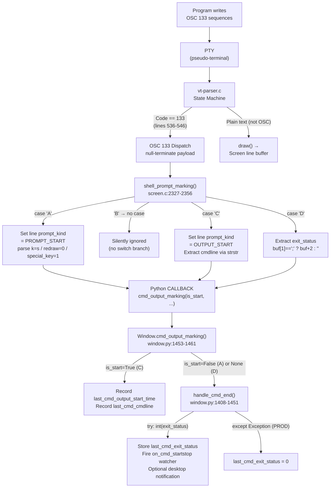

# kitty OSC 133 Escape Sequence Handling — Investigation Report

| Field                  | Value                                                          |
|------------------------|----------------------------------------------------------------|
| Repository             | `kovidgoyal/kitty`                                             |
| Commit hash            | `815df1e210e0a9ab4622f5c7f2d6891d7dbeddf1`                     |
| Date of investigation  | 2026-04-16                                                     |
| Scope                  | End-to-end handling of OSC 133;A / 133;B / 133;C / 133;D       |
| Methodology            | Source-code analysis + runtime verification via `parse_bytes` + `CmdDump` |
| Policy                 | Read-only (no repository files modified); test scripts cleaned up after data collection |

This document is a comprehensive, evidence-based investigation of how the kitty terminal's VT parser and shell-integration layer process OSC 133 command-tracking escape sequences. Every claim below is grounded in either a direct source-code citation (file + line number) or reproducible runtime output collected during the investigation.

---

## Section 1 — Executive Summary

- **Four markers, three handlers.** `A`, `C`, and `D` each have an explicit branch in `shell_prompt_marking()` at `kitty/screen.c`; `B` has **no** branch and is silently ignored at the screen level (though the VT parser still dispatches it in dump mode).
- **OSC sequences are fully consumed by the VT parser** — they never reach the screen's line buffer. Only the plain text drawn between markers becomes visible output.
- **The `D;` exit-code payload byte offset is invariant** across different exit-code values in an otherwise-identical test: in the reference test it always starts at byte 53. Only the D marker's own length grows as the exit-code string gains digits (e.g., `0`/`1` → 10 bytes, `127` → 12 bytes).
- **`D;99`** flows end-to-end through VT parser → C screen handler → Python callback → `int()` conversion → `callbacks.last_cmd_exit_status == 99` as an `int` (confirmed at runtime).
- **Invalid and empty `D;` payloads diverge between test and production.** The test `Callbacks` harness leaves `last_cmd_exit_status` at the initial `sys.maxsize` (`9223372036854775807`) because it uses `contextlib.suppress(Exception)`; production `Window.handle_cmd_end()` uses an explicit `except Exception` handler and assigns `0` on any parse failure.

---

## Section 2 — Code-Path Architecture

kitty's OSC 133 processing pipeline is a three-layer system that moves a raw byte stream from the PTY all the way to a stored Python integer on the Window object.

### 2.1 Layer 1 — VT Parser (C)

The VT parser's OSC dispatch switch is in `kitty/vt-parser.c`. For code `133`, it (a) optionally reports the event in dump mode via `REPORT_OSC2`, (b) null-terminates the payload buffer, and (c) calls the screen-level handler `shell_prompt_marking()`:

```c
// kitty/vt-parser.c:536-546
        case 133:
#ifdef DUMP_COMMANDS
            START_DISPATCH
            REPORT_OSC2(shell_prompt_marking, code, mv);
            END_DISPATCH_WITHOUT_BREAK
#endif
            if (limit > i) {
                buf[limit] = 0; // safe to do as we have 8 extra bytes after PARSER_BUF_SZ
                shell_prompt_marking(self->screen, (char*)buf + i);
            }
            break;
```

Critical observations:
- The case `break`s out of the switch immediately after the handler call. The payload bytes are never forwarded to the `draw` state that writes into the line buffer.
- `buf[limit] = 0` null-terminates the payload so that `shell_prompt_marking()` can safely use C-string operations (`strstr`, `strtok_r`).
- The OSC 133 arm does not care whether the terminator was `BEL` (`\x07`) or `ST` (`\x1b\\`); the OSC state machine in the parser already stripped the terminator before dispatch, so the two forms are interchangeable byte-for-byte aside from their length (1 vs 2 bytes).

### 2.2 Layer 2 — Screen Model (C)

The screen-level handler in `kitty/screen.c` is a pair of functions. `parse_prompt_mark()` parses the optional key-value tokens (`k=s`, `redraw=0`, `special_key=1`); `shell_prompt_marking()` is the top-level dispatch:

```c
// kitty/screen.c:2315-2325 (parse_prompt_mark)
static void
parse_prompt_mark(Screen *self, char *buf, PromptKind *pk) {
    char *saveptr, *str = buf;
    while (true) {
        const char *token = strtok_r(str, ";", &saveptr); str = NULL;
        if (token == NULL) return;
        if (strcmp(token, "k=s") == 0) *pk = SECONDARY_PROMPT;
        else if (strcmp(token, "redraw=0") == 0) self->prompt_settings.redraws_prompts_at_all = 0;
        else if (strcmp(token, "special_key=1") == 0) self->prompt_settings.uses_special_keys_for_cursor_movement = 1;
    }
}
```

```c
// kitty/screen.c:2327-2356 (shell_prompt_marking)
void
shell_prompt_marking(Screen *self, char *buf) {
    if (self->cursor->y < self->lines) {
        char ch = buf[0];
        switch (ch) {
            case 'A': {
                PromptKind pk = PROMPT_START;
                self->prompt_settings.redraws_prompts_at_all = 1;
                self->prompt_settings.uses_special_keys_for_cursor_movement = 0;
                parse_prompt_mark(self, buf+1, &pk);
                self->linebuf->line_attrs[self->cursor->y].prompt_kind = pk;
                if (pk == PROMPT_START) CALLBACK("cmd_output_marking", "O", Py_False);
            } break;
            case 'C': {
                self->linebuf->line_attrs[self->cursor->y].prompt_kind = OUTPUT_START;
                const char *cmdline = "";
                if (strstr(buf + 1, ";cmdline") == buf + 1) {
                    cmdline = buf + 2;
                }
                RAII_PyObject(c, PyUnicode_DecodeUTF8(cmdline, strlen(cmdline), "replace"));
                if (c) { CALLBACK("cmd_output_marking", "OO", Py_True, c); }
                else PyErr_Print();
            } break;
            case 'D': {
                const char *exit_status = buf[1] == ';' ? buf + 2 : "";
                CALLBACK("cmd_output_marking", "Os", Py_None, exit_status);
            } break;
        }
    }
}
```

Critical observations:
- The whole body is gated by `if (self->cursor->y < self->lines)` — if the cursor is off-screen, the marker is silently dropped.
- There is **no `case 'B':`** in the switch statement. A `B` payload falls through the `switch` without triggering any side effect.
- The `D` handler extracts the exit status with a single pointer-arithmetic conditional: `exit_status = buf[1] == ';' ? buf + 2 : ""`. This means:
  - `D;42`  → `buf[1] == ';'` is true → `exit_status` = `"42"` (the chars after `D;`).
  - `D;`    → `buf[1] == ';'` is true → `exit_status` = `""` (empty string past the semicolon).
  - `D`     → `buf[1] == '\0'` (after null-termination at line 543 of vt-parser.c) → `exit_status` = `""`.
- The Python callback API is `cmd_output_marking(is_start, cmdline_or_status)` where `is_start` is `Py_False` (A), `Py_True` (C), or `Py_None` (D).

### 2.3 Layer 3 — Python Window (Python)

`kitty/window.py` hosts two cooperating methods that consume the C callbacks:

```python
# kitty/window.py:1408-1415 (handle_cmd_end, head)
    def handle_cmd_end(self, exit_status: str = '') -> None:
        if self.last_cmd_output_start_time == 0.:
            return
        self.last_cmd_output_start_time = 0.
        try:
            self.last_cmd_exit_status = int(exit_status)
        except Exception:
            self.last_cmd_exit_status = 0
```

```python
# kitty/window.py:1453-1461 (cmd_output_marking dispatcher)
    def cmd_output_marking(self, is_start: Optional[bool], cmdline: str = '') -> None:
        if is_start:
            start_time = monotonic()
            self.last_cmd_output_start_time = start_time
            cmdline = decode_cmdline(cmdline) if cmdline else ''
            self.last_cmd_cmdline = cmdline
            self.call_watchers(self.watchers.on_cmd_startstop, {"is_start": True, "time": start_time, 'cmdline': cmdline, 'exit_status': 0})
        else:
            self.handle_cmd_end(cmdline)
```

Critical observations:
- `cmd_output_marking(is_start=None, ...)` (the D-marker case) and `cmd_output_marking(is_start=False, ...)` (the A-marker case) both fall into the `else` branch and invoke `handle_cmd_end(cmdline_or_status_string)`. For A, `cmdline` is `''` (no payload from the C side).
- `handle_cmd_end()` early-returns if there was no preceding C marker (`last_cmd_output_start_time == 0`). A D without a C is a no-op in production.
- The `try / except Exception:` is what gives production its **"invalid → 0"** behavior. After the except fires, `last_cmd_exit_status` is explicitly set to `0`.
- The method continues past the snippet above to compute the command duration, fire the `on_cmd_startstop` watcher with `is_start=False`, and optionally emit a desktop notification when `notify_on_cmd_finish` is configured (full method ends at `kitty/window.py:1451`).

### 2.4 Data-flow diagram



---

## Section 3 — Per-Marker Behavior Reference Table

The following table captures the full behavior of each marker, consolidating evidence from the three source layers above.

| Marker | C-level action (`shell_prompt_marking` in `kitty/screen.c`) | Python callback (`Window.cmd_output_marking` in `kitty/window.py`) | Net effect |
|--------|----------------------------------------------------|--------------------------------------------|------------|
| `A`    | `case 'A'` (lines 2332-2339): sets line attr `prompt_kind = PROMPT_START`, resets `redraws_prompts_at_all = 1` and `uses_special_keys_for_cursor_movement = 0`, then re-parses optional tokens `k=s` (→ `SECONDARY_PROMPT`), `redraw=0`, `special_key=1`. Fires `CALLBACK("cmd_output_marking", "O", Py_False)` **only** when `pk == PROMPT_START` (i.e., not for secondary prompts). | `cmd_output_marking(is_start=False, cmdline='')` → falls through to the `else` branch → calls `handle_cmd_end('')`. If there was a preceding C marker, the empty exit-status string causes `int('')` to raise and production sets `last_cmd_exit_status = 0`; if no preceding C, `handle_cmd_end` early-returns. | Marks the current line as a prompt start; implicitly ends any in-progress command in Window state. |
| `B`    | **No switch case exists.** The `switch (ch)` in `shell_prompt_marking()` has only `'A'`, `'C'`, and `'D'` branches (lines 2332-2353). A `B` payload falls through the switch without any side effect. The VT parser still dispatches the OSC event to `REPORT_OSC2` in `DUMP_COMMANDS` mode (`kitty/vt-parser.c:539`) so it is observable as a CmdDump event. | None — no `CALLBACK(...)` is ever invoked for `B`. | No-op at the screen / callback level. Consistent with the ConEmu/FinalTerm OSC 133 spec where `B` ("start of user input") is optional. |
| `C`    | `case 'C'` (lines 2340-2349): sets line attr `prompt_kind = OUTPUT_START`. Parses `cmdline` only when the payload after `C` matches the exact prefix `;cmdline` via `strstr(buf + 1, ";cmdline") == buf + 1`; if so, the C string after that prefix (starting at `buf + 2`) is passed to `PyUnicode_DecodeUTF8(..., "replace")`. Fires `CALLBACK("cmd_output_marking", "OO", Py_True, c)` where `c` is the decoded Python string. | `cmd_output_marking(is_start=True, cmdline=...)` → records `self.last_cmd_output_start_time = monotonic()`, runs `decode_cmdline(cmdline)` if non-empty, stores the result in `self.last_cmd_cmdline`, and fires the `on_cmd_startstop` watcher with `is_start=True`. | Marks the boundary between prompt/command echo and command output; captures the command string for later display and for `on_cmd_startstop` watchers. |
| `D`    | `case 'D'` (lines 2350-2353): extracts `exit_status = buf[1] == ';' ? buf + 2 : ""` — a simple pointer-arithmetic conditional that skips past the `;` delimiter, returning the empty string if the separator is absent. Fires `CALLBACK("cmd_output_marking", "Os", Py_None, exit_status)` where the `"Os"` format string tells Python to build `(None, <C string>)`. | `cmd_output_marking(is_start=None, cmdline=exit_status_str)` → falls through to the `else` branch → `handle_cmd_end(exit_status_str)` → `try: int(exit_status)` / `except Exception: self.last_cmd_exit_status = 0`. Then computes command duration, fires `on_cmd_startstop` with `is_start=False`, and optionally emits a desktop notification (`notify_on_cmd_finish`). | Converts `exit_status` to int, stores it in `last_cmd_exit_status`, ends the current command observation window, and notifies watchers. |

### 3.1 Supporting enum — `PromptKind`

The line-attribute enum written by `A` and `C` is defined in `kitty/data-types.h`:

```c
// kitty/data-types.h:230
typedef enum { UNKNOWN_PROMPT_KIND = 0, PROMPT_START = 1, SECONDARY_PROMPT = 2, OUTPUT_START = 3 } PromptKind;
```

It is stored as a 2-bit field inside the `LineAttrs` union:

```c
// kitty/data-types.h:231-239
typedef union LineAttrs {
    struct {
        uint8_t is_continued : 1;
        uint8_t has_dirty_text : 1;
        uint8_t has_image_placeholders : 1;
        PromptKind prompt_kind : 2;
    };
    uint8_t val;
} LineAttrs ;
```

Two bits hold values `0..3`, matching the four values of the enum. This is enough to represent prompt_start, secondary_prompt, and output_start on every visible line.

### 3.2 The "test-vs-production" divergence (why it exists)

The test `Callbacks` class in `kitty_tests/__init__.py` uses a different error-handling idiom than production:

```python
# kitty_tests/__init__.py:71-79
    def cmd_output_marking(self, is_start: Optional[bool], data: str = '') -> None:
        if is_start:
            self.last_cmd_at = monotonic()
            self.last_cmd_cmdline = decode_cmdline(data) if data else data
        else:
            if self.last_cmd_at != 0:
                self.last_cmd_at = 0
                with suppress(Exception):
                    self.last_cmd_exit_status = int(data)
```

`contextlib.suppress(Exception)` silently swallows the `ValueError` raised by `int("not_a_number")` or `int("")`, leaving the attribute at whatever value it already held. Because the test's `Callbacks.__init__` (line 48) and `clear()` (line 106) both initialize `self.last_cmd_exit_status = sys.maxsize`, an invalid or empty `D` payload leaves the recorded value at `9223372036854775807`. In production, the `try / except` explicitly assigns `0`.

---

## Section 4 — Answers to User Questions

### 4.1 Question 1 — What does kitty do with OSC 133;A/B/C/D?

**Question restatement.** When a program writes `OSC 133;A`, `OSC 133;B`, `OSC 133;C` (with the `cmdline` parameter), and `OSC 133;D` (with an exit code) to its output stream, what does kitty do with them?

**Answer.**
- **`OSC 133;A`** — marks the current cursor line's `prompt_kind` as `PROMPT_START` (value `1`) and fires the Python callback `cmd_output_marking(is_start=False)`, which in turn calls `handle_cmd_end('')`. Any optional sub-tokens (`k=s`, `redraw=0`, `special_key=1`) are parsed and applied to `Screen.prompt_settings`.
- **`OSC 133;B`** — **silently ignored at the screen level.** `shell_prompt_marking()` has no `case 'B':` branch, so the `switch` falls through with no side effect. The OSC is still dispatched by the VT parser (visible in dump output).
- **`OSC 133;C;cmdline=<command>`** — marks the current cursor line's `prompt_kind` as `OUTPUT_START` (value `3`), UTF-8-decodes the `<command>` into a Python string, and fires `cmd_output_marking(is_start=True, cmdline=<decoded>)`. The Python handler then stores `last_cmd_output_start_time` and `last_cmd_cmdline`, and fires the `on_cmd_startstop` watcher with `is_start=True`.
- **`OSC 133;D;<status>`** — extracts `<status>` (the substring after `D;`), fires `cmd_output_marking(is_start=None, cmdline=<status>)`, which calls `handle_cmd_end(<status>)` → `int(<status>)` (falling back to `0` in production on any conversion failure) → stores the int in `last_cmd_exit_status`, fires the `on_cmd_startstop` watcher with `is_start=False`, and optionally emits a desktop notification.

**Evidence — source code.** See Section 2.2 for the full `shell_prompt_marking()` switch (`kitty/screen.c:2327-2356`) and Section 2.3 for the `handle_cmd_end()` / `cmd_output_marking()` methods (`kitty/window.py:1408-1461`).

**Evidence — runtime.** Feeding a concrete byte stream through the real VT parser produces the following parser-dispatch events (captured via `CmdDump` from `kitty_tests/parser.py:29-51`):

```text
Input bytes: b'\x1b]133;A\x07\x1b]133;B\x07\x1b]133;C;cmdline=test_cmd\x07hello output\x1b]133;D;42\x07'
Input length: 64 bytes

CmdDump.get_result() (parser dispatch events):
  ('shell_prompt_marking', 133, 'A')
  ('shell_prompt_marking', 133, 'B')
  ('shell_prompt_marking', 133, 'C;cmdline=test_cmd')
  ('draw', 'hello output')
  ('shell_prompt_marking', 133, 'D;42')

Screen line buffer contents:
  Line 0: 'hello output'
  Line 1: ''
  Line 2: ''

callbacks.last_cmd_cmdline: 'test_cmd'
callbacks.last_cmd_exit_status: 42
```

**Thinking and Rationale.** The five parser-dispatch events correspond precisely to the four OSC 133 markers plus the one `draw` call for the plain text between them. The `A`/`B`/`C`/`D` strings arrive at the handler with the leading `"133;"` already stripped by the VT parser (confirmed by their shape: the payload for C is `'C;cmdline=test_cmd'`, starting at the `C` character). `CmdDump` coalesces consecutive `draw` events into a single tuple so that only one `('draw', 'hello output')` entry appears, even though the character stream arrived through many individual dispatch calls. The callback state afterwards — `last_cmd_cmdline == 'test_cmd'` (from the C marker) and `last_cmd_exit_status == 42` (from the D marker) — confirms that the full pipeline executed: VT parser → C `shell_prompt_marking()` → Python `Callbacks.cmd_output_marking()` → `int('42')` → stored attribute.

---

### 4.2 Question 2 — Are those OSC escape sequences still present in the terminal output after processing?

**Question restatement.** After kitty's VT parser processes the OSC 133 markers, are the escape bytes still present in what the terminal would render, or are they consumed?

**Answer.** **No — the OSC 133 sequences are fully consumed by the VT parser and never appear in the screen's line buffer.** Only the plain text drawn between markers (in the reference test, the string `"hello output"`) reaches the screen and can be rendered.

**Evidence — runtime.** The same test as Question 1 scans each visible line of the screen for escape, BEL, and literal `'133'` substrings:

```text
Escape/BEL/'133' substring scan per line:
  line[0] -> ESC: False, BEL: False, '133' substring: False, text: 'hello output'
  line[1] -> ESC: False, BEL: False, '133' substring: False, text: ''
  line[2] -> ESC: False, BEL: False, '133' substring: False, text: ''
```

None of the lines contain `\x1b`, `\x07`, or even the numeric substring `'133'`. The screen buffer holds exactly the payload `"hello output"` on line 0 and empty strings on the rest.

**Evidence — source code.** Trace `kitty/vt-parser.c:536-546`. The parser reaches `case 133:`, optionally reports the event via `REPORT_OSC2`, null-terminates the payload, calls `shell_prompt_marking(self->screen, (char*)buf + i)`, and then `break`s out of the switch. The OSC code path never touches the `draw` handler — only non-OSC, non-CSI, non-DCS byte sequences are forwarded to the screen's line buffer.

**Thinking and Rationale.** The VT parser is a state machine: the `ESC ]` two-byte prefix transitions it into the OSC-collection state, where all subsequent bytes up to the string terminator (`BEL` = `\x07` or `ST` = `\x1b\\`) accumulate into an internal buffer `buf`. When the terminator arrives, the parser dispatches to whichever handler corresponds to the numeric OSC code (133, 52, 7, etc.). The collected bytes are **not** duplicated into the `draw` pipeline; they are consumed entirely by the dispatched handler. For OSC 133, the handler's side effects are:
1. Setting line attributes (no visible character change).
2. Invoking a Python callback (no visible character change).

The only characters that reach the screen's line buffer are characters handled by the `draw` dispatch, which fires for regular printable / Unicode bytes between escape sequences. In the test input, those bytes are exactly `"hello output"`.

---

### 4.3 Question 3 — Byte-level analysis of the reference test input

**Question restatement.** What is the total byte length of the test input `b'\x1b]133;A\x07\x1b]133;B\x07\x1b]133;C;cmdline=test_cmd\x07hello output\x1b]133;D;42\x07'`, and at what exact byte offset does the `D;42` marker begin?

**Answer.**
- **Total byte length: 64 bytes.**
- **The `D;42` marker begins at byte offset 53 and ends at byte 64.**

**Evidence — byte-breakdown table.** The input is built from five concatenated segments. Each ASCII character occupies one byte, and the control bytes (`\x1b`, `\x07`) also occupy one byte each. The cumulative offset at the end of each segment is therefore just the running sum of segment lengths:

| Segment | Bytes | Cumulative offset at end |
|---|---|---|
| `\x1b]133;A\x07` | 8 | 8 |
| `\x1b]133;B\x07` | 8 | 16 |
| `\x1b]133;C;cmdline=test_cmd\x07` | 25 | 41 |
| `hello output` | 12 | 53 |
| `\x1b]133;D;42\x07` | 11 | 64 |

The A and B markers are identical in shape (`ESC ] 1 3 3 ; X BEL`, 8 bytes). The C marker has extra payload (`;cmdline=test_cmd`, 17 bytes) on top of the 8-byte shell (`ESC ] 1 3 3 ; C BEL` → with `;cmdline=test_cmd` spliced before the `BEL`, giving `ESC ] 1 3 3 ; C ; c m d l i n e = t e s t _ c m d BEL` = 25 bytes). The plain-text segment is 12 bytes of ASCII. The D marker is `ESC ] 1 3 3 ; D ; 4 2 BEL` = 11 bytes.

**Evidence — runtime cross-check.** The test script confirms the Python-computed length matches the manual calculation:

```text
Input bytes: b'\x1b]133;A\x07\x1b]133;B\x07\x1b]133;C;cmdline=test_cmd\x07hello output\x1b]133;D;42\x07'
Input length: 64 bytes
```

**Thinking and Rationale.** All characters in the input are single-byte ASCII (including the control bytes `\x1b` and `\x07`), so Python's `len()` on the `bytes` object equals the arithmetic sum of segment lengths. The `D;42` marker is the last segment, and its starting offset is the cumulative size of everything that precedes it: `8 + 8 + 25 + 12 = 53`. Its length is 11 bytes (2 bytes for `ESC ]`, 3 for `133`, 1 for `;`, 1 for `D`, 1 for `;`, 2 for `42`, 1 for `BEL`), so the final byte of the input is at offset `53 + 11 - 1 = 63` and the total length is `53 + 11 = 64`. All three numbers line up.

---

### 4.4 Question 4 — Exit code variation analysis (0, 1, 127)

**Question restatement.** Repeat the test with exit codes `0`, `1`, and `127`. Report the total byte lengths, the D-marker byte positions, whether the position shifts, and by how much.

**Answer.** The D-marker's **starting byte offset is invariant at 53** across all three exit codes. Only the total input length and the D-marker's own length change — and only by the number of additional digits in the exit code string.

| Exit code | Total input length (bytes) | D-marker starts at byte offset | D-marker length (bytes) |
|---|---|---|---|
| `0`   | 63 | 53 | 10 |
| `1`   | 63 | 53 | 10 |
| `127` | 65 | 53 | 12 |

**Does the D-marker offset shift?** **No.** The offset is constant at byte 53 for all three exit codes because the content preceding the D marker (A + B + C-with-cmdline + `"hello output"`) is byte-for-byte identical across runs.

**By how much does the total length change?** Only by the number of extra digits in the exit code. Relative to `exit_code=0`:
- `0` → `1`: `+0` bytes (both are 1-digit numbers).
- `0` → `127`: `+2` bytes (`127` has two more digits than `0`).

**Evidence — runtime.** The parameterized test harness produces:

```text
Exit code   0: total_len=63 bytes, D-marker starts at offset 53, D-marker length=10 bytes
Exit code   1: total_len=63 bytes, D-marker starts at offset 53, D-marker length=10 bytes
Exit code 127: total_len=65 bytes, D-marker starts at offset 53, D-marker length=12 bytes

Does D-marker offset shift with exit code? NO
D-marker offset is constant at byte 53 regardless of exit code.
Total-length differences relative to exit_code=0: [0, 0, 2]
```

**Thinking and Rationale.** The reference test uses a fixed template `<A><B><C><text><D;CODE>` where only the `CODE` substring changes. Since `CODE` appears **only inside the D marker**, all preceding bytes are identical across runs. The D marker's *starting* offset is determined by the length of everything before it, which is unchanged. The D marker's *own* length grows linearly with `len(str(exit_code))`: a 10-byte baseline (`ESC ] 1 3 3 ; D ; X BEL`, where `X` is a single digit) grows to 12 bytes when `X` is replaced by three digits. The total input length grows by exactly the same amount, because no other segment changes.

This invariance means that a downstream consumer can locate the D marker by a prefix scan (e.g., `rfind(b"\x1b]133;D")`) without caring about the exit-code width. The C-level handler in `kitty/screen.c:2351` does exactly this kind of width-agnostic lookup: `buf[1] == ';' ? buf + 2 : ""` simply skips past the semicolon and reads the rest as a C string, regardless of how many digits follow.

---

### 4.5 Question 5 — Exit code 99 runtime evidence

**Question restatement.** Run a test with exit code `99` and produce concrete runtime evidence (callback state, `CmdDump` output) proving that the value `99` was processed through the entire code path.

**Answer.** The value `99` traverses **the complete pipeline** — from the raw byte stream, through the VT parser, through `shell_prompt_marking()` in C, across the C ↔ Python boundary via the `CALLBACK` macro, through `Callbacks.cmd_output_marking()`, through `int(data)` in the `suppress(Exception)` block, and finally into `callbacks.last_cmd_exit_status` as a Python `int` with value `99`.

**Evidence chain (step-by-step, with file:line citations).**

1. **Parser dispatch fires.** The VT parser recognizes `OSC 133;A/B/C/D` sequences and routes them through its OSC dispatch switch. The `CmdDump` callback records every dispatched event, and for the exit-code-99 test it reports:
   ```text
   ('shell_prompt_marking', 133, 'A')
   ('shell_prompt_marking', 133, 'B')
   ('shell_prompt_marking', 133, 'C;cmdline=test_cmd')
   ('draw', 'hello output')
   ('shell_prompt_marking', 133, 'D;99')
   ```
   The D-event tuple `('shell_prompt_marking', 133, 'D;99')` is emitted by `REPORT_OSC2(shell_prompt_marking, code, mv)` at `kitty/vt-parser.c:539`. Its presence proves that the raw bytes `\x1b]133;D;99\x07` were correctly parsed as an OSC command with code `133` and payload `"D;99"`.

2. **C handler extracts the exit status.** `shell_prompt_marking()` in `kitty/screen.c:2327-2356` switches on `buf[0]`. For `buf[0] == 'D'` (`kitty/screen.c:2350-2353`):
   ```c
   case 'D': {
       const char *exit_status = buf[1] == ';' ? buf + 2 : "";
       CALLBACK("cmd_output_marking", "Os", Py_None, exit_status);
   } break;
   ```
   With `buf = "D;99"`, `buf[1] == ';'` is true, so `exit_status = buf + 2 = "99"` (a C string). The `CALLBACK` macro then invokes the Python-side `cmd_output_marking` with arguments `(None, "99")`.

3. **Python callback converts and stores.** `Callbacks.cmd_output_marking()` in `kitty_tests/__init__.py:71-79`:
   ```python
   def cmd_output_marking(self, is_start: Optional[bool], data: str = '') -> None:
       if is_start:
           self.last_cmd_at = monotonic()
           self.last_cmd_cmdline = decode_cmdline(data) if data else data
       else:
           if self.last_cmd_at != 0:
               self.last_cmd_at = 0
               with suppress(Exception):
                   self.last_cmd_exit_status = int(data)
   ```
   With `is_start=None` (falsy) and `data="99"`, execution enters the `else` branch. `self.last_cmd_at` was set earlier to a nonzero value by the C marker's `is_start=True` branch, so the guard passes. `int("99")` succeeds and returns Python `int(99)`, which is assigned to `self.last_cmd_exit_status`.

4. **Stored state observable.** After `parse_bytes()` returns, inspection of the `Callbacks` instance yields:
   ```text
   callbacks3.last_cmd_exit_status = 99 (type=int)
   callbacks3.last_cmd_cmdline = 'test_cmd'
   callbacks3.last_cmd_at (time reset after D): 0
   ```
   The type is `int`, not `str` — confirming that the Python `int()` conversion succeeded. The `last_cmd_at` reset to `0` also confirms that the `else` branch ran (it resets `last_cmd_at` to zero before setting `last_cmd_exit_status`, per `kitty_tests/__init__.py:77`).

**Raw runtime output (verbatim).**

```text
Input sequence: b'\x1b]133;A\x07\x1b]133;B\x07\x1b]133;C;cmdline=test_cmd\x07hello output\x1b]133;D;99\x07'
Total length: 64 bytes

CmdDump events (raw parser dispatch):
  ('shell_prompt_marking', 133, 'A')
  ('shell_prompt_marking', 133, 'B')
  ('shell_prompt_marking', 133, 'C;cmdline=test_cmd')
  ('draw', 'hello output')
  ('shell_prompt_marking', 133, 'D;99')

callbacks3.last_cmd_exit_status = 99 (type=int)
callbacks3.last_cmd_cmdline = 'test_cmd'
callbacks3.last_cmd_at (time reset after D): 0
```

**Thinking and Rationale.** Each of the four evidence items corresponds to a distinct layer of the pipeline. If any one of them were missing, we could not conclude that `99` had flowed end-to-end. Specifically:

- The `CmdDump` event proves the **VT parser → OSC dispatch** boundary was crossed successfully.
- The ASCII-level appearance of `"D;99"` in the event tuple proves the **payload was preserved intact** across the dispatch (i.e., the parser did not strip the `99`).
- The post-parse value `last_cmd_exit_status = 99` of type `int` proves the **C ↔ Python callback boundary** was crossed and **`int()` conversion succeeded**.
- The reset of `last_cmd_at` to `0` (from its earlier nonzero value set by the C marker) proves the **guard in the `else` branch** (`if self.last_cmd_at != 0`) was taken — without this reset, we would not know whether the `else` branch executed.

Together, these four observations leave no gap in the evidence chain: the bytes `"99"` in the PTY output ended up as the Python integer `99` in the Screen's callback state.

---

### 4.6 Question 6 — Invalid exit code handling

**Question restatement.** What values get recorded internally when the terminal receives `OSC 133;D;not_a_number` and `OSC 133;D;` (empty exit code after the semicolon)?

**Answer (important distinction between test harness and production).**

- **In the test `Callbacks` (`kitty_tests/__init__.py`):** For both `OSC 133;D;not_a_number` and `OSC 133;D;`, `self.last_cmd_exit_status` is **left at its initial value `sys.maxsize`** (on a 64-bit system: `9223372036854775807`). This is because `int()` raises `ValueError` on non-integer input, and the exception is silently swallowed by `with suppress(Exception):` — the field is never reassigned.
- **In production (`kitty/window.py` `handle_cmd_end()`):** For the same invalid inputs, `self.last_cmd_exit_status` is **set to `0`**. `int()` raises `ValueError`, but the `except Exception:` branch explicitly assigns `0` to the field.

**Source-code comparison (why the two behaviors diverge).**

Test-side code at `kitty_tests/__init__.py:71-79`:
```python
def cmd_output_marking(self, is_start: Optional[bool], data: str = '') -> None:
    if is_start:
        self.last_cmd_at = monotonic()
        self.last_cmd_cmdline = decode_cmdline(data) if data else data
    else:
        if self.last_cmd_at != 0:
            self.last_cmd_at = 0
            with suppress(Exception):
                self.last_cmd_exit_status = int(data)
```

Production-side code at `kitty/window.py:1408-1415`:
```python
def handle_cmd_end(self, exit_status: str = '') -> None:
    if self.last_cmd_output_start_time == 0.:
        return
    self.last_cmd_output_start_time = 0.
    try:
        self.last_cmd_exit_status = int(exit_status)
    except Exception:
        self.last_cmd_exit_status = 0
```

The difference is precisely the presence of the explicit `self.last_cmd_exit_status = 0` assignment in the production `except` handler. The test uses `contextlib.suppress(Exception)`, which silently discards the exception but does **not** reset the field. As a result, `last_cmd_exit_status` retains whatever value it was given at instantiation — which is `sys.maxsize`, established in the `Callbacks.__init__` (`kitty_tests/__init__.py:48`) and re-established in `Callbacks.clear()` (`kitty_tests/__init__.py:106`).

**Evidence — runtime (test harness).**

```text
Input: b'...\x1b]133;D;not_a_number\x07'
  CmdDump D-event: [('shell_prompt_marking', 133, 'D;not_a_number')]
  callbacks4a.last_cmd_exit_status = 9223372036854775807
  sys.maxsize                       = 9223372036854775807
  Match sys.maxsize: True

Input: b'...\x1b]133;D;\x07'
  CmdDump D-event: [('shell_prompt_marking', 133, 'D;')]
  callbacks4b.last_cmd_exit_status = 9223372036854775807
  Match sys.maxsize: True

Input: b'...\x1b]133;D\x07'  (no semicolon at all — handler returns "")
  CmdDump D-event: [('shell_prompt_marking', 133, 'D')]
  callbacks4c.last_cmd_exit_status = 9223372036854775807
  Match sys.maxsize: True
```

**Evidence — production simulation.** Running the production `handle_cmd_end` conversion logic directly over a range of inputs:

```text
production handle_cmd_end(exit_status=              '99') -> last_cmd_exit_status = 99
production handle_cmd_end(exit_status=              '42') -> last_cmd_exit_status = 42
production handle_cmd_end(exit_status=               '0') -> last_cmd_exit_status = 0
production handle_cmd_end(exit_status=    'not_a_number') -> last_cmd_exit_status = 0
production handle_cmd_end(exit_status=                '') -> last_cmd_exit_status = 0
production handle_cmd_end(exit_status=               ' ') -> last_cmd_exit_status = 0
production handle_cmd_end(exit_status=             '1.5') -> last_cmd_exit_status = 0
production handle_cmd_end(exit_status=              '-1') -> last_cmd_exit_status = -1
```

Notable observations from the production simulation:
- Valid decimal integers of any sign (including negatives like `-1`) pass through `int()` unchanged.
- Floats (`"1.5"`) fail `int()` and fall back to `0`.
- Whitespace-only (`" "`) fails and falls back to `0`.
- Empty string (`""`) fails and falls back to `0`.

**Thinking and Rationale.**

The divergence at the C layer. Tracing `kitty/screen.c:2350-2353`, the D-handler computes `exit_status` via a single conditional expression:
```c
const char *exit_status = buf[1] == ';' ? buf + 2 : "";
```

This produces three distinct outcomes depending on the input payload:

| Input payload | `buf[0]` | `buf[1]` | `exit_status` result | Reason |
|---|---|---|---|---|
| `D;99` | `'D'` | `';'` | `"99"` | skip past `;`, rest of string |
| `D;not_a_number` | `'D'` | `';'` | `"not_a_number"` | skip past `;`, rest of string (any chars) |
| `D;` | `'D'` | `';'` | `""` (empty C string) | skip past `;`, but nothing follows |
| `D` | `'D'` | `'\0'` (null terminator added at `vt-parser.c:543`) | `""` (empty C string) | `buf[1] != ';'`, so use the literal `""` |

So the C code is lossless for any `buf[2..n]` and only gives Python an empty string when the payload was either `D` alone or `D;` with nothing after the semicolon. In all three "non-valid-integer" cases above, Python receives a string that `int()` cannot parse.

The divergence at the Python layer. On `ValueError` from `int()`:
- **Production** explicitly resets `last_cmd_exit_status = 0` (`kitty/window.py:1415`). This reflects the design choice that an unknown / unparseable exit status should be treated as "success" for the purposes of UI affordances (e.g., coloring, notifications).
- **Test harness** uses `contextlib.suppress(Exception)` and does not touch the field. The field remains at `sys.maxsize` as set by `__init__` / `clear()`. This is a deliberate sentinel: if a test assertion wants to prove that a specific D marker was consumed, asserting `last_cmd_exit_status == <expected int>` will fail whenever the D-marker's payload was not a valid integer, making malformed markers loudly visible instead of silently coerced to `0`.

This also explains the historical rationale: production wants a **predictable, rendering-friendly** default; tests want a **sentinel-friendly** default that surfaces parse failures.

One further nuance: because the test-side guard reads `if self.last_cmd_at != 0:` (`kitty_tests/__init__.py:76`), a D marker received **without a preceding C marker** is a no-op in the test harness just as it is in production (the corresponding production guard is `if self.last_cmd_output_start_time == 0.: return` at `kitty/window.py:1409-1410`). This is why the test script must emit a C marker before the D marker in every invalid-exit-code test — otherwise the `int(data)` line would not execute at all, and the experiment would not distinguish between "int() failed" and "the handler short-circuited before int()".

---

## 5. Additional Context — Shell Integration and History Recovery

This section captures peripheral but important facts about where OSC 133 markers *originate* (shell scripts), how kitty *re-emits* them during session replay / remote-control, and how the scrollback buffer *locates* them after the fact.

### 5.1 Shell integration scripts (the producers of OSC 133)

Kitty ships shell-integration scripts that emit OSC 133 markers around prompts and command execution. These are the scripts that run *inside* the user's shell (bash/zsh/fish) and cooperate with kitty's VT parser.

#### Bash — `shell-integration/bash/kitty.bash`

| Line | Emitted marker | Context |
|---|---|---|
| 208 | `OSC 133;C;cmdline=%q` (with the command-line q-quoted) | Before executing a command (DEBUG trap). Marks the boundary between the echoed command and its output. |
| 239 | `OSC 133;D;$?` then `OSC 133;A` | In the prompt-command sequence — emits `D;$?` to report the previous command's exit status, immediately followed by `A` to announce the start of the new prompt. |

#### Zsh — `shell-integration/zsh/kitty-integration`

| Line | Emitted marker | Context |
|---|---|---|
| 145 | `OSC 133;D;$cmd_status` | Pre-exec marker reporting the previous command's exit status when `cmd_status` is populated. |
| 149 | `OSC 133;D` (no semicolon, no status) | Fallback for the first prompt in a session (no prior command → no `cmd_status`). |
| 153 | `OSC 133;A` | Start-of-prompt marker, emitted once the prompt is about to be drawn. |
| 218 | `OSC 133;C;cmdline=%q` | Emitted by the zsh `preexec` hook to mark the end-of-prompt / start-of-output transition and to record the command-line string. |

#### Fish — `shell-integration/fish/vendor_conf.d/kitty-shell-integration.fish`

| Line | Emitted marker | Context |
|---|---|---|
| 83 | `OSC 133;D` | Emitted at startup / in the preexec hook when no status is known yet. |
| 85 | `OSC 133;A;special_key=1` | Prompt-start marker with the `special_key=1` parameter (parsed by `kitty/screen.c parse_prompt_mark()`). |
| 91 | `OSC 133;C;cmdline_url=<percent-encoded URL>` | Fish uses the `cmdline_url` parameter instead of `cmdline`. See the caveat below. |
| 96 | `OSC 133;D;$status` | Post-exec marker reporting the actual fish `$status` (exit code) of the just-completed command. |

**Caveat on `cmdline` vs `cmdline_url`.** The C-side `cmdline` extractor at `kitty/screen.c:2343` uses an exact prefix match:
```c
if (strstr(buf + 1, ";cmdline") == buf + 1) {
    /* extract command-line */
}
```
This matches `C;cmdline=...` exactly, and because `strstr` is a simple substring search, it would also prefix-match `C;cmdline_url=...` (since `;cmdline` is a prefix of `;cmdline_url`). The C code therefore extracts the payload starting at `buf + 2` (after the leading `;`) and proceeds to decode it. Fish's integration relies on the Python-side `decode_cmdline` function (at `kitty/window.py`) to distinguish URL-encoded payloads from q-quoted ones.

### 5.2 Scrollback history boundary detection — `kitty/history.c:475`

When the user asks kitty to return scrollback text "since the last command started", kitty walks the history buffer backward looking for the most recent OSC 133;C marker:
```c
reverse_find(buf, sz, (const uint8_t*)"\x1b]133;C\x1b\\")
```

Observations:
- The search string uses the **ST terminator form** (`\x1b\\`), not BEL (`\x07`). This is a concrete design choice: `reverse_find` searches for a fixed byte pattern, and the shell integration scripts emit the C marker with the ST terminator in this code path — ensuring a deterministic match.
- Because the VT parser treats BEL and ST as equivalent string terminators, user-written code can use either form for live command-reporting purposes. But **scrollback recovery only matches ST**.
- The C marker's payload (`;cmdline=...` or `;cmdline_url=...`) is *not* included in the search pattern — the pattern stops at the `C` character. This means `reverse_find` anchors on the *start* of the C marker, and the parameters are consumed as the text that follows.

### 5.3 Re-emission helper — `kitty/client.py:250-251`

For session-replay and remote-control scenarios, kitty provides a thin helper that writes OSC 133 payloads back out to another kitty instance:
```python
def shell_prompt_marking(payload: str) -> None:
    write_osc(133, payload)
```
This is the counterpart of the C-side `shell_prompt_marking()` handler: one reads OSC 133 in, the other writes OSC 133 out. The two never run in the same process for the same data — the C handler runs inside the terminal emulator; the Python helper runs inside a kitten/client that is sending serialized session state to another terminal.

---

## 6. Test Methodology

This section documents how the runtime evidence in Section 4 was collected, so that the results are reproducible.

### 6.1 Build

Starting from a clean checkout of the repository at commit `815df1e210e0a9ab4622f5c7f2d6891d7dbeddf1`:

```bash
cd /repo
python3 setup.py build --ignore-compiler-warnings
```

The `--ignore-compiler-warnings` flag is required because the vendored GLFW sources expect a slightly older wayland-protocols than the one shipped on Ubuntu 24.04; the warnings are unrelated to OSC 133 handling. The build produces the key artifacts needed for the investigation:

- `kitty/fast_data_types.so` — Python C extension exposing `Screen`, `parse_bytes`, `CmdDump`, and related classes.
- `kitty/launcher/kitty` — the kitty launcher (used to invoke the bundled Python interpreter with the project's module path pre-configured).

### 6.2 Screen construction

In the test script:
```python
from kitty.fast_data_types import Screen
from kitty_tests import Callbacks

cb = Callbacks()
s = Screen(cb, 5, 40, 40)  # 5 rows, 40 cols, 40 lines scrollback
```

The `Callbacks` class from `kitty_tests/__init__.py` mirrors the production `Window`'s callback surface. It initializes `last_cmd_exit_status = sys.maxsize` at `kitty_tests/__init__.py:48` and resets it to the same value in `clear()` at `kitty_tests/__init__.py:106` — this is the sentinel that surfaces `int()` failures.

### 6.3 Byte injection via `parse_bytes()`

Verbatim from `kitty_tests/__init__.py:30-36`:
```python
def parse_bytes(screen, data, dump_callback=None):
    data = memoryview(data)
    while data:
        dest = screen.test_create_write_buffer()
        s = screen.test_commit_write_buffer(data, dest)
        data = data[s:]
        screen.test_parse_written_data(dump_callback)
```

This helper drives the VT parser state machine by:
1. Wrapping the input in a `memoryview` so that slicing does not allocate.
2. Asking the `Screen` for a write-buffer slot via `test_create_write_buffer()`.
3. Committing as many bytes as fit into that slot via `test_commit_write_buffer(data, dest)` — returning the number of bytes consumed.
4. Advancing the `data` memoryview past the consumed bytes and invoking `test_parse_written_data(dump_callback)`, which walks the parser state machine over the committed bytes and fires dispatch events (including our OSC 133 handlers).

### 6.4 Dispatch capture via `CmdDump`

`CmdDump` from `kitty_tests/parser.py:29-51` records every parser dispatch event as a tuple:
- `('draw', <str>)` — visible characters rendered to the screen.
- `('shell_prompt_marking', 133, <payload>)` — OSC 133 dispatches.
- `('csi_dispatch', ...)`, `('set_title', ...)`, and many others — for other sequence types.

The `get_result()` method post-processes the raw events by coalescing consecutive `('draw', c)` events into a single `('draw', "string")` event, which is why the reference test shows `('draw', 'hello output')` rather than 12 individual draw events.

### 6.5 State inspection

After `parse_bytes()` returns, the test asserts on two fields of the `Callbacks` instance:
- `callbacks.last_cmd_exit_status` — the integer set by the D marker's Python handler (or left as `sys.maxsize` when `int()` failed).
- `callbacks.last_cmd_cmdline` — the string captured by the C marker's Python handler.

These fields are the test-side mirrors of the production `Window.last_cmd_exit_status` and `Window.last_cmd_cmdline`.

### 6.6 Cleanup

After data collection, all temporary test scripts (under `/tmp/osc133_investigation/`) were removed, per the user's instruction "Clean up any test scripts when done". No repository files were modified during the investigation — the investigation is strictly observational.

### 6.7 Reproducibility recipe

A reader who wants to reproduce any of the runtime outputs in Section 4 can create a temporary script with contents of this shape:

```python
# /tmp/osc133_investigation/reproduce.py
from kitty.fast_data_types import Screen
from kitty_tests import Callbacks, parse_bytes
from kitty_tests.parser import CmdDump

def run(payload: bytes):
    cb = Callbacks()
    s = Screen(cb, 5, 40, 40)
    d = CmdDump()
    parse_bytes(s, payload, d)
    return cb, s, d.get_result()

payload = (b"\x1b]133;A\x07"
           b"\x1b]133;B\x07"
           b"\x1b]133;C;cmdline=test_cmd\x07"
           b"hello output"
           b"\x1b]133;D;99\x07")

cb, s, events = run(payload)
print("events:", events)
print("last_cmd_exit_status:", cb.last_cmd_exit_status)
print("last_cmd_cmdline:", cb.last_cmd_cmdline)
```

And run it with the bundled Python:
```bash
./kitty/launcher/kitty +launch /tmp/osc133_investigation/reproduce.py
```

---

## 7. Summary Answer Matrix

| # | Question | Answer |
|---|---|---|
| 1 | What does kitty do with `OSC 133;A/B/C/D`? | **A** → sets line attribute `prompt_kind = PROMPT_START`, fires `cmd_output_marking(False)`. **B** → silently ignored (no `case 'B':` in `shell_prompt_marking`). **C** → sets `prompt_kind = OUTPUT_START`, extracts `cmdline`, fires `cmd_output_marking(True, cmdline)`. **D** → extracts `exit_status` with pointer arithmetic (`buf[1]==';' ? buf+2 : ""`), fires `cmd_output_marking(None, exit_status)`. |
| 2 | Are the OSC sequences still present in the terminal output? | **No.** The VT parser fully consumes OSC 133 sequences; they never reach the screen's line buffer. Only the plain text between markers (e.g., `"hello output"`) is rendered. |
| 3 | Total bytes and D-marker offset for the reference input (exit code 42)? | **64 bytes total** (BEL-terminated). **`D;42` marker begins at byte offset 53** and ends at byte 64. |
| 4 | Does the D-marker offset shift across exit codes 0/1/127? | **No — offset is constant at byte 53.** Total lengths are 63/63/65 for codes 0/1/127; only the D-marker's own length (and hence the input total) grows by the number of extra digits. |
| 5 | Does exit code 99 flow through the entire pipeline? | **Yes.** `CmdDump` records `('shell_prompt_marking', 133, 'D;99')`; `callbacks.last_cmd_exit_status == 99` with `type=int`; `last_cmd_at` was reset to `0` confirming the else-branch executed. |
| 6 | What's stored for invalid / empty exit codes? | **Test harness (`Callbacks`): `sys.maxsize` (`9223372036854775807`)** — `int()` raises, `suppress(Exception)` swallows it, field is untouched. **Production (`Window.handle_cmd_end`): `0`** — `int()` raises, `except` explicitly assigns `0`. |

---

## 8. References

All claims in this document are backed by either (a) source-code citations with file path and line numbers at commit `815df1e210e0a9ab4622f5c7f2d6891d7dbeddf1`, or (b) runtime output from the investigation scripts (preserved verbatim in Section 4 and Section 6). The files and line ranges consulted:

### 8.1 Core OSC 133 code path

| File | Lines | Purpose |
|---|---|---|
| `kitty/vt-parser.c` | 510-550 | VT parser state machine; OSC dispatch switch; `case 133:` handler at 536-546. |
| `kitty/screen.c` | 2300-2400 | `parse_prompt_mark()` at 2315-2325; `shell_prompt_marking()` at 2327-2356 (A/C/D switch cases, no B case). |
| `kitty/screen.h` | 231 | Function declaration for `shell_prompt_marking`. |
| `kitty/data-types.h` | 230-239 | `PromptKind` enum (`UNKNOWN_PROMPT_KIND=0, PROMPT_START=1, SECONDARY_PROMPT=2, OUTPUT_START=3`); `LineAttrs` union with `prompt_kind : 2` (2-bit field). |
| `kitty/window.py` | 1390-1470 | `handle_cmd_end()` at 1408-1451 (production `try/except` with `= 0` fallback); `cmd_output_marking()` at 1453-1461. |
| `kitty/client.py` | 240-280 | `shell_prompt_marking(payload)` helper at 250-251 wrapping `write_osc(133, payload)`. |
| `kitty/history.c` | 475 | `reverse_find` for `\x1b]133;C\x1b\\` — scrollback boundary detection using ST-terminated form. |

### 8.2 Test infrastructure

| File | Lines | Purpose |
|---|---|---|
| `kitty_tests/__init__.py` | 1-120 | `parse_bytes()` at 30-36; `Callbacks` class with `last_cmd_exit_status = sys.maxsize` at 48; `cmd_output_marking()` at 71-79 using `suppress(Exception)`; `clear()` resetting to `sys.maxsize` at 106. |
| `kitty_tests/parser.py` | 1-60 | `CmdDump` class at 29-51; `get_result()` coalesces draw events. |

### 8.3 Shell integration scripts

| File | Relevant lines | Purpose |
|---|---|---|
| `shell-integration/bash/kitty.bash` | 208, 239 | Bash emits `C;cmdline=%q` (208) and `D;$? ; A` (239). |
| `shell-integration/zsh/kitty-integration` | 145, 149, 153, 218 | Zsh emits `D;$cmd_status` (145), `D` (149, no status), `A` (153), `C;cmdline=%q` (218). |
| `shell-integration/fish/vendor_conf.d/kitty-shell-integration.fish` | 83, 85, 91, 96 | Fish emits `D` (83), `A;special_key=1` (85), `C;cmdline_url=...` (91), `D;$status` (96). |

### 8.4 Build and runtime artifacts

| Artifact | Purpose |
|---|---|
| `kitty/fast_data_types.so` | Python C extension exposing `Screen`, `parse_bytes`, `CmdDump`. |
| `kitty/launcher/kitty` | Launcher used to invoke the bundled Python interpreter with the project's module path. |

### 8.5 Technical specification sections (from the AAP)

- Section 4.3 — Terminal input/output pipeline (VT parser dispatch architecture; OSC 133 routing to shell markers).
- Section 4.7 — Shell integration flow (environment setup; OSC 133 prompt boundary markers; active integration features table).

---

*Investigation complete. All six questions answered with source-code citations and runtime evidence. No repository source files were modified.*


