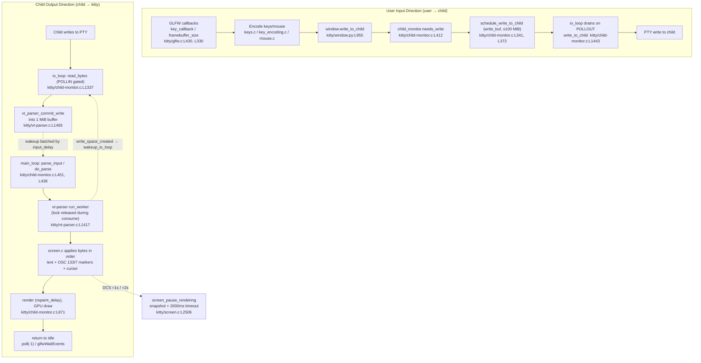

# How Kitty's Terminal-Interaction Pipeline Behaves at Runtime

> An onboarding deep-dive into the input/output pipeline of the **Kitty** terminal emulator — from the instant a surge of mixed input arrives until the user interface settles again.
>
> **Source under analysis:** Kitty at HEAD `815df1e210e0a9ab4622f5c7f2d6891d7dbeddf1`.
> **Citations:** Every behavioral claim below is anchored to a real file and locator, written inline as `[<repo-relative-path>:<locator>]` (e.g. `[kitty/child-monitor.c:L1481]`). Locators are a line `L<n>`, a range `L<a>-L<b>`, or a function name. All line numbers were re-confirmed against the source at the HEAD above. **The code is the single source of truth**; nothing here is asserted without a citation.

---

## How to read this document

This document is organized as a **logical flow**, not as a chronological timeline. It front-loads a mental model so that the subtler mechanisms (ordering guarantees, pause/resume, backpressure) land on a foundation you already hold:

- **(a) Orientation & two data directions** — the mental model.
- **(b) Entry points** — where input/output first enters the system *(answers Q1)*.
- **(c) The conductor** — three threads + event priority *(answers Q3)*.
- **(d) Single-stream ordering / no drift** — how markers and text stay aligned *(answers Q4)*.
- **(e) Pause/Resume** — synchronized output / DECSET 2026 *(answers Q2)*.
- **(f) Backpressure & unstable remote** — flow control and SSH *(answers Q5)*.
- **(g) End-to-end rhythm** — the full cadence from surge to settle *(answers Q6)*.
- **(h) Per-question rationale appendix** — each of the six questions restated and answered with an emphasis on *why*.

### The six onboarding questions (reproduced verbatim)

This document answers each of the following questions completely:

1. "When the terminal sends a surge of raw input (keystrokes, paste bursts, resize signals arriving at once), how does that stream become something the application can react to, and where does it first enter the system?"
2. "Especially when a session is being paused then resumed — how is the stream handled?"
3. "There seems to be an 'unseen conductor' managing timing, ordering, state handoffs — how are those responsibilities split up, and what decides which event gets handled first?"
4. "When shell integration hints arrive mixed in with ordinary text, how does the system keep screen state, command context, and input meaning aligned without drifting out of sync?"
5. "Does behavior differ under heavy backpressure or an unstable remote connection?"
6. "What really happens from the moment mixed input arrives to the moment the interface settles again, and how do the moving parts keep rhythm?"

### Terminology (defined on first use)

- **PTY (pseudoterminal):** a kernel-provided bidirectional character device pair (a *master* held by Kitty and a *slave* that the child shell/program sees as its controlling terminal). Created by `openpty()` `[kitty/child.py:L170-L171]`.
- **VT parser:** the state machine that turns a raw byte stream from the child into structured terminal operations (text, cursor moves, control sequences). Implemented in `kitty/vt-parser.c`.
- **OSC (Operating System Command):** an escape sequence of the form `ESC ] <code> ; <payload> ST` used for out-of-band hints. Kitty uses **OSC 133** for shell-integration prompt marks and **OSC 7** for the current-working-directory hint.
- **DCS (Device Control String):** an escape sequence of the form `ESC P <payload> ST`. Kitty uses a DCS to toggle synchronized output (see below).
- **DECSET 2026 / synchronized output:** the published terminal protocol for *atomic* screen updates — the application asks the terminal to stop showing intermediate frames until a full update is complete, so the user never sees a half-drawn screen. Kitty implements this internally as "pending mode."
- **Backpressure / bounded-buffer flow control:** the classic producer/consumer technique in which a bounded buffer plus a signaling/blocking mechanism prevents a fast producer from overwhelming a slow consumer.
- **eventfd / signalfd:** Linux file descriptors used, respectively, to wake a blocked `poll()` loop from another thread `[kitty/loop-utils.c:L70]` and to receive Unix signals synchronously as readable data `[kitty/loop-utils.c:L42]`.

---

## (a) Orientation & two data directions

The user's framing — "a surge of raw input … keystrokes, paste bursts, resize signals" — conflates **two opposite data directions** that Kitty handles through entirely different machinery. Disambiguating them is the single most important step toward understanding the pipeline:

- **(a) user → child (input).** Keystrokes, pasted text, and resize events originate in the windowing system, arrive on Kitty's **main thread** via GLFW callbacks `[kitty/glfw.c:L430]`, are **encoded** into terminal byte sequences, and are **written to the child's PTY**. This is the direction in which *you* drive the program running in the terminal.
- **(b) child → kitty (output).** Bytes produced by the shell or program — *including shell-integration hints mixed in with ordinary text* — arrive on Kitty's dedicated **I/O thread**, which reads them off the child PTY `[kitty/child-monitor.c:L1337]` and commits them into a **VT parser** buffer `[kitty/vt-parser.c:L1465]`. The parser later runs on the main thread and applies the bytes to **screen state** `[kitty/screen.c]`.

> **Critical clarification for Question 4:** the "shell integration hints mixed in with ordinary text" thread concerns **direction (b)** specifically — the child→terminal output stream parsed by `kitty/vt-parser.c` and applied to `kitty/screen.c`. Shell-integration markers are *not* user input; they are bytes the shell emits into its own output stream.

Layered on top of these two directions is **one "conductor"**: the **Child Monitor**, a small set of threads (plus the GLFW main loop) that decides *what is handled first*, *when*, and *how state is handed off* between the reader, the parser, and the renderer. Kitty's architecture mirrors this split in its choice of languages: latency-critical work lives in C (`child-monitor.c`, `vt-parser.c`, `screen.c`), while orchestration lives in Python (`boss.py`, `window.py`, `child.py`).

**Why two directions and one conductor?** Reading from a child must never be blocked by drawing a frame, and drawing a frame must never be blocked by a slow or floody child. By separating *who reads* (the I/O thread) from *who parses and renders* (the main thread), and by routing every cross-thread handoff through a single, prioritized event loop, Kitty converts a chaotic, bursty input surge into a small number of coherent, ordered screen updates. The remainder of this document traces that machinery.

The end-to-end runtime flow looks like this:



---

## (b) Entry points — where the stream first enters the system *(Question 1)*

Because there are two directions, there are two distinct entry points. The user's phrase "a surge of raw input" spans both, so we trace each in turn.

### (b.1) Output direction: child → kitty (the "shell-integration hints mixed with ordinary text" stream)

This is the stream the parser turns into screen state. Its journey starts on the **I/O thread**.

1. **The I/O thread polls and reads.** The Child Monitor's I/O thread runs `io_loop` `[kitty/child-monitor.c:L1481]`, which calls `poll()` on every child's PTY file descriptor. When a child fd is readable, the loop invokes `read_bytes` `[kitty/child-monitor.c:L1337]`, which pulls bytes off the child PTY.
2. **Bytes are written into a parser-owned buffer.** Before reading, `read_bytes` obtains a destination region from the parser via `vt_parser_create_write_buffer` `[kitty/child-monitor.c:L1341, kitty/vt-parser.c:L1451]`, reads directly into it, and then **commits** the bytes with `vt_parser_commit_write` `[kitty/child-monitor.c:L1354, kitty/vt-parser.c:L1465]`. The commit stamps the arrival time on the first pending byte — `if (self->new_input_at == 0) self->new_input_at = monotonic();` `[kitty/vt-parser.c:L1469]` (the field is declared at `[kitty/vt-parser.c:L205]`). That timestamp is what later drives wakeup batching (see §c and §g).
3. **Parsing happens later, on the main thread.** Crucially, `read_bytes` does **not** parse. It only fills the buffer. The actual parse — turning bytes into screen operations — runs on the **main thread** via `parse_input`/`do_parse` `[kitty/child-monitor.c:L451, L438]`. This decoupling is the reason the I/O thread is *never* blocked by rendering, and it is the foundation of the whole rhythm (see §g).

So, for direction (b), the stream "first enters the system" at `read_bytes` on the I/O thread `[kitty/child-monitor.c:L1337]`, and it "becomes something the application can react to" when the main-thread parser consumes the committed buffer and applies it to `screen.c`.

### (b.2) Input direction: user → child (keystrokes, paste, resize)

This is the stream the user generates. Its journey starts on the **main thread**, inside GLFW callbacks.

**Keystrokes.**
- A key event arrives at `key_callback` `[kitty/glfw.c:L430]`. The callback schedules a render tick via `request_tick_callback` `[kitty/glfw.c:L115]`, which calls `glfwPostEmptyEvent()` `[kitty/glfw.c:L116]` to ensure the main loop wakes and processes the event.
- The key is **encoded** into a terminal byte sequence — under either the **legacy** scheme or the **Kitty Keyboard Protocol** — by `encode_glfw_key_event`, which consults `screen_current_key_encoding_flags(screen)` (the protocol flags) and `mDECCKM` (legacy cursor-key mode) `[kitty/keys.c:L251, L282]`. The Python-facing entry point is `pyencode_key_for_tty` `[kitty/keys.c:L311]`. Mouse events have an analogous encoder in `kitty/mouse.c`.

**The encoded bytes are queued for the child.**
- Encoded bytes are handed to `Window.write_to_child` `[kitty/window.py:L955]`, which calls `get_boss().child_monitor.needs_write(self.id, data)` `[kitty/window.py:L959]`. *(Note: `write_to_child` does not call `schedule_write_to_child` directly — it goes through `needs_write`.)*
- On the C side, the `needs_write` method `[kitty/child-monitor.c:L412]` calls `schedule_write_to_child(id, 1, buf.buf, (size_t)buf.len)` `[kitty/child-monitor.c:L417]`, whose body is the `schedule_write_to_child_generic` macro `[kitty/child-monitor.c:L323, L372]`. This appends the bytes to the child's outbound `write_buf`.
- The queued data is later flushed to the PTY by `write_to_child` `[kitty/child-monitor.c:L1443]` when the I/O thread sees the fd is writable (`POLLOUT`). See §f for the write-side flow control.

**Paste bursts.**
- A paste does not go straight to the child. It runs through a sanitization pipeline: `paste_with_actions` `[kitty/window.py:L1643]` → `paste_text` `[kitty/window.py:L1713]` (and the user-facing `paste` `[kitty/window.py:L1780]`). This is where **bracketed-paste** wrapping and control-character filtering happen, which is *why* a large paste burst is safe: potentially dangerous bytes are neutralized and the program is told (via bracketed-paste markers) that what follows is pasted data, not typed commands.

**Resize signals.**
- A framebuffer/window resize arrives at `framebuffer_size_callback` `[kitty/glfw.c:L330]` (registered via `glfwSetFramebufferSizeCallback(...)` `[kitty/glfw.c:L1285]`).
- Resizes are routed by the orchestrator `Boss.on_window_resize` `[kitty/boss.py:L1206]`. The per-window layout path ultimately calls into the C resize entry point: `boss.child_monitor.resize_pty(self.id, *current_pty_size)` `[kitty/window.py:L863]`. *(Line 863 is the **call site** to the native `resize_pty`; there is no `def resize_pty` in `window.py`. The native side issues `SIGWINCH` to the child; the nearby `[kitty/window.py:L873]` is only a debug print mentioning SIGWINCH.)* Telling the child its new dimensions via `SIGWINCH` is what lets full-screen programs (editors, pagers) redraw to the correct size.

**PTY lifecycle (the substrate both directions ride on).**
- The pseudoterminal is created by `openpty()` `[kitty/child.py:L170]`, which wraps `os.openpty()` `[kitty/child.py:L171]` (master and slave are placed in blocking mode). UTF-8 mode is enabled on the master with `set_iutf8_fd(master, True)` `[kitty/child.py:L174]`.
- The child process is represented by `class Child` `[kitty/child.py:L197]` and spawned by `fork()` `[kitty/child.py:L276]`, which obtains the pty pair via `master, slave = openpty()` `[kitty/child.py:L281]`. Native fork/exec helpers live in `kitty/child.c`.

**Why this layout?** Input is comparatively low-volume and latency-sensitive, so it is handled inline on the main thread where the encoders, paste sanitizer, and resize routing already live; the only cross-thread step is appending to `write_buf` for the I/O thread to flush. Output is potentially high-volume and bursty, so it is handled on a dedicated I/O thread that does nothing but read and buffer, deferring the expensive parse/render to the main thread. The two entry points are deliberately asymmetric because the two directions have opposite performance characteristics.


---

## (c) The conductor — three threads + event priority *(Question 3)*

The "unseen conductor" is the **Child Monitor** together with the **GLFW main loop**. Its responsibilities — timing, ordering, and state handoffs — are split across **three threads** plus the main thread's event loop.

### (c.1) The three threads (plus the GLFW loop)

- **`io_loop` — the I/O thread** `[kitty/child-monitor.c:L1481]`. Owns all reading from and writing to child PTYs. It is the only thread that touches child file descriptors for data transfer.
- **`talk_loop` — the peer / remote-control thread** `[kitty/child-monitor.c:L1805]`. Services the control socket (remote control, `kitten @` commands, single-instance peer connections), so that remote-control traffic never contends with child I/O or rendering.
- **`main_loop` — the main thread** `[kitty/child-monitor.c:L1259]`. Installs a 1000 ms periodic state-check timer (`add_main_loop_timer(1000, true, ...)` `[kitty/child-monitor.c:L1261]`) and then delegates to GLFW's loop via `run_main_loop(process_global_state, self)` `[kitty/child-monitor.c:L1262]`. The GLFW loop itself is `run_main_loop` `[kitty/glfw.c:L2102]`. This is the thread that parses input, applies it to screen state, and renders.

**Lifecycle / who starts the conductor.** The orchestrator `Boss` constructs the monitor — `self.child_monitor = ChildMonitor(...)` `[kitty/boss.py:L370]` — and starts its threads with `child_monitor.start()` `[kitty/boss.py:L1183]`. Children are registered via `add_child` `[kitty/boss.py:L585]`. User actions are dispatched through `dispatch_action` `[kitty/boss.py:L1572]`. Peer / remote-control messages arrive via `peer_message_received` `[kitty/boss.py:L776]` and are injected into the monitor with `child_monitor.inject_peer(lfd)` `[kitty/boss.py:L2397]`.

### (c.2) What decides which event gets handled first — the I/O thread's fixed priority

Within each iteration of `io_loop`, events are serviced in a **fixed priority order**. This ordering is the literal answer to "what decides which event gets handled first" on the read/write side:

1. **Decide what to even watch for.** For each child, `POLLIN` is requested **only if** the parser has room: `children_fds[EXTRA_FDS + i].events = vt_parser_has_space_for_input(screen->vt_parser) ? POLLIN : 0;` `[kitty/child-monitor.c:L1501]`. `POLLOUT` is requested **only if** there is pending outbound data: `... |= (screen->write_buf_used ? POLLOUT : 0);` `[kitty/child-monitor.c:L1503]`. (The `POLLIN` gate is the heart of backpressure — see §f.)
2. **Block efficiently when idle.** When there are no pending wakeups, `poll()` is called with a timeout of `-1` so the thread sleeps indefinitely until something happens `[kitty/child-monitor.c:L1512]`; when wakeups are pending it uses an `input_delay`-bounded timeout instead.
3. **Wakeup pipe drained *first*.** `if (children_fds[0].revents && POLLIN) drain_fd(children_fds[0].fd);` `[kitty/child-monitor.c:L1515]`. Draining the self-wakeup channel first ensures cross-thread "please wake up" notifications are consumed before any real work.
4. **Signals next** via `read_signals(...)` `[kitty/child-monitor.c:L1519]` (checked at `[kitty/child-monitor.c:L1516]`). This handles child death, config reload, and kill — control-plane events that should be observed before processing more data.
5. **Per-child reads** — `POLLIN | POLLHUP` → `read_bytes` `[kitty/child-monitor.c:L1531]`.
6. **Per-child writes** — `POLLOUT` → `write_to_child` `[kitty/child-monitor.c:L1540]`.
7. **Invalid fds** — `POLLNVAL` handling `[kitty/child-monitor.c:L1542]`.

On the **main thread**, the per-tick callback `process_global_state` `[kitty/child-monitor.c:L1224]` enforces its own ordering: it resets `maximum_wait = -1` `[kitty/child-monitor.c:L1227]`, processes any pending **resizes** first (`process_pending_resizes` when `has_pending_resizes`) `[kitty/child-monitor.c:L1231-L1233]`, then **parses** input with `parse_input(self)` `[kitty/child-monitor.c:L1236]`, then **renders** with `render(now, input_read)` `[kitty/child-monitor.c:L1237]`. So the main-thread order is **resize → parse → render**: geometry is corrected before bytes are interpreted, and bytes are interpreted before a frame is drawn.

### (c.3) State handoff substrate — eventfd and signalfd

Cross-thread handoffs do not use locks-as-signals; they use file descriptors that a `poll()` loop can wait on:

- **Waking a loop.** `wakeup_loop` `[kitty/loop-utils.c:L113]` writes to an **eventfd** (created with `eventfd(0, EFD_CLOEXEC | EFD_NONBLOCK)` `[kitty/loop-utils.c:L70]`) under `#ifdef HAS_EVENT_FD`, with a **self-pipe** fallback (`write(ld->wakeup_fds[1], "w", 1)`) on platforms without eventfd; the write is retried on `EINTR`. The I/O thread is woken by `wakeup_io_loop` `[kitty/child-monitor.c:L225]`; the main thread is woken by `wakeup_main_loop` `[kitty/glfw.c:L1807]`, which posts an empty event via `glfwPostEmptyEvent()` `[kitty/glfw.c:L1808]`.
- **Receiving signals as data.** Unix signals are delivered through a **signalfd** (`signalfd(-1, &ld->signals, SFD_NONBLOCK | SFD_CLOEXEC)` `[kitty/loop-utils.c:L42]`) and read by `read_signals` `[kitty/loop-utils.c:L131]`, which reads an array of `struct signalfd_siginfo`. Treating signals as pollable data is what lets step 4 above slot cleanly into the priority order instead of relying on fragile async-signal handlers.

### (c.4) Wakeup batching — the key timing decision

The conductor does **not** wake the main loop on every byte. The I/O thread batches wakeups: after data is received, it only signals the main loop once more than `input_delay` has elapsed since the last wakeup. The `WAKEUP` macro `[kitty/child-monitor.c:L1562]` is:

```c
#define WAKEUP { wakeup_main_loop(); last_main_loop_wakeup_at = now; has_pending_wakeups = false; }
```

and the verbatim rationale in the code is: *"we only wakeup the main loop after input_delay as wakeup is an expensive operation on some platforms, such as cocoa"* `[kitty/child-monitor.c:L1563-L1564]`. The batching condition is evaluated when `data_received` `[kitty/child-monitor.c:L1565]`.

**Why a conductor at all?** Timing, ordering, and handoff are genuinely cross-cutting concerns: the reader, parser, and renderer each run at different cadences and (in the reader's case) on a different thread. Centralizing "what happens first" in a fixed poll-priority order, and centralizing "when does the next stage run" in eventfd wakeups gated by `input_delay`, means no stage has to guess about the others. The result is deterministic ordering (control events before data, resize before parse, parse before render) with minimal, batched cross-thread chatter.


---

## (d) Single-stream ordering / no drift *(Question 4)*

The question is: when shell-integration hints (escape sequences) arrive **interleaved** with ordinary text, how do screen state, command context, and input meaning stay aligned? The answer is a structural guarantee, not a heuristic.

### (d.1) One ordered, mutex-protected parser per screen

All child output for a given screen flows through **a single VT parser instance**, and that parser processes bytes in **strict arrival order**. There is no separate "fast path for text" and "side channel for escape sequences" that could race — text and control sequences are the same byte stream, consumed in sequence. Consequently, an OSC 133 prompt marker is applied to `screen.c` at *exactly* its position relative to the surrounding text and cursor state. The parser worker `run_worker` `[kitty/vt-parser.c:L1417]` holds a pthread mutex (`#define with_lock pthread_mutex_lock(&self->lock);` `[kitty/vt-parser.c:L1413]`) around buffer management, so the I/O thread (producer) and the main-thread parse (consumer) cannot corrupt the shared buffer or reorder it.

### (d.2) Partial sequences are buffered across reads

A multi-byte UTF-8 character or a long escape sequence can be **split across two reads** (especially over a slow link — see §f). If the parser naively processed each read in isolation, a marker straddling a read boundary could be misinterpreted, and text/markers could "drift." Kitty prevents this with a `UTF8Decoder` `[kitty/vt-parser.c:L195]` that **holds the incomplete tail** of a partial sequence until the remaining bytes arrive, so a sequence is only acted upon once it is complete. This is the concrete mechanism by which "markers and text never interleave incorrectly even when a sequence straddles two reads."

### (d.3) The OSC 133 prompt-marking loop (all three legs)

Shell integration (Question 4's "hints") is an end-to-end loop with three legs. Understanding all three is what makes the "no drift" guarantee tangible:

**Leg 1 — Emission (the shell emits the marks).** Kitty ships shell RC scripts that print OSC 133 sequences into the shell's own output:
- **bash:** `shell-integration/bash/kitty.bash` emits prompt marks such as `\e]133;A;k=s\a` `[shell-integration/bash/kitty.bash:L137]` (and related `\e]133;k;...\a` marks at `[shell-integration/bash/kitty.bash:L127]`).
- **zsh:** `shell-integration/zsh/kitty-integration` emits prompt-start `\e]133;A\a` `[shell-integration/zsh/kitty-integration:L153]`, command-start with the command line `\e]133;C;cmdline=%q\a` `[shell-integration/zsh/kitty-integration:L218]`, and command-done with exit status `\e]133;D;<status>\a` `[shell-integration/zsh/kitty-integration:L145]`.

**Leg 2 — Wiring (Kitty arranges for the shell to load its integration).** `modify_shell_environ()` `[kitty/shell_integration.py:L218]` sets up the child's environment so the shell sources Kitty's RC scripts: it exports `KITTY_SHELL_INTEGRATION` `[kitty/shell_integration.py:L223]`, points zsh at Kitty's startup dir via `ZDOTDIR` `[kitty/shell_integration.py:L67]`, points bash at Kitty's startup file via `ENV` `[kitty/shell_integration.py:L134]`, and prepends Kitty's fish vendor dir via `XDG_DATA_DIRS` `[kitty/shell_integration.py:L17]`.

**Leg 3 — Consumption (the parser applies the marks in order).** When the OSC bytes reach the parser, the OSC dispatcher routes by code: `case 133:` `[kitty/vt-parser.c:L536]` calls `shell_prompt_marking(self->screen, ...)` `[kitty/vt-parser.c:L544]`. In `screen.c`, `parse_prompt_mark` `[kitty/screen.c:L2316]` decodes the mark's tokens (e.g. `k=s` secondary-prompt, `redraw=0`, `special_key=1`), and `shell_prompt_marking` `[kitty/screen.c:L2328]` switches on the mark kind and emits the `cmd_output_marking` callback **inline**, at the byte's position in the stream:
- `'A'` (prompt start) → `CALLBACK("cmd_output_marking", "O", Py_False)` `[kitty/screen.c:L2338]`.
- `'C'` (command output start, carrying the command line) → `CALLBACK("cmd_output_marking", "OO", Py_True, c)` `[kitty/screen.c:L2347]`.
- `'D'` (command done, carrying exit status) → `CALLBACK("cmd_output_marking", "Os", Py_None, exit_status)` `[kitty/screen.c:L2352]`.

Because these callbacks fire from inside the single ordered parse, the screen's notion of "where the prompt is," "what command is running," and "where its output begins/ends" is updated at exactly the right place relative to the surrounding text. Prompt navigation relies on this: `last_visited_prompt` tracking `[kitty/screen.c:L292-L295]`.

### (d.4) OSC 7 (current working directory) rides the same ordered path

The cwd hint uses the same in-order dispatch: `case 7:` `[kitty/vt-parser.c:L499]` calls `process_cwd_notification(self->screen, code, ...)` `[kitty/vt-parser.c:L505]`. In `screen.c`, `process_cwd_notification` `[kitty/screen.c:L2393]` handles `if (code == 7)` `[kitty/screen.c:L2394]` by storing the reported cwd (`last_reported_cwd`). Because it flows through the same byte-ordered parser, the cwd associated with a prompt is always the cwd in effect *at that point in the output*, never a stale or racing value.

**Why no drift?** The guarantee is *structural*: there is exactly one ordered consumer of the byte stream, it is mutex-protected against the producer, and partial sequences are held until complete. Markers are not metadata delivered out-of-band — they are bytes at fixed positions in the same stream as the text, so "applying them in order" is the same operation as "printing the text in order." There is no second clock to fall out of sync with.


---

## (e) Pause/Resume — synchronized output (DECSET 2026) *(Question 2)*

When the user asks how the stream is "handled when a session is being paused then resumed," the precise mechanism is **synchronized output**, the published protocol (DEC private mode 2026, a.k.a. **DECSET 2026**) whose purpose is to let an application produce an **atomic** screen update — the terminal holds the last coherent frame and does not show intermediate, half-drawn state. Kitty implements this and refers to it internally as **"pending mode."**

> **Industry terminology check:** The synchronized-output spec is set with `CSI ? 2026 h` and reset with `CSI ? 2026 l`; its stated goal is to avoid showing a half-drawn screen by deferring rendering until the update completes (or a safety timeout fires). Reference implementations adopt a bounded timeout — for example, tmux defers flushing until the application disables sync or a ~1-second timeout expires. Kitty uses the older **DCS** form of the same idea (`ESC P =1s ESC \` to begin, `ESC P =2s ESC \` to end) with a **2000 ms** safety timeout.

### (e.1) The trigger: a DCS turns pending mode on and off

The DCS dispatcher `dispatch_dcs` `[kitty/vt-parser.c:L620]` recognizes the `=` family: `case '=':` `[kitty/vt-parser.c:L636]` checks `bufsz > 2 && (buf[1] == '1' || buf[1] == '2') && buf[2] == 's'` `[kitty/vt-parser.c:L637]`:
- `=1s` (begin) → reports `screen_start_pending_mode` and calls `screen_pause_rendering(self->screen, true, 0)` `[kitty/vt-parser.c:L640]`.
- `=2s` (end) → reports `screen_stop_pending_mode` and calls `screen_pause_rendering(self->screen, false, 0)` `[kitty/vt-parser.c:L645]`.

### (e.2) The mechanism: a full snapshot of display state

`screen_pause_rendering` `[kitty/screen.c:L2506]` does not stop the parser — it **snapshots the entire visible state** so that rendering can continue from a frozen, coherent frame while new bytes keep arriving and being parsed. The snapshot captures:
- the inverted-screen flag `mDECSCNM` `[kitty/screen.c:L2523]`,
- the scrollback position `scrolled_by` `[kitty/screen.c:L2524]`,
- cursor visibility `mDECTCEM` `[kitty/screen.c:L2526]` and a `memcpy` of the cursor itself `[kitty/screen.c:L2527]`,
- a `memcpy` of the color profile `[kitty/screen.c:L2528]`,
- the **entire line buffer**, copied in a loop `for (index_type y = 0; y < self->lines; y++)` `[kitty/screen.c:L2534]`,
- the active selections `[kitty/screen.c:L2540]`,
- the URL hover ranges `[kitty/screen.c:L2541]`, and
- the graphics (image) state via `grman_pause_rendering` `[kitty/screen.c:L2542]`.

While paused, the renderer takes a dedicated path: `screen_update_cell_data` `[kitty/screen.c:L2738]` branches on `if (self->paused_rendering.expires_at)` `[kitty/screen.c:L2739]` and draws from the frozen snapshot rather than from the live (mid-update) state.

### (e.3) The safety timeout and auto-resume

A misbehaving application that enters pending mode and never leaves it must not be able to freeze the UI forever. So pausing always arms a bounded timeout: `if (for_in_ms <= 0) for_in_ms = 2000;` `[kitty/screen.c:L2521]`, then `self->paused_rendering.expires_at = monotonic() + ms_to_monotonic_t(for_in_ms);` `[kitty/screen.c:L2522]`. The default is therefore **2000 ms**. On each cycle, `screen_check_pause_rendering` `[kitty/screen.c:L2489]` force-resumes once the deadline passes: `if (self->paused_rendering.expires_at && now > self->paused_rendering.expires_at) screen_pause_rendering(self, false, 0);` `[kitty/screen.c:L2490]`. (The same `do_parse` tick adjusts its wait for the paused branch `[kitty/child-monitor.c:L444]`.)

### (e.4) CRITICAL distinction: render pause vs. read throttle

These are two *different* "pauses" and conflating them is the most common misconception:

| | **Synchronized output (this section)** | **Read-side throttle (§f)** |
|---|---|---|
| What pauses | **Rendering** — the display holds a frozen snapshot | **Reading** — the I/O thread stops pulling bytes |
| What keeps running | The parser keeps consuming committed input | The parser keeps draining the buffer |
| Trigger | App sends DCS `=1s` / `=2s` `[kitty/vt-parser.c:L640,L645]` | Parser buffer fills to 1 MiB `[kitty/vt-parser.c:L1481]` |
| Bound | 2000 ms safety timeout `[kitty/screen.c:L2521]` | Re-enabled when space frees `[kitty/vt-parser.c:L1438]` |
| Purpose | Atomic, tear-free frames | Allocation-free flow control |

**Why a snapshot rather than just "stop drawing"?** Because the parser must keep consuming the stream (to honor ordering and keep the kernel PTY buffer draining), the live screen state is changing *during* the pause. Rendering from a snapshot lets Kitty present the last fully coherent frame while still ingesting the application's in-progress update, and the 2000 ms bound guarantees liveness even if the application forgets (or fails) to send `=2s`.


---

## (f) Backpressure & unstable remote *(Question 5)*

Behavior **does** change under heavy backpressure or an unstable remote link — but the changes are confined to *throughput and batch size*, never *correctness*. Kitty achieves this with a classic **bounded-buffer flow-control** design that is, notably, **allocation-free**.

### (f.1) Read side — the bounded buffer and the POLLIN gate

The parser's input buffer is bounded: `#define BUF_SZ (1024u*1024u)` = **1 MiB** `[kitty/vt-parser.c:L18]`. The flow-control contract is a single predicate, `vt_parser_has_space_for_input` `[kitty/vt-parser.c:L1477]`, whose body is `ans = self->read.sz + self->write.pending < BUF_SZ;` `[kitty/vt-parser.c:L1481]`.

The I/O thread consults this predicate to decide whether to even *watch* a child for readability: it sets `POLLIN` for a child only when there is room `[kitty/child-monitor.c:L1501]`. **When the 1 MiB buffer fills, `POLLIN` is withheld.** The chain reaction is the elegant part:

1. Kitty stops reading from that child's PTY master.
2. The kernel's PTY buffer for that child backs up and fills.
3. The child's own `write()` call **blocks** (the kernel applies the backpressure for us).

No allocation, no unbounded queue, no dropped bytes — the producer is throttled at the OS level. This is textbook producer/consumer backpressure: a bounded buffer plus a blocking mechanism when full.

### (f.2) Read side — overlapping fill and parse

To keep latency low under load, the parser does two things in `run_worker` `[kitty/vt-parser.c:L1417]`:

- **It forces an immediate parse when nearly full.** The parse trigger is `if (flush || pd->time_since_new_input >= OPT(input_delay) || self->read.sz + 16 * 1024 > BUF_SZ)` `[kitty/vt-parser.c:L1425]` — i.e. parse now if explicitly flushing, or if `input_delay` elapsed, **or** if within 16 KB of full. The "within 16 KB" clause keeps the buffer from sitting at the brim.
- **It releases the lock while consuming.** Around the actual consumption it does `end_with_lock; { consume_input(self, ...); } with_lock;` `[kitty/vt-parser.c:L1431-L1433]` (lock macros at `[kitty/vt-parser.c:L1413-L1414]`). Dropping the mutex during `consume_input` lets the **I/O thread keep filling** the buffer concurrently with the main thread draining it — fill and parse overlap instead of serializing.

When draining frees space that had been withheld, the worker sets `pd->write_space_created = self->read.sz >= BUF_SZ;` `[kitty/vt-parser.c:L1438]`. Back on the main thread, `do_parse` `[kitty/child-monitor.c:L438]` reacts with `if (pd.write_space_created) wakeup_io_loop(self, false);` `[kitty/child-monitor.c:L442]`, nudging the I/O thread to re-enable `POLLIN` and resume reading. That is the full backpressure release cycle.

A malformed or never-terminated escape sequence cannot grow without bound either: escape codes are capped by `#define MAX_ESCAPE_CODE_LENGTH (BUF_SZ / 4u)` `[kitty/vt-parser.c:L21]`.

### (f.3) Write side — bounded outbound buffer

The outbound direction has its own bound. Queued data accumulates in `write_buf` and is drained on `POLLOUT` by `write_to_child` `[kitty/child-monitor.c:L1443]`; an `EWOULDBLOCK`/`EAGAIN` simply defers the remainder to the next writable event. The queue is hard-capped inside the `schedule_write_to_child_generic` macro: `if (screen->write_buf_used + sz > 100 * 1024 * 1024)` `[kitty/child-monitor.c:L341]` — a **100 MiB** ceiling that protects Kitty's memory if a program refuses to read its input.

### (f.4) Error and edge handling in `read_bytes`

`read_bytes` `[kitty/child-monitor.c:L1337]` distinguishes transient from terminal errors:
- `if (errno == EINTR || errno == EAGAIN) continue;` `[kitty/child-monitor.c:L1347]` — transient: retry.
- `if (errno != EIO) perror(...)` `[kitty/child-monitor.c:L1348]` — an `EIO` (or a zero-length read) is treated as **child death**: it commits a zero-length write `[kitty/child-monitor.c:L1349]` and the function returns in a way that flags the child for teardown (`return len != 0` `[kitty/child-monitor.c:L1355]`, with the normal path committing the bytes at `[kitty/child-monitor.c:L1354]`).

### (f.5) Unstable remote (SSH)

The decisive insight: **Kitty always reads from the *local* PTY**, regardless of how the bytes got there. Over SSH, the remote program's output traverses the network, but as far as Kitty is concerned it still arrives on a local file descriptor. An unstable link merely delivers that output in **smaller, irregular chunks**:
- Escape sequences may be split across reads — handled transparently by the `UTF8Decoder` `[kitty/vt-parser.c:L195]` (see §d.2).
- Throughput drops and batch sizes shrink, but the ordered single-parser guarantee (§d) and the bounded-buffer backpressure (§f.1) are unchanged.

So **correctness is preserved; only batch size changes.** The SSH kitten's job is purely setup: it bootstraps terminfo and shell integration onto the remote host so the remote programs speak Kitty's dialect. Its options include `remote_dir` (`'.local/share/kitty-ssh-kitten'`) `[kittens/ssh/main.py:L93]` and `shell_integration` (default `'inherited'`, meaning "use the local `kitty.conf` setting") `[kittens/ssh/main.py:L122]`. Remote deployment is driven by `shell-integration/ssh/bootstrap.sh`, which sources its helpers with `. "$tdir/bootstrap-utils.sh"` `[shell-integration/ssh/bootstrap.sh:L115]`. The Go and Python halves of the kitten live in `kittens/ssh/main.go`, `kittens/ssh/main.py`, and `kittens/ssh/utils.*`.

**Why this design?** Pushing flow control down to the kernel (withhold `POLLIN` → child `write()` blocks) means Kitty needs no application-level rate limiting and cannot be made to allocate unbounded memory by a floody producer. Reading the local PTY for remote sessions means the network is just another reason bytes arrive in small chunks — a condition the parser already handles for *every* slow producer — so SSH instability needs no special-case code path.


---

## (g) End-to-end rhythm — from surge to settle *(Question 6)*

Putting the pieces together, here is the complete steady-state cycle from "mixed input arrives" to "interface settles," and the two timing knobs that pace it.

### (g.1) The cycle

1. **Read (gated).** The I/O thread's `io_loop` watches a child for `POLLIN` only when the parser has room `[kitty/child-monitor.c:L1501]`, and on readiness calls `read_bytes` `[kitty/child-monitor.c:L1531, L1337]`.
2. **Commit.** Bytes are committed into the 1 MiB buffer by `vt_parser_commit_write` `[kitty/vt-parser.c:L1465]`, stamping `new_input_at` on the first pending byte `[kitty/vt-parser.c:L1469]`.
3. **Batched wakeup.** The I/O thread wakes the main loop only after `input_delay` has elapsed since the last wakeup `[kitty/child-monitor.c:L1562-L1565]` — turning a byte storm into a few wakeups, not thousands.
4. **Parse (lock released mid-consume).** On the main thread, `parse_input` `[kitty/child-monitor.c:L451]` → `do_parse` `[kitty/child-monitor.c:L438]` drives `run_worker` `[kitty/vt-parser.c:L1417]`, which releases the parser lock during `consume_input` `[kitty/vt-parser.c:L1431-L1433]` so reading and parsing overlap.
5. **Apply to screen in byte order.** `consume_input` feeds `screen.c`, applying text, cursor moves, and OSC 133/OSC 7 markers at their exact positions (§d).
6. **Schedule render (throttled).** The per-tick `process_global_state` `[kitty/child-monitor.c:L1224]` calls `render(now, input_read)` `[kitty/child-monitor.c:L1237, L871]`. The repaint throttle avoids over-drawing: `time_since_last_render` `[kitty/child-monitor.c:L874]` is compared, and `if (!input_read && time_since_last_render < OPT(repaint_delay))` `[kitty/child-monitor.c:L875]` it defers by `set_maximum_wait(OPT(repaint_delay) - time_since_last_render)` `[kitty/child-monitor.c:L876]` (see also `set_maximum_wait(OPT(repaint_delay))` `[kitty/child-monitor.c:L804]`).
7. **Draw.** The GPU renders the frame.
8. **Return to idle.** With nothing pending, `io_loop` blocks on `poll()` with timeout `-1` `[kitty/child-monitor.c:L1512]` and the main thread parks in GLFW (`run_main_loop` `[kitty/glfw.c:L2102]`) until the next event re-arms it via `request_tick_callback` → `glfwPostEmptyEvent()` `[kitty/glfw.c:L115-L116]` or a cross-thread `wakeup_main_loop` `[kitty/glfw.c:L1807]`.

### (g.2) The two timing knobs

Both pacing parameters are stored on the options struct — `monotonic_t repaint_delay, input_delay;` `[kitty/state.h:L51]` — and read via the `OPT(...)` accessor (the options machinery lives in `kitty/state.c`):
- **`input_delay`** batches *wakeups*: how long the I/O thread waits before disturbing the main loop (§c.4, step 3 above).
- **`repaint_delay`** batches *frames*: the minimum spacing between renders (step 6 above).

### (g.3) How the moving parts keep rhythm

The rhythm emerges from two design choices working together:
- **Decoupling.** Reading lives on the I/O thread; parsing and rendering live on the main thread. Neither blocks the other — a floody child cannot stall the UI, and a slow frame cannot stall reads (until backpressure deliberately throttles the producer, §f).
- **Delay-based batching.** `input_delay` collapses a surge of reads into a handful of main-loop wakeups; `repaint_delay` collapses a burst of screen mutations into a handful of frames. Together they convert a chaotic input surge into a small number of coherent updates rather than per-byte churn, and they guarantee the loop **returns cleanly to idle** (an indefinite `poll(-1)` / `glfwWaitEvents`) the moment the burst subsides.

That is "what really happens from the moment mixed input arrives to the moment the interface settles": gated reads feed a bounded buffer, batched wakeups hand the buffer to an ordered parser, the parser applies bytes to the screen in sequence, a throttled render draws a coherent frame, and the system parks until the next event.


---

## (h) Per-question rationale appendix

Each of the six onboarding questions is restated verbatim and answered with an emphasis on *why* the design is what it is.

### Q1 — "When the terminal sends a surge of raw input (keystrokes, paste bursts, resize signals arriving at once), how does that stream become something the application can react to, and where does it first enter the system?"

There are **two directions**, each with its own entry point. **Output** (child → kitty: the bytes a program produces) first enters at the I/O thread's `read_bytes` `[kitty/child-monitor.c:L1337]`, which fills a parser buffer via `vt_parser_commit_write` `[kitty/vt-parser.c:L1465]`; it "becomes something the application can react to" when the main-thread parser consumes that buffer and applies it to `screen.c`. **Input** (user → child: keystrokes/paste/resize) first enters at GLFW callbacks on the main thread — `key_callback` `[kitty/glfw.c:L430]`, `framebuffer_size_callback` `[kitty/glfw.c:L330]` — is encoded `[kitty/keys.c:L311]`, and is queued for the child through `Window.write_to_child` `[kitty/window.py:L955]` → `needs_write` `[kitty/child-monitor.c:L412]` → `schedule_write_to_child` `[kitty/child-monitor.c:L372]`. **Why:** the two directions have opposite performance profiles (bursty, high-volume output vs. latency-sensitive, low-volume input), so they enter on different threads and ride different machinery.

### Q2 — "Especially when a session is being paused then resumed — how is the stream handled?"

Pause/resume is **synchronized output (DECSET 2026)**, internally "pending mode." A DCS `=1s` pauses and `=2s` resumes `[kitty/vt-parser.c:L640,L645]`. Pausing does **not** stop the parser — it **snapshots** the full display state (cursor, colors, the entire line buffer, selections, URL ranges, graphics) `[kitty/screen.c:L2506,L2523-L2542]` and renders from that frozen frame, so the user never sees a half-drawn update. A **2000 ms** safety timeout `[kitty/screen.c:L2521]` with auto-resume `[kitty/screen.c:L2489-L2490]` guarantees a buggy app cannot freeze the UI. **Why:** the stream must keep flowing (to preserve ordering and keep the kernel buffer draining), so the only thing that can safely "pause" is the *display*, captured as an atomic snapshot with a liveness bound. This is distinct from the read-side throttle (§f), which pauses *reading*, not *rendering*.

### Q3 — "There seems to be an 'unseen conductor' managing timing, ordering, state handoffs — how are those responsibilities split up, and what decides which event gets handled first?"

The conductor is the **Child Monitor's three threads** — `io_loop` `[kitty/child-monitor.c:L1481]`, `talk_loop` `[kitty/child-monitor.c:L1805]`, `main_loop` `[kitty/child-monitor.c:L1259]` — plus the GLFW main loop `[kitty/glfw.c:L2102]`. *What gets handled first* is a **fixed poll priority** inside `io_loop`: wakeup pipe `[kitty/child-monitor.c:L1515]` → signals `[kitty/child-monitor.c:L1519]` → reads `[kitty/child-monitor.c:L1531]` → writes `[kitty/child-monitor.c:L1540]` → invalid fds `[kitty/child-monitor.c:L1542]`; and on the main thread, **resize → parse → render** `[kitty/child-monitor.c:L1231-L1237]`. Handoffs use an **eventfd** `[kitty/loop-utils.c:L70,L113]` and a **signalfd** `[kitty/loop-utils.c:L42,L131]`, and wakeups are **batched by `input_delay`** because "wakeup is an expensive operation on some platforms" `[kitty/child-monitor.c:L1563-L1564]`. **Why:** centralizing ordering and timing in one prioritized loop makes the system deterministic (control events before data, geometry before interpretation, interpretation before drawing) while minimizing costly cross-thread signaling.

### Q4 — "When shell integration hints arrive mixed in with ordinary text, how does the system keep screen state, command context, and input meaning aligned without drifting out of sync?"

This concerns the **child → kitty output** stream only. Alignment is a **structural** guarantee: all output for a screen flows through **one mutex-protected parser** `[kitty/vt-parser.c:L1413,L1417]` in **strict byte order**, so an OSC 133 prompt mark is applied to `screen.c` at exactly its position relative to surrounding text. The three legs are emission (shell RC scripts print `\e]133;...` — `[shell-integration/bash/kitty.bash:L137]`, `[shell-integration/zsh/kitty-integration:L153,L218,L145]`), wiring (`modify_shell_environ()` `[kitty/shell_integration.py:L218]` sets `KITTY_SHELL_INTEGRATION`/`ZDOTDIR`/`ENV`/`XDG_DATA_DIRS`), and consumption (`parse_prompt_mark` `[kitty/screen.c:L2316]` / `shell_prompt_marking` `[kitty/screen.c:L2328-L2352]`; OSC 7 cwd via `process_cwd_notification` `[kitty/screen.c:L2393]`). Partial sequences split across reads are held by the `UTF8Decoder` `[kitty/vt-parser.c:L195]`. **Why:** the markers *are* bytes at fixed positions in the same stream as the text — there is only one ordered consumer and no second clock — so they cannot drift.

### Q5 — "Does behavior differ under heavy backpressure or an unstable remote connection?"

Yes, but only in **throughput/batch size, never correctness**. Backpressure is **allocation-free**: the I/O thread requests `POLLIN` only when the bounded 1 MiB buffer has room `[kitty/vt-parser.c:L18,L1481; kitty/child-monitor.c:L1501]`; when full, `POLLIN` is withheld, the kernel PTY buffer fills, and the child's `write()` blocks. The parser releases its lock during `consume_input` `[kitty/vt-parser.c:L1431-L1433]` so reads and parsing overlap, and re-enables reads via `write_space_created` → `wakeup_io_loop` `[kitty/vt-parser.c:L1438; kitty/child-monitor.c:L442]`. The write side is capped at 100 MiB `[kitty/child-monitor.c:L341]`. Over SSH, Kitty reads the **local** PTY, so an unstable link only delivers smaller chunks (split sequences handled by the `UTF8Decoder` `[kitty/vt-parser.c:L195]`); the SSH kitten only bootstraps terminfo/integration `[kittens/ssh/main.py:L93,L122; shell-integration/ssh/bootstrap.sh:L115]`. **Why:** pushing flow control down to the kernel needs no app-level rate limiting and cannot be made to allocate without bound; treating remote slowness as "just another slow producer" avoids special-case code.

### Q6 — "What really happens from the moment mixed input arrives to the moment the interface settles again, and how do the moving parts keep rhythm?"

The cycle is **read (gated)** `[kitty/child-monitor.c:L1501,L1531]` → **commit** `[kitty/vt-parser.c:L1465]` → **batched wakeup after `input_delay`** `[kitty/child-monitor.c:L1562-L1565]` → **parse with lock released mid-consume** `[kitty/vt-parser.c:L1431-L1433]` → **apply to screen in byte order** `[kitty/child-monitor.c:L451,L438]` → **throttled render by `repaint_delay`** `[kitty/child-monitor.c:L871,L875-L876]` → **draw** → **return to idle** on `poll(-1)` `[kitty/child-monitor.c:L1512]` / `glfwWaitEvents` `[kitty/glfw.c:L2102]`. The knobs `input_delay` and `repaint_delay` `[kitty/state.h:L51]` pace it. **Why:** decoupling reading (I/O thread) from parsing/rendering (main thread) plus delay-based batching converts a chaotic surge into a small number of coherent frames and a clean return to idle, rather than per-byte churn.

---

## Appendix: source map (quick reference)

| Concern | Primary location(s) |
|---|---|
| I/O thread / conductor | `kitty/child-monitor.c:L1481` (`io_loop`), `L1259` (`main_loop`), `L1805` (`talk_loop`) |
| Read + commit | `kitty/child-monitor.c:L1337` (`read_bytes`); `kitty/vt-parser.c:L1451,L1465` |
| Parse worker + flow control | `kitty/vt-parser.c:L1417` (`run_worker`), `L18` (`BUF_SZ`), `L1477-L1481`, `L1431-L1433` |
| Write to child | `kitty/window.py:L955`; `kitty/child-monitor.c:L412,L372,L341,L1443` |
| Input encode + callbacks | `kitty/glfw.c:L430,L330,L115-L116`; `kitty/keys.c:L311`; `kitty/mouse.c` |
| Screen state + markers | `kitty/screen.c:L2316,L2328-L2352` (OSC 133), `L2393` (OSC 7) |
| Pause/resume (sync output) | `kitty/vt-parser.c:L620,L640,L645`; `kitty/screen.c:L2506,L2521,L2489,L2738` |
| Cross-thread handoff | `kitty/loop-utils.c:L42,L70,L113,L131`; `kitty/child-monitor.c:L225`; `kitty/glfw.c:L1807` |
| Timing knobs | `kitty/state.h:L51` (`repaint_delay`, `input_delay`); `kitty/state.c` |
| Shell integration wiring | `kitty/shell_integration.py:L17,L67,L134,L218,L223` |
| Remote (SSH) | `kittens/ssh/main.py:L93,L122`; `shell-integration/ssh/bootstrap.sh:L115` |
| PTY lifecycle | `kitty/child.py:L170-L171,L174,L197,L276,L281`; `kitty/child.c` |

> The corroborating Technical Specification sections **4.3 (Terminal Input/Output Pipeline)**, **4.7 (Shell Integration Flow)**, and **5.2 (Component Details)** independently describe these same components and may be consulted for additional context, but the citations above are grounded directly in the source at HEAD `815df1e210e0`.

