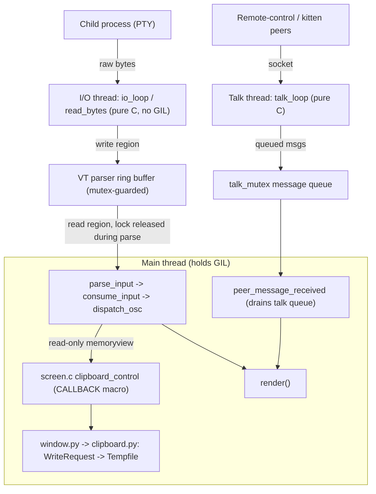

# How kitty Moves Data Between Its C Core and Its Python Layer Under Concurrency

> A code-grounded analysis of cross-boundary data movement in the **kitty** terminal
> emulator, using **clipboard transfers (small and very large)** as the central case
> study, with attention to where **timing, concurrency, and object ownership** create
> the potential for subtle races.
>
> **Repository HEAD analysed:** `815df1e210e0a9ab4622f5c7f2d6891d7dbeddf1`
> **Source branch:** `kitty_815df1e210e0`

---

## 1. Introduction

### 1.1 The question

This document answers the following request (reproduced faithfully):

> "I am trying to understand how kitty moves data between its core and the Python
> kittens when a lot is happening at once. Clipboard data can be small or very large,
> and it has to cross from internal screen structures into Python objects. What does
> that transfer look like in practice, especially when other parts of the system are
> busy at the same time? If the terminal is doing something expensive like scanning a
> large scrollback, does that affect how events are delivered to kittens or how memory
> is managed? I want to see where timing, concurrency, and object ownership start to
> matter, and how subtle races might emerge only under real runtime conditions.
> Temporary scripts may be used for observation, but the repository itself should
> remain unchanged and anything temporary should be cleaned up afterward."

That narrative decomposes into five precise technical questions, each answered in its
own section with an explicit **Answer** and a **Thinking / Rationale** subsection:

- **Q1 — Core ↔ Python data movement under concurrency.** How does kitty move data
  across the CPython C-extension boundary between its C core and its Python layer/kittens
  when several subsystems are active at once?
- **Q2 — Clipboard transfer from C screen structures into Python objects.** What does the
  transfer of clipboard data (from a few bytes to many megabytes) look like in practice,
  in both the write and read directions, especially under concurrent load?
- **Q3 — Effect of expensive operations.** When the terminal performs an expensive
  operation such as scanning or rewrapping a large scrollback, does that affect how events
  are delivered to kittens or how memory is managed?
- **Q4 — Where timing, concurrency, and object ownership begin to matter.** Where do GIL
  hand-offs, `Py_INCREF`/`Py_DECREF` ownership, and cross-thread object lifetimes become
  correctness-critical?
- **Q5 — How subtle races emerge under real runtime conditions.** Under what realistic
  interleavings could races appear, and why is the current code safe?

### 1.2 Methodology and ground rules

Every factual claim below is grounded in the kitty source at the HEAD commit above and is
cited inline in the form `path/to/file:Lnnn`. **The code is the source of truth** — nothing
here is asserted from assumption. Where external concepts are invoked (the CPython Global
Interpreter Lock; the OSC 52 / OSC 5522 clipboard wire formats), they are used only to frame
standard definitions, never to assert kitty-specific behavior.

The analysis was additionally **verified empirically** by building kitty and driving its real
code paths (the C VT-parser, the C→Python callback boundary, and the Python clipboard
subsystem) with temporary observation scripts; see [§10 "How this was verified"](#10-how-this-was-verified).
Those scripts lived only under `/tmp`, outside the repository working tree, and were deleted
afterward; the repository is unchanged except for this one document.

---

## 2. Concurrency-Model Overview (the foundation for everything else)

kitty's runtime is built around **three OS threads**, created and hosted in
`kitty/child-monitor.c`. Understanding their division of labor is the key that unlocks every
later answer.

### 2.1 The three threads

- **Main thread** — runs the event loop. `main_loop()` is defined at
  `kitty/child-monitor.c:L1259`, and the per-tick body of the loop calls the VT parser and then
  the renderer back-to-back:
  ```c
  if (parse_input(self)) input_read = true;   // kitty/child-monitor.c:L1236
  render(now, input_read);                     // kitty/child-monitor.c:L1237
  ```
  This is the **only** thread that executes Python bytecode.

- **I/O thread** — runs `io_loop()` (defined at `kitty/child-monitor.c:L1481`, created via
  `pthread_create(... io_loop ...)` at `kitty/child-monitor.c:L291`). It reads raw bytes from
  each child PTY through `read_bytes()` (`kitty/child-monitor.c:L1337`) and deposits them into
  the VT parser's ring buffer. It is **pure C** and touches no Python objects.

- **Talk thread** — runs `talk_loop()` (defined at `kitty/child-monitor.c:L1805`, created at
  `kitty/child-monitor.c:L256`/`L286`). It services peer / remote-control sockets and queues
  messages that the **main** thread later dispatches into Python through
  `PyObject_CallMethod(global_state.boss, "peer_message_received", ...)`
  (`kitty/child-monitor.c:L504`). The thread itself is **pure C**.

### 2.2 Why all Python work is serialized on the main thread under the GIL

The CPython **Global Interpreter Lock (GIL)** is a process-wide mutex ensuring that only one
thread executes Python bytecode at a time; its primary job is to protect each object's
reference-count field. A C extension may *release* the GIL around long, pure-C work using the
`Py_BEGIN_ALLOW_THREADS` / `Py_END_ALLOW_THREADS` macros.

The single strongest piece of evidence about kitty's model is this: across the **entire C
core**, `Py_BEGIN_ALLOW_THREADS` appears in **exactly one** file — `kitty/utmp.c` (used at
`kitty/utmp.c:L17`, around a blocking `utmpx` system call). The parse → dispatch → render path
on the main thread (`kitty/child-monitor.c:L1236-L1237`) **never releases the GIL**. Combined
with the fact that the I/O and talk threads never touch Python objects, this means:

> **Every Python object access in kitty happens on the main thread while the GIL is held.**
> No additional atomics or Python-level locks are needed to protect Python state, because the
> design serializes all of it onto one thread.

This single invariant is what makes the zero-copy clipboard hand-off (Q2/Q4) safe, explains why
an expensive scrollback operation blocks event delivery (Q3), and bounds the surface on which
races could appear (Q5).

---

## 3. Disambiguation: what "Python kittens" actually means

The phrase "Python kittens" conflates **two architecturally distinct things**, and the
clipboard story is completely different for each. Getting this right is a prerequisite for
answering Q1 and Q2 correctly.

### 3.1 (a) kitty's *in-process* Python layer — the real clipboard handler

The code that actually receives clipboard data from the C core lives **inside the kitty
process**, on the main thread, under the GIL:

- `kitty/window.py` — `Window.clipboard_control(self, data: memoryview, ...)`
  (`kitty/window.py:L1391`).
- `kitty/clipboard.py` — `ClipboardRequestManager`, `WriteRequest`, `ReadRequest`, and the
  `Tempfile` accumulator.
- `kitty/boss.py` — the copy direction (selection → system clipboard).

This in-process layer is what receives the zero-copy `memoryview` described in Q2/Q4, so the
"shared memory / object ownership / GIL" narrative applies **to this layer**.

### 3.2 (b) standalone kitten *processes* under `kittens/`

A "kitten" in the user-facing sense is usually a **separate OS process** that talks to the core
only over the terminal byte stream:

- The **modern clipboard kitten is predominantly Go**, not Python. Its sources are
  `kittens/clipboard/main.go` (32 lines), `read.go` (455), `write.go` (229), `legacy.go` (239),
  and `cli_generated.go` (55) — roughly **1010 lines of Go** — accompanied only by a thin
  91-line `kittens/clipboard/main.py` that declares CLI options. It communicates with the core
  **exclusively via OSC 52 / OSC 5522 escape codes** and **shares no memory** with it.
- **Genuinely-Python kittens** (e.g. `hints`, `unicode_input`, `ask`) use the
  `kittens/tui/*` framework (`kittens/tui/handler.py`, `kittens/tui/loop.py`,
  `kittens/tui/operations.py`) and `kittens/runner.py`. Their results are serialized as
  **JSON encoded with base85** and written back over the escape / remote-control protocol:
  `data = base64.b85encode(json.dumps(result).encode('utf-8'))` (`kittens/runner.py:L102`).

### 3.3 Why the distinction matters

> The shared-memory / `memoryview` / refcount-ownership analysis in this document applies to
> the **in-process** Python layer (a). Standalone kitten processes (b) — including the modern
> Go clipboard kitten — interact with the core only through a **byte stream of escape codes**.
> They are **process-isolated**: there is no shared address space, no shared GIL, and no shared
> object ownership. Their "data movement" is ordinary OS pipe/PTY I/O, and their concurrency
> model is process isolation, not threads-under-a-GIL.

---

## 4. Q1 — Core ↔ Python data movement under concurrency

### 4.1 Answer

When the child program (or a kitten talking over the PTY) emits an escape sequence, the data
crosses into Python along a single, strictly serialized path:

1. **I/O thread (pure C)** reads raw child bytes via `read_bytes()`
   (`kitty/child-monitor.c:L1337`) and writes them into the VT parser's **ring buffer**. The
   buffer is a fixed 1 MiB region — `#define BUF_SZ (1024u*1024u)` (`kitty/vt-parser.c:L18`) —
   guarded by a `pthread_mutex_t lock` (`kitty/vt-parser.c:L206`).
2. **Main thread** drains and parses that buffer inside `parse_input()` →
   `run_worker()` (`kitty/vt-parser.c:L1417`) → `consume_input()`. Crucially, the parse work
   that calls into Python runs **with the ring-buffer mutex released** (see Q4): the worker
   takes the lock only to merge pending writes, then does
   ```c
   end_with_lock; {
       consume_input(self, pd->dump_callback, screen->window_id);   // kitty/vt-parser.c:L1432
   } with_lock;
   ```
   (`kitty/vt-parser.c:L1431-L1433`).
3. **C→Python hand-off.** For an OSC dispatch, `dispatch_osc()` (`kitty/vt-parser.c:L457`)
   constructs a Python object viewing the parser bytes and calls into the screen, which forwards
   to Python via the `CALLBACK` macro in `kitty/screen.c` (details in Q2).
4. **Python** executes the handler (e.g. `Window.clipboard_control`) **on the main thread, under
   the GIL**, and returns; the main loop then proceeds to `render()`
   (`kitty/child-monitor.c:L1237`).

Meanwhile the **talk thread** queues remote-control / peer messages; they are not delivered into
Python from that thread. The main thread drains them by calling
`peer_message_received` (`kitty/child-monitor.c:L504`). So although three threads run
concurrently, **all three converge such that only the main thread ever touches Python** — the
two helper threads are pure-C producers feeding buffers/queues that the main thread consumes.

### 4.2 Thinking / Rationale

The concurrency model is best described as **"concurrent I/O, serialized compute."** Bytes can
arrive (I/O thread) and peers can talk (talk thread) at any instant, truly in parallel with the
main thread. But the moment data must become a *Python object* or touch *terminal screen
state*, it funnels through the single main thread holding the GIL.

The decisive evidence is that `Py_BEGIN_ALLOW_THREADS` exists in only `kitty/utmp.c:L17` across
the whole C core — so the hot parse → dispatch → render path of
`kitty/child-monitor.c:L1236-L1237` never drops the GIL. Because of that, kitty needs **no extra
locking around Python state**: the GIL plus single-threaded dispatch already serialize every
Python object access. This is a deliberate, simple, and robust design — and it is exactly why
the answers to Q3 (an expensive main-thread operation stalls everything Python-facing) and Q5
(races are *latent*, gated by lifetime invariants rather than locks) come out the way they do.


---

## 5. Q2 — Clipboard transfer from C screen structures into Python objects

The clipboard is the ideal case study because it exercises the boundary in both directions and
spans the full size range, from a handful of bytes to many megabytes.

### 5.1 Answer — the write path (child/terminal → clipboard), byte-for-byte

**Step 1 — a zero-copy, read-only memoryview is created over the parser buffer.** When the VT
parser recognizes an OSC payload, `dispatch_osc()` builds a Python `memoryview` that *aliases*
the parser's own buffer rather than copying it:

```c
RAII_PyObject(mv, PyMemoryView_FromMemory((char*)buf + i, limit - i, PyBUF_READ)); // kitty/vt-parser.c:L461
```

Two properties matter here and both were confirmed at runtime (§10): the view is **read-only**
(`PyBUF_READ`), and it is wrapped in `RAII_PyObject`, meaning its reference is automatically
released when the C scope exits.

**Step 2 — the OSC code routes to `clipboard_control`.** For OSC 52 and OSC 5522 the parser
dispatches into the screen:

```c
case 52: case 5522:
    if (is_extended_osc && code == 52) code = -52;        // kitty/vt-parser.c:L533
    DISPATCH_OSC_WITH_CODE(clipboard_control);            // kitty/vt-parser.c:L534
```

**Step 3 — the synchronous C→Python callback.** `screen.c`'s `clipboard_control` forwards the
memoryview to Python through the `CALLBACK` macro:

```c
clipboard_control(Screen *self, int code, PyObject *data) {                       // kitty/screen.c:L2305
    if (code == 52 || code == -52) { CALLBACK("clipboard_control", "OO", data, code == -52 ? Py_True: Py_False); } // L2306
    else { CALLBACK("clipboard_control", "OO", data, Py_None);}                    // kitty/screen.c:L2307
}
```

The `CALLBACK` macro itself calls the Python method **synchronously** and immediately
`Py_DECREF`s its return value:

```c
#define CALLBACK(...) \
    if (self->callbacks != Py_None) { \
        PyObject *callback_ret = PyObject_CallMethod(self->callbacks, __VA_ARGS__); \
        if (callback_ret == NULL) PyErr_Print(); else Py_DECREF(callback_ret); \
    }                                                          // kitty/screen.c:L87-L92
```

Note the third argument encodes *which* protocol and *whether this is a partial fragment*:
OSC 52 passes a **bool** (`Py_True` for a partial `-52` fragment, else `Py_False`), while OSC
5522 passes **`Py_None`**. This was confirmed empirically: the Python callback received
`is_partial=False` (a `bool`) for OSC 52 and `is_partial=None` for OSC 5522 (§10).

**Step 4 — the Python entry point routes by protocol.** `Window.clipboard_control` uses
`is_partial is None` as the OSC-5522 signal:

```python
def clipboard_control(self, data: memoryview, is_partial: Optional[bool] = False) -> None:  # kitty/window.py:L1391
    if is_partial is None:
        self.clipboard_request_manager.parse_osc_5522(data)        # kitty/window.py:L1393
    else:
        self.clipboard_request_manager.parse_osc_52(data, is_partial)  # kitty/window.py:L1395
```

**Step 5 — bytes are copied *out* of the memoryview into a rolling `Tempfile`.** This is the
crux of object ownership. As base64 fragments are accumulated, any bytes that straddle a base64
4-character boundary are copied into a Python-owned `bytes` object:

```python
if extra > 0:
    mv = memoryview(data)
    self.current_leftover_bytes = memoryview(bytes(mv[-extra:]))   # kitty/clipboard.py:L286
    mv = mv[:-extra]
```

The bulk of the payload is base64-decoded and written into a `Tempfile`:

```python
def write_base64_data(self, b: bytes) -> None:                     # kitty/clipboard.py:L316
    from base64 import standard_b64decode
    if not self.max_size_exceeded:
        d = standard_b64decode(b)
        self.tempfile.write(d)
        if self.max_size > 0 and self.tempfile.tell() > (self.max_size * 1024 * 1024):  # kitty/clipboard.py:L321
            log_error(f'Clipboard write request has more data than allowed by clipboard_max_size ({self.max_size}), truncating')
            self.max_size_exceeded = True                          # kitty/clipboard.py:L323
```

The decisive point: by the time the synchronous callback returns, **every byte kitty intends to
keep has already been copied into a Python-owned object** (the leftover `bytes`, or the
`Tempfile`'s storage). The transient read-only memoryview window onto the C buffer is never
retained past the call.

### 5.2 Answer — small vs. very large (the `Tempfile` behaviour)

The `Tempfile` accumulator starts entirely in memory and **rolls over to disk** once it grows
past a threshold:

```python
class Tempfile:                                                    # kitty/clipboard.py:L26
    def __init__(self, max_size: int) -> None:
        self.file: Union[io.BytesIO, IO[bytes]] = io.BytesIO()     # kitty/clipboard.py:L29
    def rollover_if_needed(self, sz: int) -> None:
        if isinstance(self.file, io.BytesIO) and self.file.tell() + sz > self.max_size:  # kitty/clipboard.py:L33
            before = self.file.getvalue()
            self.file = TemporaryFile()                            # kitty/clipboard.py:L35
            self.file.write(before)
```

There are **two distinct limits**, and they must not be confused:

- **Rollover threshold (16 MiB), in-memory → on-disk.** `WriteRequest.__init__` constructs the
  `Tempfile` with `rollover_size: int = 16 * 1024 * 1024` (`kitty/clipboard.py:L237`, passed at
  `L243`). Below this, the payload lives in an `io.BytesIO` (RAM); above it, the data migrates to
  an unnamed on-disk `TemporaryFile()`.
- **Hard cap (`clipboard_max_size`), truncate-and-log.** The total is capped by
  `self.max_size`, set from the option in the default path
  (`self.max_size = (get_options().clipboard_max_size * 1024 * 1024) if max_size < 0 else max_size`,
  `kitty/clipboard.py:L247`). When the accumulated size exceeds the cap, the request logs
  `"... truncating"` and sets `max_size_exceeded = True` (`kitty/clipboard.py:L321-L323`), after
  which further data is silently dropped.

Both behaviours were confirmed at runtime (§10): a small payload stayed in `io.BytesIO`; a
~2 MiB payload migrated to an on-disk file; and a payload exceeding an explicit cap produced the
exact `clipboard_max_size ... truncating` log line and set the `max_size_exceeded` flag.

**Very large writes are also fragmented by the parser itself.** An OSC 52 escape code that grows
beyond `MAX_ESCAPE_CODE_LENGTH` (defined as `BUF_SZ / 4u`, i.e. 256 KiB) *before* its terminator
arrives is dispatched as a **partial** fragment (the `code = -52` path at
`kitty/vt-parser.c:L533`), and parsing then continues for the remainder. Each fragment is a
separate read-only memoryview handed to Python, which accumulates them into the same
`WriteRequest`/`Tempfile`. (If the entire code is already buffered when its terminator is seen,
the parser is deliberately "generous" and delivers it in a single non-partial dispatch.) Both
the single-dispatch and the multi-fragment partial behaviours were observed at runtime (§10).

### 5.3 Answer — the reverse path (selection/screen text → Python string → clipboard)

Copying *out of* the terminal goes the other way: C cell storage is rendered into a brand-new
Python `str`. `text_for_selection()` (`kitty/screen.c:L4004`) delegates to
`text_for_selections()` (`kitty/screen.c:L4007`, defined at `L3987`), which walks the selected
ranges and builds a Python tuple of strings from the C `Line`/cell structures (using the
per-`Screen` scratch buffer described in Q3). On the Python side, `Boss` reads that text and
hands it to the platform clipboard:

```python
text = w.text_for_selection()        # kitty/boss.py:L2248
...
set_clipboard_string(text)           # kitty/boss.py:L2251
set_primary_selection(text)          # kitty/boss.py:L2253
```

`set_clipboard_string` / `set_primary_selection` are imported from the compiled extension, and
the platform backend itself is C: `set_clipboard_data_types` (`kitty/glfw.c:L2164`) and
`get_clipboard_mime` (`kitty/glfw.c:L2193`), surfaced to Python via
`kitty/fast_data_types.pyi:L1609-L1610`. So in the read direction there is **no aliasing**: a
fresh, fully-owned Python string is materialized from the C cells before anything Python touches
it.

**The asynchronous read response is chunked.** When a program *requests* the clipboard (e.g.
OSC 52 with `?`), kitty streams the answer back to the child in **4096-byte chunks**:

```python
w.screen.send_escape_code_to_child(ESC_OSC, rr.encode_response(payload=mv[:4096], mime=current_mime))  # kitty/clipboard.py:L484
mv = mv[4096:]                                                                                          # kitty/clipboard.py:L485
...
w.screen.send_escape_code_to_child(ESC_OSC, rr.encode_response(status='DONE'))                          # kitty/clipboard.py:L499
```

and, because reading the clipboard is a privacy-sensitive action, it runs through an
**asynchronous permission flow**: `ask_to_read_clipboard` (`kitty/clipboard.py:L518`) →
`handle_clipboard_confirmation` (`kitty/clipboard.py:L534`).

### 5.4 Thinking / Rationale

The write path is engineered to **touch as little memory as possible up front, then bound it
hard**. The zero-copy `PyBUF_READ` memoryview means kitty does not duplicate potentially-large
clipboard payloads merely to inspect them; it parses in place. Ownership is kept correct by a
**lifetime discipline**: bytes worth keeping are copied out (`kitty/clipboard.py:L286`, plus the
decode-and-write into the `Tempfile`) *before* the synchronous callback returns, so the alias
never outlives the buffer it points into (this is the safety property Q5 leans on).

Memory growth is then bounded by **two independent guards**. The 16 MiB rollover keeps a large
paste from pinning tens of megabytes of Python heap — it spills to an OS temp file instead — and
`clipboard_max_size` provides an absolute ceiling beyond which data is discarded with a log line
rather than consumed without limit. Small clipboard contents (the common case) never pay the
disk cost: they live and die in an `io.BytesIO`. This is the precise sense in which "small or
very large" data is handled differently — same code path, two size-triggered behaviours.

The read path is intentionally **copy-not-alias** (a fresh Python `str`) because the result must
outlive the C selection state and be streamed asynchronously; aliasing C cell memory across an
async, chunked, permission-gated response would be unsafe, so kitty doesn't.


---

## 6. Q3 — Effect of expensive operations (scrollback scan/rewrap) on event delivery & memory

### 6.1 Answer

**Scrollback lives in C-heap memory, not the Python heap.** The history buffer is a Python
object (`HistoryBuf`, allocated via `type->tp_alloc` and freed via `tp_free`), but its actual
cell storage is allocated with the C allocator, not CPython's:

```c
add_segment(HistoryBuf *self) {                                            // kitty/history.c:L18
    self->num_segments += 1;
    self->segments = realloc(self->segments, sizeof(HistoryBufSegment) * self->num_segments);  // L20
    ...
    s->cpu_cells = calloc(1, cpu_cells_size + gpu_cells_size + SEGMENT_SIZE * sizeof(LineAttrs)); // L25
}
static void
free_segment(HistoryBufSegment *s) {
    free(s->cpu_cells); memset(s, 0, sizeof(HistoryBufSegment));           // kitty/history.c:L33
}
```

So a large scrollback's memory does **not** churn the Python object heap or the GIL-protected
refcount machinery; it is plain `realloc`/`calloc`/`free` of C buffers
(`kitty/history.c:L18-L34`).

**Scrollback scans/rewraps run on the main thread and therefore block event delivery.** Text
extraction and rewrap (`text_for_selection` / the `as_text_*` family, and the rewrap routines)
reuse a single per-`Screen` scratch buffer declared in the screen struct:

```c
ANSIBuf as_ansi_buf;   // kitty/screen.h:L126
```

These routines are invoked from the very same main-thread parse → dispatch → render loop
(`kitty/child-monitor.c:L1236-L1237`). Because Python and screen mutation are single-threaded
(Q1), **while the main thread is busy scanning or rewrapping a big scrollback it is not parsing
new input, not running kitten/clipboard callbacks, and not rendering.** Event delivery to the
in-process Python layer is therefore *delayed* for the duration of the expensive operation.

**Input is buffered, not lost.** During that stall the **I/O thread keeps reading** child output
via `read_bytes()` (`kitty/child-monitor.c:L1337`) into the bounded 1 MiB ring buffer
(`kitty/vt-parser.c:L18`). The parser's flush heuristic and a near-full guard,

```c
if (flush || pd->time_since_new_input >= OPT(input_delay) || self->read.sz + 16 * 1024 > BUF_SZ) {  // kitty/vt-parser.c:L1425
```

mean that once the buffer approaches full, kitty stops draining the PTY and the OS applies
**backpressure**: the child's `write()` blocks until kitty catches up. Data is queued, then
processed when the main thread is free again.

### 6.2 Thinking / Rationale

This is the direct, and somewhat unavoidable, consequence of the "serialized compute" model from
Q1. With one thread executing all Python and all screen mutation, any CPU-bound main-thread task
necessarily serializes ahead of event dispatch. The user-visible effect of an expensive
scrollback operation is therefore **added latency, not dropped events and not unbounded memory
growth**:

- *Latency*, because the single main thread is the bottleneck and event handlers wait their turn.
- *No loss*, because the I/O thread continues buffering into a fixed-size ring buffer and the PTY
  backpressure (`kitty/vt-parser.c:L1425`) throttles the child rather than overflowing.
- *Bounded memory*, because scrollback uses C-heap segments (`kitty/history.c:L18-L34`) and reuses
  a single scratch buffer (`kitty/screen.h:L126`) rather than allocating fresh per-call buffers.

The single shared `as_ansi_buf` is safe precisely *because* of single-threaded execution: there
is never a second thread extracting text concurrently, so the scratch buffer cannot be clobbered
mid-use (this reappears as an ownership consideration in Q4).

---

## 7. Q4 — Where timing, concurrency, and object ownership begin to matter

### 7.1 Answer — the hotspots

**(1) The memoryview's validity window vs. buffer compaction.** The clipboard memoryview aliases
the parser buffer (`kitty/vt-parser.c:L461`). After `consume_input` returns, `run_worker`
**compacts** the ring buffer by moving the unconsumed tail to the front:

```c
if (self->read.sz) memmove(self->buf, self->buf + self->read.consumed, self->read.sz);  // kitty/vt-parser.c:L1441
```

A `memmove` over the region the memoryview points into would shift bytes underneath any retained
view. The window of validity for that view is therefore exactly the synchronous callback; not a
moment longer.

**(2) The ring-buffer lock is released *during* dispatch.** One might assume the parser holds its
mutex while calling into Python, but it does not. `run_worker` takes the lock only to merge
pending writes, then releases it around the actual parse-and-dispatch:

```c
end_with_lock; {
    consume_input(self, pd->dump_callback, screen->window_id);   // kitty/vt-parser.c:L1432
} with_lock;
```

(`kitty/vt-parser.c:L1417-L1433`; the mutex is `kitty/vt-parser.c:L206`.) So the safety of the
memoryview does **not** rest on holding the lock; it rests on the **lifetime discipline** that
the bytes are copied out before the callback returns (Q2 step 5).

**(3) Reference-count ownership.** Two patterns keep refcounts correct without any explicit
atomics:
- The `CALLBACK` macro `Py_DECREF`s the Python return value immediately
  (`kitty/screen.c:L87-L92`) — no leak of the handler's return object.
- `RAII_PyObject(mv, ...)` (`kitty/vt-parser.c:L461`) releases the transient memoryview when the
  C scope exits — no leak of the alias, and no premature free while it is in use.

**(4) Shared scratch-buffer reuse.** The single per-`Screen` `as_ansi_buf`
(`kitty/screen.h:L126`) is reused across every text-extraction / rewrap call. With multiple
threads this would be a classic shared-mutable-state hazard; here it is safe only because those
calls are serialized on the main thread.

### 7.2 Thinking / Rationale

Every one of these hotspots is **made correct by the same global invariant**: single-threaded
Python execution under a never-released GIL (Q1). The memoryview is created, consumed, and copied
out within one synchronous, GIL-held call before any compaction can run; refcounts are mutated by
only one thread; the scratch buffer has only one user at a time. None of this requires
fine-grained locking — the architecture substitutes *serialization* for *synchronization*.

The corollary is important and worth stating explicitly: **a PEP 703 "free-threaded" (no-GIL)
CPython build would change the analysis.** The GIL today implicitly protects the refcount fields
and the shared buffers that this code mutates without atomics. Remove that implicit
serialization and the same patterns — the aliased memoryview, the immediate `Py_DECREF`, the
shared `as_ansi_buf` — would require explicit locking to remain correct. In other words, the
"ownership and timing" correctness here is **borrowed from the GIL**, not from local locks.

> Per the scope of this engagement, this is an *observation about where correctness comes from*,
> not a defect report or a proposed change.


---

## 8. Q5 — How subtle races emerge under real runtime conditions

The races below are **latent**: under the current code they cannot actually fire, because a
specific invariant holds. They are presented as *"where correctness depends on a particular
invariant,"* with the invariant cited. Consistent with the read-only/analysis nature of this
engagement, **no fixes are proposed** — the goal is to show exactly which guarantee each safety
property rests on, and how the race would appear if that guarantee were absent (e.g., under a
future no-GIL build or a hypothetical refactor that broke the invariant).

### 8.1 Race surface A — buffer compaction vs. a retained memoryview

**The interleaving.** The clipboard payload is delivered as a read-only memoryview aliasing the
parser ring buffer (`kitty/vt-parser.c:L461`). Immediately after dispatch, the worker compacts
that buffer with `memmove` (`kitty/vt-parser.c:L1441`). If Python were to *retain* the
memoryview beyond the synchronous callback — stash it in an object, hand it to an async task,
etc. — the subsequent `memmove` would shift bytes out from under it, and later reads through the
view would observe stale or garbage data.

**Why it cannot fire today.** `kitty/clipboard.py` **copies the bytes out before returning**:
leftover boundary bytes become an owned `bytes` (`kitty/clipboard.py:L286`) and the bulk is
decoded and written into the `Tempfile` synchronously (`kitty/clipboard.py:L316-L323`). Nothing
retains the alias. Note that this safety is **not** provided by the parser mutex — that lock is
released during dispatch (`kitty/vt-parser.c:L1431-L1433`) — so it rests **entirely on the
copy-out lifetime discipline.** Remove the copy-out (or retain the view), and the compaction
race becomes reachable.

### 8.2 Race surface B — window teardown during an in-flight asynchronous clipboard response

**The interleaving.** A clipboard *read* response is streamed back to the child in 4096-byte
chunks (`kitty/clipboard.py:L484-L485`, terminated by a `DONE` at `L499`), and it is gated by an
asynchronous permission dialog: `ask_to_read_clipboard` (`kitty/clipboard.py:L518`) →
`handle_clipboard_confirmation` (`kitty/clipboard.py:L534`). Because the flow is asynchronous,
real time elapses between "permission asked" and "chunks written" — during which the user could
close the window. Writing chunks to a torn-down window's screen would be a use-after-free-style
hazard.

**Why it cannot fire today.** Each step that needs the window first re-resolves it from the live
window map and bails out if it is gone, rather than caching a window pointer across the async
gap:

```python
w = get_boss().window_id_map.get(self.window_id)   # kitty/clipboard.py:L466
if w is None:
    return                                          # kitty/clipboard.py:L467
```

The same `window_id_map.get(...)`-then-guard pattern recurs before the other screen accesses
(`kitty/clipboard.py:L437`, `L446`, `L504`, `L510`, and at `L382` for the write side). The
correctness here depends on the invariant *"never cache a window across an await; always
re-resolve by id and check for `None`."*

### 8.3 Thinking / Rationale

The two surfaces are instructive because they show kitty buying safety in **two different
currencies**:

- Surface A is made safe by a **memory-lifetime** invariant (copy out before the alias dies),
  *not* by locking — the lock is deliberately released during dispatch for throughput.
- Surface B is made safe by an **object-liveness** invariant (re-resolve the window by id and
  check `None` after every async hop), *not* by pinning a reference.

Both are exactly the kind of "subtle race that only emerges under real runtime conditions" the
question asks about: they require a specific *timing* (a compaction right after dispatch; a window
close mid-stream) and a specific *ownership* mistake (retaining an alias; caching a dead window)
to manifest. Today neither mistake is made, so neither race occurs — but the safety is *earned*
by discipline at specific lines, and is therefore worth knowing about. And as noted in Q4, the
implicit serialization the GIL provides is itself one of the load-bearing invariants: a
free-threaded build would widen both surfaces.

---

## 9. Concurrency-model diagram



*All Python-touching work — parse, clipboard dispatch, peer-message handling, and render — is
serialized on the main thread under the GIL. The I/O and talk threads are pure C and never touch
Python objects; they only fill the mutex-guarded ring buffer and the message queue that the main
thread later drains.*


---

## 10. How this was verified

The behaviour above was confirmed by building kitty and driving its real code paths, not by
reading alone. All observation scripts lived under `/tmp` (outside the repository working tree)
and were deleted afterward; the repository ended the engagement byte-for-byte unchanged except
for this document (verified with `git status --porcelain` returning empty for tracked files).

### 10.1 Build

- Toolchain present in the build container: **Python 3.13.7**, **Go 1.24.4**, **gcc 15.2.0**
  (satisfying `pyproject.toml`'s `requires-python = ">=3.8"` and `go.mod`'s `go 1.22`).
- The native extension `kitty/fast_data_types.so` was built (per the project's `Makefile`:
  `make debug` ⇒ `python3 setup.py build --debug`; sanitizer and event-loop-logging variants are
  available as `make asan` ⇒ `--debug --sanitize` and `make debug-event-loop` ⇒
  `--debug --extra-logging=event-loop`). It imported successfully and exposed the clipboard
  backend functions `set_clipboard_data_types` / `get_clipboard_mime`. Build prerequisites
  (harfbuzz ≥ 1.5 per `setup.py:L609`, libpng, lcms2, fontconfig, zlib, xxhash, GL, libcrypto,
  pkg-config) are environment prerequisites only — no project dependency was added or changed.

### 10.2 Test suite

- `./test.py --module clipboard` ⇒ `test_clipboard_write_request ... ok` (1 test, OK). This
  exercises `kitty_tests/clipboard.py`, which drives `WriteRequest.add_base64_data` /
  `flush_base64_data` / `data_for`, including the base64 boundary leftover logic.

### 10.3 Observations (temporary `/tmp` scripts, since deleted)

Two kinds of scripts were used: (i) direct exercises of the `kitty/clipboard.py` classes, and
(ii) end-to-end drives of the **real C VT-parser → `screen.c` `CALLBACK` → Python** boundary,
built by instantiating a `Screen` with a callback object and feeding it OSC bytes through the
parser's own write-buffer test entry points.

| # | What was driven | Observed result (confirms) |
|---|-----------------|----------------------------|
| 1 | `Tempfile(max_size=1 MiB)`: write 0.5 MiB then +0.6 MiB | backing went `io.BytesIO` → on-disk temp file once the threshold was crossed; the first bytes were preserved across the migration — **rollover** (`kitty/clipboard.py:L33-L35`) |
| 2 | `WriteRequest` + base64 of `"hello clipboard"` | stayed in `io.BytesIO`; `max_size_exceeded=False` — **small payloads stay in RAM** |
| 3 | `WriteRequest(rollover_size=1 MiB)` fed ~2 MiB | migrated to an on-disk temp file; `tell()` ≈ 2 MiB — **large payloads roll to disk** |
| 4 | `WriteRequest(max_size=1)` fed ~2 MiB | emitted the exact log line `Clipboard write request has more data than allowed by clipboard_max_size (1), truncating` and set `max_size_exceeded=True` — **hard cap** (`kitty/clipboard.py:L321-L323`) |
| 5 | `add_base64_data('bGlnaHQgd29yaw')` then flush | `current_leftover_bytes == b'aw'` and it is an **owned copy** (its `.obj` is a `bytes`); flushed payload `b'light work'` — **copy-out** (`kitty/clipboard.py:L286`) |
| 6 | OSC 52 small write through the real C parser | Python callback received a `memoryview` with `readonly=True`, `is_partial=False` (a `bool`); content `c;aGVsbG8=` — **read-only zero-copy hand-off** (`kitty/vt-parser.c:L461`, `kitty/screen.c:L2306`) |
| 7 | OSC 52 read query `?` | `memoryview`, `readonly=True`, `is_partial=False`; content `c;?` — read query reaches the handler |
| 8 | OSC 5522 MIME write | `memoryview`, `readonly=True`, **`is_partial=None`** — confirms OSC 5522 routes via `Py_None` (`kitty/screen.c:L2307`; `kitty/window.py:L1392`) |
| 9 | ~600 KiB OSC 52 with terminator already buffered | delivered as a **single** `is_partial=False` view (~600 KiB) — parser's "generous when fully buffered" fast path |
| 10 | >256 KiB OSC 52 with terminator withheld | produced an `is_partial=True` fragment (the `code=-52` path) followed by a final `is_partial=False` segment — **parser-level fragmentation of very large writes** (`kitty/vt-parser.c:L533`) |

### 10.4 Cleanup & integrity

All `/tmp` scripts, logs, and payloads were removed after capture; `git status --porcelain`
showed no changes to tracked files, and the only new untracked path is this document under
`blitzy/documentation/`.

---

## 11. Citations / Evidence table

| Claim | Source (`file:line`) | What it proves |
|-------|----------------------|----------------|
| Main loop: parse then render, never releasing the GIL | `kitty/child-monitor.c:L1236-L1237`; `kitty/child-monitor.c:L1259` | The hot path that touches Python runs on the main thread |
| Only one `Py_BEGIN_ALLOW_THREADS` in the whole C core | `kitty/utmp.c:L17` (sole occurrence) | Parse → dispatch → render never drops the GIL ⇒ Python work is serialized |
| I/O thread reads PTY into the ring buffer (pure C) | `kitty/child-monitor.c:L1481` (`io_loop`), `L291` (create), `L1337` (`read_bytes`) | Concurrent byte ingestion that touches no Python objects |
| Talk thread services peers (pure C); main thread dispatches | `kitty/child-monitor.c:L1805` (`talk_loop`), `L256`/`L286` (create), `L504` (`peer_message_received`) | Peer messages enter Python only on the main thread |
| Ring buffer is a bounded 1 MiB region with a mutex | `kitty/vt-parser.c:L18` (`BUF_SZ`), `L206` (`lock`) | Bounded buffering + cross-thread coordination point |
| Lock released during parse/dispatch | `kitty/vt-parser.c:L1417`, `L1425`, `L1431-L1433` | Python dispatch happens **without** the parser mutex held |
| Buffer compaction after consume | `kitty/vt-parser.c:L1441` (`memmove`) | The aliased region can move right after dispatch |
| Zero-copy read-only memoryview over the parser buffer | `kitty/vt-parser.c:L461` (`PyMemoryView_FromMemory(..., PyBUF_READ)`, `RAII_PyObject`) | C hands Python a read-only alias, auto-released at scope exit |
| OSC 52/5522 routed to `clipboard_control`; `-52` partial code | `kitty/vt-parser.c:L533-L534` | Protocol routing + large-write fragmentation marker |
| `CALLBACK` macro: synchronous call + immediate `Py_DECREF` | `kitty/screen.c:L87-L92` | Refcount discipline on the callback return value |
| `clipboard_control` forwards memoryview; bool vs `None` arg | `kitty/screen.c:L2305-L2307` | OSC 52 ⇒ bool `is_partial`; OSC 5522 ⇒ `None` |
| Python entry point routes by `is_partial is None` | `kitty/window.py:L1391-L1395` | `is_partial is None` selects the OSC 5522 path |
| `Tempfile` rolls `BytesIO` → on-disk `TemporaryFile` | `kitty/clipboard.py:L26-L35` | In-memory for small, on-disk for large |
| 16 MiB rollover default | `kitty/clipboard.py:L237` (`rollover_size = 16 * 1024 * 1024`), `L243` | The in-memory → disk threshold |
| `clipboard_max_size` hard cap + truncation log | `kitty/clipboard.py:L247`, `L316-L323` | Absolute ceiling; truncate-and-log past it |
| Copy-out of leftover bytes (owned `bytes`) | `kitty/clipboard.py:L286` | Alias is never retained past the callback |
| Async read: 4096-byte chunks + `DONE` | `kitty/clipboard.py:L484-L485`, `L499` | Chunked streaming response |
| Window re-resolved & `None`-checked across async hops | `kitty/clipboard.py:L466-L467` (also `L382`, `L437`, `L446`, `L504`, `L510`) | Teardown-safety invariant for in-flight responses |
| Async permission flow | `kitty/clipboard.py:L518` (`ask_to_read_clipboard`), `L534` (`handle_clipboard_confirmation`) | Read is permission-gated and asynchronous |
| Reverse path builds a fresh Python string from C cells | `kitty/screen.c:L3987` (`text_for_selections`), `L4004`/`L4007` (`text_for_selection`) | Copy-not-alias in the read direction |
| Copy direction hands text to the platform clipboard | `kitty/boss.py:L2248`, `L2251`, `L2253` | `text_for_selection` → `set_clipboard_string`/`set_primary_selection` |
| Platform clipboard backend is C | `kitty/glfw.c:L2164`, `L2193`; `kitty/fast_data_types.pyi:L1609-L1610` | `set_clipboard_data_types` / `get_clipboard_mime` live in C |
| Scrollback stored in C-heap segments | `kitty/history.c:L18-L34` (`realloc`/`calloc`/`free`) | Large scrollback does not churn the Python heap |
| Single per-`Screen` scratch buffer reused for extraction/rewrap | `kitty/screen.h:L126` (`ANSIBuf as_ansi_buf`) | Reused buffer; safe only under single-threaded access |
| Modern clipboard kitten is predominantly Go | `kittens/clipboard/{main,read,write,legacy}.go` (~1010 LOC) + thin 91-line `main.py` | Standalone kitten is a separate process over escape codes |
| Python kitten results serialized as JSON + base85 | `kittens/runner.py:L102` (`base64.b85encode(json.dumps(result)...)`) | Process-isolated kittens exchange bytes, not objects |

---

### Appendix — scope note

This document is an analysis artifact only. Consistent with its governing constraints, **no
existing repository file was modified, created, or deleted**, no code other than this document
was added, all temporary observation scripts were confined to `/tmp` and removed afterward, and
**no remediation of any kind** was performed for the latent race surfaces discussed in Q5 — they
are documented as invariants, not patched.

