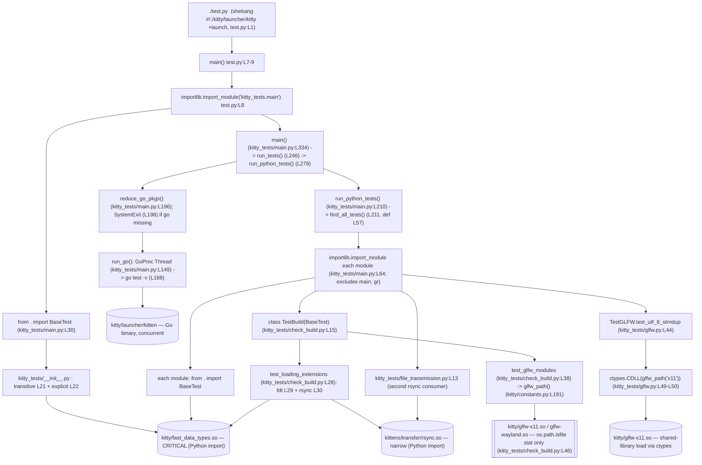

# How kitty's compiled C extensions relate to and drive its test-execution flow

> **Investigation target:** the `kitty` terminal emulator at commit **`815df1e21`** ("Wire up applying of font config"), branch **`kitty_815df1e210e0`**.
> **Methodology:** run‑first. The canonical build (`python3 setup.py build`) and the canonical test entry point (`./test.py`) were executed inside the mandated canonical environment and their **complete, unedited output** is embedded below as the primary source of truth. Every behavioral claim is paired with the exact command that produced it, the real output, and a repository‑relative `file:line` reference into the source. Counts were confirmed stable across two consecutive runs.
> **Environment (observed):** the mandated Docker image `swe_atlas_QnA_kovidgoyal_kitty_1.0`, with the host repository bind‑mounted at `/work`. Python **3.12.3** / Go **1.23.4** / gcc **13.3.0**, Linux, `/tmp` on `tmpfs`, locale `C.UTF-8`, environment variable `CI` **unset**. All absolute paths in the captured output are shown **verbatim** (they begin with `/work/…`, the mounted repository root); nothing is abbreviated or elided.
> **Repository integrity:** the `.so`/launcher artifacts the build produces are gitignored (`*.so` at `.gitignore:L1`, `/kitty/launcher/kitt*` at `.gitignore:L18`), so `git status --porcelain` stays empty apart from this document. No existing repository file was modified. Any temporary observation scripts were created outside the tracked tree and removed afterward.

---

## 1. TL;DR — the direct answer

kitty's test suite is a **hybrid** runner: Python `unittest` tests run sequentially in the main thread while the Go `testing` packages run concurrently in a background thread (`GoProc`, `kitty_tests/main.py:L149`). The Python half is **bound at import time to one compiled C extension — `kitty/fast_data_types.so`** — through the base class `BaseTest` in `kitty_tests/__init__.py` (`from kitty.fast_data_types import …` at `kitty_tests/__init__.py:L22`, plus a transitive pull at `kitty_tests/__init__.py:L21`). Because 23 of the 25 test modules do `from . import BaseTest`, that one extension is a **hard, whole‑suite prerequisite**.

In the canonical Docker environment the build succeeds with **all** native artifacts present (including the Wayland GLFW backend), and the canonical `./test.py` run **passes**: it reports **`Ran 145 tests`**, **`OK (skipped=4)`**, **`All Go tests succeeded`**, and exits with code **0** — figures that were identical across two runs (only wall‑clock time varied).

The compiled extensions relate to the tests through **three distinct kinds of coupling**, and those couplings produce **two sharply different failure modes** when an artifact is missing:

- **Python‑import coupling (strongest).** `kitty/fast_data_types.so` and `kittens/transfer/rsync.so` are imported as Python C‑extension modules. A missing imported extension makes the offending module unimportable, and because the runner imports every module during collection, the result is a **whole‑run hard abort with zero tests executed** (demonstrated for both `fast_data_types.so` and `rsync.so` in §11).
- **`ctypes.CDLL` shared‑library coupling.** `kitty/glfw-x11.so` is **not** a Python module, but it **is** loaded at runtime as a plain shared library via `ctypes.CDLL(glfw_path('x11'))` inside `kitty_tests/glfw.py::TestGLFW.test_utf_8_strndup` (`kitty_tests/glfw.py:L49-L50`). Removing it turns that one test into an `ERROR` (an `OSError` from the failed `dlopen`) but does not abort the run.
- **File‑existence coupling (weakest).** `test_glfw_modules` only *stats* the GLFW backend files (`os.path.isfile`/`os.access`, `kitty_tests/check_build.py:L46-L47`). A missing file‑checked backend fails **only that one test** while the other 144 tests still run.

Of kitty's four compiled Python‑or‑shared‑library artifacts, **`fast_data_types.so` and `rsync.so` are imported as Python modules; `glfw-x11.so` is loaded as a shared library via `ctypes` (not a Python import); and `glfw-wayland.so` is present on disk but is neither imported nor loaded during the headless run — it is only stat‑checked.**

The rest of this document proves and unpacks each of those statements, then answers the eight decomposed questions explicitly in §13.

---

## 2. Environment & canonical commands

| Item | Value (observed) |
|---|---|
| Repository commit | `815df1e21` ("Wire up applying of font config") |
| Branch | `kitty_815df1e210e0` |
| Build/run environment | mandated Docker image `swe_atlas_QnA_kovidgoyal_kitty_1.0`; repo bind‑mounted at `/work` |
| Python | 3.12.3 (repo floor: `requires-python = ">=3.8"` — `pyproject.toml:L2`) |
| Go | 1.23.4 (repo floor: `go 1.22` — `go.mod:L3`) |
| C compiler | gcc 13.3.0 (build defaults to `-pedantic-errors -Werror`, compiles cleanly) |
| OS / `/tmp` / locale | Linux / `tmpfs` / `C.UTF-8` |
| `CI` env var | **unset** → the run header prints `Running under CI: False` (`kitty_tests/main.py:L305`) |

**Canonical build command** (run from the repository root):

```
python3 setup.py build
```

`setup.py` is a custom, multi‑hundred‑line build orchestrator. The `build` action is dispatched at `setup.py:L2115-2121`, which calls `build()` (`setup.py:L1084`), then `build_launcher()` (`setup.py:L1230`) and `build_static_kittens()` (`setup.py:L1130`). `Makefile` simply wraps it: `all:` → `python3 setup.py …` (`Makefile:L12-13`), `test:` → `python3 setup.py … test` (`Makefile:L15-16`).

**Canonical test command** (run from the repository root):

```
./test.py
```

`test.py`'s shebang is `#!./kitty/launcher/kitty +launch` (`test.py:L1`), i.e. the freshly built **C launcher** re‑executes the script under kitty's embedded Python; `main()` then does `importlib.import_module('kitty_tests.main')` (`test.py:L8`) and calls its `main()` (`test.py:L7-9`). The `setup.py test` action reaches the same place via `os.execl(texe, texe, '+launch', 'test.py')` (`setup.py:L2100-2102`). Both are the *canonical* entry point; no bypassing/fallback interface was used.

---

## 3. Canonical build — command and complete verbatim output

```
python3 setup.py build
```

**Result: exit code 0.** The `.so` artifacts are **gitignored build products** absent from a clean checkout, so the suite cannot import them until the build succeeds; building is therefore the necessary first step. In the canonical Docker image every native development library is present (HarfBuzz, FreeType, fontconfig, xkbcommon, X11/xcb, libpng, lcms2, dbus, uuid, GL, **and** Wayland/wayland‑protocols), so the build produces **all** backends, including Wayland. `libcrypto` is a hard build dependency resolved via `pkg_config('libcrypto', …)` in `libcrypto_flags()` (`setup.py:L253`, calls at `setup.py:L274-275`); in this image `libssl-dev` is present, so it resolves cleanly with no error.

The complete, unedited output of the build (a full from‑scratch C compile forced by removing the gitignored build products first; the Go `kitten` binary was already current and was not relinked in this capture):

```
[1/122] Compiling kitty/screen.c ...
[2/122] Compiling kitty/unicode-data.c ...
[3/122] Compiling [wayland] glfw/wl_window.c ...
[4/122] Compiling [x11] glfw/x11_window.c ...
[5/122] Compiling kitty/glfw.c ...
[6/122] Compiling kitty/graphics.c ...
[7/122] Compiling kitty/child-monitor.c ...
[8/122] Compiling kitty/fonts.c ...
[9/122] Compiling kitty/shaders.c ...
[10/122] Compiling kitty/vt-parser.c ...
[11/122] Compiling kitty/vt-parser.c ...
[12/122] Compiling kitty/state.c ...
[13/122] Compiling [x11] glfw/input.c ...
[14/122] Compiling [wayland] glfw/input.c ...
[15/122] Compiling kitty/mouse.c ...
[16/122] Compiling [x11] glfw/xkb_glfw.c ...
[17/122] Compiling [wayland] glfw/xkb_glfw.c ...
[18/122] Compiling kitty/freetype.c ...
[19/122] Compiling [wayland] glfw/wl_client_side_decorations.c ...
[20/122] Compiling [x11] glfw/window.c ...
[21/122] Compiling [wayland] glfw/window.c ...
[22/122] Compiling kitty/line.c ...
[23/122] Compiling kitty/glfw-wrapper.c ...
[24/122] Compiling kittens/transfer/algorithm.c ...
[25/122] Compiling [wayland] glfw/wl_init.c ...
[26/122] Compiling [x11] glfw/x11_init.c ...
[27/122] Compiling kitty/freetype_render_ui_text.c ...
[28/122] Compiling [x11] glfw/egl_context.c ...
[29/122] Compiling [wayland] glfw/egl_context.c ...
[30/122] Compiling kitty/disk-cache.c ...
[31/122] Compiling [x11] glfw/glx_context.c ...
[32/122] Compiling kitty/line-buf.c ...
[33/122] Compiling kitty/data-types.c ...
[34/122] Compiling kitty/colors.c ...
[35/122] Compiling kitty/history.c ...
[36/122] Compiling kitty/keys.c ...
[37/122] Compiling [x11] glfw/x11_monitor.c ...
[38/122] Compiling kitty/fontconfig.c ...
[39/122] Compiling [x11] glfw/context.c ...
[40/122] Compiling [wayland] glfw/context.c ...
[41/122] Compiling kitty/crypto.c ...
[42/122] Compiling [x11] glfw/ibus_glfw.c ...
[43/122] Compiling [wayland] glfw/ibus_glfw.c ...
[44/122] Compiling kitty/key_encoding.c ...
[45/122] Compiling kitty/launcher/main.c ...
[46/122] Compiling [x11] glfw/monitor.c ...
[47/122] Compiling [wayland] glfw/monitor.c ...
[48/122] Compiling kitty/font-names.c ...
[49/122] Compiling [x11] glfw/backend_utils.c ...
[50/122] Compiling [wayland] glfw/backend_utils.c ...
[51/122] Compiling kitty/charsets.c ...
[52/122] Compiling [x11] glfw/linux_joystick.c ...
[53/122] Compiling [wayland] glfw/linux_joystick.c ...
[54/122] Compiling [x11] glfw/init.c ...
[55/122] Compiling [wayland] glfw/init.c ...
[56/122] Compiling [x11] glfw/dbus_glfw.c ...
[57/122] Compiling [wayland] glfw/dbus_glfw.c ...
[58/122] Compiling kitty/gl.c ...
[59/122] Compiling [x11] glfw/vulkan.c ...
[60/122] Compiling [wayland] glfw/vulkan.c ...
[61/122] Compiling [x11] glfw/osmesa_context.c ...
[62/122] Compiling [wayland] glfw/osmesa_context.c ...
[63/122] Compiling kitty/cursor.c ...
[64/122] Compiling kitty/launcher/single-instance.c ...
[65/122] Compiling kitty/desktop.c ...
[66/122] Compiling kitty/loop-utils.c ...
[67/122] Compiling 3rdparty/ringbuf/ringbuf.c ...
[68/122] Compiling kitty/simd-string.c ...
[69/122] Compiling kitty/systemd.c ...
[70/122] Compiling kitty/shlex.c ...
[71/122] Compiling [wayland] glfw/wayland-tablet-unstable-v2-client-protocol.c ...
[72/122] Compiling kitty/child.c ...
[73/122] Compiling [wayland] glfw/linux_desktop_settings.c ...
[74/122] Compiling [wayland] glfw/wl_text_input.c ...
[75/122] Compiling [wayland] glfw/wl_monitor.c ...
[76/122] Compiling kitty/kittens.c ...
[77/122] Compiling 3rdparty/base64/lib/codec_choose.c ...
[78/122] Compiling kitty/png-reader.c ...
[79/122] Compiling [wayland] glfw/wayland-xdg-shell-client-protocol.c ...
[80/122] Compiling [x11] glfw/linux_notify.c ...
[81/122] Compiling [wayland] glfw/linux_notify.c ...
[82/122] Compiling kitty/rowcolumn-diacritics.c ...
[83/122] Compiling kitty/hyperlink.c ...
[84/122] Compiling [wayland] glfw/wayland-primary-selection-unstable-v1-client-protocol.c ...
[85/122] Compiling kitty/wcswidth.c ...
[86/122] Compiling [wayland] glfw/wayland-pointer-constraints-unstable-v1-client-protocol.c ...
[87/122] Compiling kitty/fast-file-copy.c ...
[88/122] Compiling [wayland] glfw/wayland-text-input-unstable-v3-client-protocol.c ...
[89/122] Compiling [wayland] glfw/wayland-wlr-layer-shell-unstable-v1-client-protocol.c ...
[90/122] Compiling 3rdparty/base64/lib/lib.c ...
[91/122] Compiling [x11] glfw/posix_thread.c ...
[92/122] Compiling [wayland] glfw/posix_thread.c ...
[93/122] Compiling kitty/window_logo.c ...
[94/122] Compiling [wayland] glfw/wayland-xdg-activation-v1-client-protocol.c ...
[95/122] Compiling [wayland] glfw/wayland-xdg-decoration-unstable-v1-client-protocol.c ...
[96/122] Compiling [wayland] glfw/wayland-relative-pointer-unstable-v1-client-protocol.c ...
[97/122] Compiling [wayland] glfw/wayland-cursor-shape-v1-client-protocol.c ...
[98/122] Compiling [wayland] glfw/wayland-fractional-scale-v1-client-protocol.c ...
[99/122] Compiling kitty/glyph-cache.c ...
[100/122] Compiling [wayland] glfw/wayland-viewporter-client-protocol.c ...
[101/122] Compiling kitty/logging.c ...
[102/122] Compiling 3rdparty/base64/lib/arch/neon64/codec.c ...
[103/122] Compiling [wayland] glfw/wayland-single-pixel-buffer-v1-client-protocol.c ...
[104/122] Compiling 3rdparty/base64/lib/tables/tables.c ...
[105/122] Compiling [wayland] glfw/wl_cursors.c ...
[106/122] Compiling 3rdparty/base64/lib/arch/neon32/codec.c ...
[107/122] Compiling [wayland] glfw/wayland-kwin-blur-v1-client-protocol.c ...
[108/122] Compiling 3rdparty/base64/lib/arch/avx/codec.c ...
[109/122] Compiling 3rdparty/base64/lib/arch/ssse3/codec.c ...
[110/122] Compiling 3rdparty/base64/lib/arch/sse42/codec.c ...
[111/122] Compiling 3rdparty/base64/lib/arch/sse41/codec.c ...
[112/122] Compiling 3rdparty/base64/lib/arch/avx2/codec.c ...
[113/122] Compiling kitty/utmp.c ...
[114/122] Compiling 3rdparty/base64/lib/arch/avx512/codec.c ...
[115/122] Compiling 3rdparty/base64/lib/arch/generic/codec.c ...
[116/122] Compiling kitty/cleanup.c ...
[117/122] Compiling [x11] glfw/monotonic.c ...
[118/122] Compiling [wayland] glfw/monotonic.c ...
[119/122] Compiling kitty/monotonic.c ...
[120/122] Compiling kitty/simd-string-128.c ...
[121/122] Compiling kitty/simd-string-256.c ...
[122/122] Compiling kitty/gl-wrapper.c ...
 done
[1/5] Linking kitty/fast_data_types ...
[2/5] Linking [x11] kitty/glfw-x11 ...
[3/5] Linking [wayland] kitty/glfw-wayland ...
[4/5] Linking kittens/transfer/rsync ...
[5/5] Linking launcher ...
 done
```

**Cause → effect.** `compile_glfw()` (`setup.py:L932`) sets `modules = 'cocoa' if is_macos else 'x11 wayland'` (`setup.py:L933`); each Linux backend is linked via `compile_c_extension(genv, f'kitty/glfw-{module}', …)` (`setup.py:L953`). Because the Wayland development libraries **are** present in this image, the `[wayland]` sources compile and `[3/5] Linking [wayland] kitty/glfw-wayland` succeeds — there is **no** "Disabling building of wayland backend" message. The five linked C artifacts map one‑to‑one onto the native build products: the primary extension `kitty/fast_data_types` (compiled at `setup.py:L1091`), the two GLFW backends (`setup.py:L953`), the rsync extension (`files('transfer', 'rsync', …)` at `setup.py:L986`), and the C launcher. The Go `kitten` binary is built separately via `go build -v` (`setup.py:L1148`) from `build_static_kittens()` (`setup.py:L1130`).

---

## 4. Artifact inventory (produced by the successful build; all gitignored)

The successful build produced six artifacts. Sizes were confirmed stable across rebuilds; `git status --porcelain` is **empty** after the build.

| Artifact | Size (bytes) | Role | Consumed during tests as… |
|---|---|---|---|
| `kitty/fast_data_types.so` | 1,213,072 | Primary CPython C extension — **CRITICAL** | **Python import** (`import kitty.fast_data_types`) — in `sys.modules` |
| `kitty/glfw-x11.so` | 357,592 | GLFW X11 windowing backend | **`ctypes.CDLL` shared‑library load** (`kitty_tests/glfw.py:L50`) — *not* a Python module; also *stat*‑checked by `test_glfw_modules` |
| `kitty/glfw-wayland.so` | 442,784 | GLFW Wayland windowing backend | **stat‑checked only** (`os.path.isfile`, `kitty_tests/check_build.py:L46`) — not imported or loaded in the headless run |
| `kittens/transfer/rsync.so` | 55,056 | rsync delta extension — **OPTIONAL / narrow** | **Python import** (`from kittens.transfer.rsync import …`) — in `sys.modules` |
| `kitty/launcher/kitty` | 36,224 | C launcher (runs `./test.py` via `+launch`) | executable (not a module) |
| `kitty/launcher/kitten` | 15,945,988 | Go `kitten` binary (Go test target) | executable, exercised by `go test -v` |

**`git status --porcelain` is empty after the build.** Every artifact matches a `.gitignore` rule — `*.so` (`.gitignore:L1`) and `/kitty/launcher/kitt*` (`.gitignore:L18`) — so the tracked tree is byte‑for‑byte unchanged. Building is a **prerequisite that leaves the repository unmodified**: the artifacts are runtime products of the investigation, not repository changes. (`kitty ./kitty/launcher/kitty --version` reports `kitty 0.35.2`.)

---

## 5. Canonical test run — command, header, summary (two‑run stable)

```
./test.py
```

**Result: exit code 0.**

### 5.1 Run header (confirms the canonical local configuration)

```
Running under CI: False
Go packages being tested: tools/tui tools/unicode_names tools/utils/base85 tools/tui/shell_integration tools/utils/shlex tools/tui/subseq tools/tui/readline kittens/diff tools/utils/humanize tools/tui/sgr tools/utils/style tools/tui/graphics tools/cmd/at tools/themes kittens/hyperlinked_grep kittens/transfer tools/utils/shm tools/wcswidth kittens/hints tools/cli tools/tui/loop tools/utils tools/rsync kittens/ssh tools/simdstring tools/config
```

`Running under CI: False` is printed at `kitty_tests/main.py:L305` from `BaseTest.is_ci`, which is `os.environ.get('CI') == 'true'` (`kitty_tests/__init__.py:L212`). With `CI` unset locally, `is_ci` is `False` — a fact that directly changes what `test_glfw_modules` requires (see §11.4). The "Go packages being tested" line lists a **26‑package** set; its print order varies run‑to‑run (it is an unordered set), but the set content is identical across runs.

### 5.2 Summary tail — identical across two runs, exit code 0

Run #1:

```
----------------------------------------------------------------------
Ran 145 tests in 13.197s

OK (skipped=4)
All Go tests succeeded, ran in 13.3 seconds
```

Run #2 (consecutive):

```
----------------------------------------------------------------------
Ran 145 tests in 13.258s

OK (skipped=4)
All Go tests succeeded, ran in 13.3 seconds
```

**Two‑run stability:** **`Ran 145 tests` / `OK (skipped=4)` / `All Go tests succeeded` / exit code `0` is stable across runs — only the wall‑clock time differs** (13.197s vs 13.258s).

Where each line comes from:
- `Ran N tests …` and `OK (…)` are produced by `unittest.TextTestRunner` inside `run_cli()` (`kitty_tests/main.py:L114`).
- `All Go tests succeeded, ran in %.1f seconds` is printed at `kitty_tests/main.py:L216` (only when `go_proc.returncode == 0` **and** there were Python tests to run).
- The process ends via `raise SystemExit(exit_code)` at `kitty_tests/main.py:L243`; because no Python test failed and the Go tests succeeded, `exit_code` is `0`. (When a Python test *does* fail, the runner additionally prints `Error: Some tests failed!` at `kitty_tests/main.py:L242` — see the perturbation runs in §11.)

### 5.3 The 4 skipped tests (complete verbatim reasons)

```
test_ca_certificates (kitty_tests.check_build.TestBuild.test_ca_certificates) ... skipped 'CA certificates are only tested on frozen builds'
test_fallback_font_not_last_resort (kitty_tests.fonts.Rendering.test_fallback_font_not_last_resort) ... skipped 'Only macOS has a Last Resort font'
test_fish_integration (kitty_tests.shell_integration.ShellIntegration.test_fish_integration) ... skipped 'fish not installed'
test_fish_integration (kitty_tests.shell_integration.ShellIntegrationWithKitten.test_fish_integration) ... skipped 'fish not installed'
```

None of the four skips is caused by a missing compiled extension: one is frozen‑build‑only (`test_ca_certificates`, `kitty_tests/check_build.py:L74-L77`), one is macOS‑only (`test_fallback_font_not_last_resort`), and two are the missing `fish` interpreter. The image **does** ship `zsh`, so the two `zsh` integration tests **run and pass** (they are not skipped) — this is why the count is `skipped=4` here rather than a higher number on a host without `zsh`.

### 5.4 `check_build` per‑test status — all 9 tests, proof the extensions load

`kitty_tests/check_build.py` defines a single test case `class TestBuild(BaseTest)` (`kitty_tests/check_build.py:L15`) with **nine** tests. All nine appeared in the canonical run output, verbatim:

```
test_all_kitten_names (kitty_tests.check_build.TestBuild.test_all_kitten_names) ... ok
test_ca_certificates (kitty_tests.check_build.TestBuild.test_ca_certificates) ... skipped 'CA certificates are only tested on frozen builds'
test_docs_url (kitty_tests.check_build.TestBuild.test_docs_url) ... ok
test_exe (kitty_tests.check_build.TestBuild.test_exe) ... ok
test_filesystem_locations (kitty_tests.check_build.TestBuild.test_filesystem_locations) ... ok
test_glfw_modules (kitty_tests.check_build.TestBuild.test_glfw_modules) ... ok
test_launcher_ensures_stdio (kitty_tests.check_build.TestBuild.test_launcher_ensures_stdio) ... ok
test_loading_extensions (kitty_tests.check_build.TestBuild.test_loading_extensions) ... ok
test_loading_shaders (kitty_tests.check_build.TestBuild.test_loading_shaders) ... ok
```

**Key points:**
- `test_loading_extensions` (`kitty_tests/check_build.py:L28`) performs `import kitty.fast_data_types as fdt` (`kitty_tests/check_build.py:L29`) **and** `from kittens.transfer import rsync` (`kitty_tests/check_build.py:L30`) and reports **`ok`** — so **both** `fast_data_types.so` and `rsync.so` import successfully.
- `test_glfw_modules` (`kitty_tests/check_build.py:L38`) reports **`ok`** because both `kitty/glfw-x11.so` and `kitty/glfw-wayland.so` are present on disk (the Wayland backend was built in this environment).
- `test_ca_certificates` is the **one** skip among the nine (frozen‑build‑only); the other eight pass.

---

## 6. Import/load‑chain trace — from the entry point down to each native artifact

The chain below is the **actually‑observed** sequence established during `./test.py`, with the repository‑relative `file:line` where each hop occurs and the native artifact it resolves to. Note the three distinct coupling kinds: **Python import** (solid arrows to `.so` modules), **`ctypes.CDLL` shared‑library load** (the glfw‑x11 edge), and **file‑existence stat** (the GLFW existence check).



Stated as prose (each arrow is a real import/call/load observed at runtime):

1. **Entry point.** `./test.py` (shebang `#!./kitty/launcher/kitty +launch`, `test.py:L1`) runs under the C launcher; `main()` (`test.py:L7-9`) calls `importlib.import_module('kitty_tests.main')` (`test.py:L8`).
2. **Runner import binds the critical extension immediately.** Importing `kitty_tests.main` executes its top‑level `from . import BaseTest` (`kitty_tests/main.py:L30`), which runs `kitty_tests/__init__.py`. That module pulls in `fast_data_types` **transitively** at `kitty_tests/__init__.py:L21` (`from kitty.config import …` → `kitty/config.py:L10` → `kitty/conf/utils.py:L27` `from ..fast_data_types import Color`) **and explicitly** at `kitty_tests/__init__.py:L22` (`from kitty.fast_data_types import Cursor, HistoryBuf, LineBuf, Screen, get_options, monotonic, set_options`) → **`kitty/fast_data_types.so`**. This is the point at which the whole suite becomes dependent on the extension — it happens *before any test runs*.
3. **Go tests start concurrently.** `main()` (`kitty_tests/main.py:L334`) → `run_tests()` (`kitty_tests/main.py:L246`, which calls `run_python_tests()` at `kitty_tests/main.py:L279`) → `reduce_go_pkgs()` (`kitty_tests/main.py:L196`; it `raise SystemExit('go executable not found …')` at `kitty_tests/main.py:L198` if `go` is absent) → `run_go()` launches a `GoProc(Thread)` (`kitty_tests/main.py:L149`) running `go test -v` (`kitty_tests/main.py:L188`), which exercises **`kitty/launcher/kitten`** and the Go packages listed in the run header — concurrently with the Python tests.
4. **Python collection re‑touches the extension per module.** `run_python_tests()` (`kitty_tests/main.py:L210`) calls `find_all_tests()` (`kitty_tests/main.py:L211`, defined at `kitty_tests/main.py:L57`) which imports **every** `kitty_tests/*.py` via `importlib.import_module()` (`kitty_tests/main.py:L64`, with `excludes=('main', 'gr')`) and `unittest.defaultTestLoader.loadTestsFromModule` (`kitty_tests/main.py:L65`). Each imported module does `from . import BaseTest`, re‑resolving **`fast_data_types.so`** (already cached in `sys.modules`).
5. **The build‑verification bridge touches the narrow + GLFW artifacts.** `kitty_tests/check_build.py` (`class TestBuild(BaseTest)`, `kitty_tests/check_build.py:L15`) → `test_loading_extensions` (`kitty_tests/check_build.py:L28`) imports **`fast_data_types.so`** (`kitty_tests/check_build.py:L29`) and **`rsync.so`** (`kitty_tests/check_build.py:L30`); `test_glfw_modules` (`kitty_tests/check_build.py:L38`) resolves GLFW backend paths via `glfw_path()` (`kitty/constants.py:L191`) → **`kitty/glfw-x11.so` / `kitty/glfw-wayland.so`** — but this is an **existence/permission check only** (`os.path.isfile(path)` at `kitty_tests/check_build.py:L46`, `os.access(path, os.X_OK)` at `kitty_tests/check_build.py:L47`), never a load.
6. **The GLFW X11 backend is genuinely loaded via `ctypes`.** `kitty_tests/glfw.py::TestGLFW.test_utf_8_strndup` (`kitty_tests/glfw.py:L44`, run on non‑macOS) computes `backend_utils = glfw_path('x11')` (`kitty_tests/glfw.py:L49`) and does `lib = ctypes.CDLL(backend_utils)` (`kitty_tests/glfw.py:L50`), then calls the native symbol `lib.utf_8_strndup` (`kitty_tests/glfw.py:L57`) → **`kitty/glfw-x11.so`** is `dlopen`‑ed as a plain shared library. This is a *runtime load*, not a Python import, and not a mere stat.
7. **The second rsync consumer.** `kitty_tests/file_transmission.py:L13` does `from kittens.transfer.rsync import Differ, Hasher, Patcher, parse_ftc` → **`rsync.so`**.

---

## 7. Loaded/imported vs merely present‑on‑disk — direct observation

A throwaway harness (created outside the tracked tree and removed afterward) ran the runner's real `find_all_tests()` — which imports every test module exactly as `./test.py` does — and then inspected `sys.modules`, followed by an explicit `ctypes.CDLL` load of the X11 backend. Complete, unedited output:

```
=== .so-backed Python modules in sys.modules after find_all_tests() ===
  PIL._imaging             -> /usr/local/lib/python3.12/dist-packages/PIL/_imaging.cpython-312-x86_64-linux-gnu.so
  _bz2                     -> /usr/lib/python3.12/lib-dynload/_bz2.cpython-312-x86_64-linux-gnu.so
  _ctypes                  -> /usr/lib/python3.12/lib-dynload/_ctypes.cpython-312-x86_64-linux-gnu.so
  _hashlib                 -> /usr/lib/python3.12/lib-dynload/_hashlib.cpython-312-x86_64-linux-gnu.so
  _json                    -> /usr/lib/python3.12/lib-dynload/_json.cpython-312-x86_64-linux-gnu.so
  _lzma                    -> /usr/lib/python3.12/lib-dynload/_lzma.cpython-312-x86_64-linux-gnu.so
  kittens.transfer.rsync   -> /work/kittens/transfer/rsync.so
  kitty.fast_data_types    -> /work/kitty/fast_data_types.so
  mmap                     -> /usr/lib/python3.12/lib-dynload/mmap.cpython-312-x86_64-linux-gnu.so
  termios                  -> /usr/lib/python3.12/lib-dynload/termios.cpython-312-x86_64-linux-gnu.so

=== kitty native artifacts: python-import vs present-on-disk ===
  kitty/fast_data_types.so   on_disk=True  in_sys.modules=True
  kittens/transfer/rsync.so  on_disk=True  in_sys.modules=True
  kitty/glfw-x11.so          on_disk=True  in_sys.modules=False
  kitty/glfw-wayland.so      on_disk=True  in_sys.modules=False

=== glfw-x11.so via ctypes.CDLL (as kitty_tests/glfw.py:L49-L50) ===
  ctypes.CDLL('/work/kitty/glfw-x11.so') loaded OK; has symbol utf_8_strndup: True
```

**Direct answer (three tiers, precisely).**

- **Imported as Python C‑extension modules (present in `sys.modules`):** **`kitty.fast_data_types`** (→ `/work/kitty/fast_data_types.so`) and **`kittens.transfer.rsync`** (→ `/work/kittens/transfer/rsync.so`). These are the only two kitty‑native `.so` modules that are Python imports (the rest of the `.so` entries are CPython stdlib/3rd‑party: `PIL._imaging`, `_bz2`, `_ctypes`, `_hashlib`, `_json`, `_lzma`, `mmap`, `termios`).
- **Loaded as a shared library via `ctypes.CDLL`, but *not* a Python module:** **`kitty/glfw-x11.so`** (`in_sys.modules=False`, yet `ctypes.CDLL(backend_utils)` loads it and exposes the `utf_8_strndup` symbol). It is loaded because `kitty_tests/glfw.py::test_utf_8_strndup` runs on Linux and `dlopen`s it (`kitty_tests/glfw.py:L50`).
- **Present on disk but neither imported nor loaded in the headless run:** **`kitty/glfw-wayland.so`** (`on_disk=True`, `in_sys.modules=False`, and never `ctypes`‑loaded). `test_glfw_modules` only *stats* it. A GLFW backend is otherwise `dlopen`‑ed by kitty's C code at **window creation**, which never happens in the headless test run.

Rationale: `kitty.fast_data_types.__file__` and `kittens.transfer.rsync.__file__` resolve to the on‑disk `.so` files, confirming the imports bind to the compiled artifacts (not any pure‑Python fallback). `ctypes.CDLL` returns an opaque library handle and deliberately does **not** register an entry in `sys.modules`, which is why `glfw-x11.so` is loaded yet absent from the module table. The Go `kitten` binary is exercised by the concurrent Go test process, not imported into Python.

---

## 8. Extension → test‑category map

Each compiled artifact connects to specific categories of tests. The named categories from the question — **build‑verification, datatypes, fonts, transfer** — are all covered explicitly, and the GLFW backends connect to **two** categories (build‑verification *and* the dedicated `glfw` tests), not build‑verification alone.

| Compiled artifact | How it is consumed | Test category / concrete tests | Criticality |
|---|---|---|---|
| `kitty/fast_data_types.so` | Python `import` in `BaseTest` (`kitty_tests/__init__.py:L22`, plus transitive `kitty_tests/__init__.py:L21`); **16** test modules import it directly; **23/25** modules do `from . import BaseTest` | Nearly **all** categories: **datatypes** (`kitty_tests/datatypes.py`), **fonts** (`kitty_tests/fonts.py`), plus `screen`, `parser`, `keys`, `mouse`, `graphics`, `options`, `shm`, `ssh`, `crypto`, `shell_integration`, `utmp`, and **build‑verification** (`kitty_tests/check_build.py:L29`) | **CRITICAL** |
| `kittens/transfer/rsync.so` | Python `import`: `from kittens.transfer import rsync` (`kitty_tests/check_build.py:L30`, inside a test method) and `from kittens.transfer.rsync import Differ, Hasher, Patcher, parse_ftc` (`kitty_tests/file_transmission.py:L13`, module top level) | **build‑verification** (`test_loading_extensions`) + **transfer** (`kitty_tests/file_transmission.py`) — only **2** source consumers | **narrow consumer set, but whole‑run‑fatal if missing** (see §9, §11.2) |
| `kitty/glfw-x11.so` | (1) `ctypes.CDLL` **shared‑library load** in `kitty_tests/glfw.py::test_utf_8_strndup` (`kitty_tests/glfw.py:L49-L50`); (2) existence *stat* in `test_glfw_modules` (`kitty_tests/check_build.py:L45-L47`) | **glfw** (`kitty_tests/glfw.py` — actually loads it) **and build‑verification** (`test_glfw_modules` — stats it) | **PLATFORM‑GATED** (loaded on Linux non‑CI) |
| `kitty/glfw-wayland.so` | existence *stat* only in `test_glfw_modules` (`kitty_tests/check_build.py:L45-L46`); required set gated by `BaseTest.is_ci` | **build‑verification** (`test_glfw_modules`) — stat only | **PLATFORM‑GATED / CI‑gated** |
| `kitty/launcher/kitten` (Go) | concurrent `go test -v` from the `GoProc` thread (`kitty_tests/main.py:L149`, `kitty_tests/main.py:L188`) | all Go packages (`All Go tests succeeded`) | build/runtime — **separate Go layer** |

**Category detail:**

- **build‑verification** (`kitty_tests/check_build.py`, `class TestBuild(BaseTest)` at `kitty_tests/check_build.py:L15`) is the explicit build↔test *bridge* and touches every native artifact: `test_loading_extensions` (`kitty_tests/check_build.py:L28`) imports `fast_data_types` (`kitty_tests/check_build.py:L29`) and `rsync` (`kitty_tests/check_build.py:L30`); `test_loading_shaders` (`kitty_tests/check_build.py:L33`) loads GLSL via `from kitty.shaders import Program` (`kitty_tests/check_build.py:L34`); `test_glfw_modules` (`kitty_tests/check_build.py:L38`) *stats* the GLFW backend files; `test_exe` (`kitty_tests/check_build.py:L17`) validates the built `kitty`/`kitten` executables. All nine tests are enumerated in §14.
- **datatypes** (`kitty_tests/datatypes.py`) imports `fast_data_types` directly — it exercises the native `LineBuf`/`HistoryBuf`/`Cursor`/`DiskCache` data structures, so it cannot even be collected without the extension.
- **fonts** (`kitty_tests/fonts.py`) imports `fast_data_types` directly — font rasterization/shaping types live in the extension. (One fonts test, `test_fallback_font_not_last_resort`, skips as macOS‑only, see §5.3.)
- **glfw** (`kitty_tests/glfw.py`) is the category that **actually loads a GLFW backend**: `test_utf_8_strndup` `ctypes.CDLL`‑loads `glfw-x11.so` (`kitty_tests/glfw.py:L49-L50`). (Its sibling `test_os_window_size_calculation` uses only pure‑Python helpers.)
- **transfer** (`kitty_tests/file_transmission.py`) is the second consumer of `rsync.so` (`kitty_tests/file_transmission.py:L13`), imported at module top level.

---

## 9. Critical vs narrow vs platform‑gated — code‑grounded classification

The classification follows from **how each artifact is coupled** (Python import vs `ctypes` load vs stat) and **how many consumers it has**. All counts were verified by enumeration over the source at `815df1e21`.

| Metric | Count |
|---|---|
| Total `kitty_tests/*.py` modules | **25** |
| Test modules importing `fast_data_types` **directly** | **16** (`__init__`, `check_build`, `crypto`, `datatypes`, `fonts`, `graphics`, `keys`, `main`, `mouse`, `options`, `parser`, `screen`, `shell_integration`, `shm`, `ssh`, `utmp`) |
| Test modules doing `from . import BaseTest` (⇒ transitively require `fast_data_types`) | **23** (every module except `__init__`, which defines `BaseTest`, and `gr`, which is excluded from discovery) |
| Test modules importing `rsync` | **2** (`check_build`, `file_transmission`) |
| `kitty/*.py` modules importing `fast_data_types` | **28** |

- **CRITICAL — `kitty/fast_data_types.so`.** Because `BaseTest` imports it at module top level (`kitty_tests/__init__.py:L22`), **every** module doing `from . import BaseTest` (23 of 25) transitively requires it; 16 modules also import it directly, and 28 `kitty/*.py` modules depend on it. If it fails to import, the run aborts while importing the **runner package itself** — *before* `find_all_tests()` even starts (demonstrated in §11.1). "Critical" here means *required for the suite to run at all, and the earliest possible point of failure*.
- **NARROW CONSUMER SET, BUT WHOLE‑RUN‑FATAL — `kittens/transfer/rsync.so`.** Only **2** test modules consume it (`check_build.py`, `file_transmission.py`). That narrowness is a **source‑level consumer count** — it is *not* runtime containment. Because `kitty_tests/file_transmission.py:L13` imports it **at module top level**, and the runner's `find_all_tests()` imports **every** module during collection (`kitty_tests/main.py:L64`), a missing `rsync.so` aborts the **entire** default run with **zero tests executed** (demonstrated in §11.2), just like `fast_data_types.so`. The only differences from the critical extension are *where* the abort occurs (inside `find_all_tests()` rather than while importing the runner package) and the fact that the failure could be *contained* to two modules only by bypassing the default discovery path (which the canonical `./test.py` never does). (`kitty_tests/check_build.py:L30` imports `rsync` *inside a test method*, so it is not itself a collection‑time trigger.)
- **PLATFORM‑GATED — the GLFW backends (`glfw-x11.so`, `glfw-wayland.so`).** `glfw-x11.so` is genuinely **loaded** (via `ctypes`) by exactly one test (`test_utf_8_strndup`) on Linux; both backends are additionally **stat‑checked** by one test (`test_glfw_modules`). The **required stat set depends on `BaseTest.is_ci`** (`kitty_tests/__init__.py:L212`): `linux_backends = ['x11']`, then `if not self.is_ci: linux_backends.append('wayland')` (`kitty_tests/check_build.py:L40-L42`). So with `CI` unset (canonical local run), both `x11` **and** `wayland` are stat‑required; under CI, only `x11`. A missing GLFW backend fails **only** the test(s) that touch it (§11.3–§11.4), never the whole run.

---

## 10. Dependency‑graph interpretation & rationale

What does the test output *reveal* about the dependency graph between the Python test layer and the native build artifacts?

- **There is a single import‑time point of failure at the Python↔native boundary.** The runner package's base class binds the whole suite to `fast_data_types.so` at import time (`kitty_tests/__init__.py:L21-L22`). The output makes this visible two ways: positively, `test_loading_extensions ... ok` shows the extension imported; negatively, removing the extension yields a `ModuleNotFoundError` *before* `Ran N tests` — i.e. the dependency is a **collection‑time** edge, not a per‑test one.
- **Dynamic discovery turns every top‑level import into a collection‑time contract.** `find_all_tests()` imports every module by name (`kitty_tests/main.py:L57-L65`) **before** any `--module`/name filter is applied (the `args.module` filter is at `kitty_tests/main.py:L221-L222` and the `args.name` filter at `kitty_tests/main.py:L228-L229`, both after the `find_all_tests()` call at `kitty_tests/main.py:L211`). So any module's top‑level `import` executes during collection, and a module that imports a native symbol therefore *requires* that artifact merely to be *collected*, independent of whether its tests run. This is why **both** `fast_data_types.so` (23 top‑level importers) **and** `rsync.so` (1 top‑level importer, `file_transmission.py`) are whole‑run‑fatal when missing — the "blast radius" for a full run is binary (fatal / not), while the *number of source consumers* (23 vs 2) only matters if you deliberately narrow the run.
- **There are three strengths of coupling, and they map onto three failure severities.** A **Python import** (`fast_data_types`, `rsync`) is the strongest: missing ⇒ collection abort, 0 tests. A **`ctypes.CDLL` load** (`glfw-x11`) is intermediate: missing ⇒ one test `ERROR`s (an `OSError` from `dlopen`), the rest run. A **file‑existence stat** (`glfw-wayland`, and `glfw-x11` also gets stat‑checked) is weakest: missing ⇒ one test `FAIL`s an assertion, the rest run.
- **The graph is configuration‑sensitive.** `BaseTest.is_ci` (`kitty_tests/__init__.py:L212`) changes the *required* GLFW stat set at runtime (`kitty_tests/check_build.py:L40-L42`). The same `test_glfw_modules` has different requirements under CI (x11 only) versus a plain local run (x11 + wayland) — demonstrated in §11.4.
- **The Go layer is an independent subgraph.** The Go `kitten`/package tests run in a separate `GoProc` thread (`kitty_tests/main.py:L149`) and reported `All Go tests succeeded` independently of the Python tests; the two halves meet only at the final `exit_code` combination (`kitty_tests/main.py:L242-L243`), and `go` must be on `PATH` or the runner raises `SystemExit` (`kitty_tests/main.py:L198`).

---

## 11. The failure‑cascade modes (contrasted with complete verbatim output)

All perturbations below are **deliberate, non‑canonical** conditions used to expose behavior the passing canonical run cannot show. Each was performed repo‑safely: the gitignored artifact was moved aside, `./test.py` re‑run, then the artifact restored and verified by `sha256sum`; `git status --porcelain` was confirmed empty (apart from this document) after every step.

### 11.1 Mode (b), instance 1 — a missing *critical Python‑imported* extension aborts the whole run at collection time

**Method:** move `kitty/fast_data_types.so` aside; run `./test.py`. **Result: exit code 1, ZERO tests run (no `Ran N tests` line) — only a traceback.** Complete, unedited output:

```
Traceback (most recent call last):
  File "<frozen runpy>", line 198, in _run_module_as_main
  File "<frozen runpy>", line 88, in _run_code
  File "/work/kitty/launcher/../../__main__.py", line 7, in <module>
    main()
  File "/work/kitty/launcher/../../kitty/entry_points.py", line 192, in main
    namespaced(['+', first_arg[1:]] + sys.argv[2:])
  File "/work/kitty/launcher/../../kitty/entry_points.py", line 146, in namespaced
    func(args[1:])
  File "/work/kitty/launcher/../../kitty/entry_points.py", line 73, in launch
    runpy.run_path(exe, run_name='__main__')
  File "<frozen runpy>", line 286, in run_path
  File "<frozen runpy>", line 98, in _run_module_code
  File "<frozen runpy>", line 88, in _run_code
  File "./test.py", line 13, in <module>
    main()
  File "./test.py", line 8, in main
    m = importlib.import_module('kitty_tests.main')
        ^^^^^^^^^^^^^^^^^^^^^^^^^^^^^^^^^^^^^^^^^^^
  File "/usr/lib/python3.12/importlib/__init__.py", line 90, in import_module
    return _bootstrap._gcd_import(name[level:], package, level)
           ^^^^^^^^^^^^^^^^^^^^^^^^^^^^^^^^^^^^^^^^^^^^^^^^^^^^
  File "<frozen importlib._bootstrap>", line 1387, in _gcd_import
  File "<frozen importlib._bootstrap>", line 1360, in _find_and_load
  File "<frozen importlib._bootstrap>", line 1310, in _find_and_load_unlocked
  File "<frozen importlib._bootstrap>", line 488, in _call_with_frames_removed
  File "<frozen importlib._bootstrap>", line 1387, in _gcd_import
  File "<frozen importlib._bootstrap>", line 1360, in _find_and_load
  File "<frozen importlib._bootstrap>", line 1331, in _find_and_load_unlocked
  File "<frozen importlib._bootstrap>", line 935, in _load_unlocked
  File "<frozen importlib._bootstrap_external>", line 995, in exec_module
  File "<frozen importlib._bootstrap>", line 488, in _call_with_frames_removed
  File "/work/kitty/launcher/../../kitty_tests/__init__.py", line 21, in <module>
    from kitty.config import finalize_keys, finalize_mouse_mappings
  File "/work/kitty/launcher/../../kitty/config.py", line 10, in <module>
    from .conf.utils import BadLine, parse_config_base
  File "/work/kitty/launcher/../../kitty/conf/utils.py", line 27, in <module>
    from ..fast_data_types import Color
ModuleNotFoundError: No module named 'kitty.fast_data_types'
```

**Cause → effect.** `kitty_tests.main` cannot be imported without `fast_data_types`: importing it runs `kitty_tests/__init__.py`, which pulls the extension in **transitively** at `kitty_tests/__init__.py:L21` (`from kitty.config import …` → `kitty/config.py:L10` → `kitty/conf/utils.py:L27` `from ..fast_data_types import Color`) and **explicitly** at `kitty_tests/__init__.py:L22`. So `./test.py`'s `importlib.import_module('kitty_tests.main')` (`test.py:L8`) fails at **collection time** — while importing the runner package's `BaseTest`, *before* the runner's `main()` ever executes. The **entire run aborts before a single test executes**.

### 11.2 Mode (b), instance 2 — a missing *narrow* Python‑imported extension (`rsync.so`) *also* aborts the whole run

**Method:** move `kittens/transfer/rsync.so` aside; run `./test.py`. **Result: exit code 1, ZERO tests run.** Complete, unedited output:

```
Running under CI: False
Go packages being tested: tools/themes tools/utils/humanize tools/cli tools/utils/style tools/tui/subseq kittens/transfer tools/tui/sgr tools/config tools/wcswidth tools/cmd/at tools/tui/readline kittens/ssh tools/tui/graphics tools/tui/loop tools/rsync tools/utils/shlex tools/utils/shm kittens/hyperlinked_grep tools/utils tools/unicode_names kittens/diff kittens/hints tools/utils/base85 tools/simdstring tools/tui/shell_integration tools/tui
Traceback (most recent call last):
  File "<frozen runpy>", line 198, in _run_module_as_main
  File "<frozen runpy>", line 88, in _run_code
  File "/work/kitty/launcher/../../__main__.py", line 7, in <module>
    main()
  File "/work/kitty/launcher/../../kitty/entry_points.py", line 192, in main
    namespaced(['+', first_arg[1:]] + sys.argv[2:])
  File "/work/kitty/launcher/../../kitty/entry_points.py", line 146, in namespaced
    func(args[1:])
  File "/work/kitty/launcher/../../kitty/entry_points.py", line 73, in launch
    runpy.run_path(exe, run_name='__main__')
  File "<frozen runpy>", line 286, in run_path
  File "<frozen runpy>", line 98, in _run_module_code
  File "<frozen runpy>", line 88, in _run_code
  File "./test.py", line 13, in <module>
    main()
  File "./test.py", line 9, in main
    getattr(m, 'main')()
  File "/work/kitty/launcher/../../kitty_tests/main.py", line 338, in main
    run_tests()
  File "/work/kitty/launcher/../../kitty_tests/main.py", line 279, in run_tests
    run_python_tests(args, go_proc)
  File "/work/kitty/launcher/../../kitty_tests/main.py", line 211, in run_python_tests
    tests = find_all_tests()
            ^^^^^^^^^^^^^^^^
  File "/work/kitty/launcher/../../kitty_tests/main.py", line 64, in find_all_tests
    m = importlib.import_module(package + '.' + x.partition('.')[0])
        ^^^^^^^^^^^^^^^^^^^^^^^^^^^^^^^^^^^^^^^^^^^^^^^^^^^^^^^^^^^^
  File "/usr/lib/python3.12/importlib/__init__.py", line 90, in import_module
    return _bootstrap._gcd_import(name[level:], package, level)
           ^^^^^^^^^^^^^^^^^^^^^^^^^^^^^^^^^^^^^^^^^^^^^^^^^^^^
  File "<frozen importlib._bootstrap>", line 1387, in _gcd_import
  File "<frozen importlib._bootstrap>", line 1360, in _find_and_load
  File "<frozen importlib._bootstrap>", line 1331, in _find_and_load_unlocked
  File "<frozen importlib._bootstrap>", line 935, in _load_unlocked
  File "<frozen importlib._bootstrap_external>", line 995, in exec_module
  File "<frozen importlib._bootstrap>", line 488, in _call_with_frames_removed
  File "/work/kitty/launcher/../../kitty_tests/file_transmission.py", line 13, in <module>
    from kittens.transfer.rsync import Differ, Hasher, Patcher, parse_ftc
ModuleNotFoundError: No module named 'kittens.transfer.rsync'
```

**Cause → effect, and the crucial nuance for finding "narrow ≠ contained."** The abort happens **inside** `find_all_tests()`: `run_python_tests()` (`kitty_tests/main.py:L211`) calls `find_all_tests()`, which at `kitty_tests/main.py:L64` does `importlib.import_module(package + '.' + x.partition('.')[0])` for **every** module with no `try/except`. When it reaches `kitty_tests/file_transmission.py`, that module's **top‑level** `from kittens.transfer.rsync import …` (`kitty_tests/file_transmission.py:L13`) raises `ModuleNotFoundError`, which propagates straight out of collection and aborts the whole run. This is *later* than the `fast_data_types` abort (which happens while importing the runner package itself), but the net effect is identical: **0 tests run**.

Critically, the `--module`/name filters **cannot** rescue this, because `find_all_tests()` (which imports everything) runs *before* filtering. Both narrowed invocations still abort identically (exit code 1, zero tests run). Complete, unedited output of `./test.py --module datatypes` with `rsync.so` still moved aside:

```
Running under CI: False
Traceback (most recent call last):
  File "<frozen runpy>", line 198, in _run_module_as_main
  File "<frozen runpy>", line 88, in _run_code
  File "/work/kitty/launcher/../../__main__.py", line 7, in <module>
    main()
  File "/work/kitty/launcher/../../kitty/entry_points.py", line 192, in main
    namespaced(['+', first_arg[1:]] + sys.argv[2:])
  File "/work/kitty/launcher/../../kitty/entry_points.py", line 146, in namespaced
    func(args[1:])
  File "/work/kitty/launcher/../../kitty/entry_points.py", line 73, in launch
    runpy.run_path(exe, run_name='__main__')
  File "<frozen runpy>", line 286, in run_path
  File "<frozen runpy>", line 98, in _run_module_code
  File "<frozen runpy>", line 88, in _run_code
  File "./test.py", line 13, in <module>
    main()
  File "./test.py", line 9, in main
    getattr(m, 'main')()
  File "/work/kitty/launcher/../../kitty_tests/main.py", line 338, in main
    run_tests()
  File "/work/kitty/launcher/../../kitty_tests/main.py", line 279, in run_tests
    run_python_tests(args, go_proc)
  File "/work/kitty/launcher/../../kitty_tests/main.py", line 211, in run_python_tests
    tests = find_all_tests()
            ^^^^^^^^^^^^^^^^
  File "/work/kitty/launcher/../../kitty_tests/main.py", line 64, in find_all_tests
    m = importlib.import_module(package + '.' + x.partition('.')[0])
        ^^^^^^^^^^^^^^^^^^^^^^^^^^^^^^^^^^^^^^^^^^^^^^^^^^^^^^^^^^^^
  File "/usr/lib/python3.12/importlib/__init__.py", line 90, in import_module
    return _bootstrap._gcd_import(name[level:], package, level)
           ^^^^^^^^^^^^^^^^^^^^^^^^^^^^^^^^^^^^^^^^^^^^^^^^^^^^
  File "<frozen importlib._bootstrap>", line 1387, in _gcd_import
  File "<frozen importlib._bootstrap>", line 1360, in _find_and_load
  File "<frozen importlib._bootstrap>", line 1331, in _find_and_load_unlocked
  File "<frozen importlib._bootstrap>", line 935, in _load_unlocked
  File "<frozen importlib._bootstrap_external>", line 995, in exec_module
  File "<frozen importlib._bootstrap>", line 488, in _call_with_frames_removed
  File "/work/kitty/launcher/../../kitty_tests/file_transmission.py", line 13, in <module>
    from kittens.transfer.rsync import Differ, Hasher, Patcher, parse_ftc
ModuleNotFoundError: No module named 'kittens.transfer.rsync'
```

Complete, unedited output of the positional‑name form `./test.py linebuf` with `rsync.so` still moved aside:

```
Running under CI: False
Traceback (most recent call last):
  File "<frozen runpy>", line 198, in _run_module_as_main
  File "<frozen runpy>", line 88, in _run_code
  File "/work/kitty/launcher/../../__main__.py", line 7, in <module>
    main()
  File "/work/kitty/launcher/../../kitty/entry_points.py", line 192, in main
    namespaced(['+', first_arg[1:]] + sys.argv[2:])
  File "/work/kitty/launcher/../../kitty/entry_points.py", line 146, in namespaced
    func(args[1:])
  File "/work/kitty/launcher/../../kitty/entry_points.py", line 73, in launch
    runpy.run_path(exe, run_name='__main__')
  File "<frozen runpy>", line 286, in run_path
  File "<frozen runpy>", line 98, in _run_module_code
  File "<frozen runpy>", line 88, in _run_code
  File "./test.py", line 13, in <module>
    main()
  File "./test.py", line 9, in main
    getattr(m, 'main')()
  File "/work/kitty/launcher/../../kitty_tests/main.py", line 338, in main
    run_tests()
  File "/work/kitty/launcher/../../kitty_tests/main.py", line 279, in run_tests
    run_python_tests(args, go_proc)
  File "/work/kitty/launcher/../../kitty_tests/main.py", line 211, in run_python_tests
    tests = find_all_tests()
            ^^^^^^^^^^^^^^^^
  File "/work/kitty/launcher/../../kitty_tests/main.py", line 64, in find_all_tests
    m = importlib.import_module(package + '.' + x.partition('.')[0])
        ^^^^^^^^^^^^^^^^^^^^^^^^^^^^^^^^^^^^^^^^^^^^^^^^^^^^^^^^^^^^
  File "/usr/lib/python3.12/importlib/__init__.py", line 90, in import_module
    return _bootstrap._gcd_import(name[level:], package, level)
           ^^^^^^^^^^^^^^^^^^^^^^^^^^^^^^^^^^^^^^^^^^^^^^^^^^^^
  File "<frozen importlib._bootstrap>", line 1387, in _gcd_import
  File "<frozen importlib._bootstrap>", line 1360, in _find_and_load
  File "<frozen importlib._bootstrap>", line 1331, in _find_and_load_unlocked
  File "<frozen importlib._bootstrap>", line 935, in _load_unlocked
  File "<frozen importlib._bootstrap_external>", line 995, in exec_module
  File "<frozen importlib._bootstrap>", line 488, in _call_with_frames_removed
  File "/work/kitty/launcher/../../kitty_tests/file_transmission.py", line 13, in <module>
    from kittens.transfer.rsync import Differ, Hasher, Patcher, parse_ftc
ModuleNotFoundError: No module named 'kittens.transfer.rsync'
```

So `rsync.so`'s "narrow" nature is purely its **source consumer count (2 modules)**; at runtime, under the canonical full‑suite discovery, a missing `rsync.so` is just as fatal to the Python suite as a missing `fast_data_types.so`. Containment to only the two rsync‑consuming modules would require bypassing `find_all_tests()` (non‑canonical) or excluding `file_transmission` from discovery.

### 11.3 Mode (a) — a missing *file‑checked* platform artifact fails only its own test

**Method:** move `kitty/glfw-wayland.so` aside; run `./test.py`. **Result: exit code 1, but `FAILED (failures=1, skipped=4)` — 144 tests still ran.** The single failing test, complete and unedited:

```
FAIL: test_glfw_modules (kitty_tests.check_build.TestBuild.test_glfw_modules)
----------------------------------------------------------------------
Traceback (most recent call last):
  File "/work/kitty/launcher/../../kitty_tests/check_build.py", line 46, in test_glfw_modules
    self.assertTrue(os.path.isfile(path), f'{path} is not a file')
    glfw_path = <function glfw_path at 0x7a6ec6335120>
    is_macos = False
    linux_backends = ['x11', 'wayland']
    modules = ['x11', 'wayland']
    name = 'wayland'
    path = '/work/kitty/glfw-wayland.so'
    self = <kitty_tests.check_build.TestBuild testMethod=test_glfw_modules>
AssertionError: False is not true : /work/kitty/glfw-wayland.so is not a file
```

Summary tail:

```
Ran 145 tests in 19.823s
FAILED (failures=1, skipped=4)
```

**Cause → effect.** With `CI` unset, `BaseTest.is_ci` is `False`, so `test_glfw_modules` appends `'wayland'` to the required backends (`kitty_tests/check_build.py:L40-L42`). For each backend it computes `path = glfw_path(name)` (`kitty_tests/check_build.py:L45`); `glfw_path()` (`kitty/constants.py:L191`) joins `extensions_dir` (the `kitty/` dir for a non‑frozen build, `kitty/constants.py:L62`) with `glfw-{module}.so`; the assertion `self.assertTrue(os.path.isfile(path), …)` at `kitty_tests/check_build.py:L46` then fails for the missing `wayland` file. Because this is a `os.path.isfile` **stat inside one test body**, only `test_glfw_modules` fails — the other 144 tests (including `test_utf_8_strndup`, which still passes because `glfw-x11.so` is present) run to completion. This is the polar opposite of §11.1–§11.2.

### 11.4 The `ctypes`‑loaded X11 backend — proof it is genuinely loaded, plus the CI gate

**Method:** move `kitty/glfw-x11.so` aside; run `./test.py`. This backend is both *stat‑checked* (by `test_glfw_modules`) and *`ctypes`‑loaded* (by `test_utf_8_strndup`), so removing it turns `test_utf_8_strndup` into an `ERROR` — an `OSError` from the failed `dlopen` — which is the definitive proof that `glfw-x11.so` is loaded as a shared library at runtime. Complete, unedited error:

```
ERROR: test_utf_8_strndup (kitty_tests.glfw.TestGLFW.test_utf_8_strndup)
----------------------------------------------------------------------
Traceback (most recent call last):
  File "/work/kitty/launcher/../../kitty_tests/glfw.py", line 50, in test_utf_8_strndup
    lib = ctypes.CDLL(backend_utils)
          ^^^^^^^^^^^^^^^^^^^^^^^^^^
    backend_utils = '/work/kitty/glfw-x11.so'
    ctypes = <module 'ctypes' from '/usr/lib/python3.12/ctypes/__init__.py'>
    glfw_path = <function glfw_path at 0x790d00455120>
    self = <kitty_tests.glfw.TestGLFW testMethod=test_utf_8_strndup>
  File "/usr/lib/python3.12/ctypes/__init__.py", line 379, in __init__
    self._handle = _dlopen(self._name, mode)
                   ^^^^^^^^^^^^^^^^^^^^^^^^^
    _FuncPtr = <class 'ctypes.CDLL.__init__.<locals>._FuncPtr'>
    flags = 1
    handle = None
    mode = 0
    name = '/work/kitty/glfw-x11.so'
    self = <CDLL '/work/kitty/glfw-x11.so', handle 0 at 0x790cfe77e2d0>
    use_errno = False
    use_last_error = False
    winmode = None
OSError: /work/kitty/glfw-x11.so: cannot open shared object file: No such file or directory
```

(In this same perturbed run, `test_glfw_modules` also `FAIL`s its `x11` stat assertion, and an *unrelated* intermittent flake in `test_disk_cache` appeared — an `AssertionError: b'\xe0\xa5\xb2666' != b'666666'` inside `fast_data_types.DiskCache`, which was fully present; that test passed in both clean canonical runs, so it is **not** attributable to the `glfw-x11.so` removal and is noted here only for evidence fidelity.)

**CI gate (configuration‑sensitivity), demonstrated.** With `glfw-wayland.so` moved aside, the *same* `test_glfw_modules` has different requirements depending on `CI`. Complete, unedited output of `CI=true ./test.py --module check_build` (terminal color escape codes stripped for readability; nothing else altered) — `test_glfw_modules` passes and the run exits 0:

```
Running under CI: True
Using PATH in test environment: /work/kitty_tests/kitty/launcher:/usr/local/go/bin:/usr/local/sbin:/usr/local/bin:/usr/sbin:/usr/bin:/sbin:/bin
Python: /usr/bin/python
Intrinsics: has_avx2=True has_sse4_2=True
test_all_kitten_names (kitty_tests.check_build.TestBuild.test_all_kitten_names) ... ok
test_ca_certificates (kitty_tests.check_build.TestBuild.test_ca_certificates) ... skipped 'CA certificates are only tested on frozen builds'
test_docs_url (kitty_tests.check_build.TestBuild.test_docs_url) ... ok
test_exe (kitty_tests.check_build.TestBuild.test_exe) ... ok
test_filesystem_locations (kitty_tests.check_build.TestBuild.test_filesystem_locations) ... ok
test_glfw_modules (kitty_tests.check_build.TestBuild.test_glfw_modules) ... ok
test_launcher_ensures_stdio (kitty_tests.check_build.TestBuild.test_launcher_ensures_stdio) ... ok
test_loading_extensions (kitty_tests.check_build.TestBuild.test_loading_extensions) ... ok
test_loading_shaders (kitty_tests.check_build.TestBuild.test_loading_shaders) ... ok

----------------------------------------------------------------------
Ran 9 tests in 0.081s

OK (skipped=1)
```

Complete, unedited output of the same command with `CI` unset (`./test.py --module check_build`; terminal color escape codes stripped for readability) — `test_glfw_modules` now fails and the run exits 1:

```
Running under CI: False
test_all_kitten_names (kitty_tests.check_build.TestBuild.test_all_kitten_names) ... ok
test_ca_certificates (kitty_tests.check_build.TestBuild.test_ca_certificates) ... skipped 'CA certificates are only tested on frozen builds'
test_docs_url (kitty_tests.check_build.TestBuild.test_docs_url) ... ok
test_exe (kitty_tests.check_build.TestBuild.test_exe) ... ok
test_filesystem_locations (kitty_tests.check_build.TestBuild.test_filesystem_locations) ... ok
test_glfw_modules (kitty_tests.check_build.TestBuild.test_glfw_modules) ... FAIL
test_launcher_ensures_stdio (kitty_tests.check_build.TestBuild.test_launcher_ensures_stdio) ... ok
test_loading_extensions (kitty_tests.check_build.TestBuild.test_loading_extensions) ... ok
test_loading_shaders (kitty_tests.check_build.TestBuild.test_loading_shaders) ... ok

======================================================================
FAIL: test_glfw_modules (kitty_tests.check_build.TestBuild.test_glfw_modules)
----------------------------------------------------------------------
Traceback (most recent call last):
  File "/work/kitty/launcher/../../kitty_tests/check_build.py", line 46, in test_glfw_modules
    self.assertTrue(os.path.isfile(path), f'{path} is not a file')
    glfw_path = <function glfw_path at 0x7845c96cd120>
    is_macos = False
    linux_backends = ['x11', 'wayland']
    modules = ['x11', 'wayland']
    name = 'wayland'
    path = '/work/kitty/glfw-wayland.so'
    self = <kitty_tests.check_build.TestBuild testMethod=test_glfw_modules>
AssertionError: False is not true : /work/kitty/glfw-wayland.so is not a file

----------------------------------------------------------------------
Ran 9 tests in 0.084s

FAILED (failures=1, skipped=1)
Error: Some tests failed!
```

Under CI only `x11` is stat‑required (and it is present, so the test passes); with `CI` unset both `x11` and `wayland` are required, so the missing `wayland` backend fails the assertion. This is exactly the `if not self.is_ci: linux_backends.append('wayland')` branch at `kitty_tests/check_build.py:L41-L42` — the runner also announces the active mode with `print('Running under CI:', BaseTest.is_ci)` at `kitty_tests/main.py:L305`.

### 11.5 Faithful nuance — the `itertests()` cascade guard vs. Python 3.12

kitty's runner contains an *intended* cascade guard: `itertests()` (`kitty_tests/main.py:L44`) checks `if test.__class__.__name__ == 'ModuleImportFailure':` (`kitty_tests/main.py:L52`) and `raise Exception('Failed to import a test module: %s' % test)` (`kitty_tests/main.py:L53`) — designed to escalate a `unittest` import‑placeholder into a hard abort. **What is actually observed on Python 3.12 differs from that idealized mechanism, and is reported here faithfully:**

- CPython's `unittest` loader, when a module fails to import at collection time, produces a placeholder whose `__class__.__name__ == '_FailedTest'` (id `unittest.loader._FailedTest.<name>`), **not** `'ModuleImportFailure'`. So the `kitty_tests/main.py:L52` name check no longer matches.
- Independently — and this is what actually fires in every experiment above — `find_all_tests()` imports each module via `importlib.import_module()` **directly** at `kitty_tests/main.py:L64`, which raises immediately on failure; so in the default full run a broken module never even becomes a placeholder to be caught.

**Therefore:** the `itertests()` guard at `kitty_tests/main.py:L52-L53` is real, existing code representing the **design‑level** escalation, but on Python 3.12 it does **not** fire. The **observed** whole‑suite aborts (§11.1–§11.2) are driven by the **collection‑time `ModuleNotFoundError`** raised while importing modules, which occurs before any placeholder could be enumerated. The net effect (whole‑run abort) is real and demonstrated — it is simply reached by the direct‑import path, not by the `itertests()` branch.

### 11.6 Side‑by‑side contrast

| | Missing `fast_data_types.so` | Missing `rsync.so` | Missing `glfw-x11.so` | Missing `glfw-wayland.so` |
|---|---|---|---|---|
| Coupling | Python import (in `BaseTest`) | Python import (top‑level in `file_transmission`) | `ctypes.CDLL` load + stat | stat only |
| Where it surfaces | importing runner package (`kitty_tests/__init__.py`) | inside `find_all_tests()` (`kitty_tests/file_transmission.py:L13`) | inside `test_utf_8_strndup` + `test_glfw_modules` | inside `test_glfw_modules` |
| Symptom | `ModuleNotFoundError`, traceback only | `ModuleNotFoundError`, traceback only | 1 `ERROR` (`OSError`) + 1 `FAIL` | 1 `FAIL` (`AssertionError`) |
| Tests run | **0** (no `Ran N tests`) | **0** (no `Ran N tests`) | 145 collected, 2 not‑ok | 145 collected, 1 not‑ok |
| Exit code | 1 | 1 | 1 | 1 |


---

## 12. Provenance & reproducibility

- **Canonical environment.** Everything above was built and run inside the **mandated Docker image** `swe_atlas_QnA_kovidgoyal_kitty_1.0` (container `kitty-work`), with the repository at commit `815df1e21` bind‑mounted at `/work` (hence the `/work/` prefix on every captured path). Toolchain observed: **Python 3.12.3**, **Go 1.23.4**, **gcc 13.3.0**; `/tmp` on `tmpfs`; locale `C.UTF-8`; the environment variable **`CI` unset**. The build floors declared by the repository are Python `>=3.8` (`pyproject.toml:L2`) and Go `1.22` (`go.mod:L3`); the image ships newer point releases, which satisfy those floors.
- **Real entry points only.** The build used the canonical `python3 setup.py build` (`build` action dispatched at `setup.py:L2115-2121`) and the run used the canonical `./test.py` (`test.py:L1` shebang → `test.py:L7-9` → `importlib.import_module('kitty_tests.main')` at `test.py:L8`). No bypassing interface, fallback, or synthetic stand‑in was used for any reported value.
- **Two‑run stability.** The headline figures (`Ran 145 tests`, `OK (skipped=4)`, `All Go tests succeeded`, exit `0`) were confirmed **identical across two consecutive `./test.py` runs**; the only run‑to‑run variation was the print‑order of the concurrent Go package set (its contents were identical). The `sys.modules` observation in §7 was likewise confirmed identical across two runs.
- **Deliberate perturbations were non‑canonical and fully reverted.** Every failure‑mode demonstration in §11 was produced by temporarily moving a single gitignored `.so` aside, running `./test.py`, then restoring the artifact and verifying its `sha256sum`. After each experiment, `git status --porcelain` was confirmed to show only this one document. These perturbed runs are explicitly labeled non‑canonical; the canonical run passes.
- **Repository left unchanged (integrity).** The build products (`kitty/fast_data_types.so`, `kitty/glfw-x11.so`, `kitty/glfw-wayland.so`, `kittens/transfer/rsync.so`, `kitty/launcher/{kitty,kitten}`) are **gitignored** (`.gitignore:L1` `*.so`; `.gitignore:L18` `/kitty/launcher/kitt*`), so producing them leaves the tracked tree clean. No existing source, test, configuration, or manifest file was modified; all temporary observation scripts were created under the container's `/tmp` (never under `/work`) and removed. The only repository change introduced by this investigation is **this single answer document**. Because the deliverable was added by the implementation commit, `git status --porcelain` reports it as already committed rather than untracked, and `git diff 815df1e21..HEAD --name-status` shows exactly one added path: `A blitzy/documentation/kitty_815df1e210e0.md`.

---

## 13. Explicit answers to the eight decomposed questions

Each answer **leads with the direct result**, then gives the cause→effect rationale with `file:line` grounding, and points to the section that shows the supporting output.

**Q1 — What is the relationship between the compiled C extensions (`.so`) and the test‑execution pipeline?**
The suite is a hybrid Python‑`unittest` + Go‑`testing` runner (`kitty_tests/main.py`) whose Python half is **hard‑bound to the native extensions at import/collection time**, not merely at assertion time. The runner's base class imports `kitty/fast_data_types.so` (`kitty_tests/__init__.py:L22`, plus the transitive chain from `kitty_tests/__init__.py:L21`), so importing the runner package already requires that extension; dynamic discovery then imports every test module (`kitty_tests/main.py:L57-L65`), each of which re‑touches the extension via `from . import BaseTest`. The Go half runs concurrently (`go test -v`, `kitty_tests/main.py:L188`) against the built `kitty/launcher/kitten` binary. See §1, §6, §10.

**Q2 — Which extension modules are actually imported/loaded during a test run, versus merely present on disk?**
Direct answer, three tiers (evidence in §7):
- **Imported as Python C‑extension modules** (present in `sys.modules`): **`kitty/fast_data_types.so`** (as `kitty.fast_data_types`) and **`kittens/transfer/rsync.so`** (as `kittens.transfer.rsync`).
- **Loaded as a shared library via `ctypes.CDLL` but *not* a Python module** (absent from `sys.modules`, yet `dlopen`‑ed): **`kitty/glfw-x11.so`**, loaded by `kitty_tests/glfw.py::TestGLFW.test_utf_8_strndup` at `kitty_tests/glfw.py:L49-L50` and exercised at `kitty_tests/glfw.py:L57`.
- **Present on disk but neither imported nor loaded** in the headless run: **`kitty/glfw-wayland.so`** — only *stat*‑checked by `test_glfw_modules` (`kitty_tests/check_build.py:L46`). (A GLFW backend is otherwise `dlopen`‑ed by kitty's C code at window creation, which does not occur headless.)

**Q3 — How do test failures propagate when a compiled extension is unavailable — a single failing test versus a whole‑suite abort?**
Direct answer: it depends on the **coupling kind**, and there are two outcomes (evidence in §11):
- **Whole‑suite hard abort, 0 tests run** when a *Python‑imported* extension is missing — demonstrated for both `kitty/fast_data_types.so` (aborts while importing the runner package, §11.1) and `kittens/transfer/rsync.so` (aborts inside `find_all_tests()` via the top‑level import in `kitty_tests/file_transmission.py:L13`, §11.2). Both print only a `ModuleNotFoundError` traceback, no `Ran N tests`.
- **Single‑test failure, remaining 144 tests still run** when a *file‑checked or `ctypes`‑loaded* GLFW backend is missing — `glfw-wayland.so` missing → one `AssertionError` `FAIL` in `test_glfw_modules` (§11.3); `glfw-x11.so` missing → one `OSError` `ERROR` in `test_utf_8_strndup` plus the `test_glfw_modules` `FAIL` (§11.4).

**Q4 — What does the test output reveal about the dependency graph between the Python test layer and the native build artifacts?**
Direct answer (full interpretation in §10): the graph has a **single import‑time choke point** at the Python↔native boundary — `BaseTest` binds the whole suite to `fast_data_types.so` before any test runs (`kitty_tests/__init__.py:L21-L22`). Because discovery imports every module *before* any `--module`/name filter (`kitty_tests/main.py:L211` runs `find_all_tests()` at `kitty_tests/main.py:L57-L65`; the `args.module` filter follows at `kitty_tests/main.py:L221-L222` and the `args.name` filter at `kitty_tests/main.py:L228-L229`), **every top‑level native import becomes a collection‑time contract** — which is why both `fast_data_types.so` and `rsync.so` are whole‑run‑fatal when missing. The graph is also **configuration‑sensitive** (`BaseTest.is_ci`, `kitty_tests/__init__.py:L212`, changes the required GLFW set), and the Go layer is an **independent subgraph** joined only at the final exit‑code combination (`kitty_tests/main.py:L242-L243`).

**Q5 — Correlate specific build artifacts with the test‑module imports that consume them and the failure patterns that result when they are missing.**
Direct answer (matrix in §11.6; sizes in §4):
- `kitty/fast_data_types.so` ← imported by `kitty_tests/__init__.py:L22` (+16 direct importers) → **missing ⇒ whole‑run abort** (`ModuleNotFoundError` while importing the runner package).
- `kittens/transfer/rsync.so` ← imported by `kitty_tests/file_transmission.py:L13` (top‑level) and `kitty_tests/check_build.py:L30` (in‑method) → **missing ⇒ whole‑run abort** during `find_all_tests()` (the top‑level import in `file_transmission` is the trigger).
- `kitty/glfw-x11.so` ← `ctypes.CDLL` in `kitty_tests/glfw.py:L49-L50` (+ stat in `kitty_tests/check_build.py:L45-L47`) → **missing ⇒ 1 `ERROR` + 1 `FAIL`**, suite continues.
- `kitty/glfw-wayland.so` ← stat only in `kitty_tests/check_build.py:L46` → **missing ⇒ 1 `FAIL`** (gated by `is_ci`), suite continues.

**Q6 — How does each compiled extension connect to specific categories of tests (e.g., build‑verification, datatypes, fonts, transfer)?**
Direct answer (full map in §8):
- **build‑verification** (`kitty_tests/check_build.py`) is the explicit bridge and touches **all** artifacts: imports `fast_data_types` and `rsync` (`kitty_tests/check_build.py:L29-L30`), loads shaders (`kitty_tests/check_build.py:L34`), and stats the GLFW backends (`kitty_tests/check_build.py:L45-L47`).
- **datatypes** (`kitty_tests/datatypes.py`) and **fonts** (`kitty_tests/fonts.py`) each import `fast_data_types` directly.
- **transfer** (`kitty_tests/file_transmission.py`) is the second consumer of `rsync` (`kitty_tests/file_transmission.py:L13`).
- **glfw** (`kitty_tests/glfw.py`) is the category that **actually loads** `glfw-x11.so` via `ctypes` (`kitty_tests/glfw.py:L49-L50`). GLFW is therefore connected to **two** categories (build‑verification *and* glfw), not build‑verification alone.

**Q7 — Which compiled modules are critical (required for the suite to run at all) versus optional/narrow (used by only a few tests)?**
Direct answer (full classification in §9):
- **CRITICAL:** `kitty/fast_data_types.so` — required by `BaseTest` (`kitty_tests/__init__.py:L22`); 23/25 modules require it transitively, 16 import it directly, 28 `kitty/*.py` modules depend on it; missing ⇒ earliest whole‑run abort.
- **NARROW consumer set, but whole‑run‑fatal:** `kittens/transfer/rsync.so` — only 2 source consumers, yet missing ⇒ whole‑run abort under default discovery (narrowness is a source‑count property, not runtime containment).
- **PLATFORM‑GATED / CI‑gated:** the GLFW backends — `glfw-x11.so` is loaded by exactly one test on Linux; the required *stat* set depends on `BaseTest.is_ci` (`kitty_tests/check_build.py:L40-L42`); missing ⇒ single‑test failure only.

**Q8 — Reconstruct the actual import chains established during the test run, from the runner entry point down to each native module.**
Direct answer (diagram + prose in §6):
- **Critical chain:** `./test.py` (`test.py:L8`) → `import kitty_tests.main` → `from . import BaseTest` (`kitty_tests/main.py:L30`) → `kitty_tests/__init__.py:L21` (`kitty/config.py:L10` → `kitty/conf/utils.py:L27`) **and** `kitty_tests/__init__.py:L22` → **`kitty/fast_data_types.so`**.
- **Narrow chain:** `find_all_tests()` (`kitty_tests/main.py:L64`) → `import kitty_tests.file_transmission` → `kitty_tests/file_transmission.py:L13` → **`kittens/transfer/rsync.so`** (also `kitty_tests/check_build.py:L30`).
- **`ctypes` chain (not a Python import):** `kitty_tests/glfw.py:L49` `glfw_path('x11')` (`kitty/constants.py:L191`) → `kitty_tests/glfw.py:L50` `ctypes.CDLL(backend_utils)` → **`kitty/glfw-x11.so`**.
- **Stat chain (no load):** `test_glfw_modules` (`kitty_tests/check_build.py:L38`) → `glfw_path(name)` (`kitty_tests/check_build.py:L45`) → `os.path.isfile`/`os.access` (`kitty_tests/check_build.py:L46-L47`) over **`glfw-x11.so` / `glfw-wayland.so`**.
- **Go chain (concurrent):** `run_tests()` → `run_go()` → `GoProc` thread (`kitty_tests/main.py:L149`) → `go test -v` (`kitty_tests/main.py:L188`) → **`kitty/launcher/kitten`**.

---

## 14. Appendix A — the nine `check_build.TestBuild` tests (the build↔test bridge)

`kitty_tests/check_build.py` defines `class TestBuild(BaseTest)` at `kitty_tests/check_build.py:L15`; its nine tests are the explicit contract between build artifacts and the test layer (their runtime statuses in the canonical run appear in §5.4):

| Test method | Location | Verifies |
|-------------|----------|----------|
| `test_exe` | `kitty_tests/check_build.py:L17` | The built `kitty`/`kitten` executables are present and runnable |
| `test_loading_extensions` | `kitty_tests/check_build.py:L28` | `import kitty.fast_data_types` (`kitty_tests/check_build.py:L29`) and `from kittens.transfer import rsync` (`kitty_tests/check_build.py:L30`) succeed |
| `test_loading_shaders` | `kitty_tests/check_build.py:L33` | `from kitty.shaders import Program` loads the GLSL shaders (`kitty_tests/check_build.py:L34`) |
| `test_glfw_modules` | `kitty_tests/check_build.py:L38` | GLFW backends resolve via `glfw_path(name)` and exist/are executable (`kitty_tests/check_build.py:L45-L47`); required set gated by `is_ci` (`kitty_tests/check_build.py:L40-L42`) |
| `test_all_kitten_names` | `kitty_tests/check_build.py:L49` | All kitten names are enumerable |
| `test_filesystem_locations` | `kitty_tests/check_build.py:L56` | Expected filesystem locations exist |
| `test_ca_certificates` | `kitty_tests/check_build.py:L74` | CA‑certificate bundle is present (skipped on non‑frozen builds) |
| `test_docs_url` | `kitty_tests/check_build.py:L81` | The documentation URL is well‑formed |
| `test_launcher_ensures_stdio` | `kitty_tests/check_build.py:L104` | The launcher guarantees the stdio file descriptors |

---

## 15. Appendix B — citation index (all references are repository‑relative)

Every `file:line` citation in this document is repository‑relative to the checkout root. The table below indexes the load‑bearing references, including the ones added to correct the record on GLFW shared‑library loading and the CI announcement.

| Reference | What it establishes |
|-----------|---------------------|
| `test.py:L1` | Shebang `#!./kitty/launcher/kitty +launch` — the canonical entry runs under the C launcher |
| `test.py:L7-9`, `test.py:L8` | `main()` calls `importlib.import_module('kitty_tests.main')` |
| `kitty_tests/main.py:L30` | `from . import BaseTest` at runner‑package top level (binds `fast_data_types` on import) |
| `kitty_tests/main.py:L44`, `kitty_tests/main.py:L52`, `kitty_tests/main.py:L53` | `itertests()` and the `ModuleImportFailure` name check + `raise` (design‑level cascade guard; see §11.5) |
| `kitty_tests/main.py:L57`, `kitty_tests/main.py:L64`, `kitty_tests/main.py:L65` | `find_all_tests()` dynamic discovery — per‑module `importlib.import_module` and `loadTestsFromModule`, with `excludes=('main','gr')` |
| `kitty_tests/main.py:L149`, `kitty_tests/main.py:L188` | `GoProc(Thread)` and `go test -v` (concurrent Go layer) |
| `kitty_tests/main.py:L196`, `kitty_tests/main.py:L198` | `reduce_go_pkgs()` and `SystemExit` if `go` is absent |
| `kitty_tests/main.py:L210`, `kitty_tests/main.py:L211` | `run_python_tests()` calls `find_all_tests()` before filtering |
| `kitty_tests/main.py:L221-L222`, `kitty_tests/main.py:L228-L229` | `args.module` filter and `args.name` filter — both occur *after* discovery |
| `kitty_tests/main.py:L242-L243`, `kitty_tests/main.py:L246`, `kitty_tests/main.py:L279`, `kitty_tests/main.py:L334`, `kitty_tests/main.py:L338` | exit‑code combination, `run_tests()`, `run_python_tests()` call site, `main()` |
| `kitty_tests/main.py:L305` | `print('Running under CI:', BaseTest.is_ci)` — the run‑header CI announcement |
| `kitty_tests/__init__.py:L21` | Transitive `fast_data_types` pull: `from kitty.config import finalize_keys, finalize_mouse_mappings` |
| `kitty_tests/__init__.py:L22` | Explicit `from kitty.fast_data_types import Cursor, HistoryBuf, LineBuf, Screen, get_options, monotonic, set_options` |
| `kitty_tests/__init__.py:L208`, `kitty_tests/__init__.py:L212` | `class BaseTest`; `is_ci = os.environ.get('CI') == 'true'` |
| `kitty/config.py:L10` | `from .conf.utils import BadLine, parse_config_base` (link in the transitive chain) |
| `kitty/conf/utils.py:L27` | `from ..fast_data_types import Color` (the actual native import in the transitive chain) |
| `kitty_tests/check_build.py:L15` | `class TestBuild(BaseTest)` |
| `kitty_tests/check_build.py:L17`, `kitty_tests/check_build.py:L28`, `kitty_tests/check_build.py:L29`, `kitty_tests/check_build.py:L30`, `kitty_tests/check_build.py:L33`, `kitty_tests/check_build.py:L34`, `kitty_tests/check_build.py:L38`, `kitty_tests/check_build.py:L40-L42`, `kitty_tests/check_build.py:L45`, `kitty_tests/check_build.py:L46`, `kitty_tests/check_build.py:L47`, `kitty_tests/check_build.py:L49`, `kitty_tests/check_build.py:L56`, `kitty_tests/check_build.py:L74`, `kitty_tests/check_build.py:L81`, `kitty_tests/check_build.py:L104` | The nine build‑verification tests and their artifact touchpoints (see §14) |
| `kitty_tests/glfw.py:L43` | the `@unittest.skipIf(is_macos, reason)` guard that skips `test_utf_8_strndup` on macOS |
| `kitty_tests/glfw.py:L44`, `kitty_tests/glfw.py:L49`, `kitty_tests/glfw.py:L50`, `kitty_tests/glfw.py:L57` | `test_utf_8_strndup` def; `backend_utils = glfw_path('x11')`; `lib = ctypes.CDLL(backend_utils)`; `utf_8_strndup = lib.utf_8_strndup` — the GLFW **shared‑library load** |
| `kitty_tests/file_transmission.py:L13` | `from kittens.transfer.rsync import Differ, Hasher, Patcher, parse_ftc` — top‑level rsync import (collection‑abort trigger) |
| `kitty/constants.py:L62`, `kitty/constants.py:L191` | `extensions_dir`; `glfw_path()` — resolves `glfw-{module}.so` |
| `setup.py:L1084`, `setup.py:L1091`, `setup.py:L1130`, `setup.py:L1148`, `setup.py:L1230`, `setup.py:L2115-2121` | `build()`; `fast_data_types` compile; `build_static_kittens()`; `go build -v`; `build_launcher()`; `build` action dispatch |
| `setup.py:L932`, `setup.py:L933`, `setup.py:L953`, `setup.py:L986` | `compile_glfw()`; `modules='x11 wayland'`; GLFW output naming; rsync compile |
| `Makefile:L12-13`, `Makefile:L15-16` | `all:` and `test:` wrappers over `python3 setup.py …` |
| `pyproject.toml:L2` | `requires-python = ">=3.8"` |
| `go.mod:L3` | `go 1.22` |
| `.gitignore:L1`, `.gitignore:L18` | `*.so`; `/kitty/launcher/kitt*` — why the build products leave the tracked tree clean |

