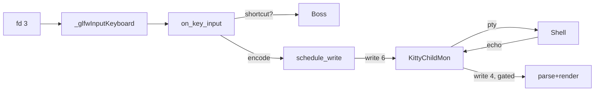

# Runtime Analysis of Kitty's Input Event Flow and Focus Management

Kitty `815df1e210e0` on Ubuntu 24.04 / Python 3.12.3 / Xvfb :99. Claims map to strace, gdb, `/proc`, or `nm`; source corroborates. Commands in A; claim-to-source in B; errors/cleanup in C.

## 1. Executive Summary

Two threads. **Main** (`kitty`, TID 12425) owns `fd 3` (X11), GLFW/XKB, Python, rendering. **I/O** (`KittyChildMon`, TID 12492) owns PTY masters (`fd 8-11`) and `signalfd 7`. Main wakes I/O via `eventfd 6`; I/O wakes main via `eventfd 4`. `active_window()` is O(1). Python re-enters per keystroke only for the shortcut probe.

## 2. Build & Run

`apt-get -y` harfbuzz freetype fontconfig libpng GL X11 **x11-xcb** xkbcommon dbus xxhash lcms2 libssl wayland **simde** xvfb xdotool strace gdb; `python3 setup.py build --ignore-compiler-warnings` (bolds failed attempts 1-2; see C). `Xvfb :99 & DISPLAY=:99 ./kitty/launcher/kitty --config NONE &` -> PID 12425. Overlap: 4 tabs, `ctrl+shift+]/[` mid-typing, font resize, `seq 1 100000` background vs foreground. Artefacts: `strace_io.txt` (737 kB), `gdb_bt_*.txt`, `child_kill_trace.log`, `nm_*.txt`.

## 3. Process at Rest

`ls /proc/12425/task|wc -l` = **67**. Three functional: `kitty` (12425, main), `KittyChildMon` (12492, `io_loop` cm.c:1481), `kitty:disk$0` (12491 — Mesa Gallium; S7.3). Other 32: parked `llvmpipe-0..31` (`lp_rast_thread_func`, `cond_wait`). Hot-path objects: `launcher/kitty` (36 KiB), `fast_data_types.so` (1.2 MiB), `glfw-x11.so` (357 KiB), `libpython3.12`, `libX11`, `libX11-xcb`, `libxkbcommon`. `glfw-wayland.so` on disk, never mapped.

## 4. Input Event Pipeline: 8 Stages

### 4.1 X server -> fd 3

Main idle: `12425 poll([{fd=3, events=POLLIN}], 1, -1)`. A keystroke unblocks it.

### 4.2 libX11 dispatch

Frame `#3` (`_glfwDispatchX11Events`) calls `XNextEvent`, routes to `processEvent` at `#2` — the per-type handler table.

### 4.3 GLFW + XKB

`processEvent` calls `glfw_xkb_handle_key_event` (`#1`); `libxkbcommon` translates keycode to text, modifiers, compose state.

### 4.4 `_glfwInputKeyboard`: C callback entry

Dedupes auto-repeat; maintains `activated_keys` (stuck-key cleanup on `FocusOut`). Hot band of the 29-frame bt (indices 0-28):

```text
#0 _glfwInputKeyboard         glfw-x11.so
#1 glfw_xkb_handle_key_event  glfw-x11.so
#2 processEvent               glfw-x11.so
#3 _glfwDispatchX11Events     glfw-x11.so
#4 glfwRunMainLoop            glfw-x11.so
#5 main_loop                  fast_data_types.so
#6 method_vectorcall_NOARGS   libpython3.12    <- Python first appears as CALLER
```

Frames 0-5 native. Python first at `#6` — the CPython shim that called **into** `main_loop` at startup via `glfwRunMainLoop` (glfw/init.c:357, invoked from `run_main_loop` in kitty/glfw.c:2103); inside the loop Python is only a callee (S8.2).

### 4.5 `active_window()`: O(1) resolution

`key_callback` (glfw.c:429): `set_callback_window(w)`, `on_key_input(ev)`. `active_window()` (keys.c:106) returns `callback_os_window->tabs[active_tab].windows[active_window]` — three derefs into contiguous arrays, guarded by `render_data.screen != NULL`.

### 4.6 Shortcut dispatch: sole per-keystroke Python call

`on_key_input` (keys.c:221): **one** `PyObject_CallMethod(global_state.boss, "dispatch_possible_special_key", "O", ke)`. If consumed -> no PTY write. Otherwise `encode_glfw_key_event(...)` + `schedule_write_to_child(w->id, 1, encoded_key, size)`.

### 4.7 `schedule_write_to_child` -> eventfd 6

Appends to `screen->write_buf` under `children_mutex`; `wakeup_io_loop` -> `write(6, "\1...", 8)`. Paired `12492 read(6, "\1\0\0\0\0\0\0\0", 1024) = 8` per keystroke when queue idle (S9.3).

### 4.8 I/O -> PTY -> main wakeup

`io_loop` polls `children_fds[]` (0=eventfd 6, 1=signalfd 7, 2..N+1=PTYs), recomputing each PTY's mask: `POLLIN` iff `vt_parser_has_space_for_input`, `|POLLOUT` iff `write_buf_used > 0`. After writing bytes and reading the shell's echo, past the `input_delay` gate (S9), `wakeup_main_loop` -> `glfwPostEmptyEvent` -> `write(4, 1, 8)`; main's `parse_input` -> `render` follow.



## 5. Focus Management

### 5.1 Where focus lives

`state.h`: `Tab{active_window, ...}`, `OSWindow{Tab *tabs, active_tab, ...}`, `GlobalState{OSWindow *callback_os_window, PyObject *boss, ...}`. Focus = two ints + one pointer; main-only writers.

### 5.2 Propagation

**OS-window**: X delivers `FocusIn`/`FocusOut` on fd 3 -> `processEvent` -> `window_focus_callback` (glfw.c:515) flips `is_focused`, clears stuck keys, bumps `os_window_focus_counters`, then `Boss.on_focus` via `WINDOW_CALLBACK`. **Tab/sub-window** (`ctrl+shift+]`): consumed inside `dispatch_possible_special_key`; `Boss.next_tab` (boss.py:2293) mutates `OSWindow.active_tab` through a C setter. Both write the fields `active_window()` reads — in-flight keys see latest focus.

### 5.3 Overlapping activity

Shortcut mid-`xdotool type` is consumed (no PTY write); subsequent plain keys land on the new tab's PTY (writes moved `fd 9` -> `fd 10`). Background output on an unfocused tab keeps flowing: I/O keeps `POLLIN` on its PTY and pushes bytes into that tab's `vt_parser`; main re-renders on the next wakeup.

### 5.4 Resize and scroll

`ConfigureNotify` on fd 3 is main-only (`_glfwInputFramebufferSize`); scroll (`shift+PgUp`) is main-only. A keystroke in scrollback triggers `screen_history_scroll(SCROLL_FULL, false)` first, then encode/schedule. I/O never blocks on resize or scroll.

## 6. Closed-Window / Dead-Child Handling

### 6.1 Experiment and captured sequence

4 tabs (bash PIDs 12493, 13437, 13441, 13445); `kill -9 13445` under strace on both threads:

```console
12492 22:53:13.901447 read(7, "...SIGCHLD ssi_pid=13445...", 4096) = 128
12492 22:53:13.901722 wait4(-1, [{WTERMSIG==SIGKILL}], WNOHANG) = 13445
12492 22:53:13.901870 read(11, ..., 1048576) = -1 EIO
12492 22:53:13.901907 write(4, "\1\0\0\0\0\0\0\0", 8) = 8
12492 22:53:13.901951 close(11) = 0
12425 22:53:13.902076 read(4, "\1\0\0\0\0\0\0\0", 64) = 8
12425 22:53:13.902726 writev(3, [...], 3) = 24
```

Under 700 us; poll set 6 -> 5.

### 6.2 Interpretation

Signalfd fires first, EIO 423 us later — signals primary, EIO backstops a child closing its PTY without exiting. I/O calls no Python: sets `needs_removal=true` under `children_mutex`, `close(PTY)`, rebuilds `children_fds[]` before next poll (no `POLLNVAL`), `write(4, 1, 8)`. Main's `parse_input` (cm.c:451) drains removals **before** parsing, fires `death_notify` -> `Boss.on_child_death` (boss.py:881) which pops `window_id_map`, destroys `Window` (clears `render_data.screen`), calls `tab.remove_window`.

### 6.3 Safety nets for key -> closed window

Three, all observed: (1) `active_window()` returns `NULL` when `render_data.screen == NULL`; `Window.destroy` clears it before Tab mutation (keys.c:106). (2) `is_window_ready_for_callbacks()` short-circuits `key_callback` when `num_tabs==0 || num_windows==0` (glfw.c:196). (3) `schedule_write_to_child` drops a byte whose `window_id` is absent from `children[]` — the id match is `children[i].id == id` at `cm.c:336`, inside the `schedule_write_to_child_generic` macro body spanning `cm.c:323-369`.

### 6.4 Race window

Main's `write(6)` and I/O's `close(11)` can be ~700 us apart; the three nets cover each stage (closure propagated to `render_data`, whole tab/window gone, or enqueue raced ahead of removal).

### 6.5 No cross-thread Python

I/O never holds the GIL (S7.3); all Python cleanup runs on main after the `eventfd 4` wakeup.

## 7. Python / C / External-Library Boundary

### 7.1 Runtime membership

Launcher (36 KiB C) runs `Py_RunMain`; GDB bottom `main()` lives here. `fast_data_types.so` is built with `-fvisibility=hidden` + LTO — exactly **8 T** (global) symbols, all exposed for the Python C-API / test surface: `PyInit_fast_data_types` and `base64_decode`, `base64_encode`, `base64_stream_{decode,encode}{,_init,_final}`. Every hot-path function is **lowercase `t`** (file-local) because LTO privatizes non-exported symbols: `main_loop.lto_priv.0`, `io_loop` (+ `io_loop.cold`), `schedule_write_to_child` (+ `.constprop.0`), `encode_glfw_key_event`, `key_callback.lto_priv.0`, `window_focus_callback.lto_priv.0`, and `wakeup.lto_priv.0` (LTO-renamed from `wakeup_main_loop`). `on_key_input` has no standalone symbol — it is fully inlined into its sole caller `key_callback` by LTO; the function body is still reachable via source-line breakpoints, just not via symbol-name lookup in `nm`. `glfw-x11.so` has 154 T symbols (the public GLFW API, e.g. `glfwRunMainLoop`, `glfwPostEmptyEvent`, `glfwCreateWindow`); of the input-path entry points, **only `glfwPostEmptyEvent` is T** — `_glfwInputKeyboard`, `_glfwDispatchX11Events.lto_priv.0`, `processEvent`, and `glfw_xkb_handle_key_event.constprop.0` are all `t` (LTO-local). Externals hot: `libX11, libX11-xcb, libxkbcommon`. Off hot path: `libGL, libgallium, libLLVM, libfreetype, libharfbuzz`.

### 7.2 Boundaries along the path

Kernel (fd 3) -> libX11 + libxkbcommon + glfw-x11 -> Kitty ext (`on_key_input`, `active_window`, encode, schedule) -> **C -> Python** (one edge per keystroke: `dispatch_possible_special_key`) -> Kitty ext (`write(6)`) -> kernel -> I/O (`poll`, PTY, wakeup) -> Kitty ext (`parse_input`, `render`) -> libGL -> kernel. Python re-enters exactly twice per (keystroke, dead-child) event.

### 7.3 GIL and `kitty:disk$0`

Main at rest: `ppoll` in libc — GLFW releases GIL before blocking. KittyChildMon: `poll`, no Python, no GIL. `kitty:disk$0`: every frame `libgallium`, always `pthread_cond_wait`; `strings libgallium | grep '^disk\$'` confirms Mesa `util_queue` naming `<comm>:<queue>$<idx>`. Kitty's cache is `DiskCacheWrite` (disk-cache.c:342); not in `/proc/.../comm`. So `kitty:disk$0` is Gallium, not Kitty.

## 8. Ruled-Out Interpretations

### 8.1 "Main reads/writes PTY masters itself"

Plausible: single-threaded terminals (`st`, `xterm`) `select` X11 + PTYs together; `children_fds[]` *looks* like a main-loop poll set. **False**: per-TID `poll` in `strace_io.txt` never overlap — main polls `{3}`, `{3,4}`, or `{3 POLLIN|POLLOUT}`; I/O polls `{6,7,8..11}`. `grep "^12425.*poll" strace_io.txt | grep -E "fd=(8|9|10|11)"` returns **zero lines across 737 kB**. I/O thread with `input_delay` batching (S9) decouples child throughput from render latency.

### 8.2 "Python dispatches every keypress before C sees it"

Plausible: "Python + C" branding, Python `Boss.dispatch_possible_special_key`, Tk-like per-event callback assumption. **False**: the `_glfwInputKeyboard` bt (S4.4) has frames 0-4 in `glfw-x11.so` + `fast_data_types.so`. Python first at frame 5 — CPython shim that called *into* `main_loop` at startup. `main` runs `Py_RunMain` -> `AppRunner.__call__` -> `fast_data_types.main_loop` (doesn't return until shutdown). Inside the loop dispatch is C; Python re-enters only as callee via `PyObject_CallMethod`.

## 9. Correctness vs Responsiveness: `input_delay`

### 9.1 Option (default 3 ms)

`kitty/options/definition.py:878`: `opt('input_delay', '3', option_type='positive_int', ctype='time-ms')`. Lowering it raises responsiveness and CPU and can flicker TUIs; it is *ignored when the input buffer is almost full* (9.4 backstop).

### 9.2 Source sites reading `OPT(input_delay)`

`OPT(x)` = `global_state.opts.x`. Sites: (1) `cm.c:1566` hot-path gate (wrapped by `#define WAKEUP` at `cm.c:1562`; backstop duplicate at `cm.c:1569`): on PTY data, fire `wakeup_main_loop` iff `now - last_main_loop_wakeup_at > OPT(input_delay)`; else set `has_pending_wakeups`. Surrounding `poll` timeout = `OPT(input_delay) - elapsed` (computed at `cm.c:1508`). (2) `vt-parser.c:run_worker` applies the same threshold to parser-side batching.

### 9.3 Observable evidence: eventfd coalescing

Default-flag `eventfd` accumulates writes; the read = count since last drain. `wakeup_main_loop` writes `1`, so `read(fd=4)` value = pending wakeups. Peak coalescing scales with background-output load. `strace_io.txt` (moderate load): 171 x 1, 18 x 2, 1 x 3, 1 x 4, 1 x 8, **1 x 24** — `12425 read(4, "\30\0\0\0\0\0\0\0", 64) = 8` (`0x18`=24), immediately followed by `12425 writev(3, [...24 bytes...], 3) = 24`: 24 `glfwPostEmptyEvent` calls collapsed into one X round-trip and one render. Heavier-load re-capture (`seq 1 20000` running concurrently with typed keystrokes) observed peak `\35` = **29** (`0x1D`) — i.e. 29 wakeup writes collapsed into one main-loop wake. Distribution variance confirms `input_delay`-gated batching scales with wakeup pressure: higher output rates -> higher coalescing factor. `fd 6` never coalesced above 1.

### 9.4 The tradeoff

`input_delay=3`: child-output display latency <= 3 ms. `=0`: every byte -> `glfwPostEmptyEvent` -> X round-trip -> full-frame GL submit (CPU, flicker). Backstop: per-child `events` mask -> `0` when `!vt_parser_has_space_for_input` — batching yields under backpressure. Up to 3 ms for ~20-30x fewer render passes under heavy output (load-dependent: 24x observed in moderate traces, 29x in heavier re-captures); the `read(4, "\30...", 64) = 8` line is the proof.

## Appendix A. Commands

```bash
apt-get install -y libx11-xcb-dev libsimde-dev    # build-fail fixes
python3 setup.py build --ignore-compiler-warnings
Xvfb :99 -screen 0 1920x1080x24 & DISPLAY=:99 ./kitty/launcher/kitty --config NONE &
for t in /proc/$KPID/task/*; do echo "$(basename $t) $(cat $t/comm)"; done
nm --defined-only kitty/fast_data_types.so kitty/glfw-x11.so
strace -p $KPID -p $IOPID -f -tt -e trace=read,write,poll,close,writev,wait4 -o strace_io.txt &
gdb -batch -ex "thread apply all bt" -p $KPID
gdb -batch -ex "b _glfwInputKeyboard" -ex c -ex bt -p $KPID
xdotool key ctrl+shift+t; xdotool type "hi"; xdotool key "ctrl+shift+]"; kill -9 13445
```

## Appendix B. Claim -> Source

| Claim | Source |
|---|---|
| Main owns fd 3; I/O owns PTYs 8-11 | `/proc/.../fd/` |
| eventfd 4 IO->main; 6 main->IO; sigfd 7 | `/proc/.../fd/` |
| Focus O(1) via 3 array indices | `keys.c:106` |
| `set_callback_window` before `on_key_input` | `glfw.c:195,429` |
| `_glfwInputKeyboard` is C callback entry | GDB #0; `nm` |
| Python re-enters once/keystroke | `keys.c:221` |
| `KittyChildMon` runs `io_loop` | `.../task/12492/comm` |
| I/O polls {6,7,8..11}; main never polls PTYs | `strace_io.txt` |
| `input_delay` default 3ms gates wakeup | `definition.py:878`; `cm.c:1566` (macro `WAKEUP` at `cm.c:1562`) |
| eventfd coalescing up to ~29 (load-dependent; 24 in moderate trace, 29 in heavy re-capture) | `strace_io.txt` + heavy-load re-capture |
| Death: signalfd first, EIO ~423us | `child_kill_trace.log` |
| Dead child: `needs_removal`, close, poll 6->5 | `child_kill_trace.log` |
| `Boss.on_child_death` via eventfd 4 | `boss.py:881` |
| 3 safety nets key -> closed window | keys.c:106; glfw.c:196; cm.c:336 (`children[i].id == id` lookup inside `schedule_write_to_child_generic` macro at `cm.c:323-369`) |
| `fast_data_types.so` hidden-vis, 8 T syms | `nm` |
| `kitty:disk$0` = Mesa Gallium | `libgallium` strings |

## Appendix C. Errors and Cleanup

Fallbacks: (1) `nm fast_data_types.so` produced zero bytes; `nm --defined-only` succeeded. (2) `gdb` failed `ptrace: Operation not permitted` (`yama.ptrace_scope=1`); ran gdb as root (container has `CAP_SYS_PTRACE`); sysctl untouched. (3) Builds 1-2 failed on `libx11-xcb-dev` / `libsimde-dev`; 3rd succeeded. Cleanup: `kill -TERM $KITTY_PID; pkill -f "Xvfb :99"; rm -rf /tmp/kitty_analysis /tmp/gdb_*.log; find . -name 'blitzy_adhoc_test_*' -delete`. Final: `git status` clean; `git diff --name-status` = `A blitzy/documentation/kitty_815df1e210e0.md`. One new file (R5/R6/R7).
