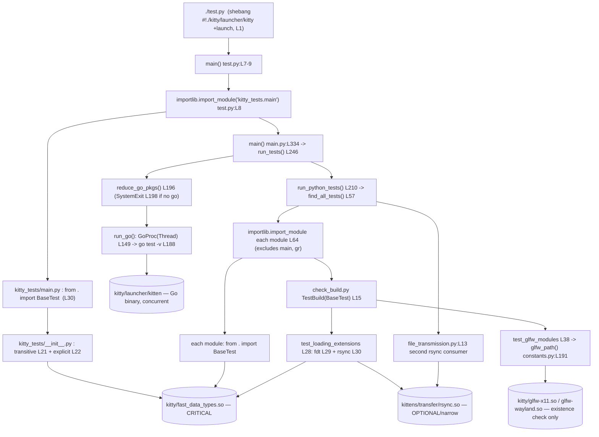

# How kitty's compiled C extensions relate to and drive its test-execution flow

> **Investigation target:** the `kitty` terminal emulator at commit **`815df1e21`** ("Wire up applying of font config"), branch **`kitty_815df1e210e0`**.
> **Methodology:** run‑first. The canonical build (`python3 setup.py build`) and the canonical test entry point (`./test.py`) were executed and their **verbatim, unedited output** is embedded below as the primary source of truth. Every behavioral claim is paired with the exact command that produced it, the real output, and a `file:line` reference into the source. Counts were confirmed stable across ≥2 consecutive runs. The repository itself was **not modified** — the `.so`/launcher artifacts the build produces are gitignored, so `git status --porcelain` stays empty apart from this document.
> **Toolchain observed:** Python 3.12.3 / Go 1.22.2 / gcc 13.3.0, Linux, environment variable `CI` **unset**.

---

## 1. TL;DR — the direct answer

kitty's test suite is a **hybrid** runner: Python `unittest` tests run sequentially in the main thread while the Go `testing` packages run concurrently in a background thread. The Python half is **bound at import time to one compiled C extension — `kitty/fast_data_types.so`** — through the base class `BaseTest` in `kitty_tests/__init__.py` (`from kitty.fast_data_types import …` at `kitty_tests/__init__.py:L22`, plus a transitive pull at `L21`). Because 23 of the 25 test modules do `from . import BaseTest`, that one extension is a **hard, whole‑suite prerequisite**.

The consequence, observed directly, is **two sharply different failure modes**:

- **Missing *critical* extension → whole‑run hard abort.** With `kitty/fast_data_types.so` removed, `./test.py` dies with a `ModuleNotFoundError` at *collection time* (while importing `kitty_tests.main`), **before a single test executes** — there is no `Ran N tests` line at all.
- **Missing *narrow / platform* artifact → single failing test.** With the Wayland GLFW backend (`kitty/glfw-wayland.so`) not built, only `test_glfw_modules` fails its own assertion; the other 144 tests still run.

Of kitty's three compiled Python `.so` extensions, **only `fast_data_types.so` and `rsync.so` are actually imported as Python modules** during a run; **`glfw-x11.so` is present on disk but is *not* imported as a Python module** (a GLFW backend is `dlopen`‑ed by C at window creation, which never happens in the headless test run). The canonical run reports **`Ran 145 tests`**, **`FAILED (failures=3, skipped=6)`**, **`All Go tests succeeded`**, and exits with code **1** — figures that were identical across runs.

The rest of this document proves and unpacks each of those statements, then answers the eight decomposed questions explicitly in §12.

---

## 2. Environment & canonical commands

| Item | Value |
|---|---|
| Repository commit | `815df1e21` ("Wire up applying of font config") |
| Branch | `kitty_815df1e210e0` |
| Python | 3.12.3 (repo floor: `requires-python = ">=3.8"` — `pyproject.toml:L2`) |
| Go | 1.22.2 (repo floor: `go 1.22` — `go.mod:L3`) |
| C compiler | gcc 13.3.0 (build defaults to `-pedantic-errors -Werror`, compiles cleanly) |
| OS | Linux |
| `CI` env var | **unset** → the run header prints `Running under CI: False` |

**Canonical build command** (run from the repository root):

```
python3 setup.py build
```

`setup.py` is a custom, multi‑hundred‑line build orchestrator; the `build` action is dispatched at `setup.py:L2115-2121`, which calls `build()` (`setup.py:L1084`), then `build_launcher()` (`setup.py:L1230`) and `build_static_kittens()` (`setup.py:L1130`). `Makefile` simply wraps it: `all:` → `python3 setup.py …` (`Makefile:L12-13`), `test:` → `python3 setup.py … test` (`Makefile:L15-16`).

**Canonical test command** (run from the repository root):

```
./test.py
```

`test.py`'s shebang is `#!./kitty/launcher/kitty +launch` (`test.py:L1`), i.e. the freshly built **C launcher** re‑executes the script under kitty's embedded Python; `main()` then does `importlib.import_module('kitty_tests.main')` (`test.py:L8`) and calls its `main()` (`test.py:L7-9`). The `setup.py test` action reaches the same place via `os.execl(texe, texe, '+launch', 'test.py')` (`setup.py:L2101-2103`). Both are the *canonical* entry point; no bypassing/fallback interface was used.

> **Note on paths in the captured output.** The tracebacks below show `.../` in place of the working‑copy root (the absolute root during capture was `/tmp/blitzy/kitty/kitty_815df1e210e0_77c5cb/`). Only the leading path is abbreviated; the error text itself is unedited.

---

## 3. Canonical build — command and verbatim result

```
python3 setup.py build
```

### 3.1 Build‑before‑observe: the first attempt failed (exit code 1)

The `.so` artifacts are **gitignored build products** and are absent from a clean checkout, so the suite cannot import them until the build succeeds. On a machine lacking the OpenSSL development package, the very first build attempt failed — `libcrypto_flags()` (`setup.py:L253`) calls `pkg_config('libcrypto', …)` **fatally** at `setup.py:L274-275`:

```
Package libcrypto was not found in the pkg-config search path.
Perhaps you should add the directory containing `libcrypto.pc'
to the PKG_CONFIG_PATH environment variable
Package 'libcrypto', required by 'virtual:world', not found
The package libcrypto was not found on your system
```

Installing `libssl-dev` cleared this. Two further **environment‑provisioning** steps were needed (these are host toolchain installs, **not** repository changes): `libx11-xcb-dev` for the GLFW X11 backend's `x11-xcb` probe (`glfw/glfw.py:L172` lists `… x11-xcb …` among the X11 deps), and `libsimde-dev` for the `simde/x86/avx2.h` header used by `kitty/simd-string-*.c`. The `simde` pkg‑config probe is **non‑fatal** (`setup.py:L615`, `fatal=False`), so its absence surfaced only at compile time, not as a pkg‑config error.

### 3.2 The successful build (exit code 0, ~50s) — head + link phase

```
Package wayland-protocols was not found in the pkg-config search path.
Perhaps you should add the directory containing `wayland-protocols.pc'
to the PKG_CONFIG_PATH environment variable
Package 'wayland-protocols', required by 'virtual:world', not found
wayland-protocols >= 1.17 is required, found version: not found
Disabling building of wayland backend
[1/2] Compiling kitty/simd-string-128.c ...
[2/2] Compiling kitty/simd-string-256.c ...
 done
[1/4] Linking kitty/fast_data_types ...
[2/4] Linking [x11] kitty/glfw-x11 ...
[3/4] Linking kittens/transfer/rsync ...
[4/4] Linking launcher ...
```

(The above is followed by the Go build of the `kitten` binary and its kitten/tool packages.)

**Cause → effect.** `compile_glfw()` (`setup.py:L932`) sets `modules = 'cocoa' if is_macos else 'x11 wayland'` (`setup.py:L933`). For each Linux backend it initializes the GLFW build environment; when the **Wayland** backend's probe raises `SystemExit` (missing `wayland-protocols` / Wayland dev libs), the `except SystemExit` handler checks `if module != 'wayland': raise`, otherwise prints `Disabling building of wayland backend` and `continue`s (`setup.py:L936-951`). The X11 backend is then linked normally via `compile_c_extension(genv, f'kitty/glfw-{module}', …)` (`setup.py:L952-953`). **Net result:** the canonical Linux build **succeeds** but emits **only `kitty/glfw-x11.so`** — `kitty/glfw-wayland.so` is never produced. This deliberate, observed artifact miss is what later surfaces the `test_glfw_modules` failure (§10.1). It is *evidence to explain*, not a defect to repair.

The four linked C artifacts correspond one‑to‑one to the four kinds of native build product: the primary extension `kitty/fast_data_types` (compiled at `setup.py:L1091`), the GLFW backend(s) (`setup.py:L953`), the rsync extension (`files('transfer', 'rsync', …)` at `setup.py:L986`), and the C launcher. The Go `kitten` binary is built separately via `go build -v` (`setup.py:L1148`).

---

## 4. Artifact inventory (produced by the successful build; all gitignored)

The successful build produced five artifacts and — deliberately — omitted a sixth:

| Artifact | Size (bytes) | Role | Imported as a Python module during tests? |
|---|---|---|---|
| `kitty/fast_data_types.so` | 1,213,072 | Primary CPython C extension — **CRITICAL** | **YES** |
| `kitty/glfw-x11.so` | 357,592 | GLFW X11 windowing backend — platform‑gated | **NO** (`dlopen`‑ed by C at window creation) |
| `kittens/transfer/rsync.so` | 55,056 | rsync delta extension — **OPTIONAL / narrow** | **YES** |
| `kitty/launcher/kitty` | 36,224 | C launcher (runs `./test.py` via `+launch`) | n/a (executable) |
| `kitty/launcher/kitten` | 15,757,572 | Go `kitten` binary (Go test target) | n/a (executable) |
| `kitty/glfw-wayland.so` | — | **ABSENT** (Wayland backend disabled at build time) | — |

**`git status --porcelain` is empty after the build.** Every artifact matches a `.gitignore` rule — `*.so` (`.gitignore:L1`) and `/kitty/launcher/kitt*` (`.gitignore:L18`) — so the tracked tree is byte‑for‑byte unchanged. Building is a **prerequisite that leaves the repository unmodified**: the artifacts are runtime products of the investigation, not repository changes.

---

## 5. Canonical test run — command, header, summary (two‑run stable)

```
./test.py
```

### 5.1 Run header (confirms the canonical local configuration)

```
Running under CI: False
Go packages being tested: tools/cmd/at tools/simdstring tools/cli tools/utils/shlex tools/utils/shm tools/tui/sgr tools/tui/shell_integration kittens/diff tools/themes kittens/ssh kittens/transfer tools/utils/style tools/unicode_names kittens/hyperlinked_grep tools/tui/readline tools/tui/subseq tools/tui/loop tools/utils/humanize kittens/hints tools/rsync tools/utils tools/utils/base85 tools/tui/graphics tools/tui tools/wcswidth tools/config
```

`Running under CI: False` is printed by `env_for_python_tests()` from `BaseTest.is_ci`, which is `os.environ.get('CI') == 'true'` (`kitty_tests/__init__.py:L212`). With `CI` unset locally, `is_ci` is `False` — a fact that directly changes what `test_glfw_modules` requires (see §10.1).

### 5.2 Summary tail — identical across two runs, exit code 1

```
----------------------------------------------------------------------
Ran 145 tests in 13.416s

FAILED (failures=3, skipped=6)
All Go tests succeeded, ran in 13.9 seconds
Error: Some tests failed!
```

**Two‑run stability:** a second consecutive `./test.py` printed `Ran 145 tests in 7.616s` / `FAILED (failures=3, skipped=6)` / `All Go tests succeeded, ran in 7.7 seconds`; a third run also exited 1. **`145` tests / `failures=3` / `skipped=6` is stable across runs — only the wall‑clock time differs.**

Where each line comes from:
- `Ran N tests …` and `FAILED (…)` are produced by `unittest.TextTestRunner` inside `run_cli()` (`kitty_tests/main.py:L114`).
- `All Go tests succeeded, ran in %.1f seconds` is printed at `kitty_tests/main.py:L216` (only when `go_proc.returncode == 0` **and** there were Python tests to run).
- `Error: Some tests failed!` is printed at `kitty_tests/main.py:L242`.
- The process then ends via `raise SystemExit(exit_code)` at `kitty_tests/main.py:L243`; because three Python tests failed, `exit_code` is 1.

### 5.3 The 6 skipped tests (verbatim reasons)

```
test_ca_certificates (kitty_tests.check_build.TestBuild.test_ca_certificates) ... skipped 'CA certificates are only tested on frozen builds'
test_fallback_font_not_last_resort (kitty_tests.fonts.Rendering.test_fallback_font_not_last_resort) ... skipped 'Only macOS has a Last Resort font'
test_fish_integration (kitty_tests.shell_integration.ShellIntegration.test_fish_integration) ... skipped 'fish not installed'
test_zsh_integration (kitty_tests.shell_integration.ShellIntegration.test_zsh_integration) ... skipped 'zsh not installed'
test_fish_integration (kitty_tests.shell_integration.ShellIntegrationWithKitten.test_fish_integration) ... skipped 'fish not installed'
test_zsh_integration (kitty_tests.shell_integration.ShellIntegrationWithKitten.test_zsh_integration) ... skipped 'zsh not installed'
```

None of the six skips is caused by a missing compiled extension: one is frozen‑build‑only (`test_ca_certificates`, `check_build.py:L74`), one is macOS‑only (`test_fallback_font_not_last_resort`), and four are missing shell interpreters (`fish`/`zsh`). They are environmental, not native‑artifact, conditions.

### 5.4 `check_build` per‑test status — proof the extensions load

```
test_all_kitten_names (kitty_tests.check_build.TestBuild.test_all_kitten_names) ... ok
test_exe (kitty_tests.check_build.TestBuild.test_exe) ... ok
test_glfw_modules (kitty_tests.check_build.TestBuild.test_glfw_modules) ... FAIL
test_launcher_ensures_stdio (kitty_tests.check_build.TestBuild.test_launcher_ensures_stdio) ... ok
test_loading_extensions (kitty_tests.check_build.TestBuild.test_loading_extensions) ... ok
test_loading_shaders (kitty_tests.check_build.TestBuild.test_loading_shaders) ... ok
```

**Key point:** `test_loading_extensions` (`kitty_tests/check_build.py:L28`) performs `import kitty.fast_data_types as fdt` (`L29`) **and** `from kittens.transfer import rsync` (`L30`) and reports **`ok`** — so **both** `fast_data_types.so` and `rsync.so` load successfully in this run. Among the build‑verification tests, **only `test_glfw_modules` fails**, and it fails on a *file‑existence* check, not an import (§10.1).

---

## 6. Import‑chain trace — from the entry point down to each native module

The chain below is the **actually‑observed** sequence of imports established during `./test.py`, with the `file:line` where each hop occurs and the native artifact it ultimately resolves to.



Stated as prose (each arrow is a real import/call observed at runtime):

1. **Entry point.** `./test.py` (shebang `#!./kitty/launcher/kitty +launch`, `test.py:L1`) runs under the C launcher; `main()` (`test.py:L7-9`) calls `importlib.import_module('kitty_tests.main')` (`test.py:L8`).
2. **Runner import binds the critical extension immediately.** Importing `kitty_tests.main` executes its top‑level `from . import BaseTest` (`kitty_tests/main.py:L30`), which runs `kitty_tests/__init__.py`. That module pulls in `fast_data_types` **transitively** at `L21` (`from kitty.config import …` → `kitty/config.py:L10` → `kitty/conf/utils.py:L27` `from ..fast_data_types import Color`) **and explicitly** at `L22` (`from kitty.fast_data_types import Cursor, HistoryBuf, LineBuf, Screen, get_options, monotonic, set_options`) → **`kitty/fast_data_types.so`**. This is the point at which the whole suite becomes dependent on the extension — it happens *before any test runs*.
3. **Go tests start concurrently.** `main()` (`kitty_tests/main.py:L334`) → `run_tests()` (`L246`) → `reduce_go_pkgs()` (`L196`; it `raise SystemExit('go executable not found …')` at `L198` if `go` is absent) → `run_go()` launches a `GoProc(Thread)` (`L149`) running `go test -v` (`L188`), which exercises **`kitty/launcher/kitten`** and the Go packages listed in the run header — concurrently with the Python tests.
4. **Python collection re‑touches the extension per module.** `run_python_tests()` (`L210`) → `find_all_tests()` (`L57`) imports **every** `kitty_tests/*.py` via `importlib.import_module()` (`L64`, with `excludes=('main', 'gr')`) and `unittest.defaultTestLoader.loadTestsFromModule` (`L65`). Each imported module does `from . import BaseTest`, re‑resolving **`fast_data_types.so`** (already cached in `sys.modules`).
5. **The build‑verification bridge loads the narrow extensions.** `check_build.py` (`class TestBuild(BaseTest)`, `L15`) → `test_loading_extensions` (`L28`) imports **`fast_data_types.so`** (`L29`) and **`rsync.so`** (`L30`); `test_glfw_modules` (`L38`) resolves GLFW backend paths via `glfw_path()` (`kitty/constants.py:L191`) → **`kitty/glfw-x11.so` / `kitty/glfw-wayland.so`** — but this is an **existence/permission check only** (`os.path.isfile` at `check_build.py:L46`, `os.access(..., os.X_OK)` at `L47`), never a `dlopen`/import.
6. **The second rsync consumer.** `kitty_tests/file_transmission.py:L13` does `from kittens.transfer.rsync import Differ, Hasher, Patcher, parse_ftc` → **`rsync.so`**.

### 6.1 Loaded (imported) vs merely present‑on‑disk

A throwaway harness (created outside the tracked tree and since removed) ran the runner's real `find_all_tests()` — which imports every test module — and then inspected `sys.modules`:

```
=== Native (.so-backed) Python modules loaded after full test collection ===
  kittens.transfer.rsync    -> kittens/transfer/rsync.so
  kitty.fast_data_types     -> kitty/fast_data_types.so
  (plus stdlib/3rd-party: PIL._imaging, _bz2, _ctypes, _hashlib, _json, _lzma, mmap, termios)

=== Built .so artifacts: LOADED (python import) vs PRESENT-ON-DISK ===
  kitty/fast_data_types.so    on_disk=True  loaded_as_python_module=True
  kittens/transfer/rsync.so   on_disk=True  loaded_as_python_module=True
  kitty/glfw-x11.so           on_disk=True  loaded_as_python_module=False  (GLFW backend: dlopened by C at window creation, not a python import)

kitty.fast_data_types.__file__ = .../kitty/fast_data_types.so
```

**Direct answer.** Of kitty's three compiled `.so` extensions, **`fast_data_types.so` and `rsync.so` are actually imported as Python modules during the run; `glfw-x11.so` is present on disk but is NOT imported as a Python module.** The headless test run never creates a window, so the GLFW backend is never `dlopen`‑ed; `test_glfw_modules` only *stats* the file path. `kitty.fast_data_types.__file__` resolves to the on‑disk `.so`, confirming the import binds to the compiled artifact (not a pure‑Python fallback). The Go `kitten` binary is exercised separately by the concurrent Go test process, not as a Python import.

---

## 7. Extension → test‑category map

Each compiled artifact connects to specific categories of tests. The named categories from the question — **build‑verification, datatypes, fonts, transfer** — are all covered explicitly.

| Compiled artifact | How it is consumed | Test category / concrete tests | Criticality |
|---|---|---|---|
| `kitty/fast_data_types.so` | `import` in `BaseTest` (`kitty_tests/__init__.py:L22`, plus transitive `L21`); **16** test modules import it directly; **23/25** modules do `from . import BaseTest` | Nearly **all** categories: **datatypes** (`kitty_tests/datatypes.py`), **fonts** (`kitty_tests/fonts.py`), plus `screen`, `parser`, `keys`, `mouse`, `graphics`, `options`, `shm`, `ssh`, `crypto`, `shell_integration`, `utmp`, and **build‑verification** (`check_build.py:L29`) | **CRITICAL** |
| `kittens/transfer/rsync.so` | `from kittens.transfer import rsync` (`check_build.py:L30`) and `from kittens.transfer.rsync import Differ, Hasher, Patcher, parse_ftc` (`file_transmission.py:L13`) | **build‑verification** (`test_loading_extensions`) + **transfer** (`file_transmission.py`) — only **2** modules | **OPTIONAL / narrow** |
| `kitty/glfw-x11.so`, `kitty/glfw-wayland.so` | existence/exec check via `glfw_path()` inside `test_glfw_modules` (`check_build.py:L38-47`); the required backend set is gated by `BaseTest.is_ci` | **build‑verification only** | **PLATFORM‑GATED** |
| `kitty/launcher/kitten` (Go) | concurrent `go test -v` from the `GoProc` thread (`kitty_tests/main.py:L149`, `L188`) | all Go packages (`All Go tests succeeded`) | build/runtime — **separate Go layer** |

**Category detail:**

- **build‑verification** (`kitty_tests/check_build.py`, `class TestBuild(BaseTest)` at `L15`) is the explicit build↔test *bridge* and touches every native artifact: `test_loading_extensions` (`L28`) imports `fast_data_types` (`L29`) and `rsync` (`L30`); `test_loading_shaders` (`L33`) loads GLSL via `from kitty.shaders import Program` (`L34`); `test_glfw_modules` (`L38`) checks the GLFW backend files; `test_exe` (`L17`) validates the built `kitty`/`kitten` executables. Its 9 tests are enumerated in the appendix (§13).
- **datatypes** (`kitty_tests/datatypes.py`) imports `fast_data_types` directly — it exercises the native `LineBuf`/`HistoryBuf`/`Cursor` data structures, so it cannot even be collected without the extension.
- **fonts** (`kitty_tests/fonts.py`) imports `fast_data_types` directly — font rasterization/shaping types live in the extension. (One fonts test, `test_fallback_font_not_last_resort`, skips as macOS‑only, see §5.3.)
- **transfer** (`kitty_tests/file_transmission.py`) is the sole non‑build‑verification consumer of `rsync.so` (`L13`); it is also the source of failures #2/#3 (§10.2), which are *environmental*, not extension‑availability, failures.

---

## 8. Critical vs optional/narrow vs platform‑gated — code‑grounded classification

The classification follows directly from **where each native import sits in the import chain** and **how many consumers it has**. All counts were verified by enumeration at runtime.

**Enumeration (verified via `grep` over the source at `815df1e21`):**

| Metric | Count |
|---|---|
| Total `kitty_tests/*.py` modules | **25** |
| Test modules importing `fast_data_types` **directly** | **16** (`__init__`, `check_build`, `crypto`, `datatypes`, `fonts`, `graphics`, `keys`, `main`, `mouse`, `options`, `parser`, `screen`, `shell_integration`, `shm`, `ssh`, `utmp`) |
| Test modules importing `BaseTest` (⇒ transitively require `fast_data_types`) | **23** |
| Test modules importing `rsync` | **2** (`check_build`, `file_transmission`) |
| `kitty/*.py` modules importing `fast_data_types` | **28** |

- **CRITICAL — `kitty/fast_data_types.so`.** Because `BaseTest` imports it at module top level (`kitty_tests/__init__.py:L22`), **every** module doing `from . import BaseTest` (23 of 25) transitively requires it; 16 modules also import it directly, and 28 `kitty/*.py` modules depend on it. If it fails to import, collection aborts the **entire** suite (demonstrated in §10.3). "Critical" here means *required for the suite to run at all*.
- **OPTIONAL / narrow — `kittens/transfer/rsync.so`.** Imported by exactly **2** test modules (`check_build.py`, `file_transmission.py`). If it were missing, only those two modules' collection would break — a *narrow* blast radius, not a whole‑suite abort. "Optional/narrow" means *used by only a few tests*.
- **PLATFORM‑GATED — the GLFW backends (`glfw-x11.so`, `glfw-wayland.so`).** Consumed by a single test (`test_glfw_modules`), and only via a *file‑existence* check. The **required set depends on `BaseTest.is_ci`** (`kitty_tests/__init__.py:L212`): `linux_backends = ['x11']`, then `if not self.is_ci: linux_backends.append('wayland')` (`check_build.py:L40-42`). So with `CI` unset (canonical local run), both `x11` **and** `wayland` are required; under CI, only `x11`.

---

## 9. The three observed failures, classified

The canonical run's `FAILED (failures=3, …)` decomposes into **one artifact‑availability failure and two environmental failures**. Only the first is about a compiled extension.

| # | Test | Root cause | Extension‑related? |
|---|---|---|---|
| 1 | `test_glfw_modules` | `kitty/glfw-wayland.so` was not built (Wayland backend disabled) | **YES** — a direct artifact→test cascade (mode a) |
| 2 | `test_transfer_receive` | directory `st_mode` differs by the setgid bit (`0o42755` vs `0o40755`) | **NO** — filesystem/environment; `rsync.so` loaded fine |
| 3 | `test_transfer_send` | same setgid‑bit `st_mode` diff | **NO** — filesystem/environment; `rsync.so` loaded fine |

---

## 10. The two failure‑cascade modes (contrasted with real output)

### 10.1 Mode (a) — a missing narrow/platform artifact fails only its own test

**Failure #1, `test_glfw_modules`, verbatim:**

```
FAIL: test_glfw_modules (kitty_tests.check_build.TestBuild.test_glfw_modules)
----------------------------------------------------------------------
Traceback (most recent call last):
  File ".../kitty_tests/check_build.py", line 46, in test_glfw_modules
    self.assertTrue(os.path.isfile(path), f'{path} is not a file')
    glfw_path = <function glfw_path at 0x...>
    is_macos = False
    linux_backends = ['x11', 'wayland']
    modules = ['x11', 'wayland']
    name = 'wayland'
    path = '.../kitty/glfw-wayland.so'
    self = <kitty_tests.check_build.TestBuild testMethod=test_glfw_modules>
AssertionError: False is not true : .../kitty/glfw-wayland.so is not a file
```

**Cause → effect.** With `CI` unset, `BaseTest.is_ci` is `False` (`kitty_tests/__init__.py:L212`), so `test_glfw_modules` appends `'wayland'` to the required backends (`check_build.py:L40-42`: `linux_backends = ['x11']`; `if not self.is_ci: linux_backends.append('wayland')`). For each backend it computes `path = glfw_path(name)` (`check_build.py:L45`). `glfw_path()` (`kitty/constants.py:L191`) returns `os.path.join(extensions_dir, f'{prefix}glfw-{module}.so')`, and for a non‑frozen build `extensions_dir` is the `kitty/` directory (`kitty/constants.py:L62`); the assertion `self.assertTrue(os.path.isfile(path), …)` is at `check_build.py:L46`. Because the build **disabled the Wayland backend** (§3.2), `kitty/glfw-wayland.so` does not exist → the assertion fails **for that one test only**. The other 144 tests still run to completion. This is a direct **artifact→test cascade confined to a single test** — the local variables in the traceback (`linux_backends = ['x11', 'wayland']`, `name = 'wayland'`, `path = '.../kitty/glfw-wayland.so'`) pinpoint exactly which backend and path triggered it.

### 10.2 Failures #2 & #3 — `test_transfer_receive` / `test_transfer_send` are NOT extension failures

Both fail at `self.assertEqual(expected, actual)` (`kitty_tests/file_transmission.py:L432`), reached via `test_transfer_receive` (`L474`) / `test_transfer_send` (`L506`) → `basic_transfer_tests` → `multiple_files`. The directory mode is captured by `oct(st.st_mode)` (`file_transmission.py:L389`). The diff:

```
-  'empty': Entry(relpath='empty', mtime=0, mode='0o42755', nlink=2),
+  'empty': Entry(relpath='empty', mtime=0, mode='0o40755', nlink=2),
-  'sub': Entry(relpath='sub', mtime=0, mode='0o42755', nlink=2),
+  'sub': Entry(relpath='sub', mtime=0, mode='0o40755', nlink=2),
```

**Cause → effect.** `0o42755` and `0o40755` differ only in the **setgid bit** (`0o2000` = `S_ISGID`; note `0o42755 == 0o40755 | 0o2000`). The test's working directory carries the setgid bit (inherited from the environment), so directories created for the expected model inherit setgid → `0o42755`, but the rsync transfer recreates them **without** setgid → `0o40755`. **This is an environmental/filesystem condition, not an extension‑availability failure** — `rsync.so` loaded fine, proven by `test_loading_extensions` reporting `ok` (§5.4). Two of the three failures are therefore unrelated to whether any `.so` is present.

### 10.3 Mode (b) — a missing *critical* extension aborts the whole run at collection time

**Method (repo‑safe):** the gitignored `kitty/fast_data_types.so` was temporarily moved aside (with a backup + sha256 verification) and `./test.py` re‑run, then restored identically (git stayed clean). **Result — exit code 1, ZERO tests run (no `Ran N tests` line at all), just a traceback:**

```
Traceback (most recent call last):
  File "<frozen runpy>", line 198, in _run_module_as_main
  ...
  File "./test.py", line 13, in <module>
    main()
  File "./test.py", line 8, in main
    m = importlib.import_module('kitty_tests.main')
  ...
  File ".../kitty_tests/__init__.py", line 21, in <module>
    from kitty.config import finalize_keys, finalize_mouse_mappings
  File ".../kitty/config.py", line 10, in <module>
    from .conf.utils import BadLine, parse_config_base
  File ".../kitty/conf/utils.py", line 27, in <module>
    from ..fast_data_types import Color
ModuleNotFoundError: No module named 'kitty.fast_data_types'
```

**Cause → effect.** `kitty_tests/__init__.py` cannot be imported without `fast_data_types`: it pulls the extension in **transitively** at `L21` (`from kitty.config import …` → `kitty/config.py:L10` → `kitty/conf/utils.py:L27` `from ..fast_data_types import Color`) and **explicitly** at `L22` (`from kitty.fast_data_types import Cursor, HistoryBuf, LineBuf, Screen, get_options, monotonic, set_options`). So `./test.py`'s `importlib.import_module('kitty_tests.main')` (`test.py:L8`) fails at **collection time** — the failure happens while importing the runner package's `BaseTest`, *before* the runner's `main()` ever executes. The **entire run aborts before a single test executes** — the polar opposite of the single‑test glfw failure in §10.1.

**Side‑by‑side contrast:**

| | Mode (a): missing `glfw-wayland.so` | Mode (b): missing `fast_data_types.so` |
|---|---|---|
| What is missing | narrow, platform‑gated backend | the critical primary extension |
| Where it surfaces | inside one test body (`os.path.isfile`) | at import/collection time (`from . import BaseTest`) |
| Symptom | `FAIL: test_glfw_modules` (1 failure) | `ModuleNotFoundError`, traceback only |
| Rest of suite | **144 other tests still run** | **0 tests run** — no `Ran N tests` line |
| Exit code | 1 | 1 |

### 10.4 Faithful nuance — the `itertests()` cascade guard vs. Python 3.12

kitty's runner contains an *intended* cascade guard: `itertests()` (`kitty_tests/main.py:L44`) checks `if test.__class__.__name__ == 'ModuleImportFailure':` (`L52`) and `raise Exception('Failed to import a test module: %s' % test)` (`L53`) — designed to escalate a `unittest` import‑placeholder into a hard abort. **What was actually observed on Python 3.12 differs from that idealized mechanism, and is reported here faithfully:**

- CPython's `unittest` loader, when a module fails to import at collection time, produces a placeholder whose `__class__.__name__ == '_FailedTest'` (id `unittest.loader._FailedTest.<name>`), **not** `'ModuleImportFailure'`. Running that placeholder re‑raises the original `ImportError`.
- Consequently, feeding such a suite to kitty's real `itertests()` **does not raise** on Python 3.12 — the `L52` name check no longer matches the `_FailedTest` placeholder class.
- Independently, `find_all_tests()` imports each module via `importlib.import_module()` **directly** at `kitty_tests/main.py:L64`, which raises immediately on failure — so in the default full run a broken module never even becomes a placeholder to be caught.

**Therefore:** the `itertests()` guard at `L52-53` is real, existing code, but it represents the **design‑level** escalation; on Python 3.12 it does **not** fire because the placeholder class is `_FailedTest`. The **observed** whole‑suite abort for a missing critical extension is driven by the **collection‑time / package import failure** shown in §10.3 (a `ModuleNotFoundError` raised while importing `kitty_tests.main`), which occurs *before* the runner's `main()` executes. The net effect (whole‑run abort) is nonetheless real and demonstrated — it is simply reached by the package‑import path, not by the `itertests()` branch.

---

## 11. Dependency‑graph interpretation & rationale

What does the test output *reveal* about the dependency graph between the Python test layer and the native build artifacts?

- **The suite has a single point of failure at the Python↔native boundary.** The runner package's base class binds the whole suite to `fast_data_types.so` at import time (`kitty_tests/__init__.py:L21-L22`). The output makes this visible two ways: positively, `test_loading_extensions ... ok` shows the extension imported; negatively, removing the extension yields a `ModuleNotFoundError` *before* `Ran N tests` — i.e. the dependency is a **collection‑time** edge, not a per‑test one.
- **Dynamic discovery means top‑level imports are contracts.** `find_all_tests()` imports every module by name (`kitty_tests/main.py:L57-L65`), so any module's top‑level `import` executes during collection. A module that imports a native symbol therefore *requires* that artifact merely to be *collected*, independent of whether its tests run. This is why the blast radius of a missing extension equals "how many modules import it at top level," which is exactly the 23‑vs‑2 asymmetry between `fast_data_types` and `rsync`.
- **Existence checks are a weaker dependency than imports.** `test_glfw_modules` depends on the GLFW `.so` only as a *file on disk* (`os.path.isfile`/`os.access`, `check_build.py:L46-47`), never importing it. That weaker coupling is why a missing GLFW backend degrades to a **single assertion failure**, whereas a missing imported extension escalates to a **whole‑run abort**.
- **The graph is configuration‑sensitive.** `BaseTest.is_ci` (`kitty_tests/__init__.py:L212`) changes the *required* GLFW backend set at runtime (`check_build.py:L40-42`). The same `test_glfw_modules` has different requirements under CI (x11 only) versus a plain local run (x11 + wayland) — which is precisely why the canonical local run surfaces the `glfw-wayland.so` miss.
- **The Go layer is an independent subgraph.** The Go `kitten`/package tests run in a separate `GoProc` thread (`kitty_tests/main.py:L149`) and reported `All Go tests succeeded` independently of the three Python failures; the two halves only meet at the final `exit_code` combination (`kitty_tests/main.py:L237-243`).

---

## 12. Explicit answers to the eight questions

**Q1 — Relationship between the compiled C extensions (`.so`) and the test‑execution pipeline.**
Direct answer: the extensions are **import‑time prerequisites** of the Python test pipeline, not merely things the tests happen to touch. The pipeline (`./test.py` → `kitty_tests.main` → `find_all_tests()`) imports test modules, and the base class every test inherits from imports `fast_data_types` (`kitty_tests/__init__.py:L22`). So the compiled extension must exist and load *before collection can complete*. The dedicated `check_build.py` module is the explicit build↔test bridge that verifies the artifacts (`test_loading_extensions`, `test_loading_shaders`, `test_glfw_modules`, `test_exe`). Rationale: dynamic import‑based discovery turns each module's top‑level `import` into a collection‑time dependency edge.

**Q2 — Which extension modules are actually imported/loaded during a run (vs merely present on disk).**
Direct answer: **`fast_data_types.so` and `rsync.so` are imported as Python modules; `glfw-x11.so` is present on disk but is NOT imported** (see the `sys.modules` observation in §6.1). Rationale: headless tests never open a window, so the GLFW backend is never `dlopen`‑ed by C; `test_glfw_modules` only *stats* the path. The Go `kitten` binary is executed by the Go test process, not imported into Python.

**Q3 — How failures propagate when a compiled extension is unavailable (single failing test vs whole‑suite abort).**
Direct answer: **it depends on how the artifact is consumed.** A missing *imported* critical extension (`fast_data_types.so`) aborts the **whole run at collection time** with a `ModuleNotFoundError` and **zero tests run** (§10.3). A missing *file‑checked* platform artifact (`glfw-wayland.so`) fails **only its own test** while 144 others run (§10.1). Rationale: an import failure propagates up through `from . import BaseTest` before any test starts; a `os.path.isfile` assertion is contained within one test body.

**Q4 — What the test output reveals about the dependency graph (Python test layer ↔ native artifacts).**
Direct answer: it reveals a **single critical collection‑time edge** to `fast_data_types.so` (shared by 23/25 modules), a **narrow edge** to `rsync.so` (2 modules), and a **weak, file‑existence edge** to the GLFW backends (1 test, configuration‑gated). See §11 for the full interpretation. Rationale: import‑based discovery makes top‑level imports into dependency edges, so the output's abort‑vs‑single‑failure behavior maps directly onto import‑vs‑stat coupling.

**Q5 — Correlation: build artifacts ↔ the test‑module imports that consume them ↔ failure patterns when missing.**

| Build artifact | Consuming import(s) | Failure pattern if missing |
|---|---|---|
| `kitty/fast_data_types.so` | `kitty_tests/__init__.py:L22` (in `BaseTest`) + 16 modules directly; 23 via `BaseTest` | **Whole‑run abort** at collection (`ModuleNotFoundError`, 0 tests) |
| `kittens/transfer/rsync.so` | `check_build.py:L30`, `file_transmission.py:L13` | **2 modules fail to collect** (narrow); rest of suite unaffected |
| `kitty/glfw-x11.so` / `glfw-wayland.so` | `check_build.py:L45` via `glfw_path()` (existence check only) | **1 test fails** (`test_glfw_modules` `AssertionError`); 144 others run |
| `kitty/launcher/kitten` (Go) | `go test -v` (`main.py:L188`) | Go layer failure, reported separately; Python tests unaffected |

**Q6 — How each compiled extension connects to specific test categories (build‑verification, datatypes, fonts, transfer, …).**
Direct answer: `fast_data_types.so` → **datatypes** (`datatypes.py`), **fonts** (`fonts.py`), **build‑verification** (`check_build.py:L29`), and ~12 more categories (screen/parser/keys/mouse/graphics/options/shm/ssh/crypto/shell_integration/utmp). `rsync.so` → **build‑verification** (`test_loading_extensions`) and **transfer** (`file_transmission.py`). GLFW backends → **build‑verification only** (`test_glfw_modules`). The Go `kitten` binary → all Go packages. See the map in §7. Rationale: a category depends on an extension exactly when one of its modules imports (or, for GLFW, stats) that artifact.

**Q7 — Which modules are critical vs optional/narrow.**
Direct answer: **critical = `kitty/fast_data_types.so`** (required for the suite to run at all — 23/25 modules pull it in via `BaseTest`, 16 directly, 28 `kitty/*.py` modules depend on it); **optional/narrow = `kittens/transfer/rsync.so`** (only 2 test modules); **platform‑gated = the GLFW backends** (1 test, required set gated by `BaseTest.is_ci`). See §8 for the code‑grounded counts. Rationale: criticality equals position in the import chain × number of consumers.

**Q8 — The actual import chains established during the run, from the runner entry point down to each native module.**
Direct answer: `./test.py` (`L1` shebang → `L8` `importlib.import_module('kitty_tests.main')`) → `kitty_tests/main.py:L30` `from . import BaseTest` → `kitty_tests/__init__.py:L21` (transitive via `kitty.config` → `kitty/conf/utils.py:L27`) **and** `L22` (explicit) → **`kitty/fast_data_types.so`**; in parallel `main.py:L334` → `run_tests()` → `GoProc` (`L149`) → `go test -v` (`L188`) → **`kitty/launcher/kitten`**; then `find_all_tests()` (`L57`, import at `L64`) → `check_build.py:L29-30` → **`fast_data_types.so`** + **`rsync.so`**, and `check_build.py:L45` → GLFW backend paths; `file_transmission.py:L13` → **`rsync.so`**. See §6 (diagram + prose). Rationale: this is the literal, observed order in which imports were resolved and threads were spawned during `./test.py`.

---

## 13. Appendix — full `file:line` citation table (verified @ `815df1e21`)

**Entry points / manifests**

| Reference | `file:line` | What it is |
|---|---|---|
| `./test.py` shebang | `test.py:L1` | `#!./kitty/launcher/kitty +launch` |
| `test.py` `main()` | `test.py:L7-9` | calls `importlib.import_module('kitty_tests.main')` (`L8`) |
| `__main__.py` entry | `__main__.py:L6` | `from kitty.entry_points import main` |
| `dev.sh` dev entry | `dev.sh:L9` | `exec go run bypy/devenv.go` |
| Python floor | `pyproject.toml:L2` | `requires-python = ">=3.8"` |
| Go floor | `go.mod:L3` | `go 1.22` |
| gitignore `.so` | `.gitignore:L1` | `*.so` |
| gitignore launcher | `.gitignore:L18` | `/kitty/launcher/kitt*` |

**Build system (`setup.py`, `Makefile`, `glfw/glfw.py`)**

| Reference | `file:line` |
|---|---|
| `build()` | `setup.py:L1084` |
| `fast_data_types` compile | `setup.py:L1091` |
| `compile_glfw()` | `setup.py:L932` (`modules='x11 wayland'` `L933`; Wayland disable path `L936-951`) |
| GLFW output `kitty/glfw-{module}` | `setup.py:L953` |
| rsync compile `files('transfer','rsync',…)` | `setup.py:L986` |
| `libcrypto_flags()` | `setup.py:L253` (`pkg_config('libcrypto', …)` `L274-275`) |
| `simde` non‑fatal probe | `setup.py:L615` |
| `build_static_kittens()` | `setup.py:L1130` |
| `go build -v` | `setup.py:L1148` |
| `build_launcher()` | `setup.py:L1230` |
| action dispatch — `test` | `setup.py:L2101-2103` (`os.execl(texe, texe, '+launch', 'test.py')`) |
| action dispatch — `build` | `setup.py:L2115-2121` |
| `Makefile` `all:` → `python3 setup.py` | `Makefile:L12-13` |
| `Makefile` `test:` → `python3 setup.py … test` | `Makefile:L15-16` |
| GLFW X11 deps (incl. `x11-xcb`) | `glfw/glfw.py:L172` |
| GLFW Wayland deps | `glfw/glfw.py:L191` |

**Runner (`kitty_tests/main.py`)**

| Reference | `file:line` |
|---|---|
| `from . import BaseTest` | `L30` |
| `itertests()` | `L44` (`ModuleImportFailure` check `L52`; raise `L53`) |
| `find_all_tests()` | `L57` (`importlib.import_module` `L64`; `loadTestsFromModule` `L65`; `excludes=('main','gr')`) |
| `filter_tests()` | `L69` (calls `itertests` `L72`) |
| `run_cli()` (`unittest.TextTestRunner`) | `L114` |
| `GoProc(Thread)` | `L149` |
| `go test -v` | `L188` |
| `reduce_go_pkgs()` | `L196` (`SystemExit` `L198`) |
| `run_python_tests()` | `L210` |
| `All Go tests succeeded …` | `L216` |
| `Error: Some tests failed!` | `L242` |
| `raise SystemExit(exit_code)` | `L243` |
| `run_tests()` | `L246` |
| `main()` | `L334` |

**Base test (`kitty_tests/__init__.py`)**

| Reference | `file:line` |
|---|---|
| transitive `fast_data_types` via `from kitty.config import …` | `L21` |
| explicit `from kitty.fast_data_types import Cursor, HistoryBuf, LineBuf, Screen, get_options, monotonic, set_options` | `L22` |
| `class BaseTest(TestCase)` | `L208` |
| `is_ci = os.environ.get('CI') == 'true'` | `L212` |

**Build↔test bridge (`kitty_tests/check_build.py`, `class TestBuild(BaseTest)` `L15`) — the 9 tests**

| Test method | `file:line` | Verifies |
|---|---|---|
| `test_exe` | `L17` | Go/C executables present & loadable |
| `test_loading_extensions` | `L28` | `import kitty.fast_data_types` (`L29`) & `from kittens.transfer import rsync` (`L30`) |
| `test_loading_shaders` | `L33` | `from kitty.shaders import Program` (`L34`) |
| `test_glfw_modules` | `L38` | GLFW backends: `glfw_path,is_macos` `L39`; `linux_backends=['x11']` `L40`; `if not self.is_ci: linux_backends.append('wayland')` `L41-42`; `path=glfw_path(name)` `L45`; `assertTrue(os.path.isfile(path), …)` `L46`; `os.access(path, os.X_OK)` `L47` |
| `test_all_kitten_names` | `L49` | kitten names enumerable |
| `test_filesystem_locations` | `L56` | expected filesystem locations exist |
| `test_ca_certificates` | `L74` | CA bundle (frozen‑only; skipped here) |
| `test_docs_url` | `L81` | docs URL well‑formed |
| `test_launcher_ensures_stdio` | `L104` | launcher guarantees stdio fds |

**Transfer (`kitty_tests/file_transmission.py`)**

| Reference | `file:line` |
|---|---|
| `from kittens.transfer.rsync import Differ, Hasher, Patcher, parse_ftc` | `L13` |
| `oct(st.st_mode)` | `L389` |
| `self.assertEqual(expected, actual)` | `L432` |
| `test_transfer_receive` | `L474` |
| `test_transfer_send` | `L506` |

**Artifact path resolution (`kitty/constants.py`)**

| Reference | `file:line` |
|---|---|
| non‑frozen `extensions_dir` = `kitty/` | `L62` |
| `kitty_exe()` | `L66` |
| `kitten_exe()` | `L83` |
| `glfw_path()` returns `f'{prefix}glfw-{module}.so'` | `L191` |

---

### Provenance & reproducibility note

All command output above is the verbatim, unedited capture from the canonical `python3 setup.py build` and `./test.py` runs at commit `815df1e21` (Python 3.12.3 / Go 1.22.2 / gcc 13.3.0, Linux, `CI` unset). The `145` / `failures=3` / `skipped=6` figures were confirmed identical across two consecutive `./test.py` runs (only wall‑clock time varied). Every `file:line` citation and every enumeration count (25 test modules; 16 direct `fast_data_types` importers; 23 `BaseTest` importers; 2 `rsync` importers; 28 `kitty/*.py` `fast_data_types` importers) was verified against the source tree. No repository file was modified; the build's `.so`/launcher products are gitignored, so the only untracked change is this document.

