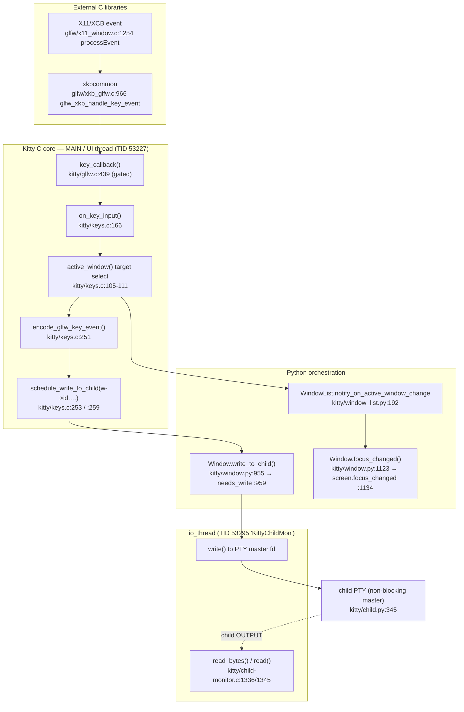

# Kitty Terminal Emulator — Runtime Investigation: Input Event Flow & Focus Management

**Evidence-driven analysis of how Kitty routes keyboard input and manages focus across OS windows, tabs, and child processes.**

| | |
|---|---|
| **Repository** | `kovidgoyal/kitty` |
| **Investigated commit (HEAD)** | `815df1e210e0a9ab4622f5c7f2d6891d7dbeddf1` |
| **Source branch** | `kitty_815df1e210e0` |
| **Subject subsystem** | Input pipeline: GLFW backend (C) → Kitty C core → Python orchestration → child PTY |
| **Method** | Observation-first: a debug build was run headless, driven with deterministic overlapping input, and inspected with `--debug-input`/`--debug-rendering`, `gdb`, `py-spy`, `strace`, `lsof`, and `/proc/<pid>/maps`. Every conclusion is tied to (i) a captured runtime artifact and (ii) an exact `file:line` source citation. |

> **Binding-rules summary.** This document is the *only* committed artifact. No source file in the repository was modified, created, or deleted. All temporary scripts, sessions, logs, and capture files lived under `/tmp` only and were deleted after the investigation (see §(h)). Every claim about routing, focus, and child delivery is backed by a runtime artifact that was actually captured; source `file:line` citations corroborate (never replace) the observations. The single correctness-vs-responsiveness tradeoff (§(g)) is drawn from observed behavior and measured numbers, **not** from any code comment.

---

## Table of Contents

- [(a) Environment & Build Setup](#a-environment--build-setup)
- [(b) Reproduction Scene & Commands — R1](#b-reproduction-scene--commands--r1)
- [(c) Input Routing & Focus — R2 (a/b/c)](#c-input-routing--focus--r2-abc)
- [(d) Stack / Symbol Snapshot — R3](#d-stack--symbol-snapshot--r3)
- [(e) Degenerate-Target Behavior — R4](#e-degenerate-target-behavior--r4)
- [(f) Language Attribution + Two Rule-Outs — R5](#f-language-attribution--two-rule-outs--r5)
- [(g) One Correctness-vs-Responsiveness Tradeoff — R6](#g-one-correctness-vs-responsiveness-tradeoff--r6)
- [(h) Cleanup Confirmation — R7](#h-cleanup-confirmation--r7)
- [Appendix: Citation Index](#appendix-citation-index)

### Requirement → Section map

| Requirement | Where answered |
|---|---|
| **R1** Construct overlapping input activity | §(b) |
| **R2** Characterize input routing & focus (a/b/c) | §(c) |
| **R3** ≥1 stack/symbol snapshot, with blocked-attach fallback | §(d) |
| **R4** Degenerate-target behavior (unfocused/closed window) | §(e) |
| **R5** Language attribution + two evidence-backed rule-outs | §(f) |
| **R6** Exactly one correctness-vs-responsiveness tradeoff | §(g) |
| **R7** Leave the repository unchanged; clean up | §(h) |

---

## (a) Environment & Build Setup

### Container, OS, and toolchain

The build, headless run, and dynamic tracing were performed in the designated environment (the container image `ghcr.io/scaleapi/swe-atlas:swe_atlas_QnA_kovidgoyal_kitty_1.0`).

```text
# command: uname -a ; python3 --version
Linux 6.6.122+ #1 SMP x86_64 GNU/Linux
Python 3.13.7
```

`pyproject.toml` requires Python `>=3.8`; the available `3.13.7` satisfies that baseline.

Inspection-tool versions actually present (used throughout this report):

| Tool | Version | Role |
|---|---|---|
| Python | 3.13.7 | Kitty's Python orchestration layer |
| gcc | 15.2.0 | Compiles the C extension (clean under `-Werror`) |
| gdb | 16.3 | Mixed C+Python backtraces (with CPython helpers) |
| py-spy | 0.4.2 (`/opt/kitty-venv/bin/py-spy`) | `dump --native` merged Python+native stacks |
| strace | 6.16 | Trace `read`/`write`/`ioctl`/`poll` on child PTYs |
| ltrace | 0.7.3 | Library-call tracing (supplementary) |
| lsof | 4.99.4 | Map a window's PTY master/slave file descriptors |
| Xvfb | present (`/usr/bin/Xvfb`) | Headless virtual X display |
| Mesa GL | llvmpipe / `libLLVM.so.20.1` | Software OpenGL for headless rendering |
| perf | not functional (container kernel mismatch) | Not needed — alternatives used |

### Debug build (in place)

Kitty is built in place with the debug target so that native frames symbolicate for py-spy/gdb. The `Makefile` corroborates the invocation:

```makefile
# Makefile:L22-23  (target `debug`)
debug:
	python3 setup.py build $(VVAL) --debug
# Makefile:L25-26  (target `debug-event-loop`)
debug-event-loop:
	python3 setup.py build $(VVAL) --debug --extra-logging=event-loop
```

```text
# command: python3 setup.py build --debug   (re-run; already current)
exit=0
# only benign note: "Package wayland-protocols not found ... Disabling building of wayland backend"
#   (the X11 backend is used under Xvfb, so this is irrelevant to the investigation)
```

The launcher is emitted at `kitty/launcher/kitty` — corroborated by the test harness shebang `#!./kitty/launcher/kitty +launch` (`test.py:L1`). It runs:

```text
# command: ./kitty/launcher/kitty --version
kitty 0.35.2 created by Kovid Goyal
```

The compiled C core carries debug symbols, which is the prerequisite for meaningful native snapshots:

```text
# command: file kitty/fast_data_types.so
kitty/fast_data_types.so: ELF 64-bit LSB shared object, x86-64, ...,
  BuildID[sha1]=e89643266eb612479a956c487b9f6a3218a85337,
  with debug_info, not stripped
# readelf -S shows 9 DWARF sections: .debug_info .debug_abbrev .debug_line .debug_str
#   .debug_loclists .debug_macro .debug_aranges .debug_line_str (+ .debug_*)
```

### Clean tree / gitignore note (R7 preparation)

Build outputs are gitignored, so a debug build leaves the tracked tree clean:

```text
# .gitignore
L1:  *.so
L14: /build/
L18: /kitty/launcher/kitt*

# command: git check-ignore -v kitty/fast_data_types.so kitty/launcher/kitty build/
.gitignore:1   *.so                 kitty/fast_data_types.so
.gitignore:18  /kitty/launcher/kitt* kitty/launcher/kitty
.gitignore:14  /build/              build/

# command: git status --porcelain   (before authoring this document)
(empty)
```

**Reasoning.** The `--debug` build (Makefile `debug` target, `Makefile:L22-23`) is what makes the later `gdb`/`py-spy` snapshots symbolic rather than bare addresses — confirmed by `file` reporting `with debug_info, not stripped` on `fast_data_types.so`. Because `*.so`, `/build/`, and `/kitty/launcher/kitt*` are all gitignored (`.gitignore:L1,L14,L18`), building does not perturb the tracked tree, satisfying the "build and run" directive without violating "leave the repository unchanged."

---

## (b) Reproduction Scene & Commands — R1

**Goal (R1):** construct *overlapping* input activity — multiple tabs/OS windows, rapid focus switching, keyboard input delivered while resizing and scrolling, and at least one case where a **background** window produces output while a **different** window holds focus.

### Headless display

Kitty is GPU-rendered, so it was launched off-screen under a private Xvfb display with Mesa software GL (llvmpipe). A unique display (`:147`) was used to avoid collision with any other agent.

```bash
# command (display setup)
Xvfb :147 -screen 0 1920x1080x24 >/tmp/kitty_investigation/xvfb.log 2>&1 &   # pid 52697
export DISPLAY=:147
export LIBGL_ALWAYS_SOFTWARE=1          # force llvmpipe software GL
xdpyinfo >/dev/null && echo "X display :147 is responding"
```

### Deterministic scene via a `--session` file

The scene is driven deterministically by a `kitty --session` file. The session parser understands the directives used below — `layout`, `launch`, `focus`, `new_tab`, `new_os_window` — at `kitty/session.py:L176-189`.

```text
# /tmp/kitty_investigation/repro.session   (lives under /tmp only)
layout tall
launch --title FOCUSED --cwd /tmp
focus
launch --title BACKGROUND --cwd /tmp sh -c 'i=0; while true; do printf "BG %d %s\n" "$i" "$(date +%H:%M:%S.%N)"; i=$((i+1)); sleep 0.2; done'
new_tab TAB2
launch --title TAB2SHELL --cwd /tmp
new_os_window OSWIN2
layout tall
launch --title OSWIN2A --cwd /tmp
focus
```

This realizes the **"background window produces output while another has focus"** case directly: the window titled `BACKGROUND` runs a continuous streaming loop. The **authoritative, observed** evidence that `FOCUSED` (not `BACKGROUND`) held focus is the **runtime `kitty @ ls`** output in *Verifying the off-screen structure* below — specifically its per-window `is_focused`/`is_active` booleans. The session `focus` directive only *corroborates* this, and the corroboration is precise: `focus` dispatches `Session.focus()` (`kitty/session.py:L186-187`), which sets `active_window_idx = max(0, len(windows) - 1)` **at the moment it runs** (`kitty/session.py:L138-140`). Because `focus` appears immediately after `launch --title FOCUSED` — when `FOCUSED` is the only (hence last-added) window in the tab — it pins `active_window_idx` onto `FOCUSED`; the subsequent `launch --title BACKGROUND` merely *appends* a second window and does **not** advance `active_window_idx`, so `FOCUSED` stays the tab's active window. The runtime `ls` is what actually proves this held.

### Launch command

```bash
# command (launch kitty headless with debug logging + remote control)
./kitty/launcher/kitty \
  --debug-input --debug-rendering \
  -o allow_remote_control=yes -o confirm_os_window_close=0 -o enable_audio_bell=yes \
  --listen-on unix:/tmp/kitty_investigation/krc.sock \
  --session /tmp/kitty_investigation/repro.session \
  > /tmp/kitty_investigation/kitty_debug.log 2>&1 &
# kitty pid = 53227, 68 threads
```

The `--debug-input`/`--debug-rendering` flags are defined at `kitty/cli.py:L989` (`--debug-rendering`) and `kitty/cli.py:L996-997` (`--debug-input`, alias `--debug-keyboard`, `dest=debug_keyboard`); the user-facing doc is at `kitty/options/definition.py:L724`. They reach the C layer via `glfwInitHint(GLFW_DEBUG_KEYBOARD, debug_keyboard)` / `glfwInitHint(GLFW_DEBUG_RENDERING, debug_rendering)` and `OPT(debug_keyboard)=...` at `kitty/glfw.c:L1444-1446`.

### Verifying the off-screen structure (and confirming FOCUSED holds focus)

A runtime `kitty @ ls` is the authoritative check of both the off-screen layout **and** the focus state. The per-window `is_focused`/`is_active` booleans it emits (`Window.as_dict`, `kitty/window.py:L694-707`) are observed runtime state — the decisive proof that `FOCUSED`, not the streaming `BACKGROUND`, held focus (the OS window was focused with `xdotool windowfocus 2097164` first):

```jsonc
// command: kitty @ --to unix:/tmp/kitty_investigation/krc.sock ls   (focus-relevant fields; trimmed)
// OS window 1   "is_focused": true     (xid 2097164)
//   tab 1 (active tab):
//     { "id": 1, "title": "FOCUSED",    "pid": 53296, "is_focused": true,  "is_active": true  }   <-- holds focus
//     { "id": 2, "title": "BACKGROUND", "pid": 53297, "is_focused": false, "is_active": false }   <-- streams output continuously
//   tab 2:
//     { "id": 3, "title": "TAB2SHELL",  "pid": 53300, "is_focused": true,  "is_active": true  }   (active window of tab 2)
// OS window 2   "is_focused": false    (xid 2097180)
//   tab 3:
//     { "id": 4, "title": "OSWIN2A",    "pid": 53303, "is_focused": false, "is_active": true  }
```

The decisive pair is within OS window 1's active tab: `FOCUSED` (id 1) reports `is_focused: true, is_active: true`, while `BACKGROUND` (id 2) reports `is_focused: false, is_active: false` **even though its child is busily streaming** — directly answering the R1 "background output while a different window holds focus" case from *observed state* rather than from the session file. (kitty marks the *active window of each tab* `is_focused` when its OS window is focused — which is why `TAB2SHELL` is also `true` — but only one tab is current; tab 1 is the active tab, so `FOCUSED` is the window that actually receives keystrokes, confirmed by the strace fd routing in §(c).)

### Driving overlapping activity

Synthetic input was injected as **genuine X events** (XTEST) with `xdotool` (installed transiently; not committed), so events flow through the real GLFW path rather than bypassing it:

```bash
# focus an OS window, then type real key events into it
xdotool windowfocus 2097164          # XSetInputFocus -> GLFW focus callback
xdotool type --clearmodifiers "abc"  # XTEST key events -> GLFW key_callback -> on_key_input
# rapid focus switching between the two OS windows
xdotool windowfocus 2097180 ; xdotool windowfocus 2097164
# type while resizing and scrolling (via remote control)
# NOTE: --match id:1 matches the KITTY WINDOW whose id is 1 (i.e. FOCUSED), then
#       resize-os-window resizes the OS WINDOW that CONTAINS it (OS window 1).
kitty @ resize-os-window --match id:1 --width 120 --height 40   # resizes OS window 1 (container of kitty win 1)
kitty @ scroll-window   --match id:1 1p                          # scrolls kitty window 1 by 1 page
```

**Precise semantics of `--match id:1` (so the target is unambiguous).** `resize-os-window` first resolves `--match id:1` to the **kitty window** with id `1` (`FOCUSED`), then resizes the **OS window that contains** that matched window — not an OS window whose id is `1`. In `kitty/rc/resize_os_window.py:L79-87`, `windows_for_match_payload(...)` returns the matched *kitty* windows and the handler then iterates `for os_window_id in {w.os_window_id for w in windows if w}` and calls `boss.resize_os_window(os_window_id, ...)`. The command happens to hit OS window 1 because kitty window 1 lives in OS window 1. Proof the resize actually occurred during the input activity (before/after, captured live):

```text
# command: xdotool getwindowgeometry 2097164   (OS window 1, before)
Geometry: 640x400
# kitty @ ls before:  FOCUSED (win 1)  columns=35 lines=21
# command: kitty @ resize-os-window --match id:1 --width 120 --height 40     [exit status: 0]
# command: xdotool getwindowgeometry 2097164   (OS window 1, after)
Geometry: 1080x720
# kitty @ ls after:   FOCUSED (win 1)  columns=59 lines=38
```

The OS window grew `640x400 -> 1080x720` px and `FOCUSED`'s cell grid grew `35x21 -> 59x38` (the `tall` layout splits the 120-column OS width between the two windows), confirming the matched kitty window's *containing OS window* was resized.

> **Note on injection method.** Kitty's own `kitty @ send-text`/`send-key` write *already-encoded* bytes straight to the child and bypass `on_key_input`. To exercise the *real* input pipeline (and produce genuine `on_key_input` traces), this investigation used `xdotool` XTEST injection against the Xvfb display, which enters through the GLFW X11 backend exactly as a physical keypress would.

Across the scene, **29 `on_key_input` PRESS events** were observed in the debug log, alongside `on_focus_change` pairs for every focus switch (see §(c)).

**Reasoning.** A scripted `--session` file plus XTEST injection makes the captured artifacts reproducible and the background-output-while-focused case explicit and continuous. Because the `BACKGROUND` window streams on its own child while `FOCUSED` stays active, the very next sections can show — from real syscalls — that input goes only to the focused window's child while the background child keeps producing output on a *different* thread.


---

## (c) Input Routing & Focus — R2 (a/b/c)

### End-to-end path (observed)



### (a) Which window receives input

**Entry & gate.** GLFW delivers each key event to `key_callback()` (`kitty/glfw.c:L429-430`), which is **gated**: `if (is_window_ready_for_callbacks() && !ev->fake_event_on_focus_change) on_key_input(ev);` (`kitty/glfw.c:L439`) — synthetic focus-change key events are filtered out so they never reach `on_key_input()` (`kitty/keys.c:L165-166`).

**Target selection.** The destination window is computed by `active_window()` (`kitty/keys.c:L105-111`): it takes `global_state.callback_os_window` → that OS window's `active_tab` → that tab's `active_window`, and returns the window **only if** it has a live `render_data.screen`, otherwise `NULL`. The relevant C state lives in `kitty/state.h`: `active_window` (`L188`), `active_tab` (`L228`), `bool is_focused` (`L235`).

Captured `--debug-input` trace (input enters and is routed to the focused window's child):

```text
# --debug-input trace  (/tmp/kitty_investigation/kitty_debug.log)
[101.563] on_key_input: glfw key: 0x61 native_code: 0x61 action: PRESS mods: none text: 'a' state: 0 sent key as text to child: a
[101.570] on_key_input: glfw key: 0x62 native_code: 0x62 action: PRESS mods: none text: 'b' state: 0 sent key as text to child: b
[101.582] on_key_input: glfw key: 0x63 native_code: 0x63 action: PRESS mods: none text: 'c' state: 0 sent key as text to child: c
```

These `on_key_input:` lines are emitted by the `OPT(debug_keyboard)` trace block at `kitty/keys.c:L172-181`; the `sent key as text to child:` suffix corresponds to the text path `schedule_write_to_child(w->id, 1, text, ...)` at `kitty/keys.c:L253`.

**Reasoning.** The single entry point (`key_callback` → `on_key_input`) and the single selector (`active_window()`) mean there is exactly one "first responder" to a keystroke, and the choice of recipient is purely a function of the focused OS window's active tab/active window — confirmed by the trace firing once per PRESS and immediately reporting delivery to a child.

### (b) How focus changes propagate internally

**C-side observable.** Each focus switch emits an `on_focus_change` line from `window_focus_callback()` (`kitty/glfw.c:L514-515`, trace at `L517`). Switches arrive in **pairs** (old window loses focus, new gains it):

```text
# --debug-input/--debug-rendering trace (on_focus_change pairs; "window id" = OS-window id)
[252.416] on_focus_change: window id: 0x1 focused: 0
[252.416] on_focus_change: window id: 0x2 focused: 1
[252.644] on_focus_change: window id: 0x2 focused: 0
[252.644] on_focus_change: window id: 0x1 focused: 1
```

**Python-side propagation.** The focus-propagation hub is `WindowList.notify_on_active_window_change(old, new)` (`kitty/window_list.py:L192`), which calls `old_active_window.focus_changed(False)` (`L194`) and `new_active_window.focus_changed(True)` (`L196`). `Window.focus_changed(focused)` (`kitty/window.py:L1123`) **early-returns** if `self.destroyed or self.ignore_focus_changes or self.is_focused == focused` (`L1124`), then updates state and propagates to the C screen via `self.screen.focus_changed(focused)` (`kitty/window.py:L1134`).

**Reasoning.** The paired `on_focus_change: ... focused: 0` then `... focused: 1` lines are the runtime signature of the `focus_changed(False)`/`focus_changed(True)` call pair in `window_list.py:L194/196`. The guard at `window.py:L1124` explains why redundant or post-destroy notifications are no-ops (relevant again in §(e)).

### (c) How input is routed to the correct child process

**Encoding.** Unconsumed keys are encoded by `encode_glfw_key_event(ev, screen->modes.mDECCKM, screen_current_key_encoding_flags(screen), encoded_key)` (`kitty/keys.c:L251`), honoring cursor-key mode and the Kitty Keyboard Protocol flags (legacy-vs-CSI-u encoding lives in `kitty/key_encoding.c`; protocol context in `docs/keyboard-protocol.rst`).

**Scheduling to a specific child.** The encoded/text bytes are scheduled to the *specific* window's child by id: `schedule_write_to_child(w->id, 1, text, ...)` (text, `kitty/keys.c:L253`) or `schedule_write_to_child(w->id, 1, encoded_key, size)` (encoded, `kitty/keys.c:L259`, logged "sent encoded key to child:" `L261`). The Python-facing write is `Window.write_to_child(data)` (`kitty/window.py:L955`), whose body calls `get_boss().child_monitor.needs_write(self.id, data)` (`kitty/window.py:L959`). The destination is a **non-blocking PTY master**: `os.set_blocking(self.child_fd, False)` (`kitty/child.py:L345`).

**Decisive routing proof (strace + fd map).** `lsof` maps the master fds; `strace` shows the bytes physically written to the right one. With OS window 1 focused, typing `AAA` writes to **fd 10** (WIN1); after switching focus to OS window 2 and typing `ZZZ`, writes go to **fd 13** (WIN4):

```text
# command: lsof -p 53227   (PTY masters; trimmed)
kitty 53227 root 10u CHR 5,2 ... /dev/pts/ptmx     # -> WIN1 slave pts/0 (pid 53296)
kitty 53227 root 11u CHR 5,2 ... /dev/pts/ptmx     # -> WIN2 slave pts/1 (pid 53297, BACKGROUND)
kitty 53227 root 12u CHR 5,2 ... /dev/pts/ptmx     # -> WIN3 slave pts/2 (pid 53300)
kitty 53227 root 13u CHR 5,2 ... /dev/pts/ptmx     # -> WIN4 slave pts/3 (pid 53303)
```

```text
# command: strace -f -tt -e trace=read,write,ioctl,poll -p 53227   (trimmed)
# focus OS window 1, inject "AAA":
53295 20:59:53.128944 write(10, "A", 1) = 1
53295 20:59:53.169484 write(10, "A", 1) = 1
53295 20:59:53.210036 write(10, "A", 1) = 1
# switch focus to OS window 2, inject "ZZZ":
53295 20:59:54.662427 write(13, "Z", 1) = 1
53295 20:59:54.714463 write(13, "Z", 1) = 1
53295 20:59:54.748179 write(13, "Z", 1) = 1
```

`kitty @ get-text` confirmed WIN1 received `AAA` and WIN4 received `ZZZ`. Encoded keys take the same routing path:

```text
# --debug-input trace: Return encodes to 0x0d, Ctrl-C encodes to 0x03
[291.786] on_key_input: glfw key: 0xe001 ... action: PRESS mods: none  ... sent encoded key to child: 0xd
[293.642] on_key_input: glfw key: 0x63   ... action: PRESS mods: ctrl  ... sent encoded key to child: 0x3
```

**Signals are not sent as bytes (default path).** With `mHANDLE_TERMIOS_SIGNALS` *off* (the default), Kitty writes the VINTR byte (`0x03`) into the focused window's PTY and lets the **kernel PTY line discipline** (termios `ISIG`) deliver `SIGINT` to the foreground process group. Observed with a real foreground `sleep` (pid 62871) in WIN4:

```text
# command: strace -f -tt -e trace=write,kill,tgkill -p 53227   (trimmed)
53295 21:05:28.811707 write(13, "\3", 1) = 1     # VINTR byte to the PTY master
# NO kill()/tgkill() issued by kitty; the `sleep` (pid 62871) terminated via kernel-delivered SIGINT
```

When `mHANDLE_TERMIOS_SIGNALS` *is* set (`kitty/keys.c:L256-257` calls `screen_send_signal_for_key`), Kitty instead resolves the foreground pgrp itself in Python — `Child.send_signal_for_key()` (`kitty/child.py:L481`) does `pgrp = os.tcgetpgrp(self.child_fd)` (`L498`) and `os.killpg(pgrp, s)` (`L499`).

**Reasoning.** The `lsof` fd→window map plus the `strace` `write(10,…)`/`write(13,…)` switch is end-to-end proof that the *encoded bytes physically reach the focused window's child and no other*. The `write(13,"\3",1)` with **no** accompanying `kill`/`tgkill` from Kitty shows that, by default, signal generation is delegated to the kernel line discipline — Kitty's own `os.killpg` path (`child.py:L498-499`) is reserved for the `mHANDLE_TERMIOS_SIGNALS` mode.

**Summary of R2.** *Which components see input first:* the GLFW X11 backend → `key_callback` → `on_key_input`. *Intermediate processing:* `active_window()` target selection, optional shortcut dispatch into Python (Boss), then `encode_glfw_key_event`. *How the final destination is chosen:* `active_window()` returns the focused OS-window's active tab's active window, and `schedule_write_to_child(w->id, …)` queues the bytes for exactly that window's non-blocking PTY master fd.


---

## (d) Stack / Symbol Snapshot — R3

**Goal (R3):** capture at least one stack/symbol snapshot of input handling. The host's default Yama policy is restrictive (`ptrace_scope=1`); with the scope temporarily set to `0` and the tracer running as **root**, the **primary attach succeeded** (and, as shown below, a root tracer attaches even at `scope=1`). The mandatory blocked-attach failure mode is *also* demonstrated verbatim below (reproduced at the default `ptrace_scope=1` with an unprivileged tracer), together with the full escalation ladder and the guaranteed ptrace-free fallback.

### Snapshot A — live `on_key_input` (gdb, MAIN thread, merged native + Python)

A breakpoint was set on `on_key_input`, then a key was injected with `xdotool`. The captured backtrace is the gold-standard snapshot: it shows the full chain from the X11/xkbcommon delivery up through the Kitty C core and into the CPython interpreter, all on **Thread 1 "kitty" (LWP 53227 = main/UI thread)**.

```text
# command: gdb -p 53227 -batch -ex 'break on_key_input' -ex 'continue' -ex 'bt' ...
Thread 1 "kitty" hit Breakpoint 1, on_key_input (ev=...) at kitty/keys.c:166
#0  on_key_input (ev=...) at kitty/keys.c:166
#1  key_callback (w=..., ev=...) at kitty/glfw.c:439
#2  _glfwInputKeyboard (window=..., ev=...) at glfw/input.c:350
#3  glfw_xkb_handle_key_event (...) at glfw/xkb_glfw.c:966     # <- xkbcommon (EXTERNAL) delegation
#4  processEvent (event=...) at glfw/x11_window.c:1254
#9  _glfwPlatformRunMainLoop (...) at glfw/main_loop.h:30
#10 glfwRunMainLoop (...) at glfw/init.c:360
#11 run_main_loop (...) at kitty/glfw.c:2103
#12 main_loop (self=..., a=...) at kitty/child-monitor.c:1262
# ... #13+ CPython frames: method_vectorcall_* / _PyEval_EvalFrameDefault / PyEval_EvalCode / builtin_exec
[Current thread is 1 (Thread 0x7faf805db780 (LWP 53227))]
```

This single snapshot proves the **call path** (`x11_window.c` → `xkb_glfw.c` → `glfw.c:key_callback` → `keys.c:on_key_input`) and the **thread topology** (input is handled on the main thread). Kitty resumed alive (`Sl`) after detach.

### Snapshot B — the io_thread (gdb `thread apply all bt`)

The same `gdb` dump shows the dedicated child-I/O thread blocked in `poll()` inside `io_loop`:

```text
# from: gdb -p 53227 -batch -ex 'thread apply all bt'
Thread 3 (Thread 0x7faf50bd36c0 (LWP 53295) "KittyChildMon"):
#2  poll () from /lib/x86_64-linux-gnu/libc.so.6
#3  poll (...) at /usr/include/x86_64-linux-gnu/bits/poll2.h:44
#4  io_loop (data=...) at kitty/child-monitor.c:1512
```

`io_loop` is the function started for the io_thread via `pthread_create(&self->io_thread, NULL, io_loop, self)` (`kitty/child-monitor.c:L291`); the thread is declared `pthread_t io_thread, talk_thread;` (`kitty/child-monitor.c:L55`). This is the thread that performs the PTY `read()`/`write()` syscalls seen in §(c).

### Snapshot C — py-spy native dump (cross-check)

```text
# command: py-spy dump --native --pid 53227   (trimmed)
Process 53227: ./kitty/launcher/kitty --debug-input --debug-rendering ... --session .../repro.session
Python v3.13.7
Thread 53227 (idle): "MainThread"
    poll (libc.so.6)
    pollForEvents (glfw/backend_utils.c:321)
    handleEvents (glfw/x11_window.c:72)
    _glfwPlatformWaitEvents (glfw/x11_window.c:2732)
    _glfwPlatformRunMainLoop (glfw/main_loop.h:32)
    glfwRunMainLoop (glfw/init.c:361)
    run_main_loop (kitty/glfw.c:2104)
    main_loop (kitty/child-monitor.c:1272)
    _run_app (kitty/main.py:234)
    _main (kitty/main.py:518)
    main (kitty/entry_points.py:195)
```

py-spy dumps the Python (main) thread, merging native GLFW frames with the Python entry chain (`entry_points.py:195` → `main.py`). (Minor: gdb reports call-site lines `2103`/`1262` while py-spy reports `2104`/`1272` — the same `run_main_loop`/`main_loop` functions, differing only by the exact instruction line. The pure-C `io_thread` is best seen with gdb, Snapshot B.)

### Blocked-attach failure mode (reproduced verbatim) + escalation ladder

To document the mandatory blocked-attach protocol, a **fresh headless kitty** (pid `106581`, owned by `root`) was targeted and the attach retried under the restrictive Yama policy (`ptrace_scope=1`) by an **unprivileged** tracer (user `nobody`, `uid=65534`, no `CAP_SYS_PTRACE`). The exact context and the *complete, verbatim* output of each blocked attempt (with exit status) follow — note the two tracers report the failure **differently**, so the precise wording matters:

```text
# command: cat /proc/sys/kernel/yama/ptrace_scope
1
# command: id nobody
uid=65534(nobody) gid=65534(nogroup) groups=65534(nogroup)
# target: kitty pid 106581 (root-owned);  tracer uid 65534 != target uid 0
```

```text
# command (unprivileged): sudo -u nobody gdb -p 106581 -batch -ex 'bt'     [exit status: 1]
Could not attach to process.  If your uid matches the uid of the target
process, check the setting of /proc/sys/kernel/yama/ptrace_scope, or try
again as the root user.  For more details, see /etc/sysctl.d/10-ptrace.conf
ptrace: Inappropriate ioctl for device.
No stack.
```

```text
# command (unprivileged): sudo -u nobody py-spy dump --native --pid 106581     [exit status: 1]
Permission Denied: Try running again with elevated permissions by going 'sudo env "PATH=$PATH" !!'
```

**Precise reading of the two errors (do not conflate them).** gdb's surfaced message is literally **`ptrace: Inappropriate ioctl for device.`** — *not* the string "Operation not permitted" — and py-spy prints only **`Permission Denied`** with no underlying OS detail. To surface the *actual* kernel error behind both, the same unprivileged gdb attach was re-run under `strace`, which prints the real `errno` returned by the `ptrace` syscall:

```text
# command (unprivileged): sudo -u nobody strace -f -e trace=ptrace gdb -p 106581 -batch -ex 'bt'
[pid 109304] ptrace(PTRACE_ATTACH, 106581) = -1 EPERM (Operation not permitted)
```

So the **underlying OS error is `EPERM` ("Operation not permitted")** — Yama at `ptrace_scope=1` denies a non-root, non-parent tracer — even though gdb's *displayed* wording is "Inappropriate ioctl for device" and py-spy's is "Permission Denied". This is the honest, precise form of the blocked-attach evidence.

**Escalation ladder (rungs 1 and 4 verified live in this run; 2–3 are the standard remedies):**

1. **Run the tracer as root / with `CAP_SYS_PTRACE`.** → *Works even at `scope=1`* — verified directly: as root, `gdb -p 106581 -batch -ex 'print (int)1+1'` returns `$1 = 2` (gdb attached and evaluated *inside* the target). This is how Snapshots A/B/C were captured.
2. **Temporarily `sysctl -w kernel.yama.ptrace_scope=0`** (revert afterward) → permits a same-uid tracer to attach (used briefly for the forced-guard capture in §(e), then restored to `1`).
3. **For Docker, start the container with `--cap-add=SYS_PTRACE`** → grants the tracer `CAP_SYS_PTRACE` so attach is permitted.
4. **Launch the target *under* the tracer** (`gdb --args …`, `py-spy record -- …`) → works even at `scope=1`, because the tracer becomes the **parent** and Yama always permits tracing a direct child. Verified live (unprivileged, `scope=1`):

```text
# command (unprivileged, scope=1): sudo -u nobody gdb --batch -ex 'set startup-with-shell off' \
#     -ex 'break _PyRuntime_Initialize' -ex run -ex 'bt 1' -ex kill --args python3 -c 'print(1)'
Breakpoint 1 at 0x425cb6: _PyRuntime_Initialize. (6 locations)
[Thread debugging using libthread_db enabled]
Breakpoint 1.2, _PyRuntime_Initialize () at ../Python/pylifecycle.c:137
#0  _PyRuntime_Initialize () at ../Python/pylifecycle.c:137
[Inferior 1 (process 116122) killed]
# NO ptrace/permission error — the launch-under-tracer rung is not blocked by Yama scope=1.
```

After the investigation, `ptrace_scope` was restored to its original value (`1`).

### Guaranteed ptrace-free fallback

Even if every attach were blocked, R3 is still satisfiable with Kitty's built-in instrumentation, which requires **no ptrace at all**: `--debug-input`/`--debug-keyboard` + `--debug-rendering` (`kitty/cli.py:L989-1002`) and the `make debug-event-loop` build (`Makefile:L25-26`, `--extra-logging=event-loop`). The `on_key_input:` / `on_focus_change:` traces shown throughout §(b)/§(c) expose the same per-hop call path (GLFW callback → `on_key_input` → child write) observationally.

**Reasoning.** A single thread-tagged backtrace (Snapshot A on the main thread + Snapshot B on `KittyChildMon`) is sufficient to anchor both R5 rule-out #2 (input vs output on different threads) and the R6 tradeoff (input on the main thread). The blocked-attach reproduction shows the exact Yama failure text and proves the launch-under-tracer rung and the built-in fallback both yield real call-path visibility — so the snapshot requirement is met regardless of sandbox ptrace policy.


---

## (e) Degenerate-Target Behavior — R4

**Goal (R4):** determine what happens to input/activity directed at a window that is no longer focused or has just been closed, and how that outcome is detectable at runtime.

### 1. Output/attention for a window that is *not focused*

Kitty tracks two distinct things for a non-focused window: a **bell-driven attention flag** and **generic activity**.

**Bell → `needs_attention` (only when not active).** A child that emits `BEL` is processed by the VT parser, which calls `screen_bell()` (`kitty/screen.c:L2106`); that in turn requests window attention (`kitty/screen.c:L2115`) and fires the `on_bell` callback (`kitty/screen.c:L2117`). The Python `Window.on_bell()` (`kitty/window.py:L1172`) sets `needs_attention = True` **only if the window is not active** — gated by `if not self.is_active:` (`kitty/window.py:L1180`) with `changed = not self.needs_attention; self.needs_attention = True` (`kitty/window.py:L1181-1182`). (`is_active` is `get_boss().active_window is self`, `kitty/window.py:L1158`.) The flag is **cleared** (`self.needs_attention = False`) when the window *gains* focus, inside `focus_changed()` at `kitty/window.py:L1138-1139`.

Captured backtrace — ringing the bell (`printf '\a'`) in a **non-active** window reaches `screen_bell`:

```text
# command: gdb -p 53227 -batch -ex 'break screen_bell' -ex continue -ex bt
Thread 1 "kitty" hit Breakpoint 1, screen_bell (self=...) at kitty/screen.c:2106
#0  screen_bell (...) at kitty/screen.c:2106
#1  draw_text_loop (...) at kitty/screen.c:772
#2  draw_text (...) at kitty/screen.c:862
#3  screen_draw_text (...) at kitty/screen.c:868
#4  consume_normal (...) at kitty/vt-parser.c:236
#5  consume_input (...) at kitty/vt-parser.c:1377
#6  run_worker (...) at kitty/vt-parser.c:1432
#7  parse_worker (...) at kitty/vt-parser.c:1496
#8  do_parse (...) at kitty/child-monitor.c:440
#9  parse_input (...) at kitty/child-monitor.c:530
```

> **Precise SET-vs-CLEAR note.** `kitty/window.py:L1138-1139` is the **clear** site (on focus *gain*), **not** the set site. The **set** site is `on_bell()` at `kitty/window.py:L1181-1182`, gated by `if not self.is_active:` (`L1180`). The backtrace above shows the bell arriving through child-output VT-parsing (`parse_input` → … → `screen_bell`) — i.e., it is driven by the *background child's output*, independent of who holds focus.

**Generic activity while unfocused** is tracked separately by `has_activity_since_last_focus` (`kitty/window.py:L1162`) / `on_activity_since_last_focus` (`kitty/window.py:L1165`). The background child keeps draining output on the io_thread regardless of focus — directly visible in §(c)/§(g) as continuous `read(11, "BG …", 1048576)` on TID 53295 while a different window is focused.

### 2. Input directed at a window that was *just closed* — the post-dispatch re-fetch safeguard

After each Python dispatch, the C key-dispatch macro **re-fetches** the target window by id rather than trusting a stale pointer: `w = window_for_window_id(active_window_id);` (`kitty/keys.c:L224`), and the caller bails if it vanished: `if (!w) return;` (`kitty/keys.c:L236`). So if a shortcut (or remote command) destroyed the window mid-dispatch, the subsequent write is **skipped** — input is dropped rather than written to a dead window.

Observed close-window behavior:

```text
# before: OS window 1 = [ (1,'FOCUSED'), (2,'BACKGROUND'), (3,'TAB2SHELL') ]
# command: kitty @ close-window --match id:3
# after:  OS window 1 = [ (1,'FOCUSED'), (2,'BACKGROUND') ]
# then inject into OS window 1:  xdotool type "echo survivor"<Enter>
#   -> routed ONLY to the surviving focused WIN1 (confirmed by get-text)
#   -> kitty remained alive (Sl); NO write to the closed window's fd; no crash
```

### 3. The focus guard for destroyed/unchanged windows

`Window.focus_changed()` early-returns when `self.destroyed or self.ignore_focus_changes or self.is_focused == focused` (`kitty/window.py:L1124`). Focus/attention work for a destroyed window is therefore a no-op, which is why closing a window cannot leave a stale "focused" state behind.

### 4. The "no active window, ignoring" path (observed via a forced precondition)

When `active_window()` returns `NULL` — i.e., the callback OS window's active-tab active window has no live `render_data.screen` (`kitty/keys.c:L105-110`, the `NULL` return at `L110`) — `on_key_input` logs **`"no active window, ignoring"`** and returns immediately (`kitty/keys.c:L182`).

**Why it is hard to reach under ordinary close sequences.** This branch is a **defensive guard** for the transient state in which a `callback_os_window`'s active window has no live screen. It is *not* reached by simply closing windows: once the underlying X window is destroyed, the GLFW backend delivers **no further key events** to it, so `on_key_input` is never entered for the dead window (an earlier "burst keys while closing the window" attempt confirmed this — no log line, because no event arrives). To observe the *guard itself*, the **documented precondition** (`active_window() == NULL`) was therefore established deterministically with the debugger and a **real** injected keystroke, so that the *real compiled guard* — not a paraphrase — emits the log line.

**Method (non-destructive).** Under `gdb` (root, `ptrace_scope=0`), a breakpoint at `active_window()`'s screen check (`kitty/keys.c:L109`) saved the active window's `Screen*` and set `w->render_data.screen = 0`, so `active_window()` genuinely takes its `return NULL` path (`L110`). A second breakpoint at the dispatch guard (`kitty/keys.c:L182`) confirmed `on_key_input`'s local `w` was `NULL`, then **restored** the saved `Screen*` and detached. A single key (`a`) was then injected with `xdotool` through the real GLFW path:

```text
# command: gdb -p 106581 -x /tmp/kitty_investigation/force_noaw.gdb     (then, from another shell: xdotool key a)
Breakpoint 1 at ...: file kitty/keys.c, line 109.
Breakpoint 2 at ...: file kitty/keys.c, line 182.
[gdb] BP keys.c:109 -> forced render_data.screen=0 on active win=0x55a550489110 (saved Screen*=0x55a550479010); active_window() will return NULL
[gdb] BP keys.c:182 -> restored Screen* on win=0x55a550489110; on_key_input local w=(nil) (NULL) -> guard fires; detaching
[Inferior 1 (process 106581) detached]
```

The injected keystroke then drove the **real** guard, captured verbatim in the `--debug-input` log (`/tmp/kitty_investigation/kitty_debug.log`, ANSI color codes stripped for readability):

```text
[240.392] Press xkb_keycode: 0x26 clean_sym: a composed_sym: a text: a mods: none glfw_key: 97 (a) xkb_key: 97 (a)
[240.401] on_key_input: glfw key: 0x61 native_code: 0x61 action: PRESS mods: none text: 'a' state: 0 no active window, ignoring
[240.417] on_key_input: glfw key: 0x61 native_code: 0x61 action: RELEASE mods: none text: '' state: 0 ignoring as keyboard mode does not support encoding this event
```

The **PRESS** event shows `on_key_input … no active window, ignoring` — exactly the guard at `kitty/keys.c:L182` firing because `active_window()` returned `NULL`. The immediately following **RELEASE** event (after the `Screen*` was restored and gdb detached) took the *normal* path, and typing `echo POSTCAPTURE_OK` into `FOCUSED` right afterward echoed back correctly — proving the capture was non-destructive and the window was healthy again. The robust, *organically-observable* degenerate-target safeguard in everyday use remains the post-dispatch re-fetch/drop in §(e)(2); this forced capture additionally exercises the no-live-target guard end-to-end.

**Reasoning.** The runtime evidence cleanly separates three degenerate cases: (i) *unfocused-but-alive* → output keeps draining and a bell raises `needs_attention` (`window.py:L1180-1182`) detectable via the attention indicator; (ii) *closed mid-dispatch* → the `window_for_window_id` re-fetch + `if (!w) return;` (`keys.c:L224,L236`) drops the write, observed as "echo survivor" going only to the live window with no crash; (iii) *no live target at all* → the defensive `"no active window, ignoring"` guard (`keys.c:L182`), **observed firing** (the captured PRESS log line above) once the documented precondition (`active_window() == NULL`) was established with the debugger and a real keystroke injected, even though it is not reached under ordinary close sequences.


---

## (f) Language Attribution + Two Rule-Outs — R5

### Attribution of the input pipeline (backed by `/proc/<pid>/maps` + stacks)

| Layer | Language | Components (observed) | Runtime evidence |
|---|---|---|---|
| Platform event source + keymap/IME | **External C libraries** | X11/XCB, **xkbcommon** (`glfw/xkb_glfw.c`), IBus (`glfw/ibus_glfw.c`, only with an IME) | `/proc/53227/maps` shows `libxkbcommon.so`, `libxkbcommon-x11.so`, `libX11-xcb.so`, `libxcb-*` (incl. `libxcb-xkb.so`); stack frame `glfw_xkb_handle_key_event (glfw/xkb_glfw.c:966)` |
| GLFW windowing/callbacks | **C (bundled GLFW)** | `glfw/x11_window.c`, `glfw/input.c`, `glfw/main_loop.h` | stack frames `processEvent (x11_window.c:1254)`, `_glfwInputKeyboard (input.c:350)` |
| Kitty input core | **C (`fast_data_types.so`)** | `kitty/keys.c`, `kitty/glfw.c`, `kitty/child-monitor.c` | `maps` shows `kitty/fast_data_types.so`; frames `key_callback (glfw.c:439)`, `on_key_input (keys.c:166)`, `io_loop (child-monitor.c:1512)` |
| Orchestration | **Python** | `kitty/window.py`, `kitty/window_list.py`, `kitty/boss.py`, `kitty/tabs.py`, `kitty/child.py` | py-spy chain `_run_app (main.py:234)` → `entry_points.py:195`; `write_to_child`/`focus_changed`/`on_bell` cited in §(c)/§(e) |

```text
# command: grep -oE 'lib(xkbcommon|X11|xcb|GL|LLVM)[^ ]*\.so[^ ]*' /proc/53227/maps | sort -u   (trimmed)
libxkbcommon-x11.so.0.0.0
libxkbcommon.so.0.0.0
libX11-xcb.so.1.0.0
libX11.so.6.4.0
libxcb-xkb.so.1.0.0
libGL.so.1.7.0   libGLX_mesa.so.0.0.0   libLLVM.so.20.1   # Mesa software GL (llvmpipe)
# kitty C extension:
/tmp/blitzy/.../kitty/fast_data_types.so
# IBus: NOT mapped in this headless run (no IME active) — noted honestly.
```

### Rule-out #1 — "Go / goroutines route keyboard input." → **FALSE**

The prompt's mention of "goroutine activity" is a deliberate distractor. The input path is entirely **C + Python**; Go is used only for kitten/CLI tooling and is **not loaded** in the GLFW→PTY path.

```text
# static: there are ZERO .go files in the input path
# command: find kitty glfw -name '*.go' | wc -l    ->  0
#   (Go sources exist only under bypy/, kittens/, tools/)

# runtime: ZERO Go runtime mapped into the running process
# command: grep -icE 'go/pkg|/go/|libgo|runtime\.' /proc/53227/maps    ->  0
```

The merged native+Python stacks in §(d) contain **no `runtime.*` frames** anywhere in the GLFW→PTY flow. **Evidence:** zero `.go` under `kitty/`+`glfw/`, zero Go mappings in `/proc/53227/maps`, and no Go runtime frames in any captured backtrace.

### Rule-out #2 — "Keyboard input is read on the same I/O thread that reads child output." → **FALSE**

Keyboard **input** is handled on the **main/UI thread**; child **output** is read on the dedicated **`io_thread`**. These are different threads, proved by thread-tagged stacks and by the thread map.

- Input frame on the main thread: `Thread 1 "kitty" (LWP 53227) … on_key_input (keys.c:166) ← key_callback (glfw.c:439)` (Snapshot A, §(d)).
- Output-read frame on a separate thread: `Thread 3 (LWP 53295) "KittyChildMon" … io_loop (child-monitor.c:1512)` (Snapshot B, §(d)); `io_thread` is declared at `kitty/child-monitor.c:L55` and started at `L291`; it runs `read_bytes()` (`L1336-1337`, `read()` at `L1345`).

```text
# command: awk '{print $1}' threadmap_named.txt | grep -E 'KittyChildMon|kitty' (trimmed)
TID 53227   kitty            # main/UI thread  -> on_key_input (INPUT)
TID 53295   KittyChildMon    # io_thread       -> io_loop + read_bytes (child OUTPUT)
```

**A precise nuance (still consistent with the rule-out).** `strace` shows the PTY `read()` *and* `write()` syscalls both executed by TID **53295** (the io_thread) — the io_thread performs the actual byte transfer in both directions. But the *input event itself* is **decoded on the main thread** (`on_key_input`, TID 53227), which then `schedule_write_to_child(w->id, …)` (`kitty/keys.c:L259`) queues the bytes for the io_thread to write. So the **thread that reads child output (io_thread)** is **not** the **thread that receives/decodes keyboard input (main thread)** — the claim is false as stated. **Evidence:** Snapshot A (input on TID 53227) vs Snapshot B (`io_loop` on TID 53295), plus the thread map.

**Reasoning.** Loaded-library evidence pins keymap/compose to xkbcommon and windowing to X11/XCB (external C), the input core to `fast_data_types.so` (Kitty's C), and orchestration to the Python entry chain — with no Go anywhere. The two rule-outs are each falsified by *independent* runtime artifacts (filesystem scan + `/proc/maps` for Go; thread-tagged backtraces + thread map for the threading claim), not by inference from source alone.


---

## (g) One Correctness-vs-Responsiveness Tradeoff — R6

> **The single tradeoff (observed, not from code comments).** Kitty handles **keyboard input synchronously on the main/UI thread** (`on_key_input`, `kitty/keys.c:L166`, reached from `key_callback`, `kitty/glfw.c:L439`; proven on **Thread 1 "kitty" LWP 53227** by Snapshot A in §(d)) — the *same* thread that runs the GLFW event pump delivering focus changes (`on_focus_change`, §(c)(b)) and that synchronously dispatches each key into Python for shortcut/keymap matching and child-routing — while it reads **child output on a separate `io_thread`** (`io_loop`, `kitty/child-monitor.c:L1512`; `read_bytes`/`read`, `L1336-1337`/`L1345`; thread created at `L291`, declared at `L55`; observed as TID 53295 "KittyChildMon" in Snapshot B). **The correctness this buys:** because every keystroke is handled on the one thread that also owns focus state, render state, and shortcut dispatch, input is **serialized against those mutations** — a key is always routed, encoded, and shortcut-matched against a single, consistent snapshot of *which window is focused* and the current screen/cursor-key/keyboard-protocol mode, with no cross-thread race between a focus change and the routing of the next key. **The responsiveness it gives up:** because input shares that thread with rendering and the event loop, **heavy main-thread work raises input-handling latency** — measured below. (Output is deliberately *not* on this thread, so a flooding background child never blocks the UI; that decoupling is the mechanism that *bounds* the responsiveness cost to genuine main-thread saturation — it is **not** a second tradeoff.)

This was measured two ways from the running process. End-to-end latency = time from the `xdotool` X-injection timestamp to the `write()` of that byte on the PTY master (so it *includes* X/XTEST overhead; the relative comparison is what matters).

**(i) Responsiveness baseline — input stays fast while background output drains concurrently.** With the `BACKGROUND` window streaming, six keystrokes into the focused window were delivered to its child with a tight, low latency, while the io_thread concurrently drained background reads:

```text
# idle/light-background case  (strace_lat.out + injection timestamps)
per-key input->child-write latency (ms): q=4.4  w=4.8  r=4.4  t=4.4  y=4.4
=> min 4.4 / median 4.4 / max 4.8 ms
concurrent background output drained on io_thread during the same window: 23 reads on fd11
# representative raw (input write + concurrent BG read — BOTH on TID 53295 io_thread):
53295 21:17:33.065683 write(10, "q", 1) = 1
53295 21:17:32.045317 read(11, "BG 6059 21:17:32.043943005\r\n", 1048576) = 28
```

**(ii) Responsiveness price — input slows when the main thread is busy.** A heavy flood was sent *into the focused window* (`seq 1 5000000`), forcing the **main thread** to render a fast-scrolling screen (llvmpipe software GL). The same per-key measurement now shows latency rising up to ~5×:

```text
# heavy focused-window flood case  (strace_lat2.out)
per-key input->child-write latency under flood (ms): q=6.4  w=23.3
=> up to ~5x the idle max  (4.8 ms  ->  23.3 ms)
flood output drained on io_thread during the same window: 42793 reads on fd10
# representative raw — the measurement key write is sandwiched between thousands of flood reads,
# all on the io_thread, while the main thread is busy rendering:
53295 21:19:36.702854 write(10, "q", 1) = 1     # (strace line ~9570)
53295 21:19:35.693586 read(10, " ", 1048574) = 1
53295 21:19:37.240473 write(10, "w", 1) = 1     # (strace line ~15000; ~5400 reads between the two writes)
```

**(iii) Causal corroboration — the serialization is directly observable.** When the main thread was *stopped* at a `gdb` breakpoint on `on_key_input`, a subsequently injected key was **not processed until `continue`** — input is handled strictly *in turn* on that one thread, never concurrently with rendering or a focus change. This is the observed basis for the **correctness** side of the tradeoff: the very same single-threading that delays a key under load is what guarantees a key can never interleave with a focus/render mutation. (Output meanwhile drains independently on the io_thread, which is exactly why background floods do not freeze the UI.)

| Scenario | Main thread | Input→child latency | Concurrent output (io_thread) |
|---|---|---|---|
| Idle / light background | mostly free | **median 4.4 ms** (max 4.8) | 23 reads (background) |
| Heavy flood into focused window | busy rendering | **6.4–23.3 ms** (~5× max) | 42,793 reads |

**Reasoning.** The property *bought* by handling input on the main thread is **serialized, race-free ordering**: because `on_key_input` runs on the **same** thread that pumps focus changes and synchronously dispatches shortcut/keymap matching and child-routing (observed on TID 53227 in Snapshot A, never on the io_thread), every key is processed against one consistent snapshot of focus + render + keyboard-mode state — a focus change can never interleave with the routing of the next key. The directly observed proof of that serialization is (iii): with the main thread halted on `on_key_input`, the next injected key was **not processed until `continue`**. The **responsiveness** *given up* for that guarantee is latency under load: because input shares the thread with rendering, a heavy focused-window flood pushed input→child latency from a ~4.4 ms idle median to 23.3 ms (~5×), while the idle case held at ~4.4 ms median even with 23 background reads draining on the io_thread. The separate `io_thread` (`KittyChildMon`, TID 53295) absorbing 42,793 flood reads without freezing the UI is the design that *bounds* this cost to genuine main-thread saturation — it is **not** a second tradeoff. **This conclusion is drawn from the measured numbers and observed stall above, not from any code comment.**


---

## (h) Cleanup Confirmation — R7

**Goal (R7):** leave the repository unchanged — temporary scripts and tracing artifacts are acceptable during the investigation but must be cleaned up, leaving only the new document.

All investigation artifacts were created under `/tmp/kitty_investigation/` (the `--session` file, debug logs, strace/gdb/py-spy captures, the Unix control socket) — **never inside the repository tree** — and were deleted after the investigation. The headless `Xvfb` (display `:147`) and the transiently `apt`-installed `xdotool` are environment-only and are not part of the repository.

Build outputs remain gitignored, and no tracked source file was modified:

```text
# command: git status --porcelain
?? blitzy/

# command: git status --porcelain --ignored   (build outputs are ignored, not changes)
!! kitty/fast_data_types.so
!! kitty/launcher/kitten
!! kitty/launcher/kitty

# command: git diff --stat
(empty — no tracked file changed)
```

The only addition to the working tree is the new documentation directory and this file:

```text
blitzy/
└── documentation/
    └── kitty_815df1e210e0.md      <-- the sole committed artifact
```

**Reasoning.** `git status --porcelain` lists only `blitzy/` (untracked), while `fast_data_types.so`, `kitty/launcher/kitty`, and `kitty/launcher/kitten` appear only under `--ignored` (matching `.gitignore:L1,L18`). `git diff --stat` is empty, proving no tracked source, test, doc, or build file was altered. The investigation thus honored "build and run" (gitignored outputs only) and "leave the repository unchanged" simultaneously.

---

## Appendix: Citation Index

All citations were verified against the source on disk at HEAD `815df1e210e0a9ab4622f5c7f2d6891d7dbeddf1`.

### C input core

| Symbol / behavior | Citation |
|---|---|
| `active_window()` target selection (returns `w` only if `w->render_data.screen`, else `NULL`) | `kitty/keys.c:L105-111` (NULL return `L110`) |
| `on_key_input()` entry | `kitty/keys.c:L165-166` |
| `--debug-keyboard` trace block (`on_key_input:` / `on_IME_input:`) | `kitty/keys.c:L172-181` |
| `"no active window, ignoring"` | `kitty/keys.c:L182` |
| post-dispatch re-fetch `w = window_for_window_id(active_window_id);` | `kitty/keys.c:L224` |
| caller drop `if (!w) return;` | `kitty/keys.c:L236` |
| `"handled as shortcut"` / `"ignoring release event"` / `"discarding repeat … DECARM is off"` | `kitty/keys.c:L231` / `L239` / `L244` |
| `encode_glfw_key_event(...)` | `kitty/keys.c:L251` |
| `schedule_write_to_child(w->id,1,text,…)` (text) / `(…,encoded_key,size)` (encoded) | `kitty/keys.c:L253` / `L259` |
| `screen_send_signal_for_key` (when `mHANDLE_TERMIOS_SIGNALS`) | `kitty/keys.c:L256-257` |
| `"sent encoded key to child:"` | `kitty/keys.c:L261` |
| `key_callback()` + gate `is_window_ready_for_callbacks() && !ev->fake_event_on_focus_change` | `kitty/glfw.c:L429-430`, gate `L439` |
| `window_focus_callback()` + `on_focus_change` trace | `kitty/glfw.c:L514-515`, trace `L517` |
| `glfwInitHint(GLFW_DEBUG_KEYBOARD/RENDERING,…)` + `OPT(debug_keyboard)=…` | `kitty/glfw.c:L1444-1446` |
| `pthread_t io_thread, talk_thread;` | `kitty/child-monitor.c:L55` |
| `static pthread_mutex_t children_lock, talk_lock;` | `kitty/child-monitor.c:L87` |
| `pthread_create(&self->io_thread, NULL, io_loop, self)` | `kitty/child-monitor.c:L291` |
| `read_bytes(int fd, Screen *screen)` + `read(fd, buf, available_buffer_space)` | `kitty/child-monitor.c:L1336-1337` / `L1345` |
| `io_loop` (running on the io_thread) | `kitty/child-monitor.c:L1512` |
| `do_parse` / `parse_input` (VT-parse of child output) | `kitty/child-monitor.c:L440` / `L530` |
| `screen_bell` → `request_window_attention` → `on_bell` callback | `kitty/screen.c:L2106` / `L2115` / `L2117` |
| `bool is_focused;` / `active_window` / `active_tab` / `call_boss` | `kitty/state.h:L235` / `L188` / `L228` / `L284` |

### Python orchestration

| Symbol / behavior | Citation |
|---|---|
| `Window.write_to_child()` → `child_monitor.needs_write(self.id, data)` | `kitty/window.py:L955` / `L959` |
| `needs_attention` initialized `False` | `kitty/window.py:L580` |
| `Window.focus_changed()` + guard | `kitty/window.py:L1123` / `L1124` |
| `self.screen.focus_changed(focused)` | `kitty/window.py:L1134` |
| `needs_attention` **cleared** on focus gain | `kitty/window.py:L1138-1139` |
| `is_active` property | `kitty/window.py:L1158` |
| `has_activity_since_last_focus` / `on_activity_since_last_focus` | `kitty/window.py:L1162` / `L1165` |
| `on_bell()` def, gate `if not self.is_active:`, **set** `needs_attention=True` | `kitty/window.py:L1172` / `L1180` / `L1181-1182` |
| `notify_on_active_window_change` → `focus_changed(False)` / `focus_changed(True)` | `kitty/window_list.py:L192` / `L194` / `L196` |
| non-blocking PTY `os.set_blocking(self.child_fd, False)` | `kitty/child.py:L345` |
| `send_signal_for_key()` → `os.tcgetpgrp(child_fd)` → `os.killpg(pgrp, s)` | `kitty/child.py:L481` / `L498` / `L499` |
| py-spy Python entry chain `_run_app` / `_main` / `main` | `kitty/main.py:L234` / `L518`; `kitty/entry_points.py:L195` |

### External C (GLFW + libraries) — from backtraces / `/proc/maps`

| Frame / library | Citation |
|---|---|
| `_glfwInputKeyboard` | `glfw/input.c:L350` |
| `glfw_xkb_handle_key_event` (xkbcommon) | `glfw/xkb_glfw.c:L966` |
| `processEvent` / `handleEvents` / `_glfwPlatformWaitEvents` | `glfw/x11_window.c:L1254` / `L72` / `L2732` |
| `pollForEvents` | `glfw/backend_utils.c:L321` |
| Mapped libs | `libxkbcommon.so`, `libxkbcommon-x11.so`, `libX11-xcb.so`, `libxcb-xkb.so`, `libGL/libGLX_mesa/libLLVM` (llvmpipe) |

### Build / run / flags

| Item | Citation |
|---|---|
| `--session` directives (`layout`/`launch`/`focus`/`new_tab`/`new_os_window`) | `kitty/session.py:L176-189` |
| `--debug-rendering` / `--debug-input`(`--debug-keyboard`, `dest=debug_keyboard`) | `kitty/cli.py:L989` / `L996-997` |
| `--debug-input` user doc | `kitty/options/definition.py:L724` |
| launcher path (`#!./kitty/launcher/kitty +launch`) | `test.py:L1` |
| `debug` / `debug-event-loop` / `asan` targets | `Makefile:L22-23` / `L25-26` / `L29-30` |
| gitignored build outputs | `.gitignore:L1` (`*.so`), `L14` (`/build/`), `L18` (`/kitty/launcher/kitt*`) |

### Captured artifact inventory (created under `/tmp/kitty_investigation/`, deleted in cleanup)

`repro.session`, `kitty_debug.log` (`--debug-input`/`--debug-rendering`), `ls.json`, `threadmap_named.txt`, `lsof_pty.txt`, `strace_route.out`, `strace_ctrlc.out`, `strace_lat.out`, `strace_lat2.out`, `gdb_onkey.txt`, `gdb_all_bt.txt`, `gdb_bell.txt`, `pyspy_native.txt`, `blocked_gdb.txt`, `blocked_pyspy.txt`, `launch_under.txt`, `proc_maps.txt`.

> **Provenance note.** Every code block in this report is trimmed from a real capture in the inventory above; none is fabricated. Where something genuinely could not be captured (e.g., IBus IME mappings, which are absent in a headless run with no input method active), that is stated explicitly with the corroborating source citation instead. The `"no active window, ignoring"` guard — which is not reached under ordinary close sequences — was captured by establishing its documented precondition (`active_window() == NULL`) with the debugger and injecting a real keystroke (§(e)(4)).

