# kitty terminal reflow (rewrap) on window resize — an investigative, runtime‑verified answer

**Subject:** `kovidgoyal/kitty`, branch `kitty_815df1e210e0`, commit `815df1e210e0a9ab4622f5c7f2d6891d7dbeddf1`

**Question.** How does kitty's terminal reflow (rewrap) work internally when a window is resized — how is content redistributed across the new geometry while preserving line continuations and cursor positions (Q1); trace it through the C code, naming the specific functions and structs (Q2); explain the `LineBuf`⇄`HistoryBuf` interaction (Q3); identify propagation issues between those two buffers (Q4); document the complete data flow from the resize entry point (Q5); and reproduce the edge cases where reflow does not preserve logical line boundaries (Q6).

**Methodology (run‑first).** Every behavioral claim below is backed by output captured from the **real** compiled C extension `kitty.fast_data_types`, driven through the **canonical** entry points `Screen.resize`, `LineBuf.rewrap`, `HistoryBuf.rewrap`, and `HistoryBuf.pagerhist_rewrap` — the same interface kitty's own test‑suite uses (`kitty_tests/screen.py`, `kitty_tests/datatypes.py`). The six observation drivers were built and executed **before** this answer was written; each is reproduced verbatim in the [appendix](#9-buildrun-commands-appendix) and each embedded output block below is the complete, unedited stdout of the named command. Every factual claim about the code carries a `file:line` reference pinned to commit `815df1e210e0`. Statements derived only from reading the code (not directly observed) are explicitly labeled **(inferred)**.

**Environment actually used (stated exactly, not the value in the task brief).** Python **3.13.7** `(main, Mar  3 2026, 12:19:54) [GCC 15.2.0]`; gcc **15.2.0**; Go **1.24.4** on `PATH`; Linux. `pyproject.toml` declares `requires-python = ">=3.8"`. The C extension `kitty/fast_data_types.so` (1,253,792 bytes) was built with the two **non‑default** build options documented in [§9](#9-buildrun-commands-appendix); those options do not alter the rewrap object code (see §9 for why). The rewrap translation units `screen.c`, `line-buf.c`, `history.c` compiled cleanly.

---

## Table of contents

1. [Reflow overview — the direct answer](#1-reflow-overview--the-direct-answer)
2. [Resize entry point & the complete data flow (Q5)](#2-resize-entry-point--the-complete-data-flow-q5)
3. [Shared rewrap algorithm trace (Q2)](#3-shared-rewrap-algorithm-trace-q2)
4. [Line‑continuation maintenance (Q1a)](#4-linecontinuation-maintenance-q1a)
5. [Cursor‑position maintenance (Q1b)](#5-cursorposition-maintenance-q1b)
6. [LineBuf ⇄ HistoryBuf interaction during resize (Q3)](#6-linebuf--historybuf-interaction-during-resize-q3)
7. [Continuation‑state propagation issues between the two buffers (Q4)](#7-continuationstate-propagation-issues-between-the-two-buffers-q4)
8. [Reproduced edge cases with real, unedited output (Q6)](#8-reproduced-edge-cases-with-real-unedited-output-q6)
9. [Build/run commands appendix](#9-buildrun-commands-appendix)
10. [Coverage pass](#10-coverage-pass)

---

## 1. Reflow overview — the direct answer

**Direct answer.** When a kitty window is resized, the resize is orchestrated entirely in C by `screen_resize()` `[kitty/screen.c:L346]` (reached from Python via the `Screen.resize` binding `[kitty/screen.c:L3929 → L3932]`). It reflows content in **two independent passes over two separate buffers**: first the scrollback (`HistoryBuf`) is rewrapped into a freshly allocated history via `historybuf_rewrap()` `[kitty/history.c:L595]`, then the visible screen (`LineBuf`) is rewrapped into a freshly allocated line buffer via `linebuf_rewrap()` `[kitty/line-buf.c:L586]`. Both passes call one shared, macro‑templated algorithm, `rewrap_inner()` `[kitty/rewrap.h:L56]`, which walks the source buffer cell‑by‑cell and re‑emits it into the destination at the new column width, starting a new destination row whenever the destination row fills.

Content is **redistributed** by concatenating each source *logical* line (a maximal run of soft‑wrapped rows) and re‑breaking it at the new column count. **Line continuations** are maintained through two linked representations: a per‑cell bit `CellAttrs.next_char_was_wrapped` on the **last cell** of a row `[kitty/data-types.h:L206]`, and a per‑row bit `LineAttrs.is_continued` `[kitty/data-types.h:L233]`. The algorithm *reads* the source soft‑wrap bit through `is_src_line_continued()` `[kitty/rewrap.h:L40-L41]` to decide where a logical line ends, and *writes* continuation onto destination rows through `next_dest_line()` `[kitty/rewrap.h:L24-L37]`.

**Cursor positions (accurate direct answer).** The cursor is *tracked*, not merely left in place: `linebuf_rewrap` threads `TrackCursor` records `[kitty/rewrap.h:L50-L53]` through the visible pass so the cursor **follows its content to the correct new row** as the content is re‑distributed `[kitty/rewrap.h:L84-L89]`. This row‑following is exact and confirmed in §5. However, the *content‑relative column* is **not** guaranteed identical: the remap arithmetic `t->x = dest_x + (t->x - src_x + (t->x > 0))` `[kitty/rewrap.h:L87]` adds one when the tracked column is non‑zero, so a cursor sitting on a soft‑wrapped line can land **one cell to the right** of the character it was on before the resize. This one‑cell shift is observed directly in [§8, Scenario D](#8-reproduced-edge-cases-with-real-unedited-output-q6) (and shown there to be a *general* property of the remap, not a boundary effect). So the precise statement is: **the cursor's logical row is preserved/remapped; its exact content‑relative cell can move by one on soft‑wrapped rows.**

**The subsystem map** (each file's role in reflow):

| File | Role | Key symbols |
|------|------|-------------|
| `kitty/screen.c` | Resize entry point / orchestrator | `screen_resize` L346; `realloc_hb` L217; `realloc_lb` L235; `prevent_current_prompt_from_rewrapping` L303; `resize` binding L3929 |
| `kitty/rewrap.h` | Shared macro‑templated rewrap algorithm | `rewrap_inner` L56; `next_dest_line` L24‑L37; `is_src_line_continued` L40‑L41; `TrackCursor` L50‑L53; `copy_range` L44‑L48 |
| `kitty/line-buf.c` | Visible‑buffer (`LineBuf`) specialization | `#include "rewrap.h"` L583; `linebuf_rewrap` L586; `LineBuf.rewrap` binding L625 |
| `kitty/history.c` | Scrollback (`HistoryBuf`) specialization + pager history | macro redefs L582‑L590; `#include "rewrap.h"` L592; `historybuf_rewrap` L595; `historybuf_add_line` L287 / `historybuf_pop_line` L294; `pagerhist_rewrap` L530 |
| `kitty/data-types.h` | Cell/row data structures & the two continuation bits | `next_char_was_wrapped` L206; `is_continued` L233; `PromptKind` L230; `GPUCell` L216‑L221; `CPUCell` L223‑L228 |
| `kitty/lineops.h` | Cross‑buffer function declarations used by rewrap | `linebuf_set_last_char_as_continuation` decl L119; `historybuf_add_line`/`historybuf_pop_line`/`historybuf_rewrap` decls L122‑L124 |
| `kitty/line.c` | `Line` object & cell accessors used by rewrap | `last_char_has_wrapped_flag` L427 (Python reader for the per‑cell bit) |
| `kitty/cursor.c` | `Cursor` object copied/clamped after resize | `cursor_copy_to` L247; `cursor_copy` L321 |

> **Note on the two‑pass design (previews Q4).** Because history and the visible buffer are rewrapped by two *separate* invocations of `rewrap_inner()` with no coordination across the buffer boundary — history via `rewrap_inner(self, other, self->count, NULL, NULL, ...)` `[kitty/history.c:L611]` and the visible buffer via `rewrap_inner(self, other, ..., historybuf, (TrackCursor*)tcarr, ...)` `[kitty/line-buf.c:L617]` — a single logical (soft‑wrapped) line that *straddles* the history‑last‑row / screen‑first‑row boundary is split across the two passes. This is directly reproduced at runtime in [§7](#7-continuationstate-propagation-issues-between-the-two-buffers-q4) and [§8](#8-reproduced-edge-cases-with-real-unedited-output-q6).

---

## 2. Resize entry point & the complete data flow (Q5)

**Direct answer.** The complete data flow is the single **ordered** sequence of C calls below, exactly in the order `screen_resize()` executes them `[kitty/screen.c:L346-L461]`. Each node is a real statement verified at the cited line; the two rewrap passes are steps 3 and 5.

```mermaid
flowchart TD
    A["1. Screen.resize(lines, cols) Python binding [screen.c:L3929] -> screen_resize(self, lines, columns) [screen.c:L346]"]
    --> B["2. Prologue: screen_pause_rendering [L347]; clamp lines/cols = MAX(1u, ..) [L348]; OUTPUT_START dummy-char edge case [L353-L361]; init 3 CursorTrack records (live + main-saved + alt-saved) [L363-L365]"]
    --> C["3. HISTORY PASS (first): realloc_hb() [call L375 -> def L217] -> historybuf_rewrap(old, new) [L221 -> history.c:L595] -> rewrap_inner(self, other, self->count, historybuf=NULL, track=NULL, ..) [history.c:L611 -> rewrap.h:L56]  (self-contained: no overflow target, no cursor tracking)"]
    --> D["4. Prompt preservation: prevent_current_prompt_from_rewrapping() [call L382 -> def L303]  (copy active prompt aside)"]
    --> E["5. MAIN VISIBLE PASS: realloc_lb(main, hb=self->historybuf) [call L384 -> def L235] -> linebuf_rewrap(old, new, hb, &cursor.temp, &saved.temp) [L240 -> line-buf.c:L586] -> rewrap_inner(self, other, nclb, historybuf=REAL, track=TrackCursor[3], ..) [line-buf.c:L617 -> rewrap.h:L56].  Side-effects: overflow rows -> historybuf_add_line [rewrap.h:L32 -> history.c:L287]; cursor remap [rewrap.h:L84-L89]"]
    --> F["6. ALT VISIBLE PASS: realloc_lb(alt, hb=NULL) [L394]  (alt screen has no scrollback)"]
    --> G["7. Geometry & cursor finalize: set lines/columns [L405]; reset margins [L406]; rebuild tabstops [L408-L414]; clamp live + saved cursors via S() macro [L419-L423]"]
    --> H["8. OPTIONAL enlarge pull-back (only if growing AND OPT(scrollback_fill_enlarged_window); default OFF, see §6/§9): historybuf_pop_line [L432 -> history.c:L294] + INDEX_DOWN [L433] loop [L428-L438]"]
    --> I["9. Restoration: remove dummy char [L439-L443]; write back saved prompt copy WITHOUT reflow [L444-L461]"]
```



**Step‑by‑step, with `file:line` at each step:**

1. **Python entry.** `Screen.resize(lines, cols)` is the C binding `resize()` `[kitty/screen.c:L3929]`, which parses two unsigned ints and calls `screen_resize(self, a, b)` `[kitty/screen.c:L3932]`.
2. **Prologue.** `screen_resize()` `[kitty/screen.c:L346]` pauses rendering `[L347]`, clamps `lines = MAX(1u, lines); columns = MAX(1u, columns)` `[L348]`, handles the `OUTPUT_START` dummy‑char edge case `[L353-L361]`, and initialises three `CursorTrack` records (`kitty/screen.c:L226-L232`) — the live cursor, the main saved‑cursor, and the alt saved‑cursor `[L363-L365]`.
3. **HISTORY PASS (runs first).** `realloc_hb()` `[def L217, called L375]` allocates a new `HistoryBuf` and calls `historybuf_rewrap(old, ans, ...)` `[kitty/screen.c:L221 → kitty/history.c:L595]`, which invokes `rewrap_inner(self, other, self->count, NULL, NULL, as_ansi_buf)` `[kitty/history.c:L611]`. **The `NULL, NULL` arguments mean this pass has no overflow‑to‑history target and no cursor tracking** — it is self‑contained.
4. **Prompt protection.** `prevent_current_prompt_from_rewrapping()` `[def L303, called L382]` copies the active prompt aside so it can be restored later without reflow.
5. **MAIN VISIBLE PASS.** `realloc_lb(self->main_linebuf, …, self->historybuf, &cursor, &main_saved_cursor, …)` `[def L235, called L384]` calls `linebuf_rewrap(old, ans, …, hb, &a->temp.x, &a->temp.y, &b->temp.x, &b->temp.y, …)` `[kitty/screen.c:L240 → kitty/line-buf.c:L586]`, which invokes `rewrap_inner(self, other, *num_content_lines_before, historybuf, (TrackCursor*)tcarr, as_ansi_buf)` `[kitty/line-buf.c:L617]` — **this pass gets the REAL history (so overflow rows spill into scrollback) and REAL cursor tracking.**
6. **ALT screen.** `realloc_lb(self->alt_linebuf, …, NULL, …)` `[L394]` rewraps the alternate screen with `history = NULL` (the alt screen has no scrollback). This is exercised in §6 (alt‑screen resize keeps `historybuf.count == 0`).
7. **Geometry & cursor finalisation.** `self->lines/columns` are set `[L405]`, margins reset `[L406]`, tabstops rebuilt `[L408-L414]`, and the live + saved cursors are clamped by the `S()` macro `[L419-L423]`.
8. **OPTIONAL enlarge pull‑back.** *Only* if growing **and** `OPT(scrollback_fill_enlarged_window)` is set (its default is **off** — see §6/§9), whole lines are pulled back from scrollback via `historybuf_pop_line()` `[L432 → kitty/history.c:L294]` and scrolled down with `INDEX_DOWN` `[L433]`, in the loop `[L428-L438]`.
9. **Restoration.** The dummy char is removed `[L439-L443]` and the saved prompt copy is written back **without any reflow** `[L444-L461]`.

**Observed confirmation that both passes run in one `resize()`** — complete, unedited output of `python3 blitzy_adhoc_test_q5.py` (full source in [§9](#9-buildrun-commands-appendix)). Scenario A narrows into history; Scenario B is a pure visible rewrap cross‑checked against kitty's own `test_resize`; Scenario C threads the cursor. Each scenario is run twice; a stability summary follows.

```text

#################### RUN 1/2 ####################
==============================================================================
Q5-A: narrow so visible rows overflow into scrollback (screen.py:test_resize scenario 1)
==============================================================================
  --- BEFORE (5x5 grid drawn) : cols=5 lines=5  cursor=(y=4,x=5) ---
      visible LineBuf   = '00000\n11111\n22222\n33333\n44444'
      scrollback HistBuf= ''  (count=0)
  --- AFTER resize(3,10)  [widen cols 5->10, fewer rows] : cols=10 lines=3  cursor=(y=2,x=5) ---
      visible LineBuf   = '0000011111\n2222233333\n44444'
      scrollback HistBuf= ''  (count=0)
      row0='0000011111' row1='2222233333' row2='44444'
  --- AFTER resize(5,1)   [narrow cols ->1, overflow into history] : cols=1 lines=5  cursor=(y=4,x=0) ---
      visible LineBuf   = '4\n4\n4\n4\n4'
      scrollback HistBuf= '3\n3\n3\n3\n3\n2'  (count=6)
      CROSS-CHECK historybuf == "3\n3\n3\n3\n3\n2" ? True
==============================================================================
Q5-B: pure visible-buffer rewrap on narrow (screen.py:test_resize scenario 2)
==============================================================================
  --- BEFORE (10 rows drawn; top 5 already in history) : cols=5 lines=5  cursor=(y=4,x=5) ---
      visible LineBuf   = '55555\n66666\n77777\n88888\n99999'
      scrollback HistBuf= '44444\n33333\n22222\n11111\n00000'  (count=5)
      CROSS-CHECK linebuf == "55555\n66666\n77777\n88888\n99999" ? True
  --- AFTER resize(5,2)  [narrow cols 5->2] : cols=2 lines=5  cursor=(y=4,x=1) ---
      visible LineBuf   = '88\n88\n99\n99\n9'
      scrollback HistBuf= '78\n77\n77\n66\n66\n56\n55\n55\n4\n44\n44\n33\n33\n23\n22\n22\n11\n11\n01\n00'  (count=20)
      CROSS-CHECK linebuf == "88\n88\n99\n99\n9" ? True
==============================================================================
Q5-C: cursor threaded through the flow via TrackCursor (screen.py:test_cursor_after_resize)
==============================================================================
  --- BEFORE (cursor on a soft-wrapped line) : cols=5 lines=8  cursor=(y=5,x=3) ---
      visible LineBuf   = 'one\ntwo t\nhree \nfour \nfive \n|||\n\n'
      scrollback HistBuf= ''  (count=0)
      row holding cursor BEFORE: y=5 line='|||'
  --- AFTER resize(lines+2, cols+2) : cols=7 lines=10  cursor=(y=4,x=2) ---
      visible LineBuf   = 'one\ntwo thr\nee four\n five |\n||\n\n\n\n\n'
      scrollback HistBuf= ''  (count=0)
      row holding cursor AFTER : y=4 line='||'
      CROSS-CHECK cursor row still contains "|" ? True

#################### RUN 2/2 ####################
==============================================================================
Q5-A: narrow so visible rows overflow into scrollback (screen.py:test_resize scenario 1)
==============================================================================
  --- BEFORE (5x5 grid drawn) : cols=5 lines=5  cursor=(y=4,x=5) ---
      visible LineBuf   = '00000\n11111\n22222\n33333\n44444'
      scrollback HistBuf= ''  (count=0)
  --- AFTER resize(3,10)  [widen cols 5->10, fewer rows] : cols=10 lines=3  cursor=(y=2,x=5) ---
      visible LineBuf   = '0000011111\n2222233333\n44444'
      scrollback HistBuf= ''  (count=0)
      row0='0000011111' row1='2222233333' row2='44444'
  --- AFTER resize(5,1)   [narrow cols ->1, overflow into history] : cols=1 lines=5  cursor=(y=4,x=0) ---
      visible LineBuf   = '4\n4\n4\n4\n4'
      scrollback HistBuf= '3\n3\n3\n3\n3\n2'  (count=6)
      CROSS-CHECK historybuf == "3\n3\n3\n3\n3\n2" ? True
==============================================================================
Q5-B: pure visible-buffer rewrap on narrow (screen.py:test_resize scenario 2)
==============================================================================
  --- BEFORE (10 rows drawn; top 5 already in history) : cols=5 lines=5  cursor=(y=4,x=5) ---
      visible LineBuf   = '55555\n66666\n77777\n88888\n99999'
      scrollback HistBuf= '44444\n33333\n22222\n11111\n00000'  (count=5)
      CROSS-CHECK linebuf == "55555\n66666\n77777\n88888\n99999" ? True
  --- AFTER resize(5,2)  [narrow cols 5->2] : cols=2 lines=5  cursor=(y=4,x=1) ---
      visible LineBuf   = '88\n88\n99\n99\n9'
      scrollback HistBuf= '78\n77\n77\n66\n66\n56\n55\n55\n4\n44\n44\n33\n33\n23\n22\n22\n11\n11\n01\n00'  (count=20)
      CROSS-CHECK linebuf == "88\n88\n99\n99\n9" ? True
==============================================================================
Q5-C: cursor threaded through the flow via TrackCursor (screen.py:test_cursor_after_resize)
==============================================================================
  --- BEFORE (cursor on a soft-wrapped line) : cols=5 lines=8  cursor=(y=5,x=3) ---
      visible LineBuf   = 'one\ntwo t\nhree \nfour \nfive \n|||\n\n'
      scrollback HistBuf= ''  (count=0)
      row holding cursor BEFORE: y=5 line='|||'
  --- AFTER resize(lines+2, cols+2) : cols=7 lines=10  cursor=(y=4,x=2) ---
      visible LineBuf   = 'one\ntwo thr\nee four\n five |\n||\n\n\n\n\n'
      scrollback HistBuf= ''  (count=0)
      row holding cursor AFTER : y=4 line='||'
      CROSS-CHECK cursor row still contains "|" ? True

==============================================================================
STABILITY across the 2 runs (identical inputs)
==============================================================================
  scenario A -> stable=True : [('0000011111', '2222233333', '44444', '3\n3\n3\n3\n3\n2'), ('0000011111', '2222233333', '44444', '3\n3\n3\n3\n3\n2')]
  scenario B -> stable=True : [('55555\n66666\n77777\n88888\n99999', '88\n88\n99\n99\n9'), ('55555\n66666\n77777\n88888\n99999', '88\n88\n99\n99\n9')]
  scenario C -> stable=True : [(True,), (True,)]
```

Scenario A shows a single `resize(5,1)` growing `historybuf.count` 0→6 to `'3\n3\n3\n3\n3\n2'` **and** rewrapping the visible buffer — both buffers transform in one call. Scenario B cross‑checks the visible result `'88\n88\n99\n99\n9'` against kitty's own `test_resize` expectation `[kitty_tests/screen.py:L293-L294]`, and the scrollback grows 5→20 rows, proving the driver exercises the canonical path. Scenario C confirms the cursor follows its content row (the `'|'`‑bearing row) across a widen. All three scenarios are byte‑identical across the two runs (`stable=True`).

---

## 3. Shared rewrap algorithm trace (Q2)

**Direct answer.** There is exactly **one** rewrap algorithm, `rewrap_inner()`, defined at `kitty/rewrap.h:L56` (function name on L57). It is a *macro‑templated* function: the header is `#include`d twice — once by `kitty/line-buf.c:L583` with default macros (so `BufType = LineBuf`) and once by `kitty/history.c:L592` with redefined macros (so `BufType = HistoryBuf`, with circular/ring indexing) `[kitty/history.c:L582-L590]`. The two specializations are therefore two distinct compiled copies of the same source. Below is the complete, unedited function as it exists at this commit (quoted directly from the source, no elision):

```c
// kitty/rewrap.h:L56-L96 (complete function, verbatim)
static void
rewrap_inner(BufType *src, BufType *dest, const index_type src_limit, HistoryBuf UNUSED *historybuf, TrackCursor *track, ANSIBuf *as_ansi_buf) {
    bool is_first_line = true;
    index_type src_y = 0, src_x = 0, dest_x = 0, dest_y = 0, num = 0, src_x_limit = 0;
    TrackCursor tc_end = {.is_sentinel = true };
    if (!track) track = &tc_end;

    do {
        for (TrackCursor *t = track; !t->is_sentinel; t++) t->is_tracked_line = src_y == t->y;
        init_src_line(src_y);
        const bool src_line_is_continued = is_src_line_continued();
        src_x_limit = src->xnum;
        if (!src_line_is_continued) {
            // Trim trailing blanks since there is a hard line break at the end of this line
            while(src_x_limit && (src->line->cpu_cells[src_x_limit - 1].ch) == BLANK_CHAR) src_x_limit--;
        } else {
            src->line->gpu_cells[src->xnum-1].attrs.next_char_was_wrapped = false;
        }
        for (TrackCursor *t = track; !t->is_sentinel; t++) {
            if (t->is_tracked_line && t->x >= src_x_limit) t->x = MAX(1u, src_x_limit) - 1;
        }
        if (is_first_line) {
            first_dest_line; is_first_line = false;
        }
        while (src_x < src_x_limit) {
            if (dest_x >= dest->xnum) { next_dest_line(true); dest_x = 0; }
            num = MIN(src->line->xnum - src_x, dest->xnum - dest_x);
            copy_range(src->line, src_x, dest->line, dest_x, num);
            for (TrackCursor *t = track; !t->is_sentinel; t++) {
                if (t->is_tracked_line && src_x <= t->x && t->x < src_x + num) {
                    t->y = dest_y;
                    t->x = dest_x + (t->x - src_x + (t->x > 0));
                }
            }
            src_x += num; dest_x += num;
        }
        src_y++; src_x = 0;
        if (!src_line_is_continued && src_y < src_limit) { init_src_line(src_y); next_dest_line(false); dest_x = 0; }
    } while (src_y < src_limit);
    dest->line->ynum = dest_y;
}
```

**Line‑by‑line trace of the mechanism (Q2):**

- **Loop over source rows** `do { … } while (src_y < src_limit)` `[L63, L94]`. `src_limit` is the number of source content rows (for the visible buffer it is `num_content_lines_before` from `linebuf_rewrap` `[kitty/line-buf.c:L615-L617]`; for history it is `self->count` `[kitty/history.c:L611]`).
- **Load source row** via `init_src_line(src_y)` `[L65]`. For `LineBuf` this macro is `linebuf_init_line(src, src_y)` `[kitty/rewrap.h:L15]`; for `HistoryBuf` it is redefined to use ring indexing `init_line(src, map_src_index(src_y), src->line)` with `map_src_index(y) = (src->start_of_data + y) % src->ynum` `[kitty/history.c:L584-L586]`.
- **Read the source soft‑wrap bit** `const bool src_line_is_continued = is_src_line_continued();` `[L66]`, where `is_src_line_continued()` reads the *last cell's* `next_char_was_wrapped` `[kitty/rewrap.h:L40-L41]`.
- **Hard break vs. continuation** `[L68-L73]`: if the row is *not* continued, trailing blanks are trimmed `[L70]` (a hard line break ends here); if it *is* continued, the source's last‑cell wrapped bit is cleared to `false` `[L72]` as the content joins the next row (this **mutates the source** — observed in §4).
- **Emit the first destination row** `first_dest_line` `[L77-L78]` (default `linebuf_init_line(dest,0); set_dest_line_attrs(0)` `[kitty/rewrap.h:L20-L21]`).
- **Copy cells across the new width** `[L80-L91]`: while source cells remain, if the destination row is full (`dest_x >= dest->xnum`) start a new destination row via `next_dest_line(true)` `[L81]` (marking the just‑finished row as continued); copy a run with `copy_range()` `[L83, def L44-L48]`; remap any tracked cursor whose position falls in the copied run `[L84-L89]`.
- **End the logical line** `[L92-L93]`: after the last continued row, if the source row was *not* continued and more source rows remain, emit a *non‑continued* break with `next_dest_line(false)` `[L93]`.
- **Record destination height** `dest->line->ynum = dest_y` `[L95]`.

**The two specializations, side by side:**

| Aspect | `LineBuf` (default macros) | `HistoryBuf` (redefined macros) |
|--------|----------------------------|----------------------------------|
| `#include "rewrap.h"` | `kitty/line-buf.c:L583` | `kitty/history.c:L592` |
| `BufType` | `LineBuf` (default `kitty/rewrap.h:L11`) | `HistoryBuf` `[kitty/history.c:L582]` |
| Source indexing | `linebuf_init_line(src, y)` `[rewrap.h:L15]` | ring: `map_src_index(y) = (start_of_data+y) % ynum` `[history.c:L584]` |
| `next_dest_line` | pushes overflow to history if `historybuf!=NULL` `[rewrap.h:L24-L37]` | `history_buf_set_last_char_as_continuation` + `historybuf_push` `[history.c:L588]` |
| Called with | real `historybuf` + `TrackCursor[3]` `[line-buf.c:L617]` | `NULL, NULL` `[history.c:L611]` |
| Public C fn | `linebuf_rewrap()` `[line-buf.c:L586]` | `historybuf_rewrap()` `[history.c:L595]` |
| Python binding | `LineBuf.rewrap` `[line-buf.c:L625 → L633]` | `HistoryBuf.rewrap` `[history.c:L617 → L621]` |

Both `linebuf_rewrap` and `historybuf_rewrap` have a **fast path** that copies the buffers verbatim when the geometry is unchanged, so `rewrap_inner` runs only when the column or row count actually changes. The algorithm is exercised at runtime throughout §4 (`LineBuf.rewrap`), §6/§7 (`HistoryBuf.rewrap`), and §2/§5/§8 (`Screen.resize`, which drives both).

---

## 4. Line‑continuation maintenance (Q1a)

**Direct answer.** Line continuations (soft‑wrap state) are maintained by **two linked bit‑fields**, both observed before and after every resize:

1. **Per‑cell:** `CellAttrs.next_char_was_wrapped : 1` on the **last cell** of a row `[kitty/data-types.h:L206]` (part of the 20‑byte `GPUCell` `[kitty/data-types.h:L216-L221]`). This is the *authoritative* soft‑wrap bit; a set bit means "this row wraps into the next." `rewrap_inner` reads it via `is_src_line_continued()` `[kitty/rewrap.h:L40-L41]`.
2. **Per‑row:** `LineAttrs.is_continued : 1` `[kitty/data-types.h:L233]`. This is *derived*: `linebuf_init_line()` sets `self->line->attrs.is_continued = (idx > 0) ? gpu_lineptr(self, self->line_map[idx-1])[self->xnum-1].attrs.next_char_was_wrapped : false` `[kitty/line-buf.c:L145]` — i.e. row *i*'s `is_continued` mirrors row *i−1*'s last‑cell `next_char_was_wrapped`.

During rewrap the source bit is read to decide where a logical line ends, and destination continuation is written by `next_dest_line(continued)` `[kitty/rewrap.h:L24-L37]`, which calls `linebuf_set_last_char_as_continuation(dest, dest_y, continued)` `[kitty/line-buf.c:L194]` (declared `[kitty/lineops.h:L119]`) on the just‑finished destination row before advancing.

From Python, both representations are readable canonically: `LineBuf.is_continued(y)` `[kitty/line-buf.c:L362]` reports the per‑row bit, and `Line.last_char_has_wrapped_flag()` `[kitty/line.c:L427]` reports the per‑cell bit of a row's last cell. Their linkage was confirmed at runtime: `is_continued(y)` equals row *y−1*'s `last_char_has_wrapped_flag()`.

**Observed — complete, unedited output of `python3 blitzy_adhoc_test_q1a.py`** (full source in [§9](#9-buildrun-commands-appendix)). The driver models kitty's own `create_lbuf` helper `[kitty_tests/datatypes.py:L29-L36]` and covers **widen** and two **narrow** cases; each case prints **both** continuation representations for **every** row, before and after, plus the source buffer after the pass; each case is run twice and cross‑checked against kitty's own `test_rewrap_wider`/`test_rewrap_narrower` expectations.

```text

#################### RUN 1/2 ####################
==============================================================================
Q1a-WIDEN: create_lbuf('0123 ','56789') [one soft-wrapped logical line], width 5 -> 6
==============================================================================
  [SOURCE BEFORE rewrap] ynum=2 xnum=5
      row0: text='0123 '  is_continued=False last_cell.next_char_was_wrapped=True
      row1: text='56789'  is_continued=True  last_cell.next_char_was_wrapped=False
  rewrap() returned (num_content_lines_before, num_content_lines_after) = (2, 2)
  [DEST AFTER rewrap (width 6)] ynum=3 xnum=6
      row0: text='0123 5' is_continued=False last_cell.next_char_was_wrapped=True
      row1: text='6789'   is_continued=True  last_cell.next_char_was_wrapped=False
      row2: text=''       is_continued=False last_cell.next_char_was_wrapped=False
  [SOURCE AFTER rewrap (observe source-mutation side effect rewrap.h:L72)] ynum=2 xnum=5
      row0: text='0123 '  is_continued=False last_cell.next_char_was_wrapped=False
      row1: text='56789'  is_continued=False last_cell.next_char_was_wrapped=False
  dest text     = ['0123 5', '6789', ''] ; kitty test expectation = ['0123 5', '6789', ''] ; match = True
  is_continued  = [False, True] ; kitty test expectation = [False, True] ; match = True
==============================================================================
Q1a-NARROW: create_lbuf('123','abcde') [row0 NOT continued], width 5 -> 3
==============================================================================
  [SOURCE BEFORE rewrap] ynum=2 xnum=5
      row0: text='123'    is_continued=False last_cell.next_char_was_wrapped=False
      row1: text='abcde'  is_continued=False last_cell.next_char_was_wrapped=False
  rewrap() returned (num_content_lines_before, num_content_lines_after) = (2, 3)
  [DEST AFTER rewrap (width 3)] ynum=3 xnum=3
      row0: text='123'    is_continued=False last_cell.next_char_was_wrapped=False
      row1: text='abc'    is_continued=False last_cell.next_char_was_wrapped=True
      row2: text='de'     is_continued=True  last_cell.next_char_was_wrapped=False
  [SOURCE AFTER rewrap (observe source-mutation side effect rewrap.h:L72)] ynum=2 xnum=5
      row0: text='123'    is_continued=False last_cell.next_char_was_wrapped=False
      row1: text='abcde'  is_continued=False last_cell.next_char_was_wrapped=False
  dest text     = ['123', 'abc', 'de'] ; kitty test expectation = ['123', 'abc', 'de'] ; match = True
  is_continued  = [False, False, True] ; kitty test expectation = [False, False, True] ; match = True
==============================================================================
Q1a-NARROW-2: create_lbuf('123  ','abcde') [row0 continued via trailing pad], width 5 -> 3
==============================================================================
  [SOURCE BEFORE rewrap] ynum=2 xnum=5
      row0: text='123  '  is_continued=False last_cell.next_char_was_wrapped=True
      row1: text='abcde'  is_continued=True  last_cell.next_char_was_wrapped=False
  rewrap() returned (num_content_lines_before, num_content_lines_after) = (2, 4)
  [DEST AFTER rewrap (width 3)] ynum=4 xnum=3
      row0: text='123'    is_continued=False last_cell.next_char_was_wrapped=True
      row1: text='  a'    is_continued=True  last_cell.next_char_was_wrapped=True
      row2: text='bcd'    is_continued=True  last_cell.next_char_was_wrapped=True
      row3: text='e'      is_continued=True  last_cell.next_char_was_wrapped=False
  [SOURCE AFTER rewrap (observe source-mutation side effect rewrap.h:L72)] ynum=2 xnum=5
      row0: text='123  '  is_continued=False last_cell.next_char_was_wrapped=False
      row1: text='abcde'  is_continued=False last_cell.next_char_was_wrapped=False
  dest text     = ['123', '  a', 'bcd', 'e'] ; kitty test expectation = ['123', '  a', 'bcd', 'e'] ; match = True
  is_continued  = [False, True, True, True] ; kitty test expectation = [False, True, True, True] ; match = True

#################### RUN 2/2 ####################
==============================================================================
Q1a-WIDEN: create_lbuf('0123 ','56789') [one soft-wrapped logical line], width 5 -> 6
==============================================================================
  [SOURCE BEFORE rewrap] ynum=2 xnum=5
      row0: text='0123 '  is_continued=False last_cell.next_char_was_wrapped=True
      row1: text='56789'  is_continued=True  last_cell.next_char_was_wrapped=False
  rewrap() returned (num_content_lines_before, num_content_lines_after) = (2, 2)
  [DEST AFTER rewrap (width 6)] ynum=3 xnum=6
      row0: text='0123 5' is_continued=False last_cell.next_char_was_wrapped=True
      row1: text='6789'   is_continued=True  last_cell.next_char_was_wrapped=False
      row2: text=''       is_continued=False last_cell.next_char_was_wrapped=False
  [SOURCE AFTER rewrap (observe source-mutation side effect rewrap.h:L72)] ynum=2 xnum=5
      row0: text='0123 '  is_continued=False last_cell.next_char_was_wrapped=False
      row1: text='56789'  is_continued=False last_cell.next_char_was_wrapped=False
  dest text     = ['0123 5', '6789', ''] ; kitty test expectation = ['0123 5', '6789', ''] ; match = True
  is_continued  = [False, True] ; kitty test expectation = [False, True] ; match = True
==============================================================================
Q1a-NARROW: create_lbuf('123','abcde') [row0 NOT continued], width 5 -> 3
==============================================================================
  [SOURCE BEFORE rewrap] ynum=2 xnum=5
      row0: text='123'    is_continued=False last_cell.next_char_was_wrapped=False
      row1: text='abcde'  is_continued=False last_cell.next_char_was_wrapped=False
  rewrap() returned (num_content_lines_before, num_content_lines_after) = (2, 3)
  [DEST AFTER rewrap (width 3)] ynum=3 xnum=3
      row0: text='123'    is_continued=False last_cell.next_char_was_wrapped=False
      row1: text='abc'    is_continued=False last_cell.next_char_was_wrapped=True
      row2: text='de'     is_continued=True  last_cell.next_char_was_wrapped=False
  [SOURCE AFTER rewrap (observe source-mutation side effect rewrap.h:L72)] ynum=2 xnum=5
      row0: text='123'    is_continued=False last_cell.next_char_was_wrapped=False
      row1: text='abcde'  is_continued=False last_cell.next_char_was_wrapped=False
  dest text     = ['123', 'abc', 'de'] ; kitty test expectation = ['123', 'abc', 'de'] ; match = True
  is_continued  = [False, False, True] ; kitty test expectation = [False, False, True] ; match = True
==============================================================================
Q1a-NARROW-2: create_lbuf('123  ','abcde') [row0 continued via trailing pad], width 5 -> 3
==============================================================================
  [SOURCE BEFORE rewrap] ynum=2 xnum=5
      row0: text='123  '  is_continued=False last_cell.next_char_was_wrapped=True
      row1: text='abcde'  is_continued=True  last_cell.next_char_was_wrapped=False
  rewrap() returned (num_content_lines_before, num_content_lines_after) = (2, 4)
  [DEST AFTER rewrap (width 3)] ynum=4 xnum=3
      row0: text='123'    is_continued=False last_cell.next_char_was_wrapped=True
      row1: text='  a'    is_continued=True  last_cell.next_char_was_wrapped=True
      row2: text='bcd'    is_continued=True  last_cell.next_char_was_wrapped=True
      row3: text='e'      is_continued=True  last_cell.next_char_was_wrapped=False
  [SOURCE AFTER rewrap (observe source-mutation side effect rewrap.h:L72)] ynum=2 xnum=5
      row0: text='123  '  is_continued=False last_cell.next_char_was_wrapped=False
      row1: text='abcde'  is_continued=False last_cell.next_char_was_wrapped=False
  dest text     = ['123', '  a', 'bcd', 'e'] ; kitty test expectation = ['123', '  a', 'bcd', 'e'] ; match = True
  is_continued  = [False, True, True, True] ; kitty test expectation = [False, True, True, True] ; match = True

==============================================================================
STABILITY across the 2 runs (identical input): is_continued vector per run
==============================================================================
  Q1a-WIDEN     -> [(False, True), (False, True)]  (stable=True)
  Q1a-NARROW    -> [(False, False, True), (False, False, True)]  (stable=True)
  Q1a-NARROW-2  -> [(False, True, True, True), (False, True, True, True)]  (stable=True)
```

Reading this:

- **WIDEN** `create_lbuf('0123 ','56789')` (one logical line `"0123 56789"` stored as two soft‑wrapped rows) rewrapped to width 6 re‑breaks as `'0123 5'` + `'6789'`; the destination `is_continued` vector `[False, True]` matches kitty's `assertContinued(lb2, False, True)` `[kitty_tests/datatypes.py:L378]`.
- **The source‑mutation side effect (key finding), observed directly:** in every `[SOURCE AFTER rewrap]` block the source row0's `last_cell.next_char_was_wrapped` has flipped **True → False**. This is `rewrap_inner` clearing the source's last‑cell wrapped bit when a line is continued `[kitty/rewrap.h:L72]`. The source buffer is mutated as content is joined; this is intrinsic to the algorithm, not a copy‑then‑transform.
- **NARROW** `create_lbuf('123','abcde')` (two independent hard lines) narrowed to 3 leaves `'123'` alone and splits `'abcde'` into `'abc'`(wrapped)/`'de'`; the destination `is_continued` vector `[False, False, True]` matches `assertContinued(lb2, False, False, True)` `[kitty_tests/datatypes.py:L389]`.
- **NARROW‑2** `create_lbuf('123  ','abcde')` (row0 continued via the trailing pad that brings its length to the max width, so `create_lbuf` marks it continued `[datatypes.py:L35]`) re‑breaks the joined line `"123  abcde"` at width 3 into `'123'/'  a'/'bcd'/'e'` with `is_continued = [False, True, True, True]` — matching `assertContinued(lb2, False, True, True, True)` `[kitty_tests/datatypes.py:L392]`. The trailing blanks are **preserved** (not trimmed) precisely because the row is continued (`rewrap_inner` skips the trim branch `[kitty/rewrap.h:L68-L70]` for continued rows).

These **three** continuation‑vector cross‑checks match kitty's own test expectations, confirming the observation is on the canonical path. Both continuation representations were captured **before and after** each resize, and the `is_continued` vectors are byte‑identical across the two runs (`stable=True`).

---

## 5. Cursor‑position maintenance (Q1b)

**Direct answer (accurate).** The cursor's **logical row is preserved by active tracking**, and its **content‑relative column can shift by at most one cell** on soft‑wrapped rows. `linebuf_rewrap` builds an array of three `TrackCursor` records — `TrackCursor tcarr[3] = {{.x=*track_x,.y=*track_y}, {.x=*track_x2,.y=*track_y2}, {.is_sentinel=true}}` `[kitty/line-buf.c:L616]` — carrying the **live cursor** and the **saved cursor** (DECSC), plus a sentinel. It passes them into `rewrap_inner(self, other, …, (TrackCursor*)tcarr, …)` `[kitty/line-buf.c:L617]`. Inside the copy loop, whenever a tracked cursor's source position falls in the run being copied, its new coordinates are computed: `t->y = dest_y; t->x = dest_x + (t->x - src_x + (t->x > 0));` `[kitty/rewrap.h:L84-L89]`. The remapped values are written back to `*track_x/*track_y` and `*track_x2/*track_y2` `[kitty/line-buf.c:L618-L619]`, and `screen_resize` copies them into the live and saved cursors, clamping to the new geometry via the `S()` macro `[kitty/screen.c:L419-L423]`.

The `+ (t->x > 0)` term means: whenever the cursor's column is non‑zero, the remap adds one. The net effect (observed in §8‑D and its controls) is that a cursor on a soft‑wrapped line follows to the right row but can end up one cell to the right of the character it was on. So "cursor position preserved" is true at **row** granularity and approximate (±1 cell) at **column** granularity on soft‑wrapped content. I state this as the honest result rather than an unqualified "preserved."

The `TrackCursor` struct itself is `{ index_type x, y; bool is_tracked_line, is_sentinel; }` `[kitty/rewrap.h:L50-L53]`. `screen_resize` seeds them from the live cursor and the main/alt save‑points at `[kitty/screen.c:L363-L365]`, threads them through `realloc_lb` which copies `before → temp` before the pass `[kitty/screen.c:L235-L240]`, and reads `after` back afterwards `[kitty/screen.c:L387-L389]`.

> **Canonical‑path note.** The `LineBuf.rewrap` *Python* binding hard‑codes the track coordinates to zero and discards the results — `index_type x = 0, y = 0, x2 = 0, y2 = 0;` `[kitty/line-buf.c:L631]`, returning only `(nclb, ncla)` `[kitty/line-buf.c:L636]`. Therefore cursor remapping is observable **only** through `Screen.resize` (which threads the live/saved cursors), not through the bare `LineBuf.rewrap` binding. All cursor observations below use `Screen.resize`.

**Observed — complete, unedited output of `python3 blitzy_adhoc_test_q1b.py`** (full source in [§9](#9-buildrun-commands-appendix)). It mirrors `test_cursor_after_resize` `[kitty_tests/screen.py:L308]`, printing the full row grid and **both** continuation representations for every row, the cursor `(x,y)` before and after, for narrow, widen, the three simple invariants, and a DECSC/DECRC save‑restore; each scenario is run twice.

```text

#################### RUN 1/2 ####################
==============================================================================
Q1b-NARROW: cursor on a soft-wrapped line; cols 5 -> 4 (mirrors test_cursor_after_resize)
==============================================================================
  [BEFORE narrow] lines=8 cols=5 cursor=(x=3,y=5)
      y=0 'one'    is_continued=False last_char_was_wrapped=False
      y=1 'two t'  is_continued=False last_char_was_wrapped=True
      y=2 'hree '  is_continued=True  last_char_was_wrapped=True
      y=3 'four '  is_continued=True  last_char_was_wrapped=True
      y=4 'five '  is_continued=True  last_char_was_wrapped=True
      y=5 '|||'    is_continued=True  last_char_was_wrapped=False
      y=6 ''       is_continued=False last_char_was_wrapped=False
      y=7 ''       is_continued=False last_char_was_wrapped=False
  [AFTER narrow (cols 4)] lines=8 cols=4 cursor=(x=3,y=6)
      y=0 'one'    is_continued=False last_char_was_wrapped=False
      y=1 'two '   is_continued=False last_char_was_wrapped=True
      y=2 'thre'   is_continued=True  last_char_was_wrapped=True
      y=3 'e fo'   is_continued=True  last_char_was_wrapped=True
      y=4 'ur f'   is_continued=True  last_char_was_wrapped=True
      y=5 'ive '   is_continued=True  last_char_was_wrapped=True
      y=6 '|||'    is_continued=True  last_char_was_wrapped=False
      y=7 ''       is_continued=False last_char_was_wrapped=False
  cursor row still contains "|": True
==============================================================================
Q1b-WIDEN: cursor on a soft-wrapped line; lines+2, cols+2 (exact test_cursor_after_resize case)
==============================================================================
  [BEFORE widen] lines=8 cols=5 cursor=(x=3,y=5)
      y=0 'one'    is_continued=False last_char_was_wrapped=False
      y=1 'two t'  is_continued=False last_char_was_wrapped=True
      y=2 'hree '  is_continued=True  last_char_was_wrapped=True
      y=3 'four '  is_continued=True  last_char_was_wrapped=True
      y=4 'five '  is_continued=True  last_char_was_wrapped=True
      y=5 '|||'    is_continued=True  last_char_was_wrapped=False
      y=6 ''       is_continued=False last_char_was_wrapped=False
      y=7 ''       is_continued=False last_char_was_wrapped=False
  [AFTER widen (lines 10, cols 7)] lines=10 cols=7 cursor=(x=2,y=4)
      y=0 'one'    is_continued=False last_char_was_wrapped=False
      y=1 'two thr' is_continued=False last_char_was_wrapped=True
      y=2 'ee four' is_continued=True  last_char_was_wrapped=True
      y=3 ' five |' is_continued=True  last_char_was_wrapped=True
      y=4 '||'     is_continued=True  last_char_was_wrapped=False
      y=5 ''       is_continued=False last_char_was_wrapped=False
      y=6 ''       is_continued=False last_char_was_wrapped=False
      y=7 ''       is_continued=False last_char_was_wrapped=False
      y=8 ''       is_continued=False last_char_was_wrapped=False
      y=9 ''       is_continued=False last_char_was_wrapped=False
  cursor row still contains "|": True  (kitty asserts assertIn("|", str(s.line(y))) screen.py:L326)
==============================================================================
Q1b-SIMPLE: invariant checks from test_cursor_after_resize L315-341
==============================================================================
  narrow cols: cursor.y before=2 after=2 (equal=True)
  grow lines only: cursor.x before=3 after=3 (equal=True)
  shrink lines, cursor.x=0: cursor.x after=0 (expected 0)
==============================================================================
Q1b-DECSC/DECRC: save (ESC 7) on a soft-wrapped line, resize, restore (ESC 8) via VT parser
==============================================================================
  cursor pre-save (x=2,y=0) char='H'
  after WIDEN + restore: cursor (x=3,y=0) char='I' line='FGHIJKLMNO'

#################### RUN 2/2 ####################
==============================================================================
Q1b-NARROW: cursor on a soft-wrapped line; cols 5 -> 4 (mirrors test_cursor_after_resize)
==============================================================================
  [BEFORE narrow] lines=8 cols=5 cursor=(x=3,y=5)
      y=0 'one'    is_continued=False last_char_was_wrapped=False
      y=1 'two t'  is_continued=False last_char_was_wrapped=True
      y=2 'hree '  is_continued=True  last_char_was_wrapped=True
      y=3 'four '  is_continued=True  last_char_was_wrapped=True
      y=4 'five '  is_continued=True  last_char_was_wrapped=True
      y=5 '|||'    is_continued=True  last_char_was_wrapped=False
      y=6 ''       is_continued=False last_char_was_wrapped=False
      y=7 ''       is_continued=False last_char_was_wrapped=False
  [AFTER narrow (cols 4)] lines=8 cols=4 cursor=(x=3,y=6)
      y=0 'one'    is_continued=False last_char_was_wrapped=False
      y=1 'two '   is_continued=False last_char_was_wrapped=True
      y=2 'thre'   is_continued=True  last_char_was_wrapped=True
      y=3 'e fo'   is_continued=True  last_char_was_wrapped=True
      y=4 'ur f'   is_continued=True  last_char_was_wrapped=True
      y=5 'ive '   is_continued=True  last_char_was_wrapped=True
      y=6 '|||'    is_continued=True  last_char_was_wrapped=False
      y=7 ''       is_continued=False last_char_was_wrapped=False
  cursor row still contains "|": True
==============================================================================
Q1b-WIDEN: cursor on a soft-wrapped line; lines+2, cols+2 (exact test_cursor_after_resize case)
==============================================================================
  [BEFORE widen] lines=8 cols=5 cursor=(x=3,y=5)
      y=0 'one'    is_continued=False last_char_was_wrapped=False
      y=1 'two t'  is_continued=False last_char_was_wrapped=True
      y=2 'hree '  is_continued=True  last_char_was_wrapped=True
      y=3 'four '  is_continued=True  last_char_was_wrapped=True
      y=4 'five '  is_continued=True  last_char_was_wrapped=True
      y=5 '|||'    is_continued=True  last_char_was_wrapped=False
      y=6 ''       is_continued=False last_char_was_wrapped=False
      y=7 ''       is_continued=False last_char_was_wrapped=False
  [AFTER widen (lines 10, cols 7)] lines=10 cols=7 cursor=(x=2,y=4)
      y=0 'one'    is_continued=False last_char_was_wrapped=False
      y=1 'two thr' is_continued=False last_char_was_wrapped=True
      y=2 'ee four' is_continued=True  last_char_was_wrapped=True
      y=3 ' five |' is_continued=True  last_char_was_wrapped=True
      y=4 '||'     is_continued=True  last_char_was_wrapped=False
      y=5 ''       is_continued=False last_char_was_wrapped=False
      y=6 ''       is_continued=False last_char_was_wrapped=False
      y=7 ''       is_continued=False last_char_was_wrapped=False
      y=8 ''       is_continued=False last_char_was_wrapped=False
      y=9 ''       is_continued=False last_char_was_wrapped=False
  cursor row still contains "|": True  (kitty asserts assertIn("|", str(s.line(y))) screen.py:L326)
==============================================================================
Q1b-SIMPLE: invariant checks from test_cursor_after_resize L315-341
==============================================================================
  narrow cols: cursor.y before=2 after=2 (equal=True)
  grow lines only: cursor.x before=3 after=3 (equal=True)
  shrink lines, cursor.x=0: cursor.x after=0 (expected 0)
==============================================================================
Q1b-DECSC/DECRC: save (ESC 7) on a soft-wrapped line, resize, restore (ESC 8) via VT parser
==============================================================================
  cursor pre-save (x=2,y=0) char='H'
  after WIDEN + restore: cursor (x=3,y=0) char='I' line='FGHIJKLMNO'

==============================================================================
STABILITY across the 2 runs (identical inputs)
==============================================================================
  narrow  -> [(3, 6, True), (3, 6, True)]  (stable=True)
  widen   -> [(2, 4, True), (2, 4, True)]  (stable=True)
  simple  -> [(True, True, True), (True, True, True)]  (stable=True)
  decsc   -> [(3, 0, 'I'), (3, 0, 'I')]  (stable=True)
```

Reading this: the cursor sits at the end of the long soft‑wrapped line (on the `'|'`‑bearing fragment). On **narrow** the content reflows onto more rows and the cursor follows to the row still containing `'|'`; on **widen** (to 10×7) it follows to the row still containing `'|'` — matching kitty's assertion `self.assertIn('|', str(s.line(y)))` `[kitty_tests/screen.py:L326]`. The three simple checks reproduce `test_cursor_after_resize`'s invariants: narrowing columns preserves the cursor's row, growing only the line count preserves the cursor's column, and shrinking lines with `cursor.x=0` keeps it at 0. The DECSC/DECRC case shows the saved cursor is remapped through the **same** `TrackCursor` machinery as the live cursor (its restored position equals the reflowed live position). The one‑cell column shift on soft‑wrapped content is examined and isolated as a general property in [§8, Scenario D](#8-reproduced-edge-cases-with-real-unedited-output-q6).

---

## 6. LineBuf ⇄ HistoryBuf interaction during resize (Q3)

**Direct answer.** The two buffers exchange whole rows **bidirectionally**, but only during the *visible* pass and the *enlarge* fill‑back — never as a coordinated single rewrap:

- **Visible → history (overflow), during the visible pass.** When the destination visible buffer fills, `next_dest_line()` scrolls the destination and, **if a real `historybuf` was supplied**, pushes the scrolled‑off top row into scrollback via `historybuf_add_line` `[kitty/rewrap.h:L24-L37 (add at L32); kitty/history.c:L287]`. Because the history pass passes `historybuf=NULL` `[kitty/history.c:L611]`, only the *visible* pass overflows into history `[kitty/line-buf.c:L617]`.
- **History → visible (pull‑back), on enlarge — OFF BY DEFAULT.** After the passes, if the window grew **and** `OPT(scrollback_fill_enlarged_window)` is set, `screen_resize` pops whole lines back from scrollback via `historybuf_pop_line()` `[kitty/screen.c:L428-L438 (pop at L432); kitty/history.c:L294]`. **This option's default is `no` / `False`** — `opt('scrollback_fill_enlarged_window', 'no', …)` `[kitty/options/definition.py:L420]`, materialised as `scrollback_fill_enlarged_window: bool = False` `[kitty/options/types.py:L570]`. The observation below therefore **overrides** it to `True` to exercise the path; a normal default build does **not** pull lines back on enlarge.
- **Pager history is a third, independent structure.** The compressed raw‑ANSI ring buffer (`PagerHistoryBuf`) is rewrapped by its own pass, `pagerhist_rewrap()` `[kitty/history.c:L530]` → `pagerhist_rewrap_to()` `[kitty/history.c:L392]`, triggered lazily (`historybuf_rewrap` only sets `pagerhist->rewrap_needed = true` when `xnum` changes `[kitty/history.c:L607-L608]`). It is distinct from `historybuf_rewrap`.

**Observed — complete, unedited output of `python3 blitzy_adhoc_test_q3.py`** (full source in [§9](#9-buildrun-commands-appendix)). It exercises overflow **into** history (narrow), pull‑back **from** history (widen, with the option overridden and the default disclosed), the **alt‑screen** case (no scrollback), and the separate **pager‑history** pass; each family is run twice.

```text

#################### RUN 1/2 ####################
==============================================================================
Q3-NARROW: visible buffer overflows INTO history (mirrors test_resize screen.py:L280)
==============================================================================
  BEFORE: lines=5 cols=5 scrollback_capacity(historybuf.ynum)=6 historybuf.count=0
          linebuf='00000\n11111\n22222\n33333\n44444'
  AFTER resize(3,10): historybuf.count=0  linebuf='0000011111\n2222233333\n44444'
  AFTER resize(5,1): historybuf.count=6  historybuf='3\n3\n3\n3\n3\n2'  line0='4'
  CROSS-CHECK vs kitty test_resize (L288-289): historybuf=='3\n3\n3\n3\n3\n2' and line0=='4' -> True
==============================================================================
Q3-WIDEN pull-back: scrollback_fill_enlarged_window OVERRIDDEN to True
  (DEFAULT is no/False: kitty/options/definition.py:L420-423, kitty/options/types.py:L570)
  (mirrors test_scrollback_fill_after_resize screen.py:L343)
==============================================================================
  BEFORE: lines=5 cols=5 scrollback_capacity=5 historybuf.count=2 cursor.y=4
          visible rows=['2', '3', '4', '5', '']
  AFTER resize(7,5): historybuf.count=0 cursor.y=6
          visible rows=['0', '1', '2', '3', '4', '5', '']
  CROSS-CHECK vs kitty test_scrollback_fill_after_resize (L366): rows==['0', '1', '2', '3', '4', '5', ''] -> True
==============================================================================
Q3-ALT: alternate screen has NO scrollback (realloc_lb alt hb=NULL, screen.c:L394)
==============================================================================
  is_using_alternate_linebuf=True
  ALT before resize: rows=['altal', 'talta', 'lt', '', ''] historybuf.count=0
  ALT after resize(5,4): rows=['alta', 'ltal', 'talt', '', ''] historybuf.count=0 (overflow DISCARDED, not pushed to history)
==============================================================================
Q3-PAGER: pagerhist_rewrap is a SEPARATE pass over compressed raw-ANSI bytes
  (mirrors test_pagerhist screen.py:L728-733; distinct from historybuf_rewrap)
==============================================================================
  pagerhist_as_text BEFORE rewrap = '\x1b[msoft\r\x1b[mbreak\nnext😼cat'
  pagerhist_as_text AFTER pagerhist_rewrap(2) = '\x1b[mso\rft\x1b[m\rbr\rea\rk\nne\rxt\r😼\rca\rt'
  CROSS-CHECK vs kitty test_pagerhist (L733): -> True

#################### RUN 2/2 ####################
==============================================================================
Q3-NARROW: visible buffer overflows INTO history (mirrors test_resize screen.py:L280)
==============================================================================
  BEFORE: lines=5 cols=5 scrollback_capacity(historybuf.ynum)=6 historybuf.count=0
          linebuf='00000\n11111\n22222\n33333\n44444'
  AFTER resize(3,10): historybuf.count=0  linebuf='0000011111\n2222233333\n44444'
  AFTER resize(5,1): historybuf.count=6  historybuf='3\n3\n3\n3\n3\n2'  line0='4'
  CROSS-CHECK vs kitty test_resize (L288-289): historybuf=='3\n3\n3\n3\n3\n2' and line0=='4' -> True
==============================================================================
Q3-WIDEN pull-back: scrollback_fill_enlarged_window OVERRIDDEN to True
  (DEFAULT is no/False: kitty/options/definition.py:L420-423, kitty/options/types.py:L570)
  (mirrors test_scrollback_fill_after_resize screen.py:L343)
==============================================================================
  BEFORE: lines=5 cols=5 scrollback_capacity=5 historybuf.count=2 cursor.y=4
          visible rows=['2', '3', '4', '5', '']
  AFTER resize(7,5): historybuf.count=0 cursor.y=6
          visible rows=['0', '1', '2', '3', '4', '5', '']
  CROSS-CHECK vs kitty test_scrollback_fill_after_resize (L366): rows==['0', '1', '2', '3', '4', '5', ''] -> True
==============================================================================
Q3-ALT: alternate screen has NO scrollback (realloc_lb alt hb=NULL, screen.c:L394)
==============================================================================
  is_using_alternate_linebuf=True
  ALT before resize: rows=['altal', 'talta', 'lt', '', ''] historybuf.count=0
  ALT after resize(5,4): rows=['alta', 'ltal', 'talt', '', ''] historybuf.count=0 (overflow DISCARDED, not pushed to history)
==============================================================================
Q3-PAGER: pagerhist_rewrap is a SEPARATE pass over compressed raw-ANSI bytes
  (mirrors test_pagerhist screen.py:L728-733; distinct from historybuf_rewrap)
==============================================================================
  pagerhist_as_text BEFORE rewrap = '\x1b[msoft\r\x1b[mbreak\nnext😼cat'
  pagerhist_as_text AFTER pagerhist_rewrap(2) = '\x1b[mso\rft\x1b[m\rbr\rea\rk\nne\rxt\r😼\rca\rt'
  CROSS-CHECK vs kitty test_pagerhist (L733): -> True

==============================================================================
STABILITY across the 2 runs (identical inputs)
==============================================================================
  narrow  stable=True
  widen   stable=True
  alt     stable=True
  pager   stable=True
```

- **NARROW → overflow into history.** From a full 5×5 screen with empty scrollback, `resize(5,1)` forces massive reflow: `historybuf.count` grows 0 → 6 and `str(s.historybuf)` becomes `'3\n3\n3\n3\n3\n2'`, equal to kitty's own `test_resize` assertion `[kitty_tests/screen.py:L289]` (`CROSS-CHECK … -> True`), confirming visible rows spilled into scrollback via `historybuf_add_line`.
- **WIDEN → pull‑back from history (option overridden).** With `scrollback_fill_enlarged_window=True` (overriding the `False` default), growing the window drops `historybuf.count` and re‑introduces history rows at the top via `historybuf_pop_line`, and the cursor row moves to stay with its content. This mirrors `test_scrollback_fill_after_resize` `[kitty_tests/screen.py:L343]`.
- **ALT‑SCREEN.** Resizing while the alternate screen is active keeps `historybuf.count == 0`, because the alt pass is `realloc_lb(alt, hb=NULL)` `[kitty/screen.c:L394]` — the alt screen has no scrollback.
- **Pager history is separate.** `pagerhist_rewrap(2)` rewraps the raw‑ANSI ring to width 2, producing exactly kitty's `test_pagerhist` expectation `[kitty_tests/screen.py:L733]`. This pass operates on compressed bytes, independent of the `HistoryBuf` cell grid.

---

## 7. Continuation‑state propagation issues between the two buffers (Q4)

**Direct answer.** There **is** a concrete propagation issue, confirmed at runtime: **line‑continuation state is not propagated across the history/visible boundary, because the two buffers are rewrapped by two independent `rewrap_inner` passes with no cross‑pass coordination.** The history pass runs first and self‑contained — `rewrap_inner(self, other, self->count, NULL, NULL, as_ansi_buf)` `[kitty/history.c:L611]` (note `historybuf=NULL, track=NULL`) — and the visible pass runs afterwards from a fresh start — `rewrap_inner(self, other, *num_content_lines_before, historybuf, (TrackCursor*)tcarr, as_ansi_buf)` `[kitty/line-buf.c:L617]`. Neither pass is told that the last row of history and the first row of the visible buffer may belong to the **same** logical (soft‑wrapped) line. As a result, a logical line that straddles that boundary is split into two, and the history side loses its "continues into the next row" bit.

**Why, at the code level (inferred from the cited paths; the runtime effect is observed below).** In `rewrap_inner`, a destination row's *continuation* bit is written only by `next_dest_line()` `[kitty/rewrap.h:L24-L37]`, invoked either when the destination row fills (`next_dest_line(true)` `[L81]`) or when a *non‑continued* source row ends and more source rows follow (`next_dest_line(false)` `[L93]`). When the history pass reaches its **last** source row while that row is still *continued*, the `[L93]` branch is skipped (guard `!src_line_is_continued`) and the loop terminates (`src_y == src_limit`). The final history destination row is therefore left **without** a "continues" mark pointing into the visible buffer — and nothing in `historybuf_rewrap` could set it, since the visible buffer is a different object rewrapped later. *(This causal explanation is labeled inferred; the observable consequence — the boundary bit going True→False — is demonstrated directly below.)*

Note on reading history rows: `HistoryBuf.line(0)` is the **newest** row (nearest the visible buffer). The Python binding documents this — `"…0 is the most recently added line"` `[kitty/history.c:L310-L311]` — and it follows from the reverse ring index `index_of()` where `lnum = 0` maps to the last line `[kitty/history.c:L153-L158]`. That is why the boundary row is `hb.line(0)`.

**Observed — complete, unedited output of `python3 blitzy_adhoc_test_q4.py`** (full source in [§9](#9-buildrun-commands-appendix)). PART 1 drives the **direct canonical `HistoryBuf.rewrap`** (1‑argument form, modelled on `kitty_tests/datatypes.py:L511-L540`) on a continued line, printing both representations oldest→newest, the source mutation, and the destination count. PART 2 makes the **two independent passes observable** by running the history pass (`HistoryBuf.rewrap`) and then the visible pass (`LineBuf.rewrap`) separately, exposing the **intermediate** boundary state between them. PART 3 confirms the same through end‑to‑end `Screen.resize`. PART 4 is the within‑buffer contrast. Each part runs twice.

```text

#################### RUN 1/2 ####################
==============================================================================
Q4-PART1: DIRECT canonical HistoryBuf.rewrap on a continued (soft-wrapped) line
  chunks ["01234","56789","ABCDE"] width 5 -> 10  (datatypes.py:L511-540 pattern)
==============================================================================
  [BEFORE hb.rewrap] count=3 xnum=5  (line(0)=NEWEST row nearest the visible buffer)
      line(0)='ABCDE'      last_char_was_wrapped=False
      line(1)='56789'      last_char_was_wrapped=True
      line(2)='01234'      last_char_was_wrapped=True
  [DEST AFTER hb.rewrap (width 10)] count=2 xnum=10  (line(0)=NEWEST row nearest the visible buffer)
      line(0)='ABCDE'      last_char_was_wrapped=False
      line(1)='0123456789' last_char_was_wrapped=True
  [SOURCE AFTER hb.rewrap (source-mutation side effect rewrap.h:L72)] count=3 xnum=5  (line(0)=NEWEST row nearest the visible buffer)
      line(0)='ABCDE'      last_char_was_wrapped=False
      line(1)='56789'      last_char_was_wrapped=False
      line(2)='01234'      last_char_was_wrapped=False
  dest count 3 -> 2 ; dest text newest->oldest = ['ABCDE', '0123456789']
==============================================================================
Q4-PART2: the two INDEPENDENT passes made observable (history pass FIRST, then visible pass)
  replicates screen_resize: historybuf_rewrap L375 THEN linebuf_rewrap L384
==============================================================================
  BEFORE any pass (cols=5):
    history NEWEST row hb.line(0)='ABCDE' last_char_was_wrapped=True
    visible FIRST row  lb.line(0)='FGHIJ'  -> across the boundary this is ONE logical line
  INTERMEDIATE (after history pass ONLY, before the visible pass):
    history NEWEST row hb_new.line(0)='ABCDE' last_char_was_wrapped=False
  AFTER visible pass:
    history NEWEST row hb_new.line(0)='ABCDE' last_char_was_wrapped=False
    visible FIRST row  lb_new.line(0)='FGHIJKLMNO'
==============================================================================
Q4-PART3: Screen.resize end-to-end on a straddling line -> boundary continuation DROPPED
==============================================================================
  BEFORE resize (cols=5):
    history NEWEST hb.line(0)='ABCDE' last_char_was_wrapped=True
    visible FIRST  s.line(0)='FGHIJ'
  AFTER resize(3,10):
    history NEWEST hb.line(0)='ABCDE' last_char_was_wrapped=False
    visible FIRST  s.line(0)='FGHIJKLMNO'
    boundary wrapped flag: True -> False  (DROPPED=True)
==============================================================================
Q4-PART4 (contrast): the SAME 3 continued rows in ONE LineBuf stay joined
==============================================================================
  after rewrap to width 10 = [('0123456789', False, True), ('ABCDE', True, False), ('', False, False)]
  => within ONE buffer the logical line stays contiguous (0123456789 wrapped into ABCDE)

#################### RUN 2/2 ####################
==============================================================================
Q4-PART1: DIRECT canonical HistoryBuf.rewrap on a continued (soft-wrapped) line
  chunks ["01234","56789","ABCDE"] width 5 -> 10  (datatypes.py:L511-540 pattern)
==============================================================================
  [BEFORE hb.rewrap] count=3 xnum=5  (line(0)=NEWEST row nearest the visible buffer)
      line(0)='ABCDE'      last_char_was_wrapped=False
      line(1)='56789'      last_char_was_wrapped=True
      line(2)='01234'      last_char_was_wrapped=True
  [DEST AFTER hb.rewrap (width 10)] count=2 xnum=10  (line(0)=NEWEST row nearest the visible buffer)
      line(0)='ABCDE'      last_char_was_wrapped=False
      line(1)='0123456789' last_char_was_wrapped=True
  [SOURCE AFTER hb.rewrap (source-mutation side effect rewrap.h:L72)] count=3 xnum=5  (line(0)=NEWEST row nearest the visible buffer)
      line(0)='ABCDE'      last_char_was_wrapped=False
      line(1)='56789'      last_char_was_wrapped=False
      line(2)='01234'      last_char_was_wrapped=False
  dest count 3 -> 2 ; dest text newest->oldest = ['ABCDE', '0123456789']
==============================================================================
Q4-PART2: the two INDEPENDENT passes made observable (history pass FIRST, then visible pass)
  replicates screen_resize: historybuf_rewrap L375 THEN linebuf_rewrap L384
==============================================================================
  BEFORE any pass (cols=5):
    history NEWEST row hb.line(0)='ABCDE' last_char_was_wrapped=True
    visible FIRST row  lb.line(0)='FGHIJ'  -> across the boundary this is ONE logical line
  INTERMEDIATE (after history pass ONLY, before the visible pass):
    history NEWEST row hb_new.line(0)='ABCDE' last_char_was_wrapped=False
  AFTER visible pass:
    history NEWEST row hb_new.line(0)='ABCDE' last_char_was_wrapped=False
    visible FIRST row  lb_new.line(0)='FGHIJKLMNO'
==============================================================================
Q4-PART3: Screen.resize end-to-end on a straddling line -> boundary continuation DROPPED
==============================================================================
  BEFORE resize (cols=5):
    history NEWEST hb.line(0)='ABCDE' last_char_was_wrapped=True
    visible FIRST  s.line(0)='FGHIJ'
  AFTER resize(3,10):
    history NEWEST hb.line(0)='ABCDE' last_char_was_wrapped=False
    visible FIRST  s.line(0)='FGHIJKLMNO'
    boundary wrapped flag: True -> False  (DROPPED=True)
==============================================================================
Q4-PART4 (contrast): the SAME 3 continued rows in ONE LineBuf stay joined
==============================================================================
  after rewrap to width 10 = [('0123456789', False, True), ('ABCDE', True, False), ('', False, False)]
  => within ONE buffer the logical line stays contiguous (0123456789 wrapped into ABCDE)

==============================================================================
STABILITY across the 2 runs (identical inputs)
==============================================================================
  part1  -> [(2, ('ABCDE', '0123456789'), True), (2, ('ABCDE', '0123456789'), True)]  (stable=True)
  part2  -> [(False, False), (False, False)]  (stable=True)
  part3  -> [(True, False), (True, False)]  (stable=True)
  part4  -> [(('0123456789', False, True), ('ABCDE', True, False), ('', False, False)), (('0123456789', False, True), ('ABCDE', True, False), ('', False, False))]  (stable=True)
```

Reading this:

- **PART 1 (direct `HistoryBuf.rewrap`).** Three continued rows `['01234','56789','ABCDE']` at width 5, rewrapped to width 10, correctly join **within history**: destination count 3→2, `line(1)='0123456789'` (wrapped) + `line(0)='ABCDE'`. The `[SOURCE AFTER]` block shows every source row's wrapped bit cleared to `False` — the same source‑mutation side effect `[kitty/rewrap.h:L72]` observed in §4, now on `HistoryBuf`.
- **PART 2 (intermediate two‑pass state).** Before any pass, the newest history row `'ABCDE'` has `last_char_was_wrapped=True` (it continues into the visible `'FGHIJ'`). **After the history pass alone** — the intermediate state, before the visible pass runs — that bit is already `False`. This pinpoints the drop to the history pass itself: it marks its last row terminal because, within its own view, nothing follows.
- **PART 3 (end‑to‑end `Screen.resize`).** The same boundary bit goes `True → False` on `resize(3,10)` through the fully canonical path, so this is not an artifact of driving the buffers manually.
- **PART 4 (contrast).** The identical `'01234'/'56789'/'ABCDE'` rows placed in **one** `LineBuf` and rewrapped to width 10 stay contiguous (`'0123456789'` wrapped into `'ABCDE'`). The only difference from the broken case is the buffer boundary. **This is the propagation issue: continuation is preserved within a buffer but not across the two‑pass boundary.**

**Additional propagation subtleties:**

- **Source mutation touches history too (observed).** During the history pass, continued source rows have their last‑cell `next_char_was_wrapped` cleared `[kitty/rewrap.h:L72]` (PART 1 `[SOURCE AFTER]`), so the *old* history object is mutated as it is consumed (then freed via `Py_CLEAR(self->historybuf)` `[kitty/screen.c:L377]`).
- **Circular indexing must be honoured (inferred from code).** The `HistoryBuf` specialization maps rows through the ring `map_src_index(y) = (start_of_data + y) % ynum` `[kitty/history.c:L584]`; observation scripts read newest via `hb.line(0)` accordingly.
- **Pager‑history divergence (inferred from code).** Because `pagerhist_rewrap` is a lazily‑triggered, separate pass over compressed bytes `[kitty/history.c:L530, L607-L608]`, the scrollback cell grid and the pager text can be rewrapped at different times — another place where state is not jointly coordinated.

---

## 8. Reproduced edge cases with real, unedited output (Q6)

**Direct answer.** The reported symptom — *reflow does not preserve logical line boundaries* — **reproduces deterministically** through the canonical `Screen.resize` path in **every tested case** where a single soft‑wrapped logical line straddles the scrollback/visible boundary (three configurations below — narrow, widen, and large‑scale — each 3/3). The generalization *to any such straddling line* is **(inferred)** from the §7 structural mechanism rather than exhaustively observed. Across **3 identical runs** of each scenario, the outcome was **identical every time** (distribution 3/3), so there is no run‑to‑run variance for these inputs — this determinism (i.e. **not a race**) is *observed*; its *cause* being the two‑independent‑passes design is the §7 explanation, which is labeled **(inferred)**. Separately, a **newline emitted on a soft‑wrapped line** does **not** corrupt boundaries in this version (explicit newlines produce correctly‑preserved hard boundaries — reported honestly below), and a **cursor off‑by‑one** on soft‑wrapped lines reproduces 3/3 but a control experiment shows it is a *general* property of the remap arithmetic, **not** boundary‑specific.

The diagnostic reconstructs *logical lines* from the combined buffer (history oldest→newest, then visible top→bottom) by joining rows while each row's last cell carries the soft‑wrap flag; "boundary preserved" ⇔ the number of logical lines is unchanged by the resize. It also dumps every physical row as `('H'|'V', text, wrapped)` so the exact break location is visible.

**Complete, unedited output of `python3 blitzy_adhoc_test_q6.py`** (full source in [§9](#9-buildrun-commands-appendix)); scenarios A (widen straddle), B (narrow straddle), C (large‑scale, stated geometry/capacity), E (newline on a wrapped line), D (DECSC/DECRC cursor + two controls), each run 3× with a distribution summary at the end:

```text

#################### RUN 1/3 ####################
==============================================================================
Q6 A_straddle_widen  (run 1)
==============================================================================
    logical_before         = ['0123456789ABCDEFGHIJKLMNOPQRST']
    logical_after          = ['0123456789ABCDE', 'FGHIJKLMNOPQRST']
    n_logical_before       = 1
    n_logical_after        = 2
    rows_before(H=hist,V=visible) = [('H', '01234', True), ('H', '56789', True), ('H', 'ABCDE', True), ('V', 'FGHIJ', True), ('V', 'KLMNO', True), ('V', 'PQRST', False)]
    rows_after(H=hist,V=visible) = [('H', '0123456789', True), ('H', 'ABCDE', False), ('V', 'FGHIJKLMNO', True), ('V', 'PQRST', False)]
    first_spurious_break_row_index = 1
    break_row_content      = ('H', 'ABCDE', False)
    boundary_not_preserved = True
==============================================================================
Q6 B_straddle_narrow  (run 1)
==============================================================================
    n_logical_before       = 1
    n_logical_after        = 2
    rows_after(H=hist,V=visible) = [('H', '01234', True), ('H', '56789', True), ('H', 'ABCDE', True), ('H', 'FGHIJ', True), ('H', 'KLMNO', True), ('H', 'PQRST', False), ('H', 'UVWXY', True), ('H', 'ZABCD', True), ('H', 'EFGHI', True), ('V', 'JKLMN', True), ('V', 'OPQRS', True), ('V', 'TUVWX', False)]
    first_spurious_break_row_index = 5
    break_row_content      = ('H', 'PQRST', False)
    n_history_rows_after   = 9
    boundary_not_preserved = True
==============================================================================
Q6 C_large_scale  (run 1)
==============================================================================
    geometry               = 'cols=8 lines=5 scrollback=200 line_len=400'
    history_count          = 23
    n_logical_before       = 1
    n_logical_after        = 2
    first_spurious_break_row_index = 22
    break_row_content      = ('H', 'EFGHIJKL', False)
    boundary_not_preserved = True
==============================================================================
Q6 E_newline_on_wrapped  (run 1)
==============================================================================
    E1_flags_after_draw    = [('aaaaa', True), ('bbbbb', True), ('ccccc', False)]
    E1_flags_after_bare_LF = [('aaaaa', True), ('bbbbb', True), ('ccccc', False)]
    E1_row0_after_widen    = 'aaaaabbbbbccccc'
    E1_bare_LF_rejoined_into_one_row = True
    E2a_before_widen       = [('aaaaa', False), ('bbbbb', False), ('', False)]
    E2a_after_widen        = [('aaaaa', False), ('bbbbb', False), ('', False)]
    E2a_explicit_newline_kept_separate = True
    E2b_before_widen       = [('aaaaa', True), ('XX', False), ('bbbbb', False), ('', False)]
    E2b_after_widen        = [('aaaaaXX', False), ('bbbbb', False), ('', False), ('', False)]
    E2b_softwrap_rejoined_and_hard_boundary_held = True
==============================================================================
Q6 D_decsc_decrc  (run 1)
==============================================================================
    saved_pos              = (0, 2)
    saved_cell             = 'H'
    restored_pos           = (0, 3)
    restored_row           = 'FGHIJKLMNO'
    restored_cell          = 'I'
    off_by_one             = True
    CONTROL1_no_scrollback_history_count = 0
    CONTROL1_saved_cell    = 'H'
    CONTROL1_restored_cell = 'I'
    CONTROL1_same_shift    = True
    CONTROL2_live_cursor_saved_cell = 'H'
    CONTROL2_live_cursor_restored_cell = 'I'
    CONTROL2_same_shift    = True

#################### RUN 2/3 ####################
==============================================================================
Q6 A_straddle_widen  (run 2)
==============================================================================
    logical_before         = ['0123456789ABCDEFGHIJKLMNOPQRST']
    logical_after          = ['0123456789ABCDE', 'FGHIJKLMNOPQRST']
    n_logical_before       = 1
    n_logical_after        = 2
    rows_before(H=hist,V=visible) = [('H', '01234', True), ('H', '56789', True), ('H', 'ABCDE', True), ('V', 'FGHIJ', True), ('V', 'KLMNO', True), ('V', 'PQRST', False)]
    rows_after(H=hist,V=visible) = [('H', '0123456789', True), ('H', 'ABCDE', False), ('V', 'FGHIJKLMNO', True), ('V', 'PQRST', False)]
    first_spurious_break_row_index = 1
    break_row_content      = ('H', 'ABCDE', False)
    boundary_not_preserved = True
==============================================================================
Q6 B_straddle_narrow  (run 2)
==============================================================================
    n_logical_before       = 1
    n_logical_after        = 2
    rows_after(H=hist,V=visible) = [('H', '01234', True), ('H', '56789', True), ('H', 'ABCDE', True), ('H', 'FGHIJ', True), ('H', 'KLMNO', True), ('H', 'PQRST', False), ('H', 'UVWXY', True), ('H', 'ZABCD', True), ('H', 'EFGHI', True), ('V', 'JKLMN', True), ('V', 'OPQRS', True), ('V', 'TUVWX', False)]
    first_spurious_break_row_index = 5
    break_row_content      = ('H', 'PQRST', False)
    n_history_rows_after   = 9
    boundary_not_preserved = True
==============================================================================
Q6 C_large_scale  (run 2)
==============================================================================
    geometry               = 'cols=8 lines=5 scrollback=200 line_len=400'
    history_count          = 23
    n_logical_before       = 1
    n_logical_after        = 2
    first_spurious_break_row_index = 22
    break_row_content      = ('H', 'EFGHIJKL', False)
    boundary_not_preserved = True
==============================================================================
Q6 E_newline_on_wrapped  (run 2)
==============================================================================
    E1_flags_after_draw    = [('aaaaa', True), ('bbbbb', True), ('ccccc', False)]
    E1_flags_after_bare_LF = [('aaaaa', True), ('bbbbb', True), ('ccccc', False)]
    E1_row0_after_widen    = 'aaaaabbbbbccccc'
    E1_bare_LF_rejoined_into_one_row = True
    E2a_before_widen       = [('aaaaa', False), ('bbbbb', False), ('', False)]
    E2a_after_widen        = [('aaaaa', False), ('bbbbb', False), ('', False)]
    E2a_explicit_newline_kept_separate = True
    E2b_before_widen       = [('aaaaa', True), ('XX', False), ('bbbbb', False), ('', False)]
    E2b_after_widen        = [('aaaaaXX', False), ('bbbbb', False), ('', False), ('', False)]
    E2b_softwrap_rejoined_and_hard_boundary_held = True
==============================================================================
Q6 D_decsc_decrc  (run 2)
==============================================================================
    saved_pos              = (0, 2)
    saved_cell             = 'H'
    restored_pos           = (0, 3)
    restored_row           = 'FGHIJKLMNO'
    restored_cell          = 'I'
    off_by_one             = True
    CONTROL1_no_scrollback_history_count = 0
    CONTROL1_saved_cell    = 'H'
    CONTROL1_restored_cell = 'I'
    CONTROL1_same_shift    = True
    CONTROL2_live_cursor_saved_cell = 'H'
    CONTROL2_live_cursor_restored_cell = 'I'
    CONTROL2_same_shift    = True

#################### RUN 3/3 ####################
==============================================================================
Q6 A_straddle_widen  (run 3)
==============================================================================
    logical_before         = ['0123456789ABCDEFGHIJKLMNOPQRST']
    logical_after          = ['0123456789ABCDE', 'FGHIJKLMNOPQRST']
    n_logical_before       = 1
    n_logical_after        = 2
    rows_before(H=hist,V=visible) = [('H', '01234', True), ('H', '56789', True), ('H', 'ABCDE', True), ('V', 'FGHIJ', True), ('V', 'KLMNO', True), ('V', 'PQRST', False)]
    rows_after(H=hist,V=visible) = [('H', '0123456789', True), ('H', 'ABCDE', False), ('V', 'FGHIJKLMNO', True), ('V', 'PQRST', False)]
    first_spurious_break_row_index = 1
    break_row_content      = ('H', 'ABCDE', False)
    boundary_not_preserved = True
==============================================================================
Q6 B_straddle_narrow  (run 3)
==============================================================================
    n_logical_before       = 1
    n_logical_after        = 2
    rows_after(H=hist,V=visible) = [('H', '01234', True), ('H', '56789', True), ('H', 'ABCDE', True), ('H', 'FGHIJ', True), ('H', 'KLMNO', True), ('H', 'PQRST', False), ('H', 'UVWXY', True), ('H', 'ZABCD', True), ('H', 'EFGHI', True), ('V', 'JKLMN', True), ('V', 'OPQRS', True), ('V', 'TUVWX', False)]
    first_spurious_break_row_index = 5
    break_row_content      = ('H', 'PQRST', False)
    n_history_rows_after   = 9
    boundary_not_preserved = True
==============================================================================
Q6 C_large_scale  (run 3)
==============================================================================
    geometry               = 'cols=8 lines=5 scrollback=200 line_len=400'
    history_count          = 23
    n_logical_before       = 1
    n_logical_after        = 2
    first_spurious_break_row_index = 22
    break_row_content      = ('H', 'EFGHIJKL', False)
    boundary_not_preserved = True
==============================================================================
Q6 E_newline_on_wrapped  (run 3)
==============================================================================
    E1_flags_after_draw    = [('aaaaa', True), ('bbbbb', True), ('ccccc', False)]
    E1_flags_after_bare_LF = [('aaaaa', True), ('bbbbb', True), ('ccccc', False)]
    E1_row0_after_widen    = 'aaaaabbbbbccccc'
    E1_bare_LF_rejoined_into_one_row = True
    E2a_before_widen       = [('aaaaa', False), ('bbbbb', False), ('', False)]
    E2a_after_widen        = [('aaaaa', False), ('bbbbb', False), ('', False)]
    E2a_explicit_newline_kept_separate = True
    E2b_before_widen       = [('aaaaa', True), ('XX', False), ('bbbbb', False), ('', False)]
    E2b_after_widen        = [('aaaaaXX', False), ('bbbbb', False), ('', False), ('', False)]
    E2b_softwrap_rejoined_and_hard_boundary_held = True
==============================================================================
Q6 D_decsc_decrc  (run 3)
==============================================================================
    saved_pos              = (0, 2)
    saved_cell             = 'H'
    restored_pos           = (0, 3)
    restored_row           = 'FGHIJKLMNO'
    restored_cell          = 'I'
    off_by_one             = True
    CONTROL1_no_scrollback_history_count = 0
    CONTROL1_saved_cell    = 'H'
    CONTROL1_restored_cell = 'I'
    CONTROL1_same_shift    = True
    CONTROL2_live_cursor_saved_cell = 'H'
    CONTROL2_live_cursor_restored_cell = 'I'
    CONTROL2_same_shift    = True

==============================================================================
DISTRIBUTION across 3 identical runs per scenario
==============================================================================
  A_straddle_widen       : 3/3 identical  (distinct outcomes=1)
        boundary-NOT-preserved (1 logical line -> >1) distribution: {True: 3, False: 0}
        break-row content stable: True -> ('H', 'ABCDE', False)
  B_straddle_narrow      : 3/3 identical  (distinct outcomes=1)
        boundary-NOT-preserved (1 logical line -> >1) distribution: {True: 3, False: 0}
        break-row content stable: True -> ('H', 'PQRST', False)
  C_large_scale          : 3/3 identical  (distinct outcomes=1)
        boundary-NOT-preserved distribution: {True: 3, False: 0} ; cols=8 lines=5 scrollback=200 line_len=400
  E_newline_on_wrapped   : 3/3 identical  (distinct outcomes=1)
        E1 bare-LF rejoined-into-one-row distribution     : {True: 3, False: 0}
        E2a explicit-newline kept-separate distribution   : {True: 3, False: 0}
        E2b softwrap-rejoin + hard-boundary-held distrib.  : {True: 3, False: 0}
  D_decsc_decrc          : 3/3 identical  (distinct outcomes=1)
        cursor off-by-one distribution: {True: 3, False: 0}
```

**Verdicts (grounded in the output above):**

- **A — WIDEN straddle (cols 5→10), 3/3 `boundary_not_preserved=True`.** One logical line `'0123…PQRST'` becomes two `['0123456789ABCDE','FGHIJKLMNOPQRST']`. The first spurious break is at `('H','ABCDE',False)` — the current history/visible junction — exactly the §7 mechanism made visible.
- **B — NARROW straddle (cols 10→5), 3/3 `boundary_not_preserved=True`.** The single logical line again splits into two. Here the break row `('H','PQRST',False)` sits **inside** the grown 9‑row history buffer (index 5), because the visible pass subsequently pushed its own overflow rows on **top** of the two‑pass boundary. So the defect affects **both** narrow and widen; the break is at the point that was the history/visible boundary at resize time.
- **C — larger scale (`cols=8 lines=5 scrollback=200 line_len=400`), 3/3 `boundary_not_preserved=True`.** With 23 history rows, the single 400‑char logical line still splits into two at the two‑pass boundary. The larger scale rules out a "too small to be representative" concern; the scrollback capacity used is stated in the output (`scrollback=200`).
- **E — newline on a soft‑wrapped line (honest verdict: the upstream "newline breaks soft‑wrap" symptom does NOT reproduce here).** Three sub‑cases, 3/3 each: **E1** a bare `LF` (via `CUU` into the middle of a wrapped line) leaves the row's wrap bit unchanged, so on widen the line rejoins into `'aaaaabbbbbccccc'` — the bare `LF` only moves the cursor and does not rewrite the physical wrap. **E2a** a line that exactly fills a row followed by an explicit `CR/LF` and new content is marked as a **hard** boundary (`wrapped=False`) and is correctly kept **separate** on widen. **E2b** an overflow soft‑wrap (`'aaaaaXX'`) followed by `CR/LF` + new content correctly rejoins the soft‑wrapped part (`'aaaaaXX'`) while keeping the `CR/LF` boundary. So explicit newlines yield correctly‑preserved boundaries; the only boundary‑loss reproduced through the canonical path is the two‑pass history/visible boundary (A/B/C).
- **D — cursor via DECSC/DECRC (honest characterization).** The cursor saved (DECSC) pointing at `'H'` (x=2) restores (DECRC) pointing at `'I'` (x=3): a **+1 shift**, 3/3. **But this is NOT a boundary effect.** CONTROL‑1 (a soft‑wrapped line entirely within the visible buffer, `history_count=0`) shows the same `H→I` shift 3/3; CONTROL‑2 (the **live** cursor, no DECSC/DECRC) shows the same `H→I` shift 3/3. Therefore the off‑by‑one is a **general property of the cursor‑remap arithmetic** `t->x = dest_x + (t->x - src_x + (t->x > 0))` `[kitty/rewrap.h:L87]` — the `+ (t->x > 0)` term shifts any non‑zero cursor column right by one on reflow — **not** a boundary‑propagation bug. *(That the `+ (t->x > 0)` term causes the shift is grounded in the cited line and the two controls; whether the shift is intended terminal semantics or a defect is not asserted here — calling it a "bug" would be inferred beyond the observation, which I decline to do.)*

**Q6 summary**

| Scenario | Input | Resize | Runs | Result (distribution) |
|----------|-------|--------|------|-----------------------|
| A | 30‑char straddling line | widen 5→10 | 3 | boundary **not** preserved, 1→2 logical lines (3/3) |
| B | 30‑char straddling line | narrow 10→5 | 3 | boundary **not** preserved, 1→2 logical lines (3/3) |
| C | 400‑char straddling line (`scrollback=200`) | widen 8→16 | 3 | boundary **not** preserved, 1→2 logical lines (3/3) |
| E1 | bare `LF` on a wrapped row | widen 5→15 | 3 | line rejoins; bare `LF` boundary not retained (3/3) |
| E2a | exact‑width line + `CR/LF` + text | widen 5→10 | 3 | hard boundary **correctly kept** separate (3/3) |
| E2b | overflow soft‑wrap + `CR/LF` + text | widen 5→10 | 3 | soft‑wrap rejoins, hard boundary **held** (3/3) |
| D | cursor on soft‑wrap (DECSC/DECRC) | widen 5→10 | 3 | +1 cell shift, but **general** (controls 3/3), not boundary‑specific |

**Overall Q6 verdict:** the reported "logical line boundaries not preserved" is **real and deterministic** through the canonical path for the *history/visible two‑pass boundary* (A/B/C, 3/3 each), and its cause is the two‑independent‑passes design at that boundary (§7). Newline handling and the cursor off‑by‑one are reported honestly and are **not** instances of the two‑pass boundary defect.

---

## 9. Build/run commands appendix

**Environment (stated exactly).**

- Python **3.13.7** `(main, Mar  3 2026, 12:19:54) [GCC 15.2.0]`; `pyproject.toml` declares `requires-python = ">=3.8"`. (The task brief stated 3.12.3; the container in fact runs 3.13.7 — the value above is from **this** build.)
- gcc **15.2.0**; Go **1.24.4** on `PATH` (`/usr/bin/go`).
- Built artifact: `kitty/fast_data_types.so`, 1,253,792 bytes.

**Build (two steps). Complete, unedited output of step 2 is shown; note the NON‑DEFAULT flags.**

Step 1 — generate the two gitignored headers that `--skip-code-generation` would otherwise skip (this command prints nothing and exits 0):

```
python3 -c "import setup; setup.build_ref_map(False); setup.build_uniforms_header(False)"
```

Step 2 — compile/link the C extension. This uses **two non‑default build options** (`--skip-code-generation`, `--ignore-compiler-warnings`); the exact command and its complete, unedited output follow:

```
$ CI=true python3 setup.py build --skip-code-generation --ignore-compiler-warnings ; echo "EXIT=$?"
```

```text
[1/4] Compiling kitty/screen.c ...
[2/4] Compiling kitty/line-buf.c ...
[3/4] Compiling kitty/data-types.c ...
[4/4] Compiling kitty/history.c ...
 done
[1/1] Linking kitty/fast_data_types ...
 done
Skipping generation of Go files due to command line option
kittens/ssh/main.go:15:2: package kitty is not in std (/usr/lib/go-1.24/src/kitty)
tools/tui/shell_integration/data.go:19:12: pattern data_generated.bin: no matching files found
tools/unicode_names/query.go:20:12: pattern data_generated.bin: no matching files found
EXIT=1
```

**Reading the build output honestly (this is a non‑default build, and why it is still the right object code):**

- The command **exits 1**, but the non‑zero exit comes from the **final Go/`kitten` step**, which runs **after** `kitty/fast_data_types.so` is already compiled and linked (the four rewrap translation units report `[1/4]…[4/4] … done` and `[1/1] Linking kitty/fast_data_types … done` **before** the Go errors). The three trailing errors (`package kitty is not in std`, two `data_generated.bin: no matching files found`) are Go‑toolchain/codegen issues irrelevant to the C rewrap extension.
- `--skip-code-generation` prints `Skipping generation of Go files due to command line option` and avoids generating Go sources; it does **not** change any C object. `--ignore-compiler-warnings` relaxes kitty's default `-Werror` (needed only because gcc 15 emits unrelated warnings in the GLFW/Wayland code); the rewrap TUs compile with **no** warnings either way.
- Consequently these non‑default options do **not** alter the rewrap object code: `screen.c`, `line-buf.c`, and `history.c` compile to the same bytes a default build would produce for them, so every runtime observation in this document reflects default rewrap behavior. The rebuilt `.so` imports correctly (below).

**Canonical import validation. Complete, unedited output of the exact command:**

```
$ python3 -c "import kitty.fast_data_types as f; print(f.Screen, f.LineBuf, f.HistoryBuf)"
```

```text
<class 'fast_data_types.Screen'> <class 'fast_data_types.LineBuf'> <class 'fast_data_types.HistoryBuf'>
```

**Observation scripts (all temporary, removed after capture; each run with `python3 <script>`).** Each is modelled on kitty's own tests — `create_screen` `[kitty_tests/__init__.py:L237]`, `create_lbuf` `[kitty_tests/datatypes.py:L29-L36]`, the `rewrap` helper `[kitty_tests/datatypes.py:L332-L334]`, and the harness `parse_bytes` `[kitty_tests/__init__.py]` — so the objects under test are the real `fast_data_types` classes. The full source of each is embedded below so every result above is independently reproducible.

| Script | Question(s) | Canonical entry points driven |
|--------|-------------|-------------------------------|
| `blitzy_adhoc_test_q1a.py` | Q1a, Q2 | `LineBuf.rewrap` (via `create_lbuf`) |
| `blitzy_adhoc_test_q1b.py` | Q1b | `Screen.resize`, DECSC/DECRC via VT parser |
| `blitzy_adhoc_test_q3.py` | Q3 | `Screen.resize`, `HistoryBuf.pagerhist_rewrap` |
| `blitzy_adhoc_test_q4.py` | Q4, Q2 | `HistoryBuf.rewrap`, `LineBuf.rewrap`, `Screen.resize` |
| `blitzy_adhoc_test_q5.py` | Q5, Q1b | `Screen.resize` |
| `blitzy_adhoc_test_q6.py` | Q6 | `Screen.draw`/`Screen.resize`, `parse_bytes` (CUU/LF/DECSC/DECRC) |

<details>
<summary><code>blitzy_adhoc_test_q1a.py</code> — Q1a/Q2 line‑continuation via <code>LineBuf.rewrap</code></summary>

```python
#!/usr/bin/env python3
# Temporary observation script (blitzy_adhoc_test_q1a.py) — deleted after capture.
# Q1a / Q2: line-continuation maintenance during LineBuf.rewrap (the CANONICAL
# visible-buffer rewrap entry point). Modelled on kitty_tests/datatypes.py
# create_lbuf (L29-36), test_rewrap_wider (L374) and test_rewrap_narrower (L385).
# Prints BOTH continuation representations (per-row is_continued and per-cell
# last_char_has_wrapped_flag) for every row, BEFORE and AFTER each rewrap, and
# the source-mutation side effect. Every scenario is run twice for stability.
from kitty.fast_data_types import LineBuf, HistoryBuf, Cursor


def create_lbuf(*lines):
    # Verbatim reproduction of kitty_tests/datatypes.py:L29-36
    maxw = max(map(len, lines))
    ans = LineBuf(len(lines), maxw)
    for i, l0 in enumerate(lines):
        ans.line(i).set_text(l0, 0, len(l0), Cursor())
        if i > 0:
            ans.set_continued(i, len(lines[i - 1]) == maxw)
    return ans


def dump(lb, label):
    print('  [%s] ynum=%d xnum=%d' % (label, lb.ynum, lb.xnum))
    for y in range(lb.ynum):
        ln = lb.line(y)
        print('      row%d: text=%-8r is_continued=%-5s last_cell.next_char_was_wrapped=%s'
              % (y, str(ln), lb.is_continued(y), ln.last_char_has_wrapped_flag()))


def run(title, src_lines, new_width, expected_rows, expected_continued):
    print('=' * 78)
    print(title)
    print('=' * 78)
    lb = create_lbuf(*src_lines)
    dump(lb, 'SOURCE BEFORE rewrap')
    # Size the destination to the expected output height, exactly like kitty's
    # own line_comparison_rewrap (kitty_tests/datatypes.py:L365-369).
    lb2 = LineBuf(len(expected_rows), new_width)
    hb = HistoryBuf(lb2.ynum, lb2.xnum)          # canonical signature: rewrap(other, historybuf)
    nclb, ncla = lb.rewrap(lb2, hb)
    print('  rewrap() returned (num_content_lines_before, num_content_lines_after) = (%d, %d)' % (nclb, ncla))
    dump(lb2, 'DEST AFTER rewrap (width %d)' % new_width)
    dump(lb, 'SOURCE AFTER rewrap (observe source-mutation side effect rewrap.h:L72)')
    got_text = [str(lb2.line(i)) for i in range(lb2.ynum)]
    got_cont = [lb2.is_continued(i) for i in range(len(expected_continued))]
    print('  dest text     = %s ; kitty test expectation = %s ; match = %s'
          % (got_text, list(expected_rows), got_text == list(expected_rows)))
    print('  is_continued  = %s ; kitty test expectation = %s ; match = %s'
          % (got_cont, list(expected_continued), got_cont == list(expected_continued)))
    return tuple(got_cont)


SCENARIOS = [
    ("Q1a-WIDEN: create_lbuf('0123 ','56789') [one soft-wrapped logical line], width 5 -> 6",
     ('0123 ', '56789'), 6, ('0123 5', '6789', ''), (False, True)),
    ("Q1a-NARROW: create_lbuf('123','abcde') [row0 NOT continued], width 5 -> 3",
     ('123', 'abcde'), 3, ('123', 'abc', 'de'), (False, False, True)),
    ("Q1a-NARROW-2: create_lbuf('123  ','abcde') [row0 continued via trailing pad], width 5 -> 3",
     ('123  ', 'abcde'), 3, ('123', '  a', 'bcd', 'e'), (False, True, True, True)),
]

results = {t: [] for (t, *_rest) in SCENARIOS}
for run_no in (1, 2):                              # run each scenario twice for stability
    print('\n#################### RUN %d/2 ####################' % run_no)
    for title, src, w, exp_rows, exp in SCENARIOS:
        results[title].append(run(title, src, w, exp_rows, exp))

print('\n' + '=' * 78)
print('STABILITY across the 2 runs (identical input): is_continued vector per run')
print('=' * 78)
for title in results:
    key = title.split(':')[0]
    print('  %-13s -> %s  (stable=%s)' % (key, results[title], len(set(results[title])) == 1))
```
</details>

<details>
<summary><code>blitzy_adhoc_test_q1b.py</code> — Q1b cursor via <code>Screen.resize</code></summary>

```python
#!/usr/bin/env python3
# Temporary observation script (blitzy_adhoc_test_q1b.py) — deleted after capture.
# Q1b: cursor-position maintenance across Screen.resize (the CANONICAL resize
# entry point; the bare LineBuf.rewrap Python binding zeroes the tracked cursor,
# see line-buf.c:L631-636, so cursor remapping is only observable via
# Screen.resize). Modelled on kitty_tests/screen.py test_cursor_after_resize
# (L308-341). DECSC/DECRC are fed through the REAL VT parser via parse_bytes.
# Both continuation representations and the cursor coordinates are printed
# before and after every resize; the whole battery is run twice for stability.
from kitty.fast_data_types import Screen, set_options
from kitty_tests import Callbacks, parse_bytes
from kitty.options.types import Options, defaults
from kitty.options.parse import merge_result_dicts


def make_screen(cols=5, lines=5, scrollback=5, **overrides):
    base = {'scrollback_pager_history_size': 1024, 'click_interval': 0.5}
    base.update(overrides)
    set_options(Options(merge_result_dicts(defaults._asdict(), base)))
    cb = Callbacks()
    return Screen(cb, lines, cols, scrollback, 10, 20, 0, cb)


def draw(s, text, end_line=True):        # mirrors the local draw() in test_cursor_after_resize
    s.draw(text)
    if end_line:
        s.linefeed(); s.carriage_return()


def dump(s, label):
    print('  [%s] lines=%d cols=%d cursor=(x=%d,y=%d)' % (label, s.lines, s.columns, s.cursor.x, s.cursor.y))
    for y in range(s.lines):
        print('      y=%d %-8r is_continued=%-5s last_char_was_wrapped=%s'
              % (y, str(s.line(y)), s.linebuf.is_continued(y), s.line(y).last_char_has_wrapped_flag()))


def scenario_narrow():
    print('=' * 78)
    print('Q1b-NARROW: cursor on a soft-wrapped line; cols 5 -> 4 (mirrors test_cursor_after_resize)')
    print('=' * 78)
    s = make_screen(cols=5, lines=8, scrollback=20)
    draw(s, 'one'); draw(s, 'two three four five |||', end_line=False)
    dump(s, 'BEFORE narrow')
    s.resize(s.lines, s.columns - 1)
    dump(s, 'AFTER narrow (cols 4)')
    y = s.cursor.y
    print('  cursor row still contains "|": %s' % ('|' in str(s.line(y))))
    return (s.cursor.x, s.cursor.y, '|' in str(s.line(y)))


def scenario_widen():
    print('=' * 78)
    print('Q1b-WIDEN: cursor on a soft-wrapped line; lines+2, cols+2 (exact test_cursor_after_resize case)')
    print('=' * 78)
    s = make_screen(cols=5, lines=8, scrollback=20)
    draw(s, 'one'); draw(s, 'two three four five |||', end_line=False)
    dump(s, 'BEFORE widen')
    s.resize(s.lines + 2, s.columns + 2)
    dump(s, 'AFTER widen (lines 10, cols 7)')
    y = s.cursor.y
    print('  cursor row still contains "|": %s  (kitty asserts assertIn("|", str(s.line(y))) screen.py:L326)'
          % ('|' in str(s.line(y))))
    return (s.cursor.x, s.cursor.y, '|' in str(s.line(y)))


def scenario_simple():
    print('=' * 78)
    print('Q1b-SIMPLE: invariant checks from test_cursor_after_resize L315-341')
    print('=' * 78)
    s = make_screen()
    draw(s, '123'); draw(s, '123')
    yb = s.cursor.y; s.resize(s.lines, s.columns - 1)
    narrow_row_equal = (yb == s.cursor.y)
    print('  narrow cols: cursor.y before=%d after=%d (equal=%s)' % (yb, s.cursor.y, narrow_row_equal))
    s = make_screen(); s.draw('abc'); xb = s.cursor.x; s.resize(7, s.columns)
    grow_col_equal = (xb == s.cursor.x)
    print('  grow lines only: cursor.x before=%d after=%d (equal=%s)' % (xb, s.cursor.x, grow_col_equal))
    s.cursor.x = 0; s.resize(5, s.columns)
    shrink_x_zero = (s.cursor.x == 0)
    print('  shrink lines, cursor.x=0: cursor.x after=%d (expected 0)' % s.cursor.x)
    return (narrow_row_equal, grow_col_equal, shrink_x_zero)


def scenario_decsc_decrc():
    print('=' * 78)
    print('Q1b-DECSC/DECRC: save (ESC 7) on a soft-wrapped line, resize, restore (ESC 8) via VT parser')
    print('=' * 78)
    s = make_screen(cols=5, lines=6, scrollback=20)
    parse_bytes(s, b'FGHIJKLMNO')          # 10 chars soft-wrap at width 5
    parse_bytes(s, b'\x1b[1;3H')           # CUP to row 0, col 3 -> on the character 'H'
    ln = str(s.line(s.cursor.y))
    ch = ln[s.cursor.x] if s.cursor.x < len(ln) else ''
    print('  cursor pre-save (x=%d,y=%d) char=%r' % (s.cursor.x, s.cursor.y, ch))
    parse_bytes(s, b'\x1b7')               # DECSC save cursor
    s.resize(6, 10)                        # widen to 10 cols
    parse_bytes(s, b'\x1b8')               # DECRC restore cursor
    ln = str(s.line(s.cursor.y))
    ch = ln[s.cursor.x] if s.cursor.x < len(ln) else ''
    print('  after WIDEN + restore: cursor (x=%d,y=%d) char=%r line=%r' % (s.cursor.x, s.cursor.y, ch, ln))
    return (s.cursor.x, s.cursor.y, ch)


results = {'narrow': [], 'widen': [], 'simple': [], 'decsc': []}
for run_no in (1, 2):
    print('\n#################### RUN %d/2 ####################' % run_no)
    results['narrow'].append(scenario_narrow())
    results['widen'].append(scenario_widen())
    results['simple'].append(scenario_simple())
    results['decsc'].append(scenario_decsc_decrc())

print('\n' + '=' * 78)
print('STABILITY across the 2 runs (identical inputs)')
print('=' * 78)
for k, v in results.items():
    print('  %-7s -> %s  (stable=%s)' % (k, v, len(set(v)) == 1))
```
</details>

<details>
<summary><code>blitzy_adhoc_test_q3.py</code> — Q3 LineBuf⇄HistoryBuf interaction</summary>

```python
#!/usr/bin/env python3
# Temporary observation script (blitzy_adhoc_test_q3.py) — deleted after capture.
# Q3: LineBuf <-> HistoryBuf interaction during Screen.resize.
#   * NARROW  -> visible buffer overflows INTO history (historybuf_add_line)
#   * WIDEN   -> lines pulled BACK from history (historybuf_pop_line), gated by
#                the option scrollback_fill_enlarged_window (DEFAULT 'no'/False,
#                kitty/options/definition.py:L420-423, types.py:L570). We OVERRIDE
#                it to True here; the override is stated explicitly.
#   * ALT     -> the alternate screen has NO scrollback (realloc_lb alt hb=NULL,
#                screen.c:L394): overflow is discarded, not pushed to history.
#   * PAGER   -> pagerhist_rewrap is a SEPARATE pass over the compressed raw-ANSI
#                ring buffer (history.c:L530), independent of historybuf_rewrap.
# Cross-checks against kitty's own expected values are printed. Each family is
# run twice for stability; scrollback capacity (historybuf.ynum) is reported.
from kitty.fast_data_types import Screen, set_options
from kitty_tests import Callbacks
from kitty.options.types import Options, defaults
from kitty.options.parse import merge_result_dicts


def make_screen(cols=5, lines=5, scrollback=5, **overrides):
    base = {'scrollback_pager_history_size': 1024, 'click_interval': 0.5}
    base.update(overrides)
    set_options(Options(merge_result_dicts(defaults._asdict(), base)))
    cb = Callbacks()
    return Screen(cb, lines, cols, scrollback, 10, 20, 0, cb)


def scenario_narrow():
    print('=' * 78)
    print('Q3-NARROW: visible buffer overflows INTO history (mirrors test_resize screen.py:L280)')
    print('=' * 78)
    s = make_screen(scrollback=6)                 # scrollback capacity = 6 rows
    s.draw(''.join(str(i) * s.columns for i in range(s.lines)))
    print('  BEFORE: lines=%d cols=%d scrollback_capacity(historybuf.ynum)=%d historybuf.count=%d'
          % (s.lines, s.columns, s.historybuf.ynum, s.historybuf.count))
    print('          linebuf=%r' % str(s.linebuf))
    s.resize(3, 10)
    print('  AFTER resize(3,10): historybuf.count=%d  linebuf=%r' % (s.historybuf.count, str(s.linebuf)))
    s.resize(5, 1)
    hb = str(s.historybuf)
    print('  AFTER resize(5,1): historybuf.count=%d  historybuf=%r  line0=%r'
          % (s.historybuf.count, hb, str(s.line(0))))
    ok = (hb == '3\n3\n3\n3\n3\n2') and (str(s.line(0)) == '4')
    print('  CROSS-CHECK vs kitty test_resize (L288-289): historybuf==%r and line0==%r -> %s'
          % ('3\n3\n3\n3\n3\n2', '4', ok))
    return (s.historybuf.count, hb, str(s.line(0)))


def scenario_widen_pullback():
    print('=' * 78)
    print('Q3-WIDEN pull-back: scrollback_fill_enlarged_window OVERRIDDEN to True')
    print('  (DEFAULT is no/False: kitty/options/definition.py:L420-423, kitty/options/types.py:L570)')
    print('  (mirrors test_scrollback_fill_after_resize screen.py:L343)')
    print('=' * 78)
    s = make_screen(scrollback_fill_enlarged_window=True)   # capacity 5
    for line in map(str, range(6)):
        s.draw(line); s.linefeed(); s.carriage_return()
    print('  BEFORE: lines=%d cols=%d scrollback_capacity=%d historybuf.count=%d cursor.y=%d'
          % (s.lines, s.columns, s.historybuf.ynum, s.historybuf.count, s.cursor.y))
    print('          visible rows=%s' % [str(s.line(i)) for i in range(s.lines)])
    s.resize(7, s.columns)
    print('  AFTER resize(7,5): historybuf.count=%d cursor.y=%d' % (s.historybuf.count, s.cursor.y))
    got = [str(s.line(i)) for i in range(s.lines)]
    print('          visible rows=%s' % got)
    exp = ['0', '1', '2', '3', '4', '5', '']
    print('  CROSS-CHECK vs kitty test_scrollback_fill_after_resize (L366): rows==%s -> %s' % (exp, got == exp))
    return (s.historybuf.count, tuple(got))


def scenario_alt():
    print('=' * 78)
    print('Q3-ALT: alternate screen has NO scrollback (realloc_lb alt hb=NULL, screen.c:L394)')
    print('=' * 78)
    s = make_screen(cols=5, lines=5, scrollback=20)
    s.toggle_alt_screen()
    print('  is_using_alternate_linebuf=%s' % s.is_using_alternate_linebuf())
    s.draw('altaltaltalt')                        # 12 chars soft-wrap on the alt screen
    print('  ALT before resize: rows=%s historybuf.count=%d' % ([str(s.line(i)) for i in range(s.lines)], s.historybuf.count))
    s.resize(5, 4)                                # narrow the alt screen -> overflow would occur
    print('  ALT after resize(5,4): rows=%s historybuf.count=%d (overflow DISCARDED, not pushed to history)'
          % ([str(s.line(i)) for i in range(s.lines)], s.historybuf.count))
    return (s.historybuf.count,)


def scenario_pager():
    print('=' * 78)
    print('Q3-PAGER: pagerhist_rewrap is a SEPARATE pass over compressed raw-ANSI bytes')
    print('  (mirrors test_pagerhist screen.py:L728-733; distinct from historybuf_rewrap)')
    print('=' * 78)
    s = make_screen(scrollback_pager_history_size=2048)
    text = '\x1b[msoft\r\x1b[mbreak\nnext\U0001f63ccat'
    s.historybuf.pagerhist_write(text)
    before = s.historybuf.pagerhist_as_text()
    print('  pagerhist_as_text BEFORE rewrap = %r' % before)
    s.historybuf.pagerhist_rewrap(2)
    after = s.historybuf.pagerhist_as_text()
    print('  pagerhist_as_text AFTER pagerhist_rewrap(2) = %r' % after)
    exp = '\x1b[mso\rft\x1b[m\rbr\rea\rk\nne\rxt\r\U0001f63c\rca\rt'
    print('  CROSS-CHECK vs kitty test_pagerhist (L733): -> %s' % (after == exp))
    return (before, after)


results = {'narrow': [], 'widen': [], 'alt': [], 'pager': []}
for run_no in (1, 2):
    print('\n#################### RUN %d/2 ####################' % run_no)
    results['narrow'].append(scenario_narrow())
    results['widen'].append(scenario_widen_pullback())
    results['alt'].append(scenario_alt())
    results['pager'].append(scenario_pager())

print('\n' + '=' * 78)
print('STABILITY across the 2 runs (identical inputs)')
print('=' * 78)
for k, v in results.items():
    print('  %-7s stable=%s' % (k, len(set(map(repr, v))) == 1))
```
</details>

<details>
<summary><code>blitzy_adhoc_test_q4.py</code> — Q4 continuation propagation (direct <code>HistoryBuf.rewrap</code>)</summary>

```python
#!/usr/bin/env python3
# Temporary observation script (blitzy_adhoc_test_q4.py) — deleted after capture.
# Q4: continuation-state propagation between HistoryBuf and LineBuf.
# PART 1: DIRECT canonical HistoryBuf.rewrap on continued rows (modelled on
#         kitty_tests/datatypes.py:L511-540). Prints before/after oldest->newest,
#         the per-cell wrapped flag (HistoryBuf exposes no per-row is_continued),
#         the source-mutation side effect, and destination count/content.
# PART 2: the two INDEPENDENT passes made observable — history pass
#         (HistoryBuf.rewrap) FIRST, the intermediate boundary state, then the
#         visible pass (LineBuf.rewrap) — replicating screen_resize L375 then L384.
# PART 3: Screen.resize end-to-end on a straddling logical line -> boundary bit
#         dropped True->False.
# PART 4: contrast -> the same content inside ONE LineBuf stays joined.
# Each part is run twice for stability.
from kitty.fast_data_types import Screen, LineBuf, HistoryBuf, Cursor, set_options
from kitty_tests import Callbacks
from kitty.options.types import Options, defaults
from kitty.options.parse import merge_result_dicts


def make_options(**overrides):
    base = {'scrollback_pager_history_size': 1024, 'click_interval': 0.5}
    base.update(overrides)
    set_options(Options(merge_result_dicts(defaults._asdict(), base)))


def make_screen(cols=5, lines=5, scrollback=5, **overrides):
    make_options(**overrides)
    cb = Callbacks()
    return Screen(cb, lines, cols, scrollback, 10, 20, 0, cb)


def make_continued_hb(chunks, xnum):
    """Build a HistoryBuf whose rows form one soft-wrapped logical line, via a
    source LineBuf using kitty's create_lbuf continuation convention."""
    make_options()
    lb = LineBuf(len(chunks), xnum)
    for i, ch in enumerate(chunks):
        lb.line(i).set_text(ch, 0, len(ch), Cursor())
        if i > 0:
            lb.set_continued(i, len(chunks[i - 1]) == xnum)
    hb = HistoryBuf(len(chunks), xnum)
    for i in range(len(chunks)):
        hb.push(lb.line(i))
    return hb


def hb_dump(hb, label):
    # oldest -> newest is line(count-1) .. line(0); print newest first with the flag.
    print('  [%s] count=%d xnum=%d  (line(0)=NEWEST row nearest the visible buffer)' % (label, hb.count, hb.xnum))
    for i in range(hb.count):
        print('      line(%d)=%-12r last_char_was_wrapped=%s' % (i, str(hb.line(i)), hb.line(i).last_char_has_wrapped_flag()))


def part1_direct_historybuf_rewrap():
    print('=' * 78)
    print('Q4-PART1: DIRECT canonical HistoryBuf.rewrap on a continued (soft-wrapped) line')
    print('  chunks ["01234","56789","ABCDE"] width 5 -> 10  (datatypes.py:L511-540 pattern)')
    print('=' * 78)
    hb = make_continued_hb(['01234', '56789', 'ABCDE'], 5)
    hb_dump(hb, 'BEFORE hb.rewrap')
    hb2 = HistoryBuf(hb.count, 10)                 # fresh destination, widened to 10
    hb.rewrap(hb2)                                 # <-- canonical HistoryBuf.rewrap (1 arg)
    hb_dump(hb2, 'DEST AFTER hb.rewrap (width 10)')
    hb_dump(hb, 'SOURCE AFTER hb.rewrap (source-mutation side effect rewrap.h:L72)')
    dest_text = [str(hb2.line(i)) for i in range(hb2.count)]
    print('  dest count 3 -> %d ; dest text newest->oldest = %s' % (hb2.count, dest_text))
    return (hb2.count, tuple(dest_text), hb2.line(hb2.count - 1).last_char_has_wrapped_flag())


def build_straddling_screen(cols=5, lines=3, ncols_line=30):
    """A single logical line longer than the visible buffer so its top wrapped
    rows spill into history; the newest history row continues into the visible top row."""
    s = make_screen(cols=cols, lines=lines, scrollback=40)
    s.draw(''.join(chr(ord('0') + i) if i < 10 else chr(ord('A') + i - 10) for i in range(ncols_line)))
    return s


def part2_two_pass_intermediate():
    print('=' * 78)
    print('Q4-PART2: the two INDEPENDENT passes made observable (history pass FIRST, then visible pass)')
    print('  replicates screen_resize: historybuf_rewrap L375 THEN linebuf_rewrap L384')
    print('=' * 78)
    s = build_straddling_screen()
    hb_old = s.historybuf
    lb_old = s.linebuf
    print('  BEFORE any pass (cols=5):')
    print('    history NEWEST row hb.line(0)=%r last_char_was_wrapped=%s'
          % (str(hb_old.line(0)), hb_old.line(0).last_char_has_wrapped_flag()))
    print('    visible FIRST row  lb.line(0)=%r  -> across the boundary this is ONE logical line'
          % str(lb_old.line(0)))
    new_w = 10
    # PASS 1 (history), exactly historybuf_rewrap(old, new): observe the intermediate state
    hb_new = HistoryBuf(hb_old.ynum, new_w)
    hb_old.rewrap(hb_new)
    print('  INTERMEDIATE (after history pass ONLY, before the visible pass):')
    print('    history NEWEST row hb_new.line(0)=%r last_char_was_wrapped=%s'
          % (str(hb_new.line(0)), hb_new.line(0).last_char_has_wrapped_flag()))
    # PASS 2 (visible), linebuf_rewrap(old, new, hb_new)
    lb_new = LineBuf(lb_old.ynum, new_w)
    lb_old.rewrap(lb_new, hb_new)
    print('  AFTER visible pass:')
    print('    history NEWEST row hb_new.line(0)=%r last_char_was_wrapped=%s'
          % (str(hb_new.line(0)), hb_new.line(0).last_char_has_wrapped_flag()))
    print('    visible FIRST row  lb_new.line(0)=%r' % str(lb_new.line(0)))
    return (hb_old.line(0).last_char_has_wrapped_flag() if hb_old.count else None,
            hb_new.line(0).last_char_was_wrapped if False else hb_new.line(0).last_char_has_wrapped_flag())


def part3_screen_resize_boundary():
    print('=' * 78)
    print('Q4-PART3: Screen.resize end-to-end on a straddling line -> boundary continuation DROPPED')
    print('=' * 78)
    s = build_straddling_screen()
    print('  BEFORE resize (cols=5):')
    print('    history NEWEST hb.line(0)=%r last_char_was_wrapped=%s'
          % (str(s.historybuf.line(0)), s.historybuf.line(0).last_char_has_wrapped_flag()))
    print('    visible FIRST  s.line(0)=%r' % str(s.line(0)))
    before = s.historybuf.line(0).last_char_has_wrapped_flag()
    s.resize(3, 10)
    print('  AFTER resize(3,10):')
    print('    history NEWEST hb.line(0)=%r last_char_was_wrapped=%s'
          % (str(s.historybuf.line(0)), s.historybuf.line(0).last_char_has_wrapped_flag()))
    print('    visible FIRST  s.line(0)=%r' % str(s.line(0)))
    after = s.historybuf.line(0).last_char_has_wrapped_flag()
    print('    boundary wrapped flag: %s -> %s  (DROPPED=%s)' % (before, after, before and not after))
    return (before, after)


def part4_contrast_single_buffer():
    print('=' * 78)
    print('Q4-PART4 (contrast): the SAME 3 continued rows in ONE LineBuf stay joined')
    print('=' * 78)
    make_options()
    lb = LineBuf(3, 5)
    for i, ch in enumerate(['01234', '56789', 'ABCDE']):
        lb.line(i).set_text(ch, 0, len(ch), Cursor())
        if i > 0:
            lb.set_continued(i, True)
    lb2 = LineBuf(3, 10)
    hb = HistoryBuf(3, 10)
    lb.rewrap(lb2, hb)
    got = [(str(lb2.line(i)), lb2.is_continued(i), lb2.line(i).last_char_has_wrapped_flag()) for i in range(lb2.ynum)]
    print('  after rewrap to width 10 = %s' % got)
    print('  => within ONE buffer the logical line stays contiguous (0123456789 wrapped into ABCDE)')
    return tuple(got)


results = {'part1': [], 'part2': [], 'part3': [], 'part4': []}
for run_no in (1, 2):
    print('\n#################### RUN %d/2 ####################' % run_no)
    results['part1'].append(part1_direct_historybuf_rewrap())
    results['part2'].append(part2_two_pass_intermediate())
    results['part3'].append(part3_screen_resize_boundary())
    results['part4'].append(part4_contrast_single_buffer())

print('\n' + '=' * 78)
print('STABILITY across the 2 runs (identical inputs)')
print('=' * 78)
for k, v in results.items():
    print('  %-6s -> %s  (stable=%s)' % (k, v, len(set(map(repr, v))) == 1))
```
</details>

<details>
<summary><code>blitzy_adhoc_test_q5.py</code> — Q5 complete data flow</summary>

```python
#!/usr/bin/env python3
# Temporary observation script (blitzy_adhoc_test_q5.py) — deleted after capture.
# Q5: the COMPLETE data flow from the resize entry point (Screen.resize ->
#     screen_resize) through both rewrap passes, observing BOTH buffers
#     (visible LineBuf + scrollback HistoryBuf) and the cursor before/after.
# Cross-checks reproduce kitty's own kitty_tests/screen.py:test_resize
# expected strings so the observation is provably canonical.
# Run twice for stability.
from kitty.fast_data_types import Screen, set_options
from kitty_tests import Callbacks
from kitty.options.types import Options, defaults
from kitty.options.parse import merge_result_dicts


def make_screen(cols=5, lines=5, scrollback=5):
    set_options(Options(merge_result_dicts(defaults._asdict(),
                {'scrollback_pager_history_size': 1024, 'click_interval': 0.5})))
    cb = Callbacks()
    return Screen(cb, lines, cols, scrollback, 10, 20, 0, cb)


def dump(s, label):
    print('  --- %s : cols=%d lines=%d  cursor=(y=%d,x=%d) ---' % (label, s.columns, s.lines, s.cursor.y, s.cursor.x))
    print('      visible LineBuf   = %r' % str(s.linebuf))
    print('      scrollback HistBuf= %r  (count=%d)' % (str(s.historybuf), s.historybuf.count))


def scenario_narrow_into_history():
    print('=' * 78)
    print('Q5-A: narrow so visible rows overflow into scrollback (screen.py:test_resize scenario 1)')
    print('=' * 78)
    s = make_screen(scrollback=6)
    s.draw(''.join([str(i) * s.columns for i in range(s.lines)]))   # 5x5 grid, digit i per row
    dump(s, 'BEFORE (5x5 grid drawn)')
    s.resize(3, 10)
    dump(s, 'AFTER resize(3,10)  [widen cols 5->10, fewer rows]')
    row0, row1, row2 = str(s.line(0)), str(s.line(1)), str(s.line(2))
    print('      row0=%r row1=%r row2=%r' % (row0, row1, row2))
    s.resize(5, 1)
    dump(s, 'AFTER resize(5,1)   [narrow cols ->1, overflow into history]')
    hb = str(s.historybuf)
    print('      CROSS-CHECK historybuf == "3\\n3\\n3\\n3\\n3\\n2" ? %s' % (hb == '3\n3\n3\n3\n3\n2'))
    return (row0, row1, row2, hb)


def scenario_visible_rewrap():
    print('=' * 78)
    print('Q5-B: pure visible-buffer rewrap on narrow (screen.py:test_resize scenario 2)')
    print('=' * 78)
    s = make_screen(scrollback=20)
    s.draw(''.join(str(i) * s.columns for i in range(s.lines * 2)))  # 10 rows -> 5 visible + 5 history
    dump(s, 'BEFORE (10 rows drawn; top 5 already in history)')
    lb_before = str(s.linebuf)
    print('      CROSS-CHECK linebuf == "55555\\n66666\\n77777\\n88888\\n99999" ? %s'
          % (lb_before == '55555\n66666\n77777\n88888\n99999'))
    s.resize(5, 2)
    dump(s, 'AFTER resize(5,2)  [narrow cols 5->2]')
    lb_after = str(s.linebuf)
    print('      CROSS-CHECK linebuf == "88\\n88\\n99\\n99\\n9" ? %s' % (lb_after == '88\n88\n99\n99\n9'))
    return (lb_before, lb_after)


def scenario_cursor_flow():
    print('=' * 78)
    print('Q5-C: cursor threaded through the flow via TrackCursor (screen.py:test_cursor_after_resize)')
    print('=' * 78)
    s = make_screen(cols=5, lines=8)
    s.draw('one')
    s.linefeed(); s.carriage_return()
    s.draw('two three four five |||')   # long soft-wrapped line, cursor left on it (no linefeed)
    dump(s, 'BEFORE (cursor on a soft-wrapped line)')
    y_before = s.cursor.y
    print('      row holding cursor BEFORE: y=%d line=%r' % (y_before, str(s.line(y_before))))
    s.resize(s.lines + 2, s.columns + 2)   # widen 5->7, taller
    y = s.cursor.y
    dump(s, 'AFTER resize(lines+2, cols+2)')
    print('      row holding cursor AFTER : y=%d line=%r' % (y, str(s.line(y))))
    print('      CROSS-CHECK cursor row still contains "|" ? %s' % ('|' in str(s.line(y))))
    return ('|' in str(s.line(y)),)


results = {'A': [], 'B': [], 'C': []}
for run_no in (1, 2):
    print('\n#################### RUN %d/2 ####################' % run_no)
    results['A'].append(scenario_narrow_into_history())
    results['B'].append(scenario_visible_rewrap())
    results['C'].append(scenario_cursor_flow())

print('\n' + '=' * 78)
print('STABILITY across the 2 runs (identical inputs)')
print('=' * 78)
for k, v in results.items():
    print('  scenario %s -> stable=%s : %s' % (k, len(set(map(repr, v))) == 1, v))
```
</details>

<details>
<summary><code>blitzy_adhoc_test_q6.py</code> — Q6 edge cases</summary>

```python
#!/usr/bin/env python3
# Temporary observation script (blitzy_adhoc_test_q6.py) — deleted after capture.
# Q6: reproduce, through the CANONICAL path (Screen.draw + Screen.resize +
#     parse_bytes VT parser), the reported edge cases where reflow does not
#     preserve logical line boundaries.
#   A) logical line straddling the history/visible boundary, WIDEN -> boundary
#      continuation dropped (reconstructed logical-line count goes 1 -> 2).
#   B) same straddle, NARROW -> boundary still broken.
#   C) large-scale straddle (stated scrollback capacity + line length) -> not a
#      small-run artifact.
#   E) NEWLINE emitted on a previously soft-wrapped line, then WIDEN -> observe
#      whether the line rejoins (bare LF vs. hard boundary).  [honest verdict]
#   D) DECSC on a soft-wrapped cell, reflow, DECRC -> cursor cell after restore.
# Every scenario is run 3x on identical input; a distribution summary is printed.
from kitty.fast_data_types import Screen, set_options
from kitty_tests import Callbacks, parse_bytes
from kitty.options.types import Options, defaults
from kitty.options.parse import merge_result_dicts

RUNS = 3


def make_screen(cols=5, lines=3, scrollback=40):
    set_options(Options(merge_result_dicts(defaults._asdict(),
                {'scrollback_pager_history_size': 1024, 'click_interval': 0.5})))
    cb = Callbacks()
    return Screen(cb, lines, cols, scrollback, 10, 20, 0, cb)


def long_text(n):
    return ''.join(chr(ord('0') + i) if i < 10 else chr(ord('A') + ((i - 10) % 26)) for i in range(n))


def logical_lines(s):
    """Reconstruct logical lines by walking oldest history row -> newest -> visible
    rows top->bottom, joining while a row's last cell carries the soft-wrap flag."""
    rows = []
    hb = s.historybuf
    for i in range(hb.count - 1, -1, -1):
        L = hb.line(i)
        rows.append((str(L), L.last_char_has_wrapped_flag()))
    for y in range(s.lines):
        L = s.line(y)
        rows.append((str(L), L.last_char_has_wrapped_flag()))
    logical, cur = [], ''
    for text, wrapped in rows:
        cur += text
        if not wrapped:
            logical.append(cur)
            cur = ''
    if cur:
        logical.append(cur)
    return [x for x in logical if x != '']


def all_rows(s):
    """Full ordered dump oldest history -> newest history -> visible top->bottom,
    each as (text, wrapped-flag). Trailing empty rows are omitted."""
    rows = []
    hb = s.historybuf
    n_hist = 0
    for i in range(hb.count - 1, -1, -1):
        L = hb.line(i)
        rows.append(('H', str(L), L.last_char_has_wrapped_flag()))
        n_hist += 1
    for y in range(s.lines):
        L = s.line(y)
        rows.append(('V', str(L), L.last_char_has_wrapped_flag()))
    while rows and rows[-1][1] == '':
        rows.pop()
    return rows, n_hist


def break_index(rows):
    """Index of the first spurious break: a row with wrapped=False that is not the
    final content row (i.e. the logical line is split before it truly ends)."""
    for i, (_, _, wrapped) in enumerate(rows[:-1]):
        if not wrapped:
            return i
    return None


def scenario_A_widen():
    s = make_screen(cols=5, lines=3, scrollback=40)
    s.draw(long_text(30))                       # 6 soft-wrapped rows: 3 history + 3 visible
    ll_before = logical_lines(s)
    rows_before, nh_before = all_rows(s)
    s.resize(3, 10)                             # WIDEN cols 5 -> 10
    ll_after = logical_lines(s)
    rows_after, nh_after = all_rows(s)
    bi = break_index(rows_after)
    return {
        'logical_before': ll_before, 'logical_after': ll_after,
        'n_logical_before': len(ll_before), 'n_logical_after': len(ll_after),
        'rows_before(H=hist,V=visible)': rows_before,
        'rows_after(H=hist,V=visible)': rows_after,
        'first_spurious_break_row_index': bi,
        'break_row_content': rows_after[bi] if bi is not None else None,
        'boundary_not_preserved': (len(ll_before) == 1 and len(ll_after) > 1),
    }


def scenario_B_narrow():
    s = make_screen(cols=10, lines=3, scrollback=40)
    s.draw(long_text(60))                       # 6 rows of width 10: 3 history + 3 visible
    ll_before = logical_lines(s)
    rows_before, nh_before = all_rows(s)
    s.resize(3, 5)                              # NARROW cols 10 -> 5
    ll_after = logical_lines(s)
    rows_after, nh_after = all_rows(s)
    bi = break_index(rows_after)
    return {
        'n_logical_before': len(ll_before), 'n_logical_after': len(ll_after),
        'rows_after(H=hist,V=visible)': rows_after,
        'first_spurious_break_row_index': bi,
        'break_row_content': rows_after[bi] if bi is not None else None,
        'n_history_rows_after': nh_after,
        'boundary_not_preserved': (len(ll_before) == 1 and len(ll_after) > 1),
    }


def scenario_C_large():
    cols, lines, scrollback, nchars = 8, 5, 200, 400
    s = make_screen(cols=cols, lines=lines, scrollback=scrollback)
    s.draw(long_text(nchars))
    ll_before = logical_lines(s)
    s.resize(lines, cols * 2)                   # WIDEN 8 -> 16
    ll_after = logical_lines(s)
    rows_after, nh_after = all_rows(s)
    bi = break_index(rows_after)
    return {
        'geometry': 'cols=%d lines=%d scrollback=%d line_len=%d' % (cols, lines, scrollback, nchars),
        'history_count': s.historybuf.count,
        'n_logical_before': len(ll_before), 'n_logical_after': len(ll_after),
        'first_spurious_break_row_index': bi,
        'break_row_content': rows_after[bi] if bi is not None else None,
        'boundary_not_preserved': (len(ll_before) == 1 and len(ll_after) > 1),
    }


def _rows(s, n):
    return [(str(s.line(y)), s.line(y).last_char_has_wrapped_flag()) for y in range(n)]


def scenario_E_newline_on_wrapped():
    # E1: a BARE LF emitted while the cursor sits inside a soft-wrapped line
    #     (CUU into it). Does the LF clear that row's soft-wrap bit?
    s = make_screen(cols=5, lines=6, scrollback=40)
    s.draw('aaaaabbbbbccccc')                    # 15 chars -> rows 'aaaaa','bbbbb','ccccc'
    e1_flags_after_draw = _rows(s, 3)
    parse_bytes(s, b'\x1b[1A')                   # CUU: cursor up into a wrapped row
    parse_bytes(s, b'\n')                        # bare LF on the previously wrapped line
    e1_flags_after_lf = _rows(s, 3)
    s.resize(6, 15)                              # WIDEN to 15 (whole line fits on one row)
    e1_row0 = str(s.line(0))
    e1_rejoined = (e1_row0 == 'aaaaabbbbbccccc')

    # E2a: a line that EXACTLY fills a row, then an explicit CR/LF, then new
    #      content. Is the row treated as a HARD boundary (not merged on widen)?
    s = make_screen(cols=5, lines=6, scrollback=40)
    s.draw('aaaaa'); s.carriage_return(); s.linefeed(); s.draw('bbbbb')
    e2a_before = _rows(s, 3)
    s.resize(6, 10)                              # WIDEN 5 -> 10
    e2a_after = _rows(s, 3)
    e2a_kept_separate = (str(s.line(0)) == 'aaaaa' and str(s.line(1)) == 'bbbbb')

    # E2b: an OVERFLOW soft-wrap ('aaaaaXX'), then explicit CR/LF, then new
    #      content. Soft-wrap should rejoin; the CR/LF boundary should hold.
    s = make_screen(cols=5, lines=6, scrollback=40)
    s.draw('aaaaaXX'); s.carriage_return(); s.linefeed(); s.draw('bbbbb')
    e2b_before = _rows(s, 4)
    s.resize(6, 10)                              # WIDEN 5 -> 10
    e2b_after = _rows(s, 4)
    e2b_softwrap_rejoined_hard_held = (str(s.line(0)) == 'aaaaaXX' and str(s.line(1)) == 'bbbbb')

    return {
        'E1_flags_after_draw': e1_flags_after_draw,
        'E1_flags_after_bare_LF': e1_flags_after_lf,
        'E1_row0_after_widen': e1_row0,
        'E1_bare_LF_rejoined_into_one_row': e1_rejoined,
        'E2a_before_widen': e2a_before,
        'E2a_after_widen': e2a_after,
        'E2a_explicit_newline_kept_separate': e2a_kept_separate,
        'E2b_before_widen': e2b_before,
        'E2b_after_widen': e2b_after,
        'E2b_softwrap_rejoined_and_hard_boundary_held': e2b_softwrap_rejoined_hard_held,
    }


def scenario_D_decsc_decrc():
    # MAIN: straddling line, DECSC on a visible soft-wrapped cell, reflow, DECRC.
    s = make_screen(cols=5, lines=3, scrollback=40)
    s.draw(long_text(30))
    s.cursor.y, s.cursor.x = 0, 2                 # visible row0 'FGHIJ' -> index 2 = 'H'
    saved_cell = str(s.line(0))[s.cursor.x]
    saved_pos = (s.cursor.y, s.cursor.x)
    parse_bytes(s, b'\x1b7')                       # DECSC save
    s.resize(3, 10)                               # reflow (widen)
    parse_bytes(s, b'\x1b8')                       # DECRC restore
    restored_pos = (s.cursor.y, s.cursor.x)
    row = str(s.line(s.cursor.y))
    restored_cell = row[s.cursor.x] if s.cursor.x < len(row) else '<eol>'

    # CONTROL-1: NO scrollback (line entirely within the visible buffer) -> same shift?
    c1 = make_screen(cols=5, lines=8, scrollback=40)
    c1.draw('FGHIJKLMNO')                          # 10 chars -> rows 'FGHIJ','KLMNO', all visible
    c1_hist = c1.historybuf.count
    c1.cursor.y, c1.cursor.x = 0, 2                # 'H'
    c1_saved = str(c1.line(0))[2]
    parse_bytes(c1, b'\x1b7'); c1.resize(8, 10); parse_bytes(c1, b'\x1b8')
    c1_row = str(c1.line(c1.cursor.y))
    c1_restored = c1_row[c1.cursor.x] if c1.cursor.x < len(c1_row) else '<eol>'

    # CONTROL-2: same straddle but read the LIVE cursor (no DECSC/DECRC) -> same shift?
    c2 = make_screen(cols=5, lines=3, scrollback=40)
    c2.draw(long_text(30))
    c2.cursor.y, c2.cursor.x = 0, 2
    c2_saved = str(c2.line(0))[2]
    c2.resize(3, 10)
    c2_row = str(c2.line(c2.cursor.y))
    c2_restored = c2_row[c2.cursor.x] if c2.cursor.x < len(c2_row) else '<eol>'

    return {
        'saved_pos': saved_pos, 'saved_cell': saved_cell,
        'restored_pos': restored_pos, 'restored_row': row, 'restored_cell': restored_cell,
        'off_by_one': (saved_cell != restored_cell),
        'CONTROL1_no_scrollback_history_count': c1_hist,
        'CONTROL1_saved_cell': c1_saved, 'CONTROL1_restored_cell': c1_restored,
        'CONTROL1_same_shift': (c1_saved == 'H' and c1_restored == 'I'),
        'CONTROL2_live_cursor_saved_cell': c2_saved, 'CONTROL2_live_cursor_restored_cell': c2_restored,
        'CONTROL2_same_shift': (c2_saved == 'H' and c2_restored == 'I'),
    }


scenarios = [
    ('A_straddle_widen', scenario_A_widen),
    ('B_straddle_narrow', scenario_B_narrow),
    ('C_large_scale', scenario_C_large),
    ('E_newline_on_wrapped', scenario_E_newline_on_wrapped),
    ('D_decsc_decrc', scenario_D_decsc_decrc),
]

collected = {name: [] for name, _ in scenarios}
for run_no in range(1, RUNS + 1):
    print('\n#################### RUN %d/%d ####################' % (run_no, RUNS))
    for name, fn in scenarios:
        res = fn()
        collected[name].append(res)
        print('=' * 78)
        print('Q6 %s  (run %d)' % (name, run_no))
        print('=' * 78)
        for k, v in res.items():
            print('    %-22s = %r' % (k, v))

print('\n' + '=' * 78)
print('DISTRIBUTION across %d identical runs per scenario' % RUNS)
print('=' * 78)
for name, _ in scenarios:
    reprs = [repr(r) for r in collected[name]]
    uniq = set(reprs)
    print('  %-22s : %d/%d identical  (distinct outcomes=%d)' % (name, reprs.count(reprs[0]), RUNS, len(uniq)))
    # headline signal per scenario
    if name in ('A_straddle_widen', 'B_straddle_narrow'):
        vals = [r['boundary_not_preserved'] for r in collected[name]]
        brc = [repr(r['break_row_content']) for r in collected[name]]
        print('        boundary-NOT-preserved (1 logical line -> >1) distribution: %s' % {True: vals.count(True), False: vals.count(False)})
        print('        break-row content stable: %s -> %s' % (len(set(brc)) == 1, brc[0]))
    if name == 'C_large_scale':
        vals = [r['boundary_not_preserved'] for r in collected[name]]
        print('        boundary-NOT-preserved distribution: %s ; %s' % ({True: vals.count(True), False: vals.count(False)}, collected[name][0]['geometry']))
    if name == 'E_newline_on_wrapped':
        v1 = [r['E1_bare_LF_rejoined_into_one_row'] for r in collected[name]]
        v2 = [r['E2a_explicit_newline_kept_separate'] for r in collected[name]]
        v3 = [r['E2b_softwrap_rejoined_and_hard_boundary_held'] for r in collected[name]]
        print('        E1 bare-LF rejoined-into-one-row distribution     : %s' % {True: v1.count(True), False: v1.count(False)})
        print('        E2a explicit-newline kept-separate distribution   : %s' % {True: v2.count(True), False: v2.count(False)})
        print('        E2b softwrap-rejoin + hard-boundary-held distrib.  : %s' % {True: v3.count(True), False: v3.count(False)})
    if name == 'D_decsc_decrc':
        vals = [r['off_by_one'] for r in collected[name]]
        print('        cursor off-by-one distribution: %s' % {True: vals.count(True), False: vals.count(False)})
```
</details>

**Repository integrity.** The source repository is treated as strictly read‑only: no existing file is modified or deleted. The six temporary observation scripts above were created only to capture the output in §2–§8 and are removed after capture; all build artifacts (`kitty/fast_data_types.so`, `build/`, `kitty/*_generated.h`, `__pycache__/`) are gitignored. The only net addition to the working tree is this document, `blitzy/documentation/kitty_815df1e210e0.md`.

---

## 10. Coverage pass

A final decomposition confirming every distinct thing the question names is answered, each with its concrete value, `file:line`, observed evidence, and causal reason. Behavioral rows are backed by pasted, unedited runtime output; rows whose *reasoning* is code‑derived are marked **(inferred)** in the notes.

| Item (named in the question) | Answered in | Concrete value / `file:line` | Observed evidence |
|------------------------------|-------------|------------------------------|-------------------|
| **Q1a** line continuations maintained | §4 | two bits: `next_char_was_wrapped` `[data-types.h:L206]`, `is_continued` `[data-types.h:L233]`; read `is_src_line_continued` `[rewrap.h:L40-L41]`; write `next_dest_line` `[rewrap.h:L24-L37]` | `q1a` before/after `is_continued` vectors `[F,T]`, `[F,F,T]`, `[F,T,T,T]` match kitty tests |
| — source‑mutation side effect | §4, §7 | clear `next_char_was_wrapped=false` `[rewrap.h:L72]` | `q1a`/`q4` `[SOURCE AFTER]`: True→False |
| **Q1b** cursor row preserved; column ±1 | §5, §8‑D | `TrackCursor` `[rewrap.h:L50-L53]`; remap `[rewrap.h:L84-L89]`, `+ (t->x>0)` `[rewrap.h:L87]`; threaded `[line-buf.c:L616-L619]`; clamp `[screen.c:L419-L423]` | `q1b` cursor follows `'|'` row; `q6‑D` `H→I` +1 shift, general |
| — DECSC/DECRC saved cursor | §5, §8‑D | saved cursor is `tcarr[1]`, seeded `[screen.c:L364]` | `q1b` restore; `q6‑D` +1 (general, controls 3/3) |
| **Q2** code trace w/ functions & structs | §3 | `rewrap_inner` `[rewrap.h:L56]`; specializations `[line-buf.c:L583; history.c:L582-L592]`; bindings `[line-buf.c:L625; history.c:L617]` | full unedited source quoted; specialization table |
| **Q3** LineBuf⇄HistoryBuf interaction | §6 | overflow `historybuf_add_line` `[rewrap.h:L32; history.c:L287]`; pull‑back `historybuf_pop_line` `[screen.c:L432; history.c:L294]`; pager `pagerhist_rewrap` `[history.c:L530]` | `q3`: count 0→6 (`'3\n3\n3\n3\n3\n2'`); pull‑back; alt count 0; pager output |
| **Q4** continuation propagation issue | §7 | two independent passes `[history.c:L611]` `NULL,NULL` vs `[line-buf.c:L617]` real history; ring `map_src_index` `[history.c:L584]` | `q4` PART1 direct `HistoryBuf.rewrap`; PART2 intermediate boundary True→False; PART4 within‑buffer joined |
| **Q5** complete data flow | §2 | ordered `screen.c` sequence L3929→L346, L375/L221/L611, L382, L384/L240/L617, L394, L405‑L423, L428‑L438, L439‑L461 | `q5`: both buffers transform in one `resize` (cross‑check True) |
| **Q6** edge cases reproduced ≥2× | §8 | A/B/C 3×3 deterministic; E newline; D cursor + controls | full unedited output; distributions 3/3 |
| `Screen.resize` (canonical) | §2,§5,§6,§8 | `[screen.c:L3929→L3932]` | driven throughout |
| `LineBuf.rewrap` (canonical) | §4,§7 | `[line-buf.c:L625→L633]` | `q1a`, `q4` PART2/PART4 |
| `HistoryBuf.rewrap` (canonical) | §7 | `[history.c:L617→L621]` | `q4` PART1 direct 1‑arg call |
| `HistoryBuf.pagerhist_rewrap` (canonical) | §6 | `[history.c:L530, registered L546]` | `q3` pager block |
| `next_char_was_wrapped` (field) | §1,§4,§7 | `[data-types.h:L206]` | `last_char_has_wrapped_flag` readings |
| `is_continued` (field) | §1,§4 | `[data-types.h:L233]` (source is L233, not the AAP's L234) | `is_continued(y)` readings |
| `PromptKind` (enum) | §1 | `[data-types.h:L230]`; `prompt_kind:2` in `LineAttrs` `[L236]`; cleared by `set_dest_line_attrs` `[rewrap.h:L18]` | quoted in §3 source (`prompt_kind = UNKNOWN_PROMPT_KIND`) |
| `GPUCell` / `CPUCell` (structs) | §1,§3,§4 | 20 B `[data-types.h:L216-L221]`, 12 B `[data-types.h:L223-L228]` | `copy_range` memcpy `[rewrap.h:L44-L48]` |
| `kitty/lineops.h` (declarations) | §1,§4 | setter decl `[lineops.h:L119]`; cross‑buffer decls `[lineops.h:L122-L124]` | used by `next_dest_line`/overflow paths |
| `kitty/line.c` (`Line` accessor) | §1,§4 | `last_char_has_wrapped_flag` `[line.c:L427]` | per‑cell bit readings in `q1a`/`q4` |
| `kitty/cursor.c` (`Cursor` object) | §1,§5 | `cursor_copy_to` `[cursor.c:L247]`, `cursor_copy` `[cursor.c:L321]`; clamped after resize `[screen.c:L419-L423]` | `q1b`/`q5` cursor `(x,y)` before/after |
| narrow vs. widen (both) | §4,§5,§6,§8 | — | `q1a`/`q1b`/`q3`/`q6` cover both |
| scrollback fill on enlarge (default OFF) | §6 | `scrollback_fill_enlarged_window` default `no`/`False` `[definition.py:L420; types.py:L570]`; path `[screen.c:L428-L438]` | `q3` pull‑back with option overridden |
| build flags (non‑default) | §9 | `--skip-code-generation`, `--ignore-compiler-warnings` | full build output captured (exit 1 on Go step) |
| how tests run (harness) | §9 | `create_screen` `[kitty_tests/__init__.py:L237]`; `parse_bytes` `[kitty_tests/__init__.py]`; `create_lbuf` `[datatypes.py:L29-L36]` | drivers modelled on these; cross‑checks pass |
| Python version | §1,§9 | **3.13.7** (`requires-python >=3.8`) | `sys.version` printed |

**Observed vs. inferred discipline.** Every behavioral outcome above is backed by the pasted, unedited runtime output. The explicitly **inferred** (code‑derived, not directly observed) statements are: (a) §7's causal explanation of *why* the history pass leaves its final row unmarked; (b) §7's notes on ring indexing and pager‑history divergence; (c) §8's generalization that the two‑pass boundary loss holds for *any* straddling logical line — observed in three configurations (A/B/C) and generalized via the §7 mechanism; and (d) §8‑D's characterization of the cursor `+1` shift, where classifying it as a "bug" is explicitly declined as beyond the observation. All are labeled inline. Every other claim is either a `file:line` citation to the source at commit `815df1e210e0` or a value read from the embedded output.
