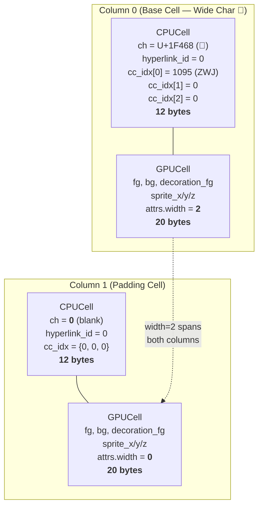
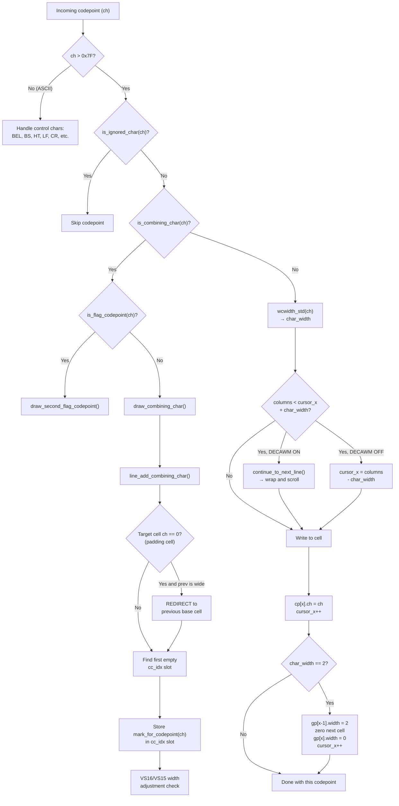
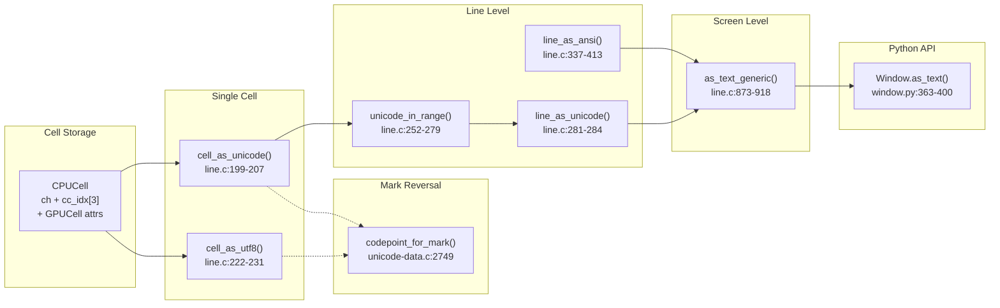
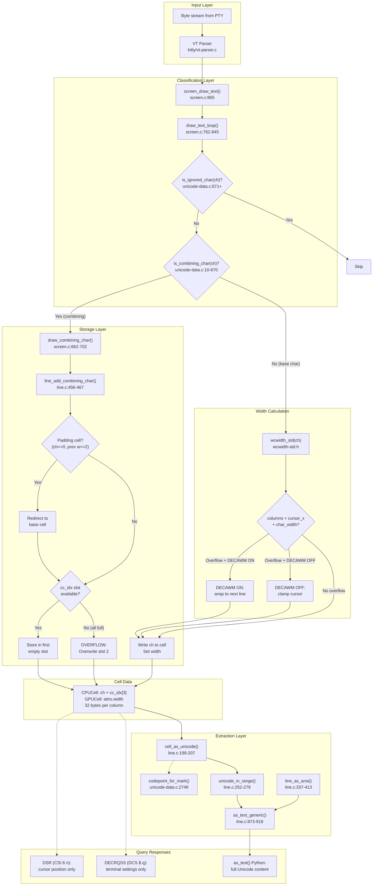

# Kitty Terminal Emulator: Unicode Processing Deep-Dive

## How ZWJ Emoji Sequences Are Handled Under Extreme Spatial Constraints

> **Source branch:** `kitty_815df1e210e0`
> **Unicode Standard version:** 15.0.0 (auto-generated tables from `gen/wcwidth.py`)
> **Analysis grounded in:** kitty C source code as the single source of truth

---

## Table of Contents

- [1. Introduction and Context](#1-introduction-and-context)
- [2. Foundational Concepts: The Cell Storage Model](#2-foundational-concepts-the-cell-storage-model)
  - [2.1 CPUCell Structure](#21-cpucell-structure)
  - [2.2 GPUCell Structure](#22-gpucell-structure)
  - [2.3 CellAttrs Union](#23-cellattrs-union)
  - [2.4 The Mark Indirection Table](#24-the-mark-indirection-table)
  - [2.5 Line and LineBuf Structures](#25-line-and-linebuf-structures)
  - [2.6 Wide Character Padding Cells](#26-wide-character-padding-cells)
  - [2.7 Cell Memory Layout Diagram](#27-cell-memory-layout-diagram)
- [3. Question 1: ZWJ Emoji in the Screen Buffer](#3-question-1-zwj-emoji-in-the-screen-buffer)
  - [3.1 Character Classification — `is_combining_char()`](#31-character-classification--is_combining_char)
  - [3.2 The Drawing Pipeline Entry Point](#32-the-drawing-pipeline-entry-point)
  - [3.3 `draw_text_loop()` — The Main Loop](#33-draw_text_loop--the-main-loop)
  - [3.4 Step-by-Step Trace: Family Emoji 👨‍👩‍👧‍👦](#34-step-by-step-trace-family-emoji-)
  - [3.5 Character Processing Pipeline Diagram](#35-character-processing-pipeline-diagram)
  - [3.6 Behavior Under Extreme Constraints](#36-behavior-under-extreme-constraints)
  - [3.7 ZWJ Emoji Cell Evolution](#37-zwj-emoji-cell-evolution)
- [4. Question 2: What the Terminal Thinks Is in the Cell](#4-question-2-what-the-terminal-thinks-is-in-the-cell)
  - [4.1 Final Cell State for Family Emoji](#41-final-cell-state-for-family-emoji)
  - [4.2 The Three-Slot Combining Character Limit](#42-the-three-slot-combining-character-limit)
  - [4.3 Implications for Complex Grapheme Clusters](#43-implications-for-complex-grapheme-clusters)
- [5. Question 3: State Reporting via Control Sequences](#5-question-3-state-reporting-via-control-sequences)
  - [5.1 Text Extraction — `cell_as_unicode()`](#51-text-extraction--cell_as_unicode)
  - [5.2 Range Extraction — `unicode_in_range()`](#52-range-extraction--unicode_in_range)
  - [5.3 ANSI Serialization — `line_as_ansi()`](#53-ansi-serialization--line_as_ansi)
  - [5.4 Cursor Position Reporting — DSR (CSI 6 n)](#54-cursor-position-reporting--dsr-csi-6-n)
  - [5.5 Setting Queries — DECRQSS (DCS $ q)](#55-setting-queries--decrqss-dcs--q)
  - [5.6 Remote Control / Python Layer — `as_text()`](#56-remote-control--python-layer--as_text)
  - [5.7 Text Extraction Pipeline Diagram](#57-text-extraction-pipeline-diagram)
- [6. Question 4: Normalization, Grapheme Breaking, and Reporting Interaction](#6-question-4-normalization-grapheme-breaking-and-reporting-interaction)
  - [6.1 The Three Stages: Classification, Segmentation, Extraction](#61-the-three-stages-classification-segmentation-extraction)
  - [6.2 Lossy Fidelity Under Constraint](#62-lossy-fidelity-under-constraint)
  - [6.3 What Does NOT Cause Loss: No Normalization](#63-what-does-not-cause-loss-no-normalization)
  - [6.4 Integrated Pipeline Diagram](#64-integrated-pipeline-diagram)
  - [6.5 Key Finding: Cell-Level vs. Grapheme-Level Model](#65-key-finding-cell-level-vs-grapheme-level-model)
- [7. Summary and Key Findings](#7-summary-and-key-findings)

---

## 1. Introduction and Context

Kitty is a GPU-accelerated terminal emulator written primarily in C (core engine), Python (configuration, UI orchestration), and Go (command-line tooling). It implements full Unicode support through a character processing pipeline that converts incoming byte streams into a cell-based screen buffer.

This document answers four specific questions about how kitty handles **Zero-Width Joiner (ZWJ) emoji sequences** — multi-codepoint emoji like the family emoji 👨‍👩‍👧‍👦 — at runtime when the terminal has almost no available space (such as a single 1×1 cell). Every technical claim is grounded in the actual source code with file paths and line numbers.

The Unicode character classification tables are auto-generated from **Unicode Standard 15.0.0** data files by the code generator at `gen/wcwidth.py`.

**The four questions addressed:**

1. How does the internal screen buffer decide what to keep when processing a ZWJ emoji sequence with almost no available space?
2. After processing, what does the terminal believe is actually present in the final cell(s)?
3. When asked to report its state via control sequences, what response is generated and how does it reflect grapheme handling?
4. How do character classification, grapheme segmentation, and state extraction interact under extreme size constraints?

---

## 2. Foundational Concepts: The Cell Storage Model

Every column in a kitty terminal line is backed by a **pair** of structures: a `CPUCell` (storing character data) and a `GPUCell` (storing rendering attributes). Understanding this dual-cell model is essential to understanding all grapheme behavior.

### 2.1 CPUCell Structure

*Source: `kitty/data-types.h:223-228`*

```c
typedef struct {
    char_type ch;                    // uint32_t — the base Unicode codepoint
    hyperlink_id_type hyperlink_id;  // uint16_t — OSC 8 hyperlink association
    combining_type cc_idx[3];        // uint16_t[3] — compact mark indices for combining chars
} CPUCell;
static_assert(sizeof(CPUCell) == 12, "Fix the ordering of CPUCell");
```

**Field breakdown (12 bytes total):**

| Field | Type | Size | Purpose |
|-------|------|------|---------|
| `ch` | `char_type` (`uint32_t`) | 4 bytes | Base Unicode codepoint. `0` means blank or padding cell |
| `hyperlink_id` | `hyperlink_id_type` (`uint16_t`) | 2 bytes | OSC 8 hyperlink association index |
| `cc_idx[3]` | `combining_type` (`uint16_t`) × 3 | 6 bytes | Three compact mark indices for combining characters |

**Critical insight:** The `cc_idx` values are **not** raw Unicode codepoints. They are compact `uint16_t` indices that map to full codepoints via the `codepoint_for_mark()` / `mark_for_codepoint()` indirection system (see [Section 2.4](#24-the-mark-indirection-table)). A `cc_idx` value of `0` means "no combining character in this slot."

The type aliases are defined at:
- `char_type` = `uint32_t` — *Source: `kitty/data-types.h:57`*
- `combining_type` = `uint16_t` — *Source: `kitty/data-types.h:62`*
- `BLANK_CHAR` = `0` — *Source: `kitty/data-types.h:115`*

### 2.2 GPUCell Structure

*Source: `kitty/data-types.h:216-221`*

```c
typedef struct {
    color_type fg, bg, decoration_fg;             // 3 × uint32_t = 12 bytes
    sprite_index sprite_x, sprite_y, sprite_z;    // 3 × uint16_t = 6 bytes
    CellAttrs attrs;                               // uint16_t union = 2 bytes
} GPUCell;
static_assert(sizeof(GPUCell) == 20, "Fix the ordering of GPUCell");
```

**Field breakdown (20 bytes total):**

| Field | Type | Size | Purpose |
|-------|------|------|---------|
| `fg` | `color_type` (`uint32_t`) | 4 bytes | Foreground color |
| `bg` | `color_type` (`uint32_t`) | 4 bytes | Background color |
| `decoration_fg` | `color_type` (`uint32_t`) | 4 bytes | Decoration (underline) color |
| `sprite_x/y/z` | `sprite_index` (`uint16_t`) × 3 | 6 bytes | Glyph sprite position in texture atlas |
| `attrs` | `CellAttrs` | 2 bytes | Packed bitfield: width, bold, italic, etc. |

The critical field for Unicode processing is `attrs.width` — a **2-bit field** that encodes how many columns this cell occupies.

### 2.3 CellAttrs Union

*Source: `kitty/data-types.h:196-209`*

```c
typedef union CellAttrs {
    struct {
        uint16_t width : 2;                  // 0=padding, 1=normal, 2=wide, 3=unused
        uint16_t decoration : 3;             // underline style
        uint16_t bold : 1;
        uint16_t italic : 1;
        uint16_t reverse : 1;
        uint16_t strike : 1;
        uint16_t dim : 1;
        uint16_t mark : 2;                   // visual mark overlay
        uint16_t next_char_was_wrapped : 1;  // soft-wrap indicator
    };
    uint16_t val;                            // raw 16-bit access
} CellAttrs;
```

**Width field semantics:**

| `attrs.width` value | Meaning |
|---------------------|---------|
| `0` | **Padding/trailer cell** — immediately follows a wide (width=2) character; its `CPUCell.ch` is `0` |
| `1` | Normal single-width character (occupies 1 column) |
| `2` | Wide character (occupies 2 columns — this is the "base" cell; the next cell is padding) |

### 2.4 The Mark Indirection Table

The combining character storage uses a compact indirection system that maps full 32-bit Unicode codepoints to 16-bit indices and back.

**`codepoint_for_mark(combining_type m)` — mark index → codepoint:**

*Source: `kitty/unicode-data.c:2749-2753`*

```c
static char_type codepoint_for_mark(combining_type m) {
    static char_type map[6425] = { 0, 173, 768, 769, 770, ... };
    if (LIKELY(m < arraysz(map))) return map[m];
    return 0;
}
```

This function converts a compact `uint16_t` mark index into the full `uint32_t` codepoint it represents, using a static lookup array of **6,425 entries**.

Sample mappings from the array:

| Mark index | Codepoint | Character |
|------------|-----------|-----------|
| 0 | 0 | (null/empty) |
| 1 | 173 (U+00AD) | Soft hyphen |
| 2–113 | 768–879 (U+0300–U+036F) | Combining diacritical marks |
| 1093 | 8203 (U+200B) | Zero-Width Space |
| 1094 | 8204 (U+200C) | Zero-Width Non-Joiner |
| **1095** | **8205 (U+200D)** | **Zero-Width Joiner (ZWJ)** |
| 1096 | 8206 (U+200E) | Left-to-Right Mark |
| 1097 | 8207 (U+200F) | Right-to-Left Mark |

**`mark_for_codepoint(char_type c)` — codepoint → mark index:**

*Source: `kitty/unicode-data.c:2755+`*

This is a massive switch statement that performs the reverse mapping. The ZWJ range is handled at:

*Source: `kitty/unicode-data.c:2912`*

```c
case 8203: case 8204: case 8205: case 8206: case 8207: return 1093 + c - 8203;
```

So `mark_for_codepoint(0x200D)` computes: `1093 + 8205 - 8203 = 1095`.

**The variation selector mark constants** are defined as:

*Source: `kitty/unicode-data.h:5`*

```c
static const combining_type VS15 = 1364, VS16 = 1365;
```

These correspond to U+FE0E (text presentation) and U+FE0F (emoji presentation) respectively.

### 2.5 Line and LineBuf Structures

*Source: `kitty/data-types.h:241-260`*

Each `Line` object contains parallel arrays of `CPUCell` and `GPUCell` of length `xnum` (the number of columns). A `LineBuf` manages multiple `Line` objects in a scrollback buffer with a `line_map` for efficient reordering.

The function `xlimit_for_line` trims trailing blank cells from a line for text extraction purposes:

*Source: `kitty/lineops.h:39-47`*

```c
static inline index_type
xlimit_for_line(const Line *line) {
    index_type xlimit = line->xnum;
    if (BLANK_CHAR == 0) {
        while (xlimit > 0 && line->cpu_cells[xlimit - 1].ch == BLANK_CHAR)
            xlimit--;
        if (xlimit < line->xnum && xlimit > 0 &&
            line->gpu_cells[xlimit-1].attrs.width == 2) xlimit++;
    }
    return xlimit;
}
```

### 2.6 Wide Character Padding Cells

When a wide character (`width=2`) is written to the screen buffer, the cell at the cursor position receives the base codepoint and `attrs.width=2`, and the **next** cell becomes a padding cell with `ch=0` and `attrs.width=0`.

The `draw_combining_char` function contains logic that redirects combining characters aimed at these padding cells back to the base cell. This redirect occurs inside `line_add_combining_char`:

*Source: `kitty/line.c:457-461`*

```c
void line_add_combining_char(CPUCell *cpu_cells, GPUCell *gpu_cells, uint32_t ch, unsigned int x) {
    CPUCell *cell = cpu_cells + x;
    if (!cell->ch) {
        if (x > 0 && (gpu_cells[x-1].attrs.width) == 2 && cpu_cells[x-1].ch)
            cell = cpu_cells + x - 1;  // REDIRECT: point to base cell of wide char
        else return;  // don't allow adding combining chars to a null cell
    }
    // ...
}
```

**Rationale:** When the cursor is positioned after a wide character (on the padding cell), any combining character that arrives is logically intended for the preceding wide character, not for the empty padding cell. This redirect ensures correct combining character attachment.

### 2.7 Cell Memory Layout Diagram



Each column is backed by a **32-byte pair** (12-byte CPUCell + 20-byte GPUCell). For a wide character, the first cell holds all the data while the second cell is a blank padding marker.

---

## 3. Question 1: ZWJ Emoji in the Screen Buffer

**Question:** When the terminal receives a ZWJ emoji sequence (e.g., 👨‍👩‍👧‍👦), how does the internal screen buffer decide what to keep when space is constrained?

### 3.1 Character Classification — `is_combining_char()`

*Source: `kitty/unicode-data.c:10-670`*

The `is_combining_char()` function is a massive auto-generated switch statement that classifies characters. The **critical line** for ZWJ processing is:

*Source: `kitty/unicode-data.c:323`*

```c
case 0x200b ... 0x200f: return true;
```

This means **all five** of these characters are classified as combining:

| Codepoint | Name | Classified As |
|-----------|------|---------------|
| U+200B | Zero-Width Space (ZWSP) | Combining |
| U+200C | Zero-Width Non-Joiner (ZWNJ) | Combining |
| **U+200D** | **Zero-Width Joiner (ZWJ)** | **Combining** |
| U+200E | Left-to-Right Mark (LRM) | Combining |
| U+200F | Right-to-Left Mark (RLM) | Combining |

**This classification is the linchpin of kitty's ZWJ handling:** because ZWJ is classified as "combining," it is never written to its own cell. Instead, it is attached as a combining character to the preceding cell via the `cc_idx` mechanism.


### 3.2 The Drawing Pipeline Entry Point

*Source: `kitty/screen.c:865-869`*

The public entry point is `screen_draw_text()`, which calls `draw_text()`. This function sets up a `text_loop_state` struct and delegates to the main processing loop:

*Source: `kitty/screen.c:517-521`*

```c
typedef struct {
    CPUCell cc;   // blank CPUCell template
    GPUCell g;    // blank GPUCell template (with current SGR attributes)
    CPUCell *cp;  // pointer to current line's CPUCell array
    GPUCell *gp;  // pointer to current line's GPUCell array
} text_loop_state;
```

The `init_text_loop_line` function (Source: `kitty/screen.c:563-571`) initializes `s->cp` and `s->gp` to point at the current line's cell arrays.

### 3.3 `draw_text_loop()` — The Main Loop

*Source: `kitty/screen.c:762-845`*

This is the core character-processing loop. It iterates through each codepoint in the input and dispatches based on character class. The relevant decision tree for non-ASCII characters (line 804+) is:

```
For each codepoint ch where ch > 0x7F (DEL):
  1. is_ignored_char(ch)?  → skip           (line 805)
  2. is_combining_char(ch)? → combining path (line 806)
     a. is_flag_codepoint(ch)? → draw_second_flag_codepoint() (line 807-808)
     b. else → draw_combining_char(self, s, ch); continue (line 809-811)
  3. Otherwise → normal character path      (line 814+)
     a. char_width = wcwidth_std(ch)        (line 814)
     b. Overflow check: columns < cursor->x + char_width (line 821)
     c. Write character to cell             (lines 835-843)
```

### 3.4 Step-by-Step Trace: Family Emoji 👨‍👩‍👧‍👦

The family emoji consists of 7 codepoints:

| # | Codepoint | Character | Role |
|---|-----------|-----------|------|
| 1 | U+1F468 | 👨 | Man |
| 2 | U+200D | — | Zero-Width Joiner |
| 3 | U+1F469 | 👩 | Woman |
| 4 | U+200D | — | Zero-Width Joiner |
| 5 | U+1F467 | 👧 | Girl |
| 6 | U+200D | — | Zero-Width Joiner |
| 7 | U+1F466 | 👦 | Boy |

We trace this sequence through `draw_text_loop()` on a **20-column screen** (the test configuration from `kitty_tests/screen.py:124`).

---

#### Step 1: U+1F468 (👨 Man)

**Classification path:**
- Line 804: `ch > DEL` → `true` (0x1F468 > 0x7F)
- Line 805: `is_ignored_char(0x1F468)` → `false`
- Line 806: `is_combining_char(0x1F468)` → `false` (emoji codepoints are not combining)

**Width calculation:**
- Line 814: `char_width = wcwidth_std(0x1F468)` → returns **2** (emoji has East Asian width = W)
  - Note: `wcwidth_std()` (Source: `kitty/wcwidth-std.h`) provides the base width lookup. For stateful width calculation (e.g., emoji presentation sequences with VS16), kitty uses `wcswidth_step()` (Source: `kitty/wcswidth.c:23-119`) which tracks emoji presentation state across codepoints. In `draw_text_loop`, however, the per-character width is obtained via the simpler `wcwidth_std()` call, and presentation selector adjustments happen separately in `draw_combining_char()` (VS16 widening at Source: `kitty/screen.c:679-698`).

**Overflow check (line 821):**
- `self->columns < self->cursor->x + (unsigned int)char_width`
- `20 < 0 + 2` → `false` — no overflow, no wrap needed

**Cell write (Source: `kitty/screen.c:835-843`):**

```c
zero_cells(s, s->cp + self->cursor->x, s->gp + self->cursor->x);  // clear cell at x=0
s->cp[self->cursor->x].ch = ch;   // cp[0].ch = 0x1F468
self->cursor->x++;                 // cursor->x = 1
if (char_width == 2) {             // TRUE for emoji
    s->gp[self->cursor->x-1].attrs.width = 2;  // gp[0].attrs.width = 2
    zero_cells(s, s->cp + self->cursor->x, s->gp + self->cursor->x);  // clear cell at x=1
    s->gp[self->cursor->x].attrs.width = 0;     // gp[1].attrs.width = 0 (padding)
    self->cursor->x++;              // cursor->x = 2
}
```

**Result:** Cell 0 has `ch=0x1F468, width=2`. Cell 1 is padding (`ch=0, width=0`). Cursor at x=2.

---

#### Step 2: U+200D (ZWJ — first occurrence)

**Classification path:**
- Line 804: `ch > DEL` → `true` (0x200D > 0x7F)
- Line 805: `is_ignored_char(0x200D)` → `false`
- Line 806: `is_combining_char(0x200D)` → **`true`** — range `0x200b ... 0x200f` at Source: `kitty/unicode-data.c:323`

**Combining character dispatch (lines 807-811):**
- Line 807: `is_flag_codepoint(0x200D)` → `false` (flag codepoints are U+1F1E6–U+1F1FF)
- Lines 809-811: Calls `draw_combining_char(self, s, 0x200D)` then `continue`

**Inside `draw_combining_char()` (Source: `kitty/screen.c:662-702`):**

- Lines 666-673: Determine the target cell position:
  - `cursor->x` is 2, which is > 0, so: `xpos = cursor->x - 1 = 1`, `ypos = cursor->y`
- Lines 677-678: Retrieve cell pointers and call:
  ```c
  line_add_combining_char(cp, gp, ch, xpos);  // ch=0x200D, xpos=1
  ```

**Inside `line_add_combining_char()` (Source: `kitty/line.c:456-467`):**

```c
CPUCell *cell = cpu_cells + 1;   // cell at position 1 (the PADDING cell)
if (!cell->ch) {                 // cell->ch IS 0 → TRUE (padding cell!)
    if (x > 0 && (gpu_cells[x-1].attrs.width) == 2 && cpu_cells[x-1].ch)
        cell = cpu_cells + x - 1;  // REDIRECT: cell → position 0 (the 👨)
    else return;
}
```

The padding cell redirect fires: cell now points to `cpu_cells[0]` (the 👨 character).

```c
for (unsigned i = 0; i < arraysz(cell->cc_idx); i++) {
    if (!cell->cc_idx[i]) {
        cell->cc_idx[i] = mark_for_codepoint(ch);  // cc_idx[0] = 1095
        return;
    }
}
```

The ZWJ is stored as mark index **1095** in `cc_idx[0]` of cell 0.

*Mark index derivation (Source: `kitty/unicode-data.c:2912`):*
`case 8203 ... 8207: return 1093 + c - 8203;` → for c=8205 (U+200D): `1093 + 8205 - 8203 = 1095`

**VS16/VS15 check (lines 679-700):** Not triggered because `ch` (0x200D) is neither 0xFE0F nor 0xFE0E.

**Result:** Cell 0 now has `cc_idx[0]=1095` (ZWJ). Cursor unchanged at x=2.

---

#### Step 3: U+1F469 (👩 Woman)

**Classification:** Not combining. `wcwidth_std(0x1F469)` → **2** (wide).

**Overflow check:** `20 < 2 + 2` → `false` — fits fine.

**Cell write:** `cp[2].ch = 0x1F469`, `gp[2].attrs.width = 2`. Cell 3 becomes padding (`ch=0, width=0`). Cursor at x=4.

---

#### Step 4: U+200D (ZWJ — second occurrence)

**Classification:** Combining → `draw_combining_char()`

- `xpos = cursor->x - 1 = 3` — padding cell for 👩
- `line_add_combining_char`: cell 3 has `ch=0`, previous cell (2) has `width=2` and `ch≠0`
- **Redirect** to cell 2 (the 👩 cell)
- Stored in `cc_idx[0]` of cell 2 as mark index **1095**

---

#### Step 5: U+1F467 (👧 Girl)

**Classification:** Not combining. Width = 2.

**Cell write:** `cp[4].ch = 0x1F467`, `gp[4].attrs.width = 2`. Cell 5 is padding. Cursor at x=6.

---

#### Step 6: U+200D (ZWJ — third occurrence)

**Classification:** Combining → redirected from padding cell 5 to base cell 4 (👧).

Stored in `cc_idx[0]` of cell 4 as mark index **1095**.

---

#### Step 7: U+1F466 (👦 Boy)

**Classification:** Not combining. Width = 2.

**Cell write:** `cp[6].ch = 0x1F466`, `gp[6].attrs.width = 2`. Cell 7 is padding. Cursor at x=8.

---

**Test validation:** The cursor position of x=8 matches the test assertion:

*Source: `kitty_tests/screen.py:128`*

```python
self.ae(s.cursor.x, 8)
```

And the string roundtrip is validated:

*Source: `kitty_tests/screen.py:126-127`*

```python
q = '\U0001f468\u200d\U0001f469\u200d\U0001f467\u200d\U0001f466'
s.draw(q)
self.ae(q, str(s.line(0)))
```

### 3.5 Character Processing Pipeline Diagram



### 3.6 Behavior Under Extreme Constraints

#### 3.6.1 Two-Column Terminal (columns=2)

On a 2-column terminal, the first wide emoji (U+1F468, width=2) fits exactly:

- **Cell write:** `cp[0].ch = 0x1F468`, `gp[0].width = 2`, cell 1 is padding, cursor at x=2.
- **ZWJ (U+200D):** Combining char → `xpos = cursor->x - 1 = 1` → padding cell redirect → stored in `cc_idx[0]` of cell 0.
- **U+1F469 (👩):** Width=2. Overflow check: `2 < 2 + 2` → **true** (Source: `kitty/screen.c:821`).
  - **DECAWM ON** (Source: `kitty/screen.c:822-825`): `continue_to_next_line(self)` wraps to next line, `init_text_loop_line(self, s)` reinitializes cell pointers. 👩 is written at x=0 of the new line with padding at x=1. Cursor at x=2.
  - **DECAWM OFF** (Source: `kitty/screen.c:826-827`): `self->cursor->x = self->columns - char_width = 2 - 2 = 0`. The character **overwrites** cell 0, replacing 👨 with 👩.

**Summary for 2-column terminals:**

| Mode | Behavior | Final State |
|------|----------|-------------|
| DECAWM ON | Each sub-emoji wraps to a new line | 4 lines, each with one sub-emoji. ZWJs are combining chars on respective base cells. |
| DECAWM OFF | Each sub-emoji overwrites the previous | 1 line with only 👦 (the last sub-emoji). All ZWJs and earlier sub-emojis lost. |

#### 3.6.2 One-Column Terminal (columns=1)

On a 1-column terminal, a width-2 emoji creates a fundamental conflict: the character requires 2 columns but only 1 exists.

**Overflow check (Source: `kitty/screen.c:821`):** `1 < 0 + 2` → **true**.

**DECAWM ON path (Source: `kitty/screen.c:822-825`):**

1. `continue_to_next_line(self)` is called (Source: `kitty/screen.c:524-528`), performing a linefeed and setting `cursor->x = 0`.
2. After the wrap, the character is written at x=0:
   - `cp[0].ch = 0x1F468`, `cursor->x` becomes 1
   - The `char_width == 2` branch writes the padding cell at `cp[1]` and `gp[1]` — column index 1 is **beyond the allocated column count** (columns=1 means only index 0 is valid)
   - `cursor->x` becomes 2

The wide character is written starting at column 0, but its padding cell spills beyond the line boundary. In practice, line buffer allocations may include slack space preventing an immediate crash, but the cursor position (x=2) far exceeds the column count.

**DECAWM OFF path (Source: `kitty/screen.c:826-827`):**

`self->cursor->x = self->columns - char_width = 1 - 2`. Since `self->columns` is `index_type` (unsigned int, defined at Source: `kitty/data-types.h:55`) and `char_width` is `int`, the mixed-sign subtraction yields an unsigned underflow — a very large number. The subsequent cell write at this underflowed position would access memory far beyond the line buffer.

> **Note:** This is an extreme edge case. Real terminal sizes of 1 column are virtually never encountered in practice, and the code does not include explicit guards for this scenario.

### 3.7 ZWJ Emoji Cell Evolution

The following table shows the complete state of cells 0–7 after processing each codepoint of the family emoji on a 20-column screen:

```mermaid
gantt
    title Cell State Evolution — Family Emoji on 20-Column Screen
    dateFormat X
    axisFormat %s

    section After U+1F468
    Cell0 ch=Man w=2       :0, 2
    Cell1 padding w=0      :2, 3

    section After ZWJ 1
    Cell0 ch=Man+ZWJ w=2   :0, 2
    Cell1 padding w=0      :2, 3

    section After U+1F469
    Cell2 ch=Woman w=2     :2, 4
    Cell3 padding w=0      :4, 5

    section After ZWJ 2
    Cell2 ch=Woman+ZWJ w=2 :2, 4
    Cell3 padding w=0      :4, 5

    section After U+1F467
    Cell4 ch=Girl w=2      :4, 6
    Cell5 padding w=0      :6, 7

    section After ZWJ 3
    Cell4 ch=Girl+ZWJ w=2  :4, 6
    Cell5 padding w=0      :6, 7

    section After U+1F466
    Cell6 ch=Boy w=2       :6, 8
    Cell7 padding w=0      :8, 9
```



**Detailed final cell state table (after all 7 codepoints are processed):**

| Column | `CPUCell.ch` | `cc_idx[0]` | `cc_idx[1]` | `cc_idx[2]` | `GPUCell.attrs.width` | Description |
|--------|-------------|-------------|-------------|-------------|----------------------|-------------|
| 0 | U+1F468 (👨) | 1095 (ZWJ) | 0 | 0 | 2 | Man + ZWJ |
| 1 | 0 | 0 | 0 | 0 | 0 | Padding for cell 0 |
| 2 | U+1F469 (👩) | 1095 (ZWJ) | 0 | 0 | 2 | Woman + ZWJ |
| 3 | 0 | 0 | 0 | 0 | 0 | Padding for cell 2 |
| 4 | U+1F467 (👧) | 1095 (ZWJ) | 0 | 0 | 2 | Girl + ZWJ |
| 5 | 0 | 0 | 0 | 0 | 0 | Padding for cell 4 |
| 6 | U+1F466 (👦) | 0 | 0 | 0 | 2 | Boy (no ZWJ follows) |
| 7 | 0 | 0 | 0 | 0 | 0 | Padding for cell 6 |

**Key insight:** The terminal does **NOT** treat `👨‍👩‍👧‍👦` as a single grapheme cluster occupying one set of cells. Instead, each person emoji is stored in its own 2-column cell pair, with the ZWJ attached as a combining character to the **preceding** person emoji's base cell. The overall sequence occupies **8 columns** (4 wide characters × 2 columns each).

---

## 4. Question 2: What the Terminal Thinks Is in the Cell

**Question:** After the emoji sequence has been fully processed, what does the terminal believe is actually present in the final cell(s)? Describe the `CPUCell.ch`, `CPUCell.cc_idx[3]`, and `GPUCell.attrs.width` values.

### 4.1 Final Cell State for Family Emoji

As traced in [Section 3.4](#34-step-by-step-trace-family-emoji-), the settled state for 👨‍👩‍👧‍👦 on a 20-column screen produces 4 base cells and 4 padding cells:

**Base cells (even columns 0, 2, 4, 6):**

| Property | Cell 0 | Cell 2 | Cell 4 | Cell 6 |
|----------|--------|--------|--------|--------|
| `CPUCell.ch` | 0x1F468 (👨) | 0x1F469 (👩) | 0x1F467 (👧) | 0x1F466 (👦) |
| `CPUCell.cc_idx[0]` | 1095 → U+200D | 1095 → U+200D | 1095 → U+200D | 0 (empty) |
| `CPUCell.cc_idx[1]` | 0 (empty) | 0 (empty) | 0 (empty) | 0 (empty) |
| `CPUCell.cc_idx[2]` | 0 (empty) | 0 (empty) | 0 (empty) | 0 (empty) |
| `GPUCell.attrs.width` | 2 | 2 | 2 | 2 |

**Padding cells (odd columns 1, 3, 5, 7):**

All padding cells are identical: `ch=0`, `cc_idx={0,0,0}`, `attrs.width=0`.

The terminal's internal belief is that it has **four separate wide emoji characters**, three of which have a ZWJ combining mark attached. The last emoji (👦) has no combining marks because no ZWJ follows it.

### 4.2 The Three-Slot Combining Character Limit

*Source: `kitty/line.c:456-467`*

The `line_add_combining_char` function has exactly **3 slots** (`cc_idx[3]`):

```c
void line_add_combining_char(CPUCell *cpu_cells, GPUCell *gpu_cells,
                             uint32_t ch, unsigned int x) {
    CPUCell *cell = cpu_cells + x;
    if (!cell->ch) {
        if (x > 0 && (gpu_cells[x-1].attrs.width) == 2 && cpu_cells[x-1].ch)
            cell = cpu_cells + x - 1;
        else return;  // don't add combining chars to a null cell
    }
    for (unsigned i = 0; i < arraysz(cell->cc_idx); i++) {
        if (!cell->cc_idx[i]) {
            cell->cc_idx[i] = mark_for_codepoint(ch);
            return;  // stored successfully in first empty slot
        }
    }
    // OVERFLOW: all 3 slots occupied — overwrite the LAST slot
    cell->cc_idx[arraysz(cell->cc_idx) - 1] = mark_for_codepoint(ch);
}
```

**Overflow behavior:** When all 3 slots are occupied and a new combining character arrives:

1. The `for` loop iterates all 3 slots without finding an empty one (`cc_idx[i] != 0` for all i)
2. The fallback at the end executes: `cell->cc_idx[2] = mark_for_codepoint(ch)` — the **last slot is overwritten** with the newest combining character

**Consequences:**
- Slots 0 and 1 are always preserved (first two combining characters are never lost)
- Slot 2 always contains the **most recently added** combining character if overflow occurred
- Any combining character that was previously in slot 2 is **silently lost**

**Test validation:**

*Source: `kitty_tests/datatypes.py:200-209`*

```python
l0.add_combining_char(0, '\u0300')      # slot 0 = mark(U+0300) — Combining Grave Accent
l0.add_combining_char(0, '\U000e0100')  # slot 1 = mark(U+E0100) — Variation Selector-17
l0.add_combining_char(0, '\u0302')      # slot 2 = mark(U+0302) — Combining Circumflex
l0.add_combining_char(0, '\u0301')      # OVERFLOW: slot 2 overwritten → mark(U+0301)
self.ae(l0[0], ' \u0300\U000e0100\u0301')  # slot 2 changed from U+0302 to U+0301
```

This test definitively confirms the last-slot-overwrite semantics: the fourth combining character (`U+0301`, Combining Acute Accent) replaced the third (`U+0302`, Combining Circumflex Accent) in slot 2.

### 4.3 Implications for Complex Grapheme Clusters

For the family emoji `👨‍👩‍👧‍👦`, each sub-emoji accumulates only **1** combining character (the ZWJ), so the 3-slot limit is **never reached**. All ZWJ marks are faithfully preserved.

However, for sequences that combine multiple modifiers on a single base cell — such as:

- A base character with 4+ diacritical marks (some Indic scripts)
- An emoji with skin tone modifier + variation selector + ZWJ (3 combining chars — exactly at the limit)
- Tag sequences (U+E0001–U+E007F) attached to a base emoji

If more than 3 combining characters are attached to a single base codepoint:
- The first two combining characters are permanently preserved
- The third slot is continuously overwritten by each subsequent combining character
- The final state contains only the **last** combining character that arrived in the third position
- All intermediate third-slot values are irretrievably lost

This means kitty's cell model introduces **lossy grapheme storage** when more than 3 combining characters are attached to a single base codepoint. The loss is **silent** — no error is raised, no notification is generated, no log entry is created.

---

## 5. Question 3: State Reporting via Control Sequences

**Question:** When the terminal is asked to report part of its current state through a control sequence query, what response is generated and how does that response reflect the grapheme handling decisions made during the write phase?

### 5.1 Text Extraction — `cell_as_unicode()`

*Source: `kitty/line.c:199-207`*

```c
size_t cell_as_unicode(CPUCell *cell, bool include_cc, Py_UCS4 *buf,
                       char_type zero_char) {
    size_t n = 1;
    buf[0] = cell->ch ? cell->ch : zero_char;
    if (include_cc) {
        for (unsigned i = 0; i < arraysz(cell->cc_idx) && cell->cc_idx[i]; i++)
            buf[n++] = codepoint_for_mark(cell->cc_idx[i]);
    }
    return n;
}
```

**Behavior:** Converts a single cell back into a sequence of Unicode codepoints:

1. First codepoint: the base character (`cell->ch`), or `zero_char` (typically a space) if the cell is blank
2. If `include_cc` is true: iterates `cc_idx[0..2]`, converts each non-zero mark index back to a full codepoint via `codepoint_for_mark()`, and appends it to the output buffer

**For the 👨 cell (column 0):** Returns `[U+1F468, U+200D]` — the base emoji plus the ZWJ (2 codepoints).

**For the 👦 cell (column 6):** Returns `[U+1F466]` — just the base emoji (1 codepoint, no combining chars).

The `codepoint_for_mark()` reverse mapping (Source: `kitty/unicode-data.c:2749-2753`) faithfully converts mark index 1095 back to codepoint U+200D, ensuring no data loss during extraction (assuming the data was not already lost during the 3-slot overflow at storage time).

### 5.2 Range Extraction — `unicode_in_range()`

*Source: `kitty/line.c:252-279`*

This function iterates over cells in a column range and builds a complete Unicode string:

1. Tracks `previous_width` to identify and skip padding cells
2. For each non-padding cell, calls `cell_as_unicode()` with `include_cc=true`
3. Adds a trailing newline if the line does not end with a wrap marker (checked via the `next_char_was_wrapped` bit in `CellAttrs`)

**Padding cell skip logic (Source: `kitty/line.c:261-267`):**

When iterating, after encountering a cell with `width=2`, the next cell (which has `ch=0, width=0`) is skipped because `previous_width == 2` signals that this cell is part of the preceding wide character.

**For the complete family emoji line:** The function visits columns 0, 2, 4, 6 (base cells) and skips columns 1, 3, 5, 7 (padding cells). Concatenated output:

```
U+1F468 U+200D U+1F469 U+200D U+1F467 U+200D U+1F466
```

This is the **original input sequence**, demonstrating a faithful roundtrip.

**Test validation:**

*Source: `kitty_tests/screen.py:126-127`*

```python
q = '\U0001f468\u200d\U0001f469\u200d\U0001f467\u200d\U0001f466'
s.draw(q)
self.ae(q, str(s.line(0)))  # roundtrip: stored == extracted
```

### 5.3 ANSI Serialization — `line_as_ansi()`

*Source: `kitty/line.c:337-413`*

The `line_as_ansi` function produces ANSI escape sequence output (with SGR attributes) for a line:

1. Iterates cells, skipping padding cells (where `ch==0` after a `width==2` cell)
2. For each cell, outputs SGR escape sequences if the graphic rendition (bold, italic, colors, etc.) changed from the previous cell
3. Writes the base character (`cell.ch`) as UTF-8
4. Writes combining characters:

```c
for (unsigned c = 0; c < arraysz(self->cpu_cells[pos].cc_idx)
     && self->cpu_cells[pos].cc_idx[c]; c++) {
    WRITE_CH(codepoint_for_mark(self->cpu_cells[pos].cc_idx[c]));
}
```

This means the ANSI-serialized output **preserves all combining characters** including ZWJ marks, making the ANSI stream a faithful representation of the stored cell data (including SGR formatting).

### 5.4 Cursor Position Reporting — DSR (CSI 6 n)

*Source: `kitty/screen.c:2178-2200`*

The Device Status Report for cursor position (DSR type 6) is handled in `report_device_status()`:

- Reports `cursor->y + 1` and `cursor->x + 1` (1-based coordinates)
- If DECOM mode is active, the y-coordinate is adjusted relative to the scroll region
- If `cursor->x >= columns`, the position is adjusted

**After drawing `👨‍👩‍👧‍👦` on a 20-column screen:** Cursor is at x=8, y=0. A DSR 6 query produces the response:

```
ESC [ 1 ; 9 R
```

(Row 1, Column 9 in 1-based indexing)

**Critical observation:** The DSR response reports **only the cursor position**. It contains **no information** about the grapheme content of any cell. The response is identical whether the cells contain ZWJ emoji, plain ASCII, or any other content. Grapheme handling decisions during the write phase affect only **where** the cursor ends up (via width calculations), not **what** the DSR reports about cell content.

### 5.5 Setting Queries — DECRQSS (DCS $ q)

*Source: `kitty/screen.c:2445-2482`*

The `screen_request_capabilities()` function handles DECRQSS queries for:

| Query Code | Setting Reported | Grapheme-Related? |
|-----------|-----------------|-------------------|
| `DECSCUSR` | Cursor shape (block, beam, underline) | No |
| `m` (SGR) | Current graphic rendition (bold, color, etc.) | No |
| `DECSTBM` | Scroll region margins (top and bottom rows) | No |
| `DECSACE` | Selection extent (stream vs. rectangular) | No |

These responses report **terminal settings and modes** — not cell content. The grapheme handling decisions made during the write phase have **zero effect** on DECRQSS responses.

### 5.6 Remote Control / Python Layer — `as_text()`

*Source: `kitty/window.py:363-400`*

The Python-layer `as_text()` method is the primary programmatic interface for retrieving screen content. The call chain is:

1. `window.as_text()` (Python) → `screen.as_text()` (C extension)
2. `screen.as_text()` → `as_text_generic()` (Source: `kitty/line.c:873-918`)
3. For each line in the requested range:
   - If `as_ansi=True`: calls `line_as_ansi()` and appends an SGR reset sequence
   - If `as_ansi=False`: calls `line_as_unicode()` (Source: `kitty/line.c:281-284`)
4. `line_as_unicode()` delegates to `unicode_in_range()` for the full line width

**Result:** The `as_text()` method **accurately reflects** the stored grapheme state. For the family emoji, it produces the complete `👨‍👩‍👧‍👦` sequence with all ZWJ characters, because the extraction pipeline faithfully converts mark indices back to codepoints.

### 5.7 Text Extraction Pipeline Diagram




---

## 6. Question 4: Normalization, Grapheme Breaking, and Reporting Interaction

**Question:** Provide an integrated explanation of how kitty's character classification, grapheme segmentation (the cell-based model with `cc_idx` slots), and state extraction interact when the terminal is under extreme size constraints.

### 6.1 The Three Stages: Classification, Segmentation, Extraction

The Unicode processing pipeline in kitty has three fundamentally different stages, each with its own model and limitations:

#### Stage 1 — Classification (`is_combining_char` — `kitty/unicode-data.c:10-670`)

- **Model:** Binary yes/no per codepoint — "Is this a combining character?"
- **Implementation:** Auto-generated switch statement from Unicode 15.0.0 data (generated by `gen/wcwidth.py`)
- **ZWJ treatment:** Classified as combining character (range `0x200b ... 0x200f` at Source: `kitty/unicode-data.c:323`)
- **Scope:** Merges Unicode general categories Mn (Non-spacing Mark), Mc (Spacing Combining Mark), Me (Enclosing Mark) with format characters (Cf including ZWJ) and other zero-width characters (ZWSP, ZWNJ, LRM, RLM)
- **Key limitation:** This is broader than the standard Unicode definition of "combining." ZWJ is technically a format character (General Category = Cf), not a combining mark, but kitty treats it as one for storage purposes.

#### Stage 2 — Segmentation (Cell-Based Model with `cc_idx` Slots)

- **Model:** "One base codepoint + up to 3 combining codepoints per cell column"
- **Implementation:** `draw_text_loop` → `draw_combining_char` → `line_add_combining_char` pipeline
- **Width assignment:** `wcwidth_std()` (Source: `kitty/wcwidth-std.h`) determines the column width of base characters
- **NOT Unicode Text Segmentation (UAX #29):** Kitty does **not** implement the Unicode Grapheme Cluster Boundary algorithm. Instead:
  - Each non-combining codepoint gets its own cell (with width determined by `wcwidth_std`)
  - Each combining codepoint is attached to the preceding cell via `cc_idx`
  - Result: each emoji in a ZWJ sequence gets **its own cell pair** because emoji codepoints are not classified as combining

**Practical difference from UAX #29:** Under Unicode grapheme clustering rules, `👨‍👩‍👧‍👦` is a **single extended grapheme cluster** that should occupy one logical position. In kitty's cell model, it occupies **4 separate cell pairs** (8 columns total). The ZWJ characters are preserved as combining marks, but the sequence is structurally decomposed across multiple columns.

#### Stage 3 — Extraction (`cell_as_unicode`, `unicode_in_range`, `line_as_ansi`)

- **Model:** Faithful reconstruction from stored cell data
- **Implementation:** Iterate cells, skip padding cells (width=0 after width=2), reverse mark indices via `codepoint_for_mark()`
- **Key property:** Extraction is a **lossless inverse** of the storage operation — it produces exactly the codepoints that were stored, in the same order. If data was lost during storage (3-slot overflow), that loss is permanent and reflected in extraction.

### 6.2 Lossy Fidelity Under Constraint

The pipeline introduces data loss in exactly two defined scenarios:

#### Scenario 1: Combining Character Overflow (3-slot limit)

*Source: `kitty/line.c:465-466`*

When a cell accumulates more than 3 combining characters, the last slot (`cc_idx[2]`) is overwritten. Extraction therefore produces fewer combining characters than were originally sent.

**Worked example:**

| Combining Char # | Codepoint | `cc_idx` After | Lost? |
|:-:|:-:|:-:|:-:|
| 1st | U+0300 | `[0300, 0, 0]` | No |
| 2nd | U+E0100 | `[0300, E0100, 0]` | No |
| 3rd | U+0302 | `[0300, E0100, 0302]` | No |
| 4th | U+0301 | `[0300, E0100, 0301]` | **U+0302 lost** |
| 5th | U+0303 | `[0300, E0100, 0303]` | **U+0301 lost** |

(Values shown as codepoints for clarity; actual storage uses mark indices.)

The extraction pipeline would produce: `base + U+0300 + U+E0100 + U+0303` — missing U+0302 and U+0301 entirely.

#### Scenario 2: Width-Constrained Terminal Overwrites (DECAWM OFF)

*Source: `kitty/screen.c:826-827`*

When DECAWM is off and a wide character does not fit, the cursor is clamped to `columns - char_width`, and the character overwrites whatever was previously at that position.

**On a 2-column terminal with DECAWM OFF processing `👨‍👩‍👧‍👦`:**

| Step | Action | Cell 0 State | Cell 1 State |
|------|--------|:---:|:---:|
| 1 | Write 👨 (w=2) | ch=👨, w=2 | padding |
| 2 | ZWJ → cc_idx[0] | ch=👨+ZWJ, w=2 | padding |
| 3 | Write 👩 → overflow, clamp to x=0 | ch=👩, w=2 | padding |
| 4 | ZWJ → cc_idx[0] | ch=👩+ZWJ, w=2 | padding |
| 5 | Write 👧 → clamp to x=0 | ch=👧, w=2 | padding |
| 6 | ZWJ → cc_idx[0] | ch=👧+ZWJ, w=2 | padding |
| 7 | Write 👦 → clamp to x=0 | ch=👦, w=2 | padding |

Final state: Only 👦 (the last sub-emoji) survives. All earlier sub-emojis and their ZWJ marks were overwritten.

Text extraction produces: `👦` — a single character. The original 7-codepoint sequence is reduced to 1.

### 6.3 What Does NOT Cause Loss: No Normalization

**Kitty does not perform NFC or NFD normalization.** Characters are stored exactly as received, with no reordering, decomposition, or composition of combining marks at any point in the pipeline.

The only character filtering is `is_ignored_char()` (Source: `kitty/unicode-data.c:671+`), which strips a small set of Unicode control characters that should never appear in terminal output. ZWJ (U+200D) is **not** in the ignored set — it is preserved as a combining character.

### 6.4 Integrated Pipeline Diagram



### 6.5 Key Finding: Cell-Level vs. Grapheme-Level Model

Kitty uses a **cell-level storage model**, not a grapheme-level model. This is a deliberate engineering trade-off with clearly defined advantages and limitations:

**Advantages of the cell-level model:**
- **Fixed, predictable memory layout:** Exactly 32 bytes per column (12 CPUCell + 20 GPUCell), regardless of content complexity
- **O(1) random access:** Any column can be accessed directly by index without scanning preceding content
- **Simple cursor arithmetic:** Cursor position is always a column index; no variable-width grapheme cluster calculations needed for cursor movement
- **Efficient rendering:** The GPU cell's sprite indices and color fields are directly adjacent in memory, enabling efficient GPU buffer uploads

**Limitations:**
- **ZWJ sequences are decomposed:** `👨‍👩‍👧‍👦` occupies 4 separate cell pairs, not one grapheme position
- **3-slot combining limit:** Characters with more than 3 combining marks experience silent data loss
- **Width-is-fixed:** The 2-bit `width` field (0–3) cannot represent emerging Unicode width requirements (e.g., proposed width-4 characters)

**Interaction under extreme constraints:**

1. **Classification** determines the code path: combining chars go to `cc_idx`, non-combining chars get their own cells
2. **Segmentation** is implicit in the cell model: each cell holds one base codepoint + up to 3 combining codepoints, with mark-index indirection providing compact storage
3. **Extraction** faithfully reverses the storage operation, but cannot recover data lost during the 3-slot overflow or DECAWM OFF overwrites
4. Under extreme width constraints (1–2 columns), the same pipeline operates with identical logic, but physical cell scarcity causes either line-splitting (DECAWM ON) or destructive overwriting (DECAWM OFF)
5. In all cases, text extraction from whatever survives in the cells is a faithful reflection of the stored state

> **Note on rendering:** Kitty's font rendering engine (`kitty/fonts.c`, `kitty/freetype.c`) may recognize ZWJ sequences at display time and render them as a single glyph using the font's GSUB/GPOS tables. This rendering-layer behavior is separate from — and operates on top of — the cell storage model documented here.

---

## 7. Summary and Key Findings

### Answer 1: ZWJ Emoji Screen Buffer Behavior

When kitty receives a ZWJ emoji sequence like 👨‍👩‍👧‍👦 (U+1F468 U+200D U+1F469 U+200D U+1F467 U+200D U+1F466):

- Each sub-emoji (👨, 👩, 👧, 👦) is classified as a **non-combining** wide character (`is_combining_char()` returns false) and gets its **own 2-column cell pair** (base cell with `width=2` + padding cell with `ch=0, width=0`).
- Each ZWJ (U+200D) is classified as a **combining** character (Source: `kitty/unicode-data.c:323`, range `0x200b ... 0x200f`) and is stored in `cc_idx[0]` of the preceding emoji's base cell as mark index **1095** (Source: `kitty/unicode-data.c:2912`, computed as `1093 + 8205 - 8203`).
- The code path is: `draw_text_loop()` (Source: `kitty/screen.c:806`) → `draw_combining_char()` (Source: `kitty/screen.c:662-702`) → `line_add_combining_char()` (Source: `kitty/line.c:456-467`), with the padding cell redirect at lines 459-461 ensuring the ZWJ attaches to the base cell, not the padding cell.
- The sequence occupies **8 columns** total (4 × 2), confirmed by test assertion `cursor.x == 8` (Source: `kitty_tests/screen.py:128`).

**Under extreme constraints:**
- **1-column terminal:** The wide character (width=2) overflows. With DECAWM ON, the character is written after a wrap but the padding cell spills beyond the line boundary. With DECAWM OFF, unsigned arithmetic underflow occurs in cursor position calculation.
- **2-column terminal:** With DECAWM ON, each sub-emoji wraps to a new line. With DECAWM OFF, each sub-emoji overwrites the previous one, leaving only the last sub-emoji (👦) in the final state.

### Answer 2: Settled Cell State

After processing, the terminal believes it contains **four separate wide emoji characters**, each in a 2-column cell pair:

- **Cells 0, 2, 4:** `CPUCell.ch` = person emoji, `CPUCell.cc_idx[0]` = 1095 (ZWJ mark index), `GPUCell.attrs.width` = 2
- **Cell 6:** `CPUCell.ch` = 0x1F466 (👦), `CPUCell.cc_idx` = {0, 0, 0} (no combining chars), `GPUCell.attrs.width` = 2
- **Cells 1, 3, 5, 7:** Padding cells with `ch=0`, `cc_idx={0,0,0}`, `attrs.width=0`

The 3-slot combining character limit (Source: `kitty/line.c:456-467`) uses **last-slot-overwrite** semantics: when all 3 `cc_idx` slots are occupied, the newest combining character replaces slot 2. This is confirmed by test (Source: `kitty_tests/datatypes.py:200-209`). For this specific sequence, only 1 of 3 slots is used per cell, so **no data loss occurs**.

### Answer 3: State Reporting

**Text content queries accurately reflect grapheme handling:**
- `cell_as_unicode()` (Source: `kitty/line.c:199-207`) reconstructs base char + combining chars by reversing mark indices via `codepoint_for_mark()`
- `unicode_in_range()` (Source: `kitty/line.c:252-279`) skips padding cells and concatenates extracted codepoints, producing the original ZWJ sequence — confirmed by test roundtrip (Source: `kitty_tests/screen.py:126-127`)
- `as_text()` (via `as_text_generic()`, Source: `kitty/line.c:873-918`) produces the complete Unicode text with all ZWJ marks intact

**Terminal state queries are unaffected by grapheme handling:**
- DSR (CSI 6 n) (Source: `kitty/screen.c:2178-2200`) reports **cursor position only** — the response reflects where the cursor ended up after width calculations, but contains no information about cell content
- DECRQSS (DCS $ q) (Source: `kitty/screen.c:2445-2482`) reports **terminal settings only** (cursor shape, SGR, scroll margins, selection extent) — completely independent of cell content

### Answer 4: Integrated Interaction Under Constraints

- **Classification** (`is_combining_char`): A binary per-codepoint decision generated from Unicode 15.0.0 data. ZWJ is "combining" (Cf category included); emoji codepoints are not. This drives the storage path.
- **Segmentation** (cell + `cc_idx` model): Not UAX #29 grapheme clustering. Each non-combining codepoint gets its own cell; combining codepoints attach via compact mark indices to the preceding cell. Maximum 3 combining chars per cell with last-slot-overwrite on overflow.
- **Extraction** (`codepoint_for_mark` reversal): Lossless reconstruction of whatever was stored. Cannot recover data lost during 3-slot overflow.
- **No normalization** is performed at any stage. Characters are stored exactly as received.
- **Under extreme constraints**, the pipeline is logically identical but physically constrained: fewer columns means more wrapping (DECAWM ON) or destructive overwriting (DECAWM OFF). Text extraction from whatever survives is always faithful to the stored state.

**The fundamental design insight:** Kitty trades **grapheme-level fidelity** for **fixed-size cell storage** with O(1) column access, accepting that complex grapheme clusters (ZWJ sequences, heavily composed characters) are stored decomposed across multiple cells or with truncated combining marks. The font rendering engine may still display them as single glyphs, but the cell storage model does not guarantee grapheme-level atomicity.

---

*Document generated from source analysis of kitty terminal emulator, branch `kitty_815df1e210e0`. All code citations reference the source files at the commit corresponding to this branch. Unicode Standard version: 15.0.0 (Source: `kitty/emoji.h` header, `gen/wcwidth.py`).*
