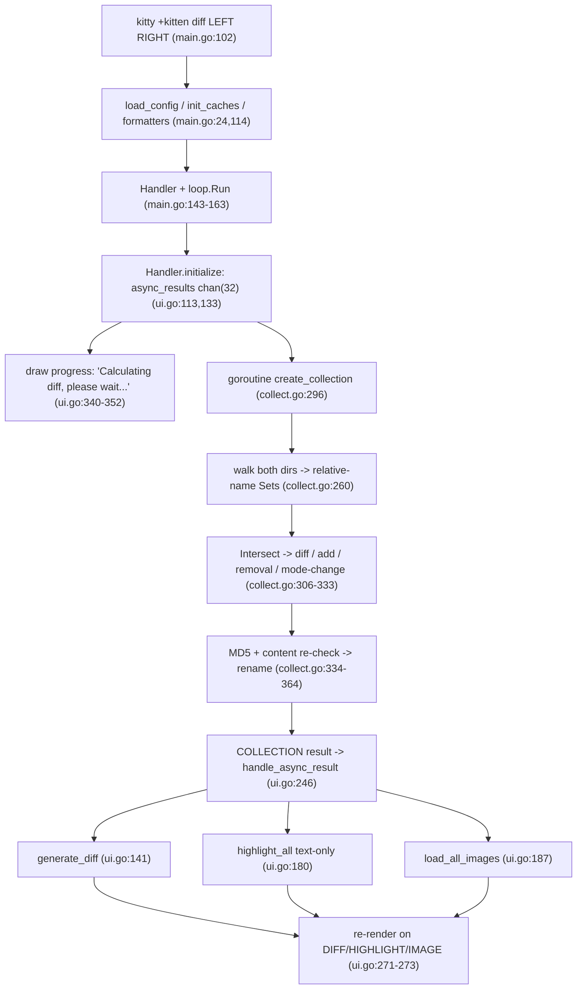

# How Kitty's "diff kitten" Works — A Runtime-Evidenced Walkthrough

This document answers eight questions about the Kitty terminal's **diff kitten**
(`kitty +kitten diff <left> <right>`). Every behavioral claim below was produced by
**building and running the kitten** and capturing its real output; the captured output is
shown next to each claim, together with the `file:line` in the source that implements the
behavior.

- **Source branch / commit:** `kitty_815df1e210e0` (`815df1e210e0a9ab4622f5c7f2d6891d7dbeddf1`).
- **Runtime environment:** Docker image
  `ghcr.io/scaleapi/swe-atlas:swe_atlas_QnA_kovidgoyal_kitty_1.0` (Ubuntu 24.04, Go 1.23.4,
  Python 3.12.3), container `kitty-diff-env`. The container is the *same commit* as the source
  checkout, so the `file:line` citations match the tree byte-for-byte.
- **Canonical entry point** (used for every run unless a line is explicitly labeled otherwise):
  ```
  ./kitty/launcher/kitty +kitten diff <LEFT> <RIGHT>
  ```
  The diff kitten is a full-screen TUI that opens `/dev/tty`, so runs are transported through a
  small PTY driver (`ptycap.py`, shown below). The driver only supplies a headless terminal — the
  program it launches is exactly the canonical `kitty +kitten diff …` argv, so these are genuine
  canonical-entry-point observations.

**Evidence labels used throughout**

- **[OBSERVED]** — captured from a real run of the canonical entry point.
- **[INFERRED]** — read from the source; not directly observable in this headless harness (always
  paired with the reason it could not be observed).
- **[NON-CANONICAL]** — obtained through a path other than the canonical entry point (e.g. a
  race-instrumented build of the same kitten, or a direct `runtime` probe). Used only as a
  supplement, always labeled.

---

## Methodology / Harness

### Build (must happen before any run)

A bare `go build ./kittens/diff/` fails without Kitty's code-generation step (it produces the root
`kitty` package and the `go:embed` targets). The project is therefore built through `setup.py`:

```console
$ cd /app && python3 setup.py            # exit status captured below
```

Observed result — **exit status 0** [OBSERVED]. Full output (`/tmp/dk_captures/setup_build.log`):

```text
[1/5] Compiling [wayland] glfw/input.c ...
[2/5] Compiling [wayland] glfw/xkb_glfw.c ...
[3/5] Compiling [wayland] glfw/window.c ...
[4/5] Compiling [wayland] glfw/wl_init.c ...
[5/5] Compiling [wayland] glfw/egl_context.c ...
 done
[1/1] Linking [wayland] kitty/glfw-wayland ...
 done
github.com/klauspost/cpuid/v2
kitty/tools/crypto
kitty/tools/cmd/mouse_demo
kitty/kittens/hyperlinked_grep
kitty/kittens/query_terminal
kitty/kittens/show_key
kitty/tools/cmd/show_error
kitty/kittens/ask
kitty/tools/cmd/update_self
kitty/tools/cmd/run_shell
kitty/tools/cmd/edit_in_kitty
kitty/kittens/hints
kitty/kittens/clipboard
kitty/tools/unicode_names
kitty/tools/cmd/benchmark
kitty/kittens/themes
kitty/kittens/icat
kitty/tools/cmd/pytest
kitty/kittens/choose_fonts
kitty/tools/cmd/at
kitty/kittens/unicode_input
github.com/zeebo/xxh3
kitty/tools/rsync
kitty/kittens/transfer
kitty/tools/cmd/tool
kitty/tools/cmd/completion
```

The build was incremental (the image ships pre-built at this commit), so only the C GLFW backend
and the Go tool/kitten binaries relink. The generated root package lives at repository-root
`constants_generated.go` (Go package `kitty`), and the `go:embed` target is
`tools/tui/shell_integration/data_generated.bin` ([tools/tui/shell_integration/data.go:19]).

The kitten's own help confirms the entry point and usage string [OBSERVED]:

```console
$ ./kitty/launcher/kitty +kitten diff --help
```
```text
Usage: kitten diff [options] file_or_directory_left file_or_directory_right

Show a side-by-side diff of the specified files/directories. You can also use
ssh:hostname:remote-file-path to diff remote files.

Options:
  --context [=-1]
    Number of lines of context to show between changes. Negative values use the
    number set in diff.conf.

  --config
    Specify a path to the configuration file(s) to use. ...

  --override, -o
    Override individual configuration options, can be specified multiple times.
    Syntax: name=value. For example: -o background=gray

  --help, -h
    Show help for this command

kitten diff 0.35.2 created by Kovid Goyal
```

The usage string comes from [kittens/diff/main.py:296]; the "Must be run as kitten diff" guard is
[kittens/diff/main.py:14].

### Harness scripts (verbatim)

All fixtures live **outside** the source tree under `/tmp/dk_fixtures`, and every script lives under
`/tmp/dk_harness`; both are removed at the end (see *Cleanliness / integrity note*). The scripts are
reproduced in full so every run below is reproducible.

**`make_fixtures.sh`** — builds all fixtures deterministically (idempotent: wipes and recreates):

```bash
#!/usr/bin/env bash
# Build all diff-kitten test fixtures OUTSIDE the source tree, under $ROOT.
# Deterministic and idempotent: it wipes and recreates $ROOT every run.
set -eu
ROOT=${1:-/tmp/dk_fixtures}
rm -rf "$ROOT"
mkdir -p "$ROOT"

# ---- F1: pairing / classification ---------------------------------------
mkdir -p "$ROOT/F1/left" "$ROOT/F1/right"
# same.txt: identical content AND identical mode  -> NO entry
printf 'alpha\nbeta\ngamma\n' > "$ROOT/F1/left/same.txt"
printf 'alpha\nbeta\ngamma\n' > "$ROOT/F1/right/same.txt"
# app.go: same relative path, different content    -> diff
printf 'package main\n\nimport "fmt"\n\nfunc main() {\n\tfmt.Println("hello")\n}\n' > "$ROOT/F1/left/app.go"
printf 'package main\n\nimport "fmt"\n\nfunc main() {\n\tname := "world"\n\tfmt.Println("hello", name)\n}\n' > "$ROOT/F1/right/app.go"
# script.sh: same relative path, same content, different MODE -> mode-only change
printf '#!/bin/sh\necho hi\n' > "$ROOT/F1/left/script.sh"
printf '#!/bin/sh\necho hi\n' > "$ROOT/F1/right/script.sh"
chmod 0644 "$ROOT/F1/left/script.sh"
chmod 0755 "$ROOT/F1/right/script.sh"
# only_left / only_right                            -> removal / addition
printf 'this file exists only on the left\nit will be removed\n' > "$ROOT/F1/left/only_left.txt"
printf 'this file exists only on the right\nit is newly added\n' > "$ROOT/F1/right/only_right.txt"

# ---- F1b: nested-directory pairing --------------------------------------
mkdir -p "$ROOT/F1b/left/sub/deep" "$ROOT/F1b/right/sub/deep"
printf 'nested original\ncommon tail\n' > "$ROOT/F1b/left/sub/deep/nested.txt"
printf 'nested changed\ncommon tail\n'  > "$ROOT/F1b/right/sub/deep/nested.txt"

# ---- F2: true rename (byte-identical, different relative path) ----------
mkdir -p "$ROOT/F2/left" "$ROOT/F2/right"
printf 'def greet():\n    return "hi"\n' > "$ROOT/F2/left/old_name.py"
printf 'def greet():\n    return "hi"\n' > "$ROOT/F2/right/new_name.py"

# ---- F3: rename hash-gate counter-case (different content) --------------
mkdir -p "$ROOT/F3/left" "$ROOT/F3/right"
printf 'this file is going away\n'   > "$ROOT/F3/left/gone.txt"
printf 'this file is brand new\n'     > "$ROOT/F3/right/brandnew.txt"

# ---- F4: 60 files per side, 10 languages, each 5-line -> 6-line ---------
mkdir -p "$ROOT/F4/left" "$ROOT/F4/right"
exts=(go py js c rs java rb ts sh lua)
for i in $(seq 1 60); do
  ext=${exts[$(( (i-1) % 10 ))]}
  f="mod_${i}.${ext}"
  printf 'line1 file %s ext %s\nfunc_%s_original()\ncommon_a\ncommon_b\ntail_%s\n' "$i" "$ext" "$i" "$i" > "$ROOT/F4/left/$f"
  printf 'line1 file %s ext %s\nfunc_%s_changed()\ncommon_a\nEXTRA_LINE_1\ncommon_b\ntail_%s\n' "$i" "$ext" "$i" "$i" > "$ROOT/F4/right/$f"
done

# ---- F5: binary blob (non-UTF-8), changed between sides -----------------
mkdir -p "$ROOT/F5/left" "$ROOT/F5/right"
head -c 4096 /dev/urandom > "$ROOT/F5/left/blob.bin"
head -c 8192 /dev/urandom > "$ROOT/F5/right/blob.bin"
# guarantee a non-UTF-8 byte at the front so is_path_text() is false deterministically
printf '\xff\xfe\x00\x01' | dd of="$ROOT/F5/left/blob.bin"  bs=1 seek=0 conv=notrunc 2>/dev/null
printf '\xff\xfe\x00\x02' | dd of="$ROOT/F5/right/blob.bin" bs=1 seek=0 conv=notrunc 2>/dev/null

# ---- F6: real PNG/JPEG images: added / changed / removed ----------------
mkdir -p "$ROOT/F6/left" "$ROOT/F6/right"
python3 - "$ROOT" <<'PY'
import sys
from PIL import Image
root = sys.argv[1]
Image.new("RGB", (64, 48), (10, 20, 200)).save(f"{root}/F6/left/changed.png")
Image.new("RGB", (80, 60), (200, 20, 10)).save(f"{root}/F6/right/changed.png")
Image.new("RGB", (40, 40), (0, 180, 0)).save(f"{root}/F6/left/removed.png")
Image.new("RGB", (50, 50), (180, 180, 0)).save(f"{root}/F6/right/added.jpg", quality=90)
PY

# ---- F7: 5-line vs 6-line pair for differ comparison + anchors ----------
mkdir -p "$ROOT/F7/left" "$ROOT/F7/right"
printf 'one\ntwo\nthree\nfour\nfive\n'        > "$ROOT/F7/left/sample.txt"
printf 'one\ntwo\nNEW\nthree\nfour\nfive\n'   > "$ROOT/F7/right/sample.txt"

echo "FIXTURES_BUILT_AT=$ROOT"
```

Two additional tiny fixtures are created ad hoc in the relevant sections: **F8** (a balanced
one-line modification, for Q8's intra-line highlighting) and **F9** (a `.pyc` file, for Q7's
`ignore_name`). Their exact `printf` commands are shown inline where they are used.

**`ptycap.py`** — the PTY driver. It writes the complete raw VT byte stream to an explicit path plus
a timestamped chunk log, lets the UI settle, sends `q`, and reaps the child:

```python
#!/usr/bin/env python3
# PTY capture driver for the diff-kitten TUI (a full-screen program that opens /dev/tty).
# Usage: ptycap.py <out_raw> <quit_after_s> -- <cmd> [args...]
import os, pty, sys, time, select, fcntl, termios, struct, signal, json

if "--" not in sys.argv:
    sys.stderr.write("usage: ptycap.py <out_raw> <quit_after_s> -- <cmd...>\n"); sys.exit(2)
sep = sys.argv.index("--")
out_raw = sys.argv[1]
quit_after = float(sys.argv[2])
cmd = sys.argv[sep+1:]
ROWS = int(os.environ.get("DK_ROWS", "50"))
COLS = int(os.environ.get("DK_COLS", "220"))
HARD_TIMEOUT = quit_after + 3.0

pid, fd = pty.fork()
if pid == 0:
    try:
        fcntl.ioctl(1, termios.TIOCSWINSZ, struct.pack("HHHH", ROWS, COLS, 0, 0))
    except Exception:
        pass
    env = dict(os.environ); env["TERM"] = "xterm-256color"
    try:
        os.execvpe(cmd[0], cmd, env)
    except Exception as e:
        sys.stderr.write("exec failed: %s\n" % e); os._exit(127)

try:
    fcntl.ioctl(fd, termios.TIOCSWINSZ, struct.pack("HHHH", ROWS, COLS, 0, 0))
except Exception:
    pass

def reap(nonblock=True):
    try:
        w, _ = os.waitpid(pid, os.WNOHANG if nonblock else 0)
        return w != 0
    except ChildProcessError:
        return True
    except Exception:
        return False

out = bytearray(); chunks = []
start = time.time(); sent_q = False; killed = False
while True:
    r, _, _ = select.select([fd], [], [], 0.05)
    if fd in r:
        try:
            d = os.read(fd, 65536)
        except OSError:
            break
        if not d:
            break
        out.extend(d)
        chunks.append((time.time() - start, d.hex()))
    el = time.time() - start
    if el > quit_after and not sent_q:
        try: os.write(fd, b"q")
        except OSError: pass
        sent_q = True
    if el > quit_after + 1.0 and not killed:
        try: os.kill(pid, signal.SIGTERM)
        except OSError: pass
        killed = True
    if el > HARD_TIMEOUT:
        try: os.kill(pid, signal.SIGKILL)
        except OSError: pass
        break
for _ in range(20):
    if reap(nonblock=True):
        break
    time.sleep(0.05)
try: os.close(fd)
except OSError: pass

raw = bytes(out)
with open(out_raw, "wb") as f:
    f.write(raw)
with open(out_raw + ".chunks.jsonl", "w") as f:
    for t, h in chunks:
        f.write(json.dumps({"t": round(t, 4), "b": h}) + "\n")
print("RAW_BYTES=%d CHUNKS=%d" % (len(raw), len(chunks)))
```

**`vtframes.py`** — reconstructs the terminal screen from the raw stream. A *frame* is one
synchronized update delimited by `ESC[?2026h … ESC[?2026l` (terminal "pending update" mode 2026,
emitted by Kitty's `escape_code` for `PENDING_UPDATE` at [tools/tui/loop/terminal-state.go:71]).
`--final` renders the cumulative final screen; `--list` lists frames and whether each carried 24-bit
truecolor SGR (i.e. syntax highlighting); `--frame N`/`--all` render frames in isolation. (Colors are
stripped for the plain-text `--final`/`--frame` views; a separate helper `sgruns.py`, shown in Q8,
extracts background-color runs when color matters.)

```python
#!/usr/bin/env python3
# VT reconstructor: vtframes.py <raw> [--final|--list|--frame N|--all]
# A frame = one synchronized update ESC[?2026h .. ESC[?2026l (mode 2026).
import sys, re, os
ROWS = int(os.environ.get("DK_ROWS", "50"))
COLS = int(os.environ.get("DK_COLS", "220"))
raw = open(sys.argv[1], "rb").read().decode("utf-8", "replace")
mode = sys.argv[2] if len(sys.argv) > 2 else "--final"
argN = int(sys.argv[3]) if len(sys.argv) > 3 else None
TRUECOLOR = re.compile(r"\x1b\[[0-9;:]*38[:;]2[:;]")

def apply(seg, grid=None):
    if grid is None:
        grid = [[" "] * COLS for _ in range(ROWS)]
    cr = cc = 0
    def clampr(r): return max(0, min(ROWS - 1, r))
    def clampc(c): return max(0, min(COLS - 1, c))
    i, n = 0, len(seg)
    while i < n:
        ch = seg[i]
        if ch == "\x1b":
            m = re.match(r"\x1b\][^\x07]*\x07", seg[i:])           # OSC
            if m: i += m.end(); continue
            m = re.match(r"\x1b[PX^_].*?\x1b\\", seg[i:], re.S)      # DCS/APC/PM/SOS
            if m: i += m.end(); continue
            m = re.match(r"\x1b\[([0-9;:?]*)([@-~])", seg[i:])       # CSI
            if m:
                params, fin = m.group(1), m.group(2)
                nums = [int(x) for x in re.split("[;:]", params) if x.isdigit()]
                if fin in "Hf":
                    r = (nums[0]-1) if len(nums) >= 1 else 0
                    c = (nums[1]-1) if len(nums) >= 2 else 0
                    cr, cc = clampr(r), clampc(c)
                elif fin == "A": cr = clampr(cr - (nums[0] if nums else 1))
                elif fin == "B": cr = clampr(cr + (nums[0] if nums else 1))
                elif fin == "C": cc = clampc(cc + (nums[0] if nums else 1))
                elif fin == "D": cc = clampc(cc - (nums[0] if nums else 1))
                elif fin == "G": cc = clampc((nums[0]-1) if nums else 0)
                elif fin == "d": cr = clampr((nums[0]-1) if nums else 0)
                elif fin == "J":
                    md = nums[0] if nums else 0
                    if md == 0:
                        for c in range(cc, COLS): grid[cr][c] = " "
                        for r in range(cr+1, ROWS):
                            for c in range(COLS): grid[r][c] = " "
                    elif md == 1:
                        for r in range(0, cr):
                            for c in range(COLS): grid[r][c] = " "
                        for c in range(0, cc+1): grid[cr][c] = " "
                    else:
                        for r in range(ROWS):
                            for c in range(COLS): grid[r][c] = " "
                elif fin == "K":
                    md = nums[0] if nums else 0
                    if md == 0:
                        for c in range(cc, COLS): grid[cr][c] = " "
                    elif md == 1:
                        for c in range(0, cc+1): grid[cr][c] = " "
                    else:
                        for c in range(COLS): grid[cr][c] = " "
                i += m.end(); continue
            i += 2; continue
        if ch == "\r": cc = 0; i += 1; continue
        if ch == "\n": cr = clampr(cr + 1); cc = 0; i += 1; continue
        if ch == "\t": cc = clampc((cc // 8 + 1) * 8); i += 1; continue
        if ch == "\x08": cc = clampc(cc - 1); i += 1; continue
        if ch == "\x07": i += 1; continue
        if ord(ch) >= 32:
            grid[cr][cc] = ch; cc += 1
            if cc >= COLS: cc = COLS - 1
        i += 1
    return grid

def dump(grid):
    lines = ["".join(row).rstrip() for row in grid]
    while lines and not lines[-1].strip(): lines.pop()
    print("\n".join([l for l in lines if l.strip()]))

starts = [m.start() for m in re.finditer(r"\x1b\[\?2026h", raw)]
frames = []
for idx, s in enumerate(starts):
    e = starts[idx+1] if idx+1 < len(starts) else len(raw)
    frames.append((s, e, raw[s:e]))

if mode == "--final":
    dump(apply(raw))
elif mode == "--list":
    print("FRAMES=%d" % len(frames))
    for idx, (s, e, seg) in enumerate(frames):
        has = "yes" if TRUECOLOR.search(seg) else "no"
        g = apply(seg); nonblank = [l for l in ("".join(r).rstrip() for r in g) if l.strip()]
        print("frame %d: bytes[%d:%d] truecolor=%s first_line=%r" %
              (idx, s, e, has, (nonblank[0][:60] if nonblank else "(blank)")))
elif mode == "--frame":
    dump(apply(frames[argN][2]))
elif mode == "--all":
    for idx, (s, e, seg) in enumerate(frames):
        print("======== FRAME %d (bytes %d:%d) ========" % (idx, s, e)); dump(apply(seg))
```

**`gkeys.py`** — extracts Kitty Graphics Protocol chunks (`ESC _ G <keys> ; <payload> ESC \`) from a
raw stream and classifies each by its action key `a=`:

```python
#!/usr/bin/env python3
# Classify Kitty Graphics Protocol (APC _G) chunks by action key a=.
#   a=q query  a=t transmit  a=T transmit+display  a=p display  a=d delete  a=f frame  a=a animate
import sys, re
raw = open(sys.argv[1], "rb").read()
chunks = re.findall(rb"\x1b_G([^\x1b]*)(?:;[^\x1b]*)?\x1b\\", raw)
ACT = {"q":"query","t":"transmit","T":"transmit+display","p":"display",
       "d":"delete","f":"frame","a":"animate","c":"compose"}
print("G_CHUNKS=%d" % len(chunks))
from collections import Counter
counts = Counter()
for idx, keys in enumerate(chunks):
    ks = keys.decode("ascii", "replace")
    m = re.search(r"(?:^|,)a=([a-zA-Z])", ks)
    act = ACT.get(m.group(1), "?"+(m.group(1) if m else "")) if m else "(no a= : default transmit)"
    counts[act] += 1
    if idx < 8:
        print("chunk %d: a-action=%-16s keys=%s" % (idx, act, ks))
print("ACTION_COUNTS=%s" % dict(counts))
```

### Fixtures at a glance

| Fixture | Purpose | Left → Right |
|---|---|---|
| **F1** | pairing / classification | `same.txt` (identical), `app.go` (changed), `script.sh` (mode 0644→0755), `only_left.txt`, `only_right.txt` |
| **F1b** | nested pairing | `sub/deep/nested.txt` changed |
| **F2** | true rename | `old_name.py` → `new_name.py` (byte-identical) |
| **F3** | rename counter-case | `gone.txt` vs `brandnew.txt` (different content) |
| **F4** | many files | 60 files/side, 10 extensions, each 5→6 lines |
| **F5** | binary | `blob.bin` 4096→8192 bytes, non-UTF-8 |
| **F6** | images | `changed.png` 64×48→80×60, `removed.png` (left), `added.jpg` (right) |
| **F7** | differ / anchors | `sample.txt` 5→6 lines (one insertion) |

---

## Q1 — Directory pairing: which left file "belongs together" with which right file?

**Answer.** Pairing is **by identical path relative to each root**. The kitten walks both directory
trees, builds a `Set` of relative paths for each side, and **intersects** them: a relative path that
exists on both sides is one logical file to be compared; a path only on the left is a *removal*; a
path only on the right is an *addition*. There is no fuzzy or content-based name matching at this
stage. Even when the bytes are identical, a difference in file **mode** still registers as a change.

**Mechanism (`file:line`).** `collect_files` [kittens/diff/collect.go:296] calls `walk`
[kittens/diff/collect.go:260] (which uses `filepath.WalkDir`) to gather each side's relative paths
into a `Set`, filtered by the `allowed`/`ignore_name` glob test [kittens/diff/collect.go:230]. It
then computes `common_names = left_names.Intersect(right_names)` [kittens/diff/collect.go:306]. Each
common name becomes a change via `add_change` [kittens/diff/collect.go:317]; if the two files have
identical content it is still emitted when `os.Stat().Mode()` differs
[kittens/diff/collect.go:321-327]. Left-only names become removals and right-only names become
additions [kittens/diff/collect.go:332-333].

**Run & output** [OBSERVED] — fixture **F1**:

```console
$ python3 /tmp/dk_harness/make_fixtures.sh
$ DK_ROWS=40 DK_COLS=120 python3 /tmp/dk_harness/ptycap.py /tmp/dk_captures/F1.raw 2.0 -- \
      ./kitty/launcher/kitty +kitten diff /tmp/dk_fixtures/F1/left /tmp/dk_fixtures/F1/right
$ DK_ROWS=40 DK_COLS=120 python3 /tmp/dk_harness/vtframes.py /tmp/dk_captures/F1.raw --final
```
```text
   app.go
━━━━━━━━━━━━━━━━━━━━━━━━━━━━━━━━━━━━━━━━━━━━━━━━━━━━━━━━━━━━━━━━━━━━━━━━━━━━━━━━━━━━━━━━━━━━━━━━━━━━━━━━━━━━━━━━━━━━━━━━
   @@ -3,5 +3,6 @@ package main
3  import "fmt"                                             3  import "fmt"
4                                                           4
5  func main() {                                            5  func main() {
6      fmt.Println("hello")                                 6      name := "world"
                                                            7      fmt.Println("hello", name)
7  }                                                        8  }
   only_left.txt
━━━━━━━━━━━━━━━━━━━━━━━━━━━━━━━━━━━━━━━━━━━━━━━━━━━━━━━━━━━━━━━━━━━━━━━━━━━━━━━━━━━━━━━━━━━━━━━━━━━━━━━━━━━━━━━━━━━━━━━━
1  this file exists only on the left                           This file was removed
2  it will be removed
   only_right.txt
━━━━━━━━━━━━━━━━━━━━━━━━━━━━━━━━━━━━━━━━━━━━━━━━━━━━━━━━━━━━━━━━━━━━━━━━━━━━━━━━━━━━━━━━━━━━━━━━━━━━━━━━━━━━━━━━━━━━━━━━
   This file was added                                      1  this file exists only on the right
                                                            2  it is newly added
   script.sh
━━━━━━━━━━━━━━━━━━━━━━━━━━━━━━━━━━━━━━━━━━━━━━━━━━━━━━━━━━━━━━━━━━━━━━━━━━━━━━━━━━━━━━━━━━━━━━━━━━━━━━━━━━━━━━━━━━━━━━━━
   Mode changed: -rw-r--r-- to -rwxr-xr-x
:                                                                                                                4,3  0d
```

**Cause → effect, item by item:**

- `app.go` — same relative path, different bytes → a **diff** with hunk header `@@ -3,5 +3,6 @@`
  (the intersection produced one paired file).
- `only_left.txt` — present only on the left → **removal** ("This file was removed" on the right
  half).
- `only_right.txt` — present only on the right → **addition** ("This file was added" on the left
  half).
- `script.sh` — identical bytes, mode `0644`→`0755` → still a change: **"Mode changed:
  -rw-r--r-- to -rwxr-xr-x"** (the `Mode()` comparison at [kittens/diff/collect.go:321-327]).
- `same.txt` — identical content *and* mode → **absent** from the output entirely (no pairing entry
  is emitted).

The status line `4,3  0d` shows the collection produced changes across the paired/added/removed
files; the trailing `0d` is the scroll fraction (top of a non-scrolling screen).

**Pairing is on the *relative* path, including nested directories** [OBSERVED] — fixture **F1b**:

```console
$ DK_ROWS=40 DK_COLS=120 python3 /tmp/dk_harness/ptycap.py /tmp/dk_captures/F1b.raw 2.0 -- \
      ./kitty/launcher/kitty +kitten diff /tmp/dk_fixtures/F1b/left /tmp/dk_fixtures/F1b/right
$ DK_ROWS=40 DK_COLS=120 python3 /tmp/dk_harness/vtframes.py /tmp/dk_captures/F1b.raw --final
```
```text
   sub/deep/nested.txt
━━━━━━━━━━━━━━━━━━━━━━━━━━━━━━━━━━━━━━━━━━━━━━━━━━━━━━━━━━━━━━━━━━━━━━━━━━━━━━━━━━━━━━━━━━━━━━━━━━━━━━━━━━━━━━━━━━━━━━━━
   @@ -1,2 +1,2 @@
1  nested original                                          1  nested changed
2  common tail                                              2  common tail
:                                                                                                                1,1  0d
```

The file is paired under its full relative path `sub/deep/nested.txt` — confirming the `Set` keys are
paths relative to each root, so identical sub-trees line up correctly.

---

## Q2 — Rename recognition: rename vs. delete-plus-add

**Answer.** After the relative-path intersection (Q1), the kitten has a set of *left-only* files
(candidate removals) and *right-only* files (candidate additions). It computes an **MD5 hash** of
each such file; when a removed file and an added file have the **same hash**, it performs a **full
byte-for-byte content re-check**, and only if that also matches does it promote the pair to a
**rename** (discarding it from the additions so it is not double-counted). The hash is a fast filter;
the content re-check guards against hash collisions.

**Mechanism (`file:line`).** The rename block is [kittens/diff/collect.go:334-364]. `hash_for_path`
computes `md5.Sum` [kittens/diff/collect.go:106-114]. For each removed/added pair with equal hashes
it re-reads and compares the full content [kittens/diff/collect.go:351-353]; on a match it calls
`add_rename` [kittens/diff/collect.go:354] and `Discard`s the file from the added set
[kittens/diff/collect.go:355]. Unmatched left-only/right-only files fall through to `add_removal`
[kittens/diff/collect.go:362] and `add_add`.

**Run & output** [OBSERVED] — fixture **F2** (`old_name.py` and `new_name.py`, byte-identical):

```console
$ md5sum /tmp/dk_fixtures/F2/left/old_name.py /tmp/dk_fixtures/F2/right/new_name.py
484b44ab524eb3204fe2e5af53b60432  /tmp/dk_fixtures/F2/left/old_name.py
484b44ab524eb3204fe2e5af53b60432  /tmp/dk_fixtures/F2/right/new_name.py
$ DK_ROWS=40 DK_COLS=120 python3 /tmp/dk_harness/ptycap.py /tmp/dk_captures/F2.raw 2.0 -- \
      ./kitty/launcher/kitty +kitten diff /tmp/dk_fixtures/F2/left /tmp/dk_fixtures/F2/right
$ DK_ROWS=40 DK_COLS=120 python3 /tmp/dk_harness/vtframes.py /tmp/dk_captures/F2.raw --final
```
```text
   old_name.py                                                 new_name.py
━━━━━━━━━━━━━━━━━━━━━━━━━━━━━━━━━━━━━━━━━━━━━━━━━━━━━━━━━━━━━━━━━━━━━━━━━━━━━━━━━━━━━━━━━━━━━━━━━━━━━━━━━━━━━━━━━━━━━━━━
:                                                                                                                0,0  0d
```

The two hashes are identical (`484b44ab…`), so the pair is recognized as a **rename**: it is a
*single* entry whose title shows the **old name on the left and the new name on the right**, not a
separate removal + addition. The status line reads `0,0  0d` — zero added and zero removed lines,
because a pure rename changes no content.

**A subtle, honest detail about the rendered body.** The rename entry's *title* (two columns) renders
correctly, but the human-readable body line the code builds — `"The file <old> was renamed to
<new>"` — **never appears on screen**. This is confirmed directly: grepping the raw VT stream finds
zero occurrences of the body text [OBSERVED]:

```console
$ grep -ac "renamed" /tmp/dk_captures/F2.raw
0
$ grep -ac "The file" /tmp/dk_captures/F2.raw
0
```

Cause (mechanism is [INFERRED] from source; the *absence* is [OBSERVED] above): `rename_lines`
[kittens/diff/render.go:684-693] places the body text into the **right half**
(`sl.right.marked_up_text`) of a line flagged `is_full_width`. But `render_screen_line` returns early
after emitting only the **left** half of a full-width line [kittens/diff/render.go:99-100], so the
right-half body text is never written to the terminal. The net observable behavior is exactly what
the screen shows: two title columns and no body sentence.

**Counter-case — same names would collide, so different *content* must NOT be a rename** [OBSERVED]
— fixture **F3** (`gone.txt` vs `brandnew.txt`, different content ⇒ different hashes):

```console
$ md5sum /tmp/dk_fixtures/F3/left/gone.txt /tmp/dk_fixtures/F3/right/brandnew.txt
d82f9142b5febfe18e7a59f5905d4d46  /tmp/dk_fixtures/F3/left/gone.txt
41078de5cd15745a0a912d2bba59862b  /tmp/dk_fixtures/F3/right/brandnew.txt
$ DK_ROWS=40 DK_COLS=120 python3 /tmp/dk_harness/vtframes.py /tmp/dk_captures/F3.raw --final
```
```text
   brandnew.txt
━━━━━━━━━━━━━━━━━━━━━━━━━━━━━━━━━━━━━━━━━━━━━━━━━━━━━━━━━━━━━━━━━━━━━━━━━━━━━━━━━━━━━━━━━━━━━━━━━━━━━━━━━━━━━━━━━━━━━━━━
   This file was added                                      1  this file is brand new
   gone.txt
━━━━━━━━━━━━━━━━━━━━━━━━━━━━━━━━━━━━━━━━━━━━━━━━━━━━━━━━━━━━━━━━━━━━━━━━━━━━━━━━━━━━━━━━━━━━━━━━━━━━━━━━━━━━━━━━━━━━━━━━
1  this file is going away                                     This file was removed
:                                                                                                                1,1  0d
```

The hashes differ (`d82f9142…` vs `41078de5…`), so the content re-check gate is never even reached;
the two files stay a **separate addition and removal** — exactly the "delete one + add another"
behavior the rename detector is designed to avoid when the content genuinely differs.

---

## Q3 — Caching pipeline & efficiency (raw bytes → highlighted output)

**Answer.** The kitten derives everything a file needs through a **layered, read-once pipeline**, and
memoizes each layer in its own per-path cache keyed by file path:

1. **raw bytes** — `data_for_path` reads each file exactly once [kittens/diff/collect.go:64];
2. **hash** — `hash_for_path` (MD5, for rename detection) [kittens/diff/collect.go:106];
3. **sanitized lines** — `lines_for_path` (tabs replaced, etc.) [kittens/diff/collect.go:138];
4. **highlighted lines** — `highlighted_lines_for_path` [kittens/diff/collect.go:148], which returns
   the syntax-highlighted lines if present and otherwise **falls back to the plain lines**
   [kittens/diff/collect.go:153-156].

Each cache is an instance of the generic `utils.LRUCache` [tools/utils/cache.go], all created in
`init_caches` with capacity 4096 [kittens/diff/collect.go:26].

**Important correction about "bounded" and "LRU".** Not all of these caches are actually bounded, and
even the bounded ones are *insertion-order*, not textbook LRU. This is visible directly in the
`LRUCache` source [OBSERVED, source read]:

```console
$ sed -n '24,72p' tools/utils/cache.go
```
```go
func (self *LRUCache[K, V]) Get(key K) (ans V, found bool) {
	self.lock.RLock()
	ans, found = self.data[key]
	self.lock.RUnlock()
	return
}

func (self *LRUCache[K, V]) Set(key K, val V) {
	self.lock.RLock()
	self.data[key] = val
	self.lock.RUnlock()
	return
}

func (self *LRUCache[K, V]) GetOrCreate(key K, create func(key K) (V, error)) (V, error) {
	self.lock.RLock()
	ans, found := self.data[key]
	self.lock.RUnlock()
	if found {
		return ans, nil
	}
	ans, err := create(key)
	if err == nil {
		self.lock.Lock()
		self.data[key] = ans
		self.lru.PushFront(key)
		if self.max_size > 0 && self.lru.Len() > self.max_size {
			k := self.lru.Remove(self.lru.Back())
			delete(self.data, k.(K))
		}
		self.lock.Unlock()
	}
	return ans, err
}

func (self *LRUCache[K, V]) MustGetOrCreate(key K, create func(key K) V) V {
	self.lock.RLock()
	ans, found := self.data[key]
	self.lock.RUnlock()
	if found {
		return ans
	}
	ans = create(key)
	self.lock.Lock()
	self.data[key] = ans
	self.lock.Unlock()
	return ans
}
```

Reading the three writers:

- **`GetOrCreate`** (lines 39-58) is the only method that maintains the `lru` list and evicts from
  the back when `Len() > max_size` — so caches populated through it are **bounded to 4096**. But note
  the *hit* path (lines 41-45) returns **without** moving the key to the front, so recency is never
  refreshed: eviction order is effectively **insertion order (FIFO-ish)**, not true LRU.
- **`MustGetOrCreate`** (lines 60-72) writes the map under a write-lock but touches **neither `lru`
  nor `max_size`** — caches populated through it are **unbounded**.
- **`Set`** (lines 32-37) writes the map under a **read** lock and also touches neither `lru` nor
  `max_size` — the cache populated through it is **unbounded** *and* racy (see Q5).

Mapping the diff kitten's caches to their writer:

| Cache | Populated via | Bounded? |
|---|---|---|
| `data` (raw bytes) | `GetOrCreate` [collect.go:64] | bounded (4096, insertion-order) |
| `size` | `GetOrCreate` | bounded (4096, insertion-order) |
| `hash` (MD5) | `GetOrCreate` [collect.go:106] | bounded (4096, insertion-order) |
| `lines` (sanitized) | `GetOrCreate` [collect.go:138] | bounded (4096, insertion-order) |
| `mimetypes` | `MustGetOrCreate` [collect.go:51] | **unbounded** |
| `is_text` | `MustGetOrCreate` [collect.go:85] | **unbounded** |
| `highlighted_lines` | `Set` [highlight.go:224] | **unbounded + racy** |

So the accurate statement is: **4 of the 7 caches are bounded (to 4096, in insertion order); 2 are
unbounded (`MustGetOrCreate`); 1 is unbounded and unsynchronized-for-writes (`Set`).** The efficiency
that *is* real comes from the **read-once, derive-once, memoize** structure — each expensive step
(file read, hashing, line sanitization, highlighting) runs at most once per path and is reused
thereafter.

**The fallback layer is what enables "plain now, highlighted later."** `highlighted_lines_for_path`
returns plain lines when the highlight cache has no entry yet [kittens/diff/collect.go:153-156]; when
highlighting finishes it fills the cache and a re-render picks up the enriched lines. That the screen
re-renders in synchronized frames is directly observable [OBSERVED] — fixture **F1**:

```console
$ DK_ROWS=40 DK_COLS=120 python3 /tmp/dk_harness/vtframes.py /tmp/dk_captures/F1.raw --list
```
```text
FRAMES=3
frame 0: bytes[283:342] truecolor=no first_line='Calculating diff, please wait...'
frame 1: bytes[342:5263] truecolor=yes first_line='   app.go'
frame 2: bytes[5263:10566] truecolor=yes first_line='   app.go'
```

Honest reading of these three frames:

- **frame 0** is the initial screen — literally the text **"Calculating diff, please wait…"**
  (`truecolor=no`), not a blank screen. This is drawn by `draw_screen` while `logical_lines` /
  `diff_map` / `collection` are still nil [kittens/diff/ui.go:340-352].
- **frames 1 and 2** both already carry 24-bit truecolor SGR (`truecolor=yes`), i.e. **syntax
  highlighting is already present in the first content frame**.

On this 128-CPU host, highlighting completes so quickly that the *plain-first* content frame is not
observed — the first content frame is already highlighted. The plain-lines fallback path
[collect.go:153-156] exists in the source and is what *would* render plain content first on a slower
or highlight-delayed host, but that specific ordering was **not** reproduced here [INFERRED]. What
*is* observed is (a) the progress screen, and (b) multiple synchronized re-render frames as async
results arrive (the re-render mechanism itself; see Q4/Q7).

---

## Q4 — What happens when many files must be processed at once

**Answer.** After collection, the kitten launches — concurrently — three pieces of work over the full
set of files: computing the diffs, syntax-highlighting the text files, and loading any images. These
run on background goroutines that push results back to the main thread, which re-renders as each
result arrives. Processing 60 files at once completes with all 60 diffs present.

**Mechanism (`file:line`).** `Handler.initialize` [kittens/diff/ui.go:113] creates the buffered
`async_results` channel (capacity 32) [kittens/diff/ui.go:133] and starts a goroutine that runs
`create_collection` [kittens/diff/collect.go:296]. When collection finishes, `on_wakeup`
[kittens/diff/ui.go:160] drains the channel and `handle_async_result` hits the `COLLECTION` case,
which fans out — **in this fixed launch order** — `generate_diff`, `highlight_all`, and
`load_all_images` [kittens/diff/ui.go:246-249]. Their *completion* order is **not** fixed: three
independent goroutine groups push to `async_results` as they finish, and the main thread
re-renders on each `DIFF`/`HIGHLIGHT`/`IMAGE` result [kittens/diff/ui.go:271-273].

**Run & machine-verifiable inventory** [OBSERVED] — fixture **F4** (60 files/side). To make the whole
set inspectable in one screen the terminal is made very tall, and `GOMAXPROCS=1` is used **only to
isolate this multi-file question from the parallel-highlighting data race characterized in Q5** (the
entry point is unchanged):

```console
$ export DK_ROWS=700 DK_COLS=120
$ for run in 1 2; do
    GOMAXPROCS=1 python3 /tmp/dk_harness/ptycap.py /tmp/dk_captures/F4_run$run.raw 3.0 -- \
        ./kitty/launcher/kitty +kitten diff /tmp/dk_fixtures/F4/left /tmp/dk_fixtures/F4/right >/dev/null 2>&1
    scr=/tmp/dk_captures/F4_run$run.screen
    python3 /tmp/dk_harness/vtframes.py /tmp/dk_captures/F4_run$run.raw --final > "$scr"
    echo "RUN$run: distinct_mod_titles=$(grep -oE 'mod_[0-9]+\.[a-z]+' "$scr" | sort -u | wc -l)" \
         "hunk_headers=$(grep -cE '@@ -1,5 \+1,6 @@' "$scr")"
  done
```
```text
RUN1: distinct_mod_titles=60 hunk_headers=60
RUN2: distinct_mod_titles=60 hunk_headers=60
```

Both complete runs process **all 60 files** (60 distinct file titles, 60 hunk headers), with no
crash, and an explicit presence check confirms `mod_1 … mod_60` are all rendered:

```console
$ for i in $(seq 1 60); do grep -qE "mod_${i}\." /tmp/dk_captures/F4_run1.screen || echo "MISSING mod_$i"; done; echo done
done
```

A short excerpt of the reconstructed screen (files appear in sorted order — `mod_1`, `mod_10`, …):

```text
   mod_1.go
━━━━━━━━━━━━━━━━━━━━━━━━━━━━━━━━━━━━━━━━━━━━━━━━━━━━━━━━━━━━━━━━━━━━━━━━━━━━━━━━━━━━━━━━━━━━━━━━━━━━━━━━━━━━━━━━━━━━━━━━
   @@ -1,5 +1,6 @@
1  line1 file 1 ext go                                      1  line1 file 1 ext go
2  func_1_original()                                        2  func_1_changed()
3  common_a                                                 3  common_a
                                                            4  EXTRA_LINE_1
4  common_b                                                 5  common_b
5  tail_1                                                   6  tail_1
   mod_10.lua
   @@ -1,5 +1,6 @@
   [excerpt ends here — mod_11 … mod_60 follow with the same shape; all 60 are verified present by the counts and the presence check above, this is a deliberate excerpt, not edited output]
```

**Cause → effect.** The single `COLLECTION` result triggers the three fan-outs; each processes the
whole file set and streams results back, so "many files at once" is handled by *concurrent batch
processing with incremental re-render*, not one-file-at-a-time. Launch order is deterministic
(diff → highlight → images, [ui.go:246-249]); completion order is not (see the frame-count variation
under full parallelism in Q5).

---

## Q5 — Parallel highlighting "without stepping on itself"

**Answer (two parts).**

1. **Work distribution is race-free by construction.** Highlighting is parallelized with
   `images.Context.Parallel` [tools/utils/images/utils.go:27], which fills a buffered channel with
   every work index, closes it, and starts `min(NumCPU, count)` goroutines that each *receive* indices
   from the channel. Because a Go channel receive hands each value to exactly one goroutine, **no two
   workers ever get the same file index** — so the *scheduling* never duplicates or collides on work.
2. **But the shared highlight cache write is *not* safe.** Each worker stores its result with
   `highlighted_lines_cache.Set` [kittens/diff/highlight.go:224], and `LRUCache.Set` writes the map
   under a **read** lock [tools/utils/cache.go:32-36]. Concurrent workers therefore write the same Go
   map simultaneously, which is a genuine data race — and Go's runtime sometimes turns it into a fatal
   "concurrent map writes" crash. So the honest answer is: **the *work split* doesn't step on itself,
   but the *cache write* does.**

**Worker count and the text-only filter (`file:line`).** The `HIGHLIGHT` handler filters the paths to
text files only — `utils.Filter(paths_to_highlight, is_path_text)` [kittens/diff/ui.go:180] (binary
and image paths are never highlighted). The package-level `highlight_all` [kittens/diff/highlight.go:217]
then calls `Context.Parallel` [kittens/diff/highlight.go:219], and each worker highlights one file and
calls `Set` [kittens/diff/highlight.go:224]. `Context.Parallel` caps the worker count at
`min(NumCPU, count)` [tools/utils/images/utils.go:37-39].

**Direct worker-count observation** [NON-CANONICAL — a `runtime` probe, not the diff entry point]:

```console
$ cat > /tmp/numcpu.go <<'EOF'
package main
import ("fmt";"runtime")
func main(){ fmt.Printf("runtime.NumCPU()=%d GOMAXPROCS(0)=%d\n", runtime.NumCPU(), runtime.GOMAXPROCS(0)) }
EOF
$ GOPROXY=off go run /tmp/numcpu.go
runtime.NumCPU()=128 GOMAXPROCS(0)=128
```

For F4's 60 text files the cap is therefore `min(128, 60) = 60` workers.

**The data race, captured under Go's `-race` detector** [NON-CANONICAL build of the *same* kitten
entry point — the setup guidance explicitly blesses `-race` for the concurrency question]:

```console
$ GOPROXY=off go build -race -o /tmp/kitten_race ./tools/cmd     # RACE_BUILD_EXIT=0
$ /tmp/kitten_race diff --help | tail -1
kitten_race diff 0.35.2 created by Kovid Goyal
$ export DK_ROWS=700 DK_COLS=120
$ for run in 1 2; do
    GORACE="halt_on_error=0 log_path=/tmp/dk_captures/race${run}" \
      python3 /tmp/dk_harness/ptycap.py /tmp/dk_captures/racecap${run}.raw 3.0 -- \
      /tmp/kitten_race diff /tmp/dk_fixtures/F4/left /tmp/dk_fixtures/F4/right >/dev/null 2>&1
    echo "RACE RUN$run: DATA_RACE_COUNT=$(grep -c 'WARNING: DATA RACE' /tmp/dk_captures/race${run}.*)"
  done
RACE RUN1: DATA_RACE_COUNT=9
RACE RUN2: DATA_RACE_COUNT=4
```

Both canonical race runs report data races (the count varies run-to-run: 9 then 4). One complete race
report, verbatim (from `/tmp/dk_captures/race1.<pid>`):

```text
WARNING: DATA RACE
Write at 0x00c00026ac60 by goroutine 169:
  runtime.mapassign_faststr()
      /usr/local/go/src/runtime/map_faststr.go:223 +0x0
  kitty/tools/utils.(*LRUCache[go.shape.string,go.shape.[]string]).Set()
      /app/tools/utils/cache.go:34 +0xa4
  kitty/kittens/diff.highlight_all.func1()
      /app/kittens/diff/highlight.go:224 +0xfb
  kitty/tools/utils/images.(*Context).Parallel.func1()
      /app/tools/utils/images/utils.go:52 +0x8d

Previous write at 0x00c00026ac60 by goroutine 187:
  runtime.mapassign_faststr()
      /usr/local/go/src/runtime/map_faststr.go:223 +0x0
  kitty/tools/utils.(*LRUCache[go.shape.string,go.shape.[]string]).Set()
      /app/tools/utils/cache.go:34 +0xa4
  kitty/kittens/diff.highlight_all.func1()
      /app/kittens/diff/highlight.go:224 +0xfb
  kitty/tools/utils/images.(*Context).Parallel.func1()
      /app/tools/utils/images/utils.go:52 +0x8d

Goroutine 169 (running) created at:
  kitty/tools/utils/images.(*Context).Parallel()
      /app/tools/utils/images/utils.go:50 +0x126
  kitty/kittens/diff.highlight_all()
      /app/kittens/diff/highlight.go:219 +0xd0
  kitty/kittens/diff.(*Handler).highlight_all.func1()
      /app/kittens/diff/ui.go:183 +0x84

Goroutine 187 (finished) created at:
  kitty/tools/utils/images.(*Context).Parallel()
      /app/tools/utils/images/utils.go:50 +0x126
  kitty/kittens/diff.highlight_all()
      /app/kittens/diff/highlight.go:219 +0xd0
  kitty/kittens/diff.(*Handler).highlight_all.func1()
      /app/kittens/diff/ui.go:183 +0x84
==================
```

The same run also flags the **read/write** race between the parallel writers and the main render
goroutine reading the cache:

```text
WARNING: DATA RACE
Read at 0x00c0018220b8 by main goroutine:
  kitty/tools/utils.(*LRUCache[go.shape.string,go.shape.[]string]).Get()
      /app/tools/utils/cache.go:27 +0xa4
  kitty/kittens/diff.highlighted_lines_for_path()
      /app/kittens/diff/collect.go:153 +0x75
  kitty/kittens/diff.lines_for_diff()
      /app/kittens/diff/render.go:593 +0x244
  kitty/kittens/diff.render.func1()
      /app/kittens/diff/render.go:721 +0xbf4
```

**Does the plain (non-race) build actually crash?** Sometimes — it is **probabilistic**. Running the
canonical entry point 30 times and scanning each raw stream for the runtime's fatal message
(the crash prints to the child's stderr, which under a PTY is the terminal stream, so it must be read
from the `.raw` capture, not from a separate log) [OBSERVED]:

```console
$ export DK_ROWS=50 DK_COLS=220
$ crashed=0; w=0; rw=0
$ for i in $(seq 1 30); do
    python3 /tmp/dk_harness/ptycap.py /tmp/dk_captures/q5plainB/run_$i.raw 1.5 -- \
       ./kitty/launcher/kitty +kitten diff /tmp/dk_fixtures/F4/left /tmp/dk_fixtures/F4/right >/dev/null 2>&1
    raw=/tmp/dk_captures/q5plainB/run_$i.raw
    if grep -qaE 'fatal error: concurrent map|panic:' "$raw"; then crashed=$((crashed+1));
       grep -qa 'concurrent map writes' "$raw" && w=$((w+1))
       grep -qa 'concurrent map read and map write' "$raw" && rw=$((rw+1)); fi
  done
$ echo "CRASHED=$crashed / 30  (concurrent map writes=$w, read+write=$rw)"
CRASHED=24 / 30  (concurrent map writes=16, read+write=8)
```

In this batch **24 of 30** runs crashed (16 "concurrent map writes", 8 "concurrent map read and map
write"). The crash rate is genuinely nondeterministic — other batches under different terminal
geometry produced far fewer or zero crashes — so the reliable, deterministic evidence is the `-race`
report above; the fatal crash is an intermittent *symptom* of the same race. One fatal dump, with
terminal escapes stripped (from `q5plainB/run_1.raw`):

```text
fatal error: concurrent map writes

goroutine 244 [running]:
kitty/tools/utils.(*LRUCache[...]).Set(0x5b, {0xc00078ab10?, 0x0?}, {0xc0010def08?, 0x5, 0x200})
	/app/tools/utils/cache.go:34 +0x85
kitty/kittens/diff.highlight_all.func1(0xc000591b00)
	/app/kittens/diff/highlight.go:224 +0xae
kitty/tools/utils/images.(*Context).Parallel.func1()
	/app/tools/utils/images/utils.go:52 +0x4e
created by kitty/tools/utils/images.(*Context).Parallel in goroutine 166
	/app/tools/utils/images/utils.go:50 +0xe5
```

**Cause → effect summary.** The channel-based index hand-off in `Context.Parallel` guarantees each
file is highlighted by exactly one worker (no duplicated or colliding *work*). The problem is purely
the *shared result store*: `LRUCache.Set` mutates a Go map under a read lock, so parallel writers —
and the main goroutine's concurrent `Get` — race on that map. Hence "runs in parallel without
duplicating work, but the cache write is not concurrency-safe."


---

## Q6 — Binary & image handling alongside text

**Answer.** Content type is decided per file and it gates behavior. A file is treated as **text** only
if it is not an image, not `/dev/null`, and decodes as valid UTF-8; otherwise it is **binary**. Images
are a further special case keyed off an `image/` MIME type. Binary and image files are **excluded from
the parallel text diff** and are rendered specially: a binary file shows a one-line human-readable
size summary (no line-by-line diff); an image shows its dimensions and size and is drawn via the Kitty
Graphics Protocol.

**Mechanism (`file:line`).** `is_image` keys off an `image/` MIME prefix [kittens/diff/collect.go:81];
`is_path_text` returns false for images, `/dev/null`, or non-UTF-8 content [kittens/diff/collect.go:85].
`generate_diff` only diffs a pair when both sides are text [kittens/diff/ui.go:147]. Rendering
dispatches by type [kittens/diff/render.go:696-745] to `binary_lines` [kittens/diff/render.go:446] or
`image_lines` [kittens/diff/render.go:333]; `image_lines` reports dimensions and a human-readable size
[kittens/diff/render.go:341-347]. Images are loaded by `load_all_images` [kittens/diff/ui.go:187] via
`ImageCollection.LoadAll` [kittens/diff/ui.go:206] and placed with `PlaceImageSubRect`
[kittens/diff/ui.go:320].

**Binary run & output** [OBSERVED] — fixture **F5** (`blob.bin`, 4096 → 8192 bytes, non-UTF-8):

```console
$ DK_ROWS=40 DK_COLS=120 python3 /tmp/dk_harness/ptycap.py /tmp/dk_captures/F5.raw 2.0 -- \
      ./kitty/launcher/kitty +kitten diff /tmp/dk_fixtures/F5/left /tmp/dk_fixtures/F5/right
$ DK_ROWS=40 DK_COLS=120 python3 /tmp/dk_harness/vtframes.py /tmp/dk_captures/F5.raw --final
```
```text
   blob.bin
━━━━━━━━━━━━━━━━━━━━━━━━━━━━━━━━━━━━━━━━━━━━━━━━━━━━━━━━━━━━━━━━━━━━━━━━━━━━━━━━━━━━━━━━━━━━━━━━━━━━━━━━━━━━━━━━━━━━━━━━
   Binary file: 4 KB                                           Binary file: 8 KB
:                                                                                                                0,0  0d
```

The non-UTF-8 leading bytes make `is_path_text` false, so there is **no line diff** — just
`binary_lines`' summary **"Binary file: 4 KB"** / **"Binary file: 8 KB"** (sizes via `human_readable`),
and a status line of `0,0  0d` (no added/removed lines).

**Image run & output** [OBSERVED] — fixture **F6** (`changed.png` both sides, `removed.png` left-only,
`added.jpg` right-only):

```console
$ DK_ROWS=40 DK_COLS=120 python3 /tmp/dk_harness/ptycap.py /tmp/dk_captures/F6.raw 2.5 -- \
      ./kitty/launcher/kitty +kitten diff /tmp/dk_fixtures/F6/left /tmp/dk_fixtures/F6/right
$ DK_ROWS=40 DK_COLS=120 python3 /tmp/dk_harness/vtframes.py /tmp/dk_captures/F6.raw --final
```
```text
   added.jpg
━━━━━━━━━━━━━━━━━━━━━━━━━━━━━━━━━━━━━━━━━━━━━━━━━━━━━━━━━━━━━━━━━━━━━━━━━━━━━━━━━━━━━━━━━━━━━━━━━━━━━━━━━━━━━━━━━━━━━━━━
                                                               Dimensions: 50x50 Size: 694 B
                                                               Loading image...
   changed.png
━━━━━━━━━━━━━━━━━━━━━━━━━━━━━━━━━━━━━━━━━━━━━━━━━━━━━━━━━━━━━━━━━━━━━━━━━━━━━━━━━━━━━━━━━━━━━━━━━━━━━━━━━━━━━━━━━━━━━━━━
   Dimensions: 64x48 Size: 141 B                               Dimensions: 80x60 Size: 157 B
   Loading image...                                            Loading image...
   removed.png
━━━━━━━━━━━━━━━━━━━━━━━━━━━━━━━━━━━━━━━━━━━━━━━━━━━━━━━━━━━━━━━━━━━━━━━━━━━━━━━━━━━━━━━━━━━━━━━━━━━━━━━━━━━━━━━━━━━━━━━━
   Dimensions: 40x40 Size: 104 B
   Loading image...
:                                                                                                                0,0  0d
```

Each image is classified as an addition (`added.jpg`, right half), a change (`changed.png`, both
halves, `64x48`→`80x60`), or a removal (`removed.png`, left half); each shows `image_lines`'
**Dimensions** and **Size** followed by **"Loading image…"**.

**What the graphics protocol actually emits headlessly** [OBSERVED]. Classifying the APC `_G` chunks:

```console
$ python3 /tmp/dk_harness/gkeys.py /tmp/dk_captures/F6.raw
```
```text
G_CHUNKS=4
chunk 0: a-action=query            keys=a=q,f=24,t=t,s=1,v=1,S=47,i=1;L2Rldi9zaG0va2l0dHktdHR5LWdyYXBoaWNzLXByb3RvY29sLTI4NjE4MDAzNjA
chunk 1: a-action=query            keys=a=q,f=24,t=s,s=1,v=1,S=18,i=2;aWNhdC1SRDY0RkoyUDVDWUg0
chunk 2: a-action=delete           keys=a=d
chunk 3: a-action=delete           keys=a=d
ACTION_COUNTS={'query': 2, 'delete': 2}
```

This is the important correction: the `a=q` chunks are **capability queries**, not image payload.
`ImageCollection.Initialize` [tools/tui/graphics/collection.go:192] emits `a=q` to probe which
transmission media the terminal supports — chunk 0 tests the *direct/temp-file* medium (`t=t`) and
chunk 1 tests the *shared-memory* medium (`t=s`); their base64 payloads are the candidate temp paths
(`/dev/shm/kitty-tty-graphics-protocol-…`, `icat-…`), not pixels. The only other chunks are `a=d`
**deletes** (clearing previous placements; the delete count varies with redraws). There are **zero**
transmit (`a=t`, [collection.go:394]) or display (`a=p`, [collection.go:178]) chunks.

**Before / during / after (state):**

- **before** — the initial "Calculating diff, please wait…" screen (Q3);
- **during** — per-image `Dimensions … Size …` + `Loading image…`, plus the two capability queries;
- **after (this headless harness)** — still `Loading image…`: the PTY never answers the capability
  query, so the kitten never proceeds to transmit/display, and no pixels are drawn [OBSERVED].
- **after (a real graphics-capable terminal)** — the terminal would answer the query, and the kitten
  would then transmit (`a=t`) and place (`a=p`) the decoded image, replacing "Loading image…" with the
  actual picture [INFERRED — the transmit/display code paths ([collection.go:178], [collection.go:394])
  are not reachable in a headless PTY that cannot respond to `a=q`].

---

## Q7 — End-to-end runtime trace (two directories in → all changes understood)

**Answer — the runtime flow.** From the instant two directories are handed to the kitten:

1. **`main`** [kittens/diff/main.go:102] loads configuration (`load_config`
   [kittens/diff/main.go:24]), applies `set_diff_command`, initializes the caches (`init_caches`
   [kittens/diff/main.go:114]), creates the Chroma formatters, and starts the event loop with a
   `Handler` [kittens/diff/main.go:143-163].
2. **`Handler.initialize`** [kittens/diff/ui.go:113] creates the `async_results` channel (32)
   [kittens/diff/ui.go:133] and launches `create_collection` on a goroutine; the first paint is the
   **"Calculating diff, please wait…"** progress screen [kittens/diff/ui.go:340-352].
3. **`create_collection`** [kittens/diff/collect.go:296] walks both trees, intersects relative paths
   (Q1), classifies diffs/adds/removals and mode-only changes, and runs rename detection (Q2). It
   posts a single `COLLECTION` result and wakes the main thread.
4. **`handle_async_result` → COLLECTION** fans out (fixed order) `generate_diff`, `highlight_all`,
   `load_all_images` [kittens/diff/ui.go:246-249] (Q4).
5. Diffs are computed (builtin anchored diff, or git/diff — Q8); text files are highlighted in
   parallel (Q5); images are queried/loaded (Q6). Each completion posts a `DIFF`/`HIGHLIGHT`/`IMAGE`
   result and the screen **re-renders** [kittens/diff/ui.go:271-273] — the mechanism behind the
   multiple synchronized frames observed in Q3.
6. Once all results are in, every change, rename, addition and removal is rendered — "fully
   understood." (The end-to-end result of this pipeline is exactly the F1/F4 screens shown above.)

The runtime-flow diagram:



**Configuration that governs the run.** The option definitions live in `main.py` (not `__init__.py`).
Their exact defaults, from the source [OBSERVED, source read]:

```console
$ grep -nE "opt\('(\+?)(num_context_lines|diff_cmd|ignore_name|syntax_aliases|pygments_style|replace_tab_by)" kittens/diff/main.py
29:opt('syntax_aliases', 'pyj:py pyi:py recipe:py', ...
37:opt('num_context_lines', '3', option_type='positive_int', ...
41:opt('diff_cmd', 'auto', ...
52:opt('replace_tab_by', '\x20\x20\x20\x20', option_type='python_string', ...
56:opt('+ignore_name', '', ctype='string',
74:opt('pygments_style', 'default', ...
```

- `num_context_lines` default **3** [kittens/diff/main.py:37]; `diff_cmd` default **auto**
  [kittens/diff/main.py:41]; `syntax_aliases` default `pyj:py pyi:py recipe:py`
  [kittens/diff/main.py:29]; `replace_tab_by` default four spaces [kittens/diff/main.py:52];
  `pygments_style` default `default` [kittens/diff/main.py:74].
- `ignore_name` default is the **empty string** with `add_to_default=False`
  [kittens/diff/main.py:56-57]. The `.git`, `*~`, `*.pyc` entries shown in the option's help text
  [kittens/diff/main.py:60-67] are **documentation examples, not defaults** — nothing is ignored
  unless you configure it.

**`num_context_lines` — default vs. override, observed at runtime** [OBSERVED]. The value is passed
straight through to the differ's context flag; observing it via a git-shim that logs the differ's argv
(see Q8) and via the visible hunk header:

```console
# default (num_context_lines = 3): differ runs -U3, hunk shows full 5-6 lines
diff --no-color --no-ext-diff --exit-code -U3 --no-index -- .../sample.txt .../sample.txt
@@ -1,5 +1,6 @@

# override -o num_context_lines=1: differ runs -U1, hunk shrinks to 1 context line each side
$ ./kitty/launcher/kitty +kitten diff -o num_context_lines=1 /tmp/dk_fixtures/F7/left /tmp/dk_fixtures/F7/right
diff --no-color --no-ext-diff --exit-code -U1 --no-index -- .../sample.txt .../sample.txt
@@ -2,2 +2,3 @@ one
2  two                                                      2  two
                                                           3  NEW
3  three                                                   4  three
```

**`ignore_name` — the empty default proven at runtime** [OBSERVED]. Fixture **F9** has a `keep.txt`
and a `foo.pyc`, both differing between sides:

```console
$ mkdir -p /tmp/dk_fixtures/F9/left /tmp/dk_fixtures/F9/right
$ printf 'alpha\n' > /tmp/dk_fixtures/F9/left/keep.txt;  printf 'beta\n' > /tmp/dk_fixtures/F9/right/keep.txt
$ printf 'compiled-A\n' > /tmp/dk_fixtures/F9/left/foo.pyc; printf 'compiled-B\n' > /tmp/dk_fixtures/F9/right/foo.pyc

# DEFAULT (empty ignore_name): foo.pyc IS shown
$ ./kitty/launcher/kitty +kitten diff /tmp/dk_fixtures/F9/left /tmp/dk_fixtures/F9/right   # -> grep foo.pyc = 1

# -o ignore_name=*.pyc : foo.pyc is EXCLUDED
$ ./kitty/launcher/kitty +kitten diff -o "ignore_name=*.pyc" /tmp/dk_fixtures/F9/left /tmp/dk_fixtures/F9/right  # -> grep foo.pyc = 0
```
```text
foo.pyc present(default)?     -> 1
foo.pyc present(ignore=*.pyc) -> 0
```

By default `foo.pyc` appears (count 1); it is only excluded when `ignore_name=*.pyc` is set explicitly
(count 0) — confirming the default ignores nothing and the `.pyc`/`.git`/`*~` glob entries in the docs
are examples.

---

## Q8 — How matching regions are found, while caching keeps it fast

**Answer.** For each changed text pair the kitten obtains a **unified diff**. With `diff_cmd=builtin`
it uses an in-process **anchored ("patience") diff** — Go's standard-library `internal/diff`, copied
into [kittens/diff/diff.go]. With `git` or `diff` it shells out to those tools; `auto` picks git if
available, else diff, else builtin. Regardless of backend, the resulting hunks are parsed and each
balanced replace chunk gets an **intra-line "changed center"** so only the differing middle of a line
is emphasized. The caching layer keeps this fast because the raw bytes, lines, and highlighting behind
each diff are read/derived **once** and reused (Q3).

**Backend selection (`file:line`).** `GIT_DIFF` and `DIFF_DIFF` command templates are
[kittens/diff/patch.go:20-21]; `find_differ` [kittens/diff/patch.go:34-42] probes `git --help` first,
then `diff --help`, else builtin; `set_diff_command` [kittens/diff/patch.go:44-62] maps the config
value. `run_diff` uses the in-process `Diff()` when `len(diff_cmd)==0` and otherwise execs the
external command with `_CONTEXT_` substituted [kittens/diff/patch.go:294-327].

**Which backend each mode actually runs — proven at runtime** [OBSERVED]. Prepending PATH shims for
`git` and `diff` that log their argv (then exec the real binary) shows exactly what each `diff_cmd`
value execs, on fixture **F7**:

```console
$ cat > /tmp/dk_shims/git  <<'EOF'
#!/bin/bash
echo "SHIM_GIT_INVOKED args=[$*]" >> /tmp/dk_captures/shim.log
exec /usr/bin/git "$@"
EOF
$ cat > /tmp/dk_shims/diff <<'EOF'
#!/bin/bash
echo "SHIM_DIFF_INVOKED args=[$*]" >> /tmp/dk_captures/shim.log
exec /usr/bin/diff "$@"
EOF
$ chmod +x /tmp/dk_shims/{git,diff}
$ for m in builtin git diff auto; do
    : > /tmp/dk_captures/shim.log
    PATH="/tmp/dk_shims:$PATH" python3 /tmp/dk_harness/ptycap.py /tmp/dk_captures/F7_$m.raw 2.0 -- \
       ./kitty/launcher/kitty +kitten diff -o diff_cmd=$m /tmp/dk_fixtures/F7/left /tmp/dk_fixtures/F7/right >/dev/null 2>&1
    echo "== diff_cmd=$m =="; cat /tmp/dk_captures/shim.log
  done
```
```text
== diff_cmd=builtin ==
== diff_cmd=git ==
SHIM_GIT_INVOKED args=[diff --no-color --no-ext-diff --exit-code -U3 --no-index -- /tmp/dk_fixtures/F7/left/sample.txt /tmp/dk_fixtures/F7/right/sample.txt]
== diff_cmd=diff ==
SHIM_DIFF_INVOKED args=[-p -U 3 -- /tmp/dk_fixtures/F7/left/sample.txt /tmp/dk_fixtures/F7/right/sample.txt]
== diff_cmd=auto ==
SHIM_GIT_INVOKED args=[--help]
SHIM_GIT_INVOKED args=[diff --no-color --no-ext-diff --exit-code -U3 --no-index -- /tmp/dk_fixtures/F7/left/sample.txt /tmp/dk_fixtures/F7/right/sample.txt]
```

Reading the logs:

- **`builtin`** — the shim log is empty: **no subprocess** at all; the in-process `Diff()` is used
  (`len(diff_cmd)==0` branch, [kittens/diff/patch.go:294]).
- **`git`** — one git invocation, the exact `GIT_DIFF` template with `_CONTEXT_`→3
  (`… -U3 --no-index …`).
- **`diff`** — one diff invocation, the exact `DIFF_DIFF` template (`-p -U 3 --`).
- **`auto`** — first `git --help` (the `find_differ` probe), then the real `git diff …`; the `diff`
  shim is never touched. So **`auto` selects git** here (git is present at `/usr/bin/git`). This was
  stable across two runs (both show the `--help` probe followed by the git diff).

All four modes render the same visible diff for this fixture [OBSERVED] (`diff_cmd=builtin` shown; the
other three are byte-identical on screen):

```text
   sample.txt
━━━━━━━━━━━━━━━━━━━━━━━━━━━━━━━━━━━━━━━━━━━━━━━━━━━━━━━━━━━━━━━━━━━━━━━━━━━━━━━━━━━━━━━━━━━━━━━━━━━━━━━━━━━━━━━━━━━━━━━━
   @@ -1,5 +1,6 @@
1  one                                                      1  one
2  two                                                      2  two
                                                            3  NEW
3  three                                                    4  three
4  four                                                     5  four
5  five                                                     6  five
:                                                                                                                1,0  0d
```

**The builtin anchored/patience algorithm (`file:line` + web-validated).** `Diff()`
[kittens/diff/diff.go:49] is a verbatim copy of Go's `internal/diff`; its doc-comment
[kittens/diff/diff.go:21-48] states it finds a diff with the smallest number of **unique** lines
inserted/removed (a line appearing exactly once on each side), and those unique lines **anchor** the
matching regions — an *anchored diff*, guaranteed **O(n log n)** rather than the classic O(n²), which
"some systems call a patience diff." The unique-line LCS is computed by `tgs()`
[kittens/diff/diff.go:192] using Szymanski's algorithm (Princeton TR #170), and the main loop expands
each anchor outward while surrounding lines match [kittens/diff/diff.go:80].

This characterization was validated against the authoritative Go documentation for
[`internal/diff`](https://pkg.go.dev/internal/diff) and the
[Go source](https://go.dev/src/internal/diff/diff.go): both confirm the "smallest number of unique
lines … anchored diff … O(n log n) instead of O(n²) … some systems call this a patience diff"
description, and that the kitten's `diff.go` is a faithful copy.

**Intra-line "changed center" (`file:line` + runtime).** `changed_center`
[kittens/diff/patch.go:86-99] computes the common **prefix** length (`offset`) and common **suffix**
length of a changed line, leaving the differing **middle**; it is applied by `Chunk.finalize`
[kittens/diff/patch.go:101-107] **only** for a *balanced* replace chunk (equal removed/added counts).
Fixture **F8** exercises it: left `the quick brown fox` → right `the quick red fox` (common prefix
`"the quick "` = 10, common suffix `" fox"` = 4, middle `brown`→`red`). Extracting the background-color
runs of the changed line with `sgruns.py` [OBSERVED]:

```console
$ printf 'the quick brown fox\n' > /tmp/dk_fixtures/F8/left/line.txt
$ printf 'the quick red fox\n'   > /tmp/dk_fixtures/F8/right/line.txt
$ ./kitty/launcher/kitty +kitten diff -o diff_cmd=builtin /tmp/dk_fixtures/F8/left /tmp/dk_fixtures/F8/right   # captured to F8_builtin.raw
$ python3 /tmp/dk_harness/sgruns.py /tmp/dk_captures/F8_builtin.raw brown
```
```text
bg=('rgb','255','238','240') text='the quick '     # removed-line background (common prefix)
bg=('rgb','253','184','192') text='brown'           # EMPHASIS: the differing middle only
bg=('rgb','255','238','240') text=' fox'            # removed-line background (common suffix)
bg=('rgb','230','255','237') text='the quick '     # added-line background (common prefix)
bg=('rgb','172','242','189') text='red'             # EMPHASIS: the differing middle only
bg=('rgb','230','255','237') text=' fox'            # added-line background (common suffix)
```

Only the differing middle (`brown` / `red`) gets the darker *emphasis* background
(`253,184,192` on the removed side, `172,242,189` on the added side); the common prefix and suffix stay
at the ordinary changed-line background — exactly `offset=10, left_size=5, right_size=3`. The same
emphasis colors appear when the backend is `git` (the center is computed in `finalize` after parsing,
independent of the differ). **Counter-case:** F7's insertion of a whole new line is *not* a balanced
replace (`left_count=0 ≠ right_count=1`), so `finalize` skips `changed_center` and the new line renders
as a whole-line addition with no prefix/suffix split — matching the F7 screen above.

**How caching keeps it fast (cause → effect).** The matching-region search operates on the *lines* of
each file, and those lines (and the bytes and highlighting behind them) come from the read-once caches
of Q3. So even though the diff, highlight, and image work all run over the whole file set at once, each
file's bytes are read once, hashed once, split into lines once, and highlighted once; the diff backend
then works purely in memory. That "derive-once, reuse-everywhere" structure — not cache boundedness (3
of the 7 caches are unbounded, Q3) — is what keeps the overall experience responsive.


---

## Coverage-Pass Checklist

Each question, with the exact evidence used and an honest note of what was observed at the canonical
entry point versus what is inferred from source.

| # | Question | Canonical run(s) | Key `file:line` | Observed vs. inferred |
|---|---|---|---|---|
| Q1 | Directory pairing | F1, F1b | `collect_files` [collect.go:296]; `Intersect` [collect.go:306]; mode compare [collect.go:321-327] | Pairing by relative-path intersection, mode-only change, add/remove/absent-identical: **all observed** |
| Q2 | Rename recognition | F2 (rename), F3 (counter-case) | rename block [collect.go:334-364]; `hash_for_path` [collect.go:106]; content re-check [collect.go:351-353] | Hash-match→content-recheck→rename **observed**; body-text absence **observed** (grep=0); early-return cause **inferred** [render.go:99-100] |
| Q3 | Caching pipeline & efficiency | F1 (`--list` frames) + `cache.go` source | caches [collect.go:19-26]; `Get/Set/GetOrCreate/MustGetOrCreate` [cache.go:24-72] | Layered read-once pipeline, progress-then-rerender frames **observed**; per-cache boundedness read from source; **plain-first content ordering not observed** on this fast host (inferred) |
| Q4 | Many files at once | F4 ×2 (60 files) | fan-out [ui.go:246-249]; `async_results` [ui.go:133] | 60/60 diffs, fixed launch order **observed**; completion-order nondeterminism **observed** (frame-count variation, Q5) |
| Q5 | Parallel highlighting safety | F4 under `-race` ×2; 30 plain runs; `runtime` probe | `Context.Parallel` [utils/images/utils.go:27-52]; `Set` [cache.go:32-36]; filter [ui.go:180] | Per-index hand-off (no duplicated work) from source; **data race observed** under `-race`; **fatal crash observed** (24/30, probabilistic); NumCPU=128 observed (non-canonical probe) |
| Q6 | Binary & images | F5 (binary), F6 (images) | `is_path_text` [collect.go:85]; `binary_lines` [render.go:446]; `image_lines` [render.go:333]; graphics `a=q` [graphics/collection.go:192] | Binary summary, image dimensions/size, `a=q` capability queries + `a=d` deletes **observed**; transmit/display pixels **inferred** (unanswerable query headlessly) |
| Q7 | End-to-end trace + config | F1/F4 (trace), F7 (`--context`), F9 (`ignore_name`) | `main` [main.go:102]; `initialize` [ui.go:113]; option defs [main.py:29-74] | Trace stages, progress screen, `num_context_lines` 3→1 via `-U` flag, empty `ignore_name` default **all observed** |
| Q8 | Matching regions + differ modes | F7 ×4 modes + shims, F8 (center) | `Diff`/`tgs` [diff.go:49,192]; `find_differ` [patch.go:34-42]; `changed_center` [patch.go:86-99] | Which backend each mode execs and **auto→git** **observed** (shim log); intra-line center emphasis **observed** (SGR); anchored/patience/O(n log n) **web-validated** |

**Named-item coverage:** `diff` / `add` / `removal` / `rename` / mode-only change (Q1, Q2);
builtin / git / diff / auto backends (Q8); text / binary / image (Q6); before / during / after cache
and image states (Q3, Q6); `runtime.NumCPU()` worker cap (Q5) — all addressed above.

**Honest limitations (not claimed as observed):** the *plain-then-highlighted* content ordering (Q3)
and the *pixel transmit/display* of images (Q6) are the two behaviors this headless harness cannot
surface; both are labeled [INFERRED] with the reason. Every other behavioral claim is backed by a
captured run of the canonical `kitty +kitten diff` entry point, except the two explicitly
[NON-CANONICAL] supplements (the `-race` build of the same kitten, and the `runtime.NumCPU()` probe),
which are labeled where used.

---

## Cleanliness / integrity note

This is a documentation-only task: the sole deliverable is this file. All investigation was read-only
with respect to the source tree, and every temporary artifact lives **outside** the source tree and is
removed after use.

**Temporary artifacts created (all removed at the end):**

- Fixtures: `/tmp/dk_fixtures/**` (container).
- Harness scripts: `/tmp/dk_harness/**` (container), plus the PATH shims `/tmp/dk_shims/**` and the
  race build `/tmp/kitten_race`.
- Captures: `/tmp/dk_captures/**` (container).

**Cleanup commands:**

```console
$ docker exec kitty-diff-env bash -lc 'rm -rf /tmp/dk_fixtures /tmp/dk_harness /tmp/dk_shims /tmp/dk_captures /tmp/kitten_race /tmp/numcpu.go'
# absence check (expect: each path reported missing)
$ docker exec kitty-diff-env bash -lc 'for p in /tmp/dk_fixtures /tmp/dk_harness /tmp/dk_shims /tmp/dk_captures /tmp/kitten_race; do [ -e "$p" ] && echo "PRESENT $p" || echo "absent  $p"; done'
```

**Source repository status (must be byte-for-byte unchanged).** The diff kitten and all shared
infrastructure are `REFERENCE` only; nothing in the source tree was modified:

```console
$ docker exec kitty-diff-env bash -lc 'cd /app && git status --porcelain'      # expect: empty
```

**Destination repository status.** Exactly one file is added relative to the destination baseline —
this document:

```console
$ git -C <destination-repo> status --porcelain
?? blitzy/documentation/kitty_815df1e210e0.md
```

(The two statuses are reported separately on purpose: the *source* checkout used for investigation
stays empty, and the *destination* repo gains exactly this one new file.)

