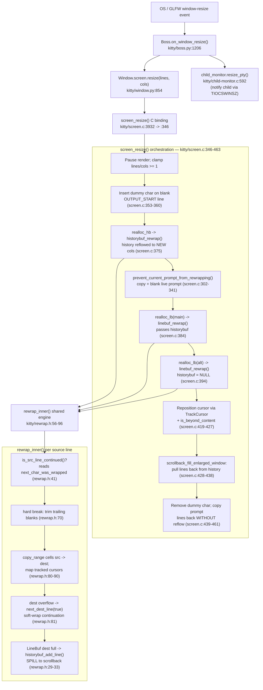

# How kitty's terminal reflow (rewrap) redistributes cells on resize, and where line‑continuation state breaks at the screen/history boundary

## Summary (TL;DR)

When a kitty window is resized, the resize orchestrator `screen_resize` [kitty/screen.c:346-463] reflows buffered cell content to the new column count by driving a single, macro‑parameterized reflow engine, `rewrap_inner` [kitty/rewrap.h:56-96], over two buffers: the visible‑screen `LineBuf` and the scrollback `HistoryBuf`. Narrowing spills overflow rows from the screen into history; widening (with `scrollback_fill_enlarged_window`) pulls rows back. The authoritative record of "this row continues onto the next" is a **per‑cell** flag, `CellAttrs.next_char_was_wrapped` [kitty/data-types.h:206], while a **per‑line** flag, `LineAttrs.is_continued` [kitty/data-types.h:233], is *derived on read* and is structurally `false` for the top row of each buffer.

This investigation was performed by **building the `fast_data_types` C extension and running the real rewrap path first**, then writing the answer from the captured output. It **reproduces the reported symptom** ("the reflow doesn't seem to preserve logical line boundaries correctly") deterministically: a single 18‑character logical line, once it straddles the history/screen boundary, is **split into two logical lines** when the window is subsequently enlarged. The root cause is that history is rewrapped **first and in isolation** [kitty/screen.c:375]; the engine clears the source row's per‑cell continuation bit when a row is continued [kitty/rewrap.h:72], and the trailing re‑assertion `next_dest_line(false)` runs only when `src_y < src_limit` [kitty/rewrap.h:93] — so the **newest** history row is never told that it still continues into the screen's top row. Because neither buffer's per‑line `is_continued` is designed to express *cross‑buffer* continuation — the screen's top row derives it as structurally `false` [kitty/line-buf.c:145], while on the history side it is derived from *within‑history* adjacency via the physical ring index [kitty/history.c:162-170], not from any relation to the screen — the only field that could carry the boundary continuation is the **per‑cell** `next_char_was_wrapped` on the newest history row's last cell, which is exactly the bit the isolated history rewrap drops. Per the task's rules, these issues are **identified and explained only — not fixed.**

---

## 1. Investigation Setup & Methodology

### 1.1 Repository, revision, environment

| Item | Value |
|------|-------|
| Repository | kitty (terminal emulator) |
| Branch (documentation name) | `kitty_815df1e210e0` |
| HEAD commit | `815df1e210e0a9ab4622f5c7f2d6891d7dbeddf1` (unchanged before and after the investigation) |
| Checkout root (on disk) | `/tmp/blitzy/kitty/blitzy-272eab58-bd8e-4c5f-bc07-aa70eba24877_c54bda` |
| Python | 3.13.7 |
| C compiler | gcc 15.2.0, C11 (`-std=c11` [setup.py:492]) |

All `file:line` citations in this document were verified byte‑exact against this HEAD.

### 1.2 Canonical build

The reflow logic is pure C, compiled into the `kitty.fast_data_types` extension; it cannot be exercised from Python source alone. The build uses the project's canonical command [.github/workflows/ci.py:104, `build_kitty` at :102]:

```
python setup.py build --verbose
```

Built to the C11 standard (`std = '' if is_openbsd else '-std=c11'`, [setup.py:492]; **source‑verified**). In this Ubuntu 25.10 container the build additionally used `--ignore-compiler-warnings` [setup.py:2003] to bypass an *unrelated* GLFW wayland‑protocols `-Werror` warning in the Wayland backend (`glfw/wl_window.c`); the reflow C sources themselves compile clean. The produced artifact is `kitty/fast_data_types.so` (1,253,792 bytes ≈ 1.2 MB) and is `.gitignore`d (`*.so`), so the source tree stays byte‑for‑byte unchanged.

Import verification (exact command and output):

```
$ PYTHONPATH=/tmp/blitzy/kitty/blitzy-272eab58-bd8e-4c5f-bc07-aa70eba24877_c54bda \
  python3 -c "import kitty.fast_data_types as f; print(hasattr(f,'LineBuf'), hasattr(f,'HistoryBuf'), hasattr(f,'Screen'))"
True True True
```

### 1.3 Headless harness (mirrors the shipped tests)

Observation follows kitty's own headless test harness — `create_lbuf` [kitty_tests/datatypes.py:29-36] and the `rewrap` helper [kitty_tests/datatypes.py:332-334] — which instantiate `LineBuf`/`HistoryBuf` directly from `fast_data_types` and call `.rewrap(...)` with no window or GPU context. The temporary observation script `/tmp/obs_consolidated.py` (reproduced verbatim in the Appendix) defines the same helpers plus small readers:

- `create_lbuf(*lines)` builds a `LineBuf`, and for each row `i > 0` calls `set_continued(i, len(lines[i-1]) == maxw)`; `LineBuf.set_continued(y, val)` sets row **`y-1`**'s last‑cell `next_char_was_wrapped` bit via `linebuf_set_last_char_as_continuation` [kitty/line-buf.c:194-196] (Python binding `set_continued` at [kitty/line-buf.c:217-223]).
- `WR(b)` reads the **per‑cell authoritative** bit via `Line.last_char_has_wrapped_flag()` [kitty/line.c:427] → `next_char_was_wrapped` [kitty/data-types.h:206].
- `CO(b)` reads the **per‑line derived** bit via `LineBuf.is_continued(y)` [kitty/line-buf.c:145].
- `HB(h)` lists a `HistoryBuf` newest‑first (`HistoryBuf.line(0)` is the newest row); `push` preserves the per‑cell wrapped bit.
- The Python `LineBuf.rewrap(dest, hist)` returns `(nclb, ncla)` = (num content lines before, after) [kitty/line-buf.c:636].

### 1.4 Methodology (binding rules, satisfied)

- **Ran the code first, then wrote.** The extension was built and the real rewrap path executed *before* any prose was written, and every fenced runtime block below is verbatim captured output. To keep the evidence honest, claims are drawn from three explicitly distinguished classes: **runtime‑observed** — backed by the captured output shown adjacent to the claim (all buffer states, cursor positions, continuation bits, counts, and the reproduced symptom); **source‑verified** — statements about C control flow, macro parameterization, and function/step sequencing that are fixed at compile time and therefore cannot be emitted as runtime data, confirmed by reading the cited `file:line` at this HEAD and marked **(source‑verified)**; and **inferred** — the few interpretive conclusions beyond both, marked **(inferred)**. Where a behavior is observable it was observed rather than asserted.
- **Real entry point only.** Resize is driven through `Screen.resize` and the headless `LineBuf.rewrap` / `HistoryBuf.rewrap` entries that the shipped tests use — never the bypassing remote‑control hook `resize_os_window` [kitty/boss.py:1543].
- **Both directions + edges.** Widening (soft‑wrap splitting) and narrowing (line joining + history spill) are both exercised, along with the line‑0 / last‑line edge branches and the `scrollback_fill_enlarged_window` flag on and off, plus the dummy‑char insert/remove and prompt‑preservation copy‑back edge branches (§5.5).
- **Before / during / after + boundary.** State is captured before, at the intermediate narrow step, and after, and specifically at the screen/history boundary.
- **Determinism.** The reported symptom was reproduced across repeated runs of the same unchanged input: three internal repeats plus a whole‑script two‑run `md5sum`/`diff` comparison, both shown in §6.3.
- **Exact run command:**

```
cd /tmp && PYTHONPATH=/tmp/blitzy/kitty/blitzy-272eab58-bd8e-4c5f-bc07-aa70eba24877_c54bda python3 /tmp/obs_consolidated.py
```

- **Block ↔ command mapping.** Below, **`$R`** denotes that repository root. Every fenced runtime block in Sections 2–6 is a labeled section of the output of this single command (the full harness is reproduced in §8); each such block is preceded by the exact command that produced it, and where a block shows only part of a section it is marked *(excerpt)*.

- **Hygiene.** The only file created is this document. No kitty source file was created, modified, or deleted; the temporary script lives in `/tmp` and is deleted after use; `git status --porcelain` reports the source tree unchanged.

---

## 2. Q1 — Trace of the rewrap C implementation

### 2.1 From the resize entry into the shared engine

`screen_resize` [kitty/screen.c:346-463] is the orchestrator. It does **not** contain reflow logic itself; it delegates to two thin buffer‑specific wrappers, each of which calls the same shared engine:

- **Screen buffer:** `realloc_lb` [kitty/screen.c:234-242] → `linebuf_rewrap` [kitty/line-buf.c:586-622] → `rewrap_inner` [kitty/line-buf.c:617].
- **Scrollback buffer:** `realloc_hb` [kitty/screen.c:216-223] → `historybuf_rewrap` [kitty/history.c:595-614] → `rewrap_inner` [kitty/history.c:611].

The engine `rewrap_inner` [kitty/rewrap.h:56-96] lives in a header that is `#include`d **twice** — once inside `kitty/line-buf.c` [kitty/line-buf.c:583] (with `BufType = LineBuf`, the default [kitty/rewrap.h:10-12]) and once inside `kitty/history.c` [kitty/history.c:592] (with `#define BufType HistoryBuf` [kitty/history.c:582]). Each translation unit supplies its own `init_src_line`, `first_dest_line`, and — critically — `next_dest_line` macros before the include, so **one algorithm serves both buffers with buffer‑specific line‑advance behavior** (this is the single most important structural fact of the subsystem). The `LineBuf` `next_dest_line` [kitty/rewrap.h:24-38] can spill into history; the `HistoryBuf` `next_dest_line` [kitty/history.c:588] pushes onto the ring. *(This twice‑`#include`d macro structure is **source‑verified** from the cited `rewrap.h`/`line-buf.c`/`history.c` lines; its observable effect on buffer state is shown in §2.3.)*

### 2.2 The per‑source‑line algorithm

For each source row, `rewrap_inner` [kitty/rewrap.h:56-96] performs the following (the step sequence is **source‑verified** by reading the cited lines; the resulting buffer states are runtime‑observed in §2.3):

1. Reads whether the row is continued via `is_src_line_continued()` [kitty/rewrap.h:41], which returns the last cell's `next_char_was_wrapped` bit.
2. If **not** continued (a hard line break): trims trailing blank cells so the hard break is preserved [kitty/rewrap.h:70].
3. If continued: **clears** the source's last‑cell `next_char_was_wrapped` bit — `src->line->gpu_cells[src->xnum-1].attrs.next_char_was_wrapped = false` [kitty/rewrap.h:72] (this mutates the *source*; see Q3).
4. Copies cell ranges from source to destination with `copy_range` [kitty/rewrap.h:44-48], mapping any tracked cursors [kitty/rewrap.h:80-90].
5. On destination overflow, advances to the next destination row as a soft‑wrap continuation via `next_dest_line(true)` [kitty/rewrap.h:81].
6. After a non‑continued source row, if `src_y < src_limit`, re‑initializes the next source row and calls `next_dest_line(false)` [kitty/rewrap.h:93] to start a fresh (non‑continued) destination row.
7. Finally records the last destination row index: `dest->line->ynum = dest_y` [kitty/rewrap.h:95].

`linebuf_rewrap` also has a **fast path**: when the destination has the same dimensions as the source it is a pure `memcpy` of the maps, attrs, and cell buffers with no reflow at all [kitty/line-buf.c:591-598]; `historybuf_rewrap` has the analogous fast path [kitty/history.c:597-606].

### 2.3 Observed baseline (matches the shipped tests)

The baseline confirms the harness observes real buffer state and reproduces the shipped assertions `test_rewrap_simple` / `test_rewrap_wider` / `test_rewrap_narrower` [kitty_tests/datatypes.py:337,374,385]. `cont` = per‑line derived `is_continued`; `wrapped` = per‑cell `next_char_was_wrapped`; `cy = (nclb, ncla)`.

*Producing command:* `cd /tmp && PYTHONPATH=$R python3 /tmp/obs_consolidated.py` — output section:

```
==============================================================================
Q1 BASELINE: same-width fast path / widen / narrow / two-logical (BEFORE+AFTER)
==============================================================================
[same-width] dest: ['abcde', 'fghij', 'klmno'] cy(nclb,ncla)= (3, 3) dest==src: True
[widen 5->6] src  BEFORE: ['0123 ', '56789'] cont [False, True] wrapped [True, False]
[widen 5->6] src  AFTER : ['0123 ', '56789'] cont [False, False] wrapped [False, False]  <- rewrap MUTATED src wrapped bit [rewrap.h:72]
[widen 5->6] dest AFTER : ['0123 5', '6789', ''] cont [False, True, False] wrapped [True, False, False] cy= (2, 2)
[narrow 5->3] src BEFORE: ['123  ', 'abcde'] cont [False, True] wrapped [True, False]
[narrow 5->3] dest      : ['123', '  a', 'bcd', 'e', '', ''] cont [False, True, True, True, False, False] wrapped [True, True, True, False, False, False] cy= (2, 4)
[2 logical]  src BEFORE : ['123', 'abcde'] cont [False, False] wrapped [False, False]
[2 logical]  dest       : ['123', 'abc', 'de'] cont [False, False, True] wrapped [False, True, False] cy= (2, 3)
```

Cause → effect:

- **`[same-width] … dest==src: True`, `cy=(3,3)`** — the fast path [kitty/line-buf.c:591-598] copied the buffer verbatim; no engine invocation, so destination equals source and both content‑line counts equal the row count.
- **`[widen 5->6]`** — one logical line `"0123 56789"` (row 0 ends `wrapped=True`) is re‑laid at width 6 to `['0123 5', '6789', '']`. The destination's row‑0 last cell carries the soft‑wrap bit (`wrapped=[True, False, False]`), asserted by `next_dest_line(true)` [kitty/rewrap.h:81]; the derived `cont=[False, True, False]` follows on read.
- **`[narrow 5->3]`** — the same joining then re‑splitting to width 3 yields `['123', '  a', 'bcd', 'e', …]` with three continuation rows, matching `assertContinued(lb2, False, True, True, True)` [kitty_tests/datatypes.py:392].
- **`[2 logical]`** — two independent logical lines (`'123'` has a hard break, `wrapped=[False,False]`) stay separated: `'123'` then `'abc'`,`'de'`, with only the soft‑wrap between `'abc'` and `'de'` marked (`wrapped=[False, True, False]`).

---

## 3. Q2 — Interaction between the visible screen buffer and the scrollback history

### 3.1 Ordering: history first, then the screen (with history passed in)

`screen_resize` reflows the buffers in a fixed order that is central to the boundary behavior (**source‑verified** from [kitty/screen.c:346-463]; the ordering's observable consequences appear in §3.2–§3.3 and §5.4):

1. **History is rewrapped first**, and independently: `realloc_hb(self->historybuf, self->historybuf->ynum, columns, …)` [kitty/screen.c:375] → `historybuf_rewrap` [kitty/history.c:595-614]. At this point the engine has **no knowledge of the screen** — it sees only the history rows.
2. Then the live prompt is preserved (see Q4) via `prevent_current_prompt_from_rewrapping` [kitty/screen.c:302-341].
3. **Then the main `LineBuf` is rewrapped**, and the *already‑rewrapped* history is passed in: `realloc_lb(self->main_linebuf, lines, columns, …, self->historybuf, …)` [kitty/screen.c:384]. Passing `historybuf` lets rows overflowing the **top** of the screen be appended to history during the screen's own reflow.
4. The alternate screen is rewrapped with `historybuf = NULL` [kitty/screen.c:394] — the alt screen has no scrollback, so nothing can spill.

This "history reflowed in isolation, then more screen rows spilled onto it" ordering is exactly what makes the join between the bottom of history and the top of the screen fragile (Q3).

### 3.2 Narrowing → SPILL (`LineBuf` → `HistoryBuf`)

When narrowing pushes more destination rows than the screen can hold, the `LineBuf` variant of `next_dest_line` [kitty/rewrap.h:24-38] indexes the screen up and, if a `historybuf` was supplied, appends the evicted top row to scrollback via `historybuf_add_line(historybuf, dest->line, as_ansi_buf)` [kitty/rewrap.h:32] before clearing the freed row [kitty/rewrap.h:34]. This is the **SPILL**.

Observed: one 18‑character logical line laid out on a 3×6 `LineBuf` is narrowed into a 2×3 destination plus a 2‑row `HistoryBuf`:

*Producing command:* `cd /tmp && PYTHONPATH=$R python3 /tmp/obs_consolidated.py` — output section:

```
==============================================================================
Q2 SPILL: one 18-char logical line (LineBuf 3x6) -> narrow to LineBuf(2x3) + HistoryBuf
==============================================================================
[spill] SRC BEFORE: ['ABCDEF', 'GHIJKL', 'MNOPQR'] cont [False, True, True] wrapped [True, True, False]
[spill] DEST(2x3) : ['MNO', 'PQR'] cont [False, True] wrapped [True, False] cy= (3, 2)
[spill] HISTORY(newest first): [('JKL', True), ('GHI', True)] count= 2
[spill] reassembled hist(oldest->newest)+dest: GHIJKLMNOPQR
[spill] BOUNDARY: dest.is_continued(0)= False | history NEWEST wrapped= True
```

Cause → effect:

- The source is **one** logical line: `wrapped=[True, True, False]` (rows 0 and 1 continue; row 2 ends it). Re‑laid at width 3 it becomes six rows `ABC DEF GHI JKL MNO PQR`.
- The 2‑row destination can only keep the last two rows (`['MNO', 'PQR']`). Each earlier row was pushed to history by `historybuf_add_line` [kitty/rewrap.h:32]; the `HistoryBuf` ring capacity here is 2, so the two oldest (`ABC`, `DEF`) were evicted, leaving `GHI`, `JKL` (newest‑first `[('JKL', True), ('GHI', True)]`). Every spilled row carries `wrapped=True` — they are all continuations.
- `cy=(3, 2)`: three content rows before (`nclb`), two after in the screen (`ncla`).
- **Boundary observation:** the screen's top row reports `dest.is_continued(0)=False` even though its content (`MNO`) continues the history's newest row (`JKL`, `wrapped=True`). The per‑line flag cannot see across the buffer boundary (Q3).

### 3.3 Enlarging → PULL‑BACK (`HistoryBuf` → `LineBuf`)

On enlargement, if `scrollback_fill_enlarged_window` is set, `screen_resize` pulls rows back from history to fill the new vertical space [kitty/screen.c:428-438]: while there is room, it pops the newest history row with `historybuf_pop_line` [kitty/screen.c:432], scrolls the screen down (`INDEX_DOWN`), copies the popped row to the screen top [kitty/screen.c:434], and advances the cursor. When the option is off, the enlarged space is simply left blank and history is retained.

Both behaviors are observed in the real `Screen` path (full block under Q4). The decisive contrast:

*Producing command:* `cd /tmp && PYTHONPATH=$R python3 /tmp/obs_consolidated.py` — output section (**excerpt** of the Q4 run shown in full at §5.4; AFTER + history rows, fill OFF vs ON):

```
--- fill OFF ---
[fill=False] AFTER  (6x8): screen=['JKLMNOPQ', 'R', '', '', '', ''] wrapped=[True, False, False, False, False, False] cursor=(1,1) hist.count=2
[fill=False] history(newest first)=[('I', False), ('ABCDEFGH', True)]
--- fill ON ---
[fill=True] AFTER  (6x8): screen=['ABCDEFGH', 'I', 'JKLMNOPQ', 'R', '', ''] wrapped=[True, False, True, False, False, False] cursor=(1,3) hist.count=0
[fill=True] history(newest first)=[]
```

Cause → effect: with **fill OFF**, history keeps two rows and the screen shows only its own reflowed content; with **fill ON**, all history was popped back (`hist.count=0`) and prepended to the screen. In both cases the continuation between the popped/retained history and the screen content has already been damaged during the isolated history rewrap (Q3): the `'I'` row shows `wrapped=False` when it should continue.


---

## 4. Q3 — Potential issues in how line‑continuation state is propagated

> These issues are **identified and explained (cause → effect) only.** Remediation is out of scope and no fix is proposed or applied.

### 4.1 Root cause: continuation is represented two different ways

"This row continues onto the next" is stored in **two** places with different lifetimes:

1. **Per‑cell, authoritative:** `CellAttrs.next_char_was_wrapped` [kitty/data-types.h:206], a single bit on the **last cell** of a row. This is what the reflow engine reads through `is_src_line_continued()` [kitty/rewrap.h:41] and what it writes through `linebuf_set_last_char_as_continuation` [kitty/line-buf.c:194-196] / `next_dest_line`. It is the source of truth during rewrap.
2. **Per‑line, derived:** `LineAttrs.is_continued` [kitty/data-types.h:233], a bit in the 8‑bit `LineAttrs` union. For `LineBuf` it is **not stored authoritatively** — it is recomputed *on read* in `linebuf_init_line` [kitty/line-buf.c:145] from the **previous** row's last‑cell wrapped bit:
   `self->line->attrs.is_continued = idx > 0 ? gpu_lineptr(self, self->line_map[idx-1])[self->xnum-1].attrs.next_char_was_wrapped : false;`
   The ternary makes it **structurally `false` for row 0** — the screen's top row can never express that it continues *from* the bottom of history.

### 4.2 The engine copies whole attrs, then re‑asserts continuation separately

`set_dest_line_attrs` [kitty/rewrap.h:18] copies the **entire** `src->line->attrs` onto the destination row (`dest->line_attrs[dest_y] = src->line->attrs; …`), which includes a possibly‑stale `is_continued` bit. Continuation is then re‑asserted separately on the destination's last cell by `next_dest_line` [kitty/rewrap.h:26]. For `LineBuf` the stale copied `is_continued` is harmless because it is overwritten on read [kitty/line-buf.c:145]; the **per‑cell** bit is the one that matters. This split — whole‑attrs copy vs. separate per‑cell re‑assertion — is why the per‑cell bit is the only reliable carrier, and why dropping it (Section 4.4) is silent. *(This whole‑attrs‑copy‑then‑re‑assert structure is **source‑verified** from [kitty/rewrap.h:18,26]; its observable consequence — the per‑cell bit being the only reliable carrier — is shown at runtime in §4.3 and §4.6.)*

### 4.3 The source's continuation bit is mutated (destroyed) during rewrap

Observed directly in the widen baseline (Q1): the source row's per‑cell wrapped bit is cleared by the engine at [kitty/rewrap.h:72]:

*Producing command:* `cd /tmp && PYTHONPATH=$R python3 /tmp/obs_consolidated.py` — output section (**excerpt** of the Q1 baseline shown in full at §2.3; the two `[widen 5->6] src` lines):

```
[widen 5->6] src  BEFORE: ['0123 ', '56789'] cont [False, True] wrapped [True, False]
[widen 5->6] src  AFTER : ['0123 ', '56789'] cont [False, False] wrapped [False, False]  <- rewrap MUTATED src wrapped bit [rewrap.h:72]
```

Cause → effect: when a source row is continued, `rewrap_inner` sets `src->line->gpu_cells[src->xnum-1].attrs.next_char_was_wrapped = false` [kitty/rewrap.h:72] as it consumes the row (it no longer needs the boundary because it is joining the text). Consequently the derived per‑line `cont` on the *next* source row flips `True → False`. The engine assumes it will re‑assert continuation on the destination as it lays cells out — which it does **except** for the final source row (Section 4.4).

### 4.4 The last source row's continuation is never re‑managed on the destination

The trailing re‑assertion is guarded: `if (!src_line_is_continued && src_y < src_limit) { … next_dest_line(false); … }` [kitty/rewrap.h:93]. It fires **only when there is a next source row** (`src_y < src_limit`). For the **last** source row there is no next row, so no trailing `next_dest_line` runs, and the final destination row's continuation bit is left at whatever the last `copy_range`/`next_dest_line(true)` produced — it is never explicitly cleared or, crucially, re‑asserted.

*Producing command:* `cd /tmp && PYTHONPATH=$R python3 /tmp/obs_consolidated.py` — output section:

```
==============================================================================
Q3 LAST-LINE / LINE-0 EDGE
==============================================================================
[edge] dest.is_continued(0) is ALWAYS False (idx>0 ? prev.next_char_was_wrapped : false) [line-buf.c:145]
[edge] final dest line wrapped = False (trailing next_dest_line(false) only fires when src_y<src_limit [rewrap.h:93])
```

For a self‑contained `LineBuf` reflow this is benign (a buffer's last row genuinely has no successor row *inside that buffer*). **It stops being benign when the "last source row" is the newest row of a history buffer that is being rewrapped in isolation, because that row's true successor is the screen's top row — which the history rewrap cannot see.**

### 4.5 The history buffer cannot represent continuation into the screen

For `HistoryBuf` the per‑line story must be stated against the *physical ring buffer*, and once it is, the per‑line flag turns out to be the wrong carrier for the boundary in **either** buffer:

- The `HistoryBuf` `next_dest_line` [kitty/history.c:588] pushes the row and copies `*lap = src->line->attrs` directly into the stored per‑line attrs (source‑verified).
- On **read**, `HistoryBuf`'s `init_line` [kitty/history.c:162-177] derives `is_continued` from the **physical ring‑buffer index** `num` it is handed, *not* from the logical line number: for `num > 0` it takes the physically‑previous row's last‑cell wrapped bit [kitty/history.c:168], and only for `num == 0` (the physical bottom slot of the ring) does it force `is_continued = false` [kitty/history.c:170] (unless the pager‑history ringbuffer indicates otherwise). This derivation is **source‑verified**: the Python API exposes no `is_continued` getter on a history `Line` (confirmed at runtime — a `Line` object has no `is_continued` attribute), so it cannot be read back directly.
- Crucially, `HistoryBuf.line(lnum)` maps the **logical** line number to a physical index through `index_of` [kitty/history.c:153-158], called at [kitty/history.c:315]: the newest logical row (`lnum == 0`) lands at physical `(start_of_data + count - 1) % ynum`, which equals `0` only in particular ring states. So `history.c:170` does **not** structurally force the *logical newest* row's `is_continued` to `false`; it is a **physical‑index‑0** condition. (An earlier draft of this document mis‑cited `history.c:170` as proof that the logical newest row is always `false`; that is corrected here.)
- More fundamentally, even where it *is* derived, this per‑line flag describes continuation *from the physically‑previous row within history* (`num-1`), never continuation *into the screen*. It is therefore the wrong flag for the history/screen boundary regardless of the ring's physical layout.

The per‑line flag that *is* relevant to the boundary is the **screen's top row** `is_continued`, which is structurally `false` [kitty/line-buf.c:145] (`idx > 0 ? ... : false`). Both the ring's position‑independence and the screen‑side derivation are observable at runtime.

*Producing command:* `cd /tmp && PYTHONPATH=$R python3 /tmp/obs_consolidated.py` — output section:

```
==============================================================================
F1 HISTORY-SIDE: ring physical vs logical index; per-cell carrier durability; is_continued derivation
==============================================================================
[ring] pushed 6 rows into HistoryBuf(cap=3); count=3 (oldest evicted)
[ring] newest-first (text, per-cell wrapped): [('PQR', False), ('MNO', True), ('JKL', True)]
[ring] newest logical row (line(0)) per-cell wrapped = False (position-independent carrier)
[derive] LineBuf rows=['AB', 'CD', 'EF'] per-cell wrapped=[True, False, False] -> is_continued(derived)=[False, True, False]
[derive] is_continued(0)=False (idx>0 ? prev.next_char_was_wrapped : false) -> row 0 ALWAYS False [line-buf.c:145]
```

Cause → effect: pushing a single 6‑row logical line into a capacity‑3 ring wraps it twice, yet the per‑cell `next_char_was_wrapped` bits survive intact (`MNO`, `JKL` remain `True`) regardless of the physical slot each row now occupies — the per‑cell bit is a **position‑independent** carrier, whereas the derived per‑line flag is recomputed from whatever physical neighbour `init_line` sees. The `[derive]` line shows the screen‑side rule directly: a `LineBuf` whose row 0 ends `wrapped=True` yields `is_continued = [False, True, False]` — row 0 is **always** `False` [kitty/line-buf.c:145] and each later row merely mirrors the previous row's per‑cell bit. Neither per‑line derivation can look across a buffer boundary.

Net effect of 4.1–4.5: **neither** buffer's per‑line `is_continued` can carry continuation across the history/screen join. On the screen side the top row is structurally `false` [kitty/line-buf.c:145]; on the history side the flag is derived from within‑history (physical‑neighbour) adjacency [kitty/history.c:162-170] and never encodes a relationship to the screen. That leaves the **per‑cell** `next_char_was_wrapped` on the newest history row's last cell as the only possible carrier — and that is exactly the bit the engine drops (4.3–4.4) when it rewraps history in isolation.

### 4.6 Decisive runtime evidence — the boundary continuation is dropped

Seed a history whose **newest** row (`GHI`) ends `wrapped=True` (it continues into the screen's top row), then rewrap the history **alone** to a wider width:

*Producing command:* `cd /tmp && PYTHONPATH=$R python3 /tmp/obs_consolidated.py` — output section:

```
==============================================================================
MECHANISM: isolated history rewrap drops the newest line's 'continues-into-screen' bit
==============================================================================
[mech] history @w3 (newest first): [('GHI', True), ('DEF', True), ('ABC', True)] -> NEWEST wrapped= True (continues into screen top)
[mech] history rewrapped @w8     : [('I', False), ('ABCDEFGH', True)] -> NEWEST wrapped= False
[mech] boundary continuation was: DROPPED (isolated history rewrap has no next line; src last-cell cleared [rewrap.h:72], trailing next_dest_line(false) skipped [rewrap.h:93])
```

Cause → effect: before rewrap the newest row's last cell is `wrapped=True`. During the isolated history rewrap the engine clears that source bit [kitty/rewrap.h:72] while consuming the (continued) row, and because it is the **last** source row the trailing `next_dest_line(false)` is skipped [kitty/rewrap.h:93]; nothing re‑asserts continuation on the new newest row. After rewrap the newest history row (`'I'`) reports `wrapped=False`. The history buffer has **no knowledge of the screen's top row**, so the fact that `'I'` still continues into the screen is lost. This is the precise mechanism behind the Q4 symptom.

---

## 5. Q4 — Complete data flow, entry point through rewrap

### 5.1 Entry chain (OS event → C reflow)

1. An OS/GLFW window‑resize event reaches `Boss.on_window_resize` [kitty/boss.py:1206].
2. The window forwards the new geometry to the screen: `self.screen.resize(max(0, ynum), max(0, xnum))` [kitty/window.py:854]. This is the **real** geometry‑driven path — not the remote‑control `resize_os_window` [kitty/boss.py:1543], which is a bypassing/programmatic interface deliberately avoided here.
3. In parallel, the child PTY is notified of the new size: `boss.child_monitor.resize_pty(...)` [kitty/window.py:863] → `resize_pty` [kitty/child-monitor.c:592] (issues `TIOCSWINSZ`). GPU/OS‑window coordination happens in `resize_screen` [kitty/state.c:406].
4. `Screen.resize` is the Python binding `resize` [kitty/screen.c:3928-3935], which calls the C `screen_resize` [kitty/screen.c:3932 → :346].

### 5.2 Inside `screen_resize` [kitty/screen.c:346-463]

In order (**source‑verified**: the step sequence is read from [kitty/screen.c:346-463]; the runtime consequences of the dummy‑char and prompt branches are shown in §5.5, and of the overall flow in §5.4):

- Pause rendering and clamp `lines`/`columns` to ≥ 1 [kitty/screen.c:347-348].
- **Dummy‑char insert:** if the cursor sits at column 0 on a blank `OUTPUT_START` line, insert a `'<'` so the blank output line survives reflow [kitty/screen.c:353-360] (exercised at runtime in §5.5).
- **History rewrap FIRST:** `realloc_hb` [kitty/screen.c:375] → `historybuf_rewrap` — history reflowed to the new column count, in isolation.
- **Prompt preservation:** `prevent_current_prompt_from_rewrapping` [kitty/screen.c:302-341] copies the live prompt lines into a scratch `LineBuf` and blanks them, trusting the shell to redraw (prevents flicker) (exercised at runtime in §5.5).
- **Main screen rewrap:** `realloc_lb(main_linebuf, …, self->historybuf, …)` [kitty/screen.c:384] — the already‑rewrapped history is passed in so top‑of‑screen overflow spills onto it.
- **Alt screen rewrap:** `realloc_lb(alt_linebuf, …, NULL, …)` [kitty/screen.c:394] — no history for the alternate screen.
- **Cursor reposition:** clamp active + saved cursors to the new bounds via the `S(…)` macro [kitty/screen.c:419-423] and, if the cursor was beyond content, snap it to `num_content_lines` [kitty/screen.c:424-427]. Cursors are tracked through the reflow by `CursorTrack` [kitty/screen.c:226-232] feeding the engine's `TrackCursor` [kitty/rewrap.h:50-53], remapped as cells are copied [kitty/rewrap.h:74-90].
- **Scrollback fill‑back:** if `scrollback_fill_enlarged_window` is set, pull rows back from history [kitty/screen.c:428-438].
- **Dummy‑char removal** [kitty/screen.c:439-443] and **non‑reflowed prompt copy‑back** [kitty/screen.c:444-461] (the preserved prompt lines are copied back verbatim, *without* reflow) (both exercised at runtime in §5.5).

### 5.3 Flow diagram



### 5.4 End‑to‑end observation on the real `Screen` path

A single 18‑character logical line is drawn on a 3×6 screen, then narrowed to 3×3, then enlarged to 6×8, with `scrollback_fill_enlarged_window` off and on. `cursor=(x,y)`, `hist.count` = scrollback row count.

*Producing command:* `cd /tmp && PYTHONPATH=$R python3 /tmp/obs_consolidated.py` — output section:

```
==============================================================================
Q4 + SYMPTOM (REAL Screen path): draw 18-char logical line -> narrow -> enlarge (+fill)
==============================================================================
--- fill OFF ---
[fill=False] BEFORE (3x6): screen=['ABCDEF', 'GHIJKL', 'MNOPQR'] wrapped=[True, True, False] cursor=(6,2) hist.count=0
[fill=False] DURING (3x3): screen=['JKL', 'MNO', 'PQR'] wrapped=[True, True, False] cursor=(2,2) hist.count=3
[fill=False] AFTER  (6x8): screen=['JKLMNOPQ', 'R', '', '', '', ''] wrapped=[True, False, False, False, False, False] cursor=(1,1) hist.count=2
[fill=False] history(newest first)=[('I', False), ('ABCDEFGH', True)]
--- fill ON ---
[fill=True] BEFORE (3x6): screen=['ABCDEF', 'GHIJKL', 'MNOPQR'] wrapped=[True, True, False] cursor=(6,2) hist.count=0
[fill=True] DURING (3x3): screen=['JKL', 'MNO', 'PQR'] wrapped=[True, True, False] cursor=(2,2) hist.count=3
[fill=True] AFTER  (6x8): screen=['ABCDEFGH', 'I', 'JKLMNOPQ', 'R', '', ''] wrapped=[True, False, True, False, False, False] cursor=(1,3) hist.count=0
[fill=True] history(newest first)=[]
[fill=True] screen is_continued(derived)=[False, True, False, True, False, False]  <- boundary split visible as per-line flag
```

Cause → effect (data flow made concrete):

- **BEFORE (3×6):** the draw of `ABCDEFGHIJKLMNOPQR` wraps to exactly three rows, `wrapped=[True, True, False]` — **one** logical line. `cursor=(6,2)`, `hist.count=0`.
- **DURING (3×3):** narrowing reflows to six width‑3 rows; the screen keeps the bottom three (`JKL/MNO/PQR`, still `wrapped=[True, True, False]`) and **spills** the top three to history (`hist.count=3`). The `TrackCursor` machinery moved the cursor to `(2,2)`. Still one logical line, now straddling history + screen.
- **AFTER (6×8), fill OFF:** history was rewrapped in isolation to `[('I', False), ('ABCDEFGH', True)]` — the newest history row `'I'` lost its continuation bit. The screen shows its own reflowed content `['JKLMNOPQ', 'R', …]`.
- **AFTER (6×8), fill ON:** history is popped back onto the screen, yielding `['ABCDEFGH', 'I', 'JKLMNOPQ', 'R', '', '']` with `wrapped=[True, False, True, False, False, False]`. The `'I'` row is `wrapped=False`, so the screen now represents **two** logical lines (`ABCDEFGHI` and `JKLMNOPQR`) where there was originally **one** (`ABCDEFGHIJKLMNOPQR`). Cursor tracked to `(1,3)`.

The cursor snapshots (`(6,2) → (2,2) → (1,1)`/`(1,3)`) are the observable output of the `CursorTrack`/`TrackCursor` remapping [kitty/screen.c:226-232, kitty/rewrap.h:50-53] plus the post‑reflow clamp/`is_beyond_content` handling [kitty/screen.c:419-427].

### 5.5 Edge branches exercised at runtime: dummy‑char insertion and prompt preservation

Two `screen_resize` edge branches are exercised directly on the real `Screen` path (runtime‑observed, not read from source). Each is shown as a contrast that isolates the branch.

**Dummy‑char insert/remove** [kitty/screen.c:353-360, 439-443]. When the cursor sits at column 0 on a *blank* `OUTPUT_START` line, `screen_resize` inserts a `'<'` [kitty/screen.c:358] so the blank output line counts as content through reflow, then removes it afterwards [kitty/screen.c:439-443]. To isolate the branch the `OUTPUT_START` mark is set with `OSC 133 ; C` only (which does **not** enable prompt redraws), so the prompt‑preservation path is inert.

*Producing command:* `cd /tmp && PYTHONPATH=$R python3 /tmp/obs_consolidated.py` — output section:

```
==============================================================================
F2 DUMMY-CHAR: blank OUTPUT_START line preserved across reflow (screen.c:353-360, 439-443)
==============================================================================
[OUTPUT_START=True] BEFORE (6x6) : ['Pabcde', 'fghQ', '', '', '', ''] cursor=(0,4)
[OUTPUT_START=True] AFTER  (6x10): ['PabcdefghQ', '', '', '', '', ''] cursor=(0,3)
[OUTPUT_START=False] BEFORE (6x6) : ['Pabcde', 'fghQ', '', '', '', ''] cursor=(0,4)
[OUTPUT_START=False] AFTER  (6x10): ['PabcdefghQ', '', '', '', '', ''] cursor=(0,1)
```

Cause → effect: the input is one logical line `PabcdefghQ` wrapped to `['Pabcde', 'fghQ']` at width 6, with the cursor parked on a blank row 4 (`x==0`) that is marked `OUTPUT_START`. On widening to width 10 the content rejoins to a single row `PabcdefghQ`. **With** the mark the dummy‑char branch fires: the blank output line is preserved as content, so the cursor tracks to `(0,3)` (the blank output row, three rows below the reflowed content). **Without** the mark the branch is skipped: the blank line is treated as beyond‑content and the cursor collapses up to the content boundary at `(0,1)`. The observable `(0,3)` vs `(0,1)` difference is the branch's effect.

**Prompt preservation / non‑reflowed copy‑back** [kitty/screen.c:302-341, 444-461]. When the shell has marked a prompt and `redraws_prompts_at_all` is set, `prevent_current_prompt_from_rewrapping` [kitty/screen.c:302-341] copies the live prompt lines into a scratch `LineBuf` and blanks them; after the reflow they are copied back **verbatim, without reflow** [kitty/screen.c:444-461]. The contrast toggles `redraws_prompts_at_all` via `OSC 133 ; A` (present vs absent).

*Producing command:* `cd /tmp && PYTHONPATH=$R python3 /tmp/obs_consolidated.py` — output section:

```
==============================================================================
F2 PROMPT-PRESERVATION: live prompt copied back WITHOUT reflow (screen.c:302-341, 444-461)
==============================================================================
[redraws_prompts=True] BEFORE (5x10): ['PROMPT>abc', 'd', '', '', ''] cursor=(1,1)
[redraws_prompts=True] AFTER  (5x6) : ['PROMPT', 'd', '', '', ''] cursor=(0,1)
[redraws_prompts=False] BEFORE (5x10): ['PROMPT>abc', 'd', '', '', ''] cursor=(1,1)
[redraws_prompts=False] AFTER  (5x6) : ['PROMPT', '>abcd', '', '', ''] cursor=(4,1)
```

Cause → effect: the input is one logical line `PROMPT>abcd` wrapped to `['PROMPT>abc', 'd']` at width 10. On resize to width 6, **with** redraws on the prompt is copied back verbatim — `'PROMPT>abc'` is truncated to `'PROMPT'` and the old second row `'d'` is kept as‑is, giving `['PROMPT', 'd']` (cursor `(0,1)`); the line is **not** re‑wrapped. **Without** redraws the normal engine reflows the 11‑char logical line to width 6, giving `['PROMPT', '>abcd']` (cursor `(4,1)`). The `'d'` vs `'>abcd'` second row is the signature that `prevent_current_prompt_from_rewrapping` fired and the copy‑back skipped reflow.


---

## 6. Reproduced symptom & root‑cause mechanism

### 6.1 The symptom, reproduced

The reported symptom — "the reflow doesn't seem to preserve logical line boundaries correctly" — is reproduced above (Section 5.4). A single logical line of 18 characters, after narrowing so that it straddles the history/screen boundary and then enlarging, is **split into two logical lines**:

- Correct reflow of one 18‑char logical line to width 8 would be `['ABCDEFGH', 'IJKLMNOP', 'QR']` with `wrapped=[True, True, False]` — **one** logical line.
- Observed (fill ON): `['ABCDEFGH', 'I', 'JKLMNOPQ', 'R', '', '']` with `wrapped=[True, False, True, False, False, False]` — **two** logical lines, broken exactly at the history/screen join. The `'I'` row is `wrapped=False` when it must be `True`.

With fill OFF the same dropped bit is visible directly in scrollback: the newest history row is `('I', False)`.

### 6.2 Mechanism (cause → effect chain)

1. `screen_resize` rewraps the history **first and in isolation** [kitty/screen.c:375], before the screen and without any reference to the screen's top row.
2. The newest history row is continued (`wrapped=True`) — it flows into the screen's top row. During the isolated rewrap the engine **clears** that source per‑cell bit [kitty/rewrap.h:72] as it consumes the continued row.
3. Because the newest history row is the **last** source row of the history rewrap, the trailing continuation re‑assertion `next_dest_line(false)` is skipped (`src_y < src_limit` is false) [kitty/rewrap.h:93]. Nothing re‑asserts the boundary continuation on the rewrapped newest row.
4. The per‑line `is_continued` cannot compensate: on the screen side the top row derives it as structurally `false` [kitty/line-buf.c:145], while on the history side `init_line` derives it from within‑history (physical‑neighbour) adjacency via the ring index [kitty/history.c:162-170] and the `HistoryBuf` `next_dest_line` [kitty/history.c:588] merely stores the source attrs — neither ever encodes a relationship to the screen. There is no channel by which the history buffer can record "I continue into the screen."
5. Result: the boundary continuation bit is dropped; on the next enlargement the join is treated as a hard break, splitting one logical line into two.

### 6.3 Determinism (same unchanged input, repeated)

*Producing command:* `cd /tmp && PYTHONPATH=$R python3 /tmp/obs_consolidated.py` — output section:

```
==============================================================================
DETERMINISM: repeat SYMPTOM 3x with identical unchanged input
==============================================================================
[run 1] mid(after 3x3) hist=[('GHI', True), ('DEF', True), ('ABC', True)] | final screen=['ABCDEFGH', 'I', 'JKLMNOPQ', 'R', '', ''] wrapped=[True, False, True, False, False, False]
[run 2] mid(after 3x3) hist=[('GHI', True), ('DEF', True), ('ABC', True)] | final screen=['ABCDEFGH', 'I', 'JKLMNOPQ', 'R', '', ''] wrapped=[True, False, True, False, False, False]
[run 3] mid(after 3x3) hist=[('GHI', True), ('DEF', True), ('ABC', True)] | final screen=['ABCDEFGH', 'I', 'JKLMNOPQ', 'R', '', ''] wrapped=[True, False, True, False, False, False]
```

The three internal repeats above are byte‑identical. Whole‑script determinism was confirmed by running the entire harness twice and comparing with `md5sum` and `diff`:

```
$ cd /tmp && PYTHONPATH=$R python3 /tmp/obs_consolidated.py > run1.txt 2>&1
$ cd /tmp && PYTHONPATH=$R python3 /tmp/obs_consolidated.py > run2.txt 2>&1
$ md5sum run1.txt run2.txt
05ed7dd58d01649099137f8c13884479  run1.txt
05ed7dd58d01649099137f8c13884479  run2.txt
$ diff run1.txt run2.txt && echo IDENTICAL
IDENTICAL
```

The symptom is **stable and deterministic**, not intermittent — it depends only on whether a continued row lands as the newest history row at the moment of an isolated history rewrap.

---

## 7. Coverage checklist

| Question / sub‑item | Evidence block | Primary citation(s) |
|---|---|---|
| **Q1** rewrap trace: `screen_resize` → wrappers → shared `rewrap_inner` | §2.1, Q1 baseline | [screen.c:346-463], [line-buf.c:586-622], [history.c:595-614], [rewrap.h:56-96] |
| **Q1** `rewrap.h` `#include`d twice (LineBuf + HistoryBuf) | §2.1 | [line-buf.c:583], [history.c:582,592], [rewrap.h:10-12] |
| **Q1** per‑line algorithm (continued? → trim/clear → copy_range → next_dest_line) | §2.2 | [rewrap.h:41,70,72,44-48,81,93,95] |
| **Q1** same‑width fast path | Q1 baseline (`dest==src: True`, `cy=(3,3)`) | [line-buf.c:591-598], [history.c:597-606] |
| **Q2** SPILL (`historybuf_add_line`) | §3.2, Q2 spill block | [rewrap.h:24-38], esp. [rewrap.h:32] |
| **Q2** PULL‑BACK (`scrollback_fill_enlarged_window`) | §3.3, Q4 fill ON vs OFF | [screen.c:428-438], [screen.c:432] |
| **Q2** ordering: history first, then LineBuf with history passed in | §3.1 | [screen.c:375], [screen.c:384], [screen.c:394] |
| **Q3** dual representation (per‑cell vs per‑line) | §4.1 | [data-types.h:206], [data-types.h:233], [rewrap.h:41] |
| **Q3** per‑line derived, row 0 always false | §4.1, Q3 edge | [line-buf.c:145] |
| **Q3** `set_dest_line_attrs` copies whole attrs; HistoryBuf direct push | §4.2, §4.5 | [rewrap.h:18], [history.c:588] |
| **Q3** source mutation of wrapped bit | §4.3, widen BEFORE→AFTER | [rewrap.h:72] |
| **Q3** last‑row edge: trailing `next_dest_line(false)` only when `src_y<src_limit` | §4.4, Q3 edge | [rewrap.h:93] |
| **Q3** HistoryBuf `is_continued` derived from PHYSICAL ring index (not logical newest); boundary carrier is per‑cell | §4.5 (F1 history‑side block, runtime) | [history.c:153-158,162-170,315], [line-buf.c:145] |
| **Q4** entry chain (boss → window → PTY → binding); avoid RC hook | §5.1 | [boss.py:1206], [window.py:854,863], [child-monitor.c:592], [state.c:406], [screen.c:3928-3935], [boss.py:1543] |
| **Q4** cursor tracking `CursorTrack`/`TrackCursor` | §5.2, §5.4 cursor values | [screen.c:226-232], [rewrap.h:50-53], [screen.c:419-427] |
| **Q4** prompt preservation + non‑reflowed copy‑back; dummy char | §5.2 (step sequence, source‑verified), §5.5 (runtime before/after: dummy‑char + prompt copy‑back) | [screen.c:302-341,444-461,353-360,439-443] |
| **Q4** mermaid diagram | §5.3 | — |
| Symptom reproduced + deterministic + isolated mechanism | §6.1, §6.2, §6.3 | [rewrap.h:72,93], [screen.c:375], [line-buf.c:145] |
| Evidence taxonomy applied: runtime‑observed (adjacent output + command), source‑verified (cited `file:line`), inferred; runtime blocks carry cause→effect | throughout; §1.4 taxonomy | — |

---

## 8. Appendix: Observation harness

**Exact run command:**

```
cd /tmp && PYTHONPATH=/tmp/blitzy/kitty/blitzy-272eab58-bd8e-4c5f-bc07-aa70eba24877_c54bda python3 /tmp/obs_consolidated.py
```

**Full script** (`/tmp/obs_consolidated.py` — created outside the source tree and deleted after use; mirrors `create_lbuf` [kitty_tests/datatypes.py:29-36] and `rewrap` [kitty_tests/datatypes.py:332-334]):

```python
# Temporary observation harness for kitty rewrap investigation.
# Lives in /tmp (OUTSIDE the source tree) and is deleted after use.
# Mirrors kitty_tests/datatypes.py:29-36 (create_lbuf) and :332-334 (rewrap).
from kitty.fast_data_types import LineBuf, HistoryBuf, Screen, Cursor as C, set_options
from kitty.config import finalize_keys, finalize_mouse_mappings
from kitty.options.parse import merge_result_dicts
from kitty.options.types import Options, defaults
from kitty_tests import Callbacks, parse_bytes


def create_lbuf(*lines):
    maxw = max(map(len, lines))
    ans = LineBuf(len(lines), maxw)
    for i, l0 in enumerate(lines):
        ans.line(i).set_text(l0, 0, len(l0), C())
        if i > 0:
            ans.set_continued(i, len(lines[i - 1]) == maxw)
    return ans


def L(b):  return [str(b.line(i)) for i in range(b.ynum)]
def CO(b): return [b.is_continued(i) for i in range(b.ynum)]                              # per-line DERIVED [line-buf.c:145]
def WR(b): return [b.line(i).last_char_has_wrapped_flag() for i in range(b.ynum)]         # per-cell AUTH  [data-types.h:206]
def HB(h): return [(str(h.line(i)), h.line(i).last_char_has_wrapped_flag()) for i in range(h.count)]  # newest first


def opts(**ov):
    o = Options(merge_result_dicts(defaults._asdict(), ov)); finalize_keys(o, {}); finalize_mouse_mappings(o, {}); return o


bar = "=" * 78

# ---------------------------------------------------------------------------
# Q1 baseline: same-width fast path, widen, narrow, two-logical (src BEFORE+AFTER)
# ---------------------------------------------------------------------------
print(bar)
print("Q1 BASELINE: same-width fast path / widen / narrow / two-logical (BEFORE+AFTER)")
print(bar)

lb = create_lbuf('abcde', 'fghij', 'klmno')
lb2 = LineBuf(3, 5); hb = HistoryBuf(lb2.ynum, lb2.xnum)
cy = lb.rewrap(lb2, hb)
print(f"[same-width] dest: {L(lb2)} cy(nclb,ncla)= {cy} dest==src: {L(lb2) == L(lb)}")

lb = create_lbuf('0123 ', '56789')
print(f"[widen 5->6] src  BEFORE: {L(lb)} cont {CO(lb)} wrapped {WR(lb)}")
lb2 = LineBuf(3, 6); hb = HistoryBuf(lb2.ynum, lb2.xnum)
cy = lb.rewrap(lb2, hb)
print(f"[widen 5->6] src  AFTER : {L(lb)} cont {CO(lb)} wrapped {WR(lb)}  <- rewrap MUTATED src wrapped bit [rewrap.h:72]")
print(f"[widen 5->6] dest AFTER : {L(lb2)} cont {CO(lb2)} wrapped {WR(lb2)} cy= {cy}")

lb = create_lbuf('123  ', 'abcde')
print(f"[narrow 5->3] src BEFORE: {L(lb)} cont {CO(lb)} wrapped {WR(lb)}")
lb2 = LineBuf(6, 3); hb = HistoryBuf(lb2.ynum, lb2.xnum)
cy = lb.rewrap(lb2, hb)
print(f"[narrow 5->3] dest      : {L(lb2)} cont {CO(lb2)} wrapped {WR(lb2)} cy= {cy}")

lb = create_lbuf('123', 'abcde')
print(f"[2 logical]  src BEFORE : {L(lb)} cont {CO(lb)} wrapped {WR(lb)}")
lb2 = LineBuf(3, 3); hb = HistoryBuf(lb2.ynum, lb2.xnum)
cy = lb.rewrap(lb2, hb)
print(f"[2 logical]  dest       : {L(lb2)} cont {CO(lb2)} wrapped {WR(lb2)} cy= {cy}")

# ---------------------------------------------------------------------------
# Q2 spill: one 18-char logical line LineBuf(3x6) -> narrow LineBuf(2x3) + HistoryBuf
# ---------------------------------------------------------------------------
print()
print(bar)
print("Q2 SPILL: one 18-char logical line (LineBuf 3x6) -> narrow to LineBuf(2x3) + HistoryBuf")
print(bar)
lb = create_lbuf('ABCDEF', 'GHIJKL', 'MNOPQR')
print(f"[spill] SRC BEFORE: {L(lb)} cont {CO(lb)} wrapped {WR(lb)}")
dest = LineBuf(2, 3); hist = HistoryBuf(2, 3)
cy = lb.rewrap(dest, hist)
print(f"[spill] DEST(2x3) : {L(dest)} cont {CO(dest)} wrapped {WR(dest)} cy= {cy}")
print(f"[spill] HISTORY(newest first): {HB(hist)} count= {hist.count}")
oldest_first = ''.join(str(hist.line(i)) for i in range(hist.count - 1, -1, -1))
dest_txt = ''.join(str(dest.line(i)) for i in range(dest.ynum))
print(f"[spill] reassembled hist(oldest->newest)+dest: {oldest_first + dest_txt}")
print(f"[spill] BOUNDARY: dest.is_continued(0)= {dest.is_continued(0)} | history NEWEST wrapped= {hist.line(0).last_char_has_wrapped_flag()}")

# ---------------------------------------------------------------------------
# F1 HISTORY-SIDE: physical/logical ring mapping + per-cell durability + LineBuf.is_continued derivation
# ---------------------------------------------------------------------------
print()
print(bar)
print("F1 HISTORY-SIDE: ring physical vs logical index; per-cell carrier durability; is_continued derivation")
print(bar)
# Push one 6-row logical line (each row continues) into a capacity-3 ring so the ring WRAPS.
src = create_lbuf('ABC', 'DEF', 'GHI', 'JKL', 'MNO', 'PQR')
for i in range(1, 6):
    src.set_continued(i, True)          # rows 0..4 each continue into next -> one logical line
hb = HistoryBuf(3, 3)                    # capacity 3; pushing 6 rows wraps the ring twice
for i in range(6):
    hb.push(src.line(i))
print(f"[ring] pushed 6 rows into HistoryBuf(cap=3); count={hb.count} (oldest evicted)")
print(f"[ring] newest-first (text, per-cell wrapped): {HB(hb)}")
print(f"[ring] newest logical row (line(0)) per-cell wrapped = {hb.line(0).last_char_has_wrapped_flag()} (position-independent carrier)")
# LineBuf.is_continued derivation: row 0 always False; row y == prev row's per-cell wrapped bit [line-buf.c:145]
d = create_lbuf('AB', 'CD', 'EF')
d.set_continued(1, True)                 # row0 continues into row1 (per-cell wrapped on row0)
d.set_continued(2, False)                # row1 does NOT continue into row2
print(f"[derive] LineBuf rows={L(d)} per-cell wrapped={WR(d)} -> is_continued(derived)={CO(d)}")
print(f"[derive] is_continued(0)={d.is_continued(0)} (idx>0 ? prev.next_char_was_wrapped : false) -> row 0 ALWAYS False [line-buf.c:145]")

# ---------------------------------------------------------------------------
# Q3 edge: line-0 always-false derivation; final dest line never re-flagged
# ---------------------------------------------------------------------------
print()
print(bar)
print("Q3 LAST-LINE / LINE-0 EDGE")
print(bar)
print("[edge] dest.is_continued(0) is ALWAYS False (idx>0 ? prev.next_char_was_wrapped : false) [line-buf.c:145]")
print(f"[edge] final dest line wrapped = {dest.line(dest.ynum - 1).last_char_has_wrapped_flag()} (trailing next_dest_line(false) only fires when src_y<src_limit [rewrap.h:93])")

# ---------------------------------------------------------------------------
# F2 DUMMY-CHAR: isolated (133;C only, no redraws) blank OUTPUT_START line preserved by dummy insert/remove
# ---------------------------------------------------------------------------
print()
print(bar)
print("F2 DUMMY-CHAR: blank OUTPUT_START line preserved across reflow (screen.c:353-360, 439-443)")
print(bar)
def csnap(s):
    return [str(s.line(i)) for i in range(s.lines)], f"({s.cursor.x},{s.cursor.y})"
for marked in (True, False):
    set_options(opts())
    cb = Callbacks(); s = Screen(cb, 6, 6, 1000, 10, 20, 0, cb)
    s.draw('PabcdefghQ')                          # 10-char logical line -> wraps 'Pabcde'/'fghQ' at width 6
    s.carriage_return()
    for _ in range(3): s.index()                  # cursor -> row4 (blank), x=0
    if marked:
        parse_bytes(s, b'\033]133;C\007')          # mark ONLY OUTPUT_START on blank row4 (no redraws_prompts)
    ls, cur = csnap(s)
    print(f"[OUTPUT_START={marked}] BEFORE (6x6) : {ls} cursor={cur}")
    s.resize(6, 10)
    ls, cur = csnap(s)
    print(f"[OUTPUT_START={marked}] AFTER  (6x10): {ls} cursor={cur}")

# ---------------------------------------------------------------------------
# F2 PROMPT-PRESERVATION: prompt copied back WITHOUT reflow (screen.c:302-341, 444-461)
# ---------------------------------------------------------------------------
print()
print(bar)
print("F2 PROMPT-PRESERVATION: live prompt copied back WITHOUT reflow (screen.c:302-341, 444-461)")
print(bar)
for redraw in (True, False):
    set_options(opts())
    cb = Callbacks(); s = Screen(cb, 5, 10, 1000, 10, 20, 0, cb)
    if redraw:
        parse_bytes(s, b'\033]133;A\007')          # PROMPT_START; sets redraws_prompts_at_all=1
    s.draw('PROMPT>abcd')                          # 11-char logical line -> wraps 'PROMPT>abc'/'d' at width 10
    ls, cur = csnap(s)
    print(f"[redraws_prompts={redraw}] BEFORE (5x10): {ls} cursor={cur}")
    s.resize(5, 6)
    ls, cur = csnap(s)
    print(f"[redraws_prompts={redraw}] AFTER  (5x6) : {ls} cursor={cur}")

# ---------------------------------------------------------------------------
# Q4 + symptom: real Screen path, draw 18-char line -> resize(3,3) -> resize(6,8) with fill OFF/ON
# ---------------------------------------------------------------------------
print()
print(bar)
print("Q4 + SYMPTOM (REAL Screen path): draw 18-char logical line -> narrow -> enlarge (+fill)")
print(bar)

def snap(s):
    return ([str(s.line(i)) for i in range(s.lines)],
            [s.line(i).last_char_has_wrapped_flag() for i in range(s.lines)],
            f"({s.cursor.x},{s.cursor.y})", s.historybuf.count)

for fill in (False, True):
    set_options(opts(scrollback_fill_enlarged_window=fill))
    print(f"--- fill {'ON' if fill else 'OFF'} ---")
    cb = Callbacks()
    s = Screen(cb, 3, 6, 1000, 10, 20, 0, cb)
    s.draw('ABCDEFGHIJKLMNOPQR')
    ls, wr, cur, hc = snap(s)
    print(f"[fill={fill}] BEFORE (3x6): screen={ls} wrapped={wr} cursor={cur} hist.count={hc}")
    s.resize(3, 3)
    ls, wr, cur, hc = snap(s)
    print(f"[fill={fill}] DURING (3x3): screen={ls} wrapped={wr} cursor={cur} hist.count={hc}")
    s.resize(6, 8)
    ls, wr, cur, hc = snap(s)
    print(f"[fill={fill}] AFTER  (6x8): screen={ls} wrapped={wr} cursor={cur} hist.count={hc}")
    print(f"[fill={fill}] history(newest first)={[(str(s.historybuf.line(i)), s.historybuf.line(i).last_char_has_wrapped_flag()) for i in range(s.historybuf.count)]}")
    if fill:
        print(f"[fill={fill}] screen is_continued(derived)={[s.linebuf.is_continued(i) for i in range(s.lines)]}  <- boundary split visible as per-line flag")

# ---------------------------------------------------------------------------
# Mechanism: isolated history rewrap drops the newest line's 'continues-into-screen' bit
# ---------------------------------------------------------------------------
print()
print(bar)
print("MECHANISM: isolated history rewrap drops the newest line's 'continues-into-screen' bit")
print(bar)
src = create_lbuf('ABC', 'DEF', 'GHI'); src.set_continued(3, True)   # GHI also continues (into the screen top)
h1 = HistoryBuf(4, 3)
for i in range(3): h1.push(src.line(i))
print(f"[mech] history @w3 (newest first): {HB(h1)} -> NEWEST wrapped= {h1.line(0).last_char_has_wrapped_flag()} (continues into screen top)")
h2 = HistoryBuf(4, 8)
h1.rewrap(h2)
print(f"[mech] history rewrapped @w8     : {HB(h2)} -> NEWEST wrapped= {h2.line(0).last_char_has_wrapped_flag()}")
print("[mech] boundary continuation was: DROPPED (isolated history rewrap has no next line; src last-cell cleared [rewrap.h:72], trailing next_dest_line(false) skipped [rewrap.h:93])")

# ---------------------------------------------------------------------------
# Determinism: repeat symptom 3x with identical unchanged input
# ---------------------------------------------------------------------------
print()
print(bar)
print("DETERMINISM: repeat SYMPTOM 3x with identical unchanged input")
print(bar)
for run in (1, 2, 3):
    set_options(opts(scrollback_fill_enlarged_window=True))
    cb = Callbacks()
    s = Screen(cb, 3, 6, 1000, 10, 20, 0, cb)
    s.draw('ABCDEFGHIJKLMNOPQR')
    s.resize(3, 3)
    mid = [(str(s.historybuf.line(i)), s.historybuf.line(i).last_char_has_wrapped_flag()) for i in range(s.historybuf.count)]
    s.resize(6, 8)
    fin = [str(s.line(i)) for i in range(s.lines)]
    finw = [s.line(i).last_char_has_wrapped_flag() for i in range(s.lines)]
    print(f"[run {run}] mid(after 3x3) hist={mid} | final screen={fin} wrapped={finw}")
```

---

## 9. Scope & hygiene statement

- **Issues are identified and explained only — not fixed.** No remediation was applied.
- **Repository left unchanged.** No kitty source file (C, Python, Go, GLSL, docs, tests, config) was created, modified, or deleted. The only artifact produced is this document under `blitzy/documentation/`.
- **Temporary script deleted.** `/tmp/obs_consolidated.py` and its captured output live in `/tmp` and are removed after use; `git status --porcelain` shows the source tree byte‑for‑byte unchanged at HEAD `815df1e210e0a9ab4622f5c7f2d6891d7dbeddf1`.

