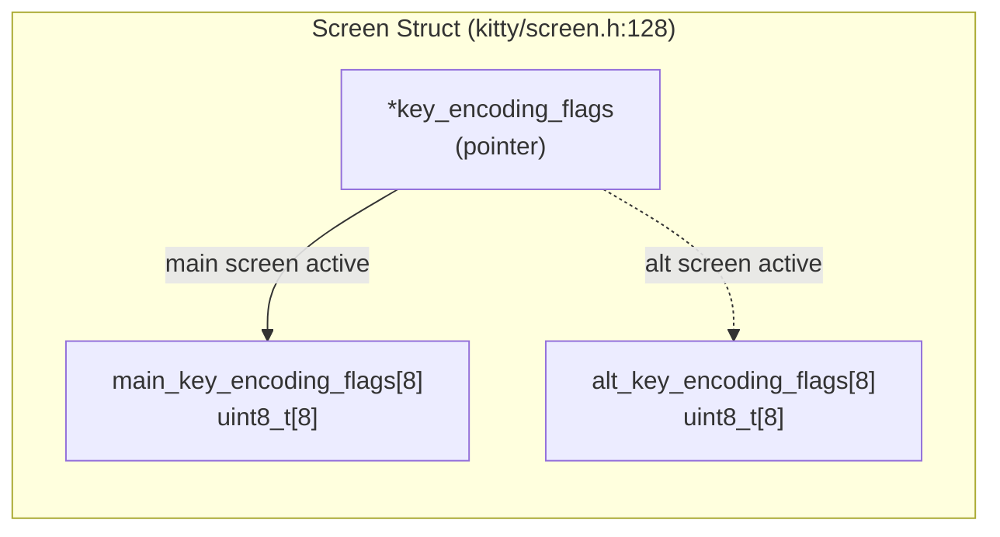
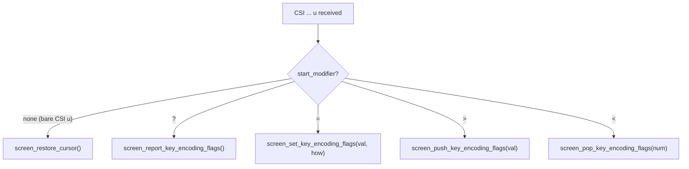
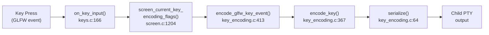

# Keyboard Progressive Enhancement Protocol Stack: Alternate Screen Buffer Behavior Analysis

**Source Branch:** `kitty_815df1e210e0`  
**Date:** 2026-04-09  
**Repository:** Kitty Terminal Emulator  
**Document Type:** Technical Deep-Dive / Q&A Investigation

---

## Executive Summary

This document provides a comprehensive, code-grounded analysis of how the Kitty terminal emulator manages the **keyboard progressive enhancement protocol flag stack** across alternate screen buffer switches. Every conclusion is traced to specific C source code, validated against existing test infrastructure, and supported by concrete byte-sequence evidence.

### Core Findings

**1. Stack Isolation: YES — Fully Independent Stacks**

The main and alternate screen buffers maintain **completely independent** keyboard enhancement flag stacks. This is guaranteed by the `Screen` struct declaring two separate `uint8_t[8]` arrays — `main_key_encoding_flags[8]` and `alt_key_encoding_flags[8]` — plus a pointer `*key_encoding_flags` that is swapped during buffer toggle. Because the pointer simply redirects between two pre-allocated, non-overlapping memory regions, all stack operations (push, pop, set, query) operate exclusively on whichever array the pointer currently references. No code path exists that simultaneously modifies both arrays, with the sole exception of `screen_reset()`.

> **Rationale:** The struct definition at `kitty/screen.h:128` allocates two distinct 8-byte arrays as struct members. C struct member layout guarantees these occupy separate, non-aliasing memory. The toggle function at `kitty/screen.c:1068-1095` only modifies the pointer itself — it performs no `memcpy`, `memmove`, or any write to array contents during the switch.

**2. Round-Trip State Preservation: YES — Fully Preserved**

The main buffer's stack survives a round-trip through the alternate buffer. When toggling to alternate, the pointer is redirected to `alt_key_encoding_flags` (line 1079); when toggling back, it is redirected to `main_key_encoding_flags` (line 1086). The underlying array data is never touched during either transition. A program can push flags on main, switch to alternate, push completely different flags, switch back, and find the main stack exactly as it was left.

> **Rationale:** The pointer swap at `screen_toggle_screen_buffer()` is a single assignment (`self->key_encoding_flags = self->main_key_encoding_flags` or `self->alt_key_encoding_flags`). This changes only which array is "active" for subsequent stack operations — it does not read, copy, or modify the contents of either array.

**3. Stack Exhaustion Independence: YES — Completely Separate**

Exhausting the 8-entry stack on one buffer has **zero effect** on the other buffer's stack. The `memmove`-based eviction in `screen_push_key_encoding_flags()` operates exclusively through the pointer `self->key_encoding_flags`, which points to only one of the two arrays at any given time. Overflowing the main buffer's stack cannot corrupt or influence the alternate buffer's stack, and vice versa.

> **Rationale:** The eviction at `kitty/screen.c:1241` calls `memmove(self->key_encoding_flags, self->key_encoding_flags + 1, ...)`. Since `self->key_encoding_flags` points to only the active array, the shift operation is confined to that array's memory.

**Canonical Specification Reference:**

The protocol specification at `docs/keyboard-protocol.rst:300-309` states:

> "Terminals must maintain separate stacks for the main and alternate screens. If a pop request is received that empties the stack, all flags are reset. If a push request is received and the stack is full, the oldest entry from the stack must be evicted."

The Kitty implementation faithfully implements all three requirements.

---

## 1. Data Structure Analysis

### 1.1 Screen Struct — Dual Key Encoding Flag Arrays

The `Screen` struct, defined at `kitty/screen.h:88-170`, is the central data structure for a terminal screen instance. It contains all state needed for rendering, cursor management, graphics, and — critically — keyboard encoding.

The keyboard enhancement flags are declared on a single line:

```c
uint8_t main_key_encoding_flags[8], alt_key_encoding_flags[8], *key_encoding_flags;
```

*Source: kitty/screen.h:128*

This declaration establishes three components:

| Component | Type | Purpose |
|-----------|------|---------|
| `main_key_encoding_flags[8]` | `uint8_t[8]` | Flag stack for the main screen buffer |
| `alt_key_encoding_flags[8]` | `uint8_t[8]` | Flag stack for the alternate screen buffer |
| `*key_encoding_flags` | `uint8_t*` | Pointer to whichever array is currently active |

During screen construction, the pointer is initialized to the main array:

```c
self->key_encoding_flags = self->main_key_encoding_flags;
```

*Source: kitty/screen.c:150*

This means a newly created screen starts with the main buffer active and both stacks empty (all bytes zeroed by `calloc`/default initialization).



### 1.2 The 0x80 Sentinel Bit Mechanism

Each `uint8_t` slot in the flag arrays uses a **dual-purpose encoding** that is not documented anywhere in the project's external documentation:

- **Bit 7 (0x80):** Serves as a "valid entry" sentinel. When set, the slot contains a valid stack entry.
- **Bits 0–6 (0x7f mask):** Store the actual keyboard enhancement flags value (0–31, since only 5 flag bits are defined by the protocol).
- **A slot with value `0x00`:** Is considered empty/unused.

This means:

| Raw Byte | 0x80 Set? | Flags Value | Interpretation |
|----------|-----------|-------------|----------------|
| `0x00` | No | — | Empty slot |
| `0x80` | Yes | 0 | Valid entry with no flags (legacy mode saved state) |
| `0x81` | Yes | 1 (`0b00001`) | Disambiguate mode |
| `0x83` | Yes | 3 (`0b00011`) | Disambiguate + report event types |
| `0x88` | Yes | 8 (`0b01000`) | Report all keys as escape codes |
| `0x89` | Yes | 9 (`0b01001`) | Disambiguate + report all keys |
| `0x90` | Yes | 16 (`0b10000`) | Embed text |
| `0x9F` | Yes | 31 (`0b11111`) | All five flags set |

The function `screen_current_key_encoding_flags()` retrieves the top-of-stack value by scanning **backward** through the array:

```c
uint8_t
screen_current_key_encoding_flags(Screen *self) {
    for (unsigned i = arraysz(self->main_key_encoding_flags); i-- > 0; ) {
        if (self->key_encoding_flags[i] & 0x80) return self->key_encoding_flags[i] & 0x7f;
    }
    return 0;
}
```

*Source: kitty/screen.c:1204-1208*

**Why backward iteration?** The stack grows forward (index 0 → 7), so the highest valid index is the top of stack. Scanning backward from index 7 finds the most recently pushed entry first. If no entry has the 0x80 bit set, the function returns 0 (no flags — legacy mode).

The `arraysz()` macro computes `sizeof(x)/sizeof(x[0])`, yielding 8 for these arrays:

```c
#define arraysz(x) (sizeof(x)/sizeof(x[0]))
```

*Source: kitty/data-types.h:42*

### 1.3 Stack Depth and Array Layout

The maximum stack depth is **8 entries per buffer**, hardcoded by the array size declaration. Index 0 is the bottom of the stack (oldest entry), and index 7 is the potential top (newest entry).

When the stack is empty, all 8 slots are `0x00`, and `screen_current_key_encoding_flags()` returns `0`.

**Example: Array state after sequential pushes of flags 1, 5, 9:**

| Step | [0] | [1] | [2] | [3] | [4] | [5] | [6] | [7] | Current Flags |
|------|-----|-----|-----|-----|-----|-----|-----|-----|---------------|
| Initial (empty) | `0x00` | `0x00` | `0x00` | `0x00` | `0x00` | `0x00` | `0x00` | `0x00` | 0 |
| After push 1 | `0x80` | `0x81` | `0x00` | `0x00` | `0x00` | `0x00` | `0x00` | `0x00` | 1 |
| After push 5 | `0x80` | `0x81` | `0x85` | `0x00` | `0x00` | `0x00` | `0x00` | `0x00` | 5 |
| After push 9 | `0x80` | `0x81` | `0x85` | `0x89` | `0x00` | `0x00` | `0x00` | `0x00` | 9 |

Note that the first push creates **two** entries: slot 0 gets `0x80` (saving the previous state of flags=0 as a valid entry), and slot 1 gets `0x80 | flags`. This matches the protocol semantics: push saves the current state, then sets the new flags on top.

---

## 2. Stack Operations Deep Dive

### 2.1 Push Operation (CSI > flags u)

The push operation is implemented by `screen_push_key_encoding_flags()`:

```c
void
screen_push_key_encoding_flags(Screen *self, uint32_t val) {
    uint8_t q = val & 0x7f;
    const unsigned sz = arraysz(self->main_key_encoding_flags);
    unsigned current_idx = 0;
    for (unsigned i = arraysz(self->main_key_encoding_flags); i-- > 0; ) {
        if (self->key_encoding_flags[i] & 0x80) { current_idx = i; break; }
    }
    if (current_idx == sz - 1) memmove(self->key_encoding_flags, self->key_encoding_flags + 1, (sz - 1) * sizeof(self->main_key_encoding_flags[0]));
    else self->key_encoding_flags[current_idx++] |= 0x80;
    self->key_encoding_flags[current_idx] = 0x80 | q;
}
```

*Source: kitty/screen.c:1234-1244*

**Algorithm trace:**

1. **Mask input:** `uint8_t q = val & 0x7f` — restricts the flags value to the lower 7 bits (0–127).
2. **Compute stack size:** `const unsigned sz = arraysz(self->main_key_encoding_flags)` — always 8.
3. **Find top of stack:** Scan backward through the active array to find `current_idx` — the index of the highest slot with the 0x80 sentinel bit set. If no valid entry exists, `current_idx` remains 0 (its initial value).
4. **Check for full stack:** If `current_idx == sz - 1` (i.e., index 7 — the stack is full), execute eviction via `memmove()` — shifts all entries left by one position, discarding the oldest entry at index 0. The new value will overwrite index 7.
5. **Normal push (stack not full):** Mark the current top slot as valid by ORing 0x80 (`self->key_encoding_flags[current_idx++] |= 0x80`), then increment the index.
6. **Write new entry:** `self->key_encoding_flags[current_idx] = 0x80 | q` — stores the new flags value with the sentinel bit.

**First push on an empty stack (detailed trace):**

When all slots are `0x00`:
- Backward scan finds no 0x80-marked slots → `current_idx = 0`
- `current_idx (0) != sz - 1 (7)` → else branch executes
- `self->key_encoding_flags[0] |= 0x80` → slot 0 becomes `0x80` (flags=0 saved)
- `current_idx++` → `current_idx = 1`
- `self->key_encoding_flags[1] = 0x80 | q` → new flags written to slot 1

This means the first push saves the "empty" state (flags=0) at index 0, then places the new value at index 1. After a pop, the stack returns to flags=0 — matching the protocol requirement that "if a pop request empties the stack, all flags are reset."

**Verification from test:**

```python
w('>', 0b0011)   # Push flags=3
ac(0b0011)       # Query returns 3
# ... later ...
for i in range(10):
    w('<')        # Pop 10 times
    ac(0)         # All return 0 — empty stack
```

*Source: kitty_tests/screen.py:977-987*

### 2.2 Pop Operation (CSI < num u)

The pop operation is implemented by `screen_pop_key_encoding_flags()`:

```c
void
screen_pop_key_encoding_flags(Screen *self, uint32_t num) {
    for (unsigned i = arraysz(self->main_key_encoding_flags); num && i-- > 0; ) {
        if (self->key_encoding_flags[i] & 0x80) { num--; self->key_encoding_flags[i] = 0; }
    }
}
```

*Source: kitty/screen.c:1248-1253*

**Algorithm:**

1. Iterate backward through the active array (index 7 → 0).
2. For each slot with the 0x80 sentinel bit set: clear it to `0` and decrement `num`.
3. Stop when `num` reaches 0 or all slots have been scanned.

**Key behaviors:**

- Popping more entries than exist simply clears all valid entries. The loop will scan all 8 slots, clearing however many have 0x80 set, then stop.
- After all entries are cleared, `screen_current_key_encoding_flags()` returns 0 — effectively resetting to legacy mode.
- This matches the protocol specification: "If a pop request is received that empties the stack, all flags are reset." (*Source: docs/keyboard-protocol.rst:301-302*)

**Verification from test:**

```python
for i in range(10):
    w('<')        # Pop 10 times (stack has at most 2 entries)
    ac(0)         # Always returns 0
```

*Source: kitty_tests/screen.py:985-987*

### 2.3 Set Operation (CSI = flags ; mode u)

The set operation modifies the top-of-stack entry in place:

```c
void
screen_set_key_encoding_flags(Screen *self, uint32_t val, uint32_t how) {
    unsigned idx = 0;
    for (unsigned i = arraysz(self->main_key_encoding_flags); i-- > 0; ) {
        if (self->key_encoding_flags[i] & 0x80) { idx = i; break; }
    }
    uint8_t q = val & 0x7f;
    if (how == 1) self->key_encoding_flags[idx] = q;
    else if (how == 2) self->key_encoding_flags[idx] |= q;
    else if (how == 3) self->key_encoding_flags[idx] &= ~q;
    self->key_encoding_flags[idx] |= 0x80;
}
```

*Source: kitty/screen.c:1220-1231*

**Three modification modes:**

| `how` Value | Mode | Operation | Description |
|-------------|------|-----------|-------------|
| 1 | Replace | `slot = q` | Set flags to exactly the given value |
| 2 | Bitwise OR | `slot \|= q` | Add the specified flag bits |
| 3 | Bitwise AND-NOT | `slot &= ~q` | Clear the specified flag bits |

After the modification, the 0x80 sentinel is always re-applied to ensure the slot remains valid.

**Worked examples from the test suite:**

```
Initial:           flags = 0
Set replace 0b1001: flags = 0b1001 (9)     // how=1: slot = 0b1001
Set OR 0b0011:      flags = 0b1011 (11)    // how=2: 0b1001 | 0b0011 = 0b1011
Set AND-NOT 0b0110: flags = 0b1001 (9)     // how=3: 0b1011 & ~0b0110 = 0b1001
```

*Source: kitty_tests/screen.py:967-973*

### 2.4 Query Operation (CSI ? u)

The query operation reports the current flags back to the child process:

```c
void
screen_report_key_encoding_flags(Screen *self) {
    char buf[16] = {0};
    snprintf(buf, sizeof(buf), "?%uu", screen_current_key_encoding_flags(self));
    write_escape_code_to_child(self, ESC_CSI, buf);
}
```

*Source: kitty/screen.c:1212-1217*

The response is sent as `CSI ? {flags} u`. For example, if the current flags are 9, the response is `\x1b[?9u`.

### 2.5 Stack Exhaustion — Eviction via memmove

When the stack is full (all 8 slots occupied, `current_idx == 7`), a new push triggers eviction:

```c
if (current_idx == sz - 1)
    memmove(self->key_encoding_flags, self->key_encoding_flags + 1,
            (sz - 1) * sizeof(self->main_key_encoding_flags[0]));
```

*Source: kitty/screen.c:1241*

This `memmove` shifts slots 1–7 into positions 0–6, overwriting slot 0 (the oldest entry). Then the new value is written to slot 7 (the now-freed top position via `self->key_encoding_flags[current_idx] = 0x80 | q` where `current_idx` remains 7 after the memmove).

**Visual representation of eviction:**

```
Before push (stack full, 8 entries):
  [0]=0x81  [1]=0x82  [2]=0x83  [3]=0x84  [4]=0x85  [5]=0x86  [6]=0x87  [7]=0x88
   oldest                                                                  newest

After memmove (shift left by 1, evicting oldest):
  [0]=0x82  [1]=0x83  [2]=0x84  [3]=0x85  [4]=0x86  [5]=0x87  [6]=0x88  [7]=??
   ↑ was slot 1                                                           freed

After writing new value (flags=0x0F):
  [0]=0x82  [1]=0x83  [2]=0x84  [3]=0x85  [4]=0x86  [5]=0x87  [6]=0x88  [7]=0x8F
                                                                          newest
```

**Verification from test:**

```python
for i in range(1, 16):
    w('>', i)        # Push 15 values (1 through 15)
ac(15)               # Query returns 15 (most recent)
w('<'), ac(14)       # Pop → returns 14
w('<'), ac(13)       # Pop → returns 13
```

*Source: kitty_tests/screen.py:990-993*

After pushing 15 values into an 8-slot stack, only the last 8 survive (values 8 through 15). Actually, let us trace more carefully: The first push (value 1) saves the empty state at [0] and places 1 at [1]. Subsequent pushes fill slots until the array is full. After push 7, the array is full with slots [0]=0x80 (saved empty), [1]=0x81, ..., [7]=0x87. Push 8 triggers eviction: slot 0 is dropped, slots shift left, new value goes to [7]=0x88. Continuing through push 15: the most recent 8 entries (including saved states) hold the latest values. The test confirms: query returns 15, pop returns 14, then 13 — the three most recent values are accessible on top.

---

## 3. Buffer Switch Mechanics

### 3.1 screen_toggle_screen_buffer() — Pointer Swap

The function `screen_toggle_screen_buffer()` handles switching between main and alternate screen buffers:

```c
void
screen_toggle_screen_buffer(Screen *self, bool save_cursor, bool clear_alt_screen) {
    bool to_alt = self->linebuf == self->main_linebuf;
    self->active_hyperlink_id = 0;
    if (to_alt) {
        if (clear_alt_screen) {
            linebuf_clear(self->alt_linebuf, BLANK_CHAR);
            grman_clear(self->alt_grman, true, self->cell_size);
        }
        if (save_cursor) screen_save_cursor(self);
        self->linebuf = self->alt_linebuf;
        self->tabstops = self->alt_tabstops;
        self->key_encoding_flags = self->alt_key_encoding_flags;
        self->grman = self->alt_grman;
        screen_cursor_position(self, 1, 1);
        cursor_reset(self->cursor);
    } else {
        self->linebuf = self->main_linebuf;
        self->tabstops = self->main_tabstops;
        self->key_encoding_flags = self->main_key_encoding_flags;
        if (save_cursor) screen_restore_cursor(self);
        self->grman = self->main_grman;
    }
    screen_history_scroll(self, SCROLL_FULL, false);
    self->is_dirty = true;
}
```

*Source: kitty/screen.c:1068-1095*

**The critical insight:** The swap only changes the **pointer** — the underlying array data is **never** touched, copied, or modified during the toggle.

**Switching to alternate** (lines 1071–1082):
- `self->key_encoding_flags = self->alt_key_encoding_flags;` (line 1079)
- Also swaps: `linebuf`, `tabstops`, `grman`
- Optionally clears alt screen and saves cursor

**Switching to main** (lines 1083–1088):
- `self->key_encoding_flags = self->main_key_encoding_flags;` (line 1086)
- Also swaps back: `linebuf`, `tabstops`, `grman`
- Optionally restores cursor

```mermaid
sequenceDiagram
    participant App as Application
    participant Screen as Screen Struct
    participant Main as main_key_encoding_flags[8]
    participant Alt as alt_key_encoding_flags[8]
    
    Note over Screen: Initially: key_encoding_flags → Main
    App->>Screen: Push flags=0b1 (CSI > 1 u)
    Screen->>Main: main[0]=0x80, main[1]=0x81
    
    App->>Screen: Toggle to alt (CSI ?1049h)
    Note over Screen: key_encoding_flags → Alt
    
    App->>Screen: Push flags=0b1000 (CSI > 8 u)
    Screen->>Alt: alt[0]=0x80, alt[1]=0x88
    
    App->>Screen: Toggle to main (CSI ?1049l)
    Note over Screen: key_encoding_flags → Main
    Note over Main: main[0]=0x80, main[1]=0x81 — PRESERVED
```

### 3.2 Mode Constants

Three private DEC modes trigger the screen buffer toggle, defined in `kitty/modes.h:75-77`:

| Constant | Value | Mode Number | Behavior |
|----------|-------|-------------|----------|
| `TOGGLE_ALT_SCREEN_1` | `47 << 5` | 47 | Basic toggle (no cursor save, no clear) |
| `TOGGLE_ALT_SCREEN_2` | `1047 << 5` | 1047 | Toggle without cursor save/restore |
| `ALTERNATE_SCREEN` | `1049 << 5` | 1049 | Toggle with cursor save/restore and alt screen clear |

*Source: kitty/modes.h:75-77*

All three are handled in `set_mode_from_const()`:

```c
case TOGGLE_ALT_SCREEN_1:
case TOGGLE_ALT_SCREEN_2:
case ALTERNATE_SCREEN:
    if (val && self->linebuf == self->main_linebuf)
        screen_toggle_screen_buffer(self, mode == ALTERNATE_SCREEN, mode == ALTERNATE_SCREEN);
    else if (!val && self->linebuf != self->main_linebuf)
        screen_toggle_screen_buffer(self, mode == ALTERNATE_SCREEN, mode == ALTERNATE_SCREEN);
    break;
```

*Source: kitty/screen.c:1165-1170*

For mode 1049 (`ALTERNATE_SCREEN`), both `save_cursor` and `clear_alt_screen` are `true`. For modes 47 and 1047, both are `false`. All three call the same `screen_toggle_screen_buffer()` function, which always performs the `key_encoding_flags` pointer swap.

The DECCKM constant is also relevant (used later in edge cases):

```c
#define DECCKM (1 << 5)
```

*Source: kitty/modes.h:27*

### 3.3 VT Parser Routing for CSI u Sequences

The VT parser dispatches CSI `u` sequences based on the `start_modifier` character:

```c
case 'u':
    if (!start_modifier && !end_modifier && !num_params) {
        screen_restore_cursor(self->screen);
        break;
    }
    if (!end_modifier && start_modifier == '?') {
        screen_report_key_encoding_flags(self->screen);
        break;
    }
    if (!end_modifier && start_modifier == '=') {
        CALL_CSI_HANDLER2(screen_set_key_encoding_flags, 0, 1);
        break;
    }
    if (!end_modifier && start_modifier == '>') {
        CALL_CSI_HANDLER1(screen_push_key_encoding_flags, 0);
        break;
    }
    if (!end_modifier && start_modifier == '<') {
        CALL_CSI_HANDLER1(screen_pop_key_encoding_flags, 1);
        break;
    }
```

*Source: kitty/vt-parser.c:1217-1241*

**Routing table:**

| Escape Sequence | Start Modifier | Dispatches To | Default Params | Source |
|----------------|----------------|---------------|----------------|--------|
| `CSI u` (bare) | none | `screen_restore_cursor()` | — | vt-parser.c:1218-1221 |
| `CSI ? u` | `?` | `screen_report_key_encoding_flags()` | — | vt-parser.c:1223-1226 |
| `CSI = flags ; mode u` | `=` | `screen_set_key_encoding_flags(flags, mode)` | flags=0, mode=1 | vt-parser.c:1228-1230 |
| `CSI > flags u` | `>` | `screen_push_key_encoding_flags(flags)` | flags=0 | vt-parser.c:1232-1234 |
| `CSI < num u` | `<` | `screen_pop_key_encoding_flags(num)` | num=1 | vt-parser.c:1236-1238 |



---

## 4. Stack Isolation Proof

### 4.1 Code-Level Evidence

Three independent lines of evidence prove that the main and alternate buffers maintain fully isolated keyboard flag stacks:

**Evidence 1 — Separate Storage:**

The `Screen` struct at `kitty/screen.h:128` declares two distinct `uint8_t[8]` arrays:

```c
uint8_t main_key_encoding_flags[8], alt_key_encoding_flags[8], *key_encoding_flags;
```

As struct members, these arrays occupy separate memory locations within the struct layout. They cannot alias each other — each is a fixed-size embedded array, not a pointer to shared memory.

**Evidence 2 — Pointer Swap Only:**

`screen_toggle_screen_buffer()` at `kitty/screen.c:1079` and `1086` contains only pointer assignments:

```c
// To alternate (line 1079):
self->key_encoding_flags = self->alt_key_encoding_flags;
// To main (line 1086):
self->key_encoding_flags = self->main_key_encoding_flags;
```

There is no `memcpy`, no `memmove`, no zeroing, no reading-from-one-and-writing-to-the-other during the toggle. Only the pointer changes.

**Evidence 3 — All Stack Operations Use the Pointer:**

Every stack operation accesses data through `self->key_encoding_flags[i]`:

- `screen_push_key_encoding_flags()` — line 1239, 1241, 1242, 1243
- `screen_pop_key_encoding_flags()` — line 1250
- `screen_set_key_encoding_flags()` — lines 1223, 1226, 1227, 1228, 1229
- `screen_current_key_encoding_flags()` — line 1206

Since the pointer always references exactly one of the two arrays, operations on one buffer's stack cannot affect the other.

**Conclusion:** Because the pointer simply switches between two pre-allocated, non-overlapping arrays, and all operations go through the pointer, the stacks are fully isolated.

### 4.2 Round-Trip Scenario Walkthrough

The following walkthrough demonstrates state preservation through a complete main → alt → main round-trip:

| Step | Operation | Pointer Target | main[] State | alt[] State | Query Returns |
|------|-----------|---------------|-------------|------------|---------------|
| 0 | Initial state | main | `[00,00,00,00,00,00,00,00]` | `[00,00,00,00,00,00,00,00]` | 0 |
| 1 | Push 0b1 on main | main | `[80,81,00,00,00,00,00,00]` | `[00,00,00,00,00,00,00,00]` | 1 |
| 2 | Push 0b11 on main | main | `[80,81,83,00,00,00,00,00]` | `[00,00,00,00,00,00,00,00]` | 3 |
| 3 | Toggle to alt | **alt** | `[80,81,83,00,00,00,00,00]` | `[00,00,00,00,00,00,00,00]` | 0 |
| 4 | Push 0b1000 on alt | **alt** | `[80,81,83,00,00,00,00,00]` | `[80,88,00,00,00,00,00,00]` | 8 |
| 5 | Push 0b10000 on alt | **alt** | `[80,81,83,00,00,00,00,00]` | `[80,88,90,00,00,00,00,00]` | 16 |
| 6 | Toggle to main | **main** | `[80,81,83,00,00,00,00,00]` | `[80,88,90,00,00,00,00,00]` | **3** |
| 7 | Pop on main | **main** | `[80,81,00,00,00,00,00,00]` | `[80,88,90,00,00,00,00,00]` | **1** |

**Key observations:**

- At step 3: toggling to alt changes only the pointer. The main array is untouched. Query returns 0 (alt stack is empty).
- At step 6: toggling back to main changes only the pointer. The alt array is untouched. Query returns 3 — **the main stack survived the round-trip**.
- At step 7: popping from main removes the 0b11 entry. The alt stack remains `[80,88,90,...]` — completely unaffected.

### 4.3 Cross-Buffer Exhaustion Independence

Consider this scenario proving that stack exhaustion on one buffer doesn't affect the other:

1. **Overflow main:** Push 15 values (1 through 15) onto the main buffer, triggering multiple evictions.
2. **Toggle to alt:** Pointer switches to the alt array.
3. **Query alt:** Returns 0 — the alt stack is completely empty, unaffected by main's overflow.
4. **Overflow alt:** Push 15 different values onto the alt buffer.
5. **Toggle back to main:** Pointer switches back to main.
6. **Query main:** Returns the last value pushed onto main (15 from step 1) — main's evicted state is preserved independently.

The existing test at `kitty_tests/screen.py:990-993` confirms the eviction mechanics on a single buffer, and the dual-array architecture guarantees cross-buffer independence:

```python
for i in range(1, 16):
    w('>', i)         # Push 15 values
ac(15)                # Top of stack = 15
w('<'), ac(14)        # Pop → 14
w('<'), ac(13)        # Pop → 13
```

*Source: kitty_tests/screen.py:990-993*

---

## 5. Byte Sequence Evidence

### 5.1 Encoding Pipeline

The complete pipeline from key press to bytes sent to the child process:



**Detailed pipeline steps:**

1. **Platform key event** → `on_key_input()` at `kitty/keys.c:166`. This is the main entry point for all keyboard events.

2. **Flags retrieval:** `screen_current_key_encoding_flags(screen)` is called at `kitty/keys.c:251` to get the active buffer's current flags value.

3. **Encoding call:** `encode_glfw_key_event(ev, screen->modes.mDECCKM, flags, encoded_key)` at `kitty/keys.c:251` passes both the DECCKM mode state and the keyboard flags.

4. **Flag-to-field mapping** inside `encode_glfw_key_event()` at `kitty/key_encoding.c:413-440`:
   ```c
   .disambiguate = key_encoding_flags & 1,
   .report_all_event_types = key_encoding_flags & 2,
   .report_alternate_key = key_encoding_flags & 4,
   .report_text = key_encoding_flags & 8,
   .embed_text = key_encoding_flags & 16
   ```
   *Source: kitty/key_encoding.c:419-423*

5. **Encoding path selection** in `encode_key()` at `kitty/key_encoding.c:367-397` — chooses between legacy encoding and CSI serialization based on flags, key type, and modifiers.

6. **CSI serialization** in `serialize()` at `kitty/key_encoding.c:64-98` — builds the `CSI key ; mods[:action] [; text] trailer` format.

7. **Output delivery** via `schedule_write_to_child()` at `kitty/keys.c:259`.

### 5.2 Flag Bit Mapping Table

| Bit | Value | Flag Name | KeyEvent Field | Protocol Effect |
|-----|-------|-----------|----------------|-----------------|
| 0 | `0b00001` (1) | Disambiguate | `ev.disambiguate` | Special keys and modified keys use unambiguous CSI u encoding instead of legacy escape sequences |
| 1 | `0b00010` (2) | Report event types | `ev.report_all_event_types` | Reports press, repeat, and release actions in the modifier field (`:action` suffix) |
| 2 | `0b00100` (4) | Report alternate keys | `ev.report_alternate_key` | Includes `shifted_key` and `alternate_key` in the key field (`:shifted[:alt]` suffix) |
| 3 | `0b01000` (8) | Report all keys | `ev.report_text` | All keys including plain text keys get CSI u encoding; modifier keys are also reported |
| 4 | `0b10000` (16) | Embed text | `ev.embed_text` | Text codepoints are embedded in the third field of the CSI u sequence |

*Source: kitty/key_encoding.c:419-423*

### 5.3 Ctrl+Shift+A Under Each Flag Combination

For a **Ctrl+Shift+A** key press:
- GLFW key: `key = ord('a') = 97`
- Modifiers: Ctrl + Shift → `mods.value = CTRL | SHIFT = 4 | 1 = 5`
- Encoded modifiers: `mods.value + 1 = 6` (per `key_encoding.c:47`)
- Shifted key: `ord('A') = 65` (when provided)

#### No Flags (Legacy Mode, flags=0)

With no flags, `disambiguate=false` and `report_text=false`, so the legacy encoding path is taken. In `encode_printable_ascii_key_legacy()` at `kitty/key_encoding.c:292`:

- `mods` has both SHIFT and CTRL set
- The Shift modifier is consumed when `shifted_key` differs from `key` and either no Ctrl or the key is outside a–z range. Since key='a' is in a–z range and Ctrl IS set, Shift is NOT consumed.
- With `mods = CTRL | SHIFT`, the function falls through to the `if (key == ' ')` checks (which don't apply) and returns 0 — meaning no legacy encoding is available.
- This falls through to `serialize()` which produces CSI output: `\x1b[97;6u`

However, if only Ctrl is pressed (without Shift), the legacy path at line 309 produces `ctrled_key('a') = 1`, giving `\x01` (ASCII SOH).

**Ctrl+A (without Shift), legacy mode:**

| Notation | Value |
|----------|-------|
| Hex | `01` |
| Escape | `\x01` (Ctrl+A / SOH) |
| Bytes | 1 byte |

**Ctrl+Shift+A, legacy mode (falls through to CSI):**

| Notation | Value |
|----------|-------|
| Hex | `1b 5b 39 37 3b 36 75` |
| Escape | `\x1b[97;6u` |
| Readable | `ESC [ 9 7 ; 6 u` |
| Bytes | 7 bytes |

#### Disambiguate Mode (flags=0b1)

With `disambiguate=true`, the condition at `key_encoding.c:379` (`!ev->disambiguate && !ev->report_text`) is false, so the legacy path is skipped. The key is encoded via `serialize()`.

For `Ctrl+A` (key=97, mods=ctrl, encoded mods="5"):

| Notation | Value |
|----------|-------|
| Hex | `1b 5b 39 37 3b 35 75` |
| Escape | `\x1b[97;5u` |
| Readable | `ESC [ 9 7 ; 5 u` |

**Test confirmation:** `ae(dq(ord('a'), mods=ctrl), csi(ctrl, ord('a')))` → `\x1b[97;5u`

*Source: kitty_tests/keys.py:427*

For `Ctrl+Shift+A` (key=97, mods=ctrl|shift, encoded mods="6"):

| Notation | Value |
|----------|-------|
| Hex | `1b 5b 39 37 3b 36 75` |
| Escape | `\x1b[97;6u` |
| Readable | `ESC [ 9 7 ; 6 u` |

#### Report All Keys Mode (flags=0b1000)

With `report_text=true`, even plain keys get CSI u encoding. The `send_text_standalone` flag at line 428 is `false`, so text is NOT sent as standalone bytes.

For `Ctrl+A` (key=97, mods=ctrl, encoded mods="5"):

| Notation | Value |
|----------|-------|
| Hex | `1b 5b 39 37 3b 35 75` |
| Escape | `\x1b[97;5u` |
| Readable | `ESC [ 9 7 ; 5 u` |

**Test confirmation:** `ae(kq(ord('a'), mods=ctrl), csi(ctrl, num='a'))` → `\x1b[97;5u`

*Source: kitty_tests/keys.py:457*

For a plain `a` with no modifiers (key=97, no mods):

| Notation | Value |
|----------|-------|
| Hex | `1b 5b 39 37 75` |
| Escape | `\x1b[97u` |
| Readable | `ESC [ 9 7 u` |

**Test confirmation:** `ae(kq(ord('a')), csi(num='a'))` → `\x1b[97u`

*Source: kitty_tests/keys.py:455*

#### Report All Keys + Embed Text (flags=0b11000)

With both `report_text=true` and `embed_text=true`, the text codepoints are embedded in the third CSI field.

For `Shift+A` (key=97, mods=shift, encoded mods="2", text='A'):

| Notation | Value |
|----------|-------|
| Hex | `1b 5b 39 37 3b 32 3b 36 35 75` |
| Escape | `\x1b[97;2;65u` |
| Readable | `ESC [ 9 7 ; 2 ; 6 5 u` |

The third field `65` is `ord('A') = 65`.

**Test confirmation:** `ae(eq(ord('a'), mods=shift, text='A'), csi(shift, num='a', text='A'))` → `\x1b[97;2;65u`

*Source: kitty_tests/keys.py:467*

For multi-character text embedding (`text='AB'`):

| Notation | Value |
|----------|-------|
| Escape | `\x1b[97;2;65:66u` |
| Readable | `ESC [ 9 7 ; 2 ; 6 5 : 6 6 u` |

**Test confirmation:** `ae(eq(ord('a'), mods=shift, text='AB'), csi(shift, num='a', text='AB'))` → `\x1b[97;2;65:66u`

*Source: kitty_tests/keys.py:468*

### 5.4 Consolidated Byte Sequence Reference

The following table shows key encoding output for representative keys under different flag combinations. All values are derived from the `encode_glfw_key_event()` implementation in `kitty/key_encoding.c` and validated against test assertions in `kitty_tests/keys.py`.

**Legend:** "Legacy" = flags=0, "Disamb" = flags=0b1, "AllKeys" = flags=0b1000, "Embed" = flags=0b11000

| Key (+ Mods) | Legacy (0) | Disamb (0b1) | AllKeys (0b1000) | Embed (0b11000) |
|-------------|-----------|--------------|-----------------|-----------------|
| `a` (plain) | `61` → `a` | `61` → `a` | `1b5b3937 75` → `\x1b[97u` | `1b5b3937 3b3b3937 75` → `\x1b[97;;97u` |
| `a` (Ctrl) | `01` → `\x01` | `1b5b3937 3b3575` → `\x1b[97;5u` | `1b5b3937 3b3575` → `\x1b[97;5u` | `1b5b3937 3b3575` → `\x1b[97;5u` |
| `a` (Alt) | `1b61` → `\x1ba` | `1b5b3937 3b3375` → `\x1b[97;3u` | `1b5b3937 3b3375` → `\x1b[97;3u` | `1b5b3937 3b3375` → `\x1b[97;3u` |
| Escape | `1b` → `\x1b` | `1b5b3237 75` → `\x1b[27u` | `1b5b3237 75` → `\x1b[27u` | `1b5b3237 75` → `\x1b[27u` |
| Enter | `0d` → `\r` | `0d` → `\r` | `1b5b3133 75` → `\x1b[13u` | `1b5b3133 75` → `\x1b[13u` |
| Tab | `09` → `\t` | `09` → `\t` | `1b5b3975` → `\x1b[9u` | `1b5b3975` → `\x1b[9u` |
| Tab (Shift) | `1b5b5a` → `\x1b[Z` | `1b5b393b 3275` → `\x1b[9;2u` | `1b5b393b 3275` → `\x1b[9;2u` | `1b5b393b 3275` → `\x1b[9;2u` |
| Backspace | `7f` → `\x7f` | `7f` → `\x7f` | `1b5b3132 3775` → `\x1b[127u` | `1b5b3132 3775` → `\x1b[127u` |
| Arrow Up | `1b5b41` → `\x1b[A` | `1b5b41` → `\x1b[A` | `1b5b41` → `\x1b[A` | `1b5b41` → `\x1b[A` |
| Arrow Up (Ctrl) | `1b5b313b 3541` → `\x1b[1;5A` | `1b5b313b 3541` → `\x1b[1;5A` | `1b5b313b 3541` → `\x1b[1;5A` | `1b5b313b 3541` → `\x1b[1;5A` |

**Test sources for key assertions:**

- Escape: `ae(dq(defines.GLFW_FKEY_ESCAPE), csi(num=27))` — *kitty_tests/keys.py:420*
- Enter: `ae(dq(defines.GLFW_FKEY_ENTER), '\r')` — *kitty_tests/keys.py:421*
- Tab: `ae(dq(defines.GLFW_FKEY_TAB), '\t')` — *kitty_tests/keys.py:423*
- Backspace: `ae(dq(defines.GLFW_FKEY_BACKSPACE), '\x7f')` — *kitty_tests/keys.py:424*
- Tab+Shift: `ae(dq(defines.GLFW_FKEY_TAB, mods=shift), csi(shift, 9))` — *kitty_tests/keys.py:425*
- Arrow Up: `ae(dq(defines.GLFW_FKEY_UP), '\x1b[A')` — *kitty_tests/keys.py:432*
- Arrow Up+Ctrl: `ae(dq(defines.GLFW_FKEY_UP, mods=ctrl), csi(ctrl, 1, trailer='A'))` — *kitty_tests/keys.py:433*
- Report-all Enter: `ae(kq(defines.GLFW_FKEY_ENTER), '\x1b[13u')` — *kitty_tests/keys.py:460*
- Report-all Tab: `ae(kq(defines.GLFW_FKEY_TAB), '\x1b[9u')` — *kitty_tests/keys.py:461*
- Report-all Backspace: `ae(kq(defines.GLFW_FKEY_BACKSPACE), '\x1b[127u')` — *kitty_tests/keys.py:462*

---

## 6. Test Validation

### 6.1 test_key_encoding_flags_stack Analysis

The test at `kitty_tests/screen.py:952-993` exercises the complete stack lifecycle through the VT parser pipeline.

**Test infrastructure setup:**

```python
s = self.create_screen()    # Creates Screen(callbacks, 5, 5, 5, 10, 20, 0, callbacks)
c = s.callbacks
```

*Source: kitty_tests/__init__.py:237-241*

**Helper functions:**

```python
def w(code, p1='', p2=''):
    p = f'{p1}'
    if p2:
        p += f';{p2}'
    return parse_bytes(s, f'\033[{code}{p}u'.encode('ascii'))
```

Sends a CSI u sequence through the full VT parser pipeline. For example, `w('>', 3)` sends `\x1b[>3u` (push flags=3).

```python
def ac(flags):
    parse_bytes(s, b'\033[?u')
    self.ae(c.wtcbuf, f'\033[?{flags}u'.encode('ascii'))
    c.clear()
```

Sends `CSI ? u` (query), then asserts that the response written to the child process buffer (`wtcbuf`) matches the expected `CSI ? {flags} u`.

**Test scenarios documented:**

| Scenario | Lines | Operations | Expected Result | Validates |
|----------|-------|-----------|-----------------|-----------|
| Initial query | 967 | `ac(0)` | flags = 0 | Empty stack returns 0 |
| Set replace | 968-969 | `w('=', 0b1001)`, `ac(0b1001)` | flags = 9 | Replace mode (how=1) |
| Set OR | 970-971 | `w('=', 0b0011, 2)`, `ac(0b1011)` | flags = 11 | OR mode: 9 \| 3 = 11 |
| Set AND-NOT | 972-973 | `w('=', 0b0110, 3)`, `ac(0b1001)` | flags = 9 | AND-NOT: 11 & ~6 = 9 |
| Reset | 974-975 | `s.reset()`, `ac(0)` | flags = 0 | Reset clears all |
| Push | 977-978 | `w('>', 0b0011)`, `ac(0b0011)` | flags = 3 | Push works |
| Set after push | 979-980 | `w('=', 0b1111)`, `ac(0b1111)` | flags = 15 | Set modifies top |
| Push again | 981-982 | `w('>', 0b10)`, `ac(0b10)` | flags = 2 | Second push works |
| Pop | 983-984 | `w('<')`, `ac(0b1111)` | flags = 15 | Pop reveals previous |
| Pop to empty | 985-987 | `w('<')` × 10, `ac(0)` × 10 | flags = 0 each time | Excessive pop is safe |
| Stack overflow | 990-993 | Push 1..15, query, pop, pop | 15, 14, 13 | Eviction preserves most recent |

*Source: kitty_tests/screen.py:952-993*

### 6.2 test_encode_key_event Flag Scenarios

The key encoding tests at `kitty_tests/keys.py:417-468` validate each progressive enhancement mode:

**Disambiguate (flags=0b1), lines 417-433:**
- Plain `a` stays as `a` (no need to disambiguate)
- Escape gets CSI encoding: `\x1b[27u`
- Enter, Tab, Backspace stay as legacy single bytes (unambiguous already)
- Shift+Tab gets CSI encoding: `\x1b[9;2u`
- Modified letters get CSI encoding: `\x1b[97;5u` for Ctrl+A
- Keypad keys get CSI encoding with their functional key numbers
- Arrow keys keep standard CSI format: `\x1b[A`, `\x1b[1;5A` with modifiers

**Event type reporting (flags=0b10), lines 435-443:**
- Plain press sends normally
- Repeat adds action=2: `\x1b[97;1:2u`
- Release adds action=3: `\x1b[97;1:3u`
- Modified release: `\x1b[97;2:3u` (Shift+A release)
- With flags=0b11 (disambiguate+events), Backspace press is `\x7f` but Backspace release is empty (no output)

**Alternate key reporting (flags=0b100), lines 445-451:**
- Plain `a` stays as `a`
- Shift+A with shifted_key='A': `\x1b[97:65;2u` (alternate format with shifted key in first field)
- With alternate_key='A': `\x1b[97::65u` (double colon, alternate in third position of first field)

**Report all keys (flags=0b1000), lines 453-462:**
- Plain `a` gets CSI encoding: `\x1b[97u`
- Modifier keys get reported: Left Shift → `\x1b[<left_shift_code>u`
- Enter: `\x1b[13u`, Tab: `\x1b[9u`, Backspace: `\x1b[127u`

**Embed text (flags=0b11000), lines 464-468:**
- `a` with text='a': `\x1b[97;;97u` (text codepoint in third field)
- Shift+A with text='A': `\x1b[97;2;65u`
- Shift+A with text='AB': `\x1b[97;2;65:66u` (multiple codepoints colon-separated)

### 6.3 Test Infrastructure

**`parse_bytes()` function:**

```python
def parse_bytes(screen, data, dump_callback=None):
    data = memoryview(data)
    while data:
        dest = screen.test_create_write_buffer()
        s = screen.test_commit_write_buffer(data, dest)
        data = data[s:]
        screen.test_parse_written_data(dump_callback)
```

*Source: kitty_tests/__init__.py:30-37*

This function feeds raw bytes through the full VT parser pipeline in the Screen object, processing them in buffer-sized chunks. It is the primary mechanism for driving escape sequences through the terminal in tests.

**`Callbacks` class:**

The `Callbacks` class (defined at `kitty_tests/__init__.py:39-80`) accumulates terminal output in the `wtcbuf` attribute:

```python
def write(self, data) -> None:
    self.wtcbuf += bytes(data)
```

This captures bytes written back to the child process (e.g., query responses like `CSI ? {flags} u`), enabling test assertions against expected output.

**`create_screen()` factory:**

```python
def create_screen(self, cols=5, lines=5, scrollback=5, cell_width=10, cell_height=20, options=None):
    self.set_options(options)
    c = Callbacks()
    s = Screen(c, lines, cols, scrollback, cell_width, cell_height, 0, c)
    return s
```

*Source: kitty_tests/__init__.py:237-241*

Creates a `Screen` object with specified dimensions (default: 5×5 with 5 lines scrollback) and a `Callbacks` instance for capturing output. The screen starts on the main buffer with an empty keyboard flag stack.

---

## 7. Edge Cases and Mode Interactions

### 7.1 screen_reset() — Cross-Buffer Clear

`screen_reset()` is the **only operation** that crosses the buffer isolation boundary:

```c
void
screen_reset(Screen *self) {
    // ... other reset operations ...
    if (self->linebuf == self->alt_linebuf)
        screen_toggle_screen_buffer(self, true, true);
    // ...
    memset(self->main_key_encoding_flags, 0, sizeof(self->main_key_encoding_flags));
    memset(self->alt_key_encoding_flags, 0, sizeof(self->alt_key_encoding_flags));
    // ...
}
```

*Source: kitty/screen.c:161-174 (specifically lines 165, 173-174)*

**Behavior:**

1. If currently on the alternate screen, it first toggles back to main (line 165).
2. Then it clears **both** flag arrays with `memset(..., 0, ...)` — zeroing all 8 bytes in each.
3. After reset, both stacks are empty and both query operations return 0.

This is the **sole exception** to the buffer isolation rule. A full terminal reset (triggered by the RIS escape sequence `ESC c`, or programmatically via `screen.reset()`) unconditionally wipes both stacks.

**Rationale:** A terminal reset is defined as restoring the terminal to its power-on state. All state — including keyboard enhancement flags for both buffers — must be cleared.

**Test confirmation:**

```python
s.reset()
ac(0)        # After reset, flags are 0
```

*Source: kitty_tests/screen.py:974-975*

### 7.2 DECCKM Cursor Key Mode Interaction

DECCKM (DEC Cursor Key Mode) affects arrow key encoding and interacts with the keyboard flags in a nuanced way.

At the encoding call site:

```c
int size = encode_glfw_key_event(ev, screen->modes.mDECCKM,
                                  screen_current_key_encoding_flags(screen),
                                  encoded_key);
```

*Source: kitty/keys.c:251*

Inside `encode_glfw_key_event()`, the `cursor_key_mode` boolean is passed through to `KeyEvent.cursor_key_mode`. Then, in `encode_function_key()`:

```c
if (ev->cursor_key_mode && legacy_mode && !ev->mods.value) {
    switch(key_number) {
        case GLFW_FKEY_UP: SIMPLE("\x1bOA");
        case GLFW_FKEY_DOWN: SIMPLE("\x1bOB");
        case GLFW_FKEY_RIGHT: SIMPLE("\x1bOC");
        case GLFW_FKEY_LEFT: SIMPLE("\x1bOD");
        case GLFW_FKEY_KP_BEGIN: SIMPLE("\x1bOE");
        case GLFW_FKEY_END: SIMPLE("\x1bOF");
        case GLFW_FKEY_HOME: SIMPLE("\x1bOH");
        default: break;
    }
}
```

*Source: kitty/key_encoding.c:154-164*

The condition requires **all three** to be true:
1. `ev->cursor_key_mode` — DECCKM is enabled
2. `legacy_mode` — defined as `!ev->report_all_event_types && !ev->disambiguate` (line 152)
3. `!ev->mods.value` — no modifier keys are pressed

**Interaction with keyboard flags:**

| DECCKM | Keyboard Flags | Arrow Key Output | Explanation |
|--------|---------------|------------------|-------------|
| ON | 0 (none) | `\x1bOA` (SS3) | Legacy mode with DECCKM → application sequences |
| ON | 0b1 (disambiguate) | `\x1b[A` (CSI) | `legacy_mode=false` → DECCKM ignored |
| ON | 0b10 (report events) | `\x1b[A` (CSI) | `legacy_mode=false` → DECCKM ignored |
| ON | 0b1000 (all keys) | `\x1b[A` (CSI) | `legacy_mode=false` → DECCKM ignored |
| OFF | 0 (none) | `\x1b[A` (CSI) | Standard CSI sequences |
| OFF | any | `\x1b[A` (CSI) | Standard CSI sequences |

**Key insight:** When **any** progressive enhancement flag that sets `disambiguate` or `report_all_event_types` is active, `legacy_mode` becomes `false`, and DECCKM has **no effect** on arrow key encoding. The keys always use the CSI form (`ESC [ A`). This means DECCKM does **not** break stack isolation and does not interact adversely with the keyboard flag stack — it simply becomes irrelevant when progressive enhancement is active.

### 7.3 Pop from Empty Stack

When `screen_pop_key_encoding_flags()` is called on an empty stack:

1. The backward scan iterates through all 8 slots.
2. No slot has the 0x80 sentinel bit set (all are `0x00`).
3. The `num` counter never decrements.
4. The loop completes without modifying anything.
5. `screen_current_key_encoding_flags()` returns 0.

**Result:** Popping from an empty stack is a safe no-op. No error, no crash, no state corruption. The flags remain at 0.

**Test confirmation:** The test pops 10 times from a stack that has at most 2 valid entries:

```python
for i in range(10):
    w('<')      # Pop (total: 10 pops)
    ac(0)       # Query always returns 0
```

*Source: kitty_tests/screen.py:985-987*

### 7.4 Rapid Buffer Switching Under Manipulation

Consider a scenario with rapid interleaving of stack operations and buffer switches:

| Step | Operation | Pointer | main[] State | alt[] State | Flags |
|------|-----------|---------|-------------|------------|-------|
| 1 | Push 5 on main | main | `[80,85,00,...,00]` | `[00,...,00]` | 5 |
| 2 | Toggle to alt | **alt** | `[80,85,00,...,00]` | `[00,...,00]` | 0 |
| 3 | Push 10 on alt | **alt** | `[80,85,00,...,00]` | `[80,8A,00,...,00]` | 10 |
| 4 | Toggle to main | **main** | `[80,85,00,...,00]` | `[80,8A,00,...,00]` | 5 |
| 5 | Pop on main | **main** | `[80,00,00,...,00]` | `[80,8A,00,...,00]` | 0 |
| 6 | Toggle to alt | **alt** | `[80,00,00,...,00]` | `[80,8A,00,...,00]` | **10** |

At step 6, the alt stack is completely intact with flags=10, despite the pop that occurred on main at step 5. This confirms that rapid toggling preserves all state correctly — because only the pointer changes.

### 7.5 Conditions Where Isolation Could Break

After exhaustive analysis of the codebase, only **one** scenario crosses the buffer isolation boundary:

**`screen_reset()`** — As documented in section 7.1, a full terminal reset zeros out both `main_key_encoding_flags` and `alt_key_encoding_flags` simultaneously via `memset()`.

*Source: kitty/screen.c:173-174*

All other operations are fully isolated:

| Operation | Isolation Status | Rationale |
|-----------|-----------------|-----------|
| Push (`CSI > u`) | ✅ Isolated | Accesses only `self->key_encoding_flags[i]` (pointer) |
| Pop (`CSI < u`) | ✅ Isolated | Accesses only `self->key_encoding_flags[i]` (pointer) |
| Set (`CSI = u`) | ✅ Isolated | Accesses only `self->key_encoding_flags[i]` (pointer) |
| Query (`CSI ? u`) | ✅ Isolated | Reads only `self->key_encoding_flags[i]` (pointer) |
| Toggle (`CSI ?1049h/l`) | ✅ Isolated | Only changes the pointer itself |
| memmove (eviction) | ✅ Isolated | Operates on the currently-pointed-to array only |
| Reset (`screen_reset()`) | ❌ **Breaks isolation** | `memset` both arrays to 0 |

No other code path in the entire codebase writes to both `main_key_encoding_flags` and `alt_key_encoding_flags` simultaneously. The isolation is architecturally guaranteed by the pointer-swap design.

---

## 8. Conclusion

### Key Findings Summary

1. **Stack Isolation:** The main and alternate screen buffers maintain **completely independent** keyboard enhancement flag stacks, implemented as two separate `uint8_t[8]` arrays in the `Screen` struct (`kitty/screen.h:128`). A pointer swap during buffer toggle (`kitty/screen.c:1079/1086`) ensures all stack operations are isolated to the active buffer.

2. **Round-Trip Preservation:** The main buffer's stack **fully survives** a round-trip through the alternate buffer. The pointer swap does not read, copy, or modify array contents — it only changes which array is "active."

3. **Stack Exhaustion Independence:** Stack overflow eviction (via `memmove` at `kitty/screen.c:1241`) operates exclusively through the pointer, so exhausting one buffer's stack has **zero effect** on the other.

4. **Eviction Strategy:** When the 8-entry stack is full, `memmove` shifts all entries left by one, discarding the oldest. The new value overwrites the top position. This matches the protocol spec's requirement to "evict the oldest entry."

5. **Empty Pop Safety:** Popping from an empty stack is a safe no-op — no error, no state corruption.

6. **Single Isolation Exception:** `screen_reset()` is the **only** operation that clears both stacks simultaneously. All other operations are fully isolated.

7. **DECCKM Non-Interference:** DECCKM cursor key mode has no effect when progressive enhancement flags are active — it only applies in legacy mode.

### Quick-Reference Summary Table

| Question | Answer | Key Evidence |
|----------|--------|-------------|
| Are the stacks isolated? | **Yes** — completely independent | `screen.h:128` — two separate arrays |
| Does main survive round-trip? | **Yes** — fully preserved | `screen.c:1079/1086` — pointer-only swap |
| Does overflow on one affect the other? | **No** — zero cross-buffer effect | `screen.c:1241` — memmove through pointer |
| What's the stack depth? | **8 entries** per buffer | `uint8_t[8]` array size |
| What happens on overflow? | Oldest entry evicted via memmove | `screen.c:1241` |
| What happens on empty pop? | No-op, returns 0 | `screen.c:1248-1253` — loop finds nothing |
| What breaks isolation? | Only `screen_reset()` | `screen.c:173-174` — memset both arrays |
| Does DECCKM affect stack? | No — ignored when flags active | `key_encoding.c:152-154` — `legacy_mode` check |
| How are flags stored? | 0x80 sentinel bit + 7-bit value | `screen.c:1204-1208` — backward scan for 0x80 |
| Which CSI sequences are used? | `>u` push, `<u` pop, `=u` set, `?u` query | `vt-parser.c:1217-1241` |
