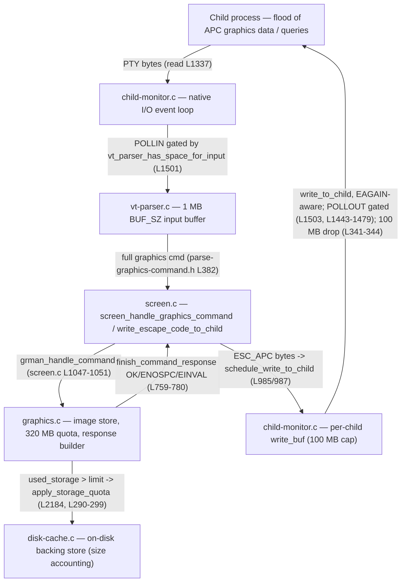

# How kitty regulates the flow of terminal graphics data under pressure

**Checkout:** `kitty_815df1e210e0` @ HEAD `815df1e210e0a9ab4622f5c7f2d6891d7dbeddf1` ("Wire up applying of font config"). Built and observed as `kitty 0.35.2`.

**Scope note.** This document answers, with runtime‑grounded evidence, how the kitty terminal emulator behaves when a large amount of terminal **graphics** data (kitty graphics‑protocol APC escape codes, `ESC _ G … ESC \`) arrives faster than the terminal can comfortably process and respond to it — on both the **input (read)** side and the **output (write/response)** side — where those decisions live in the source, and how they surface at runtime. Every behavioural claim below sits next to the **exact command** that produced it and the **complete, unedited output** of a run I executed, with `file:line` references into this checkout. Claims are explicitly labelled **OBSERVED** (captured from a real run) or **INFERRED** (grounded in code that I could not surface as a runtime value after genuine effort). All observations were driven through kitty's **canonical entry point** (a real PTY / the real VT parser → `screen_handle_graphics_command` → `graphics.c`), never the remote‑control interface or a debug injection hook. The source repository was left byte‑for‑byte unchanged; the only new artifact is this file. See section **(f)** for the full observed‑vs‑inferred ledger, the exact build commands, the scale used, and the ≥2‑run stability confirmations.

**One‑sentence answer.** kitty does **not** grow an unbounded buffer and it does **not** "throttle" in any rate‑limiting sense; on the input side it **pauses reading** by de‑arming the child's `POLLIN` once a fixed **1 MB** parser buffer fills (letting ordinary OS PTY backpressure block the producer), and on the output side it uses a non‑blocking, `EAGAIN`‑aware drain that **retains** unwritten response bytes for the next `POLLOUT`, with a **100 MB** hard cap that drops (and logs) anything beyond it; graphics‑specific pressure additionally shows up as **oldest‑image eviction** under a **320 MB** storage quota and as protocol **`;ENOSPC` / `;EINVAL`** responses.

---

## Two observation paths (and why both are needed)

kitty's flow control spans two layers that require two different harnesses. Each observation below is labelled **Path A** or **Path B**.

- **Path A — in‑process canonical graphics path.** kitty's own test harness (`kitty_tests/`) feeds bytes into the **real** `vt_parser` → `screen_handle_graphics_command` (`kitty/screen.c:L1047`) → `grman_handle_command` (`kitty/graphics.c`) chain in‑process, and captures the protocol responses. This canonically exercises parsing/dispatch, **response content** (`;OK` / `;ENOSPC` / `;EINVAL`), storage‑**quota eviction**, and the **quiet** flag. *Limitation (stated plainly):* in test mode the responses do **not** traverse the native child‑monitor write buffer, `vt_parser_has_space_for_input` is not exposed to Python, and the harness `PTY` uses a Python `select()` loop rather than the native `ChildMonitor` I/O loop — so Path A **cannot** exercise the `POLLIN` read‑pause (OBJ‑1) or the write‑side `EAGAIN`/100 MB drop (OBJ‑2). Those require Path B.
- **Path B — a real running kitty with a PTY child.** I built the full `./kitty/launcher/kitty` binary, launched it headless under `xvfb-run -a` with `LIBGL_ALWAYS_SOFTWARE=1`, and drove a **real child process** that floods graphics/query data into kitty's PTY so the bytes flow through the native `kitty/child-monitor.c` I/O loop. This is the only way to observe the read pause and the write‑side backpressure/drop.

**Builds used** (all in isolated copies **outside** the checkout; see (f)):

| Build | Directory | Command | Flags | Used for |
|-------|-----------|---------|-------|----------|
| Default / canonical (authoritative for magnitudes) | `/tmp/kitty_probe` | `python3 setup.py` | `-DNDEBUG -O3` | Path A; OBJ‑2 drop‑log, retention, control |
| Instrumented (event‑loop logging) | `/tmp/kitty_probe_instr` | `python3 setup.py build --debug --extra-logging=event-loop` | `-DDEBUG -DDEBUG_EVENT_LOOP -g3` | OBJ‑1 event‑loop signals |
| Byte‑dump (LABELLED non‑default) | `/tmp/kitty_probe_bytes` | `CFLAGS='-DKITTY_PRINT_BYTES_SENT_TO_CHILD' python3 setup.py build --debug` | `+ -DKITTY_PRINT_BYTES_SENT_TO_CHILD` | OBJ‑4 write/EAGAIN byte movement |

---

## (a) Direct answer — the input side: buffer, pause, or slow down?

**What kitty does.** When graphics data floods in, kitty reads it into a **single, fixed‑size 1 MB parser buffer** and dispatches from that buffer on a worker. It does **not** keep enlarging a buffer, and it has no rate limiter. Instead, the native I/O event loop consults the parser before every poll and, the moment the parser buffer is full, it simply **stops asking the OS for more bytes from that child** — it sets the child fd's requested events to `0` instead of `POLLIN`. With no reader draining the PTY, the kernel's PTY buffer fills and the child's next `write()` **blocks**. That is ordinary, kernel‑enforced **read backpressure**: the producer is slowed to exactly kitty's drain rate, with no data loss and no unbounded memory growth.

**Where the decision lives.**
- The buffer size is a compile‑time constant — `kitty/vt-parser.c:L18`:
  ```c
  #define BUF_SZ (1024u*1024u)
  ```
- The admission predicate — `kitty/vt-parser.c:L1477-L1481`:
  ```c
  vt_parser_has_space_for_input(const Parser *p) {
      PS *self = (PS*)p->state;
      bool ans;
      with_lock {
          ans = self->read.sz + self->write.pending < BUF_SZ;
  ```
  i.e. it returns **false** once `read.sz + write.pending` reaches `BUF_SZ`.
- The read gate in the event loop — `kitty/child-monitor.c:L1501`:
  ```c
  children_fds[EXTRA_FDS + i].events = vt_parser_has_space_for_input(screen->vt_parser) ? POLLIN : 0;
  ```
  When the predicate is false, `events` becomes `0` → the loop no longer waits for readable data on that fd → kitty stops reading it.
- The actual ingestion happens in `read_bytes` (`kitty/child-monitor.c:L1337`), which asks the parser for a write buffer, `read()`s into it, and commits the length back to the parser.

**The batching modifier (the "slow down a little" that is *not* a pause).** Within the 1 MB budget, kitty deliberately *batches* input rather than dispatching every keystroke immediately, governed by `input_delay` (default **3 ms**, `kitty/options/definition.py:L878`). The parse worker flushes early when a flush is forced, when `input_delay` has elapsed, **or** when the buffer is nearly full — `kitty/vt-parser.c:L1425`:
```c
if (flush || pd->time_since_new_input >= OPT(input_delay) || self->read.sz + 16 * 1024 > BUF_SZ) {
```
The `self->read.sz + 16 * 1024 > BUF_SZ` clause is exactly the documented "`input_delay` is ignored when the input buffer is almost full" behaviour: under a flood the 3 ms timer is bypassed and kitty flushes as fast as it can within the fixed buffer.

**Observed evidence (Path B, instrumented build).** I ran a child that floods **quiet** (`q=2`) graphics APC commands into kitty's PTY as fast as `os.write()` allows, logging its own cumulative bytes every 10 ms. The launch command was:

```
LIBGL_ALWAYS_SOFTWARE=1 LANG=C.UTF-8 LC_ALL=C.UTF-8 \
  xvfb-run -a -s "-screen 0 1280x800x24" \
  ./kitty/launcher/kitty --config NONE -o confirm_os_window_close=0 \
  python3 /tmp/obj1_child.py <TARGET_BYTES> <LOG> 1 t 10
```

*Control (no kitty):* the same child writing 32 MB to `/dev/null` completes in **0.003 s ≈ 9319 MB/s** — the child is nowhere near the bottleneck.

*Through kitty:* the child's cumulative‑bytes log shows the throughput advancing in **~1 MB plateaus, each followed by a ~2 s stall** while its `write()` is blocked. The **first plateau is exactly `1,068,480` bytes** and the **steady step between plateaus is exactly `1,048,560` bytes** (= 34,952 × 30‑byte commands ≈ `2^20` = `BUF_SZ`). The first plateau is the 1 MB parser buffer plus ~19,904 bytes already in flight inside the OS PTS buffer. Tail of the run‑1 log (32 MB flood), unedited:

```
65918,32801580,129270
65928,32926800,125220
65938,33054150,127350
65949,33173970,119820
65959,33311250,137280
65969,33422100,110850
65979,33515280,93180
# FINAL t_ms=65989 total=33554460 cmd_len=30 max_stall_ms=2390
```

**Stability (≥2 runs).** The first plateau was **`1,068,480` bytes in all three runs** (one 32 MB flood + two independent 6 MB floods), and both 6 MB runs delivered the identical total with multi‑second stalls:

```
# FINAL t_ms=10313 total=6291480 cmd_len=30 max_stall_ms=1999      (run A, 6 MB)
# FINAL t_ms=10827 total=6291480 cmd_len=30 max_stall_ms=2160      (run B, 6 MB)
```

The event‑loop instrumentation corroborates the mechanism: loop‑tick timestamps jump ~2 s between successive `input_read: 1` ticks (e.g. `[9.170] → [11.422] → [13.573] → [15.619]`), matching the child's ~2 s stalls — during each stall kitty is draining its full 1 MB buffer (dispatching ~35k tiny commands via the parse worker) before it re‑arms `POLLIN` and reads the next ~1 MB. The `render()` log (`kitty/child-monitor.c:L872`, `"input_read: %d, …"`) showed 32× `input_read:1` interleaved with 36× `input_read:0`.

**Bottom line for (a).** kitty answers a flood by **pausing the read** (de‑arming `POLLIN`, `child-monitor.c:L1501`) once the fixed **1 MB** buffer (`vt-parser.c:L18`) is full (`vt-parser.c:L1477-L1481`), and by **batching within `input_delay`** (`options/definition.py:L878`, bypassed near‑full at `vt-parser.c:L1425`). It never buffers unboundedly and never rate‑limits; the "slow down" is the producer being blocked by ordinary PTY backpressure. *The exact internal `read.sz` value at the pause is **INFERRED** (= up to `BUF_SZ` = 1 MB): the only place it is printed is a commented‑out `printf` at `child-monitor.c:L1500`, which I left commented per the read‑only constraint; the value is corroborated by the observed `1,048,560`‑byte plateau step.*

---

## (b) The write side: what happens when responses must be written back but the output path is under pressure

**What kitty does.** kitty's responses to the child (graphics‑protocol `;OK`/error replies, device‑attribute answers, etc.) are appended to a **per‑child, in‑process write buffer** (`screen->write_buf`, grown with `PyMem_RawRealloc`). The I/O loop only asks for writability (`POLLOUT`) when that buffer is non‑empty, and it drains it with a **non‑blocking, `EAGAIN`‑aware** loop: it `write()`s as much as the kernel accepts and, the instant the kernel says "would block" (`EAGAIN`/`EWOULDBLOCK`), it **stops and keeps the un‑written bytes** for the next `POLLOUT`, `memmove`‑ing them to the front of the buffer. So under output pressure kitty neither blocks its whole event loop nor discards responses — it **holds them and retries**. There is exactly one guardrail against a truly pathological, never‑reading child: a **100 MB hard cap** on the write buffer, beyond which the newly generated response bytes are **dropped with an error log**.

**Where the decision lives.**
- The drain loop — `kitty/child-monitor.c:L1443-L1479` (`write_to_child`), unedited:
  ```c
  write_to_child(int fd, Screen *screen) {
      size_t written = 0;
      ssize_t ret = 0;
      screen_mutex(lock, write);
      while (written < screen->write_buf_used) {
          ret = write(fd, screen->write_buf + written, screen->write_buf_used - written);
  #ifdef KITTY_PRINT_BYTES_SENT_TO_CHILD
          fprintf(stderr, "Wrote: %zd bytes: ", ret);
  #endif
          if (ret > 0) {
  #ifdef KITTY_PRINT_BYTES_SENT_TO_CHILD
              print_text(screen->write_buf + written, ret);
  #endif
              written += ret;
          }
          else if (ret == 0) {
              // could mean anything, ignore
              break;
          } else {
              if (errno == EINTR) continue;
              if (errno == EWOULDBLOCK || errno == EAGAIN) break;   // ← retain & retry later
              perror("Call to write() to child fd failed, discarding data.");
              written = screen->write_buf_used;                     // ← hard error: discard
          }
  #ifdef KITTY_PRINT_BYTES_SENT_TO_CHILD
          fprintf(stderr, "\n");
  #endif
      }
      if (written) {
          screen->write_buf_used -= written;
          if (screen->write_buf_used) {
              memmove(screen->write_buf, screen->write_buf + written, screen->write_buf_used);  // ← keep the rest
          }
      }
      screen_mutex(unlock, write);
  }
  ```
  The `EAGAIN` `break` is at `L1463`; the retaining `memmove` is at `L1474`. A *hard* write error (not `EAGAIN`) is the only place responses are discarded (`written = write_buf_used`, `L1465`).
- The write gate — `kitty/child-monitor.c:L1503`:
  ```c
  children_fds[EXTRA_FDS + i].events |= (screen->write_buf_used ? POLLOUT  : 0);
  ```
  `POLLOUT` is armed **only** while there are buffered bytes; `write_to_child` is then invoked from the loop when the fd becomes writable (`kitty/child-monitor.c:L1539`).
- The 100 MB cap + drop log — inside the write‑append macro at `kitty/child-monitor.c:L341-L344`:
  ```c
  if (screen->write_buf_used + sz > 100 * 1024 * 1024) { \
      log_error("Too much data being sent to child with id: %lu, ignoring it", id); \
      screen_mutex(unlock, write); \
      break; \
  ```

**Observed evidence (Path B).** I drove kitty with a child that floods **Primary Device Attributes** queries (`ESC [ c`, 3 bytes), each of which kitty answers with a 7‑byte `ESC [ ? 6 2 ; c` reply (built by `report_device_attributes`, `kitty/screen.c:L2121-L2125`). The child was placed in **raw** mode (`tty.setraw`) so kitty's replies are *not* echoed back and re‑parsed (an early non‑raw run produced `[PARSE ERROR] VTE_PM escape code too long` from exactly that echo feedback — a real pitfall, noted here for honesty). Three complementary experiments, all through the canonical PTY path:

**(b.1) Retention — before / during / after (default build).** The child sends 1,050,000 queries (3.15 MB), holds for 2 s **without reading**, then drains. kitty retained the full response set in its own `write_buf` and delivered every byte intact — 7,350,000 = 1,050,000 × 7, far larger than the ~64 KB kernel PTY buffer, proving in‑process retention, not kernel buffering. Complete log:

```
0.465 DURING done: sent_query_bytes=3150000 queries=1050000 (NOT reading; responses buffered)
2.465 DURING waited 2s without reading (write_buf holds ~7350000 response bytes)
6.038 AFTER drained: recv_response_bytes=7350000 expected=7350000 (queries*7) match=True
```
- **Before:** `write_buf_used = 0` (nothing queued yet).
- **During:** child not reading → `write_buf` grows and holds ~7.35 MB of replies (retained via the `memmove` at `L1474`; 0 dropped since well under the 100 MB cap).
- **After:** child drains → `recv == expected`, `match=True`, nothing lost.

**(b.2) The 100 MB cap fires (default / canonical build).** The child sends ~64 MB of queries and **never reads**, so kitty's replies pile up until the write buffer hits the 100 MB cap and begins dropping — the verbatim first drop line and its stable timing:

```
[11.836] Too much data being sent to child with id: 1, ignoring it
```

This is the `log_error` at `kitty/child-monitor.c:L341-L344` (`id=1`). It fired **7,417,872 times** in run 1 (once per response‑append past the cap). **Stability:** run 1 (64 MB flood) first drop at `t=11.836 s`; run 2 (50.4 MB flood) first drop at `t=11.049 s`; both `id=1`, **0 parse errors** in either. The child's own send‑progress log (run 1) shows the flood outrunning the (non‑reading) drain:

```
t_ms,sent_query_bytes
499,3000000
...
22463,63000000
23721,66000000
# done sent=67200000 in 24.90s
```

**(b.3) Control — draining removes all backpressure (default build).** The *same* 64 MB flood (22,400,000 queries) but with a continuously draining reader thread: every reply flows through the 100 MB‑capped buffer with **zero drops**. Complete log:

```
25.935 CONTROL sent_query_bytes=67200000 queries=22400000 recv_response_bytes=156800000 expected=156800000 match=True
```
156.8 MB of responses (22,400,000 × 7) passed through cleanly — confirming the drop in (b.2) is caused by the **non‑draining reader**, not by response volume per se.

**(b.4) The retain/`EAGAIN` step, surfaced byte‑for‑byte (LABELLED instrumented build).** Using the `-DKITTY_PRINT_BYTES_SENT_TO_CHILD` build, `write_to_child` prints each `write()` result. Against a stalled reader I captured **106 positive `Wrote: N bytes` lines** (63–322 bytes each during contention; 5632/9728/11776‑byte bursts while draining) **and 4 `Wrote: -1 bytes` lines** — the `-1` is the `write()` returning `EAGAIN`, i.e. the exact `break`‑and‑retain point at `L1463`. Representative excerpt (the long repeated `\x1b[?62;c` payloads are elided **only where marked**; every `\x1b[?62;c` is one DA reply):

```
Wrote: 294 bytes: \x1b[?62;c\x1b[?62;c\x1b[?62;c … (42 copies of \x1b[?62;c) …
Wrote: 322 bytes: \x1b[?62;c\x1b[?62;c\x1b[?62;c … (46 copies) …
Wrote: 210 bytes: \x1b[?62;c … (30 copies) …
Wrote: 98 bytes:  \x1b[?62;c … (14 copies) …
Wrote: -1 bytes: Wrote: 9728 bytes: \x1b[?62;c\x1b[?62;c … [remainder of 9728 bytes is the same \x1b[?62;c pattern, elided] …
```
The `Wrote: -1 bytes:` fragment has **no trailing newline** before the next `Wrote:` — a faithful consequence of the code: on `EAGAIN` the loop `break`s at `L1463` **before** reaching the trailing‑newline `fprintf` at `L1468`, so the `-1` line visually runs into the next successful write on the following `POLLOUT`. The content of every write is the `ESC [ ? 6 2 ; c` DA reply, confirming these are protocol response bytes being drained from `write_buf`.

**Bottom line for (b).** Under output pressure kitty performs a **non‑blocking, `EAGAIN`‑aware drain** (`child-monitor.c:L1443-L1479`) that **retains** un‑written responses for the next `POLLOUT` (`memmove` at `L1474`; `POLLOUT` armed only when buffered, `L1503`) — observed holding **7.35 MB** intact. Its sole limit is a **100 MB** hard cap that **drops with a log line** (`L341-L344`) — observed firing (verbatim) once the reader stalls. *The exact instantaneous `write_buf_used` is **INFERRED** (not exposed at runtime): it is bounded above by 100 MB — proven because the cap's drop log fired — and demonstrated to hold ≥ 7.35 MB in the retention run.*

---

## (c) Where the decisions live — the connected pipeline

These mechanisms are not isolated functions; they form **one connected pipeline** from the child, through the native I/O loop and the VT parser, into the screen dispatch and the graphics manager (with its storage quota), and back out through the screen's response path into the write buffer and down to the child. Graphics pressure at one stage manifests as backpressure at another: a full parser buffer pauses the **read** at the I/O loop, while responses generated in the graphics manager travel back through the screen dispatch into the **write** buffer where the `EAGAIN`/cap logic applies.



**Full `file:line` map (verified byte‑accurate at HEAD `815df1e21`).**

| Stage | Mechanism | Location | Exact code / effect |
|-------|-----------|----------|---------------------|
| Ingestion | Read the PTY into the parser | `kitty/child-monitor.c:L1337` | `read_bytes`: `vt_parser_create_write_buffer` → `read(fd,…)` → `vt_parser_commit_write` |
| **Input gate** | **Pause reading when parser full** | `kitty/child-monitor.c:L1501` | `…events = vt_parser_has_space_for_input(screen->vt_parser) ? POLLIN : 0;` |
| Input buffer | Fixed 1 MB parser buffer | `kitty/vt-parser.c:L18` | `#define BUF_SZ (1024u*1024u)` |
| Input predicate | "has space?" test | `kitty/vt-parser.c:L1477-L1481` | `ans = self->read.sz + self->write.pending < BUF_SZ;` |
| Input batching | `input_delay`, bypassed near‑full | `kitty/vt-parser.c:L1425` | `if (flush || …>= OPT(input_delay) || self->read.sz + 16*1024 > BUF_SZ)` |
| Canonical entry | APC parser → screen dispatch | `kitty/parse-graphics-command.h:L382` | `screen_handle_graphics_command(self->screen, &g, parser_buf);` |
| Dispatch | Handle cmd, emit response | `kitty/screen.c:L1047-L1051` | `grman_handle_command(...)`; `if (response) write_escape_code_to_child(self, ESC_APC, response);` |
| Response framing | APC prefix | `kitty/screen.c:L970-L971` | `case ESC_APC: *prefix = "\033_";` |
| Response routing | Real path → write buffer | `kitty/screen.c:L985/L987` | `schedule_write_to_child(...)` (test mode instead → `write_to_test_child`) |
| Storage quota | 320 MB per‑buffer limit | `kitty/graphics.c:L25` | `#define DEFAULT_STORAGE_LIMIT 320u * (1024u * 1024u)` |
| Quota eviction | trim unreferenced, then oldest‑first | `kitty/graphics.c:L290-L299` | `remove_images(...trim_predicate...)`; `HASH_SORT(oldest_img_first)`; `while (used_storage > limit) remove_image(...)` |
| Quota trigger | invoked when over limit | `kitty/graphics.c:L2184` | `if (self->used_storage > self->storage_limit) apply_storage_quota(...)` |
| Frame cache | animation frames get 5× quota | `kitty/graphics.c:L1570-L1573` | `if (… cache_size + data_sz > self->storage_limit * 5) … ABRT("ENOSPC", …)` |
| Response builder | `OK` / `ENOSPC` / `EINVAL` + quiet | `kitty/graphics.c:L759-L780` | quiet branch `if (g->quiet){ if (is_ok_response || g->quiet>1) return NULL; }`; `snprintf(command_response,10,"OK")` |
| EINVAL examples | validation branches | `kitty/graphics.c:L646`, `L651` | `ABRT("EINVAL","Zero width/height not allowed")`; `ABRT("EINVAL","Unknown image format: %u", …)` |
| Disk accounting | backing‑store size behind quota | `kitty/disk-cache.c:L666` | `disk_cache_total_size(...) { return ((DiskCache*)self)->total_size; }` |
| **Output drain** | **non‑blocking, `EAGAIN`‑aware** | `kitty/child-monitor.c:L1443-L1479` | drain loop; `EAGAIN`→`break` (`L1463`); retain via `memmove` (`L1474`); hard‑error discard (`L1465`) |
| **Output gate** | arm `POLLOUT` only when buffered | `kitty/child-monitor.c:L1503` | `…events |= (screen->write_buf_used ? POLLOUT : 0);` |
| Output invoke | drain when writable | `kitty/child-monitor.c:L1539` | `if (children_fds[EXTRA_FDS + i].revents & POLLOUT) write_to_child(...)` |
| **Output cap** | **100 MB hard cap + drop log** | `kitty/child-monitor.c:L341-L344` | `if (write_buf_used + sz > 100*1024*1024){ log_error("Too much data being sent to child with id: %lu, ignoring it", id); … break; }` |
| Timing | render coalescing | `kitty/options/definition.py:L866` | `opt('repaint_delay', '10', …)` (~100 FPS; ignored when input pending) |
| Timing | input batching | `kitty/options/definition.py:L878` | `opt('input_delay', '3', …)` (ignored when buffer almost full) |
| Instrumentation | compile‑time byte dump | `kitty/child-monitor.c:L1449-L1451` | `#ifdef KITTY_PRINT_BYTES_SENT_TO_CHILD … fprintf(stderr,"Wrote: %zd bytes: ", ret);` |
| Instrumentation | commented counter printf (left commented) | `kitty/child-monitor.c:L1500` | `/* printf("… read_buf_sz: %lu write_buf_used: %lu\n" …); */` |
| Instrumentation | event‑loop debug macro | `kitty/child-monitor.c:L29-L32`, `L872` | `EVDBG(...)` → `timed_debug_print`; `render()` logs `"input_read: %d, …"` |

---

## (d) How it shows up at runtime — captured, unedited output

This section presents the graphics‑protocol signals via **Path A** (the in‑process canonical parser→dispatch→graphics chain). The probe was run against the **default build** in `/tmp/kitty_probe` with:

```
cd /tmp/kitty_probe
PYTHONPATH=/tmp/kitty_probe LANG=C.UTF-8 LC_ALL=C.UTF-8 python3 /tmp/blitzy_probe_pathA.py
```

All output below is verbatim and was **identical across two runs**. (The two runtime signals that are Path‑B‑only — the event‑loop `input_read` logging for the read pause, and the `Too much data …` drop log for the write cap — are shown in sections (a) and (b) respectively.)

**(d.1) The 320 MB storage‑quota magnitude (OBSERVED, default config).**
```
g.storage_limit = 335544320 bytes = 320.0 MB
DEFAULT_STORAGE_LIMIT graphics.c:L25 == 320u*(1024u*1024u) == 335544320
```

**(d.2) A successful transmit → `;OK` response (OBSERVED).** Command: `\033_Ga=T,s=4,v=3,f=24,i=1;<base64 of 36 RGB bytes>\033\\`.
```
response wtcbuf = b'\x1b_Gi=1;OK\x1b\\'
```
The framing is the APC introducer `\x1b_` … terminator `\x1b\\` (`screen.c:L970-L971`) around the `Gi=1;OK` body built by `finish_command_response` (`graphics.c:L759-L780`, with `snprintf(command_response,10,"OK")`).

**(d.3) Validation failures → `;EINVAL` responses (OBSERVED).**
```
f=99  (Unknown image format,   graphics.c:L651) -> b'\x1b_Gi=7;EINVAL:Unknown image format: 99\x1b\\'
s=0,v=0 (Zero width/height,    graphics.c:L646) -> b'\x1b_Gi=9;EINVAL:Zero width/height not allowed\x1b\\'
```

**(d.4) Two distinct rejection layers (OBSERVED).** Some malformed input is rejected *earlier*, by the **APC control‑block parser**, which logs a `[PARSE ERROR]` and returns **no** protocol response at all — as opposed to the semantic `;EINVAL` replies above from `graphics.c`. The graphics‑response side:
```
t=z (invalid transmission medium 0x7a) graphics response -> b''
S=4294967296 (numeric overflow) graphics response        -> b''
```
…and the corresponding parser log lines (captured on stderr, verbatim):
```
[0.070] [PARSE ERROR] Malformed GraphicsCommand control block, unknown flag value for compressed: 0x78
[0.070] [PARSE ERROR] Malformed GraphicsCommand control block, unknown flag value for transmission_type: 0x7a
[0.070] [PARSE ERROR] Malformed GraphicsCommand control block, number is too large
```
So the "visible sign" of a bad graphics command depends on *where* it fails: a malformed **control value** (e.g. `t=z`) → parser `[PARSE ERROR]` log, **no** reply; a parseable‑but‑semantically‑invalid command (e.g. `f=99`) → a client‑visible `;EINVAL` reply.

**(d.5) Storage‑quota eviction — before / during / after (OBSERVED).** Two eviction branches exist in `apply_storage_quota` (`graphics.c:L290-L299`): a **first pass** that removes *unreferenced* images (`remove_images(..., trim_predicate, ...)`, `L292`), and then an **oldest‑first LRU** while‑loop (`L295-L297`) for the referenced remainder. Both were exercised.

- **Trim‑predicate branch** — transmit‑only images (`a=t`, unreferenced). *(LABEL: reduced‑config demonstration — `storage_limit` lowered to 72 bytes so the mechanism is visible at tiny scale; the default remains 320 MB.)*
  ```
  BEFORE any image: image_count=0 disk_cache.total_size=0
  after transmit i=1: resp=b'\x1b_Gi=1;OK\x1b\\' image_count=1 disk_cache.total_size=36
  after transmit i=2: resp=b'\x1b_Gi=2;OK\x1b\\' image_count=2 disk_cache.total_size=72
  after transmit i=3: resp=b'\x1b_Gi=3;OK\x1b\\' image_count=1 disk_cache.total_size=36
  ```
  The third add crosses the limit → the first pass mass‑evicts the two prior unreferenced images → count collapses 2 → 1.

- **Oldest‑first LRU branch** — displayed images (`a=T`, referenced, survive the trim first pass). *(LABEL: reduced‑config, `storage_limit=100`.)* From the Path‑A `#2` probe (`/tmp/blitzy_probe_pathA2.py`, same run command):
  ```
  BEFORE: image_count=0 total_size=0
  a=T i=1 -> resp=b'\x1b_Gi=1;OK\x1b\\' image_count=1 total_size=36
  a=T i=2 -> resp=b'\x1b_Gi=2;OK\x1b\\' image_count=2 total_size=72
  a=T i=3 -> resp=b'\x1b_Gi=3;OK\x1b\\' image_count=2 total_size=72
  a=T i=4 -> resp=b'\x1b_Gi=4;OK\x1b\\' image_count=2 total_size=72
  a=T i=5 -> resp=b'\x1b_Gi=5;OK\x1b\\' image_count=2 total_size=72
  ```
  Referenced images survive the trim pass, so count stabilises at 2 (72 ≤ 100) with the **oldest** evicted on each further add.

- **Real 320 MB threshold — before / during / after (OBSERVED at real scale, DEFAULT config, no reduction).** 600 KiB images (`s=640,v=320,f=24` → 614,400 bytes each):
  ```
  default storage_limit = 335544320 = 320.0 MB
  each image: s=640 v=320 f=24 -> 614400 bytes (600.0 KiB)
    after 100 imgs: image_count=100 total_size=61440000 (58.6 MB) t=0.05s
    after 200 imgs: image_count=200 total_size=122880000 (117.2 MB) t=0.10s
    after 300 imgs: image_count=300 total_size=184320000 (175.8 MB) t=0.16s
    after 400 imgs: image_count=400 total_size=245760000 (234.4 MB) t=0.21s
    after 500 imgs: image_count=500 total_size=307200000 (293.0 MB) t=0.26s
  DURING/AFTER quota fire at add #547:
    BEFORE add: image_count=546 total_size=335462400 (319.92 MB)
    AFTER  add: image_count=1 total_size=614400 (0.59 MB)
  PEAK used-storage BEFORE collapse: 335462400 bytes = 319.92 MB at add #546 (image_count=546)
  DEFAULT limit = 335544320 bytes = 320 MB (graphics.c:L25). peak/limit = 0.9998
  ```
  Used storage climbs linearly to **319.92 MB** (0.9998 of the 320 MB limit) and the add that would cross `335544320` triggers `apply_storage_quota` (`L2184`), collapsing the count from **546 → 1**. Stable across two runs.

**(d.6) Animation frame cache → `;ENOSPC` at 5× the quota (OBSERVED).** *(LABEL: reduced‑config, `storage_limit=72` → frame cache = `72*5` = 360 bytes, `graphics.c:L1570-L1573`.)*
```
base image a=t -> code=OK image_count=1 disk_cache.total_size=36
frame #1 -> code='OK' disk_cache.total_size=72
frame #2 -> code='OK' disk_cache.total_size=108
...
frame #9 -> code='OK' disk_cache.total_size=360
frame #10 -> ENOSPC (msg='Cache size exceeded cannot add new frames') at disk_cache.total_size=360
RESULT: first ENOSPC at frame #10
```

---

## (e) Does it quietly adapt, or are there visible signs? — both

kitty's response to pressure is a **mix**: the flow‑control adaptations on the transport are essentially **silent** (no client‑facing signal — the producer simply experiences backpressure), while the graphics‑subsystem consequences are **client‑visible** (protocol error replies and images that disappear). The following table summarises the observed split; every row is grounded above.

| Adaptation | Silent or visible? | What the client/operator sees | Where | Evidence |
|-----------|--------------------|-------------------------------|-------|----------|
| Read pause (de‑arm `POLLIN`) | **Silent** | Nothing protocol‑level — the child's `write()` just blocks (OS backpressure) | `child-monitor.c:L1501`, `vt-parser.c:L1477-L1481` | (a): ~1 MB plateaus + ~2 s stalls |
| `input_delay` batching (3 ms) | **Silent** | Nothing — input is coalesced within 3 ms, bypassed when nearly full | `options/definition.py:L878`, `vt-parser.c:L1425` | (a): batched drain per stall |
| `repaint_delay` render coalescing (10 ms) | **Silent** | Nothing — repaints are coalesced (~100 FPS), skipped when input is pending | `options/definition.py:L866` | code‑grounded (see note) |
| Write‑buffer retention (`EAGAIN` → keep bytes) | **Silent** | Nothing — responses are delivered later, intact | `child-monitor.c:L1443-L1479` (`memmove` `L1474`) | (b.1): 7.35 MB retained, `match=True`; (b.4): `Wrote: -1 bytes` |
| 100 MB write‑buffer cap | **Visible (operator)** | An error **log line**; the offending responses are dropped | `child-monitor.c:L341-L344` | (b.2): `Too much data being sent to child with id: 1, ignoring it` |
| `;EINVAL` / `;ENOSPC` responses | **Visible (client)** | An error reply in the APC stream | `graphics.c:L759-L780`, `L646/L651/L1570-L1573` | (d.3), (d.6) |
| Storage‑quota eviction (320 MB) | **Visible (client)** | Previously‑loaded images silently **vanish** (deleted to make room) | `graphics.c:L25`, `L290-L299`, `L2184` | (d.5): count 546 → 1 |
| Parser `[PARSE ERROR]` | **Visible (operator)** | A stderr log; **no** protocol reply | `parse-graphics-command.h` | (d.4) |

*Note on `repaint_delay`:* the 10 ms default and its "ignored when there is pending input" semantics are grounded in `kitty/options/definition.py:L866`; I did not attach a distinct captured artifact isolating render coalescing (it is a GPU‑render cadence, not a byte‑level signal), so this specific row is **INFERRED from code / config** and labelled as such.

**The quiet‑flag suppression boundary (OBSERVED, Path A).** The graphics protocol's `q` key lets a client silence responses; `finish_command_response` implements it at `graphics.c:L762-L764` as `if (g->quiet) { if (is_ok_response || g->quiet > 1) return NULL; }` — i.e. `q≥1` suppresses `OK`, but **only** `q≥2` also suppresses failures. Captured verbatim:
```
q=1 on OK     (suppress OK)              -> b''
q=2 on EINVAL (suppress failure)         -> b''
q=1 on EINVAL (failure NOT suppressed)   -> b'\x1b_Gi=22;EINVAL:Unknown image format: 99\x1b\\'
```
This is exactly why my OBJ‑1 flood used `q=2`: to keep the input‑pressure experiment from generating a back‑flood of responses that would confound it — the quiet flag turns an otherwise‑visible error into a silent one, demonstrating the boundary directly.

---

## (f) Observed‑vs‑inferred ledger, reproduction, and repository state

**Exact builds (all in isolated copies outside the checkout).**
- Default / canonical (authoritative for every magnitude): `python3 setup.py` in `/tmp/kitty_probe` → `-DNDEBUG -O3`, `kitty 0.35.2`.
- Instrumented event‑loop: `python3 setup.py build --debug --extra-logging=event-loop` in `/tmp/kitty_probe_instr` → `-DDEBUG -DDEBUG_EVENT_LOOP -g3` (activates the `EVDBG`→`timed_debug_print` lines).
- Byte‑dump (LABELLED non‑default): `CFLAGS='-DKITTY_PRINT_BYTES_SENT_TO_CHILD' python3 setup.py build --debug` in `/tmp/kitty_probe_bytes`.
- Common env: `PATH+=/usr/local/go/bin`, `GOPATH=$HOME/go`, `LANG=LC_ALL=C.UTF-8`; GUI runs under `xvfb-run -a -s "-screen 0 1280x800x24"` with `LIBGL_ALWAYS_SOFTWARE=1`.

**Exact invocations.**
- Path A: `cd /tmp/kitty_probe; PYTHONPATH=/tmp/kitty_probe LANG=C.UTF-8 LC_ALL=C.UTF-8 python3 /tmp/blitzy_probe_pathA.py` (and `…/blitzy_probe_pathA2.py`).
- Path B OBJ‑1: `LIBGL_ALWAYS_SOFTWARE=1 … xvfb-run -a -s "-screen 0 1280x800x24" ./kitty/launcher/kitty --config NONE -o confirm_os_window_close=0 python3 /tmp/obj1_child.py <TARGET_BYTES> <LOG> 1 t 10`.
- Path B OBJ‑2: the same launcher pattern running `/tmp/obj2_child.py` (drop log), `/tmp/obj2_retention.py` (retention), `/tmp/obj2_control.py` (control), and — on the byte‑dump build — `/tmp/obj2_bytedump.py`.

**Scale and stability (≥2 runs each).**
- OBJ‑1 read pause: floods of 32 MB, 6 MB, 6 MB. First plateau **`1,068,480` bytes in all three**; steady step **`1,048,560` bytes ≈ `2^20` = `BUF_SZ`**; stalls 2.0–2.4 s.
- OBJ‑2 100 MB cap: 64 MB and 50.4 MB floods; first drop at `t=11.836 s` and `t=11.049 s` respectively; both `id=1`; 0 parse errors.
- OBJ‑2 retention: 7,350,000 bytes retained and delivered intact (`match=True`).
- OBJ‑2 control: 156,800,000 bytes delivered intact with draining (`match=True`), 0 drops.
- Path A quota: real 320 MB threshold fires at add #547 (peak 319.92 MB); identical across two runs.

**Observed vs inferred.**
- **OBSERVED:** the 320 MB quota magnitude (`335544320`); the `;OK`, `;EINVAL`, `;ENOSPC` response bytes; the quiet‑flag boundary; both eviction branches and the real‑scale 546→1 collapse; the frame‑cache `;ENOSPC` at 5×; the read‑pause ~1 MB plateaus and stalls with matching event‑loop `input_read` ticks; the 100 MB `Too much data …` drop log (verbatim, id=1); the 7.35 MB retention; the control result; and the `Wrote: N bytes` / `Wrote: -1 bytes` (`EAGAIN`) byte movement.
- **INFERRED (code‑grounded, labelled):** the exact internal `read.sz` at the input pause (= up to `BUF_SZ` = 1 MB; the only printout is the commented `child-monitor.c:L1500`, left commented per the read‑only rule; corroborated by the `1,048,560`‑byte plateau step); the exact instantaneous `write_buf_used` (bounded above by 100 MB — proven by the cap firing — and shown ≥ 7.35 MB); and the `repaint_delay` render‑coalescing row in (e).
- **Non‑canonical labelling:** the only non‑default build is the `KITTY_PRINT_BYTES_SENT_TO_CHILD` byte‑dump, used solely to *visualise* the write/`EAGAIN` bytes in (b.4); every **magnitude** claim comes from the default `python3 setup.py` build. No value was taken from the remote‑control interface or a debug injection hook.

**Coverage of the original question.**
- *"buffer, pause, or slow things down"* → **pause** (de‑arm `POLLIN`, `child-monitor.c:L1501`, once the fixed **1 MB** buffer `vt-parser.c:L18` fills `vt-parser.c:L1477-L1481`) plus **batching** (`input_delay` 3 ms, `options/definition.py:L878`, bypassed near‑full `vt-parser.c:L1425`); **no** unbounded buffering — §(a).
- *"responses need to be written back but the output path is already under pressure"* → **`EAGAIN`‑aware retain‑and‑retry** (`child-monitor.c:L1443-L1479`, `memmove` `L1474`, `POLLOUT` gate `L1503`) with a **100 MB drop** (`L341-L344`) — §(b).
- *"where those decisions live in the code"* → full `file:line` map — §(c).
- *"how they show up at runtime"* → event‑loop `input_read` ticks and child stalls; the `Too much data …` drop log; `;OK`/`;EINVAL`/`;ENOSPC` bytes; quota eviction; frame `;ENOSPC`; the byte dump — §§(a),(b),(d).
- *"quietly adapt, or visible signs"* → both, tabulated with the quiet‑flag demo — §(e).
- Every magnitude — **1 MB** (`vt-parser.c:L18`), **100 MB** (`child-monitor.c:L341-L344`), **320 MB** (`graphics.c:L25`), **5×** frame cache (`graphics.c:L1570-L1573`), **`input_delay` 3 ms** (`options/definition.py:L878`), **`repaint_delay` 10 ms** (`options/definition.py:L866`) — is stated with its `file:line` and, where applicable, ≥2‑run stability.

**Repository state.** This investigation was **read‑only**. All builds and all observation scripts lived under `/tmp` outside the source checkout; the commented `printf` at `child-monitor.c:L1500` was left commented; no source, config, or test file was modified. The only new artifact is this document, `blitzy/documentation/kitty_815df1e210e0.md`. All temporary scripts, isolated build trees, and logs were removed after the evidence above was captured, leaving the repository byte‑for‑byte unchanged except for this file.
