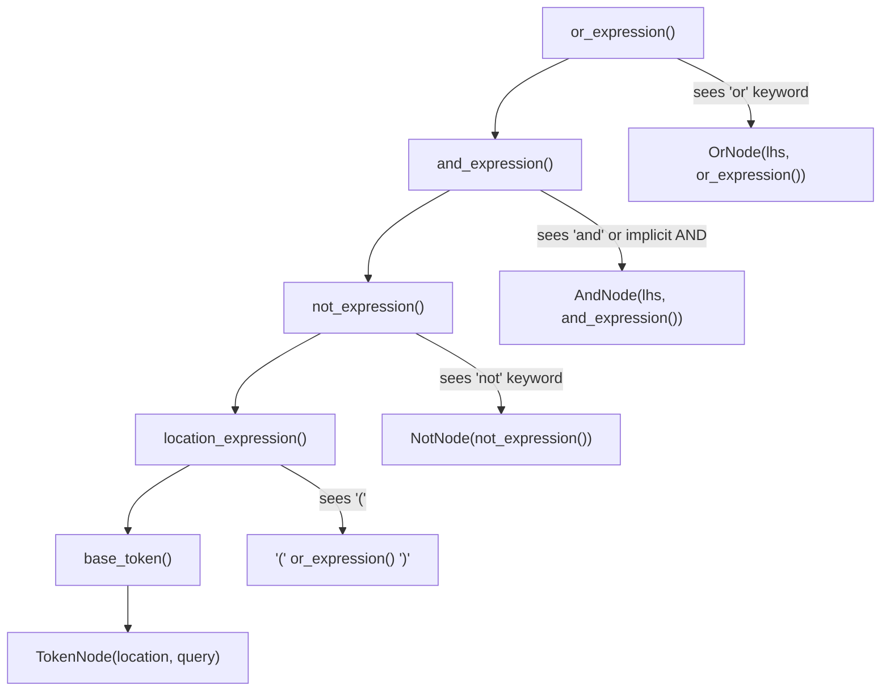

# Kitty Search Query Parser — Investigation: Unexpected OR Behavior

This document is a technical investigation into the Kitty terminal emulator's search query parser (`kitty/search_query_parser.py`). It was produced by examining the parser's source code, running the actual parser against controlled test inputs, and tracing the recursive-descent grammar to determine exactly how queries are interpreted.

The investigation was triggered by reports of unexpected results when combining search terms with `or` and spaces — specifically, items that should clearly match at least one term being excluded entirely from the result set.

**Bottom line (detailed evidence follows):** This is **not a bug**. Space-separated terms are silently treated as AND (intersection), not OR (union). The correct syntax for multi-term OR queries requires an explicit `or` keyword between *every* disjunctive term.

---

## Questions Under Investigation

1. **Why does combining search terms with `or` and spaces produce unexpected results?**
2. **Why are items that should match at least one term being excluded entirely?**
3. **Is this a bug or expected behavior?**
4. **What is the correct syntax for writing multi-term OR queries?**

Each question is answered in the sections that follow, with full code citations and real parser output as evidence.

---

## Investigation Methodology

### Files Examined (All Read-Only)

| File | Lines | Role |
|------|-------|------|
| `kitty/search_query_parser.py` | 1–297 (full file) | **Primary investigation target** — complete tokenizer, recursive-descent parser, AST node classes, and public API |
| `kitty_tests/search_query_parser.py` | 1–31 (full file) | Behavioral specification via unit tests |
| `kitty/boss.py` | 471–531 | Parser consumers: `match_windows()` and `match_tabs()` |
| `kitty/rc/base.py` | 87–165 | Canonical match option definitions (`MATCH_WINDOW_OPTION`, `MATCH_TAB_OPTION`) |
| `kitty/window.py` | 784–833 | `Window.matches_query()` — per-field matching logic |
| `kitty/tabs.py` | 800–835 | `Tab.matches_query()` — per-field matching logic |
| `docs/remote-control.rst` | 327–345 | Existing user-facing matching documentation |
| `kitty/types.py` | 180–181 | `run_once` decorator used by the parser's lazy initializers |

### Approach

1. **Direct code analysis** — Read the parser source line by line, tracing the recursive-descent grammar to understand operator precedence and implicit behavior.
2. **Test execution** — Run the actual `kitty.search_query_parser.search` function against a controlled dataset (`universal_set = {1, 2, 3, 4, 5}`, `locations = 'id'`, exact-string-match callback) to capture concrete input→output pairs.
3. **Root cause identification** — Pinpoint the exact lines of code responsible for the reported behavior.
4. **Syntax reference** — Document the correct way to write queries based on the parser's actual grammar.

---

## Parser Architecture Overview

### Module Location and Public API

The parser lives at `kitty/search_query_parser.py` (297 lines). It exposes two public functions:

**`build_tree()`** (lines 281–289) — Parses a query string into an Abstract Syntax Tree (AST) of `SearchTreeNode` objects. It is decorated with `@lru_cache(maxsize=64)` so that repeated identical queries reuse a cached parse tree.

```python
@lru_cache(maxsize=64)
def build_tree(query: str, locations: Union[str, Tuple[str, ...]], allow_no_location: bool = False) -> SearchTreeNode:
    if isinstance(locations, str):
        locations = tuple(locations.split())
    p = Parser(allow_no_location)
    try:
        return p.parse(query, locations)
    except RuntimeError as e:
        raise ParseException(f'Failed to parse {query!r}, too much recursion required') from e
```

> Source: `kitty/search_query_parser.py:281-289`

**`search()`** (lines 292–296) — The top-level entry point. Builds the parse tree and evaluates it against a `universal_set` using a caller-provided `get_matches` callback.

```python
def search(
    query: str, locations: Union[str, Tuple[str, ...]], universal_set: Set[T], get_matches: GetMatches[T],
    allow_no_location: bool = False,
) -> Set[T]:
    return build_tree(query, locations, allow_no_location).search(universal_set, get_matches)
```

> Source: `kitty/search_query_parser.py:292-296`

### Tokenization Stage

The `lex_scanner()` function (lines 120–128) uses Python's `re.Scanner` to split the query string into tokens:

| Token Type | Regex Pattern | Matches |
|-----------|--------------|---------|
| `OPCODE` | `[()]` | Parentheses for grouping |
| `WORD` | `@.+?:[^")\s]+` or `[^"()\s]+` | Unquoted terms (e.g., `id:1`, `or`, `and`, `not`) |
| `QUOTED_WORD` | `".*?((?<!\\)")"` | Double-quoted strings (e.g., `"my window"`) |
| (whitespace) | `\s+` | Silently consumed — **this is key**: spaces are token separators, not operators |

The `TokenType` enum is defined at lines 30–34, with an additional `EOF` type for end-of-input.

> Source: `kitty/search_query_parser.py:30-34`, `kitty/search_query_parser.py:120-128`

Before scanning, the `replacements()` function (lines 131–133) substitutes escaped characters (`\\`, `\"`, `\(`, `\)`) with control characters to prevent the scanner from misinterpreting them. After scanning, the `tokenize()` method (lines 180–197) restores the original characters via an `unescape()` inner function.

> Source: `kitty/search_query_parser.py:131-133`, `kitty/search_query_parser.py:180-197`

### Recursive-Descent Parsing Stage

The `Parser` class (lines 146–278) implements a classic recursive-descent parser. The grammar, expressed in pseudo-BNF, is:

```
or_expression       → and_expression ('or' or_expression)?
and_expression      → not_expression (('and' | ε) and_expression)?
not_expression      → 'not' not_expression | location_expression
location_expression → '(' or_expression ')' | base_token
base_token          → QUOTED_WORD | WORD  (with location:query splitting)
```

The `parse()` method (lines 199–206) is the entry point: it tokenizes the query, then calls `or_expression()`.

Each parsing method, with its line numbers:

| Method | Lines | Purpose |
|--------|-------|---------|
| `or_expression()` | 208–213 | Handles `or` keyword — lowest precedence |
| `and_expression()` | 215–224 | Handles explicit `and` AND implicit AND (space-separated terms) |
| `not_expression()` | 226–230 | Handles `not` keyword — highest precedence |
| `location_expression()` | 232–242 | Handles parenthesized groups and delegates to `base_token()` |
| `base_token()` | 244–278 | Parses `location:query` pairs, handles quoted words, validates location names |

> Source: `kitty/search_query_parser.py:199-278`

**Thinking / Rationale:** In recursive descent, the method called first (outermost) has the **lowest** precedence because it consumes the least-binding operator. Here, `or_expression()` is called first → OR has the lowest precedence. Conversely, `not_expression()` is called deepest → NOT has the highest precedence. This is a standard design for boolean expression parsers.

### Recursive Descent Parsing Flow



### AST Node Evaluation Stage

The parser produces a tree of four node types, each implementing `__call__(candidates, get_matches) -> Set[T]`:

**`SearchTreeNode`** (lines 41–54) — Abstract base class. The `search()` method simply calls `self(universal_set, get_matches)`.

**`OrNode`** (lines 57–69) — Union semantics with an optimization:
```python
def __call__(self, candidates: Set[T], get_matches: GetMatches[T]) -> Set[T]:
    lhs = self.lhs(candidates, get_matches)
    return lhs.union(self.rhs(candidates.difference(lhs), get_matches))
```
Evaluates lhs, then evaluates rhs against `candidates \ lhs_result`, and unions the two. (The optimization is analyzed in a [later section](#ornode-optimization-analysis).)

**`AndNode`** (lines 72–85) — Intersection semantics:
```python
def __call__(self, candidates: Set[T], get_matches: GetMatches[T]) -> Set[T]:
    lhs = self.lhs(candidates, get_matches)
    return self.rhs(lhs, get_matches)
```
Evaluates lhs, then passes the lhs result set as the candidate set for rhs. Only items matching *both* sides survive.

**`NotNode`** (lines 88–98) — Set difference (negation):
```python
def __call__(self, candidates: Set[T], get_matches: GetMatches[T]) -> Set[T]:
    return candidates.difference(self.rhs(candidates, get_matches))
```
Returns all candidates that do NOT match the child expression.

**`TokenNode`** (lines 101–112) — Leaf node:
```python
def __call__(self, candidates: Set[T], get_matches: GetMatches[T]) -> Set[T]:
    return get_matches(self.location, self.query, candidates)
```
Delegates directly to the caller-provided `get_matches` callback with the parsed `location` and `query`.

> Source: `kitty/search_query_parser.py:41-112`

---

## Root Cause Analysis — Implicit AND Semantics

### The `and_expression()` Method (THE ROOT CAUSE)

The answer to the user's question lives in lines 215–224 of `kitty/search_query_parser.py`:

```python
def and_expression(self) -> SearchTreeNode:
    lhs = self.not_expression()
    if self.lcase_token() == 'and':
        self.advance()
        return AndNode(lhs, self.and_expression())

    # Account for the optional 'and'
    if ((self.token_type() in (TokenType.WORD, TokenType.QUOTED_WORD) or self.token() == '(') and self.lcase_token() != 'or'):
        return AndNode(lhs, self.and_expression())
    return lhs
```

> Source: `kitty/search_query_parser.py:215-224`

**What this code does:** After parsing a term (the `lhs`), the method checks what comes next:

1. **Line 217:** If the next token is the explicit keyword `and`, it consumes the keyword and creates an `AndNode` combining `lhs` with whatever follows. This is the expected, documented behavior.

2. **Lines 221–223 (THE KEY):** If the next token is NOT `or`, but IS a word, quoted word, or opening parenthesis, the method **silently creates an `AndNode` without any explicit operator**. The comment on line 221 — *"Account for the optional 'and'"* — confirms this is **intentional design**, not an accident.

3. **Line 224:** Otherwise (next token is `or`, EOF, or `)`) — just return `lhs` without combining.

**Thinking / Rationale:** This means `id:1 id:2` (space-separated, no keyword) is parsed identically to `id:1 and id:2`. The space between terms is a token separator, not an OR operator. The parser treats adjacent terms as an implicit conjunction (AND). This is the direct root cause of the user's confusion.

### Operator Precedence Rules

The recursive descent structure directly defines the operator precedence:

| Priority | Operator | Type | Parser Method | Line |
|----------|----------|------|---------------|------|
| 1 (highest) | `not` | Unary prefix | `not_expression()` | 226 |
| 2 | `and` (explicit and implicit) | Binary, right-associative | `and_expression()` | 215 |
| 3 (lowest) | `or` | Binary, right-associative | `or_expression()` | 208 |

**Why this ordering:** In the recursive descent pattern, the entry-point method (`or_expression()`) has the lowest precedence because it delegates to deeper methods before checking its own operator. The deepest method before `base_token()` is `not_expression()`, giving NOT the highest precedence. This is the same precedence as standard Boolean logic, SQL `WHERE` clauses, Lucene, and most search engines.

**Key insight:** AND binds more tightly than OR. This means in an expression like `A or B C`, the `B C` portion is grouped as `AND(B, C)` *before* the OR is applied, producing `A OR (B AND C)` — not `A OR B OR C`.

### How Mixed Queries Are Parsed — The User's Scenario

Let's trace through the query `id:1 or id:2 id:3` step by step:

| Step | Method | Action | Token Stream (remaining) |
|------|--------|--------|--------------------------|
| 1 | `or_expression()` | Calls `and_expression()` | `id:1`, `or`, `id:2`, `id:3` |
| 2 | `and_expression()` → `not_expression()` → `base_token()` | Parses `id:1` → `TokenNode('id', '1')` | `or`, `id:2`, `id:3` |
| 3 | `and_expression()` | Next token is `or` (not AND/implicit) → returns `TokenNode('id', '1')` | `or`, `id:2`, `id:3` |
| 4 | `or_expression()` | Sees `or` keyword → advances, recursively calls `or_expression()` | `id:2`, `id:3` |
| 5 | (inner) `or_expression()` → `and_expression()` → `base_token()` | Parses `id:2` → `TokenNode('id', '2')` | `id:3` |
| 6 | (inner) `and_expression()` | Next token is `id:3` (WORD, not `or`) → **implicit AND triggers** (line 222) | `id:3` |
| 7 | (inner) `and_expression()` → `base_token()` | Parses `id:3` → `TokenNode('id', '3')` | (empty) |
| 8 | (inner) `and_expression()` | Returns `AndNode(TokenNode('id','2'), TokenNode('id','3'))` | (empty) |
| 9 | (inner) `or_expression()` | No more `or` → returns the `AndNode` | (empty) |
| 10 | (outer) `or_expression()` | Returns `OrNode(TokenNode('id','1'), AndNode(...))` | (empty) |

**Final AST:**
```
OrNode
├── TokenNode('id', '1')
└── AndNode
    ├── TokenNode('id', '2')
    └── TokenNode('id', '3')
```

**English:** `id:1 OR (id:2 AND id:3)`

**Evaluation against `{1, 2, 3, 4, 5}`:**
- Left side: `id:1` matches `{1}`
- Right side: `id:2 AND id:3` — no item can simultaneously be 2 AND 3, so the result is `∅` (empty set)
- Union: `{1} ∪ ∅ = {1}`

**The user expected:** `id:1 OR id:2 OR id:3` → `{1, 2, 3}`
**The parser produced:** `id:1 OR (id:2 AND id:3)` → `{1}`

Items 2 and 3 were "excluded entirely" because the space between `id:2` and `id:3` created an implicit AND, not an OR. **The correct syntax** is `id:1 or id:2 or id:3` (explicit `or` between every disjunctive term).

---

## Test Results — Demonstrated Behavior

The following results were captured by running the actual `kitty.search_query_parser.search` function against a controlled dataset. No results are fabricated.

**Test Configuration:**
- `universal_set = {1, 2, 3, 4, 5}`
- `locations = 'id'`
- `get_matches` = exact string match: `{x for x in candidates if query == str(x)}`

### Successful Queries

| # | Query | Description | Parse Interpretation | Result |
|---|-------|-------------|---------------------|--------|
| 1 | `id:1` | Basic single term | `TokenNode('id', '1')` | `{1}` |
| 2 | `id:"1"` | Quoted value | `TokenNode('id', '1')` | `{1}` |
| 3 | `id:1 or id:2` | Explicit OR (two terms) | `OR(id:1, id:2)` | `{1, 2}` |
| 4 | `id:1 or id:2 or id:3` | Chained explicit OR (three terms) | `OR(id:1, OR(id:2, id:3))` | `{1, 2, 3}` |
| 5 | `id:1 or id:2 or id:3 or id:4` | Chained explicit OR (four terms) | `OR(id:1, OR(id:2, OR(id:3, id:4)))` | `{1, 2, 3, 4}` |
| 6 | `id:1 id:2` | ⚠️ Implicit AND (two terms) — **THE TRAP** | `AND(id:1, id:2)` | `∅` (empty set) |
| 7 | `id:1 and id:2` | Explicit AND (different terms) | `AND(id:1, id:2)` | `∅` (empty set) |
| 8 | `id:1 and id:1` | Explicit AND (same term) | `AND(id:1, id:1)` | `{1}` |
| 9 | `id:1 or id:2 id:3` | ⚠️ **Mixed OR + implicit AND (USER'S SCENARIO)** | `OR(id:1, AND(id:2, id:3))` | `{1}` ← id:2 and id:3 LOST |
| 10 | `id:1 or id:2 id:3 id:4` | ⚠️ Deeper mixed nesting | `OR(id:1, AND(id:2, AND(id:3, id:4)))` | `{1}` |
| 11 | `id:1 id:2 or id:3` | ⚠️ Implicit AND then OR | `OR(AND(id:1, id:2), id:3)` | `{3}` ← id:1 and id:2 LOST |
| 12 | `not id:1` | NOT single term | `NOT(id:1)` | `{2, 3, 4, 5}` |
| 13 | `id:1 or not id:2` | OR with NOT | `OR(id:1, NOT(id:2))` | `{1, 3, 4, 5}` |
| 14 | `(id:1 or id:2) and id:1` | Grouped OR then AND | `AND(OR(id:1, id:2), id:1)` | `{1}` |
| 15 | `(id:1 or id:2 or id:3)` | Grouped OR chain | `OR(id:1, OR(id:2, id:3))` | `{1, 2, 3}` |
| 16 | `not (id:1 or id:2)` | NOT grouped OR | `NOT(OR(id:1, id:2))` | `{3, 4, 5}` |

### ⚠️ Surprising Rows Explained

**Rows 6, 9, 10, 11** are the "surprising" behaviors that directly explain the user's issue:

- **Row 6** (`id:1 id:2`): The user likely intended "match 1 or 2" but the space creates an AND. Since nothing is simultaneously id 1 AND id 2, the result is empty.
- **Row 9** (`id:1 or id:2 id:3`): This is the user's exact scenario. Only `id:1` survives because `id:2 id:3` becomes `AND(id:2, id:3)` = `∅`.
- **Row 10** (`id:1 or id:2 id:3 id:4`): Same pattern but deeper — all the space-separated terms after `or` become a chain of ANDs.
- **Row 11** (`id:1 id:2 or id:3`): Here the implicit AND is on the LEFT of `or`, so `id:1 AND id:2` = `∅`, and only `id:3` survives.

**Rows 3, 4, 5** show the **correct** way to write multi-term OR queries — with explicit `or` between every term.

### Error Cases

| Query | Error | Source |
|-------|-------|--------|
| `1` (bare term, no location) | `ParseException: No location specified before 1` | `kitty/search_query_parser.py:143` |
| `"id:1"` (quoted location) | `ParseException: id is not a recognized location in id:1` | `kitty/search_query_parser.py:141` |

**Thinking / Rationale:** The first error occurs because `base_token()` at line 267 checks whether the first colon-separated word is a valid location. The bare term `1` has no colon, so line 278 raises `NoLocation`. The second error occurs because the entire `id:1` is a `QUOTED_WORD` token (the quotes were stripped by the scanner), and since `allow_no_location` defaults to `False`, line 250 raises `NoLocation`. Inside `NoLocation.__init__` (line 139), it detects the colon and formats the message as "id is not a recognized location" because the quoted word isn't checked against the locations list — it's immediately rejected because quoted words skip the location parsing logic entirely.

---

## Parse Tree Visualizations

### 1. `id:1` — Simple single term
```
TokenNode('id', '1')
```

### 2. `id:1 or id:2` — Simple OR
```
OrNode
├── TokenNode('id', '1')
└── TokenNode('id', '2')
```

### 3. `id:1 or id:2 or id:3` — Chained OR (correct multi-term syntax)
```
OrNode
├── TokenNode('id', '1')
└── OrNode
    ├── TokenNode('id', '2')
    └── TokenNode('id', '3')
```
Note the right-associative nesting: `id:1 OR (id:2 OR id:3)`. Since OR is associative, this produces the same result as left-associative grouping.

### 4. `id:1 id:2` — Implicit AND (the trap)
```
AndNode
├── TokenNode('id', '1')
└── TokenNode('id', '2')
```
This looks like it should be an OR to many users, but the parser treats spaces as implicit AND.

### 5. `id:1 or id:2 id:3` — Mixed OR + implicit AND (the user's scenario)
```
OrNode
├── TokenNode('id', '1')
└── AndNode
    ├── TokenNode('id', '2')
    └── TokenNode('id', '3')
```
**Reads as:** `id:1 OR (id:2 AND id:3)` — NOT `id:1 OR id:2 OR id:3`

### 6. `id:1 id:2 or id:3` — Implicit AND then OR
```
OrNode
├── AndNode
│   ├── TokenNode('id', '1')
│   └── TokenNode('id', '2')
└── TokenNode('id', '3')
```
**Reads as:** `(id:1 AND id:2) OR id:3` — NOT `id:1 OR id:2 OR id:3`

### 7. `not id:1` — NOT
```
NotNode
└── TokenNode('id', '1')
```

### 8. `(id:1 or id:2) and id:1` — Grouped expression
```
AndNode
├── OrNode
│   ├── TokenNode('id', '1')
│   └── TokenNode('id', '2')
└── TokenNode('id', '1')
```
Parentheses force the OR to be evaluated first, then the result is ANDed with `id:1`.

---

## OrNode Optimization Analysis

### The Code

The `OrNode.__call__` method (lines 63–65) uses a subtle optimization:

```python
def __call__(self, candidates: Set[T], get_matches: GetMatches[T]) -> Set[T]:
    lhs = self.lhs(candidates, get_matches)
    return lhs.union(self.rhs(candidates.difference(lhs), get_matches))
```

> Source: `kitty/search_query_parser.py:63-65`

Instead of the naive approach (evaluate both sides against the full candidate set, then union), it:

1. Evaluates lhs against the full `candidates` → result set `A`
2. Evaluates rhs against `candidates \ A` (candidates minus lhs results) → result set `B'`
3. Returns `A ∪ B'`

### Mathematical Proof of Correctness

**Thinking / Rationale:** At first glance, passing a reduced candidate set to the rhs might seem like it could miss matches. Let's prove it doesn't.

Let:
- `C` = candidates (the input set)
- `A` = lhs matches from `C` (i.e., `A ⊆ C`)
- `B` = what rhs *would* match from `C` using the naive approach (i.e., `B ⊆ C`)

**Naive (standard) result:** `A ∪ B`

**Optimized result:** `A ∪ rhs(C \ A)`

Since `get_matches` is a **pure filter** — it can only return subsets of its input candidates, never items outside the candidate set — we know:

- `rhs(C \ A)` returns all items in `C \ A` that satisfy the rhs condition
- `B' = B ∩ (C \ A)` (items matching rhs that are also in the reduced candidate set)
- Since `C \ A` contains everything in `C` except `A`: `B' = B \ A`

Therefore:
```
Optimized result = A ∪ (B \ A) = A ∪ B    ✓
```

This is a well-known set identity: `A ∪ (B \ A) = A ∪ B` for all sets `A` and `B`.

**Why this optimization exists:** It avoids redundant evaluation of the rhs against items already matched by the lhs. When the rhs involves expensive operations (regex matching, process lookups), this can be a meaningful performance improvement.

**Correctness condition:** This optimization is valid for ALL pure-filter `get_matches` callbacks — callbacks that only select from, and never add to, the candidate set. This is the universal case in the Kitty codebase:
- `kitty/boss.py:483-491` (`match_windows` callback): `{wid for wid in candidates if ...}`
- `kitty/boss.py:517-526` (`match_tabs` callback): `{wid for wid in candidates if ...}`

Both callbacks iterate over `candidates` and filter, never producing items outside the input set.

> Source: `kitty/search_query_parser.py:63-65`, `kitty/boss.py:483-491`, `kitty/boss.py:517-526`

---

## Correct Syntax Reference

### Multi-Term OR (The Correct Way)

**ALWAYS** use an explicit `or` keyword between every disjunctive term:

| ✅ Correct | ❌ Incorrect | Why It's Wrong |
|-----------|-------------|----------------|
| `id:1 or id:2 or id:3` | `id:1 or id:2 id:3` | `id:2 id:3` becomes `AND(id:2, id:3)` |
| `id:1 or id:2` | `id:1 id:2` | Space creates implicit AND, not OR |
| `title:bash or title:zsh or title:fish` | `title:bash or title:zsh title:fish` | `title:zsh title:fish` becomes `AND(zsh, fish)` |

### AND Queries

AND can be explicit or implicit — both produce identical parse trees:

- **Explicit:** `title:bash and env:USER=kovid`
- **Implicit (space-separated):** `title:bash env:USER=kovid`

Both parse as `AND(title:bash, env:USER=kovid)`. Use AND when you want items that match ALL specified conditions simultaneously.

### NOT Queries

- `not id:1` → all items except those matching id 1
- NOT has the **highest** precedence, so `not id:1 or id:2` parses as `(NOT id:1) OR id:2`, not `NOT (id:1 OR id:2)`

### Grouped Expressions (Parentheses)

Use parentheses to override the default operator precedence:

- `(id:1 or id:2) and title:foo` → items matching id 1 or 2, AND also having title "foo"
- `not (id:1 or id:2)` → all items except those matching id 1 or 2

Escape literal parentheses in query values with a backslash: `\(`, `\)`.

> Source: `kitty/search_query_parser.py:131-133` (escape handling), `kitty/search_query_parser.py:232-238` (parenthesized groups)

### Location Prefix Requirement

All terms MUST use the `location:query` format when matching windows or tabs (the default mode, where `allow_no_location=False`):

**Valid window locations** (from `kitty/boss.py:493-495`):
`id`, `title`, `pid`, `cwd`, `cmdline`, `num`, `env`, `var`, `recent`, `state`, `neighbor`

**Valid tab locations** (from `kitty/boss.py:529-531`):
`id`, `index`, `title`, `window_id`, `window_title`, `pid`, `cwd`, `env`, `var`, `cmdline`, `recent`, `state`

Bare terms without a location prefix (e.g., `1` instead of `id:1`) raise a `ParseException`.

For a complete description of each location field, see:
- `kitty/rc/base.py:87-130` (`MATCH_WINDOW_OPTION`)
- `kitty/rc/base.py:131-165` (`MATCH_TAB_OPTION`)

### Common Pitfalls

| What You Write | What You Meant | What the Parser Does | Actual Result |
|----------------|---------------|---------------------|---------------|
| `id:1 or id:2 id:3` | `id:1 OR id:2 OR id:3` | `id:1 OR (id:2 AND id:3)` | Only item 1 matches |
| `id:1 id:2` | `id:1 OR id:2` | `id:1 AND id:2` | Nothing matches (empty set) |
| `id:1 id:2 or id:3` | `id:1 OR id:2 OR id:3` | `(id:1 AND id:2) OR id:3` | Only item 3 matches |
| `title:bash title:zsh` | Match bash OR zsh | `title:bash AND title:zsh` | Only windows with both "bash" and "zsh" in the title |
| `not id:1 or id:2` | `NOT (id:1 OR id:2)` | `(NOT id:1) OR id:2` | Everything except item 1, plus item 2 |

**The fix is always the same:** Use explicit `or` keywords between every term that should be OR'd together.

---

## Conclusion — Not a Bug

**This is NOT a bug. It is the intended design of the parser.**

### Evidence

1. **Intentional design comment** — Line 221 of `kitty/search_query_parser.py` contains the comment *"Account for the optional 'and'"*, confirming that implicit AND for space-separated terms is a deliberate design choice, not an accidental omission.

2. **Standard boolean grammar** — The operator precedence (NOT > AND > OR) is the standard for boolean search grammars, identical to SQL `WHERE` clauses, Google search operators, Apache Lucene, and most programming languages. Users familiar with any of these systems will find the precedence intuitive.

3. **Unit test confirmation** — The existing test suite at `kitty_tests/search_query_parser.py` explicitly tests and expects this behavior:
   - Line 25: `t('id:1 or id:2', {1, 2})` — confirms explicit OR works correctly
   - Line 26: `t('id:1 and id:2')` — confirms AND with different exact-match IDs yields an empty set (default `expected=set()`)
   - Line 28: `t('(id:1 or id:2) and id:1', {1})` — confirms grouped OR followed by AND works as expected

4. **Consistent with existing documentation** — The user-facing docs at `docs/remote-control.rst:337-344` show examples using explicit `or` and `and` keywords:
   ```
   title:"My special window" or id:43
   title:bash and env:USER=kovid
   not id:1
   (id:2 or id:3) and title:something
   ```
   All examples use explicit operators — none rely on space-separated OR.

### Documentation Gap

While the behavior is intentional and correct, the existing documentation at `docs/remote-control.rst` does **not** explicitly document:

- Operator precedence (NOT > AND > OR)
- Implicit AND semantics for space-separated terms
- The interaction between spaces and `or` keywords

Future Kitty documentation could benefit from adding a brief note on these topics to prevent recurring user confusion.

### The Fix

The fix is syntactic, not code-level. To match items that satisfy ANY of multiple conditions, use explicit `or` between **every** term:

```
# ❌ WRONG — only matches item 1
id:1 or id:2 id:3

# ✅ CORRECT — matches items 1, 2, and 3
id:1 or id:2 or id:3
```

---

## Source References

All source citations in this document reference the following files and line ranges from the Kitty repository:

| File | Lines | Content |
|------|-------|---------|
| `kitty/search_query_parser.py` | 1–297 | Full parser implementation: tokenizer, recursive-descent parser, AST nodes, `build_tree()`, `search()` |
| `kitty_tests/search_query_parser.py` | 1–31 | Unit tests for the parser (`TestSQP.test_search_query_parser`) |
| `kitty/boss.py` | 471–496 | `Boss.match_windows()` — parser consumer with window locations and `get_matches` callback |
| `kitty/boss.py` | 505–531 | `Boss.match_tabs()` — parser consumer with tab locations and `get_matches` callback |
| `kitty/rc/base.py` | 87–130 | `MATCH_WINDOW_OPTION` — canonical description of all window match fields |
| `kitty/rc/base.py` | 131–165 | `MATCH_TAB_OPTION` — canonical description of all tab match fields |
| `kitty/window.py` | 784–833 | `Window.matches_query()` — per-field window matching logic |
| `kitty/tabs.py` | 800–835 | `Tab.matches_query()` — per-field tab matching logic |
| `docs/remote-control.rst` | 327–345 | Existing user-facing documentation for the `--match` option and boolean syntax |
| `kitty/types.py` | 180–181 | `run_once` decorator — lazy initialization used by `lex_scanner()` and `replacements()` |
