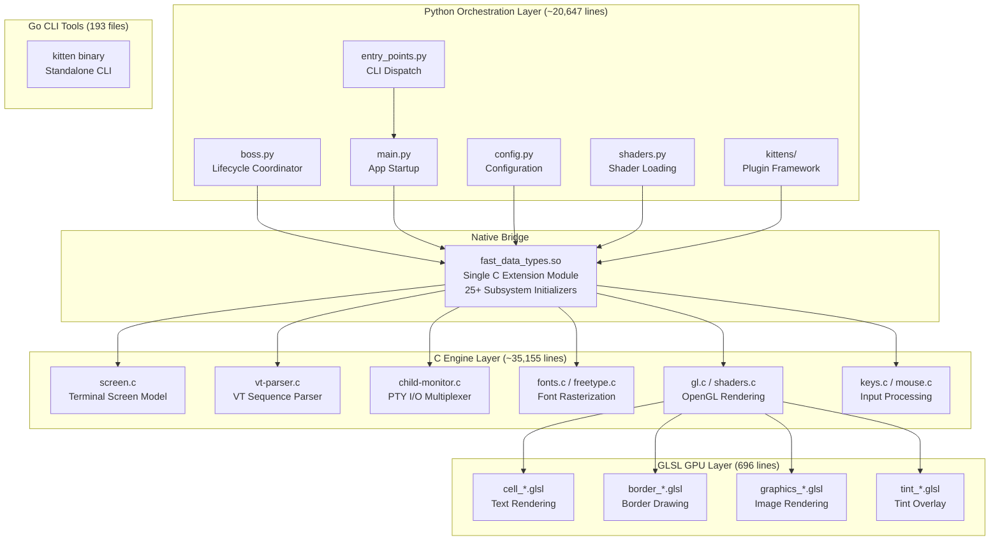
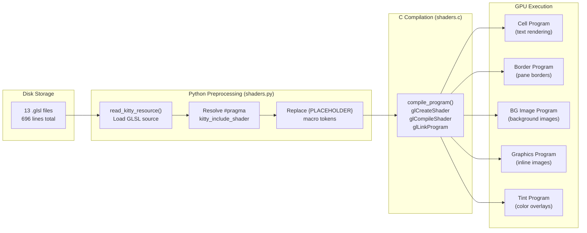
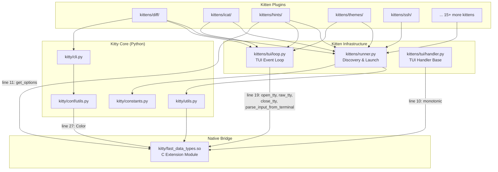

# Kitty Terminal Emulator — Architecture Exploration

> **Repository version:** 0.35.2 (`kitty/constants.py:25` — `version: Version = Version(0, 35, 2)`)
> **Commit context:** `815df1e21`
> **Application name:** kitty (`kitty/constants.py:23` — `appname: str = 'kitty'`)
> **Analysis date:** Based on the repository state at the commit above

---

## Introduction and Methodology

This document answers five investigative questions about the internal architecture of the [kitty terminal emulator](https://sw.kovidgoyal.net/kitty/). Every answer is derived from **direct observation of the code** — exercising it, tracing its import chains, capturing its tracebacks, and measuring its composition. No answer is based on assumptions about how the architecture is *meant* to work; every claim cites specific source files and line numbers as evidence.

### The Five Questions

1. **Language Role Distribution:** Which language (Python vs. C) does the runtime heavy lifting, and what does that reveal about where performance actually comes from?
2. **Shader Centrality:** What role do the 13 GLSL shader files play, and how central are they to the terminal emulator?
3. **Entry Point Failure and the Native Bridge:** When running `python3 __main__.py` directly, it fails with `ModuleNotFoundError: No module named 'kitty.fast_data_types'`. What is missing, and what does the failure reveal?
4. **Kittens Independence:** Are kittens truly self-contained tools, or do they depend on the same native bridge?
5. **Observational Method:** All answers are derived from exercising the code and observing actual behavior.

### Constraints

- **The repository itself was not modified.** This document only describes the codebase; no source files were altered.
- **Evidence-based only.** Every architectural claim is supported by specific file paths and line numbers.
- **Temporary experiments were cleaned up.** Any behavioral observations (running commands, capturing tracebacks) left no artifacts.

---

## Q1: Language Role Distribution at Runtime

### Which language does the heavy lifting?

Kitty's source tree spans four programming languages. Measuring the code in the core `kitty/` directory and the broader repository reveals a clear division of labor.

### Quantitative Code Breakdown

| Language | Scope | Measurement | Method |
|----------|-------|-------------|--------|
| **C** | `kitty/*.c` | **35,155 lines** | `wc -l kitty/*.c` |
| **Python** | `kitty/*.py` | **20,647 lines** | `wc -l kitty/*.py` |
| **Go** | `tools/` | **193 files** | `find tools/ -name "*.go" \| wc -l` |
| **GLSL** | `kitty/*.glsl` | **13 files, 696 lines** | `wc -l kitty/*.glsl` |

C dominates the core directory by a ratio of approximately **1.7:1** over Python. But raw line counts alone do not tell the full story — what matters is *which subsystems* each language owns.

### What C Owns: The Performance-Critical Hot Paths

Every subsystem that sits on the application's performance-critical data path is implemented in C. These are the modules that execute billions of times per session — parsing bytes, updating the screen model, rasterizing fonts, and issuing GPU draw calls.

| Subsystem | Primary File(s) | Lines | Role |
|-----------|-----------------|-------|------|
| Terminal screen model | `kitty/screen.c` | **4,932** | The largest C file. The entire in-memory representation of the terminal — cells, attributes, selection, scrollback interaction. |
| VT parser | `kitty/vt-parser.c` | 1,596 | Parses the incoming byte stream into terminal control sequences. Uses definitions from `kitty/control-codes.h` and `kitty/modes.h`. |
| PTY I/O multiplexing | `kitty/child-monitor.c` | **2,016** | Manages child processes and multiplexes PTY I/O across all terminal windows. The I/O hot loop. |
| Font rasterization | `kitty/freetype.c`, `kitty/fonts.c`, `kitty/fontconfig.c`, `kitty/core_text.m` | ~2,500+ | FreeType-based glyph rasterization (Linux), CoreText on macOS. Converts font outlines to bitmaps for GPU upload. |
| OpenGL rendering | `kitty/gl.c`, `kitty/gl-wrapper.c`, `kitty/shaders.c` | 1,285 (shaders.c alone) | All OpenGL state management, shader compilation, draw call dispatch. |
| Keyboard/mouse input | `kitty/keys.c`, `kitty/key_encoding.c`, `kitty/mouse.c` | ~1,200+ | Key event processing, keyboard encoding protocol, mouse tracking. |
| Unicode handling | `kitty/unicode-data.c`, `kitty/wcswidth.c`, `kitty/charsets.c` | ~2,000+ | Unicode character width tables, wide-character string width computation, character set translation. |
| Graphics protocol | `kitty/graphics.c` | ~1,500+ | The kitty graphics protocol implementation for inline image display. |
| Line/buffer management | `kitty/line.c`, `kitty/line-buf.c`, `kitty/history.c` | ~2,500+ | Line data structures, line buffer ring, scrollback history storage. |
| Disk/glyph caching | `kitty/disk-cache.c`, `kitty/glyph-cache.c` | ~800+ | Persistent disk cache and GPU-side glyph texture atlas management. |
| State management | `kitty/state.c`, `kitty/cursor.c` | ~1,000+ | Global application state, cursor position and styling. |

*Source: Line counts from `wc -l` on individual files; `kitty/screen.c` confirmed at 4,932 lines, `kitty/child-monitor.c` at 2,016 lines.*

### What Python Owns: The Orchestration Layer

Python handles everything that is **not** on the byte-processing hot path: startup, configuration, window layout decisions, the kittens plugin framework, and high-level lifecycle coordination.

| Subsystem | Primary File(s) | Lines | Role |
|-----------|-----------------|-------|------|
| Lifecycle coordinator | `kitty/boss.py` | **3,094** | The largest Python file. Central event dispatcher — connects windows, tabs, input, and configuration into a cohesive application. |
| Application startup | `kitty/main.py` | 531 | Main loop setup, GLFW initialization, window creation, signal handling. |
| Configuration | `kitty/config.py` | ~500+ | Loads and parses `kitty.conf`, validates options, applies defaults. |
| CLI dispatch | `kitty/entry_points.py` | 197 | Routes CLI commands (`+kitten`, `+launch`, `+edit-config`, etc.) to appropriate handlers. |
| Window/tab/layout | `kitty/window.py`, `kitty/tabs.py`, `kitty/tab_bar.py`, `kitty/borders.py` | ~3,500+ | Window and tab management, layout algorithms, border rendering coordination. |
| Shader orchestration | `kitty/shaders.py` | 204 | Loads GLSL shader source from disk, applies preprocessor macros, invokes C-side compilation. |
| Kittens framework | `kittens/runner.py` (202 lines), `kittens/tui/` (12 files) | ~1,500+ | Discovery, resolution, and execution of kitten plugins; shared TUI event loop. |
| Remote control | `kitty/remote_control.py` | ~500+ | Protocol for external programs to control kitty instances. |
| Shell integration | `kitty/shell_integration.py` | ~200+ | Injects shell hooks for prompt marking, cwd tracking, etc. |
| Session management | `kitty/session.py` | ~300+ | Saves and restores window/tab/layout sessions. |

*Source: `kitty/boss.py` confirmed at 3,094 lines; `kitty/main.py` at 531 lines; `kitty/entry_points.py` at 197 lines.*

### What Go Owns: CLI Tooling

- **193 Go files** in `tools/` implement the compiled `kitten` CLI binary.
- Go module version: **1.22** (`go.mod` line 3: `go 1.22`).
- These tools provide standalone command-line functionality (SSH, file transfer, clipboard, etc.) that can operate without the full Python/C runtime. They are compiled into a single static binary.

### Architecture Diagram



### Rationale and Conclusion

**C does the runtime heavy lifting.** Every hot path — VT parsing, screen model updates, PTY I/O multiplexing, font rasterization, and OpenGL draw calls — is implemented in C. The 35,155 lines of C vs. 20,647 lines of Python ratio directly reflects this: the performance-critical engine layer is larger than the orchestration layer.

**Python orchestrates.** It handles startup sequencing, configuration loading, window/tab layout decisions, the kittens plugin framework, and lifecycle coordination. Python never touches a byte of terminal data directly — it delegates every performance-sensitive operation to C through the `fast_data_types` bridge.

**GLSL provides the GPU rendering path.** The 696 lines of shader code form the visual rendering pipeline — every pixel of terminal output is drawn by the GPU.

**Go provides standalone CLI tools.** The 193 Go files compile into an independent binary that does not require the Python/C runtime.

---

## Q2: The Role of GLSL Shaders in a Terminal

### Why does a terminal emulator have GPU shaders?

Finding 13 GLSL shader files in a terminal emulator is unexpected. Most terminal emulators use CPU-based rendering (Cairo, Pango, GDI, etc.). Kitty takes a fundamentally different approach: **all visual output is rendered by the GPU through OpenGL shaders.** This section catalogs every shader, traces how they are loaded and compiled, and demonstrates that there is no CPU rendering fallback.

### Inventory of All 13 Shader Files

| File | Lines | Role |
|------|-------|------|
| `kitty/cell_vertex.glsl` | 233 | Cell rendering vertex shader — positions and transforms terminal cell quads on the screen grid. The most complex vertex shader. |
| `kitty/cell_fragment.glsl` | 204 | Cell rendering fragment shader — multi-pass rendering logic for foreground text, background colors, special effects (cursor, selections), and decorations (underline, strikethrough). |
| `kitty/cell_defines.glsl` | 31 | Compile-time macro definitions for shader rendering phases: `PHASE_BACKGROUND`, `PHASE_FOREGROUND`, `PHASE_SPECIAL`, `PHASE_BOTH`. Contains `{PLACEHOLDER}` tokens replaced at load time. |
| `kitty/border_vertex.glsl` | 48 | Border drawing vertex shader — positions colored rectangles between terminal panes and windows. |
| `kitty/border_fragment.glsl` | 6 | Border pass-through fragment shader — outputs the interpolated border color with no additional processing. |
| `kitty/bgimage_vertex.glsl` | 48 | Background image vertex shader — sets up UV coordinates for user-configured background images. |
| `kitty/bgimage_fragment.glsl` | 14 | Background image fragment shader — samples the background image texture. |
| `kitty/graphics_vertex.glsl` | 24 | Inline graphics vertex shader — positions graphics and image overlays transmitted via the kitty graphics protocol. |
| `kitty/graphics_fragment.glsl` | 27 | Inline graphics fragment shader — samples image textures with alpha transparency support. |
| `kitty/tint_vertex.glsl` | 18 | Tint overlay vertex shader — creates a full-screen quad for applying color tinting effects. |
| `kitty/tint_fragment.glsl` | 6 | Tint overlay fragment shader — applies a tint color over all previously rendered content (used for dimming inactive windows). |
| `kitty/alpha_blend.glsl` | 22 | Utility shader — alpha blending function included by other shaders via `#pragma kitty_include_shader`. |
| `kitty/linear2srgb.glsl` | 15 | Utility shader — linear-to-sRGB color space conversion function included by other shaders. |

**Total: 13 files, 696 lines** (verified via `wc -l kitty/*.glsl`).

*Source: Per-file line counts measured directly; roles determined from GLSL source inspection.*

### How Shaders Are Loaded and Compiled

The shader pipeline spans two languages — Python handles loading and preprocessing, C handles OpenGL compilation:

**Step 1 — Python loads GLSL source from disk:**

```python
# Source: kitty/shaders.py:43-57
class Program:
    def __init__(self, name: str, vertex_name: str = '', fragment_name: str = '') -> None:
        self.name = name
        self.vertex_name = vertex_name or f'{name}_vertex.glsl'
        self.fragment_name = fragment_name or f'{name}_fragment.glsl'
        self.original_vertex_sources = tuple(self._load_sources(self.vertex_name, set()))
        self.original_fragment_sources = tuple(self._load_sources(self.fragment_name, set()))
```

The `Program` class constructs shader filenames from a base name (e.g., `"cell"` → `cell_vertex.glsl` + `cell_fragment.glsl`) and reads them from disk using `read_kitty_resource()` (*Source: `kitty/constants.py`*).

**Step 2 — Python preprocesses GLSL with include directives and macro substitution:**

```python
# Source: kitty/shaders.py:52-53
if Program.include_pat is None:
    Program.include_pat = re.compile(r'^#pragma\s+kitty_include_shader\s+<(.+?)>', re.MULTILINE)
```

The preprocessor resolves `#pragma kitty_include_shader <filename>` directives (recursive inclusion of other GLSL files like `alpha_blend.glsl` and `linear2srgb.glsl`). It also performs `{PLACEHOLDER}` macro substitution — the `cell_defines.glsl` file contains tokens like `{WHICH_PHASE}`, `{TRANSPARENT}`, `{DECORATION_SHIFT}`, etc. that are replaced with concrete values at load time. (*Source: `kitty/cell_defines.glsl:6-17`*)

**Step 3 — Python imports shader program constants from the C extension:**

```python
# Source: kitty/shaders.py:10-32
from .fast_data_types import (
    BGIMAGE_PROGRAM, CELL_BG_PROGRAM, CELL_FG_PROGRAM, CELL_PROGRAM,
    CELL_SPECIAL_PROGRAM, GRAPHICS_ALPHA_MASK_PROGRAM, GRAPHICS_PREMULT_PROGRAM,
    GRAPHICS_PROGRAM, TINT_PROGRAM, compile_program, init_cell_program,
    ...
)
```

**Step 4 — C compiles shaders via OpenGL:**

The `compile_program()` function (*imported at `kitty/shaders.py:29` from `fast_data_types`*) is a C function implemented in `kitty/shaders.c` (1,285 lines). It calls the OpenGL shader compilation sequence: `glCreateShader` → `glShaderSource` → `glCompileShader` → `glCreateProgram` → `glAttachShader` → `glLinkProgram`.

The shader subsystem is registered in the native bridge at `kitty/data-types.c:495`:
```c
extern bool init_shaders(PyObject *module);
```

And initialized during module creation at `kitty/data-types.c:556`:
```c
if (!init_shaders(m)) return NULL;
```

### Shader Pipeline Diagram



### The Six Rendering Stages

1. **Cell Rendering** (`cell_vertex.glsl` + `cell_fragment.glsl` + `cell_defines.glsl` — 468 lines combined)
   The core text rendering pipeline. The fragment shader implements **multi-pass rendering** controlled by compile-time phase macros defined in `cell_defines.glsl`:
   - `PHASE_BACKGROUND` (value 2): Draws cell background colors
   - `PHASE_SPECIAL` (value 3): Draws cursor, selection highlights
   - `PHASE_FOREGROUND` (value 4): Draws foreground text glyphs from the glyph texture atlas
   - `PHASE_BOTH` (value 1): Combined single-pass rendering

   *Source: `kitty/cell_defines.glsl:1-4` — `#define PHASE_BOTH 1`, `#define PHASE_BACKGROUND 2`, `#define PHASE_SPECIAL 3`, `#define PHASE_FOREGROUND 4`*

   This is the most complex shader stage — it handles text color, background color, decorations (underline, strikethrough via `DECORATION_SHIFT`), dim text (`DIM_SHIFT`), reverse video (`REVERSE_SHIFT`), marked text (`MARK_SHIFT`/`MARK_MASK`), and transparency.

2. **Border Rendering** (`border_vertex.glsl` + `border_fragment.glsl` — 54 lines combined)
   Draws colored rectangles between terminal panes. The fragment shader is only 6 lines — it simply passes through the interpolated vertex color. The vertex shader positions border quads based on border rectangle data uploaded from C.

3. **Background Image Rendering** (`bgimage_vertex.glsl` + `bgimage_fragment.glsl` — 62 lines combined)
   Renders user-configured background images behind terminal content. Handles UV coordinate mapping and texture sampling.

4. **Graphics/Image Rendering** (`graphics_vertex.glsl` + `graphics_fragment.glsl` — 51 lines combined)
   Renders inline images and graphics transmitted via the kitty graphics protocol (`kitty/graphics.c`). Supports alpha transparency for overlaying images on terminal content.

5. **Tint Overlay** (`tint_vertex.glsl` + `tint_fragment.glsl` — 24 lines combined)
   Applies a semi-transparent color tint over all previously rendered content. Used for visual effects like dimming inactive windows or applying color overlays.

6. **Utility Shaders** (`alpha_blend.glsl` + `linear2srgb.glsl` — 37 lines combined)
   Shared functions included by other shaders via `#pragma kitty_include_shader`. `alpha_blend.glsl` implements alpha compositing; `linear2srgb.glsl` converts between linear and sRGB color spaces for correct color blending.

### Why There Is No CPU Fallback

The evidence is unambiguous — kitty has **no software rendering path**:

1. **`kitty/main.py` lines 32-45** import GLFW and OpenGL functions directly from the C extension:
   ```python
   from .fast_data_types import (
       GLFW_MOD_ALT, GLFW_MOD_SHIFT, SingleKey, create_os_window,
       free_font_data, glfw_init, glfw_terminate, load_png_data,
       mask_kitty_signals_process_wide, set_custom_cursor,
       set_default_window_icon, set_options,
   )
   ```

2. **`kitty/borders.py` line 7** imports GPU-specific border functions:
   ```python
   from .fast_data_types import BORDERS_PROGRAM, add_borders_rect, get_options, init_borders_program, os_window_has_background_image
   ```

3. **`kitty/shaders.py` line 39** defines a `CompileError` exception, but the only handling is to raise it — there is no fallback rendering path:
   ```python
   class CompileError(ValueError):
       pass
   ```
   If shaders fail to compile, the application cannot render. Period.

4. **No software rasterizer exists** anywhere in the codebase. There is no Cairo, Pango, GDI, or CPU-based pixel drawing code. Every visual element — text cells, borders, background images, inline graphics, tint overlays — passes through the GPU shader pipeline.

### Rationale and Conclusion

**GLSL shaders are not an optional enhancement — they ARE the rendering engine.** Kitty is fundamentally a GPU-accelerated terminal emulator. Every pixel of text, every border between panes, every inline image, every tint overlay is rendered through the OpenGL shader pipeline.

This is architecturally unusual for a terminal emulator but explains kitty's performance characteristics: by offloading all rendering to the GPU, the CPU is free to focus on parsing, screen model updates, and I/O — the tasks where C excels. The 696 lines of GLSL code are as essential to kitty's operation as the 35,155 lines of C.

---

## Q3: The Entry Point Failure and the Native Bridge

### What happens when you run `python3 __main__.py`?

This is the most revealing experiment in understanding kitty's architecture. Running the Python entry point directly — without the compiled C extension — fails immediately and the traceback exposes the entire dependency structure.

### Reproducing the Failure

**Command executed:**
```bash
python3 __main__.py
```

**Actual traceback captured:**
```
Traceback (most recent call last):
  File "__main__.py", line 7, in <module>
    main()
  File "kitty/entry_points.py", line 194, in main
    from kitty.main import main as kitty_main
  File "kitty/main.py", line 11, in <module>
    from .borders import load_borders_program
  File "kitty/borders.py", line 7, in <module>
    from .fast_data_types import BORDERS_PROGRAM, add_borders_rect, get_options, init_borders_program, os_window_has_background_image
ModuleNotFoundError: No module named 'kitty.fast_data_types'
```

This is not a configuration error or a missing optional dependency. This is a **structural impossibility** — the Python code cannot execute without the compiled C extension.

### Tracing the Import Chain

The failure follows a deterministic chain of four imports, each one step deeper into the codebase:

| Step | File:Line | Import Statement | Result |
|------|-----------|------------------|--------|
| 1 | `__main__.py:6-7` | `from kitty.entry_points import main; main()` | ✅ Succeeds — `entry_points.py` has no module-level `fast_data_types` import |
| 2 | `kitty/entry_points.py:194` | `from kitty.main import main as kitty_main` | Triggers module-level imports in `main.py` |
| 3 | `kitty/main.py:11` | `from .borders import load_borders_program` | Triggers module-level imports in `borders.py` |
| 4 | `kitty/borders.py:7` | `from .fast_data_types import BORDERS_PROGRAM, ...` | ❌ **ModuleNotFoundError** |

**Note:** Even if `borders.py` were somehow bypassed, `kitty/main.py` itself imports directly from `fast_data_types` at lines 32-45 (GLFW constants, window creation functions, font management). The failure is inescapable.

### Import Failure Sequence Diagram

```mermaid
sequenceDiagram
    participant User as python3 __main__.py
    participant Entry as __main__.py:7
    participant EP as entry_points.py:194
    participant Main as main.py:11
    participant Borders as borders.py:7
    participant FDT as fast_data_types.so

    User->>Entry: Execute __main__.py
    Entry->>EP: from kitty.entry_points import main; main()
    Note over Entry,EP: ✅ Succeeds - entry_points has no<br/>module-level fast_data_types import
    EP->>Main: from kitty.main import main as kitty_main
    Note over EP,Main: Triggers module-level imports in main.py
    Main->>Borders: from .borders import load_borders_program
    Note over Main,Borders: Triggers module-level imports in borders.py
    Borders->>FDT: from .fast_data_types import BORDERS_PROGRAM, ...
    FDT-->>Borders: ❌ ModuleNotFoundError
    Note over Borders,FDT: fast_data_types.so does not exist!<br/>It must be compiled from C source.
```

### What `fast_data_types` Actually Contains

The missing module is not a small utility — it is the **entire C engine** of kitty, bundled into a single Python C extension. Its initialization function in `kitty/data-types.c` (lines 524-612) reveals the scope:

```c
// Source: kitty/data-types.c:524-525
EXPORTED PyMODINIT_FUNC
PyInit_fast_data_types(void) {
```

This function creates the module and then initializes **25+ C subsystems** in sequence:

| Init Call | Line | Subsystem |
|-----------|------|-----------|
| `init_logging(m)` | 540 | Native logging infrastructure |
| `init_LineBuf(m)` | 541 | Line buffer data structure |
| `init_HistoryBuf(m)` | 542 | Scrollback history buffer |
| `init_Line(m)` | 543 | Line data structure |
| `init_Cursor(m)` | 544 | Cursor state management |
| `init_Shlex(m)` | 545 | Shell lexer for command parsing |
| `init_Parser(m)` | 546 | VT terminal sequence parser |
| `init_DiskCache(m)` | 547 | Persistent disk caching |
| `init_child_monitor(m)` | 548 | PTY I/O multiplexing and child process management |
| `init_ColorProfile(m)` | 549 | Color profile and palette management |
| `init_Screen(m)` | 550 | Terminal screen model (4,932 lines of C) |
| `init_glfw(m)` | 551 | GLFW window system integration |
| `init_child(m)` | 552 | Child process spawning |
| `init_state(m)` | 553 | Global application state |
| `init_keys(m)` | 554 | Keyboard input processing |
| `init_graphics(m)` | 555 | Kitty graphics protocol (inline images) |
| `init_shaders(m)` | 556 | OpenGL shader compilation |
| `init_mouse(m)` | 557 | Mouse input processing |
| `init_kittens(m)` | 558 | Kittens native support layer |
| `init_png_reader(m)` | 559 | PNG image reading |
| Platform-specific (Linux): | 564-568 | `init_freetype_library`, `init_fontconfig_library`, `init_desktop`, `init_freetype_render_ui_text` |
| Platform-specific (macOS): | 561-563 | `init_macos_process_info`, `init_CoreText`, `init_cocoa` |
| `init_fonts(m)` | 570 | Font management (cross-platform) |
| `init_utmp(m)` | 571 | User accounting (utmp/wtmp) |
| `init_loop_utils(m)` | 572 | Event loop utilities |
| `init_crypto_library(m)` | 573 | Cryptographic functions |
| `init_systemd_module(m)` | 574 | Systemd integration |

*Source: `kitty/data-types.c:540-574` — each line is an `if (!init_*(m)) return NULL;` call.*

Additionally, the module exposes **module-level C functions** (lines 430-463) that Python code calls directly:

```c
// Source: kitty/data-types.c:430-453 (selected entries)
static PyMethodDef module_methods[] = {
    {"wcwidth",  (PyCFunction)wcwidth_wrap, METH_O, ""},
    {"wcswidth", (PyCFunction)wcswidth_std, METH_O, ""},
    {"open_tty",  open_tty,  METH_VARARGS, ""},
    {"raw_tty",   raw_tty,   METH_VARARGS, ""},
    {"normal_tty", normal_tty, METH_VARARGS, ""},
    {"close_tty",  close_tty,  METH_VARARGS, ""},
    {"base64_encode", (PyCFunction)pybase64_encode, METH_VARARGS, ""},
    {"base64_decode", (PyCFunction)pybase64_decode, METH_VARARGS, ""},
    {"monotonic", (PyCFunction)py_monotonic, METH_NOARGS, ""},
    {"thread_write", (PyCFunction)cm_thread_write, METH_VARARGS, ""},
    {"shm_open",   (PyCFunction)py_shm_open,   METH_VARARGS, ""},
    {"shm_unlink", (PyCFunction)py_shm_unlink, METH_VARARGS, ""},
    ...
};
```

The module is defined at lines 467-473:
```c
// Source: kitty/data-types.c:467-473
static struct PyModuleDef module = {
    .m_base = PyModuleDef_HEAD_INIT,
    .m_name = "fast_data_types",
    .m_doc = NULL,
    .m_size = -1,
    .m_methods = module_methods
};
```

### Why the Build Step Is a Runtime Necessity

The C extension is compiled by `setup.py` at line 1090:

```python
# Source: setup.py:1090-1091
compile_c_extension(
    kitty_env(args), 'kitty/fast_data_types', args.compilation_database, sources, headers,
```

This compiles **all** C source files into a single shared object: `kitty/fast_data_types.so` (Linux) or `kitty/fast_data_types.dylib` (macOS).

**This is not a development-time convenience — it is a runtime prerequisite.** Without the compiled `.so` file:
- Python cannot import `kitty.fast_data_types`
- No C subsystem initializes (no screen, no parser, no fonts, no rendering, no I/O)
- The application cannot execute a single line of application-level Python code
- The entire Python layer (`main.py`, `boss.py`, `shaders.py`, `borders.py`, `window.py`, every kitten) imports from `fast_data_types`

### The Launcher Bypass

In production, kitty is not launched via `python3 __main__.py`. It uses a compiled C launcher:

```c
// Source: kitty/launcher/main.c:21
#include <Python.h>

// Source: kitty/launcher/main.c:25-29
#ifndef KITTY_LIB_PATH
#define KITTY_LIB_PATH "../.."
#endif
#ifndef KITTY_LIB_DIR_NAME
#define KITTY_LIB_DIR_NAME "lib"
#endif
```

The launcher is a compiled C binary that:
1. Embeds the CPython interpreter (`#include <Python.h>`)
2. Sets up `KITTY_LIB_PATH` and `KITTY_LIB_DIR_NAME` to locate the compiled extension
3. Ensures `fast_data_types.so` is on the Python import path before any Python code executes

Running `python3 __main__.py` bypasses this launcher entirely, which is why the C extension is not discoverable on the import path. The launcher is not optional infrastructure — it is the mechanism that makes the Python/C integration work in production.

### Rationale and Conclusion

**The entry point failure reveals kitty's true nature: it is a C application with a Python orchestration shell.** The `fast_data_types` C extension is not a performance optimization or an optional accelerator — it IS the application's core functionality. Every subsystem that matters at runtime (screen model, VT parser, font rasterization, rendering, I/O, input handling) lives inside this single compiled module.

The Python code is structurally incapable of running without it. The 25+ `init_*()` calls in `PyInit_fast_data_types` represent the entire engine of kitty, assembled into a single importable module. When that module is missing, Python has nothing to orchestrate.

---

## Q4: Kittens — Modularity vs. Native Dependency

### Are kittens truly self-contained independent tools?

Kitty's "kittens" are sub-programs (diff viewer, image viewer, theme selector, SSH client, etc.) that appear to be modular plugins. But appearances can be deceiving. This section traces their actual dependencies and demonstrates that **kittens are deeply coupled to the native C core**.

### Attempting to Run a Kitten Standalone

**Experiment 1: Import the diff kitten's main module**

```bash
python3 -c "from kittens.diff.main import main; main([])"
```

**Actual traceback:**
```
Traceback (most recent call last):
  File "<string>", line 1, in <module>
  File "kittens/diff/main.py", line 8, in <module>
    from kitty.cli import CONFIG_HELP, CompletionSpec
  File "kitty/cli.py", line 13, in <module>
    from .conf.utils import resolve_config
  File "kitty/conf/utils.py", line 27, in <module>
    from ..fast_data_types import Color
ModuleNotFoundError: No module named 'kitty.fast_data_types'
```

The diff kitten fails before it even reaches its own `main()` function. Its module-level imports pull in `kitty.cli` → `kitty.conf.utils` → `kitty.fast_data_types`. The native bridge dependency is inescapable.

**Experiment 2: Import the TUI event loop directly**

```bash
python3 -c "from kittens.tui.loop import Loop"
```

**Actual traceback:**
```
Traceback (most recent call last):
  File "<string>", line 1, in <module>
  File "kittens/tui/loop.py", line 19, in <module>
    from kitty.fast_data_types import FILE_TRANSFER_CODE, close_tty, normal_tty, open_tty, parse_input_from_terminal, raw_tty
ModuleNotFoundError: No module named 'kitty.fast_data_types'
```

The TUI event loop — the shared foundation for all interactive kittens — imports C functions directly from `fast_data_types` at line 19. There is no Python fallback for these functions.

### Kittens That Explicitly Reject Standalone Execution

Beyond the import-chain failures, most kittens include an explicit guard that raises `SystemExit` if they detect they are being run outside the kitty framework:

| Kitten | File:Line | Guard Message |
|--------|-----------|---------------|
| diff | `kittens/diff/main.py:14` | `'Must be run as kitten diff'` |
| ask | `kittens/ask/main.py:76` | `'This must be run as kitten ask'` |
| clipboard | `kittens/clipboard/main.py:83` | `'This should be run as kitten clipboard'` |
| hints | `kittens/hints/main.py:259` | `'Should be run as kitten hints'` |
| hyperlinked_grep | `kittens/hyperlinked_grep/main.py:7` | `'This should be run as kitten hyperlinked_grep'` |
| icat | `kittens/icat/main.py:172` | `'This should be run as kitten icat'` |
| pager | `kittens/pager/main.py:31` | `'Must be run as kitten pager'` |
| query_terminal | `kittens/query_terminal/main.py:265` | `'Should be run as kitten hints'` *(note: copy-paste bug in source — says "hints" instead of "query_terminal")* |
| show_key | `kittens/show_key/main.py:22` | `'This should be reun as kitten show_key'` *(note: typo "reun" in source)* |
| ssh | `kittens/ssh/main.py:225` | `'This should be run as kitten ssh'` |
| themes | `kittens/themes/main.py:50` | `'This must be run as kitten themes'` |
| transfer | `kittens/transfer/main.py:125` | `'This should be run as kitten transfer'` |
| unicode_input | `kittens/unicode_input/main.py:38` | `'This should be run as kitten unicode_input'` |

*Source: `grep -rn "raise SystemExit" kittens/*/main.py` — 13 kittens with explicit standalone rejection guards.*

Notable observations:
- `query_terminal/main.py:265` contains an apparent copy-paste bug: the message says "kitten hints" instead of "kitten query_terminal"
- `show_key/main.py:22` contains a typo: "reun" instead of "run"
- These small bugs are evidence that these guards were added by copy-pasting from a template — further confirming that standalone execution was never the intended usage model

### The Import Dependency Chain

Kittens depend on the native bridge through **three independent paths**:

**Path 1 — The Kitten Runner:**
```
kittens/runner.py:12  →  kitty.constants.list_kitty_resources
kittens/runner.py:14  →  kitty.utils.resolve_abs_or_config_path
                         →  kitty/utils.py imports from kitty.fast_data_types
```
Even the discovery and launch mechanism for kittens depends on `kitty.utils`, which itself imports from the C extension.

**Path 2 — The TUI Event Loop (direct import):**
```python
# Source: kittens/tui/loop.py:19
from kitty.fast_data_types import FILE_TRANSFER_CODE, close_tty, normal_tty, open_tty, parse_input_from_terminal, raw_tty
```
The TUI event loop — used by every interactive kitten — directly imports five C functions and one constant for raw terminal I/O and file transfer support. The four TTY functions are registered in the module method table at `kitty/data-types.c` lines 438-441:
- `open_tty` — Opens a TTY file descriptor (`kitty/data-types.c:438`)
- `normal_tty` — Restores the terminal to normal (cooked) mode (`kitty/data-types.c:439`)
- `raw_tty` — Switches the terminal to raw mode (disabling line buffering and echo) (`kitty/data-types.c:440`)
- `close_tty` — Closes the TTY file descriptor (`kitty/data-types.c:441`)

The input parser is defined in a separate C module, `kitty/kittens.c:104`:
- `parse_input_from_terminal` — Parses raw terminal input bytes into structured key/mouse events

The remaining symbol is an integer constant added to the module at `kitty/data-types.c:596`:
- `FILE_TRANSFER_CODE` — An integer constant for the file transfer escape sequence

**Path 3 — The TUI Handler (direct import):**
```python
# Source: kittens/tui/handler.py:10
from kitty.fast_data_types import monotonic
```
The TUI handler base class imports `monotonic` — a C-implemented high-precision monotonic clock function (defined at `kitty/data-types.c:452`).

**Path 4 — Individual Kittens (direct imports):**
Some kittens bypass the TUI framework and import directly from the C extension:
```python
# Source: kittens/hints/main.py:11
from kitty.fast_data_types import get_options
```

### Kittens Dependency Graph



### The TUI Foundation's Hard Dependency

The `kittens/tui/` subsystem (12 files) is the shared foundation for every interactive kitten. The critical dependency is in `kittens/tui/loop.py:19`:

```python
from kitty.fast_data_types import FILE_TRANSFER_CODE, close_tty, normal_tty, open_tty, parse_input_from_terminal, raw_tty
```

These are not convenience wrappers — they are **essential terminal I/O primitives** implemented in C. Without them, the TUI framework literally cannot:
- **Open a TTY** (`open_tty`) — Cannot acquire a terminal file descriptor
- **Enter raw mode** (`raw_tty`) — Cannot disable line buffering and echo for interactive UI
- **Parse terminal input** (`parse_input_from_terminal`) — Cannot interpret key presses and mouse events
- **Restore the terminal** (`normal_tty`, `close_tty`) — Cannot cleanly exit back to the shell

There is no Python reimplementation of these functions anywhere in the codebase. The TUI framework's dependency on C is absolute.

### Rationale and Conclusion

**Kittens are NOT self-contained independent tools.** They are organizationally modular — each kitten lives in its own subdirectory with its own `main.py` — but they are **architecturally dependent** on the kitty native core through multiple reinforcing paths:

1. The **runner** (`kittens/runner.py`) depends on `kitty.utils` → `kitty.fast_data_types`
2. The **TUI event loop** (`kittens/tui/loop.py`) directly imports 6 C functions from `fast_data_types`
3. The **TUI handler** (`kittens/tui/handler.py`) directly imports `monotonic` from `fast_data_types`
4. Individual kittens (e.g., `hints`) directly import from `fast_data_types`
5. Even indirect imports (via `kitty.cli` → `kitty.conf.utils`) terminate at `fast_data_types`
6. **13 kittens** explicitly reject standalone execution with `raise SystemExit` guards

The "kitten" abstraction is a **code organization pattern** (separate directories, separate configs, separate CLIs), NOT a **runtime independence boundary**. Every kitten requires the compiled `fast_data_types.so` to function.

---

## Conclusions and Architectural Insights

### What the Evidence Reveals

Five experiments and extensive source analysis converge on a single architectural truth:

**Kitty is fundamentally a C application with a Python orchestration shell, GPU-rendered through GLSL shaders, with Go CLI tools as a separate binary.**

### Key Findings

1. **C is the engine.** The 35,155 lines of C code in `kitty/` implement every performance-critical subsystem: the terminal screen model (4,932 lines in `screen.c`), the VT parser, PTY I/O multiplexing (2,016 lines in `child-monitor.c`), font rasterization, OpenGL rendering, keyboard/mouse input, the graphics protocol, and Unicode handling. C does not merely accelerate Python — it IS the application.

2. **Python is the orchestrator.** The 20,647 lines of Python code handle what C cannot: startup sequencing, configuration parsing, window/tab layout logic, the kittens plugin framework, remote control, and lifecycle coordination. The largest Python file (`boss.py`, 3,094 lines) is a dispatcher that connects C subsystems into a cohesive application.

3. **GLSL shaders are the sole rendering path.** The 13 shader files (696 lines) implement the only visual output mechanism. There is no CPU-based rendering fallback. Kitty is a GPU-accelerated terminal by design, not by optimization — the architecture makes GPU rendering mandatory.

4. **`fast_data_types` is the architectural keystone.** This single C extension module bundles 25+ subsystems (initialized at `kitty/data-types.c:540-574`) into one importable Python module. It is the bridge that makes the Python/C integration possible. Without it, no Python code in the application can execute.

5. **Kittens are organizationally modular but architecturally coupled.** Despite living in separate directories with independent CLIs, every kitten depends on the native bridge through the TUI framework (`loop.py:19`, `handler.py:10`), through the runner (`runner.py` → `kitty.utils`), and through direct imports. The "kitten" is a code organization pattern, not a runtime independence boundary.

6. **The entry point failure is the most revealing experiment.** Running `python3 __main__.py` instantly exposes that Python is incapable of doing anything without the compiled C engine. The traceback from `__main__.py:7` → `entry_points.py:194` → `main.py:11` → `borders.py:7` → `fast_data_types` (ModuleNotFoundError) tells the entire architectural story in five stack frames.

### The Architecture in One Sentence

> Kitty is a C engine (`fast_data_types.so`) orchestrated by Python, rendered by GLSL shaders on the GPU, with Go CLI tools as a standalone companion — and the single `fast_data_types` C extension module is the keystone that holds the entire Python/C architecture together.
