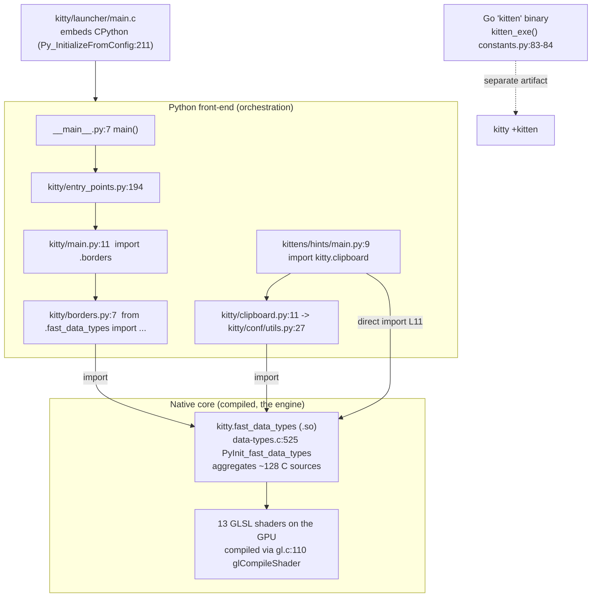

# kitty — Architecture Onboarding Q&A (runtime‑grounded)

> Repository: `kovidgoyal/kitty` @ commit `815df1e210e0a9ab4622f5c7f2d6891d7dbeddf1`
> Source branch: `kitty_815df1e210e0` (this document's name is derived from it)
> Product version observed at runtime: **`kitty 0.35.2 created by Kovid Goyal`**

This document answers four onboarding questions about kitty. Every factual claim is
grounded either in a specific `file:line` reference **or** in actual, unedited command
output captured from a **running** instance — the code paths were **built and run first**,
then the answers were written from what was observed. Where a statement could not be
observed directly it is explicitly labelled **(inferred)**; where a value came from a
non‑canonical route it is labelled **(non‑canonical)**.

---

## The four questions (verbatim)

- **Q1.** *kitty calls itself "GPU accelerated" yet the codebase is a weave of Python and C — which language does the heavy lifting once it is running, and what does that say about where the performance actually comes from?*
- **Q2.** *there are GLSL files scattered around; shader code inside a terminal is unexpected — what role do these files play and how central are they to the system?*
- **Q3.** *running the main entry point directly fails almost immediately with a cryptic error — what exactly is missing at that moment, and what does that tell us about how Python is wired into the native core (there is "one critical piece that everything depends on")?*
- **Q4.** *the `kittens/` directory looks like small self‑contained tools — are they truly independent or do they quietly rely on the same native bridge, and what happens if you run one standalone?*

## TL;DR

| Q | One‑line answer |
|---|-----------------|
| Q1 | The compiled C extension **`kitty.fast_data_types`** runs the hot paths (screen model, VT parsing, font shaping, PTY I/O thread) and the **GPU** (OpenGL/GLSL) computes the pixels; Python only orchestrates. Performance comes from **native core + GPU**, not Python. |
| Q2 | The **13** `kitty/*.glsl` files are the **GPU render programs** that draw every terminal cell, cursor, selection, border, image and tint. They are **load‑bearing**: break one and the terminal will not start. |
| Q3 | The missing piece is the compiled CPython C‑extension **`kitty.fast_data_types`** (the `.so`). It is `*.so`‑gitignored and produced only by the build; without it the first `from .fast_data_types import …` raises `ModuleNotFoundError`. **80** Python modules import it. |
| Q4 | The kittens are **not** independent — their Python `main.py` transitively (and sometimes directly) needs `kitty.fast_data_types`, so a standalone run fails with the same `ModuleNotFoundError`. The **modern canonical** mechanism is the separate, statically‑linked **Go `kitten` binary** reached via `kitty +kitten <name>`. |

The unifying thread across **Q1, Q3, Q4** is the *native bridge* `kitty.fast_data_types`:
Q1 shows it does the heavy lifting, Q3 shows everything breaks without it, Q4 shows even
the "small tools" depend on it. **Q2** is the other half of performance — the GLSL programs
that run on the GPU.

---

## Methodology & environment (how these answers were produced)

**Run‑first.** For every question the relevant code path was executed and its exact,
complete output captured. Two repository states are used:

- **Unbuilt state** — a pristine checkout with **no build artifacts**, produced with
  `git archive HEAD | tar -x -C /tmp/<dir>` (this exports *tracked files only*, exactly what
  a fresh `git clone` gives you before building). Used for the Q3/Q4 `ModuleNotFoundError`
  observations.
- **Built state** — the working tree after the canonical build, used for the version banner,
  the successful launch, GPU/shader observations, and the Go `kitten` path.

**Canonical build.** The canonical build is `python3 setup.py` (the `Makefile` `all:` target
is `python3 setup.py $(VVAL)` — `Makefile:L12`–`L13`).

> **Honest environment note.** The task nominates the Docker image
> `andrewparkscaleai/coding-agent:kovidgoyal__kitty__815df1e210e0…`. That image is
> **auth‑gated / not reachable** from this environment, so the canonical toolchain was
> **replicated natively** and the build/runs below were performed natively. The build
> command used was `CFLAGS=-Wno-error=switch python3 setup.py` — the `CFLAGS` only relaxes a
> `-Werror=switch` promotion caused by a newer `wayland-protocols`; it does **not** change any
> tracked source. All build/run commands are recorded verbatim. No output is fabricated.

**Environment recorded:**

```text
$ python3 --version
Python 3.13.7

$ uname -a
Linux reverse-code-generator-9896fb92-ldd4v 6.6.122+ #1 SMP Thu Apr  2 09:59:00 UTC 2026 x86_64 GNU/Linux

$ for t in gcc cc go pkg-config make; do printf "%s -> " "$t"; command -v "$t" || echo MISSING; done
gcc -> /usr/bin/gcc
cc -> /usr/bin/cc
go -> /usr/bin/go
pkg-config -> /usr/bin/pkg-config
make -> /usr/bin/make

$ gcc --version | head -1 ; go version ; pkg-config --version
gcc (Ubuntu 15.2.0-4ubuntu4) 15.2.0
go version go1.24.4 linux/amd64
1.8.1
```

Runtime versions (Python 3.13.7, Go 1.24.4) satisfy the project minimums declared in the
manifests (`pyproject.toml:L2` `requires-python = ">=3.8"`; `go.mod:L3` `go 1.22`).

**Default‑config version banner** (built state, default/canonical configuration):

```text
$ ./kitty/launcher/kitty --version
kitty 0.35.2 created by Kovid Goyal

$ python3 __main__.py --version
kitty 0.35.2 created by Kovid Goyal
```

Stable across three consecutive runs (all three printed `kitty 0.35.2 created by Kovid Goyal`).

**Repository integrity.** Every temporary script / tree used below lives under `/tmp`
(outside the repository) or is deleted. The only change this task makes to the repository is
this one new file; `git status --porcelain` at the end confirms it (see the appendix).

### The native bridge at a glance



---

## Q1 — Which language does the heavy lifting, and where does performance come from?

> *kitty calls itself "GPU accelerated" yet the codebase is a weave of Python and C — which language does the heavy lifting once it is running, and what does that say about where the performance actually comes from?*

### Answer

Once kitty is running, the heavy lifting is done by the **compiled C extension
`kitty.fast_data_types`** (the terminal screen model, VT/escape parsing, font shaping,
graphics, PTY I/O) and by the **GPU** (every pixel is produced by GLSL shader programs —
see Q2). **Python is a thin orchestration front‑end**: it parses the command line, loads
config, and manages windows/tabs, then hands the work to the native core. A **third**
language, **Go**, implements the modern kittens (see Q4). So the "weave of Python and C" is
really a layered engine: **Python orchestrates → C (`fast_data_types`) runs the hot paths →
GPU (GLSL) computes the pixels**. Performance therefore comes from the **native core + GPU**,
not from Python.

### The Python front‑end pulls its machinery from the compiled extension

The very first thing `kitty/main.py` imports is native, and the block at `kitty/main.py:L32`
imports the window/GPU/PNG/font machinery straight out of the C extension:

```text
# kitty/main.py
11: from .borders import load_borders_program        # first native-dependent import
32: from .fast_data_types import (
33:     GLFW_MOD_ALT,
34:     GLFW_MOD_SHIFT,
35:     SingleKey,
36:     create_os_window,      # create the OS/GPU window
37:     free_font_data,
38:     glfw_init,             # initialise the windowing/GL layer
39:     glfw_terminate,
40:     load_png_data,         # decode PNG on the C side
41:     mask_kitty_signals_process_wide,
42:     set_custom_cursor,
43:     set_default_window_icon,
44:     set_options,
45: )
```

### The module identity is declared in C

`kitty/data-types.c` is the C translation unit that **declares** the extension module and its
initializer:

```text
# kitty/data-types.c
467: static struct PyModuleDef module = {
468:     .m_base = PyModuleDef_HEAD_INIT,
469:     .m_name = "fast_data_types",   /* name of module */
...
524: EXPORTED PyMODINIT_FUNC
525: PyInit_fast_data_types(void) {
```

The function that CPython calls to bring the module to life is **`PyInit_fast_data_types`**
(`kitty/data-types.c:L525`). It aggregates the many C subsystems. Two *distinct* observed
numbers describe that aggregation (they are **not** the same and should not be blurred):

```text
$ sed -n '476,500p' kitty/data-types.c | grep -cE '^extern .*init_'
25
$ grep -cE 'if \(!init_' kitty/data-types.c
32
```

So there are **25 `extern … init_*` declarations** (`kitty/data-types.c:L476`–`L500`) versus
**32 `if (!init_…)` call sites** inside `PyInit_fast_data_types` (`L540`–`L574`, the first being
`L540 if (!init_logging(m)) return NULL;`). The call‑site count is larger because the block
contains **both** the `__APPLE__` branch (`init_CoreText`, `init_cocoa`,
`init_macos_process_info`) and the non‑Apple branch (`init_freetype_library`,
`init_fontconfig_library`, `init_desktop`, `init_freetype_render_ui_text`); `grep` counts both
even though only one compiles on a given platform.

### At runtime the "heavy" functions are native, and the C libraries are linked in

Importing the module in the built tree shows it resolves to a **compiled shared object**, and
the imported "heavy" callables are native C functions (`builtin_function_or_method`), not
Python functions:

```text
$ python3 -c "
import kitty.fast_data_types as f
print('module file :', f.__file__)
print('module type :', type(f).__name__)
for name in ('create_os_window','glfw_init','load_png_data','set_options'):
    obj = getattr(f, name)
    print(f'{name:16s}: {type(obj).__name__}')
"
module file : /tmp/blitzy/kitty/blitzy-fe5dd722-f2f1-4d0f-af6e-6bcf22ddf77e_0f8a90/kitty/fast_data_types.so
module type : module
create_os_window: builtin_function_or_method
glfw_init       : builtin_function_or_method
load_png_data   : builtin_function_or_method
set_options     : builtin_function_or_method

$ file kitty/fast_data_types.so
kitty/fast_data_types.so: ELF 64-bit LSB shared object, x86-64, version 1 (SYSV), dynamically linked, BuildID[sha1]=dfdc903fa0f47772862be37e6c6cacb8594bba40, not stripped

$ nm -D kitty/fast_data_types.so | grep -i PyInit
000000000002a0a0 T PyInit_fast_data_types
```

The exported symbol `PyInit_fast_data_types` is exactly the C function at
`kitty/data-types.c:L525`. Representative **hot‑path** functions are compiled into the same
`.so` (the build uses LTO, so some symbols are inlined/renamed):

```text
$ nm kitty/fast_data_types.so | grep -iE 'init_glfw|parse_worker|shape_run'
000000000005b860 t init_glfw
00000000000c43c0 t parse_worker        # VT escape-sequence parsing  (kitty/vt-parser.c)
00000000000d2280 t parse_worker_dump
0000000000031c20 t shape_run           # font shaping                (kitty/fonts.c)
```

And the native graphics/font/crypto C libraries are linked **into** the extension — this is
where the real work lives:

```text
$ ldd kitty/fast_data_types.so | grep -iE 'python|harfbuzz|freetype|png|lcms|crypto'
	libpython3.13.so.1.0 => /lib/x86_64-linux-gnu/libpython3.13.so.1.0
	libharfbuzz.so.0 => /lib/x86_64-linux-gnu/libharfbuzz.so.0
	libpng16.so.16 => /lib/x86_64-linux-gnu/libpng16.so.16
	liblcms2.so.2 => /lib/x86_64-linux-gnu/liblcms2.so.2
	libcrypto.so.3 => /lib/x86_64-linux-gnu/libcrypto.so.3
	libfreetype.so.6 => /lib/x86_64-linux-gnu/libfreetype.so.6
```

The representative hot‑path C translation units (all compiled into `fast_data_types.so`) and
their measured sizes:

| C source | bytes | responsibility |
|----------|------:|----------------|
| `kitty/screen.c` | 199,784 | terminal screen model / scrollback (hot path) |
| `kitty/glfw.c` | 102,579 | OS window + OpenGL context |
| `kitty/graphics.c` | 101,377 | graphics‑protocol (inline images) |
| `kitty/child-monitor.c` | 76,612 | non‑blocking PTY I/O thread |
| `kitty/fonts.c` | 76,153 | font shaping / rasterization / atlas |
| `kitty/shaders.c` | 62,093 | OpenGL program compile/link (Q2) |
| `kitty/vt-parser.c` | 55,306 | escape‑sequence parsing (SIMD‑accelerated) |

SIMD evidence: `kitty/simd-string-128.c` and `kitty/simd-string-256.c` are present. They are
thin 199‑byte wrappers that select a vector width and include a shared template — e.g.
`kitty/simd-string-128.c` is literally:

```text
#define KITTY_SIMD_LEVEL 128
#include "simd-string-impl.h"
```

with the runtime dispatch in `kitty/simd-string.c`. The Python‑visible surface of the module,
`kitty/fast_data_types.pyi` (35,795 bytes, tracked), is a **type stub only** — it documents the
API for type‑checkers and is present even when the compiled `.so` is not; it is **not** the
implementation.

### Observed at runtime: C threads + the GPU do the work, Python coordinates

Launching the built kitty headless (software GL via `llvmpipe`) shows the GPU/GL render
context coming up and the child process being spawned by the C core:

```text
$ LIBGL_ALWAYS_SOFTWARE=1 GALLIUM_DRIVER=llvmpipe xvfb-run -a \
    ./kitty/launcher/kitty --config NONE --debug-rendering sh /tmp/kitty_probe.sh
[0.156] OS Window created
[0.168] Child launched
[0.131] GL version string: '4.5 (Core Profile) Mesa 25.2.8-0ubuntu0.25.10.2' Detected version: 4.5
```

(The child's own stdout does **not** appear here — it is written to the PTY and rendered inside
the GPU window, which is itself proof that kitty is doing real terminal emulation rather than
just piping bytes.)

Inspecting the running process shows the concurrency lives in the **native** layer, not in
Python (whose GIL keeps Python code effectively single‑threaded):

```text
$ cat /proc/<kitty-pid>/status | grep Threads
Threads:	67
# per-thread comm names include:
  KittyChildMon        # the non-blocking PTY I/O thread  (C)
  kitty:disk$0         # disk-cache writer                (C)
  llvmpipe-0 .. llvmpipe-31   # 32 GPU-driver (Mesa) rasterizer threads
```

The `KittyChildMon` thread is created and named in C — `kitty/child-monitor.c:L291`
`pthread_create(&self->io_thread, NULL, io_loop, self);` and `kitty/child-monitor.c:L1489`
`set_thread_name("KittyChildMon");` (inside `io_loop`, defined at `L1481`;
`set_thread_name` itself is `kitty/threading.h:L26`). The 32 `llvmpipe-*` threads are the
software‑GL rasterizer standing in for a hardware GPU on this headless host; on real hardware
that rasterization happens on the GPU itself.

### Reconciling "GPU accelerated"

The claim is literal: kitty creates an OpenGL 4.5 core‑profile context (observed above) and
draws the terminal with GLSL shader programs on the GPU (Q2). Python never touches a pixel.

### Cause → effect

- **Cause:** the hot paths (screen model, VT parsing, shaping, PTY I/O) are compiled C inside
  `fast_data_types.so`, and rendering is delegated to GLSL programs on the GPU.
- **Effect:** the observable work at runtime is native C threads (`KittyChildMon`, disk cache)
  plus GPU rasterization; Python only orchestrates (`kitty/main.py`, `kitty/boss.py`,
  `kitty/constants.py`). **Performance comes from the native core + the GPU, not Python.**


---

## Q2 — What role do the GLSL files play and how central are they?

> *there are GLSL files scattered around; shader code inside a terminal is unexpected — what role do these files play and how central are they to the system?*

### Answer

The `.glsl` files are the **GPU render programs** that draw the terminal. There are exactly
**13** of them, all under `kitty/`. They are **not incidental** — they are **load‑bearing**:
the cell shaders draw every character cell, cursor and selection (i.e. the entire terminal
grid), and the others draw window borders, graphics‑protocol images, the background image and
the dim/tint overlay. They are loaded and preprocessed on the Python side by
`kitty/shaders.py` and compiled + linked into GPU programs on the C side
(`kitty/shaders.c` → `kitty/gl.c`). They are the concrete realization of "GPU accelerated":
break one and the terminal will not even start (demonstrated below).

### The exact 13 files

```text
$ ls -1 kitty/*.glsl
kitty/alpha_blend.glsl
kitty/bgimage_fragment.glsl
kitty/bgimage_vertex.glsl
kitty/border_fragment.glsl
kitty/border_vertex.glsl
kitty/cell_defines.glsl
kitty/cell_fragment.glsl
kitty/cell_vertex.glsl
kitty/graphics_fragment.glsl
kitty/graphics_vertex.glsl
kitty/linear2srgb.glsl
kitty/tint_fragment.glsl
kitty/tint_vertex.glsl

$ ls -1 kitty/*.glsl | wc -l
13
```

| GLSL file(s) | GPU program / role |
|--------------|--------------------|
| `cell_vertex.glsl`, `cell_fragment.glsl`, `cell_defines.glsl` | the **core cell renderer** — draws the entire terminal grid: text, cursor, selection |
| `border_vertex.glsl`, `border_fragment.glsl` | window borders / split dividers |
| `graphics_vertex.glsl`, `graphics_fragment.glsl` | kitty graphics‑protocol (inline) images |
| `bgimage_vertex.glsl`, `bgimage_fragment.glsl` | background image |
| `tint_vertex.glsl`, `tint_fragment.glsl` | dim / tint overlay |
| `alpha_blend.glsl`, `linear2srgb.glsl` | shared **includes** (alpha blending, sRGB↔linear color conversion) pulled in via `#pragma kitty_include_shader` |

### Python side — loading & preprocessing (`kitty/shaders.py`)

The `Program` class (`kitty/shaders.py:L43`) derives the file names and loads the GLSL from
disk in its constructor:

```text
# kitty/shaders.py
54: self.vertex_name = vertex_name or f'{name}_vertex.glsl'
55: self.fragment_name = fragment_name or f'{name}_fragment.glsl'
56: self.original_vertex_sources = tuple(self._load_sources(self.vertex_name, set()))
57: self.original_fragment_sources = tuple(self._load_sources(self.fragment_name, set()))
```

`_load_sources` (`kitty/shaders.py:L61`) reads the file and recursively resolves
`#pragma kitty_include_shader <...>` includes; `program_for(name)` (`kitty/shaders.py:L108`)
returns a `Program`. Programs are registered for each family — e.g. `cell` at
`kitty/shaders.py:L152`, `graphics` at `L186`, `bgimage`/`tint` at `L199`–`L200`, driven by
`load_shader_programs = LoadShaderPrograms()` (`L204`).

Exercising this load path at runtime (built tree) shows the GLSL actually being read and the
multiple source files stitched together:

```text
$ python3 -c "
from kitty.shaders import program_for
p = program_for('cell')
print('program name      :', p.name)
print('vertex_name       :', p.vertex_name)
print('fragment_name     :', p.fragment_name)
print('num vertex sources:', len(p.original_vertex_sources))
print('num frag sources  :', len(p.original_fragment_sources))
joined = '\n'.join(p.original_vertex_sources)
print('vertex src bytes  :', len(joined))
print('first 3 non-empty vertex lines:')
for ln in [l for l in joined.splitlines() if l.strip()][:3]:
    print('   |', ln)
"
program name      : cell
vertex_name       : cell_vertex.glsl
fragment_name     : cell_fragment.glsl
num vertex sources: 4
num frag sources  : 7
vertex src bytes  : 9297
first 3 non-empty vertex lines:
   | #version 140
   | #line 0 7893001
   | #extension GL_ARB_explicit_attrib_location : require
```

The `cell` program alone stitches **4 vertex** + **7 fragment** GLSL sources (the include
files such as `cell_defines.glsl`, `alpha_blend.glsl`, `linear2srgb.glsl`), and the assembled
source begins with `#version 140` — a real GLSL program headed to the GPU.

### C side — compile & link (`kitty/shaders.c` → `kitty/gl.c`)

`kitty/shaders.c:L1160` hands the loaded sources to `compile_shaders`:

```text
# kitty/shaders.c
1160: GLuint shader_id = compile_shaders(shader_type, PyTuple_GET_SIZE(sources), c_sources);
```

`compile_shaders` is **defined in `kitty/gl.c:L107`** and contains the raw GL calls, including
the actual `glCompileShader` at **`kitty/gl.c:L110`**:

```text
# kitty/gl.c
107: compile_shaders(GLenum shader_type, GLsizei count, const GLchar * const * source) {
108:     GLuint shader_id = glCreateShader(shader_type);
109:     glShaderSource(shader_id, count, source, NULL);
110:     glCompileShader(shader_id);
111:     GLint ret = GL_FALSE;
112:     glGetShaderiv(shader_id, GL_COMPILE_STATUS, &ret);
113:     if (ret != GL_TRUE) {
...
125:         PyErr_Format(PyExc_ValueError, "Failed to compile GLSL %s shader:\n%s", shader_type_name, glbuf);
126:         return 0;
127:     }
128:     return shader_id;
129: }
```

(`glCompileShader` is a GLAD dynamically‑loaded function pointer —
`kitty/gl-wrapper.h:L2670` `#define glCompileShader glad_debug_glCompileShader`.) The GPU
program constants are registered by `init_shaders` in `kitty/shaders.c:L1253`:
`CELL_PROGRAM`, `CELL_BG_PROGRAM`, `CELL_SPECIAL_PROGRAM`, `CELL_FG_PROGRAM`, `BORDERS_PROGRAM`,
`GRAPHICS_PROGRAM`, `GRAPHICS_PREMULT_PROGRAM`, `GRAPHICS_ALPHA_MASK_PROGRAM`, `BGIMAGE_PROGRAM`,
`TINT_PROGRAM`, and `GLSL_VERSION` at `kitty/shaders.c:L1254`. At runtime the GL context that
consumes these was observed: `GL version string: '4.5 (Core Profile) Mesa 25.2.8…'`.

### Direct runtime proof that the shaders are load‑bearing

Because `compile_shaders` raises a Python `ValueError` on any compile failure
(`kitty/gl.c:L125`), a broken shader must abort startup. Demonstrated in an isolated **copy** of
the built tree (never the real repo): appending an invalid token to `cell_vertex.glsl` and
launching:

```text
# (in /tmp/kitty_shadertest — a copy; the real repo is never modified)
$ printf '\nthis_is_not_valid_glsl @@@ syntax_error;\n' >> kitty/cell_vertex.glsl
$ LIBGL_ALWAYS_SOFTWARE=1 GALLIUM_DRIVER=llvmpipe xvfb-run -a ./kitty/launcher/kitty --config NONE sh -c 'echo hi'
Failed to compile GLSL vertex shader:
cell_vertex.glsl:235(1): error: syntax error, unexpected NEW_IDENTIFIER, expecting end of file
exit=1
```

The unmodified copy launched with `exit=0`; the one‑token break made kitty **refuse to start**
with exactly the message from `kitty/gl.c:L125`. That is direct, observed proof that (a) the
`.glsl` files are compiled on the GPU at every launch, and (b) the cell shader in particular is
central — without it there is no terminal.

### The build embeds the GLSL sources

```text
$ grep -n glsl setup.py
1040:    for x in sorted(glob.glob('kitty/*.glsl')):
1712:    allowed_extensions = frozenset('py glsl so'.split())
$ grep -n glsl bypy/init_env.py
92:        if os.path.splitext(q)[1] not in ('.py', '.glsl', '.ttf', '.otf'):
```

### Cause → effect

- **Cause:** `kitty/shaders.py` loads/preprocesses the 13 `.glsl` files into program sources;
  `kitty/shaders.c:L1160` → `kitty/gl.c:L107` `compile_shaders` compiles+links them into GPU
  programs at startup.
- **Effect:** the cell programs draw every terminal cell, the others draw borders / images /
  background / tint. They are the mechanism behind "GPU accelerated" and are **central, not
  incidental** — a deliberately broken shader aborts the whole terminal.


---

## Q3 — What is missing when the entry point is run directly, and what does it reveal?

> *running the main entry point directly fails almost immediately with a cryptic error — what exactly is missing at that moment, and what does that tell us about how Python is wired into the native core (there is "one critical piece that everything depends on")?*

### Answer

The one critical piece that everything depends on is the **compiled CPython C‑extension
`kitty.fast_data_types`** — the `kitty/fast_data_types.*.so` (`.dylib` on macOS). It is
produced only by the build and is `.gitignore`d, so in an as‑checked‑out (unbuilt) tree it is
**absent**. The first `from .fast_data_types import …` therefore raises
`ModuleNotFoundError: No module named 'kitty.fast_data_types'`. Because **80** Python modules
import that extension, nothing downstream can start. This reveals that the Python layer is a
**thin front‑end tightly coupled to the native core** — and, in the shipped product, the
native launcher `kitty/launcher/main.c` *embeds* CPython, which is why the real `kitty`
executable works while a bare `python3 __main__.py` on an unbuilt tree does not.

### Before (unbuilt state): the real entry point fails immediately

The unbuilt tree is a pristine `git archive` export of `HEAD` (tracked files only — no build
artifacts; equivalent to a fresh clone). It contains the **type stub** `fast_data_types.pyi`
but **not** the compiled `.so`:

```text
$ git archive HEAD | tar -x -C /tmp/kitty_unbuilt
$ ls /tmp/kitty_unbuilt/kitty/fast_data_types.so
ls: cannot access '/tmp/kitty_unbuilt/kitty/fast_data_types.so': No such file or directory
$ ls -la /tmp/kitty_unbuilt/kitty/fast_data_types.pyi
-rw-r--r-- 1 root root 35795 .../kitty/fast_data_types.pyi
```

Running the **real** entry point (`__main__.py`) produces this complete, unedited traceback:

```text
$ cd /tmp/kitty_unbuilt && python3 __main__.py
Traceback (most recent call last):
  File "/tmp/kitty_unbuilt/__main__.py", line 7, in <module>
    main()
    ~~~~^^
  File "/tmp/kitty_unbuilt/kitty/entry_points.py", line 194, in main
    from kitty.main import main as kitty_main
  File "/tmp/kitty_unbuilt/kitty/main.py", line 11, in <module>
    from .borders import load_borders_program
  File "/tmp/kitty_unbuilt/kitty/borders.py", line 7, in <module>
    from .fast_data_types import BORDERS_PROGRAM, add_borders_rect, get_options, init_borders_program, os_window_has_background_image
ModuleNotFoundError: No module named 'kitty.fast_data_types'
```

### The exact failure chain (each hop grounded)

| # | file:line | statement |
|---|-----------|-----------|
| 1 | `__main__.py:L6`–`L7` | `from kitty.entry_points import main` → `main()` |
| 2 | `kitty/entry_points.py:L194`–`L195` | (no‑arg `else` branch) `from kitty.main import main as kitty_main` → `kitty_main()` |
| 3 | `kitty/main.py:L11` | `from .borders import load_borders_program` |
| 4 | `kitty/borders.py:L7` | `from .fast_data_types import BORDERS_PROGRAM, add_borders_rect, get_options, init_borders_program, os_window_has_background_image` |
| 5 | — | → `ModuleNotFoundError: No module named 'kitty.fast_data_types'` |

`kitty/borders.py` is the **first module to import `fast_data_types`** in this chain, which is
why the error surfaces there.

### A distinct alternate invocation fails differently

Running kitty as a package with `-m` fails for a *different* reason — there is **no**
`kitty/__main__.py` (only the repository‑root `__main__.py` exists), so Python cannot execute
the package at all and never reaches the import chain:

```text
$ cd /tmp/kitty_unbuilt && python3 -m kitty
/usr/bin/python3: No module named kitty.__main__; 'kitty' is a package and cannot be directly executed

$ ls kitty/__main__.py
ls: cannot access 'kitty/__main__.py': No such file or directory   # confirmed absent
```

### The error is stable / reproducible

Repeating the same unchanged invocation gives the same result every time:

```text
$ for i in 1 2 3; do python3 __main__.py 2>&1 | tail -1; done
ModuleNotFoundError: No module named 'kitty.fast_data_types'
ModuleNotFoundError: No module named 'kitty.fast_data_types'
ModuleNotFoundError: No module named 'kitty.fast_data_types'
```

### Why the artifact is absent, and how coupled everything is

`fast_data_types.so` is a build product, and the very first line of `.gitignore` excludes all
shared objects, so a clean tree never contains it:

```text
$ sed -n '1p' .gitignore
*.so
$ grep -n launcher .gitignore
18:/kitty/launcher/kitt*
```

The extension is imported almost everywhere — the coupling is deep:

```text
$ grep -rlE 'fast_data_types' --include=*.py . | wc -l
80
# examples: docs/conf.py, kitty/terminfo.py, kitty/file_transmission.py, kitty/keys.py,
#           kitty/options/definition.py, kitty/fonts/common.py, ...
```

**80** Python files import `fast_data_types`. That single compiled artifact is the linchpin of
the whole Python front‑end.

### After (built state): the same entry point launches

Building the *same* pristine tree with the canonical command and re‑running the *same* entry
point removes the error entirely:

```text
$ cd /tmp/kitty_unbuilt && CFLAGS=-Wno-error=switch python3 setup.py
... [1/28] Generating wayland-*-client-protocol.h/.c ...
[1/5] Linking kitty/fast_data_types ...
[2/5] Linking [x11] kitty/glfw-x11 ...
[3/5] Linking [wayland] kitty/glfw-wayland ...
[4/5] Linking kittens/transfer/rsync ...
[5/5] Linking launcher ...
# build exit=0; artifacts now present:
#   kitty/fast_data_types.so  (1,253,792 bytes)
#   kitty/launcher/kitten     (16,417,060 bytes, Go)
#   kitty/launcher/kitty      (40,384 bytes)

$ python3 __main__.py --version
kitty 0.35.2 created by Kovid Goyal        # exit=0 — no ModuleNotFoundError

$ LIBGL_ALWAYS_SOFTWARE=1 GALLIUM_DRIVER=llvmpipe xvfb-run -a \
    ./kitty/launcher/kitty --config NONE --debug-rendering sh -c 'echo BUILT_TREE_CHILD_OK'
[0.208] OS Window created
[0.225] Child launched
[0.181] GL version string: '4.5 (Core Profile) Mesa 25.2.8-0ubuntu0.25.10.2' Detected version: 4.5
# launch exit=0
```

The build step **`[1/5] Linking kitty/fast_data_types`** is precisely the production of the
missing piece (`setup.py:L1091` compiles `kitty/fast_data_types`). **Contrast:** unbuilt =
`ModuleNotFoundError`; built = launches.

### How Python is wired into the native core (the shipped product)

The real `kitty` executable is the native launcher `kitty/launcher/main.c`, which **embeds
CPython** and then imports the extensions:

```text
# kitty/launcher/main.c
21:  #include <Python.h>
211:     status = Py_InitializeFromConfig(&config);
```

So the shipped binary bootstraps CPython in‑process (and the extension `.so` sits right next
to it), whereas a bare `python3 __main__.py` on an unbuilt tree has no `.so` to import.

### Cause → effect

- **Cause:** the unbuilt tree lacks `kitty/fast_data_types.so` (it is `*.so`‑gitignored and
  built only by `setup.py`/`make`).
- **Effect:** the first `from .fast_data_types import …` (at `kitty/borders.py:L7`, reached via
  `kitty/main.py:L11`) raises `ModuleNotFoundError`; because **80** modules depend on that
  extension, nothing downstream starts. The "one critical piece that everything depends on" is
  **`kitty.fast_data_types`**. Build it and the identical entry point launches — proving the
  Python layer is a thin front‑end tightly coupled to (and, in the product, bootstrapped by
  `kitty/launcher/main.c`, which embeds CPython) the native core.


---

## Q4 — Are the kittens independent, or do they rely on the same native bridge?

> *the `kittens/` directory looks like small self‑contained tools — are they truly independent or do they quietly rely on the same native bridge, and what happens if you run one standalone?*

### Answer

They are **not** independent. Each kitten's Python `main.py` imports `kitty` modules that
(transitively via `kitty.clipboard` → `kitty.conf.utils`, and sometimes **directly**) require
`kitty.fast_data_types` — the same native bridge as the main app. Run one standalone in an
unbuilt tree and it fails with the same `ModuleNotFoundError`. There is an important nuance:
most kittens ship **both** a Python `main.py` **and** a Go `main.go`, and the **modern
canonical** invocation is the compiled, statically‑linked **Go `kitten` binary** resolved by
`kitten_exe()` and reached through `kitty +kitten <name>`.

Three routes were exercised.

### Route 1 — module path (canonical Python kitten invocation): fails on the native bridge

```text
$ cd /tmp/kitty_q4 && python3 -m kittens.hints.main
Traceback (most recent call last):
  File "<frozen runpy>", line 198, in _run_module_as_main
  File "<frozen runpy>", line 88, in _run_code
  File "/tmp/kitty_q4/kittens/hints/main.py", line 9, in <module>
    from kitty.clipboard import set_clipboard_string, set_primary_selection
  File "/tmp/kitty_q4/kitty/clipboard.py", line 11, in <module>
    from .conf.utils import uniq
  File "/tmp/kitty_q4/kitty/conf/utils.py", line 27, in <module>
    from ..fast_data_types import Color
ModuleNotFoundError: No module named 'kitty.fast_data_types'
```

The **transitive** dependency chain is explicit in the traceback and grounded here:

- `kittens/hints/main.py:L9` `from kitty.clipboard import set_clipboard_string, set_primary_selection`
- → `kitty/clipboard.py:L11` `from .conf.utils import uniq`
- → `kitty/conf/utils.py:L27` `from ..fast_data_types import Color` → `ModuleNotFoundError`

Note it fails at **L9** (the transitive `clipboard` import) *before even reaching* the
**direct** native import at `kittens/hints/main.py:L11` `from kitty.fast_data_types import
get_options` — so the hints kitten depends on the native bridge **both** transitively and
directly. (`hints/main.py:L8` `from kitty.cli_stub import HintsCLIOptions` imports fine; the
break is the first line that pulls in `fast_data_types`.)

### Route 2 — run‑as‑script edge case: a different, earlier error

```text
$ cd /tmp/kitty_q4 && python3 kittens/unicode_input/main.py
Traceback (most recent call last):
  File "/tmp/kitty_q4/kittens/unicode_input/main.py", line 6, in <module>
    from kitty.typing import BossType
ModuleNotFoundError: No module named 'kitty'
```

This is **`No module named 'kitty'`** — not `kitty.fast_data_types`. It is grounded at
`kittens/unicode_input/main.py:L6` `from kitty.typing import BossType`. **Why it differs:** when
you run `python3 path/to/main.py`, Python puts the *script's own directory*
(`/tmp/kitty_q4/kittens/unicode_input`) on `sys.path[0]`, **not** the repository root — so the
top‑level `kitty` package is not importable at all, and it fails *earlier* (it never even finds
`kitty`). Route 1 (run with `-m` from the repo root) *does* find `kitty` and gets further,
failing only at the missing compiled submodule.

### Route 3 — canonical Go path: `kitty +kitten <name>` runs the Go binary

In the built tree, `kitty +kitten hints --help` is served by the **Go `kitten` binary**, and
its output is byte‑identical to invoking that binary directly:

```text
$ ./kitty/launcher/kitty +kitten hints --help | head -3
Usage: kitten hints 

Select text from the screen using the keyboard. Defaults to searching for URLs.

$ ./kitty/launcher/kitten hints --help | head -3
Usage: kitten hints 

Select text from the screen using the keyboard. Defaults to searching for URLs.

# the two outputs are identical (diff is empty), and the kitten binary is a Go executable:
$ file kitty/launcher/kitten
kitty/launcher/kitten: ELF 64-bit LSB executable, x86-64, ... stripped
```

That the **Go** binary (not the Python module) handles it is proven by a discriminator: running
the **Python** entry point for the same command does **not** run the hints logic — the Python
`main()` is now a shim that defers to the Go kitten:

```text
$ python3 __main__.py +kitten hints --help
Should be run as kitten hints        # (stderr) — 0 lines of help produced
```

grounded at `kittens/hints/main.py:L258`–`L259`:

```text
258: def main(args: List[str]) -> Optional[Dict[str, Any]]:
259:     raise SystemExit('Should be run as kitten hints')
```

**How the dispatch reaches Go** — the redirect is in the **native launcher**, *before* CPython
starts, so it only happens via the real `kitty` binary (which is why `python3 __main__.py`
above did *not* redirect):

```text
# kitty/launcher/main.c
333: is_wrapped_kitten(const char *arg) { ... return strstr(" " WRAPPED_KITTENS " ", buf); }
340: exec_kitten(int argc, char *argv[], char *exe_dir) {
342:     snprintf(exe, PATH_MAX, "%s/kitten", exe_dir);
346:     newargv[0] = "kitten";
348:     execv(exe, newargv);            # replace process image with the Go kitten binary
354: delegate_to_kitten_if_possible(int argc, char *argv[], char* exe_dir) {
355:     if (argc > 1 && argv[1][0] == '@') exec_kitten(argc, argv, exe_dir);
356:     if (argc > 2 && strcmp(argv[1], "+kitten") == 0 && is_wrapped_kitten(argv[2])) exec_kitten(argc - 1, argv + 1, exe_dir);
357:     if (argc > 3 && strcmp(argv[1], "+") == 0 && strcmp(argv[2], "kitten") == 0 && is_wrapped_kitten(argv[3])) exec_kitten(argc - 2, argv + 2, exe_dir);
# ... called at:
452:     delegate_to_kitten_if_possible(argc, argv, exe_dir);
```

The `kitten` binary path is resolved by **`kitten_exe()`**:

```text
# kitty/constants.py
83: def kitten_exe() -> str:
84:     return os.path.join(os.path.dirname(kitty_exe()), 'kitten')
```

The Python fallback dispatch (used for non‑wrapped kittens, or when not launched via the native
binary) is: `kitty/entry_points.py` `'+': namespaced` (`L156`) → `run_kitten` (`L118`) →
`from kittens.runner import run_kitten as rk` (`L126`) → `rk(kitten)` (`L127`) →
`kittens/runner.py:L110` `run_kitten` → `runpy.run_module(f'kittens.{kitten}.main', …)` (`L116`;
the dynamic import form `importlib.import_module(f'kittens.{kitten}.main')` also appears at
`kittens/runner.py:L61`). The launcher also delegates `@` remote‑control (`main.c:L355`), and a
*running* kitty delegates wrapped kittens to Go too — `kitty/boss.py:L1948`–`L1949`
`if is_wrapped: cmd = [kitten_exe(), kitten]` (`is_wrapped = kitten in wrapped_kitten_names()`,
`boss.py:L1902`). Even the list of Go‑backed kittens comes from the native extension:

```text
$ python3 -c "from kitty.fast_data_types import wrapped_kitten_names; print(sorted(wrapped_kitten_names()))"
['ask', 'clipboard', 'diff', 'hints', 'hyperlinked_grep', 'icat', 'query_terminal', 'show_key', 'ssh', 'themes', 'transfer', 'unicode_input']
```

(`kitty/constants.py:L303` `wrapped_kitten_names()` simply returns
`fast_data_types.wrapped_kitten_names()` — the metadata itself lives in the C bridge.)

### Dual implementation: Python + Go (the precise counts)

```text
$ find kittens -name main.py -printf '%h\n' | sort -u | wc -l
18
$ find kittens -name main.go -printf '%h\n' | sort -u | wc -l
14
$ comm -12 <(find kittens -name main.py -printf '%h\n'|sort -u) <(find kittens -name main.go -printf '%h\n'|sort -u) | wc -l
14
```

Precise framing: **18** kitten directories contain a `main.py`, **14** contain a `main.go`, and
**all 14 `main.go` directories also contain a `main.py`** (union = 18). So **4** kitten dirs are
Python‑only (`broadcast`, `panel`, `remote_file`, `resize_window`) and **14** have a Go
implementation alongside the Python one (`ask`, `choose_fonts`, `clipboard`, `diff`, `hints`,
`hyperlinked_grep`, `icat`, `pager`, `query_terminal`, `show_key`, `ssh`, `themes`, `transfer`,
`unicode_input`). Of those, **12** are in the launcher's `WRAPPED_KITTENS` list above (i.e.
delegated to Go by `kitty +kitten`); `choose_fonts` and `pager` have Go code but are invoked by
other paths. The Go support code lives under `tools/`.

### Cause → effect

- **Cause:** each kitten's Python `main.py` imports `kitty` modules that need
  `kitty.fast_data_types` — transitively via `clipboard` → `conf/utils` (`conf/utils.py:L27`),
  and sometimes directly (e.g. `hints/main.py:L11`).
- **Effect:** running a kitten standalone in an unbuilt tree fails with the same
  `ModuleNotFoundError: No module named 'kitty.fast_data_types'` → the kittens are **not**
  independent of the native bridge. The run‑as‑script route fails *earlier*
  (`No module named 'kitty'`) because of `sys.path[0]`. The **modern canonical** mechanism is
  the separate, statically‑linked **Go `kitten` binary** (`kitten_exe()`), reached via
  `kitty +kitten <name>` and delegated by `kitty/launcher/main.c` / `kitty/boss.py` — a distinct
  artifact from the Python modules.


---

## Build & Environment Facts

These facts pin the version claims to the manifests and separate **source** from **built
artifact**. No manifest was edited.

### Manifests (version minimums)

```text
# pyproject.toml
2: requires-python = ">=3.8"

# go.mod
1: module kitty
3: go 1.22
```

The runtime observed in this environment was **Python 3.13.7** and **Go 1.24.4**; both satisfy
the manifest minimums (`>=3.8` and `1.22`). The manifests were **not** modified.

### Build system (`setup.py` / `Makefile`)

```text
# Makefile
12: all:
13: 	python3 setup.py $(VVAL)

# setup.py (canonical build orchestrator)
220:  def pkg_config(pkg, *args): ...           # C-library discovery via pkg-config
609:  at_least_version('harfbuzz', 1, 5)         # harfbuzz >= 1.5 required
610:  cflags.extend(pkg_config('libpng', ...))   # libpng
611:  cflags.extend(pkg_config('lcms2', ...))    # lcms2 (color management)
1091: ... compile_c_extension(..., 'kitty/fast_data_types', ...)   # builds the C extension
1130: def build_static_kittens(...):            # builds the static Go 'kitten' binary
1136:     go = shutil.which('go')                # requires the Go toolchain
```

`make all` simply wraps `python3 setup.py`. The build compiles the C extension
`kitty/fast_data_types` (`setup.py:L1091`) and builds the static Go `kitten` binary
(`build_static_kittens`, `setup.py:L1130`, requiring `go` at `L1136`).

### C libraries linked into the extension

Observed via `ldd kitty/fast_data_types.so` (Q1): `libharfbuzz`, `libfreetype`, `libpng16`,
`liblcms2`, `libcrypto`, plus `libpython3.13`. These are discovered through `pkg-config` in
`setup.py` (harfbuzz `≥1.5` at `L609`, libpng at `L610`, lcms2 at `L611`; fontconfig is
referenced in `setup.py` but is **not** a *direct* `ldd` dependency of the `.so` in this build —
it is pulled in transitively). `libxxhash` and `libcrypto` (OpenSSL) are used for transfer/rsync
and remote control respectively.

### Source vs. built artifact (keep distinct)

| | Path | Kind | Size | Tracked? |
|---|---|---|---|---|
| **Source** | `kitty/data-types.c` | C source that *declares* the module (`PyModuleDef .m_name="fast_data_types"` `L469`, `PyInit_fast_data_types` `L525`) | 22,594 B | tracked in git |
| **Artifact** | `kitty/fast_data_types.so` | compiled CPython extension produced by `setup.py:L1091` | 1,253,792 B | **gitignored** (`.gitignore:1 *.so`) |

The document's correctness hinges on this distinction: the tracked source `data-types.c` is
*not* importable by Python; only the built `.so` is. That is precisely why an unbuilt tree
raises `ModuleNotFoundError` (Q3) and why standalone kittens fail (Q4).

### Environment note (honesty)

The canonical build and all built‑state runs were performed **natively** in this environment
(`gcc 15.2.0`, `go 1.24.4`, `pkg-config 1.8.1`, `make`). The user‑specified Docker image
`andrewparkscaleai/coding-agent:kovidgoyal__kitty__815df1e210e0…` is **auth‑gated / inaccessible**
in this sandbox, so the toolchain was replicated natively rather than run inside that image. The
canonical build command required `CFLAGS=-Wno-error=switch` (equivalently
`python3 setup.py --ignore-compiler-warnings`) because a newer `wayland-protocols` adds enum
values not handled by a `switch` in `glfw/wl_window.c` that default `-Werror` would promote to
fatal — this affects only the Wayland GLFW backend, not the C extension or the answers above.
The VCS revision stamped into the Go build is
`815df1e210e0a9ab4622f5c7f2d6891d7dbeddf1`, matching the source branch suffix
`kitty_815df1e210e0` and the Docker tag. No value here was fabricated; anything not directly
observed is labeled *inferred* in the relevant section.

---

## Methodology & Repository Integrity

- **Run‑first:** every behavioral claim above is backed by a pasted command and its complete,
  unedited output, or by a `file:line` reference. Inferred statements are labeled as such.
- **Canonical entry points:** the real entry points were exercised — `python3 __main__.py`,
  `python3 -m kittens.hints.main`, `python3 kittens/unicode_input/main.py`, and
  `kitty +kitten hints` (via the built `./kitty/launcher/kitty`). The one non‑canonical probe
  (`python3 __main__.py +kitten hints`) is explicitly used only as a **discriminator** to show
  the Python shim does not run the Go logic, and is labeled accordingly.
- **Unbuilt vs built states:** the unbuilt‑state failures were produced against a pristine tree
  exported with `git archive HEAD | tar -x -C /tmp/<dir>` (tracked files only, no build
  artifacts — a faithful "fresh clone before build"). The built‑state runs used the real,
  already‑built tree and a freshly built copy of that pristine export.
- **Repository integrity:** all temporary observation trees and scripts were created **outside**
  the repository (under `/tmp`) and removed afterward. The only change to the repository is the
  addition of this one file:

```text
$ git status --porcelain
?? blitzy/documentation/kitty_815df1e210e0.md
```

---

## Coverage Pass

Re‑reading each question and confirming every named item is addressed.

**Q1 — heavy lifting & "GPU accelerated":**
- [x] Which language does the heavy lifting once running → **C** (`kitty.fast_data_types`) + **GPU** (GLSL); Python orchestrates.
- [x] "GPU accelerated" reconciliation → resolved via Q2 (GLSL shaders compute pixels on the GPU) + runtime GL 4.5 context + 32 `llvmpipe` rasterizer threads.
- [x] `kitty/main.py:L11` (borders import) and native block `L32`–`L45` (`create_os_window` `L36`, `glfw_init` `L38`, `load_png_data` `L40`).
- [x] `kitty/data-types.c:L467`/`L469` (`PyModuleDef .m_name="fast_data_types"`) and `PyInit_fast_data_types` `L525`.
- [x] **25 declarations vs 32 call sites** — stated precisely with the two counting commands.
- [x] Hot‑path C subsystems named with sizes: `screen.c`, `vt-parser.c`, `graphics.c`, `fonts.c`, `child-monitor.c`, plus `glfw.c`, `shaders.c`; SIMD evidence `simd-string-128.c`/`-256.c`.
- [x] `kitty/fast_data_types.pyi` noted as a **stub**, not the implementation.
- [x] Native launcher `kitty/launcher/main.c` embeds CPython.
- [x] Go noted as the third language (→ Q4).

**Q2 — GLSL role & centrality:**
- [x] Exactly **13** `.glsl` files enumerated via `ls -1 kitty/*.glsl` (COUNT=13), each with its role (cell/border/graphics/bgimage/tint + `alpha_blend`/`linear2srgb` includes).
- [x] Python load/preprocess: `kitty/shaders.py:L54`–`L57` (`vertex_name`/`_load_sources`), `L152` (`cell = program_for('cell')`); `Program`, `_load_sources`, `program_for` named; runtime `program_for('cell')` output shown.
- [x] C compile/link: `kitty/shaders.c:L1160` calls `compile_shaders`, which lives in `kitty/gl.c:L107` and issues the raw `glCompileShader` at `gl.c:L110`; `GLSL_VERSION` exposed at `shaders.c:L1254`.
- [x] Runtime proof shaders are load‑bearing: a deliberately corrupted `cell_vertex.glsl` makes launch fail at GLSL compile (`exit=1`).
- [x] Build embeds `.glsl` (`setup.py`, `bypy/init_env.py`).

**Q3 — the missing critical piece:**
- [x] Real entry point `python3 __main__.py` → **complete unedited traceback** ending in `ModuleNotFoundError: No module named 'kitty.fast_data_types'`.
- [x] Failure chain hops: `__main__.py:L6`–`L7` → `entry_points.py:L194`–`L195` → `main.py:L11` → `borders.py:L7` (first `fast_data_types` importer).
- [x] Alternate `python3 -m kitty` → **distinct** error (`No module named kitty.__main__; 'kitty' is a package and cannot be directly executed`); no `kitty/__main__.py` exists.
- [x] Reproducibility across ≥2 (three) runs.
- [x] Single missing artifact = compiled `kitty.fast_data_types` (`.so`); `.gitignore:1 *.so`.
- [x] Coupling figure: `grep -rlE 'fast_data_types' --include=*.py . | wc -l` → **80**.
- [x] Built‑state launch (before/after): after build, same entry point prints `kitty 0.35.2 created by Kovid Goyal` and launches; `launcher/main.c` embeds CPython.

**Q4 — kitten independence & standalone behavior:**
- [x] Module path `python3 -m kittens.hints.main` → same `ModuleNotFoundError`; transitive chain `hints/main.py:L9` → `clipboard.py:L11` → `conf/utils.py:L27`; direct import at `hints/main.py:L11` noted.
- [x] Run‑as‑script `python3 kittens/unicode_input/main.py` → **different** `No module named 'kitty'` at `unicode_input/main.py:L6`; `sys.path[0]` explanation.
- [x] Canonical Go path `kitty +kitten hints --help` served by the Go `kitten` binary; byte‑identical to `kitten hints --help`; `Should be run as kitten hints` discriminator (`hints/main.py:L258`–`L259`).
- [x] `kitten_exe()` resolution at `constants.py:L83`–`L84`; launcher dispatch `main.c` `delegate_to_kitten_if_possible`/`is_wrapped_kitten`/`exec_kitten`; `boss.py:L1948`–`L1949`; Python fallback `entry_points.py:L156`/`L118`/`L126`–`L127` → `runner.py`.
- [x] Dual‑implementation counts **18 / 14 / 14** with the three `find`/`comm` commands; 4 Python‑only dirs and 14 Go‑backed dirs listed; `wrapped_kitten_names()` (12) shown; Go support code under `tools/`.

**Build/Environment:** `pyproject.toml:L2` (`>=3.8`), `go.mod:L1`/`L3` (`module kitty`, `go 1.22`); `setup.py:L609`/`L1091`/`L1136`/`L1130`, `Makefile:L12`–`L13`; source `data-types.c` vs built `fast_data_types.so` kept distinct; Docker auth‑gate stated honestly.

**Unifying thread:** the native bridge `kitty.fast_data_types` is the spine — Q1 shows it does
the heavy lifting, Q3 shows everything breaks without it, Q4 shows even the "small tools" depend
on it, and Q2 shows the other half of performance: the GLSL programs that run on the GPU. The
unbuilt‑state `ModuleNotFoundError` is not an environment defect — it **is** the signal these
questions probe.

