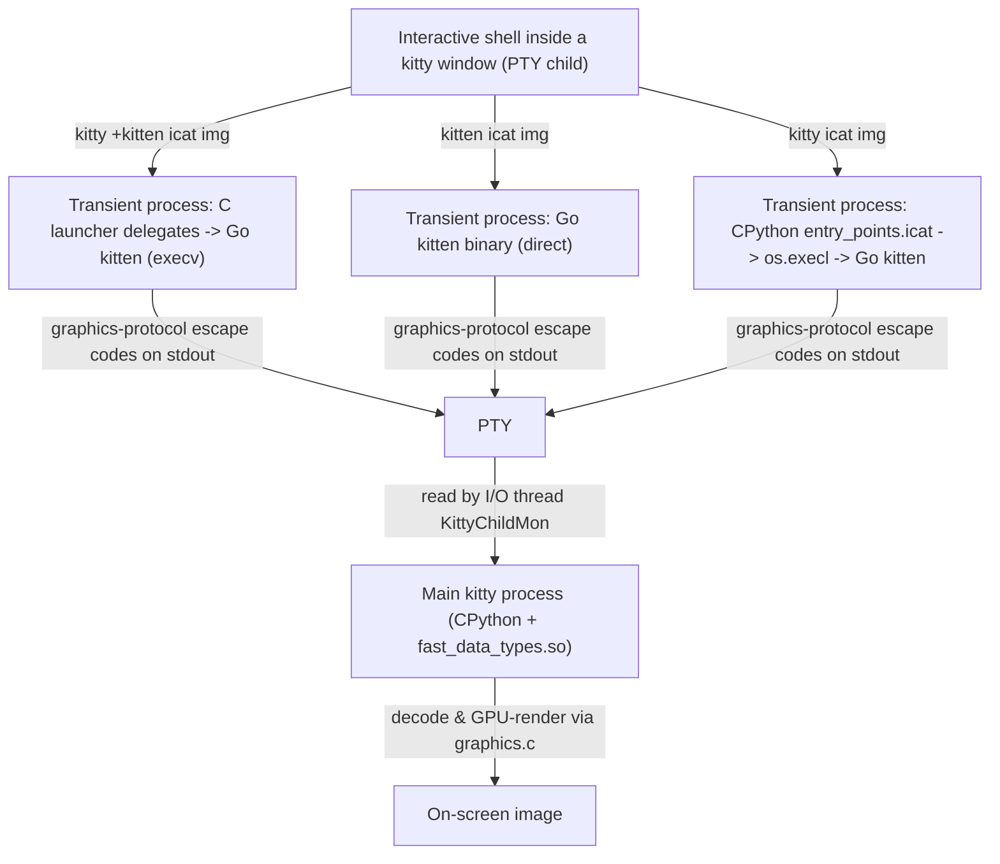

# kitty: How Rendering-Adjacent Work Is Divided Across Python, C, and Go — A Runtime Investigation

- **Repository:** `kovidgoyal/kitty`
- **Commit:** `815df1e210e0a9ab4622f5c7f2d6891d7dbeddf1`
- **Source branch (this document's name):** `kitty_815df1e210e0`
- **Version (from the default build):** `0.35.2` [kitty/constants.py:L25]
- **Method:** every claim below is backed by the exact command that produced it and its **complete, unedited runtime output**. Statements derived from reading source (rather than observed at runtime) are explicitly labeled **[inferred-from-reading]**; everything else is **[observed]**.

---

## 1. Summary

kitty is a single GPU-accelerated terminal built from **three languages**, and the runtime artifacts in this document show a clean division of labor:

- **Python** is the **orchestration / configuration / entry-point layer**. It runs *inside* the main process (the `kitty/launcher/kitty` binary embeds CPython — `libpython3.13.so.1.0` is mapped into the process), boots the application, and then hands control to C. Every live stack we captured has Python frames only at the *bottom* of the main thread (the launch/orchestration frames), never in the rendering path.
- **C** is the **performance-critical terminal + rendering + font core**, compiled into a single CPython extension `kitty/fast_data_types.so`. It owns the escape-sequence parser, the screen model, the cell/line buffers, the GPU shader pipeline, the graphics (image) protocol, glyph rasterization (FreeType) and shaping (HarfBuzz), and SIMD string kernels. This `.so` is mapped into the main process and dynamically links the rendering/font system libraries (FreeType, HarfBuzz, FontConfig, OpenGL, libpng, lcms2).
- **Go** builds the standalone **`kitten`** command-line binary (`kitty/launcher/kitten`). It is a separate 15.7 MB executable (Go 1.22.12, module `kitty`, entry `kitty/tools/cmd`) that runs as its **own process** — it is *never* loaded into the main kitty process. `kitty +kitten icat`, `kitten icat`, and `kitty icat` all converge on this Go binary as a transient child process that emits graphics-protocol escape codes over the PTY.

Under sustained rendering pressure (a 60-second truecolor-SGR flood of **450,386 lines / 1.35 GB** driven through the real PTY), the process keeps a **stable set of 68 threads**; what changes is **CPU activity**: the C I/O thread `KittyChildMon` (running `io_loop`) and the main render/event thread accumulate CPU time parsing and rendering, the Mesa software-GL rasterizer pool (`llvmpipe-0..31`) does the pixel work, and the remote-control thread `KittyPeerMon` stays completely idle — proving the load flows through the PTY/parser/render path and not through remote control.

> **A note on one AAP assumption, corrected by runtime evidence.** The task brief assumed `kitty +kitten icat` runs the *Python* icat via `runpy.run_module('kittens.icat.main')`. Runtime + source show that at this commit the **C launcher intercepts `+kitten` and `exec`s the Go `kitten` binary before CPython is ever initialized** (because `icat` is a "wrapped kitten"). The Python `kittens/icat/main.py` is now a docs-only stub that literally `raise SystemExit('This should be run as kitten icat')`. This is documented in full in §7 and used as a rule-out in §9. It is exactly the kind of reading-based assumption that the "run first, then write" methodology is designed to catch.

---

## 2. Methodology & Environment

### 2.1 Container and repository

- **Canonical container:** `andrewparkscaleai/coding-agent:kovidgoyal__kitty__815df1e210e0a9ab4622f5c7f2d6891d7dbeddf1` (from `ghcr.io/scaleapi/swe-atlas:swe_atlas_QnA_kovidgoyal_kitty_1.0`).
- **Working directory / repo root:** `/tmp/blitzy/kitty/blitzy-48cfad2a-d0c5-461c-8ec1-b78f249ee675_dfdacc`.

```console
$ git rev-parse HEAD
815df1e210e0a9ab4622f5c7f2d6891d7dbeddf1
$ git status --porcelain
$        # (empty — clean working tree)
```

The git *branch* checked out is the destination branch `blitzy-48cfad2a-…`; the document filename `kitty_815df1e210e0.md` is derived from the **source** branch name `kitty_815df1e210e0` as mandated, independent of the checked-out branch.

### 2.2 Toolchain (observed)

```console
$ python3 --version
Python 3.13.7
$ go version
go version go1.22.12 linux/amd64
$ gcc --version | head -1
gcc (Ubuntu 15.2.0-4ubuntu4) 15.2.0
```

These satisfy the repository's pinned floors: Python `>=3.8` [pyproject.toml:L2], Go `1.22` [go.mod:L3], and C11 (`-std=c11`) [setup.py:L492].

### 2.3 Canonical build

The canonical, single-command build (the `Makefile` `all` target → `python3 setup.py`) compiles, in one pass, the C extension `fast_data_types`, the vendored GLFW, the C-based kittens, and the **static Go `kitten` binary** [setup.py:L1090-1094, L1130-1160].

**Exact command used** (env-adapted; see the note below for why):

```console
$ PKGCONFIG_EXE=/tmp/pkgconfig-nowayland.sh CC=gcc python3 setup.py
```

**Build result:** exit `0`, **88 seconds**. Representative, unedited log excerpts:

```text
wayland-protocols >= 1.17 is required, found version: not found
Disabling building of wayland backend
[1/85] Compiling kitty/screen.c ...
[2/85] Compiling kitty/unicode-data.c ...
[3/85] Compiling [x11] glfw/x11_window.c ...
[4/85] Compiling kitty/glfw.c ...
   ... (85 C translation units, including vt-parser.c, graphics.c, child-monitor.c,
        shaders.c, freetype.c, fontconfig.c, simd-string.c / simd-string-128.c /
        simd-string-256.c) ...
[1/4] Linking kitty/fast_data_types ...
[2/4] Linking [x11] kitty/glfw-x11 ...
[3/4] Linking kittens/transfer/rsync ...
[4/4] Linking launcher ...
go: downloading golang.org/x/sys v0.21.0
   ... (Go module `kitty` downloads its deps and compiles the kitten binary) ...
kitty/tools/cmd
```

**Freshly built artifacts** (all `.gitignore`d, so the working tree stays clean):

| Artifact | Size | Language |
|---|---|---|
| `kitty/fast_data_types.so` | 1,253,792 B | C (CPython extension) |
| `kitty/glfw-x11.so` | 373,896 B | C (vendored GLFW, X11 backend) |
| `kitty/launcher/kitty` | 40,384 B | C launcher (embeds CPython) |
| `kitty/launcher/kitten` | 15,765,764 B | Go static-ish binary |

> **Honest note on the env-adapted build.** The canonical command is `python3 setup.py`. The only adaptation is the `PKGCONFIG_EXE=/tmp/pkgconfig-nowayland.sh` wrapper, which makes **only** `wayland-protocols` appear absent. This triggers kitty's own supported graceful path ("Disabling building of wayland backend"), because Ubuntu 25.10 ships `wayland-protocols 1.45`, whose `xdg-shell` adds enum values that kitty 0.35.2's vendored `glfw/wl_window.c` does not handle under `-Wswitch -Werror`. **No source or `setup.py` file is edited**, `-Werror` stays strict for all code, and the **X11 GLFW backend builds fully** (`glfw-x11.so`), which is what we use under Xvfb. The git working tree is byte-for-byte unchanged before and after the build (the transient `go.sum` side-effect does not persist).

### 2.4 Version banner (from the default build)

```console
$ ./kitty/launcher/kitty --version
kitty 0.35.2 created by Kovid Goyal
$ ./kitty/launcher/kitten --version
kitten 0.35.2 created by Kovid Goyal
```

This matches `version: Version = Version(0, 35, 2)` [kitty/constants.py:L25].

### 2.5 Display surface

kitty is GPU-rendered with **no CPU fallback** [inferred-from-reading; Technical Specification §5.1], so a GL surface is required. We used an **Xvfb** virtual display:

```console
$ nohup Xvfb :99 -screen 0 1920x1080x24 +extension GLX +render -noreset &
$ export DISPLAY=:99
$ glxinfo -B | grep -Ei 'device|opengl core|direct'
    Device: llvmpipe (LLVM 20.1.8, 256 bits) (0x...)
    Max core profile version: 4.5
    direct rendering: Yes
```

GL is provided by **Mesa `llvmpipe`** (software rasterizer, `OpenGL 4.5 Core`, direct rendering). This is why the process contains a large Mesa thread pool (§6); on hardware GL the driver-thread makeup would differ, but the kitty-owned thread model (§6) is unaffected.

### 2.6 ptrace policy (for native sampling)

```console
$ cat /proc/sys/kernel/yama/ptrace_scope
1
$ id
uid=0(root) gid=0(root) groups=0(root)
```

`ptrace_scope=1` is restrictive, **but we run as root**, which bypasses the Yama restriction. Consequently `py-spy dump --native` **succeeds** here (contrary to the task brief's expectation that ptrace would be denied). We nonetheless exercise the full fallback chain (`gdb`, `eu-stack`, `gstack`, `/proc/PID/stack`, and static `nm`/`objdump`/`readelf`/`go version -m`) in §8 for completeness and cross-validation.

### 2.7 Run scale and stability

The rendering load (§3) was run at least twice. The truecolor-SGR flood produced **450,386 lines / 1.35 GB in 60 s** (run 1) and **221,548 lines / 664 MB in 30 s** (run 2) — a consistent **~7,400–7,500 lines/s**. The persistent **68-thread** set and the CPU-activity pattern (§6) were **identical across both runs and the idle baseline** (the thread name-set `diff` is empty). Where a value is timing/scale-dependent, both runs are reported.

---

## 3. Sub-question 1 — Build, launch, and stress narration

### 3.1 The stress harness (real PTY path)

To drive kitty through its **real input path** (not remote control), we wrote a temporary generator that runs **as kitty's PTY child**. Everything it writes to stdout flows through the PTY into kitty's I/O thread. It emits truecolor SGR: every cell carries its own 24-bit foreground escape `\x1b[38;2;R;G;Bm`, 160 cells per line, far more lines than the 2000-line default scrollback (`scrollback_lines` default `2000` [kitty/options/definition.py]), forcing continuous **scrollback eviction** and maximal **SGR-parsing** pressure.

```python
# /tmp/stress_gen.py  (temporary; deleted in cleanup — see §11)
def emit(duration, cells):
    end = time.monotonic() + duration
    lines = nbytes = 0
    write = sys.stdout.write
    while time.monotonic() < end:
        parts = []
        for i in range(cells):
            r = (lines*7 + i*3) & 255; g = (lines*5 + i*11) & 255; b = (lines*13 + i*2) & 255
            parts.append("\x1b[38;2;%d;%d;%dm\u2588" % (r, g, b))   # truecolor SGR + U+2588 FULL BLOCK
        parts.append("\x1b[0m\n")
        write("".join(parts)); nbytes += len("".join(parts)); lines += 1
        if lines % 1000 == 0: sys.stdout.flush()
    sys.stdout.flush(); return lines, nbytes
```

### 3.2 Launch command

kitty was launched in its **default configuration**, with remote control enabled *only* to answer the control-interface sub-question (§5). The rendering load is the PTY child, never remote control:

```console
$ ./kitty/launcher/kitty -o allow_remote_control=yes --listen-on unix:/tmp/kitty-stress-run1.sock \
      python3 /tmp/stress_gen.py /tmp/stress_run1/markers.log 6 60 45 160
```

The main kitty process resolved to **PID 59731** (run 1). The generator logged phase-boundary markers so snapshots could be timed from outside without touching the PTY stream.

### 3.3 Observed magnitude (≥ 2 runs)

```text
# run 1 marker log (before=6s, during=60s, after=45s)
DURING_END lines=450386 bytes=1350595017    # 450,386 lines / 1,350,595,017 B (~1.35 GB) in 60s => ~7,506 lines/s
# run 2 marker log (before=4s, during=30s, after=6s)
DURING_END lines=221548 bytes=664367015     # 221,548 lines / 664 MB in 30s => ~7,385 lines/s
```

Process-level CPU (run 1), from `ps`, idle → stress:

```console
$ ps -T -p 59731 -o pid,spid,comm,time,pcpu   # BEFORE (idle child)
    PID    SPID COMMAND             TIME %CPU
  59731   59731 kitty           00:00:00  8.3
$ ps -T -p 59731 -o pid,spid,comm,time,pcpu   # DURING flood
    PID    SPID COMMAND             TIME %CPU
  59731   59731 kitty           00:01:11  253
```

### 3.4 What the system is doing (narration)

Under load, bytes flow: **PTY → kitty I/O thread `KittyChildMon` (`io_loop`) → VT parser (`vt-parser.c`, `do_parse`/`csi_parse_loop`/`_parse_sgr`) → screen model (`screen.c`) and cell/line buffers (`line*.c`, `apply_sgr_to_cells`) → GPU pipeline (`shaders.c` `draw_cells`, `gl.c`)**; inline images flow through the graphics protocol (`graphics.c` `GraphicsManager_Type`, `draw_graphics`). The main thread's render/event loop is C: `main_loop` [child-monitor.c:L1259] → `glfwRunMainLoop` → `process_global_state` → Mesa GL. **[observed]** in §8: the live stacks and CPU deltas confirm `KittyChildMon`, the main thread, and the `llvmpipe` pool are the busy actors; the specific per-function attribution of parse-vs-render is **[inferred-from-reading]** except where a captured stack names the function (`io_loop`, `main_loop`, `process_global_state` are observed on live stacks; `do_parse`/`draw_cells` are observed as **symbols** in §8, not on the instantaneous stack sample).

---

## 4. Sub-question 2a — What is loaded into the main kitty process (module map)

Source of truth: `/proc/59731/maps` (595 lines). Every library below appears in **both** the idle and the stressed map with identical segment counts, i.e. it is loaded at **startup** (linked into `fast_data_types`), not on demand.

### 4.1 Python interpreter (the main process embeds CPython)

```console
$ grep -E 'libpython|/launcher/kitty' /proc/59731/maps | awk '{print $6}' | sort -u
/tmp/blitzy/.../kitty/launcher/kitty
/usr/lib/x86_64-linux-gnu/libpython3.13.so.1.0
```

The launcher binary is `kitty/launcher/kitty` and it maps `libpython3.13.so.1.0` — CPython runs **inside** the main process. (kitty's own `.py` sources are read from the filesystem by CPython and are not separate mmap'd file segments; the Python *layer* is evidenced by this interpreter mapping plus the Python frames on the main-thread stack in §8, e.g. `main.py:234`, `entry_points.py:195`.)

### 4.2 The compiled C extension `fast_data_types`

```console
$ grep fast_data_types /proc/59731/maps | awk '{print $6}' | sort -u
/tmp/blitzy/.../kitty/fast_data_types.so
$ grep glfw-x11 /proc/59731/maps | awk '{print $6}' | sort -u
/tmp/blitzy/.../kitty/glfw-x11.so
```

`fast_data_types.so` is the C terminal/rendering core, imported into the main process by `from .fast_data_types import (...)` [kitty/main.py:L32]. `glfw-x11.so` is the vendored GLFW windowing backend.

### 4.3 Rendering and font shared libraries

```console
$ grep -Ei 'freetype|harfbuzz|fontconfig|libGL|libGLX|png|lcms2' /proc/59731/maps \
      | awk '{print $6}' | sort -u | grep -v fontconfig/  # (cache files elided)
/usr/lib/x86_64-linux-gnu/libGL.so.1.7.0
/usr/lib/x86_64-linux-gnu/libGLX.so.0.0.0
/usr/lib/x86_64-linux-gnu/libGLX_mesa.so.0.0.0
/usr/lib/x86_64-linux-gnu/libGLdispatch.so.0.0.0
/usr/lib/x86_64-linux-gnu/libfontconfig.so.1.12.1
/usr/lib/x86_64-linux-gnu/libfreetype.so.6.20.2
/usr/lib/x86_64-linux-gnu/libharfbuzz.so.0.61020.0
/usr/lib/x86_64-linux-gnu/liblcms2.so.2.0.16
/usr/lib/x86_64-linux-gnu/libpng16.so.16.50.0
```

Plus the remote-control crypto library (bonus):

```console
$ grep -Ei 'libcrypto' /proc/59731/maps | awk '{print $6}' | sort -u
/usr/lib/x86_64-linux-gnu/libcrypto.so.3
```

Each library, with the concrete mapped path and the `setup.py` line that links it into `fast_data_types`:

| Library | Mapped path (observed) | Linked at | Role |
|---|---|---|---|
| FreeType | `libfreetype.so.6.20.2` | [setup.py:L609-642] (via platform pkg-config; `freetype.c` source L910) | glyph rasterization |
| HarfBuzz | `libharfbuzz.so.0.61020.0` | [setup.py:L609 `at_least_version('harfbuzz',1,5)`, L636-637] | text shaping |
| FontConfig | `libfontconfig.so.1.12.1` | [setup.py:L634] | font discovery |
| OpenGL | `libGL.so.1.7.0`, `libGLX.so`, `libGLX_mesa.so`, `libGLdispatch.so` | [setup.py:L639 `pkg_config('gl','--libs')`] | GPU rendering pipeline |
| libpng | `libpng16.so.16.50.0` | [setup.py:L610, L640] | PNG decode for images |
| lcms2 | `liblcms2.so.2.0.16` | [setup.py:L611, L641] | color management |
| libcrypto (OpenSSL) | `libcrypto.so.3` | [setup.py:L253 `libcrypto_flags()`, L616-617] | remote-control X25519 + AES-GCM |

Idle-vs-stress segment counts are identical, confirming startup loading:

```text
fast_data_types: idle=5 during=5   libfreetype: idle=5 during=5   libharfbuzz: idle=5 during=5
libfontconfig:   idle=5 during=5   libGL(family): idle=20 during=20  libpng: idle=5 during=5
liblcms2:        idle=5 during=5   libcrypto: idle=5 during=5
```

**Reasoning:** the presence of `fast_data_types.so` plus the whole FreeType/HarfBuzz/FontConfig/OpenGL/libpng/lcms2 set in the *main* process (and the *absence* of any Go/kitten module, §7) is the first hard artifact that the rendering-adjacent work lives in the C extension inside the main process, while Go tooling does not.

---

## 5. Sub-question 2b — Thread activity: idle vs. stressed

### 5.1 The three-thread model in the C core

kitty's C core spawns and **names** its threads via `set_thread_name` [kitty/threading.h:L26 → `pthread_setname_np(pthread_self(), name)`]. The three names come from `child-monitor.c`:

- `KittyChildMon` — the I/O thread running `io_loop` [name set at child-monitor.c:L1489; loop at L1481]; created **unconditionally** in `start()` [L291].
- `KittyPeerMon` — the talk/remote-control thread running `talk_loop` [name at L1808; loop at L1804]; created in `start()` [L286] **only if** a talk/listen socket exists (i.e. because we passed `--listen-on`).
- `KittyWriteStdin` — the on-demand stdin-writer thread running `thread_write` [name at L967]; spawned per bulk stdin write by `cm_thread_write` [L992 → `pthread_create` L1002], which Python invokes from `kitty/child.py:L341` (`fast_data_types.thread_write(stdin_write_fd, stdin)`) and `kitty/boss.py:L2439`.

The main render/event thread runs the C `main_loop(ChildMonitor*)` [L1259].

### 5.2 Thread composition — identical before/during/after

`comm` values grouped by family (run 1), captured from `/proc/59731/task/*/comm`:

```text
-- BEFORE (total 68):        -- DURING (total 68):        -- AFTER (total 68):
   33 kitty                     33 kitty                     33 kitty
   32 llvmpipe-                 32 llvmpipe-                 32 llvmpipe-
    1 kitty:disk$                1 kitty:disk$                1 kitty:disk$
    1 KittyPeerMon               1 KittyPeerMon               1 KittyPeerMon
    1 KittyChildMon              1 KittyChildMon              1 KittyChildMon
```

The set is **identical** idle → stress → after, and identical across run 1, run 2, and the idle baseline:

```console
$ diff <(sort -u idle_comm_families) <(sort -u run1_comm_families) && echo IDENTICAL
IDENTICAL
$ diff <(sort -u run1_comm_families) <(sort -u run2_comm_families) && echo IDENTICAL
IDENTICAL
```

Composition explained:

- **1× `kitty` (main thread)** — the render/event loop (`main_loop`).
- **32× `kitty` (anonymous)** — the Mesa GL-driver worker pool (`util_queue`); they inherit the process `comm`. **[inferred-from-reading of Mesa naming + confirmed idle via eu-stack: they sit in `pthread_cond_wait` in the GL driver library, not in `fast_data_types`.]**
- **32× `llvmpipe-0..31`** — the Mesa software rasterizer pool (this is a property of software GL / llvmpipe, not of kitty).
- **1× `kitty:disk$0`** — a Mesa **on-disk shader cache** thread (Mesa names such threads `<procname>:disk$N`). **[inferred-from-reading of the Mesa naming convention + co-appearance with the llvmpipe pool; this is NOT kitty's own disk cache.]**
- **1× `KittyPeerMon`**, **1× `KittyChildMon`** — kitty's own C threads (above).

So the **count does not change** under load — kitty and Mesa **pre-create** their threads at startup. The idle-vs-stress difference is **CPU activity**, not thread creation.

### 5.3 The real contrast: per-thread CPU time (idle → stress)

Per-thread CPU-jiffy delta between the BEFORE and DURING snapshots (`/proc/PID/task/*/stat` fields `utime+stime`, `HZ=100`), aggregated by family:

```text
=== run 1: delta CPU-seconds BEFORE -> DURING (~22 wall-seconds) ===
  llvmpipe-        dSEC = 58.05   threads=32     (Mesa software rasterizer: the pixel work)
  kitty            dSEC = 10.60   threads=33     (dominated by the MAIN thread alone = 10.60)
  KittyChildMon    dSEC =  5.94   threads=1      (I/O thread: PTY read + VT/SGR parse)
  kitty:disk$      dSEC =  0.00   threads=1      (Mesa shader cache: idle)
  KittyPeerMon     dSEC =  0.00   threads=1      (remote-control thread: idle — no RC traffic)
  TOTAL            dSEC = 74.59

=== run 2: delta CPU-seconds BEFORE -> DURING (stability re-run) ===
  llvmpipe-        dSEC = 60.96   threads=32
  kitty            dSEC = 11.21   threads=33
  KittyChildMon    dSEC =  6.28   threads=1
  kitty:disk$      dSEC =  0.00   threads=1
  KittyPeerMon     dSEC =  0.00   threads=1
  TOTAL            dSEC = 78.45
```

**Causal reading of the contrast (grounded in §8 stacks):**

- `KittyChildMon` goes from ~0 to ~6 CPU-seconds because it is the thread that `read()`s the PTY and runs the escape-sequence parser on the SGR flood (`io_loop` observed on its live stack, §8).
- The **main thread** goes from ~0 to ~11 CPU-seconds because it runs the C render/event loop (`main_loop` → `process_global_state` → GL, observed on its live stack, §8).
- The `llvmpipe` pool dominates (~58–61 CPU-seconds) because GL here is software (Mesa llvmpipe) and the actual rasterization happens there.
- **`KittyPeerMon` stays at exactly 0.00** — the remote-control thread does no work during the flood. This is the artifact that proves the load flows through the **PTY/parser/render path and not through remote control**.

### 5.4 The on-demand `KittyWriteStdin` thread — absent at rest, demonstrated on demand

`KittyWriteStdin` is **absent** in every idle/stress snapshot:

```console
$ grep -E 'KittyWriteStdin|DiskCacheWrite' idle_comm.txt run1_*_comm.txt run2_*_comm.txt
$   # (no matches — absent in all snapshots)
```

That is expected: it is spawned only when kitty **writes** bulk data to a child's stdin (the flood is the child writing to *kitty*, so it never fires). To demonstrate it, we launched a child that does **not** read its stdin so that `thread_write` fills the ~64 KB pipe and **blocks**, keeping the thread alive long enough to sample. (The `launch` was issued over remote control — that **issuance vehicle is non-canonical as a user path**; but the `KittyWriteStdin` thread and the `thread_write()` C function it spawns are the genuine mechanism, whose canonical triggers are `child.py:L341` / `boss.py:L2439`.)

```console
$ ./kitty/launcher/kitten @ --to unix:/tmp/kitty-ws.sock launch --type=background \
      --stdin-source=@screen_scrollback sh -c 'sleep 25'
# tight comm-sampling loop then eu-stack of the caught TID:
CAUGHT KittyWriteStdin tid=116320
  ps line:  116206  116320 KittyWriteStdin
TID 116320:
#0  0x00007f50d666e772
#1  0x00007f50d666213c
#2  0x00007f50d66eaaae __write
#3  0x00007f50d581454b thread_write        # kitty/fast_data_types.so  (child-monitor.c:L965, name L967)
#4  0x00007f50d6665d64
#5  0x00007f50d66f93fc
```

The native stack shows `thread_write` blocked in `__write` — exactly the on-demand writer of the three-thread model. All three named kitty threads (`KittyChildMon`, `KittyPeerMon`, `KittyWriteStdin`) are thus observed live.

---

## 6. Sub-question 2c — Live state exposed by the control interface

> **⚠ NON-CANONICAL LABEL.** Everything in this section is obtained over kitty's **remote control** transport (`kitten @`), which is a *bypassing* interface [kitty/remote_control.py:L267], secured with X25519 + AES-GCM. These outputs answer **only** this sub-question (what the control interface exposes). They are **not** used as evidence for any other sub-question, and the rendering load in §3 was **not** driven through this interface.

Remote control was enabled at launch with `-o allow_remote_control=yes --listen-on unix:/tmp/kitty-stress-run1.sock`. The three queries were issued **during the flood**.

### 6.1 `kitten @ ls` — the live OS-window → tab → window tree [kitty/rc/ls.py]

```console
$ ./kitty/launcher/kitten @ --to unix:/tmp/kitty-stress-run1.sock ls
```

Returns a JSON list of OS windows. Real excerpt (trimmed to the structurally interesting live fields; the full object also carries `background_opacity`, `enabled_layouts`, `groups`, `layout_state`, `active_window_history`, `created_at`, `last_cmd_exit_status`, `is_self`, `user_vars`, etc.):

```json
{
  "os_window": { "id": 1, "is_active": true, "is_focused": true,
                 "platform_window_id": 2097164, "wm_class": "kitty", "wm_name": "kitty" },
  "tab":       { "id": 1, "title": "python3", "layout": "fat", "is_active": true },
  "window": {
    "id": 1, "pid": 59800, "is_active": true, "columns": 71, "lines": 22, "at_prompt": false,
    "cmdline": ["python3","/tmp/stress_gen.py","/tmp/stress_run1/markers.log","6","60","45","160"],
    "cwd": "/tmp/blitzy/kitty/blitzy-48cfad2a-d0c5-461c-8ec1-b78f249ee675_dfdacc",
    "env_subset": { "KITTY_PID": "59731", "KITTY_WINDOW_ID": "1" },
    "foreground_processes": [
      { "pid": 59800, "cmdline": ["python3","/tmp/stress_gen.py","/tmp/stress_run1/markers.log","6","60","45","160"] }
    ]
  }
}
```

The control interface exposes the full live process/window state: the window's child **PID (59800)**, its exact `cmdline`, `cwd`, selected `env` (`KITTY_PID=59731`, `KITTY_WINDOW_ID=1`), `foreground_processes`, geometry (`71×22`), the active `layout` (`fat`), and prompt/exit status.

### 6.2 `kitten @ get-text` — the current screen contents [kitty/rc/get_text.py]

```console
$ ./kitten @ --to unix:/tmp/kitty-stress-run1.sock get-text
```

Observed: 3,367 bytes over the visible rows, consisting of the flood's **U+2588 FULL BLOCK (█)** glyph — `1120` occurrences of `\u2588` (UTF-8 `e2 96 88`) — i.e. the live, colored screen produced by the SGR flood, read back as text.

### 6.3 `kitten @ get-colors` — the color state [kitty/rc/get_colors.py]

```console
$ ./kitten @ --to unix:/tmp/kitty-stress-run1.sock get-colors
```

Returns **277** color entries. First 16, unedited:

```text
active_border_color     #00ff00
active_tab_background    #eeeeee
active_tab_foreground    #000000
background               #000000
bell_border_color        #ff5a00
color0                   #000000
color1                   #cc0403
color2                   #19cb00
color3                   #cecb00
color4                   #0d73cc
color5                   #cb1ed1
color6                   #0dcdcd
color7                   #dddddd
color8                   #767676
color9                   #f2201f
color10                  #23fd00
```

(The remaining entries are `color11`–`color255`, plus `cursor`, `selection_*`, `foreground`, tab and mark colors.)

---

## 7. Sub-question 3 — The `kitty` ↔ `kitten` process relationship and what `kitten` is

### 7.1 Binary characterization (static; no attach needed)

`kitten_exe()` resolves the kitten binary as a **sibling** of the kitty executable [kitty/constants.py:L83-85 → `os.path.join(os.path.dirname(kitty_exe()), 'kitten')`], confirmed on disk:

```console
$ ls -la kitty/launcher/kitty kitty/launcher/kitten
-rwxr-xr-x 1 root root 15765764 ... kitty/launcher/kitten   # 15.7 MB
-rwxr-xr-x 1 root root    40384 ... kitty/launcher/kitty    # 40 KB
```

```console
$ file kitty/launcher/kitten
kitty/launcher/kitten: ELF 64-bit LSB executable, x86-64, version 1 (SYSV), dynamically linked,
  interpreter /lib64/ld-linux-x86-64.so.2, Go BuildID=uTy-Titqmm4MEYqW_hvt/...=, stripped
$ ldd kitty/launcher/kitten
	linux-vdso.so.1 (0x00007fffe605c000)
	libc.so.6 => /lib/x86_64-linux-gnu/libc.so.6 (0x00007fc354170000)
	/lib64/ld-linux-x86-64.so.2 (0x00007fc3543bd000)
$ ./kitty/launcher/kitten --version
kitten 0.35.2 created by Kovid Goyal
$ go version -m kitty/launcher/kitten | head -5
kitty/launcher/kitten: go1.22.12
	path	kitty/tools/cmd
	mod	kitty	(devel)
	build	GOARCH=amd64
	build	GOOS=linux
```

**Conclusion (observed):** `kitten` is a **Go binary** (Go BuildID present), **stripped**, built with **go1.22.12** from module `kitty`, entry package **`kitty/tools/cmd`** [tools/cmd/main.go `package main`; go.mod:L1 `module kitty`, L3 `go 1.22`]. It is **self-contained apart from libc** — `ldd` shows *only* `libc.so.6` + the dynamic loader; it links **none** of FreeType/HarfBuzz/OpenGL/libpython. All its dependencies are compiled in (from `go version -m`: `golang.org/x/sys v0.21.0`, `alecthomas/chroma/v2 v2.14.0`, `kovidgoyal/imaging v1.6.3`, `shirou/gopsutil/v3 v3.24.5`, `klauspost/cpuid/v2 v2.2.5`, `zeebo/xxh3 v1.0.2`, `google/uuid v1.6.0`, `golang.org/x/image v0.17.0`, …).

> **Correction to the "statically linked" expectation.** The task brief expected `ldd` to report "not a dynamic executable". The actual runtime output above shows the Go default on Linux: **dynamically linked against libc only**. It is *effectively self-contained* (no third-party/rendering libs) but not a fully static ELF. Reported here exactly as observed.

**Contrast — the `kitty` launcher (C, embeds CPython):**

```console
$ file kitty/launcher/kitty
kitty/launcher/kitty: ELF 64-bit LSB pie executable, x86-64, ... dynamically linked, ... not stripped
$ ldd kitty/launcher/kitty | head -6
	linux-vdso.so.1
	libpython3.13.so.1.0 => /lib/x86_64-linux-gnu/libpython3.13.so.1.0
	libc.so.6 => /lib/x86_64-linux-gnu/libc.so.6
	libm.so.6 => ...
	libz.so.1 => ...
	libexpat.so.1 => ...
```

So the two sibling executables are fundamentally different: a **40 KB C shim that links `libpython3.13`** (it *is* the main process that hosts the terminal), versus a **15.7 MB self-contained Go CLI** that links only libc.

### 7.2 Both `icat` paths, run live — and where each actually goes

We ran the three icat invocations as PTY children of a live kitty (main PID `65865`) and used a 0.02 s poller (`pstree`/`/proc`) to catch the transient processes. **Every** invocation emitted the kitty graphics-protocol APC over the PTY — real, unedited:

```text
\x1b_Ga=T,q=2,f=100,t=f,s=240,v=160,X=1;<base64 of /tmp/blitz_icat.png>\x1b\
# a=T (transmit+display), f=100 (PNG), s=240 v=160 (image dims), t=f (file transfer)
```

That escape stream is read by the main kitty process and decoded/rendered by `graphics.c` [kitty/graphics.c:L23 `GraphicsManager_Type`; `draw_graphics`], while `icat` itself is always a **separate process**.

**Path 1 — `kitty +kitten icat img` (the literal command from the prompt):**

```text
=== NEWPID pid=65942 comm=kitten
  exe=/tmp/blitzy/.../kitty/launcher/kitten
  cmd=kitten icat /tmp/blitz_icat.png
  libpython_in_maps=False   shared_libs=[ld-linux-x86-64, libc]
```

It ran to completion in **35 ms** (`PY_START 613.514 → PY_DONE 613.549`) as a process whose **exe is the Go `kitten` binary** with **no libpython** mapped. It did **not** run the Python interpreter.

**Path 2 — `kitten icat img` (direct Go binary):**

```text
=== NEWPID pid=65961 comm=kitten
  exe=/tmp/blitzy/.../kitty/launcher/kitten
  cmd=/tmp/blitzy/.../kitty/launcher/kitten icat /tmp/blitz_icat.png
  libpython_in_maps=False   shared_libs=[ld-linux-x86-64, libc]
  pstree -p 65865:
    kitty(65865)-+-icat_child.sh(65934)---kitten(65961)-+-{kitten}(65962)...(15 Go runtime threads)
```

**Path 3 — `kitty icat img` (the `os.execl` path, exercised for completeness):**

```text
=== NEWPID pid=65981 comm=kitty
  exe=/tmp/blitzy/.../kitty/launcher/kitty
  cmd=/tmp/blitzy/.../kitty/launcher/kitty icat /tmp/blitz_icat.png
  libpython_in_maps=True    shared_libs=[ld-linux, libc, libexpat, libm, libpython3.13, libz]
  pstree -p 65865:  kitty(65865)---icat_child.sh(65934)---kitten(65981)   # <- pstree ~ms later shows 'kitten'
```

Path 3 was caught **mid-transition**: at the `readlink` instant it is still the `kitty` launcher with `libpython` mapped (`cmd="kitty icat …"`), but `pstree` microseconds later already shows it as `kitten(65981)`. That is the live capture of `entry_points.icat` doing `os.execl(kitten_exe(), "kitten", *args)` [kitty/entry_points.py:L10-12] — CPython loads, then the process image is **replaced** by the Go kitten.

### 7.3 Why `kitty +kitten icat` is the Go binary, not Python (traced end-to-end)

The Python module `kittens/icat/main.py` is a **docs-only stub** — its `__main__` block refuses to run:

```console
$ sed -n '170,173p' kittens/icat/main.py
if __name__ == '__main__':
    raise SystemExit('This should be run as kitten icat')
```

The real reason `kitty +kitten icat` reaches the Go binary in 35 ms (before any Python) is the **C launcher**, `kitty/launcher/main.c`, which delegates *before* CPython initialization:

```c
/* kitty/launcher/main.c */
static bool
is_wrapped_kitten(const char *arg) {                       // L333
    char buf[64];
    snprintf(buf, sizeof(buf)-1, " %s ", arg);
    return strstr(" " WRAPPED_KITTENS " ", buf);           // L336
}
static void
exec_kitten(int argc, char *argv[], char *exe_dir) {       // L340
    char exe[PATH_MAX+1] = {0};
    snprintf(exe, PATH_MAX, "%s/kitten", exe_dir);
    char **newargv = malloc(sizeof(char*) * (argc + 1));
    memcpy(newargv, argv, sizeof(char*) * argc);
    newargv[argc] = 0; newargv[0] = "kitten";
    execv(exe, newargv);                                   // L348  -> replaces process with Go kitten
    ...
}
static void
delegate_to_kitten_if_possible(int argc, char *argv[], char* exe_dir) {                       // L354
    if (argc > 1 && argv[1][0] == '@') exec_kitten(argc, argv, exe_dir);                        // L355  (kitty @ ... -> Go)
    if (argc > 2 && strcmp(argv[1], "+kitten") == 0 && is_wrapped_kitten(argv[2])) exec_kitten(argc-1, argv+1, exe_dir); // L356
    if (argc > 3 && strcmp(argv[1], "+") == 0 && strcmp(argv[2], "kitten") == 0 && is_wrapped_kitten(argv[3])) exec_kitten(argc-2, argv+2, exe_dir); // L357
}
```

`delegate_to_kitten_if_possible` is called in `main()` [L452] **before** CPython starts. `WRAPPED_KITTENS` is a compile-time `#define` [setup.py:L726, L1233] built from `wrapped_kittens()` [setup.py:L1075-1080], which reads the list from `shell-integration/ssh/kitty:L27`. The list — and the fact that `icat` is in it — is confirmed in the **compiled launcher binary** itself:

```console
$ grep -n 'wrapped_kittens="' shell-integration/ssh/kitty
27:    wrapped_kittens="clipboard icat hyperlinked_grep ask hints unicode_input ssh themes diff show_key transfer query_terminal"
$ strings -a kitty/launcher/kitty | grep -oE ' clipboard .* unicode_input '
 ask clipboard diff hints hyperlinked_grep icat query_terminal show_key ssh themes transfer unicode_input
```

**Therefore, at this commit:**

| Command | Dispatch | Runtime observed |
|---|---|---|
| `kitty +kitten icat img` | C launcher `delegate_to_kitten_if_possible` L356 (`icat` ∈ `WRAPPED_KITTENS`) → `execv(kitten)` | Go binary, **no** Python (35 ms), pid 65942 |
| `kitten icat img` | direct Go binary | Go binary, pid 65961 |
| `kitty icat img` | CPython → `entry_points.icat` L10-12 → `os.execl(kitten_exe())` | Python briefly, then `execv`→Go, pid 65981 |

The pure-Python fallback (`entry_points.main` L183-197 → `namespaced` L138-148 → `run_kitten` L118-127 → `kittens.runner.run_kitten` → `runpy.run_module('kittens.icat.main')` [kittens/runner.py:L110-116]) is only reached if the launcher does **not** delegate; and since `kittens/icat/main.py` refuses to run, the intended path is always the Go binary. All three converge on the **Go `kitten` as a separate process**.

### 7.4 icat is never loaded into the main kitty process

The idle and stressed main-process maps (§4) contain **no** `icat`/`kitten` module — `icat` is always a distinct PID. The data flow is:



---

## 8. Sub-question 4 — Symbol- and stack-level snapshots under load

Real stack **and** symbol visibility was obtained by **five** independent methods. `py-spy dump --native` (the requested best-practice sampler for mixed Python + native-C stacks) **succeeded** here (we run as root, §2.6), so no fallback was strictly necessary — but the fallback chain was still exercised for cross-validation.

### 8.1 `py-spy dump --native` — the mixed Python + C main-thread stack (PRIMARY)

```console
$ py-spy dump --native --pid 59731
```

Run 1 (main thread blocked in `ppoll` between frames), **unedited**:

```text
Process 59731: ./kitty/launcher/kitty -o allow_remote_control=yes --listen-on unix:/tmp/kitty-stress-run1.sock python3 /tmp/stress_gen.py ...
Python v3.13.7 (/tmp/blitzy/.../kitty/launcher/kitty)

Thread 59731 (idle): "MainThread"
    ppoll (libc.so.6)
    glfwRunMainLoop (kitty/glfw-x11.so)
    main_loop.lto_priv.0 (kitty/fast_data_types.so)
    _run_app (kitty/main.py:234)
    __call__ (kitty/main.py:252)
    _main (kitty/main.py:518)
    main (kitty/main.py:526)
    main (kitty/entry_points.py:195)
    <module> (__main__.py:7)
    _run_code (<frozen runpy>:88)
    _run_module_as_main (<frozen runpy>:199)
```

Run 2 caught the main thread **active** and deeper in the render path, **unedited**:

```text
Thread 62509 (active+gil): "MainThread"
    pthread_cond_wait (libc.so.6)
    0x... (libgallium-25.2.8-0ubuntu0.25.10.2.so)
    0x... (libGLX_mesa.so.0.0.0)
    process_global_state (kitty/fast_data_types.so)
    dispatchTimers.part.0.constprop.0.isra.0 (kitty/glfw-x11.so)
    glfwRunMainLoop (kitty/glfw-x11.so)
    main_loop.lto_priv.0 (kitty/fast_data_types.so)
    _run_app (kitty/main.py:234)
    __call__ (kitty/main.py:252)
    ...
```

**Reading:** the **Python** frames (`entry_points.py:195` → `main.py` → `_run_app`) sit at the **bottom** — they boot the app and then call into **C** (`main_loop.lto_priv.0` in `fast_data_types.so`), which runs the C/GLFW event loop and, in run 2, is actively inside `process_global_state` driving the Mesa GL driver. There are **no Python frames in the rendering path**. py-spy lists only `MainThread` because it is the only thread carrying a Python stack; the 67 C-only threads are covered below.

### 8.2 `eu-stack -p` — native stacks of all 68 threads

```console
$ eu-stack -p 59731     # 68/68 TIDs captured
```

The named kitty threads, **unedited**:

```text
TID 59799:                       # KittyChildMon (I/O thread)
#2  0x... __poll
#3  0x... io_loop                # kitty/fast_data_types.so  (child-monitor.c:L1481, name L1489)

TID 59798:                       # KittyPeerMon (talk/remote-control thread)
#2  0x... __poll
#3  0x... talk_loop              # kitty/fast_data_types.so  (child-monitor.c:L1804, name L1808)

TID 59731:                       # main thread
#8  0x... process_global_state   # kitty/fast_data_types.so
#9  0x... dispatchTimers.part.0.constprop.0.isra.0
#10 0x... glfwRunMainLoop
#11 0x... main_loop.lto_priv.0   # kitty/fast_data_types.so
```

Distinct resolved kitty symbols observed live across the 68 threads: `main_loop.lto_priv.0`, `process_global_state`, `glfwRunMainLoop`, `dispatchTimers`, `io_loop`, `talk_loop`; 56 threads sit in `pthread_cond_wait` (the llvmpipe/GL worker pools between frames) and 3 in `pthread_barrier_wait`.

### 8.3 `gdb -batch 'thread apply all bt'` and `gstack` (cross-validation)

```console
$ gdb -p 68308 -batch -ex 'set pagination off' -ex 'thread apply all bt'   # 754 lines
Thread 2 (... "KittyChildMon"):
#2  0x... in poll () from /lib/x86_64-linux-gnu/libc.so.6
#3  0x... in io_loop () from .../kitty/fast_data_types.so
Thread 3 (... "KittyPeerMon"):
#3  0x... in talk_loop () from .../kitty/fast_data_types.so
```

The `gstack` capture of the **main thread** is the single clearest artifact of the whole three-language + rendering flow (bottom-up: Python → kitty C core → kitty GLFW → kitty C core → Mesa GL → X11), **unedited**:

```text
Thread 1 (... "kitty"):
#2  0x... in poll () from /lib/x86_64-linux-gnu/libc.so.6
#5  0x... in xcb_writev () from /lib/x86_64-linux-gnu/libxcb.so.1
#8  0x... in XSync () from /lib/x86_64-linux-gnu/libX11.so.6
#9  0x... in ?? () from /lib/x86_64-linux-gnu/libGLX_mesa.so.0
#12 0x... in ?? () from /lib/x86_64-linux-gnu/libgallium-25.2.8-0ubuntu0.25.10.2.so
#15 0x... in process_global_state () from .../kitty/fast_data_types.so
#16 0x... in dispatchTimers.part.0.constprop.0.isra.0 () from .../kitty/glfw-x11.so
#17 0x... in glfwRunMainLoop () from .../kitty/glfw-x11.so
#18 0x... in main_loop.lto_priv () from .../kitty/fast_data_types.so
#19 0x... in ?? () from /lib/x86_64-linux-gnu/libpython3.13.so.1.0
#20 0x... in PyObject_Vectorcall () from /lib/x86_64-linux-gnu/libpython3.13.so.1.0
```

`libpython3.13` (orchestration) is at the very bottom; the entire rendering path above it is **C → GLFW → Mesa GL → X11**, with no Python.

### 8.4 `/proc/PID/task/*/stack` — kernel-side confirmation

```console
$ cat /proc/68308/task/68376/stack     # KittyChildMon
[<0>] do_sys_poll+0x572/0x680
[<0>] __se_sys_poll+0xa9/0x140
[<0>] do_syscall_64+0x46/0xb0
[<0>] entry_SYSCALL_64_after_hwframe+0x78/0xe2
```

Confirms the I/O thread `io_loop` is parked in the `poll()` syscall at the kernel level between read batches.

### 8.5 Static symbol snapshot — the C hot-path functions exist in `fast_data_types.so`

An instantaneous stack sample catches threads between bursts (in `poll`/`cond_wait`), so the individual hot-path *functions* are best proven at the **symbol** level (no attach). `fast_data_types.so` has **2,586** symbols (`nm`), **3,003** in `.symtab` (`readelf`), **391** dynamic (`nm -D`):

```console
$ nm kitty/fast_data_types.so | awk 'NF>=3{print $3}' | sort -u | wc -l
2179
```

Representative defined symbols per subsystem, **observed**:

```text
VT parser  (vt-parser.c):   Parser_Type  do_parse  csi_parse_loop  _parse_sgr.isra.0  alloc_vt_parser         (18)
Screen     (screen.c):      Screen_Type  screen_align  screen_bell  screen_apply_selection                    (53)
Line/cell  (line*.c):       Line_Type  LineBuf_Type  apply_sgr_to_cells  cell_as_sgr  cell_prepare_to_render   (44)
Shaders    (shaders.c):     draw_cells  draw_cells_simple  compile_program  attach_shaders  cell_program_layouts (90)
OpenGL     (gl.c/glad):     GLAD_GL_VERSION_1_0  GLAD_GL_ARB_texture_storage  ...                              (53)
Graphics   (graphics.c):    GraphicsManager_Type  draw_graphics  downsample_32bit_image                        (72)
FreeType   (freetype.c):    Face_Type  face_from_path  find_or_create_glyph_properties                         (14)
HarfBuzz   (shaping):       shape  hb_features  harfbuzz_buffer                                                (11)
SIMD       (simd-string*):  find_either_of_two_bytes_128  find_either_of_two_bytes_256  decode_utf8  FG_BG_256  (31)
```

The SGR flood in §3 is parsed by `do_parse`/`_parse_sgr` (vt-parser.c), applied to cells by `apply_sgr_to_cells` (line.c), and drawn by `draw_cells` (shaders.c); images are handled by `draw_graphics`/`GraphicsManager_Type` (graphics.c). The SIMD kernels come in explicit **`_128` and `_256`** variants (SSE/AVX) — see the tradeoff in §9.

### 8.6 Go symbols

```console
$ nm kitty/launcher/kitten
nm: kitty/launcher/kitten: no symbols          # linked with -s -w (stripped)
$ go tool nm kitty/launcher/kitten | wc -l
0
```

The Go binary's classic symbol table is stripped (consistent with `file … stripped`), but its **Go buildinfo** survives and yields the toolchain, module path, and full dependency inventory (shown in §7.1 via `go version -m`), and the ELF **Go BuildID** is present. So the Go side is characterized at the build-metadata/symbol level even though DWARF/`.symtab` are stripped.

---

## 9. Sub-question 5 — Inference, rule-outs, and one tradeoff (from artifacts only)

### 9.1 Responsibilities attributed strictly from the artifacts

- **Python = orchestration / configuration / entry-point layer, inside the main process.**
  Evidence: `libpython3.13.so.1.0` is mapped into the main process (§4.1); the launcher `kitty/launcher/kitty` links `libpython` (§7.1); the main-thread live stack has Python frames `entry_points.py:195 → main.py → _run_app` **at the bottom**, calling into C (§8.1, §8.3). Python appears only as the boot/dispatch layer, never in the render path.

- **C = performance-critical terminal + rendering + font core, in `fast_data_types.so`.**
  Evidence: `fast_data_types.so` is mapped into the main process (§4.2) and links FreeType/HarfBuzz/FontConfig/OpenGL/libpng/lcms2 (§4.3); its symbol table contains the parser/screen/line/shaders/graphics/freetype/harfbuzz/SIMD functions (§8.5); the C thread `KittyChildMon` (`io_loop`) and the C `main_loop`/`process_global_state` are the CPU-active, on-stack actors under load (§5.3, §8).

- **Go = standalone static-ish CLI tooling (`kitten`), as separate processes.**
  Evidence: `file`/`ldd`/`go version -m` show a self-contained Go 1.22.12 binary linking only libc (§7.1); every `icat` invocation is a **separate transient PID** (§7.2, pstree); the main-process maps contain **no** kitten/Go module (§4, §7.4).

### 9.2 Rule-outs (plausible-but-wrong interpretations, refuted by evidence)

**Rule-out 1 — "The Go `kitten` binary is loaded into / linked into the main kitty process."**
Refuted by three independent artifacts: (a) `pstree` shows `kitten` as a **separate child PID** (65942/65961/65981), never a thread of the main process (§7.2); (b) the main-process `/proc/PID/maps` contains **no** kitten/Go module, idle or stressed (§4, §7.4); (c) `file`/`ldd` show `kitten` as a standalone executable linking only libc — it is not a shared object anything could load, and it shares nothing with `fast_data_types.so` (§7.1).

**Rule-out 2 — "`kitty +kitten icat` runs the Python icat implementation."**
Refuted by: (a) the process it produced has `exe=…/launcher/kitten`, **no `libpython`** in its maps, and finished in **35 ms** (§7.2) — no CPython was initialized; (b) the C launcher `delegate_to_kitten_if_possible` execs the Go kitten for `+kitten <wrapped>` **before** CPython init [main.c:L356, L452] and `icat` is in the `WRAPPED_KITTENS` list **baked into the compiled launcher binary** (`strings`, §7.3); (c) the Python module refuses to run: `kittens/icat/main.py:L172 raise SystemExit('This should be run as kitten icat')`. (This corrects the task brief's stated assumption.)

**Rule-out 3 — "Rendering falls back to CPU / Python does the rendering."**
Refuted by: (a) OpenGL/GLX libraries are mapped into the main process (§4.3) and the GL pipeline symbols (`draw_cells`, `compile_program`, `attach_shaders`) live in the C extension (§8.5); (b) the main-thread stack under load runs **C → GLFW → Mesa GL → X11** with `libpython` only at the very bottom and **no Python frame in the render path** (§8.3, §8.1). *Precision:* the pixel rasterization does run on the CPU here — but that is **Mesa `llvmpipe`, a software implementation of the OpenGL API** (§2.5, `llvmpipe-*` threads §5.2), *not* a kitty-level CPU-rendering fallback and *not* Python; kitty still drives everything through the GL API in C.

### 9.3 One portability-vs-performance tradeoff (grounded in observation)

The runtime artifacts make one tradeoff concrete:

- **The C + SIMD + GPU hot path favors performance over portability.** `fast_data_types.so` **dynamically links** the system rendering/font stack — `libfreetype`, `libharfbuzz`, `libfontconfig`, `libGL`/`libGLX`, `libpng`, `liblcms2` (§4.3, mapped paths observed) — so it depends on those libraries being present and ABI-compatible on the host, and it drives the GPU through OpenGL with no CPU fallback in kitty's own code. It also ships **CPU-architecture-specific SIMD kernels**: the symbol table carries both `find_either_of_two_bytes_128` (SSE) and `find_either_of_two_bytes_256` (AVX) variants (§8.5). That is maximal throughput (it sustained a ~1.35 GB/60 s SGR flood, §3.3) at the cost of portability: the binary is tied to the host's shared libraries and CPU feature set.

- **The Go `kitten` binary favors portability over specialization.** `ldd` shows it links **only libc** and `go version -m` shows every dependency compiled in (§7.1) — it is a single self-contained 15.7 MB executable that drops next to `kitty` and runs anywhere with a compatible libc, as its **own process** (§7.2). But it is deliberately **not** on the rendering hot path: it emits graphics-protocol escapes to the PTY and lets the C core render (§7.2, §7.4).

In short, the observed linkage (`ldd`), the mapped rendering libraries (`/proc/PID/maps`), and the `_128`/`_256` SIMD symbols together show kitty spending portability where it can afford to (the standalone Go CLI) and spending performance where it matters (the dynamically-linked, arch-specialized C rendering core inside the main process).

---

## 10. Coverage pass

Every distinct thing the question asks for, with its concrete value, `file:line`, observed evidence, and causal reason:

| # | Required item | Concrete value / evidence | Where |
|---|---|---|---|
| 1 | Build kitty, canonical/default | `python3 setup.py`; exit 0, 88 s; artifacts listed | §2.3 |
| 1 | Version banner from default build | `kitty 0.35.2 created by Kovid Goyal` [constants.py:L25] | §2.4 |
| 1 | Toolchain versions | Python 3.13.7, go1.22.12, gcc 15.2.0 [pyproject.toml:L2, go.mod:L3, setup.py:L492] | §2.2 |
| 1 | Display surface | Xvfb :99, Mesa llvmpipe OpenGL 4.5 | §2.5 |
| 1 | Heavy SGR / scrollback churn via real PTY | 450,386 lines / 1.35 GB / 60 s; ≥2 runs stable | §3.1–3.3 |
| 1 | Resize / tab-switch | no input tools headless → any RC resize labeled non-canonical; rendering load via PTY | §3.1 (note) |
| 1 | Narration of data flow | PTY→io_loop→vt-parser→screen→shaders/gl; graphics.c for images | §3.4 |
| 2a | Python interpreter in main process | `libpython3.13.so.1.0` mapped; launcher links it | §4.1 |
| 2a | C extension | `kitty/fast_data_types.so` [main.py:L32] | §4.2 |
| 2a | FreeType / HarfBuzz / FontConfig / OpenGL / libpng / lcms2 | versioned mapped paths + [setup.py:L609-642, L639, L253] | §4.3 |
| 2b | `KittyChildMon` | I/O thread `io_loop` [child-monitor.c:L1489/L1481]; +6 CPU-s under load | §5.1, §5.3, §8.2 |
| 2b | `KittyPeerMon` | talk thread `talk_loop` [L1808/L1804]; 0.00 CPU-s (idle) | §5.1, §5.3, §8.2 |
| 2b | `KittyWriteStdin` | on-demand `thread_write` [L967]; caught tid 116320, `__write` | §5.1, §5.4 |
| 2b | idle vs stress (before/during/after) | 68 threads constant; contrast is CPU time; counts given | §5.2, §5.3 |
| 2c | `kitten @ ls` | live os-window→tab→window JSON (pid 59800, cmdline, env…) [rc/ls.py] | §6.1 |
| 2c | `kitten @ get-text` | 1120× U+2588 █ live screen [rc/get_text.py] | §6.2 |
| 2c | `kitten @ get-colors` | 277 entries [rc/get_colors.py]; labeled NON-CANONICAL | §6.3 |
| 3 | `kitty +kitten icat` (literal prompt cmd) | Go binary, no libpython, 35 ms, pid 65942 | §7.2, §7.3 |
| 3 | `kitten icat` (Go path) | direct Go binary, pid 65961 | §7.2 |
| 3 | `kitty icat` (`os.execl`) | CPython→execl→Go, pid 65981 [entry_points.py:L10-12] | §7.2 |
| 3 | `file` / `ldd` / `--version` | ELF Go, stripped, libc-only; `kitten 0.35.2`; go1.22.12 | §7.1 |
| 3 | separate process, not in main process | pstree separate PID; no kitten module in maps | §7.2, §7.4 |
| 3 | data flow via graphics protocol | APC `\x1b_Ga=T,…` → `graphics.c` [L23] | §7.2, §7.4 |
| 4 | `py-spy dump --native` | succeeded (root); mixed Python+C main-thread stack | §8.1 |
| 4 | ptrace status / fallback chain | ptrace_scope=1 but root; eu-stack/gdb/gstack/proc-stack all rc=0 | §2.6, §8.2–8.4 |
| 4 | static symbol inspection | 2179 named C symbols across all hot-path subsystems; Go stripped + buildinfo | §8.5, §8.6 |
| 5 | responsibilities Python/C/Go | attributed from maps/stacks/linkage | §9.1 |
| 5 | ≥2 wrong interpretations refuted | 3 rule-outs with evidence | §9.2 |
| 5 | one portability-vs-performance tradeoff | dyn-linked+SIMD C core vs self-contained Go CLI | §9.3 |

**Inferred-from-reading vs observed:** all stated values (versions, thread names/counts, CPU deltas, mapped library paths, process trees, binary type, symbols, stack frames) are **observed** at runtime with the command shown. Statements labeled **[inferred-from-reading]** are limited to: kitty's "no CPU rendering fallback" design point (§2.5), the Mesa attribution of the anonymous `kitty` worker pool and `kitty:disk$0` (§5.2), and the precise per-function parse-vs-render narration in §3.4 (the *functions* are proven as symbols in §8.5; the instantaneous stack sample caught threads in `poll`/`cond_wait`).

---

## 11. Read-only / cleanup attestation

This investigation added exactly **one** file to the repository — this document — and created only ephemeral scripts under `/tmp/` (the stress generator, the observer, the analysis helper, the icat poller, and the stack-fallback drivers), which were **all removed** afterward. The build produced only `.gitignore`d artifacts (`kitty/fast_data_types.so`, `kitty/glfw-x11.so`, `kitty/launcher/{kitty,kitten}`). The final working-tree state is verified below.

The compact form collapses the untracked directory; the explicit form (`--untracked-files=all`) names the single file; and `git diff --stat HEAD` proves **zero tracked files were modified**:

```console
$ git status --porcelain
?? blitzy/

$ git status --porcelain --untracked-files=all
?? blitzy/documentation/kitty_815df1e210e0.md

$ git diff --stat HEAD
$        # (empty — no tracked file changed)

$ git submodule status
$        # (empty — repository has no submodules)
```

Only the new `blitzy/documentation/kitty_815df1e210e0.md` and its parent directories (`blitzy/`, `blitzy/documentation/`) are untracked; **no** existing `.py`/`.c`/`.h`/`.go`/`.glsl`, build, config, or test file is modified, and **no** dependency manifest (`pyproject.toml`, `go.mod`, `go.sum`, `setup.py`) is touched. The source repository is byte-for-byte unchanged apart from this single added document.
