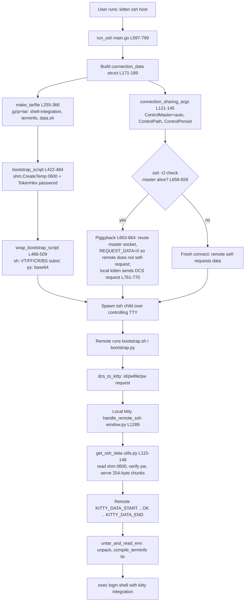

# How kitty's SSH kitten works, end-to-end

A code-grounded walkthrough of how `kitten ssh <host>` securely bootstraps kitty's
shell integration onto a remote host.

> **Repository revision.** All citations and observed values correspond to the kitty
> terminal emulator at HEAD commit `815df1e21` ("Wire up applying of font config").
> Every behavioral claim below carries a `file:line` reference or a quoted, verbatim
> observed output. External standards (SSH multiplexing, POSIX `shm_open`) are covered
> in a clearly-marked [Background](#background-external-concepts) section and are *not*
> given `file:line` citations because they are not defined in this codebase.

## Methodology (built and ran first)

Per the governing rule, the relevant code paths were **built and executed before** this
document was written, and the real output was captured and is quoted verbatim throughout
(and collected in the [Observed Output appendix](#observed-output-appendix)).

- The project was built with the canonical mixed Python + C + Go build
  (`python3 setup.py build`), producing `kitty/launcher/kitten`. Running
  `./kitty/launcher/kitten --version` printed **`kitten 0.35.2 created by Kovid Goyal`**,
  which matches `version: Version = Version(0, 35, 2)` at `kitty/constants.py:25`. The
  full `setup.py build` is required (not just `go build`) because Go code generation
  runs via `kitty +launch`, which depends on the built C extension
  `kitty/fast_data_types.so` — without it the Go packages do not compile (they import the
  generated root `kitty` package).
- The studied Go test suites were run with `go test -count=1 ./kittens/ssh/ ./tools/utils/shm/`,
  which printed **`ok  \tkitty/kittens/ssh\t0.051s`** and **`ok  \tkitty/tools/utils/shm\t0.005s`**.
- The security-sensitive mechanics (the per-shell control-character substitution and the
  shared-memory create/permission semantics) were reproduced with small throwaway scripts;
  their verbatim output is quoted inline and in the appendix.
- Observed toolchain: `go version go1.22.12 linux/amd64`, `Python 3.13.7`,
  `gcc-13 (Ubuntu 13.4.0-4ubuntu1) 13.4.0`. `go.mod` requires `go 1.22` (`go.mod:3`) and
  `pyproject.toml` requires Python `>=3.8`, so these satisfy the project's requirements.
  (Note: the plan anticipated Python 3.12.x; the environment actually provided 3.13.7. The
  real observed value is reported here rather than the anticipated one.)

## Where the logic lives (three layers)

The SSH kitten spans **three layers**, and this document deliberately covers all three:

1. **The modern Go client kitten** — `kittens/ssh/*.go` plus the shared primitives in
   `tools/utils/shm`, `tools/utils/paths.go`, `tools/utils/secrets`, and `tools/tui`. This
   is where the orchestration, archive assembly, bootstrap generation, encoding, connection
   sharing, and shared-memory writing happen.
2. **The remote-side scripts** — `shell-integration/ssh/bootstrap.sh` (POSIX `sh`) and
   `shell-integration/ssh/bootstrap.py` (Python), assisted by
   `shell-integration/ssh/bootstrap-utils.sh`. These execute *on the remote host*, request
   the data, unpack it, compile terminfo, and re-exec the login shell with integration.
3. **The local kitty serving handler (Python)** — `kitty/window.py`
   (`handle_remote_ssh`), `kittens/ssh/utils.py` (`get_ssh_data`,
   `read_data_from_shared_memory`), and the `kitty/shm.py` wrapper. This runs inside the
   local kitty terminal and answers the remote's data request over the controlling TTY.

**Important framing:** the *live* behavioral logic is in **Go**, not Python. The Python
module `kittens/ssh/main.py` is an **options/help stub** used only for the config schema and
documentation generation — its `main()` at `kittens/ssh/main.py:224` simply does
`raise SystemExit('This should be run as kitten ssh')`. Accordingly, the behavioral answers
below center on the Go client, the remote scripts, and the Python *serving* handler
(`kittens/ssh/utils.py` / `kitty/window.py`) — not on the stub.

## End-to-end overview (answers Q7 at a glance)

When a user runs `kitten ssh <host>`, the Go orchestrator `run_ssh`
(`kittens/ssh/main.go:597`, through ~L799) drives the entire flow. It builds a
per-connection `connection_data` struct, assembles an in-memory gzip+tar archive of the
shell-integration files, generates a bootstrap script that carries only *identifiers* (not
the bulk data), writes the actual payload (tarball + password) into a POSIX shared-memory
object owned `0600`, encodes the bootstrap for the target interpreter, and spawns `ssh` over
the controlling TTY. On the remote, `bootstrap.sh`/`bootstrap.py` request the data back from
the *local* terminal using an in-band DCS escape sequence; the local kitty answers by reading
the shared-memory object (re-validating ownership and permissions and matching a password),
then streams the tarball in 254-byte chunks. The remote untars it, compiles terminfo, and
`exec`s the user's login shell with kitty integration enabled.



The nine questions below are each answered in a dedicated, independently-readable subsection,
followed by an [Observed Output appendix](#observed-output-appendix), a
[Background](#background-external-concepts) section for the two external standards, and a
[Coverage pass](#coverage-pass) confirming every sub-question is addressed.

---

## Q1 — How shared memory passes the credentials (data password + request id) securely between the local kitten and the local kitty terminal

**Answer.** The kitten never puts the secret payload on the command line or in the
environment. Instead it serializes everything into JSON, writes that JSON into a POSIX
**shared-memory object** created owner-only (`0600`) on the local machine, and passes only
three small *identifiers* to the remote: a **request id**, the **shm filename**, and a
per-connection **data password**. The remote echoes those identifiers back to the *local*
kitty terminal, which opens the shm object, re-validates it, checks the password and request
id, and only then serves the bulk data. The shm object is **read once and unlinked**.

**The write path (in `bootstrap_script`, `kittens/ssh/main.go:422-484`).**

- The **data password** is generated per connection by `secrets.TokenHex()` at
  `kittens/ssh/main.go:431`. Its definition is `func TokenHex(nbytes ...int) (string, error)`
  at `tools/utils/secrets/tokens.go:28`, which hex-encodes random bytes from `TokenBytes`
  (`tools/utils/secrets/tokens.go:16`, filled by `crypto/rand`'s `rand.Read`). The default
  size is `DEFAULT_NUM_OF_BYTES_FOR_TOKEN = 32` (`tools/utils/secrets/tokens.go:14`), i.e. a
  64-hex-character password.
- The archive plus password is packed into a JSON object whose keys are `tarfile`
  (base64 of the tarball), `pw`, `hostname`, and `username`
  (`kittens/ssh/main.go:440-442`).
- That JSON is written to shared memory:
  `data_shm, err = shm.CreateTemp(fmt.Sprintf("kssh-%d-", os.Getpid()), uint64(len(encoded_data)+8))`
  at `kittens/ssh/main.go:446`, followed by `shm.WriteWithSize(data_shm, encoded_data, 0)`
  (`kittens/ssh/main.go:448`) and `data_shm.Flush()` (`kittens/ssh/main.go:450`). The object's
  name is stored as `cd.shm_name = data_shm.Name()` (`kittens/ssh/main.go:458`).
- The **request id** defaults to `KITTY_PID + "-" + KITTY_WINDOW_ID`:
  `cd.request_id = os.Getenv("KITTY_PID") + "-" + os.Getenv("KITTY_WINDOW_ID")`
  (`kittens/ssh/main.go:424`).
- The three identifiers are injected into the bootstrap template through the sensitive
  replacements map
  `sensitive_data := map[string]string{"REQUEST_ID": cd.request_id, "DATA_PASSWORD": pw, "PASSWORD_FILENAME": cd.shm_name}`
  at `kittens/ssh/main.go:460`.

**The read path (local kitty terminal, `kittens/ssh/utils.py`).** When the remote echoes the
identifiers back (see [Q9](#q9--the-terminal--remote-dcs-requestresponse-handshake-over-the-controlling-tty)),
the local kitty terminal reads the shm object via `read_data_from_shared_memory`
(`kittens/ssh/utils.py:100-112`) — which validates ownership/permissions (see
[Q8](#q8--the-shared-memory-security-model)) — and then `get_ssh_data`
(`kittens/ssh/utils.py:115-148`) checks that the echoed `pw` equals `env_data['pw']` (else
`raise ValueError('Incorrect password')`, `kittens/ssh/utils.py:131`) and that the echoed `id`
equals the current window's `KITTY_PID-KITTY_WINDOW_ID`. The Go reader side
`read_data_from_shared_memory` (`kittens/ssh/main.go:72-85`) reads via
`shm.ReadWithSizeAndUnlink` — **read-once-and-unlink**.

**Rationale — what shared memory actually protects (and what still crosses to the remote).**
The precise security boundary matters here. Shared memory secures the **local handoff** — from
the local kitten process to the local kitty terminal — *not* the local↔remote channel. Its job
is to keep the bulk payload (the base64 tarball) and the data password out of the local kitten's
command line and environment, where *other local users* might observe them: a process's `argv`
is exposed to other local users through `/proc/<pid>/cmdline` (world-readable by default on
Linux), so passing the tarball or password as command-line arguments would leak them to any
local user. (This is a *local-observability* concern, not a blanket guarantee: `/proc/<pid>/environ`
is normally readable only by the process owner, and `/proc` can be further restricted via the
`hidepid` mount option — so the environment is less exposed than `argv`, but the kitten avoids
both.) The secret therefore lives in an owner-only (`0600`) `/dev/shm` object that only the local
kitty terminal reads — once — before it serves the data.

It is important **not** to overstate this: the exchange is not filename-only, and the secret
bytes do cross to the remote. When data is requested, the three identifiers `REQUEST_ID`,
`DATA_PASSWORD`, and `PASSWORD_FILENAME` (`kittens/ssh/main.go:460`) are substituted into the
bootstrap script itself (`kittens/ssh/main.go:475-478`) and travel to the remote inside the
(SSH-encrypted) bootstrap; the remote then echoes them back to the local terminal in the DCS
request payload (`shell-integration/ssh/bootstrap.sh:92-95`, esp. `:94`). And the bulk payload
is deliberately transmitted to the remote too: after the local kitty validates the shm object's
ownership, permissions, password, and request id, `get_ssh_data` streams the base64 tarball to
the remote in 254-byte chunks (`kittens/ssh/utils.py:138-148`) via `handle_remote_ssh` →
`write_to_child` (`kitty/window.py:1291-1292`), over the SSH/TTY flow. The data password is thus
best understood as a **capability token guarding the shm handoff**: it is sent to the remote
(under SSH encryption) precisely so the remote can prove, back to the local terminal, that it is
the legitimate bootstrap before the terminal releases the payload — see
[Q8](#q8--the-shared-memory-security-model). The askpass helper reuses the same shared-memory
mechanism — `shm.CreateTemp("askpass-*", ...)` at `kittens/ssh/askpass.go:55`. See the
[Background](#background-external-concepts) note on POSIX `shm_open` for the external framing.


---

## Q2 — How the remote bootstrap scripts are generated (template selection, placeholder substitution, embedded payload)

**Answer.** A static template (`bootstrap.sh` or `bootstrap.py`) is selected based on the
remote interpreter, then per-connection values are substituted into it by replacing bare
`KEY` tokens. The bulk archive is **not** inlined into the script; the script instead carries
only identifiers and *requests* the payload at runtime.

**1. Template selection.** The interpreter determines `cd.script_type`: in `get_remote_command`
(`kittens/ssh/main.go:511-529`), `cd.script_type = "sh"` (`kittens/ssh/main.go:515`) unless the
interpreter's basename contains "python", in which case `cd.script_type = "py"`
(`kittens/ssh/main.go:517`). The template body is then loaded from the embedded
shell-integration data:
`cd.bootstrap_script = utils.UnsafeBytesToString(shell_integration.Data()["shell-integration/ssh/bootstrap."+cd.script_type].Data)`
at `kittens/ssh/main.go:481` — i.e. `shell-integration/ssh/bootstrap.sh` or
`shell-integration/ssh/bootstrap.py`.

**2. Placeholder substitution.** `prepare_script` (`kittens/ssh/main.go:407-420`) builds a
regex that matches each key as a whole word (it joins the keys and compiles them with
`regexp.MustCompile`, `kittens/ssh/main.go:418`) and replaces every occurrence via
`pat.ReplaceAllStringFunc` (`kittens/ssh/main.go:419`). The replacement keys include
`EXPORT_HOME_CMD`, `EXEC_CMD`, `TEST_SCRIPT` (`kittens/ssh/main.go:462-464`), the booleans
`REQUEST_DATA` and `ECHO_ON` (`kittens/ssh/main.go:473-474`), and — when data is requested —
the sensitive `REQUEST_ID`, `DATA_PASSWORD`, `PASSWORD_FILENAME` (`kittens/ssh/main.go:460`).
These tokens appear *literally* in the template, for example `echo_on="ECHO_ON"` at
`shell-integration/ssh/bootstrap.sh:8`, `request_data="REQUEST_DATA"` at
`shell-integration/ssh/bootstrap.sh:90`, and the data-request line at
`shell-integration/ssh/bootstrap.sh:94`.

**3. The embedded payload is fetched, not inlined.** The tarball is base64-encoded into the
JSON that is written to shared memory (`kittens/ssh/main.go:440`, `:446-448` — see
[Q1](#q1--how-shared-memory-passes-the-credentials-data-password--request-id-securely-between-the-local-kitten-and-the-local-kitty-terminal)),
and the script only carries the `PASSWORD_FILENAME`/`DATA_PASSWORD`/`REQUEST_ID` needed to
*ask* for it at runtime (see [Q9](#q9--the-terminal--remote-dcs-requestresponse-handshake-over-the-controlling-tty)).
`prepare_home_command` (`kittens/ssh/main.go:368-390`) and `prepare_exec_cmd`
(`kittens/ssh/main.go:391-406`) produce the `EXPORT_HOME_CMD` and `EXEC_CMD` values.

**Rationale.** Templating keeps the shipped remote script **static and auditable** — the
same `bootstrap.sh` runs for every connection, with only a handful of per-connection tokens
substituted. Requesting the payload at runtime (rather than inlining a base64 blob) avoids an
enormous command line: `sshd` passes the command to the login shell, and command-line length
is bounded, so shipping only identifiers and streaming the archive back over the TTY sidesteps
that limit.


---

## Q3 — How the shell-integration archive (plus terminfo and optional binaries) is built and transported

**Answer.** The archive is a **gzip(best-compression) + tar(PAX)** blob assembled entirely
**in memory** by `make_tarfile` (`kittens/ssh/main.go:255-366`). The local terminal serves the
base64-encoded tarball back to the remote in **254-byte chunks**, delimited by protocol
markers. The remote pipes those chunks straight through `base64 -d | tar xpzf -` into a temp
directory, then moves the files into place and compiles terminfo.

**Build (`make_tarfile`, `kittens/ssh/main.go:255-366`).**

- Compression + format: `gzip.NewWriterLevel(&w, gzip.BestCompression)`
  (`kittens/ssh/main.go:259`) wrapping `tar.NewWriter(gw)` (`kittens/ssh/main.go:263`); each
  header uses `Format: tar.FormatPAX` (`kittens/ssh/main.go:297`, `:310`).
- Permissions: every entry's mode is ORed with owner read/write — `h.Mode |= 0o600`
  (`kittens/ssh/main.go:269`) — with a comment noting some nix distros mangle perms, so this
  guarantees the files are at least owner-rw after extraction.
- **Contents, exactly:**
  - `data.sh` — the serialized environment script (`add_data` for `data.sh` at
    `kittens/ssh/main.go:321`).
  - `bootstrap-utils.sh` — **conditionally**, only when `cd.script_type == "sh"`
    (`kittens/ssh/main.go:324-325`).
  - The shell-integration tree under `home/<remote_dir>/…`, gathered via
    `shell_integration.Data().FilesMatching(...)` (`kittens/ssh/main.go:330`), which
    **excludes** `shell-integration/ssh/.+` (`kittens/ssh/main.go:332`, commented "bootstrap
    files are sent as command line args") and `shell-integration/zsh/kitty.zsh`
    (`kittens/ssh/main.go:333`, a backward-compat file that is not needed).
  - **Optionally**, the kitty/kitten binaries: when
    `cd.host_opts.Remote_kitty != Remote_kitty_no` (`kittens/ssh/main.go:342`), it adds
    `home/<rd>/kitty/version`, `home/<rd>/kitty/bin/kitty`, and `.../bin/kitten`
    (`kittens/ssh/main.go:343-351`).
  - terminfo: `terminfo/kitty.terminfo` placed at `home/.terminfo/kitty.terminfo`
    (`kittens/ssh/main.go:355`) plus `home/.terminfo/x/<DefaultTermName>`
    (`kittens/ssh/main.go:357`).

**Transport (254-byte chunks).** The local serving side `get_ssh_data`
(`kittens/ssh/utils.py:115-148`) sets `line_sz = 254` at `kittens/ssh/utils.py:143` and yields
the base64 stream in `line_sz`-byte slices (`kittens/ssh/utils.py:145-147`). The exact reason
is in the code comment immediately above (`kittens/ssh/utils.py:140-142`): *"macOS has a 255
byte limit on its input queue as per man stty. Not clear if that applies to canonical mode
input as well, but better to be safe."* So **254** is one less than the macOS 255-byte TTY
input-queue limit — a load-bearing measured number.

**Remote reception and unpack.** In `bootstrap.sh`, `untar_and_read_env`
(`shell-integration/ssh/bootstrap.sh:104-135`) creates a temp dir with
`tdir=$(command mktemp -d "$HOME/.kitty-ssh-kitten-untar-XXXXXXXXXXXX")`
(`shell-integration/ssh/bootstrap.sh:108`) and pipes the received data through
`read_base64_from_tty | base64_decode | command tar "xpzf" "-" "-C" "$tdir"`
(`shell-integration/ssh/bootstrap.sh:113`). It then sources `bootstrap-utils.sh` and `data.sh`
and calls `compile_terminfo` and `mv_files_and_dirs`
(`shell-integration/ssh/bootstrap.sh:132-133`). The Python equivalent is `get_data`
(`shell-integration/ssh/bootstrap.py:203-226`), which opens the archive with `tarfile.open`
inside a `temporary_directory(dir=HOME, prefix='.kitty-ssh-kitten-untar-')`
(`shell-integration/ssh/bootstrap.py:213`). Terminfo is compiled by `compile_terminfo`
(`shell-integration/ssh/bootstrap-utils.sh:18`), which runs `command tic -x -o …`
(`shell-integration/ssh/bootstrap-utils.sh:44`).

**Rationale.** Building the archive in memory avoids creating local temp files for the payload;
PAX format preserves metadata portably; `xpzf` preserves permissions on extraction; chunking
respects the TTY input-queue limit so the transfer does not overflow on macOS; and shipping
terminfo means the remote recognizes the `xterm-kitty` TERM even on hosts that don't have
kitty's terminfo installed.


---

## Q4 — The per-connection state data structure

**Answer.** Everything the kitten needs for a single connection is threaded through one
struct, `connection_data`, defined at `kittens/ssh/main.go:171-189`. It is populated by
`run_ssh` and consumed by `make_tarfile`, `bootstrap_script`, `wrap_bootstrap_script`, and
`get_remote_command`.

| Field | Type | Purpose |
|-------|------|---------|
| `remote_args` | `[]string` | The remote command/arguments the user asked to run on the host (empty means a login shell). |
| `host_opts` | `*Config` | The parsed per-host options (interpreter, remote_dir, share_connections, etc.) produced by host-option parsing in `kittens/ssh/config.go`. |
| `hostname_for_match` | `string` | The hostname used to match `Host`/`Match` blocks when resolving options. |
| `username` | `string` | The remote username. |
| `echo_on` | `bool` | Whether terminal echo should be on; substituted into the bootstrap as `ECHO_ON`. |
| `request_data` | `bool` | Whether the *remote* bootstrap should issue the data request itself (substituted as `REQUEST_DATA`). Set false when piggybacking on a live master (`kittens/ssh/main.go:663-664`) or when kitty's native askpass is in use (`kittens/ssh/main.go:156`); when false, the *local* kitten issues the DCS request instead (`kittens/ssh/main.go:761-770`). Either way the bootstrap is still generated, sent, and executed. See [Q5](#q5--how-the-kitten-decides-fresh-vs-piggyback-ssh-controlmaster-multiplexing). |
| `literal_env` | `map[string]string` | Environment variables to set literally on the remote. |
| `listen_on` | `string` | The remote-control listen address (for `forward_remote_control`). |
| `test_script` | `string` | An optional test hook injected as `TEST_SCRIPT` (used by the integration tests). |
| `dont_create_shm` | `bool` | Suppresses shm object creation (used in testing paths). |
| `shm_name` | `string` | The name of the POSIX shared-memory object holding the payload (set at `kittens/ssh/main.go:458`). |
| `script_type` | `string` | `"sh"` or `"py"` — selects the template and the encoding (see [Q6](#q6--how-the-bootstrap-is-encoded-with-per-interpreter-character-substitutions-posix-sh-vs-python)). |
| `rcmd` | `[]string` | The final remote command vector `["exec", interpreter, "-c", unwrap_script, encoded_script]` (set at `kittens/ssh/main.go:508`). |
| `replacements` | `map[string]string` | All `KEY → value` substitutions applied to the template by `prepare_script`. |
| `request_id` | `string` | The per-connection id `KITTY_PID-KITTY_WINDOW_ID` (set at `kittens/ssh/main.go:424`). |
| `bootstrap_script` | `string` | The fully-substituted bootstrap script body before per-interpreter encoding. |

`host_opts` is the `*Config` returned by host-option parsing: `config_for_hostname`
(`kittens/ssh/config.go:354`) selects the applicable block and `load_config`
(`kittens/ssh/config.go:391`) loads the option files.

**Rationale.** Using a single struct as the connection's "context object" means the many
stages of the pipeline (archive build, script generation, encoding, orchestration) each take
`cd *connection_data` and read/write exactly the fields they need, without a sprawl of
positional parameters — it is the one place that holds the connection's identity, resolved
options, generated artifacts, shm name, and request id.


---

## Q5 — How the kitten decides fresh vs. piggyback (SSH ControlMaster multiplexing)

**Answer.** The kitten enables OpenSSH connection multiplexing, then probes whether a master
connection is already alive with `ssh -O check`. If a master is alive **and** connection
sharing is enabled, it piggybacks on the existing connection by setting `request_data = false`,
which reuses the already-authenticated master socket (skipping a fresh
TCP/key-exchange/authentication handshake) and disables only the *remote-side* data request
(`REQUEST_DATA=0`). Otherwise it makes a fresh connection in which the remote bootstrap issues
the request itself. Crucially, piggybacking does **not** skip installing the integration:
either way the bootstrap is still generated, encoded, sent, and executed, and the
shell-integration data is still transferred for this session — the only difference is that when
piggybacking, the *local kitten* issues the DCS data request instead of the remote
(`kittens/ssh/main.go:761-770`).

**The sharing options (`connection_sharing_args`, `kittens/ssh/main.go:121-145`).** It emits
exactly these six `-o` options:

- `ControlMaster=auto` (`kittens/ssh/main.go:138`)
- `ControlPath=<RuntimeDir>/<control-path>` (`kittens/ssh/main.go:139`)
- `ControlPersist=yes` (`kittens/ssh/main.go:140`)
- `ServerAliveInterval=60` (`kittens/ssh/main.go:141`)
- `ServerAliveCountMax=5` (`kittens/ssh/main.go:142`)
- `TCPKeepAlive=no` (`kittens/ssh/main.go:143`)

The `ControlPath` is derived from the template
`ssh_control_master_template = 'kssh-{kitty_pid}-{ssh_placeholder}'` (`kitty/constants.py:188`;
the Go build mirrors it as `SSHControlMasterTemplate` and it is used at
`kittens/ssh/main.go:135`), with `{kitty_pid}` replaced by the kitty PID
(`kittens/ssh/main.go:135`) and `{ssh_placeholder}` replaced by `%C`
(`kittens/ssh/main.go:136`) — OpenSSH's connection-hash token.

**The macOS / short-runtime-dir workaround.** If `len(rd) > 35`
(`kittens/ssh/main.go:128`), the kitten creates a symlink
`fmt.Sprintf("/tmp/kssh-rdir-%d", os.Geteuid())` (`kittens/ssh/main.go:129`) via
`utils.AtomicCreateSymlink` (`kittens/ssh/main.go:130`) and uses it as the runtime dir. The
comment (`kittens/ssh/main.go:123-127`) explains why: OpenSSH generates a 40-char hash and
appends a 27-char temp suffix, the socket path max is ~104 chars, and the Apple runtime/cache
dir path is already ~48 chars, so a long runtime dir would overflow the Unix-domain socket
path length.

**The piggyback decision (`run_ssh`, `kittens/ssh/main.go:653-664`).** The master is probed by
inserting `-O check` into the ssh command:
`check_cmd := slices.Insert(cmd, 1, "-O", "check")` (`kittens/ssh/main.go:658`) and
`master_is_alive = exec.Command(check_cmd[0], check_cmd[1:]...).Run() == nil`
(`kittens/ssh/main.go:659`). Then:

```go
if need_to_request_data && host_opts.Share_connections && master_is_functional() {
    need_to_request_data = false
}
```

at `kittens/ssh/main.go:663-664`. So when a master is alive and `Share_connections` is on, the
kitten sets `need_to_request_data = false`, which becomes `cd.request_data = false`
(`kittens/ssh/main.go:724`). This does **not** skip the bootstrap or the data transfer. `run_ssh`
still calls `get_remote_command(&cd)` (`kittens/ssh/main.go:749`), still appends the wrapped
bootstrap `cd.rcmd` to the ssh command (`kittens/ssh/main.go:753`), and still starts the ssh
child (`kittens/ssh/main.go:754-756`); and the remote bootstrap still calls `get_data`
unconditionally (`shell-integration/ssh/bootstrap.sh:155`). What `request_data = false` changes
is *who initiates the request*: it sets `REQUEST_DATA=0` so the **remote** bootstrap does not
self-issue the DCS request (guarded by `[ "$request_data" = "1" ]`,
`shell-integration/ssh/bootstrap.sh:92-95`), and instead the **local kitten** writes the DCS
request `id=…:pwfile=…:pw=…` to the controlling TTY itself via `tui.DCSToKitty("ssh", rq)`
(`kittens/ssh/main.go:761-770`).

**Rationale.** With multiplexing, the *first* connection pays the full cost (TCP handshake,
key exchange, authentication) and becomes the master; subsequent sessions reuse the master's
socket and skip *that* setup. What multiplexing changes for the kitten is narrower than
skipping the bootstrap: the bootstrap is still generated, encoded, sent, and executed on every
session, and the shell-integration data is still transferred each time. The single behavioral
change is that `REQUEST_DATA=0` moves the DCS data request from the remote bootstrap to the
local kitten (`kittens/ssh/main.go:761-770`) — which the local terminal is well-placed to send
directly since it is already driving the controlling TTY. See the
[Background](#background-external-concepts) note on `ControlMaster` for the external framing of
`auto`, `ControlPersist`, and `ssh -O check`.


---

## Q6 — How the bootstrap is encoded with per-interpreter character substitutions (POSIX sh vs Python)

**Answer.** `wrap_bootstrap_script` (`kittens/ssh/main.go:486-509`) turns the substituted
bootstrap script into a single, trivially-quotable command-line argument, choosing the
encoding by interpreter. The final remote command always has the shape
`interpreter -c <unwrap_script> <encoded_script>` — set as
`cd.rcmd = []string{"exec", cd.host_opts.Interpreter, "-c", unwrap_script, encoded_script}` at
`kittens/ssh/main.go:508`.

The constraint is spelled out in the code comment (`kittens/ssh/main.go:487-493`): `sshd`
joins the command-line arguments with spaces and hands them to the user's login shell via
`-c`, and that login shell might have non-POSIX escaping semantics, so the command must be as
simple as possible.

**The `sh` path (control-character substitution).** Because base64 cannot be assumed present
for the shell interpreter, the script is quoted using control characters that never appear in
the script text:

```go
encoded_script = "'" + strings.NewReplacer("'", "\v", "\\", "\f", "\n", "\r", "!", "\b").Replace(cd.bootstrap_script) + "'"
```

at `kittens/ssh/main.go:505`. That is: single-quote → **VT (`0x0b`)**, backslash → **FF
(`0x0c`)**, newline → **CR (`0x0d`)**, bang → **BS (`0x08`)**, then the whole thing is wrapped
in single quotes. (The comment at `kittens/ssh/main.go:501-503` notes the `\n`→`\r` and
`!`→`\b` substitutions are specifically for `tcsh`.)

The remote undoes it with a raw `tr`:

```go
unwrap_script = `'eval "$(echo "$0" | tr \\\v\\\f\\\r\\\b \\\047\\\134\\\n\\\041)"' `
```

at `kittens/ssh/main.go:506` — i.e. `tr` maps VT→`\047` (`'`), FF→`\134` (`\`), CR→newline,
BS→`\041` (`!`), restoring the original bytes.

That line is quoted exactly as it appears in the Go source, where `unwrap_script` is a
back-quoted **raw** string literal, so its triple-backslash sequences are stored verbatim.
After the login shell interprets that argument for the remote `sh -c`, the command the remote
actually runs is `eval "$(echo "$0" | tr \v\f\r\b \047\134\n\041)"` — that is, once the
Go/string escaping is resolved for the remote shell, the effective translation invocation is
the normalized literal `tr \v\f\r\b \047\134\n\041` (set 1 `\v\f\r\b` = VT/FF/CR/BS; set 2
`\047\134\n\041` = octal `'`, octal `\`, newline, octal `!`). This normalized form was verified
by observing the argv that `tr` actually receives after shell processing (full command and
output in the [appendix](#observed-output-appendix)).

This mapping was reproduced by running the exact replacer over a sample string containing
`'`, `\`, newline, and `!`, and hex-dumping the result (full command and output in the
[appendix](#observed-output-appendix)):

```
INPUT  bytes: 61 27 62 5c 63 0a 64 21 65
OUTPUT bytes: 61 0b 62 0c 63 0d 64 08 65
single-quote '   0x27 -> 0x0b
backslash \      0x5c -> 0x0c
newline \n       0x0a -> 0x0d
bang !           0x21 -> 0x08
```

and the inverse `tr` round-trip confirms the remote fully restores the original bytes:

```
ORIG hex : 6563686f20276869270a666f6f216261725c62617a
ENC  hex : 6563686f200b68690b0d666f6f086261720c62617a
DEC  hex : 6563686f20276869270a666f6f216261725c62617a   (== ORIG)
```

**The `py` path (base64).** For a Python interpreter, standard base64 is used instead:

```go
encoded_script = base64.StdEncoding.EncodeToString(utils.UnsafeStringToBytes(cd.bootstrap_script))
unwrap_script = `"import base64, sys; eval(compile(base64.standard_b64decode(sys.argv[-1]), 'bootstrap.py', 'exec'))"`
```

at `kittens/ssh/main.go:498-499`.

**Rationale.** The chosen control characters (VT/FF/CR/BS) are bytes that do not occur in the
bootstrap script's text and that survive the shell's single-quote and `-c` processing intact,
so a single `tr` on the remote can restore the exact original bytes without needing any
external decoder. base64 would be cleaner but the shell path cannot assume a `base64` binary
exists on the remote (indeed the remote has a whole capability cascade to *find* one — see
[Q9/edge cases](#q9--the-terminal--remote-dcs-requestresponse-handshake-over-the-controlling-tty)).
Python, by contrast, always ships the `base64` module, so the simpler and more robust base64
route is used for the `py` interpreter.


---

## Q7 — The complete end-to-end narrative

This ties the previous answers together. The orchestrator is `run_ssh`
(`kittens/ssh/main.go:597`, through ~L799); refer to the
[Mermaid diagram](#end-to-end-overview-answers-q7-at-a-glance) above for the visual flow.

1. **Invocation & config.** The user runs `kitten ssh <host>`. `run_ssh` parses the ssh
   arguments, resolves the per-host options into a `*Config` (via `config_for_hostname`
   /`load_config`, `kittens/ssh/config.go:354`/`:391`), and builds the `connection_data`
   struct (`kittens/ssh/main.go:171-189`, see [Q4](#q4--the-per-connection-state-data-structure)).
   It kicks off loading the embedded shell-integration data concurrently (`go shell_integration.Data()`
   near the top of `run_ssh`, `kittens/ssh/main.go:598`).
2. **Connection sharing.** If `Share_connections` is on, it appends the multiplexing options
   from `connection_sharing_args` (`kittens/ssh/main.go:121-145`) and probes for a live master
   with `ssh -O check` (`kittens/ssh/main.go:658-659`). If a master is alive it sets
   `need_to_request_data = false` (`kittens/ssh/main.go:663-664`) — which disables only the
   remote-side data request; the bootstrap is still generated, sent, and executed, and the local
   kitten drives the data request itself (see
   [Q5](#q5--how-the-kitten-decides-fresh-vs-piggyback-ssh-controlmaster-multiplexing)).
3. **Archive.** `make_tarfile` (`kittens/ssh/main.go:255-366`) builds the in-memory
   gzip+tar(PAX) archive of the shell-integration tree, terminfo, `data.sh`, and (optionally)
   the kitty/kitten binaries (see [Q3](#q3--how-the-shell-integration-archive-plus-terminfo-and-optional-binaries-is-built-and-transported)).
4. **Bootstrap generation.** `bootstrap_script` (`kittens/ssh/main.go:422-484`) generates the
   per-connection password with `secrets.TokenHex()` (`kittens/ssh/main.go:431`), writes the
   JSON payload (tarball + password) into an owner-only shared-memory object via
   `shm.CreateTemp(…, )` (`kittens/ssh/main.go:446`), and substitutes the identifiers/commands
   into the selected template (see [Q1](#q1--how-shared-memory-passes-the-credentials-data-password--request-id-securely-between-the-local-kitten-and-the-local-kitty-terminal)
   and [Q2](#q2--how-the-remote-bootstrap-scripts-are-generated-template-selection-placeholder-substitution-embedded-payload)).
5. **Encoding.** `wrap_bootstrap_script` (`kittens/ssh/main.go:486-509`) encodes the script for
   the target interpreter (control-character substitution for `sh`, base64 for `py`) and sets
   `cd.rcmd` (see [Q6](#q6--how-the-bootstrap-is-encoded-with-per-interpreter-character-substitutions-posix-sh-vs-python)).
   Both steps run inside the `get_remote_command` function (defined at
   `kittens/ssh/main.go:511-525`), which `run_ssh` invokes at its call site
   `kittens/ssh/main.go:749`.
6. **Spawn over the controlling TTY.** `run_ssh` opens the controlling terminal with
   `tty.OpenControllingTerm(tty.SetNoEcho)` (`kittens/ssh/main.go:718`), appends `cd.rcmd` to
   the ssh command (`kittens/ssh/main.go:753`), and starts the ssh child
   (`exec.Command(...).Start()`, ~`kittens/ssh/main.go:754-756`). In the piggyback case
   (`!cd.request_data`, i.e. reusing a live master), the *local* kitten itself writes the DCS
   request `id=…:pwfile=…:pw=…` to the TTY via `tui.DCSToKitty("ssh", rq)`
   (`kittens/ssh/main.go:761-770`) after setting no-echo — because `REQUEST_DATA=0` tells the
   (still-generated, still-executed) remote bootstrap not to issue that request itself.
7. **Remote executes the bootstrap.** On the remote, `sshd` runs
   `exec <interpreter> -c <unwrap_script> <encoded_script>`, which decodes and runs
   `bootstrap.sh` or `bootstrap.py`.
8. **Data request.** In the fresh-connection case (`REQUEST_DATA=1`) the remote frames this DCS
   request to the *local* kitty terminal: `dcs_to_kitty "ssh" "id=…:pwfile=…:pw=…"`
   (`shell-integration/ssh/bootstrap.sh:92-95`, esp. `:94`). In the piggyback case
   (`REQUEST_DATA=0`) the identical request is issued by the local kitten instead (step 6), while
   `get_data` still runs on the remote unconditionally
   (`shell-integration/ssh/bootstrap.sh:155`). See
   [Q9](#q9--the-terminal--remote-dcs-requestresponse-handshake-over-the-controlling-tty).
9. **Local kitty serves.** kitty parses the DCS and calls `handle_remote_ssh`
   (`kitty/window.py:1289`), which imports and iterates `get_ssh_data`
   (`kittens/ssh/utils.py:115-148`): it reads the shm object, re-validates ownership and
   permissions, checks the password and request id, and streams the base64 tarball in 254-byte
   chunks bracketed by `KITTY_DATA_START` … `OK` … `KITTY_DATA_END`.
10. **Remote unpacks & re-execs.** The remote receives the stream, untars it into a temp dir,
    runs `compile_terminfo` (`tic`), moves files into place via `mv_files_and_dirs`, and finally
    `exec`s the user's login shell with kitty integration enabled
    (`exec_login_shell`, `shell-integration/ssh/bootstrap-utils.sh:221`).

**Handshake robustness — `drain_potential_tty_garbage`.** After the ssh child exits
(`c.Wait()` followed by `drain_potential_tty_garbage(term)` at `kittens/ssh/main.go:782-783`),
the kitten flushes any stray bytes left in the TTY input buffer. It sets the terminal raw,
generates a `canary` with `secrets.TokenHex()` (`kittens/ssh/main.go:535`), sends
`tui.DCSToKitty("echo", canary)` (`kittens/ssh/main.go:539`), and then reads until it sees the
canary echoed back or until a **2-second** deadline —
`give_up_at := time.Now().Add(2 * time.Second)` (`kittens/ssh/main.go:549`). Because kitty
echoes back the `echo` DCS payload, seeing the canary means all earlier garbage has been
drained; the 2-second cap ensures it never blocks forever if the echo never arrives.


---

## Q8 — The shared-memory security model

**Answer.** The exchange is protected by five reinforcing mechanisms: an **atomic, owner-only
create**; a **per-platform tmpfs** location; **unguessable random names**; **reader-side
re-validation** of ownership and permissions on *both* the Go and Python sides; and a
**password handshake** — plus **read-once semantics** (the object is unlinked on first read).

**1. Atomic, owner-only create.** The object is created with
`os.OpenFile(path, os.O_EXCL|os.O_CREATE|os.O_RDWR, 0600)` at `tools/utils/shm/shm_fs.go:130`
(inside `create_temp`). `O_EXCL|O_CREATE` makes creation **atomic** — it fails if the name
already exists — and mode `0600` restricts the object to its owner. `file_path_from_name`
(`tools/utils/shm/shm_fs.go:109`) joins the name onto `SHM_DIR`. This was reproduced directly:

```
octal mode  : 0o600
ls-style    : -rw-------
O_EXCL retry: FileExistsError (atomic fail-if-exists) OK
```

**2. Per-platform tmpfs directory.** `SHM_DIR` is `"/dev/shm"` on Linux
(`tools/utils/shm/specific_linux.go:11`); other platforms have their own values
(`specific_darwin.go`/`_freebsd.go` use `""` → the C `shm_open` namespace, `specific_openbsd.go`
uses `"/tmp"`, `specific_netbsd.go` uses `"/var/shm"`).

**3. Unguessable names.** The random component comes from `RandomFilename`
(`tools/utils/paths.go:289-297`): 8 bytes from `crypto/rand` (`rand.Read`), base32-encoded with
`base32.StdEncoding.WithPadding(base32.NoPadding)`. The kitten prefixes it with `kssh-<pid>-`
(`kittens/ssh/main.go:446`). Reproduced samples (13-character base32, all distinct):

```
kssh-<pid>-Z5DSR56VEQUHU
kssh-<pid>-JFUFO3AKKJ7BA
kssh-<pid>-3SEY427JXSEGU
kssh-<pid>-Z2QTLHWRRY4IM
kssh-<pid>-OYPCKMKKWHTMY
```

**4a. Reader re-validation — Go side (the kitten), `read_data_from_shared_memory`
(`kittens/ssh/main.go:72-85`).** Inside `shm.ReadWithSizeAndUnlink` it checks the file's owner:
if `os.Getuid() != stat.Uid || os.Getgid() != stat.Gid` it returns
`fmt.Errorf("Incorrect owner on SHM file")` (`kittens/ssh/main.go:75-76`); and if
`s.Mode().Perm() != 0o600` it returns `fmt.Errorf("Incorrect permissions on SHM file")`
(`kittens/ssh/main.go:79-80`).

**4b. Reader re-validation — Python side (the kitty terminal),
`read_data_from_shared_memory` (`kittens/ssh/utils.py:100-112`).** It opens
`SharedMemory(shm_name, readonly=True)` (`kittens/ssh/utils.py:105`), immediately calls
`shm.unlink()` (`kittens/ssh/utils.py:106`), then raises
`ValueError(f'Incorrect owner on pwfile: uid={shm.stats.st_uid} gid={shm.stats.st_gid}')`
(`kittens/ssh/utils.py:108`) if the owner uid/gid don't match the process's effective ids, and
`ValueError(f'Incorrect permissions on pwfile: 0o{mode:03o}')` (`kittens/ssh/utils.py:111`) if
`stat.S_IMODE(shm.stats.st_mode) != stat.S_IREAD | stat.S_IWRITE`
(`kittens/ssh/utils.py:110`). On success it returns `json.loads(shm.read_data_with_size())`
(`kittens/ssh/utils.py:112`). The wrapper `kitty/shm.py` bridges to the C extension:
`from kitty.fast_data_types import SHM_NAME_MAX, shm_open, shm_unlink` (`kitty/shm.py:16`),
`class SharedMemory` (`kitty/shm.py:35`), and `unlink` → `shm_unlink(self._name)`
(`kitty/shm.py:183`). The reported `SHM_NAME_MAX` was observed to be **1023**, and the Python
create path likewise produced mode `0o600` with `mode == S_IREAD | S_IWRITE` true:

```
SHM_NAME_MAX = 1023
created name : /kitty-obs-cbdd1674567c411029a38e2788ef93c0264a7f402b60e5dffa83c4219c4a5494
octal mode   : 0o600
mode==S_IREAD|S_IWRITE : True
```

**5. Password handshake.** Correct ownership and permissions are necessary but not sufficient:
`get_ssh_data` (`kittens/ssh/utils.py:115-148`) additionally requires the remote-echoed `pw` to
equal `env_data['pw']`, raising `ValueError('Incorrect password')`
(`kittens/ssh/utils.py:131`), and the echoed `id` to equal the current window's
`KITTY_PID-KITTY_WINDOW_ID`, raising
`ValueError(f'Incorrect request id: {rq_id!r} expecting the KITTY_PID-KITTY_WINDOW_ID for the current kitty window')`
(`kittens/ssh/utils.py:133`).

**6. Read-once semantics.** Both readers unlink the object as part of reading it — the Go side
via `shm.ReadWithSizeAndUnlink` (`kittens/ssh/main.go:73`) and the Python side via the explicit
`shm.unlink()` (`kittens/ssh/utils.py:106`). After the first successful read, the name no longer
exists, so a replay or a second reader cannot obtain the secret.

**Rationale.** These mechanisms secure the **local** handoff of the payload from the kitten to
the kitty terminal against *other local users*; they do not (and are not meant to) protect the
local↔remote channel — that is SSH's job, and the tarball is deliberately streamed to the remote
after validation, while the data password is sent to the remote as a capability token (see
[Q1](#q1--how-shared-memory-passes-the-credentials-data-password--request-id-securely-between-the-local-kitten-and-the-local-kitty-terminal)).
Within that local boundary, each layer defends a different threat: `0600` + owner check stops another local
user from reading the payload even if they guess the name; the random name makes guessing
impractical; `O_EXCL` prevents a pre-created/symlink-style attack; the password + request-id
handshake ensures the request genuinely corresponds to *this* connection and *this* window; and
read-once-and-unlink limits the exposure window to a single read. See the
[Background](#background-external-concepts) note on POSIX `shm_open` for how this maps to the
standard secure-create idiom.


---

## Q9 — The terminal ↔ remote DCS request/response handshake over the controlling TTY

**Answer.** The remote talks to the *local* kitty terminal using an in-band **DCS** (Device
Control String) escape sequence written to `/dev/tty`. The remote sends a request framed as
`\033P@kitty-ssh|<base64-payload>\033\134`; kitty intercepts it, serves the data, and streams
the response back over the same TTY, delimited by `KITTY_DATA_START`, `OK`, and
`KITTY_DATA_END` markers.

**Framing.** The remote helper is:

```sh
dcs_to_kitty() { printf "\033P@kitty-$1|%s\033\134" "$(printf "%s" "$2" | base64_encode)" > /dev/tty; }
```

at `shell-integration/ssh/bootstrap.sh:75`. So the wire form is
**`\033P@kitty-ssh|<base64-payload>\033\134`** — a DCS string (`ESC P` … `ESC \`, where
`\033\134` is `ESC` followed by `\`). The Go builder `DCSToKitty`
(`tools/tui/dcs_to_kitty.go:14`) produces the mirror form
`ans := "\x1bP@kitty-" + msgtype + "|" + data` (`tools/tui/dcs_to_kitty.go:16`), appending
`"\033\\"` as the terminator (`tools/tui/dcs_to_kitty.go:25`), and wrapping it in tmux
passthrough when running inside tmux (`tools/tui/dcs_to_kitty.go:23`). The Python bootstrap
matches: `return b'\033P@kitty-' + type.encode('ascii') + b'|' + payload + b'\033\\'`
(`shell-integration/ssh/bootstrap.py:77`).

**Request payload.** The request is sent (when `request_data` is `1`) by:

```sh
command stty "-echo" < /dev/tty
dcs_to_kitty "ssh" "id="REQUEST_ID":pwfile="PASSWORD_FILENAME":pw="DATA_PASSWORD""
```

at `shell-integration/ssh/bootstrap.sh:93-94`. The payload is
**`id=<REQUEST_ID>:pwfile=<PASSWORD_FILENAME>:pw=<DATA_PASSWORD>`**. The Python variant is
`send_data_request` → `dcs_to_kitty('id=REQUEST_ID:pwfile=PASSWORD_FILENAME:pw=DATA_PASSWORD')`
(`shell-integration/ssh/bootstrap.py:80-81`).

**Local handling.** kitty parses the DCS and dispatches to `handle_remote_ssh`
(`kitty/window.py:1289`), which does `from kittens.ssh.utils import get_ssh_data`
(`kitty/window.py:1290`) and iterates
`for line in get_ssh_data(msg, f'{os.getpid()}-{self.id}')` (`kitty/window.py:1291`), writing
each yielded line back to the child with `self.write_to_child(line)` (`kitty/window.py:1292`).
Note the request-id argument is the local window's `os.getpid()`-`self.id` — this is what the
echoed `id` is checked against (see [Q8](#q8--the-shared-memory-security-model)).

**Response framing / markers.** On the local side, `get_ssh_data`
(`kittens/ssh/utils.py:115-148`) yields, in order: `b'\nKITTY_DATA_START\n'` first — with the
comment "to discard leading data" (`kittens/ssh/utils.py:117`) — then `b'OK\n'` on success
(`kittens/ssh/utils.py:138`), then the base64 tarball in 254-byte lines
(`kittens/ssh/utils.py:143-147`), and finally `b'KITTY_DATA_END\n'`
(`kittens/ssh/utils.py:148`). On the remote, `get_data` (`shell-integration/ssh/bootstrap.sh:137-152`)
waits for the `KITTY_DATA_START` marker (`shell-integration/ssh/bootstrap.sh:144`), then reads
until it sees `OK` (`shell-integration/ssh/bootstrap.sh:141`) — calling `die "$line"` on any
other line, treating it as an error (`shell-integration/ssh/bootstrap.sh:142`) — after which
`read_base64_from_tty` (`shell-integration/ssh/bootstrap.sh:97`) accumulates the base64 until
`KITTY_DATA_END` (`shell-integration/ssh/bootstrap.sh:99`). The Python equivalent is
`iter_base64_data` (`shell-integration/ssh/bootstrap.py:172`), which uses `KITTY_DATA_START`
(`shell-integration/ssh/bootstrap.py:178`) and `KITTY_DATA_END`
(`shell-integration/ssh/bootstrap.py:188`).

**Edge case — the base64 capability cascade.** Because `dcs_to_kitty` needs a base64 encoder on
the remote, `bootstrap.sh` probes for one in order (`shell-integration/ssh/bootstrap.sh:55-72`):
`base64` (`:56`) → `openssl enc -A -base64` (`:59`) → `b64encode` (`:62`) → a Python fallback
`pybase64` (`:66`) → a Perl `MIME::Base64` fallback (`:69`) → and if none is found it aborts
with `die "base64 executable not present on remote host, ssh kitten cannot function."`
(`shell-integration/ssh/bootstrap.sh:72`).

**Rationale.** DCS is an in-band escape sequence: the *terminal* intercepts and acts on it,
while the shell treats it as opaque output and ignores it. That lets the remote shell
communicate with the *local* kitty over the very same TTY that the SSH session already uses —
no separate side channel, socket, or port is needed. `stty -echo`
(`shell-integration/ssh/bootstrap.sh:93`) is set around the request so the raw request/response
bytes are not echoed back onto the user's screen.


---

## Additional details (edge cases and supporting pieces)

These are supporting mechanisms referenced by the flow above, included for completeness.

- **Login-shell detection and integration helpers** (`shell-integration/ssh/bootstrap-utils.sh`):
  `mv_files_and_dirs` (`:9`) moves the unpacked tree into `$HOME`; `compile_terminfo` (`:18`)
  runs `tic -x -o …` (`:44`) to compile kitty's terminfo; and the shell-specific launchers
  `exec_zsh_with_integration` (`:102`), `exec_fish_with_integration` (`:118`), and
  `exec_bash_with_integration` (`:128`) re-exec the detected login shell with integration,
  dispatched by a `case` on the shell name (`:138-150`) via `prepare_for_exec` (`:192`) and
  `exec_login_shell` (`:221`).
- **The askpass helper** (`kittens/ssh/askpass.go`): `RunSSHAskpass` (`:37`) answers SSH
  password/confirmation/fingerprint prompts through kitty's UI, and it **reuses the same shared
  memory mechanism** — `shm.CreateTemp("askpass-*", …)` (`kittens/ssh/askpass.go:55`) — to hand
  the response back securely.
- **Remote wrapper scripts** (`shell-integration/ssh/kitten`, `shell-integration/ssh/kitty`):
  these are POSIX-`sh` shims placed on the remote so that invoking `kitten`/`kitty` there
  resolves to the installed binary, downloading it from the GitHub releases URL on demand if
  absent (e.g. `shell-integration/ssh/kitten:82`).
- **Generated scaffolding** (`kittens/ssh/cli_generated.go`, `conf_generated.go`,
  `copy_cli_generated.go`) are build artifacts produced by code generation, not
  hand-written behavioral code; they are mentioned only for completeness.
- **`tools/crypto/crypto.go`** provides the curve25519 + base85 encryption used for the
  *remote-control* command path (e.g. `Encrypt_cmd` for a `utils.RemoteControlCmd` at
  `tools/crypto/crypto.go:117`, and the `b85_encode`/`b85_decode` codec at
  `tools/crypto/crypto.go:47`/`:52`). It is **not** used by the SSH askpass relay: askpass
  instead uses **shared memory** — the kitten side creates `shm.CreateTemp("askpass-*", ...)`
  (`kittens/ssh/askpass.go:55`) and the local kitty answers via `handle_remote_askpass`, which
  opens a `SharedMemory` object (`kitty/window.py:1351-1379`). `tools/crypto` is likewise
  distinct from the SSH data password, which is `secrets.TokenHex()`
  (`tools/utils/secrets/tokens.go:28`). The base85 codec pairs with the local
  `handle_kitten_result`, which does `base64.b85decode(msg)` (`kitty/window.py:1296`).

---

## Observed Output appendix

Commands were run from the repository root on the documentation branch whose source tree
matches code revision `815df1e21` (only this document differs from that source commit). Output
is quoted verbatim.
Temporary observation scripts were created outside the repository tree (under `/tmp`) and
removed afterward; the repository working tree is unchanged apart from this document.

### (a) Build result / kitten version

```
$ ./kitty/launcher/kitten --version
kitten 0.35.2 created by Kovid Goyal
```

This matches `version: Version = Version(0, 35, 2)` at `kitty/constants.py:25`. The full
`python3 setup.py build` is required because Go code generation runs via `kitty +launch`,
which depends on the built C extension `kitty/fast_data_types.so`.

### (b) Toolchain versions

```
$ go version
go version go1.22.12 linux/amd64
$ python3 --version
Python 3.13.7
$ gcc-13 --version
gcc-13 (Ubuntu 13.4.0-4ubuntu1) 13.4.0
```

`go.mod:3` requires `go 1.22`; `pyproject.toml` requires Python `>=3.8`. (The observed
Python is 3.13.7 — reported as observed rather than the anticipated 3.12.x.)

### (c) Go test pass markers

```
$ go test -count=1 ./kittens/ssh/ ./tools/utils/shm/
ok  	kitty/kittens/ssh	0.051s
ok  	kitty/tools/utils/shm	0.005s
```

(On a cached run the same command prints `ok  \tkitty/kittens/ssh\t(cached)` and
`ok  \tkitty/tools/utils/shm\t(cached)`.)

### (d) Q6 control-character substitution (reproduced)

A throwaway Go program ran the exact replacer from `kittens/ssh/main.go:505`,
`strings.NewReplacer("'", "\v", "\\", "\f", "\n", "\r", "!", "\b")`, over the sample
`a'b\c\nd!e` and hex-dumped input and output:

```
INPUT  bytes: 61 27 62 5c 63 0a 64 21 65
OUTPUT bytes: 61 0b 62 0c 63 0d 64 08 65
---- per-char mapping ----
single-quote '   0x27 -> 0x0b
backslash \      0x5c -> 0x0c
newline \n       0x0a -> 0x0d
bang !           0x21 -> 0x08
```

The inverse `tr` (as the remote runs it, `kittens/ssh/main.go:506`) restores the original
bytes exactly:

```
ORIG hex : 6563686f20276869270a666f6f216261725c62617a
ENC  hex : 6563686f200b68690b0d666f6f086261720c62617a
DEC  hex : 6563686f20276869270a666f6f216261725c62617a
```

To confirm the *normalized* remote decode — i.e. what the remote shell hands to `tr` **after**
it interprets the escaping in the back-quoted `unwrap_script` (`kittens/ssh/main.go:506`) — a
throwaway `sh -c` reproduction replaced `tr` with a stub that prints its argv. The
single-quoted `unwrap_script` body the inner `sh -c` receives is
`eval "$(echo "$0" | tr \\\v\\\f\\\r\\\b \\\047\\\134\\\n\\\041)"`; the observed argv was:

```
$ UNWRAP='eval "$(echo "$0" | tr \\\v\\\f\\\r\\\b \\\047\\\134\\\n\\\041)"'
$ sh -c "$UNWRAP" 'ENCODED_SCRIPT_DOLLAR0'      # tr stub prints its argv to stderr
TR_ARG1=<\v\f\r\b>
TR_ARG2=<\047\134\n\041>
```

so the effective remote invocation is the normalized literal `tr \v\f\r\b \047\134\n\041`
(matching the prose in [Q6](#q6--how-the-bootstrap-is-encoded-with-per-interpreter-character-substitutions-posix-sh-vs-python)).

### (e) Q1/Q8 shared-memory create + permissions (reproduced)

A throwaway Python script created a file the way `create_temp` does —
`os.open(path, os.O_CREAT|os.O_EXCL|os.O_RDWR, 0o600)` under `/dev/shm` — then `stat`ed it:

```
path        : /dev/shm/kssh-42216-DEMOOBSABCDEF
octal mode  : 0o600
ls-style    : -rw-------
owner uid   : 0  gid: 0
process uid : 0  gid: 0
perm==0o600 : True
owner match : True
O_EXCL retry: FileExistsError (atomic fail-if-exists) OK
unlinked    : True
```

(The owner uid/gid are `0` because the observation environment runs as root; the code compares
them against the process's own uid/gid, so the check passes when the creator reads it back.)

### (f) Q8 unguessable names (reproduced)

A throwaway Go program replicating `RandomFilename` (`tools/utils/paths.go:289-297`) — 8 bytes
from `crypto/rand`, base32 no-padding — produced distinct 13-character names:

```
kssh-<pid>-Z5DSR56VEQUHU
kssh-<pid>-JFUFO3AKKJ7BA
kssh-<pid>-3SEY427JXSEGU
kssh-<pid>-Z2QTLHWRRY4IM
kssh-<pid>-OYPCKMKKWHTMY
```

### (g) Q8 Python shared-memory + SHM_NAME_MAX (reproduced)

Using the built extension: `from kitty.fast_data_types import SHM_NAME_MAX` and a
`kitty.shm.SharedMemory` round-trip:

```
SHM_NAME_MAX = 1023
created name : /kitty-obs-cbdd1674567c411029a38e2788ef93c0264a7f402b60e5dffa83c4219c4a5494
octal mode   : 0o600
owner uid    : 0  gid: 0
mode==S_IREAD|S_IWRITE : True
unlinked OK
```

The `mode == S_IREAD | S_IWRITE` check mirrors the validator at `kittens/ssh/utils.py:110`, and
the leading-slash name is consistent with POSIX `shm_open` naming.


---

## Background: external concepts

> **This section is external background only.** The two concepts below are standards the SSH
> kitten *relies on* but does **not** define, so — unlike everything else in this document —
> they carry **no `file:line` citations**. All kitty-specific behavioral claims elsewhere are
> grounded in `file:line` references or reproduced observed output.

**SSH connection multiplexing (`ControlMaster` / `ControlPath` / `ControlPersist`).** OpenSSH
can carry multiple SSH sessions over a single network connection. `ControlMaster` enables
multiplexing; with the value `auto` it means "if no master connection exists, become one; if
one already exists, reuse it." `ControlPath` is the filesystem path of the Unix-domain control
socket, and supports tokens such as `%C` (a hash of the connection parameters) and
`%r`/`%h`/`%p` (remote user / host / port). `ControlPersist=yes` keeps the master connection
alive in the background after the first session closes, so later sessions can keep reusing it.
The first connection pays the full cost — TCP handshake, key exchange, and authentication —
and subsequent sessions reuse the established socket and skip that setup. `ssh -O check`
queries an existing master and succeeds only if one is running. This is exactly what the kitten
leans on in [Q5](#q5--how-the-kitten-decides-fresh-vs-piggyback-ssh-controlmaster-multiplexing):
it enables `ControlMaster=auto` with `ControlPersist=yes`, then uses `ssh -O check` to decide
whether it can piggyback on an already-authenticated master. Note that within the kitten,
piggybacking reuses the master socket (skipping the network/authentication handshake) and
disables only the *remote-side* data request (`REQUEST_DATA=0`); it does **not** skip
generating, sending, or executing the bootstrap, and the shell-integration data is still
transferred — the local kitten simply drives the DCS data request itself in that case (as
detailed in Q5).

**POSIX shared memory (`shm_open(3)`).** On Linux, POSIX shared-memory objects are implemented
as files on a dedicated `tmpfs` filesystem normally mounted at `/dev/shm`, so the ordinary
owner/group/other file-permission model applies to them. The standard secure-create idiom is
`shm_open(name, O_CREAT|O_EXCL|O_RDWR, 0600)`: `O_EXCL` combined with `O_CREAT` makes the
create **atomic** (it fails if the name already exists), and mode `0600` restricts the object
to its owner. Object names conventionally take the form `/somename` — a leading slash followed
by non-slash characters. Because the shared-memory namespace is shared among all processes on
the host, the safe pattern is to generate an unguessable random name, create it with `O_EXCL`,
and retry on collision. This is precisely the idiom the kitten's shared-memory layer implements
(random name + `O_EXCL|O_CREATE` + `0600` + retry) and re-validates on read, as covered in
[Q1](#q1--how-shared-memory-passes-the-credentials-data-password--request-id-securely-between-the-local-kitten-and-the-local-kitty-terminal)
and [Q8](#q8--the-shared-memory-security-model).

---

## Coverage pass

Re-reading the original question, each distinct sub-question is answered in its own subsection:

- [x] **Q1 — Shared-memory credential passing** (data password + request ids, local kitten →
  local kitty): [answered](#q1--how-shared-memory-passes-the-credentials-data-password--request-id-securely-between-the-local-kitten-and-the-local-kitty-terminal).
- [x] **Q2 — Bootstrap script generation** (template selection, placeholder substitution,
  embedded payload): [answered](#q2--how-the-remote-bootstrap-scripts-are-generated-template-selection-placeholder-substitution-embedded-payload).
- [x] **Q3 — Shell-integration archive build & transport** (plus terminfo and optional
  binaries): [answered](#q3--how-the-shell-integration-archive-plus-terminfo-and-optional-binaries-is-built-and-transported).
- [x] **Q4 — Connection state tracking** (the per-connection `connection_data` struct):
  [answered](#q4--the-per-connection-state-data-structure).
- [x] **Q5 — Connection-reuse logic** (fresh vs. piggyback via `ControlMaster` multiplexing):
  [answered](#q5--how-the-kitten-decides-fresh-vs-piggyback-ssh-controlmaster-multiplexing).
- [x] **Q6 — Bootstrap encoding & per-shell substitutions** (POSIX `sh` vs Python):
  [answered](#q6--how-the-bootstrap-is-encoded-with-per-interpreter-character-substitutions-posix-sh-vs-python).
- [x] **Q7 — Full end-to-end trace** (user initiation → bootstrap executing on the remote):
  [answered](#q7--the-complete-end-to-end-narrative) (and the overview diagram).
- [x] **Q8 — Shared-memory security model** (ownership, permissions, read-once, unguessable
  names, password handshake): [answered](#q8--the-shared-memory-security-model).
- [x] **Q9 — Terminal ↔ remote handshake** (the DCS request/response protocol over the
  controlling TTY): [answered](#q9--the-terminal--remote-dcs-requestresponse-handshake-over-the-controlling-tty).

**Verification note.** All literals the questions ask for are quoted exactly rather than
paraphrased — e.g. the `0o600` mode; the VT/FF/CR/BS map `0x0b`/`0x0c`/`0x0d`/`0x08` and the
normalized remote decode `tr \v\f\r\b \047\134\n\041`; the
`254`-byte chunk size; the DCS prefix `\033P@kitty-ssh|`; the payload
`id=<REQUEST_ID>:pwfile=<PASSWORD_FILENAME>:pw=<DATA_PASSWORD>`; the
`KITTY_DATA_START`/`OK`/`KITTY_DATA_END` markers; the six connection-sharing options
(`ControlMaster=auto`, `ControlPath`, `ControlPersist=yes`, `ServerAliveInterval=60`,
`ServerAliveCountMax=5`, `TCPKeepAlive=no`); and the exact error strings
(`"Incorrect owner on SHM file"`, `"Incorrect permissions on SHM file"`,
`'Incorrect owner on pwfile: …'`, `'Incorrect permissions on pwfile: …'`,
`'Incorrect password'`, and the base64-cascade `die` message).

**Anything not verified?** Two items are framed as *design intent inferred from code/comments*
rather than executed end-to-end here: (1) the macOS 255-byte TTY input-queue limit that motivates
the `254`-byte chunk size is quoted from the code comment at `kittens/ssh/utils.py:140-142`, not
independently measured on macOS; and (2) a full live `kitten ssh` against a real remote host was
not performed in the observation environment — the flow is reconstructed from the source plus the
reproduced unit-level mechanics (encoding, shm create/permission, random names, `SHM_NAME_MAX`)
and the passing Go test suites. These are called out explicitly rather than asserted as directly
observed.

