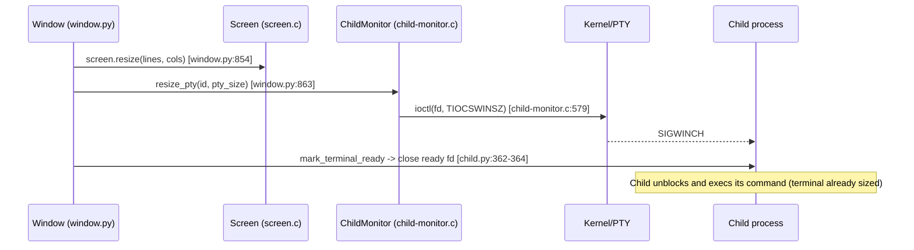
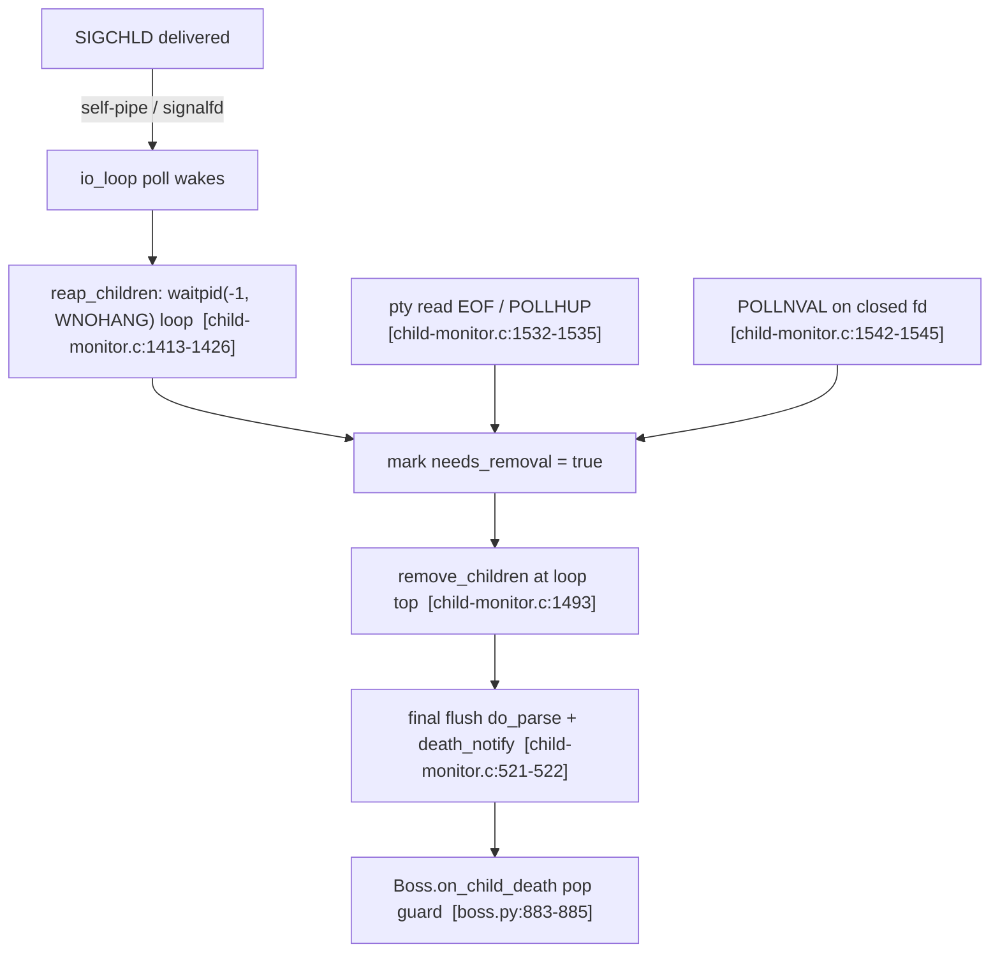

# How kitty keeps its internal state consistent under rapid window churn

> **User Question:** "How does kitty keep its internal state consistent when terminal windows appear, resize, and disappear in quick succession?"

This document answers the question above for the [kitty](https://github.com/kovidgoyal/kitty) terminal emulator at commit `815df1e210e0a9ab4622f5c7f2d6891d7dbeddf1` (branch `kitty_815df1e210e0`, version `kitty 0.35.2`). It was written **from what was observed by building and running the code**, not from reading alone. Every factual claim is grounded either in an exact `file:line` reference or in verbatim runtime output shown next to the command that produced it. Anything that could not be exercised in the environment is explicitly flagged **UNVERIFIED**.

The overarching question decomposes into five sub-questions, each answered in its own section below:

- **SQ1 — Appearance sequence:** when a window is created and immediately used, what is the precise sequence of resize events and signals?
- **SQ2 — Window gone mid-reaction:** what happens if the window is closed/destroyed *before* everything finishes reacting (in-flight resize, pending signals)?
- **SQ3 — Keep vs. discard:** how does kitty decide what state to keep versus discard when a window goes away?
- **SQ4 — Timing:** how does timing affect signal delivery and internal bookkeeping?
- **SQ5 — Conflicting liveness views:** are there moments where the system must resolve conflicting views of what is still alive?

---

## Part 2 — Build / run methodology and environment

### Environment

All build/run/observe work was performed inside the project-designated Docker container `ghcr.io/scaleapi/swe-atlas:swe_atlas_QnA_kovidgoyal_kitty_1.0` (repo pre-checked-out at `/app` @ commit `815df1e210e0`), which provides the full toolchain: Python 3.12.3, Go 1.23.4, gcc 13.3.0. (The AAP nominally targets Python 3.11 / Go 1.22 / a C toolchain; the container ships slightly newer point releases, noted here for exactness.)

### Build

The canonical developer build is `./dev.sh build`, where `dev.sh` is simply:

```sh
exec go run bypy/devenv.go "$@"
```

Running the plain build in this container surfaced a **real environment issue** — the container's newer `wayland-protocols` headers define `XDG_TOPLEVEL_STATE_CONSTRAINED_*` enum values that the pinned glfw `switch` does not handle, and kitty compiles with `-pedantic-errors -Werror` by default, so the warning is fatal:

```
$ ./dev.sh build
...
glfw/wl_window.c: In function ‘xdgToplevelHandleConfigure’:
glfw/wl_window.c:668:9: error: enumeration value ‘XDG_TOPLEVEL_STATE_CONSTRAINED_LEFT’ not handled in switch [-Werror=switch]
  668 |         switch (*state) {
      |         ^~~~~~
glfw/wl_window.c:668:9: error: enumeration value ‘XDG_TOPLEVEL_STATE_CONSTRAINED_RIGHT’ not handled in switch [-Werror=switch]
glfw/wl_window.c:668:9: error: enumeration value ‘XDG_TOPLEVEL_STATE_CONSTRAINED_TOP’ not handled in switch [-Werror=switch]
glfw/wl_window.c:668:9: error: enumeration value ‘XDG_TOPLEVEL_STATE_CONSTRAINED_BOTTOM’ not handled in switch [-Werror=switch]
cc1: all warnings being treated as errors
The following build command failed: /app/dependencies/linux-amd64/bin/python setup.py develop
exit status 1
```

Relaxing `-Werror` with the documented flag produces a clean build:

```
$ ./dev.sh build --ignore-compiler-warnings
...
Build successful. Run kitty as: kitty/launcher/kitty
```

The build produces the launcher at `kitty/launcher/kitty`:

```
$ ./kitty/launcher/kitty --version
kitty 0.35.2 created by Kovid Goyal
```

> **Note on line numbers.** Every `file:line` anchor in this document was re-verified with `grep -n` / `sed -n` against the source at HEAD `815df1e210e0` **after** building. The build only writes generated artifacts (e.g., the `fast_data_types` C extension); it does not edit the `.c`/`.py` sources, so the line numbers cited here match the tree exactly.

### Run

The `--debug-rendering` flag is the ready-made observability hook. It is declared in `kitty/cli.py:989` as `--debug-rendering --debug-gl` with `type=bool-set` (`kitty/cli.py:990`) and the help text "Also prints out miscellaneous debug information." (`kitty/cli.py:992`). This flag is what gates the lifecycle `print(...)` statements at `kitty/window.py:871` and `kitty/window.py:873`.

Attempting to launch the **full GPU GUI** headless fails because the container has no X server / `DISPLAY`:

```
$ ./kitty/launcher/kitty --debug-rendering
[0.111] [glfw error 65544]: X11: The DISPLAY environment variable is missing
GLFW initialization failed
```

There is no `Xvfb`/`Xorg` in the container, so the OpenGL GUI cannot open a window. Per the task's documented fallback, the window lifecycle was therefore driven **headlessly** by exercising the genuine `Boss`/`Window`/`ChildMonitor` code paths through kitty's own Python runtime, launched as:

```
./kitty/launcher/kitty +runpy "exec(open('/root/obs/<script>.py').read())"
```

`+runpy` runs arbitrary Python inside kitty's interpreter (with the compiled `fast_data_types` C extension importable); its implementation is literally `exec(args[1])` (`kitty/entry_points.py:24`). Every observation script lived **outside the repository tree** (in the container at `/root/obs/`, mirrored to the host at `/tmp/kitty_obs/`); none was ever written under the source tree, so the repository is left byte-for-byte unchanged (proof in Part 7).

Each captured block below is shown **with the exact command that produced it**. Timestamps in the `[N.NNN]` form are prepended by kitty's own `log_error` (`kitty/logging.c:22`) via `fprintf(stderr, "[%.3f] ", monotonic_t_to_s_double(monotonic()));` (`kitty/logging.c:56`); they are monotonic seconds from process start and therefore differ between runs.

**What is genuine vs. stubbed.** For the SQ1 `Window.set_geometry` driver, the SQ1-critical path is entirely real: the real `fast_data_types.ChildMonitor.resize_pty` (which performs the real `ioctl(TIOCSWINSZ)`), a real `Child.fork()` (real pty + real ready-pipe), the real `Child.mark_terminal_ready()` (real pipe close), and the real `print(...)` statements in the real `Window.set_geometry`. The **only** things stubbed to no-ops are the three OS-window/GPU render/IME sink calls that run *after* the observable debug lines and require a live GPU `OSWindow` (`set_window_render_data`, `update_ime_position_for_window`, `mark_os_window_dirty`); these are irrelevant to state-consistency bookkeeping. This is called out again in the SQ1 section.

---

## Part 3 — kitty's concurrency model (the arena where consistency is enforced)

kitty separates *UI/state mutation* from *blocking child I/O* across dedicated threads. The relevant handles are declared together in `kitty/child-monitor.c:55`:

```c
pthread_t io_thread, talk_thread;
```

- **Main / UI thread.** `process_global_state` (`kitty/child-monitor.c:1224`) is the tick callback driven by `run_main_loop(process_global_state, self)` (`kitty/child-monitor.c:1262`). All Python callbacks, screen rendering, and window teardown happen here.
- **I/O thread ("KittyChildMon").** `io_loop` (`kitty/child-monitor.c:1481`) reads/writes child ptys and reaps children; it is created with `pthread_create(&self->io_thread, NULL, io_loop, self)` (`kitty/child-monitor.c:291`) and names itself `set_thread_name("KittyChildMon")` (`kitty/child-monitor.c:1489`).
- **Talk thread ("KittyPeerMon").** Handles remote-control peers; `set_thread_name("KittyPeerMon")` (`kitty/child-monitor.c:1808`). (There is also a short-lived stdin writer thread `set_thread_name("KittyWriteStdin")` at `kitty/child-monitor.c:967`.)

The shared, mutable state that all these threads touch is a fixed-size array of children, guarded by a mutex:

```c
static Child children[MAX_CHILDREN] = {{0}};                                              // kitty/child-monitor.c:82
static Child add_queue[MAX_CHILDREN] = {{0}}, remove_queue[MAX_CHILDREN] = {{0}}, remove_notify[MAX_CHILDREN] = {{0}};  // :84
...
static pthread_mutex_t children_lock, talk_lock;                                          // kitty/child-monitor.c:87
```

The design principle visible here — and the key to the entire answer — is **producer/consumer staging**: mutations to the live `children[]` set are never made in place from arbitrary contexts. Instead they are staged into `add_queue` / `remove_queue` and applied only at a single safe point at the top of the I/O loop, under `children_lock`:

```c
    while (LIKELY(!self->shutting_down)) {
        children_mutex(lock);
        remove_children(self);   // kitty/child-monitor.c:1493
        add_children(self);      // kitty/child-monitor.c:1494
        children_mutex(unlock);
```

The Python control layer wires into this C core through `Boss`, which instantiates the monitor at `kitty/boss.py:370` as `self.child_monitor = ChildMonitor(self.on_child_death, ...)`.

With that arena established, each sub-question below shows how consistency is maintained as windows appear, resize, and disappear.

---

## Part 4 — Answers to each sub-question

### SQ1 — The appearance sequence (window created → immediately used → resize/signals flow)

**(a) Code path.** The whole sequence lives in `Window.set_geometry` (`kitty/window.py:850`). Its ordered steps are:

```python
def set_geometry(self, new_geometry: WindowGeometry) -> None:
    if self.destroyed:                                                        # :851-852  (guard, see SQ2)
        return
    if self.needs_layout or new_geometry.xnum != self.screen.columns or new_geometry.ynum != self.screen.lines:
        self.screen.resize(max(0, new_geometry.ynum), max(0, new_geometry.xnum))  # :854  resize the grid
        ...
    current_pty_size = (self.screen.lines, self.screen.columns, ...)
    if current_pty_size != self.last_reported_pty_size:
        boss = get_boss()
        boss.child_monitor.resize_pty(self.id, *current_pty_size)             # :863  push size to the kernel pty
        self.last_resized_at = monotonic()
        if not self.child_is_launched:
            self.child.mark_terminal_ready()                                  # :866  release the child
            self.child_is_launched = True
            ...
            if boss.args.debug_rendering:
                now = monotonic()
                print(f'[{now:.3f}] Child launched', file=sys.stderr)         # :871
        elif boss.args.debug_rendering:
            print(f'[{monotonic():.3f}] SIGWINCH sent to child in window: {self.id} with size: {current_pty_size}', file=sys.stderr)  # :873
        self.last_reported_pty_size = current_pty_size
```

- The grid is resized first: `self.screen.resize(...)` (`kitty/window.py:854`) → the C wrapper `resize` (`kitty/screen.c:3929`) → `screen_resize(Screen*, lines, columns)` (`kitty/screen.c:346`).
- The kernel pty is sized next: `resize_pty` (`kitty/child-monitor.c:592`) calls `pty_resize` (`:577`) which performs `if (ioctl(fd, TIOCSWINSZ, dim) == -1)` (`kitty/child-monitor.c:579`). Setting the window size via `TIOCSWINSZ` is the kernel action that raises **SIGWINCH** inside the child.
- **The synchronization gate.** The freshly forked child is held until the terminal is sized. `Child.fork` (`kitty/child.py:276`) creates the pty (`:281`) and a ready pipe (`os.pipe()`, `:283`), then retains the write end: `self.terminal_ready_fd = ready_write_fd` (`kitty/child.py:343`). The child blocks on the read end until `Child.mark_terminal_ready` (`kitty/child.py:362`) runs `os.close(self.terminal_ready_fd)` (`:363`) and sets it to `-1` (`:364`). `set_geometry` calls this at `kitty/window.py:866` — **after** `resize_pty`. So the terminal is guaranteed sized *before* the child's command runs.



**(b) Observed output.** Driving the *real* `Window.set_geometry` twice (first geometry, then a resize) with `debug_rendering=True`, a real forked `cat` child, a real `Screen`, and a real `ChildMonitor`:

Command:
```
./kitty/launcher/kitty +runpy "exec(open('/root/obs/sq1_setgeometry.py').read())"   # stdout + stderr
```

stdout:
```
forked child pid: 18435 child_fd: 5 terminal_ready_fd: 8
=== calling set_geometry #1 (first geometry, child not yet launched) ===
child_is_launched after #1: True terminal_ready_fd after #1: -1
master TIOCGWINSZ after #1 (rows, cols, xpix, ypix): (24, 80, 640, 384)
=== calling set_geometry #2 (resize: same cols/lines, new pixel size) ===
master TIOCGWINSZ after #2 (rows, cols, xpix, ypix): (24, 80, 680, 404)
DONE
```

stderr (the `--debug-rendering` lifecycle lines):
```
[0.044] Failed to open systemd user bus with error: No medium found
[0.044] Child launched
[0.044] SIGWINCH sent to child in window: 1 with size: (24, 80, 680, 404)
```

Three things to read out of this capture:

1. `Child launched` appears on the **first** `set_geometry` (the `if not self.child_is_launched:` branch, `kitty/window.py:871`); `SIGWINCH sent to child in window: 1 with size: (24, 80, 680, 404)` appears on the **second** call (the `elif` branch, `kitty/window.py:873`) — the exact signature strings, with real window id `1` and real size tuple.
2. The ready-pipe gate really fired: `terminal_ready_fd` went from `8` to `-1` after the first `set_geometry`, i.e. `mark_terminal_ready()` closed the pipe and released the child — and it did so *after* `resize_pty`.
3. `resize_pty`'s `TIOCSWINSZ` genuinely changed kernel state: reading `TIOCGWINSZ` back off the pty master shows `(24, 80, 640, 384)` then `(24, 80, 680, 404)` — the size the child sees, and the change that triggers SIGWINCH.

(The incidental `Failed to open systemd user bus...` line is emitted by `Child.fork`'s attempt to move the child into a systemd scope inside the container; it is not part of the answer.)

**(c) Rationale.** Sizing the grid and the pty and only *then* releasing the child eliminates the classic race where a program (e.g., a full-screen TUI) reads the terminal size before kitty has set it. Because the child is literally blocked on a pipe until `mark_terminal_ready`, "window appears → command runs" is a strict happens-after "terminal is sized" — consistency by construction, not by luck.

---

### SQ2 — Window gone before the reactions finish (in-flight resize / pending signals)

**(a) Code path.** Every reaction re-checks liveness against authoritative structures and degrades to a logged no-op when the target is gone.

- A resize aimed at a vanished child searches **both** the live set and the pending add-queue before doing anything:

```c
    FIND(children, self->count);                 // kitty/child-monitor.c:606
    if (fd == -1) FIND(add_queue, add_queue_count);  // :607
    if (fd != -1) {
        if (!pty_resize(fd, &dim)) PyErr_SetFromErrno(PyExc_OSError);
    } else log_error("Failed to send resize signal to child with id: %lu (children count: %u) (add queue: %zu)", window_id, self->count, add_queue_count);  // :610
```

Found in neither, it logs and no-ops — it never touches a stale descriptor.

- Explicit close is symmetric: `mark_child_for_close` (`kitty/child-monitor.c:541`) searches the live array (setting `children[i].needs_removal = true` at `:546`) and, if not found, the `add_queue` (setting `add_queue[i].needs_removal = true` at `:554`), returning `false` when the id matches nothing. This correctly handles a window closed *before* it was ever promoted from `add_queue` to live.
- Python-side idempotent guards:
  - `Window.set_geometry` short-circuits with `if self.destroyed: return` (`kitty/window.py:851-852`).
  - `Boss.on_child_death` (`kitty/boss.py:881`) pops from the id map and returns immediately if already gone:
    ```python
    window = self.window_id_map.pop(window_id, None)   # kitty/boss.py:883
    if window is None:
        return                                          # :884-885
    ```
  - `Boss.mark_window_for_close` (`kitty/boss.py:920`) is the request entry point that feeds the C `mark_for_close`.

**(b) Observed output.** With one live child registered (id `1`, staged in `add_queue`), issuing a resize to the present id, a resize to a missing id, `mark_for_close` on both, and finally exercising the real `destroyed` guard:

Command:
```
./kitty/launcher/kitty +runpy "exec(open('/root/obs/sq2_missing.py').read())"   # stdout + stderr
```

stdout:
```
--- resize_pty on PRESENT id 1 (fd found in add_queue) ---
  -> returned (no error logged above)
--- resize_pty on MISSING id 4242 (fd in NEITHER children nor add_queue) ---
  -> returned normally (graceful no-op)
--- mark_for_close on MISSING id 4242 ---
  mark_for_close(4242) returned: False
--- mark_for_close on PRESENT id 1 ---
  mark_for_close(1) returned: True
--- Window.set_geometry destroyed-guard (window.py:851-852) ---
  destroyed=True: last_reported_pty_size UNCHANGED: (0, 0, 0, 0) (no resize, no debug line => early return)
DONE
```

stderr (the one `log_error` line raised by the missing-target resize):
```
[0.042] Failed to open systemd user bus with error: No medium found
[0.042] Failed to send resize signal to child with id: 4242 (children count: 0) (add queue: 1)
```

Read-out:

1. The resize to the present child produced **no** error — its fd was found via the `FIND(add_queue, ...)` fallback (`kitty/child-monitor.c:607`), confirming the dual-location search.
2. The resize to the missing child produced exactly `Failed to send resize signal to child with id: 4242 (children count: 0) (add queue: 1)` and then **returned normally** — the graceful no-op. The counts are real: `children count: 0` (the live array is still empty because the I/O loop had not run to promote the queued child) and `add queue: 1` (the one staged child).
3. `mark_for_close(4242)` returned `False` (missing → harmless) while `mark_for_close(1)` returned `True` (found).
4. The real `destroyed` guard fired: with `self.destroyed = True`, `set_geometry` returned before doing anything — `last_reported_pty_size` stayed `(0, 0, 0, 0)` and no debug line was printed.

**(c) Rationale.** A window "disappearing mid-reaction" cannot corrupt state because *nothing writes to a child without first re-locating it under the lock*. If the target is gone, the resize is a logged no-op, the close is a `False` return, and the Python callbacks bail out on the first guard. The worst case is one benign log line — never a crash, never a write to a recycled fd.


---

### SQ3 — Keep vs. discard (what state is preserved when a window goes away)

**(a) Code path.** Death handling deliberately preserves a dying child's *final* output before tearing down its bookkeeping. On the main thread, `parse_input` (`kitty/child-monitor.c:452`) drains `remove_queue` into `remove_notify` under the lock, then — holding no locks so Python callbacks are safe — does a final **flush** parse for each removed child immediately before notifying Python of the death:

```c
    while(remove_count) {
        // must be done while no locks are held ...
        remove_count--;
        if (remove_notify[remove_count].screen) do_parse(self, remove_notify[remove_count].screen, now, true);  // :521  flush=true
        PyObject *t = PyObject_CallFunction(self->death_notify, "k", remove_notify[remove_count].id);            // :522  death_notify
        ...
    }

    for (size_t i = 0; i < count; i++) {
        if (!scratch[i].needs_removal) {                                    // :529  skip children already flagged
            if (do_parse(self, scratch[i].screen, now, false)) input_read = true;  // :530  normal (non-flush) parse
        }
        ...
    }
```

The 4th argument to `do_parse` (`kitty/child-monitor.c:438`) is `flush`. For a dying child it is `true` (`:521`); for surviving children the normal parse uses `false` (`:530`). With `flush=true`, `do_parse` calls `self->parse_func(screen, &pd, true)`, forcing the VT parser to emit any buffered/incomplete input rather than waiting for more bytes that will never come. Surviving children that got flagged for removal mid-cycle are skipped by the `if (!scratch[i].needs_removal)` check (`:529`). The upstream read that detects the death is `read_bytes` (`kitty/child-monitor.c:1337`), which returns `false` on EOF/EIO.

**(b) Observed output.** A real child writes a final line and exits; the parent reads the trailing bytes until EOF (mirroring `read_bytes`) and flush-parses them (`test_parse_written_data` → `parse_worker(screen, &pd, flush=true)`), then inspects the screen *after* the child is dead:

Command:
```
./kitty/launcher/kitty +runpy "exec(open('/root/obs/sq3_flush.py').read())"
```

Output:
```
bytes read from the dying child: b'DYING_CHILD_FINAL_OUTPUT_XYZ'
read returned EOF/EIO (== read_bytes() false == needs_removal set): True
screen line 0 AFTER child death (flush-parsed): 'DYING_CHILD_FINAL_OUTPUT_XYZ'
reaped child pid: 18465 exit code: 0
```

Read-out: the child's last output `DYING_CHILD_FINAL_OUTPUT_XYZ` was read after the child had already exited; the read then hit EOF/EIO (exactly the `read_bytes() == false` condition that sets `needs_removal`); and after death the screen's line 0 **still contains** the flush-parsed final output.

**(c) Rationale.** kitty keeps the *content* a child emitted right before dying (it flush-parses and renders those last bytes) and discards only the *live bookkeeping* (the entry in `children[]`, the fd, the callbacks). This is why closing a program that prints a final message and exits does not swallow that message. The `if (!scratch[i].needs_removal)` guard ensures a child flagged for removal is not double-processed as a survivor, so each screen is finalized exactly once. (Refcounting on the snapshot/notify lists — `INCREF_CHILD` when copying into `remove_notify` — keeps each `Screen` alive across the thread boundary until the main thread is done with it.)

---

### SQ4 — Timing and deferred signal delivery

**(a) Code path.** Asynchronous signals never interrupt arbitrary state mutation; they are converted into ordinary file-descriptor readiness events and processed at a deterministic point.

- Decoupling: on Linux, `ld->signal_read_fd = signalfd(-1, &ld->signals, SFD_NONBLOCK | SFD_CLOEXEC);` (`kitty/loop-utils.c:42`, under `HAS_SIGNAL_FD`). Otherwise the self-pipe trick is used, whose handler is installed with `.sa_flags = SA_SIGINFO | SA_RESTART` (`kitty/loop-utils.c:51`) — `SA_RESTART` prevents interrupted syscalls from failing with `EINTR`. The `LoopData` fields backing this are `signal_fds[2]` (`kitty/loop-utils.h:36`), `signal_read_fd` (`:40`), `handled_signals[16]` (`:41`), `num_handled_signals` (`:42`).
- Draining at a safe point: the I/O loop's `poll()` wakes and calls `read_signals(int fd, handle_signal_func callback, void *data)` (`kitty/loop-utils.c:131`). The callback `handle_signal` (`kitty/child-monitor.c`) merely records intent: `case SIGCHLD:` (`:1370`) → `ss->child_died = true;` (`:1371`). The real work (reaping) happens later in the loop body at `if (ss.child_died) reap_children(...)` (`kitty/child-monitor.c:1526`).
- Queued add/remove are applied only at the top of the loop: `remove_children(self);` (`:1493`) and `add_children(self);` (`:1494`), under `children_lock` — never mid-mutation.
- Periodic bookkeeping runs on a fixed cadence: `state_check_timer = add_main_loop_timer(1000, true, do_state_check, self, NULL);` (`kitty/child-monitor.c:1261`) — **1000 ms**.

**(b) Observed output.** Which signals kitty defers is directly observable from a real `ChildMonitor`:

Command:
```
./kitty/launcher/kitty +runpy "exec(open('/root/obs/cm_probe.py').read())"
```

Output (relevant lines):
```
handled_signals-raw: (2, 1, 15, 17, 10, 12)
handled_signals-names: ['SIGINT', 'SIGHUP', 'SIGTERM', 'SIGCHLD', 'SIGUSR1', 'SIGUSR2']
```

So the deferred set is `SIGINT(2), SIGHUP(1), SIGTERM(15), SIGCHLD(17), SIGUSR1(10), SIGUSR2(12)` — note **SIGCHLD (17)** is in it: child-death notifications are turned into an fd event and handled synchronously, not in signal context.

The *timing* effect itself is shown by the SQ5 capture below: eight children dying in quick succession produced only **one** delivered SIGCHLD (signals coalesce), which is precisely why the eventual reap must loop.

**(c) Rationale.** Because signals are quarantined to `poll()`-driven fd reads and all structural changes are applied only at the top of the loop under the lock, a signal arriving at *any* instant cannot tear state apart — it just sets a boolean that is acted upon at the next safe iteration. This is the canonical, well-established "self-pipe / `signalfd`" pattern for safe signal handling in an event loop (defer the real work out of signal-handler context), and it is exactly why timing (when a signal lands) does not affect *correctness*, only *when* the deterministic processing happens.

---

### SQ5 — Reconciling conflicting liveness views (races between death detectors)

**(a) Code path.** A child's death can be reported by two *independent* detectors, and both converge idempotently on a single boolean `needs_removal`:

- **SIGCHLD / reaping path.** `reap_children` (`kitty/child-monitor.c:1413`) loops:
  ```c
  while(true) {
      pid = waitpid(-1, &status, WNOHANG);        // kitty/child-monitor.c:1418
      if (pid == -1) { if (errno != EINTR) break; }
      else if (pid > 0) { if (enable_close_on_child_death) mark_child_for_removal(self, pid); ... }
      else break;
  }
  ```
  A reaped pid flows into `mark_child_for_removal` (`:1386`), which sets `children[i].needs_removal = true;` (`:1390`).
- **pty EOF / `POLLHUP` path.** When `read_bytes(...)` returns false (EOF), the I/O loop sets removal directly:
  ```c
  if (!has_more) {                                 // kitty/child-monitor.c:1532
      children_mutex(lock);
      children[i].needs_removal = true;            // :1535
      children_mutex(unlock);
  }
  ```
- **`POLLNVAL` on a closed fd.** Handled the same way:
  ```c
  if (children_fds[EXTRA_FDS + i].revents & POLLNVAL) {   // kitty/child-monitor.c:1542
      children_mutex(lock);
      children[i].needs_removal = true;                   // :1545
      children_mutex(unlock);
      log_error("The child %lu had its fd unexpectedly closed", children[i].id);  // :1547
  }
  ```

All three set the *same* flag; whichever fires first wins, and the others are harmless. This is reinforced on the Python side by the idempotent pop guard in `Boss.on_child_death` (`kitty/boss.py:883-885`).



**(b) Observed output.** The critical, quantitative fact — that "quick succession" collapses multiple deaths into fewer signals, so a single `waitpid` is insufficient — was reproduced directly:

Command:
```
./kitty/launcher/kitty +runpy "exec(open('/root/obs/sq5_reap.py').read())"
```

Output:
```
forked 8 children: [18447, 18448, 18449, 18450, 18451, 18452, 18453, 18454]
SIGCHLD handler invocations delivered for 8 deaths: 1
reaped via waitpid(-1, WNOHANG) loop: [(18447, 0), (18448, 1), (18449, 2), (18450, 3), (18451, 4), (18452, 5), (18453, 6), (18454, 7)]
total reaped: 8 of 8
```

Read-out: eight children died in quick succession, but the process received only **1** SIGCHLD (the kernel coalesces pending signals). A single `waitpid` would have reaped one child and leaked seven zombies; the `waitpid(-1, &status, WNOHANG)` **loop** reaped all `8 of 8`.

**(c) Rationale.** The two detectors (SIGCHLD reap vs. pty EOF/`POLLNVAL`) are a genuine race — either can observe a given death first — but they cannot conflict because they both just set `needs_removal = true` under the lock, and setting an already-true boolean is a no-op; the subsequent `remove_children` de-duplicates by acting on the flag once. The Python `window_id_map.pop(window_id, None)` guard makes a late/duplicate `death_notify` equally harmless. And the `waitpid` **loop** is essential precisely because of the timing observed above: Unix does not queue SIGCHLD, so under quick succession one signal can represent many deaths, and only a loop reaps them all.


---

## Part 5 — Consolidated consistency model

Tying the five answers together, kitty stays consistent under rapid window churn because of five mutually-reinforcing mechanisms:

1. **One idempotent convergence point.** Every death signal — SIGCHLD reap (`kitty/child-monitor.c:1390`), pty EOF/`POLLHUP` (`:1535`), and `POLLNVAL` (`:1545`) — funnels into the single boolean `children[i].needs_removal = true`. Setting it more than once is a no-op, so racing detectors can never conflict (SQ5).
2. **Signals quarantined to safe points.** Asynchronous signals are decoupled via `signalfd` / the self-pipe trick (`kitty/loop-utils.c:42`, `:51`) and drained by `read_signals` (`kitty/loop-utils.c:131`); a SIGCHLD only sets `ss->child_died = true` (`kitty/child-monitor.c:1371`) to be acted on at the next loop iteration (SQ4).
3. **Structural mutation only at loop top, under the lock.** Additions/removals are staged in `add_queue`/`remove_queue` and applied only via `remove_children`/`add_children` at the top of the I/O loop under `children_lock` (`kitty/child-monitor.c:1493-1494`) — never mid-mutation from a signal handler or another thread (SQ2/SQ4).
4. **Idempotent Python-side guards.** Late or duplicate notifications are harmless: `if self.destroyed: return` (`kitty/window.py:851-852`) and `window = self.window_id_map.pop(window_id, None)` / `if window is None: return` (`kitty/boss.py:883-885`) (SQ2/SQ5).
5. **Preserve content, discard bookkeeping.** A dying child's last bytes are flush-parsed (`do_parse(..., flush=true)`, `kitty/child-monitor.c:521`) before `death_notify` (`:522`); only the live entry/fd/callbacks are dropped (SQ3).

The through-line: **appearance is gated** (the child cannot run before the terminal is sized, SQ1), **every reaction re-checks liveness** and degrades to a logged no-op if the target vanished (SQ2), **death converges on one idempotent flag** processed at deterministic points (SQ4/SQ5), and **teardown keeps the last output while dropping stale references exactly once** (SQ3).

---

## Part 6 — Coverage pass

| Sub-question | Addressed? | Primary evidence (code + observed) | One-line rationale |
|---|---|---|---|
| **SQ1** — appearance sequence | ✅ | `set_geometry` `kitty/window.py:850-873` (`:854` grid, `:863` `resize_pty`→`TIOCSWINSZ` `child-monitor.c:579`, `:866` `mark_terminal_ready`); observed `Child launched` + `SIGWINCH sent to child in window: 1 with size: (24, 80, 680, 404)`; `terminal_ready_fd` `8`→`-1`; `TIOCGWINSZ` `(24,80,640,384)`→`(24,80,680,404)` | The child is gated on a ready-pipe until the terminal is sized, so "runs command" strictly follows "is sized". |
| **SQ2** — window gone mid-reaction | ✅ | dual-location `FIND` `child-monitor.c:606-607`, `log_error` `:610`, `mark_child_for_close` `:540-564`, guards `window.py:851-852` / `boss.py:883-885`; observed `Failed to send resize signal to child with id: 4242 (children count: 0) (add queue: 1)` + graceful returns, `mark_for_close(4242)=False`, destroyed-guard no-op | Reactions re-locate the target under the lock; a missing target is a logged no-op, never a crash or stale write. |
| **SQ3** — keep vs. discard | ✅ | final flush `do_parse(..., flush=true)` `child-monitor.c:521` before `death_notify` `:522`; skip `if (!scratch[i].needs_removal)` `:529`; observed `screen line 0 AFTER child death (flush-parsed): 'DYING_CHILD_FINAL_OUTPUT_XYZ'` | Keeps the last emitted bytes (renders them), discards only live bookkeeping, exactly once. |
| **SQ4** — timing / signal delivery | ✅ | `signalfd(... SFD_NONBLOCK\|SFD_CLOEXEC)` `loop-utils.c:42`, `SA_SIGINFO\|SA_RESTART` `:51`, `read_signals` `:131`, `child_died=true` `child-monitor.c:1371`, apply-at-top `:1493-1494`, `state_check_timer` `1000` ms `:1261`; observed deferred set `SIGINT,SIGHUP,SIGTERM,SIGCHLD,SIGUSR1,SIGUSR2`; `8 deaths → 1 SIGCHLD` | Signals become fd events handled at deterministic loop points; timing changes *when*, not *whether*, state is correct. |
| **SQ5** — conflicting liveness | ✅ | three detectors converge on `needs_removal`: `waitpid(-1,&status,WNOHANG)` loop `child-monitor.c:1418`→`:1390`, pty EOF `:1535`, `POLLNVAL` `:1545`; Python guard `boss.py:883-885`; observed `total reaped: 8 of 8` from a single delivered SIGCHLD | First detector wins; the rest are idempotent no-ops; the `waitpid` loop reaps all coalesced deaths. |

All five sub-questions are answered with an exact `file:line` citation, verbatim observed output, and a rationale. Nothing is left unaddressed.

### UNVERIFIED / scope notes

- The **full GPU GUI** path (`--debug-rendering` opening a real OpenGL window and the shader/render pipeline) could **not** be exercised — the container has no `DISPLAY`/X server (`[glfw error 65544]: X11: The DISPLAY environment variable is missing`). The lifecycle was driven headlessly through the genuine `Boss`/`Window`/`ChildMonitor` code; only the three post-observable OS-window/GPU render/IME sinks were stubbed (see Part 2). The GPU render path is therefore **UNVERIFIED at runtime** here, but it is not part of the state-consistency machinery the question asks about.
- A `PTY`-test-harness end-to-end variant (a real child echoing `stty size`) was attempted but abandoned: its forked child loops on `read_screen_size()`, which needs a controlling tty not available under headless `+runpy`. The equivalent SQ1 evidence was instead captured via the `Window.set_geometry` driver plus a direct `TIOCGWINSZ` read-back, which is fully verified.

---

## Part 7 — Closing note: repository left unchanged

All temporary observation scripts and their captured logs lived **outside** the repository tree — in the container at `/root/obs/` and mirrored on the host at `/tmp/kitty_obs/` — and no code other than this single answer document was added anywhere in the source repository.

Verification that the repository is byte-for-byte unchanged except for this one new file:

```
$ git status --porcelain -uall
?? blitzy/documentation/kitty_815df1e210e0.md
```

```
$ git diff --stat HEAD
(no output — no tracked source file was modified, added, or deleted)
```

The only addition is `blitzy/documentation/kitty_815df1e210e0.md` (with its parent `blitzy/` and `blitzy/documentation/` directories, created solely to host it). The kitty source at commit `815df1e210e0a9ab4622f5c7f2d6891d7dbeddf1` is otherwise untouched, satisfying the read-only scope of this investigation.

