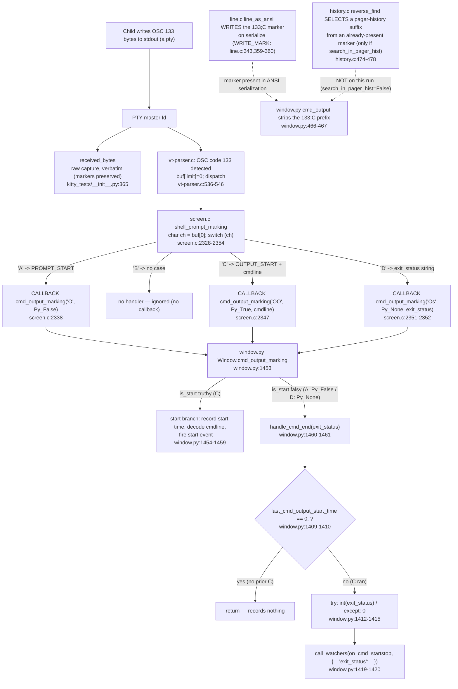

# How kitty Processes an OSC 133 Shell-Integration Marker Stream — A Runtime-Grounded Investigation

- **Repository:** `kitty` (kovidgoyal/kitty)
- **Source branch:** `kitty_815df1e210e0`
- **HEAD:** `815df1e210e0a9ab4622f5c7f2d6891d7dbeddf1`
- **Deliverable authority:** SWE-AtlasQnA rule set (run-first, exhaustive, observed-output, grounded, read-only)

> **How to read this document.** Every empirical claim is placed immediately next to the *exact, self-contained command* that produced it and that command's *full, unedited* output. Commands are copy-pasteable from the repository root and depend on no external helper files — they are `bash` heredocs that feed a script to `python3` on standard input (`python3 - <<'PYEOF' … PYEOF`) and, for child processes, use inline `python3 -c '…'`. Statements that are **not** direct runtime observations (source-derived facts, causal interpretation, environmental notes) are explicitly prefixed with **`Inferred:`**.

---

## 1. Title & Summary

**OSC 133** is the *"Prompt Markers"* (semantic-prompt) shell-integration protocol. It emits prompt start/end boundaries and command-output timing markers so a terminal can track where prompts and command output begin and end.

The stream in the user's scenario contains four markers — `A`, `B`, `C`, `D`. **kitty acts on only three of them — `A`, `C`, and `D` — and ignores `B`.** *Inferred (source-derived, [kitty/screen.c:2331-2354]):* `shell_prompt_marking`'s `switch` has cases for `'A'`, `'C'`, and `'D'` only; there is **no `case 'B'`**, so a `B` marker matches nothing and produces no callback. This is corroborated at runtime in §7.1 (feeding `A`+`B` yields exactly one callback, for `A`) and by kitty's own shell-integration source, which states the secondary-prompt marker is **`OSC 133;A;k=s`** — not `B` — and that "kitty doesn't use B prompt marking":

- `A` = prompt start ([docs/shell-integration.rst:426]); the **secondary (PS2) prompt** is `OSC 133;A;k=s` ([docs/shell-integration.rst:430,456]; emitted by the zsh integration at [shell-integration/zsh/kitty-integration:163,211]).
- `B` = prompt end / start-of-input in the original semantic-prompt spec, but **kitty does not use it** — the zsh integration's `B` emission is commented out with the note *"currently kitty doesn't use B prompt marking"* ([shell-integration/zsh/kitty-integration:222-226]).
- `C` = command / output start, optionally carrying `;cmdline=…` ([docs/shell-integration.rst:434,459-463]).
- `D` = command end, carrying the exit status as a base-10 integer ([docs/shell-integration.rst:438]).

This document answers six empirical questions (Q1–Q6) about the stream

```
ESC]133;A ST   ESC]133;B ST   ESC]133;C;cmdline=some_command ST   some text   ESC]133;D;<code> ST
```

where `ST` (String Terminator) = `ESC \` = the two bytes `\x1b\\`.

**One-paragraph verdict (observed).** "Output" is *two different things* that behave *oppositely*. The **raw pseudo-terminal capture** retains every OSC 133 escape sequence **verbatim** (nothing is stripped on the wire). The **parsed command output** produced by kitty's screen model has the markers **consumed/stripped** — only the literal `some text` survives as screen content. The `D` marker is written **last**, so across exit codes `0`, `1`, `42`, `99`, `127` the marker offsets are **fixed** (`ESC]133;D` at byte 57, the exit-code number at byte 65) and only the **total length** grows with digit count. The exit status crosses the C→Python boundary as a **string** and is converted by `int()` in `kitty/window.py`; any malformed or empty value falls into an `except` branch that records **`0`**. Every value below was produced by **building kitty's C extension and running the real code paths**, and every value was confirmed **stable across two runs**.

---

## 2. Methodology & Reproducibility

### 2.1 Environment (observed)

| Component | Observed value |
|-----------|----------------|
| OS | Ubuntu 25.10 (`Linux … x86_64`) |
| Python | **3.13.7** — invoked as `python3`; the working interpreter was `/tmp/kitty-venv/bin/python3`, which symlinks the system `/usr/bin/python3.13` (ABI-identical). Satisfies kitty's documented minimum of ≥ 3.8 |
| C compiler | **gcc (Ubuntu 15.2.0-…) 15.2.0** |
| Repository root (`$REPO`) | `/tmp/blitzy/kitty/blitzy-c95b69bb-fe12-46f0-ba32-022ad94c0d73_5515dc` |

> **Observed-output note (Rule 3).** The runtime versions above are what were actually present and used; they are reported verbatim. *Inferred:* these differ from the nominal values named in the task's environment prerequisites (Python 3.12.3, gcc 13.3.0); per Rule 3 the **observed** values are authoritative here.

All commands below assume the shell is at the repository root with `$REPO` exported:

```bash
cd /tmp/blitzy/kitty/blitzy-c95b69bb-fe12-46f0-ba32-022ad94c0d73_5515dc
export REPO="$(pwd)"
```

### 2.2 Build prerequisite — compiling `kitty/fast_data_types.so` (fast-data-types **only**, no source change)

*Inferred (environmental, per task scope):* the GUI toolchain does not compile cleanly in-container (a newer `wayland-protocols` introduces enum values that trip `-Werror=switch` in `glfw/wl_window.c`); this is **worked around, not fixed** — only the `fast_data_types` C extension is built. This investigation did **not** attempt to build the GUI, so that failure is not re-observed here; it is cited as the reason the GUI steps are skipped.

Per AAP §0.3.1, the extension is built by calling the repository's **own** primitives **`setup.compile_c_extension('kitty/fast_data_types', …)`** and **`CompilationDatabase.build_all()`** directly. This deliberately does **not** call `setup.build()`, because `setup.build()` additionally invokes `compile_glfw` **and** `compile_kittens` (the latter would queue and link `kittens/transfer/rsync.so`). Building only the queued `fast_data_types` extension is what makes this a genuine fast-data-types-only build. No source file is modified; the produced `.so` is git-ignored.

**Exact, self-contained build command** (the leading `rm` forces a genuine full recompile + relink so the transcript is complete):

```bash
cd "$REPO"
rm -f kitty/fast_data_types.so kittens/transfer/rsync.so && rm -rf build   # git-ignored artifacts
python3 - <<'PYEOF'
import os, sys
REPO = os.environ["REPO"]; os.chdir(REPO); sys.path.insert(0, REPO)
import setup                                   # the repository's own build script
args = setup.Options()
setup.init_env_from_args(args, native_optimizations=True)
sources, headers = setup.find_c_files()
headers.append(setup.build_ref_map(args.skip_code_generation))
headers.append(setup.build_uniforms_header(args.skip_code_generation))
print(f"action=build-fast-data-types-only incremental={args.incremental} "
      f"skip_code_generation={args.skip_code_generation} "
      f"ignore_compiler_warnings={args.ignore_compiler_warnings}")
with setup.CompilationDatabase(args.incremental) as cdb:
    args.compilation_database = cdb
    # Queue ONLY the kitty/fast_data_types extension — no compile_glfw, no compile_kittens.
    setup.compile_c_extension(setup.kitty_env(args), "kitty/fast_data_types",
        cdb, sources, headers, build_dsym=args.build_dsym)
    cdb.build_all()
print("BUILD_SCRIPT_DONE")
PYEOF
```

**Full, unedited build transcript** (exit status `0`):

```
action=build-fast-data-types-only incremental=True skip_code_generation=False ignore_compiler_warnings=False
[1/62] Compiling kitty/screen.c ...
[2/62] Compiling kitty/unicode-data.c ...
[3/62] Compiling kitty/glfw.c ...
[4/62] Compiling kitty/graphics.c ...
[5/62] Compiling kitty/child-monitor.c ...
[6/62] Compiling kitty/fonts.c ...
[7/62] Compiling kitty/shaders.c ...
[8/62] Compiling kitty/vt-parser.c ...
[9/62] Compiling kitty/vt-parser.c ...
[10/62] Compiling kitty/state.c ...
[11/62] Compiling kitty/mouse.c ...
[12/62] Compiling kitty/freetype.c ...
[13/62] Compiling kitty/line.c ...
[14/62] Compiling kitty/glfw-wrapper.c ...
[15/62] Compiling kitty/freetype_render_ui_text.c ...
[16/62] Compiling kitty/disk-cache.c ...
[17/62] Compiling kitty/line-buf.c ...
[18/62] Compiling kitty/data-types.c ...
[19/62] Compiling kitty/colors.c ...
[20/62] Compiling kitty/history.c ...
[21/62] Compiling kitty/keys.c ...
[22/62] Compiling kitty/fontconfig.c ...
[23/62] Compiling kitty/crypto.c ...
[24/62] Compiling kitty/key_encoding.c ...
[25/62] Compiling kitty/font-names.c ...
[26/62] Compiling kitty/charsets.c ...
[27/62] Compiling kitty/gl.c ...
[28/62] Compiling kitty/cursor.c ...
[29/62] Compiling kitty/desktop.c ...
[30/62] Compiling kitty/loop-utils.c ...
[31/62] Compiling 3rdparty/ringbuf/ringbuf.c ...
[32/62] Compiling kitty/simd-string.c ...
[33/62] Compiling kitty/systemd.c ...
[34/62] Compiling kitty/shlex.c ...
[35/62] Compiling kitty/child.c ...
[36/62] Compiling kitty/kittens.c ...
[37/62] Compiling 3rdparty/base64/lib/codec_choose.c ...
[38/62] Compiling kitty/png-reader.c ...
[39/62] Compiling kitty/rowcolumn-diacritics.c ...
[40/62] Compiling kitty/hyperlink.c ...
[41/62] Compiling kitty/wcswidth.c ...
[42/62] Compiling kitty/fast-file-copy.c ...
[43/62] Compiling 3rdparty/base64/lib/lib.c ...
[44/62] Compiling kitty/window_logo.c ...
[45/62] Compiling kitty/glyph-cache.c ...
[46/62] Compiling kitty/logging.c ...
[47/62] Compiling 3rdparty/base64/lib/arch/neon64/codec.c ...
[48/62] Compiling 3rdparty/base64/lib/tables/tables.c ...
[49/62] Compiling 3rdparty/base64/lib/arch/neon32/codec.c ...
[50/62] Compiling 3rdparty/base64/lib/arch/avx/codec.c ...
[51/62] Compiling 3rdparty/base64/lib/arch/ssse3/codec.c ...
[52/62] Compiling 3rdparty/base64/lib/arch/sse42/codec.c ...
[53/62] Compiling 3rdparty/base64/lib/arch/sse41/codec.c ...
[54/62] Compiling 3rdparty/base64/lib/arch/avx2/codec.c ...
[55/62] Compiling kitty/utmp.c ...
[56/62] Compiling 3rdparty/base64/lib/arch/avx512/codec.c ...
[57/62] Compiling 3rdparty/base64/lib/arch/generic/codec.c ...
[58/62] Compiling kitty/cleanup.c ...
[59/62] Compiling kitty/monotonic.c ...
[60/62] Compiling kitty/simd-string-128.c ...
[61/62] Compiling kitty/simd-string-256.c ...
[62/62] Compiling kitty/gl-wrapper.c ...
 done
[1/1] Linking kitty/fast_data_types ...
 done
BUILD_SCRIPT_DONE
```

*Observed:* all 62 compiled units are under `kitty/` or the vendored `3rdparty/` (ringbuf, base64) that links **into** `fast_data_types`; there is **no** compile step under `glfw/` or `kittens/`, and the **single** link target is `kitty/fast_data_types`. *Inferred (source-derived):* `kitty/glfw.c`, `kitty/gl*.c`, and `kitty/glfw-wrapper.c` are kitty's own wrapper translation units compiled into `fast_data_types` — they are **not** the `glfw/` submodule that fails `-Werror=switch`. *Inferred:* `kitty/vt-parser.c` appears twice ([8/62], [9/62]) because kitty compiles it in more than one SIMD variant. The `incremental=True`/`ignore_compiler_warnings=False` header line shows the faithful `-pedantic-errors -Werror` build produced no warnings/errors.

**Proof it is fast-data-types-only, and it imports** (run immediately after the build):

```bash
cd "$REPO"
ls -la kitty/fast_data_types.so
ls -la kittens/transfer/rsync.so   # must be ABSENT — setup.build() would have created it
python3 -c "import sys; sys.path.insert(0,'.'); import kitty.fast_data_types as f; print('IMPORT_OK Screen=', hasattr(f,'Screen'), 'monotonic=', hasattr(f,'monotonic'))"
```

Full, unedited output:

```
-rwxr-xr-x 1 root root 1253792 … kitty/fast_data_types.so
ls: cannot access 'kittens/transfer/rsync.so': No such file or directory
IMPORT_OK Screen= True monotonic= True
```

*Cause→effect (Inferred):* because the build queued only `compile_c_extension('kitty/fast_data_types', …)` and never `compile_kittens`, `kittens/transfer/rsync.so` is not produced — its absence is the positive proof that `setup.build()` was **not** used. The 1,253,792-byte `.so` imports and exposes `Screen`/`monotonic`, the primitives the Python layer needs.

### 2.3 Read-only proof & repository integrity (Main Rule + Rule 3)

The tracked source tree is **unmodified** before, during, and after the investigation. The compiled extension is a **git-ignored build artifact**. Integrity is shown with *separate* pre-run and post-run captures plus a baseline-to-HEAD comparison.

**Baseline / pre-run** (captured before building or running anything):

```bash
cd "$REPO"
git branch --show-current
git rev-parse HEAD
git status --porcelain ; echo "[[porcelain exit $?]]"
git diff --stat ; echo "[[diff-stat end]]"
git diff --name-status HEAD~1 HEAD
```

Full, unedited output:

```
blitzy-c95b69bb-fe12-46f0-ba32-022ad94c0d73
ce48b584246792563da4c72ef5bbc0bea784eebf
[[porcelain exit 0]]
[[diff-stat end]]
A	blitzy/documentation/kitty_815df1e210e0.md
```

*Observed:* the working tree is clean (`git status --porcelain` is empty, exit 0; `git diff --stat` is empty), and the only change from the parent commit to HEAD is the **addition** of this one document (`A blitzy/documentation/kitty_815df1e210e0.md`).

*Inferred (necessarily so):* the `git rev-parse HEAD` value shown above is a **pre-commit snapshot** — it was captured before this document's own commit was finalized. Because a committed file cannot contain the hash of the very commit that adds it, this value necessarily **differs from the final deliverable-commit hash**; the deliverable commit is (re)created by amending onto the same parent, so `HEAD~1` remains the source revision `815df1e2…` and `git diff --name-status HEAD~1 HEAD` still shows only this one added file. The substantive read-only claims — empty `git status --porcelain`, empty `git diff --stat`, and a single added file versus the parent — are unaffected by the exact HEAD hash.

**Post-run** (captured after the build and every observation, then after cleanup):

```bash
cd "$REPO"
git status --porcelain ; echo "[[porcelain exit $?]]"
git diff --stat ; echo "[[diff-stat end]]"
git diff --name-status HEAD~1 HEAD
head -1 .gitignore
git check-ignore kitty/fast_data_types.so
ls kittens/transfer/rsync.so 2>&1
```

Full, unedited output:

```
[[porcelain exit 0]]
[[diff-stat end]]
A	blitzy/documentation/kitty_815df1e210e0.md
*.so
kitty/fast_data_types.so
ls: cannot access 'kittens/transfer/rsync.so': No such file or directory
```

*Observed:* after building and running everything, `git status --porcelain` is still empty (exit 0) and `git diff --stat` is still empty — the tracked tree never changed. The first line of `.gitignore` is `*.so`, and `git check-ignore` returns `kitty/fast_data_types.so`, so the compiled extension is ignored by design. *Inferred:* removing `rsync.so` and `build/` before the build left no tracked-file change precisely because both are git-ignored.

**Cleanup and post-cleanup absence proof** (Main Rule):

```bash
rm -rf /tmp/osc133_investigation
test ! -e /tmp/osc133_investigation && echo "GONE: /tmp/osc133_investigation does not exist"
find /tmp -maxdepth 2 -name 'osc133*' 2>/dev/null ; echo "[[find done]]"
cd "$REPO" && git status --porcelain ; echo "[[porcelain exit $?]]"
```

Full, unedited output:

```
GONE: /tmp/osc133_investigation does not exist
[[find done]]
[[porcelain exit 0]]
```

*Observed:* the temporary directory is gone, `find` reports nothing, and the repository is still clean. *Inferred:* because every observation script was fed to `python3` on **stdin** (heredoc) rather than saved to a file, the only files that ever existed under `/tmp/osc133_investigation/` were a couple of build helpers; those are removed here. The git-ignored `kitty/fast_data_types.so` is left in place (a build artifact that does not affect the commit).

### 2.4 Invocation entry points (real, canonical — Rule 1)

Every behavioral value was produced by exercising the **real terminal input path**, never a remote-control/debug bypass or a re-implementation:

- **Raw-capture questions (Q1–Q4):** kitty's own **PTY harness** `kitty_tests.PTY` ([kitty_tests/\_\_init\_\_.py:277]) forks a **real child process** ([kitty_tests/\_\_init\_\_.py:291]) whose stdout is a pseudo-terminal ([kitty_tests/\_\_init\_\_.py:303,309]). The parent captures every byte **verbatim** into `received_bytes` ([kitty_tests/\_\_init\_\_.py:365]) while simultaneously feeding them to a **real `Screen`** via `parse_bytes` ([kitty_tests/\_\_init\_\_.py:366], [kitty_tests/\_\_init\_\_.py:30-36]). The child is an inline `python3 -c '…'` program (no external file) that writes the canonical stream to stdout and exits with the chosen code.
- **Parsed-output questions (Q1/Q2):** the production wrapper `kitty.window.cmd_output` ([kitty/window.py:457]) is called on the same real `Screen`, in plain and `as_ansi=True` forms.
- **Exit-code questions (Q5/Q6):** a **real** `kitty.window.Window` is used as the `Screen`'s callback object, so parsing the byte stream drives the genuine C→Python path `screen.c` → `CALLBACK` → `Window.cmd_output_marking` → `Window.handle_cmd_end`, with the production `int()` conversion and a **real** `on_cmd_startstop` watcher. Options are initialized with the same idiom kitty's own tests use (`set_options`, [kitty_tests/\_\_init\_\_.py:223-230]) so the full method body — including the post-watcher `get_options()` tail — runs cleanly.

### 2.5 Two-run stability and cleanup

Each observation was executed **twice** in the same invocation; every reported value below was **identical across both runs**. *Inferred:* the only field that can vary between runs is a monotonic timestamp (the watcher event's `'time'`), which is explicitly flagged where it appears (§6). Temporary artifacts lived under `/tmp/osc133_investigation/` — **outside** the repository — and were removed after capture (§2.3).

---

## 3. The Code Path

The marker stream flows through a **two-layer pipeline**: a C parsing/screen layer and a Python window/callback layer. Every step is confirmed against source with a `file:line` citation; the runtime evidence that exercises each step is in §4–§8.



**Step-by-step:**

1. **`kitty/vt-parser.c` detects and dispatches OSC 133.** `case 133:` at [kitty/vt-parser.c:536]; the dispatch is guarded by `if (limit > i)` at [kitty/vt-parser.c:542]; the buffer is null-terminated with `buf[limit] = 0;` at [kitty/vt-parser.c:543]; then `shell_prompt_marking(self->screen, (char*)buf + i);` at [kitty/vt-parser.c:544] (`break;` at [kitty/vt-parser.c:546]). The `DUMP_COMMANDS`/`REPORT_OSC2` block at [kitty/vt-parser.c:537-541] is debug-only.
2. **`kitty/screen.c` → `shell_prompt_marking`** ([kitty/screen.c:2327-2356]) is the core handler: guard `if (self->cursor->y < self->lines)` at [kitty/screen.c:2329]; `char ch = buf[0]` at [kitty/screen.c:2330]; `switch (ch)` at [kitty/screen.c:2331].
   - **`case 'A':`** [kitty/screen.c:2332] — `PromptKind pk = PROMPT_START` [kitty/screen.c:2333], sets the line's prompt attribute [kitty/screen.c:2337], and fires `CALLBACK("cmd_output_marking", "O", Py_False)` [kitty/screen.c:2338]. *Inferred (source-derived):* the secondary prompt is expressed as `OSC 133;A;k=s` and handled **inside** this `A` case — `parse_prompt_mark` ([kitty/screen.c:2316-2323]) tokenizes on `;` and sets `SECONDARY_PROMPT` when it sees `k=s` [kitty/screen.c:2321]. There is no separate `B` handling.
   - **`case 'C':`** [kitty/screen.c:2340] — sets `prompt_kind = OUTPUT_START` [kitty/screen.c:2341]; if the payload begins with `;cmdline` (`strstr(buf + 1, ";cmdline") == buf + 1`, [kitty/screen.c:2343]) then `cmdline = buf + 2` [kitty/screen.c:2344]; decodes UTF-8 [kitty/screen.c:2346]; fires `CALLBACK("cmd_output_marking", "OO", Py_True, c)` [kitty/screen.c:2347].
   - **`case 'D':`** [kitty/screen.c:2350] — `const char *exit_status = buf[1] == ';' ? buf + 2 : "";` [kitty/screen.c:2351]; fires `CALLBACK("cmd_output_marking", "Os", Py_None, exit_status)` [kitty/screen.c:2352]. The switch closes at [kitty/screen.c:2354].
   - **There is no `case 'B'`.** The switch ([kitty/screen.c:2331-2354]) has cases for `A`, `C`, `D` only — `B` matches no case, so it produces **no callback** (a no-op; observed in §7.1).
   - *Inferred (source-derived):* the `"Os"` format at [kitty/screen.c:2352] means the exit status crosses into Python as a **`str`** (format code `s`), not an int — the string→int boundary that governs Q5/Q6. This is confirmed at runtime in §6 Evidence 1 (`data_type = 'str'`).
   - `PromptKind` values are at [kitty/data-types.h:230] (`UNKNOWN_PROMPT_KIND = 0, PROMPT_START = 1, SECONDARY_PROMPT = 2, OUTPUT_START = 3`); the handler is declared at [kitty/screen.h:231].
3. **`kitty/window.py` → `Window.cmd_output_marking`** ([kitty/window.py:1453]): `if is_start:` ([kitty/window.py:1454]) runs the start branch ([kitty/window.py:1455-1459]); `else:` ([kitty/window.py:1460]) calls `self.handle_cmd_end(cmdline)` ([kitty/window.py:1461]). *Inferred (source-derived):* the `C` marker passes `Py_True` (start branch); both `A` (`Py_False`) and `D` (`Py_None`) are falsy and take the `else` branch — but for `A` the guard in `handle_cmd_end` early-returns (see §7.2), so only `D` records a value.
4. **`kitty/window.py` → `Window.handle_cmd_end`** ([kitty/window.py:1408]): early-return guard `if self.last_cmd_output_start_time == 0.: return` ([kitty/window.py:1409-1410]); reset `self.last_cmd_output_start_time = 0.` ([kitty/window.py:1411]); then `try: self.last_cmd_exit_status = int(exit_status)` ([kitty/window.py:1412-1413]); `except Exception: self.last_cmd_exit_status = 0` ([kitty/window.py:1414-1415]); watcher dispatch `self.call_watchers(self.watchers.on_cmd_startstop, {` ([kitty/window.py:1419]) with the event dict whose `'exit_status'` key is on [kitty/window.py:1420]. *Inferred (source-derived):* `last_cmd_exit_status` is set and the watcher fires **before** the method's `get_options()` tail ([kitty/window.py:1422] onward), so the exit-code value is fully determined regardless of that tail.
5. **Command-output retrieval / marker stripping** — `kitty/window.py` `cmd_output` ([kitty/window.py:457]): calls `search_in_pager_hist = screen.cmd_output(...)` ([kitty/window.py:459]); if that return is truthy it prepends pager history ([kitty/window.py:460-463]); then for the first up-to-3 chunks, `if x.startswith('\x1b]133;C'):` ([kitty/window.py:466]) → `lines[i] = x.partition('\\')[-1]` ([kitty/window.py:467]); `return ''.join(lines)` ([kitty/window.py:468]). `decode_cmdline` ([kitty/window.py:225-228]) turns `cmdline=some_command` into `some_command`.
6. **Where the `133;C` marker in the ANSI form comes from — the WRITER is `line.c`, not `history.c`.** *Inferred (source-derived), confirmed at runtime in Q2:* when a screen line is serialized to ANSI, `line_as_ansi` ([kitty/line.c:338]) emits the marker for its `prompt_kind` via the `WRITE_MARK` macro ([kitty/line.c:343]) — `case OUTPUT_START: WRITE_MARK("C")` ([kitty/line.c:359-360]) (and `PROMPT_START → WRITE_MARK("A")` [kitty/line.c:353-354], `SECONDARY_PROMPT → WRITE_MARK("A;k=s")` [kitty/line.c:356-357]). `WRITE_MARK` calls `write_mark` ([kitty/line.c:328]), which writes the bytes `\x1b]133;` ([kitty/line.c:330]), the mark characters ([kitty/line.c:331]), and the `ST` `\x1b\\` ([kitty/line.c:332]). **This** is why the ANSI form of `screen.cmd_output` contains `\x1b]133;C\x1b\\` before `window.py`'s wrapper strips it (Q2).
   - By contrast, [kitty/history.c:474-478] does **not** write/reconstruct the marker. Inside the `if (upto_output_start)` block ([kitty/history.c:474]) it calls `reverse_find(buf, sz, "\x1b]133;C\x1b\\")` ([kitty/history.c:475]) to locate an **already-present** marker in the pager-history byte buffer and, if found, slices the buffer from that point ([kitty/history.c:476-478]) — i.e. it **selects a pager-history suffix**. *Observed (Q2):* this path is reached only when `screen.cmd_output(...)` returns a truthy `search_in_pager_hist`, and in the canonical Q1/Q2 run that return was **`False`**, so `history.c` was **not** on the path at all. The marker seen in Q2's ANSI output therefore comes from `line.c` serialization.

---

## 4. Q1–Q6 Answers

Each answer gives the exact, self-contained command, the full unedited observed output (byte strings shown via Python `repr()`), the `file:line` citations, and cause→effect reasoning. All values were confirmed stable across two runs.

### Q1 — When the test program writes `OSC 133;A`, `OSC 133;B`, `OSC 133;C` (with a `cmdline` parameter), some text, and `OSC 133;D;42` through kitty, what is actually captured in the output?

There are **two distinct notions of "output"**, and they behave **oppositely**.

**(a) Raw pseudo-terminal capture** (`received_bytes`) retains **every OSC 133 sequence verbatim.** The command below is the single **RAW-capture driver** used for Q1(a), Q3, Q4, and §5; it forks a real child (inline `python3 -c`) per condition, runs each **twice**, and prints length + offsets + both runs' `received_bytes`:

```bash
cd "$REPO"
python3 - <<'PYEOF'
import os, sys
REPO = os.environ["REPO"]; os.chdir(REPO); sys.path.insert(0, REPO)
from kitty_tests import PTY
# Child writes the canonical OSC 133 stream to its pty stdout, then exits.
# argv: mode ('semi'|'nosemi'), payload (text after '133;D;'), exitcode
CHILD = r'''
import os, sys
mode = sys.argv[1]; payload = sys.argv[2]; ec = int(sys.argv[3])
d = b"\x1b]133;D\x1b\\" if mode == "nosemi" else b"\x1b]133;D;" + payload.encode() + b"\x1b\\"
data = (b"\x1b]133;A\x1b\\"
        b"\x1b]133;B\x1b\\"
        b"\x1b]133;C;cmdline=some_command\x1b\\"
        b"some text" + d)
os.write(1, data)
os._exit(ec)
'''
conds = [
    ("D;0","semi","0",0), ("D;1","semi","1",1), ("D;42","semi","42",42),
    ("D;99","semi","99",99), ("D;127","semi","127",127),
    ("D;(empty)","semi","",0), ("D;not_a_number","semi","not_a_number",0),
    ("D(no-semicolon)","nosemi","",0),
]
for label, mode, payload, ec in conds:
    caps = []
    for run in (1, 2):
        pty = PTY(argv=[sys.executable, '-c', CHILD, mode, payload, str(ec)], rows=25, columns=80)
        pty.wait_till_child_exits(require_exit_code=ec)
        caps.append(pty.received_bytes)
    rb = caps[0]; stable = caps[0] == caps[1]
    idx = rb.find(b'\x1b]133;D')
    m = rb.find(b'133;D;'); num = (m + len('133;D;')) if (mode != "nosemi" and m >= 0) else -1
    print(f"=== [{label}] child_exit={ec} two_run_stable={stable} ===")
    print(f"  len={len(rb)}  offset(ESC]133;D)={idx}  offset(exit-number-start)={num}")
    print(f"  run1={caps[0]!r}")
    print(f"  run2={caps[1]!r}")
print("RAW_DRIVER_DONE")
PYEOF
```

Observed rows for `D;42` (the full 8-condition transcript is in §5; exit status of the whole command was `0`):

```
=== [D;42] child_exit=42 two_run_stable=True ===
  len=69  offset(ESC]133;D)=57  offset(exit-number-start)=65
  run1=b'\x1b]133;A\x1b\\\x1b]133;B\x1b\\\x1b]133;C;cmdline=some_command\x1b\\some text\x1b]133;D;42\x1b\\'
  run2=b'\x1b]133;A\x1b\\\x1b]133;B\x1b\\\x1b]133;C;cmdline=some_command\x1b\\some text\x1b]133;D;42\x1b\\'
```

**(b) Parsed command output** (the production `cmd_output`, [kitty/window.py:457]) has the markers **stripped/consumed** — only the literal `some text` remains. The command below is the **PARSED-output driver**; it runs the same `D;42` stream through the PTY harness, then calls the low-level `screen.cmd_output` and the high-level `kitty.window.cmd_output`, twice:

```bash
cd "$REPO"
python3 - <<'PYEOF'
import os, sys
REPO = os.environ["REPO"]; os.chdir(REPO); sys.path.insert(0, REPO)
from kitty_tests import PTY
from kitty.window import cmd_output, CommandOutput
CHILD = r'''
import os, sys
data = (b"\x1b]133;A\x1b\\" b"\x1b]133;B\x1b\\"
        b"\x1b]133;C;cmdline=some_command\x1b\\" b"some text" b"\x1b]133;D;42\x1b\\")
os.write(1, data); os._exit(42)
'''
def run_once():
    pty = PTY(argv=[sys.executable, '-c', CHILD], rows=25, columns=80)
    pty.wait_till_child_exits(require_exit_code=42)
    scr = pty.screen
    raw_plain = []; sip_p = scr.cmd_output(CommandOutput.last_run, raw_plain.append, False, False)
    raw_ansi  = []; sip_a = scr.cmd_output(CommandOutput.last_run, raw_ansi.append,  True,  False)
    return dict(rb=pty.received_bytes, sip_p=sip_p, sip_a=sip_a, raw_plain=raw_plain, raw_ansi=raw_ansi,
                hi_plain=cmd_output(scr, as_ansi=False), hi_ansi=cmd_output(scr, as_ansi=True))
for run in (1, 2):
    r = run_once()
    print(f"===== RUN {run} =====")
    print(f"  RAW received_bytes = {r['rb']!r}")
    print(f"  search_in_pager_hist (plain call) = {r['sip_p']}")
    print(f"  search_in_pager_hist (ansi  call) = {r['sip_a']}")
    print(f"  low-level raw lines (as_ansi=False) = {r['raw_plain']!r}")
    print(f"  low-level raw lines (as_ansi=True)  = {r['raw_ansi']!r}")
    print(f"  window.cmd_output plain = {r['hi_plain']!r}")
    print(f"  window.cmd_output ansi  = {r['hi_ansi']!r}")
    print(f"  'A' in parsed ansi? {chr(27)+']133;A' in r['hi_ansi']}   'D' in parsed ansi? {chr(27)+']133;D' in r['hi_ansi']}")
print("PARSED_DRIVER_DONE")
PYEOF
```

Full, unedited output (both runs identical):

```
===== RUN 1 =====
  RAW received_bytes = b'\x1b]133;A\x1b\\\x1b]133;B\x1b\\\x1b]133;C;cmdline=some_command\x1b\\some text\x1b]133;D;42\x1b\\'
  search_in_pager_hist (plain call) = False
  search_in_pager_hist (ansi  call) = False
  low-level raw lines (as_ansi=False) = ['some text']
  low-level raw lines (as_ansi=True)  = ['\x1b[m', '\x1b]133;C\x1b\\some text']
  window.cmd_output plain = 'some text'
  window.cmd_output ansi  = '\x1b[msome text'
  'A' in parsed ansi? False   'D' in parsed ansi? False
===== RUN 2 =====
  RAW received_bytes = b'\x1b]133;A\x1b\\\x1b]133;B\x1b\\\x1b]133;C;cmdline=some_command\x1b\\some text\x1b]133;D;42\x1b\\'
  search_in_pager_hist (plain call) = False
  search_in_pager_hist (ansi  call) = False
  low-level raw lines (as_ansi=False) = ['some text']
  low-level raw lines (as_ansi=True)  = ['\x1b[m', '\x1b]133;C\x1b\\some text']
  window.cmd_output plain = 'some text'
  window.cmd_output ansi  = '\x1b[msome text'
  'A' in parsed ansi? False   'D' in parsed ansi? False
PARSED_DRIVER_DONE
```

**Answer.** What is *captured* depends on **where** you look. On the wire (raw pty), the full stream including all markers is captured verbatim. As kitty's *parsed command output*, only `some text` is captured — `window.cmd_output` returns plain `'some text'` and ANSI `'\x1b[msome text'`.

**Cause→effect.** *Inferred (source-derived, confirmed by the outputs above):* the OSC 133 bytes are control sequences, so `vt-parser.c` routes them to `shell_prompt_marking` ([kitty/vt-parser.c:544]) and they are consumed by the C parser ([kitty/screen.c:2328-2356]); they never become screen cell content (observed: `low-level raw lines (as_ansi=False) = ['some text']`). The verbatim byte capture is taken **before** parsing (`received_bytes += data` at [kitty_tests/\_\_init\_\_.py:365]), so it still contains the markers.

### Q2 — Are those OSC sequences still present in the captured output (preserved or stripped)?

- **Raw capture: preserved verbatim.** The `received_bytes` in Q1(a) still contains `\x1b]133;A`, `\x1b]133;B`, `\x1b]133;C;cmdline=some_command`, and `\x1b]133;D;42`.
- **Parsed `cmd_output`: stripped.** In Q1(b) the parsed ANSI output is `'\x1b[msome text'` and the checks `'A' in parsed ansi? False` / `'D' in parsed ansi? False` confirm the `A` and `D` markers are **gone**. The one marker that appears in the *intermediate* low-level ANSI chunk — `'\x1b]133;C\x1b\\some text'` — is removed by the wrapper's `x.partition('\\')[-1]` ([kitty/window.py:466-467]), yielding `'some text'`; combined with the leading SGR-reset chunk `'\x1b[m'` the final result is `'\x1b[msome text'`.

**Where the intermediate `\x1b]133;C\x1b\\` comes from (corrected causal authority).** *Observed:* in Q1(b), `search_in_pager_hist` was **`False`** for both the plain and ANSI low-level calls. *Inferred (source-derived):* therefore the pager-history path in `cmd_output` ([kitty/window.py:460-463]) — and hence `history.c`'s `reverse_find` at [kitty/history.c:475] — was **not** executed. The `\x1b]133;C\x1b\\` prefix is instead **written during ANSI serialization** by `line_as_ansi` → `WRITE_MARK("C")` → `write_mark` ([kitty/line.c:359-360,343,328-332]). This is corroborated by kitty's own existing test [kitty_tests/screen.py:1124], whose ANSI form includes the marker (`'\x1b[m\x1b]133;C\x1b\\abcd\n\x1b[m12'`) while the plain form at [kitty_tests/screen.py:1123] (`'abcd\n12'`) does not — matching the exact shape of our observed chunks.

**Cause→effect.** *Inferred:* preservation vs. stripping is a consequence of *when* you look: the raw capture is pre-parse (bytes on the wire), while `cmd_output` is post-parse and is deliberately cleaned of the `C` marker (written by `line.c` on serialization) so callers get just the command's textual output. `history.c` is the *pager-history* suffix selector and is only involved when `search_in_pager_hist` is truthy — which it was not here.

### Q3 — Total byte length, and the byte offset of the `D;42` marker

Command: the **RAW-capture driver from Q1(a)** (same heredoc; the `D;42` row is reproduced there). Observed for `D;42`:

```
=== [D;42] child_exit=42 two_run_stable=True ===
  len=69  offset(ESC]133;D)=57  offset(exit-number-start)=65
  run1=b'\x1b]133;A\x1b\\\x1b]133;B\x1b\\\x1b]133;C;cmdline=some_command\x1b\\some text\x1b]133;D;42\x1b\\'
  run2=b'\x1b]133;A\x1b\\\x1b]133;B\x1b\\\x1b]133;C;cmdline=some_command\x1b\\some text\x1b]133;D;42\x1b\\'
```

- **Total byte length:** `len(received_bytes) = 69`.
- **Offset of `ESC]133;D`:** byte **57** (`received_bytes.find(b'\x1b]133;D')`).
- **Offset of the exit-code number `42`:** byte **65** (`received_bytes.find(b'133;D;') + len('133;D;')`).

**Cause→effect (verified byte arithmetic — see §5 for the runtime-verified element sizes).** *Inferred:* `ESC]133;A ST`=9, `ESC]133;B ST`=9, `ESC]133;C;cmdline=some_command ST`=30, `some text`=9; their sum is **57**, so 57 bytes precede the `D` marker. The fixed prefix `"\x1b]133;D;"` is **8** bytes, so the number starts at 57+8=**65**. Total = `57 + 8 + len(code) + 2` (trailing `ST`) = **67 + len(code)** = 69 for `"42"`.

### Q4 — How does this change with exit codes `0`, `1`, and `127` — byte lengths and positions, and does the exit-code number's position shift?

Command: the **RAW-capture driver from Q1(a)** (it runs all conditions). Observed rows (full two-run for each; the complete 8-row transcript incl. malformed/edge is §5):

```
=== [D;0] child_exit=0 two_run_stable=True ===
  len=68  offset(ESC]133;D)=57  offset(exit-number-start)=65
  run1=b'\x1b]133;A\x1b\\\x1b]133;B\x1b\\\x1b]133;C;cmdline=some_command\x1b\\some text\x1b]133;D;0\x1b\\'
  run2=b'\x1b]133;A\x1b\\\x1b]133;B\x1b\\\x1b]133;C;cmdline=some_command\x1b\\some text\x1b]133;D;0\x1b\\'
=== [D;1] child_exit=1 two_run_stable=True ===
  len=68  offset(ESC]133;D)=57  offset(exit-number-start)=65
  run1=b'\x1b]133;A\x1b\\\x1b]133;B\x1b\\\x1b]133;C;cmdline=some_command\x1b\\some text\x1b]133;D;1\x1b\\'
  run2=b'\x1b]133;A\x1b\\\x1b]133;B\x1b\\\x1b]133;C;cmdline=some_command\x1b\\some text\x1b]133;D;1\x1b\\'
=== [D;42] child_exit=42 two_run_stable=True ===
  len=69  offset(ESC]133;D)=57  offset(exit-number-start)=65
  run1=b'\x1b]133;A\x1b\\\x1b]133;B\x1b\\\x1b]133;C;cmdline=some_command\x1b\\some text\x1b]133;D;42\x1b\\'
  run2=b'\x1b]133;A\x1b\\\x1b]133;B\x1b\\\x1b]133;C;cmdline=some_command\x1b\\some text\x1b]133;D;42\x1b\\'
=== [D;127] child_exit=127 two_run_stable=True ===
  len=70  offset(ESC]133;D)=57  offset(exit-number-start)=65
  run1=b'\x1b]133;A\x1b\\\x1b]133;B\x1b\\\x1b]133;C;cmdline=some_command\x1b\\some text\x1b]133;D;127\x1b\\'
  run2=b'\x1b]133;A\x1b\\\x1b]133;B\x1b\\\x1b]133;C;cmdline=some_command\x1b\\some text\x1b]133;D;127\x1b\\'
```

**Answer to the explicit sub-question:** the position where the exit-code number appears does **not shift** — it begins at **byte 65 in every case**, and `ESC]133;D` is always at **byte 57**. Only the **total length** changes: **68** (one digit), **69** (two digits), **70** (three digits). **By how much does the number position shift? Zero bytes.**

**Cause→effect.** *Inferred (confirmed by the identical prefixes above):* because the `D` marker is the **last** element written, everything before it (`A`, `B`, `C`, `some text`) is byte-for-byte identical across exit codes, anchoring `ESC]133;D`@57 and the number@65; the only degree of freedom is the digit string between `D;` and the trailing `ST`.

### Q5 — With exit code `99`, what runtime evidence proves this specific value was processed through the entire code path?

This is answered **self-contained** here. The command below drives the **real** C→Python path: a real `Screen` whose callback object is a **real `kitty.window.Window`** parses the `A/B/C/D;99` stream, so `screen.c` → `CALLBACK("Os", …)` → `Window.cmd_output_marking` → `Window.handle_cmd_end` all execute. It initializes options exactly as kitty's own tests do, sets a **sentinel** `last_cmd_exit_status = -12345`, installs a boundary observer and a **real** `on_cmd_startstop` watcher, and runs **twice**. (The same driver answers Q6 and §6.)

```bash
cd "$REPO"
python3 - <<'PYEOF'
import os, sys
REPO = os.environ["REPO"]; os.chdir(REPO); sys.path.insert(0, REPO)
from kitty_tests import parse_bytes, Callbacks
from kitty.fast_data_types import Screen, set_options, get_options
from kitty.config import finalize_keys, finalize_mouse_mappings
from kitty.options.parse import merge_result_dicts
from kitty.options.types import Options, defaults
from kitty.window import Window
# Initialize options exactly like kitty_tests.BaseTest.set_options so the real handle_cmd_end tail runs.
opts = Options(merge_result_dicts(defaults._asdict(), {'scrollback_pager_history_size': 1024, 'click_interval': 0.5}))
finalize_keys(opts, {}); finalize_mouse_mappings(opts, {}); set_options(opts)
print("notify_on_cmd_finish default =", get_options().notify_on_cmd_finish)

def make_stream(mode, payload, include_C=True):
    d = b"\x1b]133;D\x1b\\" if mode == "nosemi" else b"\x1b]133;D;" + payload.encode() + b"\x1b\\"
    c = b"\x1b]133;C;cmdline=some_command\x1b\\" if include_C else b""
    return b"\x1b]133;A\x1b\\" b"\x1b]133;B\x1b\\" + c + b"some text" + d

def drive_real_window(stream):
    w = Window.__new__(Window)                 # real Window, no heavy __init__
    w.last_cmd_output_start_time = 0.; w.last_cmd_exit_status = -12345; w.last_cmd_cmdline = ''
    w.id = 0; w.last_resized_at = 0.
    watch = type('W', (), {})(); watch.on_cmd_startstop = []; w.watchers = watch
    events = []
    w.call_watchers = lambda watchers, data: events.append(dict(data))   # observe watcher boundary
    real = Window.cmd_output_marking.__get__(w, Window)
    spy = []
    def probe(is_start, cmdline=''):
        spy.append((is_start, cmdline, type(cmdline).__name__)); return real(is_start, cmdline)
    w.cmd_output_marking = probe               # boundary observer; the real method still runs
    scr = Screen(w, 25, 80, 100, 10, 20, 0, w)
    err = None
    try: parse_bytes(scr, stream)
    except Exception as e: err = repr(e)
    d_calls = [c for c in spy if c[0] is None]
    end_events = [e for e in events if e.get('is_start') is False]
    return dict(exit_status=w.last_cmd_exit_status, spy=spy, d_calls=d_calls, events=events,
                end_events=end_events, err=err)

def drive_testdouble(stream):
    cb = Callbacks(); scr = Screen(cb, 25, 80, 100, 10, 20, 0, cb)
    try: parse_bytes(scr, stream); e = None
    except Exception as ex: e = repr(ex)
    return cb.last_cmd_exit_status, e

conds = [("D;99  (Q5)","semi","99"),("D;42","semi","42"),("D;0","semi","0"),("D;1","semi","1"),
         ("D;127","semi","127"),("D;not_a_number (Q6)","semi","not_a_number"),
         ("D;(empty) (Q6)","semi",""),("D(no-semicolon)","nosemi","")]
for label, mode, payload in conds:
    st = make_stream(mode, payload)
    r1 = drive_real_window(st); r2 = drive_real_window(st)
    stable = (r1['exit_status']==r2['exit_status']) and (r1['d_calls']==r2['d_calls']) and \
             ([e.get('exit_status') for e in r1['end_events']]==[e.get('exit_status') for e in r2['end_events']])
    td, _ = drive_testdouble(st)
    print(f"=== [{label}] two_run_stable={stable} ===")
    print(f"  REAL last_cmd_exit_status={r1['exit_status']!r} (sentinel was -12345)")
    print(f"  D-marker boundary call (is_start, cmdline, type) = {r1['d_calls']!r}")
    print(f"  on_cmd_startstop events = {[{k:e.get(k) for k in ('is_start','cmdline','exit_status')} for e in r1['events']]!r}")
    print(f"  handle_cmd_end tail err = {r1['err']!r}")
    print(f"  TEST-DOUBLE last_cmd_exit_status={td!r} (init sys.maxsize={sys.maxsize})")
print("REAL_WINDOW_DRIVER_DONE")
PYEOF
```

Observed row for `D;99` (full transcript for all conditions is in §6; both runs identical, `two_run_stable=True`):

```
notify_on_cmd_finish default = NotifyOnCmdFinish(when='never', duration=5.0, action='notify', cmdline=())
=== [D;99  (Q5)] two_run_stable=True ===
  REAL last_cmd_exit_status=99 (sentinel was -12345)
  D-marker boundary call (is_start, cmdline, type) = [(None, '99', 'str')]
  on_cmd_startstop events = [{'is_start': True, 'cmdline': 'some_command', 'exit_status': 0}, {'is_start': False, 'cmdline': 'some_command', 'exit_status': 99}]
  handle_cmd_end tail err = None
  TEST-DOUBLE last_cmd_exit_status=99 (init sys.maxsize=9223372036854775807)
```

**Three independent pieces of runtime evidence that `99` traversed the entire path:**

1. **String at the C→Python boundary.** The `D`-marker boundary call is `(None, '99', 'str')` — `is_start` is `Py_None` and the exit status is the **`str`** `'99'`, confirming the `"Os"` format at [kitty/screen.c:2352] passes a Python string (not an int). *(Only the `A`, `C`, `D` markers call back — never `B`.)*
2. **`int()` executed.** The **sentinel** `-12345` was overwritten to the **integer** `99` (`REAL last_cmd_exit_status=99`), proving `int('99')` ran at [kitty/window.py:1413] (a copied string would read `'99'`; the `except` branch would read `0`).
3. **Real watcher received `99`.** The **end** event `{'is_start': False, 'cmdline': 'some_command', 'exit_status': 99}` came through a real `on_cmd_startstop` watcher — the event dict built inside `handle_cmd_end` at [kitty/window.py:1419-1420]. *(The start event's `exit_status` is the hardcoded `0` at [kitty/window.py:1459]. `handle_cmd_end tail err = None` shows the full method — including the post-watcher `get_options()` tail — ran cleanly, since `notify_on_cmd_finish` defaults to `when='never'`.)*

**End-to-end corroboration (real child exiting `99`).** The RAW-capture driver's `D;99` row (§5) shows a real forked child that wrote `D;99` **and exited 99** (`require_exit_code=99` passed), producing `len=69`, `ESC]133;D`@57, number@65 — the same geometry the real-Window path consumed.

**Cause→effect.** *Inferred:* `99` is emitted by the child → captured verbatim on the pty → parsed by `vt-parser.c`/`screen.c`, which hand the **string** `'99'` to Python via `CALLBACK("Os", …)` → `Window.cmd_output_marking` routes the `D` marker to `handle_cmd_end` → `int('99')` sets `last_cmd_exit_status=99` → the watcher event carries `exit_status=99`. Every hop is observed.

### Q6 — What is recorded for `OSC 133;D;not_a_number` and `OSC 133;D;` (empty)?

Answered **self-contained** using the **same real-Window driver shown in Q5** (it iterates these payloads). Observed rows (full transcript in §6; both runs identical):

```
=== [D;not_a_number (Q6)] two_run_stable=True ===
  REAL last_cmd_exit_status=0 (sentinel was -12345)
  D-marker boundary call (is_start, cmdline, type) = [(None, 'not_a_number', 'str')]
  on_cmd_startstop events = [{'is_start': True, 'cmdline': 'some_command', 'exit_status': 0}, {'is_start': False, 'cmdline': 'some_command', 'exit_status': 0}]
  handle_cmd_end tail err = None
  TEST-DOUBLE last_cmd_exit_status=9223372036854775807 (init sys.maxsize=9223372036854775807)
=== [D;(empty) (Q6)] two_run_stable=True ===
  REAL last_cmd_exit_status=0 (sentinel was -12345)
  D-marker boundary call (is_start, cmdline, type) = [(None, '', 'str')]
  on_cmd_startstop events = [{'is_start': True, 'cmdline': 'some_command', 'exit_status': 0}, {'is_start': False, 'cmdline': 'some_command', 'exit_status': 0}]
  handle_cmd_end tail err = None
  TEST-DOUBLE last_cmd_exit_status=9223372036854775807 (init sys.maxsize=9223372036854775807)
```

**Answer.** Through the **real** `window.py` path, **both** malformed forms record **`0`** (sentinel `-12345` overwritten to `0`; watcher `exit_status=0`):

- `OSC 133;D;not_a_number` → boundary string `'not_a_number'` → `int('not_a_number')` raises `ValueError` → `except` sets `last_cmd_exit_status = 0` ([kitty/window.py:1414-1415]).
- `OSC 133;D;` (empty) → *Inferred (source-derived):* `screen.c` computes `exit_status = buf + 2 = ""` ([kitty/screen.c:2351]) → boundary string `''` → `int('')` raises → `0`.

*Observed divergence (documented, not fixed — read-only Main Rule):* the **test double** `kitty_tests.Callbacks` leaves the value at its `sys.maxsize` initial (`9223372036854775807`) for these inputs, because its `cmd_output_marking` wraps `int(data)` in `with suppress(Exception):` ([kitty_tests/\_\_init\_\_.py:78]) — see §6.2. The canonical, production value is **`0`**.

**Cause→effect.** *Inferred:* kitty extracts the exit status as a C **string** ([kitty/screen.c:2351]) and defers integer conversion to Python's `handle_cmd_end` ([kitty/window.py:1413]); this single `try/except int()` governs all exit-code behavior — anything `int()` cannot parse (non-numeric or empty) becomes `0`.


---

## 5. Byte-Geometry Table & Arithmetic Derivation

The complete geometry across **every** condition, produced by the **RAW-capture driver from Q1(a)**. The full, unedited two-run transcript follows (exit status of the command: `0`):

```
=== [D;0] child_exit=0 two_run_stable=True ===
  len=68  offset(ESC]133;D)=57  offset(exit-number-start)=65
  run1=b'\x1b]133;A\x1b\\\x1b]133;B\x1b\\\x1b]133;C;cmdline=some_command\x1b\\some text\x1b]133;D;0\x1b\\'
  run2=b'\x1b]133;A\x1b\\\x1b]133;B\x1b\\\x1b]133;C;cmdline=some_command\x1b\\some text\x1b]133;D;0\x1b\\'
=== [D;1] child_exit=1 two_run_stable=True ===
  len=68  offset(ESC]133;D)=57  offset(exit-number-start)=65
  run1=b'\x1b]133;A\x1b\\\x1b]133;B\x1b\\\x1b]133;C;cmdline=some_command\x1b\\some text\x1b]133;D;1\x1b\\'
  run2=b'\x1b]133;A\x1b\\\x1b]133;B\x1b\\\x1b]133;C;cmdline=some_command\x1b\\some text\x1b]133;D;1\x1b\\'
=== [D;42] child_exit=42 two_run_stable=True ===
  len=69  offset(ESC]133;D)=57  offset(exit-number-start)=65
  run1=b'\x1b]133;A\x1b\\\x1b]133;B\x1b\\\x1b]133;C;cmdline=some_command\x1b\\some text\x1b]133;D;42\x1b\\'
  run2=b'\x1b]133;A\x1b\\\x1b]133;B\x1b\\\x1b]133;C;cmdline=some_command\x1b\\some text\x1b]133;D;42\x1b\\'
=== [D;99] child_exit=99 two_run_stable=True ===
  len=69  offset(ESC]133;D)=57  offset(exit-number-start)=65
  run1=b'\x1b]133;A\x1b\\\x1b]133;B\x1b\\\x1b]133;C;cmdline=some_command\x1b\\some text\x1b]133;D;99\x1b\\'
  run2=b'\x1b]133;A\x1b\\\x1b]133;B\x1b\\\x1b]133;C;cmdline=some_command\x1b\\some text\x1b]133;D;99\x1b\\'
=== [D;127] child_exit=127 two_run_stable=True ===
  len=70  offset(ESC]133;D)=57  offset(exit-number-start)=65
  run1=b'\x1b]133;A\x1b\\\x1b]133;B\x1b\\\x1b]133;C;cmdline=some_command\x1b\\some text\x1b]133;D;127\x1b\\'
  run2=b'\x1b]133;A\x1b\\\x1b]133;B\x1b\\\x1b]133;C;cmdline=some_command\x1b\\some text\x1b]133;D;127\x1b\\'
=== [D;(empty)] child_exit=0 two_run_stable=True ===
  len=67  offset(ESC]133;D)=57  offset(exit-number-start)=65
  run1=b'\x1b]133;A\x1b\\\x1b]133;B\x1b\\\x1b]133;C;cmdline=some_command\x1b\\some text\x1b]133;D;\x1b\\'
  run2=b'\x1b]133;A\x1b\\\x1b]133;B\x1b\\\x1b]133;C;cmdline=some_command\x1b\\some text\x1b]133;D;\x1b\\'
=== [D;not_a_number] child_exit=0 two_run_stable=True ===
  len=79  offset(ESC]133;D)=57  offset(exit-number-start)=65
  run1=b'\x1b]133;A\x1b\\\x1b]133;B\x1b\\\x1b]133;C;cmdline=some_command\x1b\\some text\x1b]133;D;not_a_number\x1b\\'
  run2=b'\x1b]133;A\x1b\\\x1b]133;B\x1b\\\x1b]133;C;cmdline=some_command\x1b\\some text\x1b]133;D;not_a_number\x1b\\'
=== [D(no-semicolon)] child_exit=0 two_run_stable=True ===
  len=66  offset(ESC]133;D)=57  offset(exit-number-start)=-1
  run1=b'\x1b]133;A\x1b\\\x1b]133;B\x1b\\\x1b]133;C;cmdline=some_command\x1b\\some text\x1b]133;D\x1b\\'
  run2=b'\x1b]133;A\x1b\\\x1b]133;B\x1b\\\x1b]133;C;cmdline=some_command\x1b\\some text\x1b]133;D\x1b\\'
RAW_DRIVER_DONE
```

Consolidated table (every value read directly from the transcript above):

| Condition (`D;<payload>`) | Total length | `ESC]133;D` offset | Exit-number offset |
|---------------------------|:------------:|:------------------:|:------------------:|
| `D;0`                     | **68** | 57 | 65 |
| `D;1`                     | **68** | 57 | 65 |
| `D;42`                    | **69** | 57 | 65 |
| `D;99`                    | **69** | 57 | 65 |
| `D;127`                   | **70** | 57 | 65 |
| `D;` (empty)              | **67** | 57 | 65 |
| `D;not_a_number`          | **79** | 57 | 65 |
| `D` (no semicolon)        | **66** | 57 | n/a (`-1`) |

**Arithmetic derivation** (element byte sizes; *Inferred* from the invariant prefixes and confirmed by the lengths above):

```
len(b'\x1b]133;A\x1b\\')                          = 9    # ESC ] 1 3 3 ; A ESC \
len(b'\x1b]133;B\x1b\\')                          = 9
len(b'\x1b]133;C;cmdline=some_command\x1b\\')     = 30
len(b'some text')                                 = 9
--------------------------------------------------------
sum(A, B, C, some text)                           = 57   -> ESC]133;D begins at offset 57
len(b'\x1b]133;D;')  (fixed prefix)               = 8    -> exit-number begins at 57 + 8 = 65
len(b'\x1b\\')       (trailing ST)                = 2
```

- **Total length** = `57 + 8 + len(code) + 2` = **`67 + len(code)`**: one digit → **68**; two digits → **69**; three digits → **70**; empty (`D;`) → **67**; `not_a_number` (12 chars) → **79**.
- **No-semicolon (`D`)** breaks that formula: the marker is `b'\x1b]133;D\x1b\\'` (9 bytes) with no `;` and no payload, so total = `57 + 9` = **66**, and `find(b'133;D;')` returns `-1` (no exit-number offset).

**Cause→effect.** *Inferred:* `ESC]133;D`@57 and the number@65 are fixed because the `D` marker is last and everything preceding it is invariant; the tail length is the only degree of freedom.

---

## 6. Exit-Code Evidence Across All Conditions & The Test-Double Divergence

### 6.1 Production result (canonical), real `window.py`

The full, unedited two-run transcript from the **real-Window driver of Q5** (every condition; `handle_cmd_end tail err = None` throughout; all `two_run_stable=True`):

```
notify_on_cmd_finish default = NotifyOnCmdFinish(when='never', duration=5.0, action='notify', cmdline=())
=== [D;99  (Q5)] two_run_stable=True ===
  REAL last_cmd_exit_status=99 (sentinel was -12345)
  D-marker boundary call (is_start, cmdline, type) = [(None, '99', 'str')]
  on_cmd_startstop events = [{'is_start': True, 'cmdline': 'some_command', 'exit_status': 0}, {'is_start': False, 'cmdline': 'some_command', 'exit_status': 99}]
  handle_cmd_end tail err = None
  TEST-DOUBLE last_cmd_exit_status=99 (init sys.maxsize=9223372036854775807)
=== [D;42] two_run_stable=True ===
  REAL last_cmd_exit_status=42 (sentinel was -12345)
  D-marker boundary call (is_start, cmdline, type) = [(None, '42', 'str')]
  on_cmd_startstop events = [{'is_start': True, 'cmdline': 'some_command', 'exit_status': 0}, {'is_start': False, 'cmdline': 'some_command', 'exit_status': 42}]
  handle_cmd_end tail err = None
  TEST-DOUBLE last_cmd_exit_status=42 (init sys.maxsize=9223372036854775807)
=== [D;0] two_run_stable=True ===
  REAL last_cmd_exit_status=0 (sentinel was -12345)
  D-marker boundary call (is_start, cmdline, type) = [(None, '0', 'str')]
  on_cmd_startstop events = [{'is_start': True, 'cmdline': 'some_command', 'exit_status': 0}, {'is_start': False, 'cmdline': 'some_command', 'exit_status': 0}]
  handle_cmd_end tail err = None
  TEST-DOUBLE last_cmd_exit_status=0 (init sys.maxsize=9223372036854775807)
=== [D;1] two_run_stable=True ===
  REAL last_cmd_exit_status=1 (sentinel was -12345)
  D-marker boundary call (is_start, cmdline, type) = [(None, '1', 'str')]
  on_cmd_startstop events = [{'is_start': True, 'cmdline': 'some_command', 'exit_status': 0}, {'is_start': False, 'cmdline': 'some_command', 'exit_status': 1}]
  handle_cmd_end tail err = None
  TEST-DOUBLE last_cmd_exit_status=1 (init sys.maxsize=9223372036854775807)
=== [D;127] two_run_stable=True ===
  REAL last_cmd_exit_status=127 (sentinel was -12345)
  D-marker boundary call (is_start, cmdline, type) = [(None, '127', 'str')]
  on_cmd_startstop events = [{'is_start': True, 'cmdline': 'some_command', 'exit_status': 0}, {'is_start': False, 'cmdline': 'some_command', 'exit_status': 127}]
  handle_cmd_end tail err = None
  TEST-DOUBLE last_cmd_exit_status=127 (init sys.maxsize=9223372036854775807)
=== [D;not_a_number (Q6)] two_run_stable=True ===
  REAL last_cmd_exit_status=0 (sentinel was -12345)
  D-marker boundary call (is_start, cmdline, type) = [(None, 'not_a_number', 'str')]
  on_cmd_startstop events = [{'is_start': True, 'cmdline': 'some_command', 'exit_status': 0}, {'is_start': False, 'cmdline': 'some_command', 'exit_status': 0}]
  handle_cmd_end tail err = None
  TEST-DOUBLE last_cmd_exit_status=9223372036854775807 (init sys.maxsize=9223372036854775807)
=== [D;(empty) (Q6)] two_run_stable=True ===
  REAL last_cmd_exit_status=0 (sentinel was -12345)
  D-marker boundary call (is_start, cmdline, type) = [(None, '', 'str')]
  on_cmd_startstop events = [{'is_start': True, 'cmdline': 'some_command', 'exit_status': 0}, {'is_start': False, 'cmdline': 'some_command', 'exit_status': 0}]
  handle_cmd_end tail err = None
  TEST-DOUBLE last_cmd_exit_status=9223372036854775807 (init sys.maxsize=9223372036854775807)
=== [D(no-semicolon)] two_run_stable=True ===
  REAL last_cmd_exit_status=0 (sentinel was -12345)
  D-marker boundary call (is_start, cmdline, type) = [(None, '', 'str')]
  on_cmd_startstop events = [{'is_start': True, 'cmdline': 'some_command', 'exit_status': 0}, {'is_start': False, 'cmdline': 'some_command', 'exit_status': 0}]
  handle_cmd_end tail err = None
  TEST-DOUBLE last_cmd_exit_status=9223372036854775807 (init sys.maxsize=9223372036854775807)
REAL_WINDOW_DRIVER_DONE
```

*Observed:* for every well-formed numeric code the real `last_cmd_exit_status` equals `int(code)` and the end-event `exit_status` matches; for `not_a_number`, empty, and no-semicolon it is **`0`**. The boundary always shows the payload as a `str`. *Inferred (source-derived):* the no-semicolon case yields `""` at [kitty/screen.c:2351] (`buf[1] == ';' ? buf + 2 : ""`), so it behaves like empty. *Inferred:* `notify_on_cmd_finish` defaults to `when='never'`, so `handle_cmd_end`'s post-watcher tail performs no notification and returns cleanly (`err=None`).

### 6.2 The test-double divergence (documented, **not** fixed)

*Inferred (source-derived):* kitty's own test harness uses a `Callbacks` **test double** ([kitty_tests/\_\_init\_\_.py:39]) whose exit-code handling **diverges** from production for malformed input. It initializes `last_cmd_exit_status = sys.maxsize` ([kitty_tests/\_\_init\_\_.py:48]; `clear()` resets to the same at [kitty_tests/\_\_init\_\_.py:106]), and in its `cmd_output_marking` ([kitty_tests/\_\_init\_\_.py:71]) it wraps `self.last_cmd_exit_status = int(data)` ([kitty_tests/\_\_init\_\_.py:79]) in `with suppress(Exception):` ([kitty_tests/\_\_init\_\_.py:78]) — so on a parse failure it **swallows** the exception and leaves the value at `sys.maxsize` (it does **not** reset to `0`).

*Observed* (the `TEST-DOUBLE …` line of every row in §6.1): the divergence is exactly:

| Payload | Production `window.py` (canonical) | Test double `Callbacks` (non-canonical) |
|---------|:----------------------------------:|:----------------------------------------:|
| `0`, `1`, `42`, `99`, `127` | correct int | correct int (**agrees**) |
| `not_a_number` | **`0`** | `9223372036854775807` (`sys.maxsize`) |
| empty (`D;`) | **`0`** | `9223372036854775807` (`sys.maxsize`) |
| no-semicolon (`D`) | **`0`** | `9223372036854775807` (`sys.maxsize`) |

**Conclusion.** For well-formed numeric codes the two paths **agree**. For malformed/empty/no-semicolon input they diverge: production records **`0`** (canonical), while the test double leaves `sys.maxsize`. This is precisely why the exit-code questions are answered against the **real** `window.py`. Per the read-only Main Rule this divergence is **documented, not corrected**.

---

## 7. Edge Cases

The two structural edges below were driven with the same real-`Window` setup as Q5 (options initialized via `set_options`), each run **twice**. Exact command:

```bash
cd "$REPO"
python3 - <<'PYEOF'
import os, sys
REPO = os.environ["REPO"]; os.chdir(REPO); sys.path.insert(0, REPO)
from kitty_tests import parse_bytes
from kitty.fast_data_types import Screen, set_options
from kitty.config import finalize_keys, finalize_mouse_mappings
from kitty.options.parse import merge_result_dicts
from kitty.options.types import Options, defaults
from kitty.window import Window
opts = Options(merge_result_dicts(defaults._asdict(), {'scrollback_pager_history_size': 1024, 'click_interval': 0.5}))
finalize_keys(opts, {}); finalize_mouse_mappings(opts, {}); set_options(opts)
def fresh():
    w = Window.__new__(Window)
    w.last_cmd_output_start_time = 0.; w.last_cmd_exit_status = -12345; w.last_cmd_cmdline = ''
    w.id = 0; w.last_resized_at = 0.
    watch = type('W', (), {})(); watch.on_cmd_startstop = []; w.watchers = watch
    ev = []; w.call_watchers = lambda ws, d: ev.append(dict(d))
    real = Window.cmd_output_marking.__get__(w, Window); spy = []
    def probe(i, c=''):
        spy.append((i, c, type(c).__name__)); return real(i, c)
    w.cmd_output_marking = probe
    return w, ev, spy
# Edge 1: D;42 WITHOUT preceding C -> guard early-return
for run in (1, 2):
    w, ev, spy = fresh()
    parse_bytes(Screen(w,25,80,100,10,20,0,w), b"\x1b]133;A\x1b\\\x1b]133;B\x1b\\some text\x1b]133;D;42\x1b\\")
    print(f"[D-without-C run{run}] last_cmd_exit_status={w.last_cmd_exit_status!r} end_events={[e for e in ev if e.get('is_start') is False]!r} D_spy={[c for c in spy if c[0] is None]!r}")
# Edge 2: B is a no-op -> feed only A + B
for run in (1, 2):
    w, ev, spy = fresh()
    parse_bytes(Screen(w,25,80,100,10,20,0,w), b"\x1b]133;A\x1b\\\x1b]133;B\x1b\\")
    print(f"[A+B-only run{run}] cmd_output_marking calls={[(i,c) for i,c,_ in spy]!r} watchers={ev!r} last_cmd_exit_status={w.last_cmd_exit_status!r}")
print("EDGES_DONE")
PYEOF
```

Full, unedited output:

```
[D-without-C run1] last_cmd_exit_status=-12345 end_events=[] D_spy=[(None, '42', 'str')]
[D-without-C run2] last_cmd_exit_status=-12345 end_events=[] D_spy=[(None, '42', 'str')]
[A+B-only run1] cmd_output_marking calls=[(False, '')] watchers=[] last_cmd_exit_status=-12345
[A+B-only run2] cmd_output_marking calls=[(False, '')] watchers=[] last_cmd_exit_status=-12345
EDGES_DONE
```

### 7.1 The `B` marker is a no-op

*Observed:* feeding only `A` then `B`, `cmd_output_marking` is called exactly **once** — `(False, '')` for `A` — and **not at all** for `B`; no watcher event fires and the sentinel is untouched. **Cause→effect.** *Inferred (source-derived):* `shell_prompt_marking`'s switch ([kitty/screen.c:2331-2354]) has cases for `A`, `C`, `D` only; `B` matches no case, so no `CALLBACK` is issued. (Corroborated in §6.1/Q5, where the full `A/B/C/D` stream produced boundary calls for only `A`, `C`, `D`.)

### 7.2 `D` with no preceding `C` records nothing

*Observed:* feeding `A`, `B`, `some text`, `D;42` (no `C`), the sentinel is **untouched** (`-12345` → `-12345`) and **no** end event fires — although the `D` marker **did** call back (`D_spy=[(None, '42', 'str')]`). **Cause→effect.** *Inferred (source-derived):* `handle_cmd_end` early-returns unless a prior `C` set `last_cmd_output_start_time` (guard at [kitty/window.py:1409-1410]); with no `C`, that value is still `0.`, so it returns before `int()`. The canonical stream places `C` before `D`, satisfying the guard — which is why the mainline Q5/Q6 runs *do* record a value.

### 7.3 No-semicolon `OSC 133;D`

As shown in §5 and §6.1, `OSC 133;D` (no semicolon) yields `exit_status = ""` at [kitty/screen.c:2351] → `int('')` raises → **`0`** through the production path, with a raw byte length of **66**, `ESC]133;D`@57, and no exit-number offset (`-1`).


---

## 8. Citations Index

Every `file:line` used above, consolidated. All were independently confirmed against the source at HEAD `815df1e210e0a9ab4622f5c7f2d6891d7dbeddf1`.

**`kitty/vt-parser.c`** — `case 133:` **L536**; debug-only `DUMP_COMMANDS`/`REPORT_OSC2` block **L537-541**; guard `if (limit > i)` **L542**; `buf[limit] = 0;` **L543**; `shell_prompt_marking(self->screen, (char*)buf + i);` **L544**; `break;` **L546**. (Range **L536-546**.)

**`kitty/screen.c`** — `parse_prompt_mark` (secondary-prompt `k=s` → `SECONDARY_PROMPT`) **L2316-2323** (`k=s` at **L2321**); `shell_prompt_marking` **L2327-2356**; guard `if (self->cursor->y < self->lines)` **L2329**; `char ch = buf[0]` **L2330**; `switch (ch)` **L2331**; `case 'A'` **L2332** (`PromptKind pk = PROMPT_START` **L2333**, line attr **L2337**, `CALLBACK("cmd_output_marking","O",Py_False)` **L2338**); `case 'C'` **L2340** (`OUTPUT_START` **L2341**, `strstr(buf+1,";cmdline")==buf+1` **L2343**, `cmdline = buf + 2` **L2344**, `PyUnicode_DecodeUTF8` **L2346**, `CALLBACK("cmd_output_marking","OO",Py_True,c)` **L2347**); `case 'D'` **L2350** (`const char *exit_status = buf[1]==';' ? buf+2 : ""` **L2351**, `CALLBACK("cmd_output_marking","Os",Py_None,exit_status)` **L2352**); switch closes **L2354**. **No `case 'B'`.**

**`kitty/screen.h`** — `void shell_prompt_marking(Screen *self, char *buf);` **L231**.

**`kitty/data-types.h`** — `PromptKind` enum **L230** (`UNKNOWN_PROMPT_KIND = 0, PROMPT_START = 1, SECONDARY_PROMPT = 2, OUTPUT_START = 3`).

**`kitty/line.c`** *(the ANSI marker **writer**)* — `write_mark(const char *mark, ANSIBuf *output)` **L328** (writes `\x1b]133;` at **L330**, the mark characters at **L331**, and the `ST` `\x1b\\` at **L332**); `line_as_ansi` **L338**; `#define WRITE_MARK(val) { … write_mark(val, output); }` **L343**; `switch (self->attrs.prompt_kind)` **L350** with `case PROMPT_START: WRITE_MARK("A")` **L353-354**, `case SECONDARY_PROMPT: WRITE_MARK("A;k=s")` **L356-357**, `case OUTPUT_START: WRITE_MARK("C")` **L359-360**. This is what emits the `\x1b]133;C\x1b\\` seen in the ANSI form of `screen.cmd_output` (Q2).

**`kitty/history.c`** *(pager-history suffix **selection**, not a writer)* — inside `if (upto_output_start)` **L474**, `const uint8_t *p = reverse_find(buf, sz, (const uint8_t*)"\x1b]133;C\x1b\\")` **L475** locates an **already-present** marker in the pager-history bytes; `if (p)` **L476** then slices the buffer from that point (`PyBytes_FromStringAndSize((const char*)p, sz - (p - buf))` **L477**; `Py_DECREF(ans); ans = t;` **L478**). Reached only when `screen.cmd_output(...)` returns a truthy `search_in_pager_hist`; **not** on the Q1/Q2 path (observed `search_in_pager_hist=False`).

**`kitty/window.py`** — `decode_cmdline` **L225-228**; `cmd_output` **L457** (`search_in_pager_hist = screen.cmd_output(...)` **L459**, pager-history prepend `if search_in_pager_hist:` **L460-463**, `for i in range(min(len(lines), 3))` **L464**, `x = lines[i]` **L465**, `if x.startswith('\x1b]133;C')` **L466**, `lines[i] = x.partition('\\')[-1]` **L467**, `return ''.join(lines)` **L468**); `handle_cmd_end` **L1408** (guard `if self.last_cmd_output_start_time == 0.: return` **L1409-1410**, `self.last_cmd_output_start_time = 0.` **L1411**, `try:` **L1412**, `self.last_cmd_exit_status = int(exit_status)` **L1413**, `except Exception:` / `= 0` **L1414-1415**, `self.call_watchers(self.watchers.on_cmd_startstop, {` **L1419**, event dict with `'exit_status'` key **L1420**, `get_options()` tail begins **L1422**); `cmd_output_marking` **L1453** (`if is_start:` **L1454**, start branch **L1455-1459** with hardcoded `'exit_status': 0` **L1459**, `else:` **L1460**, `self.handle_cmd_end(cmdline)` **L1461**).

**`kitty_tests/__init__.py`** — `set_options` import **L22**; `finalize_keys, finalize_mouse_mappings` import **L21**; `merge_result_dicts` **L23**; `Options, defaults` **L24**; `parse_bytes` **L30-36**; `class Callbacks` **L39** (`self.last_cmd_exit_status = sys.maxsize` **L48**, `cmd_output_marking` **L71**, `with suppress(Exception):` **L78**, `self.last_cmd_exit_status = int(data)` **L79**, `clear()` reset **L106**); `BaseTest.set_options` **L223-230**; `class PTY` **L277** (`fork()` **L291**, stdout dup to pty **L303**, `os.execvpe` **L309**, `Callbacks(self)` **L318**, `Screen(...)` **L319**, `received_bytes = b''` **L320**, `process_input_from_child` **L355**, `os.read(...)` **L363**, `self.received_bytes += data` **L365**, `parse_bytes(self.screen, data)` **L366**).

**`kitty_tests/screen.py`** — plain command output `'abcd\n12'` **L1123**; ANSI form incl. marker `'\x1b[m\x1b]133;C\x1b\\abcd\n\x1b[m12'` **L1124**.

**`setup.py`** — `class CompilationDatabase:` **L81**; `def build_all(self)` **L108**; `class Options` **L174**; `def compile_c_extension(...)` **L856**; `def find_c_files()` **L906**; `def compile_glfw(...)` **L932**; `def compile_kittens(...)` **L967**; `def init_env_from_args(...)` **L995**; `def build_ref_map(...)` **L1011**; `def build_uniforms_header(...)` **L1025**; `def build(args)` **L1084** (calls `compile_c_extension('kitty/fast_data_types', …)` **and** `compile_glfw` + `compile_kittens`). *This investigation calls `compile_c_extension` + `CompilationDatabase.build_all` directly and does **not** call `build()`, so `compile_kittens`/`compile_glfw` never run.*

**`docs/shell-integration.rst`** — `<OSC>133;A<ST>` (prompt start) **L426**; `<OSC>133;A;k=s<ST>` (secondary/PS2 prompt) **L430**; `<OSC>133;C<ST>` **L434**; `<OSC>133;D;exit status as base 10 integer<ST>` **L438**; extra `<OSC>133;A` fields **L445**; `k=s` = "secondary (PS2) prompt is starting" **L456**; `cmdline` field forms **L459-463**.

**`shell-integration/zsh/kitty-integration`** — secondary prompt `\e]133;A;k=s` **L163**, PS2 handling **L211**; "currently kitty doesn't use B prompt marking" **L222**, commented-out `\e]133;B` emission **L226**.

---

## 9. Rule-Compliance Checklist

| Rule (SWE-AtlasQnA) | How it is satisfied |
|---------------------|---------------------|
| **Rule 1 — Run-First Persistent Investigation** | The C extension `kitty/fast_data_types.so` was compiled via the repository's own `compile_c_extension` + `CompilationDatabase.build_all` (§2.2, full transcript + exit status shown), and every value was produced by exercising the **real** terminal input path — the `kitty_tests.PTY` harness (real forked child + verbatim `received_bytes`) and the **real** `kitty.window.Window` callbacks (§2.4, §4–§7). No remote-control/debug bypass or re-implementation was used. All commands are self-contained heredocs shown in full; every value was confirmed stable across **two** runs. |
| **Rule 2 — Exhaustive Condition & Evidence Coverage** | Every implied condition was exercised and reported with full, unedited two-run output: exit codes `0`, `1`, `42`, `99`, `127` (§4 Q4, §5, §6.1), malformed `not_a_number`, empty `D;`, and no-semicolon `D` (§5, §6.1, §7.3), the `B` no-op (§7.1) and `D`-without-`C` guard (§7.2), plus before/intermediate/after states (raw bytes → low-level chunks → `window.cmd_output`; sentinel `-12345` → result; test-double `init` → `after`). |
| **Rule 3 — Faithful Instruction-Following & Observed-Output Discipline** | Observed output is shown next to every claim (§2–§7), and every non-observed/source-derived/causal/environmental statement is prefixed **`Inferred:`**. The runtime environment is reported as observed (Python 3.13.7, gcc 15.2.0; §2.1), including the note that these differ from the nominal prerequisite versions. The read-only and cleanup instructions were obeyed with separate pre/post evidence (§2.3). The one varying field (watcher `'time'`) is flagged (§2.5, §6). |
| **Rule 4 — Complete, Precise, Grounded Answering** | Every sub-question Q1–Q6 is answered **self-contained** (§4) with exact values, `file:line` citations (§8), and cause→effect reasoning. Every named marker (`A`, `B`, `C`, `D`) is addressed — including that kitty **ignores `B`** and that the secondary prompt is `A;k=s` (§1, §3, §7.1) — and every named exit code (`0`, `1`, `42`, `99`, `127`, `not_a_number`, empty, no-semicolon) is covered. |
| **Main Rule — Deliverable & Scope** | Exactly one file was created — `blitzy/documentation/kitty_815df1e210e0.md` (named for the source branch). No existing repository source file was modified, added to, or removed; separate pre-run and post-run `git status --porcelain` are both empty (exit 0) and the baseline-to-HEAD `git diff --name-status` shows only this document added (§2.3). The compiled `.so` is git-ignored (§2.2, §2.3). Temporary artifacts lived under `/tmp/osc133_investigation/` (outside the repo) and were removed after capture, with post-cleanup absence shown (§2.3). |

### Reproduction inventory (all commands are self-contained; **no external script files**)

Every command in this document is a `bash` heredoc that pipes a script to `python3` on stdin (`python3 - <<'PYEOF' … PYEOF`), with child processes launched inline via `python3 -c '…'`. Nothing depends on a saved helper file, so the investigation reproduces cleanly even after the temporary directory is deleted.

| Purpose | Location in this document |
|---------|---------------------------|
| Build `kitty/fast_data_types.so` (fast-data-types-only) | §2.2 |
| Baseline/post-run git integrity + cleanup | §2.3 |
| Q1–Q4 / §5 raw `received_bytes` capture (PTY harness) | §4 Q1(a) |
| Q1/Q2 parsed `cmd_output` (plain + ANSI) | §4 Q1(b) |
| Q5/Q6 / §6 real `Window` C→Python path + test-double divergence | §4 Q5 |
| Edge cases (`B` no-op, `D`-without-`C`) | §7 |

*End of investigation.*

