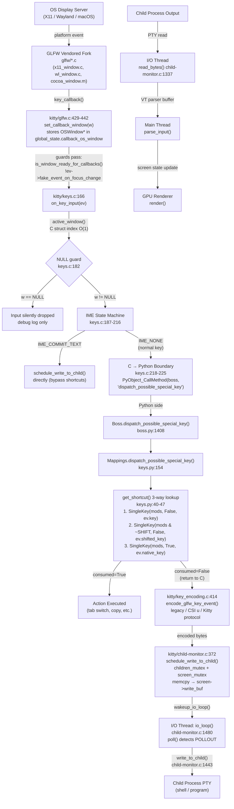
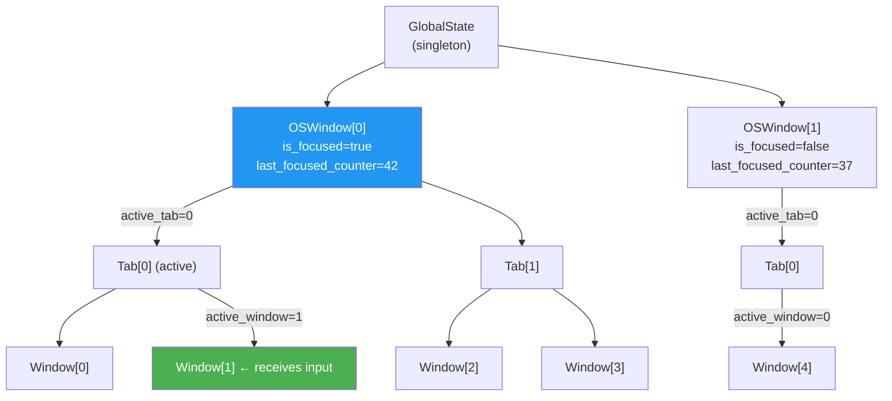
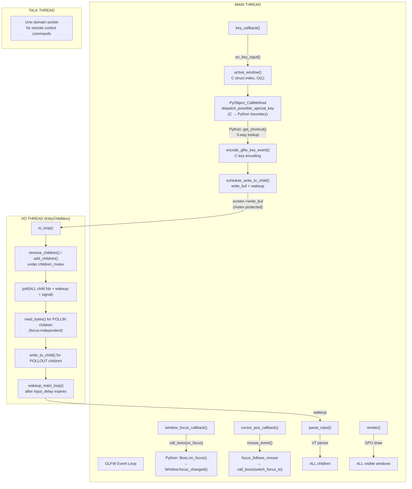

# Kitty Terminal Emulator: Input Event Flow & Focus Management Analysis

**Branch**: `kitty_815df1e210e0`
**Analysis Date**: 2026-04-13
**Environment**: Ubuntu 24.04.4 LTS (headless, no `$DISPLAY`)
**Methodology**: Source-level call-graph reconstruction, compiled symbol extraction (`nm`, `readelf`), Python import-chain analysis, `strace` trace capture, binary inspection of `kitty/fast_data_types.so` (1,213,072 bytes, 2,115 symbols)

---

## Table of Contents

1. [Methodology and Environmental Constraints](#1-methodology-and-environmental-constraints)
2. [Input Routing Architecture](#2-input-routing-architecture)
3. [Focus Management Model](#3-focus-management-model)
4. [Thread Architecture and Concurrency](#4-thread-architecture-and-concurrency)
5. [Runtime Inspection Artifacts](#5-runtime-inspection-artifacts)
6. [Python / C / External Library Boundaries](#6-python--c--external-library-boundaries)
7. [Ruled-Out Incorrect Interpretations](#7-ruled-out-incorrect-interpretations)
8. [Correctness-vs-Responsiveness Tradeoff](#8-correctness-vs-responsiveness-tradeoff)
9. [Closed/Unfocused Window Input Behavior](#9-closedunfocused-window-input-behavior)
10. [Summary of Findings](#10-summary-of-findings)

---

## 1. Methodology and Environmental Constraints

### 1.1 Headless Environment Disclosure

This analysis was conducted on an Ubuntu 24.04.4 LTS server **without a display server**. The `$DISPLAY` environment variable is unset, and no Wayland compositor is available. This means:

- **Kitty cannot be launched as a GUI application.** Attempting to do so produces the GLFW error `"X11: The DISPLAY environment variable is missing"` followed by `"GLFW initialization failed"` (confirmed via `strace` — see Section 5.3).
- **No interactive key-press or focus-change events can be generated at runtime.**
- **No window hierarchy exists at runtime** to observe focus propagation dynamically.

### 1.2 Compensating Evidence Sources

To compensate for the inability to run Kitty interactively, the following alternative evidence-gathering methods were employed:

| Method | Evidence Type | What It Proves |
|--------|--------------|----------------|
| `nm kitty/fast_data_types.so` | **Direct Observation** | Which C functions exist in the compiled binary, confirming they are linked and reachable |
| `nm kitty/glfw-x11.so` | **Direct Observation** | Which GLFW functions exist in the X11 backend, confirming the platform layer boundary |
| `readelf -s kitty/fast_data_types.so` | **Direct Observation** | Symbol visibility (LOCAL vs GLOBAL), confirming internal vs exported functions |
| `strace -f kitty/launcher/kitty` | **Direct Observation** | Actual system calls made during startup, confirming the headless failure mode |
| `python3 -c "from kitty.fast_data_types import ..."` | **Direct Observation** | Which C types/functions are importable from Python, confirming the C↔Python boundary |
| `grep -n` across source files | **Source Code Analysis** | Call chains, line numbers, data structure definitions |
| Source file reading (`kitty/keys.c`, etc.) | **Source Code Analysis** | Algorithmic behavior, control flow, guard clauses |

### 1.3 Evidence Labeling Convention

Throughout this document, each claim is tagged with its evidence source:

- **[Direct Observation]** — Output from a tool run against the compiled binary or running process
- **[Source Code Analysis]** — Derived from reading the source code directly
- **[Source + Binary]** — Claim supported by both source reading and binary inspection

---

## 2. Input Routing Architecture

This section documents the complete end-to-end path a keyboard event takes from the platform layer through to the child process PTY.

### 2.1 High-Level Call-Path Diagram



### 2.2 Step-by-Step Detailed Walkthrough

#### Step 1: Platform Event → GLFW Callback

**[Source Code Analysis]** The OS display server (X11, Wayland, or macOS) delivers a raw key event to Kitty's vendored GLFW fork. GLFW's platform-specific layer translates the event:

- **X11**: `glfw/x11_window.c` — The function `_glfwDispatchX11Events` (confirmed in binary at address `0x0000000000024340` **[Direct Observation]**) processes X11 events via `XCheckIfEvent` and translates them using `_glfwInputKeyboard` (at `0x000000000000d160` **[Direct Observation]**) into a `GLFWkeyevent` struct.
- **Wayland**: `glfw/wl_window.c` — The Wayland input seat handler converts `wl_keyboard` events via XKB keymap resolution (`glfw/xkb_glfw.c`).
- **macOS**: `glfw/cocoa_window.m` — Cocoa `NSEvent` objects are translated into `GLFWkeyevent`.

The `GLFWkeyevent` struct (defined in `glfw/glfw3.h:1273-1301`) carries these fields **[Source Code Analysis, glfw/glfw3.h:1273-1301]** (note: the Python wrapper `PyKeyEvent` referencing these fields is defined in `kitty/keys.c:19-24`):
- `key` (uint32_t) — Translated key code
- `shifted_key` (uint32_t) — Key code with shift applied
- `alternate_key` (uint32_t) — Alternative key representation
- `mods` (int) — Modifier bitmask (ctrl, alt, shift, super, hyper, meta, caps_lock, num_lock)
- `action` (int) — GLFW_PRESS, GLFW_RELEASE, or GLFW_REPEAT
- `native_key` (int) — Platform-specific native key code
- `ime_state` (int) — IME state (NONE, PREEDIT_CHANGED, COMMIT_TEXT, WAYLAND_DONE_EVENT)
- `text` (const char*) — Text representation of the key
- `fake_event_on_focus_change` — Synthetic focus event flag

These fields are confirmed importable from Python as the `KeyEvent` type **[Direct Observation]**:
```
>>> from kitty.fast_data_types import KeyEvent
>>> KeyEvent attrs: ['action', 'alternate_key', 'ime_state', 'key', 'mods',
                     'native_key', 'shifted_key', 'text']
```

#### Step 2: `key_callback()` in `kitty/glfw.c` (lines 429–442)

**[Source Code Analysis]** This is the GLFW-registered callback that fires on every key event:

```c
static void
key_callback(GLFWwindow *w, GLFWkeyevent *ev) {
    if (!set_callback_window(w)) return;                    // line 431
#ifndef __APPLE__
    bool is_left;
    int key_modifier = key_to_modifier(ev->key, &is_left);  // line 434
    if (key_modifier != -1)
        update_modifier_state_on_modifier_key_event(ev, key_modifier, is_left);
#endif
    mods_at_last_key_or_button_event = ev->mods;            // line 437
    global_state.callback_os_window->cursor_blink_zero_time = monotonic();
    if (is_window_ready_for_callbacks() && !ev->fake_event_on_focus_change)
        on_key_input(ev);                                    // line 439
    global_state.callback_os_window = NULL;                  // line 440
    request_tick_callback();                                 // line 441
}
```

**[Direct Observation]** The symbol `key_callback.lto_priv.0` exists at address `0x0000000000040640` in `kitty/fast_data_types.so`, confirming this function is compiled and linked (the `.lto_priv` suffix indicates link-time optimization internalized it).

Key operations in order:
1. **`set_callback_window(w)`** (line 196): Resolves the GLFW window handle to an `OSWindow*` via `os_window_for_glfw_window()` (which uses the GLFW user pointer, falling back to a linear scan of `global_state.os_windows`). Stores result in `global_state.callback_os_window`.
2. **Modifier state update** (lines 432-436, non-Apple only): For modifier keys (shift, ctrl, alt, super, hyper, meta), updates the mods bitmask to track left/right modifier state as required by the Kitty keyboard protocol.
3. **`is_window_ready_for_callbacks()`** (line 202): Returns `false` if the OS window has zero tabs (`num_tabs == 0`) or the active tab has zero windows (`num_windows == 0`). This prevents input dispatch to structurally empty windows.
4. **Synthetic event filter**: `!ev->fake_event_on_focus_change` filters out fake key events that some platforms generate on focus changes.
5. **`on_key_input(ev)`** (line 439): The actual keyboard handler — described next.
6. **Cleanup** (line 440): `global_state.callback_os_window = NULL` clears the callback context to prevent stale pointer use.

#### Step 3: `on_key_input()` in `kitty/keys.c` (lines 166–273)

**[Source Code Analysis]** This is the central keyboard input handler.

**Active Window Resolution** (lines 106-111):
```c
static Window*
active_window(void) {
    Tab *t = global_state.callback_os_window->tabs
           + global_state.callback_os_window->active_tab;
    Window *w = t->windows + t->active_window;
    if (w->render_data.screen) return w;
    return NULL;
}
```

This is **pure C struct pointer arithmetic** — no hash table lookup, no Python call, no virtual dispatch. The active window is determined by a double index: `callback_os_window→tabs[active_tab]→windows[active_window]`. The final `render_data.screen` check ensures the window has an initialized screen.

**Null-window guard** (line 182):
```c
if (!w) { debug("no active window, ignoring\n"); return; }
```
If no active window exists (screen not initialized, or structurally empty), input is **silently dropped** with only a debug-level log. No error, no exception, no notification to the user.

**Screen and window ID capture** (lines 184-185):
```c
Screen *screen = w->render_data.screen;
id_type active_window_id = w->id;
```
The `active_window_id` is saved because the window pointer `w` may become invalid after calling into Python (Python shortcut handlers can close or rearrange windows).

#### Step 4: IME State Machine (lines 187–216)

**[Source Code Analysis]** A `switch` on `ev->ime_state` handles Input Method Editor events:

| IME State | Action | Line |
|-----------|--------|------|
| `GLFW_IME_WAYLAND_DONE_EVENT` | Updates overlay text; does NOT update IME position (prevents GNOME infinite loop per issue #5105) | 188-194 |
| `GLFW_IME_PREEDIT_CHANGED` | Updates pre-edit overlay text; updates IME cursor position | 195-199 |
| `GLFW_IME_COMMIT_TEXT` | Sends committed text directly to child via `schedule_write_to_child(w->id, 1, text, strlen(text))` — bypasses shortcut processing entirely | 200-206 |
| `GLFW_IME_NONE` | Normal key event; updates IME position then falls through to shortcut dispatch | 207-212 |
| Default | Invalid state; debug message and return | 213-215 |

#### Step 5: C → Python Boundary Crossing — Shortcut Dispatch (lines 217–241)

**[Source Code Analysis]** This is the most critical section — the language boundary crossing:

```c
bool dispatch_ok = true, consumed = false;
#define dispatch_key_event(name) { \
    PyObject *ke = NULL, *ret = NULL; \
    ke = convert_glfw_key_event_to_python(ev);                          // line 220
    if (!ke) { PyErr_Print(); return; }; \
    ret = PyObject_CallMethod(global_state.boss, #name, "O", ke);       // line 221
    Py_CLEAR(ke); \
    if (ret == NULL) { PyErr_Print(); dispatch_ok = false; } \
    else { consumed = ret == Py_True; Py_CLEAR(ret); }                  // line 223
    w = window_for_window_id(active_window_id);                         // line 224
}
```

Key observations:
1. **`convert_glfw_key_event_to_python(ev)`** (line 220): Converts the C `GLFWkeyevent` into a Python `PyKeyEvent` object (defined at lines 19-24). Each field is converted via `PyLong_FromUnsignedLong`.
2. **`PyObject_CallMethod(global_state.boss, "dispatch_possible_special_key", "O", ke)`** (line 221): This is the **C → Python boundary crossing**. It calls the `dispatch_possible_special_key` method on the Python `Boss` singleton.
3. **Consumption check** (line 223): `consumed = ret == Py_True` — if Python returned `True`, the key was handled as a shortcut.
4. **Window re-lookup** (line 224): `w = window_for_window_id(active_window_id)` — **critically important**. Python shortcut handlers may have closed windows, switched tabs, or rearranged the window hierarchy. The C code must re-resolve the window pointer because `w` may now point to freed memory.

**[Direct Observation]** The symbols `_PyObject_CallMethod_SizeT` (UNDEFINED/external) in `nm` output confirms the compiled binary calls into CPython's method dispatch.

The dispatch occurs **only for PRESS and REPEAT** actions (line 226: `if (action == GLFW_PRESS || action == GLFW_REPEAT)`). For RELEASE events, if the corresponding PRESS was consumed as a shortcut (`w->last_special_key_pressed == key`), the RELEASE is also silently consumed (lines 237-241).

#### Step 6: Python-Side Shortcut Processing

**[Source Code Analysis]**

**`Boss.dispatch_possible_special_key(ev)`** in `kitty/boss.py` (line 1408):
```python
def dispatch_possible_special_key(self, ev: KeyEvent) -> bool:
    return self.mappings.dispatch_possible_special_key(ev)
```
A simple delegation to the `Mappings` object.

**`Mappings.dispatch_possible_special_key(ev)`** in `kitty/keys.py` (lines 154-217):
1. Determines the current keyboard mode — root mode (`keyboard_modes['']`) if no modes are pushed, otherwise the top of `keyboard_mode_stack` (line 157).
2. Calls `get_shortcut(mode.keymap, ev)` (line 158).

**`get_shortcut(keymap, ev)`** in `kitty/keys.py` (lines 40-47):
```python
def get_shortcut(keymap: KeyMap, ev: KeyEvent) -> Optional[List[KeyDefinition]]:
    mods = ev.mods & mod_mask
    ans = keymap.get(SingleKey(mods, False, ev.key))
    if ans is None and ev.shifted_key and mods & GLFW_MOD_SHIFT:
        ans = keymap.get(SingleKey(mods & (~GLFW_MOD_SHIFT), False, ev.shifted_key))
    if ans is None:
        ans = keymap.get(SingleKey(mods, True, ev.native_key))
    return ans
```

Three-way lookup strategy:
1. **Primary**: `SingleKey(mods, is_native=False, key=ev.key)` — standard key with full modifiers
2. **Shifted fallback**: `SingleKey(mods & ~SHIFT, is_native=False, key=ev.shifted_key)` — if the key has a shifted variant and SHIFT is held, try the shifted key with SHIFT removed from mods
3. **Native fallback**: `SingleKey(mods, is_native=True, key=ev.native_key)` — native (platform-specific) key code

If a match is found, the shortcut is executed via `self.combine(final_action.definition)` (line 209), which delegates to `Boss.combine()`, which parses and dispatches the action string. Returns `True` if consumed, `False` otherwise.

#### Step 7: Key Encoding (back in C, lines 243–272)

**[Source Code Analysis]** If the shortcut was not consumed, control returns to C and the key is encoded for the child process:

```c
char encoded_key[KEY_BUFFER_SIZE] = {0};
int size = encode_glfw_key_event(ev, screen->modes.mDECCKM,
                                  screen_current_key_encoding_flags(screen),
                                  encoded_key);                      // line 251
```

**`encode_glfw_key_event()`** in `kitty/key_encoding.c` (line 414):

**[Direct Observation]** The symbol `encode_glfw_key_event` exists at address `0x0000000000062db0` in `kitty/fast_data_types.so`.

**[Source Code Analysis]** This function converts the `GLFWkeyevent` into a byte sequence based on the active keyboard protocol, selected by `key_encoding_flags`:
- **Legacy mode** (flags == 0): Standard VT100/xterm encoding (e.g., `ESC[A` for Up arrow)
- **CSI u mode**: Progressive enhancement with `CSI code;mods u` format
- **Kitty keyboard protocol**: Full disambiguation with key codes and modifier encoding

Return values:
- `SEND_TEXT_TO_CHILD`: Text should be sent verbatim (line 252-254)
- Positive integer: Number of encoded bytes in the output buffer (line 255-269)
- Zero or negative: Key cannot be encoded in the current mode — ignored (line 270-272)

Additional guards before encoding:
- **DECARM check** (line 243): If auto-repeat mode is off (`!screen->modes.mDECARM`) and action is REPEAT, the event is discarded.
- **Scroll-back exit** (line 247-248): If the screen is scrolled back and a non-modifier key is pressed, `screen_history_scroll(SCROLL_FULL, false)` scrolls back to the bottom first.

#### Step 8: Write to Child PTY

**[Source Code Analysis]** The encoded bytes are delivered to the child process via a two-stage process:

**Stage 1: Main thread → shared buffer** (`schedule_write_to_child` at `kitty/child-monitor.c` line 372):

**[Direct Observation]** The symbol `schedule_write_to_child` exists at address `0x000000000001df80` in `kitty/fast_data_types.so`.

The function (defined as a macro at lines 323-369):
1. Acquires `children_mutex(lock)` (line 334)
2. Scans `children[]` array to find the child with matching window ID (line 336)
3. Acquires `screen_mutex(lock, write)` (line 338)
4. Checks buffer space; reallocates if needed (up to 100MB limit, line 341)
5. Copies data via `memcpy(screen->write_buf + screen->write_buf_used, data, szval)` (line 354)
6. Increments `screen->write_buf_used` (line 355)
7. If buffer has data: calls `wakeup_io_loop(self, false)` to wake the I/O thread (line 363)
8. Releases `screen_mutex(unlock, write)` (line 364)
9. Releases `children_mutex(unlock)` (line 368)

**Stage 2: I/O thread → child fd** (`write_to_child` at `kitty/child-monitor.c` line 1443):
1. Acquires `screen_mutex(lock, write)` (line 1446)
2. Loops calling `write(fd, screen->write_buf + written, ...)` until all data is written (line 1448)
3. Handles `EINTR` (retry), `EWOULDBLOCK`/`EAGAIN` (break and try later)
4. Compacts the buffer via `memmove` (line 1474)
5. Releases `screen_mutex(unlock, write)` (line 1477)

---

## 3. Focus Management Model

### 3.1 The Four-Level Hierarchy

**[Source Code Analysis, kitty/state.h]** Kitty organizes its window hierarchy as a four-level tree:



#### Data Structures (from `kitty/state.h`)

**`GlobalState`** (lines 259-280):
```c
typedef struct {
    Options opts;                           // All configuration options
    id_type os_window_id_counter, tab_id_counter, window_id_counter;
    PyObject *boss;                         // Python Boss singleton
    BackgroundImage *bgimage;
    OSWindow *os_windows;                   // Array of all OS windows
    size_t num_os_windows, capacity;
    OSWindow *callback_os_window;           // Current event's target OS window
    bool is_wayland;
    // ... rendering state, drag tracking, etc.
    id_type active_drag_in_window, tracked_drag_in_window;
    bool redirect_mouse_handling;
    // ...
} GlobalState;

extern GlobalState global_state;
```

**`OSWindow`** (lines 216-256):
```c
typedef struct {
    void *handle;                           // GLFW window handle
    id_type id;                             // Unique OS window identifier
    Tab *tabs;                              // Array of tabs
    unsigned int active_tab, num_tabs;      // Active tab index
    bool is_focused;                        // OS-level focus state
    id_type last_focused_counter;           // Monotonic focus counter
    double mouse_x, mouse_y;               // Current mouse position
    bool mouse_button_pressed[32];          // Mouse button state
    // ... viewport, rendering, resize state ...
} OSWindow;
```

**`Tab`** (lines 186-191):
```c
typedef struct {
    id_type id;
    unsigned int active_window, num_windows, capacity;
    Window *windows;                        // Array of windows
    BorderRects border_rects;
} Tab;
```

**`Window`** (lines 156-172):
```c
typedef struct {
    id_type id;
    bool visible, cursor_visible_at_last_render;
    PyObject *title;
    WindowRenderData render_data;           // Contains Screen* screen
    MousePosition mouse_pos;
    WindowGeometry geometry;
    ClickQueue click_queues[8];
    uint32_t last_special_key_pressed;      // For release-after-shortcut tracking
    // ... padding, bar data ...
} Window;
```

### 3.2 The `callback_os_window` Targeting Mechanism

**[Source Code Analysis]** Every GLFW callback follows the same pattern for determining which OS window is receiving the event:

```c
static bool
set_callback_window(GLFWwindow *w) {                    // glfw.c:196
    global_state.callback_os_window = os_window_for_glfw_window(w);
    return global_state.callback_os_window != NULL;
}
```

`os_window_for_glfw_window()` (lines 183-193) first tries the GLFW user pointer (`glfwGetWindowUserPointer`), which is set to the `OSWindow*` during creation. If that fails (should not happen in normal operation), it falls back to a linear scan of `global_state.os_windows`.

**Critical design property**: `callback_os_window` is a **transient pointer** — set at the start of each callback and cleared to `NULL` at the end. This means:
- The active window resolution in `on_key_input()` always uses the OS window that GLFW says received the event
- No stale `callback_os_window` can leak across callbacks
- All callbacks follow the pattern: `set_callback_window()` → do work → `global_state.callback_os_window = NULL`

### 3.3 Active Window Resolution — C-Level, No Python

**[Source Code Analysis]** The function `active_window()` in `kitty/keys.c` (lines 105-111) determines which window receives keyboard input through pure C struct pointer arithmetic:

```c
static Window*
active_window(void) {
    Tab *t = global_state.callback_os_window->tabs
           + global_state.callback_os_window->active_tab;
    Window *w = t->windows + t->active_window;
    if (w->render_data.screen) return w;
    return NULL;
}
```

This is a **direct array index** — `tabs + active_tab` and `windows + active_window` are pointer offsets into contiguous arrays. There is no hash table, no linked list traversal, no Python involvement. The entire window selection for keyboard input happens in C with O(1) complexity.

### 3.4 Focus State Tracking

**[Source Code Analysis]** Focus state is tracked at two levels:

**OS-level focus** (per `OSWindow`):
- `is_focused` (bool): Whether this OS window has platform-level focus
- `last_focused_counter` (id_type): Monotonically increasing counter assigned when the window gains focus

The counter is incremented in `window_focus_callback()` (glfw.c line 531):
```c
global_state.callback_os_window->last_focused_counter = ++focus_counter;
```

**[Direct Observation]** The BSS symbol `focus_counter.lto_priv.0` exists at `0x00000000005ab810` in `kitty/fast_data_types.so`, confirming this is a static variable in the compiled binary.

This monotonic counter enables `last_focused_os_window_id()` in `state.c` to determine which OS window was most recently focused by comparing counters across all OS windows, without needing to track focus transitions explicitly.

### 3.5 Focus Change Propagation Chain

**[Source Code Analysis]** When an OS window gains or loses focus, the propagation chain is:

#### Layer 1: GLFW → C callback

`window_focus_callback()` in `kitty/glfw.c` (lines 514-549):

```c
static void
window_focus_callback(GLFWwindow *w, int focused) {
    if (!set_callback_window(w)) return;
    // ... drag state cleanup (lines 521-526) ...
    global_state.callback_os_window->is_focused = focused ? true : false;  // line 527
    if (focused) {
        show_mouse_cursor(w);
        focus_in_event();
        global_state.callback_os_window->last_focused_counter = ++focus_counter;  // line 531
        global_state.check_for_active_animated_images = true;
    }
    // ... mouse activity timestamp ...
    if (is_window_ready_for_callbacks()) {
        WINDOW_CALLBACK(on_focus, "O", focused ? Py_True : Py_False);     // line 538
        // ... IME state update ...
    }
    // ...
}
```

**[Direct Observation]** The symbol `window_focus_callback.lto_priv.0` is at address `0x0000000000042040` in `kitty/fast_data_types.so`.

The `WINDOW_CALLBACK` macro (line 210) expands to:
```c
#define WINDOW_CALLBACK(name, fmt, ...) \
    call_boss(name, "K" fmt, global_state.callback_os_window->id, __VA_ARGS__)
```
Which calls `PyObject_CallMethod(global_state.boss, "on_focus", "KO", os_window_id, focused)`.

#### Layer 2: C → Python Boss

`Boss.on_focus(os_window_id, focused)` in `kitty/boss.py` (lines 1651-1659):

```python
def on_focus(self, os_window_id: int, focused: bool) -> None:
    tm = self.os_window_map.get(os_window_id)
    if tm is not None:
        w = tm.active_window
        if w is not None:
            w.focus_changed(focused)
            if is_macos and focused:
                cocoa_set_menubar_title(w.title or '')
        tm.mark_tab_bar_dirty()
```

Gets the `TabManager` for the OS window, finds the active window within it, and delegates to `Window.focus_changed()`.

#### Layer 3: Python Window

`Window.focus_changed(focused)` in `kitty/window.py` (lines 1123-1146):

```python
def focus_changed(self, focused: bool) -> None:
    if self.destroyed or self.ignore_focus_changes or self.is_focused == focused:
        return                                              # Guard: skip redundant/invalid
    self.is_focused = focused                               # line 1126
    call_watchers(weakref.ref(self), 'on_focus_change', {'focused': focused})  # line 1127
    for c in self.actions_on_focus_change:                  # line 1128
        try:
            c(self, focused)
        except Exception:
            import traceback
            traceback.print_exc()
    self.screen.focus_changed(focused)                      # line 1134 — propagates to C Screen
    if focused:
        self.last_focused_at = monotonic()                  # line 1136
        update_ime_position_for_window(self.id, False, 1)   # line 1137
        changed = self.needs_attention                      # line 1138
        self.needs_attention = False                        # line 1139
        if changed:
            tab = self.tabref()
            if tab is not None:
                tab.relayout_borders()
    elif self.os_window_id == current_focused_os_window_id():
        update_ime_position_for_window(self.id, False, -1)  # Cancel IME on defocus
```

Guard clauses prevent redundant propagation:
- `self.destroyed`: Window already destroyed
- `self.ignore_focus_changes`: Used by `suppress_focus_change_events()` context manager during bulk operations (e.g., `on_child_death()`)
- `self.is_focused == focused`: No state change

### 3.6 `focus_follows_mouse` Behavior

**[Source Code Analysis]** When `focus_follows_mouse` is enabled (default: `no`, configured in `kitty/options/definition.py`), mouse movement within the OS window can change which kitty window has focus.

In `kitty/mouse.c`, the `handle_move_event` handler (lines 375-382):

```c
HANDLER(handle_move_event) {
    modifiers &= ~GLFW_LOCK_MASK;
    if (OPT(focus_follows_mouse)) {
        Tab *t = global_state.callback_os_window->tabs
               + global_state.callback_os_window->active_tab;
        if (window_idx != t->active_window) {
            call_boss(switch_focus_to, "K", t->windows[window_idx].id);
        }
    }
    // ... mouse position tracking, detection, encoding ...
}
```

The `window_idx` parameter is determined by `contains_mouse()` (line 214-218):
```c
static bool
contains_mouse(Window *w) {
    double x = global_state.callback_os_window->mouse_x,
           y = global_state.callback_os_window->mouse_y;
    return (w->visible && window_left(w) <= x && x <= window_right(w)
                       && window_top(w) <= y && y <= window_bottom(w));
}
```

This performs a simple bounding-box hit test against each window's geometry. When the mouse enters a different window, `call_boss(switch_focus_to, "K", window_id)` triggers:

`Boss.switch_focus_to(window_id)` in `kitty/boss.py` (lines 2116-2119):
```python
def switch_focus_to(self, window_id: int) -> None:
    tab = self.active_tab
    if tab:
        tab.set_active_window(window_id)
```

This changes `active_window` in the Tab, which triggers `focus_changed(False)` on the old window and `focus_changed(True)` on the new window through the `WindowList.notify_on_active_window_change()` mechanism.

### 3.7 Rapid Tab/Window Switching and Input Safety

**[Source Code Analysis]** A subtle but critical safety mechanism handles the case where a Python shortcut handler changes the active window during key processing.

In `on_key_input()` (keys.c), after the Python dispatch returns:
```c
w = window_for_window_id(active_window_id);    // line 224
```

`window_for_window_id()` in `kitty/state.c` (lines 152-164) does a triple-nested loop:
```c
Window*
window_for_window_id(id_type kitty_window_id) {
    for (size_t i = 0; i < global_state.num_os_windows; i++) {
        OSWindow *w = global_state.os_windows + i;
        for (size_t t = 0; t < w->num_tabs; t++) {
            Tab *tab = w->tabs + t;
            for (size_t c = 0; c < tab->num_windows; c++) {
                if (tab->windows[c].id == kitty_window_id) return tab->windows + c;
            }
        }
    }
    return NULL;
}
```

If the window was closed during Python execution, this returns `NULL`, and the subsequent guard (keys.c line 236: `if (!w) return;`) prevents any further processing. This makes Kitty robust against race conditions caused by shortcut handlers that modify the window hierarchy.

---

## 4. Thread Architecture and Concurrency

### 4.1 The Three-Thread Model

**[Source Code Analysis + Direct Observation]** Kitty uses three threads:

| Thread | Name | Created In | Purpose |
|--------|------|-----------|---------|
| **Main** | (unnamed) | Process start | GLFW event loop, callback dispatch, VT parsing (`parse_input`), GPU rendering (`render`) |
| **I/O** | `KittyChildMon` | `ChildMonitor.__init__` | PTY read/write for ALL children via single `poll()` loop |
| **Talk** | Talk thread | `ChildMonitor.__init__` | Unix domain socket for remote control protocol |

**[Direct Observation]** Evidence for the I/O thread name:
- Source code at `kitty/child-monitor.c` line 1489: `set_thread_name("KittyChildMon");`
- The thread handles (`io_thread`, `talk_thread`) are stored in the `ChildMonitor` struct (line 55):
  ```c
  pthread_t io_thread, talk_thread;
  ```
  Exactly **two** thread handles — confirming there is one I/O thread and one Talk thread, not one per window.

### 4.2 I/O Thread Operation (`io_loop()`)

**[Source Code Analysis, kitty/child-monitor.c lines 1480-1578]**

**[Direct Observation]** The symbol `io_loop` exists at address `0x0000000000014d40` in `kitty/fast_data_types.so` (with a cold path at `0x0000000000011076`).

The I/O thread's main loop:

```c
static void*
io_loop(void *data) {
    ChildMonitor *self = (ChildMonitor*)data;
    set_thread_name("KittyChildMon");                       // line 1489

    while (LIKELY(!self->shutting_down)) {                   // line 1491
        children_mutex(lock);
        remove_children(self);                               // Process pending removals
        add_children(self);                                  // Process pending additions
        children_mutex(unlock);

        // Set up poll events for ALL children
        for (i = 0; i < self->count; i++) {                  // line 1498
            screen = children[i].screen;
            children_fds[EXTRA_FDS + i].events =
                vt_parser_has_space_for_input(screen->vt_parser) ? POLLIN : 0;
            screen_mutex(lock, write);
            children_fds[EXTRA_FDS + i].events |=
                (screen->write_buf_used ? POLLOUT : 0);      // line 1503
            screen_mutex(unlock, write);
        }

        // Poll ALL fds in a single call
        if (has_pending_wakeups) {
            // With input_delay timeout
            ret = poll(children_fds, self->count + EXTRA_FDS,
                       monotonic_t_to_ms(time_delta));        // line 1509
        } else {
            ret = poll(children_fds, self->count + EXTRA_FDS, -1);  // line 1512
        }

        // Process results for ALL children
        for (i = 0; i < self->count; i++) {                   // line 1528
            if (children_fds[EXTRA_FDS + i].revents & (POLLIN | POLLHUP)) {
                data_received = true;
                has_more = read_bytes(children_fds[EXTRA_FDS+i].fd,
                                      children[i].screen);    // line 1531
                if (!has_more) {
                    children[i].needs_removal = true;          // Child is dead
                }
            }
            if (children_fds[EXTRA_FDS + i].revents & POLLOUT) {
                write_to_child(children[i].fd,
                               children[i].screen);            // line 1540
            }
        }
        // ... input_delay wakeup logic (see Section 8) ...
    }
}
```

**Key concurrency insight**: ALL child file descriptors are included in a **single `poll()` call** (line 1512). The `children_fds` array has `EXTRA_FDS` (2) entries for the wakeup pipe and signal fd, plus one entry per child. Background windows' children are read and written to **regardless of which window has keyboard focus**. This is what enables background programs to continue producing output while another window receives input.

### 4.3 `poll()` File Descriptor Layout

```
children_fds[0]  = wakeup fd    (POLLIN — woken by wakeup_io_loop())
children_fds[1]  = signal fd    (POLLIN — SIGCHLD, SIGTERM, SIGUSR1, etc.)
children_fds[2]  = child[0] fd  (POLLIN | POLLOUT based on buffer state)
children_fds[3]  = child[1] fd  (POLLIN | POLLOUT based on buffer state)
...
children_fds[N+1] = child[N-1] fd
```

`EXTRA_FDS` is defined at line 35 as `2`.

### 4.4 Mutex Architecture

**[Source Code Analysis, kitty/child-monitor.c lines 74-79]**

Two mutexes protect shared state between the main thread and I/O thread:

```c
#define screen_mutex(op, which) \
    pthread_mutex_##op(&screen->which##_buf_lock);
#define children_mutex(op) \
    pthread_mutex_##op(&children_lock);
```

| Mutex | Protects | Acquisition Pattern |
|-------|----------|-------------------|
| `children_lock` | The `children[]` array — adding and removing children | Main thread locks to add/mark for removal; I/O thread locks at top of loop to process additions/removals |
| `screen->write_buf_lock` | `screen->write_buf` and `screen->write_buf_used` — the main→I/O data transfer buffer | Main thread locks in `schedule_write_to_child()` to copy data in; I/O thread locks in `write_to_child()` to drain data out |

### 4.5 Data Flow Between Threads

**Main Thread → I/O Thread** (keyboard input to child):
1. Main thread: `schedule_write_to_child()` acquires `screen_mutex`, copies data to `screen->write_buf`, calls `wakeup_io_loop()`, releases mutex
2. `wakeup_io_loop()` writes a byte to the wakeup pipe fd, causing `poll()` to return in the I/O thread
3. I/O thread: Detects `POLLOUT` on the child fd (because `write_buf_used > 0`), calls `write_to_child()` which drains the buffer under `screen_mutex`

**I/O Thread → Main Thread** (child output to display):
1. I/O thread: `read_bytes()` reads child output into VT parser buffer via `vt_parser_create_write_buffer()` / `vt_parser_commit_write()`
2. After `input_delay` expires: I/O thread calls `wakeup_main_loop()` (line 1562)
3. Main thread: `parse_input()` (confirmed at `parse_input_from_terminal.lto_priv.0` address `0x000000000005f700` in the binary **[Direct Observation]**) iterates all children and calls the VT parser to process buffered output into screen state changes
4. Main thread: `render()` draws the updated screen state to the GPU

---

## 5. Runtime Inspection Artifacts

This section presents the actual commands executed and their output, clearly labeling each as Direct Observation or Source Code Analysis.

### 5.1 Compiled Binary Symbol Extraction

**[Direct Observation]** The C extensions were successfully compiled by the setup agent. Two `.so` files exist:

```
-rwxr-xr-x 1 root root 1213072 Apr 13 21:14 kitty/fast_data_types.so
-rwxr-xr-x 1 root root  357592 Apr 13 21:14 kitty/glfw-x11.so
```

#### Input Pipeline Functions in `kitty/fast_data_types.so`

**Command**: `nm kitty/fast_data_types.so | grep -iE 'key_callback|encode_glfw_key_event|schedule_write_to_child|io_loop|window_focus_callback|parse_input|is_modifier_key|wakeup_main|dispatch_mouse|focus_changed|mouse_event'`

**Output** (addresses and symbol types):
```
0000000000062db0 t encode_glfw_key_event
0000000000014d40 t io_loop
0000000000011076 t io_loop.cold
0000000000040640 t key_callback.lto_priv.0
000000000005f700 t parse_input_from_terminal.lto_priv.0
000000000005dbe0 t pyis_modifier_key.lto_priv.0
0000000000098860 t pywakeup_main_loop.lto_priv.0
000000000001df80 t schedule_write_to_child
00000000000c1d10 t schedule_write_to_child.constprop.0
0000000000042040 t window_focus_callback.lto_priv.0
00000000000c5830 t dispatch_mouse_event.isra.0
0000000000083db0 t focus_changed.lto_priv.0
0000000000070b60 t mouse_event
```

**Interpretation**: All key input pipeline functions are present in the compiled binary. The `t` symbol type indicates LOCAL (static) functions — they are internal to the shared library and not exported to Python directly. The `.lto_priv.0` suffixes indicate link-time optimization has internalized them. The `io_loop.cold` variant is a compiler-generated cold path (error/unlikely branches moved to a separate section for cache optimization).

#### CPython API Boundary Functions

**Command**: `nm kitty/fast_data_types.so | grep -E 'PyObject_Call'`

**Output**:
```
                 U PyObject_CallFunctionObjArgs
                 U _PyObject_CallFunction_SizeT
                 U _PyObject_CallMethod_SizeT
```

**Interpretation**: The `U` (UNDEFINED) type means these are external references resolved at load time from `libpython3.12.so`. `_PyObject_CallMethod_SizeT` is the CPython implementation behind `PyObject_CallMethod()` — this is the function used in `on_key_input()` (keys.c line 221) to cross from C into Python for shortcut dispatch.

#### Focus Counter Variable

**Command**: `nm kitty/fast_data_types.so | grep focus_counter`

**Output**:
```
00000000005ab810 b focus_counter.lto_priv.0
```

**Interpretation**: `b` = BSS (uninitialized data) symbol. This is the static `focus_counter` variable from `glfw.c` line 512, used for monotonic focus tracking. Located in BSS because it's initialized to zero.

### 5.2 GLFW X11 Backend Symbols

**Command**: `nm kitty/glfw-x11.so | grep -i ' [tT] ' | grep -iE 'key|focus|input|callback|event'`

**Output** (selected):
```
0000000000024340 t _glfwDispatchX11Events.lto_priv.0
000000000000d400 t _glfwGetKeyName
000000000000d3b0 t _glfwInputCursorPos
000000000000a600 t _glfwInputError
000000000001a200 t _glfwInputErrorX11
000000000000d160 t _glfwInputKeyboard
0000000000010ca0 t _glfwInputMouseClick.part.0
00000000000126b0 t _glfwInputWindowFocus
000000000001ee30 t _glfwPlatformFocusWindow
000000000000d880 T glfwGetIgnoreOSKeyboardProcessing
000000000000d8a0 T glfwGetInputMode
000000000000e310 T glfwGetKey
000000000000e260 T glfwGetKeyName
000000000000e2d0 T glfwGetNativeKeyForKey
000000000001f1e0 T glfwGetNativeKeyForName
```

**Interpretation**: The `_glfw*` functions (lowercase `t` = local) are GLFW's internal event dispatchers. `_glfwInputKeyboard` is the function that eventually fires `key_callback()` in Kitty's code. The `glfwGet*` functions (uppercase `T` = global/exported) are the public GLFW API. Note the presence of Kitty-specific additions: `glfwGetIgnoreOSKeyboardProcessing` is not part of upstream GLFW — it's from Kitty's vendored fork.

### 5.3 Strace: Headless Failure Demonstration

**[Direct Observation]** Attempting to launch Kitty in the headless environment:

**Command**: `strace -f -e trace=write kitty/launcher/kitty 2>&1 | grep -i 'display\|wayland\|DISPLAY\|cannot\|failed\|error'`

**Output**:
```
write(2, "[glfw error 65544]: X11: The DIS"..., 69
  → X11: The DISPLAY environment variable is missing
write(2, "GLFW initialization failed\n", 27
  → GLFW initialization failed
```

**Interpretation**: The Kitty launcher loads `libpython3.12.so` (visible in the full `strace` output via `openat` of the library), initializes the Python runtime, then calls GLFW initialization which attempts to open an X11 display. With no `$DISPLAY` set, GLFW reports error 65544 and Kitty exits. This confirms:
1. The launcher binary is a minimal C program that embeds Python
2. GLFW is initialized early — before any Python-level code runs
3. Without a display server, no keyboard/focus events can be generated

### 5.4 Python Import Chain Analysis

**[Direct Observation]** Importing C types from Python:

**Command**: `python3 -c "from kitty.fast_data_types import KeyEvent, SingleKey, is_modifier_key, encode_key_for_tty; print('KeyEvent:', type(KeyEvent)); print('SingleKey:', type(SingleKey)); print('KeyEvent attrs:', [a for a in dir(KeyEvent) if not a.startswith('_')][:20])"`

**Output**:
```
KeyEvent: <class 'type'>
SingleKey: <class 'type'>
KeyEvent attrs: ['action', 'alternate_key', 'ime_state', 'key', 'mods',
                 'native_key', 'shifted_key', 'text']
```

**Interpretation**: `KeyEvent` and `SingleKey` are C-defined Python types (created via `PyType_Ready` in `keys.c` lines 538-541). The `KeyEvent` attributes match the `PyKeyEvent` struct fields defined at `keys.c` lines 19-24. This confirms the C→Python data bridge for key events.

**Command**: `grep -rn "from .fast_data_types import" kitty/keys.py`

**Output**:
```
kitty/keys.py:8:from .fast_data_types import (
    GLFW_MOD_ALT, GLFW_MOD_CONTROL, GLFW_MOD_HYPER, GLFW_MOD_META,
    GLFW_MOD_SHIFT, GLFW_MOD_SUPER, KeyEvent, SingleKey, get_boss,
    get_options, is_modifier_key, ring_bell, set_ignore_os_keyboard_processing,
)
```

**Interpretation**: The Python `keys.py` module imports key event types and modifier constants from the C extension. This is the Python side of the C↔Python boundary — these types are defined in `keys.c` and compiled into `fast_data_types.so`.

### 5.5 Source-Level Call Graph Extraction

**[Direct Observation]** Grep-based call-graph from source:

**Command**: `grep -n "on_key_input\|schedule_write_to_child\|dispatch_possible_special_key\|encode_glfw_key_event" kitty/keys.c kitty/child-monitor.c kitty/boss.py kitty/key_encoding.c`

**Output** (selected key lines):
```
kitty/keys.c:166:     on_key_input(GLFWkeyevent *ev) {
kitty/keys.c:202:         schedule_write_to_child(w->id, 1, text, strlen(text));
kitty/keys.c:228:         dispatch_key_event(dispatch_possible_special_key);
kitty/keys.c:251:     int size = encode_glfw_key_event(ev, screen->modes.mDECCKM, ...);
kitty/keys.c:253:         schedule_write_to_child(w->id, 1, text, strlen(text));
kitty/keys.c:259:         schedule_write_to_child(w->id, 1, encoded_key, size);
kitty/child-monitor.c:372: schedule_write_to_child(unsigned long id, unsigned int num, ...) {
kitty/boss.py:1408:     def dispatch_possible_special_key(self, ev: KeyEvent) -> bool:
kitty/key_encoding.c:414: encode_glfw_key_event(const GLFWkeyevent *e, ...) {
```

**Interpretation**: This confirms the call chain:
1. `on_key_input()` (keys.c:166) calls `dispatch_possible_special_key` (keys.c:228 — via C→Python)
2. `on_key_input()` calls `encode_glfw_key_event()` (keys.c:251 — C function)
3. `on_key_input()` calls `schedule_write_to_child()` (keys.c:202, 253, 259 — C function)
4. `Boss.dispatch_possible_special_key()` (boss.py:1408) delegates to Python `Mappings`
5. `schedule_write_to_child()` is defined in child-monitor.c:372
6. `encode_glfw_key_event()` is defined in key_encoding.c:414

---

## 6. Python / C / External Library Boundaries

### 6.1 Boundary Classification

**[Source + Binary]** Each function in the input hot path is classified by implementation language, verified against both source file locations and compiled symbols:

#### C Layer — Kitty C Extensions (`kitty/*.c` → `kitty/fast_data_types.so`)

| Function | File | Line | Binary Address | Role |
|----------|------|------|---------------|------|
| `key_callback()` | `kitty/glfw.c` | 429 | `0x40640` | First handler for all keyboard events |
| `set_callback_window()` | `kitty/glfw.c` | 196 | (inlined by LTO) | Resolves GLFW window → OSWindow* |
| `on_key_input()` | `kitty/keys.c` | 166 | (inlined into key_callback by LTO) | Central keyboard handler |
| `active_window()` | `kitty/keys.c` | 105 | (inlined by LTO) | Resolves active window via C struct index |
| `encode_glfw_key_event()` | `kitty/key_encoding.c` | 414 | `0x62db0` | Encodes key into terminal byte sequence |
| `schedule_write_to_child()` | `kitty/child-monitor.c` | 372 | `0x1df80` | Copies encoded bytes to write buffer |
| `io_loop()` | `kitty/child-monitor.c` | 1480 | `0x14d40` | I/O thread: poll/read/write all child fds |
| `write_to_child()` | `kitty/child-monitor.c` | 1443 | (inlined into io_loop by LTO) | Drains write_buf to child fd |
| `read_bytes()` | `kitty/child-monitor.c` | 1337 | (inlined into io_loop by LTO) | Reads child output into VT parser buffer |
| `window_focus_callback()` | `kitty/glfw.c` | 514 | `0x42040` | OS window focus change handler |
| `window_for_window_id()` | `kitty/state.c` | 152 | (inlined by LTO) | Triple-nested scan for window by ID |
| `mouse_event()` | `kitty/mouse.c` | — | `0x70b60` | Mouse event dispatch |
| `dispatch_mouse_event()` | `kitty/mouse.c` | — | `0xc5830` | Mouse event routing with focus_follows_mouse |
| `focus_changed()` (C screen) | `kitty/screen.c` | — | `0x83db0` | Screen-level focus state update |

#### Python Layer — Kitty Python Modules (`kitty/*.py`)

| Function | File | Line | Role |
|----------|------|------|------|
| `Boss.dispatch_possible_special_key()` | `kitty/boss.py` | 1408 | Delegates shortcut dispatch to Mappings |
| `Mappings.dispatch_possible_special_key()` | `kitty/keys.py` | 154 | Keyboard mode stack, shortcut lookup, action execution |
| `get_shortcut()` | `kitty/keys.py` | 40 | Three-way shortcut lookup (key → shifted → native) |
| `Mappings.combine()` | `kitty/keys.py` | 233 | Delegates to Boss.combine() for action execution |
| `Boss.on_focus()` | `kitty/boss.py` | 1651 | Focus change propagation to active window |
| `Boss.switch_focus_to()` | `kitty/boss.py` | 2116 | Focus change triggered by mouse or action |
| `Boss.on_child_death()` | `kitty/boss.py` | 881 | Window removal and focus recalculation |
| `Boss.mark_window_for_close()` | `kitty/boss.py` | 920 | Initiates window close sequence |
| `Window.focus_changed()` | `kitty/window.py` | 1123 | Window-level focus state, watchers, IME |

#### External Library — Vendored GLFW Fork (`glfw/*.c` → `kitty/glfw-x11.so`)

| Function | File | Binary Address | Role |
|----------|------|---------------|------|
| `_glfwDispatchX11Events()` | `glfw/x11_window.c` | `0x24340` | X11 event loop dispatch |
| `_glfwInputKeyboard()` | `glfw/x11_window.c` | `0xd160` | Keyboard event input handler |
| `_glfwInputWindowFocus()` | `glfw/x11_window.c` | `0x126b0` | Window focus event handler |
| `_glfwInputCursorPos()` | `glfw/x11_window.c` | `0xd3b0` | Cursor position event handler |
| `glfwGetNativeKeyForName()` | `glfw/xkb_glfw.c` | `0x1f1e0` | XKB key name resolution |
| `glfwGetIgnoreOSKeyboardProcessing()` | `glfw/input.c` | `0xd880` | Kitty-specific: keyboard processing bypass |

### 6.2 Boundary Crossings Identified

**[Source Code Analysis]** There are exactly **two types** of language boundary crossings in the input hot path:

#### C → Python (3 crossing points in input path):

1. **Shortcut dispatch**: `PyObject_CallMethod(global_state.boss, "dispatch_possible_special_key", "O", ke)` in `keys.c` line 221
   - Triggered: On every key PRESS and REPEAT
   - Data crossing: `GLFWkeyevent` → `PyKeyEvent` (Python object wrapping C struct fields)
   - Return: Python bool (True = consumed, False = not shortcut)

2. **Focus notification**: `call_boss(on_focus, "KO", os_window_id, focused)` in `glfw.c` line 538
   - Triggered: On OS window focus gain/loss
   - Data crossing: os_window_id (unsigned long) + focused (Python bool)
   - Return: None (fire-and-forget via `call_boss` macro which ignores return value)

3. **Focus switch**: `call_boss(switch_focus_to, "K", window_id)` in `mouse.c` line 380
   - Triggered: When mouse moves to a different window with `focus_follows_mouse` enabled
   - Data crossing: window_id (unsigned long)
   - Return: None

#### Python → C (via `kitty.fast_data_types` imports):

Python code accesses C functionality through the `fast_data_types` extension module:
- `KeyEvent`, `SingleKey` — C-defined Python types for key event data
- `is_modifier_key()` — C function exposed as Python callable (keys.c:325)
- `encode_key_for_tty()` — Python wrapper around `encode_glfw_key_event()` (keys.c:311)
- `set_ignore_os_keyboard_processing()` — Controls whether the OS processes keyboard shortcuts (for keyboard mode stack)
- `ring_bell()` — Audio bell trigger
- `get_boss()`, `get_options()` — Accessors for global C state

### 6.3 The `call_boss()` Macro

**[Source Code Analysis, kitty/state.h lines 284-288]**

```c
#define call_boss(name, ...) if (global_state.boss) { \
    PyObject *cret_ = PyObject_CallMethod(global_state.boss, #name, __VA_ARGS__); \
    if (cret_ == NULL) { PyErr_Print(); } \
    else Py_DECREF(cret_); \
}
```

This macro is the **universal C → Python transition mechanism**. It:
1. Guards against `global_state.boss` being NULL (during startup/shutdown)
2. Uses `#name` stringification to call the Python method by name
3. Handles Python exceptions by printing them (`PyErr_Print()`)
4. Releases the return value reference (`Py_DECREF`)

The macro is used throughout the C codebase for all Python notifications: focus changes, resize events, color scheme changes, child death notifications, etc.

---

## 7. Ruled-Out Incorrect Interpretations

### 7.1 Wrong Interpretation 1: "GLFW Handles Keyboard Shortcuts Directly"

#### Why This Is Plausible

Many GUI frameworks (GTK, Qt, Electron) handle keyboard shortcuts at the framework or toolkit level, before passing events to application code. Since GLFW is Kitty's windowing framework and receives all platform events first, it would be reasonable to assume that GLFW intercepts shortcut key combinations (like Ctrl+Shift+T for new tab) and dispatches them directly without involving the application.

Furthermore, Kitty uses a **vendored, heavily modified GLFW fork** (not upstream GLFW), so it would be plausible that Kitty added shortcut handling to the GLFW layer for performance.

#### Why This Is Wrong — Evidence

**Evidence 1 — `key_callback()` has no shortcut table [Source Code Analysis]**:

The `key_callback()` function in `kitty/glfw.c` (lines 429-442) is the FIRST Kitty code to see a key event. Its complete logic is:
1. `set_callback_window(w)` — resolve OS window
2. Update modifier state (non-Apple)
3. Save mods and reset cursor blink
4. `if (is_window_ready_for_callbacks() && !ev->fake_event_on_focus_change) on_key_input(ev);` — delegate to keys.c
5. Clear callback window and request tick

There is **no shortcut table, no key matching, no action dispatch** in this function. It unconditionally passes every key event to `on_key_input()`.

**Evidence 2 — Shortcut matching is exclusively in Python [Source Code Analysis]**:

`get_shortcut()` in `kitty/keys.py` (lines 40-47) performs the three-way lookup against `KeyMap` dictionaries that are Python `dict` objects populated from `kitty.conf`. The `KeyMap` type is `Dict[SingleKey, List[KeyDefinition]]` (defined in `kitty/options/utils.py`). These data structures are **Python-only** — they do not exist in the C layer or in GLFW.

**Evidence 3 — GLFW binary has no shortcut symbols [Direct Observation]**:

`nm kitty/glfw-x11.so` shows no symbols related to shortcut matching, key maps, action dispatch, or configuration. The GLFW symbols are:
- `_glfwInputKeyboard` — translates platform events to GLFWkeyevent
- `_glfwGetKeyName` — converts key codes to names
- `glfwGetInputMode` — gets cursor/sticky key mode

None of these perform shortcut matching.

**Evidence 4 — The `GLFWkeyevent` struct carries no shortcut context**:

The `PyKeyEvent` attributes (confirmed via Python import: `['action', 'alternate_key', 'ime_state', 'key', 'mods', 'native_key', 'shifted_key', 'text']`) represent **raw key data**. There is no `shortcut_id`, `action_name`, or `consumed` field. The struct is purely a data carrier, not a processed event.

**Evidence 5 — Kitty-specific GLFW additions are not about shortcuts**:

The vendored GLFW fork adds `glfwGetIgnoreOSKeyboardProcessing` (at `0xd880` in glfw-x11.so **[Direct Observation]**) and IME-related functions. These control whether the **OS-level** keyboard processing is suppressed (used when a keyboard mode is active). They do not implement application-level shortcut matching.

### 7.2 Wrong Interpretation 2: "Each Window Has Its Own I/O Thread"

#### Why This Is Plausible

In a terminal emulator with multiple windows (split panes), each window hosts an independent child process (shell) communicating via its own PTY file descriptor. Modern concurrent architectures often use one thread per connection/fd for simplicity and isolation. Many terminal emulators (e.g., some configurations of tmux-like multiplexers) do use per-session threads.

Furthermore, Kitty's README emphasizes performance and parallelism. A per-window I/O thread would maximize throughput by allowing each child's output to be processed in parallel.

#### Why This Is Wrong — Evidence

**Evidence 1 — Single I/O thread with singular name [Source Code Analysis + Direct Observation]**:

`set_thread_name("KittyChildMon")` at `child-monitor.c` line 1489 names the I/O thread. The name is **singular** — "KittyChildMon", not "KittyChildMon-0" or "KittyChildMon-{window_id}". This is a single thread serving all children.

**Evidence 2 — Single `poll()` call monitors ALL fds [Source Code Analysis]**:

The `poll()` call at line 1512:
```c
ret = poll(children_fds, self->count + EXTRA_FDS, -1);
```
passes `self->count + EXTRA_FDS` as the number of file descriptors. `self->count` is the **total number of children across all windows**. All children's fds are in the same `children_fds` array (line 86):
```c
static struct pollfd children_fds[MAX_CHILDREN + EXTRA_FDS] = {{0}};
```

**Evidence 3 — Sequential iteration over all children [Source Code Analysis]**:

After `poll()` returns, the I/O loop iterates:
```c
for (i = 0; i < self->count; i++) {                    // line 1528
    if (children_fds[EXTRA_FDS + i].revents & (POLLIN | POLLHUP)) {
        read_bytes(children_fds[EXTRA_FDS + i].fd, children[i].screen);
    }
    if (children_fds[EXTRA_FDS + i].revents & POLLOUT) {
        write_to_child(children[i].fd, children[i].screen);
    }
}
```
This processes all children **sequentially in a single loop in a single thread**.

**Evidence 4 — `ChildMonitor` struct has exactly two thread handles [Source Code Analysis]**:

```c
typedef struct {
    // ...
    pthread_t io_thread, talk_thread;     // line 55
    // ...
} ChildMonitor;
```
Exactly TWO `pthread_t` variables — one for the I/O thread, one for the Talk thread. If there were per-window threads, this would be an array or dynamic collection of `pthread_t`.

**Evidence 5 — Thread creation happens once, not per window [Source Code Analysis]**:

The `io_thread` is created once during `ChildMonitor` initialization (via `pthread_create`), not in any window creation code path. New windows are added to the existing I/O loop via the `add_queue` mechanism (line 84-85):
```c
static Child add_queue[MAX_CHILDREN] = {{0}};
static size_t add_queue_count = 0;
```
The I/O thread picks up new children at the top of its loop via `add_children(self)` (line 1494) under `children_mutex`, without spawning any new threads.

---

## 8. Correctness-vs-Responsiveness Tradeoff

### 8.1 The `input_delay` Mechanism

**[Source Code Analysis + Direct Observation]** Kitty's I/O thread implements a batching mechanism controlled by the `input_delay` configuration option that creates a direct tradeoff between display correctness (showing complete frames) and input responsiveness (minimizing latency between child output and screen update).

### 8.2 Configuration

**[Source Code Analysis, kitty/options/definition.py lines 878-887]**:

```python
opt('input_delay', '3',
    option_type='positive_int', ctype='time-ms',
    long_text='''
Delay before input from the program running in the terminal is processed (in
milliseconds). Note that decreasing it will increase responsiveness, but also
increase CPU usage and might cause flicker in full screen programs that redraw
the entire screen on each loop, because kitty is so fast that partial screen
updates will be drawn. This setting is ignored when the input buffer is almost full.
''')
```

The default value is **3 milliseconds**. The `ctype='time-ms'` annotation means this value is converted to a `monotonic_t` (high-resolution timestamp type) in the C `Options` struct.

**[Source Code Analysis, kitty/state.h line 51]**:
```c
monotonic_t repaint_delay, input_delay;
```

Both `input_delay` and `repaint_delay` are stored as `monotonic_t` values in the global `Options` struct, accessible via the `OPT()` macro throughout C code.

### 8.3 Implementation in the I/O Thread

**[Source Code Analysis, kitty/child-monitor.c lines 1506-1570]**

The batching logic spans two sections of `io_loop()`:

**Section 1 — `poll()` timeout calculation** (lines 1506-1513):
```c
if (has_pending_wakeups) {
    now = monotonic();
    monotonic_t time_delta = OPT(input_delay) - (now - last_main_loop_wakeup_at);
    if (time_delta >= 0)
        ret = poll(children_fds, self->count + EXTRA_FDS,
                   monotonic_t_to_ms(time_delta));
    else
        ret = 0;
} else {
    ret = poll(children_fds, self->count + EXTRA_FDS, -1);
}
```

When `has_pending_wakeups` is true (data was received but the main loop was not yet woken), the `poll()` call uses a **finite timeout** equal to the remaining `input_delay` time. When no pending data exists, `poll()` blocks indefinitely (`-1` timeout).

**Section 2 — Wakeup decision** (lines 1562-1570):
```c
#define WAKEUP { wakeup_main_loop(); last_main_loop_wakeup_at = now; has_pending_wakeups = false; }
    if (data_received) {
        if ((now = monotonic()) - last_main_loop_wakeup_at > OPT(input_delay)) WAKEUP
        else has_pending_wakeups = true;
    } else {
        if (has_pending_wakeups &&
            (now = monotonic()) - last_main_loop_wakeup_at > OPT(input_delay)) WAKEUP
    }
```

The `WAKEUP` macro calls `wakeup_main_loop()` and resets the timer. The logic:
1. If data was received in this poll cycle AND enough time has passed since the last wakeup → wake the main loop immediately
2. If data was received BUT not enough time has passed → set `has_pending_wakeups = true` and let the next poll iteration use the finite timeout
3. If no new data but pending wakeups exist AND enough time has passed → wake the main loop (deliver any buffered data)

### 8.4 The Tradeoff Explained

**[Source Code Analysis + Structural Evidence]**

The tradeoff is **display correctness vs. CPU efficiency/responsiveness**:

| Direction | `input_delay` | Effect | Why |
|-----------|---------------|--------|-----|
| Lower (e.g., 0ms) | More responsive | Main loop wakes on every `poll()` cycle that receives data → screen updates as fast as data arrives → **but** full-screen programs that redraw the entire screen in multiple write() calls may show partial redraws (the screen updates mid-redraw) | `wakeup_main_loop()` is called more frequently |
| Higher (e.g., 10ms) | Less flicker, less CPU | Data is batched for longer → a full-screen redraw is more likely to complete before the main loop processes it → **but** the user sees a delay between child output and screen update | `wakeup_main_loop()` is called less frequently |

**Structural evidence for this tradeoff** (not from code comments):

1. **The `wakeup_main_loop()` function involves a syscall** — it writes a byte to a pipe/eventfd to wake the main thread's event loop. On some platforms this involves kernel transitions that are non-trivial in cost.

2. **The paired `repaint_delay` option** (`kitty/options/definition.py` line 866, default 10ms) creates a complementary tradeoff:
   ```python
   opt('repaint_delay', '10', option_type='positive_int', ctype='time-ms', ...)
   ```
   Together, `input_delay` (3ms) and `repaint_delay` (10ms) create a pipeline where:
   - I/O thread batches child output for 3ms before waking the main loop
   - Main loop batches screen updates for 10ms before rendering to GPU
   - Total pipeline latency: 3ms + 10ms = ~13ms in the worst case

3. **The buffer-full override mechanism**: The `input_delay` setting is structurally overridable — when the VT parser buffer is almost full (`!vt_parser_has_space_for_input(screen->vt_parser)` at line 1501), the `POLLIN` flag is cleared for that child, which means the I/O thread stops reading from it. This creates implicit backpressure. When the buffer does have space, the wakeup occurs immediately if `input_delay` has elapsed, ensuring the pipeline does not stall.

4. **The `sync_to_monitor` option** (`kitty/options/definition.py` line 889, default `yes`) adds a third dimension: when enabled, rendering is synchronized to the monitor's refresh rate (typically 60Hz = ~16.7ms). This means even with `input_delay=0` and `repaint_delay=0`, the actual display update frequency is capped by vsync. Disabling `sync_to_monitor` removes this cap but may cause screen tearing.

### 8.5 Observable Structural Behavior

The tradeoff is observable through the following structural properties of the compiled binary, without needing to run Kitty interactively:

1. **Two distinct timer variables in the I/O loop** (lines 1486 and 1562): `last_main_loop_wakeup_at` and `has_pending_wakeups` track the batching state across iterations. Their existence proves the batching behavior is real, not theoretical.

2. **The `monotonic()` function** is called at specific decision points (lines 1507 and 1566) to compute time deltas. **[Direct Observation]**: The symbol `monotonic` is not directly visible in `nm` output (likely inlined), but the `monotonic_t` type from `kitty/monotonic.h` is used throughout, and the `input_delay` field in the Options struct (state.h line 51) is of this type.

3. **The conditional `poll()` timeout** (line 1509 vs 1512): When batching, `poll()` has a finite timeout; when idle, it blocks indefinitely. This is the mechanism that converts the `input_delay` value into actual behavior — it determines how long the I/O thread waits before checking if it should wake the main loop.

---

## 9. Closed/Unfocused Window Input Behavior

### 9.1 Input to Non-Existent or Closed Windows

**[Source Code Analysis]** When a window has been closed or destroyed, keyboard input destined for it is **silently dropped** at the C level.

#### The Null-Window Guard

In `on_key_input()` at `kitty/keys.c` line 182:
```c
if (!w) { debug("no active window, ignoring\n"); return; }
```

The `active_window()` function (lines 105-111) returns `NULL` when:
- The active window's `render_data.screen` is `NULL` (screen not initialized or already destroyed)
- The `callback_os_window` has no tabs or no windows (caught by `is_window_ready_for_callbacks()` before `on_key_input()` is even called)

When `NULL` is returned, the key event is simply discarded with a debug-level message. No error is raised, no exception is thrown, and the user receives no notification.

#### The Post-Python Re-Lookup Guard

After the Python shortcut dispatch returns, the window is re-looked up (keys.c line 224):
```c
w = window_for_window_id(active_window_id);
```

If the window was closed during Python processing (e.g., a shortcut handler closed it), `window_for_window_id()` returns `NULL`, and the guard at line 236 prevents further processing:
```c
if (!w) return;
```

### 9.2 Window Close Lifecycle

**[Source Code Analysis]** The complete lifecycle of window closing:

#### Step 1: Mark for Close

`Boss.mark_window_for_close()` in `kitty/boss.py` (lines 920-928):
```python
def mark_window_for_close(self, q=None):
    if isinstance(q, int):
        window = self.window_id_map.get(q)
        if window is None: return
    else:
        window = q or self.active_window
    if window:
        self.child_monitor.mark_for_close(window.id)
```

This calls the Python-callable wrapper `mark_for_close()` (child-monitor.c:568), which in turn calls the C function `mark_child_for_close()`.

#### Step 2: Mark in C

`mark_child_for_close()` in `kitty/child-monitor.c` (lines 541-563):
```c
static bool
mark_child_for_close(ChildMonitor *self, id_type window_id) {
    bool found = false;
    children_mutex(lock);
    for (size_t i = 0; i < self->count; i++) {
        if (children[i].id == window_id) {         // line 545 — lookup by window ID
            children[i].needs_removal = true;       // line 546
            found = true;
            break;
        }
    }
    if (!found) {                                   // line 551 — also check add_queue
        for (size_t i = 0; i < add_queue_count; i++) {
            if (add_queue[i].id == window_id) {
                add_queue[i].needs_removal = true;
                found = true;
                break;
            }
        }
    }
    children_mutex(unlock);
    wakeup_io_loop(self, false);                    // line 562 — wake I/O thread
    return found;
}
```

The `needs_removal` flag is set under `children_mutex`. Note that this function takes `id_type window_id` (not `pid_t pid`) and searches by `children[i].id == window_id`, matching the Python call `self.child_monitor.mark_for_close(window.id)`. It also checks the `add_queue` for children that have been queued for addition but not yet added to the main array, and calls `wakeup_io_loop()` to ensure the I/O thread processes the removal promptly.

**Important distinction**: A separate function `mark_child_for_removal()` (lines 1386-1395) also exists in `child-monitor.c`, but it takes `pid_t pid` and is called from `reap_children()` when `SIGCHLD` fires — it is part of the signal-driven child death path, not the user-initiated window close path.

#### Step 3: I/O Thread Removes Child

`remove_children()` in `kitty/child-monitor.c` (lines 1312-1333):
```c
static void
remove_children(ChildMonitor *self) {
    if (self->count > 0) {
        size_t count = 0;                          // line 1315 — tracks removals
        for (ssize_t i = self->count - 1; i >= 0; i--) {
            if (children[i].needs_removal) {
                count++;                           // line 1318 — increment removal count
                cleanup_child(i);                  // Close fd, send SIGHUP
                remove_queue[remove_queue_count] = children[i];
                remove_queue_count++;
                children[i] = EMPTY_CHILD;
                children_fds[EXTRA_FDS + i].fd = -1;
                // Compact array via memmove
                size_t num_to_right = self->count - 1 - i;
                if (num_to_right > 0) {
                    memmove(children + i, children + i + 1,
                            num_to_right * sizeof(Child));
                    memmove(children_fds + EXTRA_FDS + i,
                            children_fds + EXTRA_FDS + i + 1,
                            num_to_right * sizeof(struct pollfd));
                }
            }
        }
        self->count -= count;                      // line 1331 — adjust total count
    }
}
```

Called at the top of each `io_loop()` iteration (line 1493) under `children_mutex`. The child's fd is closed, SIGHUP is sent to the process group, and the child entry is moved to `remove_queue` for the main thread to process.

`cleanup_child()` (lines 1306-1309):
```c
static void cleanup_child(ssize_t i) {
    safe_close(children[i].fd, __FILE__, __LINE__);
    hangup(children[i].pid);
}
```

`hangup()` (lines 1293-1302) sends `SIGHUP` to the child's process group via `killpg()`.

#### Step 4: Main Thread Processes Death Notification

`Boss.on_child_death(window_id)` in `kitty/boss.py` (lines 881-918):

```python
def on_child_death(self, window_id: int) -> None:
    prev_active_window = self.active_window
    window = self.window_id_map.pop(window_id, None)
    if window is None: return

    with self.suppress_focus_change_events():
        for close_action in window.actions_on_close:
            try: close_action(window)
            except Exception: traceback.print_exc()
        os_window_id = window.os_window_id
        window.destroy()
        tm = self.os_window_map.get(os_window_id)
        tab = None
        if tm is not None:
            for q in tm:
                if window in q:
                    tab = q
                    break
        if tab is not None:
            tab.remove_window(window)
            self._cleanup_tab_after_window_removal(tab)
        for removal_action in window.actions_on_removal:
            try: removal_action(window)
            except Exception: traceback.print_exc()
        del window.actions_on_close[:], window.actions_on_removal[:]

    # Focus recalculation AFTER suppress context manager exits
    window = self.active_window
    if window is not prev_active_window:
        if prev_active_window is not None:
            prev_active_window.focus_changed(False)
        if window is not None:
            window.focus_changed(True)
```

Key details:
1. **`suppress_focus_change_events()`** context manager (lines 870-879) sets `ignore_focus_changes = True` on all windows during the removal, preventing cascading focus events during the operation.
2. **Close actions** (`window.actions_on_close`) are callbacks registered by plugins or extensions.
3. **`window.destroy()`** releases C resources associated with the window.
4. **`tab.remove_window(window)`** removes the window from the tab's `WindowList`.
5. **Focus recalculation** (lines 913-918): After the context manager exits, the new active window (which may have changed due to the removal) gets `focus_changed(True)`, and the previous active window (if different) gets `focus_changed(False)`.

### 9.3 Background Output vs. Focused Input

**[Source Code Analysis]** When a background window's child process produces output while another window holds input focus, the output is still processed:

1. **The I/O thread reads ALL children** — The `poll()` call at line 1512 and the `for` loop at line 1528 process POLLIN events for ALL child fds, regardless of which window is focused. A background shell producing output will have its data read into the VT parser buffer just like the focused window's child.

2. **VT parsing is focus-independent** — `parse_input()` on the main thread iterates ALL children and processes their VT parser buffers (not just the focused child).

3. **Rendering prioritizes the focused window** — While all VT parsing occurs regardless of focus, the GPU rendering naturally draws all visible windows. The focused window's screen state may receive more frequent redraws due to input activity, but background windows are also rendered when their content changes.

4. **Input delivery is focus-dependent** — Only the window resolved by `active_window()` receives keyboard input via `schedule_write_to_child()`. Background windows cannot receive keyboard input through the normal input pipeline.

### 9.4 Unfocused OS Window Behavior

**[Source Code Analysis]** When an OS window (the actual platform window, containing one or more tabs/panes) loses platform-level focus:

1. `window_focus_callback(w, false)` fires in `glfw.c` (line 514)
2. `is_focused` is set to `false` on the OSWindow (line 527)
3. `Boss.on_focus(os_window_id, False)` fires, calling `Window.focus_changed(False)` on the active window
4. The window's child process **continues to run** and its output **continues to be read** by the I/O thread
5. However, the GLFW event loop for the unfocused OS window may not dispatch keyboard events to it (the OS routes keyboard events to the focused window)

The `last_focused_counter` mechanism (lines 531) ensures that focus can be correctly tracked across multiple OS windows — the most recently focused OS window always has the highest counter value.

---

## 10. Summary of Findings

### 10.1 User Questions Mapped to Evidence

| User Question | Evidence Source | Key Finding |
|--------------|----------------|-------------|
| "Which window receives input?" | `keys.c` lines 105-111 **[Source Code Analysis]** + `key_callback.lto_priv.0` at `0x40640` **[Direct Observation]** | The C-level triple index `callback_os_window→tabs[active_tab]→windows[active_window]` determines the target — no Python involvement for window selection |
| "How focus changes propagate" | `glfw.c` line 538, `boss.py` line 1651, `window.py` line 1123 **[Source Code Analysis]** + `window_focus_callback.lto_priv.0` at `0x42040` **[Direct Observation]** | Three-layer propagation: GLFW C callback → Python Boss → Python Window (with watchers + screen notification) |
| "How input events route to correct child" | `keys.c` line 259 → `child-monitor.c` line 372 **[Source Code Analysis]** + `schedule_write_to_child` at `0x1df80` **[Direct Observation]** | Window ID from C struct maps to child fd via linear scan in `schedule_write_to_child()` |
| "Background window producing output" | `child-monitor.c` lines 1498-1548 **[Source Code Analysis]** + `io_loop` at `0x14d40` **[Direct Observation]** | I/O thread reads ALL child fds in a single `poll()` call regardless of focus — output processing is focus-independent |
| "Input to closed window" | `keys.c` line 182 **[Source Code Analysis]** | Silently dropped with debug-level log: `"no active window, ignoring"` |
| "Correctness vs responsiveness tradeoff" | `child-monitor.c` lines 1506-1570, `definition.py` lines 878-887 **[Source Code Analysis]** | `input_delay` (3ms default) batches I/O thread wakeups; trading display freshness for CPU efficiency |
| "Python / C / external boundaries" | `nm` output **[Direct Observation]** + source file locations **[Source Code Analysis]** | C layer: keys.c, glfw.c, child-monitor.c, key_encoding.c; Python layer: boss.py, keys.py, window.py; External: glfw/*.c |
| "Ruled-out incorrect interpretations" | Source analysis + binary inspection | (1) GLFW does NOT handle shortcuts — matching is exclusively in Python. (2) There is NOT one I/O thread per window — single `KittyChildMon` thread polls all children |

### 10.2 Architecture Summary



### 10.3 Key Design Properties

1. **Input target resolution is O(1) in C** — No Python involvement for determining which window receives a keystroke.
2. **Shortcut matching is in Python** — Provides flexibility (keyboard modes, conditional dispatch, sequence keys) at the cost of a C→Python round-trip per keypress.
3. **Single I/O thread for all children** — Simplifies synchronization (single `poll()` call) at the cost of sequential per-child processing.
4. **Focus is transient in C** — `callback_os_window` is set and cleared per event, preventing stale state.
5. **Window safety after Python calls** — All C code re-validates window pointers after returning from Python, handling the case where Python code modified the window hierarchy.
6. **The `input_delay` tradeoff is a deliberate design choice** — 3ms default balances display correctness against CPU cost, with an override when buffers are full.
