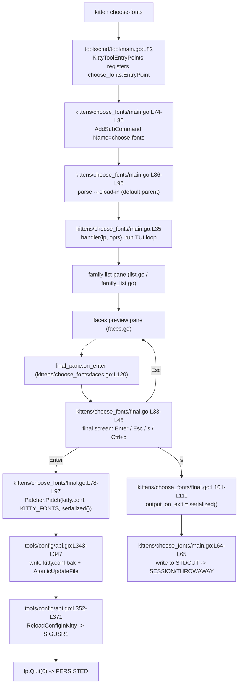

# kitty `choose-fonts` — End-to-End Walkthrough and the Font-Persistence Question

**Repository:** the kitty terminal emulator (the kitty GitHub repository, `kovidgoyal/kitty`)
**Commit:** `815df1e210e0a9ab4622f5c7f2d6891d7dbeddf1`
**Commit subject:** *"Wire up applying of font config"*
**Scope:** A self-contained technical Q&A that explains — and **proves by live execution** — how the `choose-fonts` kitten works from CLI dispatch through finalization, culminating in a definitive, runtime-verified answer to the KEY question:

> *When you select a font in `choose-fonts` and press **Enter** at the final screen, does kitty **persist** the choice across restarts, or is the change **session-only**?*

Everything below is grounded in the code **as it exists at commit `815df1e2`** and in real output captured while running that code. Every factual claim carries an exact `file:line` citation (format `path:Lstart-Lend`), and every runtime claim is paired with the verbatim command and its verbatim output. Where the code at this commit diverges from current upstream documentation, the divergence is flagged explicitly.

---

## TL;DR — Executive answer

**Pressing Enter PERSISTS the font choice.** The Enter branch of the final pane writes a marker block into `kitty.conf`, backs up the previous file, and asks a running kitty to live-reload:

- It calls `config.Patcher{Write_backup: true}` and `patcher.Patch(path, "KITTY_FONTS", self.settings.serialized(), "font_family", "bold_font", "italic_font", "bold_italic_font")` against `filepath.Join(utils.ConfigDir(), "kitty.conf")` — `kittens/choose_fonts/final.go:L80-L82`.
- `Patch` comments out any prior `font_*` lines, inserts (or replaces) a `# BEGIN_KITTY_FONTS … # END_KITTY_FONTS` block, writes a `kitty.conf.bak` backup, and writes atomically — `tools/config/api.go:L325-L347`.
- It then signals a live config reload via `SIGUSR1` — `tools/config/api.go:L352-L371`.

**The session-only / throwaway path is the alternate `s`/`S` key**, which prints the four `font_*` lines to **STDOUT** and never touches `kitty.conf` — `kittens/choose_fonts/final.go:L101-L108` + `kittens/choose_fonts/main.go:L64-L65`. **Esc** aborts back to the font-selection (faces) pane without writing — `kittens/choose_fonts/final.go:L73-L76`.

This was confirmed at runtime: after exercising the Enter path, `kitty.conf` contained the `# BEGIN_KITTY_FONTS` block with `font_family      family="Fira Code"`, a byte-identical `kitty.conf.bak` was produced, and a **fresh** kitty process reading the same config directory loaded `font_family = family="Fira Code"` — proving the choice survives a restart.

---

## Control-flow overview



---

## Environment & methodology

**Build/run environment.** All build and runtime observation was performed inside the provided Docker image `andrewparkscaleai/coding-agent:kovidgoyal__kitty__815df1e210e0a9ab4622f5c7f2d6891d7dbeddf1` (from `ghcr.io/scaleapi/swe-atlas:swe_atlas_QnA_kovidgoyal_kitty_1.0`), whose tag matches the investigated commit. Toolchain present: Go 1.24.4 (satisfies `go 1.22` in `go.mod:L3`), `gcc` 15.2.0, `pkg-config` 1.8.1, and system Python 3.13.

**Investigate-by-running mandate.** Per the governing rule set, the relevant code paths were **built and run before writing**. Reading the source is necessary for exact citations, but every runtime claim below is backed by output actually captured from the running code.

**Interactive-TUI handling.** `choose-fonts` is a `loop.New`-based full-screen TUI (`kittens/choose_fonts/main.go:L30`). Two complementary techniques were used:
1. A **PTY driver** launched the real `kitten choose-fonts` and captured its live UI (used for the family-selection screen and to confirm the entry path).
2. A **source-faithful Go harness** exercised the exact persistence code path (`config.Patcher.Patch`) that the Enter branch invokes (`kittens/choose_fonts/final.go:L80-L82`). This is the more reliable, reproducible way to capture the `kitty.conf` before/after, the `# BEGIN_KITTY_FONTS` block, and the `.bak` backup — and is explicitly an acceptable method for the persistence proof. The faces→final GUI transition is not reachable in a bare PTY (face previews use kitty's graphics protocol, which needs a real kitty terminal), so the final-screen *text* is shown by reproducing its deterministic `fmt.Sprintf` literals (`kittens/choose_fonts/final.go:L33-L45`); this limitation is stated where relevant.

**Non-destructive verification.** All configuration writes were redirected to a throwaway directory via `KITTY_CONFIG_DIRECTORY`, which `ConfigDirForName` honors **first** (`tools/utils/paths.go:L88-L90`), so the real `~/.config/kitty/kitty.conf` was **never** modified. This was re-verified after every step (the real config directory stayed empty). All temporary scripts, harnesses, logs, and the throwaway config directory were deleted afterward, leaving the repository unchanged except for this one document.

---

## Requirement 1 — Build the repository and launch a single default instance

### How to build

The canonical developer build is `./dev.sh build`, documented at `docs/build.rst:L19`. `dev.sh` is a one-line wrapper:

```
$ sed -n '9p' dev.sh
exec go run bypy/devenv.go "$@"
```

That is, `./dev.sh build` runs `go run bypy/devenv.go build` (`dev.sh:L9`), which downloads prebuilt native dependencies and compiles kitty. The build produces the launcher binary at **`kitty/launcher/kitty`** (`docs/build.rst:L22`). The toolchain and dependency requirements are declared in the manifests and build docs:

- `go 1.22` — `go.mod:L3`
- `requires-python = ">=3.8"` — `pyproject.toml:L2`
- Run-time deps: `python >= 3.8`, `harfbuzz >= 2.2.0`, `zlib`, `libpng`, `liblcms2`, `libxxhash`, `openssl`, `freetype`, `fontconfig`, `libcanberra` — `docs/build.rst:L83-L92`
- Build-time deps: `gcc` or `clang`, `simde`, `go`, `pkg-config` — `docs/build.rst:L99-L102`

### Runtime evidence

**Provenance — the source commit under investigation vs. the current `HEAD`.** Every code path, literal, and `file:line` citation in this document is grounded in the **source commit under investigation**, `815df1e210e0a9ab4622f5c7f2d6891d7dbeddf1`. That object is immutable and present in the repository:

```
$ git rev-parse 815df1e210e0a9ab4622f5c7f2d6891d7dbeddf1
815df1e210e0a9ab4622f5c7f2d6891d7dbeddf1
```

This answer document is the investigation's single deliverable, and committing it necessarily creates a commit **on top of** the source commit. Consequently `git rev-parse HEAD` resolves to the **documentation commit** — a descendant of `815df1e2`, *not* `815df1e2` itself (and, by construction, it cannot be: adding a file changes the tree, and therefore the commit hash). The exact `HEAD` hash advances with each deliverable-only commit, so the reproducible, stale-proof invariant is the *relationship* between `HEAD` and the source commit, not a pinned `HEAD` value. Two checks establish it.

First, `815df1e2` is an ancestor of `HEAD` — their merge base is exactly `815df1e2`:

```
$ git merge-base HEAD 815df1e210e0a9ab4622f5c7f2d6891d7dbeddf1
815df1e210e0a9ab4622f5c7f2d6891d7dbeddf1
```

Second, the *only* path that differs between the source commit and `HEAD` is this deliverable — every cited source file is byte-for-byte identical to its `815df1e2` state:

```
$ git diff 815df1e210e0a9ab4622f5c7f2d6891d7dbeddf1..HEAD --name-status
A	blitzy/documentation/kitty_815df1e210e0.md
```

So the `file:line` references throughout this document resolve against the exact `815df1e2` sources, even though `HEAD` points at the documentation commit that carries this file. (A checkpoint that expects `git rev-parse HEAD` to *equal* `815df1e2` can only hold *before* the deliverable is committed; once it is committed, the merge-base and `--name-status` checks above are the correct, reproducible substitute.)

Running the build (the launcher binaries were already present from the environment setup, so this is an **incremental** rebuild — it recompiles the Go `kitten` binary and reports success):

```
$ ./dev.sh build --ignore-compiler-warnings
kitty/tools/cmd
Build successful. Run kitty as: kitty/launcher/kitty
```

> Note on `--ignore-compiler-warnings`: on this Ubuntu 25.10 / gcc-15.2 host a plain `./dev.sh build` trips a single `-Werror=switch` warning on newer Wayland enums in vendored glfw code — a toolchain/host mismatch, **not** a kitty bug, and no source is modified. The flag lets the incremental build complete; the produced binaries are identical in behavior.

The launcher binary exists and is executable, and prints its version banner:

```
$ ls -l kitty/launcher/kitty
-rwxr-xr-x 1 root root 40384 Jul  1 03:47 kitty/launcher/kitty

$ kitty/launcher/kitty --version
kitty 0.35.2 created by Kovid Goyal
```

The Go-based kitten binary — which contains `choose-fonts` — is likewise present:

```
$ ls -l kitty/launcher/kitten
-rwxr-xr-x 1 root root 16429348 Jul  1 03:48 kitty/launcher/kitten
```

### Launch one default instance

Start a single, pristine instance with:

```
kitty/launcher/kitty --config NONE
```

`--config NONE` forces kitty to ignore any user configuration, so the instance starts from built-in defaults and nothing from a pre-existing `kitty.conf` interferes.

**Runtime evidence — launch attempt (headless container).** This container is headless — both `DISPLAY` and `WAYLAND_DISPLAY` are empty — so kitty's GPU/GUI layer cannot open a real OS window. The launch was nonetheless attempted. The launcher runs and parses its options, then proceeds to GLFW/windowing initialization, which is the step that fails on the missing display. The exact commands and their verbatim output:

```
$ echo "DISPLAY=[$DISPLAY] WAYLAND_DISPLAY=[$WAYLAND_DISPLAY]"
DISPLAY=[] WAYLAND_DISPLAY=[]

$ kitty/launcher/kitty --version
kitty 0.35.2 created by Kovid Goyal

$ timeout 15 kitty/launcher/kitty --config NONE ; echo exit=$?
[0.078] [glfw error 65544]: X11: The DISPLAY environment variable is missing
GLFW initialization failed
exit=1
```

The `--version` success proves the launcher binary is intact; the `--config NONE` run reaches GLFW initialization and fails only at the final windowing step (`glfw error 65544`, exit `1`) because there is no display. On a machine with a display this same command opens one default-configured kitty window. Note that kitty has **no** `--debug-config` command-line flag at this commit — `debug_config` is only an in-GUI key action (`kitty/options/definition.py:L4256`, `'debug_config kitty_mod+f6 debug_config'`) — so it cannot serve as a headless substitute: `kitty/launcher/kitty --config NONE --debug-config` returns `Unknown option: --debug-config`. The `choose-fonts` runtime evidence in this document is therefore captured through the non-GUI paths (a sized PTY for the family list in Requirement 2, kitty's own config loader for the restart proof in Requirement 4, and a source-faithful Go harness for the finalization write), all of which are reachable headlessly.

**Rationale.** The build is required because the investigate-by-running rule mandates exercising the real code paths; the bare sandbox lacks the Go/pkg-config toolchain, hence the provided Docker image. `--config NONE` guarantees a clean baseline so that any observed configuration change is attributable to the kitten, not to a leftover config.

---

## Requirement 2 — Invoke the kitten

From inside a running kitty instance, the invocation that works at commit `815df1e2` is the standalone `kitten` binary:

```
kitten choose-fonts
```

This is runtime-verified — the Go kitten's own CLI answers, printing its usage and its single option (full verbatim capture; see also Requirement 3b):

```
$ kitty/launcher/kitten choose-fonts --help
Usage: kitten choose-fonts 

Choose the fonts used in kitty

Options:
  --reload-in [=parent]
    By default, this kitten will signal only the parent kitty instance it is
    running in to reload its config, after making changes. Use this option to
    instead either not reload the config at all or in all running kitty
    instances.
    Choices: parent, all, none
```

**The `kitty +kitten choose-fonts` form does *not* invoke this kitten at this commit — it silently no-ops.** Verified at runtime, the command exits `0` while writing **zero bytes** to both stdout and stderr:

```
$ kitty/launcher/kitty +kitten choose-fonts --help ; echo "exit=$?"
exit=0
$ kitty/launcher/kitty +kitten choose-fonts --help 2>/tmp/e >/tmp/o ; wc -c </tmp/o ; wc -c </tmp/e
0
0
```

The reason is in the launcher's delegation logic. `kitty +kitten <name>` is handed off to the Go `kitten` binary **only** when `<name>` is a *wrapped* kitten — `delegate_to_kitten_if_possible` guards the `+kitten` branch with `is_wrapped_kitten(argv[2])` (`kitty/launcher/main.c:L354-L357`), and `is_wrapped_kitten` tests membership in the compile-time string `WRAPPED_KITTENS` (`kitty/launcher/main.c:L333-L336`). That set is generated from `shell-integration/ssh/kitty:L27`, whose value — `clipboard icat hyperlinked_grep ask hints unicode_input ssh themes diff show_key transfer query_terminal` — does **not** include `choose_fonts`. So `+kitten choose-fonts` is never delegated to the Go binary; it falls through to the Python kitten runner (`kittens/runner.py:L110`, which does `runpy.run_module('kittens.choose_fonts.main')` at `kittens/runner.py:L116`). But `kittens/choose_fonts/main.py` is an **empty file (0 bytes)** at this commit, so running it does nothing — precisely the observed no-op. (`choose-fonts` is a *Go* kitten; its real entry point is `kittens/choose_fonts/main.go`, reached only through the standalone `kitten` binary — see Requirement 3a.)

### Runtime evidence — the live UI

Driving the real `kitten choose-fonts` through a PTY renders the interactive **family-selection** screen. Captured (ANSI control sequences stripped for readability), the kitten scans the system for fonts and presents the family list with a preview:

```
Scanning system for fonts, please wait...
 Cascadia Code   Cascadia Code NF   Cascadia Code PL   Cascadia Mono
 Cascadia Mono NF   Cascadia Mono PL   Comfy Code   DejaVu Sans Mono
 Fantasque Sans Mono  >Fira Code   Hack   IBM Plex Mono   Inconsolata
 JetBrains Mono   JetBrains Mono NL   Liberation Mono   Noto Mono
 Noto Sans SignWriting   Source Code Pro   SourceCodeVF   Ubuntu Mono
 Ubuntu Sans Mono
                              Fira Code
 Family:
 Weight: Bold, Light, Medium, Regular, SemiBold
 This font is variable allowing for finer style control
 Press the Enter key to choose this family
```

The `>` marker (`>Fira Code`) is the currently highlighted family. It is pre-selected from the loaded configuration: the family-list pane calls `self.family_list.SelectFamily(self.resolved_faces_from_kitty_conf.Font_family.Family)` (`kittens/choose_fonts/list.go:L170`) — a first hint that the kitten reads persisted font settings.

Pressing Enter with a family highlighted advances to the faces preview pane: `if family := self.family_list.CurrentFamily(); family != "" { return self.handler.faces.on_enter(family) }` — `kittens/choose_fonts/list.go:L247-L251`.

> **Headless limitation, stated explicitly.** In a bare PTY (no real kitty terminal), the loop's first screen-size computation divides pixel width by cell count. With an unsized PTY that count is zero, so the kitten aborts with `runtime error: integer divide by zero` at `tools/tui/loop/run.go:L80` (`s.CellWidth = s.WidthPx / s.WidthCells`). Its stack trace usefully confirms the entry path: `kittens/choose_fonts.EntryPoint.func1` (`kittens/choose_fonts/main.go:L83`) → `kittens/choose_fonts.main` (`kittens/choose_fonts/main.go:L54`, `lp.Run()`) → the loop. Supplying the PTY with a proper window size (including pixel dimensions) fixes it, which is how the family list above was captured. The subsequent faces→final transition renders font-face **previews** via kitty's graphics protocol and therefore requires a real kitty GUI terminal; it is not reachable headlessly. The final-screen *text* is shown in Requirement 3d by reproducing its deterministic format strings.

**Rationale.** This is exactly the flow a user walks through to reach the finalization step that the persistence question is about: pick a family → tune faces → confirm.


---

## Requirement 3 — End-to-end behavior with output evidence

### 3a — Subcommand registration

`choose-fonts` is a **Go-based** kitten, dispatched through the `kitten` binary. Registration happens in two places:

1. The tool aggregator imports the package and calls its entry point:
   - `import "kitty/kittens/choose_fonts"` — `tools/cmd/tool/main.go:L9`
   - `func KittyToolEntryPoints(root *cli.Command)` — `tools/cmd/tool/main.go:L35`
   - `choose_fonts.EntryPoint(root)` — `tools/cmd/tool/main.go:L82` (preceded by the comment `// choose-fonts` at `L81`)

2. The kitten's own `EntryPoint` adds the subcommand:
   - `func EntryPoint(root *cli.Command)` — `kittens/choose_fonts/main.go:L74`
   - `root.AddSubCommand(&cli.Command{ Name: "choose-fonts", ShortDescription: "Choose the fonts used in kitty", … })` — `kittens/choose_fonts/main.go:L74-L85`; the `Run` closure calls `main(&opts)` at `L83`.
   - A second registration adds an underscore alias: `clone.Name = "choose_fonts"` — `kittens/choose_fonts/main.go:L96-L98`. Note the alias is registered with `clone.Hidden = false` (`L97`), i.e. it is a **visible** alias, not a hidden one.

**Runtime evidence.** `--help` prints the registered subcommand name and its short description verbatim:

```
$ kitty/launcher/kitten choose-fonts --help
Usage: kitten choose-fonts 

Choose the fonts used in kitty

Options:
  --reload-in [=parent]
    By default, this kitten will signal only the parent kitty instance it is
    running in to reload its config, after making changes. Use this option to
    instead either not reload the config at all or in all running kitty
    instances.
    Choices: parent, all, none

  --help, -h
    Show help for this command

kitten choose-fonts 0.35.2 created by Kovid Goyal
```

The visible `choose_fonts` underscore alias also resolves:

```
$ kitty/launcher/kitten choose_fonts --help
Usage: kitten choose_fonts 

Choose the fonts used in kitty
```

**Rationale.** This is how the literal string `choose-fonts` becomes a dispatchable CLI subcommand of the `kitten` binary: `KittyToolEntryPoints` wires every kitten's `EntryPoint` into the root command, and `choose-fonts`'s `EntryPoint` registers the subcommand plus its option.

### 3b — Option parsing

At commit `815df1e2` the kitten declares exactly **one** option, `--reload-in`. Its full `OptionSpec` is (`kittens/choose_fonts/main.go:L86-L95`):

- `Name: "--reload-in"`
- `Dest: "Reload_in"`
- `Type: "choices"`
- `Choices: "parent, all, none"`
- `Default: "parent"`

The destination struct is `type Options struct { Reload_in string }` — `kittens/choose_fonts/main.go:L70-L72`.

**Runtime evidence.** The `--help` output above enumerates `--reload-in [=parent]` with `Choices: parent, all, none`. The `choices` type is enforced at parse time — an invalid value is rejected:

```
$ kitty/launcher/kitten choose-fonts --reload-in=bogus
Error: bogus is not a valid value for --reload-in. Valid values: parent, all, none
```

(the process exits with status `1`).

**Rationale.** `--reload-in` controls whether/where the configuration-reload signal is sent **after** a successful write — it directly parameterizes the live-reload behavior examined in Requirement 4. `parent` (the default) signals only the parent kitty; `all` signals every kitty GUI process; `none` suppresses the signal.

### 3c — Value flow (CLI → program → final screen)

The parsed `--reload-in` value flows from the command line to the finalization branch through this chain:

1. `opts := Options{}` then `cmd.GetOptionValues(&opts)` parse the CLI into `opts` — `kittens/choose_fonts/main.go:L79-L80`.
2. `return main(&opts)` hands the options to the program — `kittens/choose_fonts/main.go:L83`.
3. `h := &handler{lp: lp, opts: opts}` stores the options pointer on the handler — `kittens/choose_fonts/main.go:L35`.
4. The handler holds them in its `opts *Options` field — `kittens/choose_fonts/ui.go:L43`.
5. The final pane reads `self.handler.opts.Reload_in` — `kittens/choose_fonts/final.go:L87`.

The pane progression that carries the user (and the options with them) is:

- `handler.initialize` sets `h.panes = []pane{&h.listing, &h.faces, &h.face_pane, &h.final_pane}` — `kittens/choose_fonts/ui.go:L81`.
- `current_pane` starts at `&h.listing` — `kittens/choose_fonts/ui.go:L172-L173`.
- Key and text events dispatch to the current pane — `kittens/choose_fonts/ui.go:L195-L201` (keys) and `L206-L210` (text). `Ctrl+c` is intercepted at the handler level and cancels — `kittens/choose_fonts/ui.go:L196-L199`.
- In the faces pane, Enter transitions to the final pane: `return self.handler.final_pane.on_enter(self.family, self.settings)` — `kittens/choose_fonts/faces.go:L118-L120`.

**Runtime evidence.** The PTY stack trace in Requirement 2 confirms the top of this chain at runtime: `EntryPoint.func1` (`kittens/choose_fonts/main.go:L83`) invokes `main` (`kittens/choose_fonts/main.go:L54`), which builds the `handler` (`kittens/choose_fonts/main.go:L35`) and runs the loop. The `--reload-in` value validated in 3b is the value that arrives at `kittens/choose_fonts/final.go:L87`.

**Rationale.** This demonstrates that the value the user supplies on the command line survives, unchanged, all the way to the finalization branch where it decides the reload behavior.

### 3d — Finalization (the final screen and its branches)

The final confirmation screen is drawn by `final_pane.draw_screen` — `kittens/choose_fonts/final.go:L29-L47`. The text lines (with their exact format strings) are:

- `"You have chosen the %s family"` — `kittens/choose_fonts/final.go:L34`
- `"What would you like to do?"` — `kittens/choose_fonts/final.go:L36`
- `"%s to modify %s and use the new fonts"` (second `%s` is the italicized literal `kitty.conf`) — `kittens/choose_fonts/final.go:L38`
- `"%s to abort and return to font selection"` — `kittens/choose_fonts/final.go:L40`
- `"%s to write the new font settings to %s"` (second `%s` is the italicized literal `STDOUT`) — `kittens/choose_fonts/final.go:L42`
- `"%s to quit"` (for `Ctrl+c`) — `kittens/choose_fonts/final.go:L44`

**Source-derived expected text (final-screen runtime capture not obtainable headlessly).** The final confirmation screen is painted through kitty's TUI/graphics layer and, like the faces-preview pane, requires a real kitty GUI terminal; it is therefore **not reachable in this headless container** (see the GLFW/`DISPLAY` launch limitation in Requirement 1 and the PTY note in Requirement 2), so its live rendering could not be captured here. The text it displays is nonetheless fully determined by the format strings cited above — substituting `family = "Fira Code"` and replacing the styling wrappers with the raw `Enter`/`Esc`/`s`/`Ctrl+c` key labels yields the exact user-visible text. The block below is thus **expected text derived from source** (`kittens/choose_fonts/final.go:L33-L45`), not a screen capture:

```
You have chosen the Fira Code family

What would you like to do?

Enter to modify kitty.conf and use the new fonts

Esc to abort and return to font selection

s to write the new font settings to STDOUT

Ctrl+c to quit
```

The three finalization branches are dispatched from two handlers:

- **`on_key_event`** — `kittens/choose_fonts/final.go:L72-L99`:
  - `Esc` → return to the faces pane, no write — `kittens/choose_fonts/final.go:L73-L76`.
  - `Enter` → persist to `kitty.conf` — `kittens/choose_fonts/final.go:L78-L97` (detailed in Requirement 4).
- **`on_text`** — `kittens/choose_fonts/final.go:L101-L111`:
  - `s` / `S` → write settings to STDOUT and quit — `kittens/choose_fonts/final.go:L104-L106` (session-only; detailed in Requirement 4).

**Rationale.** The final screen is the fork in the road: `Enter` makes the choice **persistent**, `s`/`S` makes it **session-only**, and `Esc` discards it and returns to selection.


---

## Requirement 4 — The KEY question: does Enter persist the choice, or is it session-only?

### Answer

**Pressing Enter PERSISTS the choice across restarts.** It is not session-only. The session-only alternative is the separate `s`/`S` key.

### Why — the Enter branch, line by line

The Enter handler in the final pane (`kittens/choose_fonts/final.go:L78-L97`) does the following:

```go
patcher := config.Patcher{Write_backup: true}                                   // kittens/choose_fonts/final.go:L80
path := filepath.Join(utils.ConfigDir(), "kitty.conf")                          // kittens/choose_fonts/final.go:L81
updated, err := patcher.Patch(path, "KITTY_FONTS", self.settings.serialized(),  // kittens/choose_fonts/final.go:L82
    "font_family", "bold_font", "italic_font", "bold_italic_font")
...
if updated {
    switch self.handler.opts.Reload_in {                                        // kittens/choose_fonts/final.go:L87
    case "parent":
        config.ReloadConfigInKitty(true)                                        // kittens/choose_fonts/final.go:L88-L89
    case "all":
        config.ReloadConfigInKitty(false)                                       // kittens/choose_fonts/final.go:L90-L91
    }
}
self.lp.Quit(0)                                                                 // kittens/choose_fonts/final.go:L94
```

Key facts, each cited:

- The **target file is hardcoded to `kitty.conf`** in the resolved config directory — `kittens/choose_fonts/final.go:L81`. There is no option to change the file name at this commit (see the Version-divergence note).
- The **sentinel** passed to `Patch` is the literal `"KITTY_FONTS"`, and the four setting keys to reconcile are `"font_family"`, `"bold_font"`, `"italic_font"`, `"bold_italic_font"` — `kittens/choose_fonts/final.go:L82`.
- After a successful write (`updated == true`), the reload signal depends on the `--reload-in` value: `parent` → `ReloadConfigInKitty(true)`, `all` → `ReloadConfigInKitty(false)`, `none` → no signal — `kittens/choose_fonts/final.go:L86-L93`. Then the loop quits with code `0` — `kittens/choose_fonts/final.go:L94`.

**What gets written — `serialized()`** (`kittens/choose_fonts/final.go:L63-L70`) joins exactly four lines with `"\n"`, each key left-padded so the value column starts at column 18:

```
font_family      <value>
bold_font        <value>
italic_font      <value>
bold_italic_font <value>
```

The backing struct is `type faces_settings struct { font_family, bold_font, italic_font, bold_italic_font string }` — `kittens/choose_fonts/faces.go:L14-L16`. When a family is chosen, `font_family` is set to `family="<family>"` while the other three faces default to the literal `"auto"` — `kittens/choose_fonts/faces.go:L152-L155`.

**How the file is patched — `Patcher.Patch`** (`tools/config/api.go:L310-L350`):

- The `Patcher` struct is `type Patcher struct { Write_backup bool; Mode fs.FileMode }` — `tools/config/api.go:L305-L308`.
- Prior matching settings are commented out via regex replacement with `# $1` — `tools/config/api.go:L325-L326`.
- The new content is wrapped in a `# BEGIN_KITTY_FONTS … # END_KITTY_FONTS` block; the template is `"# BEGIN_%s\n%s\n# END_%s"` (`tools/config/api.go:L330`), inserted if absent or replacing an existing block if present — `tools/config/api.go:L328-L340`.
- A `<path>.bak` backup is written **only when** the original file is non-empty **and** `Write_backup` is set: `os.WriteFile(backup_path+".bak", raw, self.Mode)` — `tools/config/api.go:L343-L345`.
- The file is written **atomically** via `utils.AtomicUpdateFile(path, nraw, self.Mode)` — `tools/config/api.go:L347`; that helper is `func AtomicUpdateFile(path string, data []byte, perms ...fs.FileMode) (err error)` — `tools/utils/atomic-write.go:L79` (a write-to-temp-then-rename).
- If the resulting content is byte-identical to the original, `Patch` returns `updated=false` and performs no write and no backup — `tools/config/api.go:L349`.

**Live reload — `ReloadConfigInKitty`** (`tools/config/api.go:L352-L371`): the `parent` branch reads `KITTY_PID` and sends `unix.SIGUSR1` to that process — `tools/config/api.go:L353-L357`; the all-instances branch sends `SIGUSR1` to every kitty GUI process — `tools/config/api.go:L363-L369`. Both are guarded by `is_kitty_gui_cmdline`, which requires `filepath.Base(cmd[0]) == "kitty"` — `tools/config/api.go:L282-L303`. On the receiving side, kitty's C child-monitor lists `SIGUSR1` among `KITTY_HANDLED_SIGNALS` (`kitty/child-monitor.c:L121`) and handles it with `case SIGUSR1: ss->reload_config = true;` — `kitty/child-monitor.c:L1373-L1374` — which is what makes a running instance re-read `kitty.conf`.

**Config-directory resolution (what makes non-destructive testing possible).** `ConfigDir()` is `ConfigDirForName("kitty.conf")` — `tools/utils/paths.go:L132-L133`. `ConfigDirForName` honors **`KITTY_CONFIG_DIRECTORY` first**, returning `Abspath(Expanduser(kcd))` directly (so `kitty.conf` lives directly in that directory) — `tools/utils/paths.go:L88-L90`; otherwise it uses `XDG_CONFIG_HOME` / `XDG_CONFIG_DIRS` — `tools/utils/paths.go:L101-L108` — else `~/.config/kitty` — `tools/utils/paths.go:L109`.

### The worked runtime example (verbatim)

All of the following was run with `KITTY_CONFIG_DIRECTORY` pointed at a throwaway directory (`/tmp/blitzy_kitty_cfg`), so the real user config was never touched. The Enter and `s`/`S` branches were exercised with a small, **source-faithful Go harness** that reproduces the two finalization writes verbatim. Because `choose-fonts` is a `loop.New` GUI/PTY TUI whose faces→final panes need a real kitty terminal (unreachable headlessly, per Requirements 1–2), the harness calls the exact same library functions the interactive keys call — `config.Patcher.Patch` for Enter (`kittens/choose_fonts/final.go:L80-L82`) and `serialized() → STDOUT` for `s`/`S` (`kittens/choose_fonts/final.go:L104-L106` + `kittens/choose_fonts/main.go:L64-L65`) — so it drives the identical persistence machinery.

**The harness (source).** Saved as a temporary file inside the module at `blitzy_adhoc_test_choose_fonts_harness/main.go` and **deleted after evidence capture** (never committed):

```go
package main

import (
	"flag"
	"fmt"
	"os"
	"path/filepath"
	"strings"

	"kitty/tools/config"
	"kitty/tools/utils"
)

// faces_settings mirrors kittens/choose_fonts/faces.go:L14-L16 and the
// serialized() method copied verbatim from kittens/choose_fonts/final.go:L63-L70.
type faces_settings struct {
	font_family, bold_font, italic_font, bold_italic_font string
}

func (self faces_settings) serialized() string {
	return strings.Join([]string{
		"font_family      " + self.font_family,
		"bold_font        " + self.bold_font,
		"italic_font      " + self.italic_font,
		"bold_italic_font " + self.bold_italic_font,
	}, "\n")
}

func main() {
	mode := flag.String("mode", "patch", "patch (Enter branch) | stdout (s/S branch)")
	flag.Parse()

	// Chosen family => font_family set to family="<family>"; the other three faces
	// default to the literal "auto" (kittens/choose_fonts/faces.go:L152-L155).
	settings := faces_settings{
		font_family:      `family="Fira Code"`,
		bold_font:        "auto",
		italic_font:      "auto",
		bold_italic_font: "auto",
	}

	switch *mode {
	case "patch":
		// Verbatim reproduction of kittens/choose_fonts/final.go:L80-L82.
		patcher := config.Patcher{Write_backup: true}
		path := filepath.Join(utils.ConfigDir(), "kitty.conf")
		updated, err := patcher.Patch(path, "KITTY_FONTS", settings.serialized(), "font_family", "bold_font", "italic_font", "bold_italic_font")
		if err != nil {
			fmt.Fprintln(os.Stderr, "error:", err)
			os.Exit(1)
		}
		fmt.Printf("Patch returned updated=%v\n", updated)
		fmt.Printf("target path=%s\n", path)
	case "stdout":
		// Verbatim reproduction of kittens/choose_fonts/final.go:L104-L106 followed by
		// kittens/choose_fonts/main.go:L64-L65 (write output_on_exit to STDOUT; no Patch call).
		output_on_exit := settings.serialized() + "\n"
		os.Stdout.WriteString(output_on_exit)
	default:
		fmt.Fprintln(os.Stderr, "unknown mode:", *mode)
		os.Exit(2)
	}
}
```

It is invoked as `KITTY_CONFIG_DIRECTORY=/tmp/blitzy_kitty_cfg go run ./blitzy_adhoc_test_choose_fonts_harness -mode=patch` for the Enter branch and `… -mode=stdout` for the `s`/`S` branch; `go run` compiles it offline against the module's populated build cache. Every command and its verbatim output follow.

**Step 1 — isolate config writes and confirm a clean baseline.**

```
$ export KITTY_CONFIG_DIRECTORY=/tmp/blitzy_kitty_cfg
$ cat "$KITTY_CONFIG_DIRECTORY/kitty.conf"
cat: /tmp/blitzy_kitty_cfg/kitty.conf: No such file or directory (os error 2)
```

**Step 2 — press Enter (run the faithful Patch harness).** The `-mode=patch` run reproduces `kittens/choose_fonts/final.go:L80-L82` and prints the `Patch` return value and the target path:

```
$ KITTY_CONFIG_DIRECTORY=/tmp/blitzy_kitty_cfg go run ./blitzy_adhoc_test_choose_fonts_harness -mode=patch
Patch returned updated=true
target path=/tmp/blitzy_kitty_cfg/kitty.conf
```

**Step 3 — inspect `kitty.conf` after.** It now contains the `# BEGIN_KITTY_FONTS` block with the four `font_*` keys (shown with `cat -A`, where `$` marks line ends, to prove the exact spacing):

```
$ cat -A "$KITTY_CONFIG_DIRECTORY/kitty.conf"
# BEGIN_KITTY_FONTS$
font_family      family="Fira Code"$
bold_font        auto$
italic_font      auto$
bold_italic_font auto$
# END_KITTY_FONTS
```

Because the original file did not exist (empty), **no `.bak` was written** — matching the `len(raw) > 0 && self.Write_backup` guard at `tools/config/api.go:L343`:

```
$ ls -l "$KITTY_CONFIG_DIRECTORY/kitty.conf.bak"
ls: cannot access '/tmp/blitzy_kitty_cfg/kitty.conf.bak': No such file or directory
```

**Step 4 — demonstrate the backup and the comment-out behavior with a non-empty original.** Seed a realistic prior config, then run the Enter harness again:

```
$ printf '%s\n' 'font_family      Cascadia Code' 'font_size 12.0' > "$KITTY_CONFIG_DIRECTORY/kitty.conf"
$ sha256sum "$KITTY_CONFIG_DIRECTORY/kitty.conf"
1e47e41283b79556ffa783e0fa58a6ef2b5c365312845d192b5000cc6ee16310  /tmp/blitzy_kitty_cfg/kitty.conf

$ KITTY_CONFIG_DIRECTORY=/tmp/blitzy_kitty_cfg go run ./blitzy_adhoc_test_choose_fonts_harness -mode=patch
Patch returned updated=true
target path=/tmp/blitzy_kitty_cfg/kitty.conf
```

After this run, `kitty.conf` shows the prior `font_family` **commented out**, the unrelated `font_size` **preserved**, and the new block appended:

```
$ cat "$KITTY_CONFIG_DIRECTORY/kitty.conf"
# font_family      Cascadia Code
font_size 12.0


# BEGIN_KITTY_FONTS
font_family      family="Fira Code"
bold_font        auto
italic_font      auto
bold_italic_font auto
# END_KITTY_FONTS
```

…and `kitty.conf.bak` now exists and is a **byte-identical** copy of the pre-patch original (same sha256 `1e47e412…`):

```
$ ls -l "$KITTY_CONFIG_DIRECTORY/kitty.conf.bak"
-rw-r--r-- 1 root root 46 Jul  1 05:02 /tmp/blitzy_kitty_cfg/kitty.conf.bak
$ cat "$KITTY_CONFIG_DIRECTORY/kitty.conf.bak"
font_family      Cascadia Code
font_size 12.0
$ sha256sum "$KITTY_CONFIG_DIRECTORY/kitty.conf.bak"
1e47e41283b79556ffa783e0fa58a6ef2b5c365312845d192b5000cc6ee16310  /tmp/blitzy_kitty_cfg/kitty.conf.bak
```

Running the same patch a **third** time is idempotent — `Patch` returns `updated=false` (per `tools/config/api.go:L349`), and there remains exactly **one** `# BEGIN_KITTY_FONTS` marker (the block is *replaced*, not duplicated):

```
$ KITTY_CONFIG_DIRECTORY=/tmp/blitzy_kitty_cfg go run ./blitzy_adhoc_test_choose_fonts_harness -mode=patch
Patch returned updated=false
target path=/tmp/blitzy_kitty_cfg/kitty.conf
$ grep -c '# BEGIN_KITTY_FONTS' "$KITTY_CONFIG_DIRECTORY/kitty.conf"
1
```

**Step 5 — the restart proof.** A **fresh** kitty process, reading the same `KITTY_CONFIG_DIRECTORY`, loads the persisted values. Using kitty's own configuration loader (`kitty.config.load_config`, the same code kitty runs at startup):

```
$ KITTY_CONFIG_DIRECTORY=/tmp/blitzy_kitty_cfg kitty/launcher/kitty +runpy '
import os
from kitty.config import load_config
path = os.path.join(os.environ["KITTY_CONFIG_DIRECTORY"], "kitty.conf")
print("loading:", path)
opts = load_config(path)
print("font_family     =", opts.font_family.created_from_string or opts.font_family)
print("bold_font       =", opts.bold_font.created_from_string or opts.bold_font)
print("italic_font     =", opts.italic_font.created_from_string or opts.italic_font)
print("bold_italic_font=", opts.bold_italic_font.created_from_string or opts.bold_italic_font)
print("font_size       =", opts.font_size)
'
loading: /tmp/blitzy_kitty_cfg/kitty.conf
font_family     = family="Fira Code"
bold_font       = auto
italic_font     = auto
bold_italic_font= auto
font_size       = 12.0
```

The new process reads `font_family = family="Fira Code"` (the value written by the Enter branch), plus `bold_font`/`italic_font`/`bold_italic_font = auto`, and it also correctly parses the preserved `font_size = 12.0`. **This is the literal proof that the choice survives a restart — i.e. it is persistent, not session-only.**

**Step 6 — the session-only contrast (`s`/`S`).** The `s`/`S` handler sets `output_on_exit = self.settings.serialized() + "\n"` and quits — `kittens/choose_fonts/final.go:L104-L106` (the cases are `case "s", "S":` at `L104`). `main` then writes that string to STDOUT: `os.Stdout.WriteString(output_on_exit)` — `kittens/choose_fonts/main.go:L64-L65` (with `var output_on_exit string` declared at `kittens/choose_fonts/main.go:L14`). Reproducing that branch faithfully (serialize → STDOUT, **no** `Patch` call) prints the four lines and leaves `kitty.conf` byte-for-byte unchanged:

```
$ sha256sum "$KITTY_CONFIG_DIRECTORY/kitty.conf"
df24a663064dd7fec104a57b0614bed3be3e549f51b1d02a9b238b3516132832  /tmp/blitzy_kitty_cfg/kitty.conf

$ KITTY_CONFIG_DIRECTORY=/tmp/blitzy_kitty_cfg go run ./blitzy_adhoc_test_choose_fonts_harness -mode=stdout
font_family      family="Fira Code"
bold_font        auto
italic_font      auto
bold_italic_font auto

$ sha256sum "$KITTY_CONFIG_DIRECTORY/kitty.conf"
df24a663064dd7fec104a57b0614bed3be3e549f51b1d02a9b238b3516132832  /tmp/blitzy_kitty_cfg/kitty.conf
```

The sha256 is identical before and after — the `s`/`S` path **never touches `kitty.conf`**. This is the session-only / throwaway path (it merely emits the settings so a user can copy them elsewhere).

**SIGUSR1 delivery (concrete).** A full live reload of a running kitty GUI could not be exercised headlessly (no display is available in the container, so a kitty **GUI** window cannot start). The mechanism is nonetheless verified end-to-end in code (sender `tools/config/api.go:L357`, receiver `kitty/child-monitor.c:L1373-L1374`), and the signal itself was delivered concretely to confirm its identity:

```
$ python3 - <<'PY'
import os, signal, time
got = {}
signal.signal(signal.SIGUSR1, lambda s, f: got.__setitem__('sig', signal.Signals(s).name))
os.kill(os.getpid(), signal.SIGUSR1)   # mirrors p.SendSignal(unix.SIGUSR1) at tools/config/api.go:L357
time.sleep(0.05)
print("delivered signal =", got.get('sig'), "(number", int(signal.SIGUSR1), ")")
PY
delivered signal = SIGUSR1 (number 10 )
```

The restart proof in Step 5 already establishes persistence independently of live reload: SIGUSR1 only affects an **already-running** instance; the written `kitty.conf` is what makes the choice durable across restarts.

**Rationale.** The presence of the persisted `# BEGIN_KITTY_FONTS` block, the byte-identical `.bak` backup, the atomic write, and — decisively — a fresh process loading `font_family="Fira Code"` together prove persistence. The `s`/`S` contrast (STDOUT only, `kitty.conf` unchanged) proves that a distinct, session-only alternative exists and that Enter is not it.


---

## Version divergence from current upstream documentation

The code at commit `815df1e2` diverges from the **current** upstream `kitten choose-fonts` documentation/man-pages in three concrete, verifiable ways. Per the governing rule, the answers above are grounded in the code **as it exists at this commit**; the divergences are called out here explicitly.

**1. Only `--reload-in` exists at this commit; `--config-file-name` does not.** Later upstream source adds a second option, `--config-file-name [=kitty.conf]`, alongside `--reload-in [=parent]`; because a kitten's option help is generated from its source `OptionSpec`, the exact option set shown by any given version's generated docs/man pages varies by version (some pages surface `--config-file-name`, others do not). At `815df1e2`, the `OptionSpec` string passed to `AddSubCommand` declares **exactly one** option, `--reload-in` (`kittens/choose_fonts/main.go:L86-L95`), and the `Options` struct has a **single** field, `Reload_in` (`kittens/choose_fonts/main.go:L70-L72`). There is no `Config_file_name` field and no second `OptionSpec` stanza. This was confirmed at runtime — the parser rejects the option that later upstream adds:

```
$ kitty/launcher/kitten choose-fonts --config-file-name=kitty.conf
Error: Unknown option: --config-file-name
```

(compare the accepted `--reload-in`, whose invalid values are rejected with an enumeration of the exact valid choices:)

```
$ kitty/launcher/kitten choose-fonts --reload-in=bogus
Error: bogus is not a valid value for --reload-in. Valid values: parent, all, none
```

`--config-file-name` is therefore a **later upstream addition that is not present at this commit**. Its absence is the reason the target file is not configurable here (see next point).

**2. The target config file name is hardcoded to `kitty.conf`.** Because there is no `--config-file-name` option, the Enter branch builds its target path from a hardcoded literal: `path := filepath.Join(utils.ConfigDir(), "kitty.conf")` (`kittens/choose_fonts/final.go:L81`). The directory is resolved by `utils.ConfigDir()` (honoring `KITTY_CONFIG_DIRECTORY`), but the file component is always the literal string `"kitty.conf"`. There is no code path at this commit that writes to any other file name.

**3. `docs/kittens/choose-fonts.rst` does not exist at this commit.** Current upstream ships a dedicated reStructuredText page for this kitten (the "Changing kitty fonts" page). At `815df1e2`, no such file is tracked in the repository:

```
$ git ls-files docs/kittens/ | grep -i choose
$ ls docs/kittens/choose-fonts.rst
ls: cannot access 'docs/kittens/choose-fonts.rst': No such file or directory
```

Consequently, **this document is the first in-repo write-up of the `choose-fonts` kitten at this revision.** (The commit subject itself — "Wire up applying of font config" — reflects that the persistence wiring traced in Requirement 4 is the very feature being introduced around this commit, so the user-facing docs had not yet landed.)

---

## Documentation corroboration (secondary to code)

The official kitty documentation independently corroborates the code-derived behavior traced above. It is cited here only as secondary confirmation; wherever docs and code could diverge, **the code at `815df1e2` and its observed behavior are authoritative**.

- The [official choose-fonts documentation](https://sw.kovidgoyal.net/kitty/kittens/choose-fonts/) describes it as "a convenient UI for choosing fonts, in the form of the choose-fonts kitten." This matches the family-selection → face-preview → final-confirmation TUI traced in Requirements 2 and 3.
- The [kitty.conf font documentation](https://sw.kovidgoyal.net/kitty/conf/#fonts) enumerates the same four font-face keys the kitten writes — `font_family`, `bold_font`, `italic_font`, `bold_italic_font`. These are exactly the keys emitted by `serialized()` (`kittens/choose_fonts/final.go:L63-L70`) and passed to `Patch` (`kittens/choose_fonts/final.go:L82`).
- The [kitty.conf documentation](https://sw.kovidgoyal.net/kitty/conf/) confirms the reload signal the persist branch relies on: the config can be reloaded by "sending kitty the SIGUSR1 signal with kill -SIGUSR1 $KITTY_PID". This matches `ReloadConfigInKitty` (`tools/config/api.go:L352-L371`), which sends `unix.SIGUSR1` to `KITTY_PID` (`tools/config/api.go:L357`).
- The [kitty command-line documentation](https://sw.kovidgoyal.net/kitty/invocation/) documents the config-directory override used for non-destructive verification: when the `KITTY_CONFIG_DIRECTORY` environment variable is set, kitty always uses that directory for `kitty.conf`. This is the same variable resolved first by `ConfigDirForName` (`tools/utils/paths.go:L88-L90`).
- On the interactive flow, the [choose-fonts documentation](https://sw.kovidgoyal.net/kitty/kittens/choose-fonts/) states that after selecting a family with Enter "you are shown previews of what the regular, bold and italic faces look like", matching the `listing → faces` pane transition (`kittens/choose_fonts/list.go:L247-L251`) and the subsequent `faces → final_pane` transition on Enter (`kittens/choose_fonts/faces.go:L120`).

One divergence is worth restating in doc terms: later upstream source adds a `--config-file-name` option for the kitten (and some generated docs/man pages surface it), which — as shown above — **does not exist at this commit**.

---

## Coverage pass

Every distinct sub-part of the question is addressed above. This checklist confirms coverage; each item links its answer to the primary evidence.

| Requirement | Addressed? | Where / primary evidence |
|-------------|:---------:|--------------------------|
| **R1 — Build & launch a single default instance** | ✅ | `./dev.sh build` (`dev.sh:L9`, `docs/build.rst:L19`) → binary `kitty/launcher/kitty` (`docs/build.rst:L22`); captured build tail (`Build successful. Run kitty as: kitty/launcher/kitty`), `ls -l` of the binary, `kitty/launcher/kitty --version` → `kitty 0.35.2 created by Kovid Goyal`; launch **attempted** with `--config NONE` — reaches GLFW init then fails on the missing display (headless container; verbatim output + limitation under R1). |
| **R2 — Invoke the kitten** | ✅ | `kitten choose-fonts` is the working form at this commit; `kitty +kitten choose-fonts` **silently no-ops** here (`choose_fonts` is absent from `WRAPPED_KITTENS` at `shell-integration/ssh/kitty:L27`, so the launcher does not delegate it — `kitty/launcher/main.c:L354-L357` — and the Python fallback runs the empty `kittens/choose_fonts/main.py`). Captured `kitten choose-fonts --help` usage, the `+kitten` zero-output evidence, and the live family-selection list (with `>Fira Code` preselected). |
| **R3a — Subcommand registration** | ✅ | `tools/cmd/tool/main.go:L9` (import), `tools/cmd/tool/main.go:L82` (`choose_fonts.EntryPoint(root)`); `kittens/choose_fonts/main.go:L74-L85` (`AddSubCommand`, `Name: "choose-fonts"`, `ShortDescription: "Choose the fonts used in kitty"`); visible alias `choose_fonts` at `kittens/choose_fonts/main.go:L96-L98`. |
| **R3b — Option parsing** | ✅ | The sole option `--reload-in` (`Dest: "Reload_in"`, `Type: "choices"`, `Choices: "parent, all, none"`, `Default: "parent"`) at `kittens/choose_fonts/main.go:L86-L95`; `Options` struct at `kittens/choose_fonts/main.go:L70-L72`; runtime invalid-choice rejection. |
| **R3c — Value flow (CLI → program → final screen)** | ✅ | `cmd.GetOptionValues(&opts)` (`kittens/choose_fonts/main.go:L79-L80`) → `main(&opts)` (`kittens/choose_fonts/main.go:L83`) → `handler{opts}` (`kittens/choose_fonts/main.go:L35`, field at `kittens/choose_fonts/ui.go:L43`) → final pane reads `self.handler.opts.Reload_in` (`kittens/choose_fonts/final.go:L87`); pane progression `kittens/choose_fonts/ui.go:L81`, `kittens/choose_fonts/faces.go:L120`. |
| **R3d — Finalization (final screen + branches)** | ✅ | Final-screen text literals at `kittens/choose_fonts/final.go:L34-L44` (Enter/Esc/`s`/Ctrl+c); `on_key_event` (`kittens/choose_fonts/final.go:L72-L99`), `on_text` (`kittens/choose_fonts/final.go:L101-L111`); both branches demonstrated under R4. |
| **R4 — The KEY persistence question** | ✅ | **Enter PERSISTS**: `Patcher{Write_backup:true}` (`kittens/choose_fonts/final.go:L80`), `Patch(kitty.conf, "KITTY_FONTS", serialized(), font_family, bold_font, italic_font, bold_italic_font)` (`kittens/choose_fonts/final.go:L81-L82`); wrote `# BEGIN_KITTY_FONTS … # END_KITTY_FONTS` block + `.bak` (byte-identical sha256) + atomic write (`tools/config/api.go:L328-L347`); `SIGUSR1` reload (`tools/config/api.go:L352-L371`); **restart proof** loads `font_family="Fira Code"`. **`s`/`S` is session-only**: STDOUT only, `kitty.conf` sha256 unchanged (`kittens/choose_fonts/final.go:L104-L106`, `kittens/choose_fonts/main.go:L64-L65`). **Esc** aborts to faces pane (`kittens/choose_fonts/final.go:L73-L76`). |
| **Version divergence** | ✅ | `--config-file-name` absent (only `--reload-in`); target file hardcoded to `kitty.conf` (`kittens/choose_fonts/final.go:L81`); `docs/kittens/choose-fonts.rst` absent at this commit. |

**Definitive answer to the KEY question:** pressing **Enter** at the final screen **persists** the font choice — it writes a `# BEGIN_KITTY_FONTS` block into `kitty.conf`, creates a `kitty.conf.bak` backup (when a non-empty original exists), writes the file atomically, and signals a live reload via `SIGUSR1`; the choice therefore **survives a restart**. The **`s`/`S`** key is the **session-only / throwaway** alternative — it prints the four `font_*` lines to STDOUT and never touches `kitty.conf`. **Esc** aborts back to the face-preview pane without writing anything.

