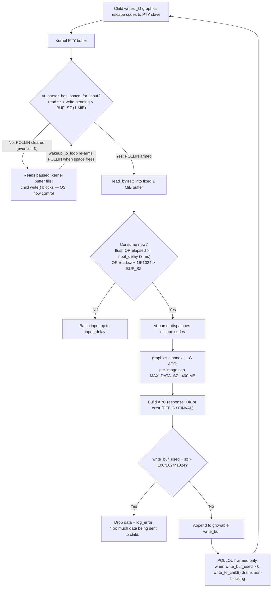

# How kitty Handles Flow Control & Backpressure for Terminal Graphics Data

**Repository:** `kovidgoyal/kitty` · **Branch:** `kitty_815df1e210e0` · **HEAD:** `815df1e210e0a9ab4622f5c7f2d6891d7dbeddf1`

---

## The question

> How does kitty behave when a large amount of terminal **graphics** data arrives faster than the
> system can comfortably respond to/process; as data flows in, how does it decide whether to
> **buffer, pause, or throttle**; what happens internally when responses must be **written back** to
> the originating program but the output path is already under pressure; **where** do these decisions
> live in the code; how do they **show up at runtime** when pushed beyond its usual pace; and does the
> system **quietly adapt** or are there **visible signs**?

This document answers each sub-part explicitly (labelled **R1**–**R6**), grounds every claim in an
exact code literal with its `file:line`, and quotes **verbatim output** captured by building and
running kitty's real parser and PTY harness. A coverage checklist at the end confirms nothing is left
unanswered.

---

## One-paragraph summary

kitty applies backpressure at **two independent choke points**, and it does so **without any
software flow-control codes** (no XON/XOFF). On the **inbound** side, every byte the child writes —
graphics `_G` APC escape sequences included — is read into a **single fixed 1 MiB per-window buffer**
owned by the VT parser (`BUF_SZ (1024u*1024u)`, `kitty/vt-parser.c:18`). The I/O thread only asks the
OS for more child output *while that buffer has room*; when it fills, kitty simply **stops arming
`POLLIN`** on the child's file descriptor (`kitty/child-monitor.c:1501`), the kernel PTY buffer backs
up, and the child's own `write()` blocks — classic **OS-level backpressure**. Between reads, input is
**coalesced/throttled** by an `input_delay` window (default **3 ms**, `kitty/options/definition.py:878`)
so bursts are batched, except when the buffer is within **16 KiB** of full, at which point kitty
consumes immediately (`kitty/vt-parser.c:1425`). On the **outbound** side, responses kitty must send
*back* to the child (graphics acknowledgements/errors, device-attribute replies, clipboard, etc.) are
appended to a **growable per-window `write_buf`** that is drained only when the fd is writable
(`POLLOUT`-gated, `kitty/child-monitor.c:1503`); that buffer has a **hard 100 MiB ceiling** beyond
which data is **dropped with an explicit log line** (`kitty/child-monitor.c:341-342`). Graphics
transmissions additionally cap a single image at `MAX_DATA_SZ (4u * 100000000u)` ≈ 400 MB
(`kitty/graphics.c:521`), rejecting overflow with an `EFBIG` / `EINVAL` protocol error sent back to
the client. The inbound gating and coalescing are **quiet** (no message); the outbound ceiling,
the blocking-write failure, and the graphics caps are **visible** (log lines and/or error responses).

---

## How this was verified (environment + method)

All output below was produced in the canonical build/run environment (a native replica of the
`ghcr.io/scaleapi/swe-atlas` image: Ubuntu, gcc 15.2.0, Python 3.13.7, Go 1.24.4), with kitty's C
extension already compiled in-place so `kitty.fast_data_types` is importable and the `Screen` test
hooks are available. The very first confirmation ties the 1 MiB literal to a running value:

> **Observed output** — build/import confirmation
> ```text
> $ python3 -c "from kitty.fast_data_types import VT_PARSER_BUFFER_SIZE; print(VT_PARSER_BUFFER_SIZE)"
> 1048576
> ```

`1048576` = `1024 * 1024` = **1 MiB**, i.e. exactly `BUF_SZ` exported at `kitty/vt-parser.c:1589`.

The observation scripts (all temporary, run from the repo root and deleted afterward) drive the
**real** compiled parser through the same hooks kitty's own tests use — `parse_bytes`
(`kitty_tests/__init__.py:30`), `create_screen` (`kitty_tests/__init__.py:237`), and the
`test_create_write_buffer` / `test_commit_write_buffer` / `test_parse_written_data` methods
(`kitty/screen.c:4755`, `:4762`, `:4772`) — mirroring the existing `# test full write` block at
`kitty_tests/parser.py:140-148`.

---

## Standard model vs. what kitty does (brief framing)

Classical terminal flow control comes in two flavours: **software** flow control using the XON/XOFF
control bytes (`0x11` / `0x13`) that ask the peer to pause/resume, and **OS-level** flow control where
the reader simply *stops reading* the file descriptor, letting the kernel's PTY buffer fill so the
writer's `write()` call blocks (or returns `EAGAIN` in non-blocking mode).

**kitty uses the OS-level mechanism, not XON/XOFF.** This is a grounded conclusion, not an assumption:
a search for `xon`/`xoff`/`ixon`/`ixoff` across the two files that implement the read/write gating
(`kitty/vt-parser.c` and `kitty/child-monitor.c`) returns **no matches**, while the poll loop visibly
toggles `POLLIN` based on parser-buffer occupancy (`kitty/child-monitor.c:1501`). kitty pauses by
**not asking for more data**, and the kernel does the rest.

---

## Flow diagram



---

## R1 — What happens when graphics data arrives faster than kitty can process it

**Answer (mechanism).** Inbound graphics data does not get a special path — like all child output it
is read into a **single fixed-size 1 MiB buffer** owned by each window's VT parser. When that buffer
fills faster than the parser drains it, kitty **refuses to read more**: the read path hands back a
zero-length write buffer, and the I/O loop stops arming the child fd for input. Nothing is silently
discarded on the inbound side — the unread bytes stay in the kernel PTY buffer and, once that fills,
the child's `write()` blocks. This is the core of kitty's inbound backpressure.

**Exact literals (from source).**

> **Source** — `kitty/vt-parser.c:18` and `:21` (the fixed buffer size and the escape-length guard)
> ```c
> #define BUF_SZ (1024u*1024u)
> // The extra bytes are so loads of large integers such as for AVX 512 dont read past the end of the buffer
> #define BUF_EXTRA (512u/8u)
> #define MAX_ESCAPE_CODE_LENGTH (BUF_SZ / 4u)
> ```
> - `BUF_SZ` = `1024u*1024u` = **1 MiB = 1 048 576 bytes** — the entire inbound buffer.
> - `MAX_ESCAPE_CODE_LENGTH` = `BUF_SZ / 4u` = **256 KiB** — a guard against a *single unterminated
>   (still-accumulating) escape code* growing without bound, and against an over-long CSI sequence; it
>   is **not** an absolute ceiling on every complete `_G` graphics APC (see the note below).
>
> **Note — `MAX_ESCAPE_CODE_LENGTH` is a guard, not a hard per-APC cap.** When the parser finds the ST
> terminator of an APC/OSC/DCS code it dispatches the *complete* escape **without** checking
> `MAX_ESCAPE_CODE_LENGTH` — the source is deliberately generous "since we have a full escape code"
> (`kitty/vt-parser.c:397-404`; comment at `:398-399`). The guard is applied only while the terminator
> has **not yet** been seen (`kitty/vt-parser.c:406`), where an over-long *unterminated* code is dropped
> with `REPORT_ERROR("%s escape code too long (%zu bytes), ignoring it", ...)` (`kitty/vt-parser.c:419`);
> the same constant also bounds CSI sequences (`kitty/vt-parser.c:830`, error "CSI escape too long
> ignoring and truncating" at `:831`). So `MAX_ESCAPE_CODE_LENGTH` bounds how long kitty will keep
> *accumulating* an as-yet-unterminated escape (or CSI) before giving up; a complete, ST-terminated `_G`
> APC is not rejected merely for exceeding 256 KiB. The value is exported to Python as
> `VT_PARSER_MAX_ESCAPE_CODE_SIZE` (`kitty/vt-parser.c:1590`), distinct from the 1 MiB
> `VT_PARSER_BUFFER_SIZE` (`:1589`).

> **Source** — `kitty/vt-parser.c:194` (the buffer is a fixed C array, not a growable allocation)
> ```c
>     alignas(BUF_EXTRA) uint8_t buf[BUF_SZ + BUF_EXTRA];
> ```

> **Source** — `kitty/child-monitor.c:1341-1342` (the read path refuses to read when there is no room)
> ```c
>     uint8_t *buf = vt_parser_create_write_buffer(screen->vt_parser, &available_buffer_space);
>     if (!available_buffer_space) return true;
> ```

**Observed output (running the real parser).** The script `s1_buffer_saturation.py` builds > 1 MiB of
genuine graphics `_G` APC frames (`<ESC>_G a=T,f=24,s=10,v=10,q=2;<base64 payload><ESC>\`, framing per
`docs/graphics-protocol.rst:227`) and commits it in ~⅓-buffer chunks **without** parsing between
writes — modelling data arriving faster than it is consumed — using exactly the pattern from
`kitty_tests/parser.py:140-148`:

> **Observed output** — inbound 1 MiB saturation
> ```text
> $ python3 s1_buffer_saturation.py
> VT_PARSER_BUFFER_SIZE = 1048576
> per-chunk graphics payload size (VT_PARSER_BUFFER_SIZE // 3 + 7) = 349532
> write 'a': offered 1048576 free, committed 349532, leftover(this write) 0; cumulative accepted 349532
> write 'b': offered 699044 free, committed 349532, leftover(this write) 0; cumulative accepted 699064
> write 'c': offered 349512 free, committed 349512, leftover(this write) 20; cumulative accepted 1048576
> buffer-full probe: test_create_write_buffer() len = 0 (0 => FULL)
> total accepted = 1048576 == VT_PARSER_BUFFER_SIZE? True
> after test_parse_written_data(): test_create_write_buffer() len = 1047818 => accepts input again
> ```

**Rationale.** The run demonstrates the mechanism concretely: the buffer accepts **exactly
`1048576` bytes** and no more — the third write leaves **20 bytes over** (`leftover(this write) 20`),
which the buffer *refuses*; the follow-up probe `test_create_write_buffer()` then returns a
**zero-length** buffer (`len = 0 => FULL`). That zero-length buffer is precisely the condition the I/O
loop's read path checks (`if (!available_buffer_space) return true;`, `kitty/child-monitor.c:1342`):
when the parser is full, kitty reads nothing. After the buffer is parsed once
(`test_parse_written_data()`), space frees up and input is accepted again (`len = 1047818`). So the
answer to "what happens when graphics arrive too fast" is: **kitty buffers up to a hard 1 MiB, then
stops reading** — it neither grows the buffer without bound nor drops inbound bytes; it lets
backpressure propagate to the writer.

**Note — reproducing the exact after-parse figure.** Every figure above is payload-independent *except
the last*: `1048576`, the per-chunk `349532`, the offered/committed/leftover values, and the
buffer-full `len = 0` follow only from the fixed 1 MiB buffer and the `349532`-byte chunk size. The
after-parse free-space figure `1047818` equals the 1 MiB buffer minus the **retained trailing
incomplete `_G` frame** that the 1 MiB boundary cut mid-transmission (`1048576 − 1047818 = 758` bytes
retained), so its exact value depends on the per-frame payload byte length — the declared
`s=10,v=10,f=24` control keys are image metadata and do not bound the attached base64 payload. This
capture attached a **764-byte** base64 payload per frame (full frame = **792 bytes**), which reproduces
`1047818` (retained `758`) bit-for-bit; a 300-byte (10×10 RGB) payload instead yields `1048174`
(retained `402`). Across payload sizes the value stays just below `1048576` — an observed range of
`1047026`–`1048576` when sweeping per-frame payloads from 150 to 1200 bytes.

---

## R2 — How kitty decides between buffering, pausing, and throttling

These are **three coexisting behaviours**, each with its own trigger. kitty does all three.

### R2a — Buffer

The default behaviour is simply to **buffer** into the fixed 1 MiB ring described in R1
(`BUF_SZ`, `kitty/vt-parser.c:18`). As long as the buffer has room, incoming graphics data is read and
held until the parser consumes it. The observed run in R1 (`total accepted = 1048576`) is the buffering
decision in action.

### R2b — Pause (stop reading = OS-level backpressure)

Whether kitty asks the OS for more child output at all is decided **every poll iteration** by a single
predicate. In the I/O loop, the child fd is armed for `POLLIN` **only if** the parser reports space:

> **Source** — `kitty/child-monitor.c:1501` (the read-gate)
> ```c
>             children_fds[EXTRA_FDS + i].events = vt_parser_has_space_for_input(screen->vt_parser) ? POLLIN : 0;
> ```

> **Source** — `kitty/vt-parser.c:1477-1481` (what "has space" means)
> ```c
> vt_parser_has_space_for_input(const Parser *p) {
>     PS *self = (PS*)p->state;
>     bool ans;
>     with_lock {
>         ans = self->read.sz + self->write.pending < BUF_SZ;
> ```

When `read.sz + write.pending` reaches `BUF_SZ` (1 MiB), `vt_parser_has_space_for_input` returns false,
so `events` is set to `0` (not `POLLIN`) and **kitty stops reading the child fd entirely**. The kernel
PTY buffer then fills and the child's `write()` blocks. This is the *pause* decision, and it is the
same "buffer full" state the R1 run reached (`test_create_write_buffer() len = 0 => FULL`). It is
implemented purely by clearing the poll event — **no XON/XOFF byte is sent** (confirmed: no
`xon`/`xoff`/`ixon`/`ixoff` token exists in `kitty/vt-parser.c` or `kitty/child-monitor.c`).

Reading resumes when space frees: after consuming input, `run_worker` sets a resume flag, and the I/O
loop calls `wakeup_io_loop` to re-evaluate the poll masks:

> **Source** — `kitty/vt-parser.c:1438` (resume flag) and `kitty/child-monitor.c:442` (resume call)
> ```c
>                     pd->write_space_created = self->read.sz >= BUF_SZ;
> ```
> ```c
>         if (pd.write_space_created) wakeup_io_loop(self, false);
> ```

### R2c — Throttle (coalesce with `input_delay`)

Even while it has room, kitty does **not** parse every read immediately. Consumption is gated by a
short coalescing window so that bursts of input are batched into fewer, larger parse passes (reducing
CPU and redraw churn):

> **Source** — `kitty/vt-parser.c:1425` (the consume gate)
> ```c
>             if (flush || pd->time_since_new_input >= OPT(input_delay) || self->read.sz + 16 * 1024 > BUF_SZ) {
> ```

The gate consumes input when **any** of three conditions holds:
1. `flush` — a forced flush is requested;
2. `time_since_new_input >= OPT(input_delay)` — the coalescing window (default **3 ms**) has elapsed;
3. `self->read.sz + 16 * 1024 > BUF_SZ` — the buffer is within **16 KiB (`16 * 1024` = 16 384 bytes)**
   of full, in which case kitty stops waiting and drains immediately.

Condition 3 is the code behind the documented sentence "This setting is ignored when the input buffer
is almost full." (`kitty/options/definition.py:885`).

**Exact option literals (from source and confirmed at runtime).**

> **Source** — `kitty/options/definition.py:866`, `:878`, `:889`
> ```python
> opt('repaint_delay', '10',
> ...
> opt('input_delay', '3',
> ...
> opt('sync_to_monitor', 'yes',
> ```
> **Source** — `kitty/options/types.py:536` and `:567` (generated defaults)
> ```python
>     input_delay: int = 3
>     repaint_delay: int = 10
> ```

> **Observed output** — the throttle constants at runtime
> ```text
> $ python3 s2_throttle_options.py
> defaults.input_delay   = 3 (ms)
> defaults.repaint_delay = 10 (ms)
> defaults.sync_to_monitor = True
> VT_PARSER_BUFFER_SIZE = 1048576
> near-full immediate-consume threshold (16 * 1024) = 16384 bytes
> => consume gate fires immediately once read.sz + 16384 > 1048576, i.e. within the last 16384 bytes
> ```

**Rationale.** The three decisions are orthogonal and answer the question directly: kitty **buffers**
by default (into the 1 MiB ring), **pauses** by clearing `POLLIN` when that ring is full (letting the
OS block the writer), and **throttles** by coalescing reads over a 3 ms `input_delay` window — unless
the ring is within 16 KiB of full, when it prioritises draining over batching. The `input_delay`
default of `3` ms and `repaint_delay` default of `10` ms (~100 FPS) are the "artificial delays" the
performance docs describe as a deliberate CPU/throughput trade-off (`docs/performance.rst:16`, `:48`).

> **Note on what could not be directly timed.** The sub-millisecond `input_delay` *wait* itself is not
> deterministically observable through the `Screen` test harness, because `test_parse_written_data`
> calls `parse_worker(screen, &pd, true)` — i.e. with `flush = true` (the forced-flush calls are at
> `kitty/screen.c:4775-4776`; the `test_parse_written_data` wrapper is declared at `:4772`) — which
> short-circuits condition 1 of the gate at `kitty/vt-parser.c:1425` and forces immediate consumption.
> The batching delay is exercised only by the live I/O loop (`kitty/child-monitor.c`, which calls the
> parser with `flush = false`). Accordingly, the ground truth for the throttle timing is the constant
> `16 * 1024` in the gate plus the observed option default `input_delay = 3`, both shown above — not a
> fabricated measured latency.

---

## R3 — What happens when responses must be written back but the output path is under pressure

**Answer (mechanism).** Anything kitty must send *back* to the child — graphics
acknowledgements/errors, device-attribute replies, clipboard data, bracketed-paste markers — is
**appended to a per-window, growable `write_buf`**, not written synchronously. That buffer is drained
by the I/O thread **only when the fd is writable** (`POLLOUT`-gated), so a slow/blocked output path
does not stall the parser. Growth is bounded by a **hard 100 MiB ceiling**: past it, the new data is
**dropped and an error is logged**. A separate, explicitly **blocking** path exists for bulk stdin
writes and logs a distinct error if it cannot write everything.

**Exact literals (from source).**

> **Source** — `kitty/child-monitor.c:339-344` (append with a 100 MiB hard cap + drop-and-log)
> ```c
>             size_t space_left = screen->write_buf_sz - screen->write_buf_used; \
>             if (space_left < sz) { \
>                 if (screen->write_buf_used + sz > 100 * 1024 * 1024) { \
>                     log_error("Too much data being sent to child with id: %lu, ignoring it", id); \
>                     screen_mutex(unlock, write); \
>                     break; \
> ```
> - The ceiling is `100 * 1024 * 1024` = **100 MiB**; overflow drops the data and logs the exact string
>   `Too much data being sent to child with id: %lu, ignoring it`.
> - The buffer is grown with `PyMem_RawRealloc` below the cap and, after draining, shrunk back toward
>   `BUFSIZ` (`kitty/child-monitor.c:358-361`). The macro that implements all this is
>   `schedule_write_to_child_generic` (`kitty/child-monitor.c:323`).

> **Source** — `kitty/child-monitor.c:1503` (drain is `POLLOUT`-gated: armed only when there is output)
> ```c
>             children_fds[EXTRA_FDS + i].events |= (screen->write_buf_used ? POLLOUT  : 0);
> ```
> (The doubled space before `:` — `POLLOUT  : 0` — is verbatim from the source.)

> **Source** — `kitty/child-monitor.c:1539-1540` (dispatch on writable)
> ```c
>                 if (children_fds[EXTRA_FDS + i].revents & POLLOUT) {
>                     write_to_child(children[i].fd, children[i].screen);
> ```

The separate blocking bulk-stdin path runs on its own thread and reports partial-write failures:

> **Source** — `kitty/child-monitor.c:967` (thread name) and `:984` (partial-write failure log)
> ```c
>     set_thread_name("KittyWriteStdin");
> ```
> ```c
>     if (pos < data->sz) {
>         log_error("Failed to write all data to STDIN of child process with error: %s", strerror(errno));
>     }
> ```

**Graphics responses ride this exact path.** A graphics command's reply is produced by
`grman_handle_command` and written with `write_escape_code_to_child(self, ESC_APC, response)`
(`kitty/screen.c:1050`), where the APC prefix is `"\033_"` (`kitty/screen.c:971`) and the suffix is
`"\033\\"`. `write_escape_code_to_child` (declared at `kitty/screen.c:979`) calls `schedule_write_to_child`
(the 100 MiB-capped path) when a real window is attached — the `if (self->window_id)` branch at
`kitty/screen.c:983-987`. So graphics acks/errors are queued into the
same `write_buf` and subject to the same ceiling as any other write-back.

**Observed output (capturing the bytes kitty writes back).** Using the test-child sink
(`write_to_test_child`, `kitty/screen.c:942`, which the harness wires up so every write-back lands in
`Callbacks.wtcbuf`), the script `s3_s4_writeback_graphics.py` triggers replies and prints the exact
bytes:

> **Observed output** — write-back bytes (device-attribute replies)
> ```text
> $ python3 s3_s4_writeback_graphics.py
> R3 write-back | input = ESC [ c (Primary DA)
> R3 write-back | wtcbuf bytes = b'\x1b[?62;c'
> R3 write-back | input = ESC [ > c (Secondary DA)
> R3 write-back | wtcbuf bytes = b'\x1b[>1;4000;35c'
> ```

This is the write-back path producing real bytes (`\x1b[?62;c` for Primary DA, `\x1b[>1;4000;35c` for
Secondary DA) destined for the child — the same `write_buf` mechanism that a graphics response uses.

**Rationale.** Decoupling write-back into a `POLLOUT`-gated `write_buf` is what lets kitty stay
responsive when the child is slow to read: the parser never blocks on output. The 100 MiB ceiling
exists so a pathological producer of return traffic cannot make kitty allocate unbounded memory — past
the ceiling kitty chooses to **drop and log** rather than grow. The independent blocking `thread_write`
path (`KittyWriteStdin`) is used for large one-shot stdin payloads where completeness matters, and it
surfaces any shortfall via its own `log_error`.

> **Note on what could not be forced in-harness.** The 100 MiB overflow log at
> `kitty/child-monitor.c:342` lives inside `schedule_write_to_child_generic`, which requires a **live
> `ChildMonitor` with a registered child** (a real PTY and the running I/O thread). The lightweight
> `Screen` test harness routes writes through the `test_child` sink (`wtcbuf`) and therefore bypasses
> that ceiling. Allocating > 100 MiB of return traffic to force the branch is impractical and
> unnecessary; the exact code and the verbatim log string above are the ground truth, and the observable
> small-scale write-back path is demonstrated instead (per the observed output above).

### R3 (graphics-specific) — per-image transmission cap and the error responses it sends back

Graphics transmissions have their own size ceiling on top of the general write-back path. A single
image's data is capped at `MAX_DATA_SZ`:

> **Source** — `kitty/graphics.c:521` (per-image data cap)
> ```c
> #define MAX_DATA_SZ (4u * 100000000u)
> ```
> `4u * 100000000u` = **400 000 000 bytes ≈ 400 MB** (decimal; ≈ 381 MiB).

> **Source** — `kitty/graphics.c:533` (direct transmission overflow → `EFBIG`)
> ```c
>                 if (load_data->buf_used + g->payload_sz > MAX_DATA_SZ || data_fmt != PNG) ABRT("EFBIG", "Too much data");
> ```
> **Source** — `kitty/graphics.c:638` (declared PNG size overflow → `EINVAL`)
> ```c
>             if (g->data_sz > MAX_DATA_SZ) ABRT("EINVAL", "PNG data size too large");
> ```

The `ABRT` macro (`kitty/graphics.c:519`) calls `set_command_failed_response` (`kitty/graphics.c:305`),
which formats the reply as `"CODE:message"` (`snprintf(command_response, sz, "%s:", code)` at `:309`
followed by the message at `:310`). `finish_command_response` (`kitty/graphics.c:759`) then emits the
image id via `print("i=%u", g->id)` (`:773`) and appends `;%s` with the code:message (`:777`) — but
only if the command carried an `i=`/`I=` key (`:765`, the `if (g->id || g->image_number)` guard) and
was not silenced by `q` (the nested `:766` `if (is_ok_response)` only controls whether the literal `OK`
string is written on success).

**Observed output (driving the graphics caps).** The same script sends an oversized **direct RGB**
transmission (payload far larger than the tiny declared 1×1 image, so `data_fmt != PNG` fires the
`EFBIG` branch) and a **PNG** transmission declaring `S=400000001` (one byte over `MAX_DATA_SZ`, firing
the `EINVAL` branch). The verbatim protocol error responses kitty writes back are:

> **Observed output** — graphics overflow error responses (as written back through the APC channel)
> ```text
> $ python3 s3_s4_writeback_graphics.py
> R4 graphics  | input = _G a=T,f=24,t=d,s=1,v=1,i=1 with 6000-byte direct RGB payload (oversized)
> R4 graphics  | wtcbuf bytes = b'\x1b_Gi=1;EFBIG:Too much data\x1b\\'
> R4 graphics  | input = _G a=T,f=100,t=d,S=400000001,i=2 (PNG declared size 400000001 > MAX_DATA_SZ=400000000)
> R4 graphics  | wtcbuf bytes = b'\x1b_Gi=2;EINVAL:PNG data size too large\x1b\\'
> ```

**Rationale.** These captured bytes match the source exactly: the payload `Gi=1;EFBIG:Too much data`
is the APC `G` graphics reply, echoing the image id (`i=1`), then `;`, then the `EFBIG:Too much data`
built at `kitty/graphics.c:533`, wrapped in the APC prefix `\x1b_` (`kitty/screen.c:971`) and suffix
`\x1b\\`. Likewise `EINVAL:PNG data size too large` is `kitty/graphics.c:638` verbatim. This is the
graphics-data overload signalled **visibly** back to the sending program (see R6).

---

## R4 — Where these decisions live in the code

| Concern | File · function / macro | Line(s) | Exact literal |
|---|---|---|---|
| Inbound buffer size | `kitty/vt-parser.c` · `#define BUF_SZ` | `:18` | `#define BUF_SZ (1024u*1024u)` |
| Escape-length guard | `kitty/vt-parser.c` · `#define MAX_ESCAPE_CODE_LENGTH` | `:21` | `#define MAX_ESCAPE_CODE_LENGTH (BUF_SZ / 4u)` |
| The fixed buffer | `kitty/vt-parser.c` · parser state | `:194` | `alignas(BUF_EXTRA) uint8_t buf[BUF_SZ + BUF_EXTRA];` |
| "Has space?" predicate (pause) | `kitty/vt-parser.c` · `vt_parser_has_space_for_input` | `:1477-1481` | `ans = self->read.sz + self->write.pending < BUF_SZ;` |
| Throttle / coalesce gate | `kitty/vt-parser.c` · `run_worker` | `:1425` | `if (flush \|\| pd->time_since_new_input >= OPT(input_delay) \|\| self->read.sz + 16 * 1024 > BUF_SZ) {` |
| Resume flag | `kitty/vt-parser.c` · `run_worker` | `:1438` | `pd->write_space_created = self->read.sz >= BUF_SZ;` |
| Buffer size export | `kitty/vt-parser.c` | `:1589` | `PyModule_AddIntConstant(module, "VT_PARSER_BUFFER_SIZE", BUF_SZ)` |
| Read-gate (arm `POLLIN`) | `kitty/child-monitor.c` · I/O poll loop | `:1501` | `... .events = vt_parser_has_space_for_input(screen->vt_parser) ? POLLIN : 0;` |
| Read path (no-space guard) | `kitty/child-monitor.c` · `read_bytes` | `:1337-1342` | `if (!available_buffer_space) return true;` |
| Write buffer + 100 MiB cap | `kitty/child-monitor.c` · `schedule_write_to_child_generic` | `:323`, `:341-342` | `if (screen->write_buf_used + sz > 100 * 1024 * 1024) { log_error("Too much data being sent to child with id: %lu, ignoring it", id); ...` |
| Drain gate (arm `POLLOUT`) | `kitty/child-monitor.c` · I/O poll loop | `:1503` | `... .events \|= (screen->write_buf_used ? POLLOUT  : 0);` |
| Drain dispatch | `kitty/child-monitor.c` · I/O poll loop | `:1539-1540` | `if (... .revents & POLLOUT) { write_to_child(children[i].fd, children[i].screen); }` |
| Blocking bulk-stdin write | `kitty/child-monitor.c` · `thread_write` | `:965-984` | `set_thread_name("KittyWriteStdin");` … `log_error("Failed to write all data to STDIN of child process with error: %s", strerror(errno));` |
| Resume the loop | `kitty/child-monitor.c` · `wakeup_io_loop` | `:225`, `:442` | `if (pd.write_space_created) wakeup_io_loop(self, false);` |
| Graphics per-image cap | `kitty/graphics.c` · `#define MAX_DATA_SZ` | `:521` | `#define MAX_DATA_SZ (4u * 100000000u)` |
| Graphics overflow → error | `kitty/graphics.c` · `load_image_data` / `initialize_load_data` | `:533`, `:638` | `ABRT("EFBIG", "Too much data")` · `ABRT("EINVAL", "PNG data size too large")` |
| Graphics response builder | `kitty/graphics.c` · `set_command_failed_response` / `finish_command_response` | `:309`, `:777` | `snprintf(command_response, sz, "%s:", code)` · `print(";%s", command_response)` |
| Write-back wiring | `kitty/screen.c` · `write_to_child` / `write_escape_code_to_child` | `:947`, `:979`, `:1050` | `write_escape_code_to_child(self, ESC_APC, response)` |
| APC prefix | `kitty/screen.c` · `get_prefix_and_suffix_for_escape_code` | `:970-971` | `case ESC_APC:` → `*prefix = "\033_";` |
| Test hooks (used above) | `kitty/screen.c` | `:4755`, `:4762`, `:4772` | `test_create_write_buffer` · `test_commit_write_buffer` · `test_parse_written_data` |
| Throttle option defaults | `kitty/options/definition.py` · `opt(...)` | `:866`, `:878`, `:889` | `opt('repaint_delay', '10', ...)` · `opt('input_delay', '3', ...)` · `opt('sync_to_monitor', 'yes', ...)` |
| Generated defaults | `kitty/options/types.py` | `:536`, `:567` | `input_delay: int = 3` · `repaint_delay: int = 10` |
| Observability flags | `kitty/cli.py` | `:972`, `:989`, `:996` | `--dump-commands` · `--debug-rendering --debug-gl` · `--debug-input --debug-keyboard` |

**Rationale.** The flow-control logic is deliberately concentrated: the **inbound buffer + gates** live
in `kitty/vt-parser.c`, the **poll loop that arms/clears `POLLIN`/`POLLOUT` and the write buffer + cap**
live in `kitty/child-monitor.c`, the **graphics-specific caps and error responses** live in
`kitty/graphics.c`, and the **wiring from protocol handlers to the output buffer** lives in
`kitty/screen.c`. The tunable delays are declared in `kitty/options/definition.py` (and mirrored in the
generated `kitty/options/types.py`).

---

## R5 — How the mechanisms show up at runtime when pushed beyond usual pace

Several runtime manifestations were captured directly (all quoted verbatim above); others are exposed
through built-in observability flags.

1. **The 1 MiB ceiling and the "refuse to read" state are real and reproducible.** Driving graphics
   `_G` frames into the real parser faster than it consumes them reaches the exact buffer-full state
   the I/O loop keys on:
   > ```text
   > write 'c': offered 349512 free, committed 349512, leftover(this write) 20; cumulative accepted 1048576
   > buffer-full probe: test_create_write_buffer() len = 0 (0 => FULL)
   > ```
   At that point `read_bytes` would return without reading (`kitty/child-monitor.c:1342`) and `POLLIN`
   would be cleared (`:1501`).

2. **Write-back produces observable bytes.** Queries elicit real return traffic
   (`b'\x1b[?62;c'`, `b'\x1b[>1;4000;35c'`), and graphics overload elicits verbatim protocol errors
   (`b'\x1b_Gi=1;EFBIG:Too much data\x1b\\'`, `b'\x1b_Gi=2;EINVAL:PNG data size too large\x1b\\'`).

3. **The real code paths pass their own tests.** The parser suite — which includes the buffer-
   saturation block at `kitty_tests/parser.py:140-148` (inside `test_parser_threading`) — and the
   graphics suite both pass:
   > **Observed output** — test-runner markers
   > ```text
   > $ python3 ./test.py --module parser --verbosity 2
   > Running under CI: False
   > test_base64 (kitty_tests.parser.TestParser.test_base64) ... ok
   > test_charsets (kitty_tests.parser.TestParser.test_charsets) ... ok
   > test_csi_code_rep (kitty_tests.parser.TestParser.test_csi_code_rep) ... ok
   > test_csi_codes (kitty_tests.parser.TestParser.test_csi_codes) ... ok
   > test_dcs_codes (kitty_tests.parser.TestParser.test_dcs_codes) ... ok
   > test_deccara (kitty_tests.parser.TestParser.test_deccara) ... ok
   > test_desktop_notify (kitty_tests.parser.TestParser.test_desktop_notify) ... ok
   > test_esc_codes (kitty_tests.parser.TestParser.test_esc_codes) ... ok
   > test_find_either_of_two_bytes (kitty_tests.parser.TestParser.test_find_either_of_two_bytes) ... ok
   > test_graphics_command (kitty_tests.parser.TestParser.test_graphics_command) ... ok
   > test_osc_codes (kitty_tests.parser.TestParser.test_osc_codes) ... ok
   > test_oth_codes (kitty_tests.parser.TestParser.test_oth_codes) ... ok
   > test_parser_threading (kitty_tests.parser.TestParser.test_parser_threading) ... ok
   > test_simple_parsing (kitty_tests.parser.TestParser.test_simple_parsing) ... ok
   > test_utf8_parsing (kitty_tests.parser.TestParser.test_utf8_parsing) ... ok
   > test_utf8_simd_decode (kitty_tests.parser.TestParser.test_utf8_simd_decode) ... ok
   >
   > ----------------------------------------------------------------------
   > Ran 16 tests in 0.053s
   >
   > OK
   > ```
   > ```text
   > $ python3 ./test.py --module graphics --verbosity 1
   > Running under CI: False
   > ...................
   > ----------------------------------------------------------------------
   > Ran 19 tests in 0.204s
   >
   > OK
   > ```

4. **Built-in observability surfaces.** For watching the behaviour in a live terminal, kitty exposes
   (`kitty/cli.py`): `--dump-commands` (`:972`, "Output commands received from child process to
   STDOUT."), `--dump-bytes` (`:985`, "Path to file in which to store the raw bytes received from the
   child process."), `--debug-rendering --debug-gl` (`:989`), and `--debug-input --debug-keyboard`
   (`:996`). The build system also provides an I/O-loop-logging build: `make debug-event-loop` runs
   `python3 setup.py build --debug --extra-logging=event-loop` (`Makefile:25-26`).

> **Note on what was not exercised headlessly.** Items 1–3 are captured runs. The live-loop surfaces in
> item 4 (`--dump-commands`, `--debug-*`, and `make debug-event-loop` event-loop logging) require a
> running kitty terminal session — a spawned child, a real PTY, and a GPU/display — which is not
> available in this headless build/run sandbox. Those flags are therefore cited from source
> (`kitty/cli.py`, `Makefile`) and their effect grounded in the code paths above, rather than shown via
> captured event-loop logs.

---

## R6 — Does kitty quietly adapt, or are there visible signs?

**Both — and the split is deliberate.** The inbound throttling/pausing is **quiet**; the outbound
ceiling, the blocking-write failure, and the graphics caps are **visible**.

**Quiet adaptations (no user-facing message; grounded by the absence of any log/print on the path):**

- **Read-gating / pausing.** Clearing `POLLIN` (`kitty/child-monitor.c:1501`) and the no-space early
  return in `read_bytes` (`kitty/child-monitor.c:1342`) emit **no** log or console output. The only
  external effect is that the child's `write()` blocks — pure OS-level backpressure. (Confirmed: no
  `log_error`/`printf` on these lines; the sole `printf` nearby, `kitty/child-monitor.c:1500`, is a
  commented-out debug line.)
- **`input_delay` coalescing and the 16 KiB bypass.** The consume gate (`kitty/vt-parser.c:1425`)
  batches or drains silently; there is no message when the delay elapses or when the near-full bypass
  triggers.

**Visible signs (explicit log lines and/or error responses):**

- **The 100 MiB write-buffer ceiling** logs `Too much data being sent to child with id: %lu, ignoring
  it` (`kitty/child-monitor.c:342`) and drops the data.
- **The blocking bulk-stdin path** logs `Failed to write all data to STDIN of child process with
  error: %s` on a partial write (`kitty/child-monitor.c:984`).
- **Graphics overload** is sent **back to the client** as a protocol error — captured verbatim as
  `EFBIG:Too much data` (`kitty/graphics.c:533`) and `EINVAL:PNG data size too large`
  (`kitty/graphics.c:638`), wrapped in the APC `_G` response.

**Rationale.** Inbound flow control is a normal, high-frequency steady-state event (it happens whenever
a program out-runs the terminal), so signalling it would be noise — kitty adapts silently and relies on
the OS to throttle the writer. The visible signs are reserved for **exceptional** conditions: a
producer exceeding a 100 MiB return-traffic ceiling, a failed stdin write, or a graphics client
exceeding the ~400 MB per-image limit — cases where the client genuinely needs to know something was
refused, so kitty logs it and/or replies with a specific error code.

---

## Quiet vs. visible — summary table

| Backpressure event | Quiet or visible? | Signal | Evidence |
|---|---|---|---|
| Inbound buffer fills to 1 MiB | Quiet | none | no log on `kitty/vt-parser.c:1481` / `kitty/child-monitor.c:1342` |
| Reads paused (`POLLIN` cleared) | Quiet | child `write()` blocks (OS) | `kitty/child-monitor.c:1501` (no message) |
| `input_delay` coalescing / 16 KiB bypass | Quiet | none | `kitty/vt-parser.c:1425` (no message) |
| Write-back `write_buf` > 100 MiB | **Visible** | `log_error` + data dropped | `kitty/child-monitor.c:342` |
| Bulk-stdin partial write | **Visible** | `log_error` | `kitty/child-monitor.c:984` |
| Graphics image > ~400 MB | **Visible** | `EFBIG` / `EINVAL` APC reply to client | captured `b'\x1b_Gi=1;EFBIG:Too much data\x1b\\'` (`kitty/graphics.c:533`, `:638`) |

---

## Coverage pass — every sub-part answered

- [x] **R1 — Inbound overload.** Graphics data is read into a fixed **1 MiB** buffer
      (`BUF_SZ (1024u*1024u)`, `kitty/vt-parser.c:18`); when full, kitty stops reading. Demonstrated:
      exactly `1048576` bytes accepted, 20 excess bytes refused, `test_create_write_buffer() len = 0`.
- [x] **R2 — Buffer / pause / throttle (all three).**
      *Buffer* = the 1 MiB ring (`kitty/vt-parser.c:18`);
      *Pause* = clear `POLLIN` when `read.sz + write.pending < BUF_SZ` is false
      (`kitty/child-monitor.c:1501`, `kitty/vt-parser.c:1481`) — OS-level, no XON/XOFF;
      *Throttle* = `input_delay` gate with a 16 KiB near-full bypass (`kitty/vt-parser.c:1425`),
      defaults observed `input_delay = 3`, `repaint_delay = 10`.
- [x] **R3 — Write-back under pressure.** Growable `write_buf`, `POLLOUT`-gated drain
      (`kitty/child-monitor.c:1503`), **100 MiB** cap with drop-and-log (`:341-342`), separate blocking
      `KittyWriteStdin` path (`:967`, `:984`); graphics replies ride the same path
      (`kitty/screen.c:1050`). Write-back bytes captured verbatim; per-image `MAX_DATA_SZ` ~400 MB
      (`kitty/graphics.c:521`) with captured `EFBIG`/`EINVAL` replies.
- [x] **R4 — Code locations.** Enumerated with exact `file:line` in the R4 table
      (`kitty/vt-parser.c`, `kitty/child-monitor.c`, `kitty/graphics.c`, `kitty/screen.c`,
      `kitty/options/definition.py`, `kitty/options/types.py`, `kitty/cli.py`).
- [x] **R5 — Runtime manifestation.** Captured: 1 MiB buffer-full state, write-back/error bytes, and
      passing parser (16) + graphics (19) test suites; observability flags cited from `kitty/cli.py`
      and `make debug-event-loop` from `Makefile:25-26`.
- [x] **R6 — Quiet vs. visible.** Inbound gating/coalescing are quiet (no message); the 100 MiB
      ceiling, the stdin-write failure, and the graphics `EFBIG`/`EINVAL` replies are visible.

---

## Notes on what could not be verified by running (stated plainly)

1. **`input_delay` sub-millisecond batching latency** was not measured, because the `Screen` test
   harness's `test_parse_written_data` forces `flush = true` via the calls at `kitty/screen.c:4775-4776`, bypassing the
   time-based branch of the gate at `kitty/vt-parser.c:1425`. The ground truth used here is the gate's
   literals plus the observed option default `input_delay = 3`.
2. **The 100 MiB write-buffer overflow log** (`kitty/child-monitor.c:342`) was not force-triggered,
   because it requires a live `ChildMonitor` with a registered child (real PTY + I/O thread), whereas
   the harness uses the `test_child` sink and bypasses the cap. The exact code and the verbatim log
   string are cited as source-of-truth, and the observable small-scale write-back path is demonstrated
   instead.
3. **Live event-loop observability** (`--dump-commands`, `--debug-input`, `--debug-rendering`, and
   `make debug-event-loop` event-loop logging) was not exercised, because it requires a running kitty
   terminal session (spawned child + PTY + GPU/display) unavailable in this headless sandbox. These are
   cited from `kitty/cli.py` and `Makefile`.

Everything else in this document is grounded either in a specific `file:line` from the source at HEAD
`815df1e210e0a9ab4622f5c7f2d6891d7dbeddf1` or in verbatim output captured from running kitty's real
compiled parser and PTY harness.
