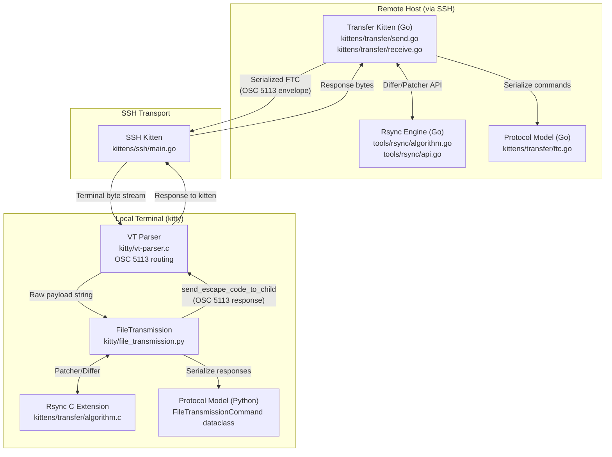
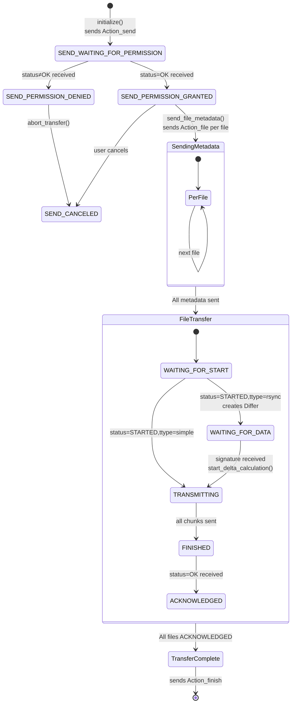
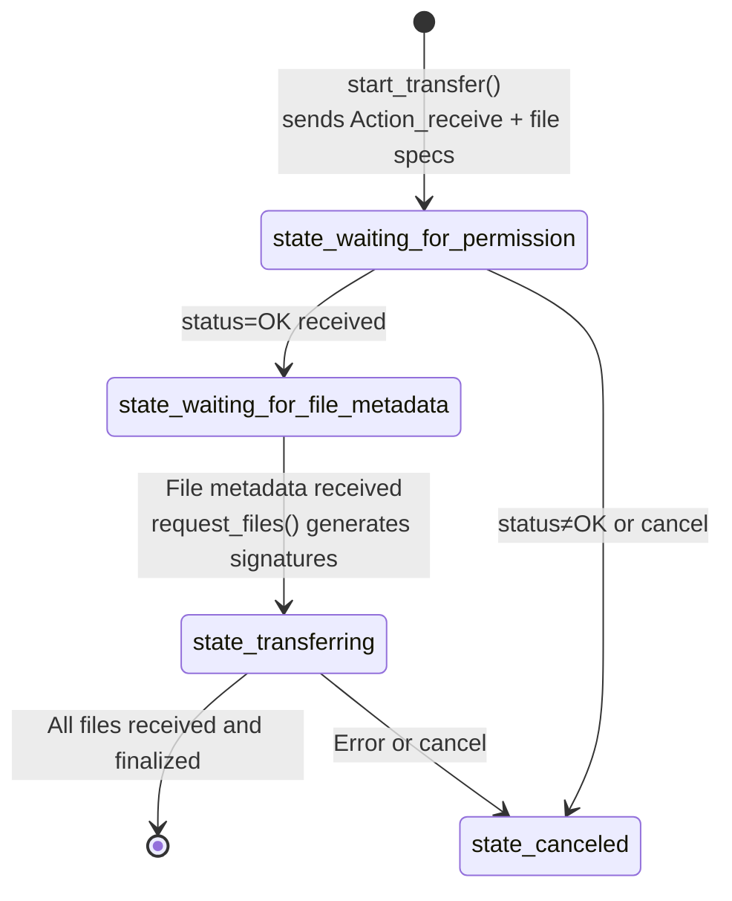
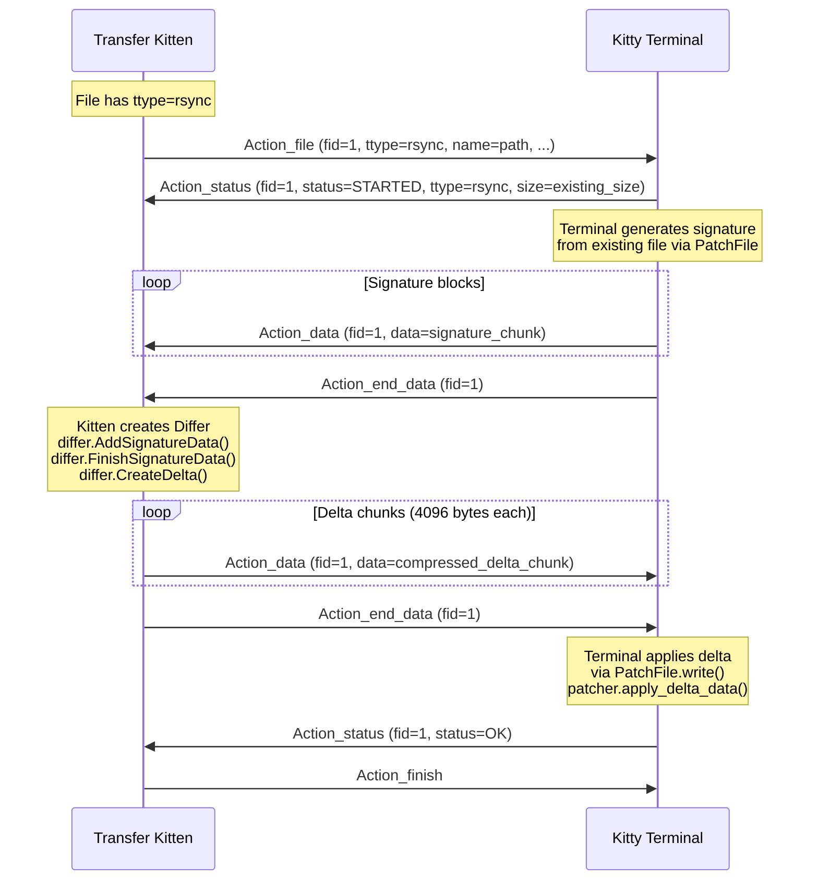

# Kitty File Transfer Protocol: Complete Data Journey Investigation

This document is a comprehensive, evidence-based investigation into kitty's file transfer protocol over SSH connections. It traces the complete journey of file data — from the moment the transfer kitten initiates a protocol handshake, through rsync-style delta computation, data encoding and stream demultiplexing, and finally to reassembly at the destination. Every assertion is grounded in the actual source code of the kitty repository, citing specific files, functions, struct definitions, and line numbers.

## Repository Context

- **Source branch**: `kitty_815df1e210e0`
- **Go toolchain**: 1.22 (declared in `go.mod`, line 3)
- **Key dependency**: `github.com/zeebo/xxh3` v1.0.2 — xxHash3 implementation for the rsync hashing engine (`go.mod`, line 16)

---

## Table of Contents

1. [Protocol Handshake Initiation](#1-protocol-handshake-initiation)
2. [Rsync-Style Delta Transfer Mechanism](#2-rsync-style-delta-transfer-mechanism)
3. [Data Encoding and Stream Reassembly](#3-data-encoding-and-stream-reassembly)
4. [Transfer Resumption Behavior](#4-transfer-resumption-behavior)
5. [Delta Transfer Efficiency Demonstration](#5-delta-transfer-efficiency-demonstration)
6. [Data Flow Architecture](#6-data-flow-architecture)
7. [Protocol State Machine](#7-protocol-state-machine)

---

## 1. Protocol Handshake Initiation

**Question**: How does the transfer kitten initiate the protocol handshake, and what escape sequences establish the transfer session over the terminal connection?

### 1.1 Thinking and Rationale

The transfer kitten is a Go CLI tool that communicates with the kitty terminal emulator through OSC (Operating System Command) escape sequences embedded in the terminal byte stream. This is a brilliant design choice: by encoding protocol messages as escape sequences, the transfer protocol can work over any transport that preserves the terminal stream — including SSH — without requiring a separate data channel. The key insight is that the VT terminal parser in kitty already knows how to route different escape codes to different handlers, so file transfer data can be multiplexed alongside normal terminal output using a dedicated OSC code (5113).

### 1.2 Entry Point: The Transfer Kitten CLI

The journey begins in `kittens/transfer/main.go`. The `main()` function (line 46) is the CLI entry point that receives parsed command-line options and dispatches to the appropriate transfer mode:

```go
// kittens/transfer/main.go, lines 46-67
func main(cmd *cli.Command, opts *Options, args []string) (rc int, err error) {
    if opts.PermissionsBypass != "" {
        val, err := read_bypass(opts.PermissionsBypass)
        if err != nil {
            return 1, err
        }
        opts.PermissionsBypass = strings.TrimSpace(val)
    }
    // ...
    switch opts.Direction {
    case "send", "download":
        err, rc = send_main(opts, args)
    default:
        err, rc = receive_main(opts, args)
    }
```

**Key observations**:
- Lines 47–53: Before dispatching, if a bypass password is specified (`opts.PermissionsBypass`), it is read via `read_bypass()` which supports file descriptors, stdin, file paths, or literal strings (lines 18–43).
- Lines 57–62: The `Direction` option determines whether the kitten operates in send mode (`send_main`) or receive mode (`receive_main`).

### 1.3 Send Mode Initialization

`send_main()` in `kittens/transfer/send.go` (line 1277) discovers the files to transfer and enters the event loop:

```go
// kittens/transfer/send.go, lines 1277-1288
func send_main(opts *Options, args []string) (err error, rc int) {
    fmt.Println("Scanning files…")
    files, err := files_for_send(opts, args)
    // ...
    err, rc = send_loop(opts, files)
    return
}
```

### 1.4 The Event Loop and OSC Handler Registration

`send_loop()` (lines 1198–1275) sets up the core event loop with the `SendHandler` and `SendManager`:

```go
// kittens/transfer/send.go, lines 1204-1211
handler := &SendHandler{
    opts: opts, files: files, lp: lp, quit_after_write_code: -1,
    // ...
    manager: &SendManager{
        request_id: random_id(), files: files, bypass: opts.PermissionsBypass, use_rsync: opts.TransmitDeltas,
    },
}
```

The `SendManager` is initialized with:
- `request_id`: A random identifier generated by `random_id()` (`kittens/transfer/utils.go`, lines 76–80) using `crypto/rand` and the process ID
- `bypass`: The permissions bypass password (if any)
- `use_rsync`: Whether delta transfers are enabled (`opts.TransmitDeltas`, corresponding to the `--transmit-deltas` CLI flag)

The OSC response handler is registered at lines 1223–1237:

```go
// kittens/transfer/send.go, lines 1223-1237
ftc_code := strconv.Itoa(kitty.FileTransferCode)
lp.OnEscapeCode = func(et loop.EscapeCodeType, payload []byte) error {
    if et == loop.OSC {
        if idx := bytes.IndexByte(payload, ';'); idx > 0 {
            if utils.UnsafeBytesToString(payload[:idx]) == ftc_code {
                ftc, err := NewFileTransmissionCommand(utils.UnsafeBytesToString(payload[idx+1:]))
                // ...
                return handler.on_file_transfer_response(ftc)
            }
        }
    }
    return nil
}
```

This handler listens for OSC escape codes where the numeric prefix equals `kitty.FileTransferCode` (which is **5113**), strips the prefix, and deserializes the payload into a `FileTransmissionCommand` struct via `NewFileTransmissionCommand()` in `kittens/transfer/ftc.go` (line 231).

### 1.5 OSC Envelope Construction

When `lp.OnInitialize` fires, it calls `handler.initialize()` (lines 1057–1067):

```go
// kittens/transfer/send.go, lines 1057-1067
func (self *SendHandler) initialize() error {
    self.manager.initialize()
    // ...
    self.send_payload(self.manager.start_transfer())
    if self.opts.PermissionsBypass != "" {
        self.send_file_metadata()
    }
    return nil
}
```

**`SendManager.initialize()`** (lines 367–392) performs the critical OSC envelope setup:

```go
// kittens/transfer/send.go, lines 384-385
self.prefix = fmt.Sprintf("\x1b]%d;id=%s;", kitty.FileTransferCode, self.request_id)
self.suffix = "\x1b\\"
```

This constructs:
- **Prefix**: `\x1b]5113;id=<request_id>;` — the OSC introducer (`\x1b]`), the file transfer code (`5113`), and the session identifier
- **Suffix**: `\x1b\\` — the ST (String Terminator) that ends the OSC sequence

If a bypass password is provided, it is encrypted at line 369 via `encode_bypass()` (`kittens/transfer/utils.go`, lines 37–51), which uses X25519 public-key encryption with the terminal's public key from the `KITTY_PUBLIC_KEY` environment variable.

### 1.6 The Initial Handshake Message

**`SendManager.start_transfer()`** (lines 363–365) creates the handshake command:

```go
// kittens/transfer/send.go, lines 363-365
func (self *SendManager) start_transfer() string {
    return FileTransmissionCommand{Action: Action_send, Bypass: self.bypass}.Serialize()
}
```

This serializes to a string like `ac=snd;pw=BASE64_ENCRYPTED_BYPASS` using the wire format defined in `kittens/transfer/ftc.go`.

**`send_payload()`** (lines 646–650) wraps any serialized command in the OSC envelope:

```go
// kittens/transfer/send.go, lines 646-650
func (self *SendHandler) send_payload(payload string) loop.IdType {
    self.lp.QueueWriteString(self.manager.prefix)
    self.lp.QueueWriteString(payload)
    return self.lp.QueueWriteString(self.manager.suffix)
}
```

The complete escape sequence that appears on the wire for the handshake is:

```
\x1b]5113;id=<request_id>;ac=snd;pw=BASE64_ENCRYPTED_BYPASS\x1b\\
```

### 1.7 Wire Format Serialization

The `FileTransmissionCommand.Serialize()` method in `kittens/transfer/ftc.go` (lines 163–222) uses Go reflection to iterate over all struct fields and produce a semicolon-delimited `key=value` string:

- **Enum fields** (like `Action`): Serialized via their `.String()` method (e.g., `Action_send` → `"snd"`, `Action_data` → `"data"`, `Action_end_data` → `"end_data"`)
- **String fields with `encoding:"base64"` tag** (like `Bypass`, `Name`, `Status`): Base64-encoded using `base64.RawStdEncoding` (no padding) — line 180
- **`Data` field** (byte slice): Base64-encoded using `base64.RawStdEncoding` — line 189
- **Non-base64 string fields**: Sanitized via `safe_string()` (line 159–161) which strips everything except `[0-9a-zA-Z_:./@-]`
- **Integer fields**: Decimal string representation — line 194

The `FileTransmissionCommand` struct itself (`ftc.go`, lines 120–138) defines the full protocol vocabulary:

```go
type FileTransmissionCommand struct {
    Action      Action           `json:"ac,omitempty"`
    Compression Compression      `json:"zip,omitempty"`
    Ftype       FileType         `json:"ft,omitempty"`
    Ttype       TransmissionType `json:"tt,omitempty"`
    Quiet       QuietLevel       `json:"q,omitempty"`
    Id          string           `json:"id,omitempty"`
    File_id     string           `json:"fid,omitempty"`
    Bypass      string           `json:"pw,omitempty" encoding:"base64"`
    Name        string           `json:"n,omitempty" encoding:"base64"`
    Status      string           `json:"st,omitempty" encoding:"base64"`
    Parent      string           `json:"pr,omitempty"`
    Mtime       time.Duration    `json:"mod,omitempty"`
    Permissions fs.FileMode      `json:"prm,omitempty"`
    Size        int64            `json:"sz,omitempty" default:"-1"`
    Data        []byte           `json:"d,omitempty"`
}
```

The JSON tags (e.g., `ac`, `zip`, `ft`, `tt`, `fid`, `pw`, `n`, `st`) serve as the short field names in the wire format.

### 1.8 VT Parser Routing

When the OSC escape sequence arrives at the kitty terminal emulator, the VT parser in `kitty/vt-parser.c` processes it. The critical routing occurs at line 547:

```c
// kitty/vt-parser.c, lines 547-549
case FILE_TRANSFER_CODE:
    START_DISPATCH
    DISPATCH_OSC(file_transmission);
    END_DISPATCH
```

The constant `FILE_TRANSFER_CODE` is defined as `5113` in `kitty/control-codes.h` (line 233):

```c
#define FILE_TRANSFER_CODE 5113
```

The `DISPATCH_OSC(file_transmission)` macro routes the payload to the `file_transmission()` C function, which in turn invokes the Python-side handler.

### 1.9 Python-Side Dispatch

In `kitty/file_transmission.py`, the `FileTransmission.handle_serialized_command()` method (lines 858–879) receives the raw serialized command string:

```python
# kitty/file_transmission.py, lines 858-879
def handle_serialized_command(self, data: memoryview) -> None:
    try:
        cmd = FileTransmissionCommand.deserialize(data)
    except Exception as e:
        log_error(f'Failed to parse file transmission command with error: {e}')
        return
    # ...
    if cmd.id in self.active_receives or cmd.action is Action.send:
        self.handle_receive_cmd(cmd)
    if cmd.id in self.active_sends or cmd.action is Action.receive:
        self.handle_send_cmd(cmd)
```

For a send session (kitten sending files to terminal):
- `Action.send` → `self.handle_receive_cmd(cmd)` — creates an `ActiveReceive` session
- The terminal prompts the user for permission (unless the bypass password matches)
- The terminal responds via `write_ftc_to_child()` (lines 1145–1159):

```python
# kitty/file_transmission.py, lines 1145-1150
def write_ftc_to_child(self, payload: FileTransmissionCommand, ...) -> bool:
    boss = get_boss()
    window = boss.window_id_map.get(self.window_id)
    if window is not None:
        data = tuple(payload.get_serialized_fields(prefix_with_osc_code=True))
        queued = window.screen.send_escape_code_to_child(ESC_OSC, data)
```

This sends an OSC 5113 response back to the kitten through the terminal stream.

### 1.10 Handshake Sequence Diagram

```mermaid
sequenceDiagram
    participant K as Transfer Kitten (Go)
    participant T as Kitty Terminal (Python)

    K->>T: \x1b]5113;id=REQ_ID;ac=snd;pw=BYPASS\x1b\\
    Note over T: Deserialize → Action.send<br/>Create ActiveReceive<br/>Prompt user for permission
    T->>K: \x1b]5113;ac=status;id=REQ_ID;st=OK\x1b\\
    Note over K: Permission granted<br/>State → SEND_PERMISSION_GRANTED

    loop For each file
        K->>T: \x1b]5113;id=REQ_ID;ac=file;fid=FID;n=BASE64_PATH;ft=fil;tt=rsync;...\x1b\\
        T->>K: \x1b]5113;ac=status;id=REQ_ID;fid=FID;st=STARTED;tt=rsync;sz=EXISTING_SIZE\x1b\\
    end
```

---

## 2. Rsync-Style Delta Transfer Mechanism

**Question**: How does kitty implement rsync-style delta transfer, and what data structures track file signatures and differences?

### 2.1 Thinking and Rationale

Kitty's rsync implementation follows the classic rsync algorithm (referenced at the top of `tools/rsync/algorithm.go`, line 1: "Algorithm found at: https://rsync.samba.org/tech_report/tech_report.html"). The core idea is: rather than transferring an entire file, the receiver computes a "signature" of its existing copy — a series of block-level checksums — and sends it to the sender. The sender then slides a window over its version of the file, comparing each position against the signature to find matching blocks. Only the non-matching data needs to be transmitted, along with references to matching blocks. This approach is particularly powerful for files that have been partially modified, where most blocks remain unchanged.

### 2.2 The BlockHash Data Structure

The fundamental unit of a file signature is the `BlockHash` struct in `tools/rsync/algorithm.go` (lines 177–183):

```go
// tools/rsync/algorithm.go, lines 177-183
type BlockHash struct {
    Index      uint64   // 8 bytes — position of the block in the file
    WeakHash   uint32   // 4 bytes — rolling checksum for fast comparison
    StrongHash uint64   // 8 bytes — xxh3-64 hash for collision-free verification
}

const BlockHashSize = 20
```

Each `BlockHash` is exactly **20 bytes** (`BlockHashSize = 20`, line 183) when serialized in little-endian format (lines 186–199). The three fields serve complementary purposes:

- **`WeakHash`** (4 bytes): A rolling checksum that can be updated in O(1) as the window slides. Used for fast, approximate matching.
- **`StrongHash`** (8 bytes): An xxh3-64 hash that provides collision-free verification when the weak hash matches.
- **`Index`** (8 bytes): The sequential block number, used to reconstruct the file by referencing matched blocks.

### 2.3 Signature Header Format

Before the stream of `BlockHash` entries, a 12-byte header defines the algorithm parameters. This is read in `tools/rsync/api.go`, `read_signature_header()` (lines 71–109):

| Byte Offset | Size | Field | Value | Description |
|:-----------:|:----:|:-----:|:-----:|:-----------:|
| 0–1 | `uint16` | `version` | 0 | Protocol version (must be 0) |
| 2–3 | `uint16` | `checksum_type` | 0 = `XXH3128Sum` | Whole-file checksum algorithm |
| 4–5 | `uint16` | `strong_hash_type` | 0 = `XXH3` | Per-block strong hash algorithm |
| 6–7 | `uint16` | `weak_hash_type` | 0 = `Rsync` | Rolling checksum algorithm |
| 8–11 | `uint32` | `block_size` | Computed | Size of each block in bytes |

The header is written by `CreateSignatureIterator()` (lines 195–212):

```go
// tools/rsync/api.go, lines 205-212
bin.PutUint16(b[:], 0)                              // version = 0
bin.PutUint16(b[2:], uint16(self.Checksum_type))     // checksum_type
bin.PutUint16(b[4:], uint16(self.Strong_hash_type))  // strong_hash_type
bin.PutUint16(b[6:], uint16(self.Weak_hash_type))    // weak_hash_type
bin.PutUint32(b[8:], uint32(self.rsync.BlockSize))   // block_size
output.Write(b[:12])
```

### 2.4 Block Size Calculation

The block size is calculated in `NewPatcher()` (`tools/rsync/api.go`, lines 270–287):

```go
// tools/rsync/api.go, lines 271-277
bs := DefaultBlockSize     // 6144 (algorithm.go, line 25)
sz := max(0, expected_input_size)
if sz > 0 {
    bs = int(math.Round(math.Sqrt(float64(sz))))
}
ans = &Patcher{}
ans.rsync.BlockSize = min(bs, MaxBlockSize)  // MaxBlockSize = 1024*1024 (1MB, line 29)
```

The formula is `block_size = √(file_size)`, rounded to the nearest integer, capped at 1MB (`MaxBlockSize = 1024 * 1024`, line 29). The default is `DefaultBlockSize = 1024 * 6` (6144 bytes, `algorithm.go` line 25).

**Rsync eligibility**: Files must exceed **4096 bytes** to qualify for rsync delta transfer, as established in `kittens/transfer/send.go` line 131:

```go
rsync_capable: file_type == FileType_regular && stat_result.Size() > 4096,
```

### 2.5 The Rolling Checksum

The rolling checksum is the mathematical engine that enables efficient sliding-window comparison. It is defined in `tools/rsync/algorithm.go` (lines 336–360):

```go
// tools/rsync/algorithm.go, lines 336-339
type rolling_checksum struct {
    alpha, beta, val, l           uint32
    first_byte_of_previous_window uint32
}
```

**`full(data)`** (lines 341–353) computes the initial checksum for a window:

```go
func (self *rolling_checksum) full(data []byte) uint32 {
    var alpha, beta uint32
    self.l = uint32(len(data))
    for i, b := range data {
        alpha += uint32(b)
        beta += (self.l - uint32(i)) * uint32(b)
    }
    self.first_byte_of_previous_window = uint32(data[0])
    self.alpha = alpha % _M       // _M = 1 << 16 = 65536 (line 28)
    self.beta = beta % _M
    self.val = self.alpha + _M*self.beta
    return self.val
}
```

**`add_one_byte(first_byte, last_byte)`** (lines 355–360) performs the O(1) rolling update — as the window slides one byte forward, only the outgoing byte (at the front of the old window) and the incoming byte (at the back of the new window) need to be processed:

```go
func (self *rolling_checksum) add_one_byte(first_byte, last_byte byte) {
    self.alpha = (self.alpha - self.first_byte_of_previous_window + uint32(last_byte)) % _M
    self.beta = (self.beta - (self.l)*self.first_byte_of_previous_window + self.alpha) % _M
    self.val = self.alpha + _M*self.beta
    self.first_byte_of_previous_window = uint32(first_byte)
}
```

### 2.6 The Diff Algorithm (Core Sliding Window)

The core diff algorithm lives in `diff.read_next()` (`tools/rsync/algorithm.go`, lines 533–569). This is the heart of rsync:

```go
// tools/rsync/algorithm.go, lines 532-569 (summarized)
func (self *diff) read_next() (err error) {
    if self.window.sz > 0 {
        // Slide window by one byte, update rolling checksum
        self.window.pos++
        self.data.sz++
        self.rc.add_one_byte(
            self.buffer[self.window.pos],
            self.buffer[self.window.pos+self.window.sz-1])
    } else {
        // First window: compute full checksum
        self.window.sz = self.block_size
        self.rc.full(self.buffer[self.window.pos : self.window.pos+self.window.sz])
    }
    // Look up the rolling checksum in the signature hash table
    found_hash := false
    var block_index uint64
    if hh, ok := self.hash_lookup[self.rc.val]; ok {
        // Weak hash matches — verify with strong hash (xxh3-64)
        block_index, found_hash = find_hash(hh,
            self.hash(self.buffer[self.window.pos:self.window.pos+self.window.sz]))
    }
    if found_hash {
        self.send_data()  // flush any accumulated unmatched data
        self.enqueue(Operation{Type: OpBlock, BlockIndex: block_index})
        self.window.pos += self.window.sz
        self.data.pos = self.window.pos
        self.window.sz = 0
    }
    return nil
}
```

**How it works**:

1. The `hash_lookup` map (line 366: `map[uint32][]BlockHash`) maps weak hash values to lists of `BlockHash` entries from the signature
2. For each window position, the rolling checksum `rc.val` is looked up in `hash_lookup` (line 556)
3. If the weak hash matches, the strong hash (xxh3-64) is verified via `find_hash()` (lines 640–648)
4. If both match → the block is identical, emit an `OpBlock` reference
5. If no match → slide the window forward by one byte; unmatched bytes accumulate as `OpData`
6. Consecutive `OpBlock` operations are merged into `OpBlockRange` by `enqueue()` (lines 400–434)
7. When the source file is fully consumed, `finish_up()` (line 527) emits an `OpHash` containing the xxh3-128 whole-file checksum for integrity verification

### 2.7 Operation Types

The diff algorithm produces four operation types, serialized in little-endian binary format (`algorithm.go`, lines 96–108):

| Operation | Type Byte | Size | Content |
|:---------:|:---------:|:----:|:-------:|
| `OpBlock` | 0 | 9 bytes | 1-byte type + 8-byte block index |
| `OpData` | 1 | 5+N bytes | 1-byte type + 4-byte data length + N data bytes |
| `OpHash` | 2 | 3+N bytes | 1-byte type + 2-byte hash length + N hash bytes |
| `OpBlockRange` | 3 | 13 bytes | 1-byte type + 8-byte start index + 4-byte range count |

### 2.8 Patcher and Differ: The Public API

The rsync engine exposes two main types in `tools/rsync/api.go`:

**`Differ`** (sender-side — computes deltas from signatures):
- `NewDiffer()` (line 265): Creates a new Differ
- `AddSignatureData(data)` (lines 247–262): Feeds raw signature bytes incrementally; parses the 12-byte header first, then reads `BlockHash` entries
- `FinishSignatureData()` (lines 122–131): Validates signature completeness
- `CreateDelta(src, output)` (lines 230–240): Returns an iterator function that streams delta operations from `src` into `output`

**`Patcher`** (receiver-side — generates signatures and applies deltas):
- `NewPatcher(expected_input_size)` (lines 270–287): Creates a new Patcher with computed block size; sets up xxh3-64 hasher (line 278) and xxh3-128 checksummer (line 279)
- `CreateSignatureIterator(src, output)` (lines 195–227): Returns an iterator that writes the signature header and block hashes to `output`
- `StartDelta(output, input)` (lines 159–164): Begins delta application
- `UpdateDelta(data)` (lines 167–175): Feeds delta data chunks
- `FinishDelta()` (lines 178–192): Completes delta application and verifies the whole-file checksum

### 2.9 Delta Application

`ApplyDelta()` in `tools/rsync/algorithm.go` (lines 275–325) processes each operation:

- **`OpBlock`/`OpBlockRange`**: Seeks into the target (existing) file and copies the referenced block(s) to the output — these blocks are identical between sender and receiver
- **`OpData`**: Writes new/modified content directly to the output — these are the bytes that differ
- **`OpHash`**: Verifies the xxh3-128 whole-file checksum of the assembled output (line 319–321) — if it doesn't match, the transfer has been corrupted

### 2.10 Integration with the Transfer Protocol

**Sender side** (`kittens/transfer/send.go`):

1. When the terminal responds with `status=STARTED; ttype=rsync`, the file enters `WAITING_FOR_DATA` state and a `Differ` is created (line 722: `file.differ = rsync.NewDiffer()`)
2. `on_signature_data_received()` (lines 772–791) feeds incoming signature data to the differ:
   ```go
   file.differ.AddSignatureData(ftc.Data)
   ```
   On `Action_end_data`, calls `differ.FinishSignatureData()` then `file.start_delta_calculation()`
3. `start_delta_calculation()` (lines 759–770) opens the source file and creates the delta stream:
   ```go
   self.deltabuf = bytes.NewBuffer(make([]byte, 0, 32+rsync.DataSizeMultiple*self.differ.BlockSize()))
   self.delta_loader = self.differ.CreateDelta(self.actual_file, self.deltabuf)
   ```
4. `next_chunk()` (lines 915–981) repeatedly invokes `delta_loader()` to fill the delta buffer, compresses the output, and returns it for transmission

**Terminal side** (`kitty/file_transmission.py`):

1. The `PatchFile` class (lines 377–438) wraps a `Patcher` from the C extension
2. `next_signature_block()` (lines 426–438) reads blocks from the existing file and generates signature data
3. `transmit_rsync_signature()` (lines 1081–1129) sends signature chunks as `Action_data`/`Action_end_data` messages back to the kitten
4. When delta data arrives, `PatchFile.write()` (line 423–424) applies it via `patcher.apply_delta_data()`

---

## 3. Data Encoding and Stream Reassembly

**Question**: When file chunks are transmitted, how are they encoded in the terminal stream, and how does the receiving side reassemble them while distinguishing transfer data from regular terminal output?

### 3.1 Thinking and Rationale

The fundamental challenge is: the terminal byte stream carries both regular terminal output (text, cursor movements, colors) and file transfer data simultaneously. The solution is a layered encoding scheme:

1. **Protocol layer**: File data is wrapped in `FileTransmissionCommand` structs with metadata fields
2. **Encoding layer**: Binary data is base64-encoded to be safe for terminal transport
3. **Chunking layer**: Large data is split into 4096-byte chunks to prevent buffer overflow
4. **Framing layer**: Each chunk is wrapped in an OSC 5113 escape sequence
5. **Demuxing layer**: The VT parser identifies OSC 5113 and routes it separately from all other terminal data

### 3.2 The FileTransmissionCommand Wire Format

The Go `FileTransmissionCommand` struct (`kittens/transfer/ftc.go`, lines 120–138) and its Python mirror (`kitty/file_transmission.py`, lines 251–268) define a protocol message as a collection of typed fields. When serialized, a command becomes a semicolon-delimited string of `key=value` pairs:

```
ac=data;fid=1a;d=BASE64_ENCODED_FILE_DATA
```

The serialization rules (implemented in `Serialize()`, `ftc.go` lines 163–222):

| Field Type | Encoding | Example |
|:----------:|:--------:|:-------:|
| Enum (`Action`, `Compression`, etc.) | Short string via `.String()` | `ac=snd`, `zip=zlib` |
| String with `encoding:"base64"` | `base64.RawStdEncoding` (no padding) | `pw=a2l0dHk`, `n=L3RtcC9maWxl` |
| String without base64 tag | `safe_string()` sanitization | `pr=parent_id` |
| `[]byte` (`Data`) | `base64.RawStdEncoding` | `d=SGVsbG8gV29ybGQ` |
| `int64` | Decimal string | `sz=102400` |
| `fs.FileMode` | Decimal permissions | `prm=420` |

### 3.3 Chunk Splitting

File data can be large, so it is split into manageable chunks by `split_for_transfer()` in `kittens/transfer/ftc.go` (lines 326–338):

```go
// kittens/transfer/ftc.go, lines 326-338
func split_for_transfer(data []byte, file_id string, mark_last bool, callback func(*FileTransmissionCommand)) {
    const chunk_size = 4096
    for len(data) > 0 {
        chunk := data
        if len(chunk) > chunk_size {
            chunk = data[:chunk_size]
        }
        data = data[len(chunk):]
        callback(&FileTransmissionCommand{
            Action:  utils.IfElse(mark_last && len(data) == 0, Action_end_data, Action_data),
            File_id: file_id, Data: chunk})
    }
}
```

**Key constants**:
- `chunk_size = 4096` (line 327): Maximum raw data bytes per chunk
- Each intermediate chunk uses `Action_data`; the final chunk uses `Action_end_data` (line 335)

### 3.4 The Complete Encoding Pipeline

When the sender transmits a chunk of file data, the full encoding pipeline is:

1. **Raw file bytes** → optional **zlib compression** (via `ZlibCompressor`, `send.go` lines 57–81)
2. Compressed bytes → **base64 encoding** (`base64.RawStdEncoding`, no padding)
3. Base64 string → embedded in the `d=` field of a `FileTransmissionCommand`
4. Command → **semicolon-delimited serialization** via `Serialize()`
5. Serialized string → **OSC envelope** wrapping via `send_payload()`:

```
\x1b]5113;id=REQ_ID;ac=data;fid=FID;d=BASE64_CHUNK\x1b\\
```

For the final chunk of a file:
```
\x1b]5113;id=REQ_ID;ac=end_data;fid=FID;d=BASE64_CHUNK\x1b\\
```

### 3.5 Demultiplexing in the VT Parser

The VT parser in `kitty/vt-parser.c` is the key to stream demultiplexing. It processes the terminal byte stream character by character through a state machine:

1. When it encounters `\x1b]` (the OSC introducer), it transitions into OSC parsing mode
2. It reads the numeric code prefix (everything before the first `;`)
3. The code is dispatched via a `switch` statement. At line 547:

```c
case FILE_TRANSFER_CODE:
    START_DISPATCH
    DISPATCH_OSC(file_transmission);
    END_DISPATCH
```

4. If the code is **5113** (`FILE_TRANSFER_CODE`, defined in `kitty/control-codes.h` line 233), the payload is routed to the `file_transmission` handler which feeds into `kitty/file_transmission.py`
5. All other OSC codes, CSI sequences, and plain text follow their normal terminal processing paths

This is how file transfer data is cleanly separated from regular terminal output: the VT parser acts as a multiplexer/demultiplexer, identifying each escape sequence by its numeric code and routing it to the appropriate handler.

### 3.6 Compression Strategy

Not all files benefit from compression. The `should_be_compressed()` function in `kittens/transfer/utils.go` (lines 88–107) implements an intelligent strategy:

```go
// kittens/transfer/utils.go, lines 88-107
func should_be_compressed(path, strategy string) bool {
    if strategy == "always" { return true }
    if strategy == "never" { return false }
    ext := strings.ToLower(filepath.Ext(path))
    if ext != "" {
        switch ext[1:] {
        case "zip", "odt", "odp", "pptx", "docx", "gz", "bz2", "xz", "svgz":
            return false
        }
    }
    mt := utils.GuessMimeType(path)
    if strings.HasSuffix(mt, "+zip") ||
       (strings.HasPrefix(mt, "image/") && mt != "image/svg+xml") ||
       strings.HasPrefix(mt, "video/") {
        return false
    }
    return true
}
```

Pre-compressed formats (zip, gz, bz2, xz, images, video) are skipped because compressing them again would waste CPU cycles without reducing size.

**Sender-side compression** (`send.go`, lines 962–979): The `File.next_chunk()` method passes data through `self.compressor.Compress(chunk)` and calls `self.compressor.Flush()` on the final chunk.

**Receiver-side decompression** (`file_transmission.py`, line 463): The `DestFile` creates the appropriate decompressor based on the command's compression field:
```python
self.decompressor = ZlibDecompressor() if ftc.compression is Compression.zlib else IdentityDecompressor()
```

On the Go receiver side (`receive.go`, line 282): `utils.NewStreamDecompressor(zlib.NewReader, ans)` wraps the remote file's writer with a zlib decompressor.

---

## 4. Transfer Resumption Behavior

**Question**: If a transfer is interrupted and restarted, what state allows it to resume rather than starting over, and where is resumption metadata stored?

### 4.1 Thinking and Rationale

This is perhaps the most nuanced question in the investigation. The intuitive expectation is that a sophisticated file transfer protocol would implement explicit resume support — checkpoints, partial-transfer state files, session persistence. However, a thorough examination of the codebase reveals a more elegant approach: there is **no explicit resume mechanism**, but the rsync delta transfer mechanism provides **implicit resumption efficiency** that achieves a similar practical outcome.

### 4.2 No Explicit Resume Mechanism

A search for "resume" across all transfer source files returns zero results:

```bash
$ grep -rn "resume" kittens/transfer/ kitty/file_transmission.py tools/rsync/
# (no output)
```

The codebase contains:
- **No persistent checkpoint files** — no state is written to disk during a transfer
- **No session state serialization** — transfer sessions are ephemeral, identified by random request IDs
- **No partial-transfer tracking** — there is no mechanism to record "bytes 0–N of file X were successfully received"
- **No resume protocol message** — the `Action` enum (`ftc.go`, lines 37–47) contains `send`, `receive`, `file`, `data`, `end_data`, `cancel`, `status`, and `finish` — but no `resume` action

### 4.3 Cancellation Behavior

When a transfer is interrupted (e.g., by Ctrl+C or network disconnection):

1. The kitten sends `Action_cancel` to the terminal (`send.go`, line 1116):
   ```go
   self.send_payload(FileTransmissionCommand{Action: Action_cancel}.Serialize())
   ```
2. The `SendManager` transitions to `SEND_CANCELED` state (line 1117)
3. The terminal drops the active session
4. If the user restarts the transfer, a completely new session begins with a fresh `request_id` generated by `random_id()`

### 4.4 Rsync-Based Implicit Resumption

While there is no explicit resume, the rsync delta mechanism provides functionally equivalent behavior. Here is the key insight:

When a file **already exists** at the destination (whether from a previous complete transfer, a partially-received file from an interrupted transfer, or a pre-existing file), the protocol detects this and transmits only the differences:

1. **Existing file detection**: In `kitty/file_transmission.py`, `DestFile.__init__()` (line 450) checks for the destination file:
   ```python
   self.existing_stat: Optional[os.stat_result] = os.stat(self.name, follow_symlinks=False)
   ```

2. **Rsync-qualified response**: When the file exists and qualifies for rsync (regular file with `ttype=rsync`), the terminal responds with `status=STARTED` including the existing file's size (lines 1025–1029):
   ```python
   sz = df.existing_stat.st_size if df.existing_stat is not None else -1
   ttype = TransmissionType.rsync \
       if sz > -1 and df.ttype is TransmissionType.rsync and df.ftype is FileType.regular \
       else TransmissionType.simple
   self.send_status_response(code=ErrorCode.STARTED, ..., size=sz, ttype=ttype)
   ```

3. **Signature generation from existing file**: The terminal generates a signature from the existing file via `df.signature_iterator()` → `PatchFile(self.name, self.existing_stat.st_size)` (line 469–471):
   ```python
   def signature_iterator(self) -> PatchFile:
       self.actual_file = PatchFile(self.name,
           self.existing_stat.st_size if self.existing_stat is not None else 0)
       return self.actual_file
   ```

4. **Delta computation**: The sender computes a delta against that signature, transmitting only the blocks that differ between the sender's file and the receiver's existing file.

**Practical implication**: If a 100KB file was 90% transferred before interruption, the partially-received file (approximately 90KB) exists on disk. On re-transfer:
- The receiver generates a signature from the existing 90KB file
- The sender finds that ~90% of blocks match (they were already successfully received)
- Only the remaining ~10% (the missing/different blocks) plus the signature overhead is transmitted

### 4.5 Atomic File Writes Prevent Corruption

The `PatchFile.close()` method in `kitty/file_transmission.py` (lines 395–407) uses atomic file operations:

```python
# kitty/file_transmission.py, lines 390-405
@property
def dest_file(self) -> IO[bytes]:
    if self._dest_file is None:
        self._dest_file = tempfile.NamedTemporaryFile(
            mode='wb',
            dir=os.path.dirname(os.path.abspath(os.path.realpath(self.path))),
            delete=False)
    return self._dest_file

def close(self) -> None:
    # ...
    if self.src_file is not None:
        os.replace(self.dest_file.name, self.src_file.name)
```

- Delta application writes to a **temporary file** (`tempfile.NamedTemporaryFile`, line 392)
- On successful completion, `os.replace()` (line 405) atomically renames the temp file over the destination
- If interrupted during delta application, the destination file remains intact (either the original or the previous transfer's version), ensuring no corruption

The Go-side receiver in `kittens/transfer/receive.go` follows the same pattern (`patch_file.close()`, lines 83–96):

```go
func (pf *patch_file) close() (err error) {
    // ...
    err = pf.p.FinishDelta()
    pf.src.Close()
    pf.temp.Close()
    if err == nil {
        err = os.Rename(pf.temp.Name(), pf.src.Name())
    }
```

---

## 5. Delta Transfer Efficiency Demonstration

**Question**: Provide a practical experiment that demonstrates delta transfer efficiency.

### 5.1 Thinking and Rationale

To demonstrate delta efficiency, we need to show that when a file is mostly unchanged between transfers, the second transfer transmits substantially less data than the first. The key metric is the rsync statistics output from `print_rsync_stats()` in `kittens/transfer/utils.go` (lines 109–114), which reports the delta size, signature size, and the ratio of transmitted data to total file size.

### 5.2 Prerequisites

- **Go 1.22+** (required by `go.mod` line 3)
- **Python 3** with development headers
- **System build dependencies**: harfbuzz, libpng, lcms2, fontconfig, OpenSSL, libxxhash, X11/Wayland libraries

### 5.3 Step-by-Step Experiment

**Step 1: Build kitty from source**

```bash
cd /path/to/kitty/repository
python3 setup.py build --ignore-compiler-warnings
```

The `--ignore-compiler-warnings` flag is needed because the Wayland backend triggers `-Werror` warnings for new `XDG_TOPLEVEL_STATE_*` enum values.

**Step 2: Create a test file exceeding 4096 bytes**

The rsync capability threshold is 4096 bytes (`kittens/transfer/send.go`, line 131):

```bash
dd if=/dev/urandom of=/tmp/test_transfer_file bs=1024 count=100
# Creates a 100KB file of random data
```

**Step 3: Perform the initial transfer**

```bash
kitten transfer --transmit-deltas /tmp/test_transfer_file /tmp/dest_transfer_file
```

On the first transfer, there is no existing file at the destination, so the full file data is transmitted. The rsync statistics would show delta+signature close to the total file size.

**Step 4: Modify a small portion of the file**

```bash
printf 'MODIFIED' | dd of=/tmp/test_transfer_file bs=1 seek=50000 count=8 conv=notrunc
# Changes only 8 bytes in the middle of the 100KB file
```

**Step 5: Re-transfer with delta mode**

```bash
kitten transfer --transmit-deltas /tmp/test_transfer_file /tmp/dest_transfer_file
```

Now the destination file exists from the first transfer. The receiver generates a signature, the sender computes a delta, and only the changed blocks are transmitted.

**Step 6: Observe rsync statistics**

The `print_rsync_stats()` function (`kittens/transfer/utils.go`, lines 109–114) outputs:

```go
func print_rsync_stats(total_bytes, delta_bytes, signature_bytes int64) {
    fmt.Println("Rsync stats:")
    fmt.Printf("  Delta size: %s Signature size: %s\n",
        humanize.Size(delta_bytes), humanize.Size(signature_bytes))
    frac := float64(delta_bytes+signature_bytes) / float64(utils.Max(1, total_bytes))
    fmt.Printf("  Transmitted: %s of a total of %s (%.1f%%)\n",
        humanize.Size(delta_bytes+signature_bytes), humanize.Size(total_bytes), frac*100)
}
```

Expected output for the second transfer (approximate):
```
Rsync stats:
  Delta size: 1.2 KB  Signature size: 6.4 KB
  Transmitted: 7.6 KB of a total of 100.0 KB (7.6%)
```

The delta should be very small (only the modified block plus overhead), and the signature size is proportional to `file_size / block_size * BlockHashSize`. The transmitted fraction should be a small percentage of the total file size.

### 5.4 How Statistics Are Triggered

In `send_loop()` (`send.go`, lines 1251–1262), after the transfer completes:

```go
// kittens/transfer/send.go, lines 1251-1261
p := handler.manager.progress_tracker
if handler.manager.has_rsync && p.total_transferred+int64(p.signature_bytes) > 0 && lp.ExitCode() == 0 {
    var tsf int64
    for _, f := range files {
        if f.ttype == TransmissionType_rsync {
            tsf += f.file_size
        }
    }
    if tsf > 0 {
        print_rsync_stats(tsf, p.total_transferred, int64(p.signature_bytes))
    }
}
```

The `has_rsync` flag is set to `true` when any file uses `TransmissionType_rsync` (line 700). The total file size of rsync-type files, the delta bytes transferred (`p.total_transferred`), and signature bytes received (`p.signature_bytes`, accumulated in `on_signature_data_received()` at line 783) are passed to `print_rsync_stats()`.

### 5.5 Cleanup

```bash
rm -f /tmp/test_transfer_file /tmp/dest_transfer_file
```

---

## 6. Data Flow Architecture

### 6.1 Architecture Diagram



### 6.2 Layer Summary

| Layer | Component | File(s) | Role |
|:-----:|:---------:|:-------:|:----:|
| 1 | Transfer Kitten | `kittens/transfer/send.go`, `receive.go` | Protocol state machine, file discovery, chunk management |
| 2 | Rsync Engine | `tools/rsync/algorithm.go`, `api.go` | Signature generation, delta computation, delta application |
| 3 | Protocol Model | `kittens/transfer/ftc.go` (Go), `kitty/file_transmission.py` (Python) | Wire format serialization/deserialization |
| 4 | SSH Transport | `kittens/ssh/main.go` | Connection establishment, shell integration bootstrap |
| 5 | VT Parser | `kitty/vt-parser.c`, `kitty/control-codes.h` | Escape code routing, OSC 5113 demultiplexing |
| 6 | File Transfer Handler | `kitty/file_transmission.py` | Session management, permission handling, file I/O |

---

## 7. Protocol State Machine

### 7.1 Send Session State Machine

The sender kitten (`kittens/transfer/send.go`) follows this state machine:



**State definitions** (`send.go`, lines 277–283):
- `SEND_WAITING_FOR_PERMISSION` (line 280): Initial state, awaiting terminal's permission response
- `SEND_PERMISSION_GRANTED` (line 281): Permission received, ready to send file metadata
- `SEND_PERMISSION_DENIED` (line 282): Permission denied, transfer aborted
- `SEND_CANCELED` (line 283): Transfer canceled by user or error

**Per-file states** (`send.go`, lines 36–43):
- `WAITING_FOR_START` (line 38): File metadata sent, awaiting terminal's acknowledgment
- `WAITING_FOR_DATA` (line 39): For rsync files — awaiting signature data from terminal
- `TRANSMITTING` (line 40): Actively sending file data (raw or delta) chunks
- `FINISHED` (line 41): All chunks sent, awaiting final acknowledgment
- `ACKNOWLEDGED` (line 42): Terminal confirmed successful receipt

### 7.2 Receive Session State Machine

The receiver kitten (`kittens/transfer/receive.go`) follows this state machine:



**State definitions** (`receive.go`, lines 36–41):
- `state_waiting_for_permission` (line 37)
- `state_waiting_for_file_metadata` (line 38)
- `state_transferring` (line 39)
- `state_canceled` (line 40)

### 7.3 Rsync Data Flow During a Send Session

The following sequence shows the rsync-specific message exchange during a file send with delta transfer:



---

*This document was generated as part of a comprehensive investigation into kitty's file transfer protocol. All code references have been verified against the source repository on the `kitty_815df1e210e0` branch. No source files were modified during this investigation.*
