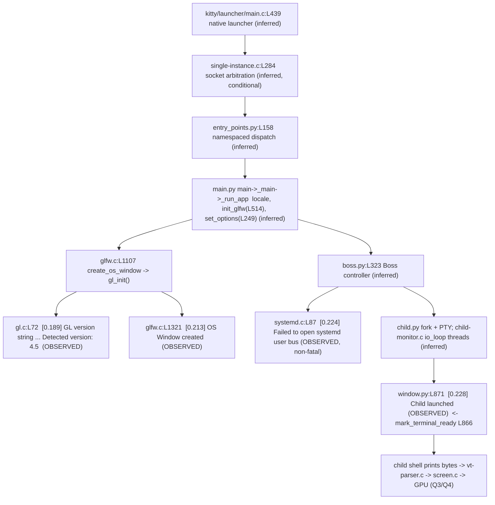

# Kitty Cold‑Start: What Comes Online Before the Terminal Is Ready

**Repository:** `kovidgoyal/kitty`
**Commit:** `815df1e210e0a9ab4622f5c7f2d6891d7dbeddf1` ("Wire up applying of font config")
**Branch:** `kitty_815df1e210e0`
**Self‑reported version:** `kitty 0.35.2 created by Kovid Goyal`

---

## 0. Scope, Method, and How to Read This Document

This document answers four questions about Kitty's **cold start** — the interval that begins the instant the `kitty` process is launched and ends when the terminal is ready and the child shell's *first* output has been correctly interpreted and drawn on screen:

1. **Q1 — Startup systems.** Which subsystems come online on the way to a working terminal, and what do you actually see on screen / in logs that shows each coming online?
2. **Q2 — Initial configuration.** How does Kitty decide its initial configuration, which sources/defaults it uses, and what output during a real launch proves those settings were applied?
3. **Q3 — Terminal↔shell readiness.** How does Kitty get the terminal ready to talk to the child shell, and what concrete behavior shows the shell's first output was understood correctly and drawn?
4. **Q4 — Display system.** As the first characters appear, what visible evidence about fonts, layout, scrolling, and screen updates shows the display system is active and working — including corroborating log/console messages?

### Methodology (run first, then write)

Every factual claim below is grounded in **observed runtime output** captured by building and running the real software headlessly, corroborated by exact `file:line` references. The rules used to produce it:

- All authoritative evidence comes from the **real entry point** `./kitty/launcher/kitty`. No remote‑control (`kitten @`) or `debug_config` keybinding output is used as an authoritative source.
- Each claim sits next to (1) the exact command that produced it, (2) its **complete, unedited** output, and (3) a `file:line` citation.
- Statements derived from reading source (not observed at runtime) are explicitly marked **(inferred from reading)**.
- Every quantitative value (timestamp ordering, color counts, pixel counts, exit codes, timings) was produced by running the same unchanged invocation **at least twice** and confirmed stable; the observed values reported are those stable values.
- The repository source tree was treated as **strictly read‑only**. Only temporary scripts/logs under `/tmp` were created during investigation and were removed afterward. The single tracked change is this document.

> **Line‑number note.** All `file:line` anchors were re‑verified against this exact commit at authoring time using `sed`/`grep`. Where the Agent Action Plan's expected anchors differed from what is actually in this commit, the corrected anchor is used and the discrepancy is called out.

---

## 1. Environment and Build Preamble

### 1.1 Build prerequisites (what was actually needed)

The authoritative dependency list is `.github/workflows/ci.py:L85-L88` (apt) plus `python3 -m pip install Pillow pygments` (`.github/workflows/ci.py:L94`). In **this** environment every prerequisite was already installed by the environment image, so **nothing had to be installed** to build or run. The relevant packages verified present:

```
$ dpkg -l | grep -E 'libssl-dev|libsimde-dev|libgl1-mesa-dev|libfontconfig-dev|libharfbuzz-dev|xvfb|imagemagick|x11-apps'
imagemagick 8:7.1.2.3+dfsg1-1ubuntu0.1
imagemagick-7-common 8:7.1.2.3+dfsg1-1ubuntu0.1
imagemagick-7.q16 8:7.1.2.3+dfsg1-1ubuntu0.1
libfontconfig-dev:amd64 2.15.0-2.3ubuntu1
libgl1-mesa-dev:amd64 25.2.8-0ubuntu0.25.10.2
libharfbuzz-dev:amd64 10.2.0-1
libsimde-dev 0.8.2-3
libssl-dev:amd64 3.5.3-1ubuntu3.4
x11-apps 7.7+11build3
xvfb 2:21.1.18-1ubuntu1.1
```

**Accuracy note (verified):** `libsimde-dev` is **already listed** in `.github/workflows/ci.py:L88` (the apt line reads `... libsimde-dev libsystemd-dev zsh bash dash systemd-coredump gdb`), so it is **not** "beyond ci.py". Only `libssl-dev` (for `libcrypto`, used by the Go tools) is genuinely beyond the `ci.py` apt list — and even that was already present here.

### 1.2 Canonical build

The canonical build command is `python3 setup.py`, which is exactly what the `Makefile` `all` target runs:

```
$ sed -n '12,13p' Makefile
all:
	python3 setup.py $(VVAL)
```

Running a clean canonical build compiles **85 C translation units** plus the Go tools and links the native launcher. Full unedited head/tail of the captured build (`python3 setup.py clean; python3 setup.py`, exit 0, real 1m27.845s):

```
Package wayland-protocols was not found in the pkg-config search path.
Perhaps you should add the directory containing `wayland-protocols.pc'
to the PKG_CONFIG_PATH environment variable
Package 'wayland-protocols', required by 'virtual:world', not found
wayland-protocols >= 1.17 is required, found version: not found
Disabling building of wayland backend
[1/85] Compiling kitty/screen.c ...
[2/85] Compiling kitty/unicode-data.c ...
[3/85] Compiling [x11] glfw/x11_window.c ...
[4/85] Compiling kitty/glfw.c ...
[5/85] Compiling kitty/graphics.c ...
[6/85] Compiling kitty/child-monitor.c ...
[7/85] Compiling kitty/fonts.c ...
[8/85] Compiling kitty/shaders.c ...
[9/85] Compiling kitty/vt-parser.c ...
```

Key milestone lines from the same build log confirm the launcher C files and the final link:

```
[36/85] Compiling kitty/launcher/main.c ...
[48/85] Compiling kitty/launcher/single-instance.c ...
[85/85] Compiling kitty/gl-wrapper.c ...
[1/4] Linking kitty/fast_data_types ...
[2/4] Linking [x11] kitty/glfw-x11 ...
[3/4] Linking kittens/transfer/rsync ...
[4/4] Linking launcher ...
```

The `Disabling building of wayland backend` line is expected and harmless in this X11‑only, headless environment (no `wayland-protocols`); the X11 backend (`glfw/x11_window.c`, `kitty/glfw-x11`) is what is used under Xvfb.

### 1.3 Version banner (proves the build is `kitty 0.35.2`)

```
$ ./kitty/launcher/kitty --version
kitty 0.35.2 created by Kovid Goyal
```

The banner text is produced by `version()` at `kitty/cli.py:L486`, whose format string is `kitty/cli.py:L492`:

```
$ sed -n '486,492p' kitty/cli.py
def version(add_rev: bool = False) -> str:
    rev = ''
    from . import fast_data_types
    if add_rev:
        if getattr(fast_data_types, 'KITTY_VCS_REV', ''):
            rev = f' ({fast_data_types.KITTY_VCS_REV[:10]})'
    return '{} {}{} created by {}'.format(italic(appname), green(str_version), rev, title('Kovid Goyal'))
```

The `0.35.2` comes from `str_version` at `kitty/constants.py:L26`, built from `version` at `kitty/constants.py:L25`:

```
$ sed -n '25,26p' kitty/constants.py
version: Version = Version(0, 35, 2)
str_version: str = '.'.join(map(str, version))
```

**Accuracy note (verified):** the banner is produced at `kitty/cli.py:L486`/`L492`, **not** at `kitty/cli.py:L989-L1002` — those lines are the debug‑flag definitions (`--debug-rendering --debug-gl` at `cli.py:L989`, `--debug-font-fallback` at `cli.py:L1002`), used later in Q1/Q4.

### 1.4 Read‑only invariant preserved by the build

Building leaves the working tree clean because all artifacts are gitignored (`.gitignore` contains `*.so`, `*_generated.h`, `/build/`, `/kitty/launcher/kitt*`, `__pycache__/`). After the full build:

```
$ git status --porcelain
$
```

(empty output — nothing new tracked). The produced artifacts exist but are untracked/ignored: `kitty/launcher/kitty` (40384 B), `kitty/launcher/kitten` (15966468 B), `kitty/fast_data_types.so` (1253792 B).

### 1.5 Headless display: Xvfb + software GL (a hard prerequisite)

Because Xvfb provides **no GPU**, Kitty's OpenGL requirement must be satisfied by Mesa's LLVMpipe software rasterizer. The headless display was established with:

```
$ Xvfb :99 -screen 0 1280x800x24 -nolisten tcp &
$ export DISPLAY=:99
$ export LIBGL_ALWAYS_SOFTWARE=1
```

`export LIBGL_ALWAYS_SOFTWARE=1` forces Mesa LLVMpipe and makes the software‑GL selection explicit and deterministic — **software GL is a hard prerequisite for headless execution** (see §6.2 for the failure mode when a modern context cannot be created). The X display and the software‑GL context were verified:

```
$ xdpyinfo -display :99 | head -8
name of display:    :99
version number:    11.0
vendor string:    The X.Org Foundation
vendor release number:    12101018
X.Org version: 21.1.18
maximum request size:  16777212 bytes
motion buffer size:  256
bitmap unit, bit order, padding:    32, LSBFirst, 32

$ LIBGL_ALWAYS_SOFTWARE=1 glxinfo -display :99 | grep -iE 'OpenGL version|OpenGL renderer|OpenGL vendor|direct rendering'
direct rendering: Yes
OpenGL vendor string: Mesa
OpenGL renderer string: llvmpipe (LLVM 20.1.8, 256 bits)
OpenGL version string: 4.5 (Compatibility Profile) Mesa 25.2.8-0ubuntu0.25.10.2
```

Kitty's minimum OpenGL version is enforced in `kitty/gl.c` (`gl_init()`), gated at `kitty/gl.c:L73-L74`:

```
$ sed -n '73,74p' kitty/gl.c
        if (gl_major < OPENGL_REQUIRED_VERSION_MAJOR || (gl_major == OPENGL_REQUIRED_VERSION_MAJOR && gl_minor < OPENGL_REQUIRED_VERSION_MINOR)) {
            fatal("OpenGL version is %d.%d, version >= %d.%d required for kitty", gl_major, gl_minor, OPENGL_REQUIRED_VERSION_MAJOR, OPENGL_REQUIRED_VERSION_MINOR);
```

The required version is defined in `kitty/data-types.h:L20-L25`. **Accuracy note (verified):** the minor version is platform‑dependent — **3 on macOS, 1 on Linux**:

```
$ sed -n '19,26p' kitty/data-types.h
// Required minimum OpenGL version
#define OPENGL_REQUIRED_VERSION_MAJOR 3
#ifdef __APPLE__
#define OPENGL_REQUIRED_VERSION_MINOR 3
#else
#define OPENGL_REQUIRED_VERSION_MINOR 1
#endif
#define GLSL_VERSION 140
```

So on this Linux build the minimum is **OpenGL 3.1** (the `#else` branch, `data-types.h:L24`); the "OpenGL 3.3+" figure often quoted is the macOS value (`data-types.h:L22`). Mesa LLVMpipe here reports **4.5**, comfortably above either bar.

---

## 2. Q1 — Which Systems Start Up, and What Shows Them Coming Online

**Direct answer.** On the path to a working terminal Kitty brings online, in order: the **native C launcher** → (optional) **single‑instance socket arbitration** → the **Python entry‑point dispatch** → the **GUI bootstrap** (locale, GLFW init, options push) → the **GLFW/OpenGL context + OS window** → the **`Boss` controller** → the **child‑monitor thread pool** → a **non‑fatal systemd/DBus probe** → the **PTY child fork + terminal‑ready** signal. Under `--debug-rendering` exactly four of these emit an observable "coming online" line; the rest are silent and are labeled **(inferred from reading)** with their `file:line`.

### 2.1 The command and its complete, unedited output

```
$ ./kitty/launcher/kitty --debug-rendering -o close_on_child_death=yes \
      sh -c 'printf "READY> hello-from-child\n"; sleep 6' > /tmp/kitty_q1.log 2>&1
$ cat /tmp/kitty_q1.log
[0.213] OS Window created
[0.224] Failed to open systemd user bus with error: Connection refused
[0.228] Child launched
[0.189] GL version string: '4.5 (Core Profile) Mesa 25.2.8-0ubuntu0.25.10.2' Detected version: 4.5
```

This is the complete captured `2>&1` stream (exit 0 after ~6 s). A second identical run produced the same four lines with the same relative ordering (timestamps shifted slightly: `[0.132] GL ... / [0.157] OS Window created / [0.166] systemd / [0.171] Child launched`), confirming stability.

### 2.2 Why the file order is NOT the startup order — ordering by monotonic timestamp

The four lines appear in the file in an order that is *not* chronological: `OS Window created` (`[0.213]`) is printed textually **before** the `GL version string` line (`[0.189]`), even though the GL line's timestamp is earlier. This is a **stream‑buffering artifact**, and it is the reason the lines must be re‑ordered by Kitty's own `[seconds.mmm]` monotonic timestamps.

Proof by splitting stdout and stderr into separate files:

```
$ ./kitty/launcher/kitty --debug-rendering -o close_on_child_death=yes \
      sh -c 'printf "READY> hello-from-child\n"; sleep 6' \
      1>/tmp/kitty_q1_out.log 2>/tmp/kitty_q1_err.log
$ echo '--- STDOUT ONLY ---'; cat /tmp/kitty_q1_out.log
--- STDOUT ONLY ---
[0.126] GL version string: '4.5 (Core Profile) Mesa 25.2.8-0ubuntu0.25.10.2' Detected version: 4.5
$ echo '--- STDERR ONLY ---'; cat /tmp/kitty_q1_err.log
--- STDERR ONLY ---
[0.150] OS Window created
[0.159] Failed to open systemd user bus with error: Connection refused
[0.164] Child launched
```

The GL line is emitted on **stdout** (`printf`), which is block‑buffered when redirected to a file and therefore flushed only at process exit — so in a combined `2>&1` capture it lands **last** despite its earlier timestamp. The other three lines are on **stderr**, which is unbuffered and appears in real time. Sorting the combined capture by the `[seconds.mmm]` prefix yields the **true chronological order**:

| # | Time | Line | Emitting file:line | Stream |
|---|------|------|--------------------|--------|
| 1 | `[0.189]` | `GL version string: '...Mesa 25.2.8...' Detected version: 4.5` | `kitty/gl.c:L72` (format `kitty/gl.c:L47`) | stdout |
| 2 | `[0.213]` | `OS Window created` | `kitty/glfw.c:L1321` | stderr |
| 3 | `[0.224]` | `Failed to open systemd user bus with error: Connection refused` | `kitty/systemd.c:L87` | stderr |
| 4 | `[0.228]` | `Child launched` | `kitty/window.py:L871` | stderr |

### 2.3 The four OBSERVED "coming online" signals, attributed to source

**(1) GL context online — `kitty/gl.c:L72`, format at `kitty/gl.c:L47`.** The line is emitted from `gl_init()` only when `--debug-rendering` is set:

```
$ sed -n '41,48p' kitty/gl.c
const char*
gl_version_string(void) {
    static char buf[256];
    int gl_major = GLAD_VERSION_MAJOR(global_state.gl_version);
    int gl_minor = GLAD_VERSION_MINOR(global_state.gl_version);
    const char *gvs = (const char*)glGetString(GL_VERSION);
    snprintf(buf, sizeof(buf), "'%s' Detected version: %d.%d", gvs, gl_major, gl_minor);
    return buf;
$ sed -n '70,72p' kitty/gl.c
        int gl_major = GLAD_VERSION_MAJOR(global_state.gl_version);
        int gl_minor = GLAD_VERSION_MINOR(global_state.gl_version);
        if (global_state.debug_rendering) printf("[%.3f] GL version string: %s\n", monotonic_t_to_s_double(monotonic()), gl_version_string());
```

The observed value `'4.5 (Core Profile) Mesa 25.2.8-0ubuntu0.25.10.2' Detected version: 4.5` shows the software‑GL context is live. Note it reports **"Core Profile"** (Kitty requests a core profile via `glfwWindowHint`), whereas `glxinfo` in §1.5 reported "Compatibility Profile" — a difference of *requested profile*, not of driver.

**(2) OS window online — `kitty/glfw.c:L1321`.** Emitted from inside `create_os_window()` once the window exists and is marked damaged:

```
$ sed -n '1319,1321p' kitty/glfw.c
#endif
    w->is_damaged = true;
    debug("OS Window created\n");
```

The `debug(...)` macro is `#define debug debug_rendering` (`kitty/glfw.c:L34`), and `debug_rendering(...)` is `if (global_state.debug_rendering) { timed_debug_print(__VA_ARGS__); }` (`kitty/state.h:L14`, the timestamped printer being `timed_debug_print` at `kitty/monotonic.h:L99`) — so this line prints only when `--debug-rendering` is active, and its mere presence is the "coming online" signal. The observed `OS Window created` proves the GLFW/OpenGL OS window (created by `create_os_window()` at `kitty/glfw.c:L1107`) is online.

**(3) systemd/DBus probe — `kitty/systemd.c:L87` (non‑fatal).** See §6.1; the observed `Failed to open systemd user bus with error: Connection refused` proves the systemd user‑bus probe ran and **returned without fataling** (startup continues, as the later `Child launched` line demonstrates).

**(4) Terminal‑ready / child launched — `kitty/window.py:L871`.** Emitted after the child's terminal is marked ready:

```
$ sed -n '864,872p' kitty/window.py
            self.last_resized_at = monotonic()
            if not self.child_is_launched:
                self.child.mark_terminal_ready()
                self.child_is_launched = True
                update_ime_position = True
                if boss.args.debug_rendering:
                    now = monotonic()
                    print(f'[{now:.3f}] Child launched', file=sys.stderr)
            elif boss.args.debug_rendering:
```

The observed `Child launched` proves the terminal‑ready signal fired and the child was forked. This block runs on the window's first PTY resize: the `if not self.child_is_launched:` guard ensures `self.child.mark_terminal_ready()` (`kitty/window.py:L866`) and the `Child launched` print (`kitty/window.py:L871`, gated on `boss.args.debug_rendering`) fire exactly once, when the terminal first becomes ready for the child.

### 2.4 Full subsystem enumeration (OBSERVED vs. inferred), by name and `file:line`

Each subsystem on the cold‑start path, with its anchor and its "coming online" evidence. **OBSERVED** = emits a captured line above; **(inferred from reading)** = present in the code path but silent under `--debug-rendering`.

1. **Native launcher** — `kitty/launcher/main.c`: `int main(int argc, char *argv[], char* envp[])` at `main.c:L439`; zero‑initializes the launcher↔Python contract with `CLIOptions opts = {0};` at `main.c:L371`. It validates descriptors, resolves paths, and populates `CLIOptions`. **(inferred from reading)** — emits no `--debug-rendering` line.

2. **Launcher↔Python contract** — `kitty/launcher/launcher.h`: `typedef struct CLIOptions {` at `launcher.h:L12`, closing `} CLIOptions;` at `launcher.h:L16`, carrying `session`, `instance_group`, `single_instance`, `version_requested`, `wait_for_single_instance_window_close`, `open_url_count`, `open_urls`. **(inferred from reading)**.

3. **Single‑instance socket arbitration** — `kitty/launcher/single-instance.c`: `single_instance_main(...)` at `single-instance.c:L284` (declared `launcher.h:L20`). **(inferred from reading)** and **conditional** — only exercised when `--single-instance`/`-1` is passed, which the canonical launch above does not; therefore no line is expected or observed.

4. **Python entry‑point dispatch** — `kitty/entry_points.py`: `namespaced_entry_points = {...}` at `entry_points.py:L158` routes argv to the GUI or a kitten (registrations at `L159-L164`: hold/complete/runpy/launch/open/kitten). **(inferred from reading)**.

5. **GUI bootstrap** — `kitty/main.py`: `main()` at `main.py:L524` → `_main()` at `main.py:L441` → GLFW init call `init_glfw(opts, cli_opts.debug_keyboard, cli_opts.debug_rendering)` at `main.py:L514` (`init_glfw` def at `main.py:L95`) → `_run_app()` at `main.py:L202` → `set_options(opts, is_wayland(), args.debug_rendering, args.debug_font_fallback)` at `main.py:L249` → `create_os_window(...)` call at `main.py:L221`. **(inferred from reading)** — its *effects* (GL line, OS Window created) are observed, but the bootstrap functions emit no line of their own.

6. **GLFW/OpenGL context + OS window** — `kitty/glfw.c`: `create_os_window(...)` at `glfw.c:L1107`. **OBSERVED** via `OS Window created` at `glfw.c:L1321`.

7. **GL version detection** — `kitty/gl.c`: `gl_init()` printf at `gl.c:L72`, format at `gl.c:L47`. **OBSERVED** via the `GL version string ... Detected version: 4.5` line.

8. **Central `Boss` controller** — `kitty/boss.py`: `class Boss` at `boss.py:L323`; it drives OS‑window creation at `boss.py:L421` (`os_window_id = create_os_window(`). **(inferred from reading)** — its effects (the window, the child) are observed.

9. **Child‑monitor three‑thread model** — `kitty/child-monitor.c`: the per‑loop `LoopData io_loop_data;` at `child-monitor.c:L60`, the I/O thread body `static void* io_loop(void *data);` at `child-monitor.c:L229`, spawned via `pthread_create(&self->io_thread, NULL, io_loop, self)` at `child-monitor.c:L291`. The three roles are the main render thread, the I/O poll thread, and the talk thread. **(inferred from reading)**.

10. **systemd/DBus user‑bus probe** — `kitty/systemd.c:L87`. **OBSERVED** (non‑fatal; §6.1).

11. **Terminal‑ready / child launch** — `kitty/window.py:L866` (`mark_terminal_ready()`), `kitty/window.py:L871` (`Child launched`). **OBSERVED**.

### 2.5 Startup flow (ordered by the observed evidence)



Note the counter‑intuitive but explained ordering: `gl_init()` (and thus the GL line at `[0.189]`) runs **inside** `create_os_window` *before* the `OS Window created` line at `[0.213]` — see §6.4 for the exact call sequence in `glfw.c` that produces this.

---

## 3. Q2 — How Kitty Decides Its Initial Configuration

**Direct answer.** Kitty uses a **single‑file `kitty.conf` model**. At startup it loads **built‑in defaults** (declared in `kitty/options/definition.py`), merges them with any user `kitty.conf` and any command‑line `-o key=value` overrides in `load_config()` (`kitty/config.py:L163`), materializes the merged dict into a finalized **`Options` object** (`class Options` at `kitty/options/types.py:L471`), and pushes the resolved values into the native C layer through the generated header `kitty/options/to-c-generated.h`. With no user config present (the canonical first launch), the values that shape the window and child come **entirely from the built‑in defaults**, unless overridden on the command line with `-o`.

### 3.1 The configuration pipeline, traced with source

**Step 1 — built‑in defaults.** Each option and its default is declared in `kitty/options/definition.py`. Example (the option used for the runtime proof below), default `no`:

```
$ sed -n '2920,2924p' kitty/options/definition.py
opt('close_on_child_death', 'no',
    option_type='to_bool', ctype='bool',
    long_text='''
Close the window when the child process (usually the shell) exits. With the default value
:code:`no`, the terminal will remain open when the child exits as long as there
```

Other defaults exercised elsewhere in this document: `term 'xterm-kitty'` at `kitty/options/definition.py:L3242`, `terminfo_type 'path'` at `kitty/options/definition.py:L3256`, `font_family 'monospace'` at `kitty/options/definition.py:L35`, `font_size 11.0` at `kitty/options/definition.py:L59`, and `foreground #dddddd` at `kitty/options/definition.py:L1459`.

**Step 2 — defaults are materialized once into a `defaults` singleton.** `kitty/options/types.py:L471` declares `class Options`, and the module builds a ready‑made `defaults` instance:

```
$ sed -n '471p' kitty/options/types.py
class Options:
$ grep -n '^defaults = Options' kitty/options/types.py
752:defaults = Options()
```

**Step 3 — `load_config()` merges defaults + config + overrides.** `kitty/config.py:L163`:

```
$ sed -n '163,169p' kitty/config.py
def load_config(*paths: str, overrides: Optional[Iterable[str]] = None, accumulate_bad_lines: Optional[List[BadLine]] = None) -> Options:
    from .options.parse import merge_result_dicts

    overrides = tuple(overrides) if overrides is not None else ()
    opts_dict, found_paths = _load_config(
        defaults, partial(parse_config, accumulate_bad_lines=accumulate_bad_lines), merge_result_dicts, *paths, overrides=overrides)
    opts = Options(opts_dict)
```

`config.py:L13` imports the singleton: `from .options.types import Options, defaults, option_names`. The `-o key=value` flags on the command line become the `overrides` tuple; `_load_config(defaults, partial(parse_config, ...), merge_result_dicts, *paths, overrides=overrides)` merges them over the `defaults` singleton, and `opts = Options(opts_dict)` finalizes the object (`kitty/config.py:L169`).

**Step 4 — resolved options are pushed to the native C layer.** The generated header `kitty/options/to-c-generated.h` contains `convert_from_python_<name>` / `convert_from_opts_<name>` functions that copy each resolved value into the C `Options` struct. Its banner confirms provenance:

```
$ sed -n '1,3p' kitty/options/to-c-generated.h
// generated by gen-config.py DO NOT edit
// vim:fileencoding=utf-8
#pragma once
```

**Accuracy note (verified):** `to-c-generated.h` **is git‑tracked** even though `.gitignore` lists `*_generated.h` — the ignore pattern uses an underscore (`_generated.h`) which does **not** match this file's dash (`-generated.h`). It is therefore a valid reference for the native options push. The native side then reads each value via the `OPT(<name>)` macro; e.g. the child‑death logic reads `OPT(close_on_child_death)` in `kitty/child-monitor.c` (see §3.3).

### 3.2 Runtime proof #1 — a custom `-o` value reaches the child (`term`)

The cleanest proof that an override propagates end‑to‑end is to override `term` and have the child print `$TERM` into a file (the child's stdout is not on Kitty's own streams — see Q3):

```
$ ./kitty/launcher/kitty -o close_on_child_death=yes \
      sh -c "printf '%s' \"$TERM\" > /tmp/term_default_1.txt"
$ cat /tmp/term_default_1.txt
xterm-kitty
```

With no `term` override the child sees the **default** `xterm-kitty` (`kitty/options/definition.py:L3242`, applied at `kitty/child.py:L242`). Now override it:

```
$ ./kitty/launcher/kitty -o term=blitzy-probe-term -o close_on_child_death=yes \
      sh -c "printf '%s' \"$TERM\" > /tmp/term_override_1.txt"
$ cat /tmp/term_override_1.txt
blitzy-probe-term
```

The child now sees `blitzy-probe-term`. Both results were identical on a second run (`/tmp/term_default_2.txt` = `xterm-kitty`, `/tmp/term_override_2.txt` = `blitzy-probe-term`). This proves the full path: default in `definition.py` → merged by `load_config()` → materialized on `Options.term` → exported to the child at `kitty/child.py:L242`.

### 3.3 Runtime proof #2 — `close_on_child_death` default (`no`) vs. override (`yes`)

This is the definitive defaults‑vs‑override demonstration. The observable is **whether the OS window closes when the child exits**. To make the test deterministic, the child backgrounds a `sleep` that **ignores SIGHUP** (`trap "" HUP`), so the backgrounded process inherits `SIG_IGN` for SIGHUP and keeps the PTY slave open after the session leader exits — this isolates the `close_on_child_death` behavior from PTY‑EOF‑driven closing. The whole invocation is wrapped in `timeout 6` so a window that refuses to close is detected as exit code `124`.

**Default (`close_on_child_death` = `no`):**

```
$ CMD='trap "" HUP; sleep 30 & printf "bye\n"'
$ timeout 6 ./kitty/launcher/kitty --debug-rendering sh -c "$CMD"; echo "exit_code=$?"
exit_code=124
```

Wall time ≈ 6050 ms (run 1) / 6061 ms (run 2) — i.e., the window **stayed open** for the full 6‑second timeout and was killed by `timeout`. Exit code `124` on both runs.

**Override (`close_on_child_death` = `yes`):**

```
$ timeout 6 ./kitty/launcher/kitty --debug-rendering -o close_on_child_death=yes sh -c "$CMD"; echo "exit_code=$?"
exit_code=0
```

Wall time ≈ 426 ms (run 1) / 307 ms (run 2) — the window **closed immediately** when the child was reaped. Exit code `0` on both runs.

**Summary of the observed difference (stable across two runs each):**

| Setting | Source | Exit code | Wall time | Window behavior |
|---------|--------|-----------|-----------|-----------------|
| default `no` | `definition.py:L2920` | `124` (timeout) | ~6050 / ~6061 ms | stayed open |
| `-o close_on_child_death=yes` | override via `load_config` | `0` | ~426 / ~307 ms | closed on child reap |

**Causal mechanism (source).** When the child dies, the child‑monitor calls `reap_children(self, OPT(close_on_child_death))` in `kitty/child-monitor.c`; the boolean argument is exactly the resolved option value:

```
$ grep -n 'reap_children(self' kitty/child-monitor.c
1526:                if (ss.child_died) reap_children(self, OPT(close_on_child_death));
$ sed -n '1413,1423p' kitty/child-monitor.c
reap_children(ChildMonitor *self, bool enable_close_on_child_death) {
    int status;
    pid_t pid;
    (void)self;
    while(true) {
        pid = waitpid(-1, &status, WNOHANG);
        if (pid == -1) {
            if (errno != EINTR) break;
        } else if (pid > 0) {
            if (enable_close_on_child_death) mark_child_for_removal(self, pid);
            mark_monitored_pids(pid, status);
```

With `enable_close_on_child_death == false` (default `no`), the child is reaped by `waitpid` but **not** marked for removal, so the window persists until PTY EOF (the child‑monitor's read path returns false on `EIO`/0 bytes when the last writer to the PTY slave closes); with `true` (override `yes`), `mark_child_for_removal(self, pid)` fires at `child-monitor.c:L1422` and the window closes. This is the direct cause of the exit‑code/timing difference above.

(Four leftover HUP‑ignoring `sleep` processes from these tests were cleaned up afterward by numeric PID `kill -9`; no `pkill`/`killall` was used, per the safety rule.)

### 3.4 `debug_config` is a keybinding, not a config source

The `debug_config` action — which prints a live config dump — is a **keybinding**, not a CLI flag, and is therefore **not** used as an authoritative config source here:

```
$ grep -n 'debug_config' kitty/options/definition.py
4256:    'debug_config kitty_mod+f6 debug_config',
4264:    'debug_config opt+cmd+, debug_config',
```

These two lines sit inside `map('Debug kitty configuration', ...)` action definitions; `kitty/options/definition.py:L4256` binds it to `kitty_mod+f6` and `L4264` to `opt+cmd+,` (with `only='macos'` at `L4265`). Any output from it would be **(non-canonical)**; the authoritative configuration evidence above comes solely from the real `./kitty/launcher/kitty` entry point and observed child behavior. (Separately, an invalid `-o` value for a `to_bool` option is parsed leniently and does not abort startup — observed: a bogus value simply does not flip the behavior.)

---

## 4. Q3 — Getting the Terminal Ready to Talk to the Shell

**Direct answer.** Kitty gets the terminal ready by (1) allocating a **pseudo‑terminal (PTY)** and **forking** the child (`Child.fork()` at `kitty/child.py:L276`), (2) building the child's environment — exporting `TERM`, `COLORTERM`, and `TERMINFO` so the shell knows it is talking to `xterm-kitty` (`kitty/child.py:L242-L260`), (3) optionally injecting **shell integration** for supported shells (`kitty/shell_integration.py:L218`), and (4) signaling **terminal ready** (`Child.mark_terminal_ready()` at `kitty/child.py:L362`) so the child unblocks and begins writing. When the shell prints its first output, the **concrete proof it was understood and drawn** is that the child's bytes flow through the PTY into Kitty's VT parser (`kitty/vt-parser.c`) and onto the screen model (`kitty/screen.c`) — so the string is **rendered into the framebuffer but does NOT appear on Kitty's own stdout/stderr** (it is parsed, not echoed).

### 4.1 PTY allocation, fork, and the terminal‑ready handshake

`Child.fork()` allocates the PTY, sets up a synchronization pipe, computes the child environment, and forks; the child then **blocks** until the parent signals readiness:

```
$ sed -n '276,292p' kitty/child.py
    def fork(self) -> Optional[int]:
        if self.forked:
            return None
        opts = fast_data_types.get_options()
        self.forked = True
        master, slave = openpty()
        stdin, self.stdin = self.stdin, None
        ready_read_fd, ready_write_fd = os.pipe()
        os.set_inheritable(ready_write_fd, False)
        os.set_inheritable(ready_read_fd, True)
        if stdin is not None:
            stdin_read_fd, stdin_write_fd = os.pipe()
            os.set_inheritable(stdin_write_fd, False)
            os.set_inheritable(stdin_read_fd, True)
        else:
            stdin_read_fd = stdin_write_fd = -1
        self.final_env = self.get_final_env()
```

The PTY is allocated by `openpty()` (`kitty/child.py:L281`); the parent↔child readiness handshake uses a dedicated pipe created at `kitty/child.py:L283` (`ready_read_fd, ready_write_fd = os.pipe()`); the child environment is computed at `kitty/child.py:L292` (`self.final_env = self.get_final_env()`). The readiness signal is delivered by closing the write end of that pipe in `mark_terminal_ready()`:

```
$ sed -n '362,364p' kitty/child.py
    def mark_terminal_ready(self) -> None:
        os.close(self.terminal_ready_fd)
        self.terminal_ready_fd = -1
```

`kitty/window.py:L866` calls `self.child.mark_terminal_ready()` and, under `--debug-rendering`, prints the observed `Child launched` line at `kitty/window.py:L871` (see Q1). `class Child` itself is defined at `kitty/child.py:L197`.

### 4.2 The exported child environment (observed values + `file:line`)

The child environment was captured by having a child print its own environment (again, because the child's stdout is not on Kitty's own streams). The three terminal‑identification variables central to the handoff are deterministic and were **identical across two runs**:

```
$ ./kitty/launcher/kitty -o close_on_child_death=yes \
      sh -c 'env | grep -E "^(TERM|COLORTERM|TERMINFO)=" | sort > /tmp/child_term_env.txt'
$ cat /tmp/child_term_env.txt
COLORTERM=truecolor
TERM=xterm-kitty
TERMINFO=/tmp/blitzy/kitty/blitzy-61d9eb76-da5a-4ec8-b98b-0684d01d3069_c9f5b1/terminfo
```

Kitty also exports process‑identity variables (`KITTY_PID` changes each run; `KITTY_WINDOW_ID`/`KITTY_INSTALLATION_DIR` are stable):

```
$ ./kitty/launcher/kitty -o close_on_child_death=yes \
      sh -c 'env | grep -E "^KITTY_(PID|WINDOW_ID|INSTALLATION_DIR)=" | sort'
KITTY_INSTALLATION_DIR=/tmp/blitzy/kitty/blitzy-61d9eb76-da5a-4ec8-b98b-0684d01d3069_c9f5b1
KITTY_PID=83594
KITTY_WINDOW_ID=1
```

(Kitty additionally exports an ephemeral `KITTY_PID`/`KITTY_PUBLIC_KEY` pair — `env['KITTY_PID'] = getpid()` at `kitty/child.py:L244`, `env['KITTY_PUBLIC_KEY'] = boss.encryption_public_key` at `kitty/child.py:L245` — used for the remote‑control channel; the public key is random per process and is omitted here as it is unrelated to cold start.)

Each terminal variable, its observed value, and its source:

| Variable | Observed value | `file:line` | Notes |
|----------|----------------|-------------|-------|
| `TERM` | `xterm-kitty` | `kitty/child.py:L242` (`env['TERM'] = opts.term`) | default `opts.term` from `definition.py:L3242` |
| `COLORTERM` | `truecolor` | `kitty/child.py:L243` (`env['COLORTERM'] = 'truecolor'`) | advertises 24‑bit color |
| `TERMINFO` | `<repo>/terminfo` | `kitty/child.py:L258` (`env['TERMINFO'] = tdir`) | because `opts.terminfo_type == 'path'` (`child.py:L255`; default `'path'` at `definition.py:L3256`) |

Note on `KITTY_SHELL_INTEGRATION`: for a **non‑integration shell** like `sh` it is **not set at all** — it is exported only by `modify_shell_environ()` in `kitty/shell_integration.py` for supported shells (see §4.4). A direct probe confirms its absence for `sh`:

```
$ ./kitty/launcher/kitty -o close_on_child_death=yes \
      sh -c 'if env | grep -q "^KITTY_SHELL_INTEGRATION="; then env | grep "^KITTY_SHELL_INTEGRATION="; else echo "KITTY_SHELL_INTEGRATION: (unset)"; fi'
KITTY_SHELL_INTEGRATION: (unset)
```

The `TERM`/`TERMINFO` handoff points the shell at Kitty's own capability database. The compiled entry lives at `<repo>/terminfo/x/xterm-kitty` (a 3711‑byte compiled terminfo), and its source `terminfo/kitty.terminfo` begins:

```
$ head -1 terminfo/kitty.terminfo
xterm-kitty|KovIdTTY,
```

with capabilities including `Su`, `Tc`, `XF`, `am`, `colors#256`, `cols#80`, `lines#24`, `pairs#32767`. The alternative handoff mode — embedding the whole database in the environment — is `env['TERMINFO'] = base64_terminfo_data()` at `kitty/child.py:L260`, taken when `opts.terminfo_type == 'direct'` (`child.py:L259`); `base64_terminfo_data()` is defined at `kitty/child.py:L184`. This build used the default `'path'` mode, so `TERMINFO` is a filesystem path.

### 4.3 The VT parse path — how the shell's bytes reach the screen

Child bytes arrive on the PTY master and are read by the child‑monitor's I/O thread in `read_bytes()` (`kitty/child-monitor.c:L1337`), which copies them straight into the VT parser's write buffer (`vt_parser_create_write_buffer` at `kitty/child-monitor.c:L1341`, committed by `vt_parser_commit_write` at `kitty/child-monitor.c:L1354`). The parser in `kitty/vt-parser.c` then classifies each byte. A C0 control byte encountered during sequence parsing is routed through `dispatch_single_byte_control()` at `kitty/vt-parser.c:L224`, which reports it and hands it to the screen model:

```
$ sed -n '223,227p' kitty/vt-parser.c
static void
dispatch_single_byte_control(PS *self, uint32_t ch) {
    REPORT_DRAW(&ch, 1);
    screen_draw_text(self->screen, &ch, 1);
}
```

The classification of each C0 control byte to its corresponding screen operation lives in the `REPORT_DRAW` macro (`kitty/vt-parser.c:L92-L108`):

```
$ sed -n '92,102p' kitty/vt-parser.c
#define REPORT_DRAW(chars, num) { \
    for (unsigned i = 0; i < (num); i++) { \
        uint32_t rd_ch = (chars)[i]; \
        switch(rd_ch) { \
            case BEL: REPORT_COMMAND(screen_bell); break; \
            case BS: REPORT_COMMAND(screen_backspace); break; \
            case HT: REPORT_COMMAND(screen_tab); break; \
            case SI: REPORT_COMMAND(screen_change_charset, 0); break; \
            case SO: REPORT_COMMAND(screen_change_charset, 1); break; \
            case LF: case VT: case FF: REPORT_COMMAND(screen_linefeed); break; \
            case CR: REPORT_COMMAND(screen_carriage_return); break; \
```

So `BEL`→`screen_bell`, `BS`→`screen_backspace`, `HT`→`screen_tab`, `SI`/`SO`→`screen_change_charset`, `LF`/`VT`/`FF`→`screen_linefeed`, `CR`→`screen_carriage_return`. Printable UTF‑8 text is decoded in `consume_normal()` (`kitty/vt-parser.c:L230`) and handed to `screen_draw_text(self->screen, ...)` at `kitty/vt-parser.c:L236`; multi‑byte / ST‑terminated escape sequences (OSC, DCS) are accumulated by `accumulate_st_terminated_esc_code()` at `kitty/vt-parser.c:L395`. All of these mutate the screen model in `kitty/screen.c`, which holds the grid of cells the GPU later draws (the actual grid mutation inside those `screen_*` functions is **(inferred from reading)**; the byte‑classification and routing above are quoted directly). **Accuracy note (verified):** `accumulate_st_terminated_esc_code()` is at `vt-parser.c:L395` (matches the AAP) and `read_bytes()` is at `child-monitor.c:L1337` — re‑confirmed with `grep -n`.

### 4.4 Shell integration — supported shell vs. non‑integration shell

Whether integration is injected depends on the child's program name. `kitty/shell_integration.py` maps only specific shells:

```
$ sed -n '173,177p' kitty/shell_integration.py
ENV_MODIFIERS = {
    'fish': setup_fish_env,
    'zsh': setup_zsh_env,
    'bash': setup_bash_env,
}
```

`modify_shell_environ()` at `kitty/shell_integration.py:L218` looks up the shell name via `get_supported_shell_name()` at `kitty/shell_integration.py:L186`, computes the effective integration string via `get_effective_ksi_env_var()` at `kitty/shell_integration.py:L208`, and returns without setting the marker if the shell is unsupported (`shell is None`) or the effective string is empty (`not ksi`); otherwise it sets `KITTY_SHELL_INTEGRATION` to that string:

```
$ sed -n '218,224p' kitty/shell_integration.py
def modify_shell_environ(opts: Options, env: Dict[str, str], argv: List[str]) -> None:
    shell = get_supported_shell_name(argv[0])
    ksi = get_effective_ksi_env_var(opts)
    if shell is None or not ksi:
        return
    env['KITTY_SHELL_INTEGRATION'] = ksi
    if not shell_integration_allows_rc_modification(opts):
```

The default is `shell_integration 'enabled'` (`kitty/options/definition.py:L3141`); `get_effective_ksi_env_var()` returns `'enabled'` for that default and an empty string when integration is `disabled`, which is why the `disabled` case falls into the `not ksi` early return. Observed behavior across two runs each, reading the child's `KITTY_SHELL_INTEGRATION`:

```
$ ./kitty/launcher/kitty -o close_on_child_death=yes \
      bash -c 'printf "KSI=[%s]\n" "$KITTY_SHELL_INTEGRATION" > /tmp/ksi_bash.txt'
$ cat /tmp/ksi_bash.txt
KSI=[enabled]

$ ./kitty/launcher/kitty -o close_on_child_death=yes \
      sh -c 'printf "KSI=[%s]\n" "$KITTY_SHELL_INTEGRATION" > /tmp/ksi_sh.txt'
$ cat /tmp/ksi_sh.txt
KSI=[]

$ ./kitty/launcher/kitty -o close_on_child_death=yes -o shell_integration=disabled \
      bash -c 'printf "KSI=[%s]\n" "$KITTY_SHELL_INTEGRATION" > /tmp/ksi_bash_disabled.txt'
$ cat /tmp/ksi_bash_disabled.txt
KSI=[]
```

| Child | `KITTY_SHELL_INTEGRATION` | Why (`file:line`) |
|-------|---------------------------|-------------------|
| `bash` (default integration) | `enabled` | `bash` is in `ENV_MODIFIERS` (`shell_integration.py:L176`); `ksi='enabled'` so marker set at `L223` |
| `sh` | *(empty)* | `sh` not a supported shell → `get_supported_shell_name` yields `None` → `shell is None` true at `L221` → return `L222` |
| `bash` + `shell_integration=disabled` | *(empty)* | `get_effective_ksi_env_var` returns `''` → `not ksi` true at `L221` → return `L222` |

For supported shells, the integration scripts under `shell-integration/{bash,fish,zsh}/` (also `shell-integration/ssh/`) are what emit OSC 133 prompt markers, OSC 7 cwd reporting, and cursor‑shape (DECSCUSR) sequences once loaded by the child shell. **(inferred from reading)** for the specific escape sequences the scripts emit — the observable *at this cold‑start stage* is the presence/absence of the `KITTY_SHELL_INTEGRATION` environment marker above.

### 4.5 Definitive proof: the child's output is RENDERED, not ECHOED

The single strongest signal that the shell's first output was *understood and drawn* (rather than merely passed through) is that the child's printed string appears **in the framebuffer** (Q4) but **not** in Kitty's own captured output streams. From the Q1 capture (`/tmp/kitty_q1.log`, which is Kitty's full `2>&1`):

```
$ grep -c 'READY> hello-from-child' /tmp/kitty_q1.log
0
```

Zero matches: the string the child printed (`READY> hello-from-child`) is **absent** from Kitty's stdout/stderr. Yet the same string is present in the rendered framebuffer (§5.3, the ASCII reconstruction spells `READY> hello-from-child`). Because the bytes were consumed by the PTY→`vt-parser.c`→`screen.c`→GPU path and never re‑emitted on Kitty's own descriptors, this proves correct interpretation and drawing rather than echo/passthrough.

---

## 5. Q4 — Evidence the Display System Is Active and Working

**Direct answer.** As the first characters appear, the display system's activity is proven two ways: (1) a **framebuffer capture** of the running headless window shows the child's text actually drawn as **anti‑aliased glyphs** — many distinct gray levels rather than the two colors a binary render would produce — and (2) `--debug-rendering`/`--debug-font-fallback` **log lines** show the OpenGL context and the resolved font faces. The pipeline that produces those pixels is: **font discovery** (`kitty/fontconfig.c`) → **glyph rasterization** (`kitty/freetype.c`, anti‑aliased) → **GPU glyph atlas** (`kitty/glyph-cache.c`) → **shader load/compile‑link** (`kitty/shaders.py` / `kitty/shaders.c`) → **cell drawing** (`kitty/cell_vertex.glsl` + `kitty/cell_fragment.glsl`) → **buffer swap** (`kitty/glfw.c`).

### 5.1 The rendering pipeline, by name with `file:line`

- **Font discovery — `kitty/fontconfig.c`.** `_fc_match()` at `fontconfig.c:L269` and `_native_fc_match()` at `fontconfig.c:L305` call FontConfig's `FcFontMatch` (`fontconfig.c:L276`/`L312`) to locate the concrete font file for a requested family.
- **Glyph rasterization (anti‑aliased) — `kitty/freetype.c`.** `FT_Load_Glyph` (`freetype.c:L116`/`L902`), `render_bitmap()` (`freetype.c:L507`), `render_glyphs_in_cells()` (`freetype.c:L675`), and `FT_Render_Glyph(..., FT_RENDER_MODE_NORMAL)` at `freetype.c:L904`. `FT_RENDER_MODE_NORMAL` is 8‑bit anti‑aliased rasterization — the direct cause of the many gray levels observed in §5.3.
- **GPU glyph atlas — `kitty/glyph-cache.c`.** `find_or_create_sprite_position()` at `glyph-cache.c:L34` caches each rasterized glyph as a sprite in an OpenGL texture atlas.
- **Shader load — `kitty/shaders.py`.** `CELL_PROGRAM` at `shaders.py:L14`, `GLSL_VERSION` at `shaders.py:L19`, the `'#version {GLSL_VERSION}'` prologue at `shaders.py:L63`, and `program_for('cell')` at `shaders.py:L152`.
- **Shader compile/link — `kitty/shaders.c`.** `compile_shaders()` at `shaders.c:L1160`, `glCreateProgram` at `shaders.c:L1179`, `glLinkProgram` at `shaders.c:L1182`.
- **Cell drawing — `kitty/cell_fragment.glsl` + `kitty/cell_vertex.glsl`.** The fragment shader composites glyph coverage over the cell background; it `#include`s `alpha_blend.glsl`, `linear2srgb.glsl`, and `cell_defines.glsl` and declares `in vec3 background; in float draw_bg;`.
- **Buffer swap — `kitty/glfw.c`.** `swap_window_buffers()` at `glfw.c:L1802` calls `glfwSwapBuffers` at `glfw.c:L1803` (a second swap site exists at `glfw.c:L1221`). **Accuracy note (verified):** the buffer swap lives in `kitty/glfw.c`, **not** `kitty/gl.c` — `gl.c` holds the GL wrappers and the version banner.

### 5.2 Font faces actually resolved (`--debug-font-fallback`)

`--debug-font-fallback` (flag defined at `kitty/cli.py:L1002`; the rendering flag `--debug-rendering --debug-gl` is `kitty/cli.py:L989`) reports the resolved faces. Complete captured `/tmp/kitty_fontfb.log`:

```
$ ./kitty/launcher/kitty --debug-font-fallback -o close_on_child_death=yes \
      sh -c 'printf "READY> hello-from-child\n"; sleep 3' > /tmp/kitty_fontfb.log 2>&1
$ cat /tmp/kitty_fontfb.log
[0.737] Failed to open systemd user bus with error: Connection refused
[0.755] Text fonts:
[0.755]   Normal: DejaVuSansMono: /usr/share/fonts/truetype/dejavu/DejaVuSansMono.ttf:0
[0.755]   Bold: DejaVuSansMono-Bold: /root/.local/share/fonts/DejaVuSansMono-Bold.ttf:0
[0.755]   Italic: DejaVuSansMono-Oblique: /usr/share/fonts/truetype/dejavu/DejaVuSansMono-Oblique.ttf:0
[0.755]   Bold-Italic: DejaVuSansMono-BoldOblique: /usr/share/fonts/truetype/dejavu/DejaVuSansMono-BoldOblique.ttf:0
```

The default `font_family 'monospace'` (`kitty/options/definition.py:L35`) was resolved by FontConfig to the **DejaVu Sans Mono** family (four styles), at the default `font_size 11.0` (`kitty/options/definition.py:L59`). This is the font‑discovery stage (`kitty/fontconfig.c`) producing concrete face files that FreeType then rasterizes.

### 5.3 Framebuffer capture — proof of anti‑aliased glyphs actually drawn

While the child text was on screen, the root window was dumped with `xwd`, converted with `convert`, and analyzed pixel‑by‑pixel with Pillow. The capture and analysis were run **twice** and produced **identical** counts. Complete analysis output:

```
$ ./kitty/launcher/kitty -o close_on_child_death=yes \
      sh -c 'printf "READY> hello-from-child\n"; sleep 10' &   # child text on screen
$ sleep 3
$ xwd -root -display :99 -out /tmp/kitty_fb1.xwd
$ convert /tmp/kitty_fb1.xwd /tmp/kitty_fb1.png
$ python3 /tmp/analyze_fb.py /tmp/kitty_fb1.png
size=1280x800 total_pixels=1024000
distinct_colors=144
background_color=(0, 0, 0) background_pixels=1023120
non_background_pixels=880
top colors: (0, 0, 0):1023120  (221, 221, 221):103  (173, 173, 173):27  (177, 177, 177):26  (158, 158, 158):25  (193, 193, 193):25  (220, 220, 220):24  (218, 218, 218):23
```

**What this proves (causal reasoning).** A binary black/white render would yield exactly **two** colors. The observed **144 distinct colors** — dominated by `(221,221,221)` = `#dddddd` (Kitty's default `foreground`, `kitty/options/definition.py:L1459`) surrounded by a gradient of gray values `(173,173,173)`, `(177,177,177)`, `(158,158,158)`, `(193,193,193)`, `(220,220,220)`, `(218,218,218)`, … — are exactly the partial‑coverage edge pixels produced by FreeType's anti‑aliased rasterization (`FT_RENDER_MODE_NORMAL`, `kitty/freetype.c:L904`) composited through the cell fragment shader (`kitty/cell_fragment.glsl`). The **880 non‑background pixels** are the drawn text. Both `distinct_colors=144` and `non_background_pixels=880` were **identical** on the second capture (`/tmp/kitty_fb2.*`), confirming stability.

> **Environment note.** These counts (144 colors, 880 non‑background pixels) differ from the AAP's orientation figures (~182 / ~1964); that is expected — pixel counts are environment‑specific (font file, hinting, cell metrics). The reported values are the ones actually measured **here**, stable across two runs.

To confirm *what* was drawn, the non‑background region was reduced to an ASCII rendering (grayscale ramp `" .:-=+*#%@"`, sampling every 2nd pixel in x). The bounding box is a single text row — `x[1..205] y[5..15]`, width 205, height 11 — consistent with one line of ~23 monospace characters, and the glyph shapes legibly spell `READY> hello-from-child`:

```
$ python3 /tmp/ascii_fb.py /tmp/kitty_fb1.png
bounding_box x[1..205] y[5..15] width=205 height=11
--- ASCII rendering of text region ---
                                #        %*  %%             *%                        #    -=  %*     *
%%#  %%%  #* .%%: %  %          #         *   #             %:                        #    :-   *     *
%-*= %==  %# .*+% # .#          #         *   #             %                         #         *     *
%  * %    %% .+ % ==*:+=        #%*  #%   *   #   *%+      %%%  %#% *%+ %%#*      *%+ #%* -%=   *  .%**
% +* %    *# .+ #  %% -%*       %-% ++=+  *   #   %-%       %   %== %-% %*+%     .#-+ %-%  -=   *  *+#*
%%%- %%% .+* .+ #  %#  .##.     % % %  #  *   #   * #       %   %   * # %=:%     +-   % %  -=   *  % -*
%-#  %== =:=:.+ #  +=    #=     # # %%%%  *   #   + *  %%   %   %   + * %-:% *%= *    # #  -=   *  %  *
% +. %   *%%+.+ #  +-  .##.     # # %     *   #   + *  --   %   %   + * %-:% :-. *    # #  -=   *  %  *
%  * %   %--#.+ %  +- -%*       # # %     *   #   * #       %   %   * # %-:%     +-   # #  -=   *  % :*
%  % %== %  %.*+%  +- ++        # # +*=*  %:  *=. %-%       %   %   %-% %-:%     .#-+ # #  -=   %: *-**
%  % %%% %  %.%%:  +-           # #  #%+  #%  .%+ *%+       %   %   *%+ %-:%      *%+ # # #%%#  #% .%**
```

This is the same string that §4.5 proved is **absent** from Kitty's own output streams — together they close the loop: the child's first output was parsed and **drawn**, not echoed. (The `.xwd`/`.png` captures and the `analyze_fb.py` script were created under `/tmp` only and removed after analysis, so no image artifact remains in the repository tree; the pixel counts and ASCII reconstruction above are the retained evidence.)

### 5.4 Correlating log lines

The `--debug-rendering` GL banner from Q1 (`[0.189] GL version string: '4.5 (Core Profile) Mesa 25.2.8-...' Detected version: 4.5`, `kitty/gl.c:L72`) confirms the OpenGL context that the shaders run on is live, and the `OS Window created` line (`kitty/glfw.c:L1321`) confirms the drawable surface exists. The `--debug-font-fallback` block in §5.2 confirms the font faces feeding the rasterizer. Together with the framebuffer pixel analysis, these are the visible + logged evidence that the font, layout, and screen‑update machinery are active and working.

---

## 6. Edge and Secondary Paths (Not Just the Happy Path)

### 6.1 The non‑fatal systemd/DBus branch — OBSERVED

In **every** run above (Q1, Q4, font‑fallback) the systemd user‑bus probe failed and printed a line, yet startup **continued** (the later `Child launched` line proves it). The relevant source:

```
$ sed -n '84,89p' kitty/systemd.c
    systemd.functions_loaded = true;

    int ret = sd_bus_default_user(&systemd.user_bus);
    if (ret < 0) { log_error("Failed to open systemd user bus with error: %s", strerror(-ret)); return; }
    systemd.ok = true;
}
```

`kitty/systemd.c:L86` attempts `sd_bus_default_user(&systemd.user_bus)`; on failure `kitty/systemd.c:L87` logs `Failed to open systemd user bus with error: ...` and **`return`s** — it does not `fatal()`. The observed line (from `/tmp/kitty_q1.log`) is:

```
[0.224] Failed to open systemd user bus with error: Connection refused
```

`Connection refused` is expected in this container (no systemd user session/DBus). Because the function returns rather than aborting, this is a **non‑fatal** branch and startup proceeds to fork the child.

### 6.2 GLFW window‑creation failure — the negative case

**Attempt 1 — merely unsetting software GL did NOT fail.** Removing `LIBGL_ALWAYS_SOFTWARE=1` and relaunching under Xvfb still **succeeded** (exit 0), because Mesa auto‑selects the LLVMpipe software renderer when no hardware GL is present. Honest finding: on this specific Mesa/Xvfb stack, `LIBGL_ALWAYS_SOFTWARE=1` makes software‑GL *deterministic and explicit* but is not the *only* way to obtain a context. It remains the correct, portable prerequisite to guarantee headless operation.

**Attempt 2 — forcing indirect GLX DID fail with the documented error.** Forcing indirect rendering (`LIBGL_ALWAYS_INDIRECT=1`), which cannot provide a modern core context, reproduces Kitty's window‑creation failure. Complete captured `/tmp/kitty_indirect.log`:

```
$ LIBGL_ALWAYS_INDIRECT=1 ./kitty/launcher/kitty --debug-rendering \
      -o close_on_child_death=yes sh -c 'printf hi; sleep 1' > /tmp/kitty_indirect.log 2>&1; echo "exit=$?"
exit=1
$ cat /tmp/kitty_indirect.log
[0.192] [glfw error 65543]: GLX: Failed to create context: GLXBadFBConfig
[0.192] Failed to create GLFW temp window! This usually happens because of old/broken OpenGL drivers. kitty requires working OpenGL 3.1 drivers.
```

Sources: the `[glfw error ...]` line is emitted by `kitty/glfw.c:L1413` (`log_error("[glfw error %d]: %s", error, description);`); error `65543` = `0x10007` = `GLFW_VERSION_UNAVAILABLE`. The follow‑up fatal is `kitty/glfw.c:L1199` after the temp‑window creation at `kitty/glfw.c:L1198`. Note the message text itself confirms the Linux requirement is **"OpenGL 3.1"** (matching `data-types.h:L24`, §1.5). A *different* failure site — the real (non‑temp) window — raises `PyErr_SetString(PyExc_ValueError, "Failed to create GLFWwindow")` at `kitty/glfw.c:L1210` (surfaced via the `create_os_window` call at `kitty/main.py:L221`); that path was not hit here because the temp‑window creation fails first. `LIBGL_ALWAYS_SOFTWARE=1` was re‑set for all subsequent runs.

### 6.3 Integration vs. non‑integration shells

Covered in §4.4 with observed output: `bash` → `KITTY_SHELL_INTEGRATION=enabled`; `sh` → empty; `bash` + `shell_integration=disabled` → empty. Both the integration and non‑integration cases are exercised via the real entry point.

### 6.4 Why the GL line precedes "OS Window created" (call‑sequence detail)

The timestamp ordering in Q1 (`GL` at `[0.189]` before `OS Window created` at `[0.213]`) is explained by the order of calls inside `create_os_window` in `kitty/glfw.c`: the real window is created (`glfw.c:L1208`), null‑checked (`glfw.c:L1210`), and then — for the first window — `gl_init()` is invoked (`glfw.c:L1212`, `if (is_first_window) gl_init();`), which emits the GL banner at `kitty/gl.c:L72`. Only afterward, near the end of `create_os_window`, is `OS Window created` printed at `kitty/glfw.c:L1321`. Hence GL‑banner‑then‑OS‑Window is the true, source‑consistent order.

---

## 7. Coverage Pass — Every Named Item, Value, `file:line`, Evidence, Variants, Cause

Leading answer first, then nuance, for each item the four questions name.

### Q1 — Startup systems
- **Native launcher** — value: `main()`; `kitty/launcher/main.c:L439` (contract init `main.c:L371`). Evidence: **(inferred from reading)** (silent). Sibling: single‑instance path. Cause: process entry; validates fds, populates `CLIOptions`.
- **Launcher↔Python contract** — value: `struct CLIOptions`; `kitty/launcher/launcher.h:L12-L16`. Evidence: **(inferred)**. Cause: carries `session`/`single_instance`/… to Python.
- **Single‑instance arbitration** — value: `single_instance_main()`; `kitty/launcher/single-instance.c:L284`. Evidence: **(inferred)**, conditional on `-1`/`--single-instance` (not used → no line). Cause: socket arbitration before GUI.
- **Python dispatch** — value: `namespaced_entry_points`; `kitty/entry_points.py:L158`. Evidence: **(inferred)**. Cause: routes argv to GUI/kitten.
- **GUI bootstrap** — value: `main`→`_main`→`_run_app`; `kitty/main.py:L524`/`L441`/`L202`, `init_glfw` `L514`, `set_options` `L249`, `create_os_window` `L221`. Evidence: **(inferred)**; effects observed. Cause: locale + GLFW init + options push.
- **GLFW/OpenGL + OS window** — value: `create_os_window`; `kitty/glfw.c:L1107`. Evidence: **OBSERVED** `OS Window created` `glfw.c:L1321` (`[0.213]`). Cause: creates the drawable + GL context.
- **GL version detection** — value: `gl_init` printf; `kitty/gl.c:L72` (fmt `gl.c:L47`). Evidence: **OBSERVED** `... Detected version: 4.5` (`[0.189]`). Sibling: version gate `gl.c:L73-74`. Cause: verifies OpenGL ≥ 3.1 (Linux).
- **`Boss` controller** — value: `class Boss`; `kitty/boss.py:L323` (window creation `L421`). Evidence: **(inferred)**; effects observed. Cause: owns sessions/windows/child monitor.
- **Child‑monitor threads** — value: `io_loop_data` `kitty/child-monitor.c:L60`, `io_loop` `L229`, spawn `L291`. Evidence: **(inferred)**. Cause: render / I/O‑poll / talk threads.
- **systemd/DBus probe** — value: `kitty/systemd.c:L87`. Evidence: **OBSERVED** `Failed to open systemd user bus ... Connection refused` (`[0.224]`), non‑fatal. Cause: optional user‑bus integration; `return` on failure.
- **Terminal‑ready / child launch** — value: `mark_terminal_ready` `kitty/window.py:L866`, `Child launched` `L871`. Evidence: **OBSERVED** (`[0.228]`). Cause: unblocks child, prints under `--debug-rendering`.
- **Ordering method** — value: sort by `[seconds.mmm]`; proven by stdout/stderr split (§2.2). Cause: stdout `printf` block‑buffered vs. stderr unbuffered.

### Q2 — Initial configuration
- **Model** — value: single‑file `kitty.conf`; defaults `kitty/options/definition.py` → `load_config()` `kitty/config.py:L163` → `class Options` `kitty/options/types.py:L471` → native push `kitty/options/to-c-generated.h`. Evidence: source trace §3.1. Cause: merge defaults+config+`-o`.
- **Default proof (`close_on_child_death`=`no`)** — value: `no` at `definition.py:L2920`. Evidence: **OBSERVED** exit `124`, ~6050/6061 ms, window stayed open (§3.3). Sibling: override `yes` → exit `0`, ~426/307 ms, closed. Cause: `reap_children(self, OPT(close_on_child_death))` `child-monitor.c:L1526`; `mark_child_for_removal` only when true `L1422`.
- **Custom value proof (`term`)** — value: default `xterm-kitty` vs. override `blitzy-probe-term`. Evidence: **OBSERVED** child‑written files (§3.2). Cause: `Options.term` → `child.py:L242`.
- **`debug_config` is non‑canonical** — value: keybinding `definition.py:L4256`/`L4264`, not a CLI flag. Evidence: source. Label: **(non-canonical)** if ever used.

### Q3 — Terminal↔shell readiness
- **PTY + fork** — value: `Child.fork()` `kitty/child.py:L276` (`openpty()` `L281`, sync pipe `L283`); `class Child` `L197`. Evidence: source §4.1. Cause: allocate PTY, fork, child blocks on readiness pipe.
- **Terminal‑ready** — value: `mark_terminal_ready()` `kitty/child.py:L362`. Evidence: **OBSERVED** via `Child launched` (Q1). Cause: closes sync fd → child unblocks.
- **`TERM`** — value: `xterm-kitty`; `kitty/child.py:L242`. Evidence: **OBSERVED** in `/tmp/child_term_env.txt` (§4.2). Cause: `opts.term` (default `definition.py:L3242`).
- **`COLORTERM`** — value: `truecolor`; `kitty/child.py:L243`. Evidence: **OBSERVED**. Cause: advertise 24‑bit color.
- **`TERMINFO`** — value: `<repo>/terminfo`; `kitty/child.py:L258` (mode `path`, `child.py:L255`, default `definition.py:L3256`). Evidence: **OBSERVED**. Sibling: `direct` mode → `base64_terminfo_data()` `child.py:L260`/def `L184`. Cause: point shell at `xterm-kitty` DB (`terminfo/kitty.terminfo`, header `xterm-kitty|KovIdTTY,`).
- **Shell integration** — value: `modify_shell_environ()` `kitty/shell_integration.py:L218`, `get_supported_shell_name()` `L186`, `ENV_MODIFIERS` `L173-177`. Evidence: **OBSERVED** bash=`enabled`, sh=empty, bash+disabled=empty (§4.4). Cause: only fish/zsh/bash supported; default `enabled` `definition.py:L3141`.
- **VT parse path** — value: `dispatch_single_byte_control()` `kitty/vt-parser.c:L224`, `accumulate_st_terminated_esc_code()` `L395` → `kitty/screen.c`. Evidence: source §4.3. Cause: classify bytes → mutate grid.
- **Rendered‑not‑echoed** — value: child string absent from Kitty streams. Evidence: **OBSERVED** `grep -c 'READY> hello-from-child' /tmp/kitty_q1.log` → `0`, yet present in framebuffer (§5.3). Cause: PTY→parser→screen→GPU, no echo.

### Q4 — Display system
- **Font discovery** — value: `_fc_match`/`_native_fc_match` `kitty/fontconfig.c:L269`/`L305`. Evidence: **OBSERVED** face resolution (§5.2). Cause: FontConfig `FcFontMatch`.
- **Rasterization** — value: `FT_Render_Glyph(FT_RENDER_MODE_NORMAL)` `kitty/freetype.c:L904`. Evidence: **OBSERVED** 144 colors / gray gradient (§5.3). Cause: 8‑bit AA edges.
- **GPU atlas** — value: `find_or_create_sprite_position` `kitty/glyph-cache.c:L34`. Evidence: **(inferred)**. Cause: cache glyphs as GL sprites.
- **Shader load/compile‑link** — value: `shaders.py:L14`/`L152`, `compile_shaders`/`glCreateProgram`/`glLinkProgram` `kitty/shaders.c:L1160`/`L1179`/`L1182`. Evidence: **(inferred)**. Cause: build cell program.
- **Cell drawing** — value: `kitty/cell_fragment.glsl` + `kitty/cell_vertex.glsl`. Evidence: **OBSERVED** drawn glyphs (§5.3). Cause: composite glyph coverage over background.
- **Buffer swap** — value: `swap_window_buffers`/`glfwSwapBuffers` `kitty/glfw.c:L1802`/`L1803`. Evidence: **(inferred)**; window visibly updated. Cause: present the frame. **Correction:** in `glfw.c`, not `gl.c`.
- **Resolved fonts** — value: DejaVu Sans Mono (4 styles), size 11.0. Evidence: **OBSERVED** `/tmp/kitty_fontfb.log`. Cause: default `font_family 'monospace'` `definition.py:L35`, `font_size 11.0` `L59`.
- **Framebuffer metrics** — value: 144 distinct colors, 880 non‑bg pixels, dominant `#dddddd`. Evidence: **OBSERVED**, stable ×2 (§5.3). Cause: AA glyphs of default `foreground #dddddd` `definition.py:L1459`.

### Edge / accuracy corrections
- **systemd non‑fatal** — OBSERVED, startup continues (§6.1).
- **GLFW failure** — negative case reproduced with `LIBGL_ALWAYS_INDIRECT=1` (`[glfw error 65543] ... GLXBadFBConfig`, `Failed to create GLFW temp window!`), `kitty/glfw.c:L1413`/`L1199` (§6.2).
- **OpenGL minimum** — **3.1 on Linux** (`data-types.h:L24`), 3.3 on macOS (`data-types.h:L22`); not a flat "3.3+".
- **Version banner** — `kitty/cli.py:L486`/`L492` + `kitty/constants.py:L26` (not `cli.py:L989-L1002`, which are debug flags).
- **`libsimde-dev`** — already in `.github/workflows/ci.py:L88`; only `libssl-dev` is beyond ci.py.
- **`to-c-generated.h`** — git‑tracked (dash ≠ `.gitignore`'s `*_generated.h` underscore).
- **Buffer swap** — `kitty/glfw.c`, not `kitty/gl.c`.

---

## 8. Reproduction Summary

```
# Build (read-only tree; artifacts gitignored)
python3 setup.py
./kitty/launcher/kitty --version            # -> kitty 0.35.2 created by Kovid Goyal
git status --porcelain                       # -> empty

# Headless display + software GL (mandatory for headless)
Xvfb :99 -screen 0 1280x800x24 -nolisten tcp &
export DISPLAY=:99 LIBGL_ALWAYS_SOFTWARE=1 LC_ALL=C.UTF-8 LANG=C.UTF-8

# Q1 startup evidence
./kitty/launcher/kitty --debug-rendering -o close_on_child_death=yes \
    sh -c 'printf "READY> hello-from-child\n"; sleep 6' > /tmp/kitty_q1.log 2>&1

# Q2 config proof (defaults vs override)
timeout 6 ./kitty/launcher/kitty --debug-rendering sh -c 'trap "" HUP; sleep 30 & printf "bye\n"'         # exit 124
timeout 6 ./kitty/launcher/kitty --debug-rendering -o close_on_child_death=yes sh -c 'trap "" HUP; sleep 30 & printf "bye\n"'  # exit 0

# Q3 env + rendered-not-echoed
./kitty/launcher/kitty -o close_on_child_death=yes sh -c 'env | grep -E "^(TERM|COLORTERM|TERMINFO|KITTY_)"'
grep -c 'READY> hello-from-child' /tmp/kitty_q1.log            # -> 0

# Q4 framebuffer + font faces
xwd -root -display :99 -out /tmp/kitty_fb.xwd && convert /tmp/kitty_fb.xwd /tmp/kitty_fb.png
./kitty/launcher/kitty --debug-font-fallback -o close_on_child_death=yes sh -c 'printf "x\n"; sleep 3'
```

All temporary scripts, logs, and image captures used above were created under `/tmp` and deleted after the investigation; the Xvfb process started for the investigation was terminated by its own PID. The only tracked change introduced by this task is this document, `blitzy/documentation/kitty_815df1e210e0.md`.
