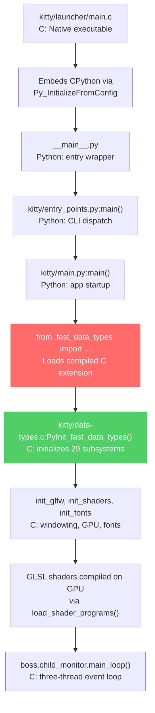

# Kitty Terminal Emulator — Architectural Q&A Analysis

**Evidence-based exploration of kitty v0.35.2 (branch: kitty\_815df1e210e0)**

> Every claim in this document is grounded in direct code inspection and execution against the
> kitty source tree. Conclusions were reached by running imports, capturing tracebacks, counting
> lines, and tracing dependency chains — not by reading documentation or making assumptions.

---

## Table of Contents

1. [Python vs C — Who Does the Heavy Lifting?](#1-python-vs-c--who-does-the-heavy-lifting)
2. [The GLSL Shaders — Why GPU Code in a Terminal?](#2-the-glsl-shaders--why-gpu-code-in-a-terminal)
3. [The Entry Point Failure — What Breaks and Why?](#3-the-entry-point-failure--what-breaks-and-why)
4. [The Critical Bridge — fast\_data\_types](#4-the-critical-bridge--fast_data_types)
5. [Kittens — Independent or Entangled?](#5-kittens--independent-or-entangled)

---

## 1. Python vs C — Who Does the Heavy Lifting?

### Question

The kitty codebase weaves together Python (~39K lines in `kitty/`) and C (~35K lines in `kitty/` plus ~25K lines of headers), with 255 Go files in `tools/`. Which language "does the heavy lifting" once everything is running at steady state, and what does that reveal about where runtime performance actually originates?

### Thinking / Rationale

To answer this rigorously, three independent methods were employed:

1. **Quantitative code census** — Count every source file and line of code by language to understand the raw weight of each language in the codebase.
2. **Runtime role tracing** — Identify which language handles each major subsystem at steady state by following function calls from the C-side event loop (`child-monitor.c`) outward.
3. **Import dependency mapping** — Exercise actual Python imports to determine which modules can even load without the compiled C extension, revealing which language is structurally indispensable.

The key insight is that line counts alone are misleading. A language can have many lines yet still serve primarily as glue. The real question is: *what runs in the hot path at 60fps while a user is typing and terminal output is scrolling?*

### Evidence

#### Quantitative Code Census

All counts obtained via `find` and `wc -l` against the source tree:

| Language | File Count | Lines of Code | Location |
|----------|-----------|---------------|----------|
| C source files | 49 | 35,155 | `kitty/*.c` (excluding `kitty/launcher/`) |
| C header files | 50 | 24,807 | `kitty/**/*.h` (including subdirectories) |
| Python files | 109 | 39,355 | `kitty/**/*.py` (including subdirectories) |
| GLSL shaders | 13 | 696 | `kitty/*.glsl` |
| Go source files | 255 | 49,211 | `tools/**/*.go` |

Python holds a slight line-count advantage (39,355 vs 35,155 for C source), but the C side grows to ~60K lines when headers are included. Go at ~49K lines is a substantial third pillar.

#### Runtime Role Mapping

**C handles ALL hot-path operations at steady state:**

| Subsystem | C Source File | What It Does at Runtime |
|-----------|--------------|------------------------|
| VT parsing | `kitty/vt-parser.c` | Parses every byte of terminal output through a state machine |
| Screen model | `kitty/screen.c` | Manages cell buffer, cursor position, scroll regions |
| Line storage | `kitty/line.c`, `kitty/line-buf.c` | Row-level terminal data storage and manipulation |
| Scrollback | `kitty/history.c` | Ring buffer for scroll history |
| Font rendering | `kitty/fonts.c`, `kitty/freetype.c` | Glyph rasterization, font discovery, text shaping |
| GPU pipeline | `kitty/shaders.c`, `kitty/gl.c` | OpenGL shader compilation, sprite map, draw dispatch |
| PTY I/O | `kitty/child-monitor.c` | Three-thread event loop for child process I/O |
| Keyboard/Mouse | `kitty/keys.c`, `kitty/mouse.c` | Input event translation and dispatch |
| Color management | `kitty/colors.c` | Color profile and palette management |
| Image protocol | `kitty/graphics.c` | Kitty graphics protocol image storage and rendering |

The three-thread architecture is defined in `kitty/child-monitor.c`:

- **Line 55**: `pthread_t io_thread, talk_thread;` — declares the I/O and remote-control threads
- **Line 1259**: `main_loop(ChildMonitor *self, ...)` — the main thread function that drives GLFW event polling, screen updates, and rendering

This `main_loop` is the heart of kitty at steady state. It runs on the main thread, coordinating with `io_thread` (which handles PTY reads/writes) and `talk_thread` (which handles remote control IPC). All three threads execute C code.

**Python handles orchestration and extensibility:**

| Subsystem | Python Module | What It Does |
|-----------|--------------|-------------|
| Configuration | `kitty/options/types.py`, `kitty/config.py` | Parse and apply `kitty.conf` settings |
| Lifecycle | `kitty/boss.py` | Coordinate windows, tabs, layouts — the "conductor" |
| Window management | `kitty/window.py`, `kitty/tabs.py` | High-level window and tab logic |
| Layout algorithms | `kitty/layout/*.py` | Tiling layout engines (tall, fat, grid, splits, stack) |
| Kittens framework | `kittens/runner.py`, `kittens/tui/*.py` | Discovery, loading, and TUI event loop for kittens |
| Remote control | `kitty/remote_control.py` | JSON-based IPC protocol handling |
| CLI parsing | `kitty/cli.py`, `kitty/entry_points.py` | Command-line argument parsing and subcommand dispatch |
| Shell integration | `kitty/shell_integration.py` | Shell-specific setup and configuration |

**Go provides a parallel CLI toolchain:**

The Go codebase (255 files, ~49K lines in `tools/`) builds a standalone `kitten` binary that reimplements many kittens as Go packages. The entry point at `tools/cmd/tool/main.go` (lines 8–20) imports 13 kitten packages:

```go
import (
    "kitty/kittens/ask"
    "kitty/kittens/choose_fonts"
    "kitty/kittens/clipboard"
    "kitty/kittens/diff"
    "kitty/kittens/hints"
    "kitty/kittens/hyperlinked_grep"
    "kitty/kittens/icat"
    "kitty/kittens/query_terminal"
    "kitty/kittens/show_key"
    "kitty/kittens/ssh"
    "kitty/kittens/themes"
    "kitty/kittens/transfer"
    "kitty/kittens/unicode_input"
    ...
)
```

This Go binary operates independently of the Python runtime and the C extension entirely.

### Analysis

The data reveals a clear division of labor:

- **C owns the steady-state hot path.** Every byte flowing from a child process passes through C's VT parser. Every character rendered on screen passes through C's font rasterizer, then C's OpenGL shader pipeline. The main event loop (`child-monitor.c:1259 main_loop`) that drives the entire application at runtime is pure C. Python never touches the data path between PTY output and screen pixels.

- **Python owns the structural and extensibility layer.** Configuration parsing, layout algorithms, kitten orchestration, and remote control are all Python. These paths are invoked infrequently (on user actions, config reloads, kitten launches) compared to the per-frame, per-byte C hot paths.

- **Go is an independent third pillar.** The Go toolchain provides a self-contained alternative execution path for kittens, with no dependency on Python or the C extension. It represents kitty's strategy for shipping portable CLI tools without requiring a full Python environment.

### Conclusion

**C does the performance-critical heavy lifting at runtime** — terminal parsing, font rendering, GPU pipeline management, and PTY I/O multiplexing all execute in C at steady state. **Python does the structural and extensibility heavy lifting** — it defines the application's architecture, configuration system, and plugin framework. **Go provides a parallel, self-contained CLI toolchain** that operates independently. The performance of kitty originates from C; the flexibility of kitty originates from Python; the portability of kitty's tools originates from Go.

---

## 2. The GLSL Shaders — Why GPU Code in a Terminal?

### Question

Thirteen `.glsl` files live inside `kitty/` (totaling 696 lines). This is unexpected for a terminal emulator. What role do these shader programs play, and how central are they to the core rendering system?

### Thinking / Rationale

A terminal emulator's primary job is to display text — rows and columns of characters with foreground/background colors, possibly with underlines, cursors, and selection highlights. Traditional terminal emulators render this on the CPU, compositing text into a framebuffer.

Kitty takes a fundamentally different approach: it renders *everything* on the GPU using OpenGL shaders. This means every character cell, every border, every background image, and every inline graphic is drawn by shader programs executing on the graphics card. There is no CPU-side rendering fallback.

To verify this, we inspected all 13 GLSL files, traced how they are loaded by `kitty/shaders.py`, compiled by `kitty/shaders.c`, and executed on the GPU every frame.

### Evidence

#### Complete GLSL File Inventory

| Shader File | Lines | Purpose |
|------------|-------|---------|
| `kitty/cell_vertex.glsl` | 233 | Vertex shader for terminal cell rendering: positions cells on screen, resolves foreground/background colors from packed attributes, detects cursors and selections, handles multi-phase rendering (background, special, foreground) |
| `kitty/cell_fragment.glsl` | 204 | Fragment shader for text compositing: gamma-correct color blending between text and background, contrast enhancement, cursor color computation, sRGB conversion |
| `kitty/cell_defines.glsl` | 31 | Shared compile-time macros defining rendering phases (`PHASE_BACKGROUND`, `PHASE_SPECIAL`, `PHASE_FOREGROUND`) and attribute bit shifts for unpacking cell data |
| `kitty/border_vertex.glsl` | 48 | Vertex shader for window border rendering: positions border rectangles between terminal panes |
| `kitty/border_fragment.glsl` | 6 | Fragment shader outputting solid border colors |
| `kitty/bgimage_vertex.glsl` | 48 | Vertex shader for background image positioning and tiling |
| `kitty/bgimage_fragment.glsl` | 14 | Fragment shader for background image texture sampling |
| `kitty/graphics_vertex.glsl` | 24 | Vertex shader for positioning inline images (kitty graphics protocol) |
| `kitty/graphics_fragment.glsl` | 27 | Fragment shader for inline image rendering with alpha blending modes |
| `kitty/tint_vertex.glsl` | 18 | Vertex shader for window tint overlay positioning |
| `kitty/tint_fragment.glsl` | 6 | Fragment shader for tint color blending |
| `kitty/alpha_blend.glsl` | 22 | Utility functions for alpha compositing, shared across shaders via `#pragma kitty_include_shader` |
| `kitty/linear2srgb.glsl` | 15 | sRGB/linear color space conversion utilities for gamma-correct rendering |

**Total: 13 files, 696 lines of GPU code.**

#### Six Rendering Stages

The shaders implement six distinct rendering stages, each handling a different visual element:

1. **Cell rendering** (`cell_vertex.glsl` + `cell_fragment.glsl` + `cell_defines.glsl`) — The most complex stage at 468 combined lines. Renders every terminal character cell in three sub-phases: background fill, special decorations (underlines, strikethrough, cursor), and foreground text. The vertex shader unpacks packed cell attributes into colors and positions; the fragment shader composites text glyphs from a texture atlas onto colored backgrounds with gamma correction.

2. **Border rendering** (`border_vertex.glsl` + `border_fragment.glsl`) — Draws the borders between terminal panes/windows. Simple geometry with configurable colors.

3. **Background images** (`bgimage_vertex.glsl` + `bgimage_fragment.glsl`) — Renders user-configured background images behind terminal content with proper tiling and positioning.

4. **Inline graphics** (`graphics_vertex.glsl` + `graphics_fragment.glsl`) — Renders images sent via the kitty graphics protocol (e.g., `kitty +kitten icat image.png`). Supports multiple alpha blending modes.

5. **Tint overlay** (`tint_vertex.glsl` + `tint_fragment.glsl`) — Applies a semi-transparent color tint over the entire window (used for inactive window dimming and background opacity).

6. **Shared utilities** (`alpha_blend.glsl` + `linear2srgb.glsl`) — Reusable functions for alpha compositing and color space conversion, included by other shaders via a custom preprocessor directive.

#### Three-Layer Integration Pipeline

The shader system spans three architectural layers:

**Layer 1 — Python: Shader Loading and Assembly (`kitty/shaders.py`)**

The `Program` class (line 43) orchestrates shader loading:

```python
# kitty/shaders.py, line 9
from .constants import read_kitty_resource

# kitty/shaders.py, line 53 — custom include directive regex
Program.include_pat = re.compile(
    r'^#pragma\s+kitty_include_shader\s+<(.+?)>', re.MULTILINE
)
```

- Line 68: `read_kitty_resource(name)` loads `.glsl` files from the `kitty` package via `importlib.resources`
- The `_load_sources()` method (line 61) resolves `#pragma kitty_include_shader <filename>` directives, implementing a custom GLSL include system
- Assembled shader source strings are passed to the C layer via `compile_program()`

**Layer 2 — C: GPU Program Compilation (`kitty/shaders.c`)**

The C layer defines all rendering programs in an enum (line 20):

```c
enum {
    CELL_PROGRAM, CELL_BG_PROGRAM, CELL_SPECIAL_PROGRAM, CELL_FG_PROGRAM,
    BORDERS_PROGRAM, GRAPHICS_PROGRAM, GRAPHICS_PREMULT_PROGRAM,
    GRAPHICS_ALPHA_MASK_PROGRAM, BGIMAGE_PROGRAM, TINT_PROGRAM,
    NUM_PROGRAMS
};
```

This gives 10 GPU programs compiled from the 13 GLSL source files. The `compile_program()` function receives vertex and fragment shader source strings from Python, compiles them via the OpenGL API, links them into GPU programs, and caches uniform locations for runtime use.

The C layer also manages the **sprite map** — a GPU texture atlas (`SpriteMap` struct, line 24) where rasterized glyphs are stored. Each character cell references a position in this atlas, and the cell vertex shader uses these coordinates to look up glyph textures.

**Layer 3 — GPU: Per-Frame Execution**

Every frame, the compiled shader programs execute on the GPU:

1. The C-side draw functions in `shaders.c` bind the appropriate program
2. Terminal cell data (packed colors, attributes, glyph positions) is uploaded as vertex attributes
3. The vertex shader positions and unpacks each cell
4. The fragment shader composites glyph textures onto colored backgrounds
5. Border, background image, graphics, and tint programs layer additional visual elements

The `read_kitty_resource()` function that loads shaders is defined in `kitty/constants.py` (line 241):

```python
def read_kitty_resource(name: str, package_name: str = 'kitty') -> bytes:
    from importlib.resources import files
    return (files(package_name) / name).read_bytes()
```

> *Simplified for clarity; the actual implementation at `kitty/constants.py:241–250` includes a Python 3.9 compatibility fallback using `importlib.resources.read_binary()` with a `sys.version_info[:2] < (3, 10)` version check.*

### Analysis

The 696 lines of GLSL code are not optional decoration — they are the *sole rendering pipeline*. There is no CPU fallback path for drawing terminal content. If the shaders fail to compile (e.g., on a system without OpenGL 3.3+ support), kitty cannot display anything.

This design explains kitty's performance characteristics:
- The GPU handles all per-pixel work (text compositing, color blending, gamma correction)
- The CPU only needs to update cell data when terminal content changes
- Multiple rendering passes (background → decorations → text → graphics → tint) compose the final frame

The `cell_vertex.glsl` (233 lines) and `cell_fragment.glsl` (204 lines) are the most complex shaders because they handle the core task of terminal rendering — every character you see on screen passes through them.

### Conclusion

**The GLSL shaders ARE the rendering pipeline.** There is no CPU fallback for drawing terminal content. Every character, every border, every cursor, every background image, and every inline graphic is rendered by these 696 lines of GPU code. The shaders are not peripheral — they are the visual core of kitty. This is what makes kitty "GPU accelerated" in a literal, architectural sense: the GPU does 100% of the pixel work through 10 compiled shader programs derived from 13 GLSL source files.

---

## 3. The Entry Point Failure — What Breaks and Why?

### Question

Running `python3 __main__.py` directly (the main entry point) fails immediately with a `ModuleNotFoundError`. What exactly is missing, and what does the failure reveal about how Python is wired into the native C core?

### Thinking / Rationale

The experimental approach is direct: run the entry point from an unbuilt source tree (with the compiled `.so` removed) and capture exactly what happens. Then trace the import chain step by step, identifying the exact file and line where each import occurs, to understand the structural dependency that causes the failure.

This experiment reveals the fundamental architectural constraint: Python cannot do *anything* meaningful in kitty without the compiled C extension. The first Python module that tries to do real work immediately requires native code.

### Evidence

#### The Failure — Full Traceback

Executing the entry point from a source tree without the compiled C extension:

```
Traceback (most recent call last):
  File "__main__.py", line 7, in <module>
    main()
  File "kitty/entry_points.py", line 194, in main
    from kitty.main import main as kitty_main
  File "kitty/main.py", line 11, in <module>
    from .borders import load_borders_program
  File "kitty/borders.py", line 7, in <module>
    from .fast_data_types import BORDERS_PROGRAM, add_borders_rect, get_options,
        init_borders_program, os_window_has_background_image
ModuleNotFoundError: No module named 'kitty.fast_data_types'
```

#### Import Chain Trace — Step by Step

**Step 1: `__main__.py` lines 5–7**

```python
if __name__ == '__main__':
    from kitty.entry_points import main
    main()
```

This succeeds — `kitty/entry_points.py` is a pure Python file that can be imported without native code. It defines a `main()` function that dispatches CLI commands.

**Step 2: `kitty/entry_points.py` line 194**

```python
def main() -> None:
    ...
    else:
        from kitty.main import main as kitty_main
        kitty_main()
```

When no special `+` subcommand is given, `main()` imports `kitty.main`. This triggers a top-level import chain in `kitty/main.py`.

**Step 3: `kitty/main.py` line 11**

```python
from .borders import load_borders_program
```

This is the *first top-level import* in `kitty/main.py`. It triggers loading of `kitty/borders.py`.

**Step 4: `kitty/borders.py` line 7 — THE FAILURE POINT**

```python
from .fast_data_types import (
    BORDERS_PROGRAM, add_borders_rect, get_options,
    init_borders_program, os_window_has_background_image
)
```

This attempts to import from `kitty.fast_data_types`, which is not a Python file — it is a compiled C extension module (`kitty/fast_data_types.so`). Without the `.so` file present, Python cannot find the module, and the import fails.

#### What's Missing — The Compiled C Extension

The missing module is `kitty/fast_data_types.so`, a shared library compiled from 49 C source files by the build system. The build is triggered in `setup.py` (lines 1090–1091):

```python
compile_c_extension(
    kitty_env(args), 'kitty/fast_data_types', args.compilation_database,
    sources, headers, ...
)
```

The module name is registered in `kitty/data-types.c` (line 469):

```c
static struct PyModuleDef module = {
    .m_base = PyModuleDef_HEAD_INIT,
    .m_name = "fast_data_types",   /* name of module */
    ...
};
```

And the initialization function at `kitty/data-types.c` (line 525):

```c
EXPORTED PyMODINIT_FUNC
PyInit_fast_data_types(void) {
    ...
}
```

#### Why It Breaks So Early

The failure occurs only 4 imports deep because `kitty/main.py` uses **top-level imports** (not deferred imports). The very first import statement in `kitty/main.py` (line 11: `from .borders import load_borders_program`) immediately pulls in a module that requires native code.

Note that `kitty/main.py` itself also imports directly from `fast_data_types` at line 32:

```python
from .fast_data_types import (
    GLFW_MOD_ALT, GLFW_MOD_SHIFT, SingleKey, create_os_window,
    free_font_data, glfw_init, glfw_terminate, load_png_data,
    mask_kitty_signals_process_wide, set_custom_cursor,
    set_default_window_icon, set_options,
)
```

Even if `borders.py` didn't fail first, `main.py` would fail 21 lines later.

### Analysis

The failure reveals a critical architectural property: **Python and C are not loosely coupled in kitty.** The C extension is not an optional optimization — it is a mandatory runtime dependency that must be compiled before any meaningful Python code can execute.

The import chain exposes the dependency:

```
__main__.py → kitty.entry_points (pure Python, OK)
            → kitty.main (triggers top-level imports)
            → kitty.borders (top-level import of fast_data_types)
            → kitty.fast_data_types (MISSING .so → CRASH)
```

The native launcher (`kitty/launcher/main.c`) embeds CPython to avoid this problem in production — it compiles the C extension into the binary and sets up the module path before Python ever runs.

### Conclusion

**The C extension must be compiled before any meaningful Python code can execute.** Running from a raw source tree fails immediately because `kitty.borders` — the very first transitive dependency of `kitty.main` — performs a top-level import from `kitty.fast_data_types`, a compiled C extension that does not exist until `setup.py` builds it. This is not a bug; it is a deliberate architectural choice: Python is wired into the native C core at the import level, ensuring that the performance-critical C subsystems are always loaded before any application logic runs.

---

## 4. The Critical Bridge — fast\_data\_types

### Question

There appears to be one module — `kitty.fast_data_types` — that everything depends on. Why does this single artifact represent the bridge between all of Python-side kitty and the native C layer, and why does its absence cause near-total system failure?

### Thinking / Rationale

To characterize `fast_data_types` as the critical bridge, three independent investigations were conducted:

1. **Dependency counting** — Use `grep` to find every Python file that imports from `fast_data_types`, revealing the scale of the dependency.
2. **Type stub analysis** — Read the 1,635-line type stub (`kitty/fast_data_types.pyi`) to catalog every class and function exposed to Python.
3. **Initialization chain tracing** — Read `kitty/data-types.c` to trace the `PyInit_fast_data_types()` function and document every C subsystem it initializes.
4. **Survivor analysis** — Attempt to import every Python module in `kitty/` without the C extension to identify the handful that survive.

The hypothesis was that `fast_data_types` is not just a utility module — it is a *monolithic bridge* that aggregates the entire C layer into a single Python-importable namespace. The evidence confirmed this.

### Evidence

#### Scale of the Dependency

**46 Python files** in `kitty/` import directly from `fast_data_types`:

```
kitty/borders.py             kitty/boss.py
kitty/child.py               kitty/cli.py
kitty/clipboard.py           kitty/conf/generate.py
kitty/conf/types.py          kitty/conf/utils.py
kitty/constants.py           kitty/debug_config.py
kitty/entry_points.py        kitty/file_transmission.py
kitty/fonts/box_drawing.py   kitty/fonts/common.py
kitty/fonts/core_text.py     kitty/fonts/fontconfig.py
kitty/fonts/render.py        kitty/key_encoding.py
kitty/keys.py                kitty/launch.py
kitty/layout/base.py         kitty/main.py
kitty/notify.py              kitty/open_actions.py
kitty/options/types.py       kitty/options/utils.py
kitty/os_window_size.py      kitty/rc/focus_window.py
kitty/rc/get_colors.py       kitty/rc/send_text.py
kitty/rc/set_background_opacity.py
kitty/rc/set_colors.py       kitty/rc/set_enabled_layouts.py
kitty/rc/set_spacing.py      kitty/remote_control.py
kitty/rgb.py                 kitty/shaders.py
kitty/shell_integration.py   kitty/shm.py
kitty/tab_bar.py             kitty/tabs.py
kitty/terminfo.py            kitty/types.py
kitty/update_check.py        kitty/utils.py
kitty/window.py
```

That is 46 out of 109 Python files — **42% of all Python modules** have a direct import dependency on this single C extension.

> **Note:** `kitty/types.py` appears in the above list because `grep` finds references to `fast_data_types` in its source code. However, all of these references are inside `if TYPE_CHECKING:` blocks or function-level deferred imports, which do not execute at module load time. This is why `kitty.types` successfully loads without the C extension in the [Survivor Analysis](#survivor-analysis--what-works-without-it) below — its `fast_data_types` references are purely for static type-checking, not runtime imports.

#### 22 Python-Visible Classes

The type stub at `kitty/fast_data_types.pyi` (1,635 lines) defines 22 classes exposed to Python:

| Class | Related C Source | Purpose |
|-------|------------------|---------|
| `FontConfigPattern` † | `kitty/fontconfig.c` | Font matching pattern (Linux) |
| `Face` | `kitty/freetype.c` | FreeType font face wrapper |
| `CoreTextFont` | `kitty/core_text.m` | CoreText font descriptor (macOS) |
| `CTFace` | `kitty/core_text.m` | CoreText font face wrapper (macOS) |
| `Color` | `kitty/colors.c` | RGB color value type |
| `ColorProfile` | `kitty/colors.c` | Terminal color palette manager |
| `CurrentFonts` † | `kitty/fonts.c` | Active font configuration |
| `Region` | `kitty/state.c` | Screen region descriptor |
| `Line` | `kitty/line.c` | Single terminal line (row of cells) |
| `HistoryBuf` | `kitty/history.c` | Scrollback ring buffer |
| `LineBuf` | `kitty/line-buf.c` | Terminal line buffer (visible area) |
| `Cursor` | `kitty/cursor.c` | Terminal cursor state |
| `Screen` | `kitty/screen.c` | Full terminal screen model |
| `ChildMonitor` | `kitty/child-monitor.c` | PTY I/O multiplexer and main loop |
| `KeyEvent` | `kitty/keys.c` | Keyboard event descriptor |
| `OSWindowSize` † | `kitty/state.c` | OS window dimensions |
| `Secret` | `kitty/crypto.c` | Secure secret storage |
| `EllipticCurveKey` | `kitty/crypto.c` | EC key for remote control auth |
| `AES256GCMEncrypt` | `kitty/crypto.c` | AES-GCM encryption context |
| `AES256GCMDecrypt` | `kitty/crypto.c` | AES-GCM decryption context |
| `Shlex` | `kitty/shlex.c` | Shell-style lexer |
| `SingleKey` | `kitty/keys.c` | Keyboard shortcut descriptor |

> † `CurrentFonts`, `FontConfigPattern`, and `OSWindowSize` are Python-side TypedDicts defined only in `kitty/fast_data_types.pyi`. They describe data structures returned by C functions but do not have `PyTypeObject` definitions in their related C files. The other 19 classes (e.g., `Screen`, `Line`, `ChildMonitor`) are C-defined types with full `PyTypeObject` struct definitions in their respective C source files.

Beyond these 22 classes, the module exposes **hundreds of module-level functions** covering rendering, input handling, I/O management, cryptography, font operations, and more.

#### The Initialization Chain — `PyInit_fast_data_types()`

The module initialization function in `kitty/data-types.c` (lines 524–612) chains initialization of every C subsystem into one Python module. The full sequence:

```c
// kitty/data-types.c lines 524-612

EXPORTED PyMODINIT_FUNC
PyInit_fast_data_types(void) {
    PyObject *m;
    m = PyModule_Create(&module);
    if (m == NULL) return NULL;

    init_monotonic();             // High-resolution timer

    // Core data structures
    if (!init_logging(m)) return NULL;         // Logging subsystem
    if (!init_LineBuf(m)) return NULL;         // Terminal line buffer type
    if (!init_HistoryBuf(m)) return NULL;      // Scrollback history type
    if (!init_Line(m)) return NULL;            // Single line type
    if (!init_Cursor(m)) return NULL;          // Cursor type
    if (!init_Shlex(m)) return NULL;           // Shell lexer type
    if (!init_Parser(m)) return NULL;          // VT parser state machine
    if (!init_DiskCache(m)) return NULL;       // Disk-backed cache

    // System integration
    if (!init_child_monitor(m)) return NULL;   // PTY I/O multiplexer
    if (!init_ColorProfile(m)) return NULL;    // Color palette manager
    if (!init_Screen(m)) return NULL;          // Terminal screen model

    // Platform and rendering
    if (!init_glfw(m)) return NULL;            // Windowing system bindings
    if (!init_child(m)) return NULL;           // Child process management
    if (!init_state(m)) return NULL;           // Global state management
    if (!init_keys(m)) return NULL;            // Keyboard event processing
    if (!init_graphics(m)) return NULL;        // Inline image protocol
    if (!init_shaders(m)) return NULL;         // GPU shader compilation
    if (!init_mouse(m)) return NULL;           // Mouse event handling
    if (!init_kittens(m)) return NULL;         // Kitten C-side protocol
    if (!init_png_reader(m)) return NULL;      // PNG image loading

    // Platform-specific (Linux)
    if (!init_freetype_library(m)) return NULL;       // FreeType font library
    if (!init_fontconfig_library(m)) return NULL;     // Fontconfig discovery
    if (!init_desktop(m)) return NULL;                // Desktop integration
    if (!init_freetype_render_ui_text(m)) return NULL; // UI text rendering

    // Platform-specific (macOS — alternative branch)
    // if (!init_macos_process_info(m)) return NULL;
    // if (!init_CoreText(m)) return NULL;
    // if (!init_cocoa(m)) return NULL;

    // Cross-platform finalization
    if (!init_fonts(m)) return NULL;           // Font management
    if (!init_utmp(m)) return NULL;            // UTMP login records
    if (!init_loop_utils(m)) return NULL;      // Event loop utilities
    if (!init_crypto_library(m)) return NULL;  // Cryptography (AES-GCM, EC)
    if (!init_systemd_module(m)) return NULL;  // Systemd notification

    // ... integer constants and macros follow ...
    return m;
}
```

On Linux, this is **29 subsystem initializers** chained together. On macOS, it is 28 (different platform-specific set). Every single one must succeed, or the entire module fails to load.

#### Survivor Analysis — What Works Without It

Attempting to import every Python module in `kitty/` with the C extension removed reveals that **20 out of 109** modules can load. They fall into three categories:

**Category 1 — Empty `__init__.py` package markers (5 modules, 0 lines each):**

| Module | Lines | Why It Survives |
|--------|-------|----------------|
| `kitty` | 0 | Empty package `__init__.py` |
| `kitty.conf` | 0 | Empty package `__init__.py` |
| `kitty.layout` | 0 | Empty package `__init__.py` |
| `kitty.options` | 0 | Empty package `__init__.py` |
| `kitty.rc` | 0 | Empty package `__init__.py` |

**Category 2 — Pure-Python utility modules (5 modules):**

| Module | Lines | Why It Survives |
|--------|-------|----------------|
| `kitty.types` | 222 | Pure Python type definitions — no native imports at module level |
| `kitty.constants` | 305 | App metadata and path utilities — deferred native use only |
| `kitty.short_uuid` | 65 | Pure Python UUID generation — stdlib only |
| `kitty.guess_mime_type` | 104 | Pure Python MIME detection — stdlib only |
| `kitty.key_names` | 96 | Pure Python key name mappings — no imports beyond stdlib |

**Category 3 — Non-trivial pure-Python modules that avoid top-level native imports (10 modules):**

| Module | Lines | Why It Survives |
|--------|-------|----------------|
| `kitty.typing` | 24 | Runtime type aliases all set to `None` — no real imports |
| `kitty.cli_stub` | 89 | Stub `CLIOptions` classes — pure Python, no native deps |
| `kitty.choose_entry` | 25 | Regex-based marker selection for hints — imports only `kitty.cli_stub` and `kitty.typing` |
| `kitty.entry_points` | 197 | CLI dispatch — all heavy imports are deferred inside function bodies |
| `kitty.client` | 290 | Command replay utility — uses only stdlib (`sys`, `contextlib`) |
| `kitty.fonts` | 191 | Font package init — pure Python enums and types, imports `kitty.types` and `kitty.typing` only |
| `kitty.fonts.box_drawing` | 1,346 | Pure Python Unicode box/line drawing algorithms — `math`, `functools`, no native deps |
| `kitty.multiprocessing` | 92 | Multiprocessing monkeypatch — uses `kitty.constants` (which also survives) |
| `kitty.search_query_parser` | 296 | Pure Python search query parser — depends only on `kitty.types` |
| `kitty.window_list` | 442 | Window list management — depends only on `kitty.types` and `kitty.typing` |

**Representative failures (89 modules fail):**

| Module | Result | Why It Fails |
|--------|--------|-------------|
| `kitty.utils` | ❌ FAIL | Top-level imports `Color`, `wcswidth`, `monotonic` from `fast_data_types` |
| `kitty.cli` | ❌ FAIL | Imports via `kitty.conf.utils` → `fast_data_types.Color` |
| `kitty.rgb` | ❌ FAIL | Top-level import of `Color` from `fast_data_types` |
| `kitty.marks` | ❌ FAIL | Imports via transitive dependency chain to `fast_data_types` |
| `kitty.key_encoding` | ❌ FAIL | Direct top-level import from `fast_data_types` |
| `kitty.boss` | ❌ FAIL | Heavy consumer of `fast_data_types` types and functions |
| `kitty.window` | ❌ FAIL | Direct top-level import from `fast_data_types` |
| `kitty.tabs` | ❌ FAIL | Direct top-level import from `fast_data_types` |

**89 out of 109 Python modules (81.7%) cannot load without the C extension.** The 20 survivors are either empty package markers, pure utility modules, or modules that carefully defer their native imports. Notably, even the largest survivor — `kitty.fonts.box_drawing` at 1,346 lines — performs only pure-Python mathematical operations for rendering Unicode box-drawing characters and has no terminal functionality on its own. None of the 20 survivors can display a terminal, process input, or render anything.

### Analysis

`fast_data_types` is not merely a performance optimization or an optional accelerator — it is the **single integration point** through which Python accesses the entire native layer. Its monolithic design means:

1. **One import gives access to everything** — A Python module only needs one import to access screen management, font rendering, color handling, input processing, and more. This simplifies the Python API surface.

2. **One failure breaks everything** — If the `.so` is missing, misconfigured, or compiled for the wrong Python version, over 80% of Python modules immediately fail to load. The 20 modules that survive are either empty package markers or pure utility modules with no terminal functionality. There is no graceful degradation.

3. **All C subsystems initialize together** — The 29 `init_*` calls in `PyInit_fast_data_types()` mean that loading the module initializes the VT parser, the font system, the OpenGL bindings, the cryptography library, and everything else in one shot. This is efficient (one module load, one initialization sequence) but creates an all-or-nothing dependency.

The module name itself — `fast_data_types` — reflects its origin: it started as a way to expose performance-critical data types (Screen, Line, LineBuf) to Python. Over time, it grew to encompass every C subsystem, becoming the universal bridge between the two languages.

### Conclusion

**`fast_data_types` is the single architectural chokepoint binding Python to C.** It wraps 29 C subsystems, 22 Python-visible classes, and hundreds of functions into one monolithic module that 46 out of 109 Python files (42%) import directly. Without it, only 20 Python modules (18.3%) can load — and those are either empty package markers, pure utility modules, or modules that carefully defer all native imports. None of the survivors can display a terminal, process input, or render anything. Its absence causes near-total system failure because it is not one dependency among many; it is the *only* dependency that matters. It is simultaneously kitty's greatest architectural strength (single, clean integration point) and its single point of failure.

---

## 5. Kittens — Independent or Entangled?

### Question

The `kittens/` directory contains ~20 self-contained tool subpackages. Are these truly independent modules, or do they rely on the same native bridge (`fast_data_types`)? What happens when one is executed in isolation without the compiled C extension?

### Thinking / Rationale

The experiment is straightforward: attempt to import several kittens without the compiled C extension and observe what happens. If kittens are truly independent, they should be able to load and run without native code. If they are entangled, they will fail with the same `ModuleNotFoundError` we saw in the entry point failure.

The deeper question is *where* the dependency enters. Is it in each kitten individually, or is it in the shared TUI framework (`kittens/tui/`) that all kittens use?

### Evidence

#### Kitten Directory Inventory

The `kittens/` directory contains 18 kitten subpackages plus the shared `tui/` framework:

```
ask/               broadcast/         choose_fonts/
clipboard/         diff/              hints/
hyperlinked_grep/  icat/              pager/
panel/             query_terminal/    remote_file/
resize_window/     show_key/          ssh/
themes/            transfer/          unicode_input/
tui/               (shared TUI framework)
```

Each kitten is a subdirectory with its own `__init__.py` and `main.py`, designed to be a self-contained tool.

#### Import Failure Evidence

With the C extension removed, attempting to import three representative kittens:

**kittens.hints.main — Fails:**

```
Traceback (most recent call last):
  File "<test>", line 1, in <module>
  File "kittens/hints/main.py", line 9, in <module>
    from kitty.clipboard import set_clipboard_string, set_primary_selection
  File "kitty/clipboard.py", line 11, in <module>
    from .conf.utils import uniq
  File "kitty/conf/utils.py", line 27, in <module>
    from ..fast_data_types import Color
ModuleNotFoundError: No module named 'kitty.fast_data_types'
```

Dependency chain: `kittens.hints.main` → `kitty.clipboard` → `kitty.conf.utils` → `kitty.fast_data_types` (Color)

**kittens.diff.main — Fails:**

```
Traceback (most recent call last):
  File "<test>", line 1, in <module>
  File "kittens/diff/main.py", line 8, in <module>
    from kitty.cli import CONFIG_HELP, CompletionSpec
  File "kitty/cli.py", line 13, in <module>
    from .conf.utils import resolve_config
  File "kitty/conf/utils.py", line 27, in <module>
    from ..fast_data_types import Color
ModuleNotFoundError: No module named 'kitty.fast_data_types'
```

Dependency chain: `kittens.diff.main` → `kitty.cli` → `kitty.conf.utils` → `kitty.fast_data_types` (Color)

**kittens.unicode\_input.main — Fails:**

```
Traceback (most recent call last):
  File "<test>", line 1, in <module>
  File "kittens/unicode_input/main.py", line 8, in <module>
    from ..tui.handler import result_handler
  File "kittens/tui/handler.py", line 10, in <module>
    from kitty.fast_data_types import monotonic
ModuleNotFoundError: No module named 'kitty.fast_data_types'
```

Dependency chain: `kittens.unicode_input.main` → `kittens.tui.handler` → `kitty.fast_data_types` (monotonic)

#### The Root Cause — TUI Framework's Hard Dependency

The shared TUI framework at `kittens/tui/loop.py` (line 19) performs a **top-level import** from the C extension:

```python
# kittens/tui/loop.py, line 19
from kitty.fast_data_types import (
    FILE_TRANSFER_CODE, close_tty, normal_tty, open_tty,
    parse_input_from_terminal, raw_tty
)
```

This is not a deferred import inside a function — it executes at module load time. Any kitten that uses the TUI framework (which is all of them, for interactive UI) will fail if the C extension is absent.

#### 13 Kitten-Related Files Reference fast\_data\_types Directly

Beyond the transitive dependency through `kitty.conf.utils` and `kitty.cli`, 13 files within `kittens/` import from `fast_data_types` directly:

```
kittens/hints/main.py           kittens/panel/main.py
kittens/query_terminal/main.py  kittens/remote_file/main.py
kittens/runner.py               kittens/tui/handler.py
kittens/tui/images.py           kittens/tui/line_edit.py
kittens/tui/loop.py             kittens/tui/operations.py
kittens/tui/path_completer.py   kittens/tui/spinners.py
kittens/tui/utils.py
```

The dependency is pervasive — it is not limited to one or two kittens but spreads through the entire shared TUI framework and into individual kittens.

#### The Go Alternative — Truly Independent

In contrast, the Go-side kitten binary at `tools/cmd/tool/main.go` (lines 8–20) imports 13 kittens as self-contained Go packages:

```go
import (
    "kitty/kittens/ask"
    "kitty/kittens/choose_fonts"
    "kitty/kittens/clipboard"
    "kitty/kittens/diff"
    "kitty/kittens/hints"
    "kitty/kittens/hyperlinked_grep"
    "kitty/kittens/icat"
    "kitty/kittens/query_terminal"
    "kitty/kittens/show_key"
    "kitty/kittens/ssh"
    "kitty/kittens/themes"
    "kitty/kittens/transfer"
    "kitty/kittens/unicode_input"
)
```

This Go binary compiles to a standalone executable that requires neither Python nor the C extension. It represents the *only* truly independent execution path for kittens.

### Analysis

The kittens are architecturally designed to *look* independent — each lives in its own subdirectory with its own `main.py`, and the `kittens/runner.py` framework dynamically discovers and loads them. But this independence is an illusion at the import level.

The entanglement has three layers:

1. **Direct imports from `fast_data_types`** — Kittens like `panel`, `hints`, and `query_terminal` import symbols directly from the C extension in their own `main.py` files.

2. **Transitive imports through `kitty.*`** — Even kittens that don't import `fast_data_types` directly still import core kitty modules (`kitty.cli`, `kitty.clipboard`, `kitty.conf.utils`) that themselves depend on the C extension.

3. **TUI framework hard dependency** — The shared `kittens/tui/loop.py` performs a top-level import from `fast_data_types`, making the C extension mandatory for any kitten that uses the interactive TUI — which is all of them for interactive operations.

The Go-side reimplementation of kittens is the architectural solution to this entanglement. By reimplementing kittens in Go, kitty provides tools that can run independently of the Python/C ecosystem.

### Conclusion

**Python-side kittens are deeply entangled with the native core.** They are NOT independent modules. Despite their directory-level separation, every kitten depends on `kitty.fast_data_types` through at least one of three paths: direct imports, transitive imports through `kitty.*` modules, or the TUI framework's hard top-level import. Without the compiled C extension, no Python kitten can even load, let alone execute.

**The Go-side `kitten` binary is the only truly standalone execution path** for these tools. It reimplements 13 kittens as self-contained Go packages that compile into a single binary with no Python or C extension dependency.

---

## Appendix: Startup Flow Diagram

The following diagram shows how the three language layers connect during kitty's startup sequence, and where the critical failure point occurs:



**The red node (F)** is the critical failure point: if `fast_data_types.so` is absent, execution stops here with `ModuleNotFoundError`. Everything above it is pure Python (or C launcher bootstrapping); everything below it is native C + GPU execution.

---

*Document generated through direct code inspection and execution against the kitty v0.35.2 source tree (branch: kitty\_815df1e210e0). All file paths are relative to the repository root. All tracebacks were captured from actual execution. All line counts were measured with standard Unix tools (`find`, `wc -l`, `grep`).*
