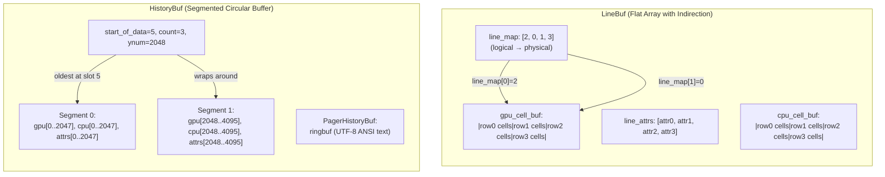
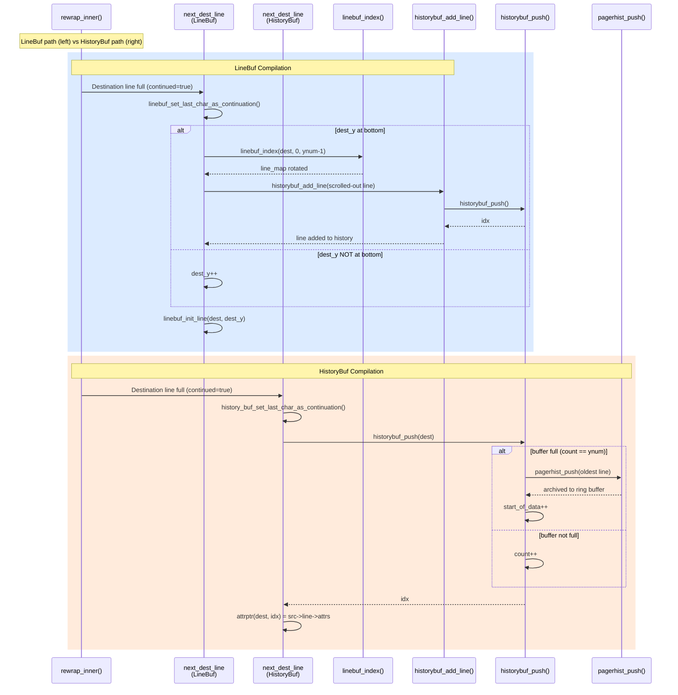
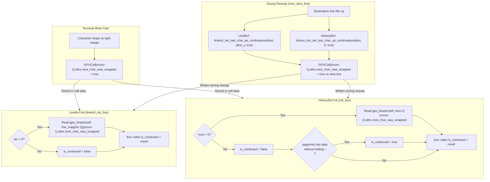

# Kitty Terminal Reflow (Rewrap) System — Technical Deep-Dive

> **Document Scope:** Code analysis only — no source files are modified.
> **Target Audience:** Developers working on or investigating kitty's terminal buffer system, contributors diagnosing reflow edge cases, and terminal emulator implementers studying kitty's approach.
> **Source Branch:** `kitty_815df1e210e0`
> **Authoritative Source:** All claims in this document are grounded in the actual source code. Line numbers reference the exact positions in the repository. No assumptions are made — conclusions are derived directly from code inspection.

---

## Table of Contents

1. [Overview and Motivation](#1-overview-and-motivation)
2. [Core Data Structures](#2-core-data-structures)
3. [Resize Entry Point: screen_resize()](#3-resize-entry-point-screen_resize)
4. [The Rewrap Algorithm: rewrap_inner()](#4-the-rewrap-algorithm-rewrap_inner)
5. [LineBuf Rewrap Integration](#5-linebuf-rewrap-integration)
6. [HistoryBuf Rewrap Integration](#6-historybuf-rewrap-integration)
7. [Continuation State Propagation Analysis](#7-continuation-state-propagation-analysis)
8. [Prompt Protection During Resize](#8-prompt-protection-during-resize)
9. [Edge Cases and Potential Issues](#9-edge-cases-and-potential-issues)
10. [Test Coverage Summary](#10-test-coverage-summary)

---

## 1. Overview and Motivation

### What Reflow and Rewrap Mean

In a terminal emulator, **reflow** is the user-visible behavior where text in the terminal buffer is redistributed across new dimensions when the window is resized. If a user shrinks a terminal from 80 columns to 40 columns, a logical line that previously fit on one row may now span two rows. Conversely, widening the terminal may join multiple visual lines back into one.

**Rewrap** refers to the internal algorithm that implements this redistribution at the C code level. In kitty's codebase, the rewrap algorithm lives in a single header file — `kitty/rewrap.h` — and is the core engine that both the visible screen buffer (`LineBuf`) and the scrollback history buffer (`HistoryBuf`) use to redistribute their contents.

The distinction matters for understanding the code: "resize" is the triggering event (the window changed size), "reflow" is the user-facing result (text rearranges), and "rewrap" is the algorithm that does the work.

### When Reflow Is Triggered

Reflow is triggered whenever the terminal is resized and the new column count differs from the old column count. The entry point is `screen_resize()` in `kitty/screen.c` (line 346). This function is called by the window management layer when GLFW reports a terminal size change, and it orchestrates the complete reflow of all buffers.

*Source: kitty/screen.c:345-348*

### Why Reflow Exists

Without reflow, resizing a terminal would either truncate text (if narrowing) or leave ragged gaps (if widening). Reflow ensures that **logical lines** — sequences of characters terminated by a hard line break (newline) — remain coherent regardless of the visual width. A logical line that was entered as `"Hello, World!"` should remain a single logical line whether displayed on 5 columns (3 visual lines) or 80 columns (1 visual line).

### Architecture at a Glance

The rewrap algorithm in `kitty/rewrap.h` uses a **macro-parametric design** — the same algorithm source code is compiled twice with different macro definitions: once for `LineBuf` (the visible screen buffer, included from `kitty/line-buf.c` at line 583) and once for `HistoryBuf` (the scrollback history, included from `kitty/history.c` at line 592). This design avoids code duplication while allowing each buffer type to customize key operations like line advancement, source indexing, and continuation state management.

*Source: kitty/rewrap.h:10-42 (default macros), kitty/history.c:582-592 (overrides)*

### Terminology Used in This Document

| Term | Meaning |
|------|---------|
| **Rewrap** | The internal algorithm (`rewrap_inner()`) that copies cells from source to destination buffers |
| **Reflow** | The user-visible behavior of text redistributing across new terminal dimensions |
| **Resize** | The triggering event — the terminal window changed size |
| **Continuation** | A visual line that was wrapped from the previous line (not terminated by a hard line break) |
| **Logical line** | A sequence of characters terminated by a hard line break (newline) |
| **Visual line** | A single row of the terminal at a given column width |

---

## 2. Core Data Structures

Understanding the rewrap system requires familiarity with the data structures that represent terminal content at the cell, line, and buffer levels. All structures are defined in `kitty/data-types.h`.

### 2.1 Cell-Level Structures

#### CellAttrs

*Source: kitty/data-types.h:196-209*

```c
typedef union CellAttrs {
    struct {
        uint16_t width : 2;
        uint16_t decoration : 3;
        uint16_t bold : 1;
        uint16_t italic : 1;
        uint16_t reverse : 1;
        uint16_t strike : 1;
        uint16_t dim : 1;
        uint16_t mark : 2;
        uint16_t next_char_was_wrapped : 1;
    };
    uint16_t val;
} CellAttrs;
```

`CellAttrs` is a 16-bit union type that packs visual attributes and one critical reflow flag into a single `uint16_t`. The key field for the rewrap system is **`next_char_was_wrapped`** (bit 12). When set on the **last cell** of a line, it indicates that the line continues onto the next visual line — i.e., the content wrapped at the right margin rather than terminating with a hard line break. This bit is the **ground truth** for continuation state in the entire reflow system.

**Rationale:** Storing the continuation flag on the last GPU cell of a line (rather than as a separate line attribute) means it travels with the cell data during copy operations, which simplifies certain buffer operations. However, this design means the flag must be explicitly read from a specific cell position, which introduces complexity during line initialization (see Section 7).

#### GPUCell

*Source: kitty/data-types.h:216-221*

```c
typedef struct {
    color_type fg, bg, decoration_fg;
    sprite_index sprite_x, sprite_y, sprite_z;
    CellAttrs attrs;
} GPUCell;
static_assert(sizeof(GPUCell) == 20, "Fix the ordering of GPUCell");
```

`GPUCell` represents the rendering-relevant data for a single character cell: foreground/background/decoration colors, sprite coordinates for the glyph atlas, and the `CellAttrs` bit-field. Size: 20 bytes, verified by static assert at line 221. The rewrap algorithm copies these cells via `memcpy` in `copy_range()`.

#### CPUCell

*Source: kitty/data-types.h:223-228*

```c
typedef struct {
    char_type ch;
    hyperlink_id_type hyperlink_id;
    combining_type cc_idx[3];
} CPUCell;
static_assert(sizeof(CPUCell) == 12, "Fix the ordering of CPUCell");
```

`CPUCell` stores the character value (`ch`), hyperlink ID, and up to 3 combining character indices. Size: 12 bytes, verified by static assert at line 228. The rewrap algorithm reads `cpu_cells[x].ch` to detect blank characters during trailing blank trimming. The constant `BLANK_CHAR` (0) is compared against `ch` to determine if a cell is empty.

### 2.2 Line-Level Structures

#### LineAttrs

*Source: kitty/data-types.h:231-239*

```c
typedef enum { UNKNOWN_PROMPT_KIND = 0, PROMPT_START = 1, SECONDARY_PROMPT = 2, OUTPUT_START = 3 } PromptKind;
typedef union LineAttrs {
    struct {
        uint8_t is_continued : 1;
        uint8_t has_dirty_text : 1;
        uint8_t has_image_placeholders : 1;
        PromptKind prompt_kind : 2;
    };
    uint8_t val;
} LineAttrs;
```

`LineAttrs` is an 8-bit union packing per-line metadata. The key field for reflow is **`is_continued`** (bit 0), which indicates that this line is a visual continuation of the previous line. Unlike `next_char_was_wrapped` on `GPUCell` (which is the stored truth), `is_continued` is **derived** at line initialization time from the previous line's last GPU cell — it is not independently stored.

The `prompt_kind` field is relevant to the prompt protection system (Section 8): it categorizes lines as part of a shell prompt (`PROMPT_START`, `SECONDARY_PROMPT`), command output (`OUTPUT_START`), or unknown.

#### Line

*Source: kitty/data-types.h:241-249*

```c
typedef struct {
    PyObject_HEAD
    GPUCell *gpu_cells;
    CPUCell *cpu_cells;
    index_type xnum, ynum;
    bool needs_free;
    LineAttrs attrs;
} Line;
```

`Line` is a **view object** — it contains pointers into a buffer's cell arrays rather than owning its own storage. The `gpu_cells` and `cpu_cells` pointers are set by init functions to point into the appropriate location within a `LineBuf` or `HistoryBuf`. `xnum` is the number of columns (line width), and `ynum` is repurposed by the rewrap algorithm to store the current destination line index (see `rewrap_inner()` line 95: `dest->line->ynum = dest_y`). Each buffer maintains a single shared `Line` view that is re-initialized to point at different lines as needed.

### 2.3 Buffer-Level Structures

#### LineBuf

*Source: kitty/data-types.h:252-260*

```c
typedef struct {
    PyObject_HEAD
    GPUCell *gpu_cell_buf;
    CPUCell *cpu_cell_buf;
    index_type xnum, ynum, *line_map, *scratch;
    LineAttrs *line_attrs;
    Line *line;
} LineBuf;
```

`LineBuf` is the flat-array screen buffer used for the visible terminal content. It stores all cells in two contiguous arrays: `gpu_cell_buf` (size: `xnum * ynum * sizeof(GPUCell)`) and `cpu_cell_buf` (size: `xnum * ynum * sizeof(CPUCell)`).

The **`line_map`** array is an indirection layer: `line_map[i]` gives the physical row index for logical line `i`. This enables **O(1) scrolling** — instead of copying all cell data when the screen scrolls, `linebuf_index()` simply rotates the `line_map` entries. The `line_attrs` array stores per-line attributes indexed by logical line number. The `scratch` array is used as temporary storage during line map rotations.

#### HistoryBufSegment

*Source: kitty/data-types.h:262-266*

```c
typedef struct {
    GPUCell *gpu_cells;
    CPUCell *cpu_cells;
    LineAttrs *line_attrs;
} HistoryBufSegment;
```

`HistoryBufSegment` is a storage unit for the scrollback history. Each segment holds `SEGMENT_SIZE` (2048, defined at `kitty/history.c:15`) lines' worth of cell data. The segmented design avoids allocating one enormous contiguous block for large scrollback buffers.

#### HistoryBuf

*Source: kitty/data-types.h:282-290*

```c
typedef struct {
    PyObject_HEAD
    index_type xnum, ynum, num_segments;
    HistoryBufSegment *segments;
    PagerHistoryBuf *pagerhist;
    Line *line;
    index_type start_of_data, count;
} HistoryBuf;
```

`HistoryBuf` is a **segmented circular buffer** for scrollback history. `ynum` is the maximum capacity (number of lines). `count` is the current number of valid lines (`count <= ynum`). `start_of_data` is the index of the oldest line in the circular buffer. When the buffer is full (`count == ynum`), adding a new line advances `start_of_data`, overwriting the oldest entry.

The circular buffer indexing is managed by two distinct functions:
- **`index_of()`** (reverse indexing, `kitty/history.c:153-159`): Maps a logical line number where 0 = most recent line. Used for normal access.
- **`map_src_index()`** (forward indexing, `kitty/history.c:584`): Maps a logical line number where 0 = oldest line. Used during rewrap iteration.

The `pagerhist` pointer links to the optional `PagerHistoryBuf` for extended pager history.

#### PagerHistoryBuf

*Source: kitty/data-types.h:268-272*

```c
typedef struct {
    void *ringbuf;
    size_t maximum_size;
    bool rewrap_needed;
} PagerHistoryBuf;
```

`PagerHistoryBuf` is a UTF-8 ring buffer that stores history lines as ANSI-escaped text strings, used by the pager (scrollback viewer). When the main `HistoryBuf` is full and a new line is pushed, the oldest structured line is serialized into this ring buffer via `pagerhist_push()` before being overwritten. The `rewrap_needed` flag is set when the column count changes during a resize, signaling that the pager history content needs to be reflowed (this is deferred until the pager is actually opened).

### 2.4 Key Distinction: `next_char_was_wrapped` vs `is_continued`

| Property | `next_char_was_wrapped` | `is_continued` |
|----------|------------------------|----------------|
| **Location** | `GPUCell.attrs` (last cell of line) | `LineAttrs` (per-line) |
| **Scope** | Per-cell at position `xnum-1` | Per-line attribute |
| **Nature** | **Stored truth** — written when wrapping occurs | **Derived** — computed at line init time |
| **Set by** | Terminal write path; `linebuf_set_last_char_as_continuation()`; `history_buf_set_last_char_as_continuation()` | `linebuf_init_line()` / `init_line()` |
| **Read during rewrap** | Yes — `is_src_line_continued()` macro reads this | Not directly — derived on-the-fly |
| **Survives copy** | Yes — travels with `GPUCell` memcpy | Must be re-derived after copy |

**Rationale for dual design:** The `next_char_was_wrapped` flag on the last GPU cell is the definitive record of whether a line wraps. The `is_continued` flag on `LineAttrs` is a convenience that is computed whenever a line is initialized, by reading the *previous* line's last GPU cell. This avoids every consumer needing to look up the previous line's cells, but introduces a dependency on correct initialization order.

### 2.5 Memory Layout Diagram



**LineBuf** uses a flat contiguous array with `line_map` indirection. When the screen scrolls up by one line, `linebuf_index()` rotates the `line_map` array entries (saving `line_map[top]`, shifting entries up, placing saved value at `bottom`) — an O(n) operation on the index array but O(1) in terms of cell data movement.

**HistoryBuf** uses segmented storage with circular buffer semantics. New lines are added at position `(start_of_data + count) % ynum`. When full, `start_of_data` advances, overwriting the oldest line (after archiving it to pager history). The `cpu_lineptr()` and `gpu_lineptr()` functions in `kitty/history.c` (lines 50-58) handle mapping a flat index to the correct segment and offset.

*Source: kitty/line-buf.c:317-327 (linebuf_index), kitty/history.c:36-42 (segment_for), kitty/history.c:50-58 (lineptr functions)*

---

## 3. Resize Entry Point: screen_resize()

The `screen_resize()` function in `kitty/screen.c` (lines 345-463) is the top-level orchestrator for all reflow operations. It coordinates the reallocation and rewrapping of the history buffer, main screen buffer, and alternate screen buffer in a specific order, with cursor tracking, prompt protection, and scrollback fill logic woven throughout.

### 3.1 Complete Execution Flow

The function follows a strict sequence of 13 steps. The order is critical — particularly that history is reallocated **before** the main buffer, because the main buffer's rewrap may overflow lines into history.

#### Step 1: Initialization (lines 347-348)

```c
screen_pause_rendering(self, false, 0);
lines = MAX(1u, lines); columns = MAX(1u, columns);
```

Rendering is paused to prevent partial display during the resize. Both dimensions are clamped to a minimum of 1 to avoid zero-size buffers.

#### Step 2: Dummy Output Insertion (lines 350-361)

```c
bool is_main = self->linebuf == self->main_linebuf;
// ...
if (is_main && self->cursor->x == 0 && self->cursor->y < self->lines &&
    self->linebuf->line_attrs[self->cursor->y].prompt_kind == OUTPUT_START) {
    linebuf_init_line(self->linebuf, self->cursor->y);
    if (!self->linebuf->line->cpu_cells[0].ch) {
        self->linebuf->line->cpu_cells[self->cursor->x++].ch = '<';
        dummy_output_inserted = true;
    }
}
```

**Rationale:** If the cursor sits at `x=0` on a blank `OUTPUT_START` line (the line immediately after a shell prompt), that line contains no characters and would be eliminated by the rewrap algorithm's trailing-blank trimming. Inserting a dummy `<` character preserves the line through reflow. The dummy is cleaned up in Step 12.

*Source: kitty/screen.c:350-361*

#### Step 3: Cursor Tracking Setup (lines 362-365)

```c
unsigned int lines_after_cursor_before_resize = self->lines - self->cursor->y;
CursorTrack cursor = {.before = {self->cursor->x, self->cursor->y}};
CursorTrack main_saved_cursor = {.before = {self->main_savepoint.cursor.x, self->main_savepoint.cursor.y}};
CursorTrack alt_saved_cursor = {.before = {self->alt_savepoint.cursor.x, self->alt_savepoint.cursor.y}};
```

Three `CursorTrack` structs are initialized to track the active cursor, the main savepoint cursor (for `DECSC`/`DECRC` save/restore), and the alt savepoint cursor. Each records its pre-resize `.before` position. The `lines_after_cursor_before_resize` value is used later for scrollback fill to maintain the cursor's distance from the bottom.

The `CursorTrack` struct (lines 226-232) carries:
- `num_content_lines` — number of content lines after rewrap
- `is_beyond_content` — whether cursor was past the last content line
- `.before`, `.after`, `.temp` — position pairs for pre-resize, post-resize, and intermediate tracking

*Source: kitty/screen.c:226-232, 362-365*

#### Step 4: Overlay Line Resize (line 372)

```c
if (!init_overlay_line(self, columns, true)) return false;
```

The overlay line (used for IME composition display) is resized to the new column width.

#### Step 5: History Buffer Reallocation (lines 375-377)

```c
HistoryBuf *nh = realloc_hb(self->historybuf, self->historybuf->ynum, columns, &self->as_ansi_buf);
if (nh == NULL) return false;
Py_CLEAR(self->historybuf); self->historybuf = nh;
```

**This is the first buffer operation, and the order is critical.** The history buffer is reallocated with the new column count (but same capacity `ynum`) via `realloc_hb()`. This function:
1. Allocates a new `HistoryBuf` with the target dimensions
2. Transfers the `pagerhist` pointer from old to new (line 220: `ans->pagerhist = old->pagerhist; old->pagerhist = NULL;`)
3. Calls `historybuf_rewrap(old, new)` to redistribute existing history lines

**Rationale for history-first:** The main buffer's rewrap (Step 7) may overflow lines into history when the new dimensions are smaller. The history buffer must already exist at the new column width to receive these overflow lines. If history were reallocated after the main buffer, the overflow lines would be lost.

*Source: kitty/screen.c:216-223 (realloc_hb), 375-377*

#### Step 6: Prompt Protection (lines 378-383)

```c
RAII_PyObject(prompt_copy, NULL);
index_type num_of_prompt_lines = 0, num_of_prompt_lines_above_cursor = 0;
if (is_main) {
    prompt_copy = (PyObject*)alloc_linebuf(self->lines, self->columns);
    num_of_prompt_lines = prevent_current_prompt_from_rewrapping(
        self, (LineBuf*)prompt_copy, &num_of_prompt_lines_above_cursor);
}
```

On the main screen, prompt lines are saved to a copy buffer and then blanked in the main buffer before reflow. This prevents the prompt from being reflowed (which would change the cursor's vertical offset from the prompt start). See Section 8 for full details.

*Source: kitty/screen.c:378-383, 302-343 (prevent_current_prompt_from_rewrapping)*

#### Step 7: Main Line Buffer Reallocation (lines 384-391)

```c
LineBuf *n = realloc_lb(self->main_linebuf, lines, columns,
    &num_content_lines_before, &num_content_lines_after,
    self->historybuf, &cursor, &main_saved_cursor, &self->as_ansi_buf);
if (n == NULL) return false;
Py_CLEAR(self->main_linebuf); self->main_linebuf = n;
if (is_main) setup_cursor(cursor);
setup_cursor(main_saved_cursor);
```

The main line buffer is reallocated via `realloc_lb()`, which:
1. Allocates a new `LineBuf` with target dimensions
2. Copies `.before` positions to `.temp` for tracking (line 238-239)
3. Calls `linebuf_rewrap()` with the history buffer for overflow handling
4. Returns the new buffer

The `setup_cursor` macro (lines 366-370) then copies `.temp` results to `.after`, checks if the cursor was beyond content, and records content line counts.

*Source: kitty/screen.c:234-242 (realloc_lb), 366-370 (setup_cursor), 384-391*

#### Step 8: Alt Line Buffer Reallocation (lines 393-401)

```c
n = realloc_lb(self->alt_linebuf, lines, columns,
    &num_content_lines_before, &num_content_lines_after,
    NULL, &cursor, &alt_saved_cursor, &self->as_ansi_buf);
```

The alternate screen buffer is reallocated with the same pattern, but passes `NULL` for `historybuf` — the alt screen has no scrollback, so overflow lines are simply discarded during rewrap.

*Source: kitty/screen.c:393-401*

#### Step 9: Post-Resize State Update (lines 403-418)

```c
self->linebuf = is_main ? self->main_linebuf : self->alt_linebuf;
self->lines = lines; self->columns = columns;
self->margin_top = 0; self->margin_bottom = self->lines - 1;
// ... reallocate tabstops, clear selections ...
```

The active linebuf pointer is set, dimensions are updated, scroll margins are reset to full screen, tabstops are reallocated, and selections are cleared.

*Source: kitty/screen.c:403-418*

#### Step 10: Cursor Position Resolution (lines 419-427)

```c
#define S(c, w) c->x = MIN(w.after.x, self->columns - 1); c->y = MIN(w.after.y, self->lines - 1);
    S(self->cursor, cursor);
    S((&(self->main_savepoint.cursor)), main_saved_cursor);
    S((&(self->alt_savepoint.cursor)), alt_saved_cursor);
#undef S
if (cursor.is_beyond_content) {
    self->cursor->y = cursor.num_content_lines;
    if (self->cursor->y >= self->lines) { self->cursor->y = self->lines - 1; screen_index(self); }
}
```

Cursor coordinates are clamped to the new dimensions. If the cursor was beyond the content area before resize (e.g., at the bottom of a partially-filled screen), it is repositioned to the end of the content area, with `screen_index()` called if it would exceed the screen height.

*Source: kitty/screen.c:419-427*

#### Step 11: Scrollback Fill-on-Enlarge (lines 428-438)

```c
if (is_main && OPT(scrollback_fill_enlarged_window)) {
    const unsigned int top = 0, bottom = self->lines-1;
    while (self->cursor->y + 1 < self->lines &&
           self->lines - self->cursor->y > lines_after_cursor_before_resize) {
        if (!historybuf_pop_line(self->historybuf, self->alt_linebuf->line)) break;
        INDEX_DOWN;
        linebuf_copy_line_to(self->main_linebuf, self->alt_linebuf->line, 0);
        self->cursor->y++;
    }
}
```

When the `scrollback_fill_enlarged_window` option is enabled and the terminal height increased, this loop pulls lines from the history buffer (via `historybuf_pop_line()`) and inserts them at the top of the screen using reverse scroll (`INDEX_DOWN` macro). This fills the new space above the cursor with previously scrolled-off content, maintaining the cursor's distance from the bottom of the screen.

**Rationale:** Without this, enlarging the terminal vertically would show blank lines above the content, even when scrollback data exists. This feature makes the experience feel like the viewport is expanding upward.

*Source: kitty/screen.c:428-438, 289-299 (INDEX_DOWN macro)*

#### Step 12: Dummy Output Cleanup (lines 439-443)

```c
if (dummy_output_inserted && self->cursor->y < self->lines) {
    linebuf_init_line(self->linebuf, self->cursor->y);
    self->linebuf->line->cpu_cells[0].ch = 0;
    self->cursor->x = 0;
}
```

The dummy `<` character from Step 2 is removed by zeroing the cell and resetting `cursor->x` to 0.

*Source: kitty/screen.c:439-443*

#### Step 13: Prompt Restoration (lines 444-461)

```c
if (num_of_prompt_lines) {
    LineBuf *src = (LineBuf*)prompt_copy;
    for (index_type src_line = 0,
            y = num_of_prompt_lines_above_cursor <= self->cursor->y ?
                self->cursor->y - num_of_prompt_lines_above_cursor : 0;
            src_line < num_of_prompt_lines && y < self->lines;
            y++, src_line++) {
        linebuf_init_line(src, src_line);
        linebuf_copy_line_to(self->main_linebuf, src->line, y);
    }
}
```

The saved prompt lines are copied back to the main buffer at their positions relative to the cursor. The target start line is `cursor_y - num_of_prompt_lines_above_cursor`, clamped to 0. This overwrites any reflowed content at those positions, preserving the original prompt layout for the shell's redraw logic.

*Source: kitty/screen.c:444-461*

### 3.2 screen_resize() Flow Diagram

```mermaid
flowchart TD
    A["screen_resize(lines, columns)"] --> B["Pause rendering<br/>Clamp lines/columns ≥ 1"]
    B --> C{"is_main AND<br/>cursor at blank<br/>OUTPUT_START?"}
    C -->|Yes| D["Insert dummy '<' char<br/>dummy_output_inserted = true"]
    C -->|No| E["Record cursor positions<br/>Create CursorTrack structs"]
    D --> E
    E --> F["Resize overlay line"]
    F --> G["realloc_hb()<br/>Rewrap history buffer"]
    G --> H{"is_main?"}
    H -->|Yes| I["Allocate prompt_copy<br/>prevent_current_prompt_from_rewrapping()"]
    H -->|No| J["realloc_lb(main_linebuf)<br/>Rewrap main buffer with history overflow"]
    I --> J
    J --> K["setup_cursor(cursor, main_saved)"]
    K --> L["realloc_lb(alt_linebuf)<br/>Rewrap alt buffer (no history)"]
    L --> M["setup_cursor(alt_saved)"]
    M --> N["Update dimensions, margins,<br/>tabstops, clear selections"]
    N --> O["Clamp cursor positions"]
    O --> P{"cursor was<br/>beyond content?"}
    P -->|Yes| Q["Set cursor.y = num_content_lines<br/>screen_index() if needed"]
    P -->|No| R{"is_main AND<br/>scrollback_fill enabled?"}
    Q --> R
    R -->|Yes| S["Pull lines from history<br/>via historybuf_pop_line()<br/>+ INDEX_DOWN reverse scroll"]
    R -->|No| T{"dummy_output<br/>inserted?"}
    S --> T
    T -->|Yes| U["Remove dummy char<br/>Reset cursor.x = 0"]
    T -->|No| V{"num_of_prompt_lines<br/>> 0?"}
    U --> V
    V -->|Yes| W["Restore prompt lines<br/>from prompt_copy"]
    V -->|No| X["Return true"]
    W --> X
```



### 3.3 Helper Functions

#### realloc_hb() (lines 216-223)

```c
static HistoryBuf*
realloc_hb(HistoryBuf *old, unsigned int lines, unsigned int columns, ANSIBuf *as_ansi_buf) {
    HistoryBuf *ans = alloc_historybuf(lines, columns, 0);
    if (ans == NULL) { PyErr_NoMemory(); return NULL; }
    ans->pagerhist = old->pagerhist; old->pagerhist = NULL;
    historybuf_rewrap(old, ans, as_ansi_buf);
    return ans;
}
```

Allocates a new `HistoryBuf` with target dimensions, transfers the pager history pointer, and calls `historybuf_rewrap()` to redistribute existing history content. The `pagerhist` transfer (line 220) is a pointer move, not a copy — the old buffer's pointer is set to NULL to prevent double-free.

#### realloc_lb() (lines 234-242)

```c
static LineBuf*
realloc_lb(LineBuf *old, unsigned int lines, unsigned int columns,
           index_type *nclb, index_type *ncla, HistoryBuf *hb,
           CursorTrack *a, CursorTrack *b, ANSIBuf *as_ansi_buf) {
    LineBuf *ans = alloc_linebuf(lines, columns);
    if (ans == NULL) { PyErr_NoMemory(); return NULL; }
    a->temp.x = a->before.x; a->temp.y = a->before.y;
    b->temp.x = b->before.x; b->temp.y = b->before.y;
    linebuf_rewrap(old, ans, nclb, ncla, hb, &a->temp.x, &a->temp.y, &b->temp.x, &b->temp.y, as_ansi_buf);
    return ans;
}
```

Allocates a new `LineBuf`, seeds the `.temp` tracking positions from `.before`, then calls `linebuf_rewrap()` which updates the `.temp` values in-place via `TrackCursor`. The `hb` parameter is the history buffer for overflow (NULL for the alt buffer).

---

## 4. The Rewrap Algorithm: rewrap_inner()

The heart of kitty's reflow system is the `rewrap_inner()` function, defined in `kitty/rewrap.h` (lines 56-96). This static function performs the actual cell-by-cell redistribution from a source buffer to a destination buffer with a potentially different column width. It is compiled twice — once for `LineBuf` and once for `HistoryBuf` — through a macro-parametric design.

### 4.1 Macro-Parametric Design Pattern

`kitty/rewrap.h` defines a set of macros with `#ifndef` guards (lines 10-42). These provide default behavior suitable for `LineBuf`. When `kitty/history.c` needs to use the same algorithm for `HistoryBuf`, it defines overrides for these macros **before** including `rewrap.h` (lines 582-592), causing the algorithm to use `HistoryBuf`-specific operations without modifying the core logic.

This pattern is a C-language form of compile-time polymorphism — one algorithm, two behaviors.

#### Macro Comparison Table

| Macro | LineBuf Default (rewrap.h) | HistoryBuf Override (history.c:582-591) |
|-------|---------------------------|----------------------------------------|
| **`BufType`** | `LineBuf` (line 11) | `HistoryBuf` (line 582) |
| **`init_src_line(src_y)`** | `linebuf_init_line(src, src_y)` (line 15) | `init_line(src, map_src_index(src_y), src->line)` (line 586) — uses circular buffer forward indexing |
| **`first_dest_line`** | `linebuf_init_line(dest, 0); set_dest_line_attrs(0)` (line 21) | `next_dest_line(false)` (line 590) — calls `historybuf_push` for the first line |
| **`next_dest_line(continued)`** | Sets continuation on last cell, scrolls `line_map` if at bottom (overflow to history via `historybuf_add_line`), clears new line (lines 25-37) | `history_buf_set_last_char_as_continuation(dest, 0, cont); historybuf_push(dest, ...)` (line 588) — pushes into circular buffer |
| **`is_src_line_continued()`** | `src->line->gpu_cells[src->xnum-1].attrs.next_char_was_wrapped` (line 41) | Same — uses default (not overridden) |

**Key Insight:** The `next_dest_line` macro is the **critical difference** between the two compilations. For `LineBuf`, it uses `linebuf_index()` to rotate the line map and potentially overflows the scrolled-out line into the history buffer via `historybuf_add_line()`. For `HistoryBuf`, it calls `historybuf_push()` which advances the circular buffer's write position. This difference reflects the fundamentally different storage models: flat array with indirection vs. circular buffer with segments.

*Source: kitty/rewrap.h:10-42 (defaults), kitty/history.c:582-591 (overrides)*

### 4.2 Supporting Types

#### TrackCursor (lines 50-53)

```c
typedef struct TrackCursor {
    index_type x, y;
    bool is_tracked_line, is_sentinel;
} TrackCursor;
```

`TrackCursor` enables the rewrap algorithm to track cursor positions through the reflow. Multiple cursors can be tracked simultaneously by passing an array of `TrackCursor` structs terminated by a sentinel entry (`is_sentinel = true`). During the rewrap loop, `is_tracked_line` is set to `true` for each cursor whose `y` matches the current source line, and the cursor's `x, y` are remapped to destination coordinates when the relevant chunk is copied.

#### copy_range() (lines 44-48)

```c
static inline void
copy_range(Line *src, index_type src_at, Line* dest, index_type dest_at, index_type num) {
    memcpy(dest->cpu_cells + dest_at, src->cpu_cells + src_at, num * sizeof(CPUCell));
    memcpy(dest->gpu_cells + dest_at, src->gpu_cells + src_at, num * sizeof(GPUCell));
}
```

A thin wrapper that `memcpy`s both CPU and GPU cell arrays from source to destination for a given range. This is the innermost data-movement operation in the rewrap loop.

### 4.3 Algorithm Walkthrough

The algorithm (lines 56-96) processes source lines sequentially, copying chunks of cells into the destination buffer. When a destination line fills up, it advances to the next destination line. When a source line ends without continuation (hard break), a new destination line is started.

#### Function Signature (line 57)

```c
static void
rewrap_inner(BufType *src, BufType *dest, const index_type src_limit,
             HistoryBuf UNUSED *historybuf, TrackCursor *track, ANSIBuf *as_ansi_buf)
```

- `src` / `dest`: Source and destination buffers (type depends on macro expansion)
- `src_limit`: Number of source lines to process (content lines, not buffer capacity)
- `historybuf`: History buffer for overflow when `BufType` is `LineBuf` (UNUSED attribute for `HistoryBuf` compilation)
- `track`: Array of cursor trackers (NULL-safe — a sentinel is substituted)
- `as_ansi_buf`: ANSI serialization buffer (used by `historybuf_add_line` and `historybuf_push` for pager history)

#### Initialization (lines 58-61)

```c
bool is_first_line = true;
index_type src_y = 0, src_x = 0, dest_x = 0, dest_y = 0, num = 0, src_x_limit = 0;
TrackCursor tc_end = {.is_sentinel = true };
if (!track) track = &tc_end;
```

All position counters start at 0. If no cursor tracking is requested, a lone sentinel is used to avoid NULL checks in the loop.

#### Outer Loop: Source Line Iteration (lines 63-94)

The `do { ... } while (src_y < src_limit)` loop processes one source line per iteration:

**Step 1 — Mark tracked cursors (line 64):**
```c
for (TrackCursor *t = track; !t->is_sentinel; t++) t->is_tracked_line = src_y == t->y;
```
For each tracked cursor, mark whether the current source line is the one the cursor is on.

**Step 2 — Initialize source line (line 65):**
```c
init_src_line(src_y);
```
Loads the source line's cell pointers into the buffer's line view. For `LineBuf`, this calls `linebuf_init_line()`. For `HistoryBuf`, this uses circular buffer indexing via `map_src_index()`.

**Step 3 — Check continuation (line 66):**
```c
const bool src_line_is_continued = is_src_line_continued();
```
Reads `next_char_was_wrapped` from the last GPU cell of the source line. If true, this line visually continues onto the next source line (no hard break).

**Step 4 — Trailing blank trimming (lines 68-70):**
```c
src_x_limit = src->xnum;
if (!src_line_is_continued) {
    while(src_x_limit && (src->line->cpu_cells[src_x_limit - 1].ch) == BLANK_CHAR) src_x_limit--;
}
```
If the source line has a hard break (not continued), trailing blank characters are trimmed from the copy range. This prevents unnecessary whitespace from consuming destination space. **For continued lines, no trimming occurs** — trailing blanks might be meaningful content that wrapped.

**Step 5 — Clear wrap flag on continued lines (line 72):**
```c
else {
    src->line->gpu_cells[src->xnum-1].attrs.next_char_was_wrapped = false;
}
```
If the source line IS continued, the `next_char_was_wrapped` flag is cleared on the source. The destination will set its own wrap flag as needed when destination lines fill up. This prevents stale wrap flags from being copied.

**Step 6 — Clamp tracked cursor X (lines 74-76):**
```c
for (TrackCursor *t = track; !t->is_sentinel; t++) {
    if (t->is_tracked_line && t->x >= src_x_limit) t->x = MAX(1u, src_x_limit) - 1;
}
```
If a tracked cursor's X position falls within the trimmed trailing blanks, it is moved to the last non-blank position (or 0 if the line is entirely blank).

**Step 7 — First destination line (lines 77-78):**
```c
if (is_first_line) {
    first_dest_line; is_first_line = false;
}
```
On the first iteration, the `first_dest_line` macro initializes the first destination line. For `LineBuf`, this calls `linebuf_init_line(dest, 0)` and copies source line attributes. For `HistoryBuf`, this calls `next_dest_line(false)` which pushes the first entry into the circular buffer.

**Step 8 — Inner copy loop (lines 80-90):**
```c
while (src_x < src_x_limit) {
    if (dest_x >= dest->xnum) { next_dest_line(true); dest_x = 0; }
    num = MIN(src->line->xnum - src_x, dest->xnum - dest_x);
    copy_range(src->line, src_x, dest->line, dest_x, num);
    for (TrackCursor *t = track; !t->is_sentinel; t++) {
        if (t->is_tracked_line && src_x <= t->x && t->x < src_x + num) {
            t->y = dest_y;
            t->x = dest_x + (t->x - src_x + (t->x > 0));
        }
    }
    src_x += num; dest_x += num;
}
```

This is the core copy engine:
1. If the destination line is full (`dest_x >= dest->xnum`), advance to the next destination line with `continued=true` and reset `dest_x`.
2. Calculate the chunk size: the minimum of remaining source cells and remaining destination capacity.
3. Copy the chunk via `copy_range()` (memcpy of CPU and GPU cells).
4. For each tracked cursor on this source line, if the cursor falls within the copied chunk, remap it to destination coordinates: `t->y = dest_y` and `t->x = dest_x + (t->x - src_x + (t->x > 0))`. (The `(t->x > 0)` offset is analyzed in Section 9.)
5. Advance both source and destination positions.

**Step 9 — Advance source (line 92):**
```c
src_y++; src_x = 0;
```

**Step 10 — Hard line break handling (line 93):**
```c
if (!src_line_is_continued && src_y < src_limit) { init_src_line(src_y); next_dest_line(false); dest_x = 0; }
```
If the source line had a hard break and more source lines remain, initialize the next source line and advance the destination to a new line with `continued=false`. This ensures hard line breaks in the source produce hard line breaks in the destination.

**Note:** The `init_src_line(src_y)` call here pre-loads the next source line. This is important because `next_dest_line` for `LineBuf` calls `set_dest_line_attrs(dest_y)` which reads `src->line->attrs` — so the next source line's attributes must be loaded before the destination line is created.

#### Final Line Number (line 95)

```c
dest->line->ynum = dest_y;
```

The `ynum` field of the destination's line view is repurposed to store the last destination line index. The caller uses this to determine the number of content lines after rewrap: `num_content_lines_after = other->line->ynum + 1`.

### 4.4 Worked Examples

#### Example 1: Narrowing (5 columns → 3 columns)

**Source buffer (5 columns):**

| Line | Content | `next_char_was_wrapped` |
|------|---------|------------------------|
| 0 | `A B C D E` | `true` (continued) |
| 1 | `F G _ _ _` | `false` (hard break) |

(`_` = BLANK_CHAR)

**Algorithm trace:**

1. **src_y=0:** `src_line_is_continued = true`, `src_x_limit = 5` (no trimming for continued lines). Clear wrap flag on source.
   - `first_dest_line`: init dest line 0, copy attrs
   - Copy chunk: `src_x=0`, `dest_x=0`, `num = MIN(5, 3) = 3` → copy `A B C` to dest line 0
   - `dest_x=3`, `src_x=3`
   - `dest_x >= 3` → `next_dest_line(true)` (dest line 0 marked as continued) → dest_y=1, dest_x=0
   - Copy chunk: `src_x=3`, `dest_x=0`, `num = MIN(2, 3) = 2` → copy `D E` to dest line 1
   - `dest_x=2`, `src_x=5`
2. **src_y=1 (advance):** `src_line_is_continued = true` → no `next_dest_line` call yet (continuation combines lines)
3. **Actually:** Going back — since src_y=0 was continued, at line 93: `!src_line_is_continued` is false, so no `next_dest_line(false)`. We continue to src_y=1 with `dest_x=2` (still on dest line 1).
4. **src_y=1:** `src_line_is_continued = false`, `src_x_limit = 5` → trim trailing blanks → `src_x_limit = 2` ("FG" only)
   - Copy chunk: `src_x=0`, `dest_x=2`, `num = MIN(5, 1) = 1` → copy `F` to dest line 1
   - `dest_x=3`, `src_x=1`
   - `dest_x >= 3` → `next_dest_line(true)` (dest line 1 marked as continued) → dest_y=2, dest_x=0
   - Copy chunk: `src_x=1`, `dest_x=0`, `num = MIN(4, 3) = 3` → copy `G` + 2 trailing blanks to dest line 2 (3 cells copied, only `G` is meaningful content)
   - `dest_x=3`, `src_x=4` ≥ `src_x_limit` (2) → exit inner loop
5. **src_y=2:** `src_y >= src_limit (2)` → exit outer loop. `!src_line_is_continued` is true but `src_y (2) >= src_limit (2)` → no next_dest_line.
6. `dest->line->ynum = 2`

**Destination buffer (3 columns):**

| Line | Content | Continued? |
|------|---------|-----------|
| 0 | `A B C` | Yes (wrapped) |
| 1 | `D E F` | Yes (wrapped) |
| 2 | `G _ _` | No (hard break) |

The logical line "ABCDEFG" is preserved across the narrower width.

#### Example 2: Widening (3 columns → 5 columns)

**Source buffer (3 columns):**

| Line | Content | `next_char_was_wrapped` |
|------|---------|------------------------|
| 0 | `A B C` | `true` (continued) |
| 1 | `D E _` | `false` (hard break) |

**Algorithm trace:**

1. **src_y=0:** `src_line_is_continued = true`, `src_x_limit = 3`. Clear wrap flag.
   - `first_dest_line`: init dest line 0
   - Copy chunk: `src_x=0`, `dest_x=0`, `num = MIN(3, 5) = 3` → copy `A B C` to dest line 0
   - `dest_x=3`, `src_x=3` = `src_x_limit` → exit inner loop
2. **src_y=1 (advance):** Source line 0 was continued → `!src_line_is_continued` is false → no `next_dest_line`, `dest_x` stays at 3 on dest line 0.
3. **src_y=1:** `src_line_is_continued = false`, `src_x_limit = 3` → trim trailing blanks → `src_x_limit = 2` ("DE" only)
   - Copy chunk: `src_x=0`, `dest_x=3`, `num = MIN(3, 2) = 2` → copy `D E` to dest line 0
   - `dest_x=5`, `src_x=2` = `src_x_limit` → exit inner loop
4. `dest->line->ynum = 0`

**Destination buffer (5 columns):**

| Line | Content | Continued? |
|------|---------|-----------|
| 0 | `A B C D E` | No (hard break) |

The two source lines are joined back into a single logical line on the wider display.

---

## 5. LineBuf Rewrap Integration

### 5.1 Inclusion Without Overrides

`kitty/line-buf.c` includes `rewrap.h` at line 583 **without** defining any macro overrides. This means all default macros apply: `BufType` is `LineBuf`, `init_src_line` calls `linebuf_init_line()`, `next_dest_line` uses `linebuf_index()` with history overflow, and `first_dest_line` directly initializes destination line 0.

*Source: kitty/line-buf.c:583*

### 5.2 linebuf_rewrap() Function

*Source: kitty/line-buf.c:585-622*

```c
void
linebuf_rewrap(LineBuf *self, LineBuf *other,
    index_type *num_content_lines_before, index_type *num_content_lines_after,
    HistoryBuf *historybuf,
    index_type *track_x, index_type *track_y,
    index_type *track_x2, index_type *track_y2,
    ANSIBuf *as_ansi_buf)
```

This is the wrapper function that sets up the environment for `rewrap_inner()` when operating on `LineBuf` buffers.

#### Step 1: Fast Path (lines 591-598)

```c
if (other->xnum == self->xnum && other->ynum == self->ynum) {
    memcpy(other->line_map, self->line_map, sizeof(index_type) * self->ynum);
    memcpy(other->line_attrs, self->line_attrs, sizeof(LineAttrs) * self->ynum);
    memcpy(other->cpu_cell_buf, self->cpu_cell_buf, (size_t)self->xnum * self->ynum * sizeof(CPUCell));
    memcpy(other->gpu_cell_buf, self->gpu_cell_buf, (size_t)self->xnum * self->ynum * sizeof(GPUCell));
    *num_content_lines_before = self->ynum; *num_content_lines_after = self->ynum;
    return;
}
```

If both dimensions are unchanged (same columns AND same rows), the entire buffer is copied directly via `memcpy` — line map, line attributes, and both cell buffers. Both content line counts are set to the full buffer size. This avoids the overhead of the rewrap algorithm when only a dimension that doesn't affect reflow changed (though in practice, `screen_resize()` would only call this when at least one dimension changed).

**Rationale:** This fast path handles the case where the buffer objects are being replaced (new allocation) but the dimensions didn't actually change. The `realloc_lb()` always allocates a new buffer, so the copy is necessary even when dimensions match.

#### Step 2: Content Line Detection (lines 600-608)

```c
first = self->ynum;
do {
    first--;
    CPUCell *cells = cpu_lineptr(self, self->line_map[first]);
    for(i = 0; i < self->xnum; i++) {
        if ((cells[i].ch) != BLANK_CHAR) { is_empty = false; break; }
    }
} while(is_empty && first > 0);
```

Scans from the bottom of the source buffer upward to find the last line with non-blank content. This determines `first`, the 0-indexed row number of the last content line. Only content lines (not trailing blank lines) are passed to the rewrap algorithm.

**Rationale:** Trailing blank lines below the content area are not part of any logical line. Passing them to `rewrap_inner()` would waste cycles and could incorrectly create empty lines in the destination that push real content upward.

#### Step 3: Empty Buffer Check (lines 610-614)

```c
if (is_empty) {
    *num_content_lines_after = 0;
    *num_content_lines_before = 0;
    return;
}
```

If the entire buffer is empty, both counts are zero and the function returns without rewrapping.

#### Step 4: TrackCursor Setup and Rewrap (lines 615-621)

```c
*num_content_lines_before = first + 1;
TrackCursor tcarr[3] = {
    {.x = *track_x, .y = *track_y },
    {.x = *track_x2, .y = *track_y2},
    {.is_sentinel = true}
};
rewrap_inner(self, other, *num_content_lines_before, historybuf, (TrackCursor*)tcarr, as_ansi_buf);
*track_x = tcarr[0].x; *track_y = tcarr[0].y;
*track_x2 = tcarr[1].x; *track_y2 = tcarr[1].y;
*num_content_lines_after = other->line->ynum + 1;
for (i = 0; i < *num_content_lines_after; i++) other->line_attrs[i].has_dirty_text = true;
```

A 3-element `TrackCursor` array is created (2 cursors + sentinel). The cursor coordinates are passed by pointer and updated in-place after `rewrap_inner()` returns. The `num_content_lines_after` is derived from `other->line->ynum + 1` (recall that `rewrap_inner` stores the last dest_y in `dest->line->ynum`). All content lines in the destination are marked dirty for re-rendering.

### 5.3 LineBuf next_dest_line Macro (Default)

*Source: kitty/rewrap.h:25-37*

The default `next_dest_line` macro is the most complex default macro. Its behavior when compiled for `LineBuf`:

```c
#define next_dest_line(continued) \
    linebuf_set_last_char_as_continuation(dest, dest_y, continued); \
    if (dest_y >= dest->ynum - 1) { \
        linebuf_index(dest, 0, dest->ynum - 1); \
        if (historybuf != NULL) { \
            linebuf_init_line(dest, dest->ynum - 1); \
            dest->line->attrs.has_dirty_text = true; \
            historybuf_add_line(historybuf, dest->line, as_ansi_buf); \
        }\
        linebuf_clear_line(dest, dest->ynum - 1, true); \
    } else dest_y++; \
    linebuf_init_line(dest, dest_y); \
    set_dest_line_attrs(dest_y);
```

**Step-by-step behavior:**

1. **Set continuation flag** on the current destination line's last GPU cell via `linebuf_set_last_char_as_continuation()` (line-buf.c:193-198).

2. **Check if at bottom of buffer** (`dest_y >= dest->ynum - 1`):
   - **If at bottom:** Call `linebuf_index(dest, 0, dest->ynum - 1)` to scroll the line map upward — the topmost line is rotated to the bottom position.
   - **If history buffer exists:** Initialize the line that was just scrolled to the bottom (which still holds the old top line's data), mark it dirty, and add it to history via `historybuf_add_line()`. This is how **lines overflow from the screen buffer into the history buffer** during rewrap.
   - Clear the bottom line for reuse.
   - **If NOT at bottom:** Simply increment `dest_y`.

3. **Initialize the new destination line** and copy source line attributes.

### 5.4 linebuf_index() — O(1) Scroll

*Source: kitty/line-buf.c:317-327*

```c
void
linebuf_index(LineBuf* self, index_type top, index_type bottom) {
    if (top >= self->ynum - 1 || bottom >= self->ynum || bottom <= top) return;
    index_type old_top = self->line_map[top];
    LineAttrs old_attrs = self->line_attrs[top];
    for (index_type i = top; i < bottom; i++) {
        self->line_map[i] = self->line_map[i + 1];
        self->line_attrs[i] = self->line_attrs[i + 1];
    }
    self->line_map[bottom] = old_top;
    self->line_attrs[bottom] = old_attrs;
}
```

This rotates `line_map` and `line_attrs` entries: save the top entry, shift everything up by one, place the saved entry at the bottom. The cell data is not moved — only the indices change. This is an O(n) operation on the small index arrays (n = number of screen rows, typically 24-80), but O(1) in terms of the large cell data arrays.

**Rationale for the design:** In a typical terminal, scrolling is the most frequent buffer operation. By using indirection through `line_map`, scroll operations avoid copying potentially megabytes of cell data. The trade-off is an extra level of indirection on every cell access, which is acceptable given that scroll frequency far exceeds random cell access frequency.

---

## 6. HistoryBuf Rewrap Integration

### 6.1 Macro Overrides

*Source: kitty/history.c:582-592*

Before including `rewrap.h`, `kitty/history.c` defines five macros that override the defaults:

```c
#define BufType HistoryBuf                                                     // line 582

#define map_src_index(y) ((src->start_of_data + y) % src->ynum)                // line 584

#define init_src_line(src_y) init_line(src, map_src_index(src_y), src->line);   // line 586

#define next_dest_line(cont) { \
    history_buf_set_last_char_as_continuation(dest, 0, cont); \
    LineAttrs *lap = attrptr(dest, historybuf_push(dest, as_ansi_buf)); \
    *lap = src->line->attrs; \
}                                                                               // line 588

#define first_dest_line next_dest_line(false);                                  // line 590

#include "rewrap.h"                                                             // line 592
```

#### map_src_index — Forward Circular Indexing

`map_src_index(y)` converts a logical source line number (0 = oldest) to a physical buffer position: `(src->start_of_data + y) % src->ynum`. This is **forward indexing** — iteration starts at the oldest line and moves toward the newest.

**Contrast with `index_of()`** (lines 153-159), which is **reverse indexing**: `(start_of_data + count - 1 - MIN(count-1, lnum)) % ynum` where `lnum=0` is the newest line. The rewrap algorithm needs forward indexing because it processes lines from oldest to newest to preserve chronological order.

*Source: kitty/history.c:153-159 (index_of), 584 (map_src_index)*

#### init_src_line — Circular Buffer Initialization

For `HistoryBuf`, `init_src_line(src_y)` calls the local `init_line()` function with the mapped physical index. This function (lines 162-177) sets up cell pointers, reads line attributes from the segment, and derives `is_continued` from the previous physical line's last GPU cell (see Section 7).

#### next_dest_line — Push Into Circular Buffer

For `HistoryBuf`, `next_dest_line(cont)`:
1. Sets `next_char_was_wrapped` on the most recent line via `history_buf_set_last_char_as_continuation(dest, 0, cont)` (lines 302-307)
2. Pushes a new line into the destination circular buffer via `historybuf_push(dest, as_ansi_buf)`
3. Copies the source line's attributes to the new destination line via the `attrptr()` return

**Key difference from LineBuf:** There is no "scroll and overflow" — `historybuf_push()` simply advances the write position. If the buffer is full, `pagerhist_push()` archives the oldest line to the pager ring buffer before overwriting it.

### 6.2 historybuf_push() — Circular Buffer Advancement

*Source: kitty/history.c:276-284*

```c
static index_type
historybuf_push(HistoryBuf *self, ANSIBuf *as_ansi_buf) {
    index_type idx = (self->start_of_data + self->count) % self->ynum;
    init_line(self, idx, self->line);
    if (self->count == self->ynum) {
        pagerhist_push(self, as_ansi_buf);
        self->start_of_data = (self->start_of_data + 1) % self->ynum;
    } else self->count++;
    return idx;
}
```

Computes the insertion index as `(start_of_data + count) % ynum`. If the buffer is full (`count == ynum`), the oldest line is serialized to pager history via `pagerhist_push()`, and `start_of_data` advances to point to the next-oldest line (which becomes the new oldest after the former oldest is overwritten). If not full, `count` is incremented.

The function returns `idx`, which is used by the `next_dest_line` macro to set line attributes via `attrptr(dest, idx)`.

### 6.3 historybuf_rewrap() Function

*Source: kitty/history.c:594-614*

```c
void
historybuf_rewrap(HistoryBuf *self, HistoryBuf *other, ANSIBuf *as_ansi_buf) {
    while(other->num_segments < self->num_segments) add_segment(other);
    if (other->xnum == self->xnum && other->ynum == self->ynum) {
        // Fast path
        for (index_type i = 0; i < self->num_segments; i++) {
            memcpy(other->segments[i].cpu_cells, self->segments[i].cpu_cells,
                   SEGMENT_SIZE * self->xnum * sizeof(CPUCell));
            memcpy(other->segments[i].gpu_cells, self->segments[i].gpu_cells,
                   SEGMENT_SIZE * self->xnum * sizeof(GPUCell));
            memcpy(other->segments[i].line_attrs, self->segments[i].line_attrs,
                   SEGMENT_SIZE * sizeof(LineAttrs));
        }
        other->count = self->count; other->start_of_data = self->start_of_data;
        return;
    }
    if (other->pagerhist && other->xnum != self->xnum && ringbuf_bytes_used(other->pagerhist->ringbuf))
        other->pagerhist->rewrap_needed = true;
    other->count = 0; other->start_of_data = 0;
    if (self->count > 0) {
        rewrap_inner(self, other, self->count, NULL, NULL, as_ansi_buf);
        for (index_type i = 0; i < other->count; i++)
            attrptr(other, (other->start_of_data + i) % other->ynum)->has_dirty_text = true;
    }
}
```

**Step 1: Segment preallocation (line 596):** Ensures the destination has at least as many segments as the source. New segments are allocated on demand.

**Step 2: Fast path (lines 597-605):** If dimensions are unchanged, copies all segments directly and preserves `count` and `start_of_data`. This is a bulk `memcpy` per segment.

**Step 3: Pager history flag (lines 607-608):** If the column count changed and the pager history contains data, sets `rewrap_needed = true`. The pager history rewrap is **deferred** — it happens when the pager is actually opened, not during the resize. This avoids the cost of re-encoding the potentially large pager ring buffer during every resize.

**Step 4: Reset and rewrap (lines 609-613):** The destination's `count` and `start_of_data` are reset to 0. If the source has content, `rewrap_inner()` is called with `self->count` as the source limit. Note that `historybuf` is passed as `NULL` (no overflow target — history-to-history overflow doesn't exist; excess lines simply fall off the end of the circular buffer). `track` is also `NULL` (no cursor tracking in history).

### 6.4 pagerhist_rewrap_to() — Deferred Pager History Rewrap

*Source: kitty/history.c:391-432*

When `rewrap_needed` is true and the pager is opened, `pagerhist_rewrap_to()` performs a character-by-character rewrap of the UTF-8 ring buffer:

1. Creates a new ring buffer with capacity matching the old one plus a small margin
2. Iterates through the old ring buffer, decoding UTF-8 characters via `pagerhist_remove_char()`
3. For each character:
   - If `\n` (hard newline): writes the character and resets the visual line width counter
   - If `\r` (existing visual break): skips it (will be re-inserted as needed)
   - Otherwise: checks if adding the character would exceed `cells_in_line`; if so, inserts `\r` first
4. Replaces the old ring buffer with the new one

**Rationale for deferred rewrap:** The pager history can be very large (megabytes of serialized text). Re-encoding it during every resize would be expensive. Since users rarely interact with the pager immediately after a resize, deferring the operation until needed is a pragmatic optimization.

*Source: kitty/history.c:391-432*

### 6.5 Buffer Interaction Sequence Diagram



---

## 7. Continuation State Propagation Analysis

The continuation state system in kitty uses a **two-mechanism design**: a stored truth on GPU cells and a derived convenience flag on line attributes. Understanding how these two mechanisms interact — and where they diverge — is essential for diagnosing reflow edge cases.

### 7.1 The Two Mechanisms

**Mechanism 1: `next_char_was_wrapped` (Stored Truth)**

- **Location:** `GPUCell.attrs.next_char_was_wrapped` — bit 12 of the `CellAttrs` union
- **Scope:** Stored on the **last cell** (position `xnum - 1`) of each line
- **Set by:** The terminal write path when text wraps at the right margin; and by `linebuf_set_last_char_as_continuation()` / `history_buf_set_last_char_as_continuation()` during rewrap
- **Persistence:** Travels with GPU cell data during `memcpy` operations (e.g., `copy_range()`, `copy_line()`)
- **Read during rewrap:** The `is_src_line_continued()` macro reads this flag to determine if source lines should be joined

*Source: kitty/data-types.h:206, kitty/rewrap.h:41*

**Mechanism 2: `is_continued` (Derived Flag)**

- **Location:** `LineAttrs.is_continued` — bit 0 of the `LineAttrs` union
- **Scope:** Per-line attribute
- **Set by:** Line initialization functions (`linebuf_init_line()`, `init_line()`) that **derive** it from the previous line's last GPU cell
- **Persistence:** Stored in `line_attrs` arrays, but **re-derived** every time a line is initialized. The stored value may be stale if cells are modified without re-initialization.
- **Purpose:** Convenience for consumers that need to know continuation status without looking up the previous line's GPU cells

*Source: kitty/data-types.h:233*

### 7.2 LineBuf Derivation Path

*Source: kitty/line-buf.c:141-147*

```c
void
linebuf_init_line(LineBuf *self, index_type idx) {
    self->line->ynum = idx;
    self->line->xnum = self->xnum;
    self->line->attrs = self->line_attrs[idx];
    self->line->attrs.is_continued = idx > 0 ?
        gpu_lineptr(self, self->line_map[idx - 1])[self->xnum - 1].attrs.next_char_was_wrapped
        : false;
    init_line(self, self->line, self->line_map[idx]);
}
```

**Derivation logic:**
- For `idx > 0`: Reads the **previous line's** (at logical index `idx - 1`) last GPU cell's `next_char_was_wrapped` flag. The `self->line_map[idx - 1]` indirection ensures the correct physical row is accessed even when lines have been scrolled.
- For `idx == 0`: Always `false` — the first line in the buffer is never a continuation by definition.

**Rationale:** In `LineBuf`, the line map provides a consistent logical ordering. Line `idx - 1` is always the immediate predecessor in visual order. The derivation is straightforward because `LineBuf` is a flat array with no wrap-around.

### 7.3 HistoryBuf Derivation Path

*Source: kitty/history.c:162-177*

```c
static void
init_line(HistoryBuf *self, index_type num, Line *l) {
    l->cpu_cells = cpu_lineptr(self, num);
    l->gpu_cells = gpu_lineptr(self, num);
    l->attrs = *attrptr(self, num);
    if (num > 0) {
        l->attrs.is_continued = gpu_lineptr(self, num - 1)[self->xnum-1].attrs.next_char_was_wrapped;
    } else {
        l->attrs.is_continued = false;
        size_t sz;
        if (self->pagerhist && self->pagerhist->ringbuf &&
            (sz = ringbuf_bytes_used(self->pagerhist->ringbuf)) > 0) {
            size_t pos = ringbuf_findchr(self->pagerhist->ringbuf, '\n', sz - 1);
            if (pos >= sz) l->attrs.is_continued = true;
        }
    }
}
```

**Derivation logic:**
- For `num > 0`: Reads the previous **physical** buffer position's (`num - 1`) last GPU cell. Note: `num` here is a raw buffer index, not a logical line number.
- For `num == 0` (physical buffer position 0):
  1. Defaults to `false`
  2. **Pager history fallback:** If pager history exists and contains data, searches backward for a `\n` character using `ringbuf_findchr()`. If no newline is found at the end of the ring buffer (i.e., `pos >= sz`), the line is considered continued from the pager history. The rationale is: if the last line pushed to pager history didn't end with `\n`, it means that line was continued, and therefore the first line in the structured buffer is a continuation of it.

**Potential Issue:** The condition `num > 0` checks the **physical** buffer position, not the logical sequence. In a circular buffer, physical position 0 wraps around from position `ynum - 1`. When the buffer is full and `start_of_data > 0`, the logical predecessor of physical position 0 is physical position `ynum - 1` — but the code does NOT check `gpu_lineptr(self, self->ynum - 1)`. Instead, it falls through to the pager history check, which may not have the correct continuation information.

**Scenario where this fails:** Suppose the circular buffer is full (`count == ynum`), `start_of_data = 5`, and a continued logical line spans from physical position `ynum - 1` (which has `next_char_was_wrapped = true`) to physical position 0. When `init_line()` is called with `num = 0`, it sets `is_continued = false` because `num == 0`, then checks pager history. If pager history is empty or ends with `\n`, `is_continued` remains `false` — incorrectly, since the line IS a continuation from position `ynum - 1`.

**Mitigating factor:** During rewrap, `init_src_line` for `HistoryBuf` calls `init_line(src, map_src_index(src_y), src->line)`. The `map_src_index(0)` returns `start_of_data`, which is typically > 0 when the buffer is full, so the `num == 0` path is only hit when `start_of_data == 0`. And `is_continued` is not directly used by the rewrap algorithm — `rewrap_inner()` uses `is_src_line_continued()` which reads the GPU cell flag directly, not `is_continued`. So this issue primarily affects non-rewrap consumers of `init_line()`.

### 7.4 How Continuation Is SET During Rewrap

During the rewrap, continuation flags are actively set on destination lines:

**LineBuf path — `linebuf_set_last_char_as_continuation()`:**

*Source: kitty/line-buf.c:193-198*

```c
void
linebuf_set_last_char_as_continuation(LineBuf *self, index_type y, bool continued) {
    if (y < self->ynum) {
        gpu_lineptr(self, self->line_map[y])[self->xnum - 1].attrs.next_char_was_wrapped = continued;
    }
}
```

Sets the `next_char_was_wrapped` flag on the last GPU cell of logical line `y` in the `LineBuf`. Uses `line_map` indirection for physical row access.

**HistoryBuf path — `history_buf_set_last_char_as_continuation()`:**

*Source: kitty/history.c:302-307*

```c
static void
history_buf_set_last_char_as_continuation(HistoryBuf *self, index_type y, bool wrapped) {
    if (self->count > 0) {
        gpu_lineptr(self, index_of(self, y))[self->xnum-1].attrs.next_char_was_wrapped = wrapped;
    }
}
```

Sets the flag on the most recent line in the circular buffer (when `y=0`, `index_of(self, 0)` gives the newest line). Note the `count > 0` guard: if the buffer is empty, the operation is a no-op. This means the `next_dest_line` macro's call to this function before `historybuf_push()` correctly sets the flag on the **current** latest line before the new line is pushed.

**The flow during `next_dest_line(true)` for HistoryBuf:**
1. `history_buf_set_last_char_as_continuation(dest, 0, true)` → marks the current last line as wrapped
2. `historybuf_push(dest, as_ansi_buf)` → pushes a new line, which becomes the new latest
3. The new line's attributes are set from the source line

### 7.5 Continuation State Propagation Diagram



---

## 8. Prompt Protection During Resize

### 8.1 The Problem

When a user is at a shell prompt (e.g., in zsh or bash with `OSC 133` prompt marking), the shell expects to redraw the prompt after a resize. If the prompt text participates in reflow, the cursor's vertical offset relative to the first prompt line may change, confusing the shell's redraw logic. For example, a multi-line prompt that reflowed from 2 lines to 3 lines would cause the shell to redraw starting at the wrong vertical position.

### 8.2 prevent_current_prompt_from_rewrapping()

*Source: kitty/screen.c:302-343*

This function implements a blanking-and-restore strategy: prompt lines are saved, blanked before reflow, and restored afterward.

#### Step 1: Guard Check (line 305)

```c
if (!self->prompt_settings.redraws_prompts_at_all) return num_of_prompt_lines;
```

If the shell hasn't indicated that it redraws prompts (no `OSC 133` support detected), the function returns immediately — prompt protection is unnecessary.

#### Step 2: Prompt Search (lines 306-321)

```c
int y = self->cursor->y;
while (y >= 0) {
    linebuf_init_line(self->main_linebuf, y);
    Line *line = self->linebuf->line;
    switch (line->attrs.prompt_kind) {
        case UNKNOWN_PROMPT_KIND:
            break;
        case PROMPT_START:
        case SECONDARY_PROMPT:
            goto found;
        case OUTPUT_START:
            return num_of_prompt_lines;
    }
    y--;
}
```

Walks backward from the cursor position looking for a `PROMPT_START` or `SECONDARY_PROMPT` marker. If `OUTPUT_START` is found first, the cursor is in command output (not at a prompt), and prompt protection is skipped. If the search reaches the top of the buffer without finding a prompt marker, it also returns.

#### Step 3: Blanking Strategy (lines 330-341)

```c
for (; y < (int)self->main_linebuf->ynum; y++) {
    linebuf_init_line(self->main_linebuf, y);
    linebuf_copy_line_to(prompt_copy, self->main_linebuf->line, num_of_prompt_lines++);
    linebuf_clear_line(self->main_linebuf, y, false);
    if (y <= (int)self->cursor->y) {
        linebuf_init_line(self->main_linebuf, y);
        self->main_linebuf->line->cpu_cells[0].ch = ' ';
        if (y < (int)self->cursor->y) (*num_of_prompt_lines_above_cursor)++;
    }
}
```

For each line from the prompt start to the end of the buffer:
1. **Copy** the original line to `prompt_copy` for later restoration
2. **Clear** the line in the main buffer (but preserve `line_attrs` — `clear_attrs` is `false`)
3. **Insert fake content** at position 0 (`' '` character) for lines at or before the cursor. This is critical: `linebuf_rewrap()`'s content-line detection scans from the bottom for non-blank lines. Without this fake content, the content line count would be incorrect, potentially causing the cursor to be positioned wrong after reflow.
4. **Count** lines above the cursor for restoration positioning

**Rationale** (from code comments at lines 324-329): The shell will redraw the prompt after resize. By blanking the prompt before reflow and restoring it after, the vertical structure (number of lines between prompt start and cursor) is preserved, preventing the shell from getting confused about where to redraw.

### 8.3 Prompt Restoration

*Source: kitty/screen.c:444-461*

After all buffer reallocations and cursor resolution are complete, the saved prompt lines are restored:

```c
if (num_of_prompt_lines) {
    LineBuf *src = (LineBuf*)prompt_copy;
    for (index_type
            src_line = 0,
            y = num_of_prompt_lines_above_cursor <= self->cursor->y ?
                self->cursor->y - num_of_prompt_lines_above_cursor : 0;
            src_line < num_of_prompt_lines && y < self->lines;
            y++, src_line++) {
        linebuf_init_line(src, src_line);
        linebuf_copy_line_to(self->main_linebuf, src->line, y);
    }
}
```

The target start position is calculated as `cursor_y - num_of_prompt_lines_above_cursor`, clamped to 0. This places the prompt lines at the same vertical offset relative to the cursor as they had before the resize. The copy overwrites whatever content exists at those positions (which may be reflowed content or blank lines).

**Rationale for overwriting:** The shell is about to redraw the prompt anyway. The restored prompt provides immediate visual continuity during the brief interval before the shell's redraw occurs, preventing a visible flicker where the prompt would appear blank or garbled.

---

## 9. Edge Cases and Potential Issues

This section identifies potential issues in the reflow system by analyzing the code for boundary conditions, off-by-one errors, and scenarios that may not be fully handled. Each issue is grounded in specific code analysis with rationale for why it is a concern.

### 9.1 Cursor Tracking Formula

*Source: kitty/rewrap.h:87*

```c
t->x = dest_x + (t->x - src_x + (t->x > 0));
```

**Analysis:** The formula maps a cursor from source coordinates to destination coordinates during chunk copy. The `(t->x > 0)` term adds 1 to the result whenever the cursor is not at position 0.

**Rationale for the offset:** In terminal emulators, the cursor position can mean "at this cell" or "after this cell" depending on context. When `cursor.x > 0`, the cursor is typically positioned *after* the last character typed. The `+1` offset appears to preserve this "after the character" semantic in the new layout. Without it, a cursor at position 3 (after typing 3 characters) would map to a position that might point at a character rather than after it.

**Concrete example:** Source has 5 columns, cursor at `(x=3, y=0)`. Rewrapping to 3 columns:
- First chunk: `src_x=0`, `dest_x=0`, `num=3`. Cursor check: `0 <= 3 < 3`? Yes.
  - `t->x = 0 + (3 - 0 + (3 > 0)) = 0 + 4 = 4`
- But `dest->xnum = 3`, so position 4 is out of bounds for this line.
- **However**, this is still within `src_x + num` range (3 <= 3 is false, so the condition `t->x < src_x + num` at line 85 is `3 < 3` which is **false**). So the cursor is NOT remapped during this chunk.
- Second chunk: `src_x=3`, `dest_x=0` (new dest line), `num=2`. Cursor check: `3 <= 3 < 5`? Yes.
  - `t->x = 0 + (3 - 3 + (3 > 0)) = 0 + 1 = 1`
  - `t->y = 1` (new dest line)

The cursor moves from `(3, 0)` to `(1, 1)`, which correctly places it after the character that was at source position 3.

**Potential Issue:** The `(t->x > 0)` offset means a cursor at `x=0` maps differently than all other positions — it is the only position that does NOT get the `+1` adjustment. The kitty changelog references issue #5635: "Fix cursor position at x=0 changing to x=1 on resize." This suggests that an earlier version of this formula may have applied the offset even at `x=0`, causing the cursor to jump from column 0 to column 1 during resize. The current `(t->x > 0)` guard appears to be the fix for that specific issue.

**Remaining concern:** If `t->x` equals `src_x + num - 1` (the last cell of a chunk) and `t->x > 0`, the formula produces `dest_x + num`, which may equal `dest->xnum` (one past the last valid position). This is technically a valid cursor position (the "after last character" position), but consumers must handle this edge case when clamping coordinates. The `S(c, w)` macro at `screen.c:419` does `MIN(w.after.x, self->columns - 1)`, which would clamp this to the last valid column.

*Source: kitty/screen.c:419*

### 9.2 Continuation State at HistoryBuf Physical Buffer Position 0

*Source: kitty/history.c:162-177*

As analyzed in Section 7.3, the `init_line()` function for `HistoryBuf` checks `num > 0` to decide whether to read the previous physical line's GPU cell. When `num == 0`, it falls through to the pager history check.

**Potential Issue:** In a full circular buffer where `start_of_data > 0`, physical position 0 is a valid interior position in the logical sequence, and its logical predecessor is at physical position `ynum - 1`. The `num > 0` check fails to recognize this wrap-around case.

**Scenario:**
1. Buffer capacity: `ynum = 100`, buffer full: `count = 100`, `start_of_data = 50`
2. Logical line 49 is at physical position 99 (`(50 + 49) % 100 = 99`), and has `next_char_was_wrapped = true`
3. Logical line 50 is at physical position 0 (`(50 + 50) % 100 = 0`)
4. When `init_line()` is called with `num = 0`, it sets `is_continued = false` (or checks pager history), missing the continuation from position 99

**Mitigation:** The rewrap algorithm (`rewrap_inner`) does not use `is_continued` from `init_line()`. It uses `is_src_line_continued()`, which reads the GPU cell directly: `src->line->gpu_cells[src->xnum-1].attrs.next_char_was_wrapped`. So this issue does not affect the rewrap result. However, it may affect other code paths that call `init_line()` and rely on `is_continued` being correct.

### 9.3 Wide Character Handling in Trailing Blank Trimming

*Source: kitty/rewrap.h:68-70*

```c
if (!src_line_is_continued) {
    while(src_x_limit && (src->line->cpu_cells[src_x_limit - 1].ch) == BLANK_CHAR) src_x_limit--;
}
```

**Potential Issue:** The trimming loop checks `cpu_cells[src_x_limit - 1].ch == BLANK_CHAR` to identify trailing blanks. Wide characters (CJK characters with `width=2`) occupy two cells: the character itself in one cell and a padding cell (typically `ch=0`, `width=0`) in the adjacent cell.

The `xlimit_for_line()` helper in `kitty/lineops.h` (lines 39-47) has an explicit wide-character guard:
```c
if (xlimit < line->xnum && line->gpu_cells[xlimit > 0 ? xlimit - 1 : xlimit].attrs.width == 2) xlimit++;
```

However, `rewrap_inner()` does **not** use `xlimit_for_line()`. Its trimming loop would see a padding cell (`ch = 0 = BLANK_CHAR`) after a wide character and trim it, potentially splitting a wide character across lines or leaving the wide character without its padding cell.

**Rationale for concern:** If the last non-blank content on a line is a wide character at position `xnum-2` (with padding at `xnum-1`), the trimming loop would trim the padding cell, setting `src_x_limit` to `xnum-1`. The wide character would then be copied without its padding cell to the destination, which could cause rendering artifacts (half-width display of a double-width character).

**Mitigating factor:** In practice, `BLANK_CHAR` is defined as 0. A wide character's padding cell typically also has `ch = 0`, so it would be trimmed. However, the wide character itself at `xnum-2` has `ch != 0` (it's the actual character), so the loop would stop there. The result is `src_x_limit = xnum - 1`, which includes the wide character but not its padding cell. This is still problematic because the wide character expects both cells to be present.

*Source: kitty/lineops.h:39-47*

### 9.4 Pager History Ring Buffer Capacity During Rewrap

*Source: kitty/history.c:391-432*

The `pagerhist_rewrap_to()` function creates a new ring buffer with capacity `MIN(ph->maximum_size, ringbuf_capacity(ph->ringbuf) + 4096)`.

**Potential Issue:** The rewrap process may insert additional `\r` characters when narrowing the terminal (visual breaks are added when lines exceed the new column width). If the ring buffer is already at maximum capacity and the rewrap increases the byte count (due to these additional `\r` characters), the new ring buffer cannot hold all the content.

When `pagerhist_write_bytes()` is called and the ring buffer is full, the function (lines 226-245) returns `false` via `ringbuf_memcpy_into()`, silently dropping the data. The oldest content is not explicitly discarded to make room — the `pagerhist_extend()` call at line 237 will fail if `buffer_size >= ph->maximum_size`, causing `pagerhist_write_bytes()` to return `false`.

**Impact:** The oldest lines in the pager history may be silently truncated during a narrowing resize. This is a graceful degradation (the most recent history is preserved), but the user may notice missing content at the very top of the scrollback.

*Source: kitty/history.c:226-245 (pagerhist_write_bytes)*

### 9.5 Prompt Blanking and Content Overwrite on Height Decrease

*Source: kitty/screen.c:302-343, 444-461*

The prompt protection strategy saves prompt lines before reflow and restores them at `cursor_y - num_of_prompt_lines_above_cursor` after reflow.

**Potential Issue:** If the terminal height decreases significantly (e.g., from 24 rows to 5 rows) and the prompt spans many lines, the restoration may overwrite actual command output that was pushed into the visible area during reflow.

**Scenario:**
1. Terminal has 24 rows, multi-line prompt occupying lines 20-23 (4 lines), cursor at line 23
2. Terminal resizes to 5 rows
3. After reflow, cursor lands at some `y` in the 5-row buffer
4. Prompt restoration writes 4 lines starting at `cursor_y - num_above`
5. If this range overlaps with valid command output that was packed into the 5 rows by reflow, that output is lost

**Mitigation:** The shell will redraw both the prompt and any visible output, so the visual state will eventually be correct. The concern is limited to the brief interval before the shell's redraw, during which the user might see garbled content.

### 9.6 Dummy Output Character Cleanup Guard

*Source: kitty/screen.c:439-443*

```c
if (dummy_output_inserted && self->cursor->y < self->lines) {
    linebuf_init_line(self->linebuf, self->cursor->y);
    self->linebuf->line->cpu_cells[0].ch = 0;
    self->cursor->x = 0;
}
```

**Potential Issue:** The cleanup is guarded by `self->cursor->y < self->lines`. If the cursor ends up at position `self->lines` (which can happen when `cursor.is_beyond_content` is true and `screen_index()` is called at line 426), the condition `self->cursor->y < self->lines` is false (since `screen_index` clamps `cursor->y` to `self->lines - 1`). Actually, after `screen_index()`, `cursor->y` is `self->lines - 1`, which satisfies `< self->lines`. So this specific edge case appears to be handled.

**However**, if the reflow eliminated the line that contained the dummy character (e.g., extreme narrowing caused so many lines to be generated that the original line scrolled into history), the cursor may point to a different line in the destination buffer. The dummy cleanup would then clear the wrong cell.

**Mitigating factor:** The dummy `<` is a single character at position 0 on a line marked `OUTPUT_START`. During reflow, it would be treated as a non-blank line and preserved. After reflow, the cursor should track to the same logical position (thanks to `TrackCursor`), so the cleanup should target the correct cell in most cases.

---

## 10. Test Coverage Summary

The test suite in `kitty_tests/screen.py` provides behavioral verification for the reflow system. Three test methods specifically target resize behavior.

### 10.1 test_resize (line 280)

*Source: kitty_tests/screen.py:280-306*

This test verifies basic rewrap correctness across several scenarios:

**Test 1 — Widening with content joining (lines 281-286):**
- Creates a 5-column screen with digits 0-4, each character repeated 5 times per line
- Resizes to 3 rows × 10 columns
- Verifies that lines join correctly: `'00000' + '11111'` on line 0, `'22222' + '33333'` on line 1, `'44444'` on line 2
- **Tests:** Basic line joining when widening

**Test 2 — Deep narrowing with history overflow (lines 287-289):**
- Resizes the same buffer to 5 rows × 1 column
- Verifies that content overflows into history: line 0 shows `'4'`, history shows `'3\n3\n3\n3\n3\n2'`
- **Tests:** History overflow when narrowing produces more lines than the screen can hold

**Test 3 — Narrowing with continuation (lines 290-294):**
- Creates a 5-column screen, draws digits 0-9 (10 lines), and verifies initial state
- Resizes to 5 rows × 2 columns
- Verifies lines are split: `'88'`, `'88'`, `'99'`, `'99'`, `'9'`
- **Tests:** Line splitting and trailing blank trimming

**Test 4 — Narrowing and re-widening (lines 295-306):**
- Creates a 5-column screen, draws `'aaaaa'` (wrapped) and `'bb'`
- Resizes to `columns - 2 = 3` columns
- Verifies split: `'aaa'`, `'aa'`, `'bb'`
- Draws content over the first two lines, then widens back to `columns + 4 = 7`
- Verifies that the drawn-over lines remain after rewrap
- **Tests:** Round-trip narrowing and widening, interaction with new content

### 10.2 test_cursor_after_resize (line 308)

*Source: kitty_tests/screen.py:308-341*

This test verifies cursor position stability through reflow:

**Test 1 — Cursor Y stability during column decrease (lines 315-319):**
- Draws two lines of `'123'`, records cursor Y, decreases columns by 1
- Asserts cursor Y is unchanged
- **Tests:** Cursor doesn't jump vertically when columns decrease but content fits

**Test 2 — Cursor tracks to correct line during enlargement (lines 321-326):**
- Creates an 8-line, 5-column screen, draws "one", then a long wrapped string ending with `'|||'`
- Resizes to 10 lines × 7 columns
- Asserts that the cursor's line still contains `'|'`
- **Tests:** Cursor tracks to the correct destination line when content is rewrapped and screen grows

**Test 3 — Cursor X stability during height decrease (lines 328-332):**
- Draws `'a'`, records cursor X, decreases height by 1
- Asserts cursor X unchanged
- **Tests:** Height-only resize doesn't affect cursor X

**Test 4 — Cursor X stability through height increase and decrease (lines 334-341):**
- Draws `'abc'`, records cursor X, increases height to 7, asserts X unchanged
- Sets cursor X to 0, decreases height to 5, asserts X remains 0
- **Tests:** Round-trip height changes preserve cursor X, including the `x=0` edge case (related to issue #5635)

### 10.3 test_scrollback_fill_after_resize (line 343)

*Source: kitty_tests/screen.py:343-400*

This test verifies the `scrollback_fill_enlarged_window` feature:

**Test 1 — reverse_scroll function (lines 356-359):**
- Prepares screen with content 0-5, verifies initial state `('2', '3', '4', '5', '')`
- Calls `reverse_scroll(2, True)`, verifies result `('0', '1', '2', '3', '4')`
- **Tests:** The reverse scroll mechanism used by scrollback fill

**Test 2 — Height increase, width unchanged (lines 362-367):**
- Prepares screen with content 0-5, resizes to 7 rows (same width)
- Verifies all 7 lines including history-retrieved content: `('0', '1', '2', '3', '4', '5', '')`
- Verifies cursor distance from bottom is preserved
- **Tests:** Basic scrollback fill on height increase

**Test 3 — Height increase with width increase (lines 370-373):**
- Content includes `'3' * 15` (wrapped across 3 lines at width 5)
- Resizes to 7 rows × 12 columns
- Verifies rewrapped content with fill: `('0', '1', '2', '333333333333', '333', '', '')`
- **Tests:** Combined rewrap and scrollback fill

**Test 4 — Height increase with width decrease (lines 376-379):**
- Similar setup, resizes to 6 rows × 4 columns
- Verifies: `('0', '1', '2', '3333', '3', '')`
- **Tests:** Width decrease producing more lines, then height increase pulling from history

**Test 5 — Height unchanged, width increased (lines 382-385):**
- Resizes to same height × 12 columns
- Verifies: `('1', '2', '333333333333', '333', '')`
- **Tests:** Width increase freeing up lines, triggering scrollback fill

**Test 6 — Height decreased, width increased (lines 388-391):**
- Resizes to 4 rows × 12 columns
- Verifies: `('2', '333333333333', '333', '')`
- **Tests:** Height decrease with width increase

**Test 7 — Large continued text with height increase (lines 394-400):**
- Draws `x * (columns * lines * 2) + 'abcde'` followed by `'>'` on next line
- Resizes to `lines + 2` rows (same width)
- Verifies that continued lines from history are correctly pulled: `('xxxxx', 'xxxxx', 'xxxxx', 'xxxxx', 'xxxxx', 'abcde', '>')`
- **Tests:** Scrollback fill with long continued logical lines

### 10.4 Edge Case Coverage Gaps

| Edge Case (Section 9) | Test Coverage |
|------------------------|---------------|
| Cursor tracking `(t->x > 0)` offset | Partially covered — `test_cursor_after_resize` tests cursor X stability at 0 and non-zero, but does not test the exact chunk-boundary scenario |
| HistoryBuf `is_continued` at position 0 | **Not covered** — no test verifies continuation derivation at the circular buffer wrap-around point |
| Wide character trailing blank trimming | **Not covered** — no test uses wide (CJK) characters in rewrap scenarios |
| Pager history capacity during rewrap | **Not covered** — no test fills pager history to capacity and verifies content after resize |
| Prompt blanking content overwrite | **Not covered** — no test combines large prompt with severe height decrease |
| Dummy output cleanup after extreme narrowing | Partially covered — `test_resize` tests narrowing but not the specific `OUTPUT_START` + blank line scenario |

---

*End of document.*
