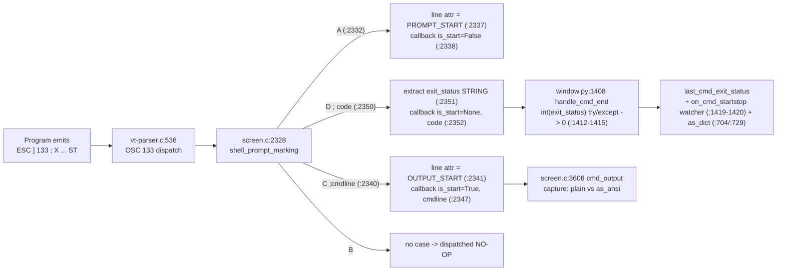

# How kitty Processes OSC 133 Shell-Integration Markers — A Runtime-Grounded Q&A

This document answers, with **actually-observed runtime output**, how the [kitty](https://github.com/kovidgoyal/kitty) terminal emulator handles the **OSC 133** shell-integration escape sequences (the FinalTerm "semantic prompt" markers) that programs use to mark command boundaries: `OSC 133;A` (prompt start), `OSC 133;B` (command/input start), `OSC 133;C` (command-output start), and `OSC 133;D[;<exit-code>]` (command finished, with an optional exit code).

**One-paragraph summary of the flow.** A program emits `ESC ] 133 ; <letter> [ ; params ] ST`. kitty's VT parser dispatches `OSC 133` at `kitty/vt-parser.c:536` and hands the payload (the text after `133;`) to `shell_prompt_marking(...)` at `kitty/screen.c:2328` (call site `kitty/vt-parser.c:544`). That C handler only sets a *line attribute* (`prompt_kind`) on the cursor's line and fires the `cmd_output_marking` Python callback — it never stores the control bytes in screen cell text. On the Python side (`kitty/window.py`), the `C` marker records the command line and the `D` marker's exit-status **string** flows into `handle_cmd_end(...)` (`kitty/window.py:1408`), where `int(exit_status)` (`kitty/window.py:1413`) converts it to an `int` (defaulting to `0` on any parse error via the surrounding `try/except`). Separately, the command *output* is captured on demand by `cmd_output(...)` (`kitty/screen.c:3606`), which returns the plain text of the output region and, in ANSI mode, a **re-synthesized** `ESC ] 133 ; C ST` boundary rather than the original bytes.

Every measured value below was produced by **building kitty and running the relevant code paths** through two throwaway probe scripts, then quoting the observed output verbatim. Nothing in the repository was modified; the probes lived outside the repository and were deleted afterward.

---

## 1. Verified Environment

All measurements were taken against a freshly built kitty at the repository HEAD.

- **Built native extension:** `python3 setup.py build` produced `kitty/fast_data_types.so`. Its size was measured directly with `stat -c '%s' kitty/fast_data_types.so` → **`1253792` bytes** in this environment. (The exact byte size of the compiled extension is build/compiler-flag dependent and is reported here only as evidence that the native extension built; it is not a value any question depends on.) `import kitty.fast_data_types` succeeds and exposes `Screen` (`hasattr(f, 'Screen') == True`) and `set_options`.
- **Python:** `3.13.7` — satisfies `pyproject.toml:2` (`requires-python = ">=3.8"`). `go.mod:3` declares `go 1.22`.
- **Revision:** HEAD = `815df1e21` ("Wire up applying of font config"); working branch derived from source branch `kitty_815df1e210e0`. `git status --porcelain` was **empty before and after** all experiments — the tracked tree is unchanged (the build emits only git-ignored artifacts such as `*.so` and `/build/`).
- **Build dependencies:** the authoritative apt list is `.github/workflows/ci.py:84-88` (supplemented by `libssl-dev` / `zlib1g-dev` for a fresh build), driven by `setup.py`.
- **`sys.maxsize` on this 64-bit build:** `9223372036854775807` (= 2**63 − 1). This value is used as a *sentinel* by the test harness (see §7) and is **not** a real exit code.
- **Ephemeral probes (deleted after use, never in the repository):** `/tmp/osc133_probe.py` (test-harness driver) and `/tmp/osc133_prod.py` (production-method driver).

> **Note on environment portability.** The byte-geometry, capture strings, recorded exit statuses, and the sentinel value below are determined by the byte stream and the C/Python code logic, not by the Python patch version; they reproduce identically regardless of whether the interpreter is 3.12.x or 3.13.x. Only the interpreter's own version banner (`PYTHON 3.13.7`) reflects this specific environment.

---

## 2. The Exact Emitted Marker Stream

The probes reproduce the user's example byte-for-byte. The **String Terminator** is `ST = ESC \` — two bytes `\x1b\x5c`, written `\x1b\\` in Python byte literals.

```
ESC ] 133 ; A                      ST   (prompt start)          — 9 bytes
ESC ] 133 ; B                      ST   (command/input start)   — 9 bytes  (NO-OP in kitty)
ESC ] 133 ; C ;cmdline=ls -la      ST   (command-output start)  — 24 bytes
some text                               (visible command output) — 9 bytes
ESC ] 133 ; D ; <code>             ST   (command finished)
```

Constructed in Python as (from `/tmp/osc133_probe.py`):

```python
def osc133(payload_after_133semi: bytes) -> bytes:
    # Full OSC 133 sequence: ESC ] 133 ; <payload> ST, with ST = ESC \ (two bytes)
    return b'\x1b]133;' + payload_after_133semi + b'\x1b\\'

A    = osc133(b'A')                    # prompt start                     -> 9 bytes
B    = osc133(b'B')                    # command/input start (NO-OP)      -> 9 bytes
C    = osc133(b'C;cmdline=ls -la')     # command-output start + cmdline   -> 24 bytes
TEXT = b'some text'                    # visible command output           -> 9 bytes
D    = osc133(b'D' + code_bytes)       # command finished, code_bytes = b';42', b';0', ...
```

Key reproduction details:

- The prefix `A + B + C + "some text"` (D excluded) is **51 bytes** — empirically `len(A)=9 len(B)=9 len(C)=24 len(TEXT)=9`, so `9 + 9 + 24 + 9 = 51`.
- **`ST = ESC \` (two bytes) vs `BEL` (one byte).** All totals below assume the two-byte `ESC \` terminator. Using the one-byte `BEL` (`\x07`) terminator instead would **shift every total down by one byte per marker** (four markers A/B/C/D emitted here → up to 4 bytes shorter), and would shift the `D`-marker offset accordingly. The choice of terminator does not change kitty's *behavior* (both `ESC \` and `BEL` terminate the OSC), only the byte counts.
- **No space before `;cmdline`.** The `C`-marker bytes must be exactly `\x1b]133;C;cmdline=ls -la\x1b\\` with **no space** between `C` and `;cmdline`. The spaced ASCII diagram above is only for readability. If a space were inserted, the C handler's prefix test `strstr(buf + 1, ";cmdline") == buf + 1` at `kitty/screen.c:2343` would fail and `last_cmd_cmdline` would not resolve to `'ls'`.
- The `cmdline=ls -la` payload is decoded to the first shell token `'ls'` by `decode_cmdline` (`kitty/window.py:225-228`: `x.partition('=')` then `next(shlex_split(val, True))`).

---

## 3. How kitty Processes OSC 133 (pipeline)



The dispatch payload handed to `shell_prompt_marking` is the text **after** `133;` (so for the D marker the handler sees `D;42`, `D;99`, `D;`, or bare `D`). The switch in `shell_prompt_marking` handles only `A`, `C`, and `D` — there is deliberately **no `B` case**, so `OSC 133;B` is a dispatched no-op. The exit code is handled in two layers: a pure **string** extraction in C (`kitty/screen.c:2351`) and an **`int()` conversion** in Python (`kitty/window.py:1413`).

---

## 4. Verbatim Observed Output

Two ephemeral probes produced every measured value in this document. They are quoted **verbatim** (unaltered) below. The only environment-specific line is the interpreter banner `PYTHON 3.13.7`; every other value (byte counts, offsets, capture strings, recorded statuses, sentinel) is code-determined and reproduces identically on any supported Python.

### 4.1 Test-harness driver — `/tmp/osc133_probe.py`

**Method.** `parse_bytes(screen, data)` from `kitty_tests/__init__.py:30` drives the exact byte stream through a real built `Screen` (`kitty.fast_data_types.Screen`, constructed as in `kitty_tests/__init__.py:237-240`). Command output is captured via `screen.cmd_output(0, list.append, as_ansi)` in both plain and ANSI modes (`which=0` = `CommandOutput.last_run`). The recorded exit status is read from a `Callbacks` instance (`kitty_tests/__init__.py:71-80`), whose `last_cmd_exit_status` is sentinel-initialized to `sys.maxsize` at `kitty_tests/__init__.py:48`. Line-0 cell text is read via `str(screen.line(0))`. Run with `python3 -B` (no `.pyc` written). **Command:**

```
PATH=$PATH:/usr/local/go/bin CI=true LANG=C.UTF-8 LC_ALL=C.UTF-8 python3 -B /tmp/osc133_probe.py
```

**Observed output (verbatim):**

```
PYTHON 3.13.7
SENTINEL (Callbacks init last_cmd_exit_status) = 9223372036854775807
len(A)=9 len(B)=9 len(C)=24 len(TEXT)=9
stream prefix bytes (A+B+C+text), D excluded = 51

== exit 0 ==
  input_total_len=62  D_OSC_byte_offset=51  b'D;0'_offset=57  exit_code_digit_offset=59
  recorded last_cmd_exit_status=0  last_cmd_cmdline='ls'
  capture as_ansi=False -> 'some text'
  capture as_ansi=True  -> '\x1b[m\x1b]133;C\x1b\\some text'
  screen cell text line0 -> 'some text'  (contains ESC? False; contains "133"? False)
== exit 1 ==
  input_total_len=62  D_OSC_byte_offset=51  b'D;1'_offset=57  exit_code_digit_offset=59
  recorded last_cmd_exit_status=1  last_cmd_cmdline='ls'
  capture as_ansi=False -> 'some text'
  capture as_ansi=True  -> '\x1b[m\x1b]133;C\x1b\\some text'
  screen cell text line0 -> 'some text'  (contains ESC? False; contains "133"? False)
== exit 42 ==
  input_total_len=63  D_OSC_byte_offset=51  b'D;42'_offset=57  exit_code_digit_offset=59
  recorded last_cmd_exit_status=42  last_cmd_cmdline='ls'
  capture as_ansi=False -> 'some text'
  capture as_ansi=True  -> '\x1b[m\x1b]133;C\x1b\\some text'
  screen cell text line0 -> 'some text'  (contains ESC? False; contains "133"? False)
== exit 99 ==
  input_total_len=63  D_OSC_byte_offset=51  b'D;99'_offset=57  exit_code_digit_offset=59
  recorded last_cmd_exit_status=99  last_cmd_cmdline='ls'
  capture as_ansi=False -> 'some text'
  capture as_ansi=True  -> '\x1b[m\x1b]133;C\x1b\\some text'
  screen cell text line0 -> 'some text'  (contains ESC? False; contains "133"? False)
== exit 127 ==
  input_total_len=64  D_OSC_byte_offset=51  b'D;127'_offset=57  exit_code_digit_offset=59
  recorded last_cmd_exit_status=127  last_cmd_cmdline='ls'
  capture as_ansi=False -> 'some text'
  capture as_ansi=True  -> '\x1b[m\x1b]133;C\x1b\\some text'
  screen cell text line0 -> 'some text'  (contains ESC? False; contains "133"? False)
== malformed not_a_number ==
  input_total_len=73  D_OSC_byte_offset=51  b'D;not_a_number'_offset=57  exit_code_digit_offset=59
  recorded last_cmd_exit_status=9223372036854775807  last_cmd_cmdline='ls'
  capture as_ansi=False -> 'some text'
  capture as_ansi=True  -> '\x1b[m\x1b]133;C\x1b\\some text'
  screen cell text line0 -> 'some text'  (contains ESC? False; contains "133"? False)
== malformed empty (D;) ==
  input_total_len=61  D_OSC_byte_offset=51  b'D;'_offset=57  exit_code_digit_offset=59
  recorded last_cmd_exit_status=9223372036854775807  last_cmd_cmdline='ls'
  capture as_ansi=False -> 'some text'
  capture as_ansi=True  -> '\x1b[m\x1b]133;C\x1b\\some text'
  screen cell text line0 -> 'some text'  (contains ESC? False; contains "133"? False)
== bare D (no ;) ==
  input_total_len=60  D_OSC_byte_offset=51  b'D'_offset=(none)  exit_code_digit_offset=(none)
  recorded last_cmd_exit_status=9223372036854775807  last_cmd_cmdline='ls'
  capture as_ansi=False -> 'some text'
  capture as_ansi=True  -> '\x1b[m\x1b]133;C\x1b\\some text'
  screen cell text line0 -> 'some text'  (contains ESC? False; contains "133"? False)
```

### 4.2 Production-method driver — `/tmp/osc133_prod.py`

**Method.** Binds the **real** `Window.cmd_output_marking` (`kitty/window.py:1453`) and `Window.handle_cmd_end` (`kitty/window.py:1408`) onto a minimal shim object (exposing only the attributes those methods touch), so the production exit-code recording logic runs unmodified. `set_options()` is called first (default `notify_on_cmd_finish.when == 'never'`, so the notification path at `kitty/window.py:1422-1451` never fires), `decode_cmdline` (`kitty/window.py:225`) is exercised, and both `last_cmd_exit_status` and the `on_cmd_startstop` watcher payload (`kitty/window.py:1419-1420`) are read back. For each code, the faithful flow is: call `cmd_output_marking(is_start=True, 'cmdline=ls -la')` (sets the output-start time and `last_cmd_cmdline='ls'`), then `handle_cmd_end(code)` (the D marker). The final line issues a stray `D` with **no** preceding `C`. **Command:**

```
PATH=$PATH:/usr/local/go/bin CI=true LANG=C.UTF-8 LC_ALL=C.UTF-8 python3 -B /tmp/osc133_prod.py
```

**Observed output (verbatim; inter-column spacing is cosmetic print-formatting — the values are the ground truth):**

```
PYTHON 3.13.7
decode_cmdline("cmdline=ls -la") -> 'ls'

production handle_cmd_end('0')   -> last_cmd_exit_status=0   (watcher exit_status=0, is_start=False)
production handle_cmd_end('1')   -> last_cmd_exit_status=1   (watcher exit_status=1, is_start=False)
production handle_cmd_end('42')  -> last_cmd_exit_status=42  (watcher exit_status=42, is_start=False)
production handle_cmd_end('99')  -> last_cmd_exit_status=99  (watcher exit_status=99, is_start=False)
production handle_cmd_end('127') -> last_cmd_exit_status=127 (watcher exit_status=127, is_start=False)
production handle_cmd_end('not_a_number') -> last_cmd_exit_status=0
production handle_cmd_end('')    -> last_cmd_exit_status=0
stray D with no preceding C -> last_cmd_exit_status=9223372036854775807 (unchanged sentinel), watcher_events=0
```

The stray-`D` line proves the early-return guard `if self.last_cmd_output_start_time == 0.: return` (`kitty/window.py:1409-1410`): a `D` with no preceding `C` records nothing (sentinel unchanged, zero watcher events).

---

## 5. Per-Question Answers

### Q1a — What does kitty's command-output capture return?

**Answer:** The plain-mode command-output capture is exactly **`'some text'`**, observed for every exit-code variation.

**Evidence.** Every `== ... ==` block in §4.1 shows:

```
  capture as_ansi=False -> 'some text'
```

**Citations / rationale.** The capture engine is the C function `cmd_output(Screen*, PyObject* args)` at `kitty/screen.c:3606`, backed by `find_cmd_output` at `kitty/screen.c:3527`. The Python wrapper `cmd_output(...)` at `kitty/window.py:457` calls `screen.cmd_output(which, lines.append, as_ansi, add_wrap_markers)` at `kitty/window.py:459`. The probe passes `which=0`, which selects the *last run* command output — the C `switch (which)` `case 0: // last run cmd` at `kitty/screen.c:3616-3620`, corresponding to the Python enum `CommandOutput.last_run = 0` at `kitty/window.py:275-276`. The output region begins at the `OUTPUT_START` line set by the `C` marker and contains only the drawn text `some text`.

### Q1b — Are the OSC 133 sequences still present in the capture?

**Answer:** **No.** A plain capture contains none of them (it is just `'some text'`). In **ANSI-preserving** mode the capture is a **re-synthesized** command-output boundary, not the original bytes: observed **`'\x1b[m\x1b]133;C\x1b\\some text'`** for every variation. Only a synthesized `\x1b]133;C\x1b\\` prefix appears — the `;cmdline=ls -la` payload and the `A` / `B` / `D` markers do **not** reappear.

**Evidence.** Every block in §4.1 shows both modes:

```
  capture as_ansi=False -> 'some text'
  capture as_ansi=True  -> '\x1b[m\x1b]133;C\x1b\\some text'
```

**Citations / rationale.**
- The ANSI form matches the canonical shape asserted by the existing test at `kitty_tests/screen.py:1124`: `'\x1b[m\x1b]133;C\x1b\\abcd\n\x1b[m12'`. Crucially, that test *feeds* its markers with the **`BEL`** terminator (`\007`, e.g. `b'\033]133;C\007'` at `kitty_tests/screen.py:1063`) yet the capture regenerates `\x1b\\` (`ESC \`). Producing a terminator that was never fed proves the boundary is **re-synthesized**, not byte-preserved.
- The wrapper's leading-`\x1b]133;C` strip at `kitty/window.py:464-467` (`if x.startswith('\x1b]133;C'): lines[i] = x.partition('\\')[-1]`) does **not** trigger here, because the real captured string begins with the SGR reset `\x1b[m` *before* `\x1b]133;C` — the strip only fires when a line literally `.startswith('\x1b]133;C')`, and `'\x1b[m\x1b]133;C...'` does not. This is why the synthesized `\x1b]133;C\x1b\\` prefix survives into the returned ANSI string.

### Q1c — Are the raw OSC 133 control bytes stored in the screen's cell text?

**Answer:** **No.** The parser consumes them; they set only a line attribute and fire a callback, and are never written into cells. The line-0 cell text is exactly `'some text'`, with **no** `ESC` byte and **no** `"133"` substring — observed for every variation.

**Evidence.** Every block in §4.1 shows:

```
  screen cell text line0 -> 'some text'  (contains ESC? False; contains "133"? False)
```

**Citations / rationale.** The handler `shell_prompt_marking(Screen *self, char *buf)` at `kitty/screen.c:2328` sets `self->linebuf->line_attrs[self->cursor->y].prompt_kind` — `PROMPT_START` for `A` (assigned at `kitty/screen.c:2337`) and `OUTPUT_START` for `C` (`kitty/screen.c:2341`) — and fires `CALLBACK("cmd_output_marking", ...)`. It writes nothing to cell storage. It is dispatched from `kitty/vt-parser.c:536` (`case 133:`) via `kitty/vt-parser.c:544` (`shell_prompt_marking(self->screen, (char*)buf + i)`), where the argument is the payload text after `133;`. Because the bytes are handled entirely as an OSC control string, they never enter the grid of character cells.

### Q1d / Q2b — Total byte length and the byte offset of the `D` marker; does the offset shift?

**Answer:** The `D` marker's `ESC ]` **always begins at byte offset `51`** — constant, independent of the exit code — because the preceding `A + B + C + "some text"` prefix is a fixed **51 bytes**. Within the `D` marker, the literal `D;` begins at byte **`57`** and the **exit-code digits begin at byte `59`**. As the exit code widens, **only the total length and the trailing `ST` position move**; the marker offset and the digit start offset never move.

**Evidence.** Every block in §4.1 reports the same `D_OSC_byte_offset=51` and `exit_code_digit_offset=59`, e.g. for the user's `D;42` example:

```
== exit 42 ==
  input_total_len=63  D_OSC_byte_offset=51  b'D;42'_offset=57  exit_code_digit_offset=59
```

**Derivation (explicitly derived, then confirmed by the observed offsets above).** Indexing 0-based into the emitted byte stream, the `D` marker starts immediately after the 51-byte prefix, so:

| byte offset | 51 | 52 | 53 | 54 | 55 | 56 | 57 | 58 | 59 |
|-------------|----|----|----|----|----|----|----|----|----|
| byte        | `\x1b` (ESC) | `]` | `1` | `3` | `3` | `;` | `D` | `;` | first digit |

So the `D;42` marker (the substring the user asked about) begins at offset **57**, and the exit-code number begins at offset **59**. These derived offsets equal the observed `b'D;42'_offset=57` and `exit_code_digit_offset=59`. The total byte length **does** change with the code width (see Q2a); the marker/digit offsets do **not**.

### Q2a — Byte lengths per exit code (empirically observed)

**Answer:** The totals and offsets, taken directly from §4.1, are:

| `D` argument     | Total bytes | `D` marker OSC offset | exit-code digit offset | Recorded (production) | Recorded (test harness) |
|------------------|-------------|-----------------------|------------------------|-----------------------|--------------------------|
| `0`              | 62 | 51 | 59 | `0`   | `0` |
| `1`              | 62 | 51 | 59 | `1`   | `1` |
| `42`             | 63 | 51 | 59 | `42`  | `42` |
| `99`             | 63 | 51 | 59 | `99`  | `99` |
| `127`            | 64 | 51 | 59 | `127` | `127` |
| `not_a_number`   | 73 | 51 | 59 | `0`   | `9223372036854775807` (sentinel unchanged) |
| `` (empty, `D;`) | 61 | 51 | 59 (zero-length digit region; `ST` follows immediately) | `0` | `9223372036854775807` (unchanged) |
| bare `D` (no `;`) | 60 | 51 | (none) | `0` | `9223372036854775807` (unchanged) |

**Rationale.** The total grows by **exactly one byte per additional digit** — single-digit codes `0`/`1` → 62, double-digit `42`/`99` → 63, triple-digit `127` → 64 — while the exit-code number's start offset (`59`) never moves. For the malformed/empty/bare cases the total simply reflects the length of the substituted argument (`not_a_number` is 12 characters → 73; empty `D;` → 61; bare `D` → 60).

**Two nuances confirmed by observed output:**
- **Empty `D;`:** byte 59 is where digits *would* begin, but the region is empty (a zero-length region, with `ST` immediately after). The probe still reports `exit_code_digit_offset=59` (see §4.1 `== malformed empty (D;) ==`).
- **Bare `D` (no `;`):** there is genuinely no `D;` substring, so both the marker-argument offset and the digit offset are `(none)` — observed `b'D'_offset=(none)  exit_code_digit_offset=(none)`. (The `D` marker's `ESC ]` still begins at offset 51, as `D_OSC_byte_offset=51` shows; it is only the *`D;<code>` argument* that is absent.)

The "Recorded" columns differ between production and the test harness for the malformed/empty/bare rows; that divergence is fully explained in §6 (and answered directly in Q3).

### Q2c — Runtime evidence that exit code 99 was processed end-to-end

**Answer:** Two independent runs recorded `99` as an **`int`**, and the value additionally surfaced on the command-finished watcher payload — proving `99` flowed through the entire C-string-extraction → Python-`int()` → recording → broadcast path.

**Evidence (verbatim).** From the test-harness driver (§4.1):

```
== exit 99 ==
  input_total_len=63  D_OSC_byte_offset=51  b'D;99'_offset=57  exit_code_digit_offset=59
  recorded last_cmd_exit_status=99  last_cmd_cmdline='ls'
```

From the production-method driver (§4.2):

```
production handle_cmd_end('99')  -> last_cmd_exit_status=99  (watcher exit_status=99, is_start=False)
```

**Citations / rationale — the two-layer trace `99` takes:**
1. **Parser dispatch.** `OSC 133` dispatched at `kitty/vt-parser.c:536`; payload `D;99` handed to `shell_prompt_marking` at `kitty/vt-parser.c:544`.
2. **C-side string extraction (never parses an integer).** In the `D` case (`kitty/screen.c:2350-2353`): `const char *exit_status = buf[1] == ';' ? buf + 2 : "";` (`kitty/screen.c:2351`) yields the C string `"99"`, then `CALLBACK("cmd_output_marking", "Os", Py_None, exit_status)` (`kitty/screen.c:2352`) hands it to Python.
3. **Python callback routing.** `Window.cmd_output_marking(is_start=None, cmdline="99")` at `kitty/window.py:1453`; since `is_start` is falsy, the `else` branch calls `self.handle_cmd_end("99")` (`kitty/window.py:1460-1461`).
4. **Python `int()` conversion.** `handle_cmd_end` runs `self.last_cmd_exit_status = int(exit_status)` at `kitty/window.py:1413` → `int("99") == 99`.
5. **Recording + broadcast + serialization.** The value is stored in `last_cmd_exit_status`, broadcast on the `on_cmd_startstop` watcher payload (`'exit_status': self.last_cmd_exit_status`) at `kitty/window.py:1419-1420` (observed as `watcher exit_status=99, is_start=False`), and serialized in `Window.as_dict` at `kitty/window.py:704` and `kitty/window.py:729`.

The watcher-payload `exit_status=99` (a value only reachable *after* the full C→Python→`int()` path) is the concrete runtime proof that the specific value `99` was processed end-to-end.

### Q3 — Malformed exit codes: `OSC 133;D;not_a_number` and `OSC 133;D;` (empty)

**Answer:** In **production**, both `int('not_a_number')` and `int('')` raise and are caught, so `last_cmd_exit_status` is recorded as **`0`**. In the **test harness**, the same malformed inputs leave the sentinel `9223372036854775807` (`sys.maxsize`) **unchanged**. The document reports both; the **production result is `0`**.

**Evidence (verbatim).** Production (§4.2):

```
production handle_cmd_end('not_a_number') -> last_cmd_exit_status=0
production handle_cmd_end('')    -> last_cmd_exit_status=0
```

Test harness (§4.1) — the recorder is untouched, so the sentinel remains:

```
== malformed not_a_number ==
  ... recorded last_cmd_exit_status=9223372036854775807  ...
== malformed empty (D;) ==
  ... recorded last_cmd_exit_status=9223372036854775807  ...
```

**Citations / rationale.**
- **Production (`Window`):** the conversion is wrapped in a `try/except` at `kitty/window.py:1412-1415`:
  ```python
  try:
      self.last_cmd_exit_status = int(exit_status)   # :1413
  except Exception:
      self.last_cmd_exit_status = 0                  # :1415
  ```
  `int('not_a_number')` and `int('')` both raise `ValueError`, caught by `except Exception`, so the recorded value is **`0`**.
- **Test harness (`Callbacks`):** the recorder uses `with suppress(Exception): self.last_cmd_exit_status = int(data)` at `kitty_tests/__init__.py:78-79`, over the sentinel initialized to `sys.maxsize` at `kitty_tests/__init__.py:48`. When `int()` raises, `suppress(Exception)` swallows it and the assignment never happens, so `last_cmd_exit_status` **remains the sentinel** `9223372036854775807`. (The recorder is also only entered when a prior `C` set `last_cmd_at != 0`, per the guard at `kitty_tests/__init__.py:76`.)

So the answer to "what value gets recorded" is **`0` in the real product**; the harness's `9223372036854775807` is a *sentinel meaning "unchanged"*, not a recorded exit code.

---

## 6. Test-harness vs Production Distinction

Two different code paths *record* the exit status, and they behave differently on malformed input. This is stated explicitly so the harness sentinel is never mistaken for the production result:

| Aspect | Production (`kitty/window.py` `Window`) | Test harness (`kitty_tests/__init__.py` `Callbacks`) |
|--------|------------------------------------------|-------------------------------------------------------|
| Conversion site | `try: ... int(exit_status) ... except Exception: = 0` (`:1412-1415`) | `with suppress(Exception): ... int(data)` (`:78-79`) |
| Initial value | `self.last_cmd_exit_status = 0` (`:572`) | `self.last_cmd_exit_status = sys.maxsize` (`:48`) |
| Valid code (e.g. `99`) | records the `int` (`99`) | records the `int` (`99`) |
| Malformed / empty / bare | records **`0`** (except branch) | leaves the **sentinel** `9223372036854775807` unchanged (assignment skipped) |
| Entry guard | `if self.last_cmd_output_start_time == 0.: return` (`:1409-1410`) | `if self.last_cmd_at != 0:` (`:76`) |

- The harness sentinel value `9223372036854775807` is `sys.maxsize` on this 64-bit build (2**63 − 1); it is **not** a real exit code — it is the harness's way of signaling "no valid value was recorded".
- Both paths agree exactly for well-formed codes (`0`, `1`, `42`, `99`, `127`). They diverge only for the malformed/empty/bare cases, and only because one path assigns `0` in its `except` while the other simply skips the assignment.

---

## 7. Verified `file:line` Citation Map

All references confirmed against the source at HEAD `815df1e21`.

**C layer**
- `kitty/vt-parser.c:536` — `case 133:` (OSC 133 dispatch); `:539` — `REPORT_OSC2(shell_prompt_marking, code, mv);`; `:544` — `shell_prompt_marking(self->screen, (char*)buf + i);` (payload = text after `133;`).
- `kitty/screen.c:2316` — `parse_prompt_mark`; `:2328` — `shell_prompt_marking(Screen *self, char *buf)`. Cases: `A` `:2332` (→`PROMPT_START`; assigned `:2337`; `CALLBACK(..., "O", Py_False)` `:2338`), `C` `:2340` (→`OUTPUT_START` `:2341`; `;cmdline` prefix match `strstr(buf + 1, ";cmdline") == buf + 1` `:2343`, `cmdline = buf + 2` `:2344`; `CALLBACK(..., "OO", Py_True, c)` `:2347`), `D` `:2350` (`const char *exit_status = buf[1] == ';' ? buf + 2 : "";` `:2351`; `CALLBACK(..., "Os", Py_None, exit_status)` `:2352`; `} break;` `:2353`). **There is NO `B` case → `OSC 133;B` is a dispatched NO-OP** (the switch handles only `A`/`C`/`D`).
- `kitty/screen.c:3527` — `find_cmd_output`; `:3606` — `cmd_output(Screen*, PyObject* args)`; `:3616-3620` — `switch (which) { case 0: // last run cmd }`.
- `kitty/history.c:475` — `reverse_find(buf, sz, (const uint8_t*)"\x1b]133;C\x1b\\")` (scrollback detects the `C` boundary; context only).

**Python layer (`kitty/window.py`)**
- `:225` — `decode_cmdline` (`ctype, sep, val = x.partition('=')` `:226`; `if ctype == 'cmdline': return next(shlex_split(val, True))` `:227-228`) → `cmdline=ls -la` → `'ls'`.
- `:457` — module `cmd_output(screen, which=CommandOutput.last_run, as_ansi=False, add_wrap_markers=False)`; `:459` calls the C `screen.cmd_output(...)`; `:464-467` strips a leading bare `\x1b]133;C` prefix (does **not** trigger on SGR-prefixed real output).
- `:275-276` — `class CommandOutput(IntEnum)` with `last_run = 0` (this enum lives in Python, not in `fast_data_types`; the C `cmd_output` takes an integer `which`).
- `:244` — annotation `last_cmd_exit_status: int`; `:572` — init `self.last_cmd_exit_status = 0`; `:704` and `:729` — `as_dict` serializes `'last_cmd_exit_status'`.
- `:1408` — `handle_cmd_end`; `:1409-1410` — early-return guard `if self.last_cmd_output_start_time == 0.: return`; `:1412` `try:`, `:1413` `self.last_cmd_exit_status = int(exit_status)`, `:1414` `except Exception:`, `:1415` `= 0`; `:1419-1420` — `on_cmd_startstop` watcher payload (`'exit_status': self.last_cmd_exit_status`). (The AAP loosely cited the `int()` call as `L1412`; it is precisely on `:1413`, within the `:1412-1415` `try/except` block.)
- `:1453` — `cmd_output_marking(self, is_start, cmdline='')`: `is_start=True` → C-start path (`last_cmd_output_start_time` `:1456`, `decode_cmdline` `:1457`, `last_cmd_cmdline` `:1458`, start watcher `:1459`); `else` → `self.handle_cmd_end(cmdline)` `:1460-1461`.

**Test harness (`kitty_tests/__init__.py`)**
- `:30` — `parse_bytes(screen, data, dump_callback=None)` (wraps `data` in `memoryview` at `:31`); `:48` — sentinel `self.last_cmd_exit_status = sys.maxsize` (re-init in `clear()` at `:106`); `:71-80` — `Callbacks.cmd_output_marking` with guard `if self.last_cmd_at != 0:` (`:76`) and `with suppress(Exception): self.last_cmd_exit_status = int(data)` (`:78-79`); `:237-240` — `create_screen` (`c = Callbacks()` `:239`; `Screen(c, lines, cols, scrollback, cell_width, cell_height, 0, c)` `:240`).
- `kitty_tests/screen.py:1056` — `test_prompt_marking` (feeds the `BEL` terminator `\007`, e.g. `b'\033]133;C\007'` at `:1063`); `:1124` — canonical ANSI capture assertion `'\x1b[m\x1b]133;C\x1b\\abcd\n\x1b[m12'`.

**Emit / context & build**
- `kitty/client.py:250-251` — `def shell_prompt_marking(payload): write_osc(133, payload)` (kitten emit side; context).
- `kitty/shell_integration.py:218` — `modify_shell_environ(opts, env, argv)` (shell-side emission enablement; context).
- `.github/workflows/ci.py:84-88` — authoritative apt build-dependency list; `setup.py` — build entry point; `pyproject.toml:2` — `requires-python = ">=3.8"`; `go.mod:3` — `go 1.22`.

---

## 8. Web-research Corroboration (supplementary)

This corroborates — it does **not** replace — the code findings above. The OSC 133 / FinalTerm "semantic prompt" markers are conventionally defined as: `A` = `FTCS_PROMPT` (prompt start), `B` = `FTCS_COMMAND_START` (command/input start), `C` = `FTCS_COMMAND_EXECUTED` (command-output start), and `D[;code]` = `FTCS_COMMAND_FINISHED` (finished, optional exit code). kitty implements `A` / `C` / `D` and has **no `B` handler** — consistent with `B` being an optional input-region marker that emulators may ignore. The sequence form is `OSC 133 ; <Command> [ ; params ] ST`, where `OSC = ESC ]` and `ST = ESC \` (two bytes) or `BEL` (one byte) — matching the two-byte terminator assumption used for the byte counts here.

---

## 9. Coverage Pass

Every distinct sub-question is answered explicitly above:

- [x] **Q1a — Captured content:** plain-mode capture is exactly `'some text'` (§5 Q1a; evidence §4.1).
- [x] **Q1b — Marker presence:** no in plain mode; ANSI mode returns a *re-synthesized* `'\x1b[m\x1b]133;C\x1b\\some text'` (no `A`/`B`/`D`, no `;cmdline`) (§5 Q1b).
- [x] **Q1c — Cell-text preservation:** no — cell text is `'some text'`, contains no `ESC` and no `"133"`; bytes only set line attributes + fire a callback (§5 Q1c).
- [x] **Q1d — Byte offset of the `D` marker:** total 63 bytes for the `D;42` example; the `D` marker begins at offset **51**, `D;42` at **57**, digits at **59**; the marker/digit offsets do **not** shift with the code (§5 Q1d/Q2b).
- [x] **Q2a — Byte lengths per exit code:** `0`→62, `1`→62, `42`→63, `99`→63, `127`→64 (plus `not_a_number`→73, empty→61, bare `D`→60); marker offset 51, digit offset 59 throughout (§5 Q2a table).
- [x] **Q2b — Does the exit-code position shift, and by how much?** The exit-code digit offset stays at **59** (no shift); only the total length grows, by exactly **one byte per extra digit** (§5 Q1d/Q2b + Q2a).
- [x] **Q2c — Exit code 99 evidence:** recorded `last_cmd_exit_status=99` in both drivers, plus watcher `exit_status=99, is_start=False`; traced C-string `"99"` → `int("99")==99` → recorded/broadcast/serialized (§5 Q2c).
- [x] **Q3 — Malformed exit codes:** production records **`0`** for both `not_a_number` and empty (`try/except`); the test harness leaves the `sys.maxsize` sentinel `9223372036854775807` unchanged (`suppress(Exception)`) (§5 Q3, §6).

**Derived vs observed.** All byte totals, offsets, capture strings, and recorded statuses are **observed** (quoted from §4). The only **derived** element is the per-byte offset breakdown table in Q1d (the individual byte-position mapping), which is arithmetic on the observed 51-byte prefix and is confirmed by the observed `b'D;42'_offset=57` / `exit_code_digit_offset=59`. Nothing in this document is asserted without either a `file:line` citation or a verbatim observed value.

**Terminator assumption.** All byte counts assume `ST = ESC \` (two bytes). Using `BEL` (`\x07`, one byte) as the terminator would reduce each total by one byte per marker; it does not change kitty's behavior or the recorded exit statuses.

---

## 10. Repository Left Read-Only

This investigation was strictly read-only. This markdown file — `blitzy/documentation/kitty_815df1e210e0.md` — is the **only** file created; no existing repository file was modified or deleted. The build produced only git-ignored artifacts (`*.so`, `/build/`), so `git status --porcelain` was empty before and after the experiments. The two ephemeral probe scripts lived **outside** the repository at `/tmp/osc133_probe.py` and `/tmp/osc133_prod.py` and were **deleted** after the investigation concluded.
