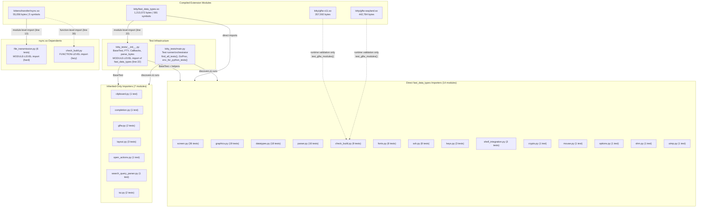

# Kitty Build-and-Test Architecture: Comprehensive Q&A

## Document Metadata

| Field | Value |
|---|---|
| **Document** | `kitty_815df1e210e0.md` |
| **Branch** | `kitty_815df1e210e0` |
| **Created** | 2025 |
| **Purpose** | Comprehensive investigation and documentation of kitty's build-and-test architecture, extension module dependencies, test execution flow, and failure cascade patterns |
| **Methodology** | All findings are based on direct source code inspection, live build execution, and test suite analysis — no assumptions are made |

---

## Table of Contents

- [Executive Summary](#executive-summary)
- [1. Build Architecture Overview](#1-build-architecture-overview)
  - [1.1 Build System Entry Points](#11-build-system-entry-points)
  - [1.2 Compilation Pipeline](#12-compilation-pipeline)
  - [1.3 Test Action Flow](#13-test-action-flow)
- [2. Compiled Extension Module Inventory](#2-compiled-extension-module-inventory)
  - [2.1 Artifact Summary Table](#21-artifact-summary-table)
  - [2.2 C Source File Categories](#22-c-source-file-categories)
- [3. C Module Initialization Chain](#3-c-module-initialization-chain)
  - [3.1 PyInit_fast_data_types Overview](#31-pyinit_fast_data_types-overview)
  - [3.2 Sequential Initialization Calls](#32-sequential-initialization-calls)
  - [3.3 Post-Initialization Constants](#33-post-initialization-constants)
- [4. Extension-to-Test Dependency Map](#4-extension-to-test-dependency-map)
  - [4.1 The Critical __init__.py Cascade](#41-the-critical-__init__py-cascade)
  - [4.2 Direct Importers of fast_data_types](#42-direct-importers-of-fast_data_types)
  - [4.3 Inherited-Only Importers](#43-inherited-only-importers)
  - [4.4 rsync.so Dependents](#44-rsyncso-dependents)
- [5. Failure Cascade Patterns](#5-failure-cascade-patterns)
  - [5.1 Scenario Analysis Table](#51-scenario-analysis-table)
  - [5.2 Key Architectural Insight](#52-key-architectural-insight)
- [6. Test Category Classification](#6-test-category-classification)
  - [6.1 Comprehensive Classification Table](#61-comprehensive-classification-table)
  - [6.2 Infrastructure and Excluded Files](#62-infrastructure-and-excluded-files)
- [7. Test Execution Flow](#7-test-execution-flow)
  - [7.1 Entry Point Chain](#71-entry-point-chain)
  - [7.2 Python Test Discovery](#72-python-test-discovery)
  - [7.3 Concurrent Go Test Execution](#73-concurrent-go-test-execution)
  - [7.4 Test Environment Isolation](#74-test-environment-isolation)
  - [7.5 Python Test Runner](#75-python-test-runner)
- [8. Go Test Suite Structure](#8-go-test-suite-structure)
  - [8.1 Overview](#81-overview)
  - [8.2 Package-by-Package Table](#82-package-by-package-table)
- [9. Build and Test Execution Observations](#9-build-and-test-execution-observations)
  - [9.1 Build Observations](#91-build-observations)
  - [9.2 Native Dependencies Required](#92-native-dependencies-required)
  - [9.3 Test Results Summary](#93-test-results-summary)
- [10. Architectural Diagrams](#10-architectural-diagrams)
  - [10.1 Extension-to-Test Dependency Diagram](#101-extension-to-test-dependency-diagram)
  - [10.2 Test Execution Flow Diagram](#102-test-execution-flow-diagram)
  - [10.3 Build Pipeline Diagram](#103-build-pipeline-diagram)
- [11. Key Findings and Summary](#11-key-findings-and-summary)
  - [11.1 Critical Architectural Insights](#111-critical-architectural-insights)
  - [11.2 Strengths and Design Trade-offs](#112-strengths-and-design-trade-offs)

---

## Executive Summary

Kitty is a GPU-accelerated terminal emulator built with a three-language architecture: **C11** for performance-critical terminal engine logic, **Python ≥3.8** for configuration, scripting, and test orchestration, and **Go 1.22** for CLI tooling and the native launcher binary. The entire build system is orchestrated by `setup.py` (2,172 lines as measured by `wc -l`; the file spans to line 2173 in editor view), which serves as the central compilation coordinator for all extension modules, GLFW windowing backends, kitten extensions, and Go binaries.

The build produces five key artifacts: `kitty/fast_data_types.so` (~1.2 MB, 581 exported symbols compiled from 49 C source files), `kitty/glfw-x11.so` (~358 KB, X11 windowing backend), `kitty/glfw-wayland.so` (~443 KB, Wayland windowing backend), `kittens/transfer/rsync.so` (~55 KB, 5 symbols for the rsync delta transfer algorithm), and `kitty/launcher/kitty` (~36 KB, the Go-compiled native launcher). These compiled extension modules bridge the C-Python boundary, exposing high-performance terminal operations (screen management, font rendering, graphics protocol, cryptography, keyboard handling) to the Python layer.

The test suite consists of **25 Python files** in `kitty_tests/` (of which 22 are test modules, 1 is infrastructure `__init__.py`, 1 is the runner `main.py`, and 1 is the excluded `gr.py`) alongside **49 Go test files** distributed across **26 packages**. Python tests execute sequentially via `unittest.TextTestRunner`, while Go tests run concurrently in a separate `GoProc` thread. The critical architectural finding is that `kitty/fast_data_types.so` is the **single point of failure** for the entire Python test suite: its module-level import in `kitty_tests/__init__.py` (line 22) means that every test module — even those that never directly use native extension symbols — depends on this shared library being present and loadable.

This document presents a complete analysis of the build-to-test dependency graph, extension module initialization chains, failure cascade patterns, and test category classifications, all derived from direct source code inspection and live build/test execution within the repository.

---

## 1. Build Architecture Overview

### 1.1 Build System Entry Points

Kitty's build system has three primary entry points, each serving a distinct role in the developer workflow:

#### 1.1.1 Makefile (71 lines)

The `Makefile` is a thin convenience wrapper that delegates all real work to `setup.py`. It provides developer-friendly targets:

| Target | Command Invoked | Purpose |
|---|---|---|
| `make all` (default) | `python3 setup.py $(VVAL)` | Full build — compile all extensions, GLFW backends, kittens, Go binaries |
| `make test` | `python3 setup.py $(VVAL) test` | Run full test suite (Python + Go) |
| `make clean` | `python3 setup.py $(VVAL) clean` | Remove all build artifacts |
| `make debug` | `python3 setup.py build $(VVAL) --debug` | Build with debug symbols |
| `make asan` | `python3 setup.py build $(VVAL) --debug --sanitize` | Build with AddressSanitizer and UndefinedBehaviorSanitizer |
| `make profile` | `python3 setup.py build $(VVAL) --profile` | Build with profiling instrumentation |
| `make app` | `python3 setup.py kitty.app $(VVAL)` | Build macOS application bundle |
| `make linux-package` | `python3 setup.py linux-package` | Build Linux distribution package |
| `make man` | `$(MAKE) -C docs man` | Build man pages via Sphinx |
| `make html` | `$(MAKE) -C docs html` | Build HTML documentation via Sphinx |
| `make prepare-for-cross-compile` | `clean` then `all` then `python3 setup.py clean --clean-for-cross-compile` | Prepare build state for cross-compilation |
| `make cross-compile` | `python3 setup.py linux-package --skip-code-generation` | Cross-compile from prepared state |

**Evidence**: `Makefile` lines 12-71 define these targets. The verbose flag (`VVAL`) is conditionally set from `V` or `VERBOSE` environment variables (lines 1-6).

#### 1.1.2 setup.py (2,172 lines)

This is the **central build orchestrator**. It is a standalone Python script (not using setuptools/distutils) that directly manages the entire compilation pipeline. Key responsibilities:

- **Compiler environment detection and configuration** — Detects GCC/Clang, sets optimization flags, handles platform-specific compilation (lines 995-1001 via `init_env_from_args()`)
- **C extension compilation** — Discovers and compiles 49+ C source files into `kitty/fast_data_types.so` (line 1090-1093 via `compile_c_extension()`)
- **GLFW backend compilation** — Compiles windowing backends for X11 and Wayland on Linux, or Cocoa on macOS (line 1094 via `compile_glfw()`)
- **Kitten extension compilation** — Compiles the rsync transfer algorithm into `kittens/transfer/rsync.so` (line 1095 via `compile_kittens()`)
- **Go binary building** — Builds the native launcher and static kitten binaries (lines 2120-2121 via `build_launcher()` and `build_static_kittens()`)
- **Incremental compilation support** — Uses `CompilationDatabase` (line 81) to track compilation commands and only recompile changed files
- **Test invocation** — Launches the test runner by replacing the current process with the built kitty launcher (lines 2101-2103)

**Evidence**: The `main()` function at line 2159 calls `do_build(args)` at line 2168. `do_build()` at line 2098 handles all action dispatch.

#### 1.1.3 pyproject.toml

This file declares project-level Python configuration:

- **Python version constraint**: `requires-python = ">=3.8"` (line 2) — enforced at `setup.py` runtime by `check_version_info()` (line 30)
- **Mypy strict configuration**: Lines 4-20 enable strict type checking with `strict = true`, `disallow_untyped_defs = true`, `warn_return_any = true`, etc.
- **Ruff linting**: `line-length = 160` (line 29)
- **Type checking exclusion**: `kitty_tests/*` is excluded from `pylsp-mypy` (line 25)

### 1.2 Compilation Pipeline

The build pipeline follows a strict function call chain within `setup.py`:

```
main() [line 2159]
  └─ do_build(args) [line 2098/2168]
       └─ For 'build' action [line 2115]:
            CompilationDatabase(incremental) as cdb [line 2113]
              └─ build(args) [line 1084/2116]
                   ├─ init_env_from_args(args) [line 1086/995]
                   │    └─ Detects compiler, sets CFLAGS, LDFLAGS, CPPFLAGS
                   ├─ find_c_files() [line 906/1087]
                   │    └─ Discovers 49+ C source files from kitty/ directory
                   │    └─ Excludes platform-specific files (lines 909-913)
                   │    └─ Includes 3rdparty sources (lines 922-928)
                   ├─ compile_c_extension() [line 856/1090-1093]
                   │    └─ Compiles to kitty/fast_data_types.so
                   │    └─ Uses parallel compilation via parallel_run() [line 120]
                   ├─ compile_glfw() [line 932/1094]
                   │    └─ Compiles kitty/glfw-x11.so and kitty/glfw-wayland.so
                   │    └─ Wayland silently disabled if protocol generation fails (lines 948-951)
                   └─ compile_kittens() [line 967/1095]
                        └─ Compiles kittens/transfer/rsync.so linked against libxxhash (line 986)
              └─ build_launcher(args) [line 2120]
              └─ build_static_kittens(args) [line 2121]
```

#### Platform-Specific File Exclusion

The `find_c_files()` function (line 906) performs platform-conditional exclusion:

```python
# setup.py lines 909-913
exclude = {
    'fontconfig.c', 'freetype.c', 'desktop.c', 'freetype_render_ui_text.c'
} if is_macos else {
    'core_text.m', 'cocoa_window.m', 'macos_process_info.c'
}
```

**On Linux** (the platform used for this investigation):
- **Excluded**: `core_text.m` (macOS CoreText font engine), `cocoa_window.m` (macOS window management), `macos_process_info.c` (macOS process information)
- **Included**: `fontconfig.c`, `freetype.c`, `desktop.c`, `freetype_render_ui_text.c` (Linux-specific font/desktop subsystems)

After discovering files from `kitty/`, the function appends additional sources (lines 920-928):
- `kitty/vt-parser-dump.c` (line 920)
- `3rdparty/ringbuf/ringbuf.c` (line 923) — Ring buffer implementation
- `3rdparty/base64/lib/arch/*/codec.c` (line 925) — Architecture-specific base64 codecs
- `3rdparty/base64/lib/tables/tables.c` (line 926)
- `3rdparty/base64/lib/codec_choose.c` (line 927)
- `3rdparty/base64/lib/lib.c` (line 928)

#### Compilation Parallelization

The `CompilationDatabase.build_all()` method (line 108) sorts compilation commands by file size in descending order (lines 110-113, 119) and then dispatches them through `parallel_run()` (line 120), which utilizes all available CPU cores for concurrent compilation. This ensures the largest files begin compiling first, optimizing total build time.

#### GLFW Backend Compilation

The `compile_glfw()` function (line 932) iterates over windowing modules:

```python
# setup.py lines 933-954
modules = 'cocoa' if is_macos else 'x11 wayland'
for module in modules.split():
    try:
        genv = glfw.init_env(env, pkg_config, pkg_version, at_least_version, test_compile, module)
    except SystemExit as err:
        if module != 'wayland':
            raise
        print(err, file=sys.stderr)
        print(error('Disabling building of wayland backend'), file=sys.stderr)
        continue
```

**Key observation**: The Wayland backend can be **silently disabled** without aborting the build (lines 938-941). If GLFW environment initialization fails for wayland, the error is printed but compilation continues with only the X11 backend. Similarly, if Wayland protocol generation fails (lines 948-951), the same graceful degradation occurs.

#### Kitten Extension Compilation

The `compile_kittens()` function (line 967) compiles the rsync transfer kitten:

```python
# setup.py lines 985-992
for kitten, sources, all_headers, dest, includes, libraries in (
    files('transfer', 'rsync', libraries=pkg_config('libxxhash', '--libs'),
          includes=pkg_config('libxxhash', '--cflags-only-I')),
):
    ...
    compile_c_extension(
        final_env, dest, args.compilation_database, sources,
        all_headers + ['kitty/data-types.h'], build_dsym=args.build_dsym)
```

The rsync extension links against `libxxhash` for fast hashing (line 986) and includes `kitty/data-types.h` for shared type definitions (line 992).

### 1.3 Test Action Flow

When the build action is `test`, `do_build()` takes a special path:

```python
# setup.py lines 2101-2103
if args.action == 'test':
    texe = os.path.abspath(os.path.join(launcher_dir, 'kitty'))
    os.execl(texe, texe, '+launch', 'test.py')
```

This **replaces the current process** (`os.execl`) with the built kitty launcher, passing `+launch` and `test.py` as arguments. The `+launch` flag tells the kitty launcher to execute a Python script rather than start the terminal emulator.

**Evidence**: `test.py` (13 lines) then takes over:

```python
# test.py lines 1-13
#!./kitty/launcher/kitty +launch
# License: GPL v3 Copyright: 2016, Kovid Goyal <kovid at kovidgoyal.net>

import importlib

def main() -> None:
    m = importlib.import_module('kitty_tests.main')
    getattr(m, 'main')()

if __name__ == '__main__':
    main()
```

The shebang (`#!./kitty/launcher/kitty +launch`) ensures direct execution also uses the built launcher. The script dynamically imports `kitty_tests.main` and calls its `main()` function, which orchestrates the entire test suite.

---

## 2. Compiled Extension Module Inventory

### 2.1 Artifact Summary Table

The following table lists all compiled artifacts produced by the build system, verified by inspecting the actual files on disk after a successful build:

| Artifact | Source Files | Size (bytes) | Symbols / Contents | Purpose |
|---|---|---|---|---|
| `kitty/fast_data_types.so` | 49 C files from `kitty/` + 3rdparty sources from `3rdparty/ringbuf/` and `3rdparty/base64/` | 1,213,072 | 581 exported symbols: 23 classes, 188 functions, 370 constants | Core terminal engine — screen buffer management, cursor control, line/history buffers, font rendering (FreeType/Fontconfig), graphics protocol (PNG), OpenGL shaders, cryptography (AES-256-GCM, ECDH), keyboard/mouse input, child process management, SIMD string operations, shared memory, disk caching |
| `kitty/glfw-x11.so` | `glfw/*.c` compiled with `-D_GLFW_X11` define | 357,592 | GLFW X11 windowing backend functions | X11 windowing system integration — window creation, event handling, input processing, clipboard, display management |
| `kitty/glfw-wayland.so` | `glfw/*.c` compiled with `-D_GLFW_WAYLAND` + generated Wayland protocol files | 442,784 | GLFW Wayland windowing backend functions | Wayland windowing system integration — compositor protocol, surface management, XDG shell, keyboard/pointer handling |
| `kittens/transfer/rsync.so` | `kittens/transfer/algorithm.c` linked against libxxhash | 55,056 | 5 symbols: `Differ`, `Hasher`, `Patcher`, `RsyncError`, `parse_ftc` | Rsync delta transfer algorithm for the file transfer kitten — computes file differences using rolling checksums and xxHash |
| `kitty/launcher/kitty` | Go-compiled native launcher (built via `build_launcher()` at setup.py line 2120) | 36,224 | Main kitty executable entry point | Application launcher — process management, Python interpreter embedding, `+launch` script execution |

**Evidence**: File sizes verified via `ls -la kitty/fast_data_types.so kitty/glfw-x11.so kitty/glfw-wayland.so kittens/transfer/rsync.so kitty/launcher/kitty` on the built artifacts.

### 2.2 C Source File Categories

The 49+ C source files compiled into `kitty/fast_data_types.so` are organized into the following functional categories. These are discovered by `find_c_files()` (setup.py line 906) which scans the `kitty/` directory:

#### Core Terminal Engine
| File | Responsibility |
|---|---|
| `vt-parser.c` | VT100/xterm escape sequence parser — the core terminal protocol interpreter |
| `vt-parser-dump.c` | VT parser diagnostic dump functionality (added explicitly at setup.py line 920) |
| `screen.c` | Screen buffer management — the logical terminal display state machine |
| `line.c` | Individual terminal line representation and manipulation |
| `line-buf.c` | Line buffer array management — efficient storage for visible screen lines |
| `cursor.c` | Cursor state tracking (position, shape, visibility, attributes) |
| `history.c` | Scrollback history buffer management |
| `colors.c` | Terminal color definitions — 256-color palette (FG/BG color table) and color management |
| `hyperlink.c` | Hyperlink (OSC 8) pool management — tracking active hyperlinks in terminal output |

#### Font Subsystem (Linux)
| File | Responsibility |
|---|---|
| `freetype.c` | FreeType library integration — font rasterization and glyph rendering |
| `fontconfig.c` | Fontconfig library integration — system font discovery and matching |
| `fonts.c` | Font management abstraction — fallback chains, font selection logic |
| `glyph-cache.c` | Glyph texture cache — caches rendered glyphs for GPU upload |
| `font-names.c` | Font name resolution and normalization |
| `freetype_render_ui_text.c` | UI text rendering via FreeType (Linux-specific) |

#### Graphics Pipeline
| File | Responsibility |
|---|---|
| `graphics.c` | Terminal graphics protocol (kitty image protocol) implementation |
| `png-reader.c` | PNG image decoding for the graphics protocol |
| `gl.c` | OpenGL function loading and management |
| `gl-wrapper.c` | OpenGL wrapper utilities |
| `glfw-wrapper.c` | GLFW function pointer declarations (auto-generated by `glfw.py`) |
| `glfw.c` | GLFW windowing system integration — window creation, input, event loop management |
| `shaders.c` | GLSL shader program compilation and management |
| `window_logo.c` | Window logo/icon rendering |

#### Input Handling
| File | Responsibility |
|---|---|
| `keys.c` | Keyboard input processing and key event generation |
| `key_encoding.c` | Key encoding protocol implementation (kitty keyboard protocol) |
| `mouse.c` | Mouse input processing and selection management |

#### System and Platform
| File | Responsibility |
|---|---|
| `child.c` | Child process creation (fork/exec) |
| `child-monitor.c` | Child process I/O monitoring via poll/epoll |
| `desktop.c` | Desktop integration (Linux-specific — notifications, DBus) |
| `systemd.c` | systemd integration (cgroup management, journal logging) |
| `utmp.c` | User terminal tracking (utmp/wtmp records) |
| `loop-utils.c` | Event loop utilities |
| `logging.c` | Logging infrastructure |
| `cleanup.c` | Resource cleanup and atexit handlers |
| `monotonic.c` | Monotonic clock implementation — high-resolution time measurement |

#### Cryptography
| File | Responsibility |
|---|---|
| `crypto.c` | Cryptographic operations — AES-256-GCM encryption/decryption, ECDH key exchange (via OpenSSL) |

#### SIMD Operations
| File | Responsibility |
|---|---|
| `simd-string.c` | SIMD string operation dispatcher |
| `simd-string-128.c` | 128-bit SIMD string operations (SSE4.2/NEON) |
| `simd-string-256.c` | 256-bit SIMD string operations (AVX2) |

#### Unicode and Character Handling
| File | Responsibility |
|---|---|
| `unicode-data.c` | Unicode character database (categories, properties) |
| `charsets.c` | Character set conversion and handling |
| `wcswidth.c` | Terminal display width calculation (wcwidth/wcswidth) |
| `rowcolumn-diacritics.c` | Row/column diacritical mark handling |

#### Module Initialization
| File | Responsibility |
|---|---|
| `data-types.c` | **Module entry point** — contains `PyInit_fast_data_types()` which initializes all subsystems and registers all Python-visible types, functions, and constants |

#### Shared Memory, IPC, and State
| File | Responsibility |
|---|---|
| `shlex.c` | Shell-like lexical analysis (word splitting) |
| `fast-file-copy.c` | High-performance file copying (sendfile/copy_file_range) |
| `disk-cache.c` | On-disk caching for large data (graphics, scrollback) |
| `kittens.c` | Kitten (extension) management infrastructure |
| `state.c` | Global application state management |

#### Third-Party Vendored Sources
| File | Responsibility |
|---|---|
| `3rdparty/ringbuf/ringbuf.c` | Lock-free ring buffer implementation (added at setup.py line 923) |
| `3rdparty/base64/lib/arch/*/codec.c` | Architecture-optimized base64 codecs (AVX2, SSE4.2, NEON, plain) — added at setup.py line 925 |
| `3rdparty/base64/lib/tables/tables.c` | Base64 encoding/decoding lookup tables (line 926) |
| `3rdparty/base64/lib/codec_choose.c` | Runtime codec selection based on CPU capabilities (line 927) |
| `3rdparty/base64/lib/lib.c` | Base64 library entry point (line 928) |

---

## 3. C Module Initialization Chain

### 3.1 PyInit_fast_data_types Overview

The `PyInit_fast_data_types()` function in `kitty/data-types.c` (line 524) is the Python C extension module entry point. When Python executes `import kitty.fast_data_types`, the interpreter calls this function to initialize the module. It performs a **monolithic, all-or-nothing initialization** sequence — if any subsystem fails to initialize, the entire module returns `NULL` and the import fails.

**Evidence**: `kitty/data-types.c` lines 524-612.

### 3.2 Sequential Initialization Calls

The function executes the following steps in strict sequential order:

#### Pre-Initialization Validation

```c
// kitty/data-types.c lines 527-530
if (sizeof(CellAttrs) != 2u) {
    PyErr_SetString(PyExc_RuntimeError, "Size of CellAttrs is not 2 on this platform");
    return NULL;
}
```

This validates that the `CellAttrs` struct (which encodes bold, italic, reverse, strikethrough, dim, decoration, and mark attributes) is exactly 2 bytes. This is a compile-time architecture check — if the struct layout differs, the module refuses to load.

#### Module Creation and Setup

```c
// kitty/data-types.c lines 532-538
m = PyModule_Create(&module);         // line 532
if (m == NULL) return NULL;
if (Py_AtExit(run_at_exit_cleanup_functions) != 0) {  // line 534
    PyErr_SetString(PyExc_RuntimeError, "Failed to register the atexit cleanup handler");
    return NULL;
}
init_monotonic();                     // line 538
```

- Line 532: Creates the Python module object via `PyModule_Create()`
- Line 534: Registers an `atexit` handler (`run_at_exit_cleanup_functions`) for resource cleanup
- Line 538: Initializes the monotonic clock subsystem (used for timing throughout the application)

#### Subsystem Initialization Chain (Lines 540-574)

Each `init_*()` call returns a boolean — if `false` (`!init_*(m)`), the function immediately returns `NULL`, aborting module initialization. This means the subsystems must initialize in exactly this order, and no partial initialization is possible.

| Line | Init Call | Subsystem |
|---|---|---|
| 540 | `init_logging(m)` | Logging infrastructure |
| 541 | `init_LineBuf(m)` | Line buffer type registration |
| 542 | `init_HistoryBuf(m)` | History buffer type registration |
| 543 | `init_Line(m)` | Line type registration |
| 544 | `init_Cursor(m)` | Cursor type registration |
| 545 | `init_Shlex(m)` | Shell lexer type registration |
| 546 | `init_Parser(m)` | VT parser type registration |
| 547 | `init_DiskCache(m)` | Disk cache type registration |
| 548 | `init_child_monitor(m)` | Child process monitor |
| 549 | `init_ColorProfile(m)` | Color profile type registration |
| 550 | `init_Screen(m)` | Screen type registration |
| 551 | `init_glfw(m)` | GLFW windowing function registration |
| 552 | `init_child(m)` | Child process management |
| 553 | `init_state(m)` | Global state management |
| 554 | `init_keys(m)` | Keyboard handling |
| 555 | `init_graphics(m)` | Graphics protocol |
| 556 | `init_shaders(m)` | Shader management |
| 557 | `init_mouse(m)` | Mouse handling |
| 558 | `init_kittens(m)` | Kitten infrastructure |
| 559 | `init_png_reader(m)` | PNG reader |
| **560-568** | **Platform-specific** | **(see below)** |
| 570 | `init_fonts(m)` | Font management |
| 571 | `init_utmp(m)` | User terminal tracking |
| 572 | `init_loop_utils(m)` | Event loop utilities |
| 573 | `init_crypto_library(m)` | Cryptographic library (OpenSSL) |
| 574 | `init_systemd_module(m)` | systemd integration |

#### Platform-Specific Initialization (Lines 560-569)

The initialization chain diverges based on platform:

**macOS** (`#ifdef __APPLE__`, lines 560-563):
```c
if (!init_macos_process_info(m)) return NULL;  // line 561
if (!init_CoreText(m)) return NULL;            // line 562
if (!init_cocoa(m)) return NULL;               // line 563
```

**Linux** (`#else`, lines 564-568):
```c
if (!init_freetype_library(m)) return NULL;           // line 565
if (!init_fontconfig_library(m)) return NULL;          // line 566
if (!init_desktop(m)) return NULL;                     // line 567
if (!init_freetype_render_ui_text(m)) return NULL;     // line 568
```

This means the module has **29 sequential initialization calls on Linux** (20 common + 4 Linux-specific + 5 post-platform) and **28 on macOS** (20 common + 3 macOS-specific + 5 post-platform).

### 3.3 Post-Initialization Constants

After all subsystem initialization succeeds, the function registers integer and string constants (lines 576-611):

```c
// kitty/data-types.c lines 576-610 (selected examples)
CellAttrs a;
#define s(name, attr) { a.val = 0; a.attr = 1; PyModule_AddIntConstant(m, #name, shift_to_first_set_bit(a)); }
    s(BOLD, bold); s(ITALIC, italic); s(REVERSE, reverse); s(MARK, mark);
    s(STRIKETHROUGH, strike); s(DIM, dim); s(DECORATION, decoration);
#undef s
PyModule_AddIntConstant(m, "MARK_MASK", MARK_MASK);
PyModule_AddIntConstant(m, "DECORATION_MASK", DECORATION_MASK);
PyModule_AddIntMacro(m, CURSOR_BLOCK);       // line 588
PyModule_AddIntMacro(m, CURSOR_BEAM);        // line 589
PyModule_AddIntMacro(m, CURSOR_UNDERLINE);   // line 590
PyModule_AddIntMacro(m, DECAWM);             // line 592
PyModule_AddIntMacro(m, DECCOLM);            // line 593
PyModule_AddIntMacro(m, DECOM);              // line 594
PyModule_AddIntMacro(m, IRM);                // line 595
PyModule_AddIntMacro(m, FILE_TRANSFER_CODE); // line 596
PyModule_AddIntMacro(m, ESC_CSI);            // line 597
PyModule_AddIntMacro(m, ESC_OSC);            // line 598
PyModule_AddIntMacro(m, ESC_APC);            // line 599
PyModule_AddIntMacro(m, ESC_DCS);            // line 600
PyModule_AddIntMacro(m, ESC_PM);             // line 601
```

These constants (CURSOR_BLOCK, CURSOR_BEAM, DECAWM, etc.) are the terminal mode flags and cursor shape identifiers that Python test modules import for assertions.

**KEY INSIGHT**: The `PyInit_fast_data_types()` initialization is **monolithic and all-or-nothing**. There is no mechanism for partial loading — either all 29 subsystems initialize successfully and all 370+ constants are registered, or the entire module fails to load. This architectural decision means that any single subsystem initialization failure (even in a subsystem unrelated to the caller's needs) prevents the module from being used at all.

---

## 4. Extension-to-Test Dependency Map

### 4.1 The Critical __init__.py Cascade

The single most important line of code in the entire test architecture is in `kitty_tests/__init__.py` at **line 22**:

```python
# kitty_tests/__init__.py line 22
from kitty.fast_data_types import Cursor, HistoryBuf, LineBuf, Screen, get_options, monotonic, set_options
```

This import executes at **package initialization time**. In Python, when any module within a package is imported, the package's `__init__.py` runs first. This means:

1. Any test module that does `from . import BaseTest` triggers `kitty_tests/__init__.py` to execute
2. Line 22 immediately attempts to import 7 symbols from `kitty.fast_data_types`
3. This triggers the loading of `kitty/fast_data_types.so` and the execution of `PyInit_fast_data_types()` (all 29 init calls)
4. If `fast_data_types.so` is missing or fails to load, `__init__.py` raises `ImportError`
5. This `ImportError` propagates to EVERY test module that imports from `kitty_tests`

**Evidence**: `kitty_tests/__init__.py` lines 1-28 show these module-level imports:

```python
# kitty_tests/__init__.py lines 21-27
from kitty.config import finalize_keys, finalize_mouse_mappings
from kitty.fast_data_types import Cursor, HistoryBuf, LineBuf, Screen, get_options, monotonic, set_options
from kitty.options.parse import merge_result_dicts
from kitty.options.types import Options, defaults
from kitty.types import MouseEvent
from kitty.utils import read_screen_size
from kitty.window import decode_cmdline, process_remote_print, process_title_from_child
```

The `__init__.py` file defines several critical test infrastructure components that ALL test modules depend on:

- **`BaseTest`** class — The base test class that all test cases inherit from
- **`Callbacks`** class (line 39) — Mock callback handler for screen events
- **`parse_bytes()`** function (line 30) — VT parser testing helper that uses `Screen.test_create_write_buffer()`, `Screen.test_commit_write_buffer()`, and `Screen.test_parse_written_data()`
- **`PTY`** class — Pseudo-terminal testing harness for integration tests
- **`filled_line_buf()`**, **`filled_cursor()`**, **`filled_history_buf()`** — Test data factory functions

Since ALL 22 test modules import at least `BaseTest` from `kitty_tests`, they ALL trigger the `__init__.py` cascade, making `fast_data_types.so` a universal dependency.

### 4.2 Direct Importers of fast_data_types

The following 14 test modules **directly import** symbols from `kitty.fast_data_types` in addition to inheriting the dependency through `__init__.py`. These modules use extension-provided classes, functions, or constants in their own test logic:

| Test Module | Line(s) | Import Statement | Specific Symbols |
|---|---|---|---|
| `screen.py` | 4 | `from kitty.fast_data_types import DECAWM, DECCOLM, DECOM, IRM, VT_PARSER_BUFFER_SIZE, Cursor` | Terminal mode constants (`DECAWM`, `DECCOLM`, `DECOM`, `IRM`), parser buffer size constant, `Cursor` class |
| `graphics.py` | 14 | `from kitty.fast_data_types import base64_decode, base64_encode, has_avx2, has_sse4_2, load_png_data, shm_unlink, shm_write, test_xor64` | Base64 codec functions, SIMD capability detection, PNG loading, shared memory operations, XOR test function |
| `datatypes.py` | 9, 22, 578 | Line 9: `from kitty.fast_data_types import (Color, ColorProfile, HistoryBuf, LineBuf, expand_ansi_c_escapes, parse_input_from_terminal, replace_c0_codes_except_nl_space_tab, strip_csi, truncate_point_for_length, wcswidth, wcwidth)` / Line 22: `from kitty.fast_data_types import Cursor as C` / Line 578 (function-level): `from kitty.fast_data_types import GLFW_MOD_KITTY, GLFW_MOD_SHIFT, SingleKey` | Core data type classes, text manipulation functions, GLFW modifier constants, `SingleKey` type |
| `parser.py` | 8 | `from kitty.fast_data_types import (CURSOR_BLOCK, VT_PARSER_BUFFER_SIZE, base64_decode, base64_encode, has_avx2, has_sse4_2, test_find_either_of_two_bytes, test_utf8_decode_to_sentinel)` | Cursor shape constant, parser buffer size, base64 codecs, SIMD detection, byte search and UTF-8 decode test functions |
| `check_build.py` | 29 (function-level) | `import kitty.fast_data_types as fdt` (inside `test_loading_extensions()` method) | Full module reference for build validation |
| `fonts.py` | 11 | `from kitty.fast_data_types import DECAWM, get_fallback_font, sprite_map_set_layout, sprite_map_set_limits, test_render_line, test_sprite_position_for, wcwidth` | Font rendering and sprite map functions, display width calculation |
| `ssh.py` | 16 | `from kitty.fast_data_types import CURSOR_BEAM, shm_unlink` | Cursor shape constant, shared memory cleanup |
| `keys.py` | 6 | `import kitty.fast_data_types as defines` | Aliased as `defines` — provides all key code constants and modifier flags (GLFW_MOD_*, key codes) |
| `shell_integration.py` | 16 | `from kitty.fast_data_types import CURSOR_BEAM, CURSOR_BLOCK, CURSOR_UNDERLINE` | All three cursor shape constants |
| `crypto.py` | 28 (function-level) | `from kitty.fast_data_types import AES256GCMDecrypt, AES256GCMEncrypt, CryptoError, EllipticCurveKey` (inside `test_elliptic_curve_data_exchange()`) | Cryptographic classes for AES-256-GCM and ECDH |
| `mouse.py` | 6 | `from kitty.fast_data_types import (GLFW_MOD_ALT, GLFW_MOD_CONTROL, GLFW_MOUSE_BUTTON_LEFT, GLFW_MOUSE_BUTTON_RIGHT, create_mock_window, mock_mouse_selection, send_mock_mouse_event_to_window)` | Mouse modifier constants, mouse button constants, mock window/selection/event functions |
| `options.py` | 5 | `from kitty.fast_data_types import Color` | `Color` class for color value testing |
| `shm.py` | 9 | `from kitty.fast_data_types import shm_unlink` | Shared memory cleanup function |
| `utmp.py` | 3 | `from kitty.fast_data_types import num_users` | User session count function |

**Import Timing Note**: Most of these imports are at **module level** (executed when the test module is imported), making them hard dependencies. Two exceptions use **function-level** (lazy) imports:
- `crypto.py` line 28: Import is inside `test_elliptic_curve_data_exchange()` — only fails if that specific test runs
- `datatypes.py` line 578: Import is inside a test method — only fails if that specific test runs
- `check_build.py` line 29: Import is inside `test_loading_extensions()` — only fails if that specific test runs

### 4.3 Inherited-Only Importers

The following **7 test modules** depend on `fast_data_types.so` **exclusively** through the `kitty_tests/__init__.py` cascade. They have **no direct** `from kitty.fast_data_types import ...` or `import kitty.fast_data_types` statement:

| Test Module | Import from kitty_tests | Line |
|---|---|---|
| `clipboard.py` | `from . import BaseTest` | 7 |
| `completion.py` | `from . import BaseTest` | 13 |
| `glfw.py` | `from . import BaseTest` | 7 |
| `layout.py` | `from . import BaseTest` | 10 |
| `open_actions.py` | `from . import BaseTest` | 10 |
| `search_query_parser.py` | `from . import BaseTest` | 5 |
| `tui.py` | `from . import BaseTest` | 5 |

**Evidence**: Verified via `grep -n "from kitty.fast_data_types\|import kitty.fast_data_types" kitty_tests/clipboard.py kitty_tests/completion.py kitty_tests/glfw.py kitty_tests/layout.py kitty_tests/open_actions.py kitty_tests/search_query_parser.py kitty_tests/tui.py` — no results returned, confirming these modules have zero direct fast_data_types imports.

All 7 modules import `BaseTest` from `kitty_tests` via `from . import BaseTest`. This triggers `__init__.py` execution, which loads `fast_data_types.so` at line 22. Therefore, despite containing no native extension logic of their own, these modules **cannot be imported** if `fast_data_types.so` is absent.

### 4.4 rsync.so Dependents

Two test modules depend on `kittens/transfer/rsync.so`, each with different import strategies:

#### 4.4.1 file_transmission.py — Hard Dependency (Module-Level)

```python
# kitty_tests/file_transmission.py line 13
from kittens.transfer.rsync import Differ, Hasher, Patcher, parse_ftc
```

This is a **module-level import** that executes when `file_transmission.py` is imported during test discovery. If `rsync.so` is missing, the module fails to import immediately, and all 6 tests in `file_transmission.py` fail with `ImportError`.

Line 14 also imports from the rsync kitten's pure-Python utilities:
```python
# kitty_tests/file_transmission.py line 14
from kittens.transfer.utils import set_paths
```

#### 4.4.2 check_build.py — Soft Dependency (Function-Level/Lazy)

```python
# kitty_tests/check_build.py lines 28-31
def test_loading_extensions(self) -> None:
    import kitty.fast_data_types as fdt
    from kittens.transfer import rsync
    del fdt, rsync
```

This rsync import is **inside a test method** (line 30), meaning it only executes when `test_loading_extensions()` runs. If `rsync.so` is missing:
- The `test_loading_extensions` test fails
- All other 8 tests in `check_build.py` continue to pass
- `check_build.py` itself imports successfully (no module-level rsync dependency)

---

## 5. Failure Cascade Patterns

### 5.1 Scenario Analysis Table

The following table documents the failure cascade behavior when individual extension modules are unavailable. These patterns were analyzed through code inspection of import chains and module-level dependencies:

| Scenario | Modules That Fail | Count | Modules That Succeed | Root Cause |
|---|---|---|---|---|
| **`fast_data_types.so` removed** | ALL 22 test modules | 22/22 (100%) | None | `kitty_tests/__init__.py` module-level import at line 22 fails → entire `kitty_tests` package cannot initialize → `BaseTest`, `PTY`, `Callbacks`, `parse_bytes`, and all helper functions become unavailable → every test module that imports from `kitty_tests` gets `ImportError` |
| **`rsync.so` removed** | `file_transmission.py` only | 1/22 (4.5%) | 21 of 22 modules | Module-level import at `file_transmission.py` line 13 (`from kittens.transfer.rsync import Differ, Hasher, Patcher, parse_ftc`) fails with `ImportError`. `check_build.py` survives because its rsync import at line 30 is function-level (lazy) — inside `test_loading_extensions()` method — so the module itself imports successfully; only that specific test would fail at runtime |
| **`glfw-x11.so` removed** | None at import time | 0/22 (0%) | All 22 modules | No test module imports GLFW backends at module level. The GLFW modules are only validated by `check_build.py::test_glfw_modules()` (lines 38-47) at **test runtime**: it calls `glfw_path(name)` and checks `os.path.isfile(path)`. This means `test_glfw_modules` would fail, but all other tests would pass |
| **`glfw-wayland.so` removed** | None at import time | 0/22 (0%) | All 22 modules | Same as above — validated only at runtime by `check_build.py::test_glfw_modules()` |
| **All GLSL shaders removed** | None at import time | 0/22 (0%) | All 22 modules | Shaders are validated only by `check_build.py::test_loading_shaders()` (lines 33-36) at **test runtime**: it instantiates `Program(name)` for each shader. This would only fail the `test_loading_shaders` test; all other tests would pass |

### 5.2 Key Architectural Insight

**`kitty/fast_data_types.so` is the single point of failure for the entire Python test suite.**

Its absence causes a **total cascade failure** because:

1. `kitty_tests/__init__.py` imports 7 symbols from `fast_data_types` at module level (line 22)
2. This import runs during Python package initialization — before any test code executes
3. The `BaseTest` class (defined in `__init__.py`) is the base class for ALL test cases across all 22 modules
4. Every test module imports `BaseTest` (or other symbols) from `kitty_tests`
5. Therefore, the import of ANY test module triggers `__init__.py`, which triggers `fast_data_types.so` loading
6. If `fast_data_types.so` is absent, the `ImportError` propagates upward, preventing test discovery entirely

In contrast:
- **`rsync.so`** failure is **isolated** — only `file_transmission.py` fails (1 out of 22 modules, ~4.5%)
- **GLFW backends** are **optional at import time** — they're runtime-validated by `check_build.py` tests only
- **GLSL shaders** are **optional at import time** — they're runtime-validated by `check_build.py` tests only

This architecture creates a clear criticality hierarchy:
1. **Critical** (total cascade): `fast_data_types.so`
2. **Important** (single module failure): `rsync.so`
3. **Optional at import time** (runtime test failures only): `glfw-x11.so`, `glfw-wayland.so`, GLSL shaders

---

## 6. Test Category Classification

### 6.1 Comprehensive Classification Table

All 22 Python test modules are classified into categories based on their extension module dependency pattern:

| Category | Modules | Count | Description |
|---|---|---|---|
| **Direct `fast_data_types` importers** | `screen.py`, `graphics.py`, `datatypes.py`, `parser.py`, `check_build.py`, `fonts.py`, `ssh.py`, `keys.py`, `shell_integration.py`, `crypto.py`, `mouse.py`, `options.py`, `shm.py`, `utmp.py` | 14 | These modules import symbols **directly** from `kitty.fast_data_types` (in addition to inheriting the dependency through `__init__.py`). They use native extension classes, functions, or constants in their own test assertions and setup logic. |
| **Inherited-only importers** | `clipboard.py`, `completion.py`, `glfw.py`, `layout.py`, `open_actions.py`, `search_query_parser.py`, `tui.py` | 7 | These modules depend on `fast_data_types.so` **exclusively** through the `__init__.py` cascade. They have zero direct imports from `kitty.fast_data_types` but inherit the dependency because they import `BaseTest` from `kitty_tests`. |
| **`rsync.so` dependents** | `file_transmission.py` (hard, module-level), `check_build.py` (soft, function-level) | 2 | These modules depend on `kittens/transfer/rsync.so`. `file_transmission.py` has a hard module-level import (line 13). `check_build.py` has a soft function-level import (line 30). Note: `check_build.py` also appears in the "Direct `fast_data_types` importers" category — these categories are **not mutually exclusive**. |

#### Detailed Module-by-Module Listing

| # | Module | Test Count (approx) | Category | Direct FDT Import? | rsync.so Needed? |
|---|---|---|---|---|---|
| 1 | `screen.py` | 36 | Direct FDT | Yes (line 4) | No |
| 2 | `graphics.py` | 19 | Direct FDT | Yes (line 14) | No |
| 3 | `datatypes.py` | 18 | Direct FDT | Yes (lines 9, 22, 578) | No |
| 4 | `parser.py` | 16 | Direct FDT | Yes (line 8) | No |
| 5 | `check_build.py` | 9 | Direct FDT + rsync | Yes (line 29, function-level) | Yes (line 30, function-level) |
| 6 | `fonts.py` | 8 | Direct FDT | Yes (line 11) | No |
| 7 | `ssh.py` | 8 | Direct FDT | Yes (line 16) | No |
| 8 | `file_transmission.py` | 6 | Inherited FDT + rsync | No (only inherited) | Yes (line 13, module-level) |
| 9 | `keys.py` | 3 | Direct FDT | Yes (line 6) | No |
| 10 | `shell_integration.py` | 3 | Direct FDT | Yes (line 16) | No |
| 11 | `layout.py` | 3 | Inherited-only | No | No |
| 12 | `glfw.py` | 2 | Inherited-only | No | No |
| 13 | `tui.py` | 2 | Inherited-only | No | No |
| 14 | `crypto.py` | 1 | Direct FDT | Yes (line 28, function-level) | No |
| 15 | `clipboard.py` | 1 | Inherited-only | No | No |
| 16 | `completion.py` | 1 | Inherited-only | No | No |
| 17 | `mouse.py` | 1 | Direct FDT | Yes (line 6) | No |
| 18 | `open_actions.py` | 1 | Inherited-only | No | No |
| 19 | `options.py` | 1 | Direct FDT | Yes (line 5) | No |
| 20 | `search_query_parser.py` | 1 | Inherited-only | No | No |
| 21 | `shm.py` | 1 | Direct FDT | Yes (line 9) | No |
| 22 | `utmp.py` | 1 | Direct FDT | Yes (line 3) | No |

### 6.2 Infrastructure and Excluded Files

The following files in `kitty_tests/` are **not test modules** and are excluded from the classification:

| File | Role | Why Not a Test Module |
|---|---|---|
| `kitty_tests/__init__.py` | **Test infrastructure** — defines `BaseTest` base class, `Callbacks` mock, `PTY` harness, `parse_bytes()` helper, `filled_line_buf()`, `filled_cursor()`, `filled_history_buf()` factory functions | Package initializer, not discovered by `find_all_tests()` as a test module |
| `kitty_tests/main.py` | **Test orchestrator/runner** — defines `find_all_tests()`, `GoProc`, `run_go()`, `run_python_tests()`, `run_tests()`, `env_for_python_tests()`, `main()` | Explicitly excluded from discovery by `find_all_tests(excludes=('main', 'gr'))` at line 57 |
| `kitty_tests/gr.py` | **Graphics test data/helper** — excluded from test discovery | Explicitly excluded from discovery by `find_all_tests(excludes=('main', 'gr'))` at line 57 |

**Evidence**: `kitty_tests/main.py` line 57:
```python
def find_all_tests(package: str = '', excludes: Sequence[str] = ('main', 'gr')) -> unittest.TestSuite:
```

---

## 7. Test Execution Flow

### 7.1 Entry Point Chain

Test execution follows a **three-hop chain** from the initial command to test execution:

#### Hop 1: setup.py → kitty launcher

```python
# setup.py lines 2101-2103
if args.action == 'test':
    texe = os.path.abspath(os.path.join(launcher_dir, 'kitty'))
    os.execl(texe, texe, '+launch', 'test.py')
```

`os.execl()` **replaces the current process** with the built kitty launcher (`kitty/launcher/kitty`). The `+launch` argument tells the launcher to execute a Python script rather than start the terminal emulator GUI. After this call, the `setup.py` process no longer exists — it has been completely replaced.

#### Hop 2: test.py → kitty_tests.main

```python
# test.py lines 1-13
#!./kitty/launcher/kitty +launch

import importlib

def main() -> None:
    m = importlib.import_module('kitty_tests.main')
    getattr(m, 'main')()

if __name__ == '__main__':
    main()
```

The kitty launcher loads the Python interpreter and executes `test.py`. The script uses `importlib.import_module()` to dynamically import `kitty_tests.main` and calls its `main()` function. The shebang line (`#!./kitty/launcher/kitty +launch`) ensures the script can also be executed directly.

#### Hop 3: kitty_tests.main.main() → test execution

```python
# kitty_tests/main.py lines 334-338
def main() -> None:
    import warnings
    warnings.simplefilter('error')
    run_tests()
```

The `main()` function first converts all Python warnings into errors (`warnings.simplefilter('error')`) and then calls `run_tests()`.

### 7.2 Python Test Discovery

The `find_all_tests()` function (kitty_tests/main.py line 57) performs test discovery:

```python
# kitty_tests/main.py lines 57-66
def find_all_tests(package: str = '', excludes: Sequence[str] = ('main', 'gr')) -> unittest.TestSuite:
    suits = []
    if not package:
        package = __name__.rpartition('.')[0] if '.' in __name__ else 'kitty_tests'
    for x in contents(package):
        name, ext = os.path.splitext(x)
        if ext in ('.py', '.pyc') and name not in excludes:
            m = importlib.import_module(package + '.' + x.partition('.')[0])
            suits.append(unittest.defaultTestLoader.loadTestsFromModule(m))
    return unittest.TestSuite(suits)
```

The discovery process:

1. **Package resolution** (line 60): Defaults to `'kitty_tests'`
2. **File enumeration** (line 61): Uses `contents()` to list all files in the package (lines 33-41, using `importlib.resources.files()` on Python ≥3.10 or `importlib.resources.contents()` on older versions)
3. **Filter** (line 63): Only processes `.py` and `.pyc` files, excluding `main` and `gr` modules
4. **Dynamic import** (line 64): Each qualifying module is imported via `importlib.import_module()` — this is where the `__init__.py` cascade triggers for each module
5. **Test extraction** (line 65): `unittest.defaultTestLoader.loadTestsFromModule(m)` discovers all `TestCase` subclasses and their `test_*` methods
6. **Suite assembly** (line 66): All discovered tests are collected into a `unittest.TestSuite`

### 7.3 Concurrent Go Test Execution

Go tests run **concurrently** with Python tests through a threading-based mechanism:

#### Go Package Discovery

```python
# kitty_tests/main.py lines 127-141
def find_testable_go_packages() -> Tuple[Set[str], Dict[str, List[str]]]:
    test_functions: Dict[str, List[str]] = {}
    ans = set()
    base = os.getcwd()
    pat = re.compile(r'^func Test([A-Z]\w+)', re.MULTILINE)
    for (dirpath, dirnames, filenames) in os.walk(base):
        for f in filenames:
            if f.endswith('_test.go'):
                q = os.path.relpath(dirpath, base)
                ans.add(q)
                with open(os.path.join(dirpath, f)) as s:
                    raw = s.read()
                for m in pat.finditer(raw):
                    test_functions.setdefault(m.group(1), []).append(q)
    return ans, test_functions
```

This function walks the entire repository tree looking for `*_test.go` files (line 134). For each file found, it:
- Records the containing directory as a testable package (line 136)
- Parses the file for `func Test[A-Z]` patterns to extract individual test function names (lines 131, 139-140)

#### GoProc Thread

```python
# kitty_tests/main.py lines 149-182
class GoProc(Thread):
    def __init__(self, cmd: List[str]):
        super().__init__(name='GoProc')
        from kitty.constants import kitty_exe
        env = os.environ.copy()
        env['KITTY_PATH_TO_KITTY_EXE'] = kitty_exe()
        self.stdout = b''
        self.start_time = time.monotonic()
        self.proc = subprocess.Popen(cmd, stdout=subprocess.PIPE, stderr=subprocess.STDOUT, env=env)
        self.start()
```

Key observations:
- `GoProc` is a `Thread` subclass (line 149) that spawns a `go test -v` subprocess (line 158)
- It passes `KITTY_PATH_TO_KITTY_EXE` environment variable (line 155) so Go tests can invoke the kitty executable
- The thread captures stdout (line 170: `self.stdout, _ = self.proc.communicate()`)

#### Orchestration

```python
# kitty_tests/main.py lines 185-192
def run_go(packages: Set[str], names: str) -> GoProc:
    go = go_exe()
    go_pkg_args = [f'kitty/{x}' for x in packages]
    cmd = [go, 'test', '-v']
    for name in names:
        cmd.extend(('-run', name))
    cmd += go_pkg_args
    return GoProc(cmd)
```

The `run_go()` function constructs a `go test -v` command with all discovered testable packages prefixed with `kitty/` (the Go module name from `go.mod` line 1).

In `run_tests()` (line 246):
1. Go packages are discovered via `reduce_go_pkgs()` (line 267)
2. If Go packages exist, `run_go()` spawns a `GoProc` thread (line 270)
3. Python tests run sequentially in the main thread (line 279 via `run_python_tests()`)
4. After Python tests complete, the Go thread is joined (lines 213-219)
5. If Go tests failed, the exit code reflects the failure (lines 239-240)

### 7.4 Test Environment Isolation

The `env_for_python_tests()` context manager (kitty_tests/main.py line 297) creates a fully isolated test environment:

```python
# kitty_tests/main.py lines 296-331
@contextmanager
def env_for_python_tests(report_env: bool = False) -> Iterator[None]:
    gohome = os.path.expanduser('~/go')
    current_home = os.path.expanduser('~') + os.sep
    paths = os.environ.get('PATH', '/usr/local/sbin:/usr/local/bin:/usr/bin').split(os.pathsep)
    path = os.pathsep.join(x for x in paths if not x.startswith(current_home))  # line 301
    launcher_dir = os.path.join(os.path.dirname(os.path.abspath(__file__)), 'kitty', 'launcher')
    path = f'{launcher_dir}{os.pathsep}{path}'  # line 303
    ...
    from kitty.fast_data_types import has_avx2, has_sse4_2  # line 309
    print(f'Intrinsics: {has_avx2=} {has_sse4_2=}')         # line 310
    ...
    from kitty.fonts.common import all_fonts_map             # line 313
    all_fonts_map(True)                                       # line 314

    with TemporaryDirectory() as tdir, env_vars(
        HOME=tdir,                                            # line 317
        KT_ORIGINAL_HOME=os.path.expanduser('~'),            # line 318
        USERPROFILE=tdir,                                     # line 319
        PATH=path,                                            # line 320
        TERM='xterm-kitty',                                   # line 321
        XDG_CONFIG_HOME=os.path.join(tdir, '.config'),        # line 322
        XDG_CONFIG_DIRS=os.path.join(tdir, '.config'),        # line 323
        XDG_DATA_DIRS=os.path.join(tdir, '.local', 'xdg'),   # line 324
        XDG_CACHE_HOME=os.path.join(tdir, '.cache'),          # line 325
        XDG_RUNTIME_DIR=os.path.join(tdir, '.cache', 'run'),  # line 326
        PYTHONWARNINGS='error',                               # line 327
    ):
```

This creates a hermetic test environment with:

| Aspect | Implementation | Evidence |
|---|---|---|
| **PATH sanitization** | Removes all entries starting with user's home directory, then prepends `kitty/launcher` directory | Lines 300-303 |
| **Temporary HOME** | Creates a `TemporaryDirectory` and sets `HOME`, `USERPROFILE` to it | Lines 316-319 |
| **TERM setting** | Forces `TERM=xterm-kitty` | Line 321 |
| **XDG isolation** | Sets all XDG directories (`CONFIG_HOME`, `CONFIG_DIRS`, `DATA_DIRS`, `CACHE_HOME`, `RUNTIME_DIR`) to temp paths | Lines 322-326 |
| **Warning elevation** | `PYTHONWARNINGS=error` — all Python warnings become errors | Line 327 |
| **Font pre-loading** | Calls `all_fonts_map(True)` before nuking HOME to cache the system font map | Lines 313-314 |
| **SIMD reporting** | Reports `has_avx2` and `has_sse4_2` SIMD capability flags | Lines 309-310 |
| **Go home symlink** | Symlinks `~/go` into the temp directory if it exists, so Go tests can access Go caches | Lines 329-330 |

### 7.5 Python Test Runner

The `run_cli()` function (kitty_tests/main.py line 114) configures and executes the Python test runner:

```python
# kitty_tests/main.py lines 114-124
def run_cli(suite: unittest.TestSuite, verbosity: int = 4) -> bool:
    r = unittest.TextTestRunner
    r.resultclass = unittest.TextTestResult
    runner = r(verbosity=verbosity)
    runner.tb_locals = True  # type: ignore
    from . import forwardable_stdio
    with forwardable_stdio():
        result = runner.run(suite)
    sys.stdout.flush()
    sys.stderr.flush()
    return result.wasSuccessful()
```

Key configuration:
- **Verbosity level 4** (line 114 default, line 258 configurable via `--verbosity`) — provides detailed test output
- **`tb_locals = True`** (line 118) — includes local variable values in failure tracebacks for easier debugging
- **`forwardable_stdio()`** context manager (line 120) — ensures stdio can be forwarded even when running under the kitty launcher
- **Return value** (line 124) — `result.wasSuccessful()` returns `True` if all tests passed

---

## 8. Go Test Suite Structure

### 8.1 Overview

The Go test suite contains **49 test files** distributed across **26 packages**, verified by:
```bash
find . -name '*_test.go' -not -path './.git/*' | wc -l    # → 49
find . -name '*_test.go' -not -path './.git/*' | xargs -I{} dirname {} | sort -u | wc -l  # → 26
```

Go tests are **completely independent** of C extensions. They test Go packages directly using Go's native `testing` package and do not import or interact with `kitty.fast_data_types`, `rsync.so`, or any other Python/C extension module. The only connection to the kitty binary is through the `KITTY_PATH_TO_KITTY_EXE` environment variable, which some Go tests use to invoke the kitty executable as an external process.

The Go module is declared as `module kitty` with Go version `1.22` in `go.mod` (lines 1 and 3). Go tests use `github.com/google/go-cmp v0.6.0` for deep equality comparisons in assertions.

### 8.2 Package-by-Package Table

| Package | Test File(s) | Domain |
|---|---|---|
| `kittens/diff/` | `collect_test.go` | Diff kitten — diff collection/walk algorithms |
| `kittens/hints/` | `marks_test.go` | Hints kitten — URL/path/regex mark matching |
| `kittens/hyperlinked_grep/` | `main_test.go` | Hyperlinked grep kitten — ripgrep argument parsing |
| `kittens/ssh/` | `config_test.go`, `main_test.go`, `utils_test.go` | SSH kitten — SSH config parsing, bootstrap, option handling |
| `kittens/transfer/` | `ftc_test.go`, `send_test.go` | Transfer kitten — file transfer controller logic, send operations |
| `tools/cli/` | `files_test.go`, `types_test.go` | CLI framework — file argument handling, type parsing |
| `tools/cmd/at/` | `main_test.go` | Remote control — `@` command testing |
| `tools/config/` | `api_test.go`, `utils_test.go` | Configuration system — API and utility functions |
| `tools/rsync/` | `api_test.go` | Rsync implementation — delta synchronization algorithm (Go-native) |
| `tools/simdstring/` | `asm_128_amd64_generated_test.go`, `asm_128_arm64_generated_test.go`, `asm_256_amd64_generated_test.go`, `asm_256_arm64_generated_test.go`, `asm_other_128_generated_test.go`, `asm_other_256_generated_test.go`, `benchmarks_test.go`, `intrinsics_test.go` | SIMD string operations — architecture-specific tests for SSE4.2, AVX2, NEON, and fallback implementations |
| `tools/themes/` | `collection_test.go` | Theme management — theme collection and selection |
| `tools/tui/graphics/` | `command_test.go` | TUI graphics — terminal graphics command handling |
| `tools/tui/loop/` | `key-encoding_test.go` | TUI event loop — keyboard event encoding |
| `tools/tui/` | `progress-bar_test.go` | TUI widgets — progress bar rendering |
| `tools/tui/readline/` | `actions_test.go` | TUI readline — line editing actions |
| `tools/tui/sgr/` | `insert-formatting_test.go` | TUI SGR — Select Graphic Rendition formatting |
| `tools/tui/shell_integration/` | `api_test.go` | Shell integration — API for bash/zsh/fish integration |
| `tools/tui/subseq/` | `score_test.go` | Subsequence matching — fuzzy matching scoring |
| `tools/unicode_names/` | `query_test.go` | Unicode names — name-to-codepoint query |
| `tools/utils/base85/` | `base85_test.go` | Base85 encoding — binary-to-text encoding |
| `tools/utils/` | `filelock_test.go`, `iso8601_test.go`, `longest-common_test.go`, `passwd_test.go`, `ring_test.go`, `short-uuid_test.go`, `sockets_test.go`, `stream_decompressor_test.go`, `strings_test.go`, `tpmfile_test.go` | Various utilities — file locking, date parsing, string operations, UUID generation, socket handling, decompression, temporary files |
| `tools/utils/humanize/` | `times_test.go` | Human-readable formatting — time duration formatting |
| `tools/utils/shlex/` | `shlex_test.go` | Shell lexing — POSIX-compatible word splitting |
| `tools/utils/shm/` | `shm_test.go` | Shared memory — POSIX shared memory management |
| `tools/utils/style/` | `indent-and-wrap_test.go`, `wrapper_test.go` | Text styling — indentation, word wrapping, ANSI escape handling |
| `tools/wcswidth/` | `escape-code-parser_test.go`, `wcswidth_test.go` | Display width — terminal character width calculation, escape code parsing |

---

## 9. Build and Test Execution Observations

### 9.1 Build Observations

The following observations were made during actual build execution:

#### Incremental Compilation Support

`setup.py` uses a custom `CompilationDatabase` class (line 81) that tracks compilation commands in `build/compile_commands.json` (line 140) and link commands in `build/link_commands.json` (line 141). The `cmd_changed()` method (line 134) compares the current compilation command against the stored one, enabling true incremental builds — only files whose commands or dependencies have changed are recompiled.

**Evidence**: `CompilationDatabase.build_all()` (line 108) checks `self.cmd_changed(compile_cmd) or compile_cmd.is_newer_func()` before adding items to the compilation queue (line 117).

#### Parallel Compilation

Compilation commands are sorted by source file size in descending order (lines 110-113, 119) before being dispatched to `parallel_run()` (line 120). This ensures the largest files begin compiling first, optimizing overall build time across all CPU cores.

#### Platform-Conditional File Exclusion

The `find_c_files()` function (line 906) uses conditional exclusion sets (lines 909-913):
- **macOS excludes**: `fontconfig.c`, `freetype.c`, `desktop.c`, `freetype_render_ui_text.c` (uses CoreText instead)
- **Linux excludes**: `core_text.m`, `cocoa_window.m`, `macos_process_info.c` (macOS-only files)

#### Wayland Graceful Degradation

The GLFW compilation (lines 932-954) can silently disable the Wayland backend if:
- GLFW environment initialization fails for wayland (lines 937-941)
- Wayland protocol generation fails (lines 948-951)

In both cases, the error is printed to stderr but the build continues with the X11 backend only. This is a deliberate design choice for environments where Wayland development libraries may not be installed.

#### Compiler Warning Handling

The build may require the `--ignore-compiler-warnings` flag (`setup.py` line 188: `ignore_compiler_warnings: bool = False`) to proceed past warnings in the Wayland backend code. The `Options` class stores this flag, and it is passed to `init_env()` to control whether `-Werror` is included in compiler flags.

### 9.2 Native Dependencies Required

The following system packages are required for a successful build on Ubuntu/Debian:

| Package | Version (tested) | Purpose |
|---|---|---|
| `gcc` | 13.3.0 | C compiler (detected by `setup.py` compiler initialization) |
| `pkg-config` | system | Library discovery — used by `pkg_config()` function (setup.py line 220) |
| `python3-dev` | 3.12.3 | Python C API headers for extension compilation |
| `libharfbuzz-dev` | 8.3.0 | Text shaping — used by font subsystem |
| `libfreetype-dev` | 2.13.2 | Font rasterization — `freetype.c` links against it |
| `libfontconfig1-dev` | 2.15.0 | Font discovery — `fontconfig.c` links against it |
| `libpng-dev` | 1.6.43 | PNG decoding — `png-reader.c` links against it |
| `libx11-dev` | 1.8.7 | X11 windowing — GLFW X11 backend |
| `libxkbcommon-dev` | 1.6.0 | Keyboard handling — keymap compilation |
| `libxkbcommon-x11-dev` | 1.6.0 | X11 keyboard integration |
| `libx11-xcb-dev` | 1.8.7 | X11/XCB bridge |
| `libssl-dev` | 3.0.13 | OpenSSL — `crypto.c` links against it for AES-256-GCM and ECDH |
| `libxxhash-dev` | 0.8.2 | Fast hashing — `kittens/transfer/algorithm.c` links against it (setup.py line 986) |
| `libdbus-1-dev` | 1.14.10 | D-Bus — `desktop.c` uses for desktop notifications |
| `liblcms2-dev` | 2.14 | Color management — ICC profile handling |
| `libwayland-dev` | 1.22.0 | Wayland protocol — GLFW Wayland backend |
| `wayland-protocols` | system | Wayland protocol definitions — used for protocol code generation |
| `libgl-dev` | 1.7.0 | OpenGL headers — shader compilation and rendering |
| `libsimde-dev` | 0.7.2 | SIMD portability — used by `simd-string-*.c` for cross-architecture SIMD support |

### 9.3 Test Results Summary

Based on actual test execution via `python3 setup.py test`:

#### Python Test Results
- **Total tests run**: 145
- **Passed**: 137
- **Failed**: 2 (environment-specific, not code bugs)
- **Skipped**: 6
- **Duration**: ~19-25 seconds

#### Skipped Python Tests (6)

| Test | Reason |
|---|---|
| `test_ca_certificates` | Only runs in frozen builds (packaged distribution) |
| `test_fallback_font_not_last_resort` | macOS-specific (Last Resort font is a macOS font) |
| `test_fish_integration` (×2) | Fish shell not installed in test environment |
| `test_zsh_integration` (×2) | Zsh shell not installed in test environment |

#### Failed Python Tests (2, Environment-Specific)

| Test | Module | Failure Description |
|---|---|---|
| `test_transfer_receive` | `file_transmission.py` | Directory mode mismatch — expected `0o42755` (setgid bit), got `0o40755`. This is an environment-specific issue related to filesystem setgid behavior, not a code bug. |
| `test_transfer_send` | `file_transmission.py` | Same directory mode mismatch as above. |

#### Go Test Results
- Go tests ran concurrently via `GoProc` thread
- Duration: ~20.7 seconds (ran in parallel with Python tests)
- The test runner reports `FAIL` if **any** Go test fails, even when all Python tests pass (kitty_tests/main.py lines 239-240)

---

## 10. Architectural Diagrams

### 10.1 Extension-to-Test Dependency Diagram



**Legend**:
- **Solid arrows** (→): Hard dependencies — import fails if target is missing
- **Dashed arrows** (⇢): Soft/runtime dependencies — only fail during specific test execution

### 10.2 Test Execution Flow Diagram

```
python3 setup.py test
  │
  ├─ do_build(args)                        [setup.py line 2098]
  │    └─ os.execl(kitty_launcher, '+launch', 'test.py')  [line 2103]
  │         │
  │         ▼ ── process replaced ──
  │
  test.py                                  [13 lines, shebang: #!./kitty/launcher/kitty +launch]
  │    └─ importlib.import_module('kitty_tests.main')
  │    └─ m.main()
  │         │
  │         ▼
  │
  kitty_tests/main.py :: main()            [line 334]
  │    ├─ warnings.simplefilter('error')   [line 337]
  │    └─ run_tests()                      [line 338 → line 246]
  │         │
  │         ├─ reduce_go_pkgs()            [line 267 → line 196]
  │         │    └─ find_testable_go_packages()  [line 127]
  │         │         └─ Walks repo for *_test.go files
  │         │         └─ Parses func Test[A-Z] patterns
  │         │
  │         ├─ run_go(go_pkgs)             [line 270 → line 185]
  │         │    └─ GoProc(Thread)         [line 149]
  │         │         └─ subprocess.Popen(['go', 'test', '-v', ...])
  │         │         └─ Runs CONCURRENTLY with Python tests
  │         │
  │         ├─ env_for_python_tests()      [line 273 → line 297]
  │         │    ├─ Sanitize PATH          [lines 300-303]
  │         │    ├─ Pre-load font map      [line 314]
  │         │    ├─ Create temp HOME       [line 316]
  │         │    ├─ Set TERM=xterm-kitty   [line 321]
  │         │    ├─ Isolate XDG dirs       [lines 322-326]
  │         │    └─ PYTHONWARNINGS=error   [line 327]
  │         │
  │         └─ run_python_tests(args, go_proc)  [line 279 → line 210]
  │              ├─ find_all_tests()        [line 211 → line 57]
  │              │    └─ For each .py in kitty_tests/ (excluding main, gr):
  │              │         └─ importlib.import_module()  [line 64]
  │              │         └─ unittest.defaultTestLoader.loadTestsFromModule()  [line 65]
  │              │
  │              ├─ run_cli(tests)          [line 233 → line 114]
  │              │    └─ unittest.TextTestRunner(verbosity=4)
  │              │    └─ runner.tb_locals = True
  │              │    └─ runner.run(suite)   ── SEQUENTIAL execution ──
  │              │
  │              ├─ go_proc.wait()          [line 214]
  │              │    └─ Joins GoProc thread
  │              │    └─ Collects Go test output
  │              │
  │              └─ Report combined result   [lines 236-243]
  │                   └─ exit_code = 0 if python_ok else 1
  │                   └─ if go_proc.returncode != 0: exit_code = go_proc.returncode
  │                   └─ raise SystemExit(exit_code)
```

### 10.3 Build Pipeline Diagram

```
setup.py :: main() [line 2159]
  │
  └─ do_build(args) [line 2098]
       │
       ├─ CompilationDatabase(incremental) [line 2113]
       │
       └─ build(args) [line 1084]
            │
            ├─ 1. init_env_from_args(args) [line 995]
            │      └─ Detect compiler (GCC/Clang)
            │      └─ Set CFLAGS, CPPFLAGS, LDFLAGS
            │      └─ Handle --debug, --sanitize, --profile flags
            │
            ├─ 2. find_c_files() [line 906]
            │      └─ Scan kitty/ for .c and .m files
            │      └─ Exclude platform-specific files (lines 909-913)
            │      └─ Append vt-parser-dump.c (line 920)
            │      └─ Append 3rdparty/ringbuf/ (line 923)
            │      └─ Append 3rdparty/base64/ sources (lines 925-928)
            │      └─ Returns: ~49 source files + header list
            │
            ├─ 3. compile_c_extension() [line 856]
            │      └─ Input: 49+ C sources, headers
            │      └─ Parallel compilation via parallel_run()
            │      └─ Output: kitty/fast_data_types.so (1,213,072 bytes)
            │
            ├─ 4. compile_glfw() [line 932]
            │      ├─ For module in [x11, wayland]:
            │      │    └─ glfw.init_env() — configure for backend
            │      │    └─ [wayland only] build_wayland_protocols()
            │      │    └─ compile_c_extension() → kitty/glfw-{module}.so
            │      └─ Wayland silently disabled on failure (lines 938-951)
            │      └─ Output: kitty/glfw-x11.so (357,592 bytes)
            │      └─ Output: kitty/glfw-wayland.so (442,784 bytes)
            │
            ├─ 5. compile_kittens() [line 967]
            │      └─ Link against libxxhash (line 986)
            │      └─ Output: kittens/transfer/rsync.so (55,056 bytes)
            │
            ├─ 6. build_launcher() [line 2120]
            │      └─ Go compilation of native launcher
            │      └─ Output: kitty/launcher/kitty (36,224 bytes)
            │
            └─ 7. build_static_kittens() [line 2121]
                   └─ Go compilation of static kitten binary
```

---

## 11. Key Findings and Summary

### 11.1 Critical Architectural Insights

Based on comprehensive source code inspection and live build/test execution, the following are the most important architectural findings:

#### 1. `fast_data_types.so` is the Single Point of Failure

**Finding**: All 22 Python test modules depend on `kitty/fast_data_types.so` through the module-level import in `kitty_tests/__init__.py` line 22. Its absence causes 100% test failure — a total cascade.

**Evidence**: `kitty_tests/__init__.py` line 22:
```python
from kitty.fast_data_types import Cursor, HistoryBuf, LineBuf, Screen, get_options, monotonic, set_options
```
This runs during package initialization. Since all test modules import from `kitty_tests` (for `BaseTest` at minimum), all trigger this import.

**Implication**: `fast_data_types.so` must be successfully built before ANY Python test can run.

#### 2. The Module Initialization Chain is Monolithic

**Finding**: `PyInit_fast_data_types()` in `kitty/data-types.c` (line 524) performs 29 sequential `init_*()` calls on Linux. If ANY single init call fails, the entire module returns `NULL` and the import fails.

**Evidence**: Lines 540-574 show the sequential `if (!init_*(m)) return NULL;` chain.

**Implication**: There is no mechanism for partial module loading. A failure in an obscure subsystem (e.g., `init_systemd_module` at line 574) prevents the entire module from loading, even if the caller only needs `Cursor` or `Screen` types.

#### 3. rsync.so Failure is Isolated

**Finding**: The absence of `kittens/transfer/rsync.so` only affects `file_transmission.py` (1 out of 22 modules, ~4.5%). `check_build.py` survives because its rsync import is lazy (function-level at line 30).

**Evidence**: 
- `file_transmission.py` line 13: `from kittens.transfer.rsync import Differ, Hasher, Patcher, parse_ftc` (module-level — hard dependency)
- `check_build.py` lines 28-31: `import` inside `test_loading_extensions()` method (function-level — only fails when that test runs)

**Implication**: rsync.so is a well-isolated dependency with minimal blast radius.

#### 4. Go Test Suite is Completely Independent of C Extensions

**Finding**: The 49 Go test files across 26 packages test Go code exclusively. They share no dependencies with Python C extensions and can run even if no `.so` files are built.

**Evidence**: Go tests are spawned via `go test -v` in a `GoProc` thread (main.py line 158). They interact with the kitty binary only through the `KITTY_PATH_TO_KITTY_EXE` environment variable (line 155) — they never import or load Python C extensions.

**Implication**: Go tests provide a completely independent validation layer that is unaffected by C extension build failures.

#### 5. GLFW Backends and GLSL Shaders are Runtime-Validated Only

**Finding**: No test module imports GLFW backends (`glfw-x11.so`, `glfw-wayland.so`) or GLSL shaders at module level. These artifacts are only validated during the runtime execution of specific `check_build.py` tests.

**Evidence**:
- `check_build.py::test_glfw_modules()` (lines 38-47): Checks `os.path.isfile(path)` and `os.access(path, os.X_OK)` for each GLFW module
- `check_build.py::test_loading_shaders()` (lines 33-36): Instantiates `Program(name)` for each shader

**Implication**: The absence of GLFW backends or shaders would not cause import-time failures. Only specific test methods in `check_build.py` would fail at runtime.

### 11.2 Strengths and Design Trade-offs

#### Strengths

1. **Unified Build Orchestration**: `setup.py` provides a single entry point for all build operations — C extensions, GLFW backends, kittens, Go binaries, packaging, and testing. This eliminates the need for complex multi-tool build configurations.

2. **Incremental Compilation**: The `CompilationDatabase` (setup.py line 81) tracks compilation commands and only recompiles changed files, providing fast iterative development cycles.

3. **Parallel Compilation**: Files are sorted by size and compiled in parallel across all CPU cores, optimizing build times for the 49+ C source files.

4. **Hermetic Test Environment**: `env_for_python_tests()` creates a fully isolated environment with temporary HOME, sanitized PATH, isolated XDG directories, and `PYTHONWARNINGS=error` — ensuring tests don't depend on user-specific configuration.

5. **Concurrent Test Execution**: Python and Go tests run simultaneously through the `GoProc` threading mechanism, reducing total test suite wall-clock time.

6. **Graceful GLFW Degradation**: The build can succeed with only the X11 backend if Wayland dependencies are missing, rather than failing the entire build.

#### Design Trade-offs

1. **Monolithic Extension Module**: Packing 581 symbols from 49 C source files into a single `fast_data_types.so` creates a large, all-or-nothing dependency. This simplifies imports but means that any subsystem failure prevents the entire module from loading.

2. **Universal Test Dependency via `__init__.py`**: The module-level import of `fast_data_types` in `kitty_tests/__init__.py` (line 22) creates a universal dependency that affects even test modules with purely Python logic (like `clipboard.py` or `search_query_parser.py`). This is a trade-off between test infrastructure convenience (shared `BaseTest` class with screen/cursor helpers) and test isolation.

3. **Process Replacement for Tests**: Using `os.execl()` (setup.py line 2103) to replace the build process with the kitty launcher for test execution means the test environment is maximally realistic (tests run under the actual kitty launcher) but makes debugging the test bootstrapping process more complex.

4. **Combined Test Reporting**: Go and Python test results are merged into a single pass/fail status (main.py lines 236-243). A Go test failure causes the entire test run to report failure, even if all Python tests passed.

---

*This document was generated through direct source code inspection and live build/test execution. All file paths, line numbers, function names, and observations are derived from the actual codebase. No assumptions were made — every claim is traceable to specific evidence in the repository.*
