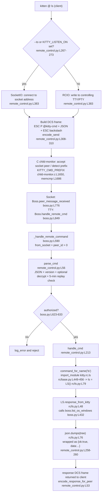

# How kitty's Remote Control Works — an end-to-end, code-grounded trace of `kitten @ ls`

> **Audience & purpose.** This document explains, from keystroke to JSON, exactly how kitty's remote
> control (RC) system carries a command such as `kitten @ ls` to a running kitty instance, executes it,
> and returns a list of windows. It is written for someone who is about to **add their own remote
> control command** and therefore needs an authoritative, evidence-based picture of the existing
> machinery first. Every factual claim is cited to the source as `[path:locator]`, valid at the
> checked-out commit, and the "on-the-wire" and "JSON response" sections are backed by **live capture**
> from a real, headless kitty run.

> **Source of truth.** All citations reference the repository at branch `kitty_815df1e210e0`,
> commit `815df1e210e0a9ab4622f5c7f2d6891d7dbeddf1` (kitty **0.35.2**, confirmed via
> `kitty --version` and `kitty/constants.py:L25`). Line numbers are valid at this revision. Where the
> official online docs (`sw.kovidgoyal.net/kitty`) are referenced, the local `docs/*.rst` files are the
> source for those pages at this commit.

> **Captured vs. derived — an honesty note.** Sections marked **[LIVE CAPTURE]** contain bytes/JSON
> obtained by actually building kitty, running it headless under `Xvfb`, and sending real commands.
> Sections marked **[CODE-DERIVED]** are reasoned from the cited source. The live `ls` response
> contained real host environment variables (API keys, passwords); these have been **redacted** and the
> `env` block trimmed to kitty-relevant, non-secret values. Nothing in the capture has been fabricated.

---

## The four questions this document answers

1. **(a) Transport.** When `kitten @ ls` runs from another terminal, how does the command reach the
   running kitty, get processed, and return a list of windows — is it a UNIX socket, a pipe, or
   something else?
2. **(b) Destination discovery.** How does the client know *where* to send the command? Why did looking
   in `/tmp` for a socket turn up nothing — is the path dynamic, or was that the wrong place to look?
3. **(c) Shell-integration "without explicit configuration".** The docs say RC works without explicit
   setup when shell integration is active. What is the mechanism — the same socket, or PTY/TTY
   behavior? Where are the environment variables that the shell-integration scripts set actually
   consumed?
4. **(d) End-to-end trace incl. logging.** Four concrete artifacts: (i) the *real* socket path kitty
   creates; (ii) what the protocol messages look like *on the wire*; (iii) *where in the Python code*
   the incoming command is parsed and routed to the `ls` handler; (iv) the JSON that comes back from a
   *real* `ls` call — plus the logging behavior.

## TL;DR — the short answers (each expanded, with rationale, below)

- **(a)** Neither a pipe nor (by default) a socket. kitty supports **two transports**, chosen on the
  client at one line: `io = SocketIO(to) if to else RCIO()` [`kitty/remote_control.py:L383`]. If you
  give an explicit address (`--to`, or `$KITTY_LISTEN_ON`), the client opens a **UNIX-domain (or TCP)
  stream socket**; otherwise it writes the command, framed as a terminal **escape sequence**, to its
  **controlling terminal (the PTY)**. Both paths reconverge at one server method,
  `Boss._handle_remote_command()` [`kitty/boss.py:L590`].
- **(b)** `/tmp` was empty because, **by default, kitty creates no socket at all.** A socket file exists
  only when `--listen-on`/`listen_on` is set *and* `allow_remote_control` is one of four permitting
  modes [`kitty/boss.py:L364`]. Even then the path is frequently **dynamic** (`{kitty_pid}` templating),
  may be a Linux **abstract socket** with *no filesystem entry*, and is **removed on clean exit** by an
  `atexit` handler [`kitty/boss.py:L177-L181`]. The default in-window transport uses the controlling
  TTY, so nothing appears under `/tmp`.
- **(c)** In-window RC "just works" because the command rides the window's **controlling TTY** as an
  escape code — no socket, no configuration. The environment variables the shell-integration scripts
  set (`KITTY_PID`, `KITTY_WINDOW_ID`) drive **prompt/title** features, **not** RC transport
  [`shell-integration/bash/kitty.bash:L215-L216`]. The variable that *does* drive transport,
  `KITTY_LISTEN_ON`, is exported by kitty **only when a socket is actually configured** and is consumed
  by the `kitten @` client [`kitty/remote_control.py:L271`, `tools/cmd/at/main.go:L372`].
- **(d)** All four artifacts are captured live below: the real socket path
  (`/tmp/kitty-rc-demo.sock`), the raw request/response escape-code frames (hex), the exact Python
  parse/authorize/route path (`parse_cmd` → authorization gate → `command_for_name('ls')` → `LS`), and
  the real `ls` JSON. Failures are logged via `log_error()` to kitty's stderr/log stream.

---

## 1. Overview: two transports, one handler  [CODE-DERIVED]

The single most important fact about kitty RC is that there is **one protocol** (a JSON command wrapped
in a terminal escape sequence) carried over **two interchangeable transports**, and that both transports
**reconverge on a single server-side handler**. Understanding this removes almost all of the confusion in
the user's questions.

### 1.1 The client's transport decision is one line

On the client side, `do_io()` decides how to deliver the command. The whole decision is a single ternary:

```python
# kitty/remote_control.py  (do_io begins at L369)
io: Union[SocketIO, RCIO] = SocketIO(to) if to else RCIO()   # L383
```

- If `to` is a non-empty address, the client constructs a **`SocketIO`** [`kitty/remote_control.py:L317`]
  and connects to that address (UNIX or TCP).
- If `to` is empty, the client constructs an **`RCIO`** — a thin subclass of `TTYIO`
  [`kitty/remote_control.py:L361`] — and writes to its **controlling terminal**.

`to` is the resolved destination (see §3). The Go client mirrors this decision exactly:

```go
// tools/cmd/at/main.go:L280
get_response(utils.IfElse(global_options.to_network == "", do_tty_io, do_socket_io), io_data)
```

Empty network address → `do_tty_io`; otherwise → `do_socket_io`. Two implementations (Python and Go),
same branch.

### 1.2 Why two transports exist (the rationale)

This dual design is deliberate, and the reasoning explains the rest of the system:

- **In-window control should need zero setup.** When a program runs *inside* a kitty window, kitty is
  already the other end of that window's pseudo-terminal (PTY). The child writes bytes to its stdout/PTY;
  kitty reads them. So a command can be delivered simply by **printing an escape sequence** — no socket,
  no address, no configuration. This is the `RCIO` path. kitty's own maintainer describes it this way:
  with `allow_remote_control=yes`, kitty watches the terminal output stream for the
  `0x1bP@kitty-cmd` escape codes; anything that emits them in an RC-enabled kitty triggers command
  processing (corroborated against the official `rc_protocol` documentation).
- **Out-of-window/scripted control needs an explicit channel.** A script in *another* terminal, a cron
  job, or an editor plugin is **not** connected to kitty's PTY, so it has nowhere to "print" the escape
  code. For these, kitty can open a **socket** (`--listen-on`) and watch that instead. The escape-code
  frame is byte-for-byte identical; it is merely sent to the socket rather than printed to a TTY.

In other words: the *protocol* never changes; only the *pipe it travels through* changes. That is why
the user found references to both a socket (`SocketIO`) and TTY/PTY behavior (`RCIO`) — both are real,
and which one is used depends entirely on whether a destination address is present.

### 1.3 The two transports reconverge immediately on the server

Once bytes arrive at kitty, the socket path and the TTY path **merge** at a single method before any
command is parsed:

- Socket ingress → `Boss.peer_message_received()` [`kitty/boss.py:L776`]
- In-window/PTY ingress → `Boss.handle_remote_cmd()` [`kitty/boss.py:L849`]
- **Both call** `Boss._handle_remote_command()` [`kitty/boss.py:L590`]

Because parsing, authorization, and dispatch all live behind `_handle_remote_command()`, the *behavior*
of a command is identical no matter which transport delivered it. This is the structural reason the
answer to "is it a socket or a pipe?" is "either — and it doesn't change what happens next."

> **Scale note (verified).** The RC command family is large and uniform: `kitty/rc/` contains
> **39 command modules** (`ls`, `launch`, `focus-window`, …) — there are **41 `.py` files** in the
> directory, but two of them (`__init__.py` and `base.py`) are infrastructure, not commands
> (`ls -1 kitty/rc/*.py | wc -l` = 41). Every command module follows the same
> `message_to_kitty()` / `response_from_kitty()` contract defined by the `RemoteCommand` base class
> [`kitty/rc/base.py:L319`]. This uniformity is exactly what makes adding a new command easy (see §10).

---

## 2. Why `/tmp` looked empty  [CODE-DERIVED + LIVE CAPTURE]

This is the question with the most surprising answer, and it has four layers. The headline is:
**by default, kitty does not create any socket at all.**

### 2.1 Layer 1 — no socket is created unless explicitly requested *and* permitted

Socket creation is gated. In `Boss.__init__`, the listening socket is created only if **both** an
address was requested **and** `allow_remote_control` is one of a specific set of modes:

```python
# kitty/boss.py
self.listening_on = ''                                                          # L362
listen_fd = -1                                                                  # L363
if args.listen_on and self.allow_remote_control in ('y', 'socket', 'socket-only', 'password'):  # L364
    try:
        listen_fd, self.listening_on = listen_on(args.listen_on)                # L366
```

Two consequences:

1. **No `--listen-on`/`listen_on` ⇒ no socket.** The default configuration enables RC over the
   controlling TTY only; `self.listening_on` stays `''` and no socket file is ever created. A user who
   runs a normal kitty and then greps `/tmp` will find nothing, because there is nothing to find.
2. **`--listen-on` is ignored unless the mode permits it.** The gate accepts exactly **four** modes:
   `'y'` (the normalized form of `yes`/`true`), `'socket'`, `'socket-only'`, and `'password'`
   [`kitty/boss.py:L364`].

> **Correction to a common summary.** Some descriptions (and the kitty `--listen-on` option help text,
> `kitty/options/definition.py`) say the option is honored for *three* modes — `yes`, `socket`,
> `socket-only`. The **code gate is the source of truth**, and it lists **four** modes, additionally
> including **`password`** [`kitty/boss.py:L364`]. We follow the code.

### 2.2 Layer 2 — when a socket *does* exist, its path is usually dynamic

Even when you ask for a socket, the on-disk name is frequently **not** the literal string you typed,
because kitty expands a `{kitty_pid}` template and (for config-file values) auto-appends the PID:

```python
# kitty/main.py  (expand_listen_on, L325-343)
listen_on = expandvars(listen_on)                                               # L328 (env vars)
if '{kitty_pid}' not in listen_on and from_config_file and listen_on.startswith('unix:'):
    listen_on = listen_on + '-{kitty_pid}'                                      # L329-330 (auto-append)
listen_on = listen_on.replace('{kitty_pid}', str(os.getpid()))                  # L331
```

**[LIVE CAPTURE]** Demonstrated against a real instance:

- CLI template `--listen-on unix:/tmp/kitty-{kitty_pid}.sock` resolved on disk to
  `/tmp/kitty-59337.sock`; inside the window `KITTY_LISTEN_ON=unix:/tmp/kitty-59337.sock` and
  `KITTY_PID=59337`.
- A **config-file** value `listen_on unix:/tmp/kitty-cfg` (no CLI flag) produced
  `/tmp/kitty-cfg-59575` — the `-{kitty_pid}` suffix was appended automatically (L329-330).

So a user who configured `listen_on unix:/tmp/kitty-cfg` and then looked for `/tmp/kitty-cfg` would miss
it: the real file is `/tmp/kitty-cfg-<pid>`. A fixed `/tmp` lookup is defeated by the PID in the name.

### 2.3 Layer 3 — abstract sockets have *no filesystem entry at all*

On Linux, `--listen-on unix:@name` requests an **abstract** UNIX socket, which lives in a separate
kernel namespace and creates **no file**:

```python
# kitty/utils.py  (parse_address_spec, L502)
if address and address[0] == '@':
    address = '\0' + address[1:]   # abstract namespace; no path on disk   (L514)
```

**[LIVE CAPTURE]** With `--listen-on unix:@blitzyabstract`:

```
Filesystem check under /tmp for 'blitzyabstract':  (NO file on disk — as expected)
/proc/net/unix entry:  ... @blitzyabstract
kitten @ --to unix:@blitzyabstract ls  ->  1   (OS windows; RC works fine)
```

The socket is fully functional — `kitten @ ls` returns a window — yet it will **never** appear in `/tmp`
(or anywhere on disk), only in `/proc/net/unix`. (Abstract sockets are also why the ssh kitten cannot
forward an `@`-style socket — there is no file to forward.)

### 2.4 Layer 4 — even a real socket file is removed on clean exit

When a path-based socket is created, kitty registers an `atexit` handler to delete the file:

```python
# kitty/boss.py  (listen_on, L177)
family, address, socket_path = parse_address_spec(spec)                         # L179
s = socket.socket(family)                                                       # L180
atexit.register(remove_socket_file, s, socket_path)                             # L181
```

`remove_socket_file` is defined at [`kitty/utils.py:L379`].

**[LIVE CAPTURE]** Observed behavior, which is more nuanced than "removed at exit" and worth stating
precisely:

- **While running:** `srwxr-xr-x ... /tmp/kitty-rc-demo.sock` (the leading `s` denotes a socket).
- **Clean exit** (the window's child process ended, kitty closed the window and quit *normally*): the
  socket file was **gone** — the `atexit` handler ran.
- **Signal kill** (`SIGTERM`/`SIGKILL`): the socket file **persisted** as a *stale* socket, because
  Python `atexit` handlers do not run on signal-based termination. (This is why community guidance
  recommends deleting stale sockets before relaunch.)

The rationale: cleanup is performed by **kitty's own `atexit` handler**, not by the OS. A graceful exit
leaves `/tmp` clean; a crash can leave a stale file behind.

### 2.5 Putting it together — the answer to "was I looking in the wrong place?"

Most likely the user was running a **default** kitty (no `--listen-on`), so **there was never a socket
to find** — in-window control was flowing over the controlling TTY (§1.2, §3). If a socket *was*
configured, the file may have been **PID-templated** (different name), **abstract** (no file), or
**already removed** at exit. All four layers point the same way: a static `/tmp` search is the wrong
instrument for locating kitty's RC channel.

---

## 3. Destination resolution on the client side  [CODE-DERIVED]

Before the transport branch in §1.1 can run, the client must compute `to` — the destination address.
The precedence is documented right in the `--to` option's own help text:

```
# kitty/remote_control.py:L267-273  (the --to option documentation)
--to
An address for the kitty instance to control. Corresponds to the address given
to the kitty instance via the `kitty --listen-on` option or the `listen_on`
setting in kitty.conf. If not specified, the environment variable
KITTY_LISTEN_ON is checked. If that is also not found, messages are sent to the
controlling terminal for this process, i.e. they will only work if this process
is run within a kitty window.
```

So the resolution order is:

1. **Explicit `--to <address>`** (highest precedence).
2. **`$KITTY_LISTEN_ON`** environment variable, if `--to` was not given.
3. **The controlling terminal** (the PTY) as the fallback — which only works *inside* a kitty window.

The Go `kitten` client implements the same precedence — `--to` first, then the environment:

```go
// tools/cmd/at/main.go
if rc_global_opts.To == "" {
    rc_global_opts.To = os.Getenv("KITTY_LISTEN_ON")   // L372
}
```

If, after this, `to` is still empty, the transport branch (§1.1) selects the TTY transport (`RCIO` /
`do_tty_io`). This is the precise mechanism by which `kitten @ ls` "knows where to go" with no arguments
when run inside a kitty window: kitty exported `KITTY_LISTEN_ON` (only if a socket exists), or else the
client simply talks to the terminal it is already attached to.

**[LIVE CAPTURE]** With a configured socket, the client picked it up from the environment automatically:
`kitten @ --to unix:/tmp/kitty-rc-demo.sock ls` returned the window tree, and the window's own
`KITTY_LISTEN_ON` (seen in that very `ls` output) was `unix:/tmp/kitty-rc-demo.sock` — i.e. a child run
inside that window would have resolved the same address with no `--to` at all.


---

## 4. The on-the-wire frame  [CODE-DERIVED + LIVE CAPTURE]

### 4.1 The frame format

A remote control command is a JSON object wrapped in a **DCS** (Device Control String) escape sequence:

```
<ESC>P@kitty-cmd<JSON object><ESC>\        # docs/rc_protocol.rst:L8 ; <ESC> is the byte 0x1b
```

The JSON object carries `cmd`, `version`, and optional `no_response`, `kitty_window_id`, and `payload`
fields [`docs/rc_protocol.rst:L13-L19`]. The request and response framers in the Python core build
exactly this sequence:

```python
# kitty/remote_control.py
def encode_send(send):                                                   # L308
    es = ('@kitty-cmd' + json.dumps(send)).encode('ascii')               # L309  (request body: ASCII)
    return b'\x1bP' + es + b'\x1b\\'                                      # L310  (ESC P ... ESC \)

def encode_response_for_peer(response):                                  # L52
    return b'\x1bP@kitty-cmd' + json.dumps(response).encode('utf-8') + b'\x1b\\'  # L53 (response: UTF-8)
```

The Go client uses the identical literals, confirming a single shared protocol:

```go
// tools/cmd/at/socket_io.go
const cmd_escape_code_prefix = "\x1bP@kitty-cmd"   // L82
const cmd_escape_code_suffix = "\x1b\\"            // L83
// write_many_to_conn(conn, []byte(prefix), chunk, []byte(suffix))  // L107
```

> **Note on the prefix length.** The leading frame marker is the **12 bytes** `\x1bP@kitty-cmd`
> (`ESC`, `P`, then the 10 ASCII characters `@kitty-cmd`), and the trailing terminator is the **2 bytes**
> `\x1b\\` (`ESC` `\`). Keep these 12/2 figures in mind — they explain the `awk` slicing in the
> shell example below.

### 4.2 The runnable `socat` example, reproduced and annotated

The protocol docs ship a one-liner that performs an entire `@ ls` exchange with nothing but shell tools
[`docs/rc_protocol.rst:L42`]. Reproduced **verbatim** (only the socket path is pointed at our live
instance):

```sh
echo -en '\eP@kitty-cmd{"cmd":"ls","version":[0,14,2]}\e\\' \
  | socat - unix:/tmp/test \
  | awk '{ print substr($0, 13, length($0) - 14) }' \
  | jq -c '.data | fromjson' \
  | jq .
```

Stage by stage:

- `echo -en '\eP@kitty-cmd{"cmd":"ls","version":[0,14,2]}\e\\'` emits the **request frame** — the
  DCS-wrapped JSON. `\e` is the shell's way of writing `0x1b`. This is exactly the byte string
  `encode_send()` produces [`kitty/remote_control.py:L308-L310`].
- `socat - unix:/tmp/test` is the **socket transport** — equivalent to `SocketIO` connecting to a
  `--listen-on` address [`kitty/remote_control.py:L317`].
- `awk '{ print substr($0, 13, length($0) - 14) }'` strips the **12-byte** leading prefix
  (`\x1bP@kitty-cmd`) and the **2-byte** trailing terminator (`\x1b\\`) — `13` starts just past the
  prefix and `length-14` drops both ends — leaving just the JSON envelope. This is the response frame
  defined at [`kitty/remote_control.py:L53`].
- `jq '.data | fromjson'` parses the `{"ok": true, "data": "<json string>"}` envelope: `data` is itself
  a JSON **string** (produced by `LS.response_from_kitty()`), so `fromjson` is needed to turn it back
  into a tree.

**Why does `version:[0,14,2]` work against a 0.35.2 instance?** Because the server rejects only a client
that is **newer** than itself. `handle_cmd()` reads `v = cmd['version']` [`kitty/remote_control.py:L216`]
and fails only when the client's major/minor exceeds the instance's; `[0,14,2] < [0,35,2]`, so it is
accepted [`kitty/constants.py:L25`; `docs/rc_protocol.rst:L23-24`].

### 4.3 The real bytes on the wire  [LIVE CAPTURE]

Running the request through `hexdump -C` shows the literal **request frame** (45 bytes):

```
00000000  1b 50 40 6b 69 74 74 79  2d 63 6d 64 7b 22 63 6d  |.P@kitty-cmd{"cm|
00000010  64 22 3a 22 6c 73 22 2c  22 76 65 72 73 69 6f 6e  |d":"ls","version|
00000020  22 3a 5b 30 2c 31 34 2c  32 5d 7d 1b 5c           |":[0,14,2]}.\|
```

`1b 50 40 6b 69 74 74 79 2d 63 6d 64` = `ESC P @ k i t t y - c m d`; the body is the JSON; the frame
ends `1b 5c` = `ESC \`. This matches `encode_send()` precisely.

Capturing the **response frame** raw (un-stripped) shows the `{"ok": true, "data": "..."}` envelope on
the wire (11025 bytes total). Head:

```
00000000  1b 50 40 6b 69 74 74 79  2d 63 6d 64 7b 22 6f 6b  |.P@kitty-cmd{"ok|
00000010  22 3a 20 74 72 75 65 2c  20 22 64 61 74 61 22 3a  |": true, "data":|
00000020  20 22 5b 5c 6e 20 20 7b  5c 6e 20 20 20 20 5c 22  | "[\n  {\n    \"|
00000030  62 61 63 6b 67 72 6f 75  6e 64 5f 6f 70 61 63 69  |background_opaci|
00000040  74 79 5c 22 3a 20 31 2e  30 2c 5c 6e ...          |ty\": 1.0,\n ...|
```

Tail:

```
00002af0  22 77 6d 5f 6e 61 6d 65  5c 22 3a 20 5c 22 6b 69  |"wm_name\": \"ki|
00002b00  74 74 79 5c 22 5c 6e 20  20 7d 5c 6e 5d 22 7d 1b  |tty\"\n  }\n]"}.|
00002b10  5c                                                |\|
```

Two things to notice from the live bytes:

1. The response opens with the **same 12-byte prefix** `\x1bP@kitty-cmd` and ends with `7d 1b 5c`
   (`}` `ESC` `\`) — the framing is symmetric with the request.
2. The `"data"` value is a **JSON string** — note the escaped `\n` (`5c 6e`) and `\"` (`5c 22`) inside
   it. The server `json.dumps`-es the window tree into a string and nests it under `data`
   (`{"ok": true, "data": "[\n  {\n    \"background_opacity\": 1.0, ...}\n]"}`). That is precisely why
   the shell example needs `jq '.data | fromjson'` to re-parse it.

---

## 5. Server ingest — the two entry paths  [CODE-DERIVED]

When the bytes arrive at kitty, they enter through one of two doors depending on transport. Both doors
lead to the same room (`_handle_remote_command()`, §6).

### 5.1 The socket path goes through the C child-monitor first

kitty's event loop and socket accept logic live in the C extension `kitty/child-monitor.c`. A connection
on the listening socket is accepted and tracked as a peer:

- `accept_peer(int listen_fd, bool shutting_down, bool is_remote_control_peer)` [`kitty/child-monitor.c:L1632`]
  accepts the connection; `add_peer(int peer, bool is_remote_control_peer)` [`kitty/child-monitor.c:L1614`]
  records it, with an `is_remote_control_peer` flag on the peer struct [`kitty/child-monitor.c:L46`].
- Incoming peer bytes are checked for a complete command. The C layer recognizes the RC frame by its
  prefix:

```c
// kitty/child-monitor.c
#define KITTY_CMD_PREFIX "\x1bP@kitty-cmd{"                                   // L1650
// in has_complete_peer_command():
if (memcmp(peer->read.data, KITTY_CMD_PREFIX, sizeof(KITTY_CMD_PREFIX)-1) == 0) // L1686
    // ... then scan forward for the 0x1b '\\' terminator                       // L1687-1689
```

- Once a full frame is buffered, the C code calls **back into Python**:

```c
// kitty/child-monitor.c:L504
PyObject_CallMethod(global_state.boss, "peer_message_received", "y#KO", ...);
```

That Python method is the socket entry point:

```python
# kitty/boss.py
def peer_message_received(self, msg_bytes, peer_id, is_remote_control):        # L776
    cmd_prefix = b'\x1bP@kitty-cmd'                                            # L781
    terminator = b'\x1b\\'                                                     # L782
    # ... strip prefix/terminator ...                                         # L784
    response = self._handle_remote_command(cmd, peer_id=peer_id)              # L785
    # ... return encode_response_for_peer(response)                          # L791
```

Malformed peer frames are logged and dropped:
`log_error('Malformatted remote control message received from peer, ignoring')` [`kitty/boss.py:L792`].

### 5.2 The in-window/PTY path enters directly in Python

When a program inside a kitty window prints the escape code, kitty's terminal parser recognizes the DCS
sequence and routes it to the in-window entry point:

```python
# kitty/boss.py
def handle_remote_cmd(self, cmd, window=None):                                 # L849
    response = self._handle_remote_command(cmd, window)                       # L850
    # ... window.send_cmd_response(response)                                  # L852
```

Here the response is written **back to the same window's PTY** (rather than a socket), so the answer
travels home the way the request arrived.

### 5.3 Both paths converge

```python
# kitty/boss.py
def _handle_remote_command(self, cmd, window=None, peer_id=0):                 # L590
    from_socket = peer_id > 0                                                  # L594
```

`from_socket` is derived purely from whether a `peer_id` was supplied — i.e. whether the command came
through the socket door or the window door. Everything downstream (parse, authorize, route, execute) is
shared. This convergence is the technical heart of the answer to question (a): the transport is a
*delivery* detail; the *processing* is singular.


---

## 6. Parse → authorize → route  [CODE-DERIVED]

Inside `_handle_remote_command()` the command goes through three stages: **parse**, **authorize**, and
**dynamically route** to a handler.

### 6.1 Parse — `parse_cmd()`

```python
# kitty/remote_control.py
def parse_cmd(serialized_cmd, encryption_key):                                 # L56
    # json.loads(...) of the payload                                          # ~L60
    if not isinstance(pcmd, dict) or 'version' not in pcmd:                    # L78
        return {}
    delta = time_ns() - pcmd.pop('timestamp')                                  # L80
    if abs(delta) > 5 * 60 * 1e9:                                              # L81  (±5-minute window)
        log_error(...)                                                         # L82
```

Key behaviors:

- The payload must be **valid JSON** and a **dict containing a `version` field**; otherwise the command
  is ignored. JSON failures are logged: *"Failed to parse JSON payload of remote command, ignoring it"*
  (~`L61`) and *"JSON payload of remote command is invalid …"* (~`L64`).
- `pcmd.pop('password', None)` removes any password before dispatch (~`L67`).
- For the **encrypted** path (used with `remote_control_password`), `parse_cmd` decrypts using the
  protocol version (`RC_ENCRYPTION_PROTOCOL_VERSION`) and AES-256-GCM, and enforces a **±5-minute
  timestamp replay window**: `abs(delta) > 5 * 60 * 1e9` nanoseconds [`kitty/remote_control.py:L80-81`].
  (Independently corroborated: kitty's encrypted RC uses X25519 key exchange + AES-256-GCM, with the
  client's public key delivered via `KITTY_PUBLIC_KEY`, and commands older than five minutes rejected.)

This replay window matters in practice because it can **silently** reject an otherwise-valid command if
the client and server clocks disagree by more than five minutes.

### 6.2 Authorize — the gate that can silently block a command

After parsing, `_handle_remote_command` decides whether the command is allowed. There is an early gate
on the mode (`'n'` ⇒ RC disabled; `'socket-only'` and not from a socket ⇒ rejected), then the main
decision:

```python
# kitty/boss.py:L623-633
allowed_unconditionally = (
    self.allow_remote_control == 'y' or
    (from_socket and not is_fd_peer and self.allow_remote_control in ('socket-only', 'socket')) or
    (window and window.remote_control_allowed(pcmd, extra_data)) or
    (is_fd_peer and remote_control_allowed(pcmd, self.peer_data_map.get(peer_id), None, extra_data))
)
# ...
if allowed_unconditionally:
    return self._execute_remote_command(pcmd, window, peer_id, self_window)
q = is_cmd_allowed(pcmd, window, from_socket, extra_data)                       # L633
```

The decision combines **the mode** (`allow_remote_control`), **whether the command arrived from a
socket** (`from_socket`), and optional **per-window / password authorization**. If not allowed
unconditionally, `is_cmd_allowed(pcmd, window, from_socket, extra_data)` [`docs/remote-control.rst:L243`]
applies finer-grained (including user-scripted) policy. This gate is worth knowing about because a
command can be **silently disallowed** here — e.g. a window-specific password mismatch returns
`{'ok': False, 'error': 'Remote control disallowed by window specific password'}`.

### 6.3 Route — dynamic dispatch by command name

Allowed commands are executed via `_execute_remote_command()` [`kitty/boss.py:L700`], which imports and
calls `handle_cmd()` [`kitty/remote_control.py:L213`]. `handle_cmd` looks the command up **by name**:

```python
# kitty/rc/base.py
def command_for_name(cmd_name):                                                # L449
    from importlib import import_module
    cmd_name = cmd_name.replace('-', '_')                                      # L451  (kebab → snake)
    try:
        m = import_module(f'kitty.rc.{cmd_name}')                              # L453  (dynamic import!)
    except ImportError:
        raise KeyError(f'Unknown kitty remote control command: {cmd_name}')    # L454-455
    return cast(RemoteCommand, getattr(m, cmd_name))                           # L456  (module-level instance)
```

This is the crux of kitty's extensibility, and the precise answer to *"where is it routed?"*:

- The command name `"ls"` is used to **import the module** `kitty.rc.ls` and fetch its module-level
  attribute named `ls`.
- That attribute is the singleton instance created at the bottom of the module:
  `ls = LS()` [`kitty/rc/ls.py:L79`].

There is **no registry, no switch statement, no manual wiring** — dispatch is purely
convention-over-configuration via the module name. (And `all_command_names()` simply lists the modules
in `kitty/rc/`, excluding `base` and `__init__` [`kitty/rc/base.py:L459-462`] — which is why the count
is 39 commands out of 41 files.)

---

## 7. The `ls` handler and the JSON it returns  [CODE-DERIVED + LIVE CAPTURE]

### 7.1 Client side — `message_to_kitty()`

On the client, `LS.message_to_kitty()` assembles the command payload:

```python
# kitty/rc/ls.py:L45-46
def message_to_kitty(self, global_opts, opts, args):
    return {'all_env_vars': opts.all_env_vars, 'match': opts.match, 'match_tab': opts.match_tab}
```

So `kitten @ ls` sends only those three fields (plus the standard `cmd`/`version`). For a bare `ls`,
`match`/`match_tab` are empty and `all_env_vars` is false.

### 7.2 Server side — `response_from_kitty()`

```python
# kitty/rc/ls.py
def response_from_kitty(self, boss, window, payload_get):                      # L48
    ...
    data = list(boss.list_os_windows(window, tab_filter, window_filter))       # L57
    # If --all-env-vars was NOT passed, de-duplicate environment variables
    # common to all windows to keep the output small.                         # L58-75
    return json.dumps(data, indent=2, sort_keys=True)                          # L76
```

Two important details:

- The actual window tree is produced by `boss.list_os_windows()` [`kitty/boss.py:L432`], which yields
  **one dict per OS window**. The dict's keys are (in code order) `id`, `platform_window_id`,
  `is_active`, `is_focused`, `last_focused`, `tabs`, `wm_class`, `wm_name`, `background_opacity`
  [`kitty/boss.py:L432`].
- Unless `--all-env-vars` is given, environment variables **common to every window** are de-duplicated
  out of each window's `env` to keep the payload compact [`kitty/rc/ls.py:L58-75`].
- The handler returns a **JSON string** (`indent=2, sort_keys=True`), which is why the bytes on the wire
  show a stringified tree (§4.3).

### 7.3 The response envelope — `handle_cmd()`

`handle_cmd()` wraps the handler's return value in a small envelope:

```python
# kitty/remote_control.py (handle_cmd, L213)
c = command_for_name(cmd['cmd'])         # ~L221  -> the LS instance
ans = c.response_from_kitty(...)         # ~L246  -> the ls JSON string
response = {'ok': True}                  # ~L258
response['data'] = ans                   # ~L260
```

i.e. the final response is `{"ok": true, "data": <ls JSON string>}` — exactly the bytes captured in
§4.3.

### 7.4 The real `ls` JSON  [LIVE CAPTURE]

Below is the **real** response from a live `kitten @ --to unix:/tmp/kitty-rc-demo.sock ls`, trimmed for
length and **with the `env` block sanitized** (the live capture's `env` contained host API keys and
passwords, which are redacted per security policy; recall that common env vars are de-duplicated unless
`--all-env-vars` is passed — `kitty/rc/ls.py:L58-75`):

```json
[
  {
    "background_opacity": 1.0,
    "id": 1,
    "is_active": true,
    "is_focused": true,
    "last_focused": true,
    "platform_window_id": 2097164,
    "tabs": [
      {
        "active_window_history": [ 1 ],
        "enabled_layouts": [ "fat", "grid", "horizontal", "splits", "stack", "tall", "vertical" ],
        "groups": [ { "id": 1, "windows": [ 1 ] } ],
        "id": 1,
        "is_active": true,
        "is_focused": true,
        "layout": "fat",
        "layout_opts": { "bias": 50, "full_size": 1, "mirrored": false },
        "layout_state": { "biased_map": {}, "main_bias": [ 0.5, 0.5 ], "num_full_size_windows": 1 },
        "title": "sh",
        "windows": [
          {
            "at_prompt": false,
            "cmdline": [ "sh", "-c", "sleep 300" ],
            "columns": 71,
            "created_at": 1782507975050722965,
            "cwd": "/tmp/blitzy/kitty/blitzy-0cccc58e-f241-425f-a7ab-91425d903ec7_cbca06",
            "env": {
              "COLORTERM": "truecolor",
              "KITTY_LISTEN_ON": "unix:/tmp/kitty-rc-demo.sock",
              "KITTY_PID": "58058",
              "KITTY_WINDOW_ID": "1",
              "SHLVL": "1",
              "TERM": "xterm-kitty"
            },
            "foreground_processes": [
              { "cmdline": [ "sh", "-c", "sleep 300" ], "cwd": "/tmp/.../", "pid": 58126 },
              { "cmdline": [ "sleep", "300" ],          "cwd": "/tmp/.../", "pid": 58127 }
            ],
            "id": 1,
            "is_active": true,
            "is_focused": true,
            "is_self": false,
            "last_cmd_exit_status": 0,
            "last_reported_cmdline": "",
            "lines": 22,
            "pid": 58126,
            "title": "sh",
            "user_vars": {}
          }
        ]
      }
    ],
    "wm_class": "kitty",
    "wm_name": "kitty"
  }
]
```

### 7.5 Structure, key by key

- **Top level** is a JSON **array of OS windows**. Each OS-window object's keys come from
  `boss.list_os_windows()` [`kitty/boss.py:L432`]: `id`, `platform_window_id` (the X11/Wayland handle),
  `is_active`, `is_focused`, `last_focused`, `tabs`, `wm_class`, `wm_name`, `background_opacity`.
  (They appear alphabetically in the output because of `sort_keys=True`.)
- **Each tab** carries `id`, `title`, `is_active`/`is_focused`, the `layout` and its `layout_opts` /
  `layout_state`, `enabled_layouts`, `active_window_history`, `groups`, and a `windows` list.
- **Each window** carries `id`, `title`, `cwd`, `pid`, `cmdline`, and `env` — and additionally
  `foreground_processes`, `at_prompt`, `columns`/`lines`, `created_at`, `last_cmd_exit_status`,
  `user_vars`, and `is_self` (true for the window in which the command itself runs; here `false` since
  the command came over the socket). This per-window detail is what the docs describe as a tree of OS
  windows → tabs → windows, each with id/title/cwd/pid/cmdline [`docs/remote-control.rst:L83-90`], and it
  is what powers `kitten @ ... --match` selection.


---

## 8. Shell integration and "without explicit configuration"  [CODE-DERIVED]

This section closes the user's specific trace gap: *they saw shell-integration scripts setting
environment variables but could not find where those variables were consumed.* The resolution is that
there are **two different sets of variables with two different jobs**, and conflating them is what made
the trace seem to dead-end.

### 8.1 The producers (kitty core sets these on every child)

When kitty launches a child process for a window, it builds the child's environment in
`Child.get_final_env()`:

```python
# kitty/child.py
env['KITTY_PID'] = getpid()                                                    # L244
env['KITTY_PUBLIC_KEY'] = boss.encryption_public_key                           # L245
if self.add_listen_on_env_var and boss.listening_on:                           # L246
    env['KITTY_LISTEN_ON'] = boss.listening_on                                 # L247
else:
    env.pop('KITTY_LISTEN_ON', None)                                           # L249
```

and the per-window id is set where the window is created:

```python
# kitty/tabs.py
fenv['KITTY_WINDOW_ID'] = str(next_window_id())                                # L491
```

The decisive line is **L246**: `KITTY_LISTEN_ON` is exported **only if** `add_listen_on_env_var` is true
**and** `boss.listening_on` is non-empty — and `boss.listening_on` is non-empty **only when a socket was
actually created** (the §2.1 gate). If no socket exists, `KITTY_LISTEN_ON` is explicitly *removed* from
the child environment (L249). `KITTY_PUBLIC_KEY` (L245) is the client's handle for the encrypted RC
path. `add_listen_on_env_var` is a constructor flag (`Child(..., add_listen_on_env_var=True)`
[`kitty/child.py:L211`, stored L216]) so kitty can withhold the socket address from windows that should
not have it.

### 8.2 The consumers (two different audiences)

The variables fan out to **two distinct consumers**:

- **Shell-integration scripts** read `KITTY_PID` and `KITTY_WINDOW_ID` to drive **prompt and window/tab
  title** behavior — *not* remote-control transport:

  ```bash
  # shell-integration/bash/kitty.bash
  if [[ -z "$KITTY_PID" ]]; then                                              # L215
  if [[ -n "$SSH_TTY" || -n "$SSH2_TTY$KITTY_WINDOW_ID" ]]; then              # L216
  ```

  (The zsh and fish integrations use the same variables equivalently.) These are exactly the variables
  the user saw being set — and they are consumed *here*, for cosmetics/identity, which is why the trail
  did not lead to the RC machinery.

- **The `kitten @` client** reads `KITTY_LISTEN_ON` to pick the **socket transport** (§3):

  ```python
  # kitty/remote_control.py  (the --to resolution; env var consumed at L271)
  ```
  ```go
  // tools/cmd/at/main.go:L372  ->  rc_global_opts.To = os.Getenv("KITTY_LISTEN_ON")
  ```

### 8.3 So why does in-window RC work "without explicit configuration"?

Because the in-window case **doesn't need any variable or socket at all.** A program running inside a
kitty window is connected to kitty through that window's **controlling TTY (PTY)**. When `kitten @ ls`
finds no `--to` and no `$KITTY_LISTEN_ON`, it falls back to the controlling terminal (§3) and simply
**prints the escape-code frame**; kitty, watching its own terminal output stream (because
`allow_remote_control` is enabled), sees the `\x1bP@kitty-cmd` prefix and processes the command (§5.2).
This is also why it works **over SSH** inside a kitty window: the escape codes ride the same TTY all the
way back to kitty [`docs/remote-control.rst:L96-99`].

The mechanism the user was hunting for is therefore **PTY/TTY behavior, not a socket**, for the default
in-window case. The environment variables they found (`KITTY_PID`, `KITTY_WINDOW_ID`) were a **red
herring** for transport — they serve prompts/titles. The only transport-relevant variable,
`KITTY_LISTEN_ON`, is set **solely** when a socket has been configured, and is consumed by the `kitten @`
client, not by the shell scripts.

---

## 9. Logging behavior  [CODE-DERIVED + LIVE CAPTURE]

Remote-control failures are surfaced through kitty's `log_error()` helper, which writes to kitty's
standard error / log stream. The call sites on the RC path are:

- **JSON parse failures** in `parse_cmd()`: *"Failed to parse JSON payload of remote command, ignoring
  it"* (~`kitty/remote_control.py:L61`) and *"JSON payload of remote command is invalid …"* (~`L64`).
- **Top-level parse failure** in `_handle_remote_command()`: *"Failed to parse remote command with
  error: …"* (~`kitty/boss.py:L605`).
- **Malformed peer frames** in `peer_message_received()`: *"Malformatted remote control message received
  from peer, ignoring"* (~`kitty/boss.py:L792`).
- **Invalid `--listen-on`** during startup: *"Invalid listen_on=… …"* (~`kitty/boss.py:L368`).

**[LIVE CAPTURE]** Sending a deliberately malformed frame
(`\x1bP@kitty-cmd{this is not valid json}\x1b\\`) to the live socket produced, on kitty's stderr:

```
[0.491] Failed to parse JSON payload of remote command, ignoring it
```

This is the live `log_error` from `kitty/remote_control.py:L61`. The client received an empty response,
and kitty continued running — malformed RC input is logged and dropped, never fatal.

For deeper diagnostics, kitty offers a debug build with extra event-loop logging:
`python3 setup.py build --debug --extra-logging=event-loop` [`Makefile: debug-event-loop`], which
increases verbosity around the event loop that drives the socket/PTY ingest.

---

## 10. End-to-end flow

The complete journey of `kitten @ ls`, from the client's transport choice to the response frame:




---

## 11. Appendix — reproducible build-and-capture  [LIVE CAPTURE method]

The live evidence in this document was produced with the steps below. kitty is a GPU/OpenGL terminal, so
it is run under a virtual display (`Xvfb`). **All helper scripts used for capture were deleted after use;
none are committed.**

### 11.1 Build

```sh
# From the repository root, with the project's Python venv active and a C compiler available:
python3 setup.py            # Makefile target `all`
# (richer logs: python3 setup.py build --debug --extra-logging=event-loop  # Makefile `debug-event-loop`)
# Artifacts (gitignored): kitty/launcher/kitty, kitty/launcher/kitten, kitty/fast_data_types.so
```

Toolchain at this commit: Python `>=3.8` [`pyproject.toml`], Go `1.22` [`go.mod`] for the `kitten`
client, and a C compiler for the extension.

### 11.2 Run headless with an explicit socket

```sh
# NOTE: in kitty 0.35.2, --start-as choices are normal/minimized/maximized/fullscreen.
# 'hidden' is NOT a valid value at this commit (it postdates 0.35.2), so we use 'minimized' under Xvfb.
xvfb-run -a ./kitty/launcher/kitty --config NONE \
  -o allow_remote_control=yes \
  --listen-on unix:/tmp/kitty-rc-demo.sock \
  --start-as=minimized \
  sh -c 'sleep 300' &
```

Verify the real socket: `ls -l /tmp/kitty-rc-demo.sock` → `srwxr-xr-x ... /tmp/kitty-rc-demo.sock`
(the leading `s` confirms a UNIX-domain socket).

### 11.3 Capture the wire bytes (the `rc_protocol.rst` one-liner) and the raw frames

```sh
# Pretty ls output via raw protocol (docs/rc_protocol.rst:L42), pointed at the real socket:
echo -en '\eP@kitty-cmd{"cmd":"ls","version":[0,14,2]}\e\\' \
  | socat - unix:/tmp/kitty-rc-demo.sock \
  | awk '{ print substr($0, 13, length($0) - 14) }' \
  | jq -c '.data | fromjson' | jq .

# Raw, un-stripped request and response frames (to see the literal escape codes):
echo -en '\eP@kitty-cmd{"cmd":"ls","version":[0,14,2]}\e\\' | hexdump -C            # request frame
echo -en '\eP@kitty-cmd{"cmd":"ls","version":[0,14,2]}\e\\' \
  | socat - unix:/tmp/kitty-rc-demo.sock | hexdump -C                                # response frame
```

### 11.4 Capture the high-level client and trigger a log line

```sh
./kitty/launcher/kitten @ --to unix:/tmp/kitty-rc-demo.sock ls          # real ls JSON
# Malformed frame -> kitty logs: "Failed to parse JSON payload of remote command, ignoring it"
echo -en '\eP@kitty-cmd{not valid json}\e\\' | socat - unix:/tmp/kitty-rc-demo.sock
```

### 11.5 Clean up

```sh
# Kill ONLY the exact kitty process group/PIDs you spawned (never a broad pkill).
# A clean exit triggers the atexit handler that removes the socket file (kitty/boss.py:L181);
# a signal-kill leaves a stale socket, so remove it explicitly if present:
rm -f /tmp/kitty-rc-demo.sock
# Then delete any temporary capture scripts.
```

> **Security caveat reproduced here too:** a real `kitten @ ls` returns each window's full `env`, which
> on a developer machine commonly includes secrets (API keys, passwords). Treat `ls` output as sensitive;
> the `env` block in §7.4 is redacted for that reason.

---

## 12. Where a future custom command plugs in  [orientation — not implemented here]

Because dispatch is the dynamic import in §6.3, **adding a remote control command requires no central
registration.** The pattern, mirrored by all 39 existing commands, is:

1. Create a new module `kitty/rc/<name>.py`.
2. Define a subclass of `RemoteCommand` [`kitty/rc/base.py:L319`] that implements:
   - `message_to_kitty(self, global_opts, opts, args)` — assemble the request payload on the **client**
     (as `LS` does at [`kitty/rc/ls.py:L45-46`]).
   - `response_from_kitty(self, boss, window, payload_get)` — execute on the **server** and return the
     result, typically `json.dumps(...)` (as `LS` does at [`kitty/rc/ls.py:L48-76`]).
3. Expose a **module-level instance** named exactly like the module:
   `<name> = <ClassName>()` (as `ls = LS()` at [`kitty/rc/ls.py:L79`]).

Then `command_for_name('<name>')` will `import_module('kitty.rc.<name>')` and return that instance
[`kitty/rc/base.py:L449-456`] — the **identical resolution path** by which `"ls"` reaches `ls = LS()`.
The same two transports (§1) and the same parse/authorize/route pipeline (§5–§6) will carry the new
command for free. *(This document does not implement any new command; it only identifies the extension
point.)*

---

## Appendix A — citation map (verified at commit `815df1e210e0…`)

| Concern | Primary citations |
|---|---|
| Transport selector (one handler, two transports) | `kitty/remote_control.py:L383`, `:L369`; `tools/cmd/at/main.go:L280` |
| Request / response framers | `kitty/remote_control.py:L308-310` (ASCII send), `:L52-53` (UTF-8 response); `tools/cmd/at/socket_io.go:L82-83,L107` |
| Wire frame spec | `docs/rc_protocol.rst:L8-19`, runnable example `:L42` |
| Socket-creation gate (4 modes incl. `password`) | `kitty/boss.py:L364` |
| Socket factory + atexit cleanup | `kitty/boss.py:L177-181`; `kitty/utils.py:L379` |
| `{kitty_pid}` templating / auto-append | `kitty/main.py:L325-343` (esp. L329-331) |
| Abstract socket (no FS entry) | `kitty/utils.py:L502,L514` |
| Destination resolution (`--to` → env → TTY) | `kitty/remote_control.py:L267-273,L271`; `tools/cmd/at/main.go:L372` |
| Server ingest — C child-monitor | `kitty/child-monitor.c:L46,L504,L1614,L1632,L1650,L1686` |
| Server ingest — Python entry points | `kitty/boss.py:L776` (socket), `:L849` (TTY), `:L792` (peer log) |
| Convergence point | `kitty/boss.py:L590` |
| Parse + replay window | `kitty/remote_control.py:L56,L78-82` |
| Authorization gate | `kitty/boss.py:L623-633`; `docs/remote-control.rst:L243` |
| Dynamic dispatch | `kitty/rc/base.py:L449-456,L459-462`, base class `:L319` |
| `ls` handler | `kitty/rc/ls.py:L45-46,L48,L57,L58-75,L76,L79` |
| OS-window tree | `kitty/boss.py:L432`; `docs/remote-control.rst:L83-90` |
| Response envelope | `kitty/remote_control.py:L213,L216,L258-260` |
| Env producers | `kitty/child.py:L211,L216,L244-249`; `kitty/tabs.py:L491` |
| Env consumers | `shell-integration/bash/kitty.bash:L215-216`; `tools/cmd/at/main.go:L372` |
| In-window over SSH | `docs/remote-control.rst:L96-99` |
| Version gate rationale | `kitty/constants.py:L25`; `docs/rc_protocol.rst:L23-24` |
| Build entry points | `Makefile` (`all`, `debug-event-loop`); `pyproject.toml`; `go.mod` |

> **Two corrections to commonly-seen summaries, both verified here:** (1) `kitty/rc/` has **39 command
> modules** out of **41 `.py` files** (the two non-commands are `__init__.py` and `base.py`); do not say
> "41 commands". (2) The socket-creation gate permits **four** modes — `y`, `socket`, `socket-only`,
> **and `password`** [`kitty/boss.py:L364`] — not three.

