# Kitty Terminal Emulator — Early Startup Initialization Flow

## Comprehensive Source-Code Analysis

> **Branch**: `kitty_815df1e210e0` · **Version**: 0.35.2 · **Analysis scope**: Process entry → Event loop entry
>
> Every assertion in this document is grounded in the actual kitty source code. File paths, function names, and line numbers reference the repository at the analyzed commit. No assumptions are made beyond what the code explicitly shows.

---

## Table of Contents

1. [Overview of the Startup Sequence](#1-overview-of-the-startup-sequence)
2. [Rendering Backend Selection Logic](#2-rendering-backend-selection-logic)
3. [GPU Context Creation and OpenGL Initialization](#3-gpu-context-creation-and-opengl-initialization)
4. [Display Configuration and DPI Detection](#4-display-configuration-and-dpi-detection)
5. [Font System Initialization and Cell Metric Computation](#5-font-system-initialization-and-cell-metric-computation)
6. [Text Cell Calculation Pipeline](#6-text-cell-calculation-pipeline)
7. [Window Sizing from Cell Geometry](#7-window-sizing-from-cell-geometry)
8. [Shader Compilation and Sprite Atlas Setup](#8-shader-compilation-and-sprite-atlas-setup)
9. [Complete Subsystem Initialization Order](#9-complete-subsystem-initialization-order)
10. [Key Values Computed During Startup](#10-key-values-computed-during-startup)
11. [Component Relationship Diagram](#11-component-relationship-diagram)

---

## 1. Overview of the Startup Sequence

The kitty terminal emulator's startup sequence traverses a carefully orchestrated chain from a native C launcher through Python orchestration, GLFW platform initialization, GPU context creation, font loading, and finally into the main event loop. This section maps the complete flow.

### 1.1 Process Entry — Native C Launcher

**File**: `kitty/launcher/main.c`

The native C launcher is the first code to execute. It embeds CPython and establishes the `kitty_run_data` dictionary that carries bootstrap information across the native-to-Python boundary.

- **`RunData` struct** (lines 46–50): Defines the launcher contract — `exe`, `exe_dir`, `lc_ctype`, `lib_dir`, `argv`, and `argc`.
- **`set_kitty_run_data()`** (lines 53–77): Creates a Python dictionary (`PyDict_New()` at line 54) and populates it with:
  - `bundle_exe_dir` — the directory containing the kitty executable (line 59)
  - `from_source` — boolean flag if running from source (lines 60–63)
  - `lc_ctype_before_python` — the `LC_CTYPE` locale before Python initialization (lines 64–67)
  - `extensions_dir` — path to compiled C extensions (lines 68–71)
- The dictionary is set as `sys.kitty_run_data` via `PySys_SetObject()` (line 73).

**Rationale**: The launcher exists to handle platform-specific binary discovery, single-instance detection, and CPython embedding before any Python code executes. The `kitty_run_data` dict is the sole contract between the C launcher and the Python layer.

### 1.2 Python Entry Point

**File**: `kitty/entry_points.py`

- **`main()`** (lines 183–197): The primary Python entry point. It examines `sys.argv[1]` (stored as `first_arg` at line 188) to determine which entry point to dispatch to.
- If `first_arg` matches a known entry point (e.g., `icat`, `list-fonts`, `+`), that entry point's function is called (line 196–197).
- If no special entry point matches (the default GUI path), it imports and calls `kitty.main.main()` (lines 194–195):
  ```python
  from kitty.main import main as kitty_main
  kitty_main()
  ```

### 1.3 Main Orchestration

**File**: `kitty/main.py`

- **`main()`** (lines 524–531): The top-level Python entry. Wraps `_main()` in a try/except that catches all exceptions, logs the traceback via `log_error()`, and exits with code 1 on failure. This ensures no unhandled exceptions escape to the user without logging.

- **`_main()`** (lines 441–521): The actual startup orchestration function. Executes the following steps in order:

  | Step | Line(s) | Function | Purpose |
  |------|---------|----------|---------|
  | 1 | 442 | `running_in_kitty(True)` | Sets the global "running in kitty" flag |
  | 2 | 444–448 | macOS cmdline handling | Adjusts args for Launch Services on macOS |
  | 3 | 464 | `parse_args()` | Parses CLI arguments into `CLIOptions` |
  | 4 | 494 | `create_opts()` | Creates the `Options` object from config + CLI |
  | 5 | 495 | `setup_environment()` | Configures environment variables and PATH |
  | 6 | 500 | `set_locale()` | Sets the process locale (macOS uses Cocoa APIs) |
  | 7 | 503–504 | `sys.setswitchinterval(1000.0)` | Disables Python thread switching (single-threaded) |
  | 8 | 513 | `mask_kitty_signals_process_wide()` | Masks signals before GLFW starts threads |
  | 9 | 514 | `init_glfw(opts, ...)` | Initializes the platform windowing backend |
  | 10 | 518 | `run_app(opts, cli_opts, ...)` | Enters the application runner |

- **`run_app`** is an `AppRunner` instance (line 263). Its `__call__` method (lines 247–261):
  - Line 248: `set_scale(opts.box_drawing_scale)` — configures box drawing character scales
  - Line 249: `set_options(opts, ...)` — pushes the Options object to the C layer
  - Line 251: `set_font_family(opts)` — resolves font families and sets font data in C layer
  - Line 252: `_run_app(opts, args, ...)` — enters the main application run function

- **`_run_app()`** (lines 202–236): Creates the first OS window and enters the event loop:
  - Line 214: `create_sessions(opts, args, ...)` — creates startup terminal sessions
  - Lines 221–225: `create_os_window(...)` — calls the C function in `kitty/glfw.c` to create the GLFW window with GPU context
  - Line 226: `Boss(opts, args, cached_values, ...)` — creates the Boss controller
  - Line 227: `boss.start(window_id, startup_sessions)` — starts tabs, windows, and child processes
  - Line 234: `boss.child_monitor.main_loop()` — enters the native C event loop (`kitty/child-monitor.c`)

---

## 2. Rendering Backend Selection Logic

Kitty supports three display backends — Cocoa (macOS), Wayland, and X11 — each with its own GLFW shared library and OpenGL context creation path. The backend is selected through a deterministic chain of platform detection and configuration checks.

### 2.1 Platform Detection

**File**: `kitty/constants.py`

- **`is_macos`** (line 28): A module-level constant set at import time:
  ```python
  is_macos: bool = 'darwin' in _plat
  ```
  where `_plat = sys.platform.lower()` (line 27). This is the primary platform discriminator.

- **`detect_if_wayland_ok()`** (lines 196–204): Determines if Wayland is available and usable. Returns `False` if any of these conditions hold:
  - Neither `WAYLAND_DISPLAY` nor `WAYLAND_SOCKET` environment variables are set (line 197)
  - `KITTY_DISABLE_WAYLAND` environment variable is set (line 199)
  - The `glfw-wayland.so` shared library does not exist on disk (lines 201–203)

- **`is_wayland()`** (lines 207–217): The authoritative Wayland detection function:
  - Returns `False` immediately on macOS (line 209)
  - When called with `opts=None`, returns the cached result from a previous call (line 211)
  - When `opts.linux_display_server == 'auto'`: calls `detect_if_wayland_ok()` (line 213)
  - When `opts.linux_display_server == 'wayland'`: returns `True` unconditionally (line 215)
  - Caches the result via `setattr(is_wayland, 'ans', ans)` (line 216)

- **`glfw_path()`** (lines 191–193): Constructs the filesystem path to the platform-specific GLFW shared library:
  ```python
  def glfw_path(module: str) -> str:
      prefix = 'kitty.' if getattr(sys, 'frozen', False) else ''
      return os.path.join(extensions_dir, f'{prefix}glfw-{module}.so')
  ```
  This produces paths like `{extensions_dir}/glfw-x11.so` for development builds or `{extensions_dir}/kitty.glfw-cocoa.so` for frozen builds.

### 2.2 GLFW Module Selection

**File**: `kitty/main.py`

- **`init_glfw()`** (lines 95–98): Selects the GLFW module name based on platform detection:
  ```python
  glfw_module = 'cocoa' if is_macos else ('wayland' if is_wayland(opts) else 'x11')
  ```
  Then calls `init_glfw_module(glfw_module, ...)` (line 97).

- **`init_glfw_module()`** (lines 90–92): Calls the native `glfw_init()` C function:
  ```python
  if not glfw_init(glfw_path(glfw_module), edge_spacing, debug_keyboard, debug_rendering, wayland_enable_ime):
      raise SystemExit('GLFW initialization failed')
  ```

### 2.3 Native GLFW Initialization

**File**: `kitty/glfw.c`

- **`glfw_init()`** (lines 1431–1467): The C-level GLFW initialization:
  1. **Load platform `.so`** (line 1441): `load_glfw(path)` dynamically loads the selected GLFW backend shared library.
  2. **Set error callback** (line 1443): `glfwSetErrorCallback(error_callback)`.
  3. **Set init hints** (lines 1444–1447): Debug keyboard, debug rendering, and Wayland IME flags.
  4. **macOS-specific hints** (lines 1448–1450):
     - `GLFW_COCOA_CHDIR_RESOURCES = 0` (line 1449) — prevents GLFW from changing the working directory
     - `GLFW_COCOA_MENUBAR = 0` (line 1450) — kitty manages its own menu bar
  5. **Call `glfwInit()`** (line 1456): Passes `monotonic_start_time` for timing; returns `Py_True` or `Py_False`.
  6. **Record default DPI** (line 1463): `get_window_dpi(NULL, &global_state.default_dpi.x, &global_state.default_dpi.y)`.

### 2.4 Result: Backend → OpenGL Context Mapping

| Platform | GLFW Module | Shared Library | GL Context API |
|----------|-------------|---------------|----------------|
| macOS | `cocoa` | `glfw-cocoa.so` | NSGL (`glfw/nsgl_context.m`) |
| Wayland | `wayland` | `glfw-wayland.so` | EGL (`glfw/egl_context.c`) |
| X11 | `x11` | `glfw-x11.so` | GLX (`glfw/glx_context.c`) or EGL |

**Rationale**: The three-tier selection (macOS → Wayland → X11 fallback) with explicit override via `linux_display_server` config option gives users deterministic control over the backend while defaulting to the best available option on each platform.

---

## 3. GPU Context Creation and OpenGL Initialization

### 3.1 OpenGL Version Requirements

**File**: `kitty/data-types.h` (lines 20–26)

The minimum OpenGL version is defined as compile-time constants:

```c
#define OPENGL_REQUIRED_VERSION_MAJOR 3
#ifdef __APPLE__
#define OPENGL_REQUIRED_VERSION_MINOR 3
#else
#define OPENGL_REQUIRED_VERSION_MINOR 1
#endif
#define GLSL_VERSION 140
```

| Platform | Minimum OpenGL | GLSL Version |
|----------|---------------|--------------|
| macOS | 3.3 (Core Profile) | 140 |
| Linux/BSD | 3.1 | 140 |

**Rationale**: macOS requires 3.3 because Apple's OpenGL implementation only supports Core Profile at 3.3 and above. Linux/BSD can use 3.1 because forward-compatible contexts are available from that version with the required `GL_ARB_texture_storage` extension.

### 3.2 Window Hints for the First Window

**File**: `kitty/glfw.c`, `create_os_window()` (lines 1125–1151)

On the first window creation (`is_first_window == true`), the following OpenGL context hints are set:

| Hint | Value | Line | Purpose |
|------|-------|------|---------|
| `GLFW_CONTEXT_VERSION_MAJOR` | `OPENGL_REQUIRED_VERSION_MAJOR` (3) | 1127 | Request OpenGL 3.x |
| `GLFW_CONTEXT_VERSION_MINOR` | `OPENGL_REQUIRED_VERSION_MINOR` (1 or 3) | 1128 | Request minimum minor version |
| `GLFW_OPENGL_FORWARD_COMPAT` | `true` | 1129 | Forward-compatible context (required for macOS Core Profile) |
| `GLFW_DEPTH_BITS` | `0` | 1131 | No depth buffer needed (2D rendering) |
| `GLFW_STENCIL_BITS` | `0` | 1132 | No stencil buffer needed |
| `GLFW_SRGB_CAPABLE` | `true` (non-Wayland only) | 1144 | Request sRGB-capable framebuffer |
| `GLFW_COCOA_GRAPHICS_SWITCHING` | `true` (macOS only) | 1147 | Allow GPU switching on multi-GPU Macs |

**sRGB Wayland workaround** (lines 1138–1144): The `GLFW_SRGB_CAPABLE` hint is **not** set on Wayland due to two known bugs:
1. NVIDIA's EGL-Wayland layer prevents kitty from starting (referenced: `https://github.com/kovidgoyal/kitty/issues/7021`)
2. Mesa has introduced a bug with sRGB surfaces on Wayland (referenced: `https://github.com/kovidgoyal/kitty/issues/7174`)

**Transparency** (lines 1168–1169):
```c
bool want_semi_transparent = (1.0 - OPT(background_opacity) >= 0.01) || OPT(dynamic_background_opacity);
glfwWindowHint(GLFW_TRANSPARENT_FRAMEBUFFER, want_semi_transparent);
```

### 3.3 GLAD Loader Initialization

**File**: `kitty/gl.c`, `gl_init()` (lines 52–77)

After the GLFW window is created and its GL context is made current, `gl_init()` initializes the OpenGL function loader:

1. **Load GL functions** (line 55):
   ```c
   global_state.gl_version = gladLoadGL(glfwGetProcAddress);
   ```
   This resolves all OpenGL function pointers through GLFW's `glfwGetProcAddress`.

2. **Fatal on failure** (lines 56–58): If `gladLoadGL` returns 0, a fatal error is raised.

3. **Install error checker** (line 62):
   ```c
   gladSetGLPostCallback(check_for_gl_error);
   ```
   The `check_for_gl_error` callback (lines 16–38) checks `glGetError()` after every OpenGL call and issues a `fatal()` on any error — providing aggressive error detection during development.

4. **Verify required extension** (lines 63–68):
   ```c
   ARB_TEST(texture_storage);
   ```
   The `GL_ARB_texture_storage` extension is required for the sprite texture atlas. If missing, a fatal error is raised.

5. **Version validation** (lines 70–74): Compares the loaded GL version against the compiled minimum. If the loaded version is less than required, a fatal error is raised:
   ```c
   if (gl_major < OPENGL_REQUIRED_VERSION_MAJOR || 
       (gl_major == OPENGL_REQUIRED_VERSION_MAJOR && gl_minor < OPENGL_REQUIRED_VERSION_MINOR)) {
       fatal("OpenGL version is %d.%d, version >= %d.%d required for kitty", ...);
   }
   ```

6. **Debug logging** (line 72): When `debug_rendering` is enabled, logs the GL version string.

### 3.4 sRGB Framebuffer Activation

**File**: `kitty/glfw.c` (lines 1211–1214, 1247–1249)

After the GL context is made current:

- Line 1214: `glEnable(GL_FRAMEBUFFER_SRGB)` — enables automatic sRGB gamma correction on the output framebuffer.
- Lines 1247–1249: Validates the framebuffer color encoding:
  ```c
  GLint encoding;
  glGetFramebufferAttachmentParameteriv(GL_FRAMEBUFFER, GL_BACK_LEFT, 
      GL_FRAMEBUFFER_ATTACHMENT_COLOR_ENCODING, &encoding);
  if (encoding != GL_SRGB) log_error("The output buffer does not support sRGB color encoding...");
  ```

**Rationale**: kitty uses sRGB color management throughout. The `GL_FRAMEBUFFER_SRGB` extension causes the GPU to automatically apply the sRGB gamma curve when writing to the framebuffer, ensuring correct color rendering without per-pixel software conversion.

---

## 4. Display Configuration and DPI Detection

DPI detection is critical because it directly affects font sizing and cell dimensions. Kitty uses a platform-aware strategy that differs between X11/macOS and Wayland.

### 4.1 Scale-to-DPI Conversion

**File**: `kitty/glfw.c`

- **`dpi_from_scale()`** (lines 812–819): Converts GLFW content scale factors to logical DPI:
  ```c
  #ifdef __APPLE__
      const double factor = 72.0;
  #else
      const double factor = 96.0;
  #endif
      *xdpi = xscale * factor;
      *ydpi = yscale * factor;
  ```

  | Platform | Base DPI Factor | Scale 1.0 → DPI | Scale 2.0 → DPI |
  |----------|----------------|-----------------|-----------------|
  | macOS | 72.0 | 72.0 | 144.0 |
  | Linux/BSD | 96.0 | 96.0 | 192.0 |

  **Rationale**: macOS historically uses 72 points per inch as its base resolution (matching PostScript), while X11 and Wayland use the CSS/web standard of 96 DPI.

- **`get_window_content_scale()`** (lines 822–835): Gets and sanitizes the content scale:
  1. If a window `w` is provided: calls `glfwGetWindowContentScale(w, xscale, yscale)` (line 826)
  2. If `w` is NULL: gets primary monitor scale via `glfwGetMonitorContentScale()` (lines 828–829)
  3. **Sanitization** (lines 832–833): Scale values must be in range `(0.0001, 24)`. NaN, zero, negative, or excessive values default to `1.0`:
     ```c
     if (*xscale <= 0.0001 || *xscale != *xscale || *xscale >= 24) *xscale = 1.0;
     if (*yscale <= 0.0001 || *yscale != *yscale || *yscale >= 24) *yscale = 1.0;
     ```
     Note: `*xscale != *xscale` is the standard C idiom for detecting NaN.
  4. Calls `dpi_from_scale()` (line 834) to convert scales to DPI values.

### 4.2 DPI Detection During Window Creation

**File**: `kitty/glfw.c`, `create_os_window()` (lines 1185–1201)

The DPI detection strategy differs by platform:

#### Wayland Path (lines 1187–1196)

On Wayland, GLFW cannot determine the correct scale from a hidden/undisplayed window because the Wayland compositor only sends scale information after the window is mapped:

```c
if (global_state.is_wayland) {
    get_window_content_scale(NULL, &xscale, &yscale, &xdpi, &ydpi);  // line 1189: primary monitor
    for (unsigned i = 0; i < global_state.num_os_windows; i++) {
        OSWindow *osw = global_state.os_windows + i;
        if (osw->handle && glfwGetWindowAttrib(osw->handle, GLFW_FOCUSED)) {
            get_window_content_scale(osw->handle, &xscale, &yscale, &xdpi, &ydpi);  // line 1193
            break;
        }
    }
}
```

- For the first window: uses the primary monitor scale (line 1189)
- For subsequent windows: uses the focused window's scale if one exists (lines 1190–1195)

#### X11 and macOS Path (lines 1197–1200)

On X11 and macOS, a temporary invisible window is created to query the content scale:

```c
temp_window = glfwCreateWindow(640, 480, "temp", NULL, common_context);  // line 1198
get_window_content_scale(temp_window, &xscale, &yscale, &xdpi, &ydpi);  // line 1200
```

The temp window is later destroyed after the real window is created (line 1209).

**Rationale**: The temp window approach yields the actual monitor scale that the window will appear on. On Wayland this is impossible before display, so kitty falls back to the primary monitor scale and re-checks after display.

### 4.3 Post-Display DPI Re-detection

**File**: `kitty/glfw.c` (lines 1232–1241)

After the window is shown, kitty re-checks the DPI on Wayland and macOS:

```c
if (global_state.is_wayland || is_apple) {
    float n_xscale, n_yscale;
    double n_xdpi, n_ydpi;
    get_window_content_scale(glfw_window, &n_xscale, &n_yscale, &n_xdpi, &n_ydpi);
    if (n_xdpi != xdpi || n_ydpi != ydpi) {
        xdpi = n_xdpi; ydpi = n_ydpi;
        fonts_data = load_fonts_data(OPT(font_size), xdpi, ydpi);  // line 1239
    }
}
```

If the DPI has changed (e.g., the compositor placed the window on a different monitor, or fractional scaling applies), fonts are reloaded at the correct DPI. This ensures crisp text rendering even when the initial DPI estimate was wrong.

---

## 5. Font System Initialization and Cell Metric Computation

The font system follows a two-phase initialization: first, font families are resolved at the Python level; then, at window creation time, fonts are loaded at the detected DPI and cell metrics are computed.

### 5.1 Font Family Resolution (Python Layer)

**File**: `kitty/fonts/render.py`

- **Platform backend selection** (lines 34–37): At import time, the appropriate font discovery backend is loaded:
  ```python
  if is_macos:
      from .core_text import font_for_family as font_for_family_macos
  else:
      from .fontconfig import font_for_family as font_for_family_fontconfig
  ```

- **`set_font_family()`** (lines 173–193): Called from `AppRunner.__call__()` before window creation:
  1. Calls `get_font_files(opts)` (line 177) to resolve the medium, bold, italic, and bold-italic font faces from the configuration. This calls into `kitty/fonts/common.py` which delegates to the platform-specific `find_best_match()` function.
  2. Builds `current_faces` list (lines 178–184): A list of `(FontObject, bold, italic)` tuples.
  3. Creates symbol maps via `create_symbol_map(opts)` (line 186) and narrow symbols via `create_narrow_symbols(opts)` (line 187).
  4. Calls the native `set_font_data()` (lines 189–193), passing:
     - `render_box_drawing` — callback for box drawing character rendering
     - `prerender_function` — callback for pre-rendering cursor and underline sprites
     - `descriptor_for_idx` — callback that returns font descriptors by index
     - Bold/italic/bi indices and symbol font count
     - Symbol map tuples, font size, font features, narrow symbol config

### 5.2 Native Font Data Storage

**File**: `kitty/fonts.c`

- **`set_font_data()`** (lines 1434–1447): Stores the Python callbacks and configuration in module-level variables:
  - Clears previous callbacks (line 1436): `Py_CLEAR(box_drawing_function); Py_CLEAR(prerender_function); ...`
  - Parses arguments (lines 1437–1440): Extracts `box_drawing_function`, `prerender_function`, `descriptor_for_idx`, bold/italic/bi descriptor indices, symbol map tuple, font size, font features, narrow symbols.
  - **Frees existing font groups** (line 1442): `free_font_groups()` — ensures a clean state when fonts are reconfigured.
  - Stores symbol maps (lines 1443–1445).

### 5.3 Font Loading Chain (C Layer)

**File**: `kitty/fonts.c`

When `create_os_window()` needs font metrics, it calls into this chain:

1. **`load_fonts_data(font_sz, dpi_x, dpi_y)`** (lines 1530–1533):
   ```c
   FontGroup *fg = font_group_for(font_sz_in_pts, dpi_x, dpi_y);
   return (FONTS_DATA_HANDLE)fg;
   ```

2. **`font_group_for()`** (lines 204–218): Manages a cache of FontGroup objects keyed by `(font_sz, dpi_x, dpi_y)`:
   - Searches existing font groups for a matching key (lines 205–208)
   - If not found: allocates a new FontGroup, sets its parameters, calls `initialize_font_group()` (line 216)

3. **`initialize_font_group()`** (lines 1495–1517):
   - Allocates the fonts array (line 1497): `calloc(fg->fonts_capacity, sizeof(Font))`
   - Initializes the **medium** font (line 1501): `fg->medium_font_idx = initialize_font(fg, 0, "medium")`
   - Initializes **bold**, **italic**, **bold-italic** fonts (line 1502): via the `I(attr)` macro
   - Initializes **symbol map** fonts (lines 1506–1509): iterates through symbol font descriptors
   - Calls **`calc_cell_metrics(fg)`** (line 1511): computes cell dimensions from the medium font
   - **Rescales symbol fonts** (lines 1513–1516): Sets symbol map faces to match `fg->cell_height` for consistent vertical sizing

### 5.4 Cell Metric Computation

**File**: `kitty/fonts.c`, `calc_cell_metrics()` (lines 373–422)

This function is the heart of the font metric computation:

1. **Raw FreeType metrics** (line 375):
   ```c
   cell_metrics(fg->fonts[fg->medium_font_idx].face, &cell_width, &cell_height, 
                &baseline, &underline_position, &underline_thickness, 
                &strikethrough_position, &strikethrough_thickness);
   ```

2. **`cell_metrics()` in `kitty/freetype.c`** (lines 387–405): Queries FreeType for raw glyph metrics:
   - `cell_width` = `calc_cell_width(self)` (line 389) — maximum advance width
   - `cell_height` = `calc_cell_height(self, true)` (line 390) — ascender + descender
   - `baseline` = `font_units_to_pixels_y(self, self->ascender)` (line 391)
   - `underline_position` = derived from ascender minus FreeType's underline position (line 392)
   - `underline_thickness` = from FreeType, minimum 1 pixel (line 393)
   - `strikethrough_position` = from FreeType's OS/2 table, or 65% of baseline if absent (lines 395–399)
   - `strikethrough_thickness` = from FreeType's OS/2 table, or same as underline thickness (lines 400–404)

3. **User adjustments** (lines 378–380): Applies `modify_font cell_width` and `modify_font cell_height` config options:
   ```c
   adjust_metric(&cw, OPT(cell_width).val, OPT(cell_width).unit, fg->logical_dpi_x);
   adjust_metric(&ch, OPT(cell_height).val, OPT(cell_height).unit, fg->logical_dpi_y);
   ```

4. **Bounds validation** (lines 381–395): Enforces limits:
   - `MIN_WIDTH = 2`, `MIN_HEIGHT = 4`, `MAX_DIM = 1000`
   - Logs an error if the adjusted value is out of range and reverts to the unadjusted value
   - Issues a `fatal()` if the final value is still out of bounds

5. **Additional metric adjustments** (lines 397–407): Applies user config for `underline_thickness`, `underline_position`, `strikethrough_thickness`, `strikethrough_position`, and `baseline` via `adjust_metric()`.

6. **Underline position clamping** (lines 409–417): Ensures `underline_position` stays within cell bounds with at least one pixel on either side for styled underlines. If `line_height_adjustment > 1`, shifts baseline and underline position by half the adjustment.

7. **Final storage** (lines 418–421):
   ```c
   sprite_tracker_set_layout(&fg->sprite_tracker, cell_width, cell_height);
   fg->cell_width = cell_width; fg->cell_height = cell_height;
   fg->baseline = baseline; fg->underline_position = underline_position; 
   fg->underline_thickness = underline_thickness;
   fg->strikethrough_position = strikethrough_position; 
   fg->strikethrough_thickness = strikethrough_thickness;
   ```

---

## 6. Text Cell Calculation Pipeline

This section synthesizes the complete pipeline from display detection to the final cell geometry values.

### 6.1 Pipeline Overview

```
┌─────────────────────────────────────────────────────────────────┐
│ 1. DPI Detection                                                │
│    get_window_content_scale() → dpi_from_scale()                │
│    Factor: 96.0 (Linux) or 72.0 (macOS)                        │
│    Output: xdpi, ydpi                                           │
├─────────────────────────────────────────────────────────────────┤
│ 2. Font Configuration                                           │
│    OPT(font_size) — user's configured font size in points       │
│    Output: font_sz_in_pts                                       │
├─────────────────────────────────────────────────────────────────┤
│ 3. Font Group Creation                                          │
│    font_group_for(font_sz, dpi_x, dpi_y)                       │
│    Key: (font_size, dpi_x, dpi_y) triple                        │
│    Output: FontGroup with loaded FreeType faces                 │
├─────────────────────────────────────────────────────────────────┤
│ 4. FreeType Metric Extraction                                   │
│    cell_metrics(medium_font_face, ...)                          │
│    FreeType renders at (point_size, DPI) → pixel metrics        │
│    Output: raw cell_width, cell_height, baseline, underlines    │
├─────────────────────────────────────────────────────────────────┤
│ 5. User Adjustments                                             │
│    adjust_metric() with modify_font cell_width/cell_height      │
│    Supports: POINT, PERCENT, PIXEL adjustment units             │
│    Output: adjusted cell_width, cell_height                     │
├─────────────────────────────────────────────────────────────────┤
│ 6. Validation and Clamping                                      │
│    MIN_WIDTH=2, MIN_HEIGHT=4, MAX_DIM=1000                      │
│    Output: final cell_width, cell_height in pixels              │
└─────────────────────────────────────────────────────────────────┘
```

### 6.2 Critical Data Flow

The font size in **points** is combined with the detected **DPI** to produce **pixel** dimensions via FreeType's scaling:

- FreeType internally computes: `pixel_size = point_size × DPI / 72`
- For a 12pt font at 96 DPI: `pixel_size = 12 × 96 / 72 = 16` pixels
- For a 12pt font at 144 DPI (Retina): `pixel_size = 12 × 144 / 72 = 24` pixels

The resulting `cell_width` and `cell_height` become the fundamental unit for:
- Window sizing (how many cells fit in the window)
- The rendering grid (each cell is exactly `cell_width × cell_height` pixels)
- The sprite atlas layout (each glyph sprite occupies one cell)
- Tab bar and border rendering

### 6.3 FontGroup Caching

The `font_group_for()` function (line 204–218 in `kitty/fonts.c`) ensures that identical `(font_sz, dpi_x, dpi_y)` combinations reuse the same FontGroup. This is critical for:
- Multi-window scenarios where windows may share the same DPI
- DPI re-detection: if the DPI hasn't changed, no font reloading occurs
- Font size changes: each distinct size gets its own FontGroup

---

## 7. Window Sizing from Cell Geometry

### 7.1 Window Size Calculation

**File**: `kitty/os_window_size.py`

- **`initial_window_size_func()`** (lines 54–101): Returns a closure that computes the window pixel size:

  1. **Cached size path** (lines 56–63): If `remember_window_size` is enabled and a cached size exists in `cached_values['window-size']`, returns the cached size directly.

  2. **Config-based path** (lines 67–68): Extracts `w` and `h` with their units (`cells` or `pixels`) from `opts.initial_window_sizes`.

  3. **`get_window_size()` closure** (lines 70–101): Called by the C layer with `(cell_width, cell_height, dpi_x, dpi_y, xscale, yscale)`:

     - **X11 scale override** (lines 71–73): On X11, forces `xscale = yscale = 1` because X11 scaling behavior is inconsistent.
     
     - **Cell-based width calculation** (lines 87–90):
       ```python
       spacing = effective_margin('left') + effective_margin('right')
       spacing += effective_padding('left') + effective_padding('right')
       width = cell_width * w / xscale + (dpi_x / 72) * spacing + 1
       ```
     
     - **Cell-based height calculation** (lines 93–96):
       ```python
       spacing = effective_margin('top') + effective_margin('bottom')
       spacing += effective_padding('top') + effective_padding('bottom')
       height = cell_height * h / yscale + (dpi_y / 72) * spacing + 1
       ```
     
     - The `+ 1` ensures the window is always at least large enough for the requested cells.

### 7.2 Integration with Window Creation

**File**: `kitty/glfw.c`, `create_os_window()` (lines 1202–1208)

After font loading completes:

```c
FONTS_DATA_HANDLE fonts_data = load_fonts_data(OPT(font_size), xdpi, ydpi);           // line 1202
PyObject *ret = PyObject_CallFunction(get_window_size, "IIddff",
    fonts_data->cell_width, fonts_data->cell_height,
    fonts_data->logical_dpi_x, fonts_data->logical_dpi_y, xscale, yscale);            // line 1203
int width = PyLong_AsLong(PyTuple_GET_ITEM(ret, 0));
int height = PyLong_AsLong(PyTuple_GET_ITEM(ret, 1));                                 // line 1205
GLFWwindow *glfw_window = glfwCreateWindow(width, height, title, NULL, ...);          // line 1208
```

The Python callback (`get_window_size`) receives the computed cell dimensions and DPI, applies margins and padding, and returns the final pixel size for `glfwCreateWindow()`.

---

## 8. Shader Compilation and Sprite Atlas Setup

### 8.1 Shader Loading

**File**: `kitty/main.py` (lines 82–87)

```python
def load_all_shaders(semi_transparent: bool = False) -> None:
    try:
        load_shader_programs(semi_transparent)
        load_borders_program()
    except CompileError as err:
        raise SystemExit(err)
```

This function is passed as a callback to `create_os_window()` and called at line 1243 of `kitty/glfw.c` after the GL context is current and initialized.

**File**: `kitty/shaders.py`

- **`load_shader_programs`** (line 204): A `LoadShaderPrograms` instance. The class loads GLSL source from embedded resource files via `read_kitty_resource()` (from `kitty/constants.py` lines 241–250), preprocesses them (substituting `#version {GLSL_VERSION}`, which is 140), and compiles them via the native `compile_program()` function.

The shader programs compiled during startup:

| Program | Vertex Shader | Fragment Shader | Purpose |
|---------|--------------|-----------------|---------|
| Cell | `cell_vertex.glsl` | `cell_fragment.glsl` | Character cell rendering (FG, BG, special) |
| Border | `border_vertex.glsl` | `border_fragment.glsl` | Window border rendering |
| Graphics | `graphics_vertex.glsl` | `graphics_fragment.glsl` | Graphics protocol image rendering |
| Background Image | `bgimage_vertex.glsl` | `bgimage_fragment.glsl` | Background image rendering |
| Tint | `tint_vertex.glsl` | `tint_fragment.glsl` | Tint overlay rendering |

Shared GLSL includes: `alpha_blend.glsl` (alpha blending), `linear2srgb.glsl` (color space conversion), `cell_defines.glsl` (shared cell rendering definitions).

### 8.2 Sprite Map Allocation

**File**: `kitty/shaders.c`, `alloc_sprite_map()` (lines 51–69)

When the first window's sprites need to be rendered, the sprite atlas is allocated:

1. **Query GPU texture limits** (lines 52–54):
   ```c
   glGetIntegerv(GL_MAX_TEXTURE_SIZE, &(max_texture_size));
   glGetIntegerv(GL_MAX_ARRAY_TEXTURE_LAYERS, &(max_array_texture_layers));
   ```

2. **macOS caps** (lines 55–59): To support multiple GPUs with varying capabilities:
   ```c
   #ifdef __APPLE__
   max_texture_size = MIN(8192, max_texture_size);
   max_array_texture_layers = MIN(512, max_array_texture_layers);
   #endif
   ```

3. **Configure sprite tracker** (line 61):
   ```c
   sprite_tracker_set_limits(max_texture_size, max_array_texture_layers);
   ```

4. **Allocate SpriteMap struct** (lines 63–69): Stores `max_texture_size`, `max_array_texture_layers`, `cell_width`, and `cell_height`.

### 8.3 Pre-rendered Sprites

**File**: `kitty/fonts.c`

- **`send_prerendered_sprites_for_window()`** (lines 1520–1527): Called during window initialization. If no sprite map exists for the font group, allocates one and sends pre-rendered sprites.

- **`send_prerendered_sprites()`** (lines 1450–1473):
  1. **Blank cell** (lines 1453–1457): Renders an empty cell sprite (index 0) — used for cells with no content.
  2. **Python callback** (line 1458): Calls `prerender_function` with full cell metrics:
     ```c
     PyObject *args = PyObject_CallFunction(prerender_function, "IIIIIIIffdd",
         fg->cell_width, fg->cell_height, fg->baseline,
         fg->underline_position, fg->underline_thickness,
         fg->strikethrough_position, fg->strikethrough_thickness,
         OPT(cursor_beam_thickness), OPT(cursor_underline_thickness),
         fg->logical_dpi_x, fg->logical_dpi_y);
     ```
  3. The Python prerender function generates alpha masks for cursor shapes (beam, underline, block) and underline styles (single, double, curly, dotted, dashed).
  4. Each pre-rendered sprite is sent to the GPU via `current_send_sprite_to_gpu()` (line 1470).

---

## 9. Complete Subsystem Initialization Order

### 9.1 Ordered Step List

```
 1. Native C launcher → CPython embedding → Python entry
       kitty/launcher/main.c → set_kitty_run_data()

 2. entry_points.main() → kitty.main.main() → _main()
       kitty/entry_points.py:183 → kitty/main.py:524 → kitty/main.py:441

 3. CLI parsing and configuration
       parse_args()           → line 464
       create_opts()          → line 494
       setup_environment()    → line 495

 4. Locale setup
       set_locale()           → line 500

 5. Signal masking
       mask_kitty_signals_process_wide()  → line 513

 6. Platform detection → GLFW initialization
       init_glfw()            → line 514
       ├── Detect platform: cocoa | wayland | x11     (line 96)
       ├── load_glfw(glfw-{module}.so)                (line 1441)
       ├── glfwInit()                                 (line 1456)
       └── get_window_dpi() → default DPI             (line 1463)

 7. Font family resolution (Python layer)
       set_font_family(opts)  → line 251
       ├── get_font_files(opts)                       (render.py:177)
       └── set_font_data(...)                         (render.py:189-193)

 8. OS window creation   (create_os_window in kitty/glfw.c)
       a. OpenGL version hints                        (lines 1127-1128)
       b. sRGB framebuffer hint (non-Wayland only)    (line 1144)
       c. Temp window for DPI detection               (lines 1185-1201)
          - X11/macOS: invisible temp window           (line 1198)
          - Wayland: compositor scale / focused window  (line 1189)
       d. Font loading at detected DPI                (line 1202)
          load_fonts_data() → font_group_for()
            → initialize_font_group() → calc_cell_metrics()
       e. Window sizing via Python callback           (line 1203)
       f. Actual GLFW window creation                 (line 1208)
       g. GL context made current                     (line 1211)
          glfwMakeContextCurrent()
       h. GLAD initialization (first window only)     (line 1212)
          gl_init() → gladLoadGL()
       i. sRGB enabled                                (line 1214)
          glEnable(GL_FRAMEBUFFER_SRGB)
       j. DPI re-check (Wayland/macOS)                (lines 1232-1241)
       k. Shader compilation (first window only)      (line 1243)
          load_all_shaders()
       l. Platform config values                      (line 1246)
       m. sRGB framebuffer validation                 (lines 1247-1249)

 9. Sprite map allocation + pre-rendered sprites
       send_prerendered_sprites_for_window()          (fonts.c:1520-1527)
       ├── alloc_sprite_map()                         (shaders.c:51-69)
       │   ├── GL_MAX_TEXTURE_SIZE query
       │   └── GL_MAX_ARRAY_TEXTURE_LAYERS query
       └── send_prerendered_sprites()                 (fonts.c:1450-1473)

10. Boss creation and startup
       Boss(opts, args, ...)   → line 226
       boss.start(window_id)   → line 227

11. Event loop entry
       boss.child_monitor.main_loop()  → line 234
       (native C event loop in kitty/child-monitor.c)
```

### 9.2 Initialization Flow Diagram

```mermaid
flowchart TD
    A["entry_points.main()"] --> B["main._main()"]
    B --> C["parse_args() + create_opts()"]
    C --> D["set_locale()"]
    D --> E["mask_kitty_signals_process_wide()"]
    E --> F["init_glfw(opts)"]
    F --> F1["Detect platform: cocoa|wayland|x11"]
    F1 --> F2["load_glfw(glfw-module.so)"]
    F2 --> F3["glfwInit() + get_window_dpi()"]
    F3 --> G["run_app(opts, cli_opts)"]
    G --> G1["set_scale(box_drawing_scale)"]
    G1 --> G2["set_options(opts)"]
    G2 --> G3["set_font_family(opts)"]
    G3 --> G4["set_font_data() → native"]
    G4 --> H["_run_app(opts, args)"]
    H --> H1["create_os_window()"]
    H1 --> H2["GLFW hints: GL version, sRGB"]
    H2 --> H3["Temp window → DPI detection"]
    H3 --> H4["load_fonts_data(size, dpi_x, dpi_y)"]
    H4 --> H5["font_group_for() → initialize_font_group()"]
    H5 --> H6["calc_cell_metrics()"]
    H6 --> H7["get_window_size(cell_w, cell_h, dpi)"]
    H7 --> H8["glfwCreateWindow(w, h)"]
    H8 --> H9["glfwMakeContextCurrent()"]
    H9 --> H10["gl_init() → gladLoadGL()"]
    H10 --> H11["glEnable(GL_FRAMEBUFFER_SRGB)"]
    H11 --> H12["DPI re-check (Wayland/macOS)"]
    H12 --> H13["load_all_shaders()"]
    H13 --> H14["alloc_sprite_map() → GL texture limits"]
    H14 --> H15["send_prerendered_sprites()"]
    H15 --> I["Boss(opts, args)"]
    I --> J["boss.start(window_id)"]
    J --> K["child_monitor.main_loop()"]
```



### 9.3 Subsystem Dependency Relationships

```
Signal Masking ─── must happen BEFORE ───→ GLFW Init (starts threads)
GLFW Init ──────── must happen BEFORE ───→ Window Creation (needs GL context)
Font Family Res ── must happen BEFORE ───→ Font Loading (needs callbacks)
DPI Detection ──── must happen BEFORE ───→ Font Loading (needs DPI for sizing)
Font Loading ───── must happen BEFORE ───→ Window Sizing (needs cell dims)
Window Sizing ──── must happen BEFORE ───→ Window Creation (needs pixel size)
Window Creation ── must happen BEFORE ───→ GL Init (needs current context)
GL Init ────────── must happen BEFORE ───→ Shader Compilation (needs GL funcs)
Shader Compilation must happen BEFORE ───→ Sprite Map (needs GPU programs)
All of above ───── must happen BEFORE ───→ Boss + Event Loop
```

---

## 10. Key Values Computed During Startup

| Value | Computed In | Source Code Location | Depends On | Used By |
|-------|------------|---------------------|------------|---------|
| `glfw_module` (`cocoa`/`wayland`/`x11`) | `kitty/main.py:init_glfw()` | Line 96 | `is_macos`, `is_wayland(opts)` | GLFW `.so` loading, OpenGL context type |
| `xscale`, `yscale` | `kitty/glfw.c:get_window_content_scale()` | Lines 822–835 | GLFW monitor/window content scale | DPI calculation |
| `xdpi`, `ydpi` | `kitty/glfw.c:dpi_from_scale()` | Lines 812–819 | `xscale × factor` (96.0 Linux, 72.0 macOS) | Font sizing, window sizing |
| `cell_width` | `kitty/fonts.c:calc_cell_metrics()` | Lines 373–422 | FreeType face metrics + `modify_font cell_width` | Window size, sprite atlas, rendering grid |
| `cell_height` | `kitty/fonts.c:calc_cell_metrics()` | Lines 373–422 | FreeType face metrics + `modify_font cell_height` | Window size, sprite atlas, rendering grid |
| `baseline` | `kitty/fonts.c:calc_cell_metrics()` | Lines 373–422 | FreeType ascender metric + user adjustment | Glyph vertical positioning |
| `underline_position` | `kitty/fonts.c:calc_cell_metrics()` | Lines 373–422 | FreeType underline metrics + user adjustment | Underline rendering |
| `underline_thickness` | `kitty/fonts.c:calc_cell_metrics()` | Lines 373–422 | FreeType underline thickness + user adjustment | Underline rendering |
| `strikethrough_position` | `kitty/fonts.c:calc_cell_metrics()` | Lines 373–422 | FreeType OS/2 table or 65% of baseline | Strikethrough rendering |
| `strikethrough_thickness` | `kitty/fonts.c:calc_cell_metrics()` | Lines 373–422 | FreeType OS/2 table or underline thickness | Strikethrough rendering |
| `GL version` | `kitty/gl.c:gl_init()` | Lines 52–77 | `gladLoadGL()` result | Feature availability, version check |
| `max_texture_size` | `kitty/shaders.c:alloc_sprite_map()` | Lines 51–69 | `GL_MAX_TEXTURE_SIZE` query | Sprite atlas dimensions |
| `max_array_texture_layers` | `kitty/shaders.c:alloc_sprite_map()` | Lines 51–69 | `GL_MAX_ARRAY_TEXTURE_LAYERS` query | Sprite atlas depth |
| `window_width`, `window_height` | `kitty/os_window_size.py:get_window_size()` | Lines 70–99 | `cell_width`, `cell_height`, DPI, scale, margins | GLFW window creation |

---

## 11. Component Relationship Diagram

### 11.1 Architecture Overview

```
┌──────────────────────────────────────────────────────────────────────┐
│                         PYTHON LAYER                                 │
│                                                                      │
│  ┌──────────────┐   ┌──────────────┐   ┌──────────────────────────┐ │
│  │ entry_points │──→│   main.py    │──→│     boss.py              │ │
│  │   .py        │   │ _main()      │   │  Boss controller         │ │
│  └──────────────┘   │ init_glfw()  │   └──────────────────────────┘ │
│                     │ run_app()    │                                  │
│                     │ _run_app()   │                                  │
│                     └──────┬───────┘                                  │
│                            │                                          │
│  ┌──────────────────┐      │      ┌──────────────────────────────┐   │
│  │ fonts/render.py  │◄─────┤      │  os_window_size.py           │   │
│  │ set_font_family()│      │      │  initial_window_size_func()  │   │
│  │ get_font_files() │      │      │  get_window_size()           │   │
│  └───────┬──────────┘      │      └──────────────┬───────────────┘   │
│          │                 │                     │                    │
│  ┌───────▼──────────┐      │      ┌──────────────▼───────────────┐   │
│  │ fonts/common.py  │      │      │  shaders.py                  │   │
│  │ fonts/fontconfig  │      │      │  load_shader_programs()      │   │
│  │ fonts/core_text   │      │      └──────────────────────────────┘   │
│  └──────────────────┘      │                                          │
│                            │                                          │
│ ═══════════════════════════╪══════════════════════════════════════════ │
│          Python ↔ C        │   (via kitty.fast_data_types)            │
│ ═══════════════════════════╪══════════════════════════════════════════ │
│                            │                                          │
│                    C EXTENSION LAYER                                   │
│                            │                                          │
│  ┌─────────────────────────▼──────────────────────────────────────┐   │
│  │                    kitty/glfw.c                                 │   │
│  │  glfw_init() ← loads platform .so                              │   │
│  │  create_os_window() ← GL hints, DPI, fonts, window, shaders   │   │
│  │  get_window_content_scale() → dpi_from_scale()                 │   │
│  └────────────┬─────────────┬─────────────────┬───────────────────┘   │
│               │             │                 │                        │
│  ┌────────────▼──┐  ┌───────▼──────┐  ┌──────▼───────────┐           │
│  │  kitty/gl.c   │  │ kitty/fonts.c│  │ kitty/shaders.c  │           │
│  │  gl_init()    │  │ load_fonts   │  │ alloc_sprite_map  │           │
│  │  gladLoadGL() │  │ calc_cell    │  │ GL texture limits │           │
│  └───────────────┘  │ _metrics()   │  └──────────────────┘           │
│                     └──────┬───────┘                                  │
│                            │                                          │
│                  ┌─────────▼─────────┐                                │
│                  │ kitty/freetype.c   │                                │
│                  │ cell_metrics()     │                                │
│                  │ FreeType/HarfBuzz  │                                │
│                  └───────────────────┘                                │
│                                                                      │
│                    GLFW PLATFORM LAYER                                │
│                                                                      │
│  ┌──────────────┐  ┌──────────────┐  ┌──────────────┐               │
│  │ glfw-cocoa.so│  │glfw-wayland  │  │ glfw-x11.so  │               │
│  │  NSGL context│  │  .so         │  │  GLX context  │               │
│  │  Cocoa window│  │  EGL context │  │  X11 window   │               │
│  └──────────────┘  │  Wayland surf│  └──────────────┘               │
│                    └──────────────┘                                   │
└──────────────────────────────────────────────────────────────────────┘
```

### 11.2 Python-to-C Boundary Crossings During Startup

| # | Direction | Python Side | C Side | Data Transferred |
|---|-----------|-------------|--------|-----------------|
| 1 | Python → C | `init_glfw_module()` | `glfw_init()` | GLFW `.so` path, debug flags |
| 2 | Python → C | `set_font_family()` | `set_font_data()` | Font callbacks, indices, symbol maps, size |
| 3 | Python → C | `_run_app()` | `create_os_window()` | Window size callback, title, class, state |
| 4 | C → Python | `create_os_window()` | `get_window_size()` | cell_width, cell_height, DPI, scale |
| 5 | C → Python | `create_os_window()` | `pre_show_callback()` | Native window handle |
| 6 | C → Python | `create_os_window()` | `load_all_shaders()` | semi_transparent flag |
| 7 | C → Python | `send_prerendered_sprites()` | `prerender_function()` | Cell metrics for sprite generation |
| 8 | C → Python | `initialize_font()` | `descriptor_for_idx()` | Font descriptor index → font face |

### 11.3 Critical Initialization Dependencies

The following diagram shows which subsystems must initialize before others, with the data values they produce and consume:

```
                    ┌─────────────┐
                    │  CLI Parsing │
                    │  + Config    │
                    └──────┬──────┘
                           │ opts, cli_opts
                           ▼
                    ┌──────────────┐
                    │ Platform     │
                    │ Detection    │──────────────────────┐
                    └──────┬───────┘                      │
                           │ glfw_module                   │
                           ▼                              │
                    ┌──────────────┐                      │
                    │ GLFW Init    │                      │
                    │ load_glfw()  │                      │
                    │ glfwInit()   │                      │
                    └──────┬───────┘                      │
                           │ GLFW ready                    │
                           ▼                              │
              ┌────────────────────────┐                  │
              │ Font Family Resolution │                  │
              │ set_font_family()      │◄─────────────────┘
              │ set_font_data()        │     font_size from opts
              └────────────┬───────────┘
                           │ font callbacks stored
                           ▼
              ┌────────────────────────┐
              │ DPI Detection          │
              │ get_window_content     │
              │ _scale() →             │
              │ dpi_from_scale()       │
              └────────────┬───────────┘
                           │ xdpi, ydpi
                           ▼
              ┌────────────────────────┐
              │ Font Loading           │
              │ load_fonts_data()      │
              │ → font_group_for()     │
              │ → initialize_font      │
              │   _group()             │
              │ → calc_cell_metrics()  │
              └────────────┬───────────┘
                           │ cell_width, cell_height
                           ▼
              ┌────────────────────────┐
              │ Window Sizing          │
              │ get_window_size()      │
              │ (Python callback)      │
              └────────────┬───────────┘
                           │ width, height (pixels)
                           ▼
              ┌────────────────────────┐
              │ GLFW Window Creation   │
              │ glfwCreateWindow()     │
              │ glfwMakeContextCurrent │
              └────────────┬───────────┘
                           │ GL context active
                           ▼
              ┌────────────────────────┐
              │ OpenGL Init            │
              │ gl_init() →            │
              │ gladLoadGL()           │
              │ GL_ARB_texture_storage │
              └────────────┬───────────┘
                           │ GL functions loaded
                           ▼
              ┌────────────────────────┐
              │ Shader Compilation     │
              │ load_all_shaders()     │
              └────────────┬───────────┘
                           │ GPU programs ready
                           ▼
              ┌────────────────────────┐
              │ Sprite Atlas Setup     │
              │ alloc_sprite_map()     │
              │ send_prerendered       │
              │ _sprites()             │
              └────────────┬───────────┘
                           │ rendering ready
                           ▼
              ┌────────────────────────┐
              │ Boss + Event Loop      │
              │ Boss.start()           │
              │ main_loop()            │
              └────────────────────────┘
```

---

## Appendix: Source Files Referenced

| File | Lines Referenced | Purpose |
|------|----------------|---------|
| `kitty/launcher/main.c` | 46–77 | Native C launcher, `set_kitty_run_data()` |
| `kitty/entry_points.py` | 183–197 | Python entry point routing |
| `kitty/main.py` | 82–87, 90–98, 202–263, 441–531 | Main startup orchestration |
| `kitty/constants.py` | 27–28, 191–217 | Platform detection, GLFW path construction |
| `kitty/data-types.h` | 20–26 | OpenGL version constants |
| `kitty/glfw.c` | 812–835, 1107–1267, 1431–1467 | GLFW init, window creation, DPI detection |
| `kitty/gl.c` | 16–77 | GLAD loader init, GL version validation |
| `kitty/shaders.c` | 51–69 | Sprite map allocation, GPU texture limits |
| `kitty/shaders.py` | 1–50, 195–204 | Shader program loading and compilation |
| `kitty/fonts/render.py` | 34–37, 173–193 | Font family resolution, `set_font_family()` |
| `kitty/fonts/common.py` | — | Platform-neutral font file resolution |
| `kitty/fonts.c` | 204–218, 373–422, 1434–1533 | Font groups, cell metrics, font data storage |
| `kitty/freetype.c` | 387–405 | FreeType `cell_metrics()` computation |
| `kitty/os_window_size.py` | 54–101 | Window sizing from cell geometry |
| `kitty/boss.py` | — | Boss controller (post-initialization) |
| `kitty/child-monitor.c` | — | Main event loop |
| `kitty/state.h` | 13–16 | `OPT()` macro, debug macros, global state |

---

*This document was generated through systematic source-code analysis of the kitty terminal emulator at version 0.35.2. Every assertion references specific files, functions, and line numbers from the repository. No assumptions were made beyond what the code explicitly shows.*
