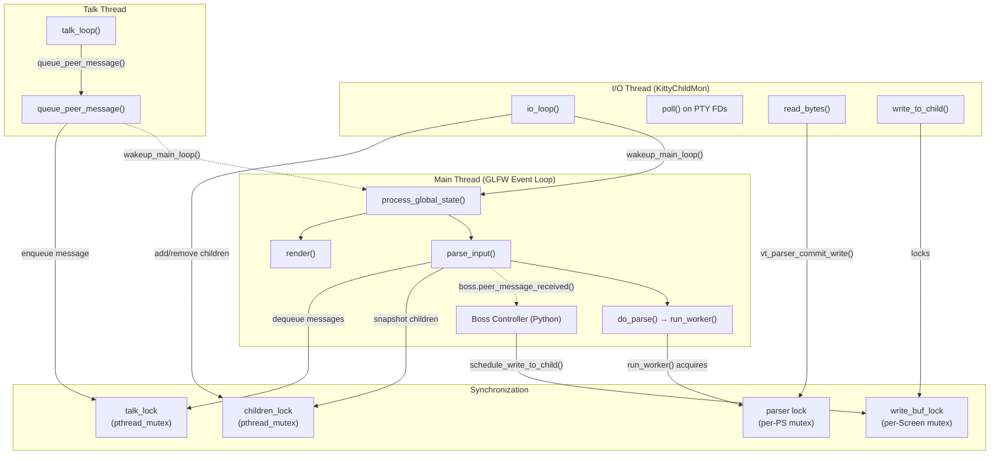
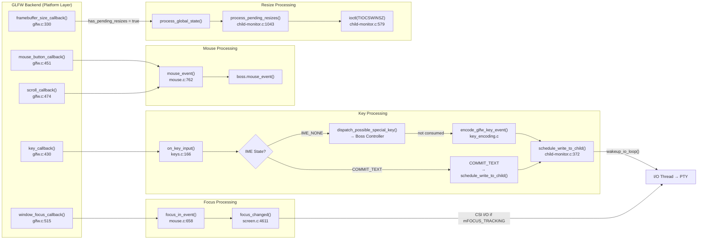
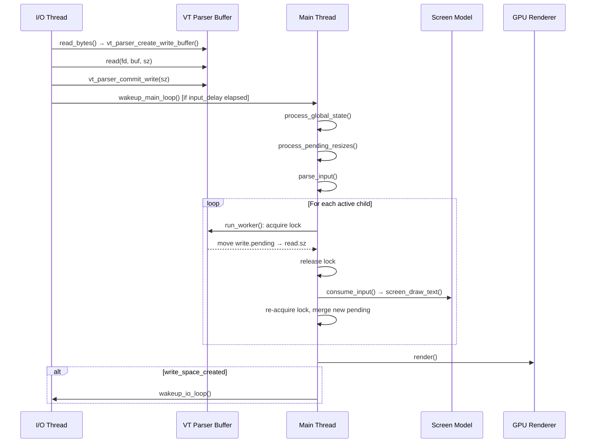

# Kitty Terminal Interaction Pipeline: A Code-Grounded Deep Dive

## Abstract

This document is an onboarding guide for developers joining the Kitty terminal emulator codebase. It traces the complete lifecycle of terminal interaction — from the instant raw bytes arrive at a PTY file descriptor or a keystroke fires a GLFW callback, through the VT parser state machine and screen model, to the point where the GPU renders a stable, coherent frame. Every claim in this document is grounded in specific source files, functions, and line numbers. No behavior is assumed; the code is treated as the sole source of truth.

The reader will find answers to five core questions:

1. **Where does raw input first enter the system** when a surge of bytes arrives from the PTY or a session is paused and resumed?
2. **What internal conductor** manages timing, ordering, and state handoffs between the system's threads?
3. **How does shell integration interleave** with ordinary text, keeping screen state, command context, and input meaning aligned?
4. **How does the system behave under backpressure** — when a remote connection is unstable or buffers are nearly full?
5. **What mechanisms prevent the many moving parts** from slowly drifting out of sync?

---

## Table of Contents

- [1. Executive Summary: The Three-Thread Architecture](#1-executive-summary-the-three-thread-architecture)
- [2. Input Ingestion: Where Raw Bytes Enter](#2-input-ingestion-where-raw-bytes-enter)
  - [2.1 PTY Data from the I/O Thread](#21-pty-data-from-the-io-thread)
  - [2.2 GLFW Keyboard Callback Path](#22-glfw-keyboard-callback-path)
- [3. Orchestration and Ordering: The Unseen Conductor](#3-orchestration-and-ordering-the-unseen-conductor)
  - [3.1 The Main-Thread Tick: process_global_state()](#31-the-main-thread-tick-process_global_state)
  - [3.2 The input_delay Coalescing Mechanism](#32-the-input_delay-coalescing-mechanism)
  - [3.3 The parse_input() Main-Thread Dispatch](#33-the-parse_input-main-thread-dispatch)
  - [3.4 The VT Parser run_worker() Produce-Consume Loop](#34-the-vt-parser-run_worker-produce-consume-loop)
- [4. The VT Parser State Machine](#4-the-vt-parser-state-machine)
- [5. Shell Integration: OSC 133 Marker Flow](#5-shell-integration-osc-133-marker-flow)
  - [5.1 Marker Emission by the Shell](#51-marker-emission-by-the-shell)
  - [5.2 Marker Parsing in the VT Parser](#52-marker-parsing-in-the-vt-parser)
  - [5.3 Prompt Marking in the Screen Model](#53-prompt-marking-in-the-screen-model)
- [6. Backpressure and Degraded Conditions](#6-backpressure-and-degraded-conditions)
  - [6.1 VT Parser Buffer Saturation (POLLIN Suppression)](#61-vt-parser-buffer-saturation-pollin-suppression)
  - [6.2 Write Buffer Cap (100 MiB)](#62-write-buffer-cap-100-mib)
  - [6.3 input_delay as Burst Coalescing](#63-input_delay-as-burst-coalescing)
  - [6.4 Pause Rendering as Visual Stability](#64-pause-rendering-as-visual-stability)
- [7. Additional Input Pipelines](#7-additional-input-pipelines)
  - [7.1 The Paste Pipeline](#71-the-paste-pipeline)
  - [7.2 The Resize Pipeline](#72-the-resize-pipeline)
  - [7.3 The Focus Event Pipeline](#73-the-focus-event-pipeline)
  - [7.4 Remote Control (Talk Thread) Pipeline](#74-remote-control-talk-thread-pipeline)
- [8. End-to-End Coherence: How the Parts Stay in Sync](#8-end-to-end-coherence-how-the-parts-stay-in-sync)

---

## How to Read This Document

Code references in this document follow the convention:

- **`file_path:function_name():line_range`** — for references to specific functions with line numbers.
- **`file_path:line_range`** — for references to data structures, macros, or specific lines without a function context.

For example, `kitty/child-monitor.c:io_loop():1481-1578` refers to the `io_loop()` function in `kitty/child-monitor.c`, spanning lines 1481 through 1578.

All line numbers are from the repository at the time of writing. If a function has moved, search for its name — the logic described will remain accurate.

---

## 1. Executive Summary: The Three-Thread Architecture

Kitty's terminal interaction pipeline is built around a **three-thread architecture**. Understanding these three threads — and the synchronization primitives that connect them — is the single most important concept for navigating the codebase.

### Why Three Threads?

A terminal emulator has three fundamentally different timing requirements:

1. **UI rendering must never block on I/O.** If the main thread is waiting for a PTY `read()` that takes 50ms (e.g., over SSH), the window becomes unresponsive. A dedicated **I/O thread** handles all PTY reads and writes via `poll()`.
2. **Parsing and rendering must be coordinated.** The **main thread** runs the GLFW event loop, parses buffered VT data, manages the screen model, and drives GPU rendering — all in a single-threaded tick to avoid complex locking of the screen state.
3. **Remote control must not block I/O.** External processes can send commands to Kitty via Unix domain sockets. A dedicated **talk thread** handles socket I/O for these peers.

### The Threads in Code

The three threads are created and managed by the `ChildMonitor` object, defined in `kitty/child-monitor.c:49-62`:

```c
typedef struct {
    PyObject_HEAD
    PyObject *dump_callback, *update_screen, *death_notify;
    unsigned int count;
    bool shutting_down;
    pthread_t io_thread, talk_thread;  // <-- the two auxiliary threads
    int talk_fd, listen_fd;
    Message *messages;
    size_t messages_capacity, messages_count;
    LoopData io_loop_data;
    void (*parse_func)(void*, ParseData*, bool);
} ChildMonitor;
```

Thread creation happens in `kitty/child-monitor.c:start():281-295`:

```c
static PyObject *
start(PyObject *s, PyObject *a UNUSED) {
    ChildMonitor *self = (ChildMonitor*)s;
    int ret;
    if (self->talk_fd > -1 || self->listen_fd > -1) {
        if ((ret = pthread_create(&self->talk_thread, NULL, talk_loop, self)) != 0) {
            return PyErr_Format(PyExc_OSError, "...");
        }
        talk_thread_started = true;
    }
    ret = pthread_create(&self->io_thread, NULL, io_loop, self);
    // ...
}
```

- The **I/O thread** runs `io_loop()` (`kitty/child-monitor.c:1481`) and is named `"KittyChildMon"` via `set_thread_name()` at line 1489.
- The **main thread** runs the GLFW event loop, with `process_global_state()` (`kitty/child-monitor.c:1224`) as the per-tick orchestrator.
- The **talk thread** runs `talk_loop()`, created conditionally in `start()` at line 286, or lazily via `inject_peer()` at line 256 when the first remote control client connects.

### The Four Mutexes

These threads are synchronized by four mutexes (three global, one per-screen):

| Mutex | Declared At | Protects |
|---|---|---|
| `children_lock` | `kitty/child-monitor.c:87` | The `children[]` array, `add_queue`, `remove_queue`, monitored/reaped PIDs |
| `talk_lock` | `kitty/child-monitor.c:87` | The `messages[]` array between the talk thread and the main thread |
| `write_buf_lock` | `kitty/screen.h:116` (per-Screen) | `screen->write_buf`, `write_buf_used`, `write_buf_sz` — the outbound data buffer for each child |
| `lock` (per-parser) | `kitty/vt-parser.c:206` (per-PS) | The VT parser's internal buffer cursors (`read.pos`, `read.sz`, `write.pending`) |

### Thread Architecture Diagram



**Rationale:** The mutex hierarchy is designed so that locks are held for the minimum possible duration. In particular, `children_lock` is never held while performing I/O, and the per-parser `lock` is released *during* the actual parsing loop (see Section 3.4) so the I/O thread can continue writing new data concurrently.

---

## 2. Input Ingestion: Where Raw Bytes Enter

There are two primary paths by which input enters the system:

1. **PTY data** — output from the child process (shell, program) read by the I/O thread.
2. **Platform events** — keystrokes, mouse actions, resize signals, and focus changes delivered by GLFW callbacks on the main thread.

### 2.1 PTY Data from the I/O Thread

The I/O thread's entire lifecycle is contained in a single function:

**`kitty/child-monitor.c:io_loop():1481-1578`**

Here is the essential flow:

#### Step 1: Prepare poll() File Descriptors

Before each `poll()` call, the I/O thread sets up the file descriptor array (lines 1496-1504):

```c
for (i = 0; i < self->count; i++) {
    screen = children[i].screen;
    children_fds[EXTRA_FDS + i].events =
        vt_parser_has_space_for_input(screen->vt_parser) ? POLLIN : 0;
    screen_mutex(lock, write);
    children_fds[EXTRA_FDS + i].events |= (screen->write_buf_used ? POLLOUT : 0);
    screen_mutex(unlock, write);
}
```

**Critical detail at line 1501:** `POLLIN` is set on a child's file descriptor *only if* the VT parser has buffer space. This is the primary backpressure mechanism (see Section 6.1). If the 1 MiB parser buffer is full, the I/O thread simply stops asking `poll()` about that child's data-ready status.

`POLLOUT` is set if there is outbound data to write to the child (e.g., encoded keystrokes), protected by the per-screen `write_buf_lock`.

#### Step 2: poll() with Timeout

The `poll()` call itself (lines 1506-1513) uses a timeout that depends on the `input_delay` coalescing mechanism:

```c
if (has_pending_wakeups) {
    now = monotonic();
    monotonic_t time_delta = OPT(input_delay) - (now - last_main_loop_wakeup_at);
    if (time_delta >= 0)
        ret = poll(children_fds, self->count + EXTRA_FDS, monotonic_t_to_ms(time_delta));
    else ret = 0;
} else {
    ret = poll(children_fds, self->count + EXTRA_FDS, -1);
}
```

When there are no pending wakeups, `poll()` blocks indefinitely (`-1`). When there is pending data but the `input_delay` window hasn't expired, `poll()` uses the remaining delay as its timeout.

#### Step 3: Read Bytes from PTY

When `poll()` reports data-ready on a child's FD (line 1529):

```c
if (children_fds[EXTRA_FDS + i].revents & (POLLIN | POLLHUP)) {
    data_received = true;
    has_more = read_bytes(children_fds[EXTRA_FDS + i].fd, children[i].screen);
    if (!has_more) {
        children[i].needs_removal = true;  // child is dead
    }
}
```

The `read_bytes()` function (`kitty/child-monitor.c:1337-1356`) bridges the gap between the I/O thread and the VT parser:

1. **Get a write buffer** — calls `vt_parser_create_write_buffer(screen->vt_parser, &available_buffer_space)` at line 1341.
2. **Read from the PTY** — calls `read(fd, buf, available_buffer_space)` at line 1345.
3. **Commit the write** — calls `vt_parser_commit_write(screen->vt_parser, len)` at line 1354.

#### Step 4: The VT Parser Buffer API

The VT parser exposes a three-function API for thread-safe buffer management, defined in `kitty/vt-parser.c`:

**`vt_parser_create_write_buffer()` (lines 1450-1462):**
```c
uint8_t*
vt_parser_create_write_buffer(Parser *p, size_t *sz) {
    PS *self = (PS*)p->state;
    with_lock {
        self->write.offset = self->read.sz + self->write.pending;
        *sz = BUF_SZ - self->write.offset;
        self->write.sz = *sz;
        ans = self->buf + self->write.offset;
    } end_with_lock;
    return ans;
}
```

This acquires the parser lock, calculates the write offset beyond already-committed data, and returns a pointer *into the parser's own buffer*. The I/O thread then writes directly into this region **without holding the lock**.

**`vt_parser_commit_write()` (lines 1464-1474):**
```c
void
vt_parser_commit_write(Parser *p, size_t sz) {
    PS *self = (PS*)p->state;
    with_lock {
        size_t off = self->read.sz + self->write.pending;
        if (self->new_input_at == 0) self->new_input_at = monotonic();
        if (self->write.offset > off) memmove(self->buf + off, self->buf + self->write.offset, sz);
        self->write.pending += sz;
        self->write.sz = 0;
    } end_with_lock;
}
```

This acquires the lock, stamps `new_input_at` on the first write (so the main thread knows when fresh data arrived), handles buffer compaction via `memmove` if needed, and atomically increments `write.pending`.

**`vt_parser_has_space_for_input()` (lines 1476-1484):**
```c
bool
vt_parser_has_space_for_input(const Parser *p) {
    PS *self = (PS*)p->state;
    with_lock {
        ans = self->read.sz + self->write.pending < BUF_SZ;
    } end_with_lock;
    return ans;
}
```

Returns `true` if the combined already-read and pending-write data is less than `BUF_SZ`. The buffer size is defined at `kitty/vt-parser.c:18`:

```c
#define BUF_SZ (1024u*1024u)  // 1 MiB
```

**Rationale:** The 1 MiB buffer provides ample space for burst transfers (e.g., `cat large_file.txt`) while keeping memory usage bounded. The two-phase write API (create buffer → commit) allows the I/O thread to perform the potentially slow `read()` system call without holding the parser lock.

#### Step 5: Write Data to the Child

When `poll()` reports a child's FD is writable (line 1539):

```c
if (children_fds[EXTRA_FDS + i].revents & POLLOUT) {
    write_to_child(children[i].fd, children[i].screen);
}
```

`write_to_child()` (`kitty/child-monitor.c:1443-1478`) acquires the screen's `write_buf_lock`, writes buffered data to the PTY FD in a loop, and compacts the buffer.

### 2.2 GLFW Keyboard Callback Path

The second major input path is platform events, delivered by GLFW callbacks on the main thread.

#### Callback Registration

All callbacks are registered in a single block in `kitty/glfw.c:1277-1293`:

```c
glfwSetWindowFocusCallback(glfw_window, window_focus_callback);          // line 1281
glfwSetFramebufferSizeCallback(glfw_window, framebuffer_size_callback);  // line 1285
glfwSetLiveResizeCallback(glfw_window, live_resize_callback);            // line 1286
glfwSetMouseButtonCallback(glfw_window, mouse_button_callback);          // line 1288
glfwSetScrollCallback(glfw_window, scroll_callback);                     // line 1291
glfwSetKeyboardCallback(glfw_window, key_callback);                      // line 1292
```

#### The Key Event Pipeline

When the user presses a key, the following chain executes:

**1. `key_callback()` — `kitty/glfw.c:430-442`**

Sets the callback OS window context, updates modifier state (on non-macOS platforms), and calls `on_key_input(ev)` at line 439 if the window is ready and it's not a synthetic focus-change event.

**2. `on_key_input()` — `kitty/keys.c:166-273`**

This is the core key processing function. It first branches on IME (Input Method Editor) state at line 187:

| IME State | Line | Action |
|---|---|---|
| `GLFW_IME_WAYLAND_DONE_EVENT` | 188 | Updates overlay text for composition display |
| `GLFW_IME_PREEDIT_CHANGED` | 195 | Updates overlay text and repositions IME cursor |
| `GLFW_IME_COMMIT_TEXT` | 200 | Sends committed text directly via `schedule_write_to_child()` |
| `GLFW_IME_NONE` | 207 | Normal key processing (described below) |

For normal key processing (`GLFW_IME_NONE`):

1. **Shortcut dispatch** (lines 226-241): On press/repeat, calls `dispatch_possible_special_key()` on the Python Boss controller. If the Boss consumes the key (returns `True`), processing stops — the key was a Kitty shortcut.

2. **DECARM check** (line 243): If `mDECARM` mode is off and this is a repeat event, the key is discarded.

3. **Scroll-back-to-bottom** (line 247): On any key press while scrolled back, automatically scrolls to the bottom of the terminal.

4. **Key encoding** (line 251): Calls `encode_glfw_key_event()` which respects the current key encoding mode — legacy, CSI u, or Kitty Keyboard Protocol — and produces the appropriate escape sequence.

5. **Send to child** (line 259): `schedule_write_to_child(w->id, 1, encoded_key, size)` queues the encoded bytes for the I/O thread to write.

**3. `schedule_write_to_child()` — `kitty/child-monitor.c:323-377`**

This is implemented as a C macro (`schedule_write_to_child_generic`, lines 323-369) for zero-copy handling of variable argument lists:

1. Acquires `children_lock` (line 334).
2. Finds the child by window ID (line 336).
3. Acquires `screen->write_buf_lock` (line 338).
4. Checks the **100 MiB write buffer cap** (line 341): `if (screen->write_buf_used + sz > 100 * 1024 * 1024)` — logs error and discards data if exceeded.
5. Copies data into `screen->write_buf` (lines 354-355).
6. Calls `wakeup_io_loop()` (line 363) to signal the I/O thread that outbound data is available.
7. Releases both locks.

**Rationale:** The 100 MiB cap prevents runaway memory growth if a child process stops reading (e.g., it's suspended with Ctrl+Z). The wakeup ensures the I/O thread will poll for `POLLOUT` on the next iteration.

### GLFW Callback Chain Diagram

The following diagram shows how platform events are registered via GLFW callbacks (`kitty/glfw.c:1277-1293`) and route through the application to reach the Boss controller or the child process:



---

## 3. Orchestration and Ordering: The Unseen Conductor

If the terminal interaction pipeline is a busy junction with many simultaneous flows, the **main-thread tick cycle** is the unseen conductor. It is not a separate scheduling entity — it *is* the main thread, executing a carefully ordered sequence of operations on every GLFW event loop iteration.

### 3.1 The Main-Thread Tick: process_global_state()

The central orchestrator is `process_global_state()` in `kitty/child-monitor.c:1224-1256`:

```c
static void
process_global_state(void *data) {
    ChildMonitor *self = data;
    maximum_wait = -1;                          // line 1227
    monotonic_t now = monotonic();              // line 1231
    if (global_state.has_pending_resizes) {
        process_pending_resizes(now);           // line 1233
        input_read = true;
    }
    if (parse_input(self)) input_read = true;   // line 1236
    render(now, input_read);                    // line 1237
    report_reaped_pids();                       // line 1244
    if (global_state.has_pending_closes)
        should_quit = process_pending_closes(self); // line 1246
    update_main_loop_timer(state_check_timer,
        MAX(0, maximum_wait), state_check_timer_enabled); // line 1255
}
```

The execution order is deliberate and invariant:

1. **Reset the tick timer** (`maximum_wait = -1`) — ensures each tick re-calculates how long to wait.
2. **Process pending resizes** — debounces resize events before they trigger layout reflow.
3. **Parse all input** — `parse_input()` consumes VT parser buffers from *all* children, dispatches talk-thread messages, and handles dead children.
4. **Render** — sends the updated screen state to the GPU.
5. **Report reaped PIDs** — notifies Python callbacks about dead child processes.
6. **Process pending closes** — handles window/tab closure requests.
7. **Update the timer** — sets the next tick deadline based on `maximum_wait`.

This function is the entry point passed to `run_main_loop()` at `kitty/child-monitor.c:main_loop():1259-1262`:

```c
static PyObject*
main_loop(ChildMonitor *self, PyObject *a UNUSED) {
    state_check_timer = add_main_loop_timer(1000, true, do_state_check, self, NULL);
    run_main_loop(process_global_state, self);
    // ...
}
```

A `state_check_timer` with a 1-second fallback interval (line 1261) ensures the system doesn't stall if no events are pending — it acts as a safety net.

### 3.2 The input_delay Coalescing Mechanism

The `input_delay` option controls how frequently the I/O thread wakes the main thread. This is critical because `wakeup_main_loop()` can be expensive on some platforms (particularly macOS Cocoa, where it involves cross-thread Objective-C message dispatch).

The coalescing logic lives in the I/O thread's main loop, `kitty/child-monitor.c:io_loop():1562-1570`:

```c
#define WAKEUP { wakeup_main_loop(); last_main_loop_wakeup_at = now; has_pending_wakeups = false; }
    if (data_received) {
        if ((now = monotonic()) - last_main_loop_wakeup_at > OPT(input_delay)) WAKEUP
        else has_pending_wakeups = true;
    } else {
        if (has_pending_wakeups &&
            (now = monotonic()) - last_main_loop_wakeup_at > OPT(input_delay)) WAKEUP
    }
```

**How it works:**

- After data is received, the I/O thread checks if enough time has elapsed since the last wakeup (`now - last_main_loop_wakeup_at > OPT(input_delay)`).
  - **If yes:** Wakes the main loop immediately.
  - **If no:** Sets `has_pending_wakeups = true`. On the next `poll()` iteration, the remaining delay is used as the `poll()` timeout (lines 1506-1510), ensuring the main loop is eventually woken.
- If no data was received but there are pending wakeups, the same delay check applies — this handles the case where `poll()` timed out.

**On the main thread side**, `do_parse()` (`kitty/child-monitor.c:438-448`) completes the feedback loop:

```c
if (pd.input_read) {
    if (pd.write_space_created) wakeup_io_loop(self, false);  // line 442
    if (screen->paused_rendering.expires_at) {
        set_maximum_wait(MAX(0, screen->paused_rendering.expires_at - now));
    } else set_maximum_wait(OPT(input_delay) - pd.time_since_new_input);  // line 445
} else if (pd.has_pending_input)
    set_maximum_wait(OPT(input_delay) - pd.time_since_new_input);  // line 446
```

- If input was read, `maximum_wait` is set to the remaining `input_delay` minus the time since new input arrived — scheduling the next tick for when the delay expires.
- If `write_space_created` is true (the parser buffer was full and space was just freed), the I/O thread is woken so it can resume reading.

**Rationale:** This design batches rapid-fire data (e.g., `cat /dev/urandom | xxd`) into fewer main-thread ticks, dramatically reducing CPU overhead on data-heavy workloads.

### 3.3 The parse_input() Main-Thread Dispatch

`parse_input()` (`kitty/child-monitor.c:451-538`) is the main thread's "dispatcher." It processes three categories of work:

**Phase A: Snapshot active children (lines 456-483)**

```c
children_mutex(lock);
while (remove_queue_count) {
    // dequeue removed children into remove_notify[]
}
count = self->count;
for (size_t i = 0; i < count; i++) {
    scratch[i] = children[i];
    INCREF_CHILD(scratch[i]);
}
children_mutex(unlock);
```

The `children_lock` is held only long enough to copy the children array into a local `scratch[]` snapshot. This ensures the I/O thread can add/remove children without contention.

**Phase B: Dispatch talk-thread messages (lines 487-514)**

```c
talk_mutex(lock);
if (UNLIKELY(self->messages_count)) {
    msgs = malloc(sizeof(Message) * self->messages_count);
    memcpy(msgs, self->messages, sizeof(Message) * self->messages_count);
    msgs_count = self->messages_count;
    memset(self->messages, 0, sizeof(Message) * self->messages_capacity);
    self->messages_count = 0;
}
talk_mutex(unlock);

for (size_t i = 0; i < msgs_count; i++) {
    resp = PyObject_CallMethod(global_state.boss,
        "peer_message_received", "y#KO", ...);  // line 504
}
```

Messages are bulk-copied from the talk thread's queue under `talk_lock`, then dispatched to Python without any lock held — preventing the talk thread from blocking on main-thread Python execution.

**Phase C: Parse child input (lines 528-533)**

```c
for (size_t i = 0; i < count; i++) {
    if (!scratch[i].needs_removal) {
        if (do_parse(self, scratch[i].screen, now, false)) input_read = true;
    }
    DECREF_CHILD(scratch[i]);
}
```

Each active child's buffered VT data is parsed via `do_parse()`, which calls `run_worker()`.

### 3.4 The VT Parser run_worker() Produce-Consume Loop

`run_worker()` (`kitty/vt-parser.c:1417-1446`) is the heart of the parsing pipeline. Its lock management pattern is crucial to understand:

```c
static void
run_worker(void *p, ParseData *pd, bool flush) {
    Screen *screen = (Screen*)p;
    PS *self = (PS*)screen->vt_parser->state;
    with_lock {
        // Move pending I/O-thread data into the read region
        self->read.sz += self->write.pending;       // line 1421
        self->write.pending = 0;
        pd->has_pending_input = self->read.pos < self->read.sz;  // line 1422

        if (pd->has_pending_input) {
            pd->time_since_new_input = pd->now - self->new_input_at;
            // Parse if: flushing, delay expired, or buffer nearly full
            if (flush || pd->time_since_new_input >= OPT(input_delay)
                || self->read.sz + 16 * 1024 > BUF_SZ) {         // line 1425
                pd->input_read = true;
                self->read.consumed = 0;

                do {
                    end_with_lock; {                               // RELEASE lock
                        consume_input(self, ...);                  // line 1432
                    } with_lock;                                   // RE-ACQUIRE lock
                    self->read.sz += self->write.pending;          // merge new data
                    self->write.pending = 0;                       // line 1434
                } while (self->read.pos < self->read.sz);         // line 1435

                self->new_input_at = 0;                            // line 1436
                if (self->read.consumed) {
                    pd->write_space_created = self->read.sz >= BUF_SZ; // line 1438
                    // compact buffer
                    self->read.pos -= MIN(self->read.pos, self->read.consumed);
                    self->read.sz -= MIN(self->read.sz, self->read.consumed);
                    if (self->read.sz)
                        memmove(self->buf, self->buf + self->read.consumed, self->read.sz);
                }
            }
        }
    } end_with_lock;
}
```

**The lock-release-parse-reacquire pattern (lines 1430-1435)** is the key insight:

1. The main thread acquires the parser lock.
2. It moves `write.pending` (staged by the I/O thread) into `read.sz`.
3. It **releases the lock** before calling `consume_input()`, which may take significant time for large data.
4. After parsing, it **re-acquires the lock** and merges any new `write.pending` data that arrived during parsing.
5. This continues until all data is consumed.

**Why this matters:** While the main thread is parsing (step 3), the I/O thread can simultaneously call `vt_parser_create_write_buffer()` and `vt_parser_commit_write()` to stage new data. This prevents the I/O thread from ever blocking on a long parse operation.

The threshold at line 1425 (`self->read.sz + 16 * 1024 > BUF_SZ`) forces parsing even if `input_delay` hasn't expired when the buffer is nearly full (within 16 KB of `BUF_SZ`). This prevents buffer-full deadlocks.

After parsing, if the buffer was at capacity, `pd->write_space_created` is set to `true` (line 1438), which triggers `do_parse()` to call `wakeup_io_loop()` — telling the I/O thread it can re-enable `POLLIN`.

### Main-Thread Tick Sequence Diagram



---

## 4. The VT Parser State Machine

The VT parser converts raw bytes into screen operations via a state machine defined in `kitty/vt-parser.c`.

### State Enumeration

`kitty/vt-parser.c:160-162`:

```c
typedef enum VTEState {
    VTE_NORMAL, VTE_ESC = ESC, VTE_CSI = ESC_CSI, VTE_OSC = ESC_OSC,
    VTE_DCS = ESC_DCS, VTE_APC = ESC_APC, VTE_PM = ESC_PM, VTE_SOS = ESC_SOS
} VTEState;
```

| State | Description |
|---|---|
| `VTE_NORMAL` | Default: UTF-8 text and single-byte controls (BEL, BS, HT, LF, CR) |
| `VTE_ESC` | After `ESC` (0x1B): awaiting escape sequence type |
| `VTE_CSI` | Control Sequence Introducer: `ESC [` — cursor movement, mode changes, SGR attributes |
| `VTE_OSC` | Operating System Command: `ESC ]` — window title, colors, hyperlinks, shell integration |
| `VTE_DCS` | Device Control String: `ESC P` — response strings |
| `VTE_APC` | Application Program Command: `ESC _` — Kitty graphics protocol |
| `VTE_PM` | Privacy Message: `ESC ^` |
| `VTE_SOS` | Start of String: `ESC X` |

### Parser State Structure

`kitty/vt-parser.c:193-211` (the `PS` struct):

```c
typedef struct PS {
    alignas(BUF_EXTRA) uint8_t buf[BUF_SZ + BUF_EXTRA]; // 1 MiB + 64 bytes
    UTF8Decoder utf8_decoder;
    id_type window_id;
    VTEState vte_state;
    ParsedCSI csi;
    PyObject *dump_callback;
    Screen *screen;
    monotonic_t now, new_input_at;
    pthread_mutex_t lock;
    struct { size_t consumed, pos, sz; } read;          // read cursor tracking
    struct { size_t offset, sz, pending; } write;       // write staging from I/O thread
} PS;
```

The `BUF_EXTRA` (64 bytes, `512u/8u`, line 20) allows SIMD-accelerated string scanning to safely load beyond the buffer end without page faults.

### Input Consumption Dispatch

`consume_input()` (`kitty/vt-parser.c:1367-1407`) dispatches on the current state:

```c
switch (self->vte_state) {
    case VTE_NORMAL:
        consume_normal(self); self->read.consumed = self->read.pos; break;
    case VTE_ESC:
        if (consume_esc(self)) { self->read.consumed = self->read.pos; }
        break;
    case VTE_CSI:
        if (consume_csi(self)) { ... dispatch_csi(self); SET_STATE(NORMAL); }
        break;
    case VTE_OSC:
        consume(osc);
    case VTE_APC:
        consume(apc);
    // ... DCS, PM, SOS similarly
}
```

### Normal Text Path

`consume_normal()` (`kitty/vt-parser.c:230-240`) is the hot path for regular text:

```c
static void
consume_normal(PS *self) {
    do {
        const bool sentinel_found = utf8_decode_to_esc(
            &self->utf8_decoder,
            self->buf + self->read.pos,
            self->read.sz - self->read.pos);
        self->read.pos += self->utf8_decoder.num_consumed;
        if (self->utf8_decoder.output.pos) {
            screen_draw_text(self->screen,
                self->utf8_decoder.output.storage,
                self->utf8_decoder.output.pos);
        }
        if (sentinel_found) { SET_STATE(ESC); break; }
    } while (self->read.pos < self->read.sz);
}
```

The UTF-8 decoder uses SIMD-optimized scanning (`utf8_decode_to_esc`) to find the next `ESC` byte while decoding multi-byte sequences. When text is decoded, it is passed to `screen_draw_text()` in batches — this is the fundamental "data arrives → cells are filled" operation.

**Rationale:** The SIMD scanning and batch text insertion minimize per-character overhead, making Kitty competitive with native text throughput benchmarks.

### OSC Dispatch

`dispatch_osc()` (`kitty/vt-parser.c:457-569`) routes OSC codes to their handlers. The relevant cases for the terminal interaction pipeline include:

| OSC Code | Handler | Line | Purpose |
|---|---|---|---|
| 0, 1, 2 | `set_title()`, `set_icon()` | 480-492 | Window title and icon |
| 7 | `process_cwd_notification()` | 505 | Current working directory updates |
| 8 | `dispatch_hyperlink()` | 508 | Hyperlink annotations |
| 52, 5522 | `clipboard_control()` | 531-535 | Clipboard access |
| **133** | **`shell_prompt_marking()`** | **536-546** | **Shell integration markers (see Section 5)** |

---

## 5. Shell Integration: OSC 133 Marker Flow

Shell integration is how Kitty distinguishes between prompt text, command text, and command output. It works through **OSC 133 markers** — invisible escape sequences that the shell emits at semantic boundaries.

### 5.1 Marker Emission by the Shell

For Bash, the markers are defined in `shell-integration/bash/kitty.bash`:

**Prompt Start (OSC 133;A) — line 239:**
```bash
_ksi_prompt[ps1]+="\[\e]133;D;\$?\a\e]133;A\a\]"
```

This is prepended to `PS1` and emits *two* markers in sequence:
- `ESC ] 133;D;<exit_status> BEL` — Command Done, with the exit status of the previous command.
- `ESC ] 133;A BEL` — Prompt Start.

**Secondary Prompt (OSC 133;A;k=s) — line 137:**
```bash
_ksi_prompt[secondary_prompt]="\n${_ksi_prompt[start_secondary_mark]}\[\e]133;A;k=s\a\]..."
```

For multiline prompts, lines before the last line are marked as secondary prompts (parameter `k=s`). This prevents Kitty from erasing them on terminal resize.

**PS2 Secondary Prompt — line 240:**
```bash
_ksi_prompt[ps2]+="\[\e]133;A;k=s\a\]"
```

The continuation prompt (`PS2`) is also marked as a secondary prompt.

**Command Start (OSC 133;C) — line 208:**
```bash
builtin printf "\e]133;C;cmdline=%q\a" "$last_cmd"
```

Emitted in `PS0` (before the command executes), carrying the command line text as the `cmdline` parameter.

### 5.2 Marker Parsing in the VT Parser

When the VT parser encounters an OSC code of 133, `dispatch_osc()` (`kitty/vt-parser.c:536-546`) handles it:

```c
case 133:
    if (limit > i) {
        buf[limit] = 0;  // null-terminate (safe: BUF_EXTRA provides padding)
        shell_prompt_marking(self->screen, (char*)buf + i);
    }
    break;
```

**Critical detail:** This executes **inline during the parse loop** — there is no separate queue or deferred processing for shell markers. The marker is applied to the screen model immediately, in the same main-thread tick as the surrounding text. This guarantees that prompt markers and their associated text are always consistent.

### 5.3 Prompt Marking in the Screen Model

`shell_prompt_marking()` (`kitty/screen.c:2328-2356`) inspects the first character of the OSC 133 payload:

```c
void
shell_prompt_marking(Screen *self, char *buf) {
    if (self->cursor->y < self->lines) {
        char ch = buf[0];
        switch (ch) {
            case 'A': {
                PromptKind pk = PROMPT_START;
                self->prompt_settings.redraws_prompts_at_all = 1;
                self->prompt_settings.uses_special_keys_for_cursor_movement = 0;
                parse_prompt_mark(self, buf+1, &pk);
                self->linebuf->line_attrs[self->cursor->y].prompt_kind = pk;
                if (pk == PROMPT_START)
                    CALLBACK("cmd_output_marking", "O", Py_False);
            } break;
            case 'C': {
                self->linebuf->line_attrs[self->cursor->y].prompt_kind = OUTPUT_START;
                const char *cmdline = "";
                if (strstr(buf + 1, ";cmdline") == buf + 1) {
                    cmdline = buf + 2;
                }
                CALLBACK("cmd_output_marking", "OO", Py_True, c);
            } break;
            case 'D': {
                const char *exit_status = buf[1] == ';' ? buf + 2 : "";
                CALLBACK("cmd_output_marking", "Os", Py_None, exit_status);
            } break;
        }
    }
}
```

| Marker | Payload | Line | Effect |
|---|---|---|---|
| **A** (Prompt Start) | `;k=s` for secondary | 2332-2339 | Sets `line_attrs[cursor->y].prompt_kind = PROMPT_START` (or `SECONDARY_PROMPT`). Resets `prompt_settings`. Invokes `cmd_output_marking(False)`. |
| **C** (Command Start) | `;cmdline=<text>` | 2340-2348 | Sets `prompt_kind = OUTPUT_START`. Extracts cmdline text. Invokes `cmd_output_marking(True, cmdline)`. |
| **D** (Command Done) | `;<exit_status>` | 2350-2353 | Invokes `cmd_output_marking(None, exit_status)` — signals the command has finished. |

**The `parse_prompt_mark()` helper** (`kitty/screen.c:2316-2325`) parses semicolon-delimited parameters like `k=s`, `redraw=0`, `special_key=1`.

### How Markers Stay Coherent with Text

The key insight is that markers annotate **line-level attributes** (`linebuf->line_attrs[y].prompt_kind`) without disrupting the text insertion cursor or the text flow. Consider this sequence arriving from the shell:

```
\e]133;D;0\a           ← Command Done (exit status 0)
\e]133;A\a             ← Prompt Start
user@host:~$           ← Visible prompt text
\e]133;C;cmdline=ls\a  ← Command Start
```

When the VT parser encounters `ESC ] 133;D;0 BEL`:
1. It switches to `VTE_OSC` state.
2. Accumulates until the `BEL` terminator.
3. Calls `dispatch_osc()` → `shell_prompt_marking()`.
4. The screen's `cmd_output_marking` callback is invoked.
5. The parser returns to `VTE_NORMAL`.

Immediately after, the parser encounters `ESC ] 133;A BEL`, repeating the same cycle. Then `user@host:~$ ` is processed as normal text via `consume_normal()` → `screen_draw_text()`.

At no point does the marker processing displace the cursor, modify cell contents, or interfere with the UTF-8 decoder state. The line attribute is a metadata annotation, orthogonal to the cell data.

---

## 6. Backpressure and Degraded Conditions

A terminal emulator must gracefully handle situations where data arrives faster than it can be processed, or where a remote connection introduces latency and packet loss.

### 6.1 VT Parser Buffer Saturation (POLLIN Suppression)

The primary backpressure mechanism is the conditional `POLLIN` flag in the I/O thread.

**`kitty/child-monitor.c:io_loop():1501`:**
```c
children_fds[EXTRA_FDS + i].events =
    vt_parser_has_space_for_input(screen->vt_parser) ? POLLIN : 0;
```

**`kitty/vt-parser.c:vt_parser_has_space_for_input():1476-1484`:**
```c
bool
vt_parser_has_space_for_input(const Parser *p) {
    PS *self = (PS*)p->state;
    with_lock {
        ans = self->read.sz + self->write.pending < BUF_SZ;
    } end_with_lock;
    return ans;
}
```

When `read.sz + write.pending >= BUF_SZ` (i.e., the 1 MiB buffer is full):

1. `POLLIN` is **not set** for that child's FD.
2. `poll()` does not report data-ready for that child.
3. The kernel buffers the PTY output.
4. Eventually, the kernel's PTY buffer fills, and the child process blocks on `write()`.
5. **Natural backpressure propagates** all the way to the source.

**Recovery:** After the main thread parses data, `run_worker()` (`kitty/vt-parser.c:1438`) sets `pd->write_space_created = true` if the buffer was at capacity. Then `do_parse()` (`kitty/child-monitor.c:442`) calls `wakeup_io_loop()`, which causes the I/O thread to re-evaluate `POLLIN` on its next iteration.

### 6.2 Write Buffer Cap (100 MiB)

The outbound write buffer (data from Kitty to the child) has a hard cap of 100 MiB.

**`kitty/child-monitor.c:schedule_write_to_child_generic():341`:**
```c
if (screen->write_buf_used + sz > 100 * 1024 * 1024) {
    log_error("Too much data being sent to child with id: %lu, ignoring it", id);
    screen_mutex(unlock, write);
    break;
}
```

This scenario can occur if:
- The child process is suspended (Ctrl+Z) and the user pastes a very large amount of text.
- A remote control script sends data faster than the child can consume it.

When the cap is hit, new data is silently discarded with a log error. The existing buffered data is preserved and will be written when the child resumes reading.

### 6.3 input_delay as Burst Coalescing

The `input_delay` mechanism (detailed in Section 3.2) serves a secondary role as a burst coalescing tool:

- When a large file is `cat`-ed, thousands of `read()` calls may complete in rapid succession.
- Without coalescing, each would trigger a `wakeup_main_loop()`, causing thousands of main-thread ticks per second.
- With `input_delay` (typically 3ms), the I/O thread batches these reads and signals the main thread at most once per `input_delay` window.

The result: the main thread parses larger chunks of data per tick, amortizing the overhead of Python callback invocations, `run_worker()` lock acquisition, and GPU rendering setup.

### 6.4 Pause Rendering as Visual Stability

Applications can request that the terminal **freeze the display** while performing complex screen updates, preventing visual tearing or flicker.

**`screen_pause_rendering()` — `kitty/screen.c:2506-2543`:**

When pausing (line 2518 onward):

1. Allocates a `GraphicsManager` for the snapshot if needed (line 2519).
2. Sets `expires_at = monotonic() + ms_to_monotonic_t(for_in_ms)` (line 2522), defaulting to 2000ms (line 2521).
3. Copies the entire visible screen state into the `paused_rendering` struct:
   - `cursor` position and attributes (line 2527)
   - `color_profile` (line 2528)
   - `linebuf` (line buffer with all cell data, lines 2529-2538)
   - `scrolled_by` (line 2524)
   - `selections` and `url_ranges` (lines 2540-2541)
   - Graphics (images) state (line 2542)

While paused, the GPU renders from the snapshot. The live screen model continues to be updated by the parser, but those updates are invisible until the pause expires or is canceled.

The `paused_rendering` struct is defined in `kitty/screen.h:159-168`:

```c
struct {
    monotonic_t expires_at;
    Cursor cursor;
    ColorProfile color_profile;
    bool inverted, cell_data_updated, cursor_visible;
    unsigned int scrolled_by;
    LineBuf *linebuf;
    GraphicsManager *grman;
    Selections selections, url_ranges;
} paused_rendering;
```

**Expiration check — `screen_check_pause_rendering()` — `kitty/screen.c:2489-2491`:**

```c
void
screen_check_pause_rendering(Screen *self, monotonic_t now) {
    if (self->paused_rendering.expires_at && now > self->paused_rendering.expires_at)
        screen_pause_rendering(self, false, 0);
}
```

When called with `pause=false`, the snapshot is discarded, `expires_at` is reset to 0, and `is_dirty` is set to `true` to force a GPU re-upload of the live screen state (line 2511).

**Integration with the tick cycle:** `do_parse()` (`kitty/child-monitor.c:443-444`) checks for active pause rendering and schedules a tick at the expiration time:

```c
if (screen->paused_rendering.expires_at) {
    set_maximum_wait(MAX(0, screen->paused_rendering.expires_at - now));
}
```

**Rationale:** This mechanism is used by programs like `vim`, `tmux`, and TUI frameworks that perform multi-step screen updates. Without pause rendering, intermediate states (half-drawn windows, cleared-then-redrawn regions) would be visible as flicker.

---

## 7. Additional Input Pipelines

Beyond PTY data and keystrokes, several other input types flow through the system.

### 7.1 The Paste Pipeline

When the user pastes text (e.g., via Ctrl+V or middle-click), the following chain executes:

**`kitty/window.py:paste_text():1713-1725`:**

```python
def paste_text(self, text: Union[str, bytes]) -> None:
    if text and not self.destroyed:
        if isinstance(text, str):
            text = text.encode('utf-8')
        if self.screen.in_bracketed_paste_mode:
            text = sanitize_for_bracketed_paste(text)
        else:
            text = text.replace(b'\r\n', b'\n').replace(b'\n', b'\r')
        self.screen.paste(text)
```

If the terminal is in bracketed paste mode (`mBRACKETED_PASTE`, defined in `kitty/screen.h:17`), the text is sanitized to remove any escape sequences that could be interpreted as the end of a bracketed paste.

**At the C level — `kitty/screen.c:4586-4588`:**

```c
if (allow_bracketed_paste && self->modes.mBRACKETED_PASTE)
    write_escape_code_to_child(self, ESC_CSI, BRACKETED_PASTE_START);
write_to_child(self, data, sz);
if (allow_bracketed_paste && self->modes.mBRACKETED_PASTE)
    write_escape_code_to_child(self, ESC_CSI, BRACKETED_PASTE_END);
```

The paste data is wrapped in `CSI 200~` (start) and `CSI 201~` (end) sequences when bracketed paste mode is active. This tells the shell or application to treat the data as pasted text rather than typed keystrokes — preventing accidental command execution from pasted content.

### 7.2 The Resize Pipeline

Terminal resizing is a multi-stage pipeline with debouncing:

**1. GLFW callback — `kitty/glfw.c:framebuffer_size_callback():330-346`:**

```c
static void
framebuffer_size_callback(GLFWwindow *w, int width, int height) {
    if (!set_callback_window(w)) return;
    global_state.has_pending_resizes = true;
    change_live_resize_state(global_state.callback_os_window, true);
    window->live_resize.last_resize_event_at = monotonic();
    window->live_resize.width = MAX(0, width);
    window->live_resize.height = MAX(0, height);
    window->live_resize.num_of_resize_events++;
    request_tick_callback();
}
```

The callback records the new size and timestamps, sets `has_pending_resizes = true`, and requests a tick — but does **not** immediately resize the terminal.

**OS notification path — `kitty/glfw.c:live_resize_callback():316-327`:**

Some platforms (macOS, Wayland) provide explicit "resize started/ended" notifications:

```c
static void
live_resize_callback(GLFWwindow *w, bool started) {
    global_state.callback_os_window->live_resize.from_os_notification = true;
    change_live_resize_state(global_state.callback_os_window, true);
    if (!started) {
        global_state.callback_os_window->live_resize.os_says_resize_complete = true;
    }
}
```

**2. Debounce — `kitty/child-monitor.c:process_pending_resizes():1043-1080`:**

```c
static void
process_pending_resizes(monotonic_t now) {
    global_state.has_pending_resizes = false;
    for (size_t i = 0; i < global_state.num_os_windows; i++) {
        OSWindow *w = global_state.os_windows + i;
        if (w->live_resize.in_progress) {
            bool update_viewport = false;
            if (w->live_resize.from_os_notification) {
                if (w->live_resize.os_says_resize_complete) update_viewport = true;
                else if ((now - w->live_resize.last_resize_event_at) >
                         OPT(resize_debounce_time).on_pause) update_viewport = true;
            } else {
                if (now - w->live_resize.last_resize_event_at >=
                    OPT(resize_debounce_time).on_end) update_viewport = true;
            }
            if (update_viewport) {
                update_os_window_viewport(w, true);
                change_live_resize_state(w, false);
            }
        }
    }
}
```

Two debounce timers are used:
- `on_pause` — during a live resize from an OS notification, reflow the screen when the user pauses resizing (so they can preview the result).
- `on_end` — without OS notifications, wait for the resize events to stop arriving.

**3. PTY resize — `kitty/child-monitor.c:pty_resize():577-589` and `resize_pty():592-614`:**

After viewport update, the Python layer calls `resize_pty()`, which executes:

```c
static bool
pty_resize(int fd, struct winsize *dim) {
    while(true) {
        if (ioctl(fd, TIOCSWINSZ, dim) == -1) {
            if (errno == EINTR) continue;
            // error handling
        }
        break;
    }
    return true;
}
```

The `TIOCSWINSZ` ioctl sends a `SIGWINCH` signal to the child process group, informing the shell and any running programs of the new terminal dimensions.

### 7.3 The Focus Event Pipeline

When the window gains focus:

**`kitty/glfw.c:window_focus_callback():515-549`:**

```c
static void
window_focus_callback(GLFWwindow *w, int focused) {
    if (focused) {
        show_mouse_cursor(w);
        focus_in_event();       // line 530
        // ...
    }
    if (is_window_ready_for_callbacks()) {
        WINDOW_CALLBACK(on_focus, "O", focused ? Py_True : Py_False);
        // Update IME state
    }
}
```

**`kitty/mouse.c:focus_in_event():658-669`:**

```c
void
focus_in_event(void) {
    mouse_cursor_shape = TEXT_POINTER;
    Window *w = window_for_event(&window_idx, &in_tab_bar);
    if (w && w->render_data.screen) {
        screen_mark_url(w->render_data.screen, 0, 0, 0, 0);  // clear URL highlights
        set_mouse_cursor_for_screen(w->render_data.screen);
    }
    set_mouse_cursor(mouse_cursor_shape);
}
```

If the terminal has `mFOCUS_TRACKING` mode enabled, a focus-change escape sequence (`CSI I` for focus-in, `CSI O` for focus-out) is sent to the child process. This is handled in `kitty/screen.c:focus_changed():4611`:

```c
if (self->modes.mFOCUS_TRACKING)
    write_escape_code_to_child(self, ESC_CSI, has_focus ? "I" : "O");
```

### 7.4 Remote Control (Talk Thread) Pipeline

External processes communicate with Kitty via Unix domain sockets. The flow is:

**1. Message arrival — talk thread reads from peer sockets.**

**2. `queue_peer_message()` — `kitty/child-monitor.c:1653-1670`:**

```c
static void
queue_peer_message(ChildMonitor *self, Peer *peer) {
    talk_mutex(lock);
    ensure_space_for(self, messages, Message, self->messages_count + 16, ...);
    Message *m = self->messages + self->messages_count++;
    if (peer->read.used) {
        m->data = malloc(peer->read.used);
        memcpy(m->data, peer->read.data, peer->read.used);
        m->sz = peer->read.used;
    }
    m->peer_id = peer->id;
    m->is_remote_control_peer = peer->is_remote_control_peer;
    talk_mutex(unlock);
    wakeup_main_loop();  // line 1669
}
```

The message is deep-copied under `talk_lock`, then `wakeup_main_loop()` signals the main thread.

**3. Dispatch — `parse_input()` dequeues messages (lines 487-514)** and calls `boss.peer_message_received()` at line 504, which routes the command to the appropriate handler in Python.

---

## 8. End-to-End Coherence: How the Parts Stay in Sync

With three threads, multiple mutexes, and several data paths, how does Kitty prevent the system from drifting into an inconsistent state?

### Synchronization Mechanisms Summary

| Mechanism | Location | What It Protects | Pattern |
|---|---|---|---|
| `children_lock` | `kitty/child-monitor.c:87` | `children[]`, `add_queue`, `remove_queue` | Held briefly for queue operations; never during I/O |
| `talk_lock` | `kitty/child-monitor.c:87` | `messages[]` array | Held briefly for bulk copy; Python dispatch is lock-free |
| `write_buf_lock` | `kitty/screen.h:116` (per-Screen) | `write_buf`, `write_buf_used`, `write_buf_sz` | Held by I/O thread for `write_to_child()` and by main thread for `schedule_write_to_child()` |
| Per-parser `lock` | `kitty/vt-parser.c:206` | Buffer cursors (`read.*`, `write.*`) | Released during actual parsing to allow concurrent I/O writes |
| `wakeup_loop()` | `kitty/loop-utils.h:48` | Cross-thread signaling | Non-blocking via eventfd or self-pipe |
| `drain_fd()` | `kitty/loop-utils.h:76-87` | Spurious wakeup prevention | Drains the eventfd/pipe after each wakeup to prevent re-firing |
| `input_delay` coalescing | `kitty/child-monitor.c:1562-1570` | Main-thread wakeup frequency | Batches rapid I/O into fewer ticks |

### The Single-Writer Principle

The most important coherence guarantee is structural: **only the main thread mutates the screen model**. The screen's line buffers, cursor position, color profile, mode flags, and selection state are only modified in `parse_input()` → `do_parse()` → `run_worker()` → `consume_input()` → `screen_*()` functions, all running on the main thread.

The I/O thread interacts with two carefully isolated interfaces:
- The **VT parser buffer** (via `vt_parser_create_write_buffer()` / `vt_parser_commit_write()`) — a staging area that the main thread drains.
- The **screen write buffer** (via `write_to_child()`) — an outbound buffer that the main thread fills.

Neither of these interfaces touches the screen's visual state.

### Cross-Thread Wakeup Mechanism

Thread wakeups use the `LoopData` abstraction in `kitty/loop-utils.h:31-43`:

```c
typedef struct {
#ifndef HAS_EVENT_FD
    int wakeup_fds[2];  // self-pipe fallback for macOS/OpenBSD
#endif
    sigset_t signals;
    int wakeup_read_fd;
    int signal_read_fd;
    // ...
} LoopData;
```

On Linux, `eventfd` is used for zero-copy, constant-memory signaling. On macOS/OpenBSD, a self-pipe pair is used as a fallback. Both mechanisms are polled alongside the PTY file descriptors.

**`drain_fd()` (`kitty/loop-utils.h:76-87`)** reads and discards all pending data from the wakeup fd after each signal:

```c
static inline void
drain_fd(int fd) {
    static uint8_t drain_buf[1024];
    while(true) {
        ssize_t len = read(fd, drain_buf, sizeof(drain_buf));
        if (len < 0) {
            if (errno == EINTR) continue;
            break;
        }
        if (len > 0) continue;
        break;
    }
}
```

This prevents spurious wakeups: if the I/O thread receives a wakeup signal but drains the fd before checking for work, it won't be tricked into thinking new work arrived.

### Why It All Works Together

The terminal interaction pipeline achieves coherence through these layered guarantees:

1. **Isolation**: Each thread has a clearly defined data domain. Cross-domain access happens only through locked staging areas (parser buffer, write buffer, message queue).

2. **Ordering**: The main-thread tick (`process_global_state()`) imposes a total order: resize → parse → render → cleanup. Within parsing, children are processed sequentially.

3. **Coalescing**: The `input_delay` mechanism prevents timing-dependent race conditions by ensuring the main thread processes data in stable batches rather than reacting to every individual byte.

4. **Inline markers**: Shell integration markers are processed synchronously during parsing, not in a deferred queue. This guarantees that a marker and its surrounding text are always in the same parse batch, preventing state drift.

5. **Backpressure**: The `POLLIN` suppression and `BUF_SZ` limit prevent unbounded memory growth, while the `write_space_created` feedback loop ensures the system recovers automatically when the main thread catches up.

6. **Snapshot rendering**: Pause rendering provides a last-resort coherence mechanism for applications that cannot tolerate intermediate visual states — the display is frozen at a known-good point and only unfrozen after the update completes.

These mechanisms work together to ensure that even under extreme conditions — rapid-fire data, unstable connections, concurrent resize and paste operations — the terminal presents a consistent, responsive interface.

---

*This document was generated from analysis of the Kitty terminal emulator source code. All line numbers reference the codebase at the time of writing.*
