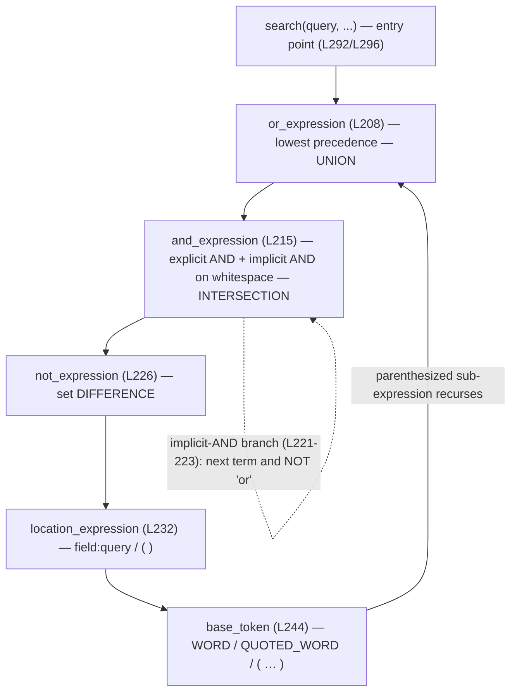

# kitty search: why combining terms with `or` **and spaces** excludes matches

> **User question (verbatim):**
> "When I combine multiple search terms with 'or' and spaces, the results don't match what I expect. Items that should clearly match at least one term are being excluded entirely."

**Short answer:** This is **not a bug.** In kitty's boolean match syntax a **bare space between two terms is an implicit `AND`** (set intersection), so a space‑separated query keeps only the items matching *every* term and therefore correctly excludes items that match only one term. To "match any of these terms," put an **explicit `or`** between complete `field:query` terms.

| Item | Value |
|------|-------|
| Repository | [kovidgoyal/kitty](https://github.com/kovidgoyal/kitty) |
| Commit investigated | `815df1e210e0a9ab4622f5c7f2d6891d7dbeddf1` |
| Branch | `kitty_815df1e210e0` |
| Subject module | `kitty/search_query_parser.py` (296 lines, pure Python) |
| Real entry point | `search(...)` — `kitty/search_query_parser.py:L292` (body `L296`) |
| Real consumers | `kitty/boss.py` → `match_windows` (`L471`), `match_tabs` (`L505`) — the `--match` / `--match-tab` code path |
| Interpreter used (observed) | **CPython 3.13.7** (see note below) |
| Verdict | **Expected, intended, documented, conventional syntax — not a defect** |

> **Grounding of the table above.** Every entry is **Observed** or **From source** (per the tag key in *"How to read this document"* below); none is a bare assertion.
> - **Repository** — identifies the upstream kitty project (`github.com/kovidgoyal/kitty`). *(The working checkout's `origin` is a Blitzy mirror of that project; the upstream identity is what the citations refer to.)*
> - **Commit investigated** (`815df1e…`) — **Observed** from source control: it is the base commit this work derives from and an ancestor of the current `HEAD`; the subject module is byte‑identical between the two, so every `file:line` citation below remains valid.
> - **Branch** (`kitty_815df1e210e0`) — **Observed**: the source branch this deliverable is named after exists as `origin/kitty_815df1e210e0`.
> - **Subject module**, its **296‑line** length, and its **pure‑Python** nature — **From source `kitty/search_query_parser.py`** (the line count and stdlib‑only imports are re‑derived in the reproducibility appendix, section (f), and section (a)).
> - **Real entry point** and **real consumers** — **From source `kitty/search_query_parser.py:L292` (body `L296`)** and **`kitty/boss.py:L471,L505`** (walked through in section (b)).
> - **Interpreter** — **Observed** (`python3 --version` → `Python 3.13.7`; see the note directly below).

> **Note on the interpreter version.** The task brief anticipated CPython 3.12.3, but the container's actual canonical interpreter — the one this investigation actually ran — is **CPython 3.13.7** (Observed: `python3 --version` → `Python 3.13.7`; the probe self‑reports `# python 3.13.7`). The parser is pure Python performing deterministic set logic, so the results are interpreter‑independent; every result below was byte‑identical across two runs. This document reports the **actually observed** interpreter to stay faithful to the run‑first, be‑exact methodology.

---

## How to read this document

Every factual statement is tagged so you can tell measurement from reasoning:

- **Observed:** — a fact captured by *actually running* the parser (real runtime output).
- **From source `file:Lnn`:** — a fact read directly from the code at the cited line(s) at this commit.
- **Inferred:** — read‑only interpretation/reasoning built on the two kinds of evidence above (no code was executed to establish it, and no file was modified to test it).

All work here was **read‑only**: no repository source file was modified, and the only temporary probe used to gather evidence lived outside the repository and was deleted afterwards.

---

## (a) Verdict — this is *not* a bug

**Direct answer:** The exclusion you are seeing is **correct, intended behavior**, not a defect.

kitty's `--match` / `--match-tab` selectors accept a small boolean query language whose operators are `or`, `and`, `not`, and parentheses `( )`. The one operator that is easy to miss is the one you never type:

- **From source `kitty/search_query_parser.py:L221-223`:** inside `and_expression`, after parsing one operand, if the next token is another term (`WORD` / `QUOTED_WORD`) or an opening `(` **and it is not the word `or`**, the parser folds it in as an `AND`. The source comment on that branch reads exactly `# Account for the optional 'and'`.

In other words, **whitespace between terms is treated as `AND`.** So:

- `title:apple title:banana` is parsed as `title:apple` **AND** `title:banana` → it returns only items whose title contains *both* words. **Observed:** `[4]` (the single‑term matches `1` and `2` are excluded — this reproduces your complaint exactly).
- `title:apple or title:banana` is parsed as `title:apple` **OR** `title:banana` → it returns items matching *either* term. **Observed:** `[1, 2, 4]` (this is the form you want).

**Inferred (the likely source of the confusion):** the space *looks* like an innocuous separator, and kitty's own documented examples always place an explicit `and`/`or` between terms and never show a bare space standing in for `AND` (see section (e)). A reader who mixes an `or` with stray spaces — for example `title:apple or title:banana title:cherry` — silently gets an `AND` where they expected the list to continue as an `OR`, and matches "disappear."

**The fix (section (e)):** use an explicit `or` between complete `field:query` terms, and use parentheses to control grouping when you combine `or` with other operators.

---

## (b) The mechanism — how the query is actually parsed

### The real parser module

**From source:** the boolean match grammar is implemented by a single recursive‑descent parser in **`kitty/search_query_parser.py`** (296 lines, pure Python). **Inferred (verified by repo‑wide grep):** it is the *only* module that implements this grammar; the only Python code that imports it is `kitty/boss.py:L475`, `kitty/boss.py:L509`, and the unit test `kitty_tests/search_query_parser.py:L11`. No other search implementation in the repository has boolean `or`/`and` operators (see *Candidate disambiguation* at the end).

### The recursive‑descent grammar and its precedence

**From source `kitty/search_query_parser.py:L208-278`:** parsing descends through one function per precedence level. Because the lowest‑precedence operator is parsed *outermost* (it is the last to bind), the call chain encodes the precedence:

| Level (function) | Line | Operator | Set operation | Binding |
|------------------|------|----------|---------------|---------|
| `or_expression`       | `L208` (spots `or` at `L210`) | `or`        | **union** | loosest |
| `and_expression`      | `L215` (explicit `and` at `L217-219`; **implicit `AND` at `L221-223`**) | `and` / *space* | **intersection** | ↕ |
| `not_expression`      | `L226` (spots `not` at `L227`) | `not`       | **set difference** | ↕ |
| `location_expression` | `L232` (parentheses / `field:query`) | `( … )`     | grouping | — |
| `base_token`          | `L244` (`WORD` / `QUOTED_WORD` / `(`) | a single term | leaf | tightest |

**Precedence, highest → lowest binding: `NOT` > `AND` > `OR`.** This is why `title:apple or title:banana title:cherry` groups as `apple OR (banana AND cherry)` — `AND` (here the implicit space between `banana` and `cherry`) binds tighter than `or` (demonstrated in section (c)).



### The decisive implicit‑`AND` branch (the root cause)

**From source `kitty/search_query_parser.py:L215-224`:**

```python
def and_expression(self) -> SearchTreeNode:
    lhs = self.not_expression()
    if self.lcase_token() == 'and':          # L217  explicit 'and'
        self.advance()
        return AndNode(lhs, self.and_expression())

    # Account for the optional 'and'          # L221  (verbatim comment)
    if ((self.token_type() in (TokenType.WORD, TokenType.QUOTED_WORD) or self.token() == '(') and self.lcase_token() != 'or'):
        return AndNode(lhs, self.and_expression())   # L223
    return lhs
```

After the parser reads one operand, if the **next** token is a term (or a `(`) and is **not** the word `or`, it wraps both sides in an `AndNode`. A bare space is not a token at all — the lexer discards whitespace (**From source `L127`:** the rule `(r'\s+', None)` produces no token) — so two adjacent terms separated only by spaces fall straight into this branch and become an `AND`.

### Set semantics of each node

**From source** — the boolean nodes implement plain set algebra:

- **`OrNode` — union.** `L65`: `return lhs.union(self.rhs(candidates.difference(lhs), get_matches))`. The result is the union of the two operands' match sets. *(Inferred efficiency detail: the right‑hand side is evaluated only over candidates the left side did not already match; this does not change the union result.)*
- **`AndNode` — intersection by narrowing.** `L79-81`: `lhs = self.lhs(candidates, get_matches)` then `return self.rhs(lhs, get_matches)`. The right side searches **only** the left side's matches, so the result is the intersection of both operands.
- **`NotNode` — set difference.** `L95`: `return candidates.difference(self.rhs(candidates, get_matches))` — everything in the candidate set that does **not** match the operand.
- **`TokenNode` — one `field:query` term.** `L109`: `return get_matches(self.location, self.query, candidates)`. It defers to the injected `get_matches` callback, so a single term reduces the candidate set to the items whose `field` matches `query`.

### The real entry point

**From source `kitty/search_query_parser.py:L292-296`:**

```python
def search(
    query: str, locations: Union[str, Tuple[str, ...]], universal_set: Set[T], get_matches: GetMatches[T],
    allow_no_location: bool = False,
) -> Set[T]:
    return build_tree(query, locations, allow_no_location).search(universal_set, get_matches)
```

`search()` (`L292`, body `L296`) builds the parse tree and evaluates it against `universal_set` using the caller‑supplied `get_matches`. This is the exact function exercised in section (c), the same one the unit test calls (`kitty_tests/search_query_parser.py:L19`).

### The real consumers (the `--match` / `--match-tab` code path)

**From source `kitty/boss.py`:** the parser has exactly two runtime callers:

- `match_windows` (`def` at `L471`) imports `from .search_query_parser import search` (`L475`) and calls `search(match, ('id','title','pid','cwd','cmdline','num','env','var','recent','state','neighbor'), set(self.window_id_map), get_matches)` (`L493-495`). Its `get_matches` (`L491`) delegates each term to `Window.matches_query`.
- `match_tabs` (`def` at `L505`) imports `search` (`L509`) and calls `search(match, ('id','index','title','window_id','window_title','pid','cwd','env','var','cmdline','recent','state'), set(tim), get_matches)` (`L529-531`). Its `get_matches` (`L526`) delegates each term to `Tab.matches_query`.

**From source (and important):** neither call passes `allow_no_location`, so both rely on the default **`allow_no_location=False`** (`Parser.__init__`, `L148`). **Inferred:** that default is exactly why a bare word with no `field:` prefix raises an error on the real remote‑control path (section (d)).

### The per‑term field evaluators (wired in as `get_matches`)

**From source:**

- `kitty/window.py:L784` — `def matches_query(self, field, query, active_tab=None, self_window=None) -> bool` evaluates one term against a single window.
- `kitty/tabs.py:L800` — `def matches_query(self, field, query, active_tab_manager=None) -> bool` evaluates one term against a single tab; for the `title` field it uses `re.search(query, self.effective_title)` (`L801-802`), i.e. the `query` is a regular expression.

### Why this runs under plain CPython (no C build)

**From source `kitty/types.py:L8-9`:** the parser's only internal dependency, `kitty.types`, imports the C extension only under type‑checking:

```python
if TYPE_CHECKING:
    from kitty.fast_data_types import SingleKey
```

**Inferred:** because that import is guarded by `TYPE_CHECKING`, and the parser otherwise imports only the standard library (`re`, `enum`, `functools`, `gettext`, `typing` — `kitty/search_query_parser.py:L3-7`) plus `kitty.types.run_once` (`L9`), the parser executes under a plain CPython interpreter with **no compiled `fast_data_types` build required**. This is what makes the run‑first investigation below possible without building kitty.

---


## (c) Reproduced runtime output (Observed)

**Observed.** The following was produced by exercising the real `search()` entry point under **CPython 3.13.7**, mirroring the canonical invocation in `kitty_tests/search_query_parser.py:L1-30`. The test universe maps ids to titles and a substring `get_matches` stands in for kitty's per‑field evaluator:

- Universe (id → title): `{1:'apple pie', 2:'banana split', 3:'cherry cake', 4:'apple banana cherry smoothie', 5:'date bar'}`
- `locations = 'title'`
- `universal_set = set(universe)` = `{1, 2, 3, 4, 5}`
- `get_matches(location, query, candidates) = {x for x in candidates if query in universe[x]}`

Each line shows the query and the sorted result set. **The output was byte‑identical across two consecutive runs (deterministic).**

```text
'title:apple title:banana'                   => [4]         # spaces => implicit AND; single-term matches 1,2 EXCLUDED (reproduces the complaint)
'title:apple or title:banana'                => [1, 2, 4]   # explicit OR => matches EITHER term (the fix)
'title:apple or title:banana title:cherry'   => [1, 4]      # precedence: apple OR (banana AND cherry)
'title:apple and title:banana'               => [4]         # explicit AND == implicit space
'apple or banana'                            => ParseException: No location specified before apple
'title:"a or b"'                             => []          # quoted: interior 'or' is data, not an operator
'title:apple OR title:banana'                => [1, 2, 4]   # operators are case-insensitive
'not title:apple'                            => [2, 3, 5]   # NOT => set difference
'(title:apple or title:banana) title:cherry' => [4]         # parentheses override precedence
'title:apple or (title:banana'               => ParseException: missing )
```

> The `=> …` values above are **Observed** runtime output; the `# …` annotations are added explanations. The raw, un‑annotated program output and the probe source are reproduced in the *Reproducibility appendix* (section (f)).

### Tracing each result back to the grammar

For reference, the three single‑term result sets over this universe are **Observed:** `title:apple → {1,4}`, `title:banana → {2,4}`, `title:cherry → {3,4}`. Combining them with the set semantics from section (b):

- **`title:apple title:banana` → `[4]`** — the space is an implicit `AND` (`L221-223`), evaluated by `AndNode` (intersection, `L79-81`): `{1,4} ∩ {2,4} = {4}`. Items `1` and `2` match only one term, so they are correctly excluded. **This is the exact behavior the user reported.**
- **`title:apple or title:banana` → `[1, 2, 4]`** — explicit `or` (`L210`), evaluated by `OrNode` (union, `L65`): `{1,4} ∪ {2,4} = {1,2,4}`. This is the "match any term" result.
- **`title:apple or title:banana title:cherry` → `[1, 4]`** — precedence in action. `AND` binds tighter than `OR`, so this parses as `apple OR (banana AND cherry)`: `{1,4} ∪ ({2,4} ∩ {3,4}) = {1,4} ∪ {4} = {1,4}`. The stray space after `title:banana` quietly created an `AND`.
- **`title:apple and title:banana` → `[4]`** — the explicit `and` branch (`L217-219`) produces the *same* `AndNode` as the space form, hence the identical `[4]`. This proves that a space and an explicit `and` are equivalent.
- **`apple or banana` → `ParseException: No location specified before apple`** — see section (d); a bare word with no `field:` is rejected under the default guard.

---


## (d) Edge cases and secondary conditions

Each of the following was exercised through the same real `search()` entry point.

### Operators are case‑insensitive

- **Observed:** `title:apple OR title:banana` → `[1, 2, 4]` — identical to lower‑case `or`.
- **From source `kitty/search_query_parser.py:L161-167`:** the parser compares operators using `lcase_token`, which returns `res.lower()` (`L167`). So `OR`, `Or`, `AND`, `Not`, etc. are all recognized as operators regardless of case.

### Quoting turns an operator word into data

- **Observed:** `title:"a or b"` → `[]` — no item's title contains the literal substring `a or b`, so the result is empty; crucially it did **not** union anything.
- **From source `kitty/search_query_parser.py:L126`:** the lexer rule `(r'".*?((?<!\\)")', …)` captures a double‑quoted span as a single `QUOTED_WORD`. **Inferred:** therefore the interior `or` inside `"a or b"` is treated as part of the search text, not as the boolean operator. This is how you would search for a literal `or`.

### Unbalanced parentheses are a syntax error

- **Observed:** `title:apple or (title:banana` → `ParseException: missing )`.
- **From source `kitty/search_query_parser.py:L237`:** after consuming a `(` and its inner expression, `location_expression` requires a closing `)`, otherwise it raises `ParseException(_('missing )'))`. (A malformed leading token instead raises `Invalid syntax. Expected a lookup name or a word` at `L240`.)

### `not` performs a set difference

- **Observed:** `not title:apple` → `[2, 3, 5]`.
- **From source `kitty/search_query_parser.py:L95`:** `NotNode` returns `candidates.difference(self.rhs(candidates, get_matches))`, i.e. `{1,2,3,4,5} \ {1,4} = {2,3,5}`. `not` (parsed at `L226-229`) binds tighter than both `and` and `or`.

### A bare word with no `field:` is rejected (the "no location" guard)

- **Observed:** `apple or banana` → `ParseException: No location specified before apple`.
  - Note the exact wording: the offending token appears **without surrounding quotes** — the message is `No location specified before apple`, not `…before 'apple'`.
- **From source `kitty/search_query_parser.py:L143`:** the message is built by `super().__init__(f'No location specified before {tt}')` — an f‑string with no quotes around `{tt}`, which is why `apple` appears bare.
- **From source `kitty/search_query_parser.py:L278`:** a `WORD` that is not a recognized `location:` and is used without `allow_no_location` raises `NoLocation` (the quoted‑word variant is at `L250`, guarded by `L248`).
- **From source `kitty/boss.py:L493-495` and `L529-531`:** the real `--match` / `--match-tab` callers invoke `search(...)` **without** `allow_no_location`, so they use the default `False` (`Parser.__init__`, `L148`). **Inferred:** on the real remote‑control path a bare word therefore always errors — kitty requires every term to name a field, e.g. `title:apple`.

---


## (e) The correct syntax — how to "match any of these terms"

**Rule of thumb:** put an **explicit `or`** between *complete* `field:query` terms, and use **parentheses** to control grouping when you mix `or` with `and` (or with an implicit‑`AND` space).

- **Match either term** (what the user wanted):
  - `title:apple or title:banana` → **Observed:** `[1, 2, 4]`.
- **Match any of three terms:**
  - `title:apple or title:banana or title:cherry` — chain `or` between each complete term.
- **Force "OR first, then narrow":** if you want *(apple or banana)* and then additionally require cherry, parenthesize the `or` so the trailing space‑`AND` applies to the whole group:
  - `(title:apple or title:banana) title:cherry` → **Observed:** `[4]` (the parentheses override the default precedence; compare with the un‑parenthesized `apple OR (banana AND cherry)` in section (c)).

**What to avoid:** mixing `or` with stray spaces between terms, e.g. `title:apple or title:banana title:cherry`. The space is an implicit `AND` that binds tighter than `or`, so this does **not** mean "apple or banana or cherry."

### This matches kitty's own documentation

**From source `docs/remote-control.rst` (the `search_syntax` reference, label `.. _search_syntax:` at `L327`):** the four documented examples (`L340-343`) are:

```text
title:"My special window" or id:43
title:bash and env:USER=kovid
not id:1
(id:2 or id:3) and title:something
```

**Inferred:** every documented example places an **explicit `and`/`or`** between complete `field:query` terms; **none** shows a bare space acting as an implicit `AND`. That omission is the most likely origin of the user's confusion — the space‑as‑`AND` rule is real (section (b)) but under‑illustrated in the prose docs.

The same syntax powers the option help and other selectors:

- **From source `kitty/rc/base.py:L89`** (window) and **`L133`** (tab): the `--match` help says *"Match specifications are of the form: `field:query`."* and points at the `search_syntax` reference (via a reStructuredText `:ref:` role).
- **From source `docs/mapping.rst:L191`:** the keyboard‑mapping `--when-focus-on` window selector reuses the very same `search_syntax` reference, so the rules above apply there too.

> **Documentation‑source note.** `docs/remote-control.rst:L345` contains `.. include:: generated/matching.rst`, but `docs/generated/` is a build‑time artifact that does **not** exist in the source tree at this commit (Observed: `ls docs/generated` → "No such file or directory"). The authoritative source for the syntax is therefore **`docs/remote-control.rst` §`search_syntax`**, cited above.

---

## (f) Reproducibility appendix

**Interpreter (Observed):** CPython **3.13.7** — `python3 --version` → `Python 3.13.7`. *(The task brief anticipated 3.12.3; the container's actual interpreter is 3.13.7. Because the parser is deterministic pure‑Python set logic, the results are interpreter‑independent.)*

**Invocation method:** import and call the real entry point `kitty.search_query_parser.search(...)`, exactly as `kitty_tests/search_query_parser.py:L19` does — no bypass, no synthetic stand‑in.

**Exact commands (run from the repository root):**

```bash
export KITTY_REPO="$(pwd)"
PYTHONDONTWRITEBYTECODE=1 python3 -B /tmp/sqp_probe.py    # run 1
PYTHONDONTWRITEBYTECODE=1 python3 -B /tmp/sqp_probe.py    # run 2 (identical output)
```

**Probe used (kept outside the repository at `/tmp/sqp_probe.py`, then deleted):**

```python
import os, sys
REPO_ROOT = os.environ.get("KITTY_REPO", "<repo root>")
sys.path.insert(0, REPO_ROOT)
from kitty.search_query_parser import ParseException, search

print(f"# python {sys.version.split()[0]}")

universe = {
    1: "apple pie", 2: "banana split", 3: "cherry cake",
    4: "apple banana cherry smoothie", 5: "date bar",
}
locations = "title"
universal_set = set(universe)

def get_matches(location, query, candidates):
    return {x for x in candidates if query in universe[x]}

queries = [
    "title:apple title:banana",
    "title:apple or title:banana",
    "title:apple or title:banana title:cherry",
    "title:apple and title:banana",
    "apple or banana",
    'title:"a or b"',
    "title:apple OR title:banana",
    "not title:apple",
    "(title:apple or title:banana) title:cherry",
    "title:apple or (title:banana",
]
for q in queries:
    try:
        res = search(q, locations, universal_set, get_matches)
        print(f"{q!r:<44} => {sorted(res)}")
    except ParseException as e:
        print(f"{q!r:<44} => ParseException: {e.msg}")
```

**Raw, un‑annotated program output (Observed — identical on both runs):**

```text
# python 3.13.7
'title:apple title:banana'                   => [4]
'title:apple or title:banana'                => [1, 2, 4]
'title:apple or title:banana title:cherry'   => [1, 4]
'title:apple and title:banana'               => [4]
'apple or banana'                            => ParseException: No location specified before apple
'title:"a or b"'                             => []
'title:apple OR title:banana'                => [1, 2, 4]
'not title:apple'                            => [2, 3, 5]
'(title:apple or title:banana) title:cherry' => [4]
'title:apple or (title:banana'               => ParseException: missing )
```

**Determinism.** The parser performs pure set operations with no randomness, so identical inputs yield identical output; the two runs above were byte‑identical. **From source `kitty/search_query_parser.py:L281`:** `build_tree` is additionally memoized with `@lru_cache(maxsize=64)`, so repeated identical queries reuse the same parse tree.

---


## Appendix A — Candidate disambiguation (why this parser, and not the other "search")

The repository contains a second, unrelated thing called "search": **`kittens/diff/search.go`**, a regular‑expression search used inside the diff kitten.

- **From source `kittens/diff/search.go:L7,L20-23`:** it imports `regexp` and defines `type Search struct { pat *regexp.Regexp; matches map[ScrollPos][]Span }`. It is a single‑pattern regex search.
- **Observed (grep):** that file contains **no** boolean `or`/`and` query operators, no `matches_query`, and no reference to `search_query_parser`. It has no multi‑term set semantics, so it cannot produce a "matches at least one term but is excluded" symptom.

**Conclusion (Inferred):** `kittens/diff/search.go` is the **rejected candidate**. The reported behavior is uniquely manifested by **`kitty/search_query_parser.py`** reached through **`kitty/boss.py`**. Repo‑wide, the only Python importers of the parser are `kitty/boss.py:L475`, `kitty/boss.py:L509`, and the test `kitty_tests/search_query_parser.py:L11`.

---

## Appendix B — Industry context (why implicit‑`AND` is a conventional design, not a defect)

*(This section is external framing, not a claim about kitty's source. The claims below are **Web research (observed 2026‑07‑08)** against the first‑party documentation cited under "Sources" at the end of this appendix.)*

Treating an unquoted space between terms as an **implicit boolean operator** is a widespread convention in query languages; the *default* operator simply varies by system:

- **Implicit `AND` — the same choice kitty makes.** Google's Issue Tracker treats a bare space between criteria as an implicit `AND` and uses parentheses for grouping; its documentation states that *"Space characters outside of quotation marks act as implicit AND operators"* and requires operators to be uppercase `AND`/`OR`/`NOT` [G1].
- **Implicit `OR`.** Apache Lucene's classic query‑parser documentation states that *"The OR operator is the default conjunction operator"* — i.e. when no operator appears between two terms, `OR` is used, yielding a set union [L1]. Apache Solr's standard query parser documents the identical default‑`OR` behavior (it is built on Lucene) [S1], while Elasticsearch's `query_string` query exposes a **configurable `default_operator`** whose valid values are `OR` (the default) or `AND` [E1].

What stays consistent across all of them is the remedy for "match any of several values": use an **explicit `OR`**, quote multi‑word phrases, or repeat the field for each value. That is exactly the corrective guidance in section (e), and it confirms that kitty's whitespace‑as‑implicit‑`AND` choice (`kitty/search_query_parser.py:L221-223`) is a **conventional, defensible design decision — not a defect.**

**Sources (Web research, observed 2026‑07‑08):**

- **[G1]** Google Issue Tracker — *Search Query Language*: <https://developers.google.com/issue-tracker/concepts/search-query-language>
- **[L1]** Apache Lucene — *Query Parser Syntax* (classic query parser, "Boolean operators"): <https://lucene.apache.org/core/2_9_4/queryparsersyntax.html>
- **[S1]** Apache Solr Reference Guide — *Standard Query Parser* ("Boolean operators"): <https://solr.apache.org/guide/solr/latest/query-guide/standard-query-parser.html>
- **[E1]** Elasticsearch Reference — *Query string query* (`default_operator`): <https://www.elastic.co/docs/reference/query-languages/query-dsl/query-dsl-query-string-query>

---

## Summary

- **Is it a bug?** No. **From source `kitty/search_query_parser.py:L221-223`** (implicit `AND`) and the observed results in section (c), a space between terms means `AND`, so space‑separated queries intersect and correctly exclude single‑term matches.
- **What's the mechanism?** A recursive‑descent grammar with precedence **`NOT` > `AND` > `OR`**; `OrNode` unions (`L65`), `AndNode` intersects (`L79-81`), `NotNode` differences (`L95`); the real entry point is `search()` (`L292`/`L296`), reached from `kitty/boss.py` `match_windows`/`match_tabs` with the default `allow_no_location=False`.
- **What's the fix?** Use an explicit `or` between complete `field:query` terms — `title:apple or title:banana` (**Observed:** `[1, 2, 4]`) — and parenthesize to control precedence when mixing operators.

